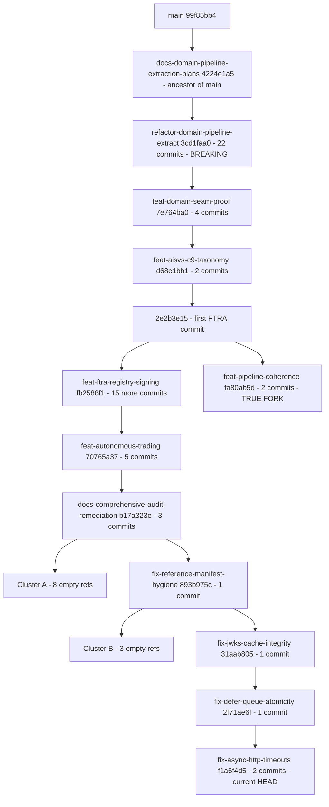

# CAGE Branch Consolidation — Merge Plan

**Document ID:** MERGE_PLAN_2026-09-03
**Repository:** `cybernetic-governance-engine`
**Default branch:** `main` @ `99f85bb4` (local in sync with `origin/main`)
**Current `HEAD`:** `fix/async-http-timeouts-and-low-severity` @ `f1a6f4d5` — switch to `main` before starting
**Scope:** 26 working branches + `main`, 3 open PRs

> **Reference Architecture Note.** CAGE is a reference architecture. This plan
> optimises for **the cleanest resulting code structure**, not for deployment
> safety. There is no production instance to protect, so breaking changes,
> intermediate non-functional states on `main`, and aggressive branch deletion
> are all acceptable when they produce a better final architecture. Adopters
> running a live instance should layer their own release gating on top.

> **Evidence basis.** Branch tips, ancestry, and SHA-identity claims below were
> derived from direct reads of `.git/refs/**`, `.git/packed-refs`, and
> `.git/logs/**` — they are exact. PR numbers and working-tree state were not
> verifiable in Architect mode and are tagged **[UNVERIFIED]**.

---

## Contents

1. [Strategy](#1-strategy)
2. [Topology](#2-topology)
3. [Branch Inventory](#3-branch-inventory)
4. [Merge Sequence](#4-merge-sequence)
5. [Conflict Resolution](#5-conflict-resolution)
6. [Command Appendix](#6-command-appendix)

---

## 1. Strategy

### 1.1 Objective

Collapse 26 branches into `main` such that the final tree has:

- **Clean Layer 1 / Layer 2 separation** — a domain-agnostic kernel in
  `src/gateway/`, domain behaviour in plugins.
- **No domain literals in the kernel** — enforced mechanically by G6
  ([`scripts/check_domain_literals.py`](scripts/check_domain_literals.py)).
- **One canonical implementation per concern** — no duplicate KMS resolvers, no
  legacy adapter shims, no parallel dispatch paths.
- **Zero dead branches** — every ref either merged or deleted.

### 1.2 Architecture-first merge order

The brief's historical order (security fixes first, refactor later) optimises
for shipping urgency. **This plan inverts it**: the refactor lands *first* so
that every subsequent branch is written onto, reviewed against, and tested by
the target architecture. Nothing is merged onto a structure that is about to be
demolished, and nothing has to be reconciled twice.

| Phase | Content | Outcome |
|:--:|---|---|
| 0 | Delete 12 dead refs | Working set 26 → 14 |
| 1 | `refactor/domain-pipeline-extract` | Layer 1/2 split established |
| 2 | Audit + security fixes, consolidated | Fixes land *on* the new architecture |
| 3 | `feat/domain-seam-proof` → `feat/autonomous-trading` | Plugin seam proven, financial domain restored |
| 4 | AISVS → FTRA → pipeline-coherence | Open PR backlog cleared |
| 5 | Backups + residual refs | Only `main` remains |

### 1.3 Breaking changes

The refactor carries **11 documented breaking changes**
([`docs/BREAKING_CHANGES_v3.md`](docs/BREAKING_CHANGES_v3.md)). For a reference
architecture these are **desirable** — they remove the legacy inline-dispatch
design the project is deliberately moving away from. No deprecation window, no
compatibility shims, no dual-path support.

One consequence worth naming so it is not mistaken for a defect: between Phase 1
and Phase 3 the kernel **denies all actions by default**, because the tier
plugins that restore governance behaviour arrive in Phase 3. This is the
intended "hollowing" design. It affects only the intermediate state of `main`
and requires no coordination beyond keeping CI green at each merge.

### 1.4 Non-negotiables

Only four rules bind every phase, all from [`AGENTS.md`](AGENTS.md):

1. **Squash merge only.** `squash-merge-guard` fails on any two-parent merge
   commit reaching `main`.
2. **Rebase after every squash**, then verify the diff:
   `git diff --stat origin/main...<branch>` must show *only* that branch's
   changes.
3. **Never suppress a CI gate** to make a merge pass.
4. **Conventional Commits** PR titles (≤ 72 chars, imperative, `!` + `BREAKING
   CHANGE:` footer coupled together).

---

## 2. Topology

### 2.1 The repository is one linear stack

21 of 26 branches sit on a single ancestral chain, and **12 of them share only 5
distinct tip SHAs**. Eleven branches contain **zero unique commits** — they are
bare pointers created by a rapid `git checkout -b` sequence (visible in the
reflog) against a work-unit table, then never committed to.



Three structural facts follow:

- **Cross-branch conflicts are structurally zero while the stack is intact.**
  For any pair on the chain one branch is an ancestor of the other, so the merge
  base *is* the ancestor. Conflicts in this programme come almost entirely from
  squash-induced SHA divergence, not from genuine divergent edits.
- **The stack was built in reverse of its merge order.** The security fixes sit
  at the *top*, on top of audit remediation, on top of trading, on top of FTRA,
  on top of the refactor. Every branch must therefore be **rebased and its diff
  verified** before its PR opens, or the PR shows the union of the whole stack.
- **Exactly one true fork exists.** `feat/pipeline-coherence` branched at
  `2e2b3e15` (first FTRA commit) while FTRA advanced 15 more commits. This is
  the only genuine three-way merge in the repository — see [§5.2](#52-the-ftra-fork).

### 2.2 CI gates that shape the merge order

| Job | Relevance |
|---|---|
| `squash-merge-guard` | Enforces rule 1 above |
| `domain-literals-check` (**G6**) | **Ships in Phase 1**; retroactively gates Phases 2–4 |
| `pytest-logic` (×3 regions) | US_FED / EU_ECB / APAC_MAS unit suites |
| `distributed-cbf-proof`, `no-direct-bind-proof` | Formal proofs — at risk from Phase 1 module relocations |
| `license-check`, `lint`, `stpa-freshness-check`, `nemo-freshness-check`, `lula-ai600-validation`, `sbom-generate` | Regenerate-don't-hand-edit artifacts |

G6 is the single most important ordering constraint: once it is on `main`, any
branch reintroducing `execute_trade` / `reverse_trade` into `src/gateway/`
fails CI. Landing it in Phase 1 forces every later branch to be *architecturally
correct at merge time* rather than retrofitted afterwards.

---

## 3. Branch Inventory

**Uniq** = commits owned solely by this ref.

| Branch | Tip | Uniq | Phase | Disposition |
|---|---|:--:|:--:|---|
| `main` | `99f85bb4` | — | — | target |
| `docs/domain-pipeline-extraction-plans` | `4224e1a5` | 0 | 0 | 🗑️ ancestor of `main` |
| `feat/env-posture` | `b17a323e` | 0 | 0 | 🗑️ empty |
| `refactor/env-posture-adoption` | `b17a323e` | 0 | 0 | 🗑️ empty |
| `fix/ftra-registry-signature` | `b17a323e` | 0 | 0 | 🗑️ empty |
| `fix/seal-key-and-alg-policy` | `b17a323e` | 0 | 0 | 🗑️ empty |
| `fix/bridge-endpoint-authn` | `b17a323e` | 0 | 0 | 🗑️ empty |
| `fix/seal-verify-before-burn` | `b17a323e` | 0 | 0 | 🗑️ empty |
| `fix/approval-token-secret` | `b17a323e` | 0 | 0 | 🗑️ empty |
| `fix/posture-and-evidence-gates` | `b17a323e` | 0 | 0 | 🗑️ empty |
| `fix/signer-provenance` | `893b975c` | 0 | 0 | 🗑️ empty |
| `fix/resource-lifecycle` | `893b975c` | 0 | 0 | 🗑️ empty |
| `fix/jws-crypto-correctness` | `893b975c` | 0 | 0 | 🗑️ empty |
| `refactor/domain-pipeline-extract` | `3cd1faa0` | 22 | 1 | ✅ merge |
| `docs/comprehensive-audit-remediation` | `b17a323e` | 3 | 2 | ✅ merge |
| `fix/reference-manifest-hygiene` | `893b975c` | 1 | 2 | ⤴️ fold into consolidated PR |
| `fix/jwks-cache-integrity` | `31aab805` | 1 | 2 | ⤴️ fold |
| `fix/defer-queue-atomicity` | `2f71ae6f` | 1 | 2 | ⤴️ fold |
| `fix/async-http-timeouts-and-low-severity` | `f1a6f4d5` | 2 | 2 | ⤴️ fold (stack tip) |
| `feat/domain-seam-proof` | `7e764ba0` | 4 | 3 | ✅ merge |
| `feat/autonomous-trading` | `70765a37` | 5 | 3 | ✅ merge |
| `feat/aisvs-c9-taxonomy` | `d68e1bb1` | 2 | 4 | ✅ merge |
| `feat/ftra-registry-signing` | `fb2588f1` | 16 | 4 | ✅ merge |
| `feat/pipeline-coherence` | `fa80ab5d` | 2 | 4 | ⚠️ merge (true fork) |
| `backup/stash-pipeline-coherence-audit` | `55e0de5a` | stash | 5 | 🔍 assess |
| `backup/stash-pipeline-coherence-wip` | `8e6bfb30` | stash | 5 | 🔍 assess |
| `backup/stash-gpu-scale-to-zero` | `18856d2b` | stash | 5 | 🔍 assess |

All 26 working branches exist on `origin` with identical tips — no pre-push
needed. **Totals:** 12 deletions, 8 merges (59 unique commits), 3 refs folded
into a consolidated PR, 3 stash backups to assess.

> **Branch names ≠ work done.** Ten of the eleven empty refs were named for
> still-open findings (C-1…C-5, H-3…H-8, M-1…M-13) in
> [`plans/security_findings_remediation_plan.md`](plans/security_findings_remediation_plan.md).
> Deleting the branch does not close the finding. Re-cut those branches from the
> post-Phase-2 `main` when the work actually starts.

---

## 4. Merge Sequence

### Phase 0 — Delete dead refs

**Merge:** nothing. **Delete:** 12 refs. **Dependencies:** none.

Twelve refs cannot produce a meaningful PR — eleven have zero unique commits,
one is an ancestor of `main`. Deleting them first shrinks the working set from
26 to 14 and removes the risk of opening an empty PR or mistaking an orphaned
pointer for unmerged work.

**Actions**

1. Run the audit ([§6.2](#62-phase-0-deletion)); every line must read `ahead=0`.
   Any non-zero value halts deletion for that ref.
2. Confirm no open PR uses a deletion-list branch as its head — GitHub
   auto-closes such PRs.
3. Delete local and remote refs in one push each.

Deletion is reversible: every tip SHA is recorded in [§3](#3-branch-inventory),
so `git branch <name> <sha>` restores any ref.

**Exit:** 14 working branches + `main` + 3 backups. No PR auto-closed.

---

### Phase 1 — Foundation architecture

**Merge:** `refactor/domain-pipeline-extract` @ `3cd1faa0` (22 commits)
**Dependencies:** Phase 0

This is the architectural foundation and therefore lands first. Every other
mergeable branch is a descendant of it; merging anything else first would drag
the refactor in as an unreviewed side-effect, and any fix applied to the old
structure would need reconciling a second time once the structure moved.

**What it establishes**

| Change | Architectural effect |
|---|---|
| Tier dispatch infrastructure | Kernel dispatches to plugins instead of inline blocks |
| ~285 lines deleted from `_run_checks()` | Consensus, causal, FRIA, CBF/fiscal logic leaves the kernel |
| CBF engine, fiscal guard, consensus gate, causal gatekeeper, reconciliation worker → Layer 1 | Mechanism separated from policy |
| Domain literals removed from kernel | `hybrid_server.py` warmup, `telemetry_provider.py` filter, `ontology.py` FIN-2 |
| `RefusalReceipt.schema_version` → v3 | Single current receipt schema; no v1 compatibility path |
| `_LegacyConsensusAdapter` deleted, `tool_name`/`action` defaults removed | No implicit fallbacks; callers are explicit |
| **G6 gate added** | Kernel domain-agnosticism enforced mechanically from here on |

**Single squashed PR — do not split.** Intermediate commits leave the kernel in
states that fail CI (e.g. `53622291` deletes dispatch blocks that `4e514c16`'s
infrastructure only partially replaces). The 22 commits are atomic as a set.

**PR title (63 chars):**

```
refactor(governance)!: extract domain pipeline to tier dispatch
```

**Required footer** (`!` and `BREAKING CHANGE:` must both be present):

```
BREAKING CHANGE: 11 breaking changes. Consensus, causal, FRIA, and CBF/fiscal
inline dispatch blocks are deleted from SymbolicGovernor._run_checks() and
restored as GovernanceTierPlugin implementations in a later phase.
RefusalReceipt.schema_version defaults to v3. Domain literals removed from
kernel. revalidate_post_hitl() and pre_check() no longer accept default
action/tool_name. _LegacyConsensusAdapter deleted. The kernel denies all
actions by default until domain plugins are registered.
```

**Highest-risk areas**

| Area | Watch for |
|---|---|
| [`symbolic_governor.py`](src/gateway/governance/symbolic_governor.py) | Largest surface; new `_run_domain_tiers()` replaces the deleted blocks |
| [`contracts.py`](src/gateway/governance/contracts.py) | v3 schema affects `proof_hash`; verify JCS canonicalization |
| CBF / fiscal / consensus relocations | Git rename detection may fail; `distributed-cbf-proof` must still resolve imports |
| `compliance/oscal/component-definition.yaml` | OPA policy path correction must survive |

**Validation**

```bash
uv run pytest tests/ -m "local or unit" -n auto --dist loadscope --no-cov -p no:langsmith --tb=short
uv run pytest tests/ -k "tier or dispatch or refusal_receipt" -v
uv run python scripts/check_domain_literals.py          # G6 — must pass on its own branch
uv run python scripts/check_import_boundaries.py
uv run python proof/model.py && uv run pytest tests/test_no_direct_bind_proof.py -v
uv run python -m proof.distributed_cbf_model && uv run pytest proof/distributed_cbf_model.py -v
uv run mypy src/ && uv run ruff check . && uv run ruff format --check .
CAGE_DEPLOYMENT_REGION=US_FED   uv run pytest tests/ -m us_fed   -v
CAGE_DEPLOYMENT_REGION=EU_ECB   uv run pytest tests/ -m eu_ecb   -v
CAGE_DEPLOYMENT_REGION=APAC_MAS uv run pytest tests/ -m apac_mas -v
```

**Exit:** one `!`-marked squash commit on `main`; G6 green; both formal proofs
green after relocation; all three region postures green; OSCAL/Lula regenerated
for the relocated modules.

---

### Phase 2 — Audit remediation and security fixes

**Merge:** `docs/comprehensive-audit-remediation` (3 commits), then one
consolidated PR carrying the 5 security-fix commits.
**Dependencies:** Phase 1

Both land here, *after* the refactor, so they are written against the final
module layout. Nothing is fixed twice.

**2a — Audit remediation.** Documentation-dominant (458+ corrections across 68
files) plus doc-validation tooling. Wide footprint, shallow semantics — landing
it early minimises rebase noise for everything after. Rebase onto `main` first:
the branch was cut from `feat/autonomous-trading`, so an unrebased PR shows the
entire stack.

**2b — Security fixes, consolidated into one PR.** The four fix refs are one
linear chain, and the tip `f1a6f4d5` already contains all five commits. Opening
four PRs would re-propose the same work three times. Merge the tip once; delete
the three intermediate refs.

| # | Commit | Subject |
|:--:|---|---|
| 1 | `893b975c` | `fix(k8s): reference manifest security hygiene (H-1, H-2, M-10, M-11)` |
| 2 | `31aab805` | `fix(governance): add JWKS cache TTL and provenance tracking` |
| 3 | `2f71ae6f` | `fix(governance): add atomic write-then-notify to defer queue` |
| 4 | `759ec4ec` | `fix(governance): add HTTP timeout enforcement and low-severity fixes` |
| 5 | `f1a6f4d5` | `fix(governance): add explicit KMS algorithm resolution and ECDSA DER conversion tests` |

Rebasing the tip onto the post-refactor `main` replays these five commits onto
the relocated modules. Where a fix targeted code that moved to Layer 1, apply it
at the new location — **never reintroduce the old path to make the patch
apply**.

The KMS algorithm resolver in commit 5 is the **canonical primitive**. Phase 4's
FTRA KMS signing must consume it, not re-implement it — see
[§5.3](#53-single-implementation-per-concern).

**Validation**

```bash
uv run pytest tests/ -m "local or unit" -n auto --dist loadscope --no-cov -p no:langsmith --tb=short
uv run pytest tests/test_http_timeout_enforcement.py tests/test_rollback_exception_handling.py -v
uv run pytest tests/red_team/ -m "red_team and not integration" -v
uv run bandit -r src/ -c pyproject.toml -ll
uv run python scripts/validate_doc_links.py && uv run python scripts/validate_doc_metrics.py
uv run python scripts/check_domain_literals.py          # G6 now active
```

**Exit:** audit docs and all 5 fixes on `main`; `security-scan` green with no
suppressions; K8s manifests use `secretKeyRef`; the 3 intermediate refs deleted;
OSCAL/Lula updated for the touched controls.

---

### Phase 3 — Feature layer

**Merge:** `feat/domain-seam-proof` @ `7e764ba0` (4 commits), then
`feat/autonomous-trading` @ `70765a37` (5 commits)
**Dependencies:** Phase 1 (hard — both implement against tier dispatch)

This phase supplies the plugins the refactor left as a seam, closing the
deny-by-default state on `main`.

**3a — `feat/domain-seam-proof` first.** It is the direct child of the refactor
and delivers the mechanism: a rail seam for plugin-contributed NeMo actions,
plus a **healthcare plugin**. The healthcare plugin is the existence proof that
the tier architecture is domain-generic — landing it before the financial domain
returns means the seam is proven general rather than retrofitted to one caller.

```
f39ac8c4  feat(governance): add rail seam for plugin-contributed NeMo actions
94a85781  feat(governance): add healthcare plugin and config declarations
d3923e53  test(governance): add complete test suite for PR D
7e764ba0  fix(governance): resolve test failures and format codebase
```

**3b — `feat/autonomous-trading` second.** Restores the financial domain as a
Layer 2 plugin and adds the coordination primitive:

```
a7681bb5  test(governance): add Phase 0 observational tests for autonomous trading
6b3d7274  feat(governance): add Finding vocabulary for unified pipeline coordination
105a424a  feat(governance): implement arbitrate() pure function with A0-A6 precedence
97b4fefd  feat(governance): implement domain-agnostic pipeline and autonomous trading bounds
70765a37  fix(tests): resolve failing test suite and signature issues
```

`arbitrate()` implements the A0–A6 precedence specified in
[`plans/unified_pipeline_coordination_design.md`](plans/unified_pipeline_coordination_design.md);
verify the implemented precedence matches the design exactly.

**Two structural checks before opening either PR**

1. **G6.** `feat/autonomous-trading` predates the gate and is the most likely
   branch in the programme to fail it. Any `execute_trade` / `reverse_trade`
   literal must move into the Layer 2 plugin — **never weaken the gate**.
2. **Import boundaries.** Layer 2 plugin packages must not be imported by
   `src/gateway/`. Run `check_import_boundaries.py` on the rebased branch.

**Ancestry note.** `feat/autonomous-trading` was cut from the FTRA tip
`fb2588f1`, so unrebased it carries all 16 FTRA commits. Rebase onto post-3a
`main` and verify the diff shows only its 5 commits. If the trading work turns
out to have a hard dependency on FTRA code, swap Phases 3b and 4 — land FTRA
first and trading immediately after.

**FIN-2.** The ontology constraint deleted in Phase 1 should be re-registered
here as a domain-plugin constraint. If it is not restored, record the gap
explicitly rather than leaving it silently absent.

**Validation**

```bash
uv run pytest tests/ -m "local or unit" -n auto --dist loadscope --no-cov -p no:langsmith --tb=short
uv run pytest tests/ -k "healthcare or plugin or seam" -v
uv run pytest tests/ -k "arbitrate or precedence or finding" -v
uv run python scripts/check_domain_literals.py          # highest-risk gate here
uv run python scripts/check_import_boundaries.py
uv run python -m proof.distributed_cbf_model && uv run pytest proof/distributed_cbf_model.py -v
CAGE_DEPLOYMENT_REGION=US_FED   uv run pytest tests/ -m us_fed   -v
CAGE_DEPLOYMENT_REGION=EU_ECB   uv run pytest tests/ -m eu_ecb   -v
CAGE_DEPLOYMENT_REGION=APAC_MAS uv run pytest tests/ -m apac_mas -v
```

**Exit:** kernel no longer denies by default; G6 and import-boundary checks
green on both PRs; healthcare plugin demonstrates a non-financial domain
end-to-end; FIN-2 restored or gap recorded.

---

### Phase 4 — Open PR chain

**Merge:** `feat/aisvs-c9-taxonomy` @ `d68e1bb1` (2) → `feat/ftra-registry-signing`
@ `fb2588f1` (16) → `feat/pipeline-coherence` @ `fa80ab5d` (2)
**Dependencies:** Phases 1 and 3

> **[UNVERIFIED] PR state.** `gh` was unavailable. Run
> `gh pr list --state all --limit 40 --json number,title,headRefName,state`
> first and map each open PR to its head branch. **Reuse existing PRs — do not
> open duplicates.**

**Order is forced by a type dependency, not by convention.**
`feat/aisvs-c9-taxonomy` adds `EXTERNALLY_REVERSIBLE` to the FTRA severity maps.
Merging FTRA first would put code on `main` referencing an enum member that does
not yet exist.

```
9480ab60  fix(governance): add EXTERNALLY_REVERSIBLE to FTRA severity maps
d68e1bb1  feat(ftra): fix EXTERNALLY_REVERSIBLE taxonomy and add AISVS C9 conformance suite
```

**`feat/ftra-registry-signing` second** — 16 commits implementing terminal
registry signature verification (VEC-005, VEC-008), the S3–S6 signing pipeline,
envelope expiry enforcement, and KMS signing, per
[`plans/ftra_registry_signing_pipeline.md`](plans/ftra_registry_signing_pipeline.md).
The load-bearing commits:

```
2e2b3e15  feat(ftra): add terminal registry signature verification (VEC-005, VEC-008)
605aace6  feat(governance): enforce FTRA registry signature verification unconditionally
fc10937d  fix(governance): enforce envelope expiry, reject absent security fields, check alg claim
c0f71236  feat(ftra): implement signing pipeline S3/S4/S5/S6
fb2588f1  feat(governance): add KMS signing for FTRA registry integrity
```

During the rebase, confirm `fb2588f1` **consumes** the Phase 2 KMS algorithm
resolver rather than defining a parallel one. If it defines its own, refactor to
the shared path — one canonical implementation per concern.

**`feat/pipeline-coherence` last.** This is the only real conflict in the
programme; full resolution guidance in [§5.2](#52-the-ftra-fork). Inspect the
coherence backup stashes ([Phase 5](#phase-5--final-cleanup)) **before**
resolving by hand — they may already contain the resolution.

**Validation**

```bash
uv run pytest tests/ -m "local or unit" -n auto --dist loadscope --no-cov -p no:langsmith --tb=short
uv run pytest tests/ -k "aisvs or c9 or taxonomy or EXTERNALLY_REVERSIBLE" -v
uv run pytest tests/ -k "ftra or registry or signer or envelope" -v
uv run pytest tests/ -k "coherence or mutation_guard" -v
uv run pytest tests/test_normative_provider_conformance.py -v
uv run python scripts/check_registry_signature.py
uv run bandit -r src/ -c pyproject.toml -ll
```

**Exit:** all 3 open PRs merged or explicitly closed; `EXTERNALLY_REVERSIBLE`
present before FTRA lands; FTRA verification unconditional and expiry-enforced;
coherence F1–F4 preserved without weakening FTRA hardening; SI-7/AU-10 OSCAL
entries cite the final squash SHAs.

---

### Phase 5 — Final cleanup

**Dependencies:** Phases 0–4

**5a — Backup stash refs.** Three refs were created from `stash@{0..2}` in a
single operation. Stash commits are not reachable from any branch tip, so these
refs are the only copy of their content.

| Ref | Tip | Likely content |
|---|---|---|
| `backup/stash-pipeline-coherence-wip` | `8e6bfb30` | In-flight coherence work — plausibly the FTRA conflict resolution |
| `backup/stash-pipeline-coherence-audit` | `55e0de5a` | Audit findings against the coherence pipeline |
| `backup/stash-gpu-scale-to-zero` | `18856d2b` | GPU scale-to-zero infra; the `feat/gpu-scale-to-zero` branch no longer exists |

Assess with `git cherry main <ref>` ([§6.4](#64-backup-assessment)):

| Outcome | Action |
|---|---|
| Fully superseded (all `-` lines) | 🗑️ Delete |
| Unique and still relevant | ✅ Recover to `feat/recovered-<topic>`; merge via normal PR flow |
| Unique but obsolete | 📦 Retain as an archive pointer |

Assess the coherence stashes **early** — pull this step forward to Phase 4 if it
saves the hardest merge in the programme.

**5b — Residual refs.** Re-enumerate all refs against [§3](#3-branch-inventory).
Anything with 0 commits ahead of `main` is deleted. Anything ahead is assessed
and either merged or documented.

**5c — Whole-tree verification.**

```bash
uv run pytest tests/ -m "local or unit" -n auto --dist loadscope --cov=src \
  --cov-config=.coveragerc --cov-report=term-missing --cov-fail-under=75
uv run ruff check . && uv run ruff format --check .
uv run mypy src/
uv run python scripts/check_domain_literals.py
uv run python scripts/check_import_boundaries.py
```

Optionally validate end-to-end against the live GKE dev cluster
(`scripts/port_forward_dev.sh` + `uv run pytest tests/ --run-integration`);
[`AGENTS.md`](AGENTS.md) records a **2553 passed / 51 skipped / 1 failed**
baseline for comparison.

**Exit:** only `main` and any retained archive refs remain; coverage ≥ 75%; the
full CI matrix green simultaneously.

---

## 5. Conflict Resolution

### 5.1 Squash-induced divergence (recurring, every phase)

Squash-merging branch *X* creates a commit on `main` with the same tree but a
different SHA. Descendant *Y* still points at *X*'s old tip, so *Y*'s PR
re-proposes *X*'s changes. Git usually auto-resolves, but the diff becomes
unreviewable.

**After every merge, without exception:**

```bash
git switch main && git pull --ff-only origin main
git switch <next-branch>
git rebase origin/main
git push --force-with-lease origin <next-branch>

# PROOF GATE — must show ONLY this branch's own changes
git diff --stat origin/main...<next-branch>
```

Files edited by multiple branches, where a missed rebase surfaces as a real
conflict: [`symbolic_governor.py`](src/gateway/governance/symbolic_governor.py)
(Phases 1–3), [`contracts.py`](src/gateway/governance/contracts.py) (1, 3, 4),
[`defer_queue.py`](src/gateway/governance/defer_queue.py) (2),
`compliance/oscal/component-definition.yaml` (1, 2, 4),
[`docs/POAM.md`](docs/POAM.md) (2, 4).

### 5.2 The FTRA fork

The only genuine three-way merge in the repository:

```
merge-base = 2e2b3e15  (first FTRA commit)
   ├── FTRA advanced 15 commits → fb2588f1
   └── coherence advanced 2 commits → fa80ab5d
```

The coherence branch implements F1–F4 from
[`plans/enforcement_pipeline_implementation_plan.md`](plans/enforcement_pipeline_implementation_plan.md)
against an FTRA module state that no longer exists on the FTRA tip.

| Coherence side | FTRA side | Resolution |
|---|---|---|
| F1 mutation guard | `b733aa96` corrects signer import, defers serial high-water | Take FTRA structure; re-apply F1 on top |
| F2 coherence check | `605aace6` makes verification unconditional | Take FTRA; adapt F2 to unconditional verification |
| F3 envelope handling | `fc10937d` adds expiry, absent-field rejection, `alg` check | Take FTRA; layer F3 after validation |
| F4 boundary metrics | `4d65d0a5` hoists `Counter` to module scope; `face6750` adds reload guard | Take FTRA; F4 uses the module-scope counter |
| F1 mutation-guard tests | FTRA integration tests | Keep both; synthetic action must work with signed registries |

**Procedure**

1. Inspect `backup/stash-pipeline-coherence-wip` first — it may hold the
   resolution already.
2. **Rebase, do not merge.** Replaying 2 commits caps the conflict at 2 events
   instead of one large merge.
3. Resolve in favour of the **FTRA tip's module structure**, then re-apply F1–F4
   semantics on top.
4. Never resolve by reverting FTRA hardening. If F1–F4 cannot coexist with
   unconditional verification and envelope expiry, **the coherence design
   changes** — not the security posture.

### 5.3 Single implementation per concern

Two independent commits add KMS handling: Phase 2's explicit algorithm
resolution and Phase 4's `fb2588f1` FTRA registry signing. The Phase 2 resolver
is canonical; FTRA signing must call it. Duplicated crypto logic is exactly the
kind of structural debt this consolidation exists to remove. Cross-check against
[`docs/operations/KEY_ROTATION.md`](docs/operations/KEY_ROTATION.md).

Apply the same test wherever two branches introduce overlapping mechanisms:
**one implementation, one call site pattern, one test suite.**

### 5.4 Resolution rules

1. **Fail closed.** Where branches disagree on error handling, take the stricter
   side.
2. **Kernel stays domain-agnostic.** Never resolve a G6 violation by adding a
   literal to `src/gateway/` — move it to the Layer 2 plugin.
3. **Prefer the newer architecture.** When old and new structure conflict, the
   post-refactor structure wins; port the change forward rather than restoring
   the old shape.
4. **Never suppress a CI gate** to resolve a conflict.
5. **Regenerate, don't hand-edit** generated artifacts (STPA, OSCAL SSP, SBOM,
   NeMo rails) — take either side, then re-run the generator.
6. **Compliance artifacts merge additively.** Conflicts in
   `compliance/oscal/component-definition.yaml` and [`docs/POAM.md`](docs/POAM.md)
   are almost always two independent additions — keep both.

---

## 6. Command Appendix

> All commands are proposed, not executed. Run from the repository root with
> `main` checked out unless stated otherwise.

### 6.1 Preconditions (run once)

```bash
git status --porcelain          # MUST be empty — commit or stash first
git switch main                 # HEAD is currently on a feature branch
git fetch --all --prune
git log --oneline -1 main       # expect 99f85bb4
gh pr list --state all --limit 40 --json number,title,headRefName,state

# Re-derive the inventory independently of this document
for b in $(git for-each-ref --format='%(refname:short)' refs/heads/ | grep -v '^main$'); do
  printf '%-45s ahead=%-4s behind=%-4s tip=%s\n' "$b" \
    "$(git rev-list --count main..$b)" \
    "$(git rev-list --count $b..main)" \
    "$(git rev-parse --short $b)"
done

# Baseline green before touching anything
uv run pytest tests/ -m "local or unit" -n auto --dist loadscope --no-cov -p no:langsmith --tb=short
```

### 6.2 Phase 0 deletion

```bash
DEAD="feat/env-posture refactor/env-posture-adoption fix/ftra-registry-signature \
fix/seal-key-and-alg-policy fix/bridge-endpoint-authn fix/seal-verify-before-burn \
fix/approval-token-secret fix/posture-and-evidence-gates fix/signer-provenance \
fix/resource-lifecycle fix/jws-crypto-correctness docs/domain-pipeline-extraction-plans"

# 1) Audit — every line must read ahead=0
for b in $DEAD; do
  printf '%-45s ahead=%s tip=%s\n' "$b" \
    "$(git rev-list --count main..$b)" "$(git rev-parse --short $b)"
done | tee phase0_deletion_audit.txt

# 2) Confirm no open PR uses these as head
gh pr list --state open --json number,headRefName

# 3) Delete
git branch -D $DEAD
git push origin --delete $DEAD
```

### 6.3 Universal merge cycle

Repeat for every branch in Phases 1–4, in the specified order.

```bash
git switch main && git pull --ff-only origin main

git switch <branch>
git rebase origin/main                          # resolve per §5
git push --force-with-lease origin <branch>

git diff --stat origin/main...<branch>          # PROOF GATE

uv run pytest tests/ -m "local or unit" -n auto --dist loadscope --no-cov -p no:langsmith --tb=short
uv run ruff check . && uv run ruff format --check .
uv run mypy src/
uv run python scripts/check_domain_literals.py  # after Phase 1

gh pr create --base main --head <branch> --title "<type>(<scope>): <subject ≤72 chars>"
gh pr checks <branch> --watch
gh pr merge <branch> --squash --delete-branch

git switch main && git pull --ff-only origin main && git log --oneline -1
```

### 6.4 Backup assessment

```bash
for b in backup/stash-pipeline-coherence-wip \
         backup/stash-pipeline-coherence-audit \
         backup/stash-gpu-scale-to-zero
do
  echo "=== $b ==="
  git log --format='%H %P %s' -1 "$b"
  git show --stat "$b" | head -40
  git cherry -v main "$b"        # '+' lines are unique to the ref
done | tee backup_assessment.txt

# Recover unique work onto a proper branch
git switch -c feat/recovered-<topic> main
git cherry-pick -n <backup-ref>
```

### 6.5 Never run these

```bash
git merge <branch>                  # into main — squash-merge-guard fails
git merge --no-ff <branch>          # two-parent merge commit
git push --force origin main        # breaks every clone and open PR
pytest                              # bypasses the locked uv environment
python -m pytest
```

---

## Appendix — Document provenance

| Field | Value |
|---|---|
| Produced by | Architect mode — no command execution |
| Evidence base | `.git/refs/**`, `.git/packed-refs`, `.git/HEAD`, `.git/logs/**` |
| Repository state | `main` @ `99f85bb4`; `HEAD` on `fix/async-http-timeouts-and-low-severity` |
| Git state mutated | None |
| Open items **[UNVERIFIED]** | PR numbers and state, working-tree cleanliness, stash contents |

Section 3 records every branch tip SHA and is the recovery artifact for any
premature deletion. Preserve this document until Phase 5 exits.
