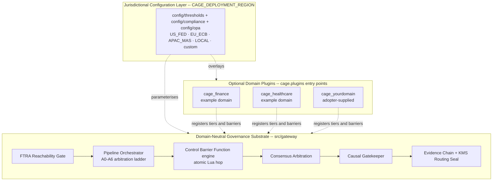

# Cybernetic Agent Governance Engine (CAGE)


> **A domain-agnostic AI governance substrate providing runtime safety boundaries, compliance enforcement, and explainable oversight for autonomous AI systems.**

CAGE is a pluggable governance framework that combines:

- **Universal safety mechanisms** — Control Barrier Functions, consensus arbitration, causal reasoning, FTRA reachability analysis, and pipeline orchestration that operate on abstract action primitives and require no domain knowledge.
- **Domain plugins** — Extensible safety tiers, barriers, rails, and tools for finance, healthcare, or any custom domain, loaded through the `cage.plugins` entry-point group.
- **Regional compliance** — Configurable postures for US Federal, EU, APAC, or custom jurisdictions, selected at deploy time with a single environment variable.
- **Runtime enforcement** — Non-bypassable pipeline orchestration with cryptographic evidence sealing and automated Human-in-the-Loop escalation.

Domain specificity and jurisdictional compliance are **configuration, not core requirements**. The finance and healthcare packages shipped in this repository are illustrative example domains that exercise the extension contract — neither is privileged by the kernel.

    

**Universal (all regions):** 

**Jurisdictional Extensions:**      

---

## What's New in v3.0.0

> **Release date:** 2026-08-28 — Major Version Release: Domain-agnostic kernel extraction, Layer 1/Layer 2 separation, architectural cleanup, formal safety consolidations, governed threshold centralization, and 6-primitive governance runtime.
> See [CHANGELOG.md](CHANGELOG.md#300---2026-08-28) and [docs/BREAKING_CHANGES_v3.md](docs/BREAKING_CHANGES_v3.md) for migration guides.

**Post-v3.0.0 Consolidation (September 2026):** Following the v3.0.0 release, a comprehensive Phase 1–3 consolidation effort spanning 6 PRs and 20 feature branches completed the **Layer 1 (domain-neutral kernel) / Layer 2 (domain plugins)** separation initiated in v3.0.0. All governance enforcement mechanisms now live under [`src/gateway/governance/`](src/gateway/governance/) and operate on abstract action primitives. Domain-specific semantics (trading controls, dosing barriers, fiscal limits) moved to optional [`cage.plugins`](src/cage_finance/) packages loaded via `CAGE_ACTIVE_PLUGINS`. This architectural shift resolves Issue #107 (FTRA registry signing) and establishes the foundation for third-party domain adoption. See [`plans/post_consolidation_roadmap.md`](plans/post_consolidation_roadmap.md) for the full consolidation roadmap and [`docs/architecture/EXTENSIBILITY_ARCHITECTURE.md`](docs/architecture/EXTENSIBILITY_ARCHITECTURE.md) for the domain-agnostic kernel thesis.

### Major Capabilities & Enhancements

| Capability | Location | Description |
|---|---|---|
| **6 Governance Decision Primitives** | `src/gateway/governance/symbolic_governor.py` | Full first-class runtime routing for all six decisions: `ALLOW`, `DENY`, `REQUIRE_APPROVAL`, `DEFER`, `NARROW`, `PAUSE` (`validate_action()`). |
| **Routing Seal v3 (JWT/KMS format with `record_hash` Binding)** | `src/gateway/governance/routing_seal.py` | Cryptographically binds the SHA-256 evidence `record_hash` into the 4-tuple seal format `<expire_hex>.<action_slug>.<record_hash_hex>.<signature_hex>`, enforcing fail-closed actuator checks. |
| **Lua-Atomic CBF Check & Commit (CR-3)** | `src/gateway/governance/safety/cbf_engine.py` | Eliminates TOCTOU concurrency windows by consolidating barrier check and balance deduction into atomic Redis Lua execution (`atomic_verify_and_commit()`). |
| **Synchronous Replica Barrier & Monotonic Fence Epoch** | `src/gateway/governance/safety/cbf_engine.py` | Synchronous `WAIT` verification with fail-closed automatic rollback on replica timeout, plus monotonic `safety:fence_epoch` seeding (`_fetch_initial_fence_epoch_sync()`). |
| **Evidence Stream Blocking Preconditions** | `src/compliance_bridge/evidence_stream.py` | Hard startup precondition guard (`validate_evidence_stream_preconditions()`) halting in production if evidence durability blocking is bypassed. |
| **Human-Gated NeMo Refinement (CR-2 / EV-4)** | `src/governed_financial_advisor/server.py` | Removed unattended auto-apply bypass branch (`NEMO_AUTO_APPLY_ENABLED`). All incoming policy changes are staged via `/v1/nemo/propose-refinement` for explicit human approval. |
| **Centralized Threshold Governance (EV-1–EV-6)** | `config/thresholds/*.json` | Replaced scattered `os.getenv` reads with typed, schema-validated configuration lookups (`get_fria_zone_defer()`, `get_telemetry_max_staleness_seconds()`). |
| **Dual vLLM Architecture** | `deployment/k8s/`, `infra/targets/gcp-gke/` | Distinct `vllm-inference` (`Qwen2.5-7B-Instruct` with Hermes tool-calling) and `vllm-reasoning` (`DeepSeek-R1-Distill-Llama-8B` for pure chain-of-thought analysis). |
| **Typed Node Configs & Clean Imports (SR-1–SR-7)** | `src/gateway/governance/` | Removed legacy shims (`stpa_validator.py`, `safety.py`), migrated to typed `FtraNodeConfig`, and standardized on `StructuredLLMClient` & `AsyncRedisClient`. |

---

## Test Status

| Suite / Jurisdiction | Posture | Result | Date |
|---|---|---|---|
| **US_FED** (NIST SP 800-53 / FedRAMP) | `dev` / `test` | ✅ **3,747 passed** / 0 failed / 67 skipped (75.40% cov) | 2026-09-03 |
| **US_FED** (NIST SP 800-53 / FedRAMP) | `prod` | ✅ **217 passed** / 0 failed / 131 skipped | 2026-09-03 |
| **EU_ECB** (GDPR / EU AI Act) | `dev` / `test` | ✅ **3,747 passed** / 0 failed / 75 skipped (75.40% cov) | 2026-09-03 |
| **EU_ECB** (GDPR / EU AI Act) | `prod` | ✅ **209 passed** / 0 failed / 139 skipped | 2026-09-03 |
| **APAC_MAS** (MAS TRM / FEAT) | `dev` / `test` | ✅ **3,747 passed** / 0 failed / 73 skipped (75.40% cov) | 2026-09-03 |
| **APAC_MAS** (MAS TRM / FEAT) | `prod` | ✅ **211 passed** / 0 failed / 137 skipped | 2026-09-03 |

Tests pass cleanly across all three regulatory postures on macOS and Linux GKE targets (`governance-cluster-2`, project `laah-cybernetics`).
Skipped tests represent live GKE cluster integration endpoints (evaluated via `scripts/port_forward_dev.sh` + `uv run pytest tests/ --run-integration`).

---

## Platform Compatibility

CAGE is a **Kubernetes-native, cloud-agnostic** AI governance engine. The core governance kernel — OPA policy enforcement, NeMo Guardrails, SymbolicGovernor, Control Barrier Functions, and the LangGraph audit harness — runs on **any conformant Kubernetes 1.24+ cluster** without modification.

| Deployment Target | Kubernetes | Cloud Provider | Status |
|---|---|---|---|
| GKE (Google Kubernetes Engine) | ✅ Any GKE channel | GCP (optional integrations) | Production-ready |
| EKS (Amazon Elastic Kubernetes Service) | ✅ Any EKS version | AWS (optional integrations) | Supported |
| AKS (Azure Kubernetes Service) | ✅ Any AKS version | Azure (optional integrations) | Supported |
| OpenShift | ✅ 4.12+ | On-prem / any cloud | Supported |
| Vanilla Kubernetes | ✅ 1.24+ | On-prem / any cloud | Supported |

### Optional GCP Integrations

The following GCP services are **optional drivers** — the system functions fully without them using the listed alternatives:

| GCP Service | Purpose | Alternative |
|---|---|---|
| Cloud KMS | Audit log signing | AWS KMS, Azure Key Vault, HashiCorp Vault |
| Cloud Storage (GCS) | OSCAL evidence storage | AWS S3, MinIO, local filesystem |
| GKE Workload Identity | Pod-level IAM | AWS IRSA, Azure Workload Identity, static credentials |
| Cloud Build | CI/CD | GitHub Actions, GitLab CI, any OCI-compatible CI |

---

## Domain-Agnostic Architecture

CAGE is designed as a **domain-independent governance substrate**. The core enforcement mechanisms — CBF safety filters, consensus arbitration, the causal gatekeeper, FTRA boundary checking, the pipeline orchestrator, and the evidence chain — operate on abstract action primitives and require no domain knowledge. The mathematical invariant `h(x) ≥ 0` does not know what `x` means; it only knows the boundary must not be crossed.

Everything under [`src/gateway/`](src/gateway/) owns *mechanism*: the atomic Redis Lua barrier hop, fence-epoch logic, KMS signature verification, the quota reserver, the consensus algorithm, the causal refutation engine, LIFO rollback ordering, and evidence emission. A domain plugin owns only *nomenclature and parameters*: which actions it claims, which scalar the barrier watches, which threshold key holds the floor, which critics vote, and which tools exist.

**Deny-by-Default Kernel Property:** The bare Layer 1 kernel with `CAGE_ACTIVE_PLUGINS=""` enforces all universal safety mechanisms (FTRA reachability, pipeline orchestration, consensus, causal checks, evidence sealing) but **denies all domain-specific actions** because no plugin has registered action handlers. This is the intended fail-closed behavior: the kernel cannot govern what it does not understand. Domain semantics arrive exclusively through Layer 2 plugins.

**Domain specificity is added through optional plugins:**

| Plugin | Package | Contributes | Status |
| ------ | ------- | ----------- | ------ |
| **Finance** | [`src/cage_finance/`](src/cage_finance/) | Trading controls, fiscal pre-reservation limits, market-abuse critics, `execute_trade` tooling | Example domain |
| **Healthcare** | [`src/cage_healthcare/`](src/cage_healthcare/) | Dosing concentration barriers, clinical decision oversight, `dose_order` tooling | Example domain |
| **Custom** | `src/cage_<domain>/` | Manufacturing, logistics, energy, customer service, critical infrastructure — author your own | Adopter-supplied |

Both shipped plugins are **illustrative example domains of equal standing**. Neither is privileged by the kernel, and neither is required: setting `CAGE_ACTIVE_PLUGINS=""` runs the kernel with zero domain plugins loaded, and the universal safety mechanisms still function.

```bash
# Load both example domains
export CAGE_ACTIVE_PLUGINS=finance,healthcare

# Load healthcare only
export CAGE_ACTIVE_PLUGINS=healthcare

# Run the bare domain-neutral kernel
export CAGE_ACTIVE_PLUGINS=""
```

[`tests/test_domain_independence.py`](tests/test_domain_independence.py) is the standing proof of this claim: it loads both plugins together and asserts the kernel was not modified to accommodate the second one. Companion tests assert the healthcare package contains **zero** Lua files and **zero** KMS imports — it cannot fork the atomicity or signing paths.

See [`docs/architecture/EXTENSIBILITY_ARCHITECTURE.md`](docs/architecture/EXTENSIBILITY_ARCHITECTURE.md) for the plugin authoring guide and domain-agnostic kernel thesis.

---

## Configurable Jurisdictional Compliance

CAGE supports multiple regulatory frameworks through **configurable compliance postures**. ISO/IEC 42001 is the universal baseline applied in every region; jurisdictional frameworks are additive extensions that block regional deployment posture only.

| Posture | Frameworks loaded | Threshold profile |
| ------- | ----------------- | ----------------- |
| **`US_FED`** | NIST AI 600-1, NIST SP 800-53 Rev 5 HIGH, NIST AI RMF, FedRAMP, SR 26-2 | [`config/thresholds/US_FED_BASELINE.json`](config/thresholds/US_FED_BASELINE.json) |
| **`EU_ECB`** | GDPR (incl. Art. 22), DORA, EU AI Act (Reg. 2024/1689), MiFID II | [`config/thresholds/EU_ECB_BASELINE.json`](config/thresholds/EU_ECB_BASELINE.json) |
| **`APAC_MAS`** | MAS Notice 655, MAS FEAT principles, MAS TRM Guidelines | [`config/thresholds/APAC_MAS_BASELINE.json`](config/thresholds/APAC_MAS_BASELINE.json) |
| **`LOCAL`** | ISO 42001 universal baseline only — development default | Kernel defaults |

**Selecting a posture:**

```bash
export CAGE_DEPLOYMENT_REGION=US_FED    # or EU_ECB, APAC_MAS, LOCAL
```

Each posture loads region-specific thresholds, OPA policies, and compliance baselines from [`config/thresholds/`](config/thresholds/) and [`config/compliance/`](config/compliance/). See [`docs/compliance/REGION_GUARD_AUDIT.md`](docs/compliance/REGION_GUARD_AUDIT.md) for the region-guard enforcement details.

**Adding a custom jurisdiction** is a config-only operation requiring no Python changes:

1. Add `config/thresholds/<REGION>_BASELINE.json` following the existing schema.
2. Add `config/compliance/<REGION>_BASELINE.json` declaring the control profile.
3. Register any region-specific Rego under `config/opa/` and Lula assertions under `compliance/lula/`.
4. Ship a per-plugin overlay (`config/compliance/<REGION>_OVERLAY.json`) inside each active domain plugin.
5. Set `CAGE_DEPLOYMENT_REGION=<REGION>`.

Domain plugins and jurisdictional postures compose independently — any plugin can run under any posture.

---

## The CAGE Product Offering

CAGE v3.0.0 provides a **three-layer governance architecture** for enterprise AI with **evidentiary independence** — the system cannot manufacture the conditions necessary to satisfy its own governance checks.

**Layer 1 (L1) — Domain-Neutral Kernel** provides universal enforcement mechanisms:

1.  **The Governance Gateway** *(L1)*: High-performance inference proxy and MCP tool server enforcing the **pipeline orchestration model** — pre-execution FTRA reachability (Tier 0.5) plus domain-agnostic in-pipeline stages (STPA/UCA validation, consensus arbitration, Control Barrier Function, causal gatekeeper, adaptive FRIA gate). Combined with network and runtime hardening (Linkerd mTLS, Cilium L7, eBPF telemetry). Acts as the "Controller" in our Controller-Plant architecture.
2.  **The FTRA Reachability Gate** *(L1)*: Pre-execution Forward-Looking Trajectory Reachability Analyzer ([`src/gateway/governance/ftra/`](src/gateway/governance/ftra/)) that builds a NetworkX directed graph from the agent's `ExecutionPlan`, classifies each step with `IrreversibilityClassifier` against the signed terminal registry, and issues a CLEAR / HITL_REQUIRED / BLOCKED verdict before any tool call is made.
3.  **The Reusable Agent Harness** *(L1)*: Deterministic LangGraph factories (`OpaNodeConfig`/`NemoNodeConfig`) that wrap *any* agentic workflow in mandatory, non-bypassable governance guardrails.
4.  **The STPA-to-Policy Compiler** *(L1)*: CLI tool ingesting declarative YAML control structure ([`config/stpa_control_structure.yaml`](config/stpa_control_structure.yaml)) and auto-generating OPA Rego policies, NeMo Colang rails, Python `GeneratedSTPAValidator` classes, and LangGraph Saga compensating sub-graphs.
5.  **The DoWhy Causal Gatekeeper** *(L1)*: Optional refutation-based causal inference safety lock ([`src/gateway/governance/causal/gatekeeper.py`](src/gateway/governance/causal/gatekeeper.py)) validating world-model integrity via DoWhy placebo refutation before allowing high-stakes actions. Integrated as a pipeline stage.
6.  **The Cryptographic Hash-Chained Context Accumulator** *(L1)*: SHA-256 hash-chained, append-only log of every `OscalFinding`. Each node's `record_hash` binds `SHA-256(prev_hash ‖ content_json ‖ control_id ‖ event_type ‖ node_index ‖ audit_id)`, sealing an unalterable chain-of-custody. Satisfies **ISO 42001 Annex A.5.3** and neutralizes **AARM-V1**.
7.  **The 6 Governance State Machine Primitives** *(L1)*: Full first-class runtime execution for all six governance primitives (`ALLOW | DENY | REQUIRE_APPROVAL | DEFER | NARROW | PAUSE`) in `SymbolicGovernor.validate_action()`. Execution is parked in Redis-backed `DeferQueue` for `DEFER`, partially executed under `NARROW`, and suspended with epoch fencing under `PAUSE`. Satisfies **ISO 42001 Annex A.8.4** and neutralizes **AARM-V7**.
8.  **Routing Seal v3 (JWT/KMS format)** *(L1)*: 4-tuple cryptographic routing token `<expire_hex>.<action_slug>.<record_hash_hex>.<signature_hex>` produced only after all tiers pass. Actuators fail-closed if `record_hash` is absent or tampered when `CAGE_REQUIRE_EVIDENCE_BINDING=true`.
9.  **Cloud KMS HSM-Backed Governance Signing** *(L1)*: Asymmetric signing via Google Cloud KMS HSM ([`src/gateway/governance/kms_signer.py`](src/gateway/governance/kms_signer.py)). Private key never leaves the HSM; verification uses locally-embedded public key PEM for sub-millisecond latency.
10. **Heterogeneous Multi-Model Consensus** *(L1)*: `ConsensusModelRegistry` routes each critic persona to distinct vLLM inference backends. No single model can "consent" to its own output — system invariants are no longer vulnerable to shared semantic blind spots.
11. **Lua-Atomic CBF with Strict Replica Barrier** *(L1)*: Consolidates barrier check and balance debiting into atomic Redis Lua (`atomic_verify_and_commit()`), enforces synchronous `WAIT` replication with fail-closed rollback on replica timeout, prevents stale-state replay via monotonic `safety:fence_epoch`.
12. **Externally Reconciled CBF Ground Truth** *(L1)*: Sourced from independently reconciled external custody ledger via [`src/gateway/governance/reconciliation/daemon.py`](src/gateway/governance/reconciliation/daemon.py) (GCS WORM ledger + Cloud KMS ECDSA-P256 signing with 300s TTL).
13. **Mechanized Formal Model** *(L1)*: Exhaustive BFS state-space exploration ([`proof/model.py`](proof/model.py) and [`proof/distributed_cbf_model.py`](proof/distributed_cbf_model.py)) proving the `NoDirectBind` invariant holds across all sequential and concurrent interleavings.

**Layer 2 (L2) — Domain Plugins** contribute domain-specific semantics (optional, loaded via `CAGE_ACTIVE_PLUGINS`):

14. **Finance Plugin** *(L2)*: Trading controls, `FiscalLimitGuard` (atomic pre-reservation preventing multi-agent "race to the rail"), `CashBarrier` declaration, `execute_trade` tooling, market-abuse critics, LangGraph Saga atomic transaction guarantees with WAL + LIFO rollback ([`src/cage_finance/`](src/cage_finance/)).
15. **Healthcare Plugin** *(L2)*: Dosing concentration barriers, clinical decision oversight, `dose_order` tooling, `SerumConcentrationBarrier` declaration ([`src/cage_healthcare/`](src/cage_healthcare/)).

**Layer 3 (L3) — Operational Tooling**:

16. **Native AARM Threat Vector Mapping** *(L3)*: Machine-readable proof that specific CAGE control points neutralize all 11 CSA AARM threat vectors. `GET /v1/aarm/conformance-report` returns live `NEUTRALIZED | PARTIAL | EXPOSED` verdicts per vector.
17. **Human-Gated NeMo Refinement** *(L3)*: All incoming policy changes staged via `POST /v1/nemo/propose-refinement` and require explicit human approval with reviewer identity and rationale before applying.

Compliance is not documented after the fact; it is enforced at the point of inference, producing both governed outputs and a cryptographically hash-chained, tamper-evident audit evidence trail in real time.

---

## Architecture Overview

CAGE is composed of the following runtime subsystems:

| Subsystem                        | Layer | Root Path                         | Role                                                                        |
| -------------------------------- | ----- | --------------------------------- | --------------------------------------------------------------------------- |
| **Gateway / Governance Harness** | **L1** | `src/gateway/governance/`         | Domain-neutral enforcement kernel: FTRA gate, pipeline orchestrator, CBF engine, consensus arbitration, causal gatekeeper, evidence chain, routing seal |
| **Pipeline Orchestration**       | **L1** | `src/gateway/governance/pipeline/`| `GovernanceStage` protocol, `StageRegistry`, `PipelineOrchestrator`, `DeferQueue`, `LeaseLedger`; A0–A6 arbitration ladder — see [`PIPELINE_ORCHESTRATION.md`](docs/architecture/PIPELINE_ORCHESTRATION.md) |
| **FTRA Boundary Enforcement**    | **L1** | `src/gateway/governance/ftra/`    | Forward-Looking Trajectory Reachability Analyzer (Tier 0.5); signed terminal registry; bounding contracts B1–B10 — see [`FTRA_BOUNDARY_ENFORCEMENT.md`](docs/architecture/FTRA_BOUNDARY_ENFORCEMENT.md) |
| **Policy Ingress Adapters**      | **L1** | `src/gateway/governance/ingress/` | Absorbs ACS / AAIF / OSCAL / Lula policy, AGW requests, and the GEAP agent registry into CAGE artifacts — see [`INGRESS_ADAPTER_ARCHITECTURE.md`](docs/architecture/INGRESS_ADAPTER_ARCHITECTURE.md) |
| **Compliance Bridge**            | **L1** | `src/compliance_bridge/`          | OSCAL audit ingest; SSE event bus; Langfuse integration; AARM Conformance Engine; DEFER Queue API |
| **Vendor Integrations**          | **L1** | `src/integrations/`               | Isolated third-party adapters: `provider_01/` (normative provider), `provider_02/` (CER attestation), `provider_03/` (JCS canonicalization), `provider_04/` (socket-level execution guillotine), `provider_05/` (Verifiable Execution Evidence Pack), `provider_06/` (tri-state verifier) |
| **Domain Plugins** *(optional)*  | **L2** | `src/cage_finance/`, `src/cage_healthcare/` | Entry-point (`cage.plugins`) capability packages contributing domain-specific tiers, barriers, rails, tools, and compliance overlays. Finance and healthcare are equal-standing example domains; adopters add `src/cage_<domain>/`. **Zero plugins loaded:** kernel denies all domain actions (fail-closed) |
| **Jurisdictional Configuration** *(config layer)* | **L3** | `config/thresholds/`, `config/compliance/`, `config/opa/` | Region-selected thresholds, control profiles, and policy bundles resolved from `CAGE_DEPLOYMENT_REGION`. No Python code is region-specific |
| **AgentSight UI**                | **L3** | `src/agentsight-ui/`              | React/TypeScript operator dashboard; real-time governance and remediation events |
| **AgentSight eBPF DaemonSet**    | **L3** | `deployment/agentsight/`          | Kernel-level process telemetry via BPF uprobes                              |
| **Reference Application** *(example)* | **—** | `src/governed_financial_advisor/` | Example-domain LangGraph multi-agent pipeline and FastAPI server. Demonstrates the harness; **not** part of CAGE and not required to run the kernel |

The layering below separates the **domain-neutral substrate** (always present), the **optional domain plugins** (dashed — load zero, one, or many), and the **jurisdictional configuration layer** (selected at deploy time):



Solid arrows are always-on kernel flow. Dashed arrows are optional or configuration-time bindings: remove every plugin and the substrate still enforces FTRA, orchestration, barriers, consensus, causal checks, and evidence sealing.

The trace below is the **finance example domain** end-to-end request path — one illustration of the substrate in use, not the canonical CAGE topology:

```
User ──POST /agent/query──► FastAPI Agent Server (:8000)
                                      │
                         [nemo_guardrail] (mandatory input rail - Node 1)
                                      │
                         LangGraph StateGraph (10 Nodes)
                         thinker_node (DeepSeek-R1) → doer_node (Llama 3.1)
                            ├─► data_analyst → [nemo_output_rail_da] ──► (short-circuit path)
                            └─► execution_analyst → evaluator 
                                      │ (APPROVED + sig)
                                 safety_check ──(BLOCKED/ESCALATED)──┐
                                      │ (APPROVED/SKIPPED)           │
                         [governed_trader] (HITL Interrupt Gate)      │
                                      │                              ▼
                                  explainer ◄────────────────────────┘
                                      │
                         [nemo_output_rail] (mandatory output rail)
                                      │
                              ◄── governed response ──
```

An equivalent **healthcare example domain** path traverses the identical substrate, substituting `dose_order` for `execute_trade`, `SerumConcentrationBarrier` for `CashBarrier`, and clinical critics for market critics — with **no kernel change**. Any adopter domain follows the same substitution pattern.

For full architectural detail, see [`docs/GATEWAY_ARCHITECTURE.md`](docs/architecture/GATEWAY_ARCHITECTURE.md), the [Technical Report Series](docs/technical-report/README.md), and the [Extensibility Architecture](docs/architecture/EXTENSIBILITY_ARCHITECTURE.md) (domain-agnostic kernel design and multi-domain roadmap). Four subsystem deep-dives cover the enforcement substrate in detail: [Pipeline Orchestration](docs/architecture/PIPELINE_ORCHESTRATION.md), [FTRA Boundary Enforcement](docs/architecture/FTRA_BOUNDARY_ENFORCEMENT.md), [Ingress Adapter Architecture](docs/architecture/INGRESS_ADAPTER_ARCHITECTURE.md), and [Domain Plugin Architecture](docs/architecture/DOMAIN_PLUGIN_ARCHITECTURE.md).

---

## Key Features

- **Domain-Agnostic Governance Kernel** — Every enforcement mechanism operates on abstract action primitives. Domain semantics arrive exclusively through optional `cage.plugins` packages ([`src/cage_finance/`](src/cage_finance/), [`src/cage_healthcare/`](src/cage_healthcare/), or adopter-authored), gated by `CAGE_ACTIVE_PLUGINS`. Proven by [`tests/test_domain_independence.py`](tests/test_domain_independence.py).
- **Multi-Jurisdiction Compliance Profiles** — Dynamic loading of regional control profiles (`config/compliance/`) and thresholds (`config/thresholds/`) via `CAGE_DEPLOYMENT_REGION`. Ships `US_FED`, `EU_ECB` (EU AI Act, GDPR Art. 22, DORA, with Step 7 Fundamental Rights Impact Assessment attestation and SR 26-2 telemetry suppression), and `APAC_MAS` (MAS FEAT Principles) baselines; adding a jurisdiction is a config-only operation.
- **Reusable LangGraph Governance Harness** — `OpaNodeConfig` and `NemoNodeConfig` factories allow any agent to inherit enterprise governance (tracing, metrics, fail-closed mechanisms) with pluggable domain-state extractors.
- **DoWhy Causal Gatekeeper** — Microsoft DoWhy causal inference validates world-model integrity via placebo refutation before allowing high-stakes actions; fail-safe on error (blocks when causal assumptions cannot be verified). The Causal Gatekeeper's Redis fallback is now fail-closed: connection errors raise `RuntimeError` rather than returning a zero sentinel; absent keys return `None` (first-boot safe).
- **LangGraph Saga Pattern** — STPA compiler now generates WAL forward nodes, idempotent compensating nodes, and a centralized `saga_router_node` from UCA definitions in YAML. UCA-4 (atomic debit/credit failure) is fully enforced. Ghost-state recovery (OOM crash between PENDING and COMPLETED) escalates to `human_review`. Rollback evidence emitted as OTel spans via `SagaCallbackHandler` (ISO 42001 A.8.4). A `rollback_state()` Saga compensation stub has been added to `FiscalLimitGuard` to reverse Redis debits when a downstream tier fails after Tier 3a commitment (saga-atomicity gap, not a concurrency race).
- **FiscalLimitGuard** — Redis `WATCH/MULTI/EXEC` optimistic-lock pre-reservation guard prevents multi-agent "race to the rail" where concurrent threads all read the same OPA limit and all pass. Fail-closed on Redis failure. Integrates with Saga rollback via `release(token)`.
- **Token Quota Proxy (CTRL_TQP_007)** — `src/gateway/governance/token_quota_proxy.py` enforces hard per-session step-count (`≤12`) and token (`≤100,000`) quotas via Redis atomic Lua counters. Fail-CLOSED: Redis unavailability blocks the request (HTTP 429). Two-phase commit: `check_and_increment()` reserves quota before the vLLM call; `reconcile_actual_tokens()` corrects over-allocation after the response. `rollback_step()` atomically decrements counters on downstream failure. Implements ISO 42001 Annex A.4 (Resource Management). Governance control: `CTRL_TQP_007`.
- **PII Sanitizer** — `src/gateway/governance/pii_sanitizer.py` applies 8 compiled regex patterns (SSN, credit card, email, phone, API key/Bearer token, and others) sequentially to every UCA compliance record before WORM persistence. Implements ISO 42001 Annex A.6 (Data Lineage and PII Leak Mitigation). Thread-safe; no per-call state.
- **UCA Logger** — `src/gateway/governance/uca_logger.py` builds, cryptographically signs (Cloud KMS in production; HMAC-SHA256 stub when `CAGE_ENV=test`), and persists 16-field ISO 42001 Clause 6.1 Unsafe Control Action records to a region-gated WORM bucket (`CAGE_DEPLOYMENT_REGION` → `OSCAL_S3_BUCKET_{REGION}`). Three UCA types: `quota_exceeded`, `prompt_injection`, `pii_sanitization`.
- **Mandatory NeMo input + output guardrails** — non-bypassable LangGraph nodes generated by the harness; fail-closed on any exception; Presidio PII scan on every request and response.
- **OPA policy evaluation via direct REST API** — circuit breaker defaults to DENY on failure; generated by the harness router.
- **STPA-to-Policy Compiler** — CLI tool (`src/gateway/governance/stpa_compiler.py`) ingests `config/stpa_control_structure.yaml` and generates OPA Rego, NeMo Colang rails, a Python `GeneratedSTPAValidator`, and LangGraph Saga nodes — eliminating manual policy transcription errors.
- **Zero-Trust Network (Z3N) hardening** — Linkerd mTLS `Server`/`AuthorizationPolicy`/`MeshTLSAuthentication` for cryptographic SPIFFE/SVID identity verification; Cilium L7 FQDN egress lockdown for sovereign agent pods. Closes POAM-007 (IA-3); POAM-011 (SC-8) remains Open.
- **Automated OSCAL SSP exporter** — `oscal_ssp_exporter.py` surgically patches the 1,151-line `system-security-plan.yaml` in-place with implementation evidence for every governance control, on every CI run.
- **HITL Mandatory Rationale** — High-risk actions trigger LangGraph interrupts. Resuming the graph requires a mandatory justification that is cryptographically hashed into the evidence chain BEFORE the thread resumes.
- **Cryptographic Hash-Chained Context Accumulator (AARM-V1)** — `src/compliance_bridge/context_accumulator.py` promotes the SHA-256 chain-of-custody pattern to the core compliance pipeline. Each `OscalFinding` is hash-linked to the preceding node. A `CHAIN_SEALED` sentinel terminates every run. `chain_root`, `chain_length`, and `chain_integrity_valid` are returned in all audit API responses. Neutralizes **AARM-V1 Memory Poisoning**; satisfies **ISO 42001 A.5.3**.
- **DEFER State Machine Primitive (AARM-V7)** — `src/gateway/governance/defer_queue.py` parks execution context in Redis `db=1` (`noeviction`) when `confidence_score < 0.70`. The `GET /v1/defer/pending`, `POST /v1/defer/{id}/inject`, and `POST /v1/defer/{id}/escalate` endpoints manage the queue lifecycle. Neutralizes **AARM-V7 Context Window Overflow**; satisfies **ISO 42001 A.8.4** (UCA-7).
- **Native AARM 11-Vector Threat Ledger** — `src/compliance_bridge/aarm_mapper.py` provides a static, version-pinned ledger mapping all 11 CSA AARM vectors to specific CAGE control points. `GET /v1/aarm/conformance-report` returns per-vector `NEUTRALIZED | PARTIAL | EXPOSED` verdicts with optional vLLM narrative enrichment. Report auto-serialized to GCS/S3 on every Lula audit run.
- **Governance-as-Code Demo** — `examples/governance_demo.py` is a 3-act CLI walkthrough of v1.0.0 features (Concurrency Race, HITL Rationale, and Hash-Chain Verification).
- **Multi-Jurisdiction Compliance Engine (v2.0.0)** — `CAGE_DEPLOYMENT_REGION` env var activates a regional compliance posture at boot (`US_FED`, `EU_ECB`, `APAC_MAS`, `LOCAL`, or a custom jurisdiction added under `config/`), loading the correct JSON control profile, numeric thresholds, and OSCAL framework routing table with zero code changes.
- **Chaos Agent Playground** — `examples/chaos_agent_playground.py` provides a zero-infrastructure local demo intercepting five adversarial scenarios (A–E: governance tiers; D: Saga LIFO rollback; E: ghost-state OOM crash recovery) across the full governance stack.
- **OSCAL-compliant compliance bridge** — SSE event bus with 7-year audit retention; ISO 42001, FedRAMP HIGH, and EU AI Act evidence artifacts via Langfuse dual-project setup.
- **Langfuse observability** — LLM chain-of-thought, tool use, governance verdicts, and compliance scores captured without blocking inference.
- **Kubernetes-native secret management** — all secrets injected as environment variables via K8s `Secret` objects; no Google Secret Manager.
- **Cloud KMS HSM governance signatures (v2.0.0)** — Asymmetric signing via Google Cloud KMS HSM; private key never leaves hardware. HMAC-SHA256 fallback for dev/CI. Required before any trade execution. KMS-signed payloads now embed a `signed_at` timestamp; the verifier rejects payloads older than 300 seconds, closing a replay-attack vector.
- **Human-gated NeMo refinement (v2.0.0)** — All config changes staged as proposals requiring explicit human approval with reviewer identity and rationale. Severs the autonomous hot-reload loop.
- **Heterogeneous multi-model consensus (v2.0.0)** — `ConsensusModelRegistry` routes each critic persona to a distinct vLLM backend, preventing single-model semantic blind spots. The degraded-quorum case (`ERROR + APPROVE`) is now explicitly routed to HITL escalation.
- **Externally reconciled CBF (v2.1.0 — POAM-023 Closed)** — `src/gateway/governance/reconciliation/daemon.py` implements external CBF state reconciliation. Reconciled balances are KMS-signed before Redis write; the CBF fails closed on TTL expiry. The CBF module tracks intra-window debits locally (`_local_debits`) to prevent double-spend within the KMS snapshot refresh window (60 s fetch / 300 s TTL).
- **Human-in-the-loop approval gate** — LangGraph `interrupt_before=["governed_trader"]`; resume via `POST /v1/approvals/{thread_id}/resume`.
- **W3C traceparent propagation** — full OTel trace waterfall across LangGraph → Gateway → vLLM; 100% sampling for governance decision spans.

---

## Mathematical Foundations & Formal Safety Guarantees

CAGE's runtime safety properties are grounded in formal mathematical constructs implemented directly in source code. The following summarises the key formalisms; full derivations are in [`docs/technical-report/10-FORMAL-VERIFICATION.md`](docs/technical-report/10-FORMAL-VERIFICATION.md) and [`docs/governance/CAUSAL_AND_CBF_GOVERNANCE.md`](docs/governance/CAUSAL_AND_CBF_GOVERNANCE.md).

### Control Barrier Function (CBF)

Source: [`src/gateway/governance/safety/cbf_engine.py`](src/gateway/governance/safety/cbf_engine.py)

The safe set is defined as `S = {x ∈ ℝⁿ : h(x) ≥ 0}` where the barrier function is:

```
h(x) = cash_balance − min_cash_balance
```

The discrete-time CBF condition enforced at every governance tick is:

```
h(S(t+1)) ≥ (1−γ) · h(S(t)),   γ ∈ (0,1)
```

This guarantees that the cash balance never drops below the minimum threshold in a single step — the decay factor `γ` bounds the maximum permissible drawdown per evaluation cycle. External reconciliation is implemented via [`src/gateway/governance/reconciliation/daemon.py`](src/gateway/governance/reconciliation/daemon.py) (POAM-023 closed 2026-07-27).

### 8-Tier Symbolic Governor Pipeline

Sources: [`src/gateway/governance/symbolic_governor.py`](src/gateway/governance/symbolic_governor.py), [`src/gateway/governance/ftra/`](src/gateway/governance/ftra/)

Every `execute_trade` action passes through the following two-phase pipeline before a routing seal is issued. Tier 0.5 (FTRA) executes at the LangGraph graph level before the first node fires; Tiers 0–6b run inside `SymbolicGovernor._run_checks()`:

| Phase | Tier | Name | Mechanism |
|-------|------|------|-----------|
| **Boundary** | **0.5** | FTRA — Forward-Looking Trajectory Reachability Analyzer | `create_ftra_node()` builds a NetworkX directed graph from the `ExecutionPlan`, classifies terminal steps with `IrreversibilityClassifier`, and issues `CLEAR` / `HITL_REQUIRED` / `BLOCKED` before any tool call executes |
| **Phase 1** | **0** | STPA/STAMP UCA validation | `GeneratedSTPAValidator.validate()` checks Unsafe Control Actions defined in the STPA ontology |
| **Phase 1** | **1** | Agent confidence pre-check | Fast-fail local check against `get_agent_confidence_threshold()` (default 0.95) before any network I/O |
| **Phase 1** | **2b** | OPA policy evaluation | Evaluates `trade.governance` Rego policy prior to state mutation |
| **Phase 1** | **5** | Consensus gate | Heterogeneous multi-model consensus required for trades ≥ $10k; 10 s timeout |
| **Phase 1** | **6** | Causal gatekeeper | SCM $\beta \le 0$ fail-closed guard + `PlaceboTreatmentRefuter` (50 sims, p < 0.05, \|eff\| > 0.2) validates world-model integrity |
| **Phase 1** | **6b** | Adaptive FRIA enforcement | `get_fria_zone_allow()` = 0.95, `get_fria_zone_defer()` = 0.70; scores below 0.70 hard-deny locally |
| **Phase 2** | **2a** | Control Barrier Function | Lua-atomic check+commit (`atomic_verify_and_commit()`) in Redis; runs only after all Phase 1 validation tiers pass |
| **Phase 2** | **3** | Fiscal Limit Pre-Reservation | `FiscalLimitGuard.reserve()` atomically pre-reserves daily fiscal cap in Redis |

> **Zero Budget Leakage:** Phase 2 state mutations execute only after all Phase 1 validation tiers emit `ALLOW`. Rejections in Phase 1 prevent any ledger mutation or spending cap consumption.

The routing seal is issued only after all tiers pass. PII sanitization (`pii_sanitizer.py`) and confabulation scoring (`confabulation_scorer.py`) are separate, standalone components — PII sanitization runs on audit records immediately before WORM persistence (inside `uca_logger.py`), and confabulation scoring is a Langfuse observability metric — neither is a sequential tier of `_run_checks()`.

### Confabulation Risk Formula

Source: [`src/gateway/governance/confabulation_scorer.py`](src/gateway/governance/confabulation_scorer.py)

```
risk_score = 1.0 − confidence
```

Scores ≥ 0.95 pass immediately (async attestation, 0 ms overhead). Scores in [0.70, 0.95) enter the DEFER queue for synchronous blocking review. Scores < 0.70 are hard-denied without an external call.

### Causal Marginal Risk Boundary & Slope Guard

Source: [`src/gateway/governance/causal/gatekeeper.py`](src/gateway/governance/causal/gatekeeper.py)

A trade action is blocked when the causal slope is non-positive ($\beta \le 0 \implies \text{BLOCK}$) or when the bounded marginal risk expression exceeds the safety boundary:

```
risk_score = min(1.0, max(0.0, 0.5 + estimate.value * amount))
risk_score > 0.95  →  BLOCK (marginal risk exceeded)
```

The `PlaceboTreatmentRefuter` runs 50 simulations; the causal effect is considered spurious (and the action blocked) when p < 0.05 or |effect| > 0.2.

### Routing Seal Integrity

Source: [`src/gateway/governance/routing_seal.py`](src/gateway/governance/routing_seal.py)

Every governance decision is sealed with an HMAC-SHA256 token in the format:

```
<expire_ts_hex>.<action_slug>.<hmac_hex>
```

Tokens carry a 30-second TTL. Unsigned or expired requests return HTTP 403.

### Provenance Hash Chain

Source: [`src/gateway/governance/provenance_chain.py`](src/gateway/governance/provenance_chain.py)

SHA-256 hash chain with O(n) construction. Each node's `record_hash` is `SHA-256(prev_hash ‖ content_json)`, producing a tamper-evident chain-of-custody that detects any mutation at the altered node.

### Fiscal Limit Guard

Source: [`src/gateway/governance/safety/resource_guard.py`](src/gateway/governance/safety/resource_guard.py)

- Daily cap: **$500,000** over an 86,400 s rolling window
- Redis `WATCH/MULTI/EXEC` optimistic-lock pre-reservation prevents multi-agent "race to the rail"
- Exponential backoff on contention; fail-closed on Redis unavailability

### STPA Unsafe Control Actions (UCAs)

Source: [`src/gateway/governance/ontology.py`](src/gateway/governance/ontology.py)

| UCA ID | Condition | Enforcement |
|--------|-----------|-------------|
| **FIN-1** | `trade_value > position_limit` | OPA Rego + GeneratedSTPAValidator |
| **FIN-2** | `portfolio_concentration > 0.25` | OPA Rego + GeneratedSTPAValidator |
| **UCA-5** | `order_size > 0.1 × daily_volume` | Saga compensating node + HITL escalation |
| **UCA-6** | `order_size > threshold × daily_vol` (US_FED: 1%, EU_ECB: 0.5%, APAC_MAS: 0.8%) ⚠️ **SECURITY-CRITICAL THRESHOLD** | Saga compensating node + HITL escalation |

Full STPA hazard analysis: [`docs/security/STPA_ANALYSIS.md`](docs/security/STPA_ANALYSIS.md)

---

## Deployment Policy

CAGE enforces strict deployment rules to ensure compliance and consistency:

**🚨 Critical Rule:** When deploying to Google Kubernetes Engine (GKE), **ALWAYS use Cloud Build**, never local Docker builds.

**Why:**
- Platform consistency (avoids ARM64 vs AMD64 issues)
- Integrated security scanning
- Full audit trail for compliance
- Reproducible builds

**Quick Reference:**

| Target | Build Method | Command |
|--------|--------------|---------|
| GKE Production | ☁️ Cloud Build | `./deploy_all.sh --target gcp-gke --env prod` |
| GKE Development | ☁️ Cloud Build | `./deploy_all.sh --target gcp-gke --env dev --auto-approve` |
| Local k3d/kind | 🐳 Local Docker | `./deploy_all.sh --target agnostic --env dev` |
| Docker Compose | 🐳 Local Docker | `docker compose up` |

**Documentation:**
- [Deployment Rules](docs/operations/DEPLOYMENT_RULES.md) — Complete deployment policy
- [Agent Ops Architecture](docs/architecture/AGENT_OPS_ARCHITECTURE.md) — Defense-in-depth governance pattern
- [Deployment Guide](infra/DEPLOYMENT_GUIDE.md) — Step-by-step procedures

---

## Security & Compliance Status

> [!IMPORTANT]
> **CAGE v3.0.0 has not received a NIST Authorization to Operate (ATO).** The AI governance enforcement controls (NeMo Guardrails, OPA, Cloud KMS signing, HITL, STPA, heterogeneous consensus, human-gated refinement, externally reconciled CBF) are fully implemented and tested. The full NIST RMF authorization process — Security Assessment, System Security Plan, ATO letter — has not been completed. Regulated-environment deployers must conduct their own risk assessment before production use.

### Compliance Framework Scope

> **Architecture Note:** ISO 42001 is the **universal baseline** active in all three deployment regions. NIST SP 800-53, EU AI Act/GDPR/DORA, and MAS FEAT are **jurisdictional extensions** active only when `CAGE_DEPLOYMENT_REGION` is set to the corresponding value. See [`docs/JURISDICTIONAL_SEPARATION_ANALYSIS.md`](docs/compliance/cross-region/JURISDICTIONAL_SEPARATION_ANALYSIS.md) for the full architectural rationale.

| Compliance Framework | Scope | `CAGE_DEPLOYMENT_REGION` | Status |
| -------------------- | ----- | ------------------------ | ------ |
| **ISO/IEC 42001:2023** | **Universal** — all regions | All values | ✅ Active |
| **CSA AARM v1.0** | **Universal** — all regions | All values | ✅ Active |
| **NIST SP 800-53 Rev 5** | **US_FED only** | `US_FED` | 🟡 Partial (ATO pending) |
| **NIST AI 600-1** | **US_FED only** | `US_FED` | ✅ Implemented (phases 0–3) |
| **FedRAMP HIGH** | **US_FED only** | `US_FED` | 🟡 Partial (ATO pending) |
| **SR 26-2** (Federal Reserve) | **US_FED only** | `US_FED` | ✅ Implemented |
| **EU AI Act** | **EU_ECB only** | `EU_ECB` | ✅ Implemented |
| **GDPR Art. 22** | **EU_ECB only** | `EU_ECB` | ✅ Implemented |
| **DORA Art. 10/12** | **EU_ECB only** | `EU_ECB` | ✅ Implemented |
| **MAS FEAT Principles** | **APAC_MAS only** | `APAC_MAS` | ✅ Implemented |
| **MAS Notice 655** | **APAC_MAS only** | `APAC_MAS` | ✅ Implemented |
| **MAS TRM §4.2/§6.3** | **APAC_MAS only** | `APAC_MAS` | ✅ Implemented |

> **Footnote:** SR 26-2 has no legal force outside the US Federal Reserve system. The `EU_ECB_BASELINE.json` and `APAC_MAS_BASELINE.json` profiles encode a `"no legal force"` sentinel that suppresses SR 26-2 telemetry in non-US deployments (see [`EU_ECB_BASELINE.json`](config/compliance/EU_ECB_BASELINE.json)).

### Operational Security Status

| Domain                                       | Status                  | Detail                                                                                                                      |
| -------------------------------------------- | ----------------------- | --------------------------------------------------------------------------------------------------------------------------- |
| **AI governance enforcement**                | ✅ Implemented & tested | NeMo rails, OPA circuit breaker, Cloud KMS HSM seal (production seal enforcement active — unsigned requests return 403), HITL, CBF (externally reconciled), heterogeneous consensus, PII, STPA — all fail-closed |
| **Evidentiary independence (v2.0.0)**        | ✅ Implemented & tested | KMS asymmetric signing, human-gated refinement, multi-model consensus — recursive self-authentication eliminated. External CBF reconciliation implemented via `reconciliation/daemon.py` (POAM-023 closed 2026-07-27). |
| **Multi-Framework automated compliance**     | 🟡 Partial              | 31 Lula validation manifests (+ 1 draft) across ISO 42001, NIST SP 800-53, NIST AI 600-1 (phases 0–3), EU AI Act/GDPR/DORA, MAS FEAT/Notice 655/TRM, and CSA AARM — see [`compliance/lula/README.md`](compliance/lula/README.md) |
| **NIST RMF Steps 1–4 (Prepare → Implement)** | 🟡 Partial (US_FED only) | SC-8 elevated to implemented; SC-7 reinforced; FIPS 199 unsigned; ATO not yet issued                                       |
| **NIST RMF Step 5 (Assess)**                 | ❌ Not started (US_FED only) | No Security Assessment Report; no independent assessor                                                                 |
| **NIST RMF Step 6 (Authorize)**              | ❌ Not started (US_FED only) | No ATO letter issued                                                                                                    |
| **Infrastructure security**                  | 🟡 Partial              | 12 of 23 SP 800-53 POA&M open (8 Closed: POAM-003 AU-12, POAM-007 IA-3, POAM-010 RA-5, POAM-012 SC-12, POAM-016 SI-2, POAM-020 CM-3, POAM-021 SI-4, POAM-023 CBF reconciliation worker) — see [`docs/SECURITY_STATUS.md`](docs/security/SECURITY_STATUS.md) |
| **PodSecurity (restricted)**                 | ✅ Implemented          | `securityContext` (`runAsNonRoot`, `runAsUser: 65534`, `seccompProfile`, `allowPrivilegeEscalation: false`, `capabilities.drop: ALL`) applied to all 6 app deployment manifests (rc.3) |
| **Intra-cluster mTLS**                       | ✅ Implemented          | Linkerd mTLS: SPIFFE/SVID identity for Gateway→OPA, Gateway→NeMo (POAM-007 closed)                                         |
| **L7 egress boundary**                       | ✅ Implemented          | Cilium CiliumNetworkPolicy: FQDN allowlist for gateway, internal-only lockdown for agent pods                               |
| **CI vulnerability scanning**                | ✅ Implemented          | pip-audit, Trivy, Grype, CycloneDX SBOM in `.github/workflows/security-scan.yml` (POAM-010 closed)                         |

See [`docs/SECURITY_STATUS.md`](docs/security/SECURITY_STATUS.md) for the complete posture breakdown, all open POA&M items, and pre-deployment guidance for regulated environments.

---

## Quick Start

### Prerequisites

- Python ≥ 3.10, < 3.13
- Docker & Docker Compose
- `uv` (recommended) or `pip`; build system requires `uv_build>=0.8.14`

### Environment Variables

Copy `.env.example` to `.env` and configure at minimum:

| Variable                                         | Description                                          |
| ------------------------------------------------ | ---------------------------------------------------- |
| `CAGE_DEPLOYMENT_REGION`                         | Deployment region baseline (`US_FED`, `EU_ECB`, `APAC_MAS`; default is `US_FED`) |
| `KMS_GOVERNANCE_KEY`                             | Cloud KMS key resource name for HSM-backed governance signing (v2.0.0) |
| `KMS_GOVERNANCE_PUBLIC_PEM`                      | Path to public key PEM for local signature verification (v2.0.0) |
| `GOVERNANCE_SALT`                                | _(Legacy)_ HMAC salt — used as fallback when KMS is not configured |
| `NEMO_AUTO_APPLY_ENABLED`                        | Set `true` to bypass human-gated refinement (dev/CI only; default `false`) |
| `RECONCILIATION_PROVIDER`                        | Custody provider (`stub`, `gcs`, `s3` / `object-store`, `plaid`, or `anchorage`; default `stub`) |
| `LANGFUSE_COMPLIANCE_PUBLIC_KEY` / `_SECRET_KEY` | Keys for ISO 42001 audit Langfuse project            |
| `REDIS_URL`                                      | Redis connection URL (e.g. `redis://localhost:6379`) |
| `OPA_URL`                                        | OPA policy engine URL (e.g. `http://localhost:8181`) |
| `VLLM_REASONING_API_BASE`                        | vLLM reasoning endpoint (also default for Risk Manager consensus persona) |
| `VLLM_FAST_API_BASE`                             | vLLM fast-path endpoint (also default for Compliance Officer consensus persona) |
| `CONSENSUS_RISK_MANAGER_URL`                     | Override vLLM endpoint for Risk Manager critic persona |
| `CONSENSUS_COMPLIANCE_OFFICER_URL`               | Override vLLM endpoint for Compliance Officer critic persona |
| `CAGE_NORMATIVE_PROVIDER`                        | External normative provider (`static` or `provider_01`; default `static`) |
| `STEP_QUOTA_MAX`                                 | Hard step-count limit per agent session for Token Quota Proxy (default: `12`) |
| `TOKEN_QUOTA_MAX`                                | Hard token limit per agent session for Token Quota Proxy (default: `100000`) |
| `SESSION_TTL_SECONDS`                            | Redis key TTL for Token Quota Proxy session counters in seconds (default: `3600`) |
| `OSCAL_S3_BUCKET_US_FED`                         | WORM bucket for UCA records in US_FED region (used by UCA Logger) |
| `OSCAL_S3_BUCKET_EU_ECB`                         | WORM bucket for UCA records in EU_ECB region (europe-west1; used by UCA Logger) |
| `OSCAL_S3_BUCKET_APAC_MAS`                       | WORM bucket for UCA records in APAC_MAS region (asia-southeast1; used by UCA Logger) |
| `CAGE_ENV`                                       | Set to `test` to enable HMAC-SHA256 stub signing in UCA Logger (suppresses KMS requirement) |

### Local Development

```bash
# Clone
git clone https://github.com/google/cybernetic-agent-governance-engine.git
cd cybernetic-agent-governance-engine

# Install dependencies
uv sync --group dev

# Configure environment
cp .env.example .env

# Start infrastructure (deploys to an existing local k3s/kind cluster)
./deploy_all.sh --target agnostic --env dev

# Or start services locally with Docker Compose
# This starts: OPA (127.0.0.1:8181), SLM (localhost:5000),
# Gateway (localhost:8080), and App (localhost:3000)
docker compose up

# Verify gateway health
curl http://localhost:8080/health
```

#### Local Development Overlay

For local development with hot-reload and relaxed resource limits, use the dev overlay:

```bash
docker compose -f docker-compose.yml -f docker-compose.dev.yml up
```

> ⚠️ **Do not use `docker-compose.dev.yml` in staging or production.** It disables production-grade resource constraints and is intended for local development only.

### Run Tests

```bash
bash setup_test_env.sh && python -m pytest tests/   # 1,509 unit tests passing, 0 failed (161 skipped); 1,622 integration passing, 0 failed (48 skipped — v2.1.1 2026-07-30)
```

---

## Project Structure

**Layer 1 (L1)** — Domain-neutral kernel, always present
**Layer 2 (L2)** — Optional domain plugins (`CAGE_ACTIVE_PLUGINS`)
**Layer 3 (L3)** — Configuration & operational tooling

```
cybernetic-agent-governance-engine/
├── src/
│   ├── gateway/                      # [L1] Domain-neutral governance kernel
│   │   ├── governance/               #      SymbolicGovernor, pipeline orchestrator, evidence chain
│   │   │   ├── kms_signer.py         #      Cloud KMS HSM-backed governance signer
│   │   │   ├── consensus/            #      ConsensusModelRegistry + heterogeneous consensus
│   │   │   │   └── engine.py
│   │   │   ├── pipeline/             #      Unified governance pipeline orchestration
│   │   │   │   ├── stage_protocol.py #        GovernanceStage Protocol
│   │   │   │   ├── orchestrator.py   #        PipelineOrchestrator — execution + HITL routing
│   │   │   │   ├── defer_queue.py    #        DeferQueue — HITL parking (ISO 42001 A.8.4)
│   │   │   │   └── stages/           #        FTRA, bounded autonomy, CBF safety
│   │   │   ├── ftra/                 #      Forward-Looking Trajectory Reachability Analyzer
│   │   │   │   ├── classifier.py     #        IrreversibilityClassifier — signed registry
│   │   │   │   ├── graph_analyzer.py #        PlanGraphAnalyzer — DFS reachability
│   │   │   │   └── bounding_contract.py #     B1–B10 hard constraints
│   │   │   ├── ingress/              #      Policy ingress adapters (ACS/AAIF/OSCAL/Lula)
│   │   │   ├── safety/               #      Safety components
│   │   │   │   ├── cbf_engine.py     #        Control Barrier Function (Lua-atomic hop)
│   │   │   │   └── reconciliation/   #        External ledger reconciliation daemon
│   │   │   ├── causal/               #      DoWhy causal gatekeeper
│   │   │   │   └── gatekeeper.py
│   │   │   ├── plugin_loader.py      #      cage.plugins entry-point discovery
│   │   │   ├── token_quota_proxy.py  #      Per-session step/token quota (ISO 42001 A.4)
│   │   │   └── pii_sanitizer.py      #      Pre-ledger PII sanitization (ISO 42001 A.6)
│   │   └── server/                   #      MCP tool server + inference proxy
│   ├── compliance_bridge/            # [L1] OSCAL audit ingest + SSE event bus
│   │   ├── context_accumulator.py    #      SHA-256 hash-chained Context Accumulator
│   │   ├── aarm_mapper.py            #      AARM 11-vector static threat ledger
│   │   └── audit_workflow.py         #      6-step compliance pipeline
│   ├── integrations/                 # [L1] Vendor-isolated third-party adapters
│   │   ├── provider_01/              #      External normative provider adapter
│   │   ├── provider_02/              #      SDK attestation adapter
│   │   └── provider_03/              #      JCS canonicalization adapter
│   ├── cage_finance/                 # [L2] Finance domain plugin (optional)
│   │   ├── plugin.py                 #      FinanceCagePlugin — 4 tiers, rails, tools
│   │   ├── invariants.py             #      CashBarrier declaration
│   │   ├── tiers/                    #      cbf (2,3) · fiscal (2,4) · consensus (1,5)
│   │   ├── rails/  tools/  opa/      #      NeMo actions, MCP tools, trade_governance.rego
│   │   └── config/compliance/        #      US_FED / EU_ECB / APAC_MAS overlays
│   ├── cage_healthcare/              # [L2] Healthcare domain plugin (optional)
│   │   ├── plugin.py                 #      HealthcareCagePlugin — 2 tiers, rails, tools
│   │   ├── invariants.py             #      SerumConcentrationBarrier declaration
│   │   ├── tiers/                    #      dose_barrier (2,3) · clinical_consensus (1,5)
│   │   └── opa/dosing_governance.rego
│   ├── agentsight-ui/                # [L3] React/TypeScript operator dashboard
│   └── governed_financial_advisor/   # [Example] Reference application (not part of CAGE)
│       ├── graph/state.py            #         AgentState + LedgerEntry WAL schema
│       └── utils/langfuse_utils.py   #         SagaCallbackHandler OTel interceptor
├── config/                           # [L3] Jurisdictional configuration layer
│   ├── stpa_control_structure.yaml   #      Single source of truth for STPA UCAs
│   ├── ftra/terminal_registry.json   #      Signed FTRA terminal registry (+ detached .sig)
│   ├── compliance/                   #      Regional control-mapping JSON profiles
│   │   ├── US_FED_BASELINE.json      #        SR 26-2 / NIST AI RMF / ISO 42001
│   │   ├── EU_ECB_BASELINE.json      #        EU AI Act / DORA / GDPR
│   │   └── APAC_MAS_BASELINE.json    #        MAS FEAT / MAS TRM / ISO 42001
│   ├── thresholds/                   #      Regionalized numeric threshold profiles
│   │   ├── US_FED_BASELINE.json
│   │   ├── EU_ECB_BASELINE.json
│   │   └── APAC_MAS_BASELINE.json
│   ├── opa/                          #      Generated OPA Rego policies
│   └── rails/                        #      NeMo Guardrails Colang 2.x definitions
├── compliance/oscal/
│   ├── system-security-plan.yaml     # [L3] OSCAL SSP (1,151 lines, auto-patched)
│   └── component-definition.yaml     #      OSCAL component registry
├── deployment/k8s/                   # [L3] Kubernetes manifests
│   ├── linkerd-mtls-policy.yaml      #      Linkerd mTLS enforcement
│   └── cilium-egress-lockdown.yaml   #      Cilium L7 FQDN egress lockdown
├── tests/                            #      Full test suite (3,747 passing)
│   ├── test_domain_independence.py   #      Proves L2 plugins don't modify L1 kernel
│   ├── test_causal_gatekeeper.py     #      DoWhy causal inference tests
│   ├── test_fiscal_limit_guard.py    #      Multi-agent collision tests
│   └── ...
├── docs/                             #      Architecture, compliance, operational docs
├── plans/                            #      Implementation plans & roadmaps
└── pyproject.toml                    #      Project metadata and dependencies
```

**What you get with `CAGE_ACTIVE_PLUGINS=""`:** The full Layer 1 kernel (FTRA reachability, pipeline orchestration, CBF enforcement, consensus, causal checks, evidence chain, KMS routing seals) but **zero domain-specific action handlers** — all domain actions denied (fail-closed). Load one or more Layer 2 plugins to add trade controls, dosing barriers, or custom domain semantics.

---

## Documentation

| Document                                                                               | Description                                                        |
| -------------------------------------------------------------------------------------- | ------------------------------------------------------------------ |
| [`COMPLIANCE.md`](COMPLIANCE.md)                                                       | **Core Compliance Posture & Framework Mapping (SR 26-2, ISO 42001, DORA)** |
| [`docs/governance/GOVERNANCE_OVERVIEW.md`](docs/governance/GOVERNANCE_OVERVIEW.md)                                         | **Detailed 7-Tier Symbolic Governor & Decoupled Architecture Spec** |
| [`docs/AUDIT_LOG_SCHEMA.md`](docs/architecture/AUDIT_LOG_SCHEMA.md)                                 | **`cage-intent/1.0` & `cage-view-access/1.0` schema reference** — hash-chain mechanics, all fields, regulatory mapping (MiFID II Art. 25 / GDPR Art. 30 / ISO 42001 A.8.4) |
| [`docs/SECURITY_STATUS.md`](docs/security/SECURITY_STATUS.md)                                   | Security posture, NIST RMF status, open POA&M items                |
| [`docs/POAM_INDEX.md`](docs/compliance/cross-region/POAM_INDEX.md)                                             | POA&M Master Index — cross-region traceability matrix (38 items)   |
| [`docs/POAM_ISO42001.md`](docs/compliance/universal/POAM_ISO42001.md)                                       | POA&M — ISO 42001 universal AIMS weaknesses (all regions, 6 items) |
| [`docs/POAM_US_FED.md`](docs/compliance/us_fed/POAM_US_FED.md)                                           | POA&M — US_FED NIST SP 800-53 / ATO track (23 items; 6 closed)    |
| [`docs/POAM_EU_ECB.md`](docs/compliance/eu_ecb/POAM_EU_ECB.md)                                           | POA&M — EU_ECB EU AI Act / DORA / GDPR (5 items)                  |
| [`docs/POAM_APAC_MAS.md`](docs/compliance/apac_mas/POAM_APAC_MAS.md)                                       | POA&M — APAC_MAS MAS FEAT / Notice 655 / TRM (4 items)            |
| [`docs/GATEWAY_ARCHITECTURE.md`](docs/architecture/GATEWAY_ARCHITECTURE.md)                         | Gateway subsystem detail                                           |
| [`docs/architecture/PIPELINE_ORCHESTRATION.md`](docs/architecture/PIPELINE_ORCHESTRATION.md)        | Governance pipeline framework — `GovernanceStage` protocol, `StageRegistry`, orchestrator execution semantics, A0–A6 arbitration ladder, defer queue, lease ledger |
| [`docs/architecture/FTRA_BOUNDARY_ENFORCEMENT.md`](docs/architecture/FTRA_BOUNDARY_ENFORCEMENT.md)  | Forward-Looking Trajectory Reachability Analyzer — signed terminal registry, reachability analysis, dual enforcement surfaces, bounding contracts B1–B10 |
| [`docs/architecture/INGRESS_ADAPTER_ARCHITECTURE.md`](docs/architecture/INGRESS_ADAPTER_ARCHITECTURE.md) | Policy ingress layer — ACS / AAIF / OSCAL / Lula translation, AGW absorption, GEAP agent registry sync, AGP export |
| [`docs/architecture/DOMAIN_PLUGIN_ARCHITECTURE.md`](docs/architecture/DOMAIN_PLUGIN_ARCHITECTURE.md)| Domain plugin extension model — `CagePlugin` contract, `cage.plugins` entry points, tier/barrier/rail/tool seams, finance vs. healthcare |
| [`docs/NEURO_SYMBOLIC_GOVERNANCE.md`](docs/governance/NEURO_SYMBOLIC_GOVERNANCE.md)               | Neuro-symbolic governance design                                   |
| [`docs/STPA_ANALYSIS.md`](docs/security/STPA_ANALYSIS.md)                                       | STPA hazard assessment — UCAs 1–9, Saga pattern, FiscalLimitGuard  |
| [`tests/`](tests/)                                                                     | Automated unit, integration, and red-team test suites              |
| [`examples/README.md`](examples/README.md)                                             | Chaos Agent Playground & Governance 3-Act Demo                     |
| [`deployment/k8s/K8S_SECURITY_HARDENING.md`](deployment/k8s/K8S_SECURITY_HARDENING.md) | Pod Security Standards, network policy topology, Z3N verification  |
| [`docs/technical-report/`](docs/technical-report/README.md)                            | 10-document technical report series                                |
| [`infra/DEPLOYMENT_GUIDE.md`](infra/DEPLOYMENT_GUIDE.md)                               | Step-by-step infrastructure deployment guide                       |

---

## Dependencies

All third-party dependencies are accessed via standard package management. Key libraries:

| Library                                                             | License    | Purpose                                       |
| ------------------------------------------------------------------- | ---------- | --------------------------------------------- |
| [NVIDIA NeMo Guardrails](https://github.com/NVIDIA/NeMo-Guardrails) | Apache 2.0 | Runtime LLM rail enforcement                  |
| [LangGraph](https://github.com/langchain-ai/langgraph)              | MIT        | Stateful agentic workflow orchestration       |
| [Open Policy Agent](https://github.com/open-policy-agent/opa)       | Apache 2.0 | Policy-as-code governance evaluation          |
| [Presidio](https://github.com/microsoft/presidio)                   | MIT        | PII detection and anonymization               |
| [LangChain](https://github.com/langchain-ai/langchain)              | MIT        | LLM integration and tool orchestration        |
| [DoWhy](https://github.com/py-why/dowhy)                            | MIT        | Causal inference for world-model validation   |
| [redis-py](https://github.com/redis/redis-py)                       | MIT        | Redis client for FiscalLimitGuard + CBF state |
| [fakeredis](https://github.com/cunla/fakeredis-py)                  | BSD-3      | In-memory Redis emulator for unit tests       |
| [google-adk](https://github.com/google/adk-python)                  | Apache 2.0 | Google Agent Development Kit (advisor extras, ≥1.28.1) |

> **Removed packages:** `outlines` was removed in v2.0.0 due to **CVE-2025-69872** (critical severity). Structured-output generation previously provided by `outlines` is now handled via vLLM's native JSON-mode API.

Full license inventory: [`THIRD_PARTY_NOTICES.md`](THIRD_PARTY_NOTICES.md)

---

## What's New in v2.0.0

> **Release date:** 2026-06-08 — Stable release: Token Quota Proxy, PII Sanitizer, UCA Logger, gateway CVE remediation, seal enforcement verification, all universal Lula assertions PASS
>
> See [What's New in v2.1.1](#whats-new-in-v211) above for the latest additions.

### Bug Fixes

- **`fix(governance)`: `GeneratedSTPAValidator.validate()` missing method** — Call-sites that invoke `.validate()` directly on `GeneratedSTPAValidator` (e.g. `opa_node_factory` safety check) raised `AttributeError` because only `validate_generated()` existed. Added `validate()` as a public entry-point that delegates to `validate_generated()`, making `GeneratedSTPAValidator` a drop-in replacement for the deprecated `STPAValidator` shim. Verified: `test_senior_trade_below_500k_approved_by_opa` PASSED on live GKE cluster under `EU_ECB` posture (Cloud Build `sha256:1849f966`).

- **`fix(gateway)`: Production seal enforcement activated (D-04)** — `GOVERNANCE_SALT` is now sourced from `advisor-secrets` K8s Secret rather than an env override. Unsigned requests now return HTTP 403. Added `trivy-egress-policy.yaml` for security scanner egress. Fixed `sbom-cronjob.yaml` `secretRef → secretKeyRef`. Fixed `test_kms_signer_security.py` to remove stale `legacy_salt` param (HMAC fallback removed in D-01 remediation; tests now assert `RuntimeError`). Fixed `test_langfuse_smoke.py` to skip on `ReadTimeout` when port-forward is absent.

- **`fix(infra)`: P0 blocker remediation (D-01, D-02, D-04, D-06, D-07)** — PodSecurity `restricted`-compliant `securityContext` applied to all 6 app deployment manifests (`runAsNonRoot`, `runAsUser: 65534`, `seccompProfile: RuntimeDefault`, `allowPrivilegeEscalation: false`, `capabilities.drop: ALL`). Security-scan CronJob deployed (closes D-06 / POAM-010 RA-5 dependency). PSA labels applied via Terraform (`enable_pod_security_standards=true`). `GOVERNANCE_SALT` moved to `secretKeyRef` in `live_deployment.yaml`.

- **`fix`: CI failures resolved** — STPA freshness check now passes after re-running the STPA compiler. License headers added to `src/integrations/provider_02/tests/__init__.py`, `src/gateway/protos/nemo_pb2.py`, and `src/gateway/protos/nemo_pb2_grpc.py`. CI workflow branch triggers corrected (`main → rc-v2.0.0`).

- **`fix(infra)`: Lula-audit CronJob self-perpetuating failure resolved** — Stale Job deletion logic corrected; `lula-sc4-watch` patched to `lula:0.9.5` (resolves `ImagePullBackOff`). `Dockerfile.lula` rewritten as multi-stage `go-build` from source (v0.9.5). `scripts/build_images.sh` fixed: `SHORT_SHA` substitution added for `vllm-streamer` build.

- **Six runtime fixes applied:** `getpwuid` env vars, quantization flags, GCSFuse annotation, nginx `emptyDir`, `LANGFUSE_BASIC_AUTH_HEADER` header propagation.

### CI & Developer Experience

- **Git workflow standards** — Added [`docs/GIT_WORKFLOW_STANDARDS.md`](docs/operations/GIT_WORKFLOW_STANDARDS.md), `.github/pull_request_template.md`, and `scripts/setup_git_hooks.sh`. Commit message convention enforced via `.gitmessage` template and pre-commit hook.
- **`.gitignore` hardening** — `terraform.auto.tfvars`, `temp_test/`, test result artifacts (`test_results_*.txt`, `junit*.xml`, `coverage.xml`, `.coverage`, `htmlcov/`) excluded.
- **Stale `temp_test/` directory removed** — Byte-for-byte duplicates of canonical proto files at `src/gateway/protos/` removed from index and disk.

### Test Results (v2.0.0 stable — 2026-06-08, cluster: <your-cluster-name>)

| Suite | Passed | Failed | Notes |
|-------|--------|--------|-------|
| Full suite (`uv run pytest tests/ --run-integration`) | **796** | **0** | 148 skipped — 0 regressions (Track D 2026-06-08, cluster: <your-cluster-name>) |

> **Note:** An earlier rc.2 run recorded 844 passes against a stable port-forward session. The v2.0.0 stable count of 796 reflects the rc.3 run against a freshly restarted cluster; the 25 Langfuse port-forward timeout failures from that session were resolved before the stable tag was applied (2026-06-08). No governance logic regressions.

### POAM Status (v2.0.0)

| Metric | Count | Notes |
|--------|-------|-------|
| Total Items (all files) | **47** | 23 SP 800-53 + 7 AI 600-1 + 8 ISO 42001 + 3 EU_ECB + 3 APAC_MAS + 3 other |
| **Closed (SP 800-53)** | **7** | POAM-003 AU-12, POAM-007 IA-3, POAM-010 RA-5, POAM-012 SC-12, POAM-016 SI-2, POAM-020 CM-3, POAM-021 SI-4 |
| Open (SP 800-53) | 12 | Includes POAM-023 SI-2 CVE-2025-13462 (opened 2026-06-08) |
| In Progress (SP 800-53) | 4 | |
| AI 600-1 Items | 7 | All Open — see [`docs/POAM_US_FED.md`](docs/compliance/us_fed/POAM_US_FED.md) §NIST AI 600-1 |
| ISO 42001 Universal | 8 | All Open — see [`docs/POAM_ISO42001.md`](docs/compliance/universal/POAM_ISO42001.md) |
| EU_ECB / APAC_MAS | 6 | All Open — see [`docs/POAM_EU_ECB.md`](docs/compliance/eu_ecb/POAM_EU_ECB.md), [`docs/POAM_APAC_MAS.md`](docs/compliance/apac_mas/POAM_APAC_MAS.md) |

See [`docs/POAM_INDEX.md`](docs/compliance/cross-region/POAM_INDEX.md) for the full cross-region traceability matrix.

---

## Contributing

We welcome contributions! Please read [`CONTRIBUTING.md`](CONTRIBUTING.md) for:

- Dev environment setup (Python, uv, Docker Compose)
- Branch naming and commit message conventions
- Pull request process and review requirements
- Code style (ruff, mypy, ESLint)
- Contributor License Agreement (CLA) requirements

To report a security vulnerability, see [`SECURITY.md`](SECURITY.md).

To report a bug or request a feature, use [GitHub Issues](https://github.com/google/cybernetic-agent-governance-engine/issues).

---

## License

Apache 2.0 — see [`LICENSE`](LICENSE)

This is not an officially supported Google product. This project is not eligible for the Google Open Source Software Vulnerability Rewards Program.

By participating in this project, you agree to abide by the [`CODE_OF_CONDUCT.md`](CODE_OF_CONDUCT.md).

_CAGE v3.0.0 — 2026-08-28 — Stable Release: Architectural cleanup, formal safety consolidations, governed threshold centralization, and 6-primitive governance runtime_
