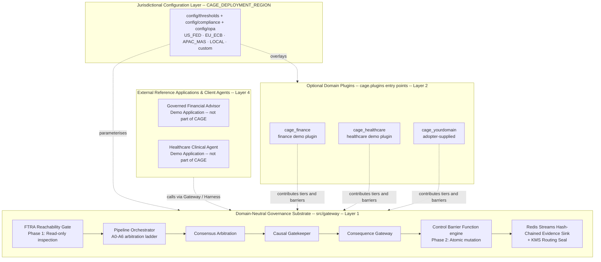

# Cybernetic Agent Governance Engine (CAGE)


> **A domain-agnostic, application-free AI governance platform providing runtime safety boundaries, compliance enforcement, and explainable oversight for autonomous AI systems.**

CAGE is an application-agnostic governance substrate that contains **zero built-in applications**. It provides pure, domain-neutral governance mechanisms:

- **Universal safety mechanisms** — Control Barrier Functions, consensus arbitration, causal reasoning, FTRA reachability analysis, and pipeline orchestration that operate on abstract action primitives and require no domain knowledge.
- **Domain plugins** — Extensible safety tiers, barriers, rails, and tools for finance, healthcare, or any custom domain, loaded through the `cage.plugins` entry-point group.
- **Regional compliance** — Configurable postures for US Federal, EU, APAC, or custom jurisdictions, selected at deploy time with a single environment variable.
- **Runtime enforcement** — Non-bypassable pipeline orchestration with cryptographic evidence sealing and automated Human-in-the-Loop escalation.

> **CAGE Has No Built-In Applications:** CAGE is a pure governance engine and control middleware, not an application. The **Governed Financial Advisor** (`src/governed_financial_advisor/` / `src/cage_finance/`) and **Healthcare Agent** (`src/cage_healthcare/`) included in this repository are **not part of the CAGE platform core**. They are reference applications and example domain plugins implemented solely to demonstrate CAGE's capabilities and to prove that the identical governance substrate operates seamlessly across radically different operational domains (finance vs. healthcare) without modifying a single line of kernel code.

Domain specificity and jurisdictional compliance are **configuration, not core requirements**. The finance and healthcare packages shipped in this repository are illustrative example domains that exercise the extension contract — neither is privileged by the kernel.

   

**Universal (all regions):** 

**Jurisdictional Extensions:**      

---

## What's New in v3.1.0

> **Release date:** 2026-09-22 — Zero-Trust Identity & Egress: agent identity moves from the application layer to the transport layer, and outbound credentials move from adapter-held secrets to a brokered, SVID-scoped seam.
> See [CHANGELOG.md](CHANGELOG.md#310---2026-09-22) and [docs/BREAKING_CHANGES_v3.md](docs/BREAKING_CHANGES_v3.md) for the migration guide.

> [!WARNING]
> **Breaking change.** `X-Agent-ID` / `X-SPIFFE-ID` header parsing and the anonymous
> fallback are removed. Callers must reach the gateway through the Linkerd mesh with an
> mTLS workload identity (`l5d-client-id`) listed in `CAGE_TRUSTED_CLIENT_IDENTITIES`;
> requests without a trusted identity fail closed with **403**. The Envoy ext_authz
> Agent Gateway adapter has since been removed; GKE + Linkerd mTLS is the sole
> reference deployment. No compatibility shim is provided — the removed path was a
> spoofing vector.

| Capability | Location | Description |
|---|---|---|
| **Linkerd mTLS Workload Identity** | `src/gateway/server/workload_identity.py` | Gateway ingress authentication (`WorkloadIdentityMiddleware`) and caller identity extraction (`extract_client_identity(scope)`) from Linkerd's verified `l5d-client-id` header (`<sa>.<ns>.serviceaccount.identity.linkerd.<trust-domain>`). `CAGE_TRUSTED_CLIENT_IDENTITIES` is required in every environment; there is no anonymous principal. |
| **DPoP Proof-of-Possession (RFC 9449)** | `src/gateway/server/dpop_validator.py` | Vendor-neutral `ProofOfPossessionValidator` protocol and pure-Python `DPoPValidator` binding tokens to the client certificate thumbprint. Unit-tested; **not yet wired into an ingress path**. |
| **Declarative A2A Authorization** | `config/opa/agent_catalog.rego` | Subagents declare `authorized_parent_prefixes`; OPA authorizes via `startswith()` prefix matching, keeping ephemeral instance IDs out of policy bodies. |
| **Egress Credential Broker Seam** | `src/gateway/governance/seams/credential_broker.py` | Layer 1 holds the `CredentialBrokerAdapter` protocol; the Layer 3 reference actuator invokes it as a pre-dispatch gate keyed on agent SVID and tool name, masks values in logs, keeps them out of the audit record, and fails closed on denial. |
| **CAGE Guard for LangGraph** | `packages/cage-client/` | Governance enforcement wrapped around LangGraph nodes via the CAGE Client SDK. |

---

## What's New in v3.0.1

> **Release date:** 2026-09-07 — Major Version Release: Domain-agnostic kernel extraction, Layer 1/Layer 2 separation, architectural cleanup, formal safety consolidations, governed threshold centralization, and 6-primitive governance runtime.
> **Remediation & Hardening:** 2026-09-09 — 19 feature branches, 26 distinct architectural enhancements, 5 defect fixes, and test suite stabilization (3839 → 3921 passing, 4148 total collected tests).
> See [CHANGELOG.md](CHANGELOG.md#300---2026-09-07) and [docs/BREAKING_CHANGES_v3.md](docs/BREAKING_CHANGES_v3.md) for migration guides.

**v3.0.1 Architectural Consolidation & Hardening:** CAGE v3.0.1 completed the **Layer 1 (domain-neutral kernel) / Layer 2 (domain plugins)** separation. All governance enforcement mechanisms now live under [`src/gateway/governance/`](src/gateway/governance/) and operate on abstract action primitives. Following the major release, a comprehensive September 9, 2026 implementation session remediated contract drift across 19 feature branches, stabilizing the test suite from 3,839 to 3,921 unit/local tests (4,148 total collected tests) and resolving 25 test issues (21 failures + 4 errors) and 5 defects.

### Major Capabilities & Enhancements

| Capability | Location | Description |
|---|---|---|
| **5 Governance Decision Primitives** | `src/gateway/governance/governor/verdicts.py` | Full first-class runtime routing for all five decisions: `ALLOW`, `DENY`, `REQUIRE_APPROVAL`, `DEFER`, `NARROW` (`validate_action()`). A transient fault is a `DENY` with a refusal receipt; there is no `PAUSE`. |
| **Seams Contract Extraction** | `src/gateway/governance/seams/` | Decoupled `NormativeProvider`, `AttestationProvider`, and `ExecutionActuator` into dedicated seam protocols with zero kernel imports, eliminating circular vendor dependencies. |
| **Full Refusal Receipt Ingestion** | `src/gateway/server/governance_middleware.py` | Complete serialization of `RefusalReceipt` v3 into the evidence stream, preserving 5-part proof chains and byte-identical `proof_hash` calculations. |
| **External Hold Generalization** | `src/gateway/governance/defer_queue.py` | Generalized `DeferReason.EXTERNAL_HOLD` driven dynamically by finding fields (`hold_ttl_seconds`), removing hardcoded vendor branches. |
| **Kernel ConsequenceToken & ContentAddress** | `src/gateway/governance/` | In-kernel token minting (`consequence_token_service.py`) and content-addressed storage primitives (`content_address.py`). |
| **Attestation Attribution & CER Verification** | `src/integrations/provider_02/` | AttestationProvider protocol conformance, Ed25519 CER signature verification against key manifests with fail-closed enforcement, and graph topology injection. |
| **OSCAL CER Disclosure Links** | `src/compliance_bridge/` | Automatic injection of Causal Evidence Record (CER) indices and links directly into OSCAL SSP exports. |
| **Routing Seal v3 (JWT/KMS format with `record_hash` Binding)** | `src/gateway/governance/routing_seal.py` | Cryptographically binds the SHA-256 evidence `record_hash` into the 4-tuple seal format `<expire_hex>.<action_slug>.<record_hash_hex>.<signature_hex>`, enforcing fail-closed actuator checks. |
| **Lua-Atomic CBF Check & Commit (CR-3)** | `src/gateway/governance/safety/cbf_engine.py` | Eliminates TOCTOU concurrency windows by consolidating barrier check and balance deduction into atomic Redis Lua execution (`atomic_verify_and_commit()`). |
| **Synchronous Replica Barrier & Monotonic Fence Epoch** | `src/gateway/governance/safety/cbf_engine.py` | Synchronous `WAIT` verification with fail-closed automatic rollback on replica timeout, plus monotonic `safety:fence_epoch` seeding (`_fetch_initial_fence_epoch_sync()`). |
| **Evidence Stream Blocking Preconditions** | `src/gateway/governance/evidence/stream.py` | Posture-based startup guard (`validate_evidence_stream_preconditions()`): under an enforcing posture a disabled stream is fatal and non-blocking commit requires `CAGE_ALLOW_NONBLOCKING_PROD=true`; the lifespan starts the sink and fails closed. |
| **Centralized Threshold Governance (EV-1–EV-6)** | `config/thresholds/*.json` | Replaced scattered `os.getenv` reads with typed, schema-validated configuration lookups (`get_confidence_defer_floor()`, `get_telemetry_max_staleness_seconds()`). |
| **Dual vLLM Architecture** | `deployment/k8s/`, `infra/targets/gcp-gke/` | Distinct `vllm-inference` (`Qwen2.5-7B-Instruct` with Hermes tool-calling) and `vllm-reasoning` (`DeepSeek-R1-Distill-Llama-8B` for pure chain-of-thought analysis). |
| **Reverse Boundary & Vendor Brand CI Gates** | `scripts/check_vendor_brands.py` | CI gates G3 and G7 enforcing strict architectural layer boundaries and vendor branding standards across adapters. |

---

## Test Status

| Suite / Jurisdiction | Posture | Result | Date |
|---|---|---|---|
| **Universal / Unit Suite (v3.1.0)** | `test` (offline, `make test-fast`) | ✅ **4,347 passed** / 0 failed / 122 skipped / 6 subtests passed | 2026-09-22 |
| **Universal / Unit Suite** | `test` (offline) | ✅ **3,921 passed** / 0 failed / 82 skipped (4,148 total collected) | 2026-09-09 |
| **US_FED** (NIST SP 800-53 / FedRAMP) | `dev` / `test` | ✅ **3,747 passed** / 0 failed / 67 skipped (75.40% cov) | 2026-09-03 |
| **US_FED** (NIST SP 800-53 / FedRAMP) | `prod` | ✅ **217 passed** / 0 failed / 131 skipped | 2026-09-03 |
| **EU_ECB** (GDPR / EU AI Act) | `dev` / `test` | ✅ **3,747 passed** / 0 failed / 75 skipped (75.40% cov) | 2026-09-03 |
| **EU_ECB** (GDPR / EU AI Act) | `prod` | ✅ **209 passed** / 0 failed / 139 skipped | 2026-09-03 |
| **APAC_MAS** (MAS TRM / FEAT) | `dev` / `test` | ✅ **3,747 passed** / 0 failed / 73 skipped (75.40% cov) | 2026-09-03 |
| **APAC_MAS** (MAS TRM / FEAT) | `prod` | ✅ **211 passed** / 0 failed / 137 skipped | 2026-09-03 |

Tests pass cleanly across all three regulatory postures on macOS and Linux GKE targets (`<cluster-name>`, project `<your-gcp-project>`).
Skipped tests represent live GKE cluster integration endpoints (evaluated via `scripts/port_forward_staging.sh` + `uv run pytest tests/ --run-integration`).

---

## Platform Compatibility

CAGE is a **Kubernetes-native** AI governance engine. The core governance kernel — OPA policy enforcement, NeMo Guardrails, SymbolicGovernor, Control Barrier Functions, and the LangGraph audit harness — has no hard dependency on a specific cloud, but the repository ships only two deployment targets under [`infra/targets/`](infra/targets/):

| Deployment Target | Path | What it provides | Status |
|---|---|---|---|
| GKE (Google Kubernetes Engine) | [`infra/targets/gcp-gke/`](infra/targets/gcp-gke/) | Full reference stack: GKE, Linkerd mTLS mesh (required for gateway ingress identity), managed data services, KMS keyrings, security perimeter | Reference deployment |
| Any existing Kubernetes cluster (k3s, kind, minikube, …) | [`infra/targets/agnostic/`](infra/targets/agnostic/) | Supporting services only: namespace, MinIO, PostgreSQL, Redis, vLLM, Langfuse, compliance bridge, OPA. No Linkerd mesh or gateway module | Local / development |
| EKS, AKS, OpenShift, other distributions | — | No dedicated target; portable in principle via the agnostic target plus a Linkerd mesh and a real asymmetric KMS provider | Not tested |

### Optional GCP Integrations

The following GCP services are drivers with the listed alternatives. Security primitives are not optional: under an enforcing posture the gateway refuses to start without a real asymmetric KMS signer, and in every posture it rejects callers without a trusted Linkerd workload identity.

| GCP Service | Purpose | Alternative |
|---|---|---|
| Cloud KMS | Seal, snapshot, and evidence signing | AWS KMS or Azure Key Vault (`src/integrations/{aws,azure}/kms_provider.py`); software Ed25519/HMAC signers only in DEV/TEST/CI posture |
| Cloud Storage (GCS) | OSCAL evidence storage / WORM system of record | AWS S3 (`src/integrations/storage_s3/`), MinIO |
| GKE Workload Identity | Pod-level IAM | AWS IRSA, Azure Workload Identity |
| Cloud Build | CI/CD | GitHub Actions, GitLab CI, any OCI-compatible CI (GKE images must be built by Cloud Build per [Deployment Rules](docs/operations/DEPLOYMENT_RULES.md)) |
| GKE `FQDNNetworkPolicy` (Dataplane V2) | FQDN egress allowlists (`enable_dataplane_v2` / `enable_fqdn_network_policy`, on by default in the GKE target) | Open-source Cilium on other clusters; or L3/L4 `NetworkPolicy` baseline only |

---

## Domain-Agnostic Architecture

CAGE is designed as a **domain-independent governance substrate with zero native applications**. The core enforcement mechanisms — CBF safety filters, consensus arbitration, the causal gatekeeper, FTRA boundary checking, the pipeline orchestrator, and the evidence chain — operate on abstract action primitives and require no domain knowledge. The mathematical invariant `h(x) ≥ 0` does not know what `x` means; it only knows the boundary must not be crossed.

Everything under [`src/gateway/`](src/gateway/) owns *mechanism*: the atomic Redis Lua barrier hop, fence-epoch logic, KMS signature verification, the quota reserver, the consensus algorithm, the causal refutation engine, LIFO rollback ordering, and evidence emission. A domain plugin owns only *nomenclature and parameters*: which actions it claims, which scalar the barrier watches, which threshold key holds the floor, which critics vote, and which tools exist.

### A Platform Without Applications: Demonstration Roles of Finance and Healthcare

To prove that CAGE is truly agnostic and that its universal governance engine works across orthogonal, high-stakes problem spaces without altering the kernel, this repository provides two reference implementations:

1. **Governed Financial Advisor** (`src/governed_financial_advisor/` & `src/cage_finance/`): Demonstrates high-stakes quantitative financial advisory, fiscal limit pre-reservations, cash barrier functions (`CashBarrier`), and trading actions (`execute_trade`) under SEC, FINRA, and FedNow compliance constraints.
2. **Healthcare Clinical Agent** (`src/cage_healthcare/`): Demonstrates clinical decision oversight, pharmacokinetic drug dosing, serum concentration barriers (`SerumConcentrationBarrier`), and medical order actions (`dose_order`) under HIPAA, FDA, and medical safety constraints.

**Neither application is part of the core CAGE platform.** Both are client applications and domain plugins designed to demonstrate the substrate's capabilities and prove that the kernel operates identically regardless of whether an action is `execute_trade` or `dose_order`.

**Deny-by-Default Kernel Property:** The bare Layer 1 kernel — a `SymbolicGovernor` assembled by `assemble_governor()` with no domain plugin contributions — enforces all universal safety mechanisms (FTRA reachability, pipeline orchestration, consensus, causal checks, evidence sealing) but **denies all domain-specific actions** because no plugin has registered action handlers. This is the intended fail-closed behavior: the kernel cannot govern what it does not understand. Domain semantics arrive exclusively through Layer 2 plugins. A deployed server always runs exactly one domain, selected by the required `CAGE_DOMAIN` environment variable.

**Domain specificity is added through optional plugins:**

| Plugin | Package | Contributes | Status |
| ------ | ------- | ----------- | ------ |
| **Finance** | [`src/cage_finance/`](src/cage_finance/) | Trading controls, fiscal pre-reservation limits, market-abuse critics, `execute_trade` tooling | Example demo domain |
| **Healthcare** | [`src/cage_healthcare/`](src/cage_healthcare/) | Dosing concentration barriers, clinical decision oversight, `dose_order` tooling | Example demo domain |
| **Custom** | `src/cage_<domain>/` | Manufacturing, logistics, energy, customer service, critical infrastructure — author your own | Adopter-supplied |

Both shipped plugins are **illustrative example domains of equal standing**; neither is privileged by the kernel. A CAGE process runs **exactly one** domain, named by the required `CAGE_DOMAIN` environment variable. Startup aborts if it is unset, lists more than one domain, or names a plugin that declares no `DomainConfig` (its FTRA terminal registry and optional causal graph).

```bash
# The only domain that ships a DomainConfig today
export CAGE_DOMAIN=finance

# Refuse to start until they ship their own FTRA registry (POAM-2026-077)
export CAGE_DOMAIN=healthcare
export CAGE_DOMAIN=physical_ai
```

[`tests/test_bare_kernel_portability.py`](tests/test_bare_kernel_portability.py) and [`tests/test_cage_plugin_validation.py`](tests/test_cage_plugin_validation.py) provide the standing proof of this claim: they verify that Layer 1 boots cleanly without loading proprietary cloud vendor SDKs and that plugin contracts enforce domain isolation. Companion tests in [`tests/test_healthcare_plugin.py`](tests/test_healthcare_plugin.py) assert the healthcare package contains **zero** Lua files and **zero** KMS imports — it cannot fork the atomicity or signing paths.

See [`docs/architecture/EXTENSIBILITY_ARCHITECTURE.md`](docs/architecture/EXTENSIBILITY_ARCHITECTURE.md) for the plugin authoring guide and domain-agnostic kernel thesis.

---

## Configurable Jurisdictional Compliance

CAGE supports multiple regulatory frameworks through **configurable compliance postures**. ISO/IEC 42001 is the universal baseline applied in every region; jurisdictional frameworks are additive extensions that block regional deployment posture only.

| Posture | Frameworks loaded | Threshold profile |
| ------- | ----------------- | ----------------- |
| **`US_FED`** | NIST AI 600-1, NIST SP 800-53 Rev 5 HIGH, NIST AI RMF, FedRAMP, SR 26-2 | [`config/thresholds/US_FED_BASELINE.json`](config/thresholds/US_FED_BASELINE.json) |
| **`EU_ECB`** | GDPR (incl. Art. 22), DORA, EU AI Act (Reg. 2024/1689), MiFID II | [`config/thresholds/EU_ECB_BASELINE.json`](config/thresholds/EU_ECB_BASELINE.json) |
| **`APAC_MAS`** | MAS Notice 655, MAS FEAT principles, MAS TRM Guidelines | [`config/thresholds/APAC_MAS_BASELINE.json`](config/thresholds/APAC_MAS_BASELINE.json) |
| **`LOCAL`** | ISO 42001 universal baseline only — development default | Kernel defaults |

**Selecting a posture:**

```bash
export CAGE_DEPLOYMENT_REGION=US_FED    # or EU_ECB, APAC_MAS, LOCAL
```

Each posture loads region-specific thresholds, OPA policies, and compliance baselines from [`config/thresholds/`](config/thresholds/) and [`config/compliance/`](config/compliance/). See [`docs/compliance/REGION_GUARD_AUDIT.md`](docs/compliance/REGION_GUARD_AUDIT.md) for the region-guard enforcement details.

**Adding a custom jurisdiction** is a config-only operation requiring no Python changes:

1. Add `config/thresholds/<REGION>_BASELINE.json` following the existing schema.
2. Add `config/compliance/<REGION>_BASELINE.json` declaring the control profile.
3. Register any region-specific Rego under `config/opa/` and Lula assertions under `compliance/lula/`.
4. Ship a per-plugin overlay (`config/compliance/<REGION>_OVERLAY.json`) inside each active domain plugin.
5. Set `CAGE_DEPLOYMENT_REGION=<REGION>`.

Domain plugins and jurisdictional postures compose independently — any plugin can run under any posture.

---

## The CAGE Product Offering

CAGE v3.0.1 provides a **three-layer governance architecture** for enterprise AI, built on the **STPA ↔ STERA Duality**. 
- **STPA (System-Theoretic Process Analysis)** identifies *what* can go wrong at design time, generating the declarative rules.
- **STERA (System-Theoretic Execution and Risk Assessment)** is the runtime bind-time admissibility framework that decides *whether this specific action is admissible right now*.

This provides **evidentiary independence** — the system cannot manufacture the conditions necessary to satisfy its own governance checks.

**Layer 1 (L1) — Domain-Neutral Kernel** provides universal enforcement mechanisms:

1.  **The Governance Gateway** *(L1)*: High-performance inference proxy and MCP tool server enforcing the **STERA Runtime Pipeline** — pre-execution FTRA reachability (Tier 0.5) plus domain-agnostic in-pipeline stages (STPA/UCA validation, consensus arbitration, Control Barrier Function, causal gatekeeper). The evaluation boundary is strictly isolated from side-effect actuators via zero-dependency protocols in `src/gateway/governance/seams/` (Formal Seam Extraction). Combined with network and runtime hardening (Linkerd mTLS with a gateway `AuthorizationPolicy` that admits only the advisor's workload identity, standard Kubernetes NetworkPolicy L3/L4 baseline). The GKE target enables **Dataplane V2 and GKE `FQDNNetworkPolicy`** by default and applies the egress `NetworkPolicy` / `FQDNNetworkPolicy` set from [`infra/targets/gcp-gke/network_policy.tf`](infra/targets/gcp-gke/network_policy.tf), with an equivalent kubectl overlay in `deployment/k8s/cilium/` (legacy directory name; it contains no Cilium CRDs). Acts as the "Controller" in our Controller-Plant architecture.
2.  **The FTRA Reachability Gate** *(L1)*: Pre-execution Forward-Looking Trajectory Reachability Analyzer ([`src/gateway/governance/ftra/`](src/gateway/governance/ftra/)) that builds a NetworkX directed graph from the agent's `ExecutionPlan`, classifies each step with `IrreversibilityClassifier` against the signed terminal registry, and issues a CLEAR / HITL_REQUIRED / BLOCKED verdict before any tool call is made.
3.  **The Reusable Agent Harness** *(L1)*: Deterministic LangGraph factories (`OpaNodeConfig`/`NemoNodeConfig`) that wrap *any* agentic workflow in mandatory, non-bypassable governance guardrails.
4.  **The STPA-to-Policy Compiler** *(L1)*: CLI tool ([`src/gateway/governance/stpa_compiler.py`](src/gateway/governance/stpa_compiler.py)) ingesting declarative YAML control structure ([`config/stpa_control_structure.yaml`](config/stpa_control_structure.yaml) plus per-domain hazard files such as [`src/cage_finance/config/stpa/trade_hazards.yaml`](src/cage_finance/config/stpa/trade_hazards.yaml)) and auto-generating OPA Rego policies, NeMo Colang rails, and — inside each domain plugin — Python UCA rules and LangGraph Saga compensators (finance: [`src/cage_finance/stpa/`](src/cage_finance/stpa/)).
5.  **The DoWhy Causal Gatekeeper** *(L1)*: Optional refutation-based causal inference safety lock ([`src/gateway/governance/causal/gatekeeper.py`](src/gateway/governance/causal/gatekeeper.py)) validating world-model integrity via DoWhy placebo refutation before allowing high-stakes actions. Integrated as a pipeline stage.
6.  **The Cryptographic Hash-Chained Context Accumulator** *(L1)*: SHA-256 hash-chained, append-only log of every `OscalFinding`. Each node's `record_hash` binds `SHA-256(prev_hash ‖ content_json ‖ control_id ‖ event_type ‖ node_index ‖ audit_id)`, sealing an unalterable chain-of-custody. Satisfies **ISO 42001 Annex A.5.3** and neutralizes **AARM-V1**.
7.  **The 5 Governance State Machine Primitives** *(L1)*: Full first-class runtime execution for all five governance primitives (`ALLOW | DENY | REQUIRE_APPROVAL | DEFER | NARROW`) in `SymbolicGovernor.validate_action()`. Execution is parked in Redis-backed `DeferQueue` for `DEFER` and `REQUIRE_APPROVAL`, and re-verified on clamped params under `NARROW`. Satisfies **ISO 42001 Annex A.8.4** and neutralizes **AARM-V7**.
8.  **Routing Seal v3 (JWT/KMS format)** *(L1)*: Short-lived JWT ([`src/gateway/governance/routing_seal.py`](src/gateway/governance/routing_seal.py)) signed by the gateway KMS signer and bound to the SHA-256 evidence `record_hash`, produced only after all tiers pass. Evidence binding is required by default (`CAGE_REQUIRE_EVIDENCE_BINDING=false` is honoured only outside production): a seal is consumable only if its `record_hash` matches the evidence index written at issuance. The `action_hash` is the RFC 8785 hash of the exact I-JSON `(action, params)` (`canon: cage-action/1`, no `str()` coercion), unconsumed seals can be revoked before expiry (`revoke_seal()`), and unknown seal `kid`s fail closed.
9.  **Cloud KMS HSM-Backed Governance Signing** *(L1)*: Asymmetric signing through `KMSGovernanceSigner` ([`src/gateway/governance/kms_signer.py`](src/gateway/governance/kms_signer.py)). Cloud providers live in Layer 3 (`src/integrations/{gcp,aws,azure}/kms_provider.py`) and are loaded lazily by [`signer_factory.py`](src/gateway/governance/signer_factory.py). Each workload signs with its own key: gateway seals (`KMS_GOVERNANCE_KEY`), reconciler snapshots (`RECONCILER_KMS_KEY`), and compliance-bridge evidence (`EVIDENCE_KMS_KEY`); the advisor holds no signing key. Private keys never leave the HSM; verification uses locally-embedded public key PEM for sub-millisecond latency.
10. **Heterogeneous Multi-Model Consensus** *(L1)*: `ConsensusModelRegistry` routes each critic persona to distinct vLLM inference backends. No single model can "consent" to its own output — system invariants are no longer vulnerable to shared semantic blind spots.
11. **Lua-Atomic CBF with Strict Replica Barrier** *(L1)*: Consolidates barrier check and balance debiting into atomic Redis Lua (`atomic_verify_and_commit()`), enforces synchronous `WAIT` replication with fail-closed rollback on replica timeout, prevents stale-state replay via monotonic `safety:fence_epoch`.
12. **Externally Reconciled CBF Ground Truth** *(L1)*: `GroundTruthReconciler` ([`src/gateway/governance/reconciliation/daemon.py`](src/gateway/governance/reconciliation/daemon.py)) polls domain-contributed `GroundTruthProvider`s (reference backend: a seeded `SimulatedSource` with fault injection), signs verified snapshots with the reconciler's own key (`RECONCILER_KMS_KEY`), and writes TTL-bounded records (300 s default). The CBF verifies each snapshot by `kid` against reconciler-only trust anchors ([`reconciliation/trust.py`](src/gateway/governance/reconciliation/trust.py)) and rejects snapshots signed by the gateway key.
13. **Mechanized Formal Model** *(L1)*: Exhaustive BFS state-space exploration ([`proof/model.py`](proof/model.py) and [`proof/distributed_cbf_model.py`](proof/distributed_cbf_model.py)) proving the `NoDirectBind` invariant holds across all sequential and concurrent interleavings.

**Layer 2 (L2) — Domain Plugins** contribute domain-specific semantics (exactly one per process, selected via `CAGE_DOMAIN`):

14. **Finance Plugin** *(L2)*: Trading controls, `FiscalLimitGuard` (atomic pre-reservation preventing multi-agent "race to the rail"), `CashBarrier` declaration, `execute_trade` tooling, market-abuse critics, LangGraph Saga atomic transaction guarantees with WAL + LIFO rollback ([`src/cage_finance/`](src/cage_finance/)).
15. **Healthcare Plugin** *(L2)*: Dosing concentration barriers, clinical decision oversight, `dose_order` tooling, `SerumConcentrationBarrier` declaration ([`src/cage_healthcare/`](src/cage_healthcare/)).

**Layer 3 (L3) — Integrations & Seam Contracts**:

16. **Native AARM Threat Vector Mapping** *(L3)*: Machine-readable proof that specific CAGE control points neutralize all 11 CSA AARM threat vectors. `GET /v1/aarm/conformance-report` returns live `NEUTRALIZED | PARTIAL | EXPOSED` verdicts per vector.
17. **Human-Gated NeMo Refinement** *(L3)*: All incoming policy changes staged via the gateway's `POST /v1/nemo/propose-refinement` ([`hybrid_server.py`](src/gateway/server/hybrid_server.py)) and require explicit human approval with reviewer identity and rationale before applying.

Compliance is not documented after the fact; it is enforced at the point of inference, producing both governed outputs and a cryptographically hash-chained, tamper-evident audit evidence trail in real time.

---

## Architecture Overview

CAGE is composed of the following runtime subsystems:

| Subsystem                        | Layer | Root Path                         | Role                                                                        |
| -------------------------------- | ----- | --------------------------------- | --------------------------------------------------------------------------- |
| **Gateway / Governance Harness** | **L1** | `src/gateway/governance/`         | Domain-neutral enforcement kernel: FTRA gate, pipeline orchestrator, CBF engine, consensus arbitration, causal gatekeeper, evidence chain, routing seal |
| **Symbolic Governor Runtime**    | **L1** | `src/gateway/governance/governor/` | Immutable `SymbolicGovernor` built only via the composition root (`assemble_governor()` / `bootstrap_governor()`), startup posture checks, dispatch loop, 2-phase commit, and interruption taxonomy — see [`SYMBOLIC_GOVERNOR_RUNTIME.md`](docs/architecture/SYMBOLIC_GOVERNOR_RUNTIME.md) |
| **Consequence Gateway**          | **L1** | `src/gateway/governance/`         | 6-step token evaluation, JWS verification, authority store, and fail-closed decision/refusal evidence emission — see [`CONSEQUENCE_GATEWAY.md`](docs/architecture/CONSEQUENCE_GATEWAY.md) |
| **FTRA Reachability Analyzer**   | **L1** | `src/gateway/governance/ftra/`    | Irreversibility classification and graph bounding — see [`FTRA_REACHABILITY_ANALYZER.md`](docs/architecture/FTRA_REACHABILITY_ANALYZER.md) |
| **Cryptographic Signer Engine**  | **L1** | `src/gateway/governance/`         | Cloud KMS provider, RFC 8785 JCS canonicalization, and JWKS resolution — see [`CRYPTOGRAPHIC_SIGNER_ENGINE.md`](docs/architecture/CRYPTOGRAPHIC_SIGNER_ENGINE.md) |
| **Ingress Identity Boundary**    | **L1** | `src/gateway/server/workload_identity.py`, `src/gateway/server/dpop_validator.py` | Linkerd mTLS workload identity allowlist enforcement (`WorkloadIdentityMiddleware`) and caller extraction (`extract_client_identity(scope)`), required in every environment and failing closed with 403. An RFC 9449 DPoP validator ships but is not yet wired into ingress — see [`AGENT_IDENTITY_BINDING_SPEC.md`](docs/architecture/AGENT_IDENTITY_BINDING_SPEC.md) |
| **Seam Contracts**               | **L1** | `src/gateway/governance/seams/`   | Zero-kernel-import protocols for external adapters: `normative.py`, `attestation.py`, `actuation.py`, `graph_topology.py`, `credential_broker.py` |
| **Compliance Bridge**            | **L3** | `src/compliance_bridge/`          | Evidence custody (`EvidenceCustodian`) and WORM read-back verification (`CustodyVerifier`, `GET /v1/evidence/verify`); OSCAL audit ingest and custody-gated assessment results; SSE event bus; Langfuse integration; AARM Conformance Engine; DEFER Queue API; infrastructure telemetry to ClickHouse |
| **Vendor Integrations**          | **L3** | `src/integrations/`               | Isolated third-party adapters: `provider_01/` (normative provider), `provider_02/` (CER attestation), `provider_03/` (JCS canonicalization), `actuator_01/` (execution actuator), `provider_05/` (Verifiable Execution Evidence Pack), `provider_06/` (tri-state verifier), `storage_gcs/` (GCS durable sink), `storage_s3/` (S3 durable sink), `gcp/` / `aws/` / `azure/` (KMS signing providers loaded via `signer_factory.py`), `nemo/` (NeMo Guardrails), `telemetry_langfuse/` (Langfuse telemetry) |
| **Domain Plugins** *(optional)*  | **L2** | `src/cage_finance/`, `src/cage_healthcare/` | Entry-point (`cage.plugins`) capability packages contributing domain-specific tiers, barriers, rails, tools, and compliance overlays. Finance and healthcare are equal-standing example domains; adopters add `src/cage_<domain>/`. **Zero plugins loaded:** kernel denies all domain actions (fail-closed) |
| **Jurisdictional Configuration** *(config layer)* | **L3** | `config/thresholds/`, `config/compliance/`, `config/opa/` | Region-selected thresholds, control profiles, and policy bundles resolved from `CAGE_DEPLOYMENT_REGION`. No Python code is region-specific |
| **AgentSight UI**                | **L3** | `src/agentsight-ui/`              | React/TypeScript operator dashboard; real-time governance and remediation events |
| **AgentSight eBPF DaemonSet**    | **L3** | `deployment/agentsight/`          | Kernel-level process telemetry via BPF uprobes                              |
| **Reference Application (Finance)** *(demo)* | **Layer 4** | `src/governed_financial_advisor/` | Example-domain LangGraph multi-agent pipeline and FastAPI server. It hosts no `SymbolicGovernor`, signing key, or Google Cloud identity: governed actions and post-HITL revalidation are forwarded to the gateway (`/tools/execute`, `/governance/revalidate-post-hitl`). Implemented solely to demo CAGE capabilities in finance; **not** part of the CAGE platform and not required to run the kernel |

The layering below separates the **domain-neutral substrate** (always present, zero native applications), the **optional domain plugins** (dashed — a server process loads exactly one, named by `CAGE_DOMAIN`), and the **jurisdictional configuration layer** (selected at deploy time):


```mermaid
graph TB
    subgraph CFG[Jurisdictional Configuration Layer -- CAGE_DEPLOYMENT_REGION]
        REG[config/thresholds + config/compliance + config/opa<br/>US_FED · EU_ECB · APAC_MAS · LOCAL · custom]
    end

    subgraph APP[External Reference Applications & Client Agents -- Layer 4]
        GFA[Governed Financial Advisor<br/>Demo Application -- not part of CAGE]
        HLTH_APP[Healthcare Clinical Agent<br/>Demo Application -- not part of CAGE]
    end

    subgraph PLG[Optional Domain Plugins -- cage.plugins entry points -- Layer 2]
        FIN[cage_finance<br/>finance demo plugin]
        HLTH[cage_healthcare<br/>healthcare demo plugin]
        CUST[cage_yourdomain<br/>adopter-supplied]
    end

    subgraph CORE[Domain-Neutral Governance Substrate -- src/gateway -- Layer 1]
        FTRA[FTRA Reachability Gate<br/>Phase 1: Read-only inspection]
        ORCH[Pipeline Orchestrator<br/>A0-A6 arbitration ladder]
        CONS[Consensus Arbitration]
        CAUS[Causal Gatekeeper]
        CGW[Consequence Gateway]
        CBF[Control Barrier Function engine<br/>Phase 2: Atomic mutation]
        EVID[Redis Streams Hash-Chained Evidence Sink<br/>+ KMS Routing Seal]
    end

    REG -.parameterises.-> CORE
    REG -.overlays.-> PLG
    APP -.calls via Gateway / Harness.-> CORE
    FIN -.contributes tiers and barriers.-> CORE
    HLTH -.contributes tiers and barriers.-> CORE
    CUST -.contributes tiers and barriers.-> CORE
    FTRA --> ORCH --> CONS --> CAUS --> CGW --> CBF --> EVID
```

Solid arrows are always-on kernel flow. Dashed arrows are optional or configuration-time bindings: remove every plugin and application, and the substrate still enforces FTRA, orchestration, barriers, consensus, causal checks, and evidence sealing.

The trace below illustrates the **Governed Financial Advisor demo application** end-to-end request path — demonstrating how an external multi-agent application integrates with the CAGE substrate, not a built-in CAGE feature:

```
User ──POST /agent/query──► FastAPI Agent Server (:8000)
User ──FastMCP over SSE──► Gateway Transport (:8080)
                                      │
                         [nemo_guardrail] (mandatory input rail - Node 1)
                                      │
                         LangGraph StateGraph (12 Nodes)
                         thinker_node (DeepSeek-R1) → doer_node (Llama 3.1)
                            ├─► data_analyst → [nemo_output_rail_da] ──► (short-circuit path)
                            └─► execution_analyst → evaluator 
                                      │ (APPROVED + sig)
                                 safety_check ──(BLOCKED/ESCALATED)──┐
                                      │ (APPROVED/SKIPPED)           │
                         [governed_trader] (HITL Interrupt Gate)      │
                                      │                              ▼
                                  explainer ◄────────────────────────┘
                                      │
                         [nemo_output_rail] (mandatory output rail)
                                      │
                               ◄── governed response ──
```

An equivalent **Healthcare Clinical Agent demo** path traverses the identical substrate, substituting `dose_order` for `execute_trade`, `SerumConcentrationBarrier` for `CashBarrier`, and clinical critics for market critics — with **no kernel change**. Both reference applications demonstrate that CAGE's governance mechanisms are completely domain-agnostic. Any adopter domain follows the same substitution pattern.

For full architectural detail, see [`docs/architecture/GATEWAY_ARCHITECTURE.md`](docs/architecture/GATEWAY_ARCHITECTURE.md), the [Technology Stack](docs/architecture/TECH_STACK.md), the [Multi-Agent System Architecture](docs/architecture/AGENT_SYSTEM_ARCHITECTURE.md), and the [Extensibility Architecture](docs/architecture/EXTENSIBILITY_ARCHITECTURE.md) (domain-agnostic kernel design and multi-domain roadmap). Four subsystem deep-dives cover the enforcement substrate in detail: [Symbolic Governor Runtime](docs/architecture/SYMBOLIC_GOVERNOR_RUNTIME.md), [Consequence Gateway](docs/architecture/CONSEQUENCE_GATEWAY.md), [FTRA Reachability Analyzer](docs/architecture/FTRA_REACHABILITY_ANALYZER.md), and [Cryptographic Signer Engine](docs/architecture/CRYPTOGRAPHIC_SIGNER_ENGINE.md).

---

## Using CAGE with LangGraph

CAGE provides **governance-as-a-service for LangGraph applications** through the lightweight **`cage-client` SDK**. Install the client package, decorate your LangGraph nodes with `@cage_guard`, and all governance enforcement happens transparently.

### Quick Start (3 Steps)

#### 1. Install the Client SDK

```bash
pip install "cage-client[langgraph] @ git+https://github.com/google/cybernetic-agent-governance-engine.git#subdirectory=packages/cage-client"
```

Or with `uv`:
```bash
uv add "cage-client[langgraph] @ git+https://github.com/google/cybernetic-agent-governance-engine.git#subdirectory=packages/cage-client"
```

#### 2. Start CAGE Governance Services

```bash
# Clone CAGE repository (one-time setup)
git clone https://github.com/google/cybernetic-agent-governance-engine.git
cd cybernetic-agent-governance-engine

# Start infrastructure: Gateway :8080, OPA :8181, App :3000
# (Redis is available via docker-compose.local-dev.yml --profile with-redis)
docker compose up

# Verify gateway health
curl http://localhost:8080/health
```

#### 3. Decorate Your LangGraph Nodes

```python
from langgraph.graph import StateGraph
from cage_client import CageClient
from cage_client.adapters.langgraph import cage_guard

# Initialize client (once at app startup)
cage = CageClient(
    gateway_url="http://localhost:8080",
)


# Define your LangGraph workflow
class AgentState(TypedDict):
    query: str
    proposed_action: dict  # Parameters for governed action
    agent_id: str
    result: str


# Decorate high-stakes nodes with governance
@cage_guard(client=cage, action="execute_trade")
async def execute_trade_node(state: AgentState) -> AgentState:
    # This node ONLY runs if CAGE Gateway returns ALLOW
    trade = state["proposed_action"]
    result = await execute_trade(**trade)
    return {"result": f"Executed {trade}"}


# Build graph (governance enforcement is transparent)
graph = StateGraph(AgentState)
graph.add_node("planner", plan_trade)
graph.add_node("execute_trade", execute_trade_node)  # ← Governed node
graph.add_edge("planner", "execute_trade")
app = graph.compile()
```

**What happens at runtime:**
1. LangGraph reaches the `execute_trade` node
2. `@cage_guard` intercepts execution and calls `http://localhost:8080/governance/validate-action`
3. CAGE Gateway runs the two-phase governance pipeline (Phase 1: FTRA, STPA, OPA, confidence, consensus, causal; Phase 2: CBF and fiscal commits)
4. **ALLOW** → Node executes; **DENY** → Raises [`PolicyViolationException`](packages/cage-client/src/cage_client/exceptions.py); **DEFER** → Raises [`DeferralPending`](packages/cage-client/src/cage_client/exceptions.py) for HITL parking

### Architecture: Decoupled PEP/PDP Pattern

```
┌──────────────────────────────────┐
│   Your LangGraph Application    │
│   (pip install cage-client)      │
│                                  │
│   ┌──────────────────────────┐  │
│   │ @cage_guard decorator    │──┼──► HTTP/2 ──► CAGE Gateway :8080
│   │ (lightweight PEP client) │  │                (tiered PDP pipeline)
│   └──────────────────────────┘  │
└──────────────────────────────────┘
                                    
         Dependencies installed via pip install cage-client[langgraph]
         (httpx, pydantic, cryptography, langgraph)

┌─────────────────────────────────────────────┐
│  CAGE Governance Stack (docker compose up)  │
│                                             │
│  Gateway :8080  ──► OPA :8181               │
│                 ──► NeMo Guardrails         │
│                 ──► Redis (CBF, optional)   │
│                 ──► Langfuse (optional)     │
└─────────────────────────────────────────────┘
```

**Benefits:**
- **Zero boilerplate:** No manual REST calls, no envelope parsing
- **Fail-closed by default:** Network errors → action blocked
- **KMS-signed envelopes:** Receives tamper-evident `GovernanceEnvelope` decisions signed by the CAGE Gateway KMS key over Linkerd mTLS
- **W3C tracing:** Propagates `traceparent` for distributed traces
- **Exception-driven:** Governance denials surface as typed Python exceptions for LangGraph error handlers

### Client SDK Error Handling

```python
from cage_client.exceptions import PolicyViolationException, DeferralPending


@graph.on_error
async def handle_governance_error(state, error):
    if isinstance(error, PolicyViolationException):
        # Action denied by policy → route to replanning
        return {
            "next_node": "replan",
            "violation": error.violation_details,
            "reason": error.reason_code,
        }

    elif isinstance(error, DeferralPending):
        # Action requires HITL → park checkpoint
        return {
            "next_node": "__interrupt__",
            "ticket_id": error.ticket_id,
            "resume_after": error.expires_at,
        }

    raise error  # Re-raise non-governance errors
```

### Alternative Integration: Node Factories (Advanced)

For users building governance **into** the CAGE monorepo itself (not consuming it as a library), node factories are available:

```python
from src.gateway.governance.governor.bootstrap import bootstrap_governor
from src.gateway.governance.langgraph_harness import (
    OpaNodeConfig,
    create_opa_safety_node,
    create_nemo_guardrail_node,
)

# The governor is built once by the composition root (reads CAGE_DOMAIN) and passed explicitly
governor = bootstrap_governor()

graph.add_node("input_rail", create_nemo_guardrail_node())
graph.add_node(
    "safety_check",
    create_opa_safety_node(
        OpaNodeConfig(policy_action_name="execute_trade", payload_extractor=extract_trade_payload),
        governor,
    ),
)
```

**Use node factories when:** You're extending CAGE's kernel or building domain plugins ([`src/cage_finance/`](src/cage_finance/), [`src/cage_healthcare/`](src/cage_healthcare/))

**Use `cage-client` when:** You're building a standalone LangGraph app that consumes CAGE as a service (recommended for 95% of users)

### Complete Examples

| Example | Integration Method | Path |
|---------|-------------------|------|
| **Governed Financial Advisor** | Node factories (embedded in CAGE monorepo) | [`src/governed_financial_advisor/`](src/governed_financial_advisor/) · [`docs/examples/governed-financial-advisor/ARCHITECTURE.md`](docs/examples/governed-financial-advisor/ARCHITECTURE.md) |
| **Standalone LangGraph App** | `cage-client` SDK (recommended) | [`packages/cage-client/README.md`](packages/cage-client/README.md) |
| **Chaos Agent Playground** | Zero-infrastructure demo (no LangGraph) | [`examples/chaos_agent_playground.py`](examples/chaos_agent_playground.py) |

### Learn More

- **Client SDK Documentation:** [`packages/cage-client/README.md`](packages/cage-client/README.md)
- **Quick Start Guide:** [`docs/guides/LANGGRAPH_QUICKSTART.md`](docs/guides/LANGGRAPH_QUICKSTART.md)
- **Tutorial Notebook:** [`docs/guides/langgraph_governance_tutorial.ipynb`](docs/guides/langgraph_governance_tutorial.ipynb)
- **Release Notes:** [client-v0.2.0](https://github.com/google/cybernetic-agent-governance-engine/releases/tag/client-v0.2.0)
- **LangGraph Harness (Advanced):** [`docs/architecture/EXTENSIBILITY_ARCHITECTURE.md`](docs/architecture/EXTENSIBILITY_ARCHITECTURE.md#41-langgraph-harness--governance-node-composition)
- **HITL Interrupt Pattern:** [`docs/security/HITL_TOCTOU_REMEDIATION.md`](docs/security/HITL_TOCTOU_REMEDIATION.md)

---

## Key Features

- **Domain-Agnostic Governance Kernel (No Built-In Applications)** — Every enforcement mechanism operates on abstract action primitives. Domain semantics arrive exclusively through optional `cage.plugins` packages ([`src/cage_finance/`](src/cage_finance/), [`src/cage_healthcare/`](src/cage_healthcare/), or adopter-authored), exactly one of which is selected per process by `CAGE_DOMAIN`. Proven by [`tests/test_bare_kernel_portability.py`](tests/test_bare_kernel_portability.py) and [`tests/test_cage_plugin_validation.py`](tests/test_cage_plugin_validation.py).
- **Multi-Jurisdiction Compliance Profiles** — Dynamic loading of regional control profiles (`config/compliance/`) and thresholds (`config/thresholds/`) via `CAGE_DEPLOYMENT_REGION`. Ships `US_FED`, `EU_ECB` (EU AI Act, GDPR Art. 22, DORA, with Step 7 Fundamental Rights Impact Assessment attestation and SR 26-2 telemetry suppression), and `APAC_MAS` (MAS FEAT Principles) baselines; adding a jurisdiction is a config-only operation.
- **Reusable LangGraph Governance Harness** — `OpaNodeConfig` and `NemoNodeConfig` factories allow any agent to inherit enterprise governance (tracing, metrics, fail-closed mechanisms) with pluggable domain-state extractors.
- **DoWhy Causal Gatekeeper** — Microsoft DoWhy causal inference validates world-model integrity via placebo refutation before allowing high-stakes actions; fail-safe on error (blocks when causal assumptions cannot be verified). The Causal Gatekeeper's Redis fallback is now fail-closed: connection errors raise `RuntimeError` rather than returning a zero sentinel; absent keys return `None` (first-boot safe).
- **LangGraph Saga Pattern** — STPA compiler generates WAL forward nodes, idempotent compensating nodes, and a centralized `saga_router_node` from UCA definitions in YAML, compiled into the domain plugin (finance: [`src/cage_finance/stpa/saga_nodes.py`](src/cage_finance/stpa/saga_nodes.py)). UCA-4 (atomic debit/credit failure) is fully enforced. Ghost-state recovery (OOM crash between PENDING and COMPLETED) escalates to `human_review`. Rollback evidence emitted as OTel spans via `SagaCallbackHandler` (ISO 42001 A.8.4). A `rollback_state()` Saga compensation stub has been added to `FiscalLimitGuard` to reverse Redis debits when a downstream tier fails after Tier 3a commitment (saga-atomicity gap, not a concurrency race).
- **FiscalLimitGuard** — Redis `WATCH/MULTI/EXEC` optimistic-lock pre-reservation guard prevents multi-agent "race to the rail" where concurrent threads all read the same OPA limit and all pass. Fail-closed on Redis failure. Integrates with Saga rollback via `release(token)`.
- **Token Quota Proxy (CTRL_TQP_007)** — `src/gateway/governance/token_quota_proxy.py` enforces hard per-session step-count (`≤12`) and token (`≤100,000`) quotas via Redis atomic Lua counters. Fail-CLOSED: Redis unavailability blocks the request (HTTP 429). Two-phase commit: `check_and_increment()` reserves quota before the vLLM call; `reconcile_actual_tokens()` corrects over-allocation after the response. `rollback_step()` atomically decrements counters on downstream failure. Implements ISO 42001 Annex A.4 (Resource Management). Governance control: `CTRL_TQP_007`.
- **PII Sanitizer** — `src/gateway/governance/pii_sanitizer.py` applies 8 compiled regex patterns (SSN, credit card, email, phone, API key/Bearer token, and others) sequentially to every UCA compliance record before WORM persistence. Implements ISO 42001 Annex A.6 (Data Lineage and PII Leak Mitigation). Thread-safe; no per-call state.
- **UCA Logger** — `src/gateway/governance/uca_logger.py` builds, cryptographically signs (Cloud KMS in production; HMAC-SHA256 stub when `CAGE_ENV=test`), and persists 16-field ISO 42001 Clause 6.1 Unsafe Control Action records to a region-gated WORM bucket (`CAGE_DEPLOYMENT_REGION` → `OSCAL_S3_BUCKET_{REGION}`). Three UCA types: `quota_exceeded`, `prompt_injection`, `pii_sanitization`.
- **Mandatory NeMo input + output guardrails** — non-bypassable LangGraph nodes generated by the harness; fail-closed on any exception; Presidio PII scan on every request and response.
- **OPA policy evaluation via direct REST API** — circuit breaker defaults to DENY on failure; generated by the harness router.
- **STPA-to-Policy Compiler** — CLI tool (`src/gateway/governance/stpa_compiler.py`) ingests `config/stpa_control_structure.yaml` plus per-domain hazard YAML and generates OPA Rego, NeMo Colang rails, and per-domain Python UCA rules and LangGraph Saga nodes (finance: `GeneratedSTPAValidator` in [`src/cage_finance/stpa/uca_rules.py`](src/cage_finance/stpa/uca_rules.py)) — eliminating manual policy transcription errors.
- **Zero-Trust Network (Z3N) hardening** — Linkerd mTLS `Server`/`AuthorizationPolicy`/`MeshTLSAuthentication` admitting only the advisor's workload identity at gateway ingress (enforced again in-process by `WorkloadIdentityMiddleware` against `CAGE_TRUSTED_CLIENT_IDENTITIES`); GKE `FQDNNetworkPolicy` plus L3/L4 `NetworkPolicy` egress lockdown on Dataplane V2, with DNS egress restricted to kube-dns and Cloud DNS. Closes POAM-007 (IA-3); POAM-011 (SC-8) remains Open.
- **Automated OSCAL SSP exporter** — `oscal_ssp_exporter.py` surgically patches the 1,151-line `system-security-plan.yaml` in-place with implementation evidence for every governance control, on every CI run.
- **HITL Mandatory Rationale** — High-risk actions trigger LangGraph interrupts. Resuming the graph requires a mandatory justification that is cryptographically hashed into the evidence chain BEFORE the thread resumes.
- **Cryptographic Hash-Chained Context Accumulator (AARM-V1)** — `src/compliance_bridge/context_accumulator.py` promotes the SHA-256 chain-of-custody pattern to the core compliance pipeline. Each `OscalFinding` is hash-linked to the preceding node. A `CHAIN_SEALED` sentinel terminates every run. `chain_root`, `chain_length`, and `chain_integrity_valid` are returned in all audit API responses. Neutralizes **AARM-V1 Memory Poisoning**; satisfies **ISO 42001 A.5.3**.
- **DEFER State Machine Primitive (AARM-V7)** — `src/gateway/governance/defer_queue.py` parks execution context in Redis `db=1` (`noeviction`) when `confidence_score < 0.70`. The `GET /v1/defer/pending`, `POST /v1/defer/{id}/inject`, and `POST /v1/defer/{id}/escalate` endpoints manage the queue lifecycle. Neutralizes **AARM-V7 Context Window Overflow**; satisfies **ISO 42001 A.8.4** (UCA-7).
- **Native AARM 11-Vector Threat Ledger** — `src/compliance_bridge/aarm_mapper.py` provides a static, version-pinned ledger mapping all 11 CSA AARM vectors to specific CAGE control points. `GET /v1/aarm/conformance-report` returns per-vector `NEUTRALIZED | PARTIAL | EXPOSED` verdicts with optional vLLM narrative enrichment. Report auto-serialized to GCS/S3 on every Lula audit run.
- **Governance-as-Code Demo** — `examples/governance_demo.py` is a 3-act CLI walkthrough of v1.0.0 features (Concurrency Race, HITL Rationale, and Hash-Chain Verification).
- **Multi-Jurisdiction Compliance Engine (v2.0.0)** — `CAGE_DEPLOYMENT_REGION` env var activates a regional compliance posture at boot (`US_FED`, `EU_ECB`, `APAC_MAS`, `LOCAL`, or a custom jurisdiction added under `config/`), loading the correct JSON control profile, numeric thresholds, and OSCAL framework routing table with zero code changes.
- **Chaos Agent Playground** — `examples/chaos_agent_playground.py` provides a zero-infrastructure local demo intercepting five adversarial scenarios (A–E: governance tiers; D: Saga LIFO rollback; E: ghost-state OOM crash recovery) across the full governance stack.
- **OSCAL-compliant compliance bridge** — SSE event bus with 7-year audit retention; ISO 42001, FedRAMP HIGH, and EU AI Act evidence artifacts via Langfuse dual-project setup.
- **Langfuse observability** — LLM chain-of-thought, tool use, governance verdicts, and compliance scores captured without blocking inference.
- **Kubernetes-native secret management** — all secrets injected as environment variables via K8s `Secret` objects; no Google Secret Manager.
- **Cloud KMS HSM governance signatures (v2.0.0)** — Asymmetric signing via Google Cloud KMS HSM; private key never leaves hardware. Software/HMAC fallbacks are permitted only in DEV/TEST/CI posture; under an enforcing posture the `kms_signing_mode` startup check refuses to start. Required before any trade execution. KMS-signed payloads now embed a `signed_at` timestamp; the verifier rejects payloads older than 300 seconds, closing a replay-attack vector.
- **Human-gated NeMo refinement (v2.0.0)** — All config changes staged as proposals requiring explicit human approval with reviewer identity and rationale. Severs the autonomous hot-reload loop.
- **Heterogeneous multi-model consensus (v2.0.0)** — `ConsensusModelRegistry` routes each critic persona to a distinct vLLM backend, preventing single-model semantic blind spots. The degraded-quorum case (`ERROR + APPROVE`) is now explicitly routed to HITL escalation.
- **Externally reconciled CBF (v2.1.0 — POAM-023 Closed)** — `src/gateway/governance/reconciliation/daemon.py` implements external CBF state reconciliation. Reconciled snapshots are signed with `RECONCILER_KMS_KEY` before Redis write and verified by `kid`; the CBF fails closed on TTL expiry. Intra-window debits are ledgered atomically by `debit_id` in a shared O(1) Redis ledger (`cbf:debits`, `cbf:debits:total`) that the commit script nets in the same Lua hop as the fence-epoch check, and are settled only up to the custodian's signed `settled_through` ([ADR-010](docs/adr/ADR-010-settlement-aware-debit-ledger.md)), preventing double-spend across the snapshot refresh window (60 s poll / 300 s TTL) and the custodian's settlement lag.
- **Human-in-the-loop approval gate** — the advisor's `approval_node` suspends the graph with LangGraph's dynamic `interrupt()`; reviewers discover pending interrupts via `GET /v1/approvals/pending` and resume through the LangGraph SDK (`Command(resume=...)`).
- **W3C traceparent propagation** — full OTel trace waterfall across LangGraph → Gateway → vLLM; 100% sampling for governance decision spans.

---

## Mathematical Foundations & Formal Safety Guarantees

CAGE's runtime safety properties are grounded in formal mathematical constructs implemented directly in source code. The following summarises the key formalisms; full derivations are in [`docs/architecture/FORMAL_VERIFICATION.md`](docs/architecture/FORMAL_VERIFICATION.md) and [`docs/governance/CAUSAL_AND_CBF_GOVERNANCE.md`](docs/governance/CAUSAL_AND_CBF_GOVERNANCE.md).

### Control Barrier Function (CBF)

Source: [`src/gateway/governance/safety/cbf_engine.py`](src/gateway/governance/safety/cbf_engine.py)

The safe set is defined as `S = {x ∈ ℝⁿ : h(x) ≥ 0}`. The engine is invariant-parametric: it evaluates the affine barrier `h(x) = x − threshold` for whatever `InvariantModel` the active domain contributes. The finance plugin's `CashBarrier` ([`src/cage_finance/invariants.py`](src/cage_finance/invariants.py)) declares:

```
h(x) = cash_balance − min_cash_balance
```

The discrete-time CBF condition enforced at every governance tick is:

```
h(S(t+1)) ≥ (1−γ) · h(S(t)),   γ ∈ (0,1)
```

This guarantees that the cash balance never drops below the minimum threshold in a single step — the decay factor `γ` bounds the maximum permissible drawdown per evaluation cycle. External reconciliation is implemented via [`src/gateway/governance/reconciliation/daemon.py`](src/gateway/governance/reconciliation/daemon.py) (POAM-023 closed 2026-07-27).

### 8-Tier Two-Phase Symbolic Governor Pipeline

Sources: [`src/gateway/governance/governor/governor.py`](src/gateway/governance/governor/governor.py), [`src/gateway/governance/governor/pipeline.py`](src/gateway/governance/governor/pipeline.py), [`proof/model.py`](proof/model.py), [`src/gateway/governance/ftra/`](src/gateway/governance/ftra/)

Every governed action passes through the following two-phase pipeline (`run_pipeline()`) before a routing seal is issued. Tier labels match `TIER_LABELS` in `proof/model.py`. The model also carries a `Tier 7` FRIA label as a safe over-approximation, but no FRIA stage or tier runs at HEAD (`"fria"` survives only as a label in `PROFILE_STAGES`, and `run_pipeline()` never calls `enforce_fria_boundary()`):

| Phase | Tier | Name | Mechanism |
|-------|------|------|-----------|
| **Phase 1** | **Tier 0.5** | FTRA — Forward-Looking Trajectory Reachability Analyzer | `FtraStage.run()` (`src/gateway/governance/governor/stages/ftra.py`) and `create_ftra_node()` classify terminal steps with `IrreversibilityClassifier` and `PlanGraphAnalyzer`, issuing `CLEAR` / `HITL_REQUIRED` / `BLOCKED` |
| **Phase 1** | **Tier 1** | STPA/STAMP UCA validation | `StpaStage.run()` / `STPAValidator.validate()` (`src/gateway/governance/governor/stages/stpa.py`, `src/gateway/governance/stpa_validator.py`) checks Unsafe Control Actions defined in the STPA ontology |
| **Phase 1** | **Tier 3b** | OPA policy evaluation | `OpaStage.run()` (`src/gateway/governance/governor/stages/opa.py`) evaluates the active domain's Rego package (`DomainConfig.opa_package`; finance: `trade.governance`) prior to state mutation |
| **Phase 1** | **Tier 2** | Agent confidence | `ConfidenceStage.run()` (`src/gateway/governance/governor/stages/confidence.py`) checks the agent's self-reported confidence against `get_agent_confidence_threshold()` (default 0.95). It is reached only after a clean STPA check and a decided OPA verdict: every STPA finding is `HARD` (`StpaStage` promotes any other kind) and every undecided OPA verdict emits `HARD`, and the pipeline stops at the first `HARD` |
| **Phase 1** | **Tier 5** | Consensus gate | Heterogeneous multi-model consensus (`src/gateway/governance/consensus/engine.py`) required for trades ≥ $10k; 10-second per-critic timeout (`CONSENSUS_CRITIC_TIMEOUT_S`, default `10.0`s) |
| **Phase 1** | **Tier 6** | Causal gatekeeper | SCM $\beta \le 0$ fail-closed guard + `PlaceboTreatmentRefuter` (50 sims, p < 0.05, \|eff\| > 0.2) in `src/gateway/governance/causal/gatekeeper.py` validates world-model integrity |
| **Phase 2** | **Tier 3a** | Control Barrier Function | Lua-atomic check+commit (`atomic_verify_and_commit()` in `src/gateway/governance/safety/cbf_engine.py`) in Redis; commits only after all Phase 1 validation tiers pass with zero violations, and is previewed read-only when Phase 1 has non-`HARD` findings |
| **Phase 2** | **Tier 4** | Fiscal Limit Pre-Reservation | `FiscalLimitGuard.reserve()` (`src/cage_finance/safety/fiscal_limit_guard.py`, implementing the kernel `ResourceGuard` contract re-exported from `src/gateway/governance/safety/resource_guard.py`) atomically pre-reserves daily fiscal cap in Redis with `ReservationScope` LIFO rollback |

> **Zero Budget Leakage:** `phase2_mode()` in `src/gateway/governance/governor/pipeline.py` gates Phase 2. Any `HARD` Phase 1 finding skips it. Any other Phase 1 finding (for example an OPA `MANUAL_REVIEW` that will park the trade for a human), or `Profile.DRY_RUN`, runs it as a side-effect-free **preview**: barrier breaches are reported (`barrier_preview` in the verdict and DeferToken snapshot) before anyone approves, and nothing is written. Only a clean Phase 1 under `FULL` / `POST_HITL` commits. Rejections in Phase 1 therefore never mutate the ledger or consume spending cap.

The routing seal is issued only after all tiers pass. PII sanitization (`src/gateway/governance/pii_sanitizer.py`) and confabulation scoring (`src/gateway/governance/confabulation_scorer.py`) are separate, standalone components — PII sanitization runs on audit records immediately before WORM persistence (inside `src/gateway/governance/uca_logger.py`), and confabulation scoring is a Langfuse observability metric — neither is a sequential stage of `run_pipeline()`.

### Confabulation Risk Formula

Source: [`src/gateway/governance/confabulation_scorer.py`](src/gateway/governance/confabulation_scorer.py)

```
risk_score = 1.0 − confidence
```

Scores ≥ 0.95 pass immediately (async attestation, 0 ms overhead). Scores in [0.70, 0.95) enter the DEFER queue for synchronous blocking review. Scores < 0.70 are hard-denied without an external call.

### Causal Marginal Risk Boundary & Slope Guard

Source: [`src/gateway/governance/causal/gatekeeper.py`](src/gateway/governance/causal/gatekeeper.py)

A trade action is blocked when the causal slope is non-positive ($\beta \le 0 \implies \text{BLOCK}$) or when the bounded marginal risk expression exceeds the safety boundary:

```
risk_score = min(1.0, max(0.0, 0.5 + estimate.value * amount / CAUSAL_NORMALIZATION_SCALE))
where CAUSAL_NORMALIZATION_SCALE defaults to 10,000.0
risk_score > 0.95  →  BLOCK (marginal risk exceeded)
```

The `PlaceboTreatmentRefuter` runs 50 simulations; the causal effect is considered spurious (and the action blocked) when p < 0.05 or |effect| > 0.2.

### Routing Seal Integrity

Source: [`src/gateway/governance/routing_seal.py`](src/gateway/governance/routing_seal.py)

Every governance decision is sealed with a JWT signed by the gateway KMS signer (`KMS_GOVERNANCE_KEY`). `generate_seal_with_evidence()` blocks on a durable evidence-chain commit and binds the resulting `record_hash` into the seal, raising `EvidenceChainUnavailableError` if the sink fails.

Tokens carry a 30-second TTL (`GOVERNANCE_SEAL_TTL_S`). Unsigned, expired, or unknown-`kid` seals fail verification (`verify_seal()` raises) and the action is not executed. The legacy HMAC compatibility layer keyed by `GOVERNANCE_SALT` remains only for development; the `governance_salt` startup posture check refuses the default salt under an enforcing posture.

### Provenance Hash Chain

Source: [`src/gateway/governance/provenance_chain.py`](src/gateway/governance/provenance_chain.py)

SHA-256 hash chain with O(n) construction. Each node's `record_hash` is `SHA-256(prev_hash ‖ content_json)`, producing a tamper-evident chain-of-custody that detects any mutation at the altered node.

### Fiscal Limit Guard

Source: [`src/cage_finance/safety/fiscal_limit_guard.py`](src/cage_finance/safety/fiscal_limit_guard.py) (finance plugin; kernel contract in [`src/gateway/governance/safety/resource_guard.py`](src/gateway/governance/safety/resource_guard.py))

- Daily cap: **$500,000** over an 86,400 s rolling window
- Redis `WATCH/MULTI/EXEC` optimistic-lock pre-reservation prevents multi-agent "race to the rail"
- Exponential backoff on contention; fail-closed on Redis unavailability

### STPA Unsafe Control Actions (UCAs)

Source: [`src/cage_finance/config/stpa/trade_hazards.yaml`](src/cage_finance/config/stpa/trade_hazards.yaml) (finance plugin; kernel-level UCAs in [`config/stpa/core_system.yaml`](config/stpa/core_system.yaml))

| UCA ID | Condition | Enforcement |
|--------|-----------|-------------|
| **FIN-1** | `sell_percentage > stpa.max_sell_portfolio_fraction` (scope `execute_sell`) | Safety constraint |
| **FIN-2** | `latency_ms > stpa.max_latency_ms` (scope `execute_trade`, refs UCA-2) | Safety constraint |
| **UCA-5** | `drawdown > stpa.uca5_drawdown_threshold_pct` (US_FED: 4.5%, EU_ECB: 3.5%, APAC_MAS: 4.0%) | OPA Rego (DENY) + generated Python validator |
| **UCA-6** | `order_size > stpa.uca6_max_order_volume_fraction × daily_vol` (US_FED: 1%, EU_ECB: 0.5%, APAC_MAS: 0.8%) ⚠️ **SECURITY-CRITICAL THRESHOLD** | OPA Rego (DENY) + generated Python validator |

Full STPA hazard analysis: [`docs/security/STPA_ANALYSIS.md`](docs/security/STPA_ANALYSIS.md)

---

## Deployment Policy

CAGE enforces strict deployment rules to ensure compliance and consistency:

**🚨 Critical Rule:** When deploying to Google Kubernetes Engine (GKE), **ALWAYS use Cloud Build**, never local Docker builds.

**Why:**
- Platform consistency (avoids ARM64 vs AMD64 issues)
- Integrated security scanning
- Full audit trail for compliance
- Reproducible builds

**Quick Reference:**

| Target | Build Method | Command |
|--------|--------------|---------|
| GKE Production | ☁️ Cloud Build | `./deploy_all.sh --target gcp-gke --env prod` |
| GKE Development | ☁️ Cloud Build | `./deploy_all.sh --target gcp-gke --env dev --auto-approve` |
| Local k3d/kind | 🐳 Local Docker | `./deploy_all.sh --target agnostic --env dev` |
| Docker Compose | 🐳 Local Docker | `docker compose up` |

`infra/targets/` holds exactly two Terraform targets: `agnostic` (any existing Kubernetes cluster) and `gcp-gke`. The `gcp-gke` target is the sole reference cloud deployment (GKE + Linkerd mTLS with a Google CAS trust anchor); alongside the cluster it provisions dual Memorystore for Valkey instances (governance and app), Cloud SQL PostgreSQL for Langfuse, a retention-locked GCS WORM evidence bucket, the ClickHouse operator module, a dedicated signing keyring plus a separate CMEK keyring, and a VPC Service Controls / Binary Authorization perimeter ([`perimeter.tf`](infra/targets/gcp-gke/perimeter.tf)).

**Documentation:**
- [Deployment Rules](docs/operations/DEPLOYMENT_RULES.md) — Complete deployment policy
- [Agent Ops Architecture](docs/architecture/AGENT_OPS_ARCHITECTURE.md) — Defense-in-depth governance pattern
- [Deployment Guide](infra/DEPLOYMENT_GUIDE.md) — Step-by-step procedures

---

## Security & Compliance Status

> [!IMPORTANT]
> **CAGE v3.0.1 has not received a NIST Authorization to Operate (ATO).** The AI governance enforcement controls (NeMo Guardrails, OPA, Cloud KMS signing, HITL, STPA, heterogeneous consensus, human-gated refinement, externally reconciled CBF) are fully implemented and tested. The full NIST RMF authorization process — Security Assessment, System Security Plan, ATO letter — has not been completed. Regulated-environment deployers must conduct their own risk assessment before production use.

### Compliance Framework Scope

> **Architecture Note:** ISO 42001 is the **universal baseline** active in all three deployment regions. NIST SP 800-53, EU AI Act/GDPR/DORA, and MAS FEAT are **jurisdictional extensions** active only when `CAGE_DEPLOYMENT_REGION` is set to the corresponding value. See [`compliance/cross-region/JURISDICTIONAL_SEPARATION_ANALYSIS.md`](docs/compliance/cross-region/JURISDICTIONAL_SEPARATION_ANALYSIS.md) for the full architectural rationale.

| Compliance Framework | Scope | `CAGE_DEPLOYMENT_REGION` | Status |
| -------------------- | ----- | ------------------------ | ------ |
| **ISO/IEC 42001:2023** | **Universal** — all regions | All values | ✅ Active |
| **CSA AARM v1.0** | **Universal** — all regions | All values | ✅ Active |
| **NIST SP 800-53 Rev 5** | **US_FED only** | `US_FED` | 🟡 Partial (ATO pending) |
| **NIST AI 600-1** | **US_FED only** | `US_FED` | ✅ Implemented (phases 0–3) |
| **FedRAMP HIGH** | **US_FED only** | `US_FED` | 🟡 Partial (ATO pending) |
| **SR 26-2** (Federal Reserve) | **US_FED only** | `US_FED` | ✅ Implemented |
| **EU AI Act** | **EU_ECB only** | `EU_ECB` | ✅ Implemented |
| **GDPR Art. 22** | **EU_ECB only** | `EU_ECB` | ✅ Implemented |
| **DORA Art. 10/12** | **EU_ECB only** | `EU_ECB` | ✅ Implemented |
| **MAS FEAT Principles** | **APAC_MAS only** | `APAC_MAS` | ✅ Implemented |
| **MAS Notice 655** | **APAC_MAS only** | `APAC_MAS` | ✅ Implemented |
| **MAS TRM §4.2/§6.3** | **APAC_MAS only** | `APAC_MAS` | ✅ Implemented |

> **Footnote:** SR 26-2 has no legal force outside the US Federal Reserve system. The `EU_ECB_BASELINE.json` and `APAC_MAS_BASELINE.json` profiles encode a `"no legal force"` sentinel that suppresses SR 26-2 telemetry in non-US deployments (see [`EU_ECB_BASELINE.json`](config/compliance/EU_ECB_BASELINE.json)).

### Operational Security Status

| Domain                                       | Status                  | Detail                                                                                                                      |
| -------------------------------------------- | ----------------------- | --------------------------------------------------------------------------------------------------------------------------- |
| **AI governance enforcement**                | ✅ Implemented & tested | NeMo rails, OPA circuit breaker, Cloud KMS HSM seal (production seal enforcement active — unsigned requests return 403), HITL, CBF (externally reconciled), heterogeneous consensus, PII, STPA — all fail-closed |
| **Evidentiary independence (v2.0.0)**        | ✅ Implemented & tested | KMS asymmetric signing, human-gated refinement, multi-model consensus — recursive self-authentication eliminated. External CBF reconciliation implemented via `reconciliation/daemon.py` (POAM-023 closed 2026-07-27). |
| **Multi-Framework automated compliance**     | 🟡 Partial              | 31 Lula validation manifests (+ 1 draft) across ISO 42001, NIST SP 800-53, NIST AI 600-1 (phases 0–3), EU AI Act/GDPR/DORA, MAS FEAT/Notice 655/TRM, and CSA AARM — see [`compliance/lula/README.md`](compliance/lula/README.md) |
| **NIST RMF Steps 1–4 (Prepare → Implement)** | 🟡 Partial (US_FED only) | SC-8 elevated to implemented; SC-7 reinforced; FIPS 199 unsigned; ATO not yet issued                                       |
| **NIST RMF Step 5 (Assess)**                 | ❌ Not started (US_FED only) | No Security Assessment Report; no independent assessor                                                                 |
| **NIST RMF Step 6 (Authorize)**              | ❌ Not started (US_FED only) | No ATO letter issued                                                                                                    |
| **Infrastructure security**                  | 🟡 Partial              | 12 of 23 SP 800-53 POA&M open (8 Closed: POAM-003 AU-12, POAM-007 IA-3, POAM-010 RA-5, POAM-012 SC-12, POAM-016 SI-2, POAM-020 CM-3, POAM-021 SI-4, POAM-023 CBF reconciliation worker) — see [`docs/security/SECURITY_STATUS.md`](docs/security/SECURITY_STATUS.md) |
| **PodSecurity (restricted)**                 | ✅ Implemented          | `securityContext` (`runAsNonRoot`, `runAsUser: 65534`, `seccompProfile`, `allowPrivilegeEscalation: false`, `capabilities.drop: ALL`) applied to all 6 app deployment manifests (rc.3) |
| **Intra-cluster mTLS**                       | ✅ Implemented          | Linkerd mTLS (Google CAS trust anchor): workload identity for Gateway→OPA, Gateway→NeMo; gateway ingress admits only the advisor's identity (POAM-007 closed) |
| **Egress boundary**                          | ✅ Implemented          | GKE `FQDNNetworkPolicy` + L3/L4 `NetworkPolicy` on Dataplane V2: FQDN allowlist for gateway, internal-only lockdown for agent pods, DNS egress restricted to kube-dns / Cloud DNS |
| **CI vulnerability scanning**                | ✅ Implemented          | pip-audit, Trivy, Grype, CycloneDX SBOM in `.github/workflows/security-scan.yml` (POAM-010 closed)                         |

See [`docs/security/SECURITY_STATUS.md`](docs/security/SECURITY_STATUS.md) for the complete posture breakdown, all open POA&M items, and pre-deployment guidance for regulated environments.

---

## Quick Start

### Prerequisites

- Python ≥ 3.10, < 3.13
- Docker & Docker Compose
- `uv` (recommended) or `pip`; build system requires `uv_build>=0.8.14`

### Environment Variables

Copy `.env.example` to `.env` and configure at minimum:

| Variable                                         | Description                                          |
| ------------------------------------------------ | ---------------------------------------------------- |
| `CAGE_DOMAIN`                                    | **Required.** The single domain plugin this process runs (`finance` today; `healthcare` / `physical_ai` refuse to start, POAM-2026-077) |
| `CAGE_DEPLOYMENT_REGION`                         | Deployment region baseline (`US_FED`, `EU_ECB`, `APAC_MAS`, or `LOCAL`) |
| `CAGE_TRUSTED_CLIENT_IDENTITIES`                 | Linkerd workload identities (`l5d-client-id`) allowed to call the gateway; enforced in every environment |
| `KMS_GOVERNANCE_KEY`                             | Gateway Cloud KMS key version for routing-seal / envelope signing |
| `RECONCILER_KMS_KEY`                             | Reconciler snapshot signing key; the gateway needs `publicKeyViewer` on it to verify ground-truth snapshots (required under an enforcing posture) |
| `EVIDENCE_KMS_KEY`                               | Compliance-bridge evidence batch signing key; must differ from the gateway and reconciler keys |
| `EVIDENCE_TRUST_ANCHORS_FILE`                    | Optional JSON manifest (`{kid: pem}`) of retired `EVIDENCE_KMS_KEY` public-key versions loaded by `CustodyVerifier` |
| `EVIDENCE_VERIFY_INTERVAL_S`                     | Compliance-bridge `CustodyVerifier` read-back verification cadence in seconds (default: `300`) |
| `EVIDENCE_VERIFY_PREFIX`                         | Cold-store prefix scanned by `CustodyVerifier` (default: `evidence`) |
| `OSCAL_REQUIRE_VERIFIED_CUSTODY`                 | When `true` (default in staging/prod), `GET /v1/oscal/assessment-results` fails closed (`409` / `503`) unless `CustodyVerifier.assert_citable()` passes |
| `KMS_GOVERNANCE_PUBLIC_PEM`                      | Optional path to public key PEM for local signature verification |
| `GOVERNANCE_SALT`                                | _(Legacy)_ HMAC salt for the routing-seal compatibility layer; the default value is refused outside DEV/TEST/CI |
| `RECONCILIATION_PROVIDER`                        | Reconciliation provider label checked at gateway startup (`simulated` in shipped manifests); unset or `stub` fails the `reconciliation_provider` posture check |
| `LANGFUSE_COMPLIANCE_PUBLIC_KEY` / `_SECRET_KEY` | Keys for ISO 42001 audit Langfuse project            |
| `REDIS_URL`                                      | Redis connection URL (e.g. `redis://localhost:6379`) |
| `OPA_URL`                                        | OPA base URL, no path (e.g. `http://localhost:8181`); the decision package comes from the active domain's `DomainConfig.opa_package` |
| `VLLM_REASONING_API_BASE`                        | vLLM reasoning endpoint (also fallback for alternating consensus critic personas) |
| `VLLM_FAST_API_BASE`                             | vLLM fast-path endpoint (also fallback for alternating consensus critic personas) |
| `CONSENSUS_{ROLE}_URL` / `CONSENSUS_{ROLE}_MODEL` | Dedicated vLLM endpoint / model for a critic persona (role names come from the domain's critic spec) |
| `CAGE_NORMATIVE_PROVIDER`                        | External normative provider (`static` or `provider_01`; default `static`) |
| `STEP_QUOTA_MAX`                                 | Hard step-count limit per agent session for Token Quota Proxy (default: `12`) |
| `TOKEN_QUOTA_MAX`                                | Hard token limit per agent session for Token Quota Proxy (default: `100000`) |
| `SESSION_TTL_SECONDS`                            | Redis key TTL for Token Quota Proxy session counters in seconds (default: `3600`) |
| `OSCAL_S3_BUCKET_US_FED`                         | WORM bucket for UCA records in US_FED region (used by UCA Logger) |
| `OSCAL_S3_BUCKET_EU_ECB`                         | WORM bucket for UCA records in EU_ECB region (europe-west1; used by UCA Logger) |
| `OSCAL_S3_BUCKET_APAC_MAS`                       | WORM bucket for UCA records in APAC_MAS region (asia-southeast1; used by UCA Logger) |
| `CAGE_ENV`                                       | Set to `test` to enable HMAC-SHA256 stub signing in UCA Logger (suppresses KMS requirement) |

### Local Development

```bash
# Clone
git clone https://github.com/google/cybernetic-agent-governance-engine.git
cd cybernetic-agent-governance-engine

# Install dependencies
uv sync --group dev

# Configure environment
cp .env.example .env

# Start infrastructure (deploys to an existing local k3s/kind cluster)
./deploy_all.sh --target agnostic --env dev

# Or start services locally with Docker Compose
# This starts: OPA (127.0.0.1:8181),
# Gateway (localhost:8080), and App (localhost:3000)
docker compose up

# Verify gateway health
curl http://localhost:8080/health
```

#### Local Development Overlay

For local development with hot-reload and relaxed resource limits, use the dev overlay:

```bash
docker compose -f docker-compose.yml -f docker-compose.dev.yml up
```

> ⚠️ **Do not use `docker-compose.dev.yml` in staging or production.** It disables production-grade resource constraints and is intended for local development only.

### Run Tests

```bash
uv run pytest tests/ -m "local or unit" -n auto --dist loadscope --no-cov -p no:langsmith -p no:langsmith_plugin --tb=short
# Or via the Makefile shortcut:
make test-fast
```

---

## Project Structure

**Layer 1 (L1)** — Domain-neutral kernel, always present
**Layer 2 (L2)** — Domain plugins, exactly one per process (`CAGE_DOMAIN`)
**Layer 3 (L3)** — Integrations, seam contracts, configuration & operational tooling

```
cybernetic-agent-governance-engine/
├── src/
│   ├── gateway/                      # [L1] Domain-neutral governance kernel
│   │   ├── governance/               #      SymbolicGovernor, pipeline orchestrator, evidence chain
│   │   │   ├── governor/             #      Composition root + immutable SymbolicGovernor
│   │   │   │   ├── assembly.py       #        assemble_governor() — validates PluginContributions
│   │   │   │   ├── bootstrap.py      #        bootstrap_governor() — CAGE_DOMAIN → assemble → posture
│   │   │   │   ├── posture.py        #        assert_production_posture() startup checks
│   │   │   │   ├── pipeline.py       #        run_pipeline() — two-phase stage execution
│   │   │   │   ├── reservation.py    #        ReservationScope — LIFO rollback of phase-2 commits
│   │   │   │   └── stages/           #        FTRA, STPA, OPA, confidence, domain tiers
│   │   │   ├── kms_signer.py         #      KMSGovernanceSigner + software providers (dev/test only)
│   │   │   ├── signer_factory.py     #      Lazy loading of src/integrations/{gcp,aws,azure} KMS providers
│   │   │   ├── defer_queue.py        #      DeferQueue — HITL parking (ISO 42001 A.8.4)
│   │   │   ├── consensus/            #      ConsensusModelRegistry + heterogeneous consensus
│   │   │   │   └── engine.py
│   │   │   ├── ftra/                 #      Forward-Looking Trajectory Reachability Analyzer
│   │   │   │   ├── classifier.py     #        IrreversibilityClassifier — signed registry
│   │   │   │   ├── graph_analyzer.py #        PlanGraphAnalyzer — DFS reachability
│   │   │   │   └── node_factory.py   #        create_ftra_node()
│   │   │   ├── ingress/              #      Policy ingress adapters (ACS/AAIF/OSCAL/Lula)
│   │   │   ├── safety/               #      Safety components
│   │   │   │   └── cbf_engine.py     #        Control Barrier Function (Lua-atomic hop)
│   │   │   ├── reconciliation/       #      GroundTruthReconciler daemon + reconciler trust anchors
│   │   │   ├── causal/               #      DoWhy causal gatekeeper
│   │   │   │   └── gatekeeper.py
│   │   │   ├── plugin_loader.py      #      load_domain_plugin() — CAGE_DOMAIN selection
│   │   │   ├── token_quota_proxy.py  #      Per-session step/token quota (ISO 42001 A.4)
│   │   │   └── pii_sanitizer.py      #      Pre-ledger PII sanitization (ISO 42001 A.6)
│   │   ├── observability/langfuse_utils.py # SagaCallbackHandler OTel interceptor
│   │   └── server/                   #      MCP tool server, hybrid gateway, workload identity
│   ├── compliance_bridge/            # [L3] OSCAL audit ingest + SSE event bus
│   │   ├── context_accumulator.py    #      SHA-256 hash-chained Context Accumulator
│   │   ├── aarm_mapper.py            #      AARM 11-vector static threat ledger
│   │   └── audit_workflow.py         #      6-step compliance pipeline
│   ├── integrations/                 # [L3] Vendor-isolated third-party adapters
│   │   ├── provider_01/              #      External normative provider adapter
│   │   ├── provider_02/              #      SDK attestation adapter
│   │   ├── provider_03/              #      JCS canonicalization adapter
│   │   ├── gcp/  aws/  azure/        #      Cloud KMS signing providers
│   │   └── nemo/                     #      NeMo Guardrails manager + actions
│   ├── cage_finance/                 # [L2] Finance domain plugin (optional)
│   │   ├── plugin.py                 #      FinanceCagePlugin — DomainConfig + PluginContribution
│   │   ├── invariants.py             #      CashBarrier declaration
│   │   ├── tiers/                    #      cbf · fiscal · consensus · causal · bounding · stpa
│   │   ├── safety/                   #      FiscalLimitGuard, bounding contracts (B1–B10)
│   │   ├── stpa/                     #      Generated UCA rules + Saga compensators
│   │   ├── rails/  tools/  opa/      #      NeMo actions, MCP tools, trade_governance.rego
│   │   └── config/                   #      STPA hazards, critics, causal graph, compliance overlays
│   ├── cage_healthcare/              # [L2] Healthcare domain plugin (optional)
│   │   ├── plugin.py                 #      HealthcareCagePlugin — 2 tiers, rails, tools
│   │   ├── invariants.py             #      SerumConcentrationBarrier declaration
│   │   ├── tiers/                    #      dose_barrier · clinical_consensus
│   │   └── opa/dosing_governance.rego
│   ├── agentsight-ui/                # [L3] React/TypeScript operator dashboard
│   └── governed_financial_advisor/   # [Demo] Reference application (demonstrates CAGE capabilities in finance; not part of CAGE)
│       └── graph/state.py            #         AgentState + LedgerEntry WAL schema
├── config/                           # [L3] Jurisdictional configuration layer
│   ├── stpa_control_structure.yaml   #      Kernel-level STPA control structure
│   ├── ftra/terminal_registry.json   #      FTRA terminal registry
│   ├── compliance/                   #      Regional control-mapping JSON profiles
│   │   ├── US_FED_BASELINE.json      #        SR 26-2 / NIST AI RMF / ISO 42001
│   │   ├── EU_ECB_BASELINE.json      #        EU AI Act / DORA / GDPR
│   │   └── APAC_MAS_BASELINE.json    #        MAS FEAT / MAS TRM / ISO 42001
│   ├── thresholds/                   #      Regionalized numeric threshold profiles
│   │   ├── US_FED_BASELINE.json
│   │   ├── EU_ECB_BASELINE.json
│   │   └── APAC_MAS_BASELINE.json
│   ├── opa/                          #      Generated OPA Rego policies
│   └── rails/                        #      NeMo Guardrails Colang 2.x definitions
├── compliance/oscal/
│   ├── system-security-plan.yaml     # [L3] OSCAL SSP (auto-patched)
│   └── component-definition.yaml     #      OSCAL component registry
├── infra/targets/                    # [L3] Terraform targets: agnostic, gcp-gke
├── deployment/k8s/                   # [L3] Kubernetes manifests
│   ├── linkerd-mtls-policy.yaml      #      Linkerd mTLS enforcement
│   └── cilium/                       #      Dataplane V2 NetworkPolicy + FQDNNetworkPolicy egress rules
├── tests/                            #      Full test suite
│   ├── test_bare_kernel_portability.py #   Proves L1 kernel boots without vendor SDKs or domain coupling
│   ├── test_cage_plugin_validation.py  #   Validates L2 plugin API contracts and isolation
│   ├── test_healthcare_plugin.py       #   Proves second domain pluggability without kernel edits
│   ├── test_causal_gatekeeper.py     #      DoWhy causal inference tests
│   ├── governor/                     #      Composition root, startup posture, golden verdicts
│   └── ...
├── docs/                             #      Architecture, compliance, operational docs
├── plans/                            #      Implementation plans & roadmaps
└── pyproject.toml                    #      Project metadata and dependencies
```

**What you get from the bare kernel (a governor with no domain plugin installed):** The full Layer 1 kernel (FTRA reachability, pipeline orchestration, CBF enforcement, consensus, causal checks, evidence chain, KMS routing seals) but **zero domain-specific action handlers** — all domain actions denied (fail-closed). A server process loads exactly one Layer 2 plugin, named by `CAGE_DOMAIN`, to add trade controls, dosing barriers, or custom domain semantics.

---

## Documentation

| Document                                                                               | Description                                                        |
| -------------------------------------------------------------------------------------- | ------------------------------------------------------------------ |
| [`COMPLIANCE.md`](COMPLIANCE.md)                                                       | **Core Compliance Posture & Framework Mapping (SR 26-2, ISO 42001, DORA)** |
| [`docs/governance/GOVERNANCE_OVERVIEW.md`](docs/governance/GOVERNANCE_OVERVIEW.md)                                         | **Detailed 7-Tier Symbolic Governor & Decoupled Architecture Spec** |
| [`docs/architecture/AUDIT_LOG_SCHEMA.md`](docs/architecture/AUDIT_LOG_SCHEMA.md)                                 | **`cage-intent/1.0` & `cage-view-access/1.0` schema reference** — hash-chain mechanics, all fields, regulatory mapping (MiFID II Art. 25 / GDPR Art. 30 / ISO 42001 A.8.4) |
| [`docs/security/SECURITY_STATUS.md`](docs/security/SECURITY_STATUS.md)                                   | Security posture, NIST RMF status, open POA&M items                |
| [`docs/compliance/cross-region/POAM_INDEX.md`](docs/compliance/cross-region/POAM_INDEX.md)                                             | POA&M Master Index — cross-region traceability matrix (38 items)   |
| [`docs/compliance/universal/POAM_ISO42001.md`](docs/compliance/universal/POAM_ISO42001.md)                                       | POA&M — ISO 42001 universal AIMS weaknesses (all regions, 6 items) |
| [`docs/compliance/us_fed/POAM_US_FED.md`](docs/compliance/us_fed/POAM_US_FED.md)                                           | POA&M — US_FED NIST SP 800-53 / ATO track (23 items; 6 closed)    |
| [`docs/compliance/eu_ecb/POAM_EU_ECB.md`](docs/compliance/eu_ecb/POAM_EU_ECB.md)                                           | POA&M — EU_ECB EU AI Act / DORA / GDPR (5 items)                  |
| [`docs/compliance/apac_mas/POAM_APAC_MAS.md`](docs/compliance/apac_mas/POAM_APAC_MAS.md)                                       | POA&M — APAC_MAS MAS FEAT / Notice 655 / TRM (4 items)            |
| [`docs/architecture/GATEWAY_ARCHITECTURE.md`](docs/architecture/GATEWAY_ARCHITECTURE.md)                         | Gateway subsystem detail                                           |
| [`docs/architecture/AGENT_IDENTITY_BINDING_SPEC.md`](docs/architecture/AGENT_IDENTITY_BINDING_SPEC.md) | **Canonical agent identity spec** — SPIFFE SVID extraction from mTLS, DPoP double-binding (RFC 9449), namespace prefix policies, A2A delegation |
| [`docs/architecture/SYMBOLIC_GOVERNOR_RUNTIME.md`](docs/architecture/SYMBOLIC_GOVERNOR_RUNTIME.md)        | Dispatch loop, 2-phase commit, and interruption taxonomy |
| [`docs/architecture/CONSEQUENCE_GATEWAY.md`](docs/architecture/CONSEQUENCE_GATEWAY.md)        | 6-step token evaluation, JWS verification, and authority store |
| [`docs/architecture/FTRA_REACHABILITY_ANALYZER.md`](docs/architecture/FTRA_REACHABILITY_ANALYZER.md)  | Forward-Looking Trajectory Reachability Analyzer — Irreversibility classification and graph bounding |
| [`docs/architecture/DEFERRAL_QUEUE.md`](docs/architecture/DEFERRAL_QUEUE.md) | AARM deferral queue, Redis storage, and dual-control resolution |
| [`docs/architecture/EVIDENCE_CHAIN.md`](docs/architecture/EVIDENCE_CHAIN.md) | Cryptographic hash chaining, streams, and compliance-bridge custody |
| [`docs/architecture/CRYPTOGRAPHIC_SIGNER_ENGINE.md`](docs/architecture/CRYPTOGRAPHIC_SIGNER_ENGINE.md) | Cloud KMS provider, RFC 8785 JCS canonicalization, and JWKS resolution |
| [`docs/architecture/EXTENSIBILITY_ARCHITECTURE.md`](docs/architecture/EXTENSIBILITY_ARCHITECTURE.md)| Extensibility architecture & domain plugin extension model — `CagePlugin` contract, `cage.plugins` entry points, tier/barrier/rail/tool seams, finance vs. healthcare |
| [`docs/governance/NEURO_SYMBOLIC_GOVERNANCE.md`](docs/governance/NEURO_SYMBOLIC_GOVERNANCE.md)               | Neuro-symbolic governance design                                   |
| [`docs/security/STPA_ANALYSIS.md`](docs/security/STPA_ANALYSIS.md)                                       | STPA hazard assessment — UCAs 1–9, Saga pattern, FiscalLimitGuard  |
| [`tests/`](tests/)                                                                     | Automated unit, integration, and red-team test suites              |
| [`examples/README.md`](examples/README.md)                                             | Chaos Agent Playground & Governance 3-Act Demo                     |
| [`deployment/k8s/K8S_SECURITY_HARDENING.md`](deployment/k8s/K8S_SECURITY_HARDENING.md) | Pod Security Standards, network policy topology, Z3N verification  |
| [`docs/architecture/FORMAL_VERIFICATION.md`](docs/architecture/FORMAL_VERIFICATION.md) | Formal verification and completeness proofs                        |
| [`infra/DEPLOYMENT_GUIDE.md`](infra/DEPLOYMENT_GUIDE.md)                               | Step-by-step infrastructure deployment guide                       |

---

## Dependencies

All third-party dependencies are accessed via standard package management. Key libraries:

| Library                                                             | License    | Purpose                                       |
| ------------------------------------------------------------------- | ---------- | --------------------------------------------- |
| [NVIDIA NeMo Guardrails](https://github.com/NVIDIA/NeMo-Guardrails) | Apache 2.0 | Runtime LLM rail enforcement                  |
| [LangGraph](https://github.com/langchain-ai/langgraph)              | MIT        | Stateful agentic workflow orchestration       |
| [Open Policy Agent](https://github.com/open-policy-agent/opa)       | Apache 2.0 | Policy-as-code governance evaluation          |
| [Presidio](https://github.com/microsoft/presidio)                   | MIT        | PII detection and anonymization               |
| [LangChain](https://github.com/langchain-ai/langchain)              | MIT        | LLM integration and tool orchestration        |
| [DoWhy](https://github.com/py-why/dowhy)                            | MIT        | Causal inference for world-model validation   |
| [redis-py](https://github.com/redis/redis-py)                       | MIT        | Redis client for FiscalLimitGuard + CBF state |
| [fakeredis](https://github.com/cunla/fakeredis-py)                  | BSD-3      | In-memory Redis emulator for unit tests       |
| [google-adk](https://github.com/google/adk-python)                  | Apache 2.0 | Google Agent Development Kit (advisor extras, ≥1.28.1) |

> **Removed packages:** `outlines` was removed in v2.0.0 due to **CVE-2025-69872** (critical severity). Structured-output generation previously provided by `outlines` is now handled via vLLM's native JSON-mode API.

Full license inventory: [`THIRD_PARTY_NOTICES.md`](THIRD_PARTY_NOTICES.md)

---

## What's New in v2.0.0

> **Release date:** 2026-06-08 — Stable release: Token Quota Proxy, PII Sanitizer, UCA Logger, gateway CVE remediation, seal enforcement verification, all universal Lula assertions PASS
>
> See [What's New in v3.0.1](#whats-new-in-v301) above for the latest additions.

### Bug Fixes

- **`fix(governance)`: `GeneratedSTPAValidator.validate()` missing method** — Call-sites that invoke `.validate()` directly on `GeneratedSTPAValidator` (e.g. `opa_node_factory` safety check) raised `AttributeError` because only `validate_generated()` existed. Added `validate()` as a public entry-point that delegates to `validate_generated()`, making `GeneratedSTPAValidator` a drop-in replacement for the deprecated `STPAValidator` shim. Verified: `test_senior_trade_below_500k_approved_by_opa` PASSED on live GKE cluster under `EU_ECB` posture (Cloud Build `sha256:1849f966`).

- **`fix(gateway)`: Production seal enforcement activated (D-04)** — `GOVERNANCE_SALT` is now sourced from `advisor-secrets` K8s Secret rather than an env override. Unsigned requests now return HTTP 403. Added `trivy-egress-fqdn.yaml` for security scanner egress. Fixed `sbom-cronjob.yaml` `secretRef → secretKeyRef`. Fixed `test_kms_signer_security.py` to remove stale `legacy_salt` param (HMAC fallback removed in D-01 remediation; tests now assert `RuntimeError`). Fixed `test_langfuse_smoke.py` to skip on `ReadTimeout` when port-forward is absent.

- **`fix(infra)`: P0 blocker remediation (D-01, D-02, D-04, D-06, D-07)** — PodSecurity `restricted`-compliant `securityContext` applied to all 6 app deployment manifests (`runAsNonRoot`, `runAsUser: 65534`, `seccompProfile: RuntimeDefault`, `allowPrivilegeEscalation: false`, `capabilities.drop: ALL`). Security-scan CronJob deployed (closes D-06 / POAM-010 RA-5 dependency). PSA labels applied via Terraform (`enable_pod_security_standards=true`). `GOVERNANCE_SALT` moved to `secretKeyRef`.

- **`fix`: CI failures resolved** — STPA freshness check now passes after re-running the STPA compiler. License headers added to `tests/integrations/provider_02/__init__.py`, `src/gateway/protos/nemo_pb2.py`, and `src/gateway/protos/nemo_pb2_grpc.py`. CI workflow branch triggers corrected (`main → rc-v2.0.0`).

- **`fix(infra)`: Lula-audit CronJob self-perpetuating failure resolved** — Stale Job deletion logic corrected; `lula-sc4-watch` patched to `lula:0.9.5` (resolves `ImagePullBackOff`). `Dockerfile.lula` rewritten as multi-stage `go-build` from source (v0.9.5). `scripts/build_images.sh` fixed: `SHORT_SHA` substitution added for `vllm-streamer` build.

- **Six runtime fixes applied:** `getpwuid` env vars, quantization flags, GCSFuse annotation, nginx `emptyDir`, `LANGFUSE_BASIC_AUTH_HEADER` header propagation.

### CI & Developer Experience

- **Git workflow standards** — Added [`docs/operations/GIT_WORKFLOW_STANDARDS.md`](docs/operations/GIT_WORKFLOW_STANDARDS.md), `.github/pull_request_template.md`, and `scripts/setup_git_hooks.sh`. Commit message convention enforced via `.gitmessage` template and pre-commit hook.
- **`.gitignore` hardening** — `terraform.auto.tfvars`, `temp_test/`, test result artifacts (`test_results_*.txt`, `junit*.xml`, `coverage.xml`, `.coverage`, `htmlcov/`) excluded.
- **Stale `temp_test/` directory removed** — Byte-for-byte duplicates of canonical proto files at `src/gateway/protos/` removed from index and disk.

### Test Results (v2.0.0 stable — 2026-06-08, cluster: <your-cluster-name>)

| Suite | Passed | Failed | Notes |
|-------|--------|--------|-------|
| Full suite (`uv run pytest tests/ --run-integration`) | **796** | **0** | 148 skipped — 0 regressions (Track D 2026-06-08, cluster: <your-cluster-name>) |

> **Note:** An earlier rc.2 run recorded 844 passes against a stable port-forward session. The v2.0.0 stable count of 796 reflects the rc.3 run against a freshly restarted cluster; the 25 Langfuse port-forward timeout failures from that session were resolved before the stable tag was applied (2026-06-08). No governance logic regressions.

### POAM Status (v2.0.0)

| Metric | Count | Notes |
|--------|-------|-------|
| Total Items (all files) | **47** | 23 SP 800-53 + 7 AI 600-1 + 8 ISO 42001 + 3 EU_ECB + 3 APAC_MAS + 3 other |
| **Closed (SP 800-53)** | **7** | POAM-003 AU-12, POAM-007 IA-3, POAM-010 RA-5, POAM-012 SC-12, POAM-016 SI-2, POAM-020 CM-3, POAM-021 SI-4 |
| Open (SP 800-53) | 12 | Includes POAM-023 SI-2 CVE-2025-13462 (opened 2026-06-08) |
| In Progress (SP 800-53) | 4 | |
| AI 600-1 Items | 7 | All Open — see [`docs/compliance/us_fed/POAM_US_FED.md`](docs/compliance/us_fed/POAM_US_FED.md) §NIST AI 600-1 |
| ISO 42001 Universal | 8 | All Open — see [`docs/compliance/universal/POAM_ISO42001.md`](docs/compliance/universal/POAM_ISO42001.md) |
| EU_ECB / APAC_MAS | 6 | All Open — see [`docs/compliance/eu_ecb/POAM_EU_ECB.md`](docs/compliance/eu_ecb/POAM_EU_ECB.md), [`docs/compliance/apac_mas/POAM_APAC_MAS.md`](docs/compliance/apac_mas/POAM_APAC_MAS.md) |

See [`docs/compliance/cross-region/POAM_INDEX.md`](docs/compliance/cross-region/POAM_INDEX.md) for the full cross-region traceability matrix.

---

## Acknowledgements & Theoretical Lineage

CAGE is an open-source reference implementation of the **Five-Plane Reference Architecture** introduced by **Krti Tallam** in:

> Tallam, K. (2026). *A Five-Plane Reference Architecture for Runtime Governance of Production AI Agents*. arXiv:2606.12320.

CAGE implements the four correctness invariants (*Composed Authority, Mediation Coverage, Bounded Composite Authority, Evidence Sufficiency*) and the six-primitive interruption model defined in that work. We also gratefully acknowledge Krti Tallam for extensive architectural code reviews of CAGE's concurrency models and safety boundaries, which directly motivated our distributed CBF replication fencing, synchronous evidence chain sealing, and formal verification scoping in v3.0 and v3.1.

For full architectural mapping, invariant derivations, and contributor details, see [`ACKNOWLEDGEMENTS.md`](ACKNOWLEDGEMENTS.md) and [`docs/CONTRIBUTOR_ACKNOWLEDGMENTS.md`](docs/CONTRIBUTOR_ACKNOWLEDGMENTS.md).

---

## Contributing

We welcome contributions! Please read [`CONTRIBUTING.md`](CONTRIBUTING.md) for:

- Dev environment setup (Python, uv, Docker Compose)
- Branch naming and commit message conventions
- Pull request process and review requirements
- Code style (ruff, mypy, ESLint)
- Contributor License Agreement (CLA) requirements

To report a security vulnerability, see [`SECURITY.md`](SECURITY.md).

To report a bug or request a feature, use [GitHub Issues](https://github.com/google/cybernetic-agent-governance-engine/issues).

---

## License

Apache 2.0 — see [`LICENSE`](LICENSE)

This is not an officially supported Google product. This project is not eligible for the Google Open Source Software Vulnerability Rewards Program.

By participating in this project, you agree to abide by the [`CODE_OF_CONDUCT.md`](CODE_OF_CONDUCT.md).

_CAGE v3.0.1 — 2026-09-07 — Stable Release: Architectural cleanup, formal safety consolidations, governed threshold centralization, and 6-primitive governance runtime_
