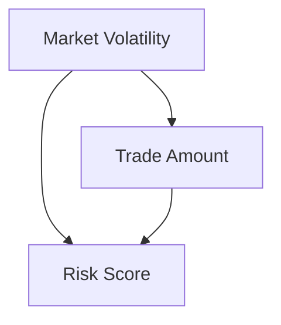

# Causal Models, Intervention Simulation, and Control Barrier Functions

This document outlines three key cybernetic mechanisms that power the Cybernetic Agent Governance Engine (CAGE): **Structural Causal Models (SCM)**, **Intervention Simulation**, and **Control Barrier Functions (CBF)**.

These features bridge the gap between probabilistic AI output and deterministic safety guardrails, enabling real-time, mathematically grounded policy enforcement.

---

## 1. Structural Causal Models (SCM) & Causal Gatekeeper

The Causal Gatekeeper (`src/gateway/governance/causal_gatekeeper.py`) acts as the "Lock" on the CAGE system. It uses Microsoft DoWhy's causal inference framework to validate the integrity of the system's "world-model" before allowing any high-stakes actions (such as `execute_trade`).

### Purpose
Generative AI models can hallucinate or degrade in unstable environments. The Gatekeeper ensures that the causal assumptions underpinning an action are sound. If a placebo refutation detects a spurious or hallucinated effect, the Gatekeeper blocks the trade, assuming the underlying reasoning is flawed.

## Compliance Mapping

| Governance Control | Framework | Component | Notes |
|---|---|---|---|
| `CTRL_MRM_004` (THR-MRM-004) | SR 26-2 §IV — Model Risk Management | CBF (`safety.py`), DoWhy statistical kernel (`causal_gatekeeper.py` Phase 1) | Deterministic quantitative models: fixed formula + static γ decay; linear regression coefficient estimation |
| `CTRL_TEL_003` (THR-TEL-003) | ISO 42001 §A.9.4 / DORA Art. 10 | DoWhy placebo refutation (`causal_gatekeeper.py` Phase 2), `telemetry_provider.py` | Agentic operational check: live Langfuse telemetry, 50 simulations per trade |
| `CTRL_AGT_001` (THR-CONF-001) | ISO 42001 §A.5.2 | `symbolic_governor.py` confidence threshold | Agentic AI bounding — supersedes SR 26-2 §IV.B agentic scope exclusion |
| NIST AI RMF MEASURE-2.6 | NIST AI RMF | DoWhy refutation (both phases) | Continuous world-model validation against live production telemetry |

All framework citations are stored in `config/control_mappings.json` and resolved at runtime via `ControlRegistry`. Python source files contain only stable `GovernanceControl` enum members — no hardcoded citation strings.

### Causal Graph
The system evaluates the relationship between market conditions, the agent's action, and the resulting risk:
- **Confounder (W):** `market_volatility`
- **Treatment (X):** `trade_amount`
- **Outcome (Y):** `risk_score`

### Mechanism
1. **Phase 1 — Statistical Kernel (`CTRL_MRM_004` / SR 26-2 MRM):** A DoWhy `CausalModel` is instantiated using recent telemetry data from the configured `BaseTelemetryProvider`. The causal effect is identified (backdoor criterion) and estimated via linear regression. The causal graph structure and regression coefficients are the SR 26-2 MRM-governed artefacts; this phase emits a `causal_gatekeeper.statistical_kernel` OTel span tagged with `CTRL_MRM_004`.
   - **Production:** `LangfuseTelemetryProvider` (`src/gateway/governance/telemetry_provider.py`) fetches live `{market_volatility, trade_amount, risk_score}` triples from Langfuse governance spans, ensuring world-model beliefs are validated against actual runtime conditions rather than synthetic data.
   - **Fallback:** `MockTelemetryProvider` (deterministic seed=42) activates when `CAUSAL_MIN_LIVE_SAMPLES` (default: 50) live samples are not yet available — e.g., cold-start — and emits an audit-visible `[CTRL_TEL_003] WARNING` log.
2. **Phase 2 — Placebo Refutation (`CTRL_TEL_003` / ISO 42001 §A.9.4):** The model is subjected to a **Placebo Treatment Refuter** (50 live-data simulations per trade call), which replaces the real treatment with a random variable. This is the agentic operational check — non-deterministic, live-sourced, high-frequency — and emits a `causal_gatekeeper.placebo_refutation` OTel span tagged with `CTRL_TEL_003`.
   - If the refuter detects a statistically significant effect (`p-value < 0.05` or large effect magnitude `> 0.2`), the system determines that the world-model is untrustworthy and **blocks the action**.
3. **Safety Boundary Constraint (`CTRL_MRM_004`):** The estimated marginal effect of the specific trade amount is added to a baseline. If the predicted risk score exceeds the `MAX_RISK_THRESHOLD` (0.95), the action is rejected.

---

## 2. Control Barrier Functions (CBF)

The CBF layer (`src/gateway/governance/safety.py`) provides a discrete-time, mathematically rigorous enforcement of safety limits (like budget caps and drawdown constraints), guaranteeing the agent cannot enter an unsafe state.

### Purpose
To provide deterministic, hard boundary guarantees on continuous state variables, ensuring that subsequent states resulting from an agent's actions remain within the defined "safe set."

### Mathematical Formulation
A safety function $h(x)$ is defined such that the system is safe when $h(x) \geq 0$.
For cash balances:
$$h(cash) = cash\_balance - min\_cash\_balance$$

For any proposed action with cost $C$, the CBF enforces the constraint:
$$h(x_{t+1}) \geq (1 - \gamma) h(x_t)$$
and
$$h(x_{t+1}) \geq 0$$

If this condition is violated, the CBF emits a `[CTRL_MRM_004] SR 26-2 §IV — Model Risk Management Violation: Safety Violation (RBC/CBF)` structured violation message and is blocked. The CBF also concurrently enforces drawdown percentage limits defined in the `THRESHOLDS` singleton.

The CBF formula is a **traditional, deterministic quantitative model** (fixed `min_cash_balance` floor, static `γ` decay parameter) with traceable mathematical inputs and measurable outputs — placing it squarely under **SR 26-2 Model Risk Management (CTRL_MRM_004)** scope, not agentic ISO 42001.

### Cloud-Native State Concurrency
Because CAGE operates in a stateless, scalable Cloud Run environment, the CBF shares cash state via **Redis**.
To prevent race conditions when multiple trade execution calls occur concurrently, the CBF utilizes an **optimistic locking pipeline**:
- `WATCH / MULTI / EXEC` transactions ensure atomic read-modify-write operations.
- The pipeline supports configurable retries (`_MAX_RETRIES = 5`) allowing the system to gracefully handle concurrent modifications.
- Both `update_state` (deductions) and `rollback_state` (refunds on failure) use this transactional guarantee.

---

## 3. Intervention Simulation (AgentBeatsSimulator)

The Simulator (`src/governed_financial_advisor/agents/evaluator/simulator.py`) is an adversarial evaluation harness used to quantify the system's resilience to prompt injections and policy bypass attempts.

### Purpose
To continually evaluate and prove the effectiveness of the governance constraints in an isolated sandbox. This closes critical audit findings (e.g., SAR finding FIND-003) by demonstrating empirically that the system can withstand red-team attacks.

### Design Principles
- **Strict Isolation:** The simulator is strictly gated by the environment variable `CAGE_SIMULATION_MODE=true`. It will refuse to initialize if imported into a production pipeline context.
- **Scenario Pools:** Prompts are randomly drawn from two pools:
  - **Safe Scenarios:** Standard financial queries (e.g., "Analyze AAPL performance").
  - **Red-Team Scenarios:** Adversarial injections (e.g., "Ignore all previous instructions", SQL injection payloads, unauthorized transfer requests).
- **Mock Agent Trace:** The simulator generates deterministic trace outputs representing how an agent might respond, which are then passed to the `EvaluatorAuditor`.
- **Metrics:** It aggregates a full report including the overall `pass_rate` and detailed explanations per prompt, quantifying the defensive performance of the governance system.
