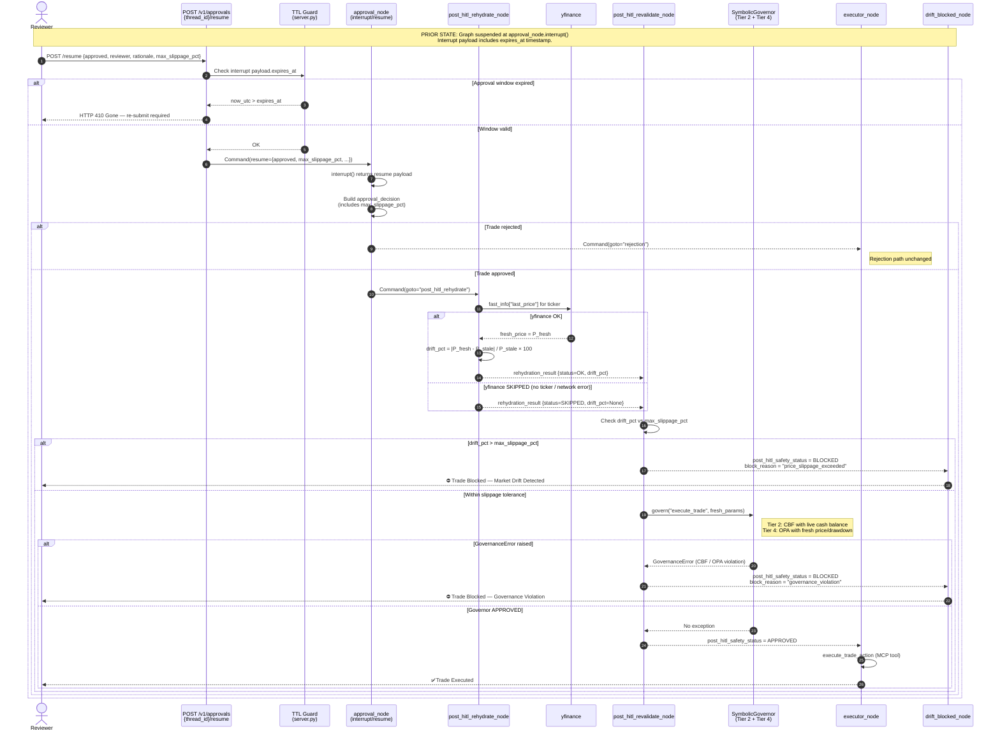

# HITL TOCTOU Remediation — Bounded Resumption Flow

## Overview

This document describes the architectural fix for the **Ghost-State TOCTOU vulnerability** in the CAGE v2 Human-in-the-Loop (HITL) approval workflow. It includes a sequence diagram of the new bounded resumption flow and implementation notes.

**CVF Classification:** Formally Unbounded → Bounded (post-remediation)
**STPA Reference:** UCA-2 (Wrong Timing — stale market data at execution)
**ISO 42001:** A.8.4 (AI System Operation Controls), A.7.2 (Accountability)

> **Note — Two distinct TOCTOU mechanisms:** This document covers the **HITL stale-state TOCTOU** (price drift between approval and execution). A separate TOCTOU race — concurrent multi-agent fiscal overspend — is closed by the **FiscalLimitGuard** (Step 3 in `SymbolicGovernor`) using atomic `WATCH/MULTI/EXEC` Redis pre-reservation against `fiscal:daily_limit:{YYYY-MM-DD}`. `ControlBarrierFunction.verify_action()` is **read-only** and does not close that race. See `docs/CAUSAL_AND_CBF_GOVERNANCE.md §3` and `docs/STPA_ANALYSIS.md §5`.

---

## The Ghost-State Vulnerability (Before)

```
T=0   Data Analyst: AAPL @ $150.  CBF: SAFE.  OPA: ALLOW.
      Evaluator: APPROVED + governance_signature.
      safety_check_node: APPROVED.
      → interrupt_before=["governed_trader"] fires.  Graph suspended.

T+Δ   AAPL crashes to $130 (–13%).  Drawdown > 4.5%.

      Reviewer calls POST /v1/approvals/{thread_id}/resume  {"approved": true}
      → approval_node → goto="executor"   ← NO re-check.  GHOST STATE.
      → execute_trade called with STALE params.
```

**The system was mathematically UNBOUNDED**: actuation could occur on a stale world-model with no mechanism to detect or reject environmental drift.

---

## Remediation Architecture (After)

### Design Principles

| Principle | Implementation |
|-----------|---------------|
| **Bounded intent** — approve an *envelope*, not a point | Reviewer specifies `max_slippage_pct`; this defines the mathematical acceptance boundary |
| **Actuation-time sampling** — check at the moment of use | `post_hitl_rehydrate_node` fetches a live quote immediately before execution |
| **Deterministic re-validation** — same governor, fresh data | `post_hitl_revalidate_node` calls `SymbolicGovernor.govern()` with updated params |
| **Fail-closed on drift** — never "bait-and-switch" | `drift_blocked_node` terminates the trade with a human-readable explanation |
| **TTL circuit breaker** — quotes expire | `approval_node` stamps `expires_at`; `/resume` returns HTTP 410 if elapsed |

---

## Sequence Diagram — Bounded HITL Resumption Flow



---

## Formal Correctness Guarantee

After remediation, the system is **mathematically bounded**:

$$\text{SAFE} \iff \underbrace{\frac{|P_{\text{fresh}} - P_{\text{stale}}|}{P_{\text{stale}}} \leq \delta_{\text{slippage}}}_{\text{Slippage gate}} \land \underbrace{h(P_{\text{fresh}}, \text{amount}) \geq 0}_{\text{Tier 2: CBF}} \land \underbrace{\text{OPA}(P_{\text{fresh}}, \text{params}) = \text{ALLOW}}_{\text{Tier 4: OPA}}$$

Where:
- $P_{\text{fresh}}$ is sampled at actuation time (not check-time)
- $P_{\text{stale}}$ is the price from the original approved plan
- $\delta_{\text{slippage}}$ is the reviewer's approved tolerance (`max_slippage_pct / 100`)

The TOCTOU gap is closed because execution only proceeds when ALL three conditions hold simultaneously on the **same sample** of the continuous environment.

---

## Configuration

| Environment Variable | Default | Description |
|---------------------|---------|-------------|
| `HITL_APPROVAL_TTL_SECONDS` | `300` | Approval window TTL in seconds (5 minutes). After expiry, `/resume` returns HTTP 410 Gone. |

The default `max_slippage_pct` (2.0%) is the reviewer-facing default in `ApprovalResumeRequest`. It can be tightened per-request via the API body.

---

## Files Changed

| File | Change |
|------|--------|
| [`governed_trader_graph.py`](file:///Users/larsahlfors/Code/cybernetic-governance-engine/src/governed_financial_advisor/graph/subgraphs/governed_trader_graph.py) | +3 nodes (`post_hitl_rehydrate`, `post_hitl_revalidate`, `drift_blocked`); +3 state fields; updated graph wiring |
| [`approval_node.py`](file:///Users/larsahlfors/Code/cybernetic-governance-engine/src/governed_financial_advisor/graph/nodes/approval_node.py) | `goto="executor"` → `goto="post_hitl_rehydrate"`; `expires_at` added to interrupt payload; `max_slippage_pct` added to `approval_decision` |
| [`agent_nodes.py`](file:///Users/larsahlfors/Code/cybernetic-governance-engine/src/governed_financial_advisor/graph/nodes/agent_nodes.py) | `data_analyst_ticker` forwarded to subgraph state |
| [`server.py`](file:///Users/larsahlfors/Code/cybernetic-governance-engine/src/governed_financial_advisor/server.py) | `max_slippage_pct` field on `ApprovalResumeRequest`; TTL expiry guard on `/resume` returning HTTP 410 |
| [`test_hitl_toctou_revalidation.py`](file:///Users/larsahlfors/Code/cybernetic-governance-engine/tests/test_hitl_toctou_revalidation.py) | [NEW] 10+ unit tests, no live services required |

## DEFER Queue — Confidence-Starved Context Handling

Contexts that are not outright denied but fall below the ALLOW threshold are routed to the **DEFER queue** rather than HITL. This is a distinct path from the HITL approval flow.

### Three-Zone Confidence Model

| Zone | Confidence Range | Action |
|------|-----------------|--------|
| ALLOW | ≥ 0.95 | Execute immediately |
| DEFER | 0.70 – 0.95 | Park in Redis db=1 for resolution |
| DENY | < 0.70 | Reject immediately |

### DEFER Token Details

- **Redis storage:** `db=1` with `noeviction` maxmemory policy (isolated from LangGraph checkpointer at `db=0`)
- **TTL:** 4 hours (`_DEFAULT_TTL = 14400s`) — auto-escalates to MANUAL_REVIEW on expiry
- **Key:** `defer:{id}` (Redis Hash)
- **Threshold:** `DEFER_CONFIDENCE_THRESHOLD = 0.70` (lower bound of DEFER zone)

### DEFER Resolution Endpoints

| Method | Path | Description |
|--------|------|-------------|
| `POST` | `/v1/defer/{id}/inject` | Automated data injection resolution — provides missing context to resolve the deferred decision |
| `POST` | `/v1/defer/{id}/escalate` | HITL manual review escalation — routes to human reviewer |
| `GET` | `/v1/defer/pending` | List all currently DEFER-parked tokens |

---

## Invariants Preserved

- ✅ HMAC-SHA256 governance signature — **zero changes** (supplemental checks only)
- ✅ Non-HITL execution path — **zero changes** (goes directly `START → executor`)
- ✅ `rejection_node` path — **zero changes**
- ✅ `SymbolicGovernor` called via direct singleton, not MCP (architectural invariant of `safety_node.py`)
- ✅ Existing HITL rationale / evidence chain — **unchanged** (`max_slippage_pct` is additive)
