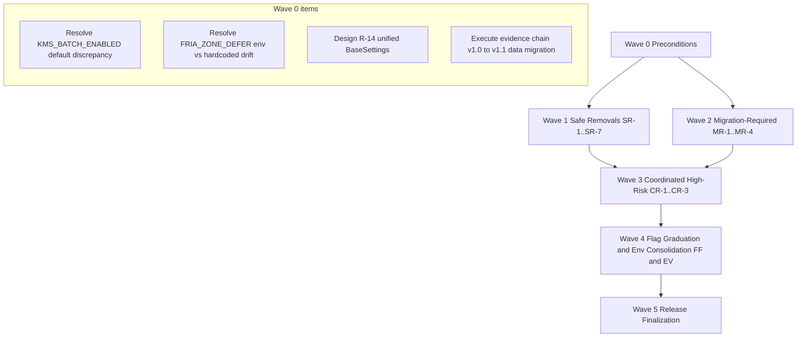

# CAGE v3.0.0 Major Version Cleanup Plan

> **Status:** Completed — v3.0.0 released 2026-08-15. This document preserves
> the planning rationale and implementation sequence for the major version
> cleanup. Per [`AGENTS.md`](../AGENTS.md), CAGE is a reference architecture;
> this plan follows the same illustrative-pattern convention used elsewhere
> in the repository for release-governance documents.

**Released version:** `3.0.0` (per [`pyproject.toml`](../pyproject.toml:3))
**Release date:** 2026-08-15
**Source analysis:** Phase 1 codebase deprecation/dead-code audit (this document was Phase 2 of that effort)

---

## 1. Executive Summary

This plan enumerates every deprecated shim, backward-compatibility alias,
graduated feature flag, and env-var-based configuration item identified in
the Phase 1 codebase analysis, and sequences their removal for the CAGE
`v3.0.0` release.

**Scope:** 18 discrete cleanup items across 4 risk tiers:
- 7 **Safe Removals** (§2.1) — deprecated shims/aliases with no call-site
  ambiguity; removal is a mechanical delete + import-site fix.
- 5 **Migration-Required Removals** (§2.2) — aliases with multiple live call
  sites across `src/compliance_bridge/` and `src/governed_financial_advisor/`
  that must be migrated to region-aware accessors before the alias is deleted.
- 3 **Coordinated Removals** (§2.3) — items touching compliance-critical
  paths (evidence chain integrity, NeMo auto-apply audit trail, CBF
  atomicity) that require sign-off from Compliance/Security before removal,
  per [`AGENTS.md`](../AGENTS.md) Compliance Artifact Obligations.
- 2 **Feature Flag Graduations** (§2.4) — flags stable enough at their
  current default to hardcode.
- 6 **Environment Variable Consolidations** (§2.5) — ad hoc `os.getenv()`
  reads to migrate into `config/thresholds/` per the R-14 consolidation
  effort already referenced in [`config/settings.py`](../config/settings.py:21).

**Timeline framing:** Per user instruction, this plan does **not** assign
level-of-effort time estimates. Sequencing is expressed purely in terms of
dependency order and release-branch gating (feature-freeze on `rc-v3.0.0`,
squash-merge per [`AGENTS.md`](../AGENTS.md) Branch Naming & Merge Strategy).

**Key open question:** The two High-Risk items (Evidence Stream dual-schema,
NeMo legacy auto-apply) are included as *candidates* for v3.0.0 per user
direction, but each carries an explicit compliance-sign-off gate in §2.3 and
§6 — if sign-off is not obtained before the `rc-v3.0.0` feature freeze, they
must be deferred to `v3.1.0`/`v4.0.0` rather than block the rest of the
release.

---

## 2. Cleanup Categories

### 2.1 Safe Removals (Low Risk)

Items with a single canonical replacement already in production use, no
ambiguous call sites, and an existing `DeprecationWarning` at the point of
use. Removal is a mechanical delete + import-site fix, verifiable entirely by
the existing test suite.

| # | Item | Location | Replacement | Notes |
|---|------|----------|--------------|-------|
| SR-1 | `stpa_validator.py` deprecated shim | [`src/gateway/governance/stpa_validator.py`](../src/gateway/governance/stpa_validator.py:15) (`STPAValidator` class, lines 15–60) | `GeneratedSTPAValidator` in [`src/gateway/governance/generated_stpa_validator.py`](../src/gateway/governance/generated_stpa_validator.py:38) | `symbolic_governor.py` already bypasses this shim (line 42 comment). Remaining callers: [`ingress/aaif_adapter.py:78`](../src/gateway/governance/ingress/aaif_adapter.py:78) (string reference in a capability manifest, not an import), [`governed_financial_advisor/agents/evaluator/auditor.py:38`](../src/governed_financial_advisor/agents/evaluator/auditor.py:38) (`try/except ImportError` fallback path — safe to delete along with the shim). |
| SR-2 | `safety.py` `__getattr__` re-export shim | [`src/gateway/governance/safety.py`](../src/gateway/governance/safety.py:1) (entire file, 74 lines) | `src.gateway.governance.text_filter.ac_keyword_scan`; `src.gateway.governance.cbf.ControlBarrierFunction`/`safety_filter` | Docstring (lines 32–35) already lists all migrated callers as complete. No known remaining production callers found in `src/`. |
| SR-3 | `GovernanceClient` alias | [`src/governed_financial_advisor/infrastructure/governance_client.py:323`](../src/governed_financial_advisor/infrastructure/governance_client.py:323) | `StructuredLLMClient` (same module) | Test `test_governance_client_alias` in [`tests/test_governance_client.py:251`](../tests/test_governance_client.py:251) asserts `GovernanceClient is StructuredLLMClient` — this test must be deleted, not just updated, since the identity relationship ceases to exist once the alias is removed. |
| SR-4 | `RedisClient` alias | [`src/governed_financial_advisor/infrastructure/redis_client.py:268`](../src/governed_financial_advisor/infrastructure/redis_client.py:268) | `AsyncRedisClient` (same module) | Actively imported by [`tests/test_redis_config.py:22`](../tests/test_redis_config.py:22) (3 call sites). Note this is a **different** `RedisClient` from the unrelated `_AsyncRedisClient`/`_SyncRedisClient` pair in `src/gateway/infrastructure/redis_client.py` (exercised by [`tests/test_gateway_redis_client.py`](../tests/test_gateway_redis_client.py:33)) — do not conflate the two modules during removal. |
| SR-5 | `HybridClient` alias | [`src/governed_financial_advisor/infrastructure/llm_client.py:23`](../src/governed_financial_advisor/infrastructure/llm_client.py:23) | `GatewayClient` (same module) | No test references found in the current `tests/` search; verify with a final grep before deletion in case of dynamic/string-based imports. |
| SR-6 | `check_safety_constraints` legacy tool alias | [`src/governed_financial_advisor/agents/evaluator/agent.py:193`](../src/governed_financial_advisor/agents/evaluator/agent.py:193) (alias definition); [`src/gateway/server/mcp_tool_server.py:483`](../src/gateway/server/mcp_tool_server.py:483) (MCP tool-registry alias); [`src/governed_financial_advisor/tools/api.py:87-88`](../src/governed_financial_advisor/tools/api.py:87) (dispatch alias) | `simulate_governance_check` | 3 production files must change together (see §3 dependency graph — these are a single atomic unit). Also imported by [`src/governed_financial_advisor/graph/nodes/evaluator_node.py:22`](../src/governed_financial_advisor/graph/nodes/evaluator_node.py:22) and called at line 147 — this is a **4th** production call site not listed in the Phase 1 summary and must be migrated too. Test file [`tests/test_evaluator_mcp.py:29-55`](../tests/test_evaluator_mcp.py:29) exercises the alias name directly and must be updated to call `simulate_governance_check`. |
| SR-7 | `create_ftra_node()` deprecated params (`registry_path`, `plan_key`) | [`src/gateway/governance/ftra/node_factory.py:145-199`](../src/gateway/governance/ftra/node_factory.py:145) | `config: FtraNodeConfig` parameter (same function) | **Highest test-surface item in this tier** — [`tests/test_ftra_package.py`](../tests/test_ftra_package.py:20) has 30+ call sites passing `registry_path=` directly (lines 463, 481, 497, 516, 536, 560, 606, 633, 657, 696, 722, 741–749, 764, 788, 1026, 1048, 1074, 1104, 1165, 1185, 1279, 1311, 1362, 1441, 1473, 1526, 1571, 1693, 1721). Removing the deprecated params is a breaking API change for every one of these call sites; they must all be rewritten to construct `FtraNodeConfig(registry_path=...)` explicitly. This is mechanical but high-volume. |

**Common thread across SR-1–SR-7:** every item already emits a
`DeprecationWarning` (or is a plain re-export with a "will be removed" docstring),
meaning production code that ignores warnings continues to function until the
literal line is deleted. This is what makes them Low Risk despite SR-6/SR-7
having several call sites — the compatibility contract was already
communicated to callers.

### 2.2 Migration-Required Removals (Medium Risk)

Items with a region-aware or consolidated replacement already implemented,
but with multiple live production call sites across `src/compliance_bridge/`
and `src/governed_financial_advisor/` that iterate the flat/deprecated form
directly. Removal requires migrating each call site to the accessor function
**before** the alias can be deleted, because the alias and the accessor are
not always equivalent (the alias is universal-only; the accessor is
region-merged).

| # | Item | Location | Replacement Accessor | Call Sites Requiring Migration |
|---|------|----------|----------------------|----------------------------------|
| MR-1 | `CONTROL_META` alias | [`src/compliance_bridge/types.py:340`](../src/compliance_bridge/types.py:340) (`CONTROL_META: dict = _UNIVERSAL_CONTROLS`) | `get_control_meta(region)` | [`src/compliance_bridge/main.py:75,1387-1388`](../src/compliance_bridge/main.py:75); [`src/compliance_bridge/eval_dataset.py:42,69-105`](../src/compliance_bridge/eval_dataset.py:42) (4 usages); [`src/compliance_bridge/audit_workflow.py:96,513`](../src/compliance_bridge/audit_workflow.py:96); [`src/compliance_bridge/oscal_exporter.py:59,191`](../src/compliance_bridge/oscal_exporter.py:59). Test coverage: [`tests/test_compliance_bridge_tier2.py:133-139`](../tests/test_compliance_bridge_tier2.py:133), [`tests/test_oscal_ssp_exporter.py:34-37,496-544`](../tests/test_oscal_ssp_exporter.py:34) explicitly assert on `CONTROL_META` contents and the "universal-only" invariant — these tests encode the exact backward-compat contract that must be preserved by the accessor migration. |
| MR-2 | `EVIDENCE_SLA_SECONDS` alias | [`src/compliance_bridge/types.py:446`](../src/compliance_bridge/types.py:446) (`EVIDENCE_SLA_SECONDS: dict = _UNIVERSAL_SLA`) | `get_sla_seconds(region)` | `sla_monitor.py` has **already been migrated** — [`src/compliance_bridge/sla_monitor.py:79-81`](../src/compliance_bridge/sla_monitor.py:79) explicitly documents replacing "the previous direct iteration over the deprecated flat EVIDENCE_SLA_SECONDS alias" (FINDING-05). Remaining consumers: [`src/compliance_bridge/aarm_mapper.py:272-274`](../src/compliance_bridge/aarm_mapper.py:272) (docstring reference only — verify no runtime dependency). Test coverage: [`tests/test_compliance_bridge_tier2.py:142-152`](../tests/test_compliance_bridge_tier2.py:142) asserts `EVIDENCE_SLA_SECONDS` is a dict and that critical controls have entries — must be re-pointed at `get_sla_seconds("universal")` or equivalent. [`tests/test_compliance_bridge_integration.py:63,71-72,1174-1224`](../tests/test_compliance_bridge_integration.py:63) reads the env var `EVIDENCE_SLA_SECONDS` directly for a live-GKE integration assertion — **this is a distinct env-var usage, not the Python alias**, and is out of scope for this item (tracked separately in §2.5 if consolidation is desired). |
| MR-3 | `ISO_CONTROL_MAP` alias | [`src/compliance_bridge/types.py:512`](../src/compliance_bridge/types.py:512) (`ISO_CONTROL_MAP: dict = _UNIVERSAL_CONTROL_MAP`) | `get_iso_control_map(region)` | [`src/governed_financial_advisor/utils/langfuse_utils.py:33,229,264`](../src/governed_financial_advisor/utils/langfuse_utils.py:33) — 2 runtime call sites (`saga_rollback` control lookups). A **second, unrelated** `ISO_CONTROL_MAP` class attribute exists on `TradingKnowledgeGraph` in [`src/gateway/governance/ontology.py:197-234`](../src/gateway/governance/ontology.py:197) — its own docstring (line 197) explicitly calls it "retained as a backward-compat alias" and directs new code to `get_control_map(region)`. These are **two separate symbols in two separate modules** with the same name; both must be migrated, and the plan/PR description must disambiguate them to avoid a partial fix. Test coverage: [`tests/test_compliance_bridge_tier1.py:87-131`](../tests/test_compliance_bridge_tier1.py:87) (single-source-of-truth tests, including an identity check `lf_map is canonical` at line 109 that will need rework once `langfuse_utils` calls the accessor instead of re-exporting the module attribute), [`tests/test_compliance_bridge.py:474-480`](../tests/test_compliance_bridge.py:474), [`tests/test_ontology.py:104-112`](../tests/test_ontology.py:104), [`tests/test_oscal_ssp_exporter.py:517-533`](../tests/test_oscal_ssp_exporter.py:517). |
| MR-4 | `config/settings.py` module-level aliases (R-14 consolidation) | [`config/settings.py:137-157`](../config/settings.py:137) (`MODEL_NAME`, `MODEL_FAST`, `MODEL_REASONING`, `MODEL_CONSENSUS`, `TRANSPILER_MODEL`, `VLLM_FAST_MODEL`, `REMEDIATION_MODEL`, `VLLM_FAST_API_BASE`, `VLLM_REASONING_API_BASE`, `VLLM_GATEWAY_URL`, `GATEWAY_API_BASE`, `PORT`, `REDIS_URL`, `GOVERNANCE_SALT`, `KMS_GOVERNANCE_KEY`, `KMS_GOVERNANCE_PUBLIC_PEM`, `OPA_URL`, `OPA_AUTH_TOKEN`, `SANDBOX_URL` — 19 module-level names) | Unified Pydantic `BaseSettings` class (explicitly flagged as future work at [`config/settings.py:21`](../config/settings.py:21), "Future consolidation (R-14)") | This is the **largest blast-radius item in the entire plan**. Direct `from config.settings import <NAME>` or `from config.settings import Config` usage found in: [`src/governed_financial_advisor/infrastructure/governance_client.py:191`](../src/governed_financial_advisor/infrastructure/governance_client.py:191), [`src/gateway/core/llm.py:20`](../src/gateway/core/llm.py:20), [`src/gateway/core/policy.py:32`](../src/gateway/core/policy.py:32), [`src/gateway/governance/consensus.py:116`](../src/gateway/governance/consensus.py:116), [`src/governed_financial_advisor/infrastructure/mcp_client.py:147`](../src/governed_financial_advisor/infrastructure/mcp_client.py:147), [`src/governed_financial_advisor/server.py:47,347`](../src/governed_financial_advisor/server.py:47), [`src/governed_financial_advisor/evaluators/evaluate_traces.py:29`](../src/governed_financial_advisor/evaluators/evaluate_traces.py:29), [`src/governed_financial_advisor/agents/execution_analyst/agent.py:21,197`](../src/governed_financial_advisor/agents/execution_analyst/agent.py:21), [`src/governed_financial_advisor/graph/nodes/explainer_node.py:20`](../src/governed_financial_advisor/graph/nodes/explainer_node.py:20), [`src/governed_financial_advisor/agents/explainer/agent.py:17`](../src/governed_financial_advisor/agents/explainer/agent.py:17) — **10 files**, mixing both `Config.X` attribute access and bare module-level `X` imports. R-14 itself (the `BaseSettings` consolidation) is **not yet designed**; this item should be treated as **two sub-phases**: (a) design + land the unified `BaseSettings` class alongside the existing `Config` class (non-breaking), then (b) migrate all 10 call sites and delete the 19 module-level duplicate names. Sub-phase (a) is itself a prerequisite design task, not a mechanical removal — flag as **uncertain scope** until R-14's design is written. |
| MR-5 | `POST /v1/nemo/apply-refinement` legacy endpoint | [`src/governed_financial_advisor/server.py:1038-1039`](../src/governed_financial_advisor/server.py:1038) (route handler `apply_nemo_refinement`); request model at [`server.py:249-251`](../src/governed_financial_advisor/server.py:249) | New KFP-driven propose/apply flow (`/v1/nemo/propose-refinement`, referenced in [`server.py:849-851`](../src/governed_financial_advisor/server.py:849) comment block) | This item overlaps significantly with the High-Risk `NEMO_AUTO_APPLY_ENABLED` item in §2.3 — **the endpoint itself is not deprecated**, only its legacy auto-apply branch is. Reclassify: the endpoint stays; only the `NEMO_AUTO_APPLY_ENABLED=true` code path (lines 1046–1089) is the actual removal candidate, tracked in §2.3 as CR-2. Test coverage referencing the endpoint directly (not just the flag) includes [`tests/test_cybernetic_loop.py:23-31,74-354`](../tests/test_cybernetic_loop.py:23) — this suite's `TestApplyRefinementRequest`/`TestKfpComponentEndpoint` classes must remain green regardless of which sub-item ships. |

**Migration sequencing note:** MR-1, MR-2, and MR-3 all follow the identical
pattern established in `src/compliance_bridge/types.py` (universal alias +
region-aware accessor + jurisdictional dict) and should be migrated together
as one coordinated PR touching `src/compliance_bridge/` and
`src/governed_financial_advisor/utils/langfuse_utils.py`, since they share
the same underlying region-guard rationale described in
[`AGENTS.md`](../AGENTS.md) Architecture & Design Standards (shared-module
cross-region impact). MR-4 is independent and substantially larger; it should
not be bundled with MR-1–3.

### 2.3 Coordinated Removals (High Risk)

Items touching compliance-critical paths. Each requires explicit
Compliance/Security/regulatory-owner sign-off before removal, per
[`AGENTS.md`](../AGENTS.md) Compliance Artifact Obligations and Architecture &
Design Standards. **None of these should be merged to `rc-v3.0.0` without a
documented sign-off artifact attached to the PR.**

| # | Item | Location | Why High Risk | Sign-off Required From |
|---|------|----------|----------------|--------------------------|
| CR-1 | Evidence Stream dual-schema v1.0/v1.1 support | [`src/compliance_bridge/evidence_stream.py`](../src/compliance_bridge/evidence_stream.py:51) — `EvidenceRecord` (lines 169–255), `VerifyResult` (264–278), `_compute_hash`/schema selection (420–499), `verify_record()` dual-path (505–608), `migrate_record_1_0_to_1_1()` (622–677), reverse-chain version detection (700–702) | This is the **cryptographic hash-chain integrity mechanism** for the audit evidence trail. Schema v1.0 records still exist in historical evidence chains; removing v1.0 verification support before all existing chains are migrated would make historical records unverifiable — a direct compliance/audit-trail integrity regression. The Phase 1 analysis explicitly flags this as "Compliance critical." | Compliance/OSCAL owner (per [`AGENTS.md`](../AGENTS.md) Compliance Artifact Obligations — OSCAL component update required); Security (hash-chain integrity is a control-mapped item, `A.9.2`/`SC-4` per [`compliance/lula/lula-validation-sc4.yaml`](../compliance/lula/lula-validation-sc4.yaml)). **Precondition, not just sign-off:** a documented, executed migration of all production evidence chains from v1.0 → v1.1 (via the existing `migrate_record_1_0_to_1_1()` utility) must complete and be verified *before* the v1.0 code path is deleted. This is a data-migration gate, not merely a code-review gate. |
| CR-2 | NeMo legacy auto-apply path (`NEMO_AUTO_APPLY_ENABLED`) | [`src/governed_financial_advisor/server.py:849-863,1042-1089`](../src/governed_financial_advisor/server.py:849) | Removing this collapses the recursive self-authentication loop the code comment explicitly warns about (line 850: "The system modified its own governance rules based on its own telemetry"). The flag defaults to `false` in production already, so removal is primarily a dead-code deletion — **but** the code path is exercised by the dev/test auto-apply flow, and any lingering dependency on it in CI or local dev workflows must be identified first. Also overlaps with MR-5 (§2.2) — the request model and route decorator stay; only lines 1046–1089's `if _NEMO_AUTO_APPLY:` branch and its warning-log block are the removal target. | Security (self-authentication loop is a governance-integrity concern raised in the code's own comments); Gateway governance engineering owner. Lower actual risk than CR-1 since default is already `false`, but included in High Risk per the Phase 1 classification and because it touches the NeMo refinement audit trail referenced by [`tests/test_cybernetic_loop.py`](../tests/test_cybernetic_loop.py:22). |
| CR-3 | CBF `update_state()` atomicity warning (MED-5 finding) | [`src/gateway/governance/cbf.py:903-998`](../src/gateway/governance/cbf.py:903) (`update_state()` method); deprecation warning at lines 932–937 | `update_state()` does not atomically re-verify the CBF safety condition before committing — a documented TOCTOU window (MED-5). The safe replacement, `atomic_verify_and_commit()`, already exists (referenced in the deprecation message and at [`cbf.py:1107-1109`](../src/gateway/governance/cbf.py:1107)). **This is not a simple deletion**: `update_state()` is exercised extensively by the existing test suite as a *unit-level* primitive independent of the higher-level atomic wrapper — see [`tests/test_cbf_chaos.py:134-246`](../tests/test_cbf_chaos.py:134), [`tests/test_cbf_negative_paths.py:514-632`](../tests/test_cbf_negative_paths.py:514), [`tests/test_fence_epoch.py:84-110,549-580`](../tests/test_fence_epoch.py:84), [`tests/test_symbolic_governor_cbf_atomicity.py:145-147`](../tests/test_symbolic_governor_cbf_atomicity.py:145) (this file's own docstring explicitly warns about the TOCTOU race if `verify_action()` + `update_state()` are used instead of the atomic wrapper — i.e., this test file exists *specifically to guard against* the failure mode that removal would eliminate the *demonstration* of). Removing `update_state()` outright would delete meaningful regression coverage for the WATCH/MULTI/EXEC retry logic itself (fence-epoch increments, NOSCRIPT retry, retry exhaustion) unless that coverage is first ported to exercise `atomic_verify_and_commit()`'s equivalent code paths. | Gateway governance engineering owner (primary — this is a correctness/concurrency-safety change, not a compliance-artifact change); flag to Security for awareness given the financial-invariant nature of CBF. **Recommended approach:** do not delete `update_state()` in v3.0.0. Instead, keep it as an explicitly `Protected`/internal-only primitive (rename or mark private, e.g. `_update_state_unsafe()`) that `atomic_verify_and_commit()` calls internally, and prevent *external* callers from invoking it directly. Full deletion of the retry-logic test surface should be deferred until equivalent coverage exists against the atomic wrapper. |

**Flagged uncertainty:** CR-3's risk assessment is the least certain in this
plan. Unlike CR-1/CR-2 (which have a clear "flag flip" or "data migration"
completion criterion), CR-3 requires an architectural decision (rename vs.
delete vs. keep-with-warning) before a removal date can even be scheduled.
This item should be routed through Architect-mode design review separately
before it enters an implementation checklist.

### 2.4 Feature Flag Graduation

Flags that have run at their current default long enough to be considered
stable, per the Phase 1 analysis.

| # | Flag | Current Default | Location(s) | Graduation Action |
|---|------|------------------|--------------|---------------------|
| FF-1 | `CAGE_DEFER_ENABLED` | `"true"` | [`src/gateway/governance/symbolic_governor.py:195-196`](../src/gateway/governance/symbolic_governor.py:195); [`src/gateway/server/agent_gateway_adapter.py:113-115`](../src/gateway/server/agent_gateway_adapter.py:113) | **Do not hardcode ON in v3.0.0 without a decision.** This flag exists specifically for "gradual rollout safety" and "backward compatibility" (both files' own comments). It is exercised extensively as an on/off toggle in [`tests/test_classify_violation.py`](../tests/test_classify_violation.py:48), [`tests/test_symbolic_governor.py:190-224`](../tests/test_symbolic_governor.py:190), [`tests/test_defer_e2e_flow.py:65-229`](../tests/test_defer_e2e_flow.py:65), [`tests/test_agent_gateway_adapter.py:587-593`](../tests/test_agent_gateway_adapter.py:587) — over a dozen tests explicitly set it to `"false"` to assert the DENY-fallback path still works. If hardcoded ON, this fallback path (and its dedicated regression tests) become dead code that must be deliberately removed, not just left in place with an unreachable branch. **Recommendation:** keep the flag through v3.0.0; revisit at v4.0.0 once DEFER has a full release cycle of production telemetry confirming no rollback need (this mirrors the "DEFER regression guard" decision point already documented in [`plans/CAGE_IMPLEMENTATION_PLAN.md`](../plans/CAGE_IMPLEMENTATION_PLAN.md:790)). |
| FF-2 | `KMS_BATCH_ENABLED` | `"true"` (in [`kms_batch_signer.py:75`](../src/compliance_bridge/kms_batch_signer.py:75)) — **note: inconsistent with `main.py`'s comment** | [`src/compliance_bridge/kms_batch_signer.py:51-75`](../src/compliance_bridge/kms_batch_signer.py:51); referenced in [`src/compliance_bridge/main.py:210-228`](../src/compliance_bridge/main.py:210) | **Discrepancy found during Phase 2 verification:** `kms_batch_signer.py` line 75 defaults this flag to `"true"`, but `main.py`'s comment at lines 211–212 states "The signer is disabled by default (KMS_BATCH_ENABLED=false)". This inconsistency must be resolved (confirm actual runtime default in each deployment posture) **before** deciding whether hardcoding ON is a no-op or a behavior change. If the true production default is `false` (as `main.py` claims), hardcoding ON is a **behavior change**, not a graduation, and belongs in §2.3 (Coordinated) rather than here. Flag as **uncertain** pending this discrepancy's resolution. |

### 2.5 Environment Variable Consolidation

Ad hoc `os.getenv()` reads to migrate into `config/thresholds/` JSON-backed
configuration, consistent with the pattern already used for other governance
thresholds.

| # | Variable(s) | Current Location | Consolidation Target |
|---|-------------|-------------------|------------------------|
| EV-1 | `FRIA_ZONE_ALLOW`, `FRIA_ZONE_DEFER` | [`src/gateway/governance/symbolic_governor.py:169-192`](../src/gateway/governance/symbolic_governor.py:169) (module-level constants, read once at import); also independently defined as a **hardcoded** `0.70` constant (not env-driven) in [`src/gateway/governance/ftra/graph_analyzer.py:73-74`](../src/gateway/governance/ftra/graph_analyzer.py:73) and referenced in [`src/gateway/governance/ftra/models.py:67-74`](../src/gateway/governance/ftra/models.py:67) and [`src/gateway/governance/defer_queue.py:102-104`](../src/gateway/governance/defer_queue.py:102) | `config/thresholds/` — **this consolidation must also resolve the drift between the env-driven value in `symbolic_governor.py` and the hardcoded `0.70` literal in `graph_analyzer.py`**, which is a second, independently discovered inconsistency: if an operator overrides `FRIA_ZONE_DEFER` via env var, `symbolic_governor.py` picks it up but `graph_analyzer.py`'s FTRA boundary check silently does not. This is a correctness bug latent in the current design, not just a style cleanup — recommend flagging to Security/Gateway governance owner regardless of whether this consolidation ships in v3.0.0. |
| EV-2 | `AGENT_CONFIDENCE_THRESHOLD` | [`src/gateway/governance/symbolic_governor.py:1088-1097,1366-1368`](../src/gateway/governance/symbolic_governor.py:1088) (read twice, independently, at two different call sites within the same file) | `config/thresholds/` — consolidating to a single read also fixes the "read twice" duplication. |
| EV-3 | `CAUSAL_LOCK_P_VALUE_THRESHOLD`, `CAUSAL_LOCK_PLACEBO_EFFECT_MAGNITUDE`, `CAUSAL_LOCK_RISK_BOUNDARY` | [`src/gateway/governance/causal_gatekeeper.py:80-110`](../src/gateway/governance/causal_gatekeeper.py:80) | `config/thresholds/` — these are SR 26-2 MRM-governed and ISO 42001 §A.9.4-governed thresholds ([`docs/governance/CAUSAL_AND_CBF_GOVERNANCE.md:30-31`](../docs/governance/CAUSAL_AND_CBF_GOVERNANCE.md:30)); migrating them into a versioned config file also gives an audit trail for threshold changes, which is arguably a compliance *improvement*, not just a cleanup. Coordinate with the same owner as CR-1 given the shared MRM/ISO governance surface. |
| EV-4 | `NEMO_AUTO_APPLY_ENABLED` | [`src/governed_financial_advisor/server.py:857-863`](../src/governed_financial_advisor/server.py:857) | If CR-2 (§2.3) removes the code path entirely, this env var becomes moot and should be deleted rather than migrated — do not consolidate a variable that is being removed. Listed here only to flag the overlap; the action is "delete," not "migrate." |
| EV-5 | `KMS_BATCH_MAX_SIZE`, `KMS_BATCH_ENABLED` | [`src/compliance_bridge/kms_batch_signer.py:51-75`](../src/compliance_bridge/kms_batch_signer.py:51) | `config/thresholds/` — bundle with FF-2's discrepancy resolution; do not consolidate the value until the default-value inconsistency is fixed, or the wrong default will be baked into the config file. |
| EV-6 | `CAUSAL_MIN_SAMPLES`, `CAUSAL_CACHE_TTL_SECONDS`, `TELEMETRY_MAX_STALENESS_SECONDS` | [`docs/governance/CAUSAL_AND_CBF_GOVERNANCE.md:76,96`](../docs/governance/CAUSAL_AND_CBF_GOVERNANCE.md:76) (documents the env vars; verify exact source lines in `causal_gatekeeper.py` during implementation) | `config/thresholds/` — **not explicitly named in the Phase 1 summary provided**, but discovered during Phase 2 verification as closely related threshold env vars living in the same module as EV-3. Flagged as an **addition to scope**, pending confirmation this was an intentional omission from Phase 1 or should be folded into EV-3's PR. |

**Flagged uncertainty:** EV-1's hardcoded/env-driven drift and FF-2's
default-value discrepancy were **not** identified in the original Phase 1
item list provided for this plan — they surfaced during Phase 2 file
verification. Both should be triaged (bug vs. intentional) before their
respective cleanup items are scheduled, since the "cleanup" action differs
depending on which value is actually correct in production today.

---

## 3. Removal Order & Dependencies

Items are grouped into 5 sequential waves. Within a wave, items may proceed
in parallel (independent PRs); waves themselves are ordered because later
waves depend on earlier waves either technically (shared code path) or
procedurally (compliance sign-off lead time).



| Wave | Items | Rationale |
|------|-------|-----------|
| **Wave 0 — Preconditions** | Resolve the two discovered discrepancies (`KMS_BATCH_ENABLED` default drift, `FRIA_ZONE_DEFER` hardcoded-vs-env drift); begin R-14 `BaseSettings` design (MR-4 prerequisite); begin CR-1's evidence-chain v1.0→v1.1 data migration execution (this can start immediately and run in the background throughout Waves 1–3, since it is a data-migration task independent of code changes) | These are blocking discoveries/prerequisites, not cleanup actions themselves. Nothing in later waves should assume a resolved default until Wave 0 confirms it. |
| **Wave 1 — Safe Removals** (SR-1 – SR-7) | Independent of every other wave; no shared code paths between items. SR-6 (`check_safety_constraints`) is the only multi-file item within this wave — its 4 files must land in a single PR (see §2.1). SR-7 (`create_ftra_node` params) has the largest test-rewrite volume and should be scheduled with dedicated review time before the freeze. | Zero cross-item dependencies; can start immediately without waiting on Wave 0. Recommended to complete this wave first to reduce total diff surface before touching riskier items. |
| **Wave 2 — Migration-Required** (MR-1 – MR-4) | MR-1/MR-2/MR-3 bundled as one PR (shared `compliance_bridge/types.py` pattern, per §2.2 note). MR-4 (`config/settings.py`) is independent but depends on Wave 0's R-14 design landing first — **cannot start implementation until Wave 0's design sub-phase is signed off.** MR-5 is reclassified into CR-2 (Wave 3) — no separate action here. | MR-1–3 touch `src/compliance_bridge/` and `config/compliance/`, which are shared cross-region modules per [`AGENTS.md`](../AGENTS.md) — their PR description must include the 4-point cross-region impact callout (US_FED / EU_ECB / APAC_MAS / region-guard placement) regardless of wave sequencing. |
| **Wave 3 — Coordinated High-Risk** (CR-1 – CR-3) | CR-1 code-path removal can only proceed after Wave 0's data migration is verified complete (not just started). CR-2 depends on nothing technical but requires its own sign-off lead time — start the sign-off request at the beginning of Wave 1 so it is not the critical-path bottleneck. CR-3 requires the architectural decision (rename vs. delete) to be made *before* this wave — treat as an Architect-mode sub-task that can run in parallel with Waves 0–2. | This wave has the longest procedural lead time (compliance sign-off, data migration verification) — start the sign-off/decision processes as early as Wave 0 even though the code changes land last. |
| **Wave 4 — Flag Graduation & Env Consolidation** (FF-1, FF-2, EV-1 – EV-6) | FF-2 and EV-5 depend on Wave 0's `KMS_BATCH_ENABLED` discrepancy resolution. EV-1 depends on Wave 0's `FRIA_ZONE_DEFER` drift resolution. FF-1 is explicitly **recommended to not graduate in v3.0.0** (§2.4) — if that recommendation is accepted, remove it from this wave's scope entirely rather than deferring it silently. EV-3/EV-6 should be bundled (same module, `causal_gatekeeper.py`). EV-2 and EV-4 are independent; EV-4 is a no-op if CR-2 already deleted the code path in Wave 3. | Ordered last because several items depend on Wave 0 resolutions and because env-var consolidation is the lowest-urgency category — it improves auditability but fixes no active defect (except the two discovered drift bugs, which are already elevated to Wave 0). |
| **Wave 5 — Release Finalization** | Bump `pyproject.toml` version to `3.0.0`; update `CHANGELOG`/release notes citing every SR/MR/CR/FF/EV item ID; run full §7 verification suite; tag `rc-v3.0.0` per [`AGENTS.md`](../AGENTS.md) Release Versioning. | Final wave — no cleanup code should land after this point without restarting the RC cycle. |

**Cross-wave dependency callouts:**
- SR-1 (`stpa_validator.py`) and CR-3 (CBF) both live in `src/gateway/governance/` but do not share code — no ordering constraint between them.
- MR-4's `Config` class deletion cannot happen until **every** one of the 10 files listed in §2.2 is migrated — this is an all-or-nothing cutover within Wave 2, not an incremental one, because `config/settings.py` module-level names are imported directly (not through an intermediate accessor) and Python does not support partial module attribute deprecation without the `__getattr__` shim pattern used elsewhere (SR-2). **Recommendation:** apply the same `__getattr__` deprecation-shim pattern to `config/settings.py`'s legacy names during Wave 2, rather than deleting them outright, so Wave 2 and Wave 5 do not need to be perfectly synchronized across all 10 call sites in a single atomic PR.

---

## 4. Test Impact Assessment

Per-item breakdown of tests that will need updates (U), deletion (D), or net-new
coverage (N) as a result of each removal.

| Item | Test File(s) | Impact Type | Detail |
|------|--------------|--------------|--------|
| SR-1 | [`tests/test_generated_artifacts.py:228-247`](../tests/test_generated_artifacts.py:228), [`tests/test_coverage_80pct_bridge.py:36-62`](../tests/test_coverage_80pct_bridge.py:36), [`tests/red_team/test_adversarial.py:29,59-66`](../tests/red_team/test_adversarial.py:29), [`tests/test_ftra_boundary_check.py:158-160`](../tests/test_ftra_boundary_check.py:158) | D (shim tests), U (adversarial/boundary tests) | `test_coverage_80pct_bridge.py`'s entire `stpa_validator` shim test class (lines 44–62) must be **deleted** — it tests behavior that will no longer exist. `red_team/test_adversarial.py` imports `STPAValidator` from the shim directly (line 29) and must be repointed to `GeneratedSTPAValidator`. `test_ftra_boundary_check.py` and other files passing `stpa_validator=None` as a constructor kwarg to `SymbolicGovernor` are unaffected (kwarg name stays; only the shim module import path changes for real instances). |
| SR-2 | No direct test file found importing `src.gateway.governance.safety` in the current test suite search results. | N (verification) | Add a one-time grep-based CI assertion or manual verification step confirming zero remaining imports before deletion, since absence-of-evidence is not conclusive from static search alone. |
| SR-3 | [`tests/test_governance_client.py:42-44,75-78,251-253`](../tests/test_governance_client.py:42) | D | `test_governance_client_alias()` (line 251) must be **deleted outright** — it asserts `GovernanceClient is StructuredLLMClient`, an identity relationship that ceases to exist once the alias is removed. The fixture at line 75-78 (`def client() -> GovernanceClient`) must be updated to type-hint `StructuredLLMClient` instead. |
| SR-4 | [`tests/test_redis_config.py:22,36,50,57`](../tests/test_redis_config.py:22) | U | 3 call sites (`RedisClient()` instantiations at lines 36, 50, 57) must be repointed to `AsyncRedisClient()`. Do not confuse with [`tests/test_gateway_redis_client.py`](../tests/test_gateway_redis_client.py:33) — that file tests the unrelated `src.gateway.infrastructure.redis_client` module and needs **no changes** for this item. |
| SR-5 | None found in current search. | N (verification) | Same caveat as SR-2 — confirm no dynamic/string-based import exists before deletion. |
| SR-6 | [`tests/test_evaluator_mcp.py:29-55`](../tests/test_evaluator_mcp.py:29) | U | Rename the imported symbol and the call at lines 30 and 50 to `simulate_governance_check`; update the log messages at lines 49 and 55 for clarity (cosmetic, not required for correctness). |
| SR-7 | [`tests/test_ftra_package.py`](../tests/test_ftra_package.py:20) — 30+ call sites (see §2.1 full line list) | U (large volume), D (deprecation-warning-specific tests) | Tests asserting `pytest.warns(DeprecationWarning)` when `registry_path`/`plan_key` are passed directly (lines 496, 656, 734-749) must be **deleted** since that code path will no longer exist. All other call sites using `registry_path=` as a kwarg must be rewritten to `config=FtraNodeConfig(registry_path=...)`. This is the single largest test-file rewrite in the entire plan by line count. |
| MR-1 | [`tests/test_compliance_bridge_tier2.py:133-139`](../tests/test_compliance_bridge_tier2.py:133), [`tests/test_oscal_ssp_exporter.py:34-37,490-544`](../tests/test_oscal_ssp_exporter.py:34) | U | Tests iterating `CONTROL_META` directly must be repointed to `get_control_meta("universal")` (or whichever region is under test) once call sites migrate; the "backward-compat alias" comments at lines 502, 539-541 explaining the universal-only subset behavior become stale and must be removed/updated. |
| MR-2 | [`tests/test_compliance_bridge_tier2.py:142-152`](../tests/test_compliance_bridge_tier2.py:142) | U | Repoint to `get_sla_seconds(region)`. Note [`tests/test_compliance_bridge_integration.py`](../tests/test_compliance_bridge_integration.py:63) reads the **env var** of the same name — unaffected by this Python-symbol change, do not touch. |
| MR-3 | [`tests/test_compliance_bridge_tier1.py:87-131`](../tests/test_compliance_bridge_tier1.py:87), [`tests/test_compliance_bridge.py:474-480`](../tests/test_compliance_bridge.py:474), [`tests/test_ontology.py:104-112`](../tests/test_ontology.py:104), [`tests/test_oscal_ssp_exporter.py:517-533`](../tests/test_oscal_ssp_exporter.py:517) | U (significant rework) | `test_compliance_bridge_tier1.py`'s `test_langfuse_utils_reexports_canonical_map` (identity check `lf_map is canonical`, line 109) is the highest-risk test rewrite in this item — once `langfuse_utils.py` calls `get_iso_control_map(region)` instead of re-exporting the module attribute, an identity check no longer makes sense and must be replaced with a value-equality or accessor-based check. `test_ontology.py`'s tests target the **separate** `TradingKnowledgeGraph.ISO_CONTROL_MAP` class attribute — confirm during implementation which of the two `ISO_CONTROL_MAP` symbols each test file actually exercises before editing. |
| MR-4 | No single dedicated test file — impacts are diffused across any test that imports from `config.settings` (10+ files per §2.2) | U (broad, low-depth) | Recommend a dedicated `tests/test_config_settings_migration.py` (new) asserting the `BaseSettings` class and the legacy `Config`/module-level names remain equivalent during the Wave 2 shim period, then asserting the shim raises `DeprecationWarning` post-shim, mirroring the pattern in [`tests/test_config_manager.py`](../tests/test_config_manager.py:1). |
| MR-5 / CR-2 | [`tests/test_cybernetic_loop.py:74-354`](../tests/test_cybernetic_loop.py:74) (`TestKfpComponentEndpoint`, `TestApplyRefinement`) | U | These tests must continue to pass against the retained endpoint; only tests specifically exercising `NEMO_AUTO_APPLY_ENABLED=true` behavior (if any exist beyond what was found — verify during implementation) would need deletion. |
| CR-1 | No dedicated `evidence_stream.py` test file was found by name in the current search; verify exact file during implementation (likely `tests/test_evidence_stream.py` or covered within `tests/test_evidence_chain_blocking.py`, currently open in the editor per environment context) | U (compliance-critical — requires new coverage) | **This item needs net-new test coverage, not just updates**: a test asserting that 100% of production evidence records have been migrated to v1.1 *before* the v1.0 code path is deleted (a "no v1.0 records remain" gate), plus regression tests confirming historical v1.0 hash-chain segments remain verifiable via an archival/read-only path even after live-write v1.0 support is removed. |
| CR-3 | [`tests/test_cbf_chaos.py:134-246`](../tests/test_cbf_chaos.py:134), [`tests/test_cbf_negative_paths.py:514-632`](../tests/test_cbf_negative_paths.py:514), [`tests/test_fence_epoch.py:84-110,549-580`](../tests/test_fence_epoch.py:84), [`tests/test_symbolic_governor_cbf_atomicity.py`](../tests/test_symbolic_governor_cbf_atomicity.py:145), [`tests/test_governance_contracts.py:78-132`](../tests/test_governance_contracts.py:78), [`tests/test_governance_contracts_runtime.py:76-213`](../tests/test_governance_contracts_runtime.py:76), [`tests/test_gateway_compliance_bridge_contract.py:385-411`](../tests/test_gateway_compliance_bridge_contract.py:385) | N (port coverage first), then U/D | **Do not delete any of these tests until equivalent WATCH/MULTI/EXEC retry-logic coverage exists against `atomic_verify_and_commit()`.** This is the largest test-portability risk in the plan — `test_governance_contracts.py`/`test_governance_contracts_runtime.py` test the `SafetyFilter` **Protocol** itself (structural typing), and any signature change to `update_state()` (e.g., renaming to `_update_state_unsafe()`) ripples into every concrete implementation satisfying that Protocol, including test doubles like the one at [`test_gateway_compliance_bridge_contract.py:385-411`](../tests/test_gateway_compliance_bridge_contract.py:385). |
| FF-1 | [`tests/test_classify_violation.py`](../tests/test_classify_violation.py:48) (12+ references), [`tests/test_symbolic_governor.py:190-224`](../tests/test_symbolic_governor.py:190), [`tests/test_defer_e2e_flow.py:65-229`](../tests/test_defer_e2e_flow.py:65), [`tests/test_agent_gateway_adapter.py:587-593`](../tests/test_agent_gateway_adapter.py:587) | D (if graduated) | **If** FF-1 is graduated to hardcoded-ON (against this plan's recommendation in §2.4), every `monkeypatch.setenv("CAGE_DEFER_ENABLED", "false")` test path (the DENY-fallback assertions) becomes untestable and must be deleted — roughly 5+ distinct test methods across 4 files. This is the single biggest test-deletion risk of any item in the plan if FF-1 is graduated; reinforces the §2.4 recommendation to **not** graduate this flag in v3.0.0. |
| FF-2 | No dedicated flag-toggle test found for `KMS_BATCH_ENABLED` in the current search. | N | Add a test asserting the resolved (post-Wave-0) default before any graduation decision is finalized. |
| EV-1 | Indirectly covered wherever `FRIA_ZONE_DEFER` is set via `monkeypatch.setenv` — [`tests/test_classify_violation.py`](../tests/test_classify_violation.py:51,171-172,512-525), [`tests/test_symbolic_governor.py:191-192`](../tests/test_symbolic_governor.py:191), [`tests/test_defer_e2e_flow.py:66-67,228-229`](../tests/test_defer_e2e_flow.py:66) | U | Once migrated to `config/thresholds/`, these `monkeypatch.setenv` calls must be replaced with a config-fixture override mechanism (e.g., a `tmp_path`-based threshold file or a monkeypatched config loader) — a non-trivial refactor of the test fixture pattern used across all three files. Also must add a **new** regression test proving `graph_analyzer.py`'s FTRA boundary check now honors the same override (closing the drift bug identified in §2.5). |
| EV-2 – EV-6 | No dedicated flag-toggle tests found beyond what's covered under EV-1/CR-1/CR-2/FF-2 above. | N | Recommend a lightweight `tests/test_config_thresholds_consolidation.py` (new) verifying each migrated variable resolves identically whether read via legacy env var or new config file, for one deprecation-window release. |

**Test-suite-wide regression run requirement:** Given the volume of changes
touching `SymbolicGovernor`, `ControlBarrierFunction`, and
`compliance_bridge.types`, every wave in §3 should conclude with a full
`uv run pytest tests/ --run-integration` pass against live GKE dev (per
[`AGENTS.md`](../AGENTS.md) Test Execution standard) — not just the
`local`/`unit` marker subset — before proceeding to the next wave, given how
many of these items touch compliance-critical or financial-invariant code
paths.

---

## 5. Risk Assessment Matrix

| Item | Risk Level | Rollback Plan | Verification Method |
|------|------------|-----------------|------------------------|
| SR-1 `stpa_validator.py` shim | Low | `git revert` the deletion commit; shim has no state, purely structural | `uv run pytest tests/test_generated_artifacts.py tests/red_team/test_adversarial.py -v` |
| SR-2 `safety.py` shim | Low | `git revert`; zero known production callers | Grep-based zero-import verification + `uv run pytest tests/ -k safety` |
| SR-3 `GovernanceClient` alias | Low | `git revert`; single-line alias | `uv run pytest tests/test_governance_client.py -v` |
| SR-4 `RedisClient` alias | Low | `git revert`; single-line alias | `uv run pytest tests/test_redis_config.py tests/test_gateway_redis_client.py -v` |
| SR-5 `HybridClient` alias | Low | `git revert`; single-line alias | `uv run pytest tests/ -k llm_client -v` |
| SR-6 `check_safety_constraints` alias | Low | `git revert` across the 4-file atomic PR | `uv run pytest tests/test_evaluator_mcp.py tests/test_gfa_nodes_coverage.py -v` |
| SR-7 `create_ftra_node()` deprecated params | Low-Medium (volume, not complexity) | `git revert`; params can be re-added without data loss since they were pure pass-through | `uv run pytest tests/test_ftra_package.py -v` (full 1700+ line file) |
| MR-1 `CONTROL_META` alias | Medium | Keep alias as a `__getattr__`-based deprecation shim for 1 minor release before hard removal; revert PR if OSCAL export regresses | `uv run pytest tests/test_compliance_bridge_tier2.py tests/test_oscal_ssp_exporter.py -v`; manually diff OSCAL SSP export output pre/post migration |
| MR-2 `EVIDENCE_SLA_SECONDS` alias | Medium | Same shim-first strategy as MR-1 | `uv run pytest tests/test_compliance_bridge_tier2.py -v`; confirm `sla_monitor.py` breach-alert behavior unchanged in staging |
| MR-3 `ISO_CONTROL_MAP` alias (2 symbols) | Medium (disambiguation risk) | Revert per-symbol; the `compliance_bridge.types` and `ontology.py` symbols can be reverted independently since they are unrelated code | `uv run pytest tests/test_compliance_bridge_tier1.py tests/test_compliance_bridge.py tests/test_ontology.py tests/test_oscal_ssp_exporter.py -v` |
| MR-4 `config/settings.py` aliases | Medium-High (blast radius) | Land as `__getattr__` shim (not hard delete) per §3 recommendation, allowing instant rollback by reverting only the final hard-delete commit, not the entire migration | `uv run pytest tests/test_config_manager.py -v` + manual smoke test of all 10 dependent modules' import paths |
| MR-5 (reclassified into CR-2) | — | See CR-2 | See CR-2 |
| CR-1 Evidence Stream dual-schema | **High** | **Not code-revertible after data migration** — the rollback plan is procedural: retain the v1.0 verification code in an isolated read-only/archival module (do not delete outright) so historical chains remain auditable even if the live-write path is removed. Full code revert is only safe *before* the data migration is executed. | Data migration completeness gate (100% v1.0→v1.1) verified via a dedicated audit query; `uv run pytest tests/ -k evidence_stream --run-integration -v`; manual OSCAL/Lula sign-off artifact attached to PR |
| CR-2 NeMo auto-apply removal | **High** (procedural, not technical) | `git revert`; default is already `false` in production so revert risk is low, but the audit-trail/sign-off artifact must be re-obtained if reverted and re-attempted later | `uv run pytest tests/test_cybernetic_loop.py -v --run-integration`; confirm dev/CI workflows do not depend on the auto-apply branch before removal |
| CR-3 CBF `update_state()` | **High** (uncertain — see §2.3 flag) | Recommended approach avoids a hard-revert scenario by not deleting outright (rename to `_update_state_unsafe()` instead); if the rename itself needs reverting, `git revert` is safe since it is a pure signature change | `uv run pytest tests/test_cbf_chaos.py tests/test_cbf_negative_paths.py tests/test_fence_epoch.py tests/test_symbolic_governor_cbf_atomicity.py tests/test_governance_contracts.py tests/test_governance_contracts_runtime.py tests/test_gateway_compliance_bridge_contract.py -v` |
| FF-1 `CAGE_DEFER_ENABLED` graduation | Medium-High if graduated (recommend: do not graduate) | If graduated and rollback is needed, re-introducing the flag requires restoring the deleted DENY-fallback branch and its tests from version control — non-trivial | If graduated: `uv run pytest tests/test_classify_violation.py tests/test_symbolic_governor.py tests/test_defer_e2e_flow.py tests/test_agent_gateway_adapter.py -v` must all still pass minus the deleted fallback-specific tests |
| FF-2 `KMS_BATCH_ENABLED` graduation | **Uncertain** (default discrepancy unresolved) | Cannot assess until Wave 0 resolves the `main.py` vs. `kms_batch_signer.py` default discrepancy | Add regression test asserting resolved default; `uv run pytest tests/ -k kms_batch -v` |
| EV-1 `FRIA_ZONE_ALLOW`/`FRIA_ZONE_DEFER` consolidation | Medium (correctness bug embedded) | `git revert`; also revert the `graph_analyzer.py` drift fix independently if it introduces unexpected FTRA boundary behavior changes | `uv run pytest tests/test_classify_violation.py tests/test_symbolic_governor.py tests/test_defer_e2e_flow.py tests/test_ftra_package.py -v`; new regression test proving `graph_analyzer.py` honors the override |
| EV-2 `AGENT_CONFIDENCE_THRESHOLD` consolidation | Low | `git revert` | `uv run pytest tests/test_symbolic_governor.py -v` |
| EV-3 Causal Lock thresholds consolidation | Medium (MRM/ISO governed) | `git revert`; coordinate with CR-1's compliance owner given shared governance surface | `uv run pytest tests/test_causal_gatekeeper.py -v` |
| EV-4 `NEMO_AUTO_APPLY_ENABLED` (delete, not migrate) | Low | N/A — deletion tracked under CR-2's rollback plan | See CR-2 |
| EV-5 `KMS_BATCH_MAX_SIZE`/`KMS_BATCH_ENABLED` consolidation | **Uncertain** (blocked on FF-2 discrepancy) | Cannot assess until Wave 0 resolves discrepancy | See FF-2 |
| EV-6 Causal/telemetry misc env vars | Low (scope-addition item) | `git revert`; confirm with Phase 1 owner whether this was an intentional omission | `uv run pytest tests/test_causal_gatekeeper.py -v` |

**Overall risk distribution:** 7 Low, 6 Medium, 3 High, 2 explicitly
Uncertain (FF-2, EV-5 — both blocked on the same unresolved default-value
discrepancy discovered during Phase 2 verification). The 2 Uncertain items
should be resolved to a definite risk level in Wave 0 before this matrix is
considered final.

---

## 6. Implementation Checklist

Ordered per the §3 wave structure. Each top-level item corresponds to one
PR (or one atomic multi-file PR where noted). No cleanup execution has
occurred — this checklist is for a future implementation task.

### Wave 0 — Preconditions
- [ ] Resolve `KMS_BATCH_ENABLED` default discrepancy between [`kms_batch_signer.py:75`](../src/compliance_bridge/kms_batch_signer.py:75) (`"true"`) and [`main.py:211-212`](../src/compliance_bridge/main.py:211)'s comment (`"false"`) — determine actual production behavior in each region posture
- [ ] Resolve `FRIA_ZONE_DEFER` drift between env-driven [`symbolic_governor.py:192`](../src/gateway/governance/symbolic_governor.py:192) and hardcoded `0.70` in [`graph_analyzer.py:74`](../src/gateway/governance/ftra/graph_analyzer.py:74) — confirm whether this is an intentional isolation or a bug
- [ ] Write R-14 unified `BaseSettings` design doc (prerequisite for MR-4); route through Architect-mode review
- [ ] Begin executing evidence-chain v1.0 → v1.1 data migration in all live regions (prerequisite for CR-1); this runs in the background through Wave 3
- [ ] Route CR-3's `update_state()` rename-vs-delete architectural decision through Architect-mode review (can run in parallel with Waves 1–2)
- [ ] Open compliance/security sign-off requests for CR-1 and CR-2 (lead time — do not wait for Wave 3 to start these)

### Wave 1 — Safe Removals
- [ ] SR-1: Delete [`stpa_validator.py`](../src/gateway/governance/stpa_validator.py:1); update [`ingress/aaif_adapter.py:78`](../src/gateway/governance/ingress/aaif_adapter.py:78) capability manifest string; remove fallback import in [`auditor.py:37-41`](../src/governed_financial_advisor/agents/evaluator/auditor.py:37); delete shim tests in `test_coverage_80pct_bridge.py`; repoint `test_adversarial.py:29`
- [ ] SR-2: Delete [`safety.py`](../src/gateway/governance/safety.py:1) after confirming zero remaining production imports
- [ ] SR-3: Delete alias at [`governance_client.py:323`](../src/governed_financial_advisor/infrastructure/governance_client.py:323); delete `test_governance_client_alias()`; update fixture type hint
- [ ] SR-4: Delete alias at [`redis_client.py:268`](../src/governed_financial_advisor/infrastructure/redis_client.py:268); update 3 call sites in `test_redis_config.py`
- [ ] SR-5: Delete alias at [`llm_client.py:23`](../src/governed_financial_advisor/infrastructure/llm_client.py:23) after final grep confirmation
- [ ] SR-6 (atomic multi-file PR): Update [`agent.py:193`](../src/governed_financial_advisor/agents/evaluator/agent.py:193), [`mcp_tool_server.py:483`](../src/gateway/server/mcp_tool_server.py:483), [`tools/api.py:87-88`](../src/governed_financial_advisor/tools/api.py:87), [`evaluator_node.py:22,147`](../src/governed_financial_advisor/graph/nodes/evaluator_node.py:22) together; update `test_evaluator_mcp.py`
- [ ] SR-7: Remove `registry_path`/`plan_key` params from [`create_ftra_node()`](../src/gateway/governance/ftra/node_factory.py:145); rewrite 30+ call sites in `test_ftra_package.py`; delete `pytest.warns(DeprecationWarning)` assertions
- [ ] Wave 1 gate: `uv run pytest tests/ --run-integration -v` full pass

### Wave 2 — Migration-Required
- [ ] MR-1/MR-2/MR-3 (bundled PR): Migrate `main.py`, `eval_dataset.py`, `audit_workflow.py`, `oscal_exporter.py` off `CONTROL_META`; migrate `sla_monitor.py`-adjacent `aarm_mapper.py` reference off `EVIDENCE_SLA_SECONDS`; migrate `langfuse_utils.py` off `ISO_CONTROL_MAP`; disambiguate and migrate `ontology.py`'s `TradingKnowledgeGraph.ISO_CONTROL_MAP` separately; land `CONTROL_META`/`EVIDENCE_SLA_SECONDS`/`ISO_CONTROL_MAP` as `__getattr__` deprecation shims (not hard deletes) in `types.py`
- [ ] MR-1/MR-2/MR-3: Rework identity-based test at `test_compliance_bridge_tier1.py:109`; update `test_compliance_bridge_tier2.py`, `test_compliance_bridge.py`, `test_ontology.py`, `test_oscal_ssp_exporter.py`
- [ ] MR-1/MR-2/MR-3: Attach cross-region impact callout (US_FED/EU_ECB/APAC_MAS/region-guard) to PR description per [`AGENTS.md`](../AGENTS.md)
- [ ] MR-4: Land unified `BaseSettings` class per Wave 0 design (non-breaking, alongside existing `Config`)
- [ ] MR-4: Migrate all 10 call sites (`governance_client.py`, `llm.py`, `policy.py`, `consensus.py`, `mcp_client.py`, `server.py` ×2, `evaluate_traces.py`, `execution_analyst/agent.py` ×2, `explainer_node.py`, `explainer/agent.py`) to `BaseSettings`
- [ ] MR-4: Apply `__getattr__` shim to legacy `config/settings.py` module-level names (do not hard-delete in this wave)
- [ ] MR-4: Add `tests/test_config_settings_migration.py` (new)
- [ ] Wave 2 gate: `uv run pytest tests/ --run-integration -v` full pass

### Wave 3 — Coordinated High-Risk
- [ ] CR-1: Verify 100% of production evidence records migrated v1.0 → v1.1 (data-migration completeness gate — must be independently confirmed, not assumed)
- [ ] CR-1: Obtain Compliance/OSCAL and Security sign-off artifact; attach to PR
- [ ] CR-1: Retain v1.0 verification logic in an isolated read-only/archival module rather than deleting outright; remove only the live-write v1.0 path
- [ ] CR-1: Add data-migration-completeness regression test and archival-readability regression test
- [ ] CR-2: Obtain Security/Gateway governance sign-off; confirm no CI/dev workflow depends on `NEMO_AUTO_APPLY_ENABLED=true`
- [ ] CR-2: Delete `if _NEMO_AUTO_APPLY:` branch at [`server.py:1046-1089`](../src/governed_financial_advisor/server.py:1046) and the `_NEMO_AUTO_APPLY` flag itself; keep the `/v1/nemo/apply-refinement` route intact
- [ ] CR-2: Delete `EV-4` (`NEMO_AUTO_APPLY_ENABLED`) as part of this same PR
- [ ] CR-3: Apply the Wave 0 architectural decision (recommended: rename `update_state()` → `_update_state_unsafe()`, called internally by `atomic_verify_and_commit()`, external direct calls disallowed)
- [ ] CR-3: If renaming, update `SafetyFilter` Protocol in `contracts.py` and every concrete implementation satisfying it (`test_governance_contracts.py`, `test_governance_contracts_runtime.py`, `test_gateway_compliance_bridge_contract.py`)
- [ ] CR-3: Do not delete existing WATCH/MULTI/EXEC retry-logic test coverage until equivalent coverage exists against `atomic_verify_and_commit()`
- [ ] Wave 3 gate: `uv run pytest tests/ --run-integration -v` full pass + attached sign-off artifacts for CR-1 and CR-2

### Wave 4 — Flag Graduation & Env Consolidation
- [ ] FF-1: **Decision point** — confirm whether to graduate `CAGE_DEFER_ENABLED` to hardcoded ON. Default recommendation: **do not graduate in v3.0.0**; if overridden, delete the DENY-fallback branch and its ~5+ dedicated tests across 4 files
- [ ] FF-2: Apply Wave 0's resolved `KMS_BATCH_ENABLED` default; decide graduation only after resolution
- [ ] EV-1: Migrate `FRIA_ZONE_ALLOW`/`FRIA_ZONE_DEFER` to `config/thresholds/`; fix the `graph_analyzer.py` hardcoded-value drift in the same PR; rework `monkeypatch.setenv` fixture pattern in `test_classify_violation.py`, `test_symbolic_governor.py`, `test_defer_e2e_flow.py`; add regression test proving FTRA boundary check honors the override
- [ ] EV-2: Migrate `AGENT_CONFIDENCE_THRESHOLD` to `config/thresholds/`; consolidate the two independent read sites in `symbolic_governor.py`
- [ ] EV-3/EV-6 (bundled): Migrate `CAUSAL_LOCK_P_VALUE_THRESHOLD`, `CAUSAL_LOCK_PLACEBO_EFFECT_MAGNITUDE`, `CAUSAL_LOCK_RISK_BOUNDARY`, `CAUSAL_MIN_SAMPLES`, `CAUSAL_CACHE_TTL_SECONDS`, `TELEMETRY_MAX_STALENESS_SECONDS` to `config/thresholds/`; coordinate with CR-1's compliance owner
- [ ] EV-4: Confirm no-op if CR-2 already removed the code path; otherwise delete directly
- [ ] EV-5: Apply Wave 0's resolved `KMS_BATCH_ENABLED`/`KMS_BATCH_MAX_SIZE` values to `config/thresholds/`
- [ ] Add `tests/test_config_thresholds_consolidation.py` (new)
- [ ] Wave 4 gate: `uv run pytest tests/ --run-integration -v` full pass

### Wave 5 — Release Finalization
- [ ] Bump [`pyproject.toml:3`](../pyproject.toml:3) version `2.1.2` → `3.0.0`
- [ ] Update CHANGELOG / release notes citing every SR/MR/CR/FF/EV item ID from this plan
- [ ] Run full §7 post-cleanup verification suite
- [ ] Branch `rc-v3.0.0` from `main`; feature freeze applies immediately per [`AGENTS.md`](../AGENTS.md) Release Versioning
- [ ] Tag `v3.0.0` as an annotated tag once RC validation completes: `git tag -a v3.0.0 -m "release: v3.0.0 — ..."`

---

## 7. Post-Cleanup Verification

Commands and checks to run after all waves complete, confirming the cleanup
is both functionally complete and that no dangling references remain.

### 7.1 Static verification — confirm zero remaining references

```bash
# Confirm the 7 Safe Removal symbols no longer exist anywhere in src/ or tests/
grep -rn "from src.gateway.governance.stpa_validator import" src/ tests/
grep -rn "from src.gateway.governance.safety import\|from src.gateway.governance import safety" src/ tests/
grep -rn "GovernanceClient\b" src/ tests/ --include="*.py" | grep -v "StructuredLLMClient"
grep -rn "\bRedisClient\b" src/governed_financial_advisor/ tests/test_redis_config.py
grep -rn "\bHybridClient\b" src/ tests/
grep -rn "check_safety_constraints" src/ tests/
grep -rn "create_ftra_node(.*registry_path=\|create_ftra_node(.*plan_key=" src/ tests/

# Confirm the 3 Medium-Risk aliases are gone (or downgraded to a shim, per Wave 2 plan)
grep -rn "\bCONTROL_META\b" src/ tests/ | grep -v "get_control_meta"
grep -rn "\bEVIDENCE_SLA_SECONDS\b" src/ tests/ | grep -v "get_sla_seconds"
grep -rn "\bISO_CONTROL_MAP\b" src/ tests/ | grep -v "get_iso_control_map\|get_control_map"

# Confirm config/settings.py module-level names are gone or shimmed
grep -rn "^from config.settings import\|^import config.settings" src/
```

Each command above should return **zero matches** (or only matches inside
the file that legitimately defines the accessor/replacement) once its
corresponding wave is complete. Any unexpected match indicates an
incomplete migration.

### 7.2 Dynamic verification — full regression suite

```bash
# Per AGENTS.md Test Execution standard — never bare pytest
source .env
export CAGE_ENV=dev
export CAGE_DEPLOYMENT_REGION="${CAGE_DEPLOYMENT_REGION:-LOCAL}"
export CAGE_ROUTING_SEAL_SECRET="${CAGE_ROUTING_SEAL_SECRET:-dev-only-insecure-placeholder-not-for-production-use}"
export GOVERNANCE_SALT="${GOVERNANCE_SALT:-dev-only-insecure-placeholder-not-for-production-use}"
export LANGFUSE_POSTURE_DRY_RUN=true
uv run pytest tests/ --run-integration -v --tb=short
```

Baseline to compare against: **2553 passed, 51 skipped, 1 failed** (last
known result, 2026-08-10, per [`AGENTS.md`](../AGENTS.md) Test Execution).
Post-cleanup, expect the passed count to **decrease** by the number of
tests deleted in §4 (shim tests, identity tests, deprecation-warning tests)
and the skipped/failed counts to remain in the same ballpark — any large
unexplained shift in skip count indicates a region-guard regression.

### 7.3 Region-posture verification (cross-region shared modules)

Since MR-1–MR-3 and EV-3/EV-6 touch `src/compliance_bridge/` and
`config/thresholds/` (shared cross-region modules per
[`AGENTS.md`](../AGENTS.md) Architecture & Design Standards), run the
region-gated CI matrix explicitly for all three postures rather than relying
on the default posture alone:

```bash
CAGE_DEPLOYMENT_REGION=US_FED uv run pytest tests/ -v
CAGE_DEPLOYMENT_REGION=EU_ECB uv run pytest tests/ -v
CAGE_DEPLOYMENT_REGION=APAC_MAS uv run pytest tests/ -v
```

Confirm no region-specific control mapping (NIST SP 800-53, EU AI Act/DORA,
MAS FEAT/Notice 655) silently disappears from `get_control_meta(region)` /
`get_sla_seconds(region)` / `get_iso_control_map(region)` output as a side
effect of removing the universal-only aliases.

### 7.4 Compliance artifact verification (CR-1 specifically)

```bash
# Confirm zero unmigrated v1.0 evidence records remain before/after CR-1 lands
python -m src.compliance_bridge.evidence_stream --audit-schema-versions  # (illustrative — confirm actual CLI entrypoint exists before relying on this)
```

- [ ] Confirm OSCAL SSP export ([`src/gateway/governance/oscal_ssp_exporter.py`](../src/gateway/governance/oscal_ssp_exporter.py:436)) still references `generated_stpa_validator.py` correctly post-SR-1
- [ ] Confirm Lula validation manifests in `compliance/lula/` do not reference any deleted module paths (`stpa_validator`, `safety.py`)
- [ ] Update the relevant OSCAL component in `compliance/oscal/` within 2 business days of merge for any control-implementation-touching PR (MR-1–3, CR-1), per [`AGENTS.md`](../AGENTS.md) Compliance Artifact Obligations

### 7.5 CI pipeline verification

```bash
uv run python scripts/check_stpa_freshness.py       # if STPA source files were touched by SR-1's removal
uv run python scripts/verify_langfuse_posture.py     # if ISO_CONTROL_MAP/langfuse_utils.py changed (MR-3)
```

- [ ] Confirm `license-check`, `stpa-freshness-check`, `langfuse-posture-check`, `pytest-logic`, `ai600-unit-tests`, and `security-scan` CI jobs are all green on the final `rc-v3.0.0` branch commit before tagging
- [ ] Confirm no CI job was disabled or skipped as a workaround during this cleanup, per [`AGENTS.md`](../AGENTS.md) Debugging Standards ("Never suggest disabling or skipping a CI check as a fix")

### 7.6 Sign-off artifact checklist (High-Risk items only)

- [ ] CR-1: Compliance/OSCAL sign-off document attached to the merged PR, referencing the verified 100% v1.0→v1.1 migration completeness
- [ ] CR-1: Security sign-off document attached, confirming archival read-path preserves audit-trail verifiability
- [ ] CR-2: Security/Gateway governance sign-off attached, confirming no production or CI dependency on the auto-apply path
- [ ] CR-3: Architect-mode design decision record attached (rename vs. delete), referenced from the implementing PR

---

## Appendix: Items Requiring Follow-Up Before This Plan Is Final

The following were discovered during Phase 2 verification and were **not**
part of the original Phase 1 item list. They should be triaged by the
Phase 1 analysis owner before Wave 0 begins:

1. **`KMS_BATCH_ENABLED` default discrepancy** — [`kms_batch_signer.py:75`](../src/compliance_bridge/kms_batch_signer.py:75) defaults to `"true"`; [`main.py:211-212`](../src/compliance_bridge/main.py:211) comment claims `"false"` is the default. Affects FF-2 and EV-5's risk classification.
2. **`FRIA_ZONE_DEFER` hardcoded/env-driven drift** — [`symbolic_governor.py:192`](../src/gateway/governance/symbolic_governor.py:192) reads from env; [`graph_analyzer.py:74`](../src/gateway/governance/ftra/graph_analyzer.py:74) hardcodes `0.70`. Affects EV-1's scope and may be an independent latent bug regardless of this cleanup plan.
3. **`CAUSAL_MIN_SAMPLES`, `CAUSAL_CACHE_TTL_SECONDS`, `TELEMETRY_MAX_STALENESS_SECONDS`** — documented in [`docs/governance/CAUSAL_AND_CBF_GOVERNANCE.md`](../docs/governance/CAUSAL_AND_CBF_GOVERNANCE.md:76) but not named in the original Phase 1 env-var list; tentatively folded into EV-6, pending confirmation this is in scope.
4. **MR-5's reclassification** — the original Phase 1 list described `POST /v1/nemo/apply-refinement` itself as the removal candidate; this plan's verification found only its legacy auto-apply *branch* (not the endpoint) is actually deprecated, and reclassified it as CR-2. Confirm this reclassification is accepted before Wave 3 begins.
5. **CR-3's remediation approach** — this plan recommends *not* deleting `update_state()` outright (rename to a private/internal method instead), which is a narrower action than the "removal" framing implied by the original Phase 1 item description. Confirm this narrower scope is acceptable, or route through Architect-mode design review for an alternative approach.
