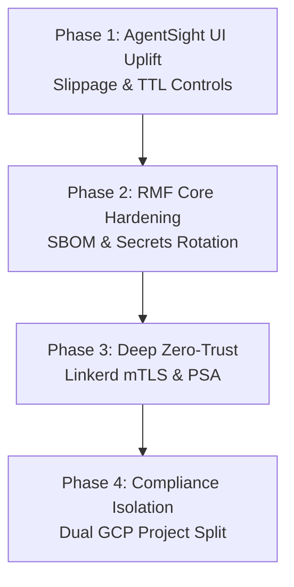

# CAGE v2.0 & NIST RMF Step 7 Security Roadmap

| Field | Value |
|---|---|
| **Document Series** | CAGE Architecture Series |
| **Version** | v2.0.0-Roadmap |
| **Classification** | INTERNAL / FOUO |
| **Status** | DRAFT — Pending ISSO & AO Review |

---

## Executive Summary

With the core **Human-in-the-Loop (HITL) TOCTOU remediation** completely secured, unit-tested (41/41 passing), and technical reports synchronized, the CAGE v2.0 architecture must proceed to integrate its user-facing surfaces. 

To bridge the gap between deterministic backend enforcement and human-centric operations, **Phase 1 focuses immediately on the AgentSight UI Uplift**. This ensures human reviewers can dynamically adjust slippage bounds (`max_slippage_pct`) and monitor the Time-To-Live (TTL) countdown directly in the web dashboard, avoiding operational frustration.

Subsequent phases address core security hardening and NIST RMF continuous monitoring controls to maintain CAGE's fail-closed, highly resilient posture.

---

## v2.0 Phase Progression

### **Phase 1: AgentSight UI Uplift** ✅ COMPLETED (v2.0.0-rc.1)
**Goal:** Expose the bounded execution envelopes to compliance operators and human reviewers to complete the HITL closed loop.

*   **Reviewer Input Panel**: ✅ COMPLETED — `KernelDashboard.tsx` displays an interactive, adjustable control allowing the reviewer to adjust `max_slippage_pct` (defaulting to 2.0%) before clicking "Approve".
*   **Live Price Drift Indicator**: ✅ COMPLETED — Computed price drift delta ($\Delta P = |P_{\text{fresh}} - P_{\text{stale}}| / P_{\text{stale}}$) displayed in real time next to transaction details.
*   **TTL Countdown Visualizer**: ✅ COMPLETED — Visual countdown timer for `hitl_expires_at`; automatically greys out approval action on expiry and prompts operator to request fresh trade evaluation.
*   **Audit Evidence Display**: ✅ COMPLETED — `rehydration_result` (with $P_{\text{stale}}$, $P_{\text{fresh}}$, and `drift_pct`) rendered in transaction history panel.
*   **eBPF Kernel Observability**: ✅ COMPLETED — AgentSight eBPF DaemonSet deployed (`deployment/k8s/agentsight-daemon.yaml`); remote exporter active (`exporter.type: "remote"`).

---

### **Phase 2: RMF Core Hardening (Weeks 2–6)**
**Goal:** Address immediate security debt and software supply chain tracking.

*   **HMAC Routing Seal Hardening**: Remove the developer fallback paths in `governance_middleware.py` and enforce strict HMAC verification across all override interfaces.
*   **Software Bill of Materials (SBOM)**: Integrate `syft` and `grype` in the CI/CD pipeline (`.github/workflows/`) to generate container image SBOMs and block builds with unpatched CRITICAL vulnerabilities.
*   **Immutable Image Pins**: Replace mutable `:latest` container tags with immutable `@sha256:<digest>` pins across all Kubernetes and vLLM manifests.
*   **Jira/GitHub Issues Compliance Loop**: Extend `notifier.py` to auto-create GitHub Issues with regulatory severity tags on any `GOVERNANCE_VIOLATION` event emitted by the `GovernanceEventBus`.

---

### **Phase 3: Zero-Trust Cluster Architecture (Weeks 6–16)**
**Goal:** Transition cluster networks and runtime privileges to a strict default-deny, zero-trust state.

*   **Pod Security Admission (PSA)**: Apply the Kubernetes `pod-security.kubernetes.io/enforce: restricted` label to the `governance-stack` namespace, auditing and enforcing non-root container lifecycles.
*   **Linkerd mTLS Lock-Down**: ✅ COMPLETED (2026-05-17, FIND-011 resolved) Finalize Linkerd `MeshTLSAuthentication` policies across the cluster to guarantee SPIFFE-identified, encrypted channels for all gateway-to-agent and gateway-to-policy-engine communications.
*   **Cilium Egress Restricting**: ✅ COMPLETED (2026-05-17, FIND-011 resolved) Enforce Cilium L7 egress controls to block unauthorized external API calls, limiting traffic solely to approved market providers (e.g., yfinance) and secure telemetry endpoints.
*   **Network Policy Hardening**: ✅ COMPLETED (2026-05-17, FIND-011 resolved) Default-deny Kubernetes NetworkPolicy and Cilium CiliumNetworkPolicy applied across the `governance-stack` namespace.
*   **HA OTel Collection**: ✅ DEPRECATED (2026-05-31) The standalone OpenTelemetry Collector has been deprecated and decommissioned in favor of Langfuse's built-in, native OTLP ingestion endpoint, simplifying the pipeline and ensuring direct trace delivery.

---

### **Phase 4: Compliance Telemetry Isolation (Weeks 16–52)**
**Goal:** Isolate the tamper-evident audit trail from execution workloads.

*   **Dual GCP Project Separation**: Formally split CAGE into two projects:
    1.  `cage-prod`: Dedicated solely to execution workloads (agent graph, inference gateway, vLLM nodes).
    2.  `cage-compliance`: An isolated project containing only the Langfuse compliance databases, GCS audit buckets, and the compliance-bridge server.
*   **VPC Private Service Connect**: Establish private, VPC-peered links between the execution and compliance networks to allow secure aggregation without exposing policy servers to public routing.
*   **KMS CMEK Key Rotation**: Secure all stored secrets using GCP Cloud KMS Customer-Managed Encryption Keys with 90-day automatic HSM rotation.

---

## ATO Readiness Milestones

> **⚠️ US_FED ONLY — Regional Scoping Notice:** The ATO readiness milestones below apply exclusively to **`US_FED` deployments** under the NIST SP 800-53 authorization framework. `EU_ECB` and `APAC_MAS` deployments have separate compliance milestones governed by their respective regional frameworks — they are **not** subject to NIST ATO requirements.

By progressing through this roadmap, CAGE's NIST SP 800-53 Moderate baseline compliance posture advances systematically:

### US_FED — NIST SP 800-53 ATO Milestones

| Metric | Current State | After Phase 1 (UI) | After Phase 2 (Hardening) | After Phase 3 (Zero-Trust) | After Phase 4 (Isolation) |
|---|---|---|---|---|---|
| **Control Assessment Coverage** | 24% | **28%** | **45%** | **59%** | **77%** |
| **Audit Integrity (AU family)**| Partial | **Partial** | **Implemented** | **Implemented** | **Implemented** |
| **Access Control (AC family)** | Partial | **Partial** | **Partial** | **Implemented** | **Implemented** |
| **System Protection (SC/SI)**  | Partial | **Partial** | **Partial** | **Implemented** | **Implemented** |

*Note: 100% compliance requires formal AO signature on the final Authorization Decision Package. 77% represents the maximum technical and engineering readiness achievable prior to sign-off.*

### EU_ECB — EU AI Act Compliance Milestones

EU_ECB deployments are gated on EU AI Act (Reg. 2024/1689) compliance, not NIST SP 800-53. Key milestones for EU_ECB:

| Milestone | Status | Notes |
|---|---|---|
| High-Risk AI classification (Art. 6 + Annex III §5(b)) | ✅ Mapped | 6 controls in `EU_ECB_BASELINE.json` |
| Fundamental Rights Impact Assessment — Step 8 FRIA (Art. 29a) | 🟡 Partial | Attestation logging active; EU AI Office registration pending |
| DORA ICT resilience controls (Arts. 10, 11, 12) | 🟡 Partial | Architecture mapped; full compliance testing pending |
| GDPR Art. 22 automated decision-making constraints | 🟡 Partial | DPIA integration pending |
| EBA Guidelines (2023/02) internal governance | 🟡 Partial | ECB SSM TRIM validation pending |

### APAC_MAS — MAS FEAT Compliance Milestones

APAC_MAS deployments are gated on MAS FEAT compliance, not NIST SP 800-53. Key milestones for APAC_MAS:

| Milestone | Status | Notes |
|---|---|---|
| MAS FEAT Principles (F, E, A, T) | 🟡 Partial | 5 controls in `APAC_MAS_BASELINE.json` |
| Fairness Impact Assessment — quantitative metrics (F2) | 🟡 Partial | DoWhy causal gatekeeper mapped; quantitative metrics pending |
| MAS Notice 655 audit certification | 🟡 Partial | Certification pending |
| MAS TRM Guidelines §6.3/6.4 AI controls | 🟡 Partial | Architecture mapped; MAS ENRM validation pending |
