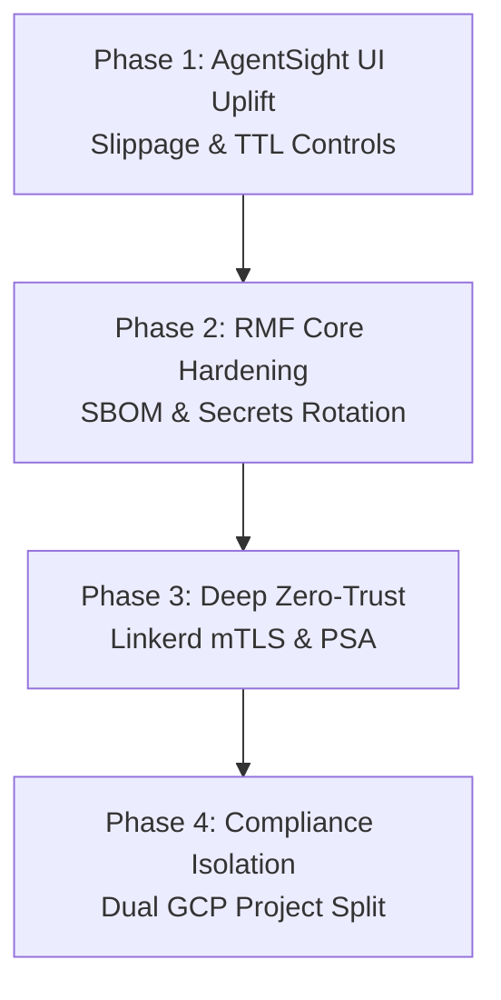

# CAGE v2.0 & NIST RMF Step 7 Security Roadmap

| Field | Value |
|---|---|
| **Document Series** | CAGE Architecture Series |
| **Version** | v2.0.0-Roadmap |
| **Classification** | INTERNAL / FOUO |
| **Status** | DRAFT — Pending ISSO & AO Review |

---

## Executive Summary

With the core **Human-in-the-Loop (HITL) TOCTOU remediation** completely secured, unit-tested (41/41 passing), and technical reports synchronized, the CAGE v2.0 architecture must proceed to integrate its user-facing surfaces. 

To bridge the gap between deterministic backend enforcement and human-centric operations, **Phase 1 focuses immediately on the AgentSight UI Uplift**. This ensures human reviewers can dynamically adjust slippage bounds (`max_slippage_pct`) and monitor the Time-To-Live (TTL) countdown directly in the web dashboard, avoiding operational frustration.

Subsequent phases address core security hardening and NIST RMF continuous monitoring controls to maintain CAGE's fail-closed, highly resilient posture.

---

## v2.0 Phase Progression

### **Phase 1: AgentSight UI Uplift (Immediate Next Focus)**
**Goal:** Expose the bounded execution envelopes to compliance operators and human reviewers to complete the HITL closed loop.

*   **Reviewer Input Panel**: Update `KernelDashboard.tsx` to display an interactive, adjustable control (slider or numeric input) allowing the reviewer to adjust the `max_slippage_pct` (defaulting to 2.0%) before clicking "Approve".
*   **Live Price Drift Indicator**: Display the computed price drift delta ($\Delta P = |P_{\text{fresh}} - P_{\text{stale}}| / P_{\text{stale}}$) in real time next to the transaction details, giving reviewers visibility into current market volatility before they commit.
*   **TTL Countdown Visualizer**: Add a visual countdown timer for `hitl_expires_at`. When the TTL expires, automatically grey out the approval action, transition the UI status, and prompt the operator to request a fresh trade evaluation (avoiding unexpected HTTP 410 Gone rejections on click).
*   **Audit Evidence Display**: Render the resulting `rehydration_result` (with $P_{\text{stale}}$, $P_{\text{fresh}}$, and `drift_pct`) in the transaction history panel to preserve evidence visibility.

---

### **Phase 2: RMF Core Hardening (Weeks 2–6)**
**Goal:** Address immediate security debt and software supply chain tracking.

*   **HMAC Routing Seal Hardening**: Remove the developer fallback paths in `governance_middleware.py` and enforce strict HMAC verification across all override interfaces.
*   **Software Bill of Materials (SBOM)**: Integrate `syft` and `grype` in the CI/CD pipeline (`.github/workflows/`) to generate container image SBOMs and block builds with unpatched CRITICAL vulnerabilities.
*   **Immutable Image Pins**: Replace mutable `:latest` container tags with immutable `@sha256:<digest>` pins across all Kubernetes and vLLM manifests.
*   **Jira/GitHub Issues Compliance Loop**: Extend `notifier.py` to auto-create GitHub Issues with regulatory severity tags on any `GOVERNANCE_VIOLATION` event emitted by the `GovernanceEventBus`.

---

### **Phase 3: Zero-Trust Cluster Architecture (Weeks 6–16)**
**Goal:** Transition cluster networks and runtime privileges to a strict default-deny, zero-trust state.

*   **Pod Security Admission (PSA)**: Apply the Kubernetes `pod-security.kubernetes.io/enforce: restricted` label to the `governance-stack` namespace, auditing and enforcing non-root container lifecycles.
*   **Linkerd mTLS Lock-Down**: ✅ COMPLETED (2026-05-17, FIND-011 resolved) Finalize Linkerd `MeshTLSAuthentication` policies across the cluster to guarantee SPIFFE-identified, encrypted channels for all gateway-to-agent and gateway-to-policy-engine communications.
*   **Cilium Egress Restricting**: ✅ COMPLETED (2026-05-17, FIND-011 resolved) Enforce Cilium L7 egress controls to block unauthorized external API calls, limiting traffic solely to approved market providers (e.g., yfinance) and secure telemetry endpoints.
*   **Network Policy Hardening**: ✅ COMPLETED (2026-05-17, FIND-011 resolved) Default-deny Kubernetes NetworkPolicy and Cilium CiliumNetworkPolicy applied across the `governance-stack` namespace.
*   **HA OTel Collection**: ✅ DEPRECATED (2026-05-31) The standalone OpenTelemetry Collector has been deprecated and decommissioned in favor of Langfuse's built-in, native OTLP ingestion endpoint, simplifying the pipeline and ensuring direct trace delivery.

---

### **Phase 4: Compliance Telemetry Isolation (Weeks 16–52)**
**Goal:** Isolate the tamper-evident audit trail from execution workloads.

*   **Dual GCP Project Separation**: Formally split CAGE into two projects:
    1.  `cage-prod`: Dedicated solely to execution workloads (agent graph, inference gateway, vLLM nodes).
    2.  `cage-compliance`: An isolated project containing only the Langfuse compliance databases, GCS audit buckets, and the compliance-bridge server.
*   **VPC Private Service Connect**: Establish private, VPC-peered links between the execution and compliance networks to allow secure aggregation without exposing policy servers to public routing.
*   **KMS CMEK Key Rotation**: Secure all stored secrets using GCP Cloud KMS Customer-Managed Encryption Keys with 90-day automatic HSM rotation.

---

## ATO Readiness Milestones

By progressing through this roadmap, CAGE's NIST SP 800-53 Moderate baseline compliance posture advances systematically:

| Metric | Current State | After Phase 1 (UI) | After Phase 2 (Hardening) | After Phase 3 (Zero-Trust) | After Phase 4 (Isolation) |
|---|---|---|---|---|---|
| **Control Assessment Coverage** | 24% | **28%** | **45%** | **59%** | **77%** |
| **Audit Integrity (AU family)**| Partial | **Partial** | **Implemented** | **Implemented** | **Implemented** |
| **Access Control (AC family)** | Partial | **Partial** | **Partial** | **Implemented** | **Implemented** |
| **System Protection (SC/SI)**  | Partial | **Partial** | **Partial** | **Implemented** | **Implemented** |

*Note: 100% compliance requires formal AO signature on the final Authorization Decision Package. 77% represents the maximum technical and engineering readiness achievable prior to sign-off.*
