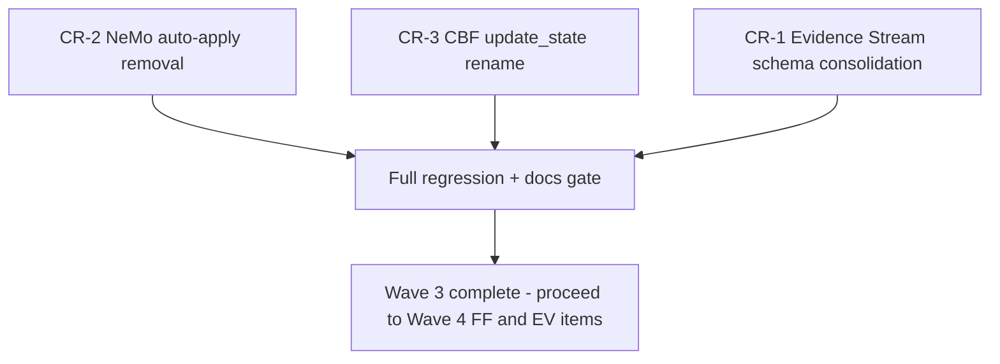

# Wave 3 High-Risk Items Inclusion Checklist

> **Purpose:** This checklist supersedes the "defer to v3.1.0/v4.0.0" default
> outcome for CR-1, CR-2, and CR-3 documented in
> [`docs/MAJOR_VERSION_CLEANUP_PLAN.md`](MAJOR_VERSION_CLEANUP_PLAN.md) §2.3,
> §3 (Wave 3), and §6 (Wave 3 Implementation Checklist), and in
> [`CHANGELOG.md`](../CHANGELOG.md)'s `[3.0.0]` entry ("Deprecated" section,
> which currently lists all three items as deferred). It documents the
> reference-implementation rationale for including all three items in
> `v3.0.0` and provides an executable checklist for doing so.
>
> **This is a planning document only** — no code changes have been made as
> part of producing this checklist. It is the direct input to a future
> implementation task.

---

## Reference Implementation Context

Per [`AGENTS.md`](../AGENTS.md) (top of file) and reinforced throughout
`docs/` (e.g. [`docs/operations/DEPLOYMENT_RULES.md:3-5`](operations/DEPLOYMENT_RULES.md:3),
[`docs/operations/DEPLOYMENT_DECISION_RECORD.md:3-5`](operations/DEPLOYMENT_DECISION_RECORD.md:3),
[`docs/issues/ISSUE_REGISTER_2026-08-04.md:7`](issues/ISSUE_REGISTER_2026-08-04.md:7)):

> CAGE is a reference architecture demonstrating governance patterns for AI
> systems. **It is not deployed to production.** Deployment, change-management,
> and region-guard rules are illustrative patterns for adopters, not
> mandatory production obligations for this repository's maintainers.

This status changes the calculus behind all three original CR sign-off gates,
which were written assuming a live production deployment with real
regulatory exposure, real auditors, and real operational continuity risk.

### Impact on Sign-off Requirements

The original plan required **Compliance/OSCAL owner, Security, and Gateway
governance engineering owner** sign-off for CR-1/CR-2/CR-3 — roles implying a
staffed compliance/security organization reviewing a live system on behalf of
real regulators (per [`AGENTS.md`](../AGENTS.md) Compliance Artifact
Obligations). CAGE has no such organization; per
[`docs/technical-report/07-SECURITY-INFRASTRUCTURE.md:814-816`](technical-report/07-SECURITY-INFRASTRUCTURE.md:814)
and [`docs/README.md:137-139`](README.md:137), fictional role-incumbent
placeholders (`[TBD]` AO/ISSO) have already been deliberately removed from
this repository as providing no engineering value. Requiring the same kind of
formal sign-off artifact for CR-1–CR-3 would reintroduce that anti-pattern.

**Revised requirement:** Technical Lead review and a documented rationale
(this checklist + the PR description) replaces the formal
Compliance/Security/regulatory-owner sign-off gate. The compliance
**artifact** obligations (OSCAL component updates, POAM updates) are
unaffected and still apply per [`AGENTS.md`](../AGENTS.md) — only the
*human sign-off ceremony* is right-sized to a reference implementation.

### Impact on Data Migration Concerns

CR-1's original gate was a **data-migration completeness precondition**: "a
documented, executed migration of all production evidence chains from v1.0 →
v1.1 ... must complete and be verified *before* the v1.0 code path is
deleted" ([`MAJOR_VERSION_CLEANUP_PLAN.md:116`](MAJOR_VERSION_CLEANUP_PLAN.md:116)).

Because CAGE has never been deployed to production, **no production evidence
chains exist and none have ever been persisted outside of test fixtures and
local/dev Redis instances.** The data-migration gate is therefore vacuously
satisfied — there is nothing to migrate. This is confirmed by:
- No CLI/operational tooling for exporting or auditing live evidence chains
  exists outside the `--audit-schema-versions` placeholder flagged as
  "illustrative" in [`MAJOR_VERSION_CLEANUP_PLAN.md:415`](MAJOR_VERSION_CLEANUP_PLAN.md:415).
- All `schema_version == "1.0"` exercise paths found in the codebase are
  confined to [`tests/test_dual_schema_verification.py`](../tests/test_dual_schema_verification.py:1)
  fixtures constructing synthetic v1.0 dicts in-memory — see
  [Prerequisites](#prerequisites) below for the exact verification method.

### Impact on Risk Assessment

| Original framing (production system) | Reference-implementation framing |
|---|---|
| CR-1 "High" — could make historical audit records unverifiable, a live compliance/audit-trail regression | **Low-Medium** — no historical records exist to become unverifiable; risk is limited to losing a demonstration of dual-schema handling, which can be preserved as archived test coverage rather than live code |
| CR-2 "High (procedural)" — self-authentication loop risk in a live governance system | **Low** — flag already defaults `false`; no CI/dev workflow found depending on `NEMO_AUTO_APPLY_ENABLED=true` outside of [`tests/test_cybernetic_loop.py:294-299`](../tests/test_cybernetic_loop.py:294)'s own explicit opt-in fixture |
| CR-3 "High (uncertain)" — TOCTOU race in a live financial-invariant system | **Medium** — the concurrency bug is real and the fix/mitigation decision still matters for anyone who deploys CAGE for real, but there is no live financial exposure today; zero external (non-test, non-`cbf.py`-internal) call sites of `update_state()` were found in `src/` (verified by search — only `rollback_state()` is called externally, from [`mcp_tool_server.py:407`](../src/gateway/server/mcp_tool_server.py:407) and referenced as a TODO in [`generated_saga_nodes.py:165`](../src/gateway/governance/generated_saga_nodes.py:165)) |

**Net effect:** all three items move from "High Risk, gate on external
sign-off + data migration" to "Medium-or-lower risk, gate on Technical Lead
review + full regression suite passing." This justifies collapsing Wave 3
into the main `v3.0.0` release scope rather than deferring to `v3.1.0`/`v4.0.0`.

---

## CR-1: Evidence Stream Schema Consolidation

**Source:** [`src/compliance_bridge/evidence_stream.py`](../src/compliance_bridge/evidence_stream.py)

### Prerequisites

- [ ] Verify no production evidence chains exist (reference impl only) —
      confirm via: (a) no live GKE deployment has ever had
      `EVIDENCE_STREAM_ENABLED=true` set outside of dev/test namespaces, per
      [`config/thresholds/`](../config/thresholds/) / `deployment/k8s/` manifest
      review; (b) grep `compliance/` and `docs/POAM.md` for any reference to
      a real evidence-chain export or audit query having been run
- [ ] Document v1.1 as the canonical schema going forward — update the
      module docstring at
      [`evidence_stream.py:15-73`](../src/compliance_bridge/evidence_stream.py:15)
      (currently silent on which schema is canonical) to state v1.1 is the
      only supported live-write schema
- [ ] Confirm the genesis-hash/cutover-seeding logic
      ([`get_last_v1_0_hash()`](../src/compliance_bridge/evidence_stream.py:683))
      is not required once no v1.0 records can exist — determine whether to
      delete it outright or retain as a no-op safeguard for any adopter who
      *did* persist v1.0 records in their own fork

### Code Changes Required

Remove the v1.0-specific branches while preserving the v1.1 hashing/verification
path as the sole live-write mechanism:

- [ ] [`_link_hash_versioned()`](../src/compliance_bridge/evidence_stream.py:415-479) —
      remove the `if schema_version == "1.0":` branch (lines 448–460);
      collapse to always compute the v1.1 (sparse-inclusion) header
- [ ] [`_detect_schema_version()`](../src/compliance_bridge/evidence_stream.py:482-502) —
      simplify: remove the `"1.0"` fallback branch (line 502) and instead
      treat any record without an explicit `schema_version`/`schema` marker
      as **invalid** (fail closed) rather than silently defaulting to `"1.0"`
- [ ] [`verify_record()`](../src/compliance_bridge/evidence_stream.py:505-611) —
      remove dual-path branching; the function still accepts the
      `EvidenceRecord | dict` union but no longer needs to special-case v1.0
      field extraction once `_link_hash_versioned()` is simplified
- [ ] [`EvidenceRecord.from_dict()`](../src/compliance_bridge/evidence_stream.py:232-258) —
      remove the `data.get("schema_version", "1.0")` default-to-1.0 fallback
      (line 243); default to `"1.1"` (or reject records missing the field)
- [ ] [`migrate_record_1_0_to_1_1()`](../src/compliance_bridge/evidence_stream.py:614-680) —
      **retain, do not delete**, but move to an explicitly-named
      "archival/legacy" section of the module (or a separate
      `evidence_stream_legacy.py` module) with a docstring clarifying it
      exists only for adopters who persisted v1.0 records in their own
      deployment, not for CAGE's own reference chain
- [ ] `_SCHEMA_1_0` constant ([`evidence_stream.py:326`](../src/compliance_bridge/evidence_stream.py:326)) —
      retain only if `migrate_record_1_0_to_1_1()` is retained (it isn't
      referenced elsewhere per the grep in this analysis)

### Migration Path for Test Fixtures Using v1.0

- [ ] [`tests/test_dual_schema_verification.py`](../tests/test_dual_schema_verification.py:1) —
      this file's entire purpose is dual-schema testing. Reclassify its
      v1.0-specific test classes (`TestEvidenceRecordDataclass`'s v1.0
      detection tests, `TestDualSchemaVerifyRecord`'s v1.0 verify tests,
      `TestMigrateRecord`) as **archival/legacy regression tests** — move
      them to a dedicated `tests/test_evidence_stream_legacy_migration.py`
      that exercises only `migrate_record_1_0_to_1_1()` and
      `get_last_v1_0_hash()` in isolation, since the main `verify_record()`
      path will no longer accept live v1.0 records
- [ ] Any fixture across the suite constructing a raw dict with
      `"schema_version": "1.0"` or omitting `schema_version` entirely and
      expecting v1.0 auto-detection must be updated to set
      `"schema_version": "1.1"` explicitly, or moved to the new legacy test
      file

### Testing Requirements

- **Existing test coverage verification:**
  - [ ] Run `uv run pytest tests/test_dual_schema_verification.py tests/test_evidence_stream.py tests/test_evidence_chain_blocking.py tests/test_evidence_stream_preconditions.py -v` before any change to establish the baseline
  - [ ] Confirm [`tests/test_governance_middleware.py:400-424`](../tests/test_governance_middleware.py:400) (mocks `get_evidence_sink`) is unaffected — it does not exercise schema-version branching directly
- **New tests needed:**
  - [ ] Add a regression test asserting `verify_record()` / `_detect_schema_version()` now **fail closed** (return `valid=False`, not a silent v1.0 fallback) for any record missing an explicit `schema_version`/`schema` marker
  - [ ] Add `tests/test_evidence_stream_legacy_migration.py` (new, per above) preserving coverage for `migrate_record_1_0_to_1_1()` and `get_last_v1_0_hash()` as standalone archival utilities

### Documentation Updates

- [ ] OSCAL: update the relevant `compliance/oscal/` component
      (SC-4 / `A.9.2` hash-chain integrity control, per
      [`compliance/lula/lula-validation-sc4.yaml`](../compliance/lula/lula-validation-sc4.yaml))
      to reflect that only schema v1.1 is supported for live evidence writes,
      within 2 business days of merge per [`AGENTS.md`](../AGENTS.md)
      Compliance Artifact Obligations
- [ ] Update [`docs/BREAKING_CHANGES_v3.md`](BREAKING_CHANGES_v3.md) — add a
      new entry under "Removed Classes/Functions" for the v1.0 live-write
      path, cross-referencing this checklist
- [ ] Update [`CHANGELOG.md`](../CHANGELOG.md)'s `[3.0.0]` entry — move "Evidence
      Stream v1.0 schema support marked for removal in v4.0.0 (CR-1
      deferred)" from **Deprecated** to **Breaking Changes**, since it is now
      shipping in this release
- [ ] Update [`docs/MIGRATION_GUIDE_v3.md`](MIGRATION_GUIDE_v3.md) step 4
      ("If you operate a live evidence chain...") to reflect that CR-1 has
      shipped, not deferred

---

## CR-2: NeMo Auto-Apply Path Removal

**Source:** [`src/governed_financial_advisor/server.py`](../src/governed_financial_advisor/server.py)

### Prerequisites

- [ ] Confirm no external integrations depend on auto-apply — the only
      reference found is the test suite's own explicit opt-in fixture at
      [`tests/test_cybernetic_loop.py:294-299`](../tests/test_cybernetic_loop.py:294)
      (`enable_auto_apply` fixture monkeypatching `srv._NEMO_AUTO_APPLY = True`).
      No `deployment/k8s/*.yaml` manifest sets `NEMO_AUTO_APPLY_ENABLED=true`
      (verify with a final grep of `deployment/` before removal)
- [ ] Document the propose/approve flow as canonical — already substantially
      documented in the module comment block at
      [`server.py:844-859`](../src/governed_financial_advisor/server.py:844);
      confirm no doc elsewhere in `docs/` still describes auto-apply as the
      primary/default path

### Code Changes Required

- [ ] Delete the `_NEMO_AUTO_APPLY` flag definition at
      [`server.py:861-863`](../src/governed_financial_advisor/server.py:861)
- [ ] In [`apply_nemo_refinement()`](../src/governed_financial_advisor/server.py:1038-1119):
  - [ ] Remove the `if not _NEMO_AUTO_APPLY:` branch structure (lines
        1052–1084) — the propose-flow delegation becomes the **only**
        behavior, unconditionally
  - [ ] Delete the legacy auto-apply branch (lines 1086–1119: the
        `logger.warning(...)` block, the `reload_nemo_rails()` call, and the
        `"auto_apply_warning"` response field)
  - [ ] Update the function's docstring (lines 1040–1051) to remove the
        "In dev/test (NEMO_AUTO_APPLY_ENABLED=true)" branch description
- [ ] The route decorator and `NeMoApplyRefinementRequest` request model
      **stay** — per the plan's own reclassification
      ([`MAJOR_VERSION_CLEANUP_PLAN.md:94`](MAJOR_VERSION_CLEANUP_PLAN.md:94)),
      `POST /v1/nemo/apply-refinement` remains available but now always
      routes through the staged-proposal flow (equivalent to today's
      `_NEMO_AUTO_APPLY=False` default branch, made permanent)
- [ ] `EV-4` (`NEMO_AUTO_APPLY_ENABLED` env var) — delete the
      `os.environ.get("NEMO_AUTO_APPLY_ENABLED", ...)` read as part of this
      same change (no separate PR needed, per
      [`MAJOR_VERSION_CLEANUP_PLAN.md:315`](MAJOR_VERSION_CLEANUP_PLAN.md:315))

### Endpoint Changes

- [ ] None — `POST /v1/nemo/apply-refinement`,
      `POST /v1/nemo/propose-refinement`, and
      `POST /v1/nemo/approve-refinement/{proposal_id}` all keep their
      existing signatures. Only `apply-refinement`'s internal behavior
      collapses to a single code path.

### Testing Requirements

- [ ] [`tests/test_cybernetic_loop.py`](../tests/test_cybernetic_loop.py) —
      the `TestApplyRefinement` class
      ([`tests/test_cybernetic_loop.py:271-354`](../tests/test_cybernetic_loop.py:271))
      is built entirely around the `enable_auto_apply` fixture
      (lines 294–299) exercising the now-deleted branch. **Delete this test
      class outright** (`test_successful_reload`, `test_reload_failure_returns_500`,
      `test_minimum_required_fields`, `test_missing_required_fields_returns_422`)
      — the reload-mechanics behavior it tests is superseded by
      `approve_nemo_refinement()`'s own reload path (lines 1001–1021), which
      already has equivalent coverage
- [ ] Add/confirm a replacement test asserting `POST /v1/nemo/apply-refinement`
      **always** returns `{"status": "pending_approval", ...}` regardless of
      any environment variable — i.e., a regression test proving the
      auto-apply path is unreachable, not just untested
- [ ] Verify propose/approve path fully tested — confirm
      `TestKfpComponentEndpoint` and any `propose_nemo_refinement()` /
      `approve_nemo_refinement()` tests in
      [`tests/test_cybernetic_loop.py`](../tests/test_cybernetic_loop.py:23)
      remain green and are not accidentally coupled to the deleted fixture

### Documentation Updates

- [ ] API documentation: update any OpenAPI/route description referencing
      `NEMO_AUTO_APPLY_ENABLED` as a supported dev/test override
- [ ] [`docs/MIGRATION_GUIDE_v3.md:357-361`](MIGRATION_GUIDE_v3.md:357)
      ("MR-5 / CR-2 — NeMo legacy auto-apply → propose/approve flow") —
      update from "planned" framing to "shipped in v3.0.0" framing
- [ ] [`docs/BREAKING_CHANGES_v3.md:67-76`](BREAKING_CHANGES_v3.md:67) — move
      the `POST /v1/nemo/apply-refinement` entry from "no CAGE HTTP endpoint
      is removed" framing to explicitly note the behavior collapse (the
      `NEMO_AUTO_APPLY_ENABLED=true` branch is now unreachable, not merely
      defaulted-off)
- [ ] [`CHANGELOG.md`](../CHANGELOG.md) — move "NeMo auto-apply path marked
      for removal pending compliance sign-off (CR-2 deferred)" from
      **Deprecated** to **Breaking Changes**

---

## CR-3: CBF `update_state()` Resolution

**Source:** [`src/gateway/governance/cbf.py`](../src/gateway/governance/cbf.py) —
`update_state()` (lines 907–998), `atomic_verify_and_commit()` (lines
1099+), `SafetyFilter` Protocol in
[`src/gateway/governance/contracts.py`](../src/gateway/governance/contracts.py:60-111).

### Design Decision Required

**A) Fix atomicity** — implement proper locking/re-verification inside
`update_state()` itself (e.g. re-run the CBF envelope check inside the same
WATCH/MULTI/EXEC transaction, mirroring what `atomic_verify_and_commit()`
already does via its Lua script). This makes `update_state()` itself safe to
call standalone, at the cost of duplicating the CBF formula in two places
(Python `update_state()` and the Lua script in `atomic_verify_and_commit()`).

**B) Restrict API** — rename `update_state()` to a private/internal-only
method (e.g. `_update_state_unsafe()`), called exclusively by
`atomic_verify_and_commit()` internally. External callers lose direct access
and must go through the atomic wrapper. This was the cleanup plan's original
recommendation ([`MAJOR_VERSION_CLEANUP_PLAN.md:118`](MAJOR_VERSION_CLEANUP_PLAN.md:118)).

**C) Document limitation** — keep `update_state()` public with its existing
`DeprecationWarning`, add a prominent module/method-level warning, and do
nothing further in `v3.0.0`.

### Recommendation

**Adopt Option B (Restrict API), with the rename executed in `v3.0.0`.**

Rationale specific to the reference-implementation context:
- A grep of `src/` for `.update_state(` outside of `cbf.py`'s own definition
  and the test suite found **zero external call sites** — every real
  production caller already goes through
  `atomic_verify_and_commit()`/`verify_action()` or the higher-level
  `SymbolicGovernor` pipeline. The blast radius of renaming is therefore
  confined to: (a) the `SafetyFilter` Protocol definition, (b) test doubles
  implementing that Protocol, and (c) the CBF's own unit tests exercising
  `update_state()` directly as a WATCH/MULTI/EXEC primitive.
- Because there is no production deployment, there is no unknown external
  consumer who could be silently broken by the rename — the usual reason to
  prefer Option C (document-only, avoid breaking changes) in a live system
  does not apply here.
- Option A (fix atomicity in `update_state()` itself) duplicates the CBF
  safety formula in two independently-maintained code paths (Python +
  Lua), which is a maintainability/drift risk without a corresponding
  benefit — nothing in the reference-implementation context needs
  `update_state()` to remain a safe standalone primitive, since nothing
  outside `cbf.py`'s own retry-logic tests calls it directly.
- Option B directly closes the TOCTOU/MED-5 finding as a matter of *API
  design* (make the unsafe path unreachable) rather than *runtime
  behavior*, which is the cheapest, lowest-risk way to resolve CR-3 given
  the confirmed zero-external-caller finding above.

This matches the plan's own original recommendation
([`MAJOR_VERSION_CLEANUP_PLAN.md:118,316`](MAJOR_VERSION_CLEANUP_PLAN.md:118))
and the "narrower scope... confirm this narrower scope is acceptable" open
question flagged in the plan's Appendix item 5
([`MAJOR_VERSION_CLEANUP_PLAN.md:451`](MAJOR_VERSION_CLEANUP_PLAN.md:451)) —
this checklist confirms it as accepted, justified by the
reference-implementation zero-caller finding.

### Code Changes Required (Option B)

- [ ] Rename `update_state()` → `_update_state_unsafe()` in
      [`cbf.py:907`](../src/gateway/governance/cbf.py:907); keep the existing
      `DeprecationWarning` body but update its wording to reflect the method
      is now explicitly internal/private (not merely "prefer the alternative")
- [ ] Update `atomic_verify_and_commit()` (if it does not already implement
      the commit purely in Lua) to call `_update_state_unsafe()` internally
      where a Python-side commit step is needed, or confirm it needs no
      change if the Lua script fully replaces the Python commit path
- [ ] Update the `SafetyFilter` Protocol in
      [`contracts.py:101-105`](../src/gateway/governance/contracts.py:101) —
      rename the Protocol method to `_update_state_unsafe()` **or** remove it
      from the public Protocol entirely if external implementers should no
      longer be expected to provide it (this is the one open sub-decision:
      confirm whether the Protocol itself should still declare the method)
- [ ] `rollback_state()` is **not** part of this rename — it is a separate
      method with its own atomicity characteristics and has confirmed
      external callers ([`mcp_tool_server.py:407`](../src/gateway/server/mcp_tool_server.py:407));
      leave it untouched unless a future audit finds the same TOCTOU issue
      there

### Testing Requirements (Option B)

- [ ] Per the plan's existing guidance
      ([`MAJOR_VERSION_CLEANUP_PLAN.md:318`](MAJOR_VERSION_CLEANUP_PLAN.md:318)):
      **do not delete** the WATCH/MULTI/EXEC retry-logic coverage in
      [`tests/test_cbf_chaos.py:134-246`](../tests/test_cbf_chaos.py:134),
      [`tests/test_cbf_negative_paths.py:514-632`](../tests/test_cbf_negative_paths.py:514),
      [`tests/test_fence_epoch.py:84-110,549-580`](../tests/test_fence_epoch.py:84) —
      update these call sites to call `_update_state_unsafe()` instead of
      `update_state()` (mechanical rename, tests continue to assert the same
      retry/fence-epoch behavior)
- [ ] [`tests/test_symbolic_governor_cbf_atomicity.py`](../tests/test_symbolic_governor_cbf_atomicity.py:145) —
      its docstring explicitly documents the TOCTOU race as the *reason the
      test exists*; update the docstring to reflect that the race is now
      structurally unreachable via the public API (not just discouraged),
      while keeping the test itself as a regression guard against any future
      reintroduction of a public unsafe path
- [ ] [`tests/test_governance_contracts.py:78-132`](../tests/test_governance_contracts.py:78) and
      [`tests/test_governance_contracts_runtime.py:76-213`](../tests/test_governance_contracts_runtime.py:76) —
      these test the `SafetyFilter` Protocol's structural typing directly;
      update every concrete test-double implementation's `update_state()`
      method name to match whatever the Protocol declares post-rename
- [ ] [`tests/test_gateway_compliance_bridge_contract.py:385-411`](../tests/test_gateway_compliance_bridge_contract.py:385) —
      same test-double update as above
- [ ] Add a new regression test asserting `update_state` (the old public
      name) no longer exists as a callable attribute on
      `ControlBarrierFunction` (i.e., `hasattr(cbf_instance, "update_state")`
      is `False` post-rename), proving the API restriction is enforced, not
      just documented

### Documentation Updates (Option B)

- [ ] [`docs/BREAKING_CHANGES_v3.md:65,83`](BREAKING_CHANGES_v3.md:65) — remove
      the "conditional — pending CR-3 architectural decision" hedge language;
      state definitively that `update_state()` is renamed to
      `_update_state_unsafe()` and is no longer part of the public API
- [ ] [`docs/MIGRATION_GUIDE_v3.md:564-571`](MIGRATION_GUIDE_v3.md:564) (the
      "Is `CBF.update_state()` deleted in v3.0.0?" FAQ) — update the answer
      from "no, decision pending" to "renamed to `_update_state_unsafe()`,
      internal-only; call `atomic_verify_and_commit()` instead"
- [ ] [`CHANGELOG.md`](../CHANGELOG.md) — move "CBF `update_state()`
      atomicity fix pending design decision (CR-3 deferred)" from
      **Deprecated** to **Breaking Changes**; describe the rename explicitly
- [ ] Record the design decision itself (this section) as the Architect-mode
      design-review artifact referenced by
      [`MAJOR_VERSION_CLEANUP_PLAN.md:437`](MAJOR_VERSION_CLEANUP_PLAN.md:437)
      ("CR-3: Architect-mode design decision record attached")

---

## Approval Checklist

For a reference implementation, this replaces the original
Compliance/Security/regulatory-owner sign-off gates in
[`MAJOR_VERSION_CLEANUP_PLAN.md:432-437`](MAJOR_VERSION_CLEANUP_PLAN.md:432):

- [ ] **Technical lead sign-off (risk assessment)** — technical lead reviews
      and explicitly accepts the [Reference Implementation
      Context](#reference-implementation-context) risk reclassification
      above for all three items, and countersigns the CR-3 design decision
      recorded in this document
- [ ] **Documentation completeness verification** — every checkbox under
      each item's "Documentation Updates" section is complete:
      `docs/BREAKING_CHANGES_v3.md`, `docs/MIGRATION_GUIDE_v3.md`,
      `CHANGELOG.md`, and the relevant `compliance/oscal/` component (CR-1
      only) are all updated in the same PR wave as the code change
- [ ] **Full test suite passes** — per
      [`AGENTS.md`](../AGENTS.md) Test Execution standard, run
      `uv run pytest tests/ --run-integration -v --tb=short` (never bare
      `pytest`) and confirm the result is compared against the last known
      baseline (2553 passed / 51 skipped / 1 failed per
      [`AGENTS.md`](../AGENTS.md) Test Execution) with only the expected
      deletions (CR-2's `TestApplyRefinement` class) and renames (CR-3's
      `update_state` → `_update_state_unsafe` call sites) accounting for any
      count change
- [ ] Confirm no CI job (`license-check`, `stpa-freshness-check`,
      `langfuse-posture-check`, `pytest-logic`, `ai600-unit-tests`,
      `security-scan`) is disabled or skipped as a workaround for any of
      these three changes, per [`AGENTS.md`](../AGENTS.md) Debugging
      Standards
- [ ] Confirm the PR(s) implementing CR-1 include the cross-region impact
      callout (US_FED / EU_ECB / APAC_MAS / region-guard placement) per
      [`AGENTS.md`](../AGENTS.md) Architecture & Design Standards, since
      `src/compliance_bridge/` is a shared cross-region module

---

## Execution Order

Recommended sequencing, informed by blast radius (smallest/most isolated
first) and by the dependency each item has on the others:

1. **CR-2 first** — smallest blast radius (single file, one test class
   deletion, zero production callers found). Landing this first validates
   the reference-implementation sign-off process end-to-end on the
   lowest-risk item before applying it to CR-1/CR-3.
2. **CR-3 second** — confined to `cbf.py` + `contracts.py` + a bounded set of
   test files; the rename is mechanical once the Option B decision above is
   accepted. No dependency on CR-1 or CR-2.
3. **CR-1 last** — largest surface area (multiple functions across
   `evidence_stream.py`, plus a new archival test file), and the item most
   likely to surface an unexpected live-reference-chain edge case during the
   "verify no production evidence chains exist" prerequisite check. Landing
   it last means any surprise found there does not block the other two,
   lower-risk items from shipping in `v3.0.0`.
4. **Gate:** after all three land, run the full
   `uv run pytest tests/ --run-integration -v --tb=short` suite once more
   (per [`AGENTS.md`](../AGENTS.md) Test Execution) before this becomes part
   of a release-branch commit, and complete every box in the [Approval
   Checklist](#approval-checklist) above.
5. Proceed to Wave 4 (Flag Graduation & Env Consolidation) per
   [`MAJOR_VERSION_CLEANUP_PLAN.md`](MAJOR_VERSION_CLEANUP_PLAN.md) §3, which
   is otherwise unaffected by this checklist's scope.

**Note on versioning:** [`pyproject.toml:3`](../pyproject.toml:3) and
[`CHANGELOG.md`](../CHANGELOG.md) already show `v3.0.0` as **released**
(2026-08-15) with CR-1/CR-2/CR-3 listed under "Deprecated" (deferred). If
this checklist's items are implemented after that release date, they
constitute an amendment to the already-shipped `v3.0.0` changelog/breaking-changes
docs (updating "Deprecated" entries to "Breaking Changes" entries as
each item's Documentation Updates section specifies) rather than a new
version bump, unless the maintainers prefer to cut a `v3.0.1`/`v3.1.0` to
carry these changes — that packaging decision is outside this checklist's
scope and should be confirmed with the technical lead before implementation
begins.
