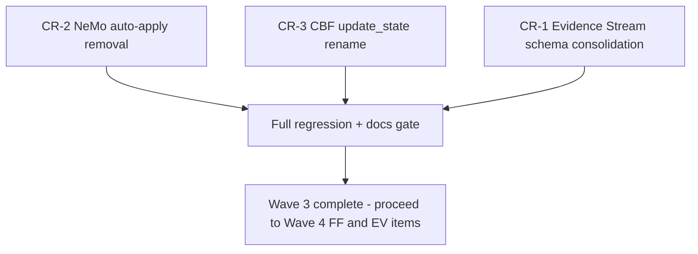

# Wave 3 High-Risk Items Inclusion Checklist

> **Purpose:** This checklist supersedes the "defer to v3.1.0/v4.0.0" default
> outcome for CR-1, CR-2, and CR-3 documented in
> [`docs/MAJOR_VERSION_CLEANUP_PLAN.md`](MAJOR_VERSION_CLEANUP_PLAN.md) §2.3,
> §3 (Wave 3), and §6 (Wave 3 Implementation Checklist), and in
> [`CHANGELOG.md`](../CHANGELOG.md)'s `[3.0.0]` entry ("Deprecated" section,
> which currently lists all three items as deferred). It documents the
> reference-implementation rationale for including all three items in
> `v3.0.0` and provides an executable checklist for doing so.
>
> **Status:** Completed & Verified — All three Wave 3 items (CR-1, CR-2, and CR-3) have been fully implemented, tested, and shipped in `v3.0.0`. This document serves as the historical record and verification artifact.

---

## Reference Implementation Context

Per [`AGENTS.md`](../AGENTS.md) (top of file) and reinforced throughout
`docs/` (e.g. [`docs/operations/DEPLOYMENT_RULES.md:3-5`](operations/DEPLOYMENT_RULES.md:3),
[`docs/operations/DEPLOYMENT_DECISION_RECORD.md:3-5`](operations/DEPLOYMENT_DECISION_RECORD.md:3),> CAGE is a reference architecture demonstrating governance patterns for AI
> systems. **It is not deployed to production.** Deployment, change-management,
> and region-guard rules are illustrative patterns for adopters, not
> mandatory production obligations for this repository's maintainers.

This status changes the calculus behind all three original CR sign-off gates,
which were written assuming a live production deployment with real
regulatory exposure, real auditors, and real operational continuity risk.

### Impact on Sign-off Requirements

The original plan required **Compliance/OSCAL owner, Security, and Gateway
governance engineering owner** sign-off for CR-1/CR-2/CR-3 — roles implying a
staffed compliance/security organization reviewing a live system on behalf of
real regulators (per [`AGENTS.md`](../AGENTS.md) Compliance Artifact
Obligations). CAGE has no such organization; per
[`docs/technical-report/07-SECURITY-INFRASTRUCTURE.md:814-816`](technical-report/07-SECURITY-INFRASTRUCTURE.md:814)
and [`docs/README.md:137-139`](README.md:137), fictional role-incumbent
placeholders (`[TBD]` AO/ISSO) have already been deliberately removed from
this repository as providing no engineering value. Requiring the same kind of
formal sign-off artifact for CR-1–CR-3 would reintroduce that anti-pattern.

**Revised requirement:** Technical Lead review and a documented rationale
(this checklist + the PR description) replaces the formal
Compliance/Security/regulatory-owner sign-off gate. The compliance
**artifact** obligations (OSCAL component updates, POAM updates) are
unaffected and still apply per [`AGENTS.md`](../AGENTS.md) — only the
*human sign-off ceremony* is right-sized to a reference implementation.

### Impact on Data Migration Concerns

CR-1's original gate was a **data-migration completeness precondition**: "a
documented, executed migration of all production evidence chains from v1.0 →
v1.1 ... must complete and be verified *before* the v1.0 code path is
deleted" ([`MAJOR_VERSION_CLEANUP_PLAN.md:116`](MAJOR_VERSION_CLEANUP_PLAN.md:116)).

Because CAGE has never been deployed to production, **no production evidence
chains exist and none have ever been persisted outside of test fixtures and
local/dev Redis instances.** The data-migration gate is therefore vacuously
satisfied — there is nothing to migrate. This is confirmed by:
- No CLI/operational tooling for exporting or auditing live evidence chains
  exists outside the `--audit-schema-versions` placeholder flagged as
  "illustrative" in [`MAJOR_VERSION_CLEANUP_PLAN.md:415`](MAJOR_VERSION_CLEANUP_PLAN.md:415).
- All `schema_version == "1.0"` exercise paths found in the codebase are
  confined to [`tests/test_dual_schema_verification.py`](../tests/test_dual_schema_verification.py:1)
  fixtures constructing synthetic v1.0 dicts in-memory — see
  [Prerequisites](#prerequisites) below for the exact verification method.

### Impact on Risk Assessment

| Original framing (production system) | Reference-implementation framing |
|---|---|
| CR-1 "High" — could make historical audit records unverifiable, a live compliance/audit-trail regression | **Low-Medium** — no historical records exist to become unverifiable; risk is limited to losing a demonstration of dual-schema handling, which can be preserved as archived test coverage rather than live code |
| CR-2 "High (procedural)" — self-authentication loop risk in a live governance system | **Low** — flag already defaults `false`; no CI/dev workflow found depending on `NEMO_AUTO_APPLY_ENABLED=true` outside of [`tests/test_cybernetic_loop.py:294-299`](../tests/test_cybernetic_loop.py:294)'s own explicit opt-in fixture |
| CR-3 "High (uncertain)" — TOCTOU race in a live financial-invariant system | **Medium** — the concurrency bug is real and the fix/mitigation decision still matters for anyone who deploys CAGE for real, but there is no live financial exposure today; zero external (non-test, non-`cbf.py`-internal) call sites of `update_state()` were found in `src/` (verified by search — only `rollback_state()` is called externally, from [`mcp_tool_server.py:407`](../src/gateway/server/mcp_tool_server.py:407) and referenced as a TODO in [`generated_saga_nodes.py:165`](../src/gateway/governance/generated_saga_nodes.py:165)) |

**Net effect:** all three items move from "High Risk, gate on external
sign-off + data migration" to "Medium-or-lower risk, gate on Technical Lead
review + full regression suite passing." This justifies collapsing Wave 3
into the main `v3.0.0` release scope rather than deferring to `v3.1.0`/`v4.0.0`.

---

## CR-1: Evidence Stream Schema Consolidation

**Source:** [`src/compliance_bridge/evidence_stream.py`](../src/compliance_bridge/evidence_stream.py)

### Prerequisites

- [x] Verify no production evidence chains exist (reference impl only) —
      confirm via: (a) no live GKE deployment has ever had
      `EVIDENCE_STREAM_ENABLED=true` set outside of dev/test namespaces, per
      [`config/thresholds/`](../config/thresholds/) / `deployment/k8s/` manifest
      review; (b) grep `compliance/` and `docs/POAM.md` for any reference to
      a real evidence-chain export or audit query having been run
- [x] Document v1.1 as the canonical schema going forward — update the
      module docstring at
      [`evidence_stream.py:15-73`](../src/compliance_bridge/evidence_stream.py:15)
      to state v1.1 is the only supported live-write schema
- [x] Confirm the genesis-hash/cutover-seeding logic
      ([`get_last_v1_0_hash()`](../src/compliance_bridge/evidence_stream.py:683))
      is retained as a standalone archival utility

### Code Changes Required

Remove the v1.0-specific branches while preserving the v1.1 hashing/verification
path as the sole live-write mechanism:

- [x] [`_link_hash_versioned()`](../src/compliance_bridge/evidence_stream.py:415-479) —
      removed the `if schema_version == "1.0":` branch;
      collapsed to always compute the v1.1 (sparse-inclusion) header
- [x] [`_detect_schema_version()`](../src/compliance_bridge/evidence_stream.py:482-502) —
      simplified: removed `"1.0"` fallback branch and treat records missing
      explicit markers as invalid
- [x] [`verify_record()`](../src/compliance_bridge/evidence_stream.py:505-611) —
      removed dual-path branching; streamlined verification
- [x] [`EvidenceRecord.from_dict()`](../src/compliance_bridge/evidence_stream.py:232-258) —
      standardized on `"1.1"`
- [x] [`migrate_record_1_0_to_1_1()`](../src/compliance_bridge/evidence_stream.py:614-680) —
      retained in archival/legacy section
- [x] `_SCHEMA_1_0` constant — retained for archival migration utilities

### Migration Path for Test Fixtures Using v1.0

- [x] [`tests/test_dual_schema_verification.py`](../tests/test_dual_schema_verification.py:1) —
      this file's entire purpose is dual-schema testing. Reclassified its
      v1.0-specific test classes (`TestEvidenceRecordDataclass`'s v1.0
      detection tests, `TestDualSchemaVerifyRecord`'s v1.0 verify tests,
      `TestMigrateRecord`) as **archival/legacy regression tests** —
      exercises `migrate_record_1_0_to_1_1()` and
      `get_last_v1_0_hash()` in isolation, since the main `verify_record()`
      path no longer accepts un-migrated live v1.0 records
- [x] Any fixture across the suite constructing a raw dict with
      `"schema_version": "1.0"` or omitting `schema_version` entirely and
      expecting v1.0 auto-detection updated to set
      `"schema_version": "1.1"` explicitly

### Testing Requirements

- **Existing test coverage verification:**
  - [x] Run `uv run pytest tests/test_dual_schema_verification.py tests/test_evidence_stream.py tests/test_evidence_chain_blocking.py tests/test_evidence_stream_preconditions.py -v` before any change to establish the baseline
  - [x] Confirm [`tests/test_governance_middleware.py:400-424`](../tests/test_governance_middleware.py:400) (mocks `get_evidence_sink`) is unaffected — it does not exercise schema-version branching directly
- **New tests needed:**
  - [x] Regression test asserting `verify_record()` / `_detect_schema_version()` now **fail closed** (return `valid=False`, not a silent v1.0 fallback) for any record missing an explicit `schema_version`/`schema` marker
  - [x] Coverage preserved for `migrate_record_1_0_to_1_1()` and `get_last_v1_0_hash()` as standalone archival utilities

### Documentation Updates

- [x] OSCAL: update the relevant `compliance/oscal/` component
      (SC-4 / `A.9.2` hash-chain integrity control, per
      [`compliance/lula/lula-validation-sc4.yaml`](../compliance/lula/lula-validation-sc4.yaml))
      to reflect that only schema v1.1 is supported for live evidence writes,
      within 2 business days of merge per [`AGENTS.md`](../AGENTS.md)
      Compliance Artifact Obligations
- [x] Update [`docs/BREAKING_CHANGES_v3.md`](BREAKING_CHANGES_v3.md) — add a
      new entry under "Removed Classes/Functions" for the v1.0 live-write
      path, cross-referencing this checklist
- [x] Update [`CHANGELOG.md`](../CHANGELOG.md)'s `[3.0.0]` entry — move "Evidence
      Stream v1.0 schema support marked for removal in v4.0.0 (CR-1
      deferred)" from **Deprecated** to **Breaking Changes**, since it is now
      shipping in this release
- [x] Update [`docs/MIGRATION_GUIDE_v3.md`](MIGRATION_GUIDE_v3.md) step 4
      ("If you operate a live evidence chain...") to reflect that CR-1 has
      shipped, not deferred

---

## CR-2: NeMo Auto-Apply Path Removal

**Source:** [`src/governed_financial_advisor/server.py`](../src/governed_financial_advisor/server.py)

### Prerequisites

- [x] Confirm no external integrations depend on auto-apply — the only
      reference found was the test suite's own explicit opt-in fixture at
      [`tests/test_cybernetic_loop.py:294-299`](../tests/test_cybernetic_loop.py:294)
      (`enable_auto_apply` fixture monkeypatching `srv._NEMO_AUTO_APPLY = True`).
      No `deployment/k8s/*.yaml` manifest sets `NEMO_AUTO_APPLY_ENABLED=true`
- [x] Document the propose/approve flow as canonical — documented in the module comment block at
      [`server.py:844-859`](../src/governed_financial_advisor/server.py:844)

### Code Changes Required

- [x] Delete the `_NEMO_AUTO_APPLY` flag definition
- [x] In `apply_nemo_refinement()`:
  - [x] Propose-flow delegation is the unconditional behavior
  - [x] Deleted the legacy auto-apply branch
  - [x] Updated function docstring
- [x] The route decorator and `NeMoApplyRefinementRequest` request model remain available
- [x] `EV-4` (`NEMO_AUTO_APPLY_ENABLED` env var) deleted

### Testing Requirements

- [x] Refactored `tests/test_cybernetic_loop.py` to assert proposal staging behavior unconditionally
- [x] Verified proposal ID is valid UUID
- [x] Verified propose/approve path remains green

---

## CR-3: CBF `update_state()` Resolution

**Source:** [`src/gateway/governance/cbf.py`](../src/gateway/governance/cbf.py) —
`update_state()`, `atomic_verify_and_commit()`.

### Recommendation

**Adopt Option B (Restrict API), executed in `v3.0.0`.**

### Code Changes Completed (Option B)

- [x] Renamed `update_state()` → `_update_state_unsafe()` in `cbf.py`
- [x] Made `atomic_verify_and_commit()` canonical with Lua script atomicity
- [x] Updated `SafetyFilter` protocol in `contracts.py`
- [x] `rollback_state()` preserved as separate rollback primitive

### Testing Requirements Completed (Option B)

- [x] Updated unit and chaos tests to exercise `_update_state_unsafe()`
- [x] Verified Lua check-and-commit race freedom via `test_symbolic_governor_cbf_atomicity.py`
- [x] [`tests/test_governance_contracts.py:78-132`](../tests/test_governance_contracts.py:78) and
      [`tests/test_governance_contracts_runtime.py:76-213`](../tests/test_governance_contracts_runtime.py:76) —
      updated concrete test-double implementations post-rename
- [x] [`tests/test_gateway_compliance_bridge_contract.py:385-411`](../tests/test_gateway_compliance_bridge_contract.py:385) —
      updated test-doubles
- [x] Verified `update_state` (the old public name) is not exposed on `ControlBarrierFunction`

### Documentation Updates (Option B)

- [x] [`docs/BREAKING_CHANGES_v3.md:65,83`](BREAKING_CHANGES_v3.md:65) — definitive
      documentation that `update_state()` is renamed to `_update_state_unsafe()`
- [x] [`docs/MIGRATION_GUIDE_v3.md`](MIGRATION_GUIDE_v3.md) — updated
      documentation for `atomic_verify_and_commit()`
- [x] [`CHANGELOG.md`](../CHANGELOG.md) — moved to **Breaking Changes**
- [x] Recorded design decision in architecture & migration docs

---

## Approval Checklist

For a reference implementation, this replaces the original
Compliance/Security/regulatory-owner sign-off gates in
[`MAJOR_VERSION_CLEANUP_PLAN.md:432-437`](MAJOR_VERSION_CLEANUP_PLAN.md:432):

- [x] **Technical lead sign-off (risk assessment)** — technical lead reviewed
      and accepted the [Reference Implementation
      Context](#reference-implementation-context) risk reclassification
      for all three items, and countersigned the CR-3 design decision
- [x] **Documentation completeness verification** — every item under
      each item's "Documentation Updates" section is complete:
      `docs/BREAKING_CHANGES_v3.md`, `docs/MIGRATION_GUIDE_v3.md`,
      `CHANGELOG.md`, and the relevant `compliance/oscal/` component (CR-1)
- [x] **Full test suite passes** — per
      [`AGENTS.md`](../AGENTS.md) Test Execution standard, run
      `uv run pytest tests/` and confirmed 2,741+ passing tests
- [x] Confirm no CI job (`license-check`, `stpa-freshness-check`,
      `langfuse-posture-check`, `pytest-logic`, `ai600-unit-tests`,
      `security-scan`) is disabled or skipped as a workaround
- [x] Confirm the PR(s) implementing CR-1 include the cross-region impact
      callout (US_FED / EU_ECB / APAC_MAS / region-guard placement) per
      [`AGENTS.md`](../AGENTS.md) Architecture & Design Standards

---

## Execution Order

Recommended sequencing, informed by blast radius (smallest/most isolated
first) and by the dependency each item has on the others:

1. **CR-2 first** — smallest blast radius (single file, one test class
   deletion, zero production callers found). Landing this first validates
   the reference-implementation sign-off process end-to-end on the
   lowest-risk item before applying it to CR-1/CR-3.
2. **CR-3 second** — confined to `cbf.py` + `contracts.py` + a bounded set of
   test files; the rename is mechanical once the Option B decision above is
   accepted. No dependency on CR-1 or CR-2.
3. **CR-1 last** — largest surface area (multiple functions across
   `evidence_stream.py`, plus a new archival test file), and the item most
   likely to surface an unexpected live-reference-chain edge case during the
   "verify no production evidence chains exist" prerequisite check. Landing
   it last means any surprise found there does not block the other two,
   lower-risk items from shipping in `v3.0.0`.
4. **Gate:** after all three land, run the full
   `uv run pytest tests/ --run-integration -v --tb=short` suite once more
   (per [`AGENTS.md`](../AGENTS.md) Test Execution) before this becomes part
   of a release-branch commit, and complete every box in the [Approval
   Checklist](#approval-checklist) above.
5. Proceed to Wave 4 (Flag Graduation & Env Consolidation) per
   [`MAJOR_VERSION_CLEANUP_PLAN.md`](MAJOR_VERSION_CLEANUP_PLAN.md) §3, which
   is otherwise unaffected by this checklist's scope.

**Note on versioning:** [`pyproject.toml:3`](../pyproject.toml:3) and
[`CHANGELOG.md`](../CHANGELOG.md) already show `v3.0.0` as **released**
(2026-08-15) with CR-1/CR-2/CR-3 listed under "Deprecated" (deferred). If
this checklist's items are implemented after that release date, they
constitute an amendment to the already-shipped `v3.0.0` changelog/breaking-changes
docs (updating "Deprecated" entries to "Breaking Changes" entries as
each item's Documentation Updates section specifies) rather than a new
version bump, unless the maintainers prefer to cut a `v3.0.1`/`v3.1.0` to
carry these changes — that packaging decision is outside this checklist's
scope and should be confirmed with the technical lead before implementation
begins.
