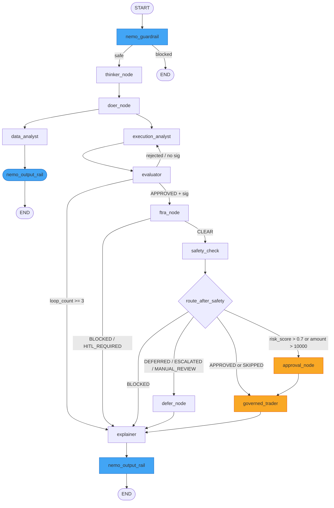

# Multi-Agent System Architecture & Design

| Field                | Value                                                                             |
| -------------------- | --------------------------------------------------------------------------------- |
| **Document Version** | 3.0.1                                                                             |
| **Date**             | 2026-09-09                                                                        |
| **Classification**   | INTERNAL                                                                          |
| **Document Series**  | CAGE Architecture Specification                                                   |
| **Status**           | ACTIVE — v3.0.1 stable (GKE deployment verified; baseline: 2,553 passing core unit tests; 4,148 tests collected / 3,921 passed, 0 failed) |
| **Canonical Path**   | `docs/architecture/AGENT_SYSTEM_ARCHITECTURE.md`                                  |
| **References**       | `src/governed_financial_advisor/graph/`, `src/governed_financial_advisor/agents/`, [`GATEWAY_ARCHITECTURE.md`](GATEWAY_ARCHITECTURE.md) |

**Last Updated:** 2026-09-22

---

## 1. Agent Orchestration Philosophy

The Governed Financial Advisor (`src/governed_financial_advisor/`) is the **Layer 4 reference application** demonstrating the full CAGE governance stack applied to an autonomous financial advisory workflow. The LangGraph harness (`src/gateway/governance/langgraph_harness/`) provides the node-factory pattern used to compose governance checks directly into the execution graph. NeMo Guardrails (`src/gateway/governance/nemo/`) enforces CBRN and PII rails as typed LangGraph nodes, while Open Policy Agent (OPA) evaluates Rego policy at Tier 4.

Multi-agent pipelines are composed using LangGraph's `StateGraph`, creating a deterministic, fully auditable execution sequence. Every agent carries a single, well-defined responsibility; no agent performs actions outside its declared scope. Inter-agent communication occurs strictly through a shared, strongly typed `AgentState` TypedDict defined in `src/governed_financial_advisor/graph/state.py` — agents read fields they require and write only the fields they own.

CAGE governance checks are not advisory: they gate every state transition before execution can reach sensitive nodes (such as `governed_trader`). The pipeline guarantees that reasoning, data acquisition, plan generation, evaluation, and safety validation must all complete successfully before an action is executed, with human approval enforced as the final gate. No path exists from user instruction to execution that bypasses CAGE policy enforcement.

Enforcement at the node boundary is applied by the `@cage_guard` decorator from the CAGE Client SDK (`src/gateway/client/adapters/langgraph.py`; standalone distribution in `packages/cage-client/`). Every tool executor is wrapped by `cage_guard(client=get_cage_client(), action=...)`, which submits the node's `proposed_action` to the Gateway PDP via `CageClient.validate_action()` before the node body runs. The client is a lazily initialized singleton (`src/governed_financial_advisor/graph/cage_client_singleton.py`) so that all governed nodes share uniform semantics. This is a pure client/server split — LangGraph nodes never call `SymbolicGovernor` in-process.

### 1.1 Primary Regulatory Framework: SR 26-2 (Federal Reserve)

The agent system is governed under **SR 26-2** (Federal Reserve Supervisory Guidance on Agentic AI Risk Management, issued April 17, 2026) as the primary agentic AI governance framework for `US_FED` deployments:
- **§IV.B Agentic Confidence Requirement**: Minimum confidence threshold of $0.95$ before autonomous execution (enforced at Tier 1 of the `SymbolicGovernor`).
- **§IV MRM Compliance**: Model risk management controls mapped to `CTRL_MRM_004` in the US_FED compliance baseline.
- **Agentic Scope**: SR 26-2 Footnote 3 explicitly excludes agentic AI from traditional SR 11-7 MRM scope; CAGE is governed under ISO 42001 + SR 26-2 jointly.

### 1.2 Agent Scope (`governed_financial_advisor_v1`)

| Attribute | Value |
| --------- | ----- |
| **Agent ID** | `governed_financial_advisor_v1` |
| **Version** | v1.2.0 |
| **Tier** | Tier-1 High Exposure |
| **Max Single Trade** | $10,000 USD |
| **Max Daily Cap** | $500,000 USD |
| **HITL Triggers** | Trade > $10,000 USD or `risk_score` > 0.7 |
| **Prohibited Actions** | BTC, `direct_account_withdrawal`, `parameter_override`, `guardrail_bypass` |
| **Allowed Asset Classes** | Equities, fixed income, ETF, bonds |

---

## 2. Agent Inventory (9 Autonomous Agents)

| Agent                   | File Location                                                      | Model                                        | Framework                                      | Primary Output                                   |
| ----------------------- | ------------------------------------------------------------------ | -------------------------------------------- | ---------------------------------------------- | ------------------------------------------------ |
| `thinker_node`          | `src/governed_financial_advisor/graph/nodes/supervisor_node.py`     | `DeepSeek-R1-Distill-Llama-8B`               | LangGraph node                                 | `reasoning_output`                               |
| `doer_node`             | `src/governed_financial_advisor/graph/nodes/supervisor_node.py`     | `MODEL_FAST`                                 | LangGraph node                                 | Decomposed instructions                          |
| `DataAnalystAgent`      | `src/governed_financial_advisor/agents/data_analyst/agent.py`      | yfinance (deterministic, no LLM)             | yfinance direct                                | `data_analyst_ticker`; price history; top 3 news |
| `ExecutionAnalystAgent` | `src/governed_financial_advisor/agents/execution_analyst/agent.py` | `MODEL_REASONING`; guided JSON               | `ChatOpenAI` on `GATEWAY_API_BASE`             | `ExecutionPlan` (`PlanStep` list)                |
| `EvaluatorAgent`        | `src/governed_financial_advisor/agents/evaluator/agent.py`         | `Qwen/Qwen2.5-1.5B-Instruct` via `VLLM_FAST`  | `create_tool_calling_agent`; 5 async MCP tools | `evaluation_result`, `opa_results`               |
| `ExplainerAgent`        | `src/governed_financial_advisor/agents/explainer/agent.py`         | `MODEL_FAST`                                 | LangGraph node                                 | Compliance narrative                             |
| `GovernedTrader`        | `src/governed_financial_advisor/agents/governed_trader/agent.py`   | `MODEL_FAST` (execution)                     | LangGraph subgraph; `@cage_guard` on tool executor | `execution_result`                               |
| `RiskAnalystAgent`      | `src/governed_financial_advisor/agents/risk_analyst/agent.py`      | STAMP hazards from GCS; fallback H-1/H-2/H-3 | LangGraph node                                 | `ProposedUCA` structs                            |
| `FinancialAdvisor`      | `src/governed_financial_advisor/agents/financial_advisor/prompt.py`| `MODEL_REASONING`                            | Prompt template only                           | Advisor framing prompt                           |

All agents reside in `src/governed_financial_advisor/agents/`. Import paths follow the canonical pattern `from src.governed_financial_advisor.agents.<agent_name>.agent import <AgentClass>`.

---

## 3. AgentState TypedDict & Regression Locking

All graph nodes share a single state object defined in `src/governed_financial_advisor/graph/state.py`. The `AgentState` TypedDict declares **40 fields** at HEAD, locked against schema regression via `tests/test_agent_state_schema.py` and mirrored into the generated JSON Schema at `compliance/schemas/agent_state_schema.json` (freshness gate: `make check-agent-state-schema`). The **25 baseline fields** below constitute the original regression-locked core; the remainder are advanced governance extensions:

| Field                   | Type / Notes                                       | Regression Locked | Owner(s)                      |
| ----------------------- | -------------------------------------------------- | ----------------- | ----------------------------- |
| `messages`              | `Annotated[list, add_messages]` — conversation log | Yes               | All nodes                     |
| `next_step`             | `Literal` enum — routing signal                    | Yes               | `doer_node`, router functions |
| `risk_status`           | `Literal["UNKNOWN", "APPROVED", "REJECTED_REVISE"]`| Yes               | `EvaluatorAgent`              |
| `risk_feedback`         | Risk loop feedback text from evaluator             | Yes               | `EvaluatorAgent`              |
| `loop_count`            | Recursion depth counter (safety breaker cap: 3)    | Yes               | `execution_analyst_node`      |
| `safety_status`         | NeMo Guardrails / OPA combined status              | Yes               | `EvaluatorAgent`              |
| `governance_signature`  | HMAC-SHA256 signature over `execution_plan_output` | Yes               | `EvaluatorAgent`              |
| `risk_attitude`         | User-declared risk tolerance                       | Yes               | Input                         |
| `investment_period`     | User-declared investment horizon                   | Yes               | Input                         |
| `reasoning_output`      | DeepSeek chain-of-thought text                     | Yes               | `thinker_node`                |
| `execution_plan_output` | Serialized `ExecutionPlan` (JSON)                  | Yes               | `ExecutionAnalystAgent`       |
| `data_analyst_ticker`   | Resolved ticker symbol + market data               | Yes               | `DataAnalystAgent`            |
| `evaluation_result`     | Structured evaluation verdict                      | Yes               | `EvaluatorAgent`              |
| `opa_results`           | OPA policy evaluation results                      | Yes               | `EvaluatorAgent`              |
| `execution_result`      | Trade execution outcome                            | Yes               | `GovernedTrader`              |
| `governance_summary`    | Final auditor report for the UI                    | Yes               | `ExplainerAgent`              |
| `user_id`               | Authenticated user identifier                      | Yes               | Input                         |
| `latency_stats`         | Per-node timing dictionary                         | Yes               | All nodes (append)            |
| `completed_transactions`| `Annotated[list[LedgerEntry], add]` — Saga WAL     | Yes               | `GovernedTrader`              |
| `approval_required`     | Boolean — whether HITL gate was triggered          | Yes               | `approval_node`               |
| `approval_decision`     | `dict \| None` — structured human decision          | Yes               | `approval_node` (via resume)  |
| `hitl_expires_at`       | `str \| None` — TTL expiration timestamp           | Yes               | `approval_node`               |
| `guardrail_blocked`     | Boolean — NeMo input rail gate                     | Yes               | `nemo_guardrail`              |
| `guardrail_reason`      | Reason for NeMo input rail block                   | Yes               | `nemo_guardrail`              |
| `output_rail_applied`   | Boolean — NeMo output rail tracking                | Yes               | `nemo_output_rail`            |
| `ftra_status`           | `str \| None` — `"CLEAR"` / `"HITL_REQUIRED"` / `"BLOCKED"` | Extended | `ftra_node`                   |
| `ftra_result`           | `dict \| None` — Serialized FTRA reachability result | Extended        | `ftra_node`                   |
| `ftra_defer_id`         | `str \| None` — Correlation UUID for DEFER requests| Extended          | `defer_node`                  |
| `narrow_status`         | `str \| None` — `"NARROWED"` / `"NOT_NARROWED"`     | Extended          | `SymbolicGovernor`            |
| `narrowed_params`       | `dict \| None` — Clamped parameters from NARROW     | Extended          | `SymbolicGovernor`            |
| `pause_resume_token`    | `str \| None` — Token for PAUSE resumption         | Extended          | `SymbolicGovernor`            |
| `pause_reason`          | `str \| None` — Reason code for transient PAUSE    | Extended          | `SymbolicGovernor`            |
| `consecutive_denials`   | `int` — Sequential DENY counter (reset on ALLOW)   | Extended          | `SymbolicGovernor`            |
| `last_violation`        | `dict \| None` — Most recent structured violation   | Extended          | `SymbolicGovernor`            |
| `deferral_ticket_id`    | `str \| None` — Ticket ID from `DeferralPending`   | Extended          | `@cage_guard` / `DeferQueue`  |
| `deferral_reason`       | `str \| None` — Justification for the deferral     | Extended          | `@cage_guard` / `DeferQueue`  |
| `agent_id`              | `str` — Identifier submitted to the Gateway PDP    | Extended          | Input / `@cage_guard`         |
| `proposed_action`       | `dict \| None` — Parameters staged for validation   | Extended          | Upstream tool-planning nodes  |
| `governance_envelope`   | `dict \| None` — Signed ALLOW decision from the PDP | Extended          | `@cage_guard`                 |
| `governance_status`     | `str \| None` — `"ALLOWED"` / `"DENIED"` / `"DEFERRED"` | Extended      | `@cage_guard`                 |

### ExecutionPlan Pydantic Schema (TOCTOU Defense)

To mitigate Time-Of-Check to Time-Of-Use vulnerabilities, the `ExecutionPlan` model in `src/governed_financial_advisor/agents/execution_analyst/agent.py` embeds dynamic execution bounds:
- **`max_slippage_pct` (float)**: The maximum allowable percentage price drift between check time and execution time quotes (default: `2.0`).
- **`limit_price` (Optional[float])**: The maximum or minimum boundary price at which the trade is permitted to execute.

While `ExecutionAnalystAgent` defines the structural steps of the trade, `EvaluatorAgent` calibrates these fields based on asset volatility and market conditions before graph suspension.

---

## 4. Graph Topology & Routing

The `StateGraph` topology is assembled by `_build_workflow()` in `src/governed_financial_advisor/graph/graph.py`, which is shared by `create_graph(redis_url)` (Redis-checkpointed) and `create_uncheckpointed_graph()` (LangGraph SDK delegated state). **Thirteen named nodes** are registered with fail-closed routing:



### Routing Functions

`route_after_guardrail`, `route_supervisor`, `check_safety_signature` and `route_after_safety` are inline closures inside `_build_workflow()` in `src/governed_financial_advisor/graph/graph.py`; `route_after_ftra` is imported from `src.gateway.governance.ftra.node_factory`:
- **`route_after_guardrail(state)`**: Reads `state["guardrail_blocked"]`. If True, routes immediately to `END` — no agent processes blocked input. Otherwise proceeds to `thinker_node`.
- **`route_supervisor(state)`**: Reads `state["next_step"]` to determine early exits. If intent cannot be decomposed into a valid investment instruction, routes through `nemo_output_rail` to `END`.
- **`check_safety_signature(state)`**: Requires an `APPROVED` verdict in `state["evaluation_result"]` plus a non-empty `state["governance_signature"]` before routing to `ftra_node` (CTRL_FTRA_001, Tier 0.5). A missing verdict or signature routes back to `execution_analyst` for re-planning (capped at `loop_count >= 3` $\to$ `explainer`).
- **`route_after_ftra(state)`**: Emitted by the FTRA node factory. `CLEAR` $\to$ `safety_check`; `BLOCKED` and `HITL_REQUIRED` fall back to `explainer`.
- **`route_after_safety(state)`**: Reads `state["safety_status"]`:
  - `APPROVED` or `SKIPPED` $\to$ `approval_node` when `evaluation_result.risk_score` $> 0.7$ **or** any `execution_plan_output` step `amount` $> \$10{,}000$; otherwise directly to `governed_trader`
  - `DEFERRED`, `ESCALATED` or `MANUAL_REVIEW` $\to$ `defer_node` (park in the DeferQueue)
  - `BLOCKED` or rejected $\to$ `explainer` (compliance narrative; no trade executed)

---

## 5. Subgraph Designs

### 5.1 Data Analyst Subgraph
Defined in `src/governed_financial_advisor/graph/subgraphs/data_analyst_graph.py` over `DataAnalystState`, with nodes `thinker` $\to$ `doer` $\to$ `execute_tool` $\to$ `reporter`:
1. **Ticker Extraction**: Extracts ticker symbol from conversation history.
2. **yfinance Fetch**: Retrieves 1-month OHLCV price history deterministically.
3. **Latest Close**: Extracts latest market close price for downstream planning.
4. **Top 3 News**: Fetches the 3 most recent news headlines for ticker context.

The `execute_tool` node is the subgraph's `tool_executor_node` wrapped by `cage_guard(client=get_cage_client(), action="fetch_market_data")`. The upstream `doer` node stages the call parameters into `state["proposed_action"]`; the guard submits them to the Gateway PDP before the fetch runs.

### 5.2 Governed Trader Subgraph
Defined in `src/governed_financial_advisor/graph/subgraphs/governed_trader_graph.py` over `GovernedTraderState`. Entry is conditional via `route_approval`: high-risk/high-value threads enter the `approval` node (the dynamic `interrupt()` gate of §7), all others go straight to `executor`.
1. **HITL Gate (`approval`)**: `approval_node` suspends the subgraph via `interrupt()`; on resume it issues `Command(goto="post_hitl_rehydrate")` when approved or `Command(goto="rejection")` when refused.
2. **State Rehydration (`post_hitl_rehydrate`)**: Restores the parked execution context after resume.
3. **Continuous State Revalidation (`post_hitl_revalidate`)**: Fetches fresh market data immediately upon resume, calculates active price drift, asserts drift $\le$ `max_slippage_pct`, and re-runs governance with fresh prices. On breach, `route_post_revalidation` routes to the fail-closed terminal `drift_blocked`.
4. **Trade Dispatch (`executor` $\to$ `tools`)**: The `tools` node is `tool_executor_node` wrapped by `cage_guard(client=get_cage_client(), action="execute_trade")`, so no trade tool can fire without a signed ALLOW envelope from the Gateway PDP. Trade primitives live in `src/governed_financial_advisor/tools/trades.py`.
5. **Result Recording**: Writes `execution_result` to state for `ExplainerAgent`.

---

## 6. DEFER Queue & Context Accumulator

### 6.1 DEFER State Machine (AARM-V7)
Extends the decision envelope to **four states** (`ALLOW`, `DENY`, `MANUAL_REVIEW`, `DEFER`) via a three-zone confidence model:

| Confidence Score | Decision | Routing & Behavior |
| ---------------- | -------- | ------------------ |
| $\ge 0.95$       | `ALLOW` / `DENY` | Autonomous clearance |
| $0.70 - 0.95$    | **`DEFER`** | Context parked in Redis `db=1` (`noeviction`) with 4-hour TTL; resolved via `/v1/defer/{id}/inject` or `/v1/defer/{id}/escalate` |
| $< 0.70$         | `DENY` | Confidence-Starvation Boundary; request blocked |

### 6.2 Context Accumulator (AARM-V1)
The SHA-256 hash-chained Context Accumulator (`src/compliance_bridge/context_accumulator.py`) seals audit evidence against Memory Poisoning:

$$\text{record\_hash}_n = \text{SHA256}(\text{prev\_hash}_{n-1} \| \text{content\_json}_n)$$

Each execution is sealed with a `CHAIN_SEALED` sentinel, satisfying ISO 42001 Annex A.5.3.

### 6.3 External Normative Provider (Tier 6b)
The External Normative Provider (`src/gateway/governance/normative_provider.py`) implements adaptive FRIA gating based on confidence score:
- $\ge 0.95$: Async gate, non-blocking external validation.
- $[0.70, 0.95)$: Synchronous blocking gate; awaits external FRIA response.
- $< 0.70$: Hard denial.

### 6.4 Heterogeneous Consensus (AARM-V9)
For trades $\ge \$10,000\text{ USD}$, `ConsensusModelRegistry` queries two heterogeneous models concurrently via `asyncio.gather()`:
- **Risk Manager**: `DeepSeek-R1-Distill-Llama-8B`
- **Compliance Officer**: `Meta-Llama-3.1-8B-Instruct`
Split votes or errors trigger HITL escalation, eliminating single-model blind spots.

---

## 7. HITL Approval Workflow & Checkpointing

### 7.1 Dynamic `interrupt()` Gate

HITL is implemented with the **LangGraph dynamic `interrupt()` primitive**, not with static graph configuration. Neither `create_graph()` nor `create_uncheckpointed_graph()` passes `interrupt_before` to `.compile()`; instead `approval_node` (`src/governed_financial_advisor/graph/nodes/approval_node.py`) calls `interrupt()` from `langgraph.types` at runtime. Whether the gate is reached at all is a routing decision (`route_after_safety` in the parent graph, `route_approval` in the governed-trader subgraph), so the approval condition is evaluated against live state rather than frozen at compile time.

When `approval_node` executes it:

1. **Builds the reviewer payload** — reason code, serialized `execution_plan_output`, `evaluation_result`, issue timestamp, and an `expires_at` derived from `HITL_APPROVAL_TTL_SECONDS` (default `300`).
2. **Raises `GraphInterrupt` via `interrupt(payload)`** — the surrounding checkpointer persists the full state snapshot and the payload surfaces to the caller as a task interrupt.
3. **Resumes in place** — on `Command(resume=decision)` the same `interrupt()` call *returns* the decision dict directly into the node body; there is no separate resume handler.

**interrupt() Gate (`approval_node.py`):**

```python
from langgraph.types import Command, interrupt


def approval_node(state: dict[str, Any]) -> Command:
    ttl_seconds: int = int(os.getenv("HITL_APPROVAL_TTL_SECONDS", "300"))
    trade_payload: dict[str, Any] = {
        "reason": "trade_approval_required",
        "trade": {
            "execution_plan": state.get("execution_plan_output"),
            "evaluation_result": state.get("evaluation_result"),
        },
        "timestamp": datetime.now(timezone.utc).isoformat(),
        "expires_at": (
            datetime.now(timezone.utc) + timedelta(seconds=ttl_seconds)
        ).isoformat(),
    }

    # Pause the graph here. On first invocation this raises GraphInterrupt.
    # On resume it returns the value supplied via Command(resume={...}).
    decision: dict[str, Any] = interrupt(trade_payload)

    approval_decision: dict[str, Any] = {
        "approved": bool(decision.get("approved", False)),
        "reviewer": decision.get("reviewer", "unknown"),
        "rationale": decision.get("rationale", ""),
        "comment": decision.get("comment", ""),
        "timestamp": decision.get("timestamp", ...),
        "max_slippage_pct": float(decision.get("max_slippage_pct", 2.0)),
    }

    return Command(
        update={
            "approval_decision": approval_decision,
            "hitl_expires_at": trade_payload["expires_at"],
        },
        goto="post_hitl_rehydrate" if approval_decision["approved"] else "rejection",
    )
```

**Resumption** is performed natively by the LangGraph SDK — the caller streams `Command(resume=decision)` against the interrupted `thread_id`. The previous bespoke `POST /v1/approvals/{thread_id}/resume` endpoint was removed in commit `7ab1acd`; CAGE no longer owns a resume transport of its own.

The reviewer may supply `max_slippage_pct` in the resume payload to tighten slippage tolerance (default `2.0`), which flows into `approval_decision` and is re-checked by `post_hitl_revalidate`.

**Key Properties:**

- **Deterministic Suspend/Resume:** `interrupt()` pauses at the exact node boundary and resumes by returning into the same call site.
- **Stateful Checkpointing:** Full `AgentState` is persisted by the configured checkpointer at the interrupt point.
- **Runtime Conditionality:** The approval condition (`risk_score > 0.7` or `amount > $10,000`) is evaluated against live state, not baked into the compiled graph.
- **Fail-Closed Rejection:** A non-approved decision routes to `rejection_node`, which terminates the subgraph with an auditable rejection message carrying the reviewer identity and rationale.

### 7.2 HITL API Endpoints
- `GET /v1/approvals/pending` (`src/governed_financial_advisor/server.py`): Enumerates checkpointer threads whose state snapshot has a pending `next` step and non-empty task interrupts, returning `{"pending": [{"thread_id", "interrupt_payload", "interrupted_at"}]}`.
- Resumption is **not** an application endpoint. It is issued through the LangGraph SDK as `Command(resume=decision)`.

> [!NOTE]
> The `ApprovalResumeRequest` Pydantic model still exists in `server.py` and documents the expected resume payload shape (`ticket_id`, `approved`, `reviewer`, mandatory `rationale`, `comment`, `max_slippage_pct`), but no FastAPI route is bound to it at HEAD.

### 7.3 Decision Values & Audit Guarantees
- `approved=True`: `Command(goto="post_hitl_rehydrate")` — enters the TOCTOU rehydrate/revalidate chain before the guarded `tools` executor.
- `approved=False`: `Command(goto="rejection")` — `rejection_node` appends a reviewer-attributed rejection message and ends the subgraph.
- **Mandatory rationale**: The reviewer rationale is recorded into `approval_decision` for ISO 42001 §A.7.2 accountability attribution; an empty rationale is logged as a compliance gap.
- **TTL metadata**: `hitl_expires_at` is stamped from `HITL_APPROVAL_TTL_SECONDS` (default 300s) and surfaced to the reviewer in the interrupt payload. It is advisory metadata at HEAD — no server-side expiry rejection is implemented since the resume endpoint was removed.

### 7.4 Checkpointing Modes
- **Primary**: `AsyncRedisSaver` storing full state snapshots at every node transition.
- **Fallback**: `MemorySaver` for dev/degraded operation (emits OTel alert span).

---

## 8. EvaluatorAgent & EvaluatorAuditor

`EvaluatorAgent` binds 5 async MCP tools:
1. `simulate_governance_check`: NeMo Guardrails constraints.
2. `evaluate_policy`: OPA Rego `trade.governance` policy.
3. `check_market_status`: Verifies market open and ticker tradability.
4. `get_market_sentiment`: Ticker sentiment signal.
5. `verify_content_safety`: PII and content moderation scan.

After tool evaluation, `EvaluatorAgent` generates the HMAC-SHA256 `governance_signature`. Post-hoc trace auditing is performed by `EvaluatorAuditor.audit_trace()` in `src/governed_financial_advisor/agents/evaluator/auditor.py`.

---

## 9. RiskAnalystAgent & STPA Integration

`RiskAnalystAgent` (`src/governed_financial_advisor/agents/risk_analyst/agent.py`) loads STAMP hazard definitions from GCS (or built-in fallbacks H-1, H-2, H-3) and emits `ProposedUCA` structs. The `PolicyTranspiler` (`src/governed_financial_advisor/governance/transpiler.py`) automatically converts `ProposedUCA` outputs into NeMo action stubs and OPA Rego rules after verification via `JudgeAgent.verify()`.

---

## 10. Red Team Adversarial Harness

Resilience against adversarial inputs is validated through:
- `tests/red_team/adversarial_dataset.json`: 290+ adversarial payloads.
- `tests/red_team/test_adversarial.py`: Automated adversarial test suite covering Prompt Injection, Policy Bypass, PII Extraction, and Semantic Override.
- Hard assertion: All adversarial payloads must result in `safety_status` of `BLOCKED` or `ESCALATED` with zero executed trades.

---

## 11. Agent Governance Integration (STERA Pipeline)

All agent actions traverse the **STERA Runtime Pipeline** enforced by `SymbolicGovernor._run_checks()`:
1. **NoDirectBind Invariant**: Direct execution bypassing `POST /governance/validate-action` and `verify_seal()` is structurally impossible.
2. **Two-Phase Decoupling**: Phase 1 read-only gates (FTRA, STPA, Confidence, Bounding, Consensus, Causal, OPA) must ALL emit `ALLOW` before Phase 2 atomic mutations (CBF Lua debit, FiscalLimitGuard reserve) execute.
3. **Cryptographic Seal Issuance**: Successful traversal emits an asymmetric JWT seal signed by Cloud KMS HSM (HMAC fallback in dev/test) with a 30s TTL.
4. **Execution Actuator**: Downstream actuators verify the seal and evidence hash binding prior to firing.
