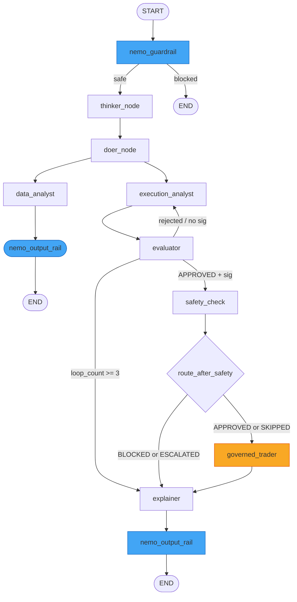

# Multi-Agent System Architecture & Design

| Field                | Value                                                                             |
| -------------------- | --------------------------------------------------------------------------------- |
| **Document Version** | 3.0.1                                                                             |
| **Date**             | 2026-09-09                                                                        |
| **Classification**   | INTERNAL                                                                          |
| **Document Series**  | CAGE Architecture Specification                                                   |
| **Status**           | ACTIVE — v3.0.1 stable (GKE deployment verified; baseline: 2,553 passing core unit tests; 4,148 tests collected / 3,921 passed, 0 failed) |
| **Canonical Path**   | `docs/architecture/AGENT_SYSTEM_ARCHITECTURE.md`                                  |
| **References**       | `src/governed_financial_advisor/graph/`, `src/governed_financial_advisor/agents/`, [`GATEWAY_ARCHITECTURE.md`](GATEWAY_ARCHITECTURE.md) |

---

## 1. Agent Orchestration Philosophy

The Governed Financial Advisor (`src/governed_financial_advisor/`) is the **Layer 4 reference application** demonstrating the full CAGE governance stack applied to an autonomous financial advisory workflow. The LangGraph harness (`src/gateway/governance/langgraph_harness/`) provides the node-factory pattern used to compose governance checks directly into the execution graph. NeMo Guardrails (`src/gateway/governance/nemo/`) enforces CBRN and PII rails as typed LangGraph nodes, while Open Policy Agent (OPA) evaluates Rego policy at Tier 4.

Multi-agent pipelines are composed using LangGraph's `StateGraph`, creating a deterministic, fully auditable execution sequence. Every agent carries a single, well-defined responsibility; no agent performs actions outside its declared scope. Inter-agent communication occurs strictly through a shared, strongly typed `AgentState` TypedDict defined in `src/governed_financial_advisor/graph/state.py` — agents read fields they require and write only the fields they own.

CAGE governance checks are not advisory: they gate every state transition before execution can reach sensitive nodes (such as `governed_trader`). The pipeline guarantees that reasoning, data acquisition, plan generation, evaluation, and safety validation must all complete successfully before an action is executed, with human approval enforced as the final gate. No path exists from user instruction to execution that bypasses CAGE policy enforcement.

### 1.1 Primary Regulatory Framework: SR 26-2 (Federal Reserve)

The agent system is governed under **SR 26-2** (Federal Reserve Supervisory Guidance on Agentic AI Risk Management, issued April 17, 2026) as the primary agentic AI governance framework for `US_FED` deployments:
- **§IV.B Agentic Confidence Requirement**: Minimum confidence threshold of $0.95$ before autonomous execution (enforced at Tier 1 of the `SymbolicGovernor`).
- **§IV MRM Compliance**: Model risk management controls mapped to `CTRL_MRM_004` in the US_FED compliance baseline.
- **Agentic Scope**: SR 26-2 Footnote 3 explicitly excludes agentic AI from traditional SR 11-7 MRM scope; CAGE is governed under ISO 42001 + SR 26-2 jointly.

### 1.2 Agent Scope (`governed_financial_advisor_v1`)

| Attribute | Value |
| --------- | ----- |
| **Agent ID** | `governed_financial_advisor_v1` |
| **Version** | v1.2.0 |
| **Tier** | Tier-1 High Exposure |
| **Max Single Trade** | $10,000 USD |
| **Max Daily Cap** | $500,000 USD |
| **HITL Triggers** | Trade > $10,000 USD or `risk_score` > 0.7 |
| **Prohibited Actions** | BTC, `direct_account_withdrawal`, `parameter_override`, `guardrail_bypass` |
| **Allowed Asset Classes** | Equities, fixed income, ETF, bonds |

---

## 2. Agent Inventory (9 Autonomous Agents)

| Agent                   | File Location                                                      | Model                                        | Framework                                      | Primary Output                                   |
| ----------------------- | ------------------------------------------------------------------ | -------------------------------------------- | ---------------------------------------------- | ------------------------------------------------ |
| `thinker_node`          | `src/governed_financial_advisor/graph/nodes/supervisor_node.py`     | `DeepSeek-R1-Distill-Llama-8B`               | LangGraph node                                 | `reasoning_output`                               |
| `doer_node`             | `src/governed_financial_advisor/graph/nodes/supervisor_node.py`     | `MODEL_FAST`                                 | LangGraph node                                 | Decomposed instructions                          |
| `DataAnalystAgent`      | `src/governed_financial_advisor/agents/data_analyst/agent.py`      | yfinance (deterministic, no LLM)             | yfinance direct                                | `data_analyst_ticker`; price history; top 3 news |
| `ExecutionAnalystAgent` | `src/governed_financial_advisor/agents/execution_analyst/agent.py` | `MODEL_REASONING`; guided JSON               | `ChatOpenAI` on `GATEWAY_API_BASE`             | `ExecutionPlan` (`PlanStep` list)                |
| `EvaluatorAgent`        | `src/governed_financial_advisor/agents/evaluator/agent.py`         | `Qwen/Qwen2.5-1.5B-Instruct` via `VLLM_FAST`  | `create_tool_calling_agent`; 5 async MCP tools | `evaluation_result`, `opa_results`               |
| `ExplainerAgent`        | `src/governed_financial_advisor/agents/explainer/agent.py`         | `MODEL_FAST`                                 | LangGraph node                                 | Compliance narrative                             |
| `GovernedTrader`        | `src/governed_financial_advisor/agents/governed_trader/agent.py`   | `MODEL_FAST` (execution)                     | LangGraph node; HITL interrupt point           | `execution_result`                               |
| `RiskAnalystAgent`      | `src/governed_financial_advisor/agents/risk_analyst/agent.py`      | STAMP hazards from GCS; fallback H-1/H-2/H-3 | LangGraph node                                 | `ProposedUCA` structs                            |
| `FinancialAdvisor`      | `src/governed_financial_advisor/agents/financial_advisor/prompt.py`| `MODEL_REASONING`                            | Prompt template only                           | Advisor framing prompt                           |

All agents reside in `src/governed_financial_advisor/agents/`. Import paths follow the canonical pattern `from src.governed_financial_advisor.agents.<agent_name>.agent import <AgentClass>`.

---

## 3. AgentState TypedDict & Regression Locking

All graph nodes share a single state object defined in `src/governed_financial_advisor/graph/state.py`. The TypedDict contains **25 baseline fields** locked against schema regression via `tests/test_agent_state_schema.py`, expandable to **33 fields** with advanced governance extensions:

| Field                   | Type / Notes                                       | Regression Locked | Owner(s)                      |
| ----------------------- | -------------------------------------------------- | ----------------- | ----------------------------- |
| `messages`              | `Annotated[list, add_messages]` — conversation log | Yes               | All nodes                     |
| `next_step`             | `Literal` enum — routing signal                    | Yes               | `doer_node`, router functions |
| `risk_status`           | `Literal["UNKNOWN", "APPROVED", "REJECTED_REVISE"]`| Yes               | `EvaluatorAgent`              |
| `risk_feedback`         | Risk loop feedback text from evaluator             | Yes               | `EvaluatorAgent`              |
| `loop_count`            | Recursion depth counter (safety breaker cap: 3)    | Yes               | `execution_analyst_node`      |
| `safety_status`         | NeMo Guardrails / OPA combined status              | Yes               | `EvaluatorAgent`              |
| `governance_signature`  | HMAC-SHA256 signature over `execution_plan_output` | Yes               | `EvaluatorAgent`              |
| `risk_attitude`         | User-declared risk tolerance                       | Yes               | Input                         |
| `investment_period`     | User-declared investment horizon                   | Yes               | Input                         |
| `reasoning_output`      | DeepSeek chain-of-thought text                     | Yes               | `thinker_node`                |
| `execution_plan_output` | Serialized `ExecutionPlan` (JSON)                  | Yes               | `ExecutionAnalystAgent`       |
| `data_analyst_ticker`   | Resolved ticker symbol + market data               | Yes               | `DataAnalystAgent`            |
| `evaluation_result`     | Structured evaluation verdict                      | Yes               | `EvaluatorAgent`              |
| `opa_results`           | OPA policy evaluation results                      | Yes               | `EvaluatorAgent`              |
| `execution_result`      | Trade execution outcome                            | Yes               | `GovernedTrader`              |
| `governance_summary`    | Final auditor report for the UI                    | Yes               | `ExplainerAgent`              |
| `user_id`               | Authenticated user identifier                      | Yes               | Input                         |
| `latency_stats`         | Per-node timing dictionary                         | Yes               | All nodes (append)            |
| `completed_transactions`| `Annotated[list[LedgerEntry], add]` — Saga WAL     | Yes               | `GovernedTrader`              |
| `approval_required`     | Boolean — whether HITL gate was triggered          | Yes               | `approval_node`               |
| `approval_decision`     | `Optional[dict]` — structured human decision       | Yes               | HITL resume endpoint          |
| `hitl_expires_at`       | `str \| None` — TTL expiration timestamp           | Yes               | `approval_node`               |
| `guardrail_blocked`     | Boolean — NeMo input rail gate                     | Yes               | `nemo_guardrail`              |
| `guardrail_reason`      | Reason for NeMo input rail block                   | Yes               | `nemo_guardrail`              |
| `output_rail_applied`   | Boolean — NeMo output rail tracking                | Yes               | `nemo_output_rail`            |
| `ftra_status`           | `Literal["CLEAR", "HITL_REQUIRED", "BLOCKED"]`     | Extended          | `ftra_node`                   |
| `ftra_result`           | `dict \| None` — Serialized `FtraBoundaryResult`   | Extended          | `ftra_node`                   |
| `ftra_defer_id`         | `str \| None` — Correlation UUID for DEFER requests| Extended          | `defer_node`                  |
| `narrow_status`         | `Literal["NONE", "APPLIED", "REJECTED"]`           | Extended          | `SymbolicGovernor`            |
| `narrowed_params`       | `dict \| None` — Clamped parameters from NARROW     | Extended          | `SymbolicGovernor`            |
| `pause_resume_token`    | `str \| None` — Token for PAUSE resumption         | Extended          | `SymbolicGovernor`            |
| `pause_reason`          | `str \| None` — Reason code for transient PAUSE    | Extended          | `SymbolicGovernor`            |
| `confidence`            | `float` — Calibrated model confidence (0.0–1.0)    | Extended          | `evaluator`                   |

### ExecutionPlan Pydantic Schema (TOCTOU Defense)

To mitigate Time-Of-Check to Time-Of-Use vulnerabilities, the `ExecutionPlan` model in `src/governed_financial_advisor/agents/execution_analyst/agent.py` embeds dynamic execution bounds:
- **`max_slippage_pct` (float)**: The maximum allowable percentage price drift between check time and execution time quotes (default: `2.0`).
- **`limit_price` (Optional[float])**: The maximum or minimum boundary price at which the trade is permitted to execute.

While `ExecutionAnalystAgent` defines the structural steps of the trade, `EvaluatorAgent` calibrates these fields based on asset volatility and market conditions before graph suspension.

---

## 4. Graph Topology & Routing

The `StateGraph` is assembled in `src/governed_financial_advisor/graph/graph.py` via `create_graph(redis_url)`. **Twelve named nodes** are registered with fail-closed routing:

### Routing Functions

All routing functions are inline closures inside `create_graph()` in `src/governed_financial_advisor/graph/graph.py`:
- **`route_after_guardrail(state)`**: Reads `state["guardrail_blocked"]`. If True, routes immediately to `END` — no agent processes blocked input. Otherwise proceeds to `thinker_node`.
- **`route_supervisor(state)`**: Reads `state["next_step"]` to determine early exits. If intent cannot be decomposed into a valid investment instruction, routes through `nemo_output_rail` to `END`.
- **`check_safety_signature(state)`**: Validates HMAC-SHA256 signature in `state["governance_signature"]`. A signature mismatch routes back to `execution_analyst` for re-planning (capped at `loop_count >= 3` $\to$ `explainer`).
- **`route_after_safety(state)`**: Reads `state["safety_status"]`:
  - `APPROVED` or `SKIPPED` $\to$ `governed_trader` (subject to HITL interrupt)
  - `BLOCKED` or `ESCALATED` $\to$ `explainer` (compliance narrative; no trade executed)

---

## 5. Subgraph Designs

### 5.1 Data Analyst Subgraph
Defined in `src/governed_financial_advisor/graph/subgraphs/data_analyst_graph.py`:
1. **Ticker Extraction**: Extracts ticker symbol from conversation history.
2. **yfinance Fetch**: Retrieves 1-month OHLCV price history deterministically.
3. **Latest Close**: Extracts latest market close price for downstream planning.
4. **Top 3 News**: Fetches the 3 most recent news headlines for ticker context.

### 5.2 Governed Trader Subgraph
Defined in `src/governed_financial_advisor/graph/subgraphs/governed_trader_graph.py`, executing strictly after HITL approval:
1. **Continuous State Revalidation (`post_hitl_revalidate_node`)**: Fetches fresh market data immediately upon resume, calculates active price drift, asserts drift $\le$ `max_slippage_pct`, and re-runs Tier 2 (CBF) and Tier 4 (OPA) with fresh prices.
2. **Signature Re-validation**: Re-checks `governance_signature` before execution.
3. **Trade Dispatch**: Invokes `src/governed_financial_advisor/tools/trades.py`.
4. **Result Recording**: Writes `execution_result` to state for `ExplainerAgent`.

---

## 6. DEFER Queue & Context Accumulator

### 6.1 DEFER State Machine (AARM-V7)
Extends the decision envelope to **four states** (`ALLOW`, `DENY`, `MANUAL_REVIEW`, `DEFER`) via a three-zone confidence model:

| Confidence Score | Decision | Routing & Behavior |
| ---------------- | -------- | ------------------ |
| $\ge 0.95$       | `ALLOW` / `DENY` | Autonomous clearance |
| $0.70 - 0.95$    | **`DEFER`** | Context parked in Redis `db=1` (`noeviction`) with 4-hour TTL; resolved via `/v1/defer/{id}/inject` or `/v1/defer/{id}/escalate` |
| $< 0.70$         | `DENY` | Confidence-Starvation Boundary; request blocked |

### 6.2 Context Accumulator (AARM-V1)
The SHA-256 hash-chained Context Accumulator (`src/compliance_bridge/context_accumulator.py`) seals audit evidence against Memory Poisoning:

$$\text{record\_hash}_n = \text{SHA256}(\text{prev\_hash}_{n-1} \| \text{content\_json}_n)$$

Each execution is sealed with a `CHAIN_SEALED` sentinel, satisfying ISO 42001 Annex A.5.3.

### 6.3 External Normative Provider (Tier 6b)
The External Normative Provider (`src/gateway/governance/normative_provider.py`) implements adaptive FRIA gating based on confidence score:
- $\ge 0.95$: Async gate, non-blocking external validation.
- $[0.70, 0.95)$: Synchronous blocking gate; awaits external FRIA response.
- $< 0.70$: Hard denial.

### 6.4 Heterogeneous Consensus (AARM-V9)
For trades $\ge \$10,000\text{ USD}$, `ConsensusModelRegistry` queries two heterogeneous models concurrently via `asyncio.gather()`:
- **Risk Manager**: `DeepSeek-R1-Distill-Llama-8B`
- **Compliance Officer**: `Meta-Llama-3.1-8B-Instruct`
Split votes or errors trigger HITL escalation, eliminating single-model blind spots.

---

## 7. HITL Approval Workflow & Checkpointing

### 7.1 Interrupt Configuration
Compiled with `interrupt_before=["governed_trader"]`. The graph suspends and persists state to Redis via `AsyncRedisSaver`. The `approval_node` exposes `max_slippage_pct` to the human reviewer, who may tighten slippage tolerance before resuming.

### 7.2 HITL API Endpoints
- `POST /v1/approvals/{thread_id}/resume`: Resumes thread with `Command(resume=decision)`. Overridable `max_slippage_pct` flows into `approval_decision`.
- `GET /v1/approvals/pending`: Lists pending thread IDs from Redis.

### 7.3 Decision Values & Audit Guarantees
- `APPROVED`: Resumes into `governed_trader` continuous revalidation step.
- `REJECTED`: Routes to `explainer` with rejection narrative.
- **TTL Enforced Expiry**: Stamped `hitl_expires_at` timestamp (default: 300s). Expired resumes return `HTTP 410 Gone`.

### 7.4 Checkpointing Modes
- **Primary**: `AsyncRedisSaver` storing full state snapshots at every node transition.
- **Fallback**: `MemorySaver` for dev/degraded operation (emits OTel alert span).

---

## 8. EvaluatorAgent & EvaluatorAuditor

`EvaluatorAgent` binds 5 async MCP tools:
1. `simulate_governance_check`: NeMo Guardrails constraints.
2. `evaluate_policy`: OPA Rego `trade.governance` policy.
3. `check_market_status`: Verifies market open and ticker tradability.
4. `get_market_sentiment`: Ticker sentiment signal.
5. `verify_content_safety`: PII and content moderation scan.

After tool evaluation, `EvaluatorAgent` generates the HMAC-SHA256 `governance_signature`. Post-hoc trace auditing is performed by `EvaluatorAuditor.audit_trace()` in `src/governed_financial_advisor/agents/evaluator/auditor.py`.

---

## 9. RiskAnalystAgent & STPA Integration

`RiskAnalystAgent` (`src/governed_financial_advisor/agents/risk_analyst/agent.py`) loads STAMP hazard definitions from GCS (or built-in fallbacks H-1, H-2, H-3) and emits `ProposedUCA` structs. The `PolicyTranspiler` (`src/governed_financial_advisor/governance/transpiler.py`) automatically converts `ProposedUCA` outputs into NeMo action stubs and OPA Rego rules after verification via `JudgeAgent.verify()`.

---

## 10. Red Team Adversarial Harness

Resilience against adversarial inputs is validated through:
- `tests/red_team/adversarial_dataset.json`: 290+ adversarial payloads.
- `tests/red_team/test_adversarial.py`: Automated adversarial test suite covering Prompt Injection, Policy Bypass, PII Extraction, and Semantic Override.
- Hard assertion: All adversarial payloads must result in `safety_status` of `BLOCKED` or `ESCALATED` with zero executed trades.

---

## 11. Agent Governance Integration (STERA Pipeline)

All agent actions traverse the **STERA Runtime Pipeline** enforced by `SymbolicGovernor._run_checks()`:
1. **NoDirectBind Invariant**: Direct execution bypassing `POST /governance/validate-action` and `verify_seal()` is structurally impossible.
2. **Two-Phase Decoupling**: Phase 1 read-only gates (FTRA, STPA, Confidence, Bounding, Consensus, Causal, OPA) must ALL emit `ALLOW` before Phase 2 atomic mutations (CBF Lua debit, FiscalLimitGuard reserve) execute.
3. **Cryptographic Seal Issuance**: Successful traversal emits an asymmetric JWT seal signed by Cloud KMS HSM (HMAC fallback in dev/test) with a 30s TTL.
4. **Execution Actuator**: Downstream actuators verify the seal and evidence hash binding prior to firing.
