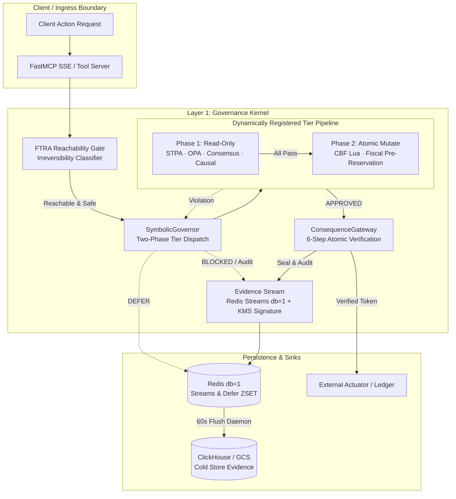
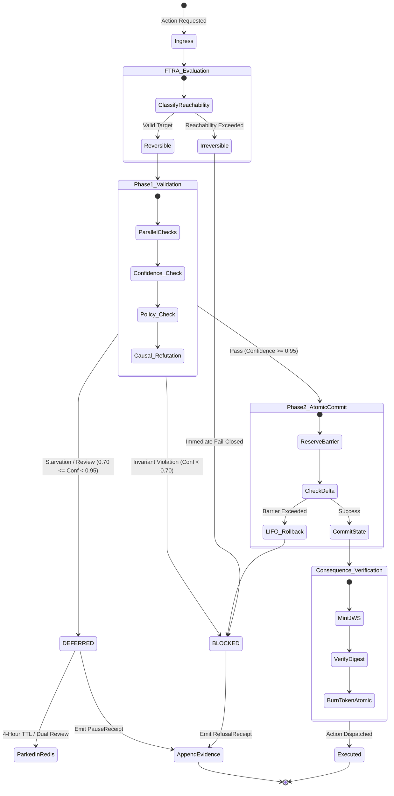

# CAGE Architecture — Cybernetic Governance Engine

> **Document Type:** System Macro-Architecture & Trust Boundaries
> **Status:** Current at HEAD (v3.0.1+)
> **Target Scope:** Universal Governance Substrate, Seam Contracts, Cryptographic Trust Boundaries, and Layer Topology
> **Last Updated:** 2026-09-22

---

## 1. Architectural Role & Domain Boundary

The Cybernetic Governance Engine (CAGE) is a domain-agnostic, fail-closed runtime governance substrate designed for autonomous AI agents and tool-calling execution graphs. Its core design principle is the absolute separation of **deterministic safety mechanism** (the Kernel) from **domain-specific semantics, metrics, and policy bundles** (Domain Plugins).

```text
+-------------------------------------------------------------------------+
| Configuration Layer (Jurisdictional)                                    |
| CAGE_DEPLOYMENT_REGION: US_FED · EU_ECB · APAC_MAS                      |
+-------------------------------------------------------------------------+
                               | parameterizes
                               v
+-------------------------------------------------------------------------+
| Layer 2: Optional Domain Plugins                                        |
| cage_finance · cage_healthcare · Adopter Plugins                        |
+-------------------------------------------------------------------------+
                               | registers tiers & models
                               v
+-------------------------------------------------------------------------+
| Layer 1: Domain-Agnostic Governance Kernel                              |
| FTRA Gate · SymbolicGovernor · ConsequenceGateway · EvidenceChain       |
+-------------------------------------------------------------------------+
                               | isolates via seams
                               v
+-------------------------------------------------------------------------+
| Layer 3: Integrations & Actuators                                       |
| External Ledgers · Normative Providers · Cloud Sinks                    |
+-------------------------------------------------------------------------+
```

### Trust Boundaries & Layered Separation
- **Layer 1: Governance Kernel (`src/gateway/`)**: Always present and domain-blind. Owns all safety enforcement mechanisms: finite-time reachability analysis (FTRA), two-phase tier execution, atomic barrier hops, consensus arbitration, causal counterfactual checks, JWS token consumption, cryptographic evidence hashing, and LIFO rollbacks. It operates strictly on abstract action primitives (`claimed_action`, `actor_id`, `resource_delta`). **Caller identity is never accepted from application-layer metadata**: the kernel derives `agent_id` / `caller_principal` exclusively from the SPIFFE URI carried in the verified mTLS peer certificate (see [Transport-Layer Agent Identity](#transport-layer-agent-identity-spiffe) below).
- **Layer 2: Domain Plugins (`src/cage_<domain>/`)**: Optional, interchangeable packages (e.g., `cage_finance`, `cage_healthcare`). Owns nomenclature, watched invariant scalars, threshold definitions, semantic critics, and domain Rego policies. Plugins hook into the kernel through structural subtyping protocols (`GovernanceTierPlugin`, `InvariantModel`). If `CAGE_ACTIVE_PLUGINS=""`, the engine boots as a pure substrate with every generic safety invariant fully functional.
- **Layer 3: Integrations & Rails (`src/integrations/`, `src/compliance_bridge/`)**: External adapters (external banking/clinical ledgers, storage backends, OPA servers, and notification bridges). These are physically decoupled from the kernel by strict zero-kernel-import Seam Contracts.
- **Configuration Layer (`config/compliance/`, `config/thresholds/`)**: Dynamically loaded at deploy time via `CAGE_DEPLOYMENT_REGION`. Overlays regional regulatory profiles (NIST/SR 26-2, EU AI Act, MAS FEAT) onto the runtime without requiring source changes.

### Layer 1 Kernel Module Inventory (Identity & Seam Contracts)

The kernel modules below are the load-bearing Layer 1 components for caller identity and vendor-neutral integration boundaries. All paths are relative to the repository root.

| Module | Role |
|---|---|
| [`src/gateway/governance/spiffe_extractor.py`](../../src/gateway/governance/spiffe_extractor.py) | Canonical transport-layer identity extraction. Exposes `extract_spiffe_uri_from_asgi_scope()`, `extract_spiffe_uri_from_grpc_context()`, `validate_spiffe_uri()`, and `SpiffeExtractionError`. |
| [`src/gateway/server/dpop_validator.py`](../../src/gateway/server/dpop_validator.py) | Vendor-neutral `ProofOfPossessionValidator` protocol plus the RFC 9449 `DPoPValidator` implementation and `TokenBindingError`. |
| [`src/gateway/governance/seams/actuation.py`](../../src/gateway/governance/seams/actuation.py) | `ExecutionActuator` protocol, `ExecutionClearance`, `ActuationReceipt`, and `ActuatorCapability`. |
| [`src/gateway/governance/seams/attestation.py`](../../src/gateway/governance/seams/attestation.py) | `AttestationProvider` base class, `ExternalAttestation`, and `AttestationStatus`. |
| [`src/gateway/governance/seams/credential_broker.py`](../../src/gateway/governance/seams/credential_broker.py) | `CredentialBrokerAdapter` protocol and its error taxonomy. |
| [`src/gateway/governance/seams/graph_topology.py`](../../src/gateway/governance/seams/graph_topology.py) | Domain-agnostic `GraphTopology` structure consumed by attestation adapters. |
| [`src/gateway/governance/seams/normative.py`](../../src/gateway/governance/seams/normative.py) | `NormativeProvider` protocol, `NormativeBaseline`, `ValidationResult`, and `EvidenceSeal`. |

Seam modules under [`src/gateway/governance/seams/`](../../src/gateway/governance/seams/) define contracts only and must never import the rest of the kernel — this is the property that keeps Layer 3 adapters free of circular dependencies.

### Transport-Layer Agent Identity (SPIFFE)

Agent identity is established at the transport layer and is **never** read from HTTP headers or request bodies. The canonical specification is [`AGENT_IDENTITY_BINDING_SPEC.md`](AGENT_IDENTITY_BINDING_SPEC.md); this section states only the macro-architecture invariants:

- **Single source of truth**: the SPIFFE URI in the SAN of the verified mTLS peer certificate, validated against `^spiffe://[a-zA-Z0-9._-]+(/[a-zA-Z0-9._/-]*)?$`.
- **Removed (breaking change, v3.1.0)**: the `X-Agent-ID` header, any `X-SPIFFE-ID` header, body-derived `agent_id` fields, and the anonymous-caller fallback. Callers that previously asserted identity this way are now rejected.
- **Fail-closed rejection**: HTTP/ASGI ingress returns **401** (`Client certificate with valid SPIFFE URI required`); the Envoy `ext_authz` gRPC path returns a `DeniedHttpResponse` — **401** when the SPIFFE URI is absent or malformed, **403** when the `CheckRequest` fields cannot be extracted at all.
- **Authorization remains policy-side**: the extracted SPIFFE URI is the OPA principal; agent-to-agent authorization is evaluated in [`config/opa/agent_catalog.rego`](../../config/opa/agent_catalog.rego) by prefix matching against `authorized_parent_prefixes`.

---

## 2. Data & Execution Flow

Execution requests enter the gateway via FastMCP (Model Context Protocol) over SSE or internal gRPC/HTTP transports. Tool invocations and model actions must traverse the fail-closed pipeline before any downstream side effect is permitted.

### Subsystem Flow Topology



### Hot-Path Execution Steps
1. **Ingress, Identity Extraction & Content-Addressing**: The verified mTLS peer certificate is read first — [`spiffe_extractor.py`](../../src/gateway/governance/spiffe_extractor.py) resolves the caller's SPIFFE URI from the ASGI scope (HTTP) or the gRPC peer context, and requests without one are rejected before any governance work (401 on HTTP ingress, `DeniedHttpResponse` on the `ext_authz` gRPC path). Admitted payloads are then normalized and content-addressed via RFC 8785 JSON Canonicalization Scheme (JCS) producing an invariant payload digest.
2. **FTRA Reachability Boundary**: The request hits the Finite-Time Reachability Analysis gate. Actions classified as terminal or irreversible undergo strict reachability path checks before entering the governance pipeline.
3. **SymbolicGovernor Two-Phase Dispatch**:
   - **Phase 1 (Read-Only Inspection)**: Concurrently runs non-mutating checks: deterministic STPA invariants, declarative OPA rules, multi-agent consensus debate, and DoWhy causal counterfactual refutations.
   - **Phase 2 (Atomic Mutation)**: If Phase 1 passes cleanly, the governor initiates atomic state reservations (e.g., discrete-time Control Barrier Functions via Redis Lua scripts and fiscal limit locks). Any Phase 2 failure triggers an immediate LIFO compensating rollback.
4. **Post-FRIA Consequence Gateway**: Upon successful governance dispatch, a short-lived, KMS-signed ConsequenceToken (JWS) is minted. Downstream actuators verify the token's signature, TTL, and content digest against the ConsequenceAuthorityStore before firing the physical side effect.
5. **Evidentiary Hash-Chaining**: Every decision, receipt (RefusalReceipt, PauseReceipt), and outcome is appended to an immutable, SHA-256 hash-chained stream in Redis (db=1) and asynchronously drained to durable cold storage.

---

## 3. State Machine & Lifecycle

The CAGE substrate balances synchronous fail-closed gating on the hot path with an asynchronous cybernetic feedback loop.

### System Decision Lifecycle



### Component State Partitions
- **Hot Ephemeral State (Redis db=0)**: Execution checkpoints, transient session quotas, and local barrier metrics.
- **Durable Compliance State (Redis db=1)**: Dedicated `noeviction` database storing:
  - `DEFER:{id}`: Hashed deferral payloads parked for human-in-the-loop (HITL) resolution.
  - `DEFER:expiry_index`: Sorted set (ZSET) tracking TTL expiration timestamps.
  - `evidence:stream`: Monotonically increasing, hash-chained transaction log.
- **Long-Term Cold Archive (ClickHouse / Object Storage)**: Long-term immutable sink ingesting batched evidence blocks from the flush daemon every 60 seconds.

---

## 4. Operational Guarantees & Edge Cases

- **No-Direct-Bind Safety Invariant**: The engine enforces physical and structural isolation between callers and execution sinks. Downstream actuators reject any direct parameter binding. Actuation requires presenting an authenticated ConsequenceToken validated against the payload digest at the moment of execution, closing Time-of-Check to Time-of-Use (TOCTOU) windows.
- **Fail-Closed Default**: Any unhandled exception, network partition across OPA/Redis, missing token authority, or timeout across tier plugins immediately causes the SymbolicGovernor to transition to a BLOCK or DEFER state. System components never default to ALLOW or NOT_APPLICABLE.
- **Atomic Phase 2 Rollbacks**: Phase 1 plugins must remain completely read-only. If any Phase 2 mutator fails after partial reservations have been committed, prior steps are reverted in strict Last-In, First-Out (LIFO) order using registered compensators.
- **Non-Repudiation & Cryptographic Chains**: Every state transition produces a record linked to the previous record via SHA-256 hash chaining (`record_hash = SHA256(prev_hash + canonical_payload)`). Critical compliance boundaries (such as ledger reconciliations and external receipts) are signed by Google Cloud KMS or HSM-backed hardware keys using RFC 8785 canonical JSON formatting.
- **Zero-Trust Network Hardening (Z3N)**: The substrate assumes an adversarial internal network. Pods communicate strictly through mTLS with cryptographic SPIFFE/SVID identities. Pod egress is locked down to explicit domain and IP allowlists via eBPF network security policies.
- **Transport-Bound Caller Identity (Fail-Closed)**: The governance pipeline never runs for an unidentified caller. `agent_id` / `caller_principal` is derived solely from the SPIFFE URI in the verified mTLS peer certificate; header- and body-supplied identity claims and the former anonymous fallback were removed in v3.1.0. Extraction failure is terminal: HTTP ingress answers 401 and the `ext_authz` gRPC path answers with a denied response. See [`AGENT_IDENTITY_BINDING_SPEC.md`](AGENT_IDENTITY_BINDING_SPEC.md).

---

## 5. Configuration Contracts & Runtime Matrix

System initialization and regional behavior are driven by environmental flags and structured JSON configuration maps.

### Core Environment Variables

| Variable | Type | Default | Operational Guarantee / Purpose |
|---|---|---|---|
| `CAGE_ENV` | str | `production` | When set to production, disables all memory fallbacks and mandates active evidence streams. |
| `CAGE_DEPLOYMENT_REGION` | enum | `US_FED` | Selects active compliance profile: `US_FED`, `EU_ECB`, or `APAC_MAS`. |
| `CAGE_ACTIVE_PLUGINS` | csv | `""` | Comma-separated list of plugins to discover and load (e.g. `cage_finance,cage_healthcare`). |
| `CAGE_DEFER_ENABLED` | bool | `true` | Enables the 4-state AARM deferral primitive and Redis parking queue. |
| `CAGE_PAUSE_ENABLED` | bool | `true` | Enables transient execution suspension and resume-token lifecycle. |
| `REDIS_URL` | str | Required | Connection URI for the primary Redis cluster (db=0 and db=1). |
| `KMS_KEY_NAME` | str | Optional | Cloud KMS resource name used for hardware-backed evidence and token signing. |

### Regional Configuration Profile Matrix

Profiles dynamically alter operational confidence boundaries, latency budgets, and compliance frameworks without modifying application logic:

| Region Code | Primary Frameworks | Default Min Confidence | Drawdown Limit | Target Consensus SLA |
|---|---|---|---|---|
| `US_FED` | NIST SP 800-53, SR 26-2, ISO 42001 | 0.95 | 5.0% | 200ms |
| `EU_ECB` | EU AI Act (Art. 29a FRIA), DORA, GDPR | 0.97 | 4.0% | 150ms |
| `APAC_MAS` | MAS FEAT Principles, ISO 42001 | 0.95 | 5.0% | 100ms |

### Architecture & Design Index

For deep-dive architectural specifications, refer to the corresponding canonical documents:

| # | Document | Title & Focus Area | Canonical Path |
|---|---|---|---|
| 1 | **Macro-Architecture** | System Macro-Architecture, Trust Boundaries & Layer Topology | [`ARCHITECTURE.md`](ARCHITECTURE.md) |
| 2 | **Gateway Architecture** | Layer 1 Gateway Kernel, STERA Dispatch Loop & Request Lifecycle | [`GATEWAY_ARCHITECTURE.md`](GATEWAY_ARCHITECTURE.md) |
| 3 | **Multi-Agent System** | 9-Agent Inventory, 25/33-Field AgentState Schema & HITL Workflow | [`AGENT_SYSTEM_ARCHITECTURE.md`](AGENT_SYSTEM_ARCHITECTURE.md) |
| 4 | **Technology Stack** | Exhaustive 11-Domain Bill of Materials, Sovereign Stack & Dependencies | [`TECH_STACK.md`](TECH_STACK.md) |
| 5 | **Formal Verification** | 11-Step Mathematical State-Space Proofs, CBF & NoDirectBind Invariants | [`FORMAL_VERIFICATION.md`](FORMAL_VERIFICATION.md) |
| 6 | **Consequence Gateway** | 6-Step Token Evaluation, JWS Verification & Authority Store | [`CONSEQUENCE_GATEWAY.md`](CONSEQUENCE_GATEWAY.md) |
| 7 | **Symbolic Governor** | Dispatch Loop, 2-Phase Commit & Interruption Taxonomy | [`SYMBOLIC_GOVERNOR_RUNTIME.md`](SYMBOLIC_GOVERNOR_RUNTIME.md) |
| 8 | **FTRA Reachability** | Irreversibility Classification & Plan Graph Bounding | [`FTRA_REACHABILITY_ANALYZER.md`](FTRA_REACHABILITY_ANALYZER.md) |
| 9 | **Deferral Queue** | AARM Deferral State Machine, Redis db=1 & Dual-Control Resolution | [`DEFERRAL_QUEUE.md`](DEFERRAL_QUEUE.md) |
| 10 | **Evidence Chain** | Cryptographic Hash Chaining, Streams & Cold Store Daemon | [`EVIDENCE_CHAIN.md`](EVIDENCE_CHAIN.md) |
| 11 | **Cryptographic Signer** | Cloud KMS HSM Provider, RFC 8785 JCS & Key Manifests | [`CRYPTOGRAPHIC_SIGNER_ENGINE.md`](CRYPTOGRAPHIC_SIGNER_ENGINE.md) |
| 12 | **Extensibility Architecture** | GovernanceTierPlugin Contract, Seams & Vendor Neutrality | [`EXTENSIBILITY_ARCHITECTURE.md`](EXTENSIBILITY_ARCHITECTURE.md) |
| 13 | **Dual-Project Architecture** | Sovereign Regional Langfuse Telemetry & Operational Isolation | [`DUAL_PROJECT_ARCHITECTURE.md`](DUAL_PROJECT_ARCHITECTURE.md) |
| 14 | **Inference Gateway** | Split-Brain vLLM Serving Topology & Model Router | [`INFERENCE_GATEWAY_ARCHITECTURE.md`](INFERENCE_GATEWAY_ARCHITECTURE.md) |
| 15 | **ClickHouse Evidence Sink** | High-Throughput WORM Audit Ingestion & Schema Contracts | [`CLICKHOUSE_EVIDENCE_SINK.md`](CLICKHOUSE_EVIDENCE_SINK.md) |
| 16 | **Agent Identity Binding** | Canonical SPIFFE/mTLS Identity Extraction, DPoP Binding & A2A Prefix Authorization | [`AGENT_IDENTITY_BINDING_SPEC.md`](AGENT_IDENTITY_BINDING_SPEC.md) |
