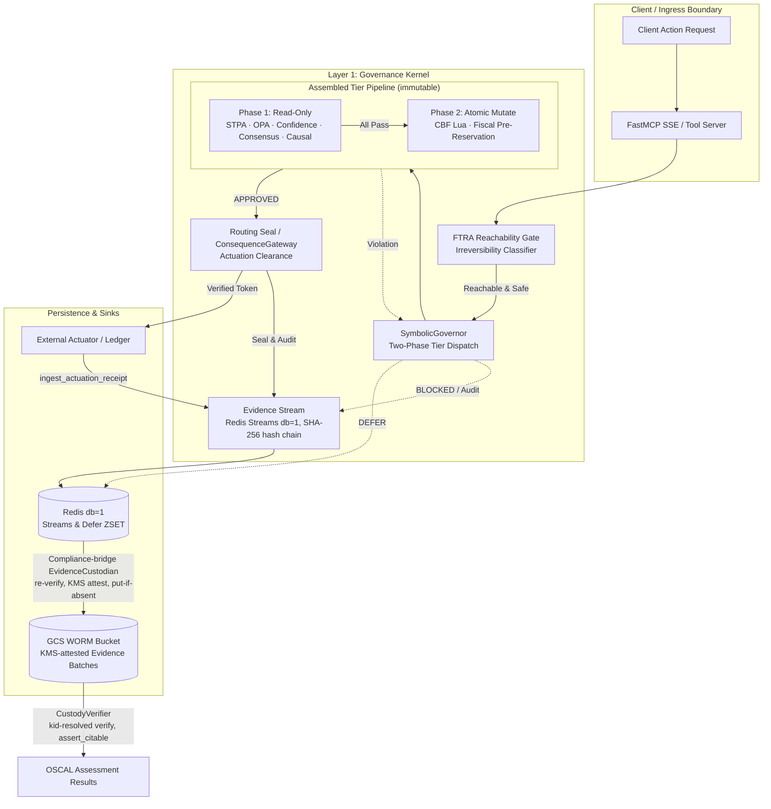
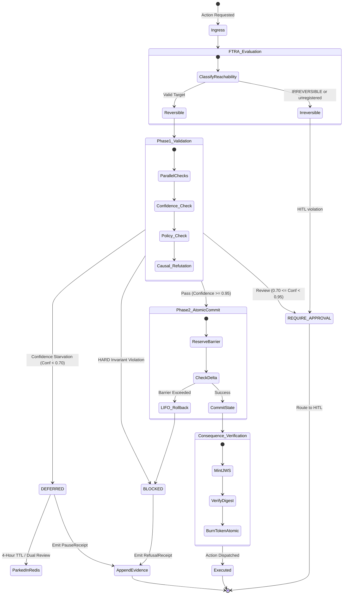

# CAGE Architecture — Cybernetic Governance Engine

> **Document Type:** System Macro-Architecture & Trust Boundaries
> **Status:** Current at HEAD (v3.0.1+)
> **Target Scope:** Universal Governance Substrate, Seam Contracts, Cryptographic Trust Boundaries, and Layer Topology
> **Last Updated:** 2026-09-29

---

## 1. Architectural Role & Domain Boundary

The Cybernetic Governance Engine (CAGE) is a domain-agnostic, fail-closed runtime governance substrate designed for autonomous AI agents and tool-calling execution graphs. Its core design principle is the absolute separation of **deterministic safety mechanism** (the Kernel) from **domain-specific semantics, metrics, and policy bundles** (Domain Plugins).

```text
+-------------------------------------------------------------------------+
| Configuration Layer (Jurisdictional)                                    |
| CAGE_DEPLOYMENT_REGION: US_FED · EU_ECB · APAC_MAS                      |
+-------------------------------------------------------------------------+
                               | parameterizes
                               v
+-------------------------------------------------------------------------+
| Layer 2: Optional Domain Plugins                                        |
| cage_finance · cage_healthcare · Adopter Plugins                        |
+-------------------------------------------------------------------------+
                               | contribute() -> PluginContribution
                               v
+-------------------------------------------------------------------------+
| Layer 1: Domain-Agnostic Governance Kernel                              |
| FTRA Gate · SymbolicGovernor · ConsequenceGateway · EvidenceChain       |
+-------------------------------------------------------------------------+
                               | isolates via seams
                               v
+-------------------------------------------------------------------------+
| Layer 3: Integrations & Actuators                                       |
| External Ledgers · Normative Providers · Cloud Sinks                    |
+-------------------------------------------------------------------------+
```

### Trust Boundaries & Layered Separation
- **Layer 1: Governance Kernel (`src/gateway/`)**: Always present and domain-blind. Owns all safety enforcement mechanisms: finite-time reachability analysis (FTRA), two-phase tier execution, atomic barrier hops, consensus arbitration, causal counterfactual checks, JWS token consumption, cryptographic evidence hashing, and LIFO rollbacks. It operates strictly on abstract action primitives (`claimed_action`, `actor_id`, `resource_delta`). **Caller identity is never accepted from application-layer metadata**: the kernel derives `agent_id` / `caller_principal` exclusively from the Linkerd-verified mTLS workload identity (`l5d-client-id`) (see [Transport-Layer Agent Identity](#transport-layer-agent-identity-linkerd-mtls) below).
- **Layer 2: Domain Plugins (`src/cage_<domain>/`)**: Optional, interchangeable packages (e.g., `cage_finance`, `cage_healthcare`). Owns nomenclature, watched invariant scalars, threshold definitions, semantic critics, and domain Rego policies. Plugins hand the kernel data, not mutations: `CagePlugin.contribute()` returns a frozen `PluginContribution` (tiers, invariants, UCA rules, narrowers, ground-truth providers, safety filter, consensus contribution, threshold sections) built on structural subtyping protocols (`GovernanceTierPlugin`, `InvariantModel`). The composition root [`assemble_governor()`](../../src/gateway/governance/governor/assembly.py) validates every contribution together and builds an immutable `SymbolicGovernor`. Engine slots no plugin fills get the deny-by-default `NullSafetyFilter` / `NullConsensusProvider` ([`null_components.py`](../../src/gateway/governance/null_components.py)), so a governor assembled with no plugins denies by construction, and [`bootstrap_governor()`](../../src/gateway/governance/governor/bootstrap.py) refuses to serve traffic with an unfilled slot. A server process runs exactly one domain, named by `CAGE_DOMAIN`.
- **Layer 3: Integrations & Rails (`src/integrations/`, `src/compliance_bridge/`)**: External adapters (external banking/clinical ledgers, storage backends, OPA servers, notification bridges, and the cloud KMS providers in `src/integrations/{gcp,aws,azure}/kms_provider.py`, loaded lazily by [`signer_factory.py`](../../src/gateway/governance/signer_factory.py)). These are physically decoupled from the kernel by strict zero-kernel-import Seam Contracts.
- **Configuration Layer (`config/compliance/`, `config/thresholds/`)**: Dynamically loaded at deploy time via `CAGE_DEPLOYMENT_REGION`. Overlays regional regulatory profiles (NIST/SR 26-2, EU AI Act, MAS FEAT) onto the runtime without requiring source changes.

### Layer 1 Kernel Module Inventory (Identity & Seam Contracts)

The kernel modules below are the load-bearing Layer 1 components for caller identity and vendor-neutral integration boundaries. All paths are relative to the repository root.

| Module | Role |
|---|---|
| [`src/gateway/server/workload_identity.py`](../../src/gateway/server/workload_identity.py) | Canonical gateway ingress authentication and caller identity extraction under Linkerd mTLS (`l5d-client-id`). Exposes `WorkloadIdentityMiddleware`, `extract_client_identity(scope)`, and `load_identity_policy()`. |
| [`src/gateway/server/dpop_validator.py`](../../src/gateway/server/dpop_validator.py) | Vendor-neutral `ProofOfPossessionValidator` protocol plus the RFC 9449 `DPoPValidator` implementation and `TokenBindingError`. |
| [`src/gateway/governance/seams/actuation.py`](../../src/gateway/governance/seams/actuation.py) | `ExecutionActuator` protocol, `ExecutionClearance`, `ActuationReceipt`, and `ActuatorCapability`. |
| [`src/gateway/governance/seams/attestation.py`](../../src/gateway/governance/seams/attestation.py) | `AttestationProvider` base class, `ExternalAttestation`, and `AttestationStatus`. |
| [`src/gateway/governance/seams/credential_broker.py`](../../src/gateway/governance/seams/credential_broker.py) | `CredentialBrokerAdapter` protocol and its error taxonomy. |
| [`src/gateway/governance/seams/graph_topology.py`](../../src/gateway/governance/seams/graph_topology.py) | Domain-agnostic `GraphTopology` structure consumed by attestation adapters. |
| [`src/gateway/governance/seams/normative.py`](../../src/gateway/governance/seams/normative.py) | `NormativeProvider` protocol, `NormativeBaseline`, `ValidationResult`, and `EvidenceSeal`. |

Seam modules under [`src/gateway/governance/seams/`](../../src/gateway/governance/seams/) define contracts only and must never import the rest of the kernel — this is the property that keeps Layer 3 adapters free of circular dependencies.

### Transport-Layer Agent Identity (Linkerd mTLS)

Agent identity is established at the transport/mesh layer and is **never** read from client-supplied HTTP headers or request bodies. The canonical specification is [`AGENT_IDENTITY_BINDING_SPEC.md`](AGENT_IDENTITY_BINDING_SPEC.md); this section states only the macro-architecture invariants:

- **Single source of truth**: under Linkerd mTLS, the Linkerd inbound proxy terminates TLS and sets `l5d-client-id` (`<sa>.<ns>.serviceaccount.identity.linkerd.<trust-domain>`). Gateway ingress authentication and caller identity extraction live in [`src/gateway/server/workload_identity.py`](../../src/gateway/server/workload_identity.py) (`WorkloadIdentityMiddleware` and `extract_client_identity(scope)`). `CAGE_TRUSTED_CLIENT_IDENTITIES` is required in every environment.
- **Removed (breaking change, v3.1.0)**: the `X-Agent-ID` header, any `X-SPIFFE-ID` header, body-derived `agent_id` fields, and the anonymous-caller fallback. Callers that previously asserted identity this way are now rejected.
- **Fail-closed rejection**: `WorkloadIdentityMiddleware` rejects any non-open request lacking a single trusted `l5d-client-id` header with **403**, and `extract_client_identity(scope)` raises `WorkloadIdentityError` when no verified Linkerd workload identity is present.
- **Authorization remains policy-side**: the extracted identity is the OPA principal; agent-to-agent authorization is evaluated in [`config/opa/agent_catalog.rego`](../../config/opa/agent_catalog.rego) by prefix matching against `authorized_parent_prefixes`.

---

## 2. Data & Execution Flow

Execution requests enter the gateway via FastMCP (Model Context Protocol) over SSE or internal gRPC/HTTP transports. Tool invocations and model actions must traverse the fail-closed pipeline before any downstream side effect is permitted.

### Subsystem Flow Topology


```mermaid
graph TB
    subgraph INGRESS["Client / Ingress Boundary"]
        REQ[Client Action Request]
        MCP[FastMCP SSE / Tool Server]
    end

    subgraph KERNEL["Layer 1: Governance Kernel"]
        direction TB
        FTRA["FTRA Reachability Gate<br/>Irreversibility Classifier"]
        SYM["SymbolicGovernor<br/>Two-Phase Tier Dispatch"]

        subgraph TIERS["Assembled Tier Pipeline (immutable)"]
            direction LR
            P1["Phase 1: Read-Only<br/>STPA · OPA · Confidence · Consensus · Causal"]
            P2["Phase 2: Atomic Mutate<br/>CBF Lua · Fiscal Pre-Reservation"]
            P1 -->|All Pass| P2
        end

        CQG["Routing Seal / ConsequenceGateway<br/>Actuation Clearance"]
        EVID["Evidence Stream<br/>Redis Streams db=1, SHA-256 hash chain"]
    end

    subgraph STORAGE["Persistence & Sinks"]
        R_HOT[(Redis db=1<br/>Streams & Defer ZSET)]
        CH_COLD[(GCS WORM Bucket<br/>KMS-attested Evidence Batches)]
        ACTUATOR["External Actuator / Ledger"]
    end

    REQ --> MCP
    MCP --> FTRA
    FTRA -->|Reachable & Safe| SYM
    SYM --> TIERS
    TIERS -->|APPROVED| CQG
    TIERS -.->|Violation| SYM
    SYM -.->|DEFER| R_HOT
    SYM -.->|BLOCKED / Audit| EVID
    CQG -->|Verified Token| ACTUATOR
    CQG -->|Seal & Audit| EVID
    ACTUATOR -->|ingest_actuation_receipt| EVID
    EVID --> R_HOT
    R_HOT -->|Compliance-bridge EvidenceCustodian<br/>re-verify, KMS attest, put-if-absent| CH_COLD
    CH_COLD -->|CustodyVerifier<br/>kid-resolved verify, assert_citable| OSCAL_CITE[OSCAL Assessment Results]
```

### Hot-Path Execution Steps
1. **Ingress, Identity Extraction & Content-Addressing**: The Linkerd-verified peer workload identity is checked first — [`workload_identity.py`](../../src/gateway/server/workload_identity.py) (`WorkloadIdentityMiddleware` and `extract_client_identity(scope)`) verifies and resolves the caller's `l5d-client-id` from the ASGI scope, and requests without a trusted identity are rejected before any governance work (403 at `WorkloadIdentityMiddleware`, 401 on `extract_client_identity` failure). Admitted payloads are then normalized and content-addressed via RFC 8785 JSON Canonicalization Scheme (JCS) producing an invariant payload digest.
2. **FTRA Reachability Boundary**: The first pipeline stage (`FtraStage`) classifies the action against the active domain's FTRA terminal registry. Irreversible actions, and unregistered ones (which fail closed to `IRREVERSIBLE_TERMINAL`), emit a `HITL` violation and are routed to human approval.
3. **SymbolicGovernor Two-Phase Dispatch** ([`pipeline.py`](../../src/gateway/governance/governor/pipeline.py)):
   - **Phase 1 (Read-Only Inspection)**: Runs the non-mutating stages sequentially — FTRA, STPA, OPA, confidence, then the domain's read-only tiers by `(phase, order)` (e.g. bounding, consensus, causal) — and stops at the first `HARD` violation.
   - **Phase 2 (Atomic Mutation)**: Only if Phase 1 produced zero violations do the mutating tiers commit (e.g. discrete-time Control Barrier Functions via Redis Lua scripts and fiscal reservations). Each commit returns a `CommitReceipt` held by the request's `ReservationScope` ([`reservation.py`](../../src/gateway/governance/governor/reservation.py)); any Phase 2 failure rolls back exactly the recorded receipts in LIFO order.
4. **Seal & Actuation Clearance**: On a clean run the governor issues a routing seal inside the same `ReservationScope` ([`sealing.py`](../../src/gateway/governance/governor/sealing.py)). Commits stay in force only once the seal is issued; a failing or cancelled seal rolls them all back. The seal is a KMS-signed JWT bound to a durable evidence record ([`routing_seal.py`](../../src/gateway/governance/routing_seal.py)). When an external normative provider admits an action, a short-lived KMS-signed ConsequenceToken (JWS) is also minted ([`consequence_token_service.py`](../../src/gateway/governance/consequence_token_service.py)) for single-use verification by the [`ConsequenceGateway`](CONSEQUENCE_GATEWAY.md).
5. **Evidentiary Hash-Chaining**: Every decision, receipt (RefusalReceipt, PauseReceipt, `CONSEQUENCE_GATEWAY_DECISION` / `CONSEQUENCE_GATEWAY_REFUSAL`, and `ACTUATION_RECEIPT` / `ACTUATION_REFUSAL_RECEIPT` via [`ingest_actuation_receipt()`](../../src/gateway/governance/execution_actuator.py)), and outcome is appended to an immutable, SHA-256 hash-chained stream in Redis (db=1), asynchronously drained to durable cold storage by [`EvidenceCustodian`](../../src/compliance_bridge/evidence_custodian.py), and verified on read-back by [`CustodyVerifier`](../../src/compliance_bridge/evidence_verifier.py).

---

## 3. State Machine & Lifecycle

The CAGE substrate balances synchronous fail-closed gating on the hot path with an asynchronous cybernetic feedback loop.

### System Decision Lifecycle


```mermaid
stateDiagram-v2
    [*] --> Ingress: Action Requested
    Ingress --> FTRA_Evaluation

    state FTRA_Evaluation {
        [*] --> ClassifyReachability
        ClassifyReachability --> Irreversible: IRREVERSIBLE or unregistered
        ClassifyReachability --> Reversible: Valid Target
    }

    Irreversible --> REQUIRE_APPROVAL: HITL violation
    Reversible --> Phase1_Validation

    state Phase1_Validation {
        [*] --> ParallelChecks
        ParallelChecks --> Confidence_Check
        Confidence_Check --> Policy_Check
        Policy_Check --> Causal_Refutation
    }

    Phase1_Validation --> Phase2_AtomicCommit: Pass (Confidence >= 0.95)
    Phase1_Validation --> REQUIRE_APPROVAL: Review (0.70 <= Conf < 0.95)
    Phase1_Validation --> DEFERRED: Confidence Starvation (Conf < 0.70)
    Phase1_Validation --> BLOCKED: HARD Invariant Violation

    state Phase2_AtomicCommit {
        [*] --> ReserveBarrier
        ReserveBarrier --> CheckDelta
        CheckDelta --> CommitState: Success
        CheckDelta --> LIFO_Rollback: Barrier Exceeded
    }

    LIFO_Rollback --> BLOCKED
    REQUIRE_APPROVAL --> [*]: Route to HITL
    DEFERRED --> ParkedInRedis: 4-Hour TTL / Dual Review
    CommitState --> Consequence_Verification

    state Consequence_Verification {
        [*] --> MintJWS
        MintJWS --> VerifyDigest
        VerifyDigest --> BurnTokenAtomic
    }

    Consequence_Verification --> Executed: Action Dispatched
    Executed --> [*]
    BLOCKED --> AppendEvidence: Emit RefusalReceipt
    DEFERRED --> AppendEvidence: Emit PauseReceipt
    AppendEvidence --> [*]
```

### Component State Partitions
- **Deployment**: In the `gcp-gke` target the gateway's Redis is the dedicated governance Memorystore (Valkey) instance (`module.memorystore_governance` in [`infra/targets/gcp-gke/main.tf`](../../infra/targets/gcp-gke/main.tf)); application caches use a separate `memorystore_app` instance.
- **Hot Ephemeral State (Redis db=0)**: Execution checkpoints, transient session quotas, and local barrier metrics.
- **Durable Compliance State (Redis db=1)**: Dedicated `noeviction` database storing:
  - `DEFER:{id}`: Hashed deferral payloads parked for human-in-the-loop (HITL) resolution.
  - `DEFER:expiry_index`: Sorted set (ZSET) tracking TTL expiration timestamps.
  - `evidence:stream`: Monotonically increasing, hash-chained transaction log.
- **Long-Term Cold Archive & Read-Back Verification (Object Storage)**: The gateway only produces evidence. The compliance bridge's `EvidenceCustodian` ([`evidence_custodian.py`](../../src/compliance_bridge/evidence_custodian.py)) reads the stream from a durable cursor (default every 60 seconds, `EVIDENCE_CUSTODY_INTERVAL_S`), re-verifies the hash chain, signs a `cage-evidence-batch/1` attestation with `EVIDENCE_KMS_KEY`, and writes each batch with put-if-absent semantics. `CustodyVerifier` ([`evidence_verifier.py`](../../src/compliance_bridge/evidence_verifier.py)) periodically reads the archive back (`EVIDENCE_VERIFY_INTERVAL_S`, default 300 seconds), verifies batch signatures against `kid`-resolved trust anchors (`EVIDENCE_KMS_KEY` + optional `EVIDENCE_TRUST_ANCHORS_FILE`), re-checks every record and cross-batch link, and gates OSCAL assessment citations (`OSCAL_REQUIRE_VERIFIED_CUSTODY=true` in staging/prod). In the `gcp-gke` target the retention-locked GCS WORM bucket ([`infra/modules/worm_bucket`](../../infra/modules/worm_bucket/)) is the system of record.

---

## 4. Operational Guarantees & Edge Cases

- **No-Direct-Bind Safety Invariant**: The engine enforces physical and structural isolation between callers and execution sinks. Downstream actuators reject any direct parameter binding. Actuation requires presenting an authenticated ConsequenceToken validated against the payload digest at the moment of execution, closing Time-of-Check to Time-of-Use (TOCTOU) windows.
- **Fail-Closed Default**: Any unhandled exception, network partition across OPA/Redis, missing token authority, or timeout across tier plugins immediately causes the SymbolicGovernor to transition to a BLOCK or DEFER state. System components never default to ALLOW or NOT_APPLICABLE.
- **Atomic Phase 2 Rollbacks**: Phase 1 plugins must remain completely read-only. Every Phase 2 `commit()` returns a `CommitReceipt`, and `rollback()` undoes exactly what that receipt records. If any Phase 2 mutator fails, or the seal is not issued, the `ReservationScope` rolls back every outstanding receipt in strict Last-In, First-Out (LIFO) order in a shielded task; a failed rollback raises `[ROLLBACK_FAILED]`.
- **Non-Repudiation & Cryptographic Chains**: Every state transition produces a record linked to the previous record via SHA-256 hash chaining (`record_hash = SHA256(prev_hash + canonical_payload)`). Critical compliance boundaries (such as ledger reconciliations and external receipts) are signed by Google Cloud KMS or HSM-backed hardware keys using RFC 8785 canonical JSON formatting.
- **Zero-Trust Network Hardening (Z3N)**: The substrate assumes an adversarial internal network. Pods communicate strictly through Linkerd mTLS with workload identities chained to a Google CAS trust anchor ([`infra/modules/service_mesh`](../../infra/modules/service_mesh/)). Pod egress is locked down with Kubernetes `NetworkPolicy` plus GKE `FQDNNetworkPolicy` on Dataplane V2.
- **Transport-Bound Caller Identity (Fail-Closed)**: The governance pipeline never runs for an unidentified caller. `agent_id` / `caller_principal` is derived solely from the Linkerd-verified `l5d-client-id`; header- and body-supplied identity claims and the former anonymous fallback were removed in v3.1.0. Extraction failure is terminal: `WorkloadIdentityMiddleware` answers 403 and an `extract_client_identity` failure answers 401. See [`AGENT_IDENTITY_BINDING_SPEC.md`](AGENT_IDENTITY_BINDING_SPEC.md).

---

## 5. Configuration Contracts & Runtime Matrix

System initialization and regional behavior are driven by environmental flags and structured JSON configuration maps.

### Core Environment Variables

| Variable | Type | Default | Operational Guarantee / Purpose |
|---|---|---|---|
| `CAGE_ENV` | str | `production` | Resolves the deployment posture. Anything but dev/test/CI (unknown values included) is enforcing: [`assert_production_posture()`](../../src/gateway/governance/governor/posture.py) refuses startup on any failed check. |
| `CAGE_DEPLOYMENT_REGION` | enum | `US_FED` | Selects active compliance profile: `US_FED`, `EU_ECB`, or `APAC_MAS`. |
| `CAGE_DOMAIN` | str | *(required)* | Names the single domain plugin this process runs (`cage.plugins` entry-point name, e.g. `finance`). Unset, multi-valued, unknown, or `DomainConfig`-less values abort startup. |
| `OPA_URL` | str | *(required)* | OPA base URL with no path. The decision path is `/v1/data/<DomainConfig.opa_package>`; startup aborts unless OPA has that package and its `opa_required_rules` loaded. |
| `CAGE_DEFER_ENABLED` | bool | `true` | Enables the 4-state AARM deferral primitive and Redis parking queue. |
| `CAGE_PAUSE_ENABLED` | bool | `true` | Enables transient execution suspension and resume-token lifecycle. |
| `REDIS_URL` | str | Required | Connection URI for the primary Redis cluster (db=0 and db=1). |
| `KMS_GOVERNANCE_KEY` | str | Required when enforcing | Cloud KMS key the gateway signs seals and tokens with. The reconciler signs with `RECONCILER_KMS_KEY` and the compliance bridge with `EVIDENCE_KMS_KEY`; each must be a separate key. |

### Regional Configuration Profile Matrix

Profiles dynamically alter operational confidence boundaries, latency budgets, and compliance frameworks without modifying application logic:

| Region Code | Primary Frameworks | Default Min Confidence | Drawdown Limit | Target Consensus SLA |
|---|---|---|---|---|
| `US_FED` | NIST SP 800-53, SR 26-2, ISO 42001 | 0.95 | 5.0% | 200ms |
| `EU_ECB` | EU AI Act (Art. 29a FRIA), DORA, GDPR | 0.97 | 4.0% | 150ms |
| `APAC_MAS` | MAS FEAT Principles, ISO 42001 | 0.95 | 5.0% | 100ms |

### Architecture & Design Index

For deep-dive architectural specifications, refer to the corresponding canonical documents:

| # | Document | Title & Focus Area | Canonical Path |
|---|---|---|---|
| 1 | **Macro-Architecture** | System Macro-Architecture, Trust Boundaries & Layer Topology | [`ARCHITECTURE.md`](ARCHITECTURE.md) |
| 2 | **Gateway Architecture** | Layer 1 Gateway Kernel, STERA Dispatch Loop & Request Lifecycle | [`GATEWAY_ARCHITECTURE.md`](GATEWAY_ARCHITECTURE.md) |
| 3 | **Multi-Agent System** | 9-Agent Inventory, 25/33-Field AgentState Schema & HITL Workflow | [`AGENT_SYSTEM_ARCHITECTURE.md`](AGENT_SYSTEM_ARCHITECTURE.md) |
| 4 | **Technology Stack** | Exhaustive 11-Domain Bill of Materials, Sovereign Stack & Dependencies | [`TECH_STACK.md`](TECH_STACK.md) |
| 5 | **Formal Verification** | 11-Step Mathematical State-Space Proofs, CBF & NoDirectBind Invariants | [`FORMAL_VERIFICATION.md`](FORMAL_VERIFICATION.md) |
| 6 | **Consequence Gateway** | 6-Step Token Evaluation, JWS Verification & Authority Store | [`CONSEQUENCE_GATEWAY.md`](CONSEQUENCE_GATEWAY.md) |
| 7 | **Symbolic Governor** | Dispatch Loop, 2-Phase Commit & Interruption Taxonomy | [`SYMBOLIC_GOVERNOR_RUNTIME.md`](SYMBOLIC_GOVERNOR_RUNTIME.md) |
| 8 | **FTRA Reachability** | Irreversibility Classification & Plan Graph Bounding | [`FTRA_REACHABILITY_ANALYZER.md`](FTRA_REACHABILITY_ANALYZER.md) |
| 9 | **Deferral Queue** | AARM Deferral State Machine, Redis db=1 & Dual-Control Resolution | [`DEFERRAL_QUEUE.md`](DEFERRAL_QUEUE.md) |
| 10 | **Evidence Chain** | Cryptographic Hash Chaining, Streams & Compliance-Bridge Custody | [`EVIDENCE_CHAIN.md`](EVIDENCE_CHAIN.md) |
| 11 | **Cryptographic Signer** | Cloud KMS HSM Provider, RFC 8785 JCS & Key Manifests | [`CRYPTOGRAPHIC_SIGNER_ENGINE.md`](CRYPTOGRAPHIC_SIGNER_ENGINE.md) |
| 12 | **Extensibility Architecture** | GovernanceTierPlugin Contract, Seams & Vendor Neutrality | [`EXTENSIBILITY_ARCHITECTURE.md`](EXTENSIBILITY_ARCHITECTURE.md) |
| 13 | **Dual-Project Architecture** | Sovereign Regional Langfuse Telemetry & Operational Isolation | [`DUAL_PROJECT_ARCHITECTURE.md`](DUAL_PROJECT_ARCHITECTURE.md) |
| 14 | **Inference Gateway** | Split-Brain vLLM Serving Topology & Model Router | [`INFERENCE_GATEWAY_ARCHITECTURE.md`](INFERENCE_GATEWAY_ARCHITECTURE.md) |
| 15 | **ClickHouse Evidence Sink** | High-Throughput WORM Audit Ingestion & Schema Contracts | [`CLICKHOUSE_EVIDENCE_SINK.md`](CLICKHOUSE_EVIDENCE_SINK.md) |
| 16 | **Agent Identity Binding** | Canonical Linkerd mTLS Identity Extraction, DPoP Binding & A2A Prefix Authorization | [`AGENT_IDENTITY_BINDING_SPEC.md`](AGENT_IDENTITY_BINDING_SPEC.md) |
