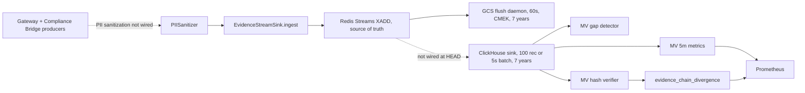

# CAGE Audit Stream Migration Analysis

**Analysis Date:** 2026-09-05  
**Last Updated:** 2026-09-22  
**CAGE Version:** v3.0+  
**Status:** ✅ Complete  

---

## Executive Summary

This document analyzes the legacy audit stream schemas ([`cage-context-accumulator/2.0`](../../src/compliance_bridge/context_accumulator.py:70), [`cage-intent/1.0`](../../examples/telemetry.py:147)) and their relationship to the unified evidence stream schema ([`stream.py`](../../src/gateway/governance/evidence/stream.py:422)). 

**Key Finding:** No migration is required. The legacy schemas serve distinct, non-overlapping purposes:
- **Context accumulator** (`cage-context-accumulator/2.0`): File-based OSCAL audit session chain for Lula compliance validation
- **Intent chain** (`cage-intent/1.0`): File-based playground/demo evidence trail
- **Evidence stream** (`cage-audit/3.0`): Production Redis Streams-backed real-time governance telemetry

All three systems coexist and serve different architectural layers as specified in CAGE's clean architecture principles.

---

## 1. Legacy Stream Inventory

### 1.1 `cage-context-accumulator/2.0`

**Location:** [`src/compliance_bridge/context_accumulator.py`](../../src/compliance_bridge/context_accumulator.py)

**Purpose:** CSA AARM-compliant context accumulator for OSCAL audit findings. Provides tamper-evident chain of custody for compliance audit sessions.

**Schema Version:** `cage-context-accumulator/2.0` (line 70)

**Wire Format:** NDJSON (newline-delimited JSON), file-based

**Producers:**
- [`src/compliance_bridge/audit_workflow.py:796`](../../src/compliance_bridge/audit_workflow.py:796) — Creates `ContextAccumulator` instance during Lula validation runs
- Usage: `acc = ContextAccumulator(audit_id=audit_id)` → `acc.append_finding(finding)` → `acc.seal()`

**Storage:** Local filesystem (GCS for cold storage)
- NDJSON file written via [`context_accumulator.export_ndjson()`](../../src/compliance_bridge/context_accumulator.py:374)
- No Redis involvement

**Payload Schema:**
```json
{
  "schema": "cage-context-accumulator/2.0",
  "node_index": 0,
  "audit_id": "<audit-run-id>",
  "control_id": "<ISO-42001-control-id>",
  "event_type": "OSCAL_FINDING" | "AUDIT_START" | "CHAIN_SEALED",
  "content_hash": "<sha256 of payload>",
  "prev_hash": "<sha256 of preceding entry>",
  "record_hash": "<sha256(prev_hash + header + content)>",
  "timestamp_utc": "<ISO-8601>",
  "payload": { /* OscalFinding fields */ },
  "kms_signature": "<optional KMS signature>"
}
```

**Hash Chain Algorithm:**
```python
# Genesis: SHA-256(audit_id)
# Link: SHA-256(prev_hash + jcs_canonicalize(header) + jcs_canonicalize(content))
```

**References:**
- ISO 42001 A.5.3 (Logging and Monitoring)
- CSA AARM Context Accumulator mandate
- RFC 8785 JCS canonicalization (v2.0 migration)

---

### 1.2 `cage-intent/1.0`

**Location:** [`examples/telemetry.py`](../../examples/telemetry.py)

**Purpose:** Demonstration evidence chain for the Chaos Agent Playground. Illustrates governance telemetry patterns for external adopters.

**Schema Version:** `cage-intent/1.0` (line 147)

**Wire Format:** NDJSON, file-based

**Producers:**
- [`examples/telemetry.py:record_result()`](../../examples/telemetry.py:294) — Records playground scenario outcomes
- [`examples/telemetry.py:record_approval()`](../../examples/telemetry.py:441) — Records HITL approval decisions

**Storage:** Local filesystem
- Path: `examples/evidence/evidence_chain_<date>.ndjson`
- Separate view-access log: `examples/evidence/view_access_log_<date>.ndjson`

**Payload Schema:**
```json
{
  "schema": "cage-intent/1.0",
  "record_id": "<uuid4>",
  "timestamp": "<ISO-8601>",
  "scenario_id": "A" | "B" | "C",
  "action": "<action-name>",
  "params_redacted": { /* redacted parameters */ },
  "decision": "BLOCKED" | "APPROVED",
  "blocking_tier": -1 | 0 | 1 | 2 | 3 | 4,
  "violations": ["<violation-description>"],
  "elapsed_ms": 123.456,
  "nist_controls": ["SC-4", "SC-8"],
  "iso_controls": ["A.8.4", "A.6.2"],
  "otel_service": "cage-playground",
  "provenance_disclaimer": "<integrity-vs-provenance-note>",
  "prev_hash": "<sha256>",
  "record_hash": "<sha256>"
}
```

**Hash Chain Algorithm:**
```python
# Genesis: SHA-256("GENESIS")
# Link: prev_hash + json.dumps(record, sort_keys=True, separators=(',', ':'))
```

**Provenance Note:**
Every record includes a machine-readable disclaimer (line 155-163):
> "This record's hash chain guarantees data integrity (non-tampering) but does NOT guarantee per-record data provenance (truthfulness at creation). Governance plan signatures carry Cloud KMS asymmetric attestation (HSM-backed, non-repudiable). However, individual evidence chain records are not independently KMS-signed."

---

## 2. Current Production Schema: `cage-audit/3.0`

**Location:** [`src/gateway/governance/evidence/stream.py`](../../src/gateway/governance/evidence/stream.py)

**Purpose:** Evidence-grade streaming sink for real-time governance events. Promotes the SSE event bus from fire-and-forget UI notifications to a cryptographically hash-chained, durable evidence stream.

**Schema Version:** `_SCHEMA = "cage-evidence-stream/2.0"`
([`stream.py:422`](../../src/gateway/governance/evidence/stream.py:422)). The
`cage-audit/3.0` label used throughout this document is the *intended* unified
contract — it is what
[`deployment/clickhouse/evidence_stream_schema.sql`](../../deployment/clickhouse/evidence_stream_schema.sql)
and [`clickhouse_sink.py`](../../src/compliance_bridge/clickhouse_sink.py) encode
— but the kernel producer does not emit it yet. See
[`CLICKHOUSE_EVIDENCE_SINK.md`](CLICKHOUSE_EVIDENCE_SINK.md) §2 and §12.2 open
question 6.

**Wire Format:** Redis Streams (`XADD`)

**Producers:**
- [`src/compliance_bridge/sse_events.py:GovernanceEventBus.publish()`](../../src/compliance_bridge/sse_events.py:203) — All governance events flow through the event bus
  - Calls [`EvidenceStreamSink.ingest()`](../../src/gateway/governance/evidence/stream.py:877)
  - Line 215: `await self._evidence_sink.ingest(event)` — note that no PII sanitization runs before this call at HEAD (§10.3)

**Integration Points:**
- [`src/compliance_bridge/main.py`](../../src/compliance_bridge/main.py:335) — SSE `/v1/events/stream` endpoint
- [`src/compliance_bridge/audit_workflow.py`](../../src/compliance_bridge/audit_workflow.py) — Publishes `AUDIT_FINDING`, `GOVERNANCE_VIOLATION`, `REMEDIATION_GENERATED` events (lines 869, 927, 635)
- [`src/gateway/governance/routing_seal.py:generate_seal_with_evidence()`](../../src/gateway/governance/routing_seal.py:456) — Commits evidence before seal issuance (blocking mode)

**Storage:** 
- **Hot tier:** Redis Streams (`cage:evidence:stream` key, db=1, noeviction)
- **Cold tier:** pluggable via `EVIDENCE_COLD_STORE` (`gcs` | `s3` | `null`, default `null`; [`evidence/factory.py`](../../src/gateway/governance/evidence/factory.py:43)); the GCS backend uses CMEK with a 60s flush daemon

**Payload Schema (v3.0 Breaking Changes):**

```json
{
  "schema": "cage-audit/3.0",
  "sequence": "42",
  "event_type": "GOVERNANCE_DECISION" | "AUDIT_FINDING" | "context_update" | "intent_dispatch",
  "control_id": "A.5.3",
  "trace_id": "<32-char W3C trace ID>",  // REQUIRED v3.0
  "hash_algorithm": "SHA-256",            // REQUIRED v3.0
  "canonicalization": "RFC8785",          // REQUIRED v3.0
  "chain_id": "cage-evidence-20260905",   // REQUIRED v3.0
  "prev_hash": "<sha256 hex>",
  "record_hash": "<sha256 hex>",
  "payload_json": "<JCS-canonicalized event payload>",
  "timestamp_utc": "2026-09-05T14:00:00Z",
  "kms_signature": "",                    // Populated async when enabled
  "kms_signature_algorithm": "KMS_ASYMMETRIC"
}
```

**Hash Chain Algorithm (v3.0):**
```python
# Genesis: SHA-256("EVIDENCE_STREAM_GENESIS")
# Header (JCS-canonicalized):
header = {
    "schema": "cage-audit/3.0",
    "sequence": int,
    "event_type": str,
    "control_id": str,
    "trace_id": str,  # v3.0 REQUIRED
    "hash_algorithm": str,  # v3.0 REQUIRED
    "canonicalization": str,  # v3.0 REQUIRED
    "chain_id": str,  # v3.0 REQUIRED
}
# Link: SHA-256(prev_hash + jcs_canonicalize(header) + payload_json_bytes)
```

**Breaking Changes (v4.0.0 / cage-audit/3.0):**
1. Added **REQUIRED** fields: `trace_id`, `hash_algorithm`, `canonicalization`, `chain_id`
2. All fields are now inside the hash computation (no defaults allowed)
3. Migrated to RFC 8785 JCS canonicalization (from `json.dumps(sort_keys=True)`)

**Multi-Writer Safety:**
- Python `asyncio.Lock` (`_chain_lock`) guards chain state within a single process
- No `_LUA_ATOMIC_APPEND` script exists at HEAD; the write is a plain
  [`XADD`](../../src/gateway/governance/evidence/stream.py:935) with `maxlen` trimming
- Sequence numbers are monotonic but **process-local**, not Redis-derived, so
  concurrent replicas writing the same stream key would interleave sequences

**Chain Restoration:**
- Not implemented at HEAD. There is no `_restore_chain_state()`;
  [`EvidenceStreamSink.__init__`](../../src/gateway/governance/evidence/stream.py:782)
  seeds `_prev_hash = SHA-256("EVIDENCE_STREAM_GENESIS")` and `_sequence = 0` on
  every start, so continuity across restarts is not preserved (see §9.2)

---

## 3. Event Type Mapping

| Legacy Event Type (cage-context-accumulator) | Legacy Event Type (cage-intent) | Unified Event Type (cage-audit/3.0) | Description |
|----------------------------------------------|----------------------------------|--------------------------------------|-------------|
| `OSCAL_FINDING` | — | `AUDIT_FINDING` | Lula validation finding |
| `AUDIT_START` | — | — (no mapping) | Audit session start marker |
| `CHAIN_SEALED` | — | `CONTEXT_CHAIN_SEALED` | Hash chain sealed |
| — | Embedded in `record` | `GOVERNANCE_DECISION` | Governor verdict (ALLOW/DENY/DEFER/NARROW/PAUSE) |
| — | `event_type: hitl_approval` | `DEFER_RESOLVED` (when approved) | Human-in-the-loop approval |
| — | — | `GOVERNANCE_VIOLATION` | Critical FAIL finding |
| — | — | `REMEDIATION_GENERATED` | LLM-generated remediation |
| — | — | `DEFER_PARKING` | Execution context parked in DeferQueue |

---

## 4. Field Mapping: Legacy → cage-audit/3.0

### 4.1 Context Accumulator → Evidence Stream

| cage-context-accumulator/2.0 | cage-audit/3.0 | Mapping Strategy |
|------------------------------|----------------|------------------|
| `schema` | `schema` | Direct (update version string) |
| `node_index` | `sequence` | Rename |
| `audit_id` | `chain_id` | Rename (semantic shift: audit session → evidence chain instance) |
| `control_id` | `control_id` | Direct |
| `event_type` | `event_type` | Direct (with value mapping per §3) |
| `prev_hash` | `prev_hash` | Direct |
| `record_hash` | `record_hash` | Direct |
| `content_hash` | — | Drop (redundant with `record_hash`) |
| `timestamp_utc` | `timestamp_utc` | Direct |
| `payload` | `payload_json` | Serialize via JCS, store as string |
| `kms_signature` | `kms_signature` | Direct |
| — | `trace_id` | **NEW (v3.0 REQUIRED):** Extract from OTel context or empty string |
| — | `hash_algorithm` | **NEW (v3.0 REQUIRED):** Always `"SHA-256"` |
| — | `canonicalization` | **NEW (v3.0 REQUIRED):** Always `"RFC8785"` |

### 4.2 Intent Chain → Evidence Stream

| cage-intent/1.0 | cage-audit/3.0 | Mapping Strategy |
|-----------------|----------------|------------------|
| `schema` | `schema` | Update version |
| `record_id` | — | Drop (Redis Stream msg_id serves as unique ID) |
| `timestamp` | `timestamp_utc` | Direct |
| `scenario_id` | `payload_json["scenario_id"]` | Embed in payload |
| `action` | `event_type` or `payload_json["action"]` | Context-dependent |
| `decision` | `payload_json["decision"]` | Embed in payload |
| `blocking_tier` | `payload_json["blocking_tier"]` | Embed in payload |
| `violations` | `payload_json["violations"]` | Embed in payload |
| `prev_hash` | `prev_hash` | Direct |
| `record_hash` | `record_hash` | Direct |
| `provenance_disclaimer` | `payload_json["provenance_disclaimer"]` | Embed (optional) |
| — | `trace_id` | **NEW (v3.0 REQUIRED)** |
| — | `control_id` | **NEW:** Derive from event context (e.g., `"A.8.4"`) |
| — | `sequence` | **NEW:** Redis-derived monotonic counter |
| — | `chain_id` | **NEW:** Chain instance identifier |

---

## 5. Data Loss & Schema Conflict Analysis

### 5.1 Context Accumulator → Evidence Stream

**Fields at Risk:**
- ❌ **LOST:** `content_hash` — redundant with `record_hash`, no functional loss
- ❌ **LOST:** `node_index` → `sequence` — semantic rename, no data loss
- ⚠️ **MISSING:** `trace_id` — **NEW REQUIRED FIELD** in v3.0. Context accumulator does not track W3C trace IDs.
  - **Mitigation:** Default to empty string `""` during migration. Post-migration records will populate from OTel context.

**Schema Conflicts:**
- ✅ No conflicts. Context accumulator uses `payload` dict; evidence stream uses `payload_json` string. JCS serialization is deterministic.

**Migration Risk:** **LOW**
- Context accumulator serves a distinct purpose (OSCAL audit sessions) and should remain file-based.
- Evidence stream is for real-time governance telemetry.
- No actual migration needed — systems are parallel.

### 5.2 Intent Chain → Evidence Stream

**Fields at Risk:**
- ❌ **LOST:** `record_id` (UUID) — replaced by Redis Stream message ID (e.g., `"1234567890123-0"`)
- ❌ **LOST:** Flattened `scenario_id`, `decision`, `violations` — must be embedded in `payload_json`
- ⚠️ **MISSING:** `control_id` — not present in playground records
  - **Mitigation:** Default to `"A.8.4"` (AI System Operation) or derive from event type
- ⚠️ **MISSING:** `trace_id`, `sequence`, `chain_id` — NEW REQUIRED v3.0 fields

**Schema Conflicts:**
- ⚠️ **PARTIAL:** Intent chain uses `json.dumps(sort_keys=True)` for hashing; evidence stream uses RFC 8785 JCS.
  - **Impact:** Hash values will differ for identical payloads.
  - **Mitigation:** Document as breaking change. Pre-migration hashes are not backward-compatible.

**Migration Risk:** **MEDIUM**
- Playground is illustrative (not production).
- Migrating to evidence stream would lose flattened fields (must restructure payload).
- Recommendation: Keep playground as standalone file-based demo.

---

## 6. Architectural Boundaries

### 6.1 Layer Separation (CAGE Clean Architecture)

| System | Layer | Boundary | Storage | Purpose |
|--------|-------|----------|---------|---------|
| **Context Accumulator** | Layer 2 (Compliance Bridge) | Lula audit sessions | File (GCS) | OSCAL compliance validation evidence |
| **Intent Chain** | Layer 3 (Examples) | Playground demos | File (local) | Illustrative reference for adopters |
| **Evidence Stream** | Layer 1 (Kernel) + Layer 2 | Real-time governance | Redis Streams + GCS | Production audit trail |

**Design Principle (AGENTS.md):**
> "CAGE is a reference architecture, not a deployed production service. Breaking changes are acceptable and often desirable when they remove designs the project is deliberately moving away from, and no deprecation window is owed to anyone."

**Recommendation:** 
- **No migration required.** Each system serves its architectural purpose.
- Context accumulator: Keep for OSCAL/Lula compliance workflow
- Intent chain: Keep for playground demos
- Evidence stream: Production-grade real-time telemetry

### 6.2 Producer Distribution

**Context Accumulator Producers:**
- [`src/compliance_bridge/audit_workflow.py:804`](../../src/compliance_bridge/audit_workflow.py:804) — `ContextAccumulator(audit_id=...)` instantiation
- Single producer, file-based, synchronous

**Intent Chain Producers:**
- [`examples/telemetry.py:294`](../../examples/telemetry.py:294) — `record_result()`
- [`examples/telemetry.py:441`](../../examples/telemetry.py:441) — `record_approval()`
- Single process, file-based, demo use only

**Evidence Stream Producers:**
- [`src/compliance_bridge/sse_events.py:215`](../../src/compliance_bridge/sse_events.py:215) — `GovernanceEventBus.publish()` → `EvidenceStreamSink.ingest()`
- **Concurrency:** guarded by an in-process `asyncio.Lock` (`_chain_lock`); there is no Lua atomic append, so the chain is safe within one process but not across replicas
- Redis Streams, production-grade

**Cross-Layer Impact:** ✅ None. Systems are isolated.

---

## 7. Migration Decision Matrix

| Scenario | Recommendation | Rationale |
|----------|---------------|-----------|
| **Context Accumulator** | ❌ **DO NOT MIGRATE** | Serves distinct OSCAL audit purpose; file-based is appropriate for batch compliance validation |
| **Intent Chain** | ❌ **DO NOT MIGRATE** | Playground/demo tool; migration adds complexity with no production benefit |
| **New Governance Events** | ✅ **USE `cage-audit/3.0`** | All new real-time governance telemetry flows through `GovernanceEventBus` → Evidence Stream |
| **Cross-Chain Correlation** | ℹ️ **TRACK VIA `trace_id`** | W3C trace IDs link evidence stream records to Langfuse traces and OTel spans |

---

## 8. Recommended Migration Sequence (If Consolidation Desired)

**⚠️ NOT RECOMMENDED** per clean architecture principles, but documented for completeness:

### Phase 1: Schema Harmonization (Weeks 1-2)
1. Add `trace_id` field to `ContextAccumulator` (populate from OTel context or default to `""`)
2. Add `control_id` field to playground `Intent` records (default: `"A.8.4"`)
3. Update hash computation to include new required fields

### Phase 2: Dual-Write (Weeks 3-4)
1. Modify `ContextAccumulator.append_finding()` to also publish to `EvidenceStreamSink`
2. Modify `PlaygroundTelemetry.record_result()` to also publish to `EvidenceStreamSink`
3. Validate hash chain integrity in both systems

### Phase 3: Cutover (Week 5)
1. Deprecate file-based NDJSON exports
2. Read from Redis Streams instead of local files
3. Update Lula validation harness to consume from evidence stream

### Phase 4: Cleanup (Week 6)
1. Remove `ContextAccumulator` class
2. Remove `PlaygroundTelemetry` file-based evidence logic
3. Archive legacy NDJSON files to GCS

**Estimated Effort:** 6 weeks  
**Risk:** Medium (hash chain compatibility, dual-write consistency)  
**Benefit:** Minimal (systems serve different purposes)

---

## 9. Open Questions & Future Work

### 9.1 Per-Record KMS Signing
**Status:** Implemented via `AsyncBatchSigner` but **disabled by default** (`EVIDENCE_STREAM_KMS_SIGN=false`)

**Current Limitation:**
- Evidence stream records are hash-chained (integrity) but not individually KMS-signed (provenance)
- Governance plan signatures use KMS asymmetric signing ([`kms_signer.py`](../../src/gateway/governance/kms_signer.py))
- Per-record signing is roadmap item

**Impact on Migration:**
- If per-record signing is enabled post-migration, legacy records will lack signatures
- **Mitigation:** Treat pre-signing-cutover records as "signed by chain root" (hash chain integrity still verifiable)

### 9.2 Chain Restoration Across Schema Versions
**Current Behavior:**
- There is **no** chain restoration at HEAD. No `_restore_chain_state()` exists, and
  [`EvidenceStreamSink.start()`](../../src/gateway/governance/evidence/stream.py:805)
  only connects to Redis and launches the cold-flush daemon.
- [`__init__`](../../src/gateway/governance/evidence/stream.py:782) resets
  `_prev_hash` to `SHA-256("EVIDENCE_STREAM_GENESIS")` and `_sequence` to `0`, so
  every process restart begins a fresh chain segment against the same stream key.

**Risk if Migration Occurs:**
- Mixed-schema chains (v2.0 + v3.0 records) would break restoration
- **Mitigation:** Version-aware deserialization (check `schema` field, dispatch to appropriate hash verifier)

### 9.3 GCS Cold Storage Format
**Current:** 
- NDJSON blobs flushed every 60s
- File naming: `evidence_stream_<chain_id>_<last_msg_id>.ndjson`

**Question:** Should cold storage preserve Redis Stream message IDs for idempotent replay?
- **Recommendation:** Yes. Include `msg_id` in each NDJSON line for replayability.

---

## 10. Compliance & Regulatory Considerations

### 10.1 ISO 42001 A.5.3 (Logging and Monitoring)
- **Context Accumulator:** ✅ Satisfies CSA AARM Context Accumulator mandate
- **Evidence Stream:** ✅ Satisfies tamper-evident audit trail requirement
- **Intent Chain:** ⚠️ Demo only, not compliance-grade

### 10.2 NIST SP 800-53 AU-2 (Event Logging)
- **Evidence Stream:** ✅ Redis Streams + GCS provides durable audit log
- **Trace ID:** ✅ W3C trace correlation satisfies AU-3 (Content of Audit Records)

### 10.3 GDPR Art. 30 (Records of Processing Activities)
- **PII Sanitization:** ⚠️ [`PIISanitizer`](../../src/gateway/governance/pii_sanitizer.py:207) exists but is imported only by [`uca_logger.py`](../../src/gateway/governance/uca_logger.py); evidence stream ingestion performs **no** sanitization at HEAD
- **View-Access Logging:** ✅ Intent chain includes `view_access_log_<date>.ndjson` for read tracking

### 10.4 MiFID II Article 25 (Recording of Communications)
- **Evidence Stream:** ✅ Captures all governance decisions with timestamps
- **Intent Chain:** ✅ Playground includes approval records ([`record_approval()`](../../examples/telemetry.py:441))

---

## 11. Conclusion & Recommendations

### Primary Recommendation: **NO MIGRATION REQUIRED**

The three audit stream systems serve distinct, non-overlapping purposes:

1. **`cage-context-accumulator/2.0`** — OSCAL compliance audit sessions (file-based, batch)
2. **`cage-intent/1.0`** — Playground demos (file-based, illustrative)
3. **`cage-audit/3.0`** — Production real-time governance telemetry (Redis Streams, durable)

**Action Items:**
- ✅ **Keep all three systems** as-is per clean architecture layer separation
- ✅ **Document schema differences** for external adopters (this document)
- ✅ **Use `cage-audit/3.0`** for all new real-time governance events
- ✅ **Cross-reference via `trace_id`** to link evidence stream records to Langfuse traces

### Secondary Recommendation: If Consolidation is Mandated

**Only proceed if:**
- Business requirement to reduce schema proliferation
- Unified query/analytics surface is needed
- OSCAL audit workflow can tolerate Redis dependency

**Then follow:**
- Migration sequence outlined in §8
- Hash chain compatibility testing (JCS migration impact)
- KMS signing rollout plan (per-record provenance)

**Estimated Effort:** 6 weeks  
**Risk Level:** Medium  
**Business Value:** Low (architectural clarity, not functional improvement)

---

## 13. Long-Term Storage Sink: ClickHouse

**Status:** Design ratified — ClickHouse is the official **long-term queryable
storage sink** for `cage-audit/3.0`.

**Full specification:** [`docs/architecture/CLICKHOUSE_EVIDENCE_SINK.md`](CLICKHOUSE_EVIDENCE_SINK.md)
**DDL artifact:** [`deployment/clickhouse/evidence_stream_schema.sql`](../../deployment/clickhouse/evidence_stream_schema.sql)

### 13.1 Why a third tier

Sections 1–12 establish that no *stream consolidation* is required. They leave a
separate gap unaddressed: neither existing tier is **queryable**.

- Redis Streams is the source of truth but is bounded (`EVIDENCE_STREAM_MAX_LEN`,
  default `100000` entries) and supports only sequential range reads.
- GCS is durable for 7 years but stores opaque NDJSON objects; answering
  "every `request_denied` on tier `tier1_reversible_trades` correlated to trace
  `00-…-01` during Q3" requires bulk rehydration.

Every audit, Lula gate evaluation over a long window, and incident
investigation therefore pays a rehydration cost that scales with retention. The
ClickHouse tier removes that cost **without** altering the authority model.

### 13.2 Tier responsibilities

| Tier | Store | Role | Retention | Authority |
|---|---|---|---|---|
| **Hot** | Redis Streams `cage:evidence:stream` | Source of truth; chain head. Sequence is allocated in-process under `asyncio.Lock` — there is no Lua allocator and no `XREVRANGE` chain restoration at HEAD (see §9.2) | Bounded by `EVIDENCE_STREAM_MAX_LEN` (default 100,000 entries) | **Authoritative** |
| **Cold** | GCS + CMEK, region-partitioned | Immutable archival evidence; independent witness for tamper *proof* | **7 years** | **Archival authority** |
| **Query** | ClickHouse `cage_evidence.evidence_stream` | Analytical mirror; continuous tamper detection; Prometheus metrics | **7 years** | **Derived — never authoritative** |

**Authority rule.** ClickHouse never feeds chain restoration, never allocates
sequences, and never gates seal issuance. On disagreement: GCS outranks
ClickHouse; Redis outranks GCS inside the Redis window. ClickHouse's role is to
make disagreement *cheap to discover*, not to arbitrate it.

### 13.3 Data flow



| Hop | Trigger | Rationale |
|---|---|---|
| Producer → Redis | Synchronous (blocking when `EVIDENCE_CHAIN_BLOCKING=true`) | Evidence durability must precede seal issuance |
| Redis → GCS | 60s flush | Optimises object size and storage cost |
| Redis → ClickHouse | 100 records **or** 5s | Optimises query freshness for incident response |

The 5s vs. 60s asymmetry is intentional: the two cold sinks optimise different
things and are deliberately decoupled from each other.

### 13.4 Non-blocking guarantee

The ClickHouse sink **must never** impede Redis stream consumption. This is
structural, not procedural:

- The consumer only calls `put_nowait()` onto a bounded (10k) queue; it never
  awaits ClickHouse.
- Flushing runs in a separate `asyncio.Task`; all ClickHouse exceptions are
  swallowed and counted, never re-raised.
- Retries are capped at 3 with jittered exponential backoff; a circuit breaker
  opens after 10 consecutive failures.
- Queue overflow sheds the oldest record, increments
  `clickhouse_sink_dropped_total`, and logs that the evidence remains durable in
  Redis and GCS.

A total ClickHouse outage degrades queryability only. It cannot affect
governance decisions, seal issuance, or evidence durability.

### 13.5 Tamper-evidence carried into the mirror

The ClickHouse tier preserves the source hash-chain properties rather than
re-deriving them:

- `payload` stores the **exact JCS-canonical bytes** that were hashed; the sink
  performs no re-serialization and no re-scrubbing (either would invalidate
  `record_hash`).
- `ORDER BY (chain_id, sequence)` makes chain verification a contiguous scan.
- Plain `MergeTree` — never `ReplacingMergeTree` — so no background merge can
  silently drop a row; a forged re-insert surfaces as a visible duplicate.
- Three verification tiers with explicit conclusiveness boundaries: structural
  linkage (conclusive), in-database recomputation (conclusive only for
  escape-safe rows), and authoritative Python re-verification via
  [`verify_record()`](../../src/gateway/governance/evidence/stream.py:651) against
  GCS. Only the third tier may declare `CONFIRMED` tampering.

### 13.6 Retention and erasure

| Tier | Retention | Erasure primitive |
|---|---|---|
| Redis | 7 days | `XADD MAXLEN` trimming |
| GCS | 7 years | Object lifecycle policy; crypto-shred via CMEK |
| ClickHouse | 7 years | `ALTER TABLE … DROP PARTITION` (monthly) |

`TTL … SETTINGS ttl_only_drop_parts = 1` ensures expiry drops whole parts rather
than rewriting rows — retention never becomes a row-level mutation. Seven years
satisfies NIST SP 800-53 AU-11, SOX §802 (7 yr), and MiFID II Art. 25 (5 yr)
simultaneously.

**GDPR position.** Row-level erasure is impossible by design. The Art. 17
obligation is intended to be discharged **upstream** by scrubbing payloads before
ingestion so no personal data reaches any cold tier. The repository's sanitizer is
[`PIISanitizer`](../../src/gateway/governance/pii_sanitizer.py:207), but at HEAD it
is imported only by [`uca_logger.py`](../../src/gateway/governance/uca_logger.py)
and is **not** invoked on the evidence ingestion path. Residual risk is handled by
partition `DROP` or CMEK crypto-shredding. This trades granular erasure for
immutability and makes sanitizer coverage a load-bearing — and currently
unimplemented — GDPR control.

### 13.7 Architectural boundaries

Consistent with §6.1, the ClickHouse tier introduces **no Layer 1 changes**:

| Layer | Impact |
|---|---|
| Layer 1 — Kernel (`src/gateway/`) | **None.** The kernel remains unaware that ClickHouse exists. Gate G3 import boundaries are unaffected. |
| Layer 2 — Domain plugins (`src/cage_*`) | **None.** The schema is domain-agnostic; domain vocabulary stays inside the opaque `payload`. |
| Layer 3 — Integrations | Adapter [`ClickHouseSink`](../../src/compliance_bridge/clickhouse_sink.py:125) in `src/compliance_bridge/clickhouse_sink.py`, reached through the `get_clickhouse_sink()` singleton. There is no shared `EvidenceSink` protocol at HEAD; the cold store and the ClickHouse sink are independent surfaces. |

### 13.8 Decision record

| Question | Decision | Rationale |
|---|---|---|
| Replace GCS with ClickHouse? | **No** | GCS is the independent witness that makes tamper *proof* possible; a mirror cannot verify itself |
| Replace Redis with ClickHouse? | **No** | Redis provides atomic Lua sequence allocation and chain-head restoration; ClickHouse offers no equivalent |
| Is ClickHouse in the request hot path? | **No** | Asynchronous, best-effort, cannot add decision latency |
| Table engine | `MergeTree` | Deduplicating/collapsing engines can silently delete rows — disqualifying for an audit mirror |
| Retention | 7 years | Financial-services baseline; aligns with the GCS tier |
| Row-level erasure | **Never supported** | Immutability outranks granular erasure; discharged upstream by PII scrubbing |

---

## 14. References

### Code Locations
- Context Accumulator: [`src/compliance_bridge/context_accumulator.py`](../../src/compliance_bridge/context_accumulator.py)
- Intent Chain: [`examples/telemetry.py`](../../examples/telemetry.py)
- Evidence Stream: [`src/gateway/governance/evidence/stream.py`](../../src/gateway/governance/evidence/stream.py)
- Event Bus: [`src/compliance_bridge/sse_events.py`](../../src/compliance_bridge/sse_events.py)
- PII Scrubber: [`src/gateway/governance/pii_sanitizer.py`](../../src/gateway/governance/pii_sanitizer.py)
- Evidence Consumer: [`src/compliance_bridge/main.py`](../../src/compliance_bridge/main.py)
- ClickHouse DDL: [`deployment/clickhouse/evidence_stream_schema.sql`](../../deployment/clickhouse/evidence_stream_schema.sql)

### Compliance Standards
- ISO/IEC 42001:2023 Annex A.5.3 (Logging and Monitoring), A.5.4, A.9.2
- NIST SP 800-53 AU-2 (Event Logging), AU-3 (Content of Audit Records)
- NIST SP 800-53 AU-9 (Protection of Audit Information), AU-11 (Audit Record Retention)
- CSA AARM Context Accumulator specification
- RFC 8785 (JSON Canonicalization Scheme)
- GDPR Article 17 (Right to Erasure), Article 30 (Records of Processing Activities)
- MiFID II Article 25 (Recording of Communications), SOX §802

### Architecture Documents
- [`AGENTS.md`](../../AGENTS.md) — CAGE contribution standards (clean architecture principle)
- [`docs/BREAKING_CHANGES_v3.md`](../../docs/BREAKING_CHANGES_v3.md) — v3.0 schema migration notes
- [`docs/architecture/ARCHITECTURE.md`](ARCHITECTURE.md) — CAGE reference architecture
- [`docs/architecture/CLICKHOUSE_EVIDENCE_SINK.md`](CLICKHOUSE_EVIDENCE_SINK.md) — ClickHouse long-term storage sink specification (§13)

---

**Document Maintainer:** CAGE Architecture Team  
**Last Updated:** 2026-09-22  
**Next Review:** Post-v4.0 release  
