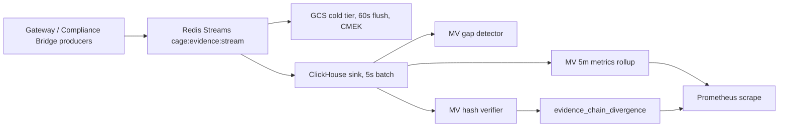

# ClickHouse Evidence Sink — `cage-audit/3.0`

**Status:** Design specification (reference architecture)
**Schema Version:** `cage-audit/3.0`
**DDL Artifact:** [`deployment/clickhouse/evidence_stream_schema.sql`](../../deployment/clickhouse/evidence_stream_schema.sql)
**Source of Truth:** [`src/compliance_bridge/evidence_stream.py`](../../src/compliance_bridge/evidence_stream.py:508)
**Last Updated:** 2026-09-05

> **Reference Architecture Note.** CAGE is an illustrative reference
> architecture, not a deployed production service. The ClickHouse topology,
> retention windows, RBAC role names, and operational runbooks below are
> **illustrative patterns for adopters to adapt**, not operational obligations
> on this repository. Where a choice existed between operational convenience
> and structural clarity, structural clarity won.

---

## Table of Contents

1. [Purpose & Position in the Evidence Pipeline](#1-purpose--position-in-the-evidence-pipeline)
2. [Source Schema Contract (`cage-audit/3.0`)](#2-source-schema-contract-cage-audit30)
3. [Table Schema Design Rationale](#3-table-schema-design-rationale)
4. [Main DDL — `evidence_stream`](#4-main-ddl--evidence_stream)
5. [Hash Chain Verification Algorithm](#5-hash-chain-verification-algorithm)
6. [Materialized Views](#6-materialized-views)
7. [WORM Policy Enforcement](#7-worm-policy-enforcement)
8. [Compliance Bridge Integration](#8-compliance-bridge-integration)
9. [Schema Evolution Policy](#9-schema-evolution-policy)
10. [Compliance Mapping](#10-compliance-mapping)
11. [Operational Procedures](#11-operational-procedures)
12. [Open Questions & Non-Goals](#12-open-questions--non-goals)
13. [References](#13-references)

---

## 1. Purpose & Position in the Evidence Pipeline

Redis Streams (`cage:evidence:stream`) is the **source of truth** for the
hash-chained governance evidence chain. It is a *hot*, bounded store
(`EVIDENCE_STREAM_MAX_LEN=1000000`, ~7 days at production rates). GCS provides
*cold*, immutable, CMEK-encrypted object storage with a 60-second flush.

Neither tier is queryable. Compliance questions such as *"show every
`request_denied` for tier `tier1_reversible_trades` correlated to W3C trace
`00-…-01` in Q3"* currently require rehydrating NDJSON from GCS. ClickHouse
closes that gap as a **queryable, append-only, tamper-evident analytical
mirror**.



**Tier contract:**

| Tier | Store | Role | Retention | Mutability |
|---|---|---|---|---|
| Hot | Redis Streams | Source of truth, chain head, sequence allocation | 7 days (MAXLEN 1M) | Append-only (`XADD` + Lua) |
| Cold | GCS + CMEK | Immutable archival evidence of record | 7 years | Write-once objects |
| Query | ClickHouse | Analytical mirror + tamper detection | 7 years | Append-only (WORM-enforced) |

**Authority rule:** ClickHouse is a **derived mirror**, never an authority. If
ClickHouse and GCS disagree, GCS wins; if GCS and Redis disagree within the
Redis retention window, Redis wins. ClickHouse's job is to *detect and surface*
that disagreement quickly, not to arbitrate it.

**Layer placement:** the sink lives entirely in the compliance bridge
(`src/compliance_bridge/`). No Layer 1 kernel (`src/gateway/`) modification is
required or permitted by this design; the kernel remains unaware that
ClickHouse exists.

---

## 2. Source Schema Contract (`cage-audit/3.0`)

Wire record as written by
[`EvidenceStreamSink`](../../src/compliance_bridge/evidence_stream.py:508):

```json
{
  "schema": "cage-audit/3.0",
  "sequence": "42",
  "event_type": "request_admitted",
  "control_id": "A.5.3",
  "trace_id": "00-<32 hex>-<16 hex>-01",
  "hash_algorithm": "SHA-256",
  "canonicalization": "RFC8785",
  "chain_id": "<uuid-v4>",
  "prev_hash": "<sha256 hex>",
  "record_hash": "<sha256 hex>",
  "payload_json": "<JCS-canonicalized payload bytes>",
  "timestamp_utc": "2026-09-05T15:00:00.000Z",
  "kms_signature": "",
  "kms_signature_algorithm": "KMS_ASYMMETRIC"
}
```

**Link function** ([`_link_hash()`](../../src/compliance_bridge/evidence_stream.py:659)):

```text
header = JCS({
  "canonicalization": "RFC8785",
  "chain_id":         <chain_id>,
  "control_id":       <control_id>,
  "event_type":       <event_type>,
  "hash_algorithm":   "SHA-256",
  "schema":           "cage-audit/3.0",
  "sequence":         <int>,
  "trace_id":         <trace_id>
  // sparse, only when non-null:
  // "classification_reason", "narrowing_applied", "pause_token"
})

record_hash = SHA256( utf8(prev_hash) || header || utf8(payload_json) )
```

RFC 8785 orders object members by the UTF-16 code units of their names, so the
header member order above is exactly the on-wire order — a property the
verification view depends on.

**Consequences that drive the ClickHouse schema:**

1. `control_id`, `hash_algorithm`, and `canonicalization` are **inside the
   hash**. A sink that drops them cannot verify anything, so they are
   first-class columns even though the task brief's minimal column list omits
   them.
2. `payload_json` must be persisted as the **exact canonical bytes** that were
   hashed. Any re-serialization (key reordering, whitespace, Unicode
   re-escaping) silently breaks verification. The `payload` column is therefore
   an opaque `String`, never a ClickHouse `JSON`/`Object` type.
3. The sparse optional header members (`classification_reason`,
   `narrowing_applied`, `pause_token`) change the header bytes when present, so
   they are persisted verbatim and re-emitted in the canonical rebuild.

---

## 3. Table Schema Design Rationale

### 3.1 Engine: plain `MergeTree`

`MergeTree` — explicitly **not** `ReplacingMergeTree`, `CollapsingMergeTree`, or
`VersionedCollapsingMergeTree`.

The deduplicating and collapsing engines are disqualified on evidentiary
grounds, not performance grounds: they make **background merges semantically
destructive**. A `ReplacingMergeTree` keyed on `(chain_id, sequence)` would let
an attacker who obtains `INSERT` (a far weaker privilege than `ALTER`) overwrite
history simply by re-inserting a row with a colliding key and a higher version.
Evidence would then disappear during a merge, asynchronously, with no mutation
in the query log. Under plain `MergeTree`, a forged re-insert is *additive*: both
rows survive, the duplicate is loudly visible to the gap/duplicate detector, and
the tampering attempt becomes evidence in its own right.

This is the single most important schema decision in this document: **an
append-only audit mirror must never run an engine that can silently delete
rows.**

For replicated deployments the engine becomes
`ReplicatedMergeTree('/clickhouse/tables/{shard}/evidence_stream', '{replica}')`,
which preserves the same non-destructive semantics.

### 3.2 Partitioning: `toYYYYMM(timestamp)`

Monthly partitions are the unit of **retention and erasure**. Rationale:

- **Partition-level `DROP` replaces row-level `DELETE`.** GDPR Art. 17 erasure
  and NIST AU-11 expiry are executed as `ALTER TABLE … DROP PARTITION`, a
  metadata operation that never rewrites surviving parts and never touches
  individual rows. Row-level deletion stays permanently forbidden.
- **Cardinality is bounded and predictable.** A 7-year window yields exactly 84
  live partitions — comfortably inside ClickHouse's recommended few-hundred
  ceiling. Daily partitioning would produce ~2,556 partitions and degrade both
  merge scheduling and `system.parts` query planning.
- **TTL granularity matches the compliance clock.** Retention obligations are
  expressed in years; month resolution over-retains by at most 30 days, which
  is the safe direction for an audit log.

### 3.3 Sorting key: `(chain_id, sequence)`

The sorting key is the physical layout, and here it is chosen to make **chain
verification a sequential scan**:

- Every record of a given chain is physically contiguous and in strictly
  ascending sequence order. Verifying an entire chain — the dominant audit
  query — reads one contiguous range with no sort step.
- Gap and linkage detection are expressible as `neighbor()`/window functions
  over data already in the required order, avoiding a global re-sort of billions
  of rows.
- `chain_id` leads because a chain is the atomic unit of integrity. Leading with
  `timestamp` instead would scatter each chain across the whole part and turn
  verification into a random-access workload.

`PRIMARY KEY` is left implicit (equal to `ORDER BY`); the sparse index on
`(chain_id, sequence)` is small because `chain_id` is highly repetitive within
a part.

**Trade-off, stated plainly:** time-range queries are *not* served by the
primary key. That is what `PARTITION BY` (coarse pruning) plus the
`idx_timestamp` minmax skip index (fine pruning) are for. Given the sort order,
`timestamp` is strongly correlated with `sequence` within a chain, so minmax
pruning is unusually effective here.

### 3.4 Column type choices

| Column | Type | Rationale |
|---|---|---|
| `schema_version` | `LowCardinality(String)` | One distinct value per schema generation. Dictionary-encoded to ~1 byte/row. A `CONSTRAINT` pins it to the known-good set. |
| `chain_id` | `UUID` | 16-byte fixed binary vs. 36-byte text; halves the leading sorting-key column and speeds every range scan. Producer emits UUID-v4. |
| `sequence` | `UInt64` | Matches the Redis Lua monotonic allocator. Delta+LZ4 codec compresses a dense ascending run to a few bits per row. |
| `timestamp` | `DateTime64(3, 'UTC')` | Millisecond precision matches the ISO-8601 `.000Z` wire format. Timezone is pinned to UTC in the type so no server-local reinterpretation is possible. |
| `event_type` | `LowCardinality(String)` | Bounded vocabulary (`request_admitted`, `request_denied`, `governance_violation`, `cbf_boundary_active`, …). Dictionary encoding makes `GROUP BY event_type` near-free. |
| `control_id` | `LowCardinality(String)` | Inside the hash; bounded NIST/ISO control vocabulary. |
| `trace_id` | `String` | W3C Trace Context, REQUIRED in v3.0. Deliberately *not* `FixedString`: the sink accepts both the 55-char `traceparent` form and the bare 32-hex trace-id, and must never truncate or pad a value that participates in the hash. |
| `payload` | `String` | **Opaque canonical bytes.** Must be byte-identical to the hashed `payload_json`. Never `JSON`/`Object('json')`, which would reorder keys and destroy verifiability. Query with `JSONExtract*()` at read time. |
| `record_hash` | `FixedString(64)` | SHA-256 lowercase hex, always exactly 64 bytes. Fixed width removes the per-value length prefix and enables constant-time comparison. |
| `prev_hash` | `Nullable(FixedString(64))` | `NULL` **only** for the genesis record of a chain; a `CONSTRAINT` enforces that `sequence = 0 ⇔ prev_hash IS NULL`. |
| `kms_signature` | `Nullable(String)` | Variable-length base64, populated asynchronously by `AsyncBatchSigner`. `NULL` when `EVIDENCE_STREAM_KMS_SIGN=false`. |
| `hash_algorithm`, `canonicalization` | `LowCardinality(String)` | Inside the hash; required for verification and future algorithm agility. |
| `classification_reason`, `narrowing_applied`, `pause_token` | `Nullable(String)` | Sparse header members; presence changes the canonical header bytes, so they must round-trip verbatim. |
| `ingested_at` | `DateTime64(3, 'UTC')` `DEFAULT now64(3)` | Sink-side arrival time. **Not** part of the hash — it is deliberately excluded from every canonical rebuild. Powers ingestion-lag SLOs and late-arrival forensics. |
| `redis_msg_id` | `String` | Redis Stream `XADD` id (`<ms>-<seq>`). The idempotency/reconciliation handle between Redis and ClickHouse after a sink retry. |

### 3.5 Skip indexes

| Index | Type | Purpose |
|---|---|---|
| `idx_trace_id` | `bloom_filter(0.01)` | W3C trace correlation. High-cardinality equality lookups (`trace_id = …`) are the primary incident-response access path and are orthogonal to the sorting key, so a 1% false-positive Bloom filter over granules is the correct structure. |
| `idx_event_type` | `set(0)` | Unlimited-cardinality set per granule; because `event_type` is `LowCardinality` and heavily repeated, `set(0)` prunes granules for `event_type IN (…)` at negligible storage cost. |
| `idx_timestamp` | `minmax` | Fine-grained time pruning *inside* a monthly partition. Highly effective because `timestamp` is near-monotonic within a `(chain_id, sequence)` run. |
| `idx_record_hash` | `bloom_filter(0.01)` | Not in the original brief, but required in practice: "does this hash exist in the archive?" is the canonical third-party evidence-verification question, and without it that query is a full scan. |

Every skip index uses `GRANULARITY 1` (one index granule per 8,192-row data
granule) — the finest available pruning, appropriate for a table that is
overwhelmingly read by narrow forensic filters rather than wide analytics.

### 3.6 TTL

```sql
TTL toDateTime(timestamp) + INTERVAL 7 YEAR DELETE
SETTINGS ttl_only_drop_parts = 1
```

`ttl_only_drop_parts = 1` is the load-bearing setting. Without it, ClickHouse
enforces TTL by **rewriting parts row-by-row**, which is precisely the
row-level mutation this design forbids. With it, a part is dropped only when
*every* row in it has expired — turning retention into whole-part deletion and
preserving the WORM property. Seven years is the financial-services baseline
for NIST SP 800-53 AU-11 and satisfies MiFID II Art. 25 (5 yr) and SOX (7 yr)
simultaneously.

---

## 4. Main DDL — `evidence_stream`

The authoritative, copy-ready DDL lives in
[`deployment/clickhouse/evidence_stream_schema.sql`](../../deployment/clickhouse/evidence_stream_schema.sql).
Reproduced here as the normative reference:

```sql
CREATE DATABASE IF NOT EXISTS cage_evidence;

CREATE TABLE IF NOT EXISTS cage_evidence.evidence_stream
(
    -- ---- Schema identity -------------------------------------------------
    schema_version        LowCardinality(String),
    chain_id              UUID,
    sequence              UInt64 CODEC(Delta(8), LZ4),
    timestamp             DateTime64(3, 'UTC') CODEC(Delta, ZSTD(1)),

    -- ---- Event identity (all inside the hash) ----------------------------
    event_type            LowCardinality(String),
    control_id            LowCardinality(String),
    trace_id              String CODEC(ZSTD(1)),
    hash_algorithm        LowCardinality(String) DEFAULT 'SHA-256',
    canonicalization      LowCardinality(String) DEFAULT 'RFC8785',

    -- ---- Payload (opaque canonical bytes, never re-serialized) -----------
    payload               String CODEC(ZSTD(3)),

    -- ---- Sparse v1.1 header members (inside the hash when present) -------
    classification_reason Nullable(String) CODEC(ZSTD(1)),
    narrowing_applied     Nullable(String) CODEC(ZSTD(1)),
    pause_token           Nullable(String) CODEC(ZSTD(1)),

    -- ---- Chain integrity -------------------------------------------------
    record_hash           FixedString(64) CODEC(NONE),
    prev_hash             Nullable(FixedString(64)) CODEC(NONE),
    kms_signature         Nullable(String) CODEC(ZSTD(1)),
    kms_signature_algorithm LowCardinality(Nullable(String)),

    -- ---- Sink provenance (NOT hashed) ------------------------------------
    ingested_at           DateTime64(3, 'UTC') DEFAULT now64(3) CODEC(Delta, ZSTD(1)),
    redis_msg_id          String CODEC(ZSTD(1)),

    -- ---- Skip indexes ----------------------------------------------------
    INDEX idx_trace_id    trace_id    TYPE bloom_filter(0.01) GRANULARITY 1,
    INDEX idx_event_type  event_type  TYPE set(0)             GRANULARITY 1,
    INDEX idx_timestamp   timestamp   TYPE minmax             GRANULARITY 1,
    INDEX idx_record_hash record_hash TYPE bloom_filter(0.01) GRANULARITY 1,

    -- ---- Structural invariants (checked at INSERT) -----------------------
    CONSTRAINT chk_schema_version CHECK schema_version IN ('3.0'),
    CONSTRAINT chk_hash_algorithm CHECK hash_algorithm = 'SHA-256',
    CONSTRAINT chk_canonicalization CHECK canonicalization = 'RFC8785',
    CONSTRAINT chk_trace_id_present CHECK length(trace_id) > 0,
    CONSTRAINT chk_record_hash_hex  CHECK match(record_hash, '^[0-9a-f]{64}$'),
    CONSTRAINT chk_genesis_prev_hash CHECK (sequence = 0) = (prev_hash IS NULL)
)
ENGINE = MergeTree
PARTITION BY toYYYYMM(timestamp)
ORDER BY (chain_id, sequence)
TTL toDateTime(timestamp) + INTERVAL 7 YEAR DELETE
SETTINGS
    index_granularity = 8192,
    ttl_only_drop_parts = 1,
    min_bytes_for_wide_part = 0;
```

**Note on `CONSTRAINT`:** ClickHouse evaluates constraints on `INSERT` and
rejects the offending block. `chk_trace_id_present` is the schema-level
enforcement of the v3.0 breaking change that made `trace_id` mandatory — a
pre-v3.0 record physically cannot enter the table.

**Note on `CODEC(NONE)` for hashes:** SHA-256 output is
information-theoretically incompressible. Attempting to compress it wastes CPU
on both write and read paths for a guaranteed ~0% gain.

---

## 5. Hash Chain Verification Algorithm

### 5.1 The honest constraint

A materialized view is a **trigger on an inserted block**. It sees only the rows
in that block, never the table's prior contents. Any design that claims a single
MV can "recompute the running hash chain" is wrong: the predecessor of the first
row in a block is, in general, not in the block.

Equally, RFC 8785 JCS is a *byte-exact* specification. ClickHouse's
`toJSONString()` implements RFC 8259 escaping, which coincides with JCS for the
overwhelming majority of real values but is **not guaranteed byte-identical**
for control characters, lone surrogates, or exotic Unicode. A verifier that
silently assumes equivalence would manufacture false tamper alerts.

This design therefore uses **three tiers of decreasing coverage and increasing
authority**, and never lets a lower tier's limitation masquerade as certainty.

| Tier | Mechanism | Latency | Coverage | Authority |
|---|---|---|---|---|
| T1 — Linkage | MV `mv_evidence_chain_gaps` + `neighbor()` scan | Insert-time / seconds | Sequence gaps, duplicates, broken `prev_hash → record_hash` links | **Conclusive for structural breaks** |
| T2 — Recomputation | MV `mv_evidence_hash_verification` | Insert-time | Byte-level forgery of `payload`, `event_type`, `trace_id`, `control_id`, `sequence` | **Conclusive only for `escape_safe = 1` rows** |
| T3 — Authoritative | Python re-verification via `verify_record()` | Scheduled / on-alert | Everything, byte-exact JCS | **Final arbiter** |

**Rule: T1 and T2 raise suspicion; only T3 declares tampering.** Every row
written to `evidence_chain_divergence` carries a `verdict` that starts at
`SUSPECTED` and is promoted to `CONFIRMED` or `CLEARED` by T3.

### 5.2 T1 — Structural linkage (conclusive, cheap)

Because `ORDER BY (chain_id, sequence)` guarantees physical ordering,
predecessor lookup is a `neighbor()` call, not a join:

```sql
SELECT
    chain_id,
    sequence,
    record_hash,
    prev_hash,
    neighbor(sequence,    -1) AS prior_sequence,
    neighbor(record_hash, -1) AS prior_record_hash,
    multiIf(
        sequence = 0 AND prev_hash IS NULL,                  'GENESIS_OK',
        neighbor(chain_id, -1) != chain_id,                  'CHAIN_BOUNDARY',
        sequence != prior_sequence + 1,                      'SEQUENCE_GAP',
        prev_hash != prior_record_hash,                      'BROKEN_LINK',
                                                             'OK'
    ) AS linkage_status
FROM cage_evidence.evidence_stream
WHERE chain_id = {chain:UUID}
ORDER BY chain_id, sequence
SETTINGS max_threads = 1;   -- neighbor() requires single-threaded ordering
```

`SEQUENCE_GAP` and `BROKEN_LINK` are **conclusive**: they require no knowledge
of JCS. Deleting a record from the middle of a chain, reordering records, or
substituting a record with a different hash all produce one of these two
statuses. This tier alone detects every *structural* attack, which is the class
of attack a storage-layer adversary can actually mount.

`max_threads = 1` is mandatory — `neighbor()` operates within a block on a
single thread and produces nondeterministic results under parallel execution.

### 5.3 T2 — Canonical rebuild and recomputation

The header is rebuilt in ClickHouse in exact RFC 8785 member order (UTF-16 code
unit sort of the member names), with sparse members appended only when present:

```sql
-- Canonical header reconstruction, RFC 8785 member ordering:
--   canonicalization < chain_id < classification_reason < control_id <
--   event_type < hash_algorithm < narrowing_applied < pause_token <
--   schema < sequence < trace_id
concat(
    '{',
      '"canonicalization":', toJSONString(canonicalization), ',',
      '"chain_id":',         toJSONString(toString(chain_id)), ',',
      if(classification_reason IS NULL, '',
         concat('"classification_reason":', toJSONString(assumeNotNull(classification_reason)), ',')),
      '"control_id":',       toJSONString(control_id), ',',
      '"event_type":',       toJSONString(event_type), ',',
      '"hash_algorithm":',   toJSONString(hash_algorithm), ',',
      if(narrowing_applied IS NULL, '',
         concat('"narrowing_applied":', assumeNotNull(narrowing_applied), ',')),
      if(pause_token IS NULL, '',
         concat('"pause_token":', toJSONString(assumeNotNull(pause_token)), ',')),
      '"schema":',           toJSONString(concat('cage-audit/', schema_version)), ',',
      '"sequence":',         toString(sequence), ',',
      '"trace_id":',         toJSONString(trace_id),
    '}'
) AS canonical_header
```

`narrowing_applied` is inserted **raw** rather than through `toJSONString()`
because it is itself a JCS-canonicalized JSON object, not a string scalar;
wrapping it would double-encode and guarantee a false mismatch.

Recomputation then mirrors
[`_link_hash()`](../../src/compliance_bridge/evidence_stream.py:659) exactly:

```sql
lower(hex(SHA256(
    concat(ifNull(prev_hash, ''), canonical_header, payload)
))) AS computed_hash
```

**The escape-safety gate.** Before a mismatch is allowed to mean anything, the
row must be proven to lie in the region where RFC 8259 and RFC 8785 escaping
provably coincide:

```sql
NOT match(
    concat(control_id, event_type, trace_id, ifNull(classification_reason, ''), payload),
    '[\\x00-\\x1F\\x7F]|\\\\u'
) AS escape_safe
```

- `escape_safe = 1` **and** `computed_hash != record_hash` → real divergence,
  emitted as `SUSPECTED / HASH_MISMATCH`.
- `escape_safe = 0` → the row is emitted as `UNVERIFIABLE_ENCODING` and routed
  directly to T3. It is **never** reported as tampering.

This gate is the difference between a verifier that operators trust and one
they learn to ignore.

### 5.4 T3 — Authoritative Python re-verification

T3 re-verifies a candidate set using the *same code path that produced the
hash*, eliminating all reimplementation risk:

1. Read the candidate rows from `evidence_chain_divergence` where
   `verdict = 'SUSPECTED'`.
2. Fetch the corresponding canonical records from GCS cold storage (the
   immutable tier), **not** from ClickHouse — comparing ClickHouse against
   itself proves nothing.
3. Call [`verify_record()`](../../src/compliance_bridge/evidence_stream.py:728)
   for each.
4. Insert a new row with `verdict = 'CONFIRMED'` or `'CLEARED'`.

Because `evidence_chain_divergence` is itself append-only, verdict promotion is
an **insert of a later row**, never an update. The current verdict is the
`argMax(verdict, detected_at)` per `(chain_id, sequence, divergence_type)`.
The divergence table thus preserves its own complete audit trail — including
the record of a verifier that got it wrong.

### 5.5 Threat coverage

| Attack | Detected by | Conclusive? |
|---|---|---|
| Delete a mid-chain row | T1 `SEQUENCE_GAP` | Yes |
| Delete the chain tail | T1 gap vs. Redis/GCS head reconciliation | Yes (needs cross-tier head compare) |
| Reorder rows | T1 `BROKEN_LINK` | Yes |
| Alter `payload` bytes | T2 `HASH_MISMATCH` | Yes, when `escape_safe = 1` |
| Alter `event_type` / `trace_id` / `control_id` | T2 `HASH_MISMATCH` | Yes, when `escape_safe = 1` |
| Re-insert a colliding `(chain_id, sequence)` | T1 duplicate detection | Yes — and plain `MergeTree` keeps both rows as evidence |
| Rewrite an entire chain with recomputed hashes | Cross-tier hash-root comparison against GCS/Redis + KMS signature | Only with T3 + KMS; **this is why `kms_signature` exists** |

The last row is the design's stated limit: a self-consistent full-chain rewrite
is undetectable from *within* ClickHouse alone. Detection requires an
out-of-band anchor — the asymmetric KMS signature and the independent GCS copy.
ClickHouse's role is to make that comparison cheap, not to replace it.

---

## 6. Materialized Views

All three views follow the ClickHouse idiom of an **explicit target table**
(`TO <table>`) rather than an implicit `.inner.*` table. Explicit targets are
non-negotiable here: they can be granted, backed up, and queried under their own
RBAC identity, and the MV can be dropped and recreated during a schema migration
without destroying accumulated state.

### 6.1 View 1 — Chain sequence gap detector (`mv_evidence_chain_gaps`)

**Target table** — an aggregating rollup keyed by chain and hour:

```sql
CREATE TABLE IF NOT EXISTS cage_evidence.evidence_chain_gaps
(
    chain_id          UUID,
    bucket_hour       DateTime('UTC'),
    seq_min           AggregateFunction(min, UInt64),
    seq_max           AggregateFunction(max, UInt64),
    record_count      AggregateFunction(count, UInt64),
    distinct_seq      AggregateFunction(uniqExact, UInt64),
    observed_sequences AggregateFunction(groupArray, UInt64),
    first_seen        AggregateFunction(min, DateTime64(3, 'UTC')),
    last_seen         AggregateFunction(max, DateTime64(3, 'UTC'))
)
ENGINE = AggregatingMergeTree
PARTITION BY toYYYYMM(bucket_hour)
ORDER BY (chain_id, bucket_hour)
TTL bucket_hour + INTERVAL 7 YEAR DELETE
SETTINGS ttl_only_drop_parts = 1;
```

**The view:**

```sql
CREATE MATERIALIZED VIEW IF NOT EXISTS cage_evidence.mv_evidence_chain_gaps
TO cage_evidence.evidence_chain_gaps
AS
SELECT
    chain_id,
    toStartOfHour(timestamp)      AS bucket_hour,
    minState(sequence)            AS seq_min,
    maxState(sequence)            AS seq_max,
    countState()                  AS record_count,
    uniqExactState(sequence)      AS distinct_seq,
    groupArrayState(sequence)     AS observed_sequences,
    minState(timestamp)           AS first_seen,
    maxState(timestamp)           AS last_seen
FROM cage_evidence.evidence_stream
GROUP BY chain_id, bucket_hour;
```

`AggregatingMergeTree` is safe here — and *not* a contradiction of §3.1 —
because this table holds **derived aggregates**, not evidence. Merging partial
aggregate states is the engine's designed behaviour and destroys no facts. The
`MergeTree`-only rule applies to the evidence table itself.

**Detection query.** The invariant is arithmetic and needs no window function:
for a contiguous half-open run, `count == max − min + 1`.

```sql
CREATE VIEW IF NOT EXISTS cage_evidence.v_chain_gap_alerts AS
SELECT
    chain_id,
    bucket_hour,
    minMerge(seq_min)                       AS seq_min,
    maxMerge(seq_max)                       AS seq_max,
    countMerge(record_count)                AS records,
    uniqExactMerge(distinct_seq)            AS distinct_sequences,
    (seq_max - seq_min + 1) - distinct_sequences AS missing_count,
    records - distinct_sequences            AS duplicate_count,
    arraySort(groupArrayMerge(observed_sequences)) AS sequences,
    -- Explicit list of absent sequence numbers (bounded to avoid blowup)
    if(missing_count BETWEEN 1 AND 1000,
       arrayFilter(s -> NOT has(sequences, s), range(seq_min, seq_max + 1)),
       []) AS missing_sequences,
    minMerge(first_seen)                    AS first_seen,
    maxMerge(last_seen)                     AS last_seen
FROM cage_evidence.evidence_chain_gaps
GROUP BY chain_id, bucket_hour
HAVING missing_count > 0 OR duplicate_count > 0;
```

Two distinct alarms fall out of one aggregate:

- `missing_count > 0` → records were **deleted or never arrived**.
- `duplicate_count > 0` → the same `(chain_id, sequence)` was inserted twice,
  i.e. a **forged re-insert** or a sink retry that broke idempotency. Under
  plain `MergeTree` both rows survive and are visible; under
  `ReplacingMergeTree` this signal would have been silently merged away.

**Known bounded false positive:** hourly bucketing splits a chain that spans an
hour boundary, so the last sequence of hour *N* and the first of hour *N+1* are
in different buckets. Both buckets remain internally contiguous, so no alert
fires from the split itself. A genuine gap *exactly at* the boundary is instead
caught by the T1 `neighbor()` linkage scan (§5.2), which is boundary-agnostic.
The two mechanisms are complementary by construction: the MV gives cheap
always-on coverage, the scan gives exact coverage on demand.

### 6.2 View 2 — Hash chain integrity validator (`mv_evidence_hash_verification`)

**Target table** — append-only divergence ledger:

```sql
CREATE TABLE IF NOT EXISTS cage_evidence.evidence_chain_divergence
(
    detected_at      DateTime64(3, 'UTC') DEFAULT now64(3),
    chain_id         UUID,
    sequence         UInt64,
    timestamp        DateTime64(3, 'UTC'),
    event_type       LowCardinality(String),
    trace_id         String,

    divergence_type  Enum8(
        'HASH_MISMATCH'          = 1,
        'SEQUENCE_GAP'           = 2,
        'BROKEN_LINK'            = 3,
        'GENESIS_VIOLATION'      = 4,
        'DUPLICATE_SEQUENCE'     = 5,
        'UNVERIFIABLE_ENCODING'  = 6,
        'SCHEMA_VIOLATION'       = 7
    ),

    -- SUSPECTED is machine-generated; CONFIRMED/CLEARED are written by the
    -- authoritative T3 Python verifier. Verdicts are appended, never updated.
    verdict          Enum8('SUSPECTED' = 1, 'CONFIRMED' = 2, 'CLEARED' = 3)
                     DEFAULT 'SUSPECTED',
    verified_by      LowCardinality(String) DEFAULT 'clickhouse_mv',

    stored_hash      FixedString(64),
    computed_hash    Nullable(FixedString(64)),
    prev_hash        Nullable(FixedString(64)),
    escape_safe      UInt8,
    detail           String DEFAULT ''
)
ENGINE = MergeTree
PARTITION BY toYYYYMM(detected_at)
ORDER BY (chain_id, sequence, detected_at)
TTL toDateTime(detected_at) + INTERVAL 7 YEAR DELETE
SETTINGS ttl_only_drop_parts = 1;
```

The divergence table is `MergeTree` for the same reason the evidence table is:
a tamper *alert* is itself evidence, and an engine that can merge alerts away is
an engine that can be used to hide an attack.

**The view** (materializes only anomalies — the healthy path writes nothing):

```sql
CREATE MATERIALIZED VIEW IF NOT EXISTS cage_evidence.mv_evidence_hash_verification
TO cage_evidence.evidence_chain_divergence
AS
WITH
    concat(
        '{',
          '"canonicalization":', toJSONString(canonicalization), ',',
          '"chain_id":',         toJSONString(toString(chain_id)), ',',
          if(classification_reason IS NULL, '',
             concat('"classification_reason":', toJSONString(assumeNotNull(classification_reason)), ',')),
          '"control_id":',       toJSONString(control_id), ',',
          '"event_type":',       toJSONString(event_type), ',',
          '"hash_algorithm":',   toJSONString(hash_algorithm), ',',
          if(narrowing_applied IS NULL, '',
             concat('"narrowing_applied":', assumeNotNull(narrowing_applied), ',')),
          if(pause_token IS NULL, '',
             concat('"pause_token":', toJSONString(assumeNotNull(pause_token)), ',')),
          '"schema":',           toJSONString(concat('cage-audit/', schema_version)), ',',
          '"sequence":',         toString(sequence), ',',
          '"trace_id":',         toJSONString(trace_id),
        '}'
    ) AS canonical_header,

    lower(hex(SHA256(concat(ifNull(prev_hash, ''), canonical_header, payload)))) AS computed,

    NOT match(
        concat(control_id, event_type, trace_id, ifNull(classification_reason, ''), payload),
        '[\\x00-\\x1F\\x7F]|\\\\u'
    ) AS is_escape_safe
SELECT
    now64(3)                                       AS detected_at,
    chain_id,
    sequence,
    timestamp,
    event_type,
    trace_id,
    multiIf(
        (sequence = 0) != (prev_hash IS NULL), 'GENESIS_VIOLATION',
        NOT is_escape_safe,                    'UNVERIFIABLE_ENCODING',
                                               'HASH_MISMATCH'
    )                                              AS divergence_type,
    'SUSPECTED'                                    AS verdict,
    'clickhouse_mv'                                AS verified_by,
    record_hash                                    AS stored_hash,
    toFixedString(computed, 64)                    AS computed_hash,
    prev_hash,
    toUInt8(is_escape_safe)                        AS escape_safe,
    concat('mv recompute; escape_safe=', toString(is_escape_safe)) AS detail
FROM cage_evidence.evidence_stream
WHERE
       computed != lower(hex(record_hash))
    OR NOT is_escape_safe
    OR (sequence = 0) != (prev_hash IS NULL);
```

**Current verdict** for any suspected record (append-only verdict promotion):

```sql
CREATE VIEW IF NOT EXISTS cage_evidence.v_divergence_current AS
SELECT
    chain_id,
    sequence,
    divergence_type,
    argMax(verdict,     detected_at) AS current_verdict,
    argMax(verified_by, detected_at) AS current_verifier,
    max(detected_at)                 AS last_evaluated_at,
    any(stored_hash)                 AS stored_hash,
    anyLast(computed_hash)           AS computed_hash
FROM cage_evidence.evidence_chain_divergence
GROUP BY chain_id, sequence, divergence_type;
```

Operators page on `current_verdict = 'CONFIRMED'`. `SUSPECTED` rows older than
the T3 verification SLO are themselves an alert — a verifier that has stopped
running is a control that has stopped working.

### 6.3 View 3 — Prometheus metrics aggregator (`mv_evidence_metrics`)

**Target table** — 5-minute rollup:

```sql
CREATE TABLE IF NOT EXISTS cage_evidence.evidence_metrics_5m
(
    bucket_5m        DateTime('UTC'),
    chain_id         UUID,
    event_type       LowCardinality(String),
    control_id       LowCardinality(String),
    schema_version   LowCardinality(String),
    event_count      AggregateFunction(count, UInt64),
    distinct_traces  AggregateFunction(uniq, String),
    max_sequence     AggregateFunction(max, UInt64),
    signed_count     AggregateFunction(sum, UInt64),
    ingest_lag_ms_p99 AggregateFunction(quantile(0.99), Int64)
)
ENGINE = AggregatingMergeTree
PARTITION BY toYYYYMM(bucket_5m)
ORDER BY (bucket_5m, chain_id, event_type, control_id, schema_version)
TTL bucket_5m + INTERVAL 2 YEAR DELETE
SETTINGS ttl_only_drop_parts = 1;
```

Metrics carry a **2-year** TTL, not 7. They are operational telemetry derived
from evidence, not evidence itself; conflating the two would inflate the
compliance-retention surface for no regulatory benefit.

**The view:**

```sql
CREATE MATERIALIZED VIEW IF NOT EXISTS cage_evidence.mv_evidence_metrics
TO cage_evidence.evidence_metrics_5m
AS
SELECT
    toStartOfFiveMinutes(timestamp) AS bucket_5m,
    chain_id,
    event_type,
    control_id,
    schema_version,
    countState()                    AS event_count,
    uniqState(trace_id)             AS distinct_traces,
    maxState(sequence)              AS max_sequence,
    sumState(toUInt64(kms_signature IS NOT NULL)) AS signed_count,
    quantileState(0.99)(dateDiff('millisecond', timestamp, ingested_at)) AS ingest_lag_ms_p99
FROM cage_evidence.evidence_stream
GROUP BY bucket_5m, chain_id, event_type, control_id, schema_version;
```

**Prometheus exposition.** ClickHouse's built-in `/metrics` endpoint exposes
*server* internals only; it cannot export table-derived series. The correct
mechanism is a `prometheus` handler bound to parameterised queries in
`config.xml`, scraped by the existing `ServiceMonitor` pattern used elsewhere in
CAGE (see
[`deployment/k8s/compliance-bridge-servicemonitor.yaml`](../../deployment/k8s/compliance-bridge-servicemonitor.yaml)):

```xml
<clickhouse>
  <prometheus>
    <endpoint>/metrics</endpoint>
    <port>9363</port>
    <metrics>true</metrics>
    <events>true</events>
    <asynchronous_metrics>true</asynchronous_metrics>
  </prometheus>
</clickhouse>
```

Table-derived series are exposed through views shaped for the
`format=Prometheus` output (`name`, `value`, `labels`, `help`, `type`):

```sql
CREATE VIEW IF NOT EXISTS cage_evidence.v_prometheus_metrics AS
SELECT
    'clickhouse_chain_divergence_total' AS name,
    toFloat64(count())                  AS value,
    map('chain_id', toString(chain_id),
        'divergence_type', toString(divergence_type),
        'verdict', toString(current_verdict)) AS labels,
    'Confirmed or suspected evidence chain divergences' AS help,
    'counter'                           AS type
FROM cage_evidence.v_divergence_current
GROUP BY chain_id, divergence_type, current_verdict

UNION ALL

SELECT
    'clickhouse_evidence_records_total',
    toFloat64(countMerge(event_count)),
    map('chain_id', toString(chain_id),
        'event_type', toString(event_type),
        'control_id', toString(control_id)),
    'Evidence records ingested into ClickHouse',
    'counter'
FROM cage_evidence.evidence_metrics_5m
WHERE bucket_5m >= now() - INTERVAL 1 DAY
GROUP BY chain_id, event_type, control_id

UNION ALL

SELECT
    'clickhouse_evidence_ingest_lag_ms',
    quantileMerge(0.99)(ingest_lag_ms_p99),
    map('chain_id', toString(chain_id)),
    'p99 Redis-to-ClickHouse ingestion lag in milliseconds',
    'gauge'
FROM cage_evidence.evidence_metrics_5m
WHERE bucket_5m >= now() - INTERVAL 15 MINUTE
GROUP BY chain_id;
```

**Cardinality guard.** `chain_id` is a per-chain UUID and therefore an unbounded
Prometheus label. The divergence series is safe because divergences are rare and
each one *must* be individually attributable. The volume series is deliberately
windowed (`INTERVAL 1 DAY`) to bound active label sets. Adopters running many
concurrent chains should drop the `chain_id` label from
`clickhouse_evidence_records_total` and retain it only on divergence and lag
series.

**Recommended alert rules:**

| Alert | Expression | Severity |
|---|---|---|
| `EvidenceChainDivergenceConfirmed` | `clickhouse_chain_divergence_total{verdict="CONFIRMED"} > 0` | critical — page immediately |
| `EvidenceChainDivergenceSuspected` | `clickhouse_chain_divergence_total{verdict="SUSPECTED"} > 0` for 1h | warning — T3 verifier is behind |
| `EvidenceIngestLagHigh` | `clickhouse_evidence_ingest_lag_ms > 60000` for 10m | warning — sink falling behind Redis |
| `EvidenceIngestStalled` | `rate(clickhouse_evidence_records_total[15m]) == 0` while gateway traffic > 0 | critical — sink is down |

---

## 7. WORM Policy Enforcement

### 7.1 Threat model, stated honestly

ClickHouse has **no native WORM/immutable-table mode**. Anyone holding
`ALTER TABLE` or filesystem access to the data directory can modify history.
Therefore WORM here is *defence in depth*, and each layer must be described by
what it actually stops:

| Layer | Mechanism | Stops | Does **not** stop |
|---|---|---|---|
| L1 | RBAC least privilege | Compromised app/reader credentials mutating data | An admin account |
| L2 | Read-only profiles + settings constraints | Privilege escalation via session settings | An admin changing the profile |
| L3 | Row policies | Readers seeing out-of-jurisdiction rows | Anyone with `ALTER … ROW POLICY` |
| L4 | Query-log auditing + alerting | Silent tampering — makes it *loud* | Tampering itself |
| L5 | Cross-tier hash comparison (GCS/Redis) + KMS signatures | **Undetected** tampering, including by an admin | Deletion of the ClickHouse copy |
| L6 | Object-storage immutability (bucket lock) on backups | Destruction of the archival copy | — |

**The design's central admission: L1–L4 make tampering detectable and
attributable; only L5 makes it *provable*.** That is why ClickHouse is never the
authority (§1) and why `kms_signature` is carried through to the mirror.

### 7.2 L1 — RBAC roles

```sql
-- ---------------------------------------------------------------------------
-- Roles. Least privilege; no role holds both write and mutate.
-- ---------------------------------------------------------------------------
CREATE ROLE IF NOT EXISTS evidence_writer;
CREATE ROLE IF NOT EXISTS evidence_reader;
CREATE ROLE IF NOT EXISTS evidence_verifier;
CREATE ROLE IF NOT EXISTS evidence_admin;

-- --- evidence_writer: INSERT only. The compliance-bridge sink identity. -----
GRANT INSERT ON cage_evidence.evidence_stream          TO evidence_writer;
GRANT INSERT ON cage_evidence.evidence_chain_divergence TO evidence_writer;
-- Deliberately NOT granted: SELECT, ALTER, DROP, TRUNCATE, OPTIMIZE.
-- A writer that cannot read cannot exfiltrate the audit trail, and cannot
-- discover which records exist in order to forge a convincing overwrite.

-- --- evidence_reader: SELECT only, and not on raw payloads by default. ------
GRANT SELECT ON cage_evidence.evidence_stream           TO evidence_reader;
GRANT SELECT ON cage_evidence.evidence_chain_gaps       TO evidence_reader;
GRANT SELECT ON cage_evidence.evidence_chain_divergence TO evidence_reader;
GRANT SELECT ON cage_evidence.evidence_metrics_5m       TO evidence_reader;
GRANT SELECT ON cage_evidence.v_chain_gap_alerts        TO evidence_reader;
GRANT SELECT ON cage_evidence.v_divergence_current      TO evidence_reader;

-- --- evidence_verifier: the T3 Python verifier. Reads all, appends verdicts.
GRANT SELECT ON cage_evidence.evidence_stream           TO evidence_verifier;
GRANT SELECT ON cage_evidence.evidence_chain_divergence TO evidence_verifier;
GRANT INSERT ON cage_evidence.evidence_chain_divergence TO evidence_verifier;
-- Verdict promotion is an INSERT of a later row (§5.4), never an UPDATE,
-- so the verifier needs no ALTER privilege whatsoever.

-- --- evidence_admin: schema evolution + retention. NO row mutation. ---------
GRANT SELECT                    ON cage_evidence.*                    TO evidence_admin;
GRANT ALTER ADD COLUMN          ON cage_evidence.evidence_stream      TO evidence_admin;
GRANT ALTER MODIFY COMMENT      ON cage_evidence.evidence_stream      TO evidence_admin;
GRANT ALTER MATERIALIZE INDEX   ON cage_evidence.evidence_stream      TO evidence_admin;
GRANT ALTER DROP PARTITION      ON cage_evidence.evidence_stream      TO evidence_admin;
GRANT CREATE TABLE, CREATE VIEW ON cage_evidence.*                    TO evidence_admin;
-- Critically NOT granted, to anyone, ever:
--   ALTER UPDATE, ALTER DELETE, ALTER DROP COLUMN, ALTER MODIFY COLUMN,
--   TRUNCATE, DROP TABLE, DROP DATABASE.
```

`ALTER DROP PARTITION` is granted to `evidence_admin` alone because it is the
**sole sanctioned erasure primitive** (GDPR Art. 17, AU-11 expiry). It is
coarse, loud, logged, and cannot be used to surgically remove one inconvenient
record without destroying a whole month of unrelated evidence — an attacker
gains nothing subtle from it, while a compliance officer gets exactly the tool
the regulation requires.

Note that ClickHouse grants are **additive only**; there is no `DENY`. The
absence of a grant *is* the denial, which is why the "NOT granted" comments are
normative and must survive future edits.

### 7.3 L2 — Settings profiles and constraints

```sql
CREATE SETTINGS PROFILE IF NOT EXISTS evidence_writer_profile SETTINGS
    readonly                            = 0,
    allow_experimental_lightweight_delete = 0 CONST,
    mutations_sync                      = 0   CONST,
    max_partitions_per_insert_block     = 8,
    async_insert                        = 1,
    wait_for_async_insert               = 1,
    async_insert_busy_timeout_ms        = 5000,
    async_insert_max_data_size          = 10485760,
    max_execution_time                  = 30;

CREATE SETTINGS PROFILE IF NOT EXISTS evidence_reader_profile SETTINGS
    readonly                            = 1 CONST,
    allow_ddl                           = 0 CONST,
    allow_experimental_lightweight_delete = 0 CONST,
    max_execution_time                  = 300,
    max_result_rows                     = 1000000,
    max_memory_usage                    = 8000000000;

CREATE USER IF NOT EXISTS cage_evidence_sink
    IDENTIFIED WITH sha256_password BY {password:String}
    SETTINGS PROFILE evidence_writer_profile
    DEFAULT ROLE evidence_writer;

CREATE USER IF NOT EXISTS cage_evidence_query
    IDENTIFIED WITH sha256_password BY {password:String}
    SETTINGS PROFILE evidence_reader_profile
    DEFAULT ROLE evidence_reader;
```

The `CONST` suffix is what makes this a control rather than a default: it
forbids the session from overriding the setting, so a compromised writer cannot
issue `SET allow_experimental_lightweight_delete = 1` to unlock `DELETE FROM`.
`readonly = 1 CONST` on the reader profile blocks all writes *and* the ability
to relax `readonly` itself.

**Secret hygiene.** Passwords are injected as query parameters from
Kubernetes secrets via `secretKeyRef` — never literals in this file, never in
`users.xml`. In GKE deployments, prefer mTLS certificate identities
(`IDENTIFIED WITH ssl_certificate CN 'cage-compliance-bridge'`) so that no
shared secret exists to leak.

### 7.4 L2b — Server-level configuration

```xml
<clickhouse>
  <!-- Reject silently-lossy LowCardinality misuse on wide types. -->
  <allow_suspicious_low_cardinality_types>0</allow_suspicious_low_cardinality_types>

  <!-- Retention executes as whole-part drops, never row rewrites. -->
  <merge_tree>
    <ttl_only_drop_parts>1</ttl_only_drop_parts>
    <!-- Refuse to drop a large table/partition without an explicit override
         file on disk: turns catastrophic deletion into a deliberate,
         two-person act. -->
    <max_table_size_to_drop>0</max_table_size_to_drop>
    <max_partition_size_to_drop>0</max_partition_size_to_drop>
  </merge_tree>

  <!-- Auditing (L4). -->
  <query_log>
    <database>system</database>
    <table>query_log</table>
    <partition_by>toYYYYMM(event_date)</partition_by>
    <flush_interval_milliseconds>1000</flush_interval_milliseconds>
    <ttl>event_date + INTERVAL 3 YEAR DELETE</ttl>
  </query_log>
  <part_log>
    <database>system</database>
    <table>part_log</table>
    <ttl>event_date + INTERVAL 3 YEAR DELETE</ttl>
  </part_log>
  <session_log>
    <database>system</database>
    <table>session_log</table>
    <ttl>event_date + INTERVAL 3 YEAR DELETE</ttl>
  </session_log>
</clickhouse>
```

`max_table_size_to_drop = 0` and `max_partition_size_to_drop = 0` are the
highest-value lines in this block. They make `DROP TABLE` / `DROP PARTITION`
fail on any non-trivial object unless an operator first creates a flag file on
the server filesystem — converting a one-command catastrophe into a deliberate,
auditable, multi-step action.

### 7.5 L3 — Row policies for jurisdictional isolation

CAGE enforces regional data residency (`US_FED`, `EU_ECB`, `APAC_MAS`). Row
policies keep a reader in one region from reading another region's evidence even
when the deployments share a cluster:

```sql
CREATE ROW POLICY IF NOT EXISTS evidence_region_isolation
    ON cage_evidence.evidence_stream
    FOR SELECT
    USING JSONExtractString(payload, 'deployment_region')
          IN (SELECT region FROM cage_evidence.reader_region_grants
              WHERE role_name = currentRoles()[1])
    TO evidence_reader;
```

Row policies are `SELECT`-side only and therefore cannot weaken the append-only
property; they narrow visibility, never mutability. In the recommended topology
each jurisdiction runs its **own** ClickHouse instance in its own region — the
row policy is a second line of defence, not the primary residency control.

### 7.6 L4 — Mutation auditing and alerting

The prohibited-operation detector:

```sql
CREATE VIEW IF NOT EXISTS cage_evidence.v_worm_violations AS
SELECT
    event_time,
    user,
    address,
    initial_query_id,
    type,
    query_kind,
    query,
    exception
FROM system.query_log
WHERE
    event_time >= now() - INTERVAL 24 HOUR
    AND has(databases, 'cage_evidence')
    AND (
           query_kind IN ('Alter', 'Drop', 'Truncate', 'Rename')
        OR positionCaseInsensitive(query, 'ALTER TABLE') > 0
           AND (positionCaseInsensitive(query, ' DELETE') > 0
             OR positionCaseInsensitive(query, ' UPDATE') > 0)
        OR positionCaseInsensitive(query, 'DELETE FROM') > 0
        OR positionCaseInsensitive(query, 'OPTIMIZE TABLE') > 0
    )
    -- The one sanctioned exception: partition drops performed by the
    -- retention job, which must still be reviewed, never silently ignored.
    AND NOT (user = 'cage_evidence_retention'
             AND positionCaseInsensitive(query, 'DROP PARTITION') > 0);
```

Any row in `v_worm_violations` is a **critical page**, not a dashboard tile. The
view intentionally still surfaces sanctioned retention drops under a separate
query so that erasure actions remain reviewable rather than invisible.

Insert-side auditing correlates every write back to the originating W3C trace,
closing the loop with CAGE's Langfuse telemetry:

```sql
CREATE VIEW IF NOT EXISTS cage_evidence.v_insert_audit AS
SELECT
    event_time,
    user,
    address,
    query_id,
    log_comment      AS trace_context,  -- sink sets this to the batch traceparent
    written_rows,
    written_bytes,
    query_duration_ms,
    exception_code
FROM system.query_log
WHERE type IN ('QueryFinish', 'ExceptionWhileProcessing')
  AND query_kind = 'Insert'
  AND has(tables, 'cage_evidence.evidence_stream');
```

The sink sets `log_comment` to the batch's `traceparent`, so an auditor can
pivot from a governance decision in Langfuse to the exact ClickHouse insert that
persisted its evidence, and back.

**Mutation kill-switch.** Because `ALTER UPDATE`/`ALTER DELETE` are ungranted to
every role, the only principal who can mutate is a cluster admin. That account
should be broken out of normal operations entirely: no interactive use, its
credential held under two-person control, and every session it opens raising an
alert from `system.session_log`.

---

## 8. Compliance Bridge Integration

### 8.1 Placement and layering

The sink is a new module,
`src/compliance_bridge/clickhouse_sink.py`, consumed by
[`evidence_consumer.py`](../../src/compliance_bridge/evidence_consumer.py). This
respects the CAGE three-layer split:

- **Layer 1 (`src/gateway/`) is untouched.** The kernel publishes to the event
  bus and knows nothing about storage tiers. No import boundary
  (Gate G3) is crossed.
- **Layer 3 (integration).** ClickHouse is an external vendor system, so the
  sink is an adapter behind a narrow protocol, following the same shape as other
  CAGE adapters.

```python
class EvidenceSink(Protocol):
    """Secondary, non-authoritative evidence sink."""

    async def write_batch(self, records: list[dict[str, Any]]) -> None: ...
    async def flush(self) -> None: ...
    async def close(self) -> None: ...
```

`EvidenceStreamConsumer` holds a `list[EvidenceSink]`. Adding ClickHouse is
registering one more sink — GCS and ClickHouse remain mutually ignorant, and a
future adopter can add or remove a tier without editing consumer logic.

### 8.2 Batching

| Parameter | Value | Env var |
|---|---|---|
| Batch size | 100 records | `CLICKHOUSE_SINK_BATCH_SIZE` |
| Flush interval | 5 seconds | `CLICKHOUSE_SINK_FLUSH_SECONDS` |
| Max queue depth | 10,000 records | `CLICKHOUSE_SINK_MAX_QUEUE` |
| Insert timeout | 30 seconds | `CLICKHOUSE_SINK_TIMEOUT_S` |

Whichever of size-or-time triggers first wins. The 5-second interval is
deliberately 12× tighter than the 60-second GCS flush: GCS optimises for object
size and cost, ClickHouse for query freshness during incident response.

Inserts use `clickhouse-connect` with `async_insert=1, wait_for_async_insert=1`.
This is a genuine trade-off, resolved toward durability: server-side async
batching gives ClickHouse's preferred large-part write pattern, while
`wait_for_async_insert=1` means the client still learns whether the data reached
disk. Fire-and-forget (`wait_for_async_insert=0`) would be faster and would
silently lose evidence — unacceptable even for a non-authoritative mirror,
because a silently-empty mirror produces *false all-clear* verification results.

### 8.3 Bounded queue and back-pressure

The queue is `asyncio.Queue(maxsize=10_000)` with an **explicit
drop-oldest-and-count** policy on overflow:

```python
try:
    self._queue.put_nowait(record)
except asyncio.QueueFull:
    dropped = self._queue.get_nowait()  # shed the oldest
    self._queue.put_nowait(record)
    CLICKHOUSE_SINK_DROPPED.inc()
    logger.error(
        "[ClickHouseSink] Queue full; dropped record seq=%s chain=%s. "
        "Evidence remains durable in Redis and GCS.",
        dropped.get("sequence"),
        dropped.get("chain_id"),
    )
```

Dropping is loud and counted rather than silent, and the log line states the
recovery path. An unbounded queue would convert a ClickHouse outage into a
compliance-bridge OOM kill — trading a degraded *mirror* for a failed
*source of truth*, which is exactly backwards. Dropped records are recoverable
by backfill from GCS (§11.4).

### 8.4 Failure handling — the sink must never block Redis consumption

This is the single hardest requirement in the integration and is enforced
structurally, not by discipline:

1. `EvidenceStreamConsumer._consume_loop()` only ever calls `put_nowait()`. It
   never awaits ClickHouse.
2. Flushing runs in a **separate** `asyncio.Task` owned by the sink.
3. Every ClickHouse call is wrapped in `except Exception` — the sink's failure
   surface is `None`.
4. A circuit breaker opens after 10 consecutive failures and stays open for 60
   seconds, so a hard outage costs one probe per minute instead of a retry storm.

```python
async def _flush_batch(self, batch: list[dict]) -> None:
    for attempt in range(self._max_retries):  # max_retries = 3
        try:
            await self._client.insert(...)
            CLICKHOUSE_SINK_RECORDS.inc(len(batch))
            self._breaker.record_success()
            return
        except Exception as exc:
            CLICKHOUSE_SINK_ERRORS.labels(error_type=type(exc).__name__).inc()
            if attempt == self._max_retries - 1:
                self._breaker.record_failure()
                logger.error(
                    "[ClickHouseSink] Batch of %d dropped after %d attempts: %s. "
                    "Evidence remains durable in Redis and GCS.",
                    len(batch),
                    self._max_retries,
                    exc,
                )
                return  # never re-raise
            await asyncio.sleep(
                min(0.5 * (2**attempt), 8.0)
                * (0.5 + random.random())  # decorrelated jitter
            )
```

Backoff is 0.5s → 1s → 2s with jitter, because many compliance-bridge replicas
recovering from a shared ClickHouse restart would otherwise synchronise into a
thundering herd.

**Emitted metrics** (registered in
[`src/compliance_bridge/metrics.py`](../../src/compliance_bridge/metrics.py)):

| Metric | Type | Labels | Meaning |
|---|---|---|---|
| `clickhouse_sink_errors_total` | Counter | `error_type` | Insert failures by exception class |
| `clickhouse_sink_records_total` | Counter | — | Records successfully persisted |
| `clickhouse_sink_dropped_total` | Counter | — | Records shed by queue overflow |
| `clickhouse_sink_batch_duration_seconds` | Histogram | — | Insert latency distribution |
| `clickhouse_sink_queue_depth` | Gauge | — | Current backlog |
| `clickhouse_sink_circuit_open` | Gauge | — | 1 when the breaker is open |

### 8.5 Idempotency

Retries can duplicate a batch that actually succeeded before the client timed
out. Duplicates are handled — never prevented by mutation:

- The insert sets `insert_deduplication_token` to
  `f"{chain_id}:{min_seq}-{max_seq}"`. ClickHouse's built-in block deduplication
  then discards an identical replayed block within its dedup window.
- Any duplicate that escapes that window is caught by the
  `duplicate_count > 0` signal in `v_chain_gap_alerts` (§6.1) and reconciled
  offline. It is **never** repaired with `ALTER … DELETE`; the WORM property
  outranks cosmetic cleanliness, and a visible duplicate is more honest than an
  invisible mutation.

### 8.6 Field mapping, Redis wire → ClickHouse column

| Redis field | Column | Transformation |
|---|---|---|
| `schema` (`cage-audit/3.0`) | `schema_version` | Strip the `cage-audit/` prefix → `'3.0'` |
| `chain_id` | `chain_id` | `str` → `UUID` |
| `sequence` (string) | `sequence` | `int()` |
| `timestamp_utc` | `timestamp` | ISO-8601 → `DateTime64(3,'UTC')` |
| `event_type` | `event_type` | verbatim |
| `control_id` | `control_id` | verbatim |
| `trace_id` | `trace_id` | verbatim — **never** normalised or truncated (it is hashed) |
| `payload_json` | `payload` | **verbatim bytes**, no re-serialization |
| `prev_hash` | `prev_hash` | `""` → `NULL` at genesis, else verbatim |
| `record_hash` | `record_hash` | verbatim |
| `kms_signature` | `kms_signature` | `""` → `NULL` |
| `kms_signature_algorithm` | `kms_signature_algorithm` | `""` → `NULL` |
| Redis `XADD` id | `redis_msg_id` | verbatim |
| — | `ingested_at` | server `DEFAULT now64(3)` |

The `payload_json` row is the one that breaks verification if it is ever
"improved". The mapping must move opaque bytes; any `json.loads()`/`json.dumps()`
round-trip in this path is a defect.

### 8.7 PII and residency

Records are already scrubbed by
[`PIIScrubber.scrub()`](../../src/compliance_bridge/pii_scrubber.py) *before*
they enter the evidence stream, so the sink inherits a clean payload and
performs **no** scrubbing of its own — re-scrubbing would alter the hashed bytes
and destroy verifiability. ClickHouse is deployed per-jurisdiction in the same
region as the Redis and GCS tiers (`us-central1`, `europe-west1`,
`asia-southeast1`), mirroring the Langfuse sovereignty model.

---

## 9. Schema Evolution Policy

Append-only data demands append-only schema:

1. **Additive only.** `ALTER TABLE … ADD COLUMN … DEFAULT …` is the sole
   sanctioned change. `DROP COLUMN` and `MODIFY COLUMN` are ungranted to every
   role because both rewrite existing parts — a mutation of historical evidence
   in all but name.
2. **`schema_version` discriminates generations.** v3.0 and a future v4.0
   coexist in one table; the constraint widens to
   `CHECK schema_version IN ('3.0', '4.0')`.
3. **Verification is version-dispatched.** The canonical header rebuild differs
   per generation, so `mv_evidence_hash_verification` must branch on
   `schema_version` before recomputing. A new schema version that changes the
   header ships with its own `WITH` branch **in the same PR** — otherwise every
   new-generation record is instantly reported as `HASH_MISMATCH`.
4. **Migrations are numbered and idempotent.** Every statement in the DDL file
   uses `IF NOT EXISTS`, so the file is safe to re-apply and can be run by an
   init container on every rollout.
5. **Views are replaceable; tables are not.** MVs may be dropped and recreated
   freely because their target tables retain state. Target tables follow the
   same append-only rules as `evidence_stream`.

```sql
-- Illustrative v4.0 additive migration
ALTER TABLE cage_evidence.evidence_stream
    ADD COLUMN IF NOT EXISTS jurisdiction LowCardinality(String) DEFAULT '';

ALTER TABLE cage_evidence.evidence_stream
    DROP CONSTRAINT IF EXISTS chk_schema_version;
ALTER TABLE cage_evidence.evidence_stream
    ADD CONSTRAINT chk_schema_version CHECK schema_version IN ('3.0', '4.0');
```

`ADD COLUMN` with a `DEFAULT` is metadata-only — existing parts are not
rewritten, and historical rows materialise the default at read time. This is why
additive evolution is compatible with WORM while `MODIFY COLUMN` is not.

---

## 10. Compliance Mapping

> Claims below describe what the **design** provides. In line with CAGE's
> documentation standards, they are illustrative control implementations for
> adopters, not assertions about a live accredited system.

### 10.1 NIST SP 800-53 Rev. 5

| Control | Requirement | How this design satisfies it | Residual gap |
|---|---|---|---|
| **AU-9** Protection of Audit Information | Protect audit records from unauthorised access, modification, deletion | RBAC with no `ALTER UPDATE`/`DELETE` grant to any role (§7.2); `readonly=1 CONST` reader profile; plain `MergeTree` cannot silently drop rows (§3.1); `max_table_size_to_drop=0` (§7.4) | A cluster admin can still mutate — mitigated, not eliminated, by §7.6 auditing and §10.4 cross-tier proof |
| **AU-9(2)** Store on Separate System | Back up audit records to a physically different system | ClickHouse is a third independent tier alongside Redis and GCS, on separate storage with independent credentials | — |
| **AU-9(3)** Cryptographic Protection | Cryptographic mechanisms to protect integrity | SHA-256 hash chain persisted and continuously recomputed (§5); optional asymmetric KMS signatures carried in `kms_signature` | Chain verification is only *fully* conclusive with KMS signing enabled (`EVIDENCE_STREAM_KMS_SIGN=true`) |
| **AU-10** Non-repudiation | Irrefutable evidence of who performed an action | `trace_id` + `payload.request_id` + KMS signature bind a decision to an actor and a trace | Requires KMS signing enabled |
| **AU-11** Audit Record Retention | Retain records for the defined period | 7-year TTL executed as whole-partition drops (§3.6); `ttl_only_drop_parts=1` | — |
| **AU-12** Audit Generation | System generates audit records for defined events | `system.query_log` records every access to the evidence store, including reads (§7.6) | — |
| **AU-6** Audit Review, Analysis, Reporting | Review audit records for indications of inappropriate activity | `v_worm_violations` + Prometheus alerting (§6.3, §7.6) | Requires an operator to act on the page |
| **SI-7** Software/Information Integrity | Detect unauthorised changes | Three-tier verification (§5) with explicit conclusiveness boundaries | Self-consistent full-chain rewrite needs the out-of-band anchor (§5.5) |
| **CP-9** System Backup | Back up system-level information | `BACKUP TABLE … TO S3/GCS` with object-lock (§11.3) | — |

### 10.2 ISO/IEC 42001:2023

| Clause | Requirement | Implementation |
|---|---|---|
| **A.5.3** Logging and Monitoring | AI system events are logged and monitored | Every governance decision is persisted with `event_type`, `control_id`, `trace_id`, and queryable within ~5s |
| **A.5.4** Records of AI System Operation | Retain operational records | 7-year retention with tamper detection |
| **A.6.2.8** AI System Recording | Record system behaviour for accountability | Full `payload` retained in canonical form; verifiable after the fact |
| **A.9.2** Monitoring and Review | Ongoing verification of AI controls | The MVs *are* the continuous control-monitoring mechanism; Lula gates can query them directly |

### 10.3 GDPR

| Article | Requirement | Implementation | Honest limitation |
|---|---|---|---|
| **Art. 5(1)(e)** Storage limitation | Keep no longer than necessary | 7-year TTL, automatically enforced | 7 years is justified by overriding financial-services retention law (Art. 17(3)(b)) |
| **Art. 17** Right to erasure | Erase personal data on request | Payloads are PII-scrubbed *before* ingestion, so the store should contain no erasable personal data. Residual risk is handled by partition `DROP` | **Row-level erasure is impossible by design.** If un-scrubbed PII ever reaches the store, the only remedies are dropping the whole month's partition or crypto-shredding the CMEK key. This is a deliberate trade of granular erasure for immutability |
| **Art. 30** Records of processing | Maintain processing records | The store *is* the record: what was processed, when, under which control, correlated by trace | — |
| **Art. 32** Security of processing | Integrity and confidentiality | CMEK at rest, TLS in transit, RBAC, hash-chain integrity | — |
| **Art. 44** Transfers | Restrict cross-border transfer | Per-jurisdiction instances + row policies (§7.5) | — |

**The erasure trade-off, stated plainly:** immutability and granular erasure are
fundamentally in tension. This design chooses immutability and discharges the
erasure obligation *upstream* by never admitting personal data to the store. That
choice only holds if [`PIIScrubber`](../../src/compliance_bridge/pii_scrubber.py)
holds; scrubber coverage is therefore a load-bearing GDPR control, not a
best-effort nicety.

### 10.4 Sector-specific

| Standard | Requirement | Implementation |
|---|---|---|
| **MiFID II Art. 25** | 5-year record retention, readily accessible | 7-year retention exceeds; ClickHouse makes records *queryable*, satisfying "readily accessible" in a way GCS NDJSON does not |
| **SOX §802** | 7-year retention, anti-tampering | 7-year TTL + WORM enforcement |
| **MAS TRM §4.2** | Audit trail integrity, local residency | Hash chain + `asia-southeast1` instance |
| **EU AI Act Art. 12** | Automatic logging over the system lifetime | Automatic event recording with retention beyond the mandated minimum |

---

## 11. Operational Procedures

> Illustrative runbooks for adopters. Substitute your own project, bucket, and
> cluster identifiers.

### 11.1 Deployment

Schema is applied by a Kubernetes **init container** running the DDL file, which
is idempotent (`IF NOT EXISTS` throughout) and therefore safe on every rollout.
Images are built with Cloud Build, never a local Docker daemon, per
[`docs/operations/DEPLOYMENT_RULES.md`](../operations/DEPLOYMENT_RULES.md).

```bash
clickhouse-client \
  --host "${CLICKHOUSE_HOST}" --secure \
  --user "${CLICKHOUSE_ADMIN_USER}" \
  --password "${CLICKHOUSE_ADMIN_PASSWORD}" \
  --multiquery < deployment/clickhouse/evidence_stream_schema.sql
```

Credentials come from Kubernetes `secretKeyRef` only — never `value:`, never a
committed literal.

### 11.2 Health checks

| Check | Query | Healthy |
|---|---|---|
| Ingestion liveness | `SELECT max(ingested_at) FROM cage_evidence.evidence_stream` | within 60s of `now()` |
| Ingestion lag | `SELECT quantile(0.99)(dateDiff('second', timestamp, ingested_at)) FROM cage_evidence.evidence_stream WHERE ingested_at > now() - 300` | < 30s |
| Divergence | `SELECT count() FROM cage_evidence.v_divergence_current WHERE current_verdict = 'CONFIRMED'` | 0 |
| WORM violations | `SELECT count() FROM cage_evidence.v_worm_violations` | 0 |
| Partition count | `SELECT uniq(partition) FROM system.parts WHERE table = 'evidence_stream' AND active` | ≤ 90 |

### 11.3 Backup

```sql
BACKUP TABLE cage_evidence.evidence_stream
TO S3('https://storage.googleapis.com/<bucket>/clickhouse/evidence/{date}', ...)
SETTINGS compression_method = 'zstd', compression_level = 3;
```

Backups land in a bucket with **object retention lock** enabled. Locked object
storage is the only layer in this design that a compromised ClickHouse admin
genuinely cannot defeat, which makes it the true anchor of the WORM claim —
everything above it is detection, this is prevention.

Cadence: weekly full, daily incremental by partition; monthly restore
verification into a scratch instance (an untested backup is a hypothesis, not a
control).

### 11.4 Recovery and backfill

Because ClickHouse is a derived mirror (§1), recovery is **always a replay**,
never a repair:

```text
1. Identify the affected window (partition or chain range).
2. If the whole tier is lost, recreate the schema and replay from GCS NDJSON.
3. If a range is missing, backfill only that range from GCS.
4. If a range is CONFIRMED divergent, do NOT edit it. Drop the affected
   partition and replay from GCS, then record the incident in the divergence
   ledger.
5. Re-run T3 verification across the restored range before declaring recovery.
```

Step 4 is the operationally counter-intuitive one and is deliberate: "fixing"
a divergent row with an `ALTER` would destroy the very evidence that tampering
occurred. Drop-and-replay preserves the incident record.

### 11.5 Retention execution

TTL is automatic, but manual erasure (e.g. an accepted GDPR Art. 17 escalation)
runs under the dedicated `cage_evidence_retention` identity so that §7.6
distinguishes it from an attack:

```sql
-- Requires prior legal sign-off; irreversible; drops a whole month.
ALTER TABLE cage_evidence.evidence_stream DROP PARTITION '202601';
```

With `max_partition_size_to_drop=0` this fails until an operator places the
override flag file on the server — the intended two-person friction.

### 11.6 Chain verification runbook

```sql
-- 1. Scope: which chains are implicated?
SELECT chain_id, count() AS anomalies
FROM cage_evidence.v_divergence_current
WHERE current_verdict != 'CLEARED'
GROUP BY chain_id;

-- 2. Structural scan of one chain (conclusive, §5.2).
SELECT sequence, linkage_status FROM ( /* neighbor() query from §5.2 */ )
WHERE linkage_status != 'OK';

-- 3. Authoritative T3 re-verification against GCS.
--    uv run python -m src.compliance_bridge.verify_chain --chain-id <uuid>

-- 4. Record the verdict (append-only).
INSERT INTO cage_evidence.evidence_chain_divergence
    (chain_id, sequence, divergence_type, verdict, verified_by, stored_hash, escape_safe, detail)
VALUES (...);
```

### 11.7 Testing

| Test | Marker | Asserts |
|---|---|---|
| `test_clickhouse_sink_batching` | `unit` | Size and time triggers both flush |
| `test_clickhouse_sink_never_blocks` | `unit` | Redis consumption continues while the sink raises |
| `test_clickhouse_sink_retry_backoff` | `unit` | 3 attempts, jittered exponential delay, no re-raise |
| `test_clickhouse_queue_overflow_drops_oldest` | `unit` | Bounded queue sheds and counts |
| `test_clickhouse_payload_byte_identity` | `unit` | `payload` round-trips byte-for-byte |
| `test_clickhouse_schema_ddl_idempotent` | `integration` | DDL applies twice cleanly |
| `test_clickhouse_hash_recompute_matches_python` | `integration` | MV `computed_hash` == `_link_hash()` on escape-safe fixtures |
| `test_clickhouse_gap_detection` | `integration` | Removing a sequence raises `missing_count` |
| `test_clickhouse_worm_denies_delete` | `integration` | `evidence_writer` `DELETE`/`ALTER UPDATE` are refused |
| `test_clickhouse_reader_cannot_insert` | `integration` | `evidence_reader` `INSERT` is refused |

Run per AGENTS.md:

```bash
uv run pytest tests/test_clickhouse_sink.py -v
uv run pytest tests/ -m "local or unit" -n auto --dist loadscope --no-cov \
  -p no:langsmith -p no:langsmith_plugin --tb=short
```

---

## 12. Open Questions & Non-Goals

### 12.1 Non-goals

- **ClickHouse is not the source of truth.** It never feeds chain restoration,
  never allocates sequences, and never gates seal issuance. Redis retains all
  three roles.
- **Not a replacement for GCS.** GCS remains the immutable archival tier and the
  independent witness that makes tamper *proof* (as opposed to tamper detection)
  possible.
- **Not in the request hot path.** The sink is asynchronous and best-effort by
  construction; it can never add latency to a governance decision.
- **No row-level erasure.** Permanently out of scope (§10.3).

### 12.2 Open questions

1. **Should the T3 verifier be a CronJob or a bridge daemon?** A CronJob
   isolates failures and is easier to grant a distinct identity; a daemon
   reacts faster. Leaning CronJob for credential separation.
2. **Chain-root anchoring.** Periodically publishing a Merkle root of each
   chain to an external append-only log (or a KMS-signed GCS object) would close
   the full-chain-rewrite gap in §5.5 completely. Recommended follow-on work.
3. **`kms_signature` verification in ClickHouse.** ClickHouse has no asymmetric
   verification primitive, so signature checking stays in T3 Python. Acceptable.
4. **Replication topology.** Single-node per jurisdiction is sufficient for a
   reference architecture; adopters at scale should use `ReplicatedMergeTree`
   with ClickHouse Keeper, which changes no semantics in this document.
5. **Redis retention vs. backfill window.** Redis holds ~7 days; a ClickHouse
   outage longer than that forces GCS-based backfill. Automating that backfill
   is unimplemented follow-on work.

---

## 13. References

### Code
- [`src/compliance_bridge/evidence_stream.py`](../../src/compliance_bridge/evidence_stream.py) — schema, `_link_hash()`, `verify_record()`
- [`src/compliance_bridge/evidence_consumer.py`](../../src/compliance_bridge/evidence_consumer.py) — consumer to extend with the sink
- [`src/compliance_bridge/pii_scrubber.py`](../../src/compliance_bridge/pii_scrubber.py) — upstream PII control
- [`src/compliance_bridge/metrics.py`](../../src/compliance_bridge/metrics.py) — Prometheus registry
- [`deployment/clickhouse/evidence_stream_schema.sql`](../../deployment/clickhouse/evidence_stream_schema.sql) — the DDL artifact

### Architecture
- [`docs/architecture/AUDIT_STREAM_MIGRATION_ANALYSIS.md`](AUDIT_STREAM_MIGRATION_ANALYSIS.md) §13 — storage tier decision
- [`docs/architecture/AUDIT_LOG_SCHEMA.md`](AUDIT_LOG_SCHEMA.md)
- [`docs/BREAKING_CHANGES_v3.md`](../BREAKING_CHANGES_v3.md)
- [`AGENTS.md`](../../AGENTS.md)

### Standards
- RFC 8785 — JSON Canonicalization Scheme
- W3C Trace Context
- NIST SP 800-53 Rev. 5 — AU-6, AU-9, AU-10, AU-11, AU-12, SI-7, CP-9
- ISO/IEC 42001:2023 — A.5.3, A.5.4, A.6.2.8, A.9.2
- GDPR Art. 5, 17, 30, 32, 44; EU AI Act Art. 12; MiFID II Art. 25; SOX §802; MAS TRM §4.2

---

**Document Maintainer:** CAGE Architecture Team
**Last Updated:** 2026-09-05
**Next Review:** Post-v4.0 release
