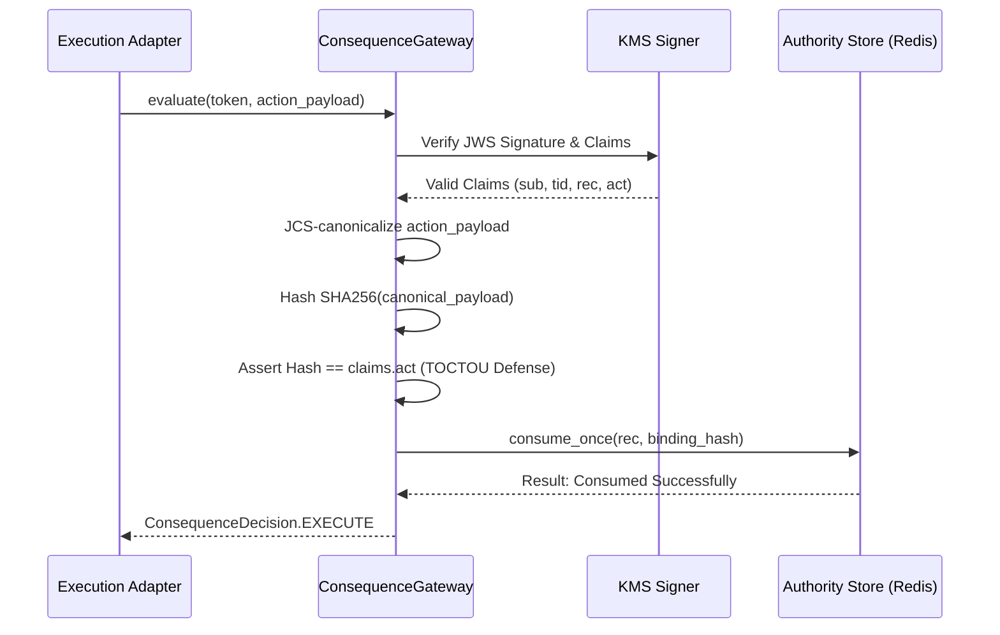

# Consequence Gateway & Token Authority

## 1. Architectural Role & Domain Boundary

The `ConsequenceGateway` acts as the vendor-agnostic post-FRIA (Fundamental Rights Impact Assessment) execution boundary. It bridges the gap between the `SymbolicGovernor`'s abstract policy decisions and the downstream `ExecutionActuator`'s concrete side-effects.

Its primary role is to ensure that no action is executed unless it possesses a valid, unexpired, mathematically bound, and cryptographically signed `ConsequenceToken` (JWS). It enforces exactly-once execution semantics by atomizing authority consumption against a central `ConsequenceAuthorityStore`.

**Trust Boundaries**:
- **Upstream (Governance Layer)**: Trusted to mint `ConsequenceToken`s exclusively upon successful `ALLOW` classifications.
- **Downstream (Actuators)**: Cannot execute side-effects autonomously; they rely entirely on the Gateway's final `EXECUTE` emission.

## 2. Data & Execution Flow

The gateway evaluates requests using a strict 6-step sequence to verify cryptographically-bound execution rights.

### 2.1 Pre-Dispatch Credential Authorization (ALLOW Path)

`ConsequenceDecision.EXECUTE` authorizes the action; it does not yet grant the
outbound identity needed to perform it. On the ALLOW path, the downstream
actuator runs a further set of gates before any envelope is built or any byte
leaves the process. In the reference actuator
[`Actuator01Adapter.actuate()`](../../src/integrations/actuator_01/adapter.py)
these are:

| Gate | Check | Terminal finding on failure |
|---|---|---|
| 1 | `clearance.executor_id` matches `self.actuator_id` | `EXECUTOR_ID_MISMATCH` |
| 2 | `clearance.target_route` matches the client egress base URL (or `*` / `local://default`) | `TARGET_ROUTE_MISMATCH` |
| 3 | **Outbound credential authorization** via the credential broker seam | `CREDENTIAL_BROKER_FAILED` |

Gate 3 is active only when a `CredentialBrokerAdapter` has been injected into the
actuator (constructor argument `credential_broker`). When present, the actuator
calls
[`fetch_credential()`](../../src/gateway/governance/seams/credential_broker.py)
with the agent identity and tool action taken directly from the clearance:

- `agent_svid` ← `clearance.operator_urn`
- `tool_name` ← `clearance.action`
- `scope` ← `None` (the reference actuator does not currently narrow scope)

The returned header mapping is forwarded to
[`ActuatorHttpClient.submit_envelope()`](../../src/integrations/actuator_01/client.py)
as `extra_headers` and merged into the wire headers immediately before the POST.
It is held only in a local variable for the duration of the dispatch — nothing
caches it, and it is never written into the signed envelope, the envelope
digest, or the resulting `ActuationReceipt`.

**Fail-closed:** any exception raised by the broker — including
`CredentialAccessDenied` (SVID not authorized) and `CredentialNotFound` (no
secret for the tool) — aborts the dispatch before envelope construction and
returns `ActuationReceipt(accepted=False, retryable=False, envelope_digest=None)`
carrying a single `TERMINAL` finding with code `CREDENTIAL_BROKER_FAILED`. No
canonical envelope is built, no quorum signature is produced, and no HTTP
request is issued. When no broker is configured the actuator dispatches without
`extra_headers`; the broker is an opt-in hardening seam, not a mandatory gate.

Behaviour is pinned by
[`tests/test_execution_actuator_broker.py`](../../tests/test_execution_actuator_broker.py).

## 3. State Machine & Lifecycle

The lifecycle revolves around the `ConsequenceToken` and its corresponding authority record:

- **Minting**: Upon governance clearance, a short-TTL JWS is minted. It encapsulates the actor (`sub`), thread (`tid`), authority record ID (`rec`), and action digest (`act`).
- **Transit**: The token travels transparently through execution queues alongside the raw action payload.
- **Consumption (Atomic)**: The `ConsequenceAuthorityStore` consumes the record (`rec`) binding it to the unique execution tuple.
- **Rejection States**:
  - `TOKEN_INVALID`: Cryptographic signature failure or TTL expiration.
  - `ACTION_BINDING_MISMATCH`: The hash of the presented payload does not match the signed `act` claim.
  - `ALREADY_CONSUMED`: The token was previously consumed (Replay attempt).
  - `AUTHORITY_RECORD_BINDING_MISMATCH`: The record was consumed by a different payload/thread (Substitution attempt).

## 4. Operational Guarantees & Edge Cases

- **Fail-Closed Evaluation**: Any cryptographic failure, payload mismatch, or Redis connectivity error immediately collapses the decision to `BLOCK`. It never silently defaults to `EXECUTE`.
- **TOCTOU Elimination**: By JCS-canonicalizing the raw runtime payload and re-deriving the SHA-256 hash immediately before consumption, the gateway completely eliminates Time-of-Check to Time-of-Use tampering vectors.
- **Clock Skew Tolerance**: The token verifier permits an `iat` claim up to 5 seconds in the future to mitigate minor NTP drift across distributed Kubernetes nodes.
- **Algorithm Confusion Prevention**: The token verification strictly asserts that the token's header `alg` matches the `KMSGovernanceSigner`'s hardcoded expected algorithm, entirely rejecting `alg: none` attacks.

## 5. Configuration Contracts & Runtime Matrix

- **Storage Backend (Redis)**: The `ConsequenceAuthorityStore` relies on a highly available Redis instance for atomic `SETNX` or LUA-based single-use consumptions.
- **KMS Signer**: Requires an active, reachable Cloud KMS hardware security module (HSM) connection at initialization. If the signer is unreachable or the key is disabled, the service refuses to start.
- **Canonicalization Contract**: Downstream execution payloads must be strictly JSON-serializable to support stable JCS (JSON Canonicalization Scheme, RFC 8785) hashing.

