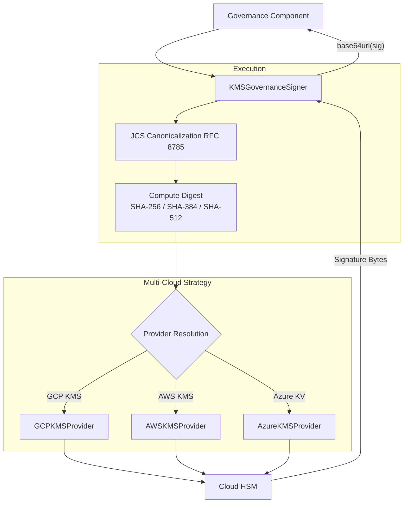

# Cryptographic Signer Engine

**Last Updated:** 2026-09-22

## 1. Architectural Role & Domain Boundary

The `KMSGovernanceSigner` is a core Layer 1 Kernel component that acts as the primary asymmetric signing authority for the CAGE architecture. It abstracts cloud-native Hardware Security Module (HSM) interactions across multi-cloud environments (GCP, AWS, Azure Key Vault). 

Its role is to cryptographically attest to execution plans, consequence tokens, and evidence hashes. It provides a strict `BaseKMSProvider` seam, ensuring the kernel remains vendor-agnostic while supporting advanced multi-party quorum semantics via the `SignerResolver` pattern.

**Trust Boundaries**:
- **Upstream (Governance Components)**: Relies on the signer to guarantee non-repudiation of internal governance decisions.
- **Downstream (Cloud HSMs)**: Assumes the HSM infrastructure is securely provisioned and that key material never leaves the cloud boundary.

## 2. Data & Execution Flow

When a governance decision is made, the execution plan payload is canonicalized and signed via the appropriate cloud HSM.

## 3. State Machine & Lifecycle

The signer lifecycle handles initialization, payload transformation, and multi-party quorum resolution:

- **Initialization & Readiness**: The provider reads environment variables and connects to the HSM. If the KMS key is disabled, non-existent, or network connectivity fails during startup, the `validate_ready()` probe throws an exception, failing the pod's startup sequence.
- **Payload Canonicalization**: Before signing, dict payloads are converted into deterministic byte streams using JCS (JSON Canonicalization Scheme, RFC 8785) to eliminate cross-language serialization drift (e.g., float precision differences).
- **Quorum Resolution (SignerResolver)**: To support multi-party quorum (e.g., in Actuator integrations), the engine implements a `SignerResolver` pattern. Instead of a single static key, a resolver function maps an `operator_urn` to a specific `KMSGovernanceSigner` instance, preventing a compromised pod from forging signatures for all quorum participants simultaneously.

## 4. Operational Guarantees & Edge Cases

- **Fail-Closed on Key Loading (No-Direct-Bind)**: Any failure to initialize the KMS client or resolve the `KMS_GOVERNANCE_KEY` aborts the pod startup. Silent signing failures are prevented at boot.
- **Replay Protection (Timestamp Enforcement)**: Verification procedures enforce a `MAX_KMS_PAYLOAD_AGE_SECONDS` (default: 300s). Signatures generated older than this threshold are rejected.
- **Hash Width Detection**: The provider automatically detects the required hash width (SHA-256, SHA-384, SHA-512) based on the key's algorithm string (e.g., `RSA_SIGN_PKCS1_4096_SHA512`), ensuring strict cryptographic compatibility.
- **Dual-Operator Security Boundaries**: By default, CAGE runs as a reference architecture with a single shared key. For production, the design enforces a "Per-Ceremony OIDC Downscoping" model where short-lived tokens (TTL 30s) are used to temporarily acquire per-operator Workload Identity signing credentials.

## 5. Configuration Contracts & Runtime Matrix

- `KMS_GOVERNANCE_KEY`: The absolute resource name of the cryptographic key version (e.g., `projects/*/locations/*/keyRings/*/cryptoKeys/*/cryptoKeyVersions/*`).
- `KMS_GOVERNANCE_PUBLIC_PEM`: Optional local path to the public key PEM for offline verification optimizations.
- **Provider Resolution**: The correct `BaseKMSProvider` is dynamically selected based on the prefix of `KMS_GOVERNANCE_KEY` (e.g., `projects/` for GCP, `arn:aws:kms:` for AWS).

