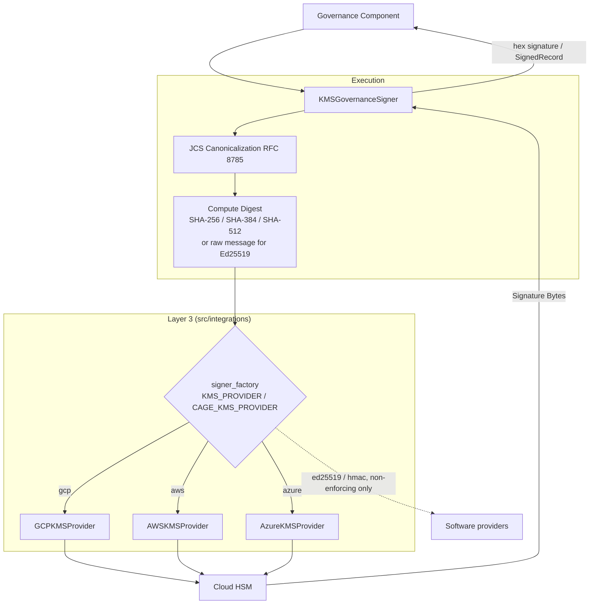

# Cryptographic Signer Engine

**Last Updated:** 2026-09-29

## 1. Architectural Role & Domain Boundary

The `KMSGovernanceSigner` ([`kms_signer.py`](../../src/gateway/governance/kms_signer.py)) is a core Layer 1 Kernel component that acts as the primary asymmetric signing authority for the CAGE architecture. It signs and verifies through a strict `BaseKMSProvider` seam and contains no cloud SDK imports.

The cloud Hardware Security Module (HSM) adapters live in Layer 3 and are loaded lazily by [`signer_factory.py`](../../src/gateway/governance/signer_factory.py) (`get_kms_provider_class()` / `build_kms_provider()`):

| Provider | Module |
|---|---|
| `GCPKMSProvider` | [`src/integrations/gcp/kms_provider.py`](../../src/integrations/gcp/kms_provider.py) |
| `AWSKMSProvider` | [`src/integrations/aws/kms_provider.py`](../../src/integrations/aws/kms_provider.py) |
| `AzureKMSProvider` | [`src/integrations/azure/kms_provider.py`](../../src/integrations/azure/kms_provider.py) |

Two hermetic providers stay in Layer 1 for non-enforcing postures only: `SoftwareEd25519Provider` (asymmetric; exercises the full sign/verify and `kid`-resolved trust-anchor path without network calls) and `SoftwareHMACProvider` (symmetric).

Its role is to cryptographically attest to routing seals, ground-truth snapshots, and compliance evidence batches. Multi-party quorum at the actuation edge is supported separately by the `SignerResolver` pattern in the Layer 3 reference actuator ([`adapter.py`](../../src/integrations/actuator_01/adapter.py)).

**Trust Boundaries**:
- **Upstream (Governance Components)**: Relies on the signer to guarantee non-repudiation of internal governance decisions.
- **Downstream (Cloud HSMs)**: Assumes the HSM infrastructure is securely provisioned and that key material never leaves the cloud boundary.

## 2. Data & Execution Flow

When a governance decision is made, the payload is canonicalized and signed via the configured provider.

```mermaid
flowchart TD
    Client[Governance Component] --> Signer[KMSGovernanceSigner]

    subgraph Execution
        Signer --> JCS[JCS Canonicalization RFC 8785]
        JCS --> Hash[Compute Digest\nSHA-256 / SHA-384 / SHA-512\nor raw message for Ed25519]
    end

    Hash --> Factory{signer_factory\nKMS_PROVIDER / CAGE_KMS_PROVIDER}

    subgraph Layer3["Layer 3 (src/integrations)"]
        Factory -->|gcp| GCP[GCPKMSProvider]
        Factory -->|aws| AWS[AWSKMSProvider]
        Factory -->|azure| Azure[AzureKMSProvider]
    end

    Factory -.->|ed25519 / hmac, non-enforcing only| Soft[Software providers]

    GCP --> Cloud[Cloud HSM]
    AWS --> Cloud
    Azure --> Cloud

    Cloud -- Signature Bytes --> Signer
    Signer -- hex signature / SignedRecord --> Client
```

`sign()` returns a hex-encoded signature. `sign_decision()` returns a `SignedRecord` carrying `payload`, `signature`, `algorithm`, `kid`, and `signed_at`, so verifiers can resolve the key by `kid`.

## 3. State Machine & Lifecycle

The signer lifecycle handles initialization, payload transformation, and verification:

- **Initialization & Readiness**: `KMSGovernanceSigner.from_env()` builds the provider through `build_kms_provider()` and fetches the public key. Under an enforcing posture (anything but DEV/TEST/CI), the startup checks `kms_signing_mode` and `kms_ready` in [`posture.py`](../../src/gateway/governance/governor/posture.py) refuse to start if the signer is inactive or `validate_ready()` fails. If the remote probe fails but a local public key is loaded, `validate_ready()` logs a warning and proceeds in verification-only mode.
- **Payload Canonicalization**: Before signing, dict payloads are converted into deterministic byte streams using JCS (JSON Canonicalization Scheme, RFC 8785) to eliminate cross-language serialization drift (e.g., float precision differences).
- **Kid-Resolved Verification**: `verify_decision()` resolves the public key strictly by `kid` from an out-of-band trust-anchor registry (`register_trust_anchor()`, `trust_anchor_kids`). It never trusts a key embedded in the signed payload, and an unknown `kid` fails closed. The reconciler verifier built by `build_reconciler_verifier()` in [`trust.py`](../../src/gateway/governance/reconciliation/trust.py) has no provider and no own key; its only anchors are the reconciler's public keys.
- **Quorum Resolution (SignerResolver)**: To support multi-party quorum in actuator integrations, `Actuator01Adapter` accepts a `SignerResolver` that maps an `operator_urn` to a specific raw-message signer instead of one static key, preventing a compromised pod from forging signatures for all quorum participants simultaneously.

## 4. Operational Guarantees & Edge Cases

- **Software Providers Forbidden When Enforcing (K3)**: `build_kms_provider()` and the `KMSGovernanceSigner` constructor raise if a software provider is requested under an enforcing posture. `verify()`, `verify_decision()`, and `verify_batch()` reject `HMAC_SHA256_FALLBACK`, `HS256`, `SOFTWARE_ED25519`, and any `HMAC_*` algorithm under an enforcing posture and log a CRITICAL `KMS_SOFTWARE_SIGNATURE_REJECTED` event.
- **Fail-Closed on Signing Failure**: `_kms_sign()` logs a CRITICAL `KMS_SIGNING_FAILED` event and raises; there is no HMAC fallback. The reconciliation daemon aborts its Redis write and invalidates the verified state when snapshot signing fails (K2, [`daemon.py`](../../src/gateway/governance/reconciliation/daemon.py)).
- **Missing Key**: With the default `gcp` provider and no `KMS_GOVERNANCE_KEY`, `from_env()` raises under an enforcing posture. In DEV/TEST/CI it returns an inactive signer whose `sign()` raises; `build_kms_provider("gcp")` without a key returns a `SoftwareEd25519Provider` in those postures.
- **Replay Protection (Timestamp Enforcement)**: `verify()` enforces `MAX_KMS_PAYLOAD_AGE_SECONDS` (module constant, 300s) when the payload carries `signed_at`. Older signatures raise `ValueError`.
- **Hash Width Detection**: `GCPKMSProvider._detect_hash_width()` selects SHA-256, SHA-384, SHA-512, or raw-message signing from the key's algorithm string (e.g., `RSA_SIGN_PKCS1_4096_SHA512`, `EC_SIGN_ED25519`). Verification of ECDSA signatures derives the digest from the resolved key's curve, so verify-only instances handle P-384/P-521 keys.
- **Signing-Key Isolation**: Each signing workload has its own key, and no key is shared across trust roles:

  | Env var | Signer | Terraform key (`cage-signing-<env>` keyring) | Isolation check |
  |---|---|---|---|
  | `KMS_GOVERNANCE_KEY` | gateway (routing seals) | `gateway-seal` | — |
  | `RECONCILER_KMS_KEY` | reconciliation worker (ground-truth snapshots) | `reconciler-snapshot` | `verify_snapshot_signature()` rejects any gateway `kid`; posture check `reconciler_trust_anchor` |
  | `EVIDENCE_KMS_KEY` | compliance bridge (evidence batches) | `compliance-evidence` | `build_evidence_signer()` refuses a key matching `KMS_GOVERNANCE_KEY` or `RECONCILER_KMS_KEY` |

  In the `gcp-gke` target ([`kms_signing.tf`](../../infra/targets/gcp-gke/kms_signing.tf)) every key has an authoritative key-level IAM policy and no role is granted on the keyring. The advisor holds no signing key and no Google service account. Symmetric CMEK encryption-at-rest keys live in a separate `cage-keyring-<env>` keyring provisioned by `module.kms`.
- **Dual-Operator Security Boundaries**: The reference implementation uses one key per signing workload, not per operator. A "Per-Ceremony OIDC Downscoping" model (short-lived, ~30s tokens that temporarily acquire per-operator Workload Identity signing credentials) is a proposed design for production adopters; it is **not implemented** in this repository.

## 5. Configuration Contracts & Runtime Matrix

- `KMS_PROVIDER` / `CAGE_KMS_PROVIDER`: Selects the provider (`gcp` default, `aws`, `azure`; `ed25519` / `hmac` only in DEV/TEST/CI). Provider selection is explicit — it is not inferred from the key name.
- `KMS_GOVERNANCE_KEY`: Gateway signing key; for GCP, the full key version resource name (`projects/*/locations/*/keyRings/*/cryptoKeys/*/cryptoKeyVersions/*`).
- `RECONCILER_KMS_KEY` / `EVIDENCE_KMS_KEY`: Reconciler and compliance-bridge signing keys (see the isolation table above).
- `AWS_KMS_KEY_ID`, `AZURE_KEYVAULT_URL`, `AZURE_KMS_KEY_NAME`: Provider-specific key selectors read by `build_kms_provider()`.
- `KMS_GOVERNANCE_PUBLIC_PEM`: Optional local path to the public key PEM. When set, `from_env()` loads it and compares it with the provider's key, logging an error on mismatch.
