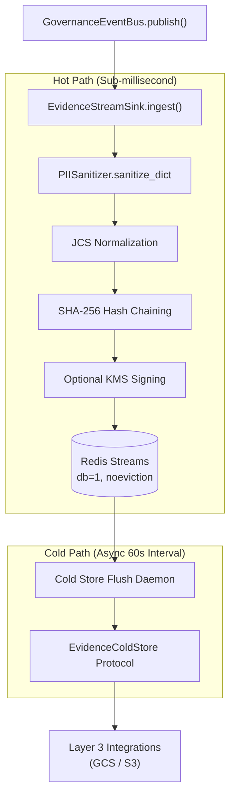

# Evidence Stream & Cold Storage Chain

## 1. Architectural Role & Domain Boundary

The Evidence Chain is a core component of the Layer 1 Kernel responsible for maintaining a cryptographically verifiable, durable ledger of all governance and compliance events. It elevates standard application logging into a tamper-evident, hash-chained evidence sequence required by ISO 42001 and AARM compliance mandates.

**Trust Boundaries**:
- **Upstream (Governance Event Bus)**: Accepts execution events, safety evaluations, and audit findings.
- **Downstream (Storage Adapters)**: The Evidence Chain is vendor-agnostic and relies strictly on an abstract `EvidenceColdStore` protocol ([`cold_store.py`](../../src/gateway/governance/evidence/cold_store.py)). Concrete storage operations (`GcsColdStore` in [`src/integrations/storage_gcs/cold_store.py`](../../src/integrations/storage_gcs/cold_store.py), `S3ColdStore` in [`src/integrations/storage_s3/cold_store.py`](../../src/integrations/storage_s3/cold_store.py)) are lazy-imported from Layer 3 by [`factory.py`](../../src/gateway/governance/evidence/factory.py), preventing kernel pollution.

## 2. Data & Execution Flow

To achieve sub-millisecond synchronous latency on the critical path, the Evidence Chain utilizes a two-tiered architecture: high-speed ingestion via Redis Streams, followed by asynchronous background flushing to immutable cold storage.

## 3. State Machine & Lifecycle

The lifecycle of an evidence record spans multiple durability tiers:

- **Ingestion & Normalization**: Incoming events pass through `PIISanitizer.sanitize_dict()` ([`pii_sanitizer.py`](../../src/gateway/governance/pii_sanitizer.py)) and are then strictly normalized using JCS (JSON Canonicalization Scheme, RFC 8785) to ensure deterministic byte representation.
- **Cryptographic Chaining**: `_link_hash()` computes `SHA-256(prev_hash + JCS(header) + payload_json)`. The `cage-audit/3.0` header carries `schema`, `chain_id`, `sequence`, `trace_id`, `event_type`, `control_id`, `hash_algorithm`, `canonicalization`, and the sparse `classification_reason` / `narrowing_applied` / `pause_token` members, so re-ordering, re-labelling, or splicing a record between chains breaks the link. The genesis record (sequence 0) has `prev_hash = ""`.
- **Chain Restoration**: On first use, the sink reads the stream head (`XREVRANGE … COUNT 1`) and resumes the same `chain_id` at `sequence + 1`. An empty stream starts a new chain; a head that cannot be parsed raises `EvidenceChainCorruptError` rather than re-genesising over existing evidence.
- **Hot Storage**: The chained record is appended with `XADD` to a Redis Stream (`cage:evidence:stream`) on `db=1`, bounded by `EVIDENCE_STREAM_MAX_LEN` (`maxlen`). The Redis instance must run `noeviction`; in the `gcp-gke` target the Memorystore (Valkey) module hard-codes `maxmemory-policy = noeviction`.
- **Cold Storage Archival**: A background daemon (`_cold_flush_loop`) wakes every 60 seconds, reads entries after its last flushed stream ID with `XRANGE` (up to 5,000 per batch), and writes them as one NDJSON object via `put_if_absent()` at `evidence-stream/<YYYY>/<MM>/<DD>/batch-<last_id>.ndjson`, receiving a `ColdStoreReceipt` (final URI and content SHA-256). Entries are **not** acknowledged or deleted from Redis; the stream is trimmed only by `maxlen`.

## 4. Operational Guarantees & Edge Cases

- **Fail-Closed on Redis Ingestion**: If the `EvidenceStreamSink` cannot write to Redis (e.g., Redis is down or OOM), the ingestion call fails, bubbling an exception up to the caller. With `EVIDENCE_CHAIN_BLOCKING=true` (the default), evidence commit precedes routing-seal issuance, so a failed commit blocks the primary transaction.
- **Fail-Open on Cold Store Flushing**: If the background flush daemon fails to reach GCS/S3, it logs the error, increments `EVIDENCE_COLD_STORE_WRITES_TOTAL{outcome="error"}`, and backs off for 5 seconds. The records stay in the Redis Stream until `maxlen` trims them, but the daemon's in-memory cursor has already advanced past the failed batch, so that process does not retry it; the next successful flush starts after it. `put_if_absent()` makes a replayed batch key an idempotent skip.
- **Vendor Decoupling**: The Layer 1 kernel is strictly decoupled from cloud SDKs (like `boto3` or `google-cloud-storage`). It operates entirely on raw bytes and relies on the `ColdStoreReceipt` contract for persistence verification.

### 4.1 System of Record (`gcp-gke` Target)

In [`infra/targets/gcp-gke/main.tf`](../../infra/targets/gcp-gke/main.tf), `module.worm_bucket` ([`infra/modules/worm_bucket`](../../infra/modules/worm_bucket)) provisions a retention-locked, CMEK-encrypted GCS bucket as the durable system of record. Retention follows the posture matrix: unlocked in dev, locked for 1 day in staging, locked for 7 years in prod. The compliance-bridge workload receives `EVIDENCE_COLD_STORE=gcs` and `EVIDENCE_COLD_STORE_BUCKET=<worm bucket>` plus bucket-scoped `roles/storage.objectCreator` / `roles/storage.objectViewer`, and persists OSCAL and audit artifacts there through [`storage.py`](../../src/compliance_bridge/storage.py). ClickHouse is only the analytical query plane; losing ClickHouse nodes does not lose evidence in the bucket.

The gateway manifests set `EVIDENCE_STREAM_ENABLED` but not `EVIDENCE_COLD_STORE`, so the gateway's stream flush resolves to `NullColdStore` unless an adopter configures a backend for the gateway workload.

### 4.2 Actuation Refusals and Credential Denials — Current Status

CAGE's stated standard is that refusals are primary evidence: a DENY carries the
same evidentiary weight as an ALLOW. At the actuation edge this is **not yet
wired**, and this document records the actual state rather than the intent.

What is true today:

- Credential-denial refusals are **terminal and fail-closed**. When the
  credential broker seam raises — `CredentialAccessDenied`, `CredentialNotFound`,
  or any other `CredentialBrokerError` — the reference actuator returns
  `ActuationReceipt(accepted=False, retryable=False, envelope_digest=None)` with
  a single `TERMINAL` finding coded `CREDENTIAL_BROKER_FAILED`, and performs no
  envelope construction, no signing, and no network dispatch. See
  [`adapter.py`](../../src/integrations/actuator_01/adapter.py) and
  [`CONSEQUENCE_GATEWAY.md §2.1`](CONSEQUENCE_GATEWAY.md).
- The refusal is structured and attributable: the finding's `detail` carries the
  broker's message, and the receipt is returned to the caller.

What is **not** true today:

- No code path passes an `ActuationReceipt` — accepted or refused — to
  [`EvidenceStreamSink.ingest()`](../../src/gateway/governance/evidence/stream.py).
  `CREDENTIAL_BROKER_FAILED` therefore does **not** appear as a hash-chained
  record in `cage:evidence:stream`, and is not archived to the cold store.
  The only production consumer of a receipt is
  [`tool_provider.py`](../../src/cage_finance/tools/tool_provider.py), which
  converts a rejected receipt into a `SymbolicGovernorViolation` carrying the
  formatted findings.
- [`consequence_gateway.py`](../../src/gateway/governance/consequence_gateway.py)
  does not emit evidence records either; it returns a `ConsequenceDecision` and
  leaves persistence to its caller.

Closing this gap requires an explicit ingestion call on the refusal path. Until
that exists, treat actuation refusals as *logged and propagated*, not as
*tamper-evident chained evidence*.

## 5. Configuration Contracts & Runtime Matrix

The Evidence Chain is driven by several environment parameters:

- `EVIDENCE_STREAM_ENABLED`: Must be set to `true` to activate ingestion (default: `false`).
- `EVIDENCE_STREAM_REDIS_URL`: Overrides the standard `REDIS_URL` for dedicated evidence ingestion.
- `EVIDENCE_STREAM_REDIS_DB`: The target Redis database (default: `1`).
- `EVIDENCE_STREAM_KEY`: The stream name (default: `cage:evidence:stream`).
- `EVIDENCE_STREAM_MAX_LEN`: `XADD` `maxlen` bound (default: `100000`).
- `EVIDENCE_CHAIN_BLOCKING`: Commit evidence synchronously before seal issuance (default: `true`).
- `EVIDENCE_COMMIT_TIMEOUT_S`: Blocking commit timeout in seconds (default: `5.0`).
- `EVIDENCE_COLD_STORE_FLUSH_SECONDS`: Flush interval in seconds (default: `60`).
- `EVIDENCE_COLD_STORE`: Cold store backend, `gcs` | `s3` | `null` (default: `null`).
- `EVIDENCE_COLD_STORE_BUCKET`: Global bucket fallback; regional overrides are resolved by [`residency.py`](../../src/gateway/governance/evidence/residency.py).
- `EVIDENCE_COLD_STORE_CMEK_KEY`: CMEK key for the GCS backend.
- `EVIDENCE_STREAM_KMS_SIGN`: If `true`, enables per-record asynchronous KMS signing through the compliance-bridge `AsyncBatchSigner` ([`kms_batch_signer.py`](../../src/compliance_bridge/kms_batch_signer.py)), which signs with its dedicated `EVIDENCE_KMS_KEY`.

