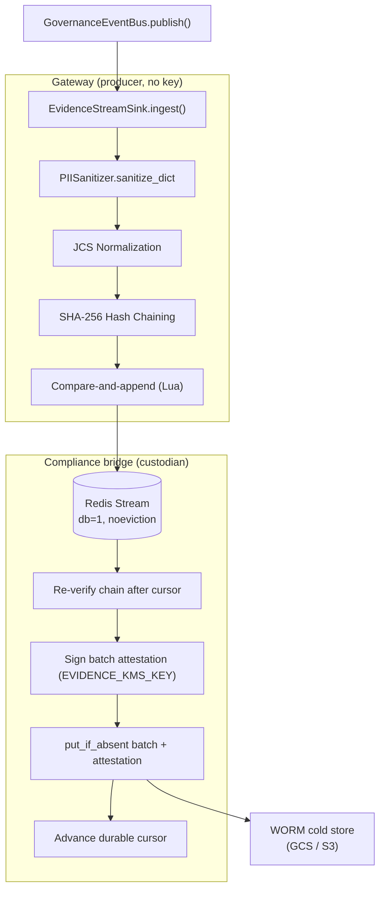

# Evidence Stream & Cold Storage Chain

## 1. Architectural Role & Domain Boundary

The Evidence Chain is a core component of the Layer 1 Kernel responsible for maintaining a cryptographically verifiable, durable ledger of all governance and compliance events. It elevates standard application logging into a tamper-evident, hash-chained evidence sequence required by ISO 42001 and AARM compliance mandates.

**Trust Boundaries (producer / custodian split)**:
- **Producer — gateway (Layer 1)**: [`EvidenceStreamSink`](../../src/gateway/governance/evidence/stream.py) sanitizes, canonicalizes and hash-chains each governance event and appends it to a Redis Stream. The gateway holds **no evidence signing key and no cold store**; it cannot attest to or archive its own evidence.
- **Custodian — compliance bridge (Layer 3)**: [`EvidenceCustodian`](../../src/compliance_bridge/evidence_custodian.py) independently re-verifies the chain, signs a per-batch attestation with the dedicated `EVIDENCE_KMS_KEY`, writes batch + attestation to the WORM cold store, and advances a durable cursor.
- **Downstream (Storage Adapters)**: The custodian writes through the abstract `EvidenceColdStore` protocol ([`cold_store.py`](../../src/gateway/governance/evidence/cold_store.py)). Concrete backends (`GcsColdStore` in [`src/integrations/storage_gcs/cold_store.py`](../../src/integrations/storage_gcs/cold_store.py), `S3ColdStore` in [`src/integrations/storage_s3/cold_store.py`](../../src/integrations/storage_s3/cold_store.py)) are lazy-imported from Layer 3 by [`factory.py`](../../src/gateway/governance/evidence/factory.py).

## 2. Data & Execution Flow

The hot path (gateway) only hashes and appends. Signing and archival run out of band in a separate workload with a separate identity.

## 3. State Machine & Lifecycle

The lifecycle of an evidence record spans multiple durability tiers:

- **Ingestion & Normalization**: Incoming events pass through `PIISanitizer.sanitize_dict()` ([`pii_sanitizer.py`](../../src/gateway/governance/pii_sanitizer.py)) and are then strictly normalized using JCS (JSON Canonicalization Scheme, RFC 8785) to ensure deterministic byte representation.
- **Cryptographic Chaining**: `_link_hash()` computes `SHA-256(prev_hash + JCS(header) + payload_json)`. The `cage-audit/3.0` header carries `schema`, `chain_id`, `sequence`, `trace_id`, `event_type`, `control_id`, `hash_algorithm`, `canonicalization`, and the sparse `classification_reason` / `narrowing_applied` / `pause_token` members, so re-ordering, re-labelling, or splicing a record between chains breaks the link. The genesis record (sequence 0) has `prev_hash = ""`.
- **Chain Restoration**: On first use, the sink reads the stream head (`XREVRANGE … COUNT 1`) and resumes the same `chain_id` at `sequence + 1`. An empty stream starts a new chain; a head that cannot be parsed raises `EvidenceChainCorruptError` rather than re-genesising over existing evidence.
- **Compare-and-Append (HA-safe)**: The record is appended by the `_APPEND_SCRIPT` Lua script, which atomically checks that the stream head still matches the sink's expected `chain_id`, `record_hash` and `sequence - 1` (or that the stream is empty for a genesis record) before `XADD … MAXLEN`. If another gateway replica appended first, the script returns `CONFLICT`; the sink re-reads the head, re-seals and retries up to `_MAX_APPEND_ATTEMPTS` (8) times, counting `cage_evidence_append_conflicts_total`, and then raises `EvidenceChainUnavailableError`. Local chain state advances only after a successful append, so replicas share one linear chain instead of forking it.
- **Hot Storage**: The stream (`cage:evidence:stream`) lives on `db=1`, bounded by `EVIDENCE_STREAM_MAX_LEN`. The Redis instance must run `noeviction`; in the `gcp-gke` target the Memorystore (Valkey) module hard-codes `maxmemory-policy = noeviction`. Both workloads connect through `build_async_redis()` ([`redis_client.py`](../../src/gateway/infrastructure/redis_client.py)), which honours `rediss://` / `REDIS_TLS`, verifies certificates under an enforcing posture or when `REDIS_CA_CERT_PATH` is readable, and uses the IAM credential provider when configured.
- **Sink Lifecycle**: The gateway lifespan in [`hybrid_server.py`](../../src/gateway/server/hybrid_server.py) runs `validate_evidence_stream_preconditions()` and then `start_evidence_sink()`, and stops the sink on shutdown. Under an enforcing posture a sink that fails to start aborts startup.
- **Custody & Archival**: `EvidenceCustodian.flush_once()` reads entries after its durable cursor (Redis hash `<stream>:custody`) with `XRANGE`, up to `EVIDENCE_CUSTODY_BATCH_SIZE`, splitting at a `chain_id` change. It re-verifies links, sequences and record hashes with `verify_record()`, builds a `cage-evidence-batch/1` attestation (chain id, sequence range, first/last hashes, NDJSON SHA-256, gaps), signs it, and writes `evidence-stream/<YYYY>/<MM>/<DD>/<chain_id>/<first>-<last>.ndjson` plus `.attestation.json` (or `.attestation.unsigned.json`, see §4) via `put_if_absent()`. Only then does the cursor advance. Entries are **not** deleted from Redis; the stream is trimmed only by `maxlen`.

## 4. Operational Guarantees & Edge Cases

- **Fail-Closed on Redis Ingestion**: If the `EvidenceStreamSink` cannot write to Redis, ingestion fails and the chain state is left unchanged. With `EVIDENCE_CHAIN_BLOCKING=true` (the default), evidence commit precedes routing-seal issuance, so a failed commit blocks the primary transaction.
- **Retry-Safe Custody**: Before writing, the custodian records `pending_end_id` on the cursor. If the cold-store write fails, the cursor does not advance and the next cycle retries exactly the same range; object keys and bytes are deterministic, so `put_if_absent()` makes a replay an idempotent skip. Outcomes are counted in `cage_evidence_custody_batches_total{outcome}` and `cage_evidence_cold_store_writes_total{backend,outcome}`.
- **Fail-Closed on Integrity Violations**: A broken link, bad record hash, sequence regression or same-sequence fork halts custody at that entry (the cursor never advances past it) and logs CRITICAL. A sequence gap — e.g. entries trimmed by `maxlen` before custody — is logged CRITICAL, counted in `cage_evidence_custody_gaps_total`, and recorded in the attestation rather than hidden. A clean genesis rotation to a new `chain_id` is accepted.
- **Fail-Closed on Signing**: When signatures are required (enforcing posture), a signing failure aborts the batch without writing.
- **Unsigned Attestations Are Not Evidence**: In permissive postures (dev/test/ci) without an active `EVIDENCE_KMS_KEY` signer, or when signing fails there, the attestation is written with `signature_status: "UNSIGNED"`, `evidentiary: false` and `signature: null`, under a distinct key (`<first>-<last>.attestation.unsigned.json`), with object metadata `evidentiary=false` on both the batch and the attestation, and counted as `cage_evidence_custody_batches_total{outcome="written_unsigned"}`. Signed attestations carry `signature_status: "SIGNED"` and `evidentiary: true` inside the signed body. Anything that cites an attestation as evidence (OSCAL statements, POAM closure, audit exports) must first call [`assert_citable()`](../../src/compliance_bridge/evidence_custodian.py), which raises `NonEvidentiaryAttestationError` for unsigned, non-evidentiary or incomplete attestations. `assert_citable()` checks structure only; cryptographic verification is done by the verifier (§4.2).
- **Vendor Decoupling**: The Layer 1 kernel is strictly decoupled from cloud SDKs (like `boto3` or `google-cloud-storage`) and holds no signer. Gate G3 no longer allowlists any `compliance_bridge` import from the evidence factory.

### 4.1 System of Record (`gcp-gke` Target)

In [`infra/targets/gcp-gke/main.tf`](../../infra/targets/gcp-gke/main.tf), `module.worm_bucket` ([`infra/modules/worm_bucket`](../../infra/modules/worm_bucket)) provisions a retention-locked, CMEK-encrypted GCS bucket as the durable system of record. Retention follows the posture matrix: unlocked in dev, locked for 1 day in staging, locked for 7 years in prod. The compliance-bridge workload receives `EVIDENCE_COLD_STORE=gcs` and `EVIDENCE_COLD_STORE_BUCKET=<worm bucket>` plus bucket-scoped `roles/storage.objectCreator` / `roles/storage.objectViewer`, and persists evidence batches, attestations, OSCAL and audit artifacts there (the latter through [`storage.py`](../../src/compliance_bridge/storage.py)). ClickHouse is only the analytical query plane; losing ClickHouse nodes does not lose evidence in the bucket.

The gateway manifests set `EVIDENCE_STREAM_ENABLED` but deliberately not `EVIDENCE_COLD_STORE` or `EVIDENCE_KMS_KEY`: archival and signing belong to the compliance bridge, which also receives the evidence stream Redis connection settings. Under an enforcing posture the bridge refuses to start custody with a `null` cold store or without a signing key (`EvidenceCustodyConfigError`).

### 4.2 Read-Back Verification (`evidence_verifier.py`)

[`CustodyVerifier`](../../src/compliance_bridge/evidence_verifier.py) reads the archive back and decides what may be cited. It trusts nothing it reads:

- **Per batch** (`verify_batch()`): the attestation must pass `assert_citable()`; a `signature.key_id` belonging to the gateway seal key or the reconciler snapshot key is rejected; the signature over the attestation body (everything except `signature`) must verify against a public key resolved **by kid from an independently loaded trust-anchor set**; the attestation key, `data_key` and the chain/range in the object path must agree; the data object's SHA-256 must equal `content_sha256`; and every record is re-verified (hash, `prev_hash` link, contiguous sequence, `chain_id`, first/last stream IDs, entry count, last record hash). A validly signed attestation therefore cannot vouch for a forged record.
- **Across batches** (`verify_all()`): signed batches are grouped by `chain_id` and ordered by sequence. Each must continue the previous one. A jump is accepted only when the later attestation itself declares the gap, and is reported in `declared_gaps`; an undeclared jump (a deleted batch or chain head) fails. A data object with no attestation, or an unexpected object under the prefix, fails. Unsigned attestations are listed in `non_evidentiary` and never counted as verified, so an unsigned batch inside a signed chain fails continuity.
- **Trust anchors**: `load_evidence_trust_anchors()` fetches the public key(s) of `EVIDENCE_KMS_KEY` from the KMS provider, plus an optional operator-mounted `EVIDENCE_TRUST_ANCHORS_FILE` (JSON `{kid: pem}`) for retired key versions. Manifest kids must be versions of the same crypto key as `EVIDENCE_KMS_KEY` and never the gateway or reconciler key. With no anchors, every signed attestation fails on unknown kid.
- **Outcomes**: a verification failure is a verdict; a backend error (`ColdStoreError` other than `ColdStoreNotFoundError`) propagates and is not. `uv run python -m src.compliance_bridge.evidence_verifier [--prefix P] [--json]` exits 0 only when the report has no failures.
- **Read seam**: the verifier needs `EvidenceColdStore.get()` (exact bytes; `ColdStoreNotFoundError` when missing) and `list_keys()` (all pages, sorted), implemented by the GCS, S3 and null backends. The compliance bridge's existing bucket-scoped `roles/storage.objectViewer` covers both.

Not yet wired: nothing runs the verifier on a schedule, and OSCAL / POAM citation paths do not call it yet.

### 4.3 Actuation Refusals and Credential Denials — Current Status

CAGE's stated standard is that refusals are primary evidence: a DENY carries the
same evidentiary weight as an ALLOW. At the actuation edge this is **not yet
wired**, and this document records the actual state rather than the intent.

What is true today:

- Credential-denial refusals are **terminal and fail-closed**. When the
  credential broker seam raises — `CredentialAccessDenied`, `CredentialNotFound`,
  or any other `CredentialBrokerError` — the reference actuator returns
  `ActuationReceipt(accepted=False, retryable=False, envelope_digest=None)` with
  a single `TERMINAL` finding coded `CREDENTIAL_BROKER_FAILED`, and performs no
  envelope construction, no signing, and no network dispatch. See
  [`adapter.py`](../../src/integrations/actuator_01/adapter.py) and
  [`CONSEQUENCE_GATEWAY.md §2.1`](CONSEQUENCE_GATEWAY.md).
- The refusal is structured and attributable: the finding's `detail` carries the
  broker's message, and the receipt is returned to the caller.

What is **not** true today:

- No code path passes an `ActuationReceipt` — accepted or refused — to
  [`EvidenceStreamSink.ingest()`](../../src/gateway/governance/evidence/stream.py).
  `CREDENTIAL_BROKER_FAILED` therefore does **not** appear as a hash-chained
  record in `cage:evidence:stream`, and is not archived to the cold store.
  The only production consumer of a receipt is
  [`tool_provider.py`](../../src/cage_finance/tools/tool_provider.py), which
  converts a rejected receipt into a `SymbolicGovernorViolation` carrying the
  formatted findings.
- [`consequence_gateway.py`](../../src/gateway/governance/consequence_gateway.py)
  does not emit evidence records either; it returns a `ConsequenceDecision` and
  leaves persistence to its caller.

Closing this gap requires an explicit ingestion call on the refusal path. Until
that exists, treat actuation refusals as *logged and propagated*, not as
*tamper-evident chained evidence*.

## 5. Configuration Contracts & Runtime Matrix

Shared (gateway and compliance bridge):

- `EVIDENCE_STREAM_ENABLED`: Must be `true` to activate ingestion/custody (default: `false`). Under an enforcing posture a disabled stream is a startup error in both workloads.
- `EVIDENCE_STREAM_REDIS_URL`: Overrides the standard `REDIS_URL` for the evidence stream.
- `EVIDENCE_STREAM_REDIS_DB`: The target Redis database (default: `1`).
- `EVIDENCE_STREAM_KEY`: The stream name (default: `cage:evidence:stream`).

Gateway (producer):

- `EVIDENCE_STREAM_MAX_LEN`: `XADD` `maxlen` bound (default: `100000`).
- `EVIDENCE_CHAIN_BLOCKING`: Commit evidence synchronously before seal issuance (default: `true`). Non-blocking under an enforcing posture requires `CAGE_ALLOW_NONBLOCKING_PROD=true`.
- `EVIDENCE_COMMIT_TIMEOUT_S`: Blocking commit timeout in seconds (default: `5.0`).

Compliance bridge (custodian):

- `EVIDENCE_CUSTODY_INTERVAL_S`: Seconds between custody cycles (default: `60`).
- `EVIDENCE_CUSTODY_BATCH_SIZE`: Maximum entries per batch (default: `5000`).
- `EVIDENCE_COLD_STORE`: Cold store backend, `gcs` | `s3` | `null` (default: `null`; `null` is refused when enforcing).
- `EVIDENCE_COLD_STORE_BUCKET`: Global bucket fallback; regional overrides are resolved by [`residency.py`](../../src/gateway/governance/evidence/residency.py).
- `EVIDENCE_COLD_STORE_CMEK_KEY`: CMEK key for the GCS backend.
- `EVIDENCE_KMS_KEY`: Attestation signing key, resolved by `build_evidence_signer()` ([`kms_batch_signer.py`](../../src/compliance_bridge/kms_batch_signer.py)); required when enforcing and refused if it equals the gateway or reconciler key.

Removed: `EVIDENCE_STREAM_KMS_SIGN` and `EVIDENCE_COLD_STORE_FLUSH_SECONDS` (the gateway no longer signs or flushes).
