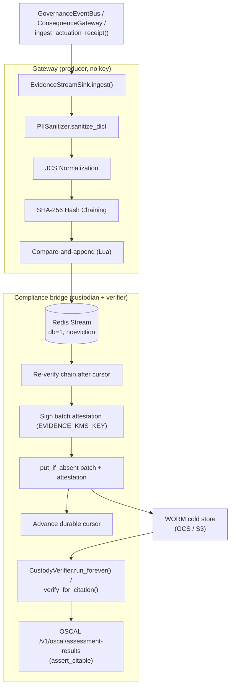

# Evidence Stream & Cold Storage Chain

## 1. Architectural Role & Domain Boundary

The Evidence Chain is a core component of the Layer 1 Kernel responsible for maintaining a cryptographically verifiable, durable ledger of all governance and compliance events. It elevates standard application logging into a tamper-evident, hash-chained evidence sequence required by ISO 42001 and AARM compliance mandates.

**Trust Boundaries (producer / custodian / verifier split)**:
- **Producer — gateway (Layer 1)**: [`EvidenceStreamSink`](../../src/gateway/governance/evidence/stream.py) sanitizes, canonicalizes and hash-chains each governance event (from [`verdicts.py`](../../src/gateway/governance/governor/verdicts.py), [`ConsequenceGateway`](../../src/gateway/governance/consequence_gateway.py), [`ingest_actuation_receipt()`](../../src/gateway/governance/execution_actuator.py), [`routing_seal.py`](../../src/gateway/governance/routing_seal.py), and [`GovernanceEventBus`](../../src/compliance_bridge/sse_events.py)) and appends it to a Redis Stream. The gateway holds **no evidence signing key and no cold store**; it cannot attest to or archive its own evidence.
- **Custodian & Verifier — compliance bridge (Layer 3)**: [`EvidenceCustodian`](../../src/compliance_bridge/evidence_custodian.py) independently re-verifies the chain, signs a per-batch attestation with the dedicated `EVIDENCE_KMS_KEY`, writes batch + attestation to the WORM cold store, and advances a durable cursor. [`CustodyVerifier`](../../src/compliance_bridge/evidence_verifier.py) reads the archive back on `EVIDENCE_VERIFY_INTERVAL_S`, verifies signatures against out-of-band `kid`-resolved trust anchors, re-checks every record and batch link, and gates OSCAL assessment citations (`assert_citable()`).
- **Downstream (Storage Adapters)**: The custodian and verifier operate through the abstract `EvidenceColdStore` protocol ([`cold_store.py`](../../src/gateway/governance/evidence/cold_store.py)). Concrete backends (`GcsColdStore` in [`src/integrations/storage_gcs/cold_store.py`](../../src/integrations/storage_gcs/cold_store.py), `S3ColdStore` in [`src/integrations/storage_s3/cold_store.py`](../../src/integrations/storage_s3/cold_store.py)) are lazy-imported from Layer 3 by [`factory.py`](../../src/gateway/governance/evidence/factory.py).

## 2. Data & Execution Flow

The hot path (gateway) only hashes and appends. Signing, archival, and read-back verification run out of band in a separate workload with a separate identity.

## 3. State Machine & Lifecycle

The lifecycle of an evidence record spans multiple durability tiers:

- **Ingestion & Normalization**: Incoming events pass through `PIISanitizer.sanitize_dict()` ([`pii_sanitizer.py`](../../src/gateway/governance/pii_sanitizer.py)) and are then strictly normalized using JCS (JSON Canonicalization Scheme, RFC 8785) to ensure deterministic byte representation.
- **Cryptographic Chaining**: `_link_hash()` computes `SHA-256(prev_hash + JCS(header) + payload_json)`. The `cage-audit/3.0` header carries `schema`, `chain_id`, `sequence`, `trace_id`, `event_type`, `control_id`, `hash_algorithm`, `canonicalization`, and the sparse `classification_reason` / `narrowing_applied` / `pause_token` members, so re-ordering, re-labelling, or splicing a record between chains breaks the link. The genesis record (sequence 0) has `prev_hash = ""`.
- **Chain Restoration**: On first use, the sink reads the stream head (`XREVRANGE … COUNT 1`) and resumes the same `chain_id` at `sequence + 1`. An empty stream starts a new chain; a head that cannot be parsed raises `EvidenceChainCorruptError` rather than re-genesising over existing evidence.
- **Compare-and-Append (HA-safe)**: The record is appended by the `_APPEND_SCRIPT` Lua script, which atomically checks that the stream head still matches the sink's expected `chain_id`, `record_hash` and `sequence - 1` (or that the stream is empty for a genesis record) before `XADD … MAXLEN`. If another gateway replica appended first, the script returns `CONFLICT`; the sink re-reads the head, re-seals and retries up to `_MAX_APPEND_ATTEMPTS` (8) times, counting `cage_evidence_append_conflicts_total`, and then raises `EvidenceChainUnavailableError`. Local chain state advances only after a successful append, so replicas share one linear chain instead of forking it.
- **Hot Storage**: The stream (`cage:evidence:stream`) lives on `db=1`, bounded by `EVIDENCE_STREAM_MAX_LEN`. The Redis instance must run `noeviction`; in the `gcp-gke` target the Memorystore (Valkey) module hard-codes `maxmemory-policy = noeviction`. Both workloads connect through `build_async_redis()` ([`redis_client.py`](../../src/gateway/infrastructure/redis_client.py)), which honours `rediss://` / `REDIS_TLS`, verifies certificates under an enforcing posture or when `REDIS_CA_CERT_PATH` is readable, and uses the IAM credential provider when configured. In the `gcp-gke` target ([`infra/targets/gcp-gke/main.tf`](../../infra/targets/gcp-gke/main.tf)), `module.memorystore_governance.managed_server_ca` is passed via `redis_ca_pem` into [`infra/modules/gateway/main.tf`](../../infra/modules/gateway/main.tf) and [`infra/modules/compliance_bridge/main.tf`](../../infra/modules/compliance_bridge/main.tf), which provision `<app>-redis-ca` ConfigMaps (`ca.pem`), mount them read-only at `/etc/cage/tls/redis`, export `REDIS_CA_CERT_PATH=/etc/cage/tls/redis/ca.pem`, and annotate the pod template with `cage.io/redis-ca-sha256` so CA rotation rolls the pods automatically.
- **Sink Lifecycle**: The gateway lifespan in [`hybrid_server.py`](../../src/gateway/server/hybrid_server.py) runs `validate_evidence_stream_preconditions()` and then `start_evidence_sink()`, and stops the sink on shutdown. Under an enforcing posture a sink that fails to start aborts startup.
- **Custody & Archival**: `EvidenceCustodian.flush_once()` reads entries after its durable cursor (Redis hash `<stream>:custody`) with `XRANGE`, up to `EVIDENCE_CUSTODY_BATCH_SIZE`, splitting at a `chain_id` change. It re-verifies links, sequences and record hashes with `verify_record()`, builds a `cage-evidence-batch/1` attestation (chain id, sequence range, first/last hashes, NDJSON SHA-256, gaps), signs it, and writes `evidence-stream/<YYYY>/<MM>/<DD>/<chain_id>/<first>-<last>.ndjson` plus `.attestation.json` (or `.attestation.unsigned.json`, see §4) via `put_if_absent()`. Only then does the cursor advance. Entries are **not** deleted from Redis; the stream is trimmed only by `maxlen`.

## 4. Operational Guarantees & Edge Cases

- **Fail-Closed on Redis Ingestion**: If the `EvidenceStreamSink` cannot write to Redis, ingestion fails and the chain state is left unchanged. With `EVIDENCE_CHAIN_BLOCKING=true` (the default), evidence commit precedes routing-seal issuance, so a failed commit blocks the primary transaction.
- **Retry-Safe Custody**: Before writing, the custodian records `pending_end_id` on the cursor. If the cold-store write fails, the cursor does not advance and the next cycle retries exactly the same range; object keys and bytes are deterministic, so `put_if_absent()` makes a replay an idempotent skip. Outcomes are counted in `cage_evidence_custody_batches_total{outcome}` and `cage_evidence_cold_store_writes_total{backend,outcome}`.
- **Fail-Closed on Integrity Violations**: A broken link, bad record hash, sequence regression or same-sequence fork halts custody at that entry (the cursor never advances past it) and logs CRITICAL. A sequence gap — e.g. entries trimmed by `maxlen` before custody — is logged CRITICAL, counted in `cage_evidence_custody_gaps_total`, and recorded in the attestation rather than hidden. A clean genesis rotation to a new `chain_id` is accepted.
- **Fail-Closed on Signing**: When signatures are required (enforcing posture), a signing failure aborts the batch without writing.
- **Unsigned Attestations Are Not Evidence**: In permissive postures (dev/test/ci) without an active `EVIDENCE_KMS_KEY` signer, or when signing fails there, the attestation is written with `signature_status: "UNSIGNED"`, `evidentiary: false` and `signature: null`, under a distinct key (`<first>-<last>.attestation.unsigned.json`), with object metadata `evidentiary=false` on both the batch and the attestation, and counted as `cage_evidence_custody_batches_total{outcome="written_unsigned"}`. Signed attestations carry `signature_status: "SIGNED"` and `evidentiary: true` inside the signed body. Anything that cites an attestation as evidence (OSCAL statements, POAM closure, audit exports) must first call [`assert_citable()`](../../src/compliance_bridge/evidence_custodian.py), which raises `NonEvidentiaryAttestationError` for unsigned, non-evidentiary or incomplete attestations. `assert_citable()` checks structure only; cryptographic verification is done by the verifier (§4.2).
- **Vendor Decoupling**: The Layer 1 kernel is strictly decoupled from cloud SDKs (like `boto3` or `google-cloud-storage`) and holds no signer. Gate G3 no longer allowlists any `compliance_bridge` import from the evidence factory.

### 4.1 System of Record (`gcp-gke` Target)

In [`infra/targets/gcp-gke/main.tf`](../../infra/targets/gcp-gke/main.tf), `module.worm_bucket` ([`infra/modules/worm_bucket`](../../infra/modules/worm_bucket)) provisions a retention-locked, CMEK-encrypted GCS bucket as the durable system of record. Retention follows the posture matrix: unlocked in dev, locked for 1 day in staging, locked for 7 years in prod. The compliance-bridge workload receives `EVIDENCE_COLD_STORE=gcs` and `EVIDENCE_COLD_STORE_BUCKET=<worm bucket>` plus bucket-scoped `roles/storage.objectCreator` / `roles/storage.objectViewer`, and persists evidence batches, attestations, OSCAL and audit artifacts there (the latter through [`storage.py`](../../src/compliance_bridge/storage.py)). ClickHouse is only the analytical query plane; losing ClickHouse nodes does not lose evidence in the bucket.

The gateway manifests set `EVIDENCE_STREAM_ENABLED` but deliberately not `EVIDENCE_COLD_STORE` or `EVIDENCE_KMS_KEY`: archival and signing belong to the compliance bridge, which also receives the evidence stream Redis connection settings. Under an enforcing posture the bridge refuses to start custody with a `null` cold store or without a signing key (`EvidenceCustodyConfigError`).

### 4.2 Read-Back Verification (`evidence_verifier.py`)

[`CustodyVerifier`](../../src/compliance_bridge/evidence_verifier.py) reads the archive back and decides what may be cited. It trusts nothing it reads:

- **Per batch** (`verify_batch()`): the attestation must pass `assert_citable()`; a `signature.key_id` belonging to the gateway seal key or the reconciler snapshot key is rejected; the signature over the attestation body (everything except `signature`) must verify against a public key resolved **by kid from an independently loaded trust-anchor set**; the attestation key, `data_key` and the chain/range in the object path must agree; the data object's SHA-256 must equal `content_sha256`; and every record is re-verified (hash, `prev_hash` link, contiguous sequence, `chain_id`, first/last stream IDs, entry count, last record hash). A validly signed attestation therefore cannot vouch for a forged record.
- **Across batches** (`verify_all()`): signed batches are grouped by `chain_id` and ordered by sequence. Each must continue the previous one. A jump is accepted only when the later attestation itself declares the gap, and is reported in `declared_gaps`; an undeclared jump (a deleted batch or chain head) fails. A data object with no attestation, or an unexpected object under the prefix, fails. Unsigned attestations are listed in `non_evidentiary` and never counted as verified, so an unsigned batch inside a signed chain fails continuity.
- **Trust anchors**: `load_evidence_trust_anchors()` fetches the public key(s) of `EVIDENCE_KMS_KEY` from the KMS provider, plus an optional operator-mounted `EVIDENCE_TRUST_ANCHORS_FILE` (JSON `{kid: pem}`) for retired key versions. Manifest kids must be versions of the same crypto key as `EVIDENCE_KMS_KEY` and never the gateway or reconciler key. With no anchors, every signed attestation fails on unknown kid.
- **Outcomes & Citability**: a verification failure is a verdict; a backend error (`ColdStoreError` other than `ColdStoreNotFoundError`) propagates and is not. `CustodyVerificationReport.citable` is `True` only when `report.ok` is `True`, at least one signed batch verified (`len(report.verified) >= 1`), and `report.declared_gaps` is empty; `report.assert_citable()` (and `verifier.verify_for_citation()`) raises `EvidenceVerificationError` otherwise, so an empty archive, an unsigned-only archive, or a gap-trimmed chain cannot be cited. CLI: `uv run python -m src.compliance_bridge.evidence_verifier [--prefix P] [--require-citable] [--json]`.
- **Scheduled Loop, Metrics & Citation Gating**: When `EVIDENCE_STREAM_ENABLED=true`, the compliance-bridge lifespan ([`main.py`](../../src/compliance_bridge/main.py)) starts `CustodyVerifier.from_env().run_forever()` on `EVIDENCE_VERIFY_INTERVAL_S` (default `300s`, failing closed at startup under an enforcing posture when `EVIDENCE_COLD_STORE=null` or when no trust anchors are configured). Each cycle updates Prometheus metrics `cage_evidence_verification_runs_total{outcome="ok"|"failed"|"error"}`, `cage_evidence_verified_batches`, `cage_evidence_verification_failures`, `cage_evidence_declared_gaps`, and `cage_evidence_non_evidentiary_batches`. `GET /v1/evidence/verify` runs an on-demand verification cycle (`200` on pass, `409` on failure or uncitable archive with `require_citable=true`, `503` on cold-store outage). `GET /v1/oscal/assessment-results` (when `verify_custody=true` or `OSCAL_REQUIRE_VERIFIED_CUSTODY=true`) and `build_oscal_assessment_results(..., custody_report=...)` ([`oscal_exporter.py`](../../src/compliance_bridge/oscal_exporter.py)) enforce `assert_citable()` (`409 EVIDENCE_CUSTODY_UNVERIFIED` / `503 EVIDENCE_STORE_UNAVAILABLE`) and attach `evidence-custody-verified-batches`, `evidence-custody-chain-head`, `evidence-custody-key-id`, and `links[rel="evidence-attestation"]` to the OSCAL result entry.
- **Read seam**: the verifier needs `EvidenceColdStore.get()` (exact bytes; `ColdStoreNotFoundError` when missing) and `list_keys()` (all pages, sorted), implemented by the GCS, S3 and null backends. The compliance bridge's existing bucket-scoped `roles/storage.objectViewer` covers both.

### 4.3 Actuation Refusals, Credential Denials, and ConsequenceGateway Decisions

CAGE's standard is that refusals are primary evidence: a DENY carries the same
evidentiary weight as an ALLOW. Both the actuation seam and the post-FRIA
`ConsequenceGateway` emit hash-chained `cage-audit/3.0` records to
[`EvidenceStreamSink.ingest()`](../../src/gateway/governance/evidence/stream.py):

- **Credential-denial and actuation refusals (`ACTUATION_REFUSAL_RECEIPT`)**:
  When the credential broker seam raises (`CredentialAccessDenied`,
  `CredentialNotFound`, or any other `CredentialBrokerError`), or when identity,
  route, clearance, quorum, or transport validation fails, the actuator returns
  `ActuationReceipt(accepted=False, ...)` with structured findings (e.g.
  `CREDENTIAL_BROKER_FAILED`, `EXECUTOR_ID_MISMATCH`, `TARGET_ROUTE_MISMATCH`)
  and performs no unauthorized network dispatch. See
  [`adapter.py`](../../src/integrations/actuator_01/adapter.py),
  [`broker_actuator.py`](../../src/cage_finance/actuators/broker_actuator.py),
  and [`CONSEQUENCE_GATEWAY.md §2.1`](CONSEQUENCE_GATEWAY.md).
- **Single-owner actuation receipt ingestion (`dispatch_actuation`)**:
  actuators never write evidence. The kernel
  [`dispatch_actuation()`](../../src/gateway/governance/execution_actuator.py)
  is the only sanctioned caller of `ExecutionActuator.actuate()` (used by
  [`tool_provider.py`](../../src/cage_finance/tools/tool_provider.py)); it
  converts an actuator exception into an `UNKNOWN`, non-retryable receipt
  (finding `ACTUATOR_EXCEPTION`) and calls
  [`ingest_actuation_receipt()`](../../src/gateway/governance/execution_actuator.py)
  exactly once per dispatch. The event type follows the receipt outcome:
  `ACTUATION_RECEIPT` (`ACCEPTED`), `ACTUATION_REFUSAL_RECEIPT` (`REJECTED`),
  or `ACTUATION_INDETERMINATE_RECEIPT` (`UNKNOWN` — the side effect may have
  happened). Each event also records the receipt's signature `verification`
  status (`VERIFIED` / `UNVERIFIED` / `INVALID`, see
  [`ReceiptVerification`](../../src/gateway/governance/seams/actuation.py)).
- **`ConsequenceGateway` decisions (`CONSEQUENCE_GATEWAY_DECISION` / `CONSEQUENCE_GATEWAY_REFUSAL`)**:
  [`ConsequenceGateway.evaluate()`](../../src/gateway/governance/consequence_gateway.py)
  emits every `EXECUTE` (`CONSEQUENCE_GATEWAY_DECISION`) and `BLOCK` / `HOLD`
  (`CONSEQUENCE_GATEWAY_REFUSAL`, including `TOKEN_INVALID`,
  `ACTION_BINDING_MISMATCH`, `ALREADY_CONSUMED`,
  `AUTHORITY_RECORD_BINDING_MISMATCH`, and `REDIS_ERROR`) to
  `EvidenceStreamSink.ingest()`. If a connected evidence sink raises
  `EvidenceChainUnavailableError` on an `EXECUTE` verdict, `ConsequenceGateway`
  fails closed by downgrading the decision to `BLOCK`
  (`EVIDENCE_CHAIN_UNAVAILABLE`).

### 4.4 PII Sanitization Before Hashing

`EvidenceStreamSink` runs every event through
[`PIISanitizer.sanitize_dict()`](../../src/gateway/governance/pii_sanitizer.py)
*before* JCS canonicalization and hashing. The sanitized `payload_json` is what
gets chained, stored and later verified. A sanitizer false positive therefore
permanently changes evidence content.

- **SWIFT/BIC false positive (fixed, POAM-2026-100).** The SWIFT/BIC pattern
  used to match any eight- or eleven-character upper-case token. It redacted
  governance vocabulary such as `APPROVED`, `REJECTED` and `ESCALATE` to
  `[REDACTED_SWIFT]`, so records lost their verdicts, and events that differed
  only in such a word had the same payload. A BIC is now redacted only when it
  carries a contextual cue (a `BIC`/`SWIFT` label in text, or a BIC/SWIFT dict
  key) **and** has a valid ISO 3166-1 alpha-2 country code. An unlabelled BIC in
  prose is no longer redacted. That is a deliberate trade-off: a BIC identifies
  a bank, not a person. A property test
  ([`test_pii_sanitizer_bic.py`](../../tests/test_pii_sanitizer_bic.py)) checks
  that no upper-case string literal in `src/` is redacted as a BIC.
- **Effect on existing evidence.** Records appended before the fix stay
  verifiable. Verification recomputes hashes over the stored, already-sanitized
  `payload_json` and never re-sanitizes it, so the old `[REDACTED_SWIFT]` tokens
  are part of the hashed content. The original words cannot be recovered from
  those records. New records that contain such words now keep them, so their
  payload bytes and record hashes differ from what the old sanitizer would have
  produced for the same event. Nothing in the repository recomputes a record
  hash from the raw event, so this is not a breaking interface change.

### 4.5 State Commitments (Provider 02 `stateHash` Preimages)

A partner that certificate-binds a producer-supplied `stateHash` without
recomputing it gives that hash evidentiary weight only if the preimage is kept.
The kernel's generic state-commitment service retains it:

- **Endpoint and identity**: `POST /governance/state-commitments`
  ([`state_commitment_api.py`](../../src/gateway/server/state_commitment_api.py))
  authenticates the caller by Linkerd mTLS workload identity (`l5d-client-id`
  checked against `CAGE_TRUSTED_CLIENT_IDENTITIES`), never by HMAC routing seals.
  Errors map to `403` (identity), `413` (preimage > 256 KiB), `422` (snapshot not
  JSON-native) and `503` (service or evidence chain unavailable).
- **One canonicalization**:
  [`StateCommitmentService`](../../src/gateway/governance/evidence/state_commitment.py)
  runs the snapshot through the evidence-stream sanitizer (`sanitize_dict`) and
  `_normalize_for_jcs`, RFC 8785-canonicalizes it once, and hashes those bytes
  with SHA-256. It then appends a `STATE_COMMITMENT` event (sanitized `state`,
  `stateHash`, `linkage`, `linkageDigest`, method keys, `callerIdentity`) with
  blocking `ingest_sync()`. If the append fails, no `stateHash` is returned.
  Method constants (`stateHashAlg=sha256`, `stateHashCanon=RFC8785-JCS`,
  `stateHashScope=agentstate-pii-sanitized/v1`) are defined once, in
  [`seams/state_commitment.py`](../../src/gateway/governance/seams/state_commitment.py).
- **Custody unchanged**: the gateway still holds no cold store. The
  compliance-bridge `EvidenceCustodian` archives the event with the rest of the
  chain. Its objects carry `x-data-classification: internal-pii-sanitized`,
  and every write is read back and compared (`put_if_absent_verified()`), so an
  existing object with different content is an integrity failure, not a silent
  success.
- **Verification**: `verify_state_commitment(state_hash, record_payload)`
  recomputes `sha256(JCS(state))` from an archived record, checks that the
  method keys match, and (optionally) checks the `linkageDigest` against an
  expected linkage. Use `linkageDigest` to bind records to bundle steps: the
  plain `linkage` passes through the sanitizer and may be redacted.
- **Posture**: `build_state_commitment_service()` refuses to build under an
  enforcing posture without a running evidence sink. The custodian also refuses
  a `null` cold store in enforcing postures.

**Sanitizer coverage and known gaps** (classification *Internal / PII-sanitized*,
not *anonymized*). Covered (string values, in nested dicts and lists): US SSN,
payment-card numbers, IBAN, SWIFT/BIC, email, phone numbers, API keys / Bearer
tokens and compact JWS; plus values under denylisted keys (`token`, `jws`,
`jwt`, ...). Not covered, so they
may remain in preimages:

- free-text personal names and postal addresses;
- non-IBAN account numbers, and PII held as numbers rather than strings;
- the opaque `user_id`, kept on purpose as pseudonymous attribution (no
  pseudonymizer exists, and widening the global key denylist would change every
  evidence record).

The sanitizer also has known false positives. These are **hash-relevant**,
because two states that differ only in redacted values get the same `stateHash`:

- the SWIFT/BIC pattern previously redacted any eight-letter upper-case word;
  fixed in POAM-2026-100 (§4.4) by requiring a contextual cue and country code;
- some UUIDs whose groups are all digits match the card patterns (about 1.3e-4
  of uuid4 values).

## 5. Configuration Contracts & Runtime Matrix

Shared (gateway and compliance bridge):

- `EVIDENCE_STREAM_ENABLED`: Must be `true` to activate ingestion/custody (default: `false`). Under an enforcing posture a disabled stream is a startup error in both workloads.
- `EVIDENCE_STREAM_REDIS_URL`: Overrides the standard `REDIS_URL` for the evidence stream.
- `EVIDENCE_STREAM_REDIS_DB`: The target Redis database (default: `1`).
- `EVIDENCE_STREAM_KEY`: The stream name (default: `cage:evidence:stream`).
- `REDIS_TLS` / `REDIS_CA_CERT_PATH`: When `REDIS_TLS=true`, both workloads mount the Memorystore managed server CA (`module.memorystore_governance.managed_server_ca`) from `<app>-redis-ca` read-only at `/etc/cage/tls/redis` and set `REDIS_CA_CERT_PATH=/etc/cage/tls/redis/ca.pem`.

Gateway (producer):

- `EVIDENCE_STREAM_MAX_LEN`: `XADD` `maxlen` bound (default: `100000`).
- `EVIDENCE_CHAIN_BLOCKING`: Commit evidence synchronously before seal issuance (default: `true`). Non-blocking under an enforcing posture requires `CAGE_ALLOW_NONBLOCKING_PROD=true`.
- `EVIDENCE_COMMIT_TIMEOUT_S`: Blocking commit timeout in seconds (default: `5.0`).

Compliance bridge (custodian & verifier):

- `EVIDENCE_CUSTODY_INTERVAL_S`: Seconds between custody cycles (default: `60`).
- `EVIDENCE_CUSTODY_BATCH_SIZE`: Maximum entries per batch (default: `5000`).
- `EVIDENCE_COLD_STORE`: Cold store backend, `gcs` | `s3` | `null` (default: `null`; `null` is refused when enforcing).
- `EVIDENCE_COLD_STORE_BUCKET`: Global bucket fallback; regional overrides are resolved by [`residency.py`](../../src/gateway/governance/evidence/residency.py).
- `EVIDENCE_COLD_STORE_CMEK_KEY`: CMEK key for the GCS backend.
- `EVIDENCE_KMS_KEY`: Attestation signing key, resolved by `build_evidence_signer()` ([`kms_batch_signer.py`](../../src/compliance_bridge/kms_batch_signer.py)); required when enforcing and refused if it equals the gateway or reconciler key.
- `EVIDENCE_TRUST_ANCHORS_FILE`: Optional path to a JSON `{kid: pem}` trust-anchor manifest for retired versions of `EVIDENCE_KMS_KEY`.
- `EVIDENCE_VERIFY_INTERVAL_S`: Seconds between background `CustodyVerifier.run_forever()` cycles (default: `300`).
- `EVIDENCE_VERIFY_PREFIX`: Cold-store object key prefix inspected by `CustodyVerifier` (default: `evidence`).
- `OSCAL_REQUIRE_VERIFIED_CUSTODY`: When `true`, `GET /v1/oscal/assessment-results` requires a citable `CustodyVerificationReport` even when `verify_custody=true` is not passed on the query string (default: `false`; automatically `true` in Terraform for `staging`/`prod`/`production`).

Removed: `EVIDENCE_STREAM_KMS_SIGN` and `EVIDENCE_COLD_STORE_FLUSH_SECONDS` (the gateway no longer signs or flushes).
