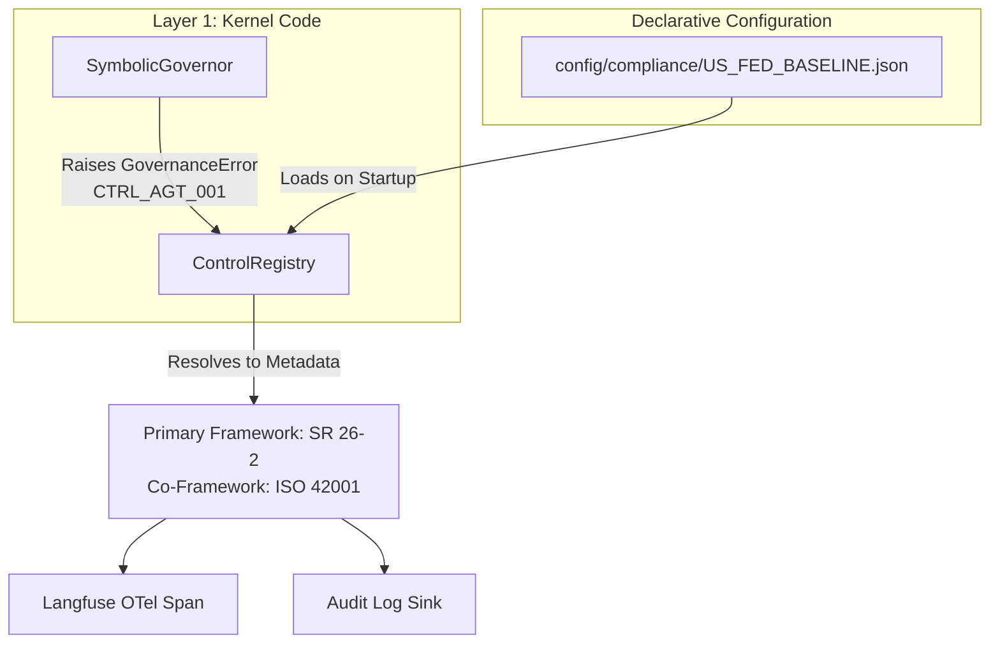

# Extensibility Architecture: Domain-Agnostic Core & Declarative Schema Ingestion

| Field              | Value                     |
| ------------------ | ------------------------- |
| **Classification** | PUBLIC                    |
| **Date**           | 2026-09-29                |
| **Version**        | v3.0.1                    |
| **Status**         | Current State + Roadmap   |

---

## Executive Summary

The CAGE runtime execution engine is a **domain-agnostic, invariant state-space controller**. The underlying kernel does not maintain programmatic awareness of specific statutory codes, clinical trial phases, or industrial automation rules. Instead, it models all governance criteria as mathematical boundaries mapped to an immutable state-space constraint:

$$h(x) \geq 0$$

Where $h(x)$ represents the Control Barrier Function (CBF) defining the boundary of the admissible operational space.

By separating the deterministic execution engine from the compliance payload it enforces, the architecture enables domain extensibility without kernel modification. Domain semantics (actions, invariants, thresholds, STPA hazards, critics, causal graphs) are contributed by a Layer 2 domain plugin (`src/cage_finance/`, `src/cage_healthcare/`, `src/cage_physical_ai/`); regulatory citations are supplied by declarative JSON compliance profiles. New regulatory domains (pharmaceutical GxP, industrial NIST 800-82, defense ITAR) are onboarded by authoring a plugin and a profile — the kernel invariants remain unchanged.

**Trust Boundaries**:
- **Upstream (Domain Configurations)**: The kernel treats all declarative JSON profiles and threshold configurations as trusted regulatory parameterizations.
- **Internal (Control Registry)**: Python source code strictly references stable internal control IDs (`CTRL_*`). The `ControlRegistry` maps these to dynamic domain citations without kernel coupling.
- **Kernel purity (Gate G3)**: [`scripts/check_import_boundaries.py`](../../scripts/check_import_boundaries.py) fails CI if `src/gateway/` imports a domain plugin or vendor SDK, contains a domain path or action/field literal (`FORBIDDEN_DOMAIN_LITERALS`), or defines a domain or vendor class (`FORBIDDEN_KERNEL_DEFINITIONS`).

This document describes both the **current implementation** (grounded in source code) and the **architecture roadmap** for multi-domain extensibility.

---

## Part 1 — Current Implementation (Verified)

The following capabilities are implemented, tested, and operational in the CAGE codebase.

### 1.1 The Domain-Agnostic Kernel

The CBF engine ([`src/gateway/governance/safety/cbf_engine.py`](../../src/gateway/governance/safety/cbf_engine.py)) implements a pure mathematical invariant with no domain-specific logic. `ControlBarrierFunction` is invariant-parametric: it must be constructed with an explicit declarative `InvariantModel` (`invariant_id`, `state_key`, `threshold_key`, `gamma`) and a domain `cost_resolver`, and has no finance defaults. The finance plugin's reference barrier is `CashBarrier` ([`src/cage_finance/invariants.py`](../../src/cage_finance/invariants.py)):

```
h(x) = cash_balance - min_cash_balance
```

where `min_cash_balance = 1000.0` and `gamma = 0.5` are read from the `domains.finance.cbf` section of [`config/governance_thresholds.json`](../../config/governance_thresholds.json).

The enforcement boundary:

$$h(x_{t+1}) \geq (1 - \gamma) \cdot h(x_t) \quad \text{and} \quad h(x_{t+1}) \geq 0$$

Where:
- $x$ = continuous state variable named by the invariant's `state_key`
- $\gamma$ = decay coefficient named by the invariant (and matched to its threshold section)
- $h(x) = 0$ defines the critical safety boundary

**Domain substitution** (barrier declarations at HEAD):
- *Finance*: $x$ = `cash_balance` (`CashBarrier`, state key `safety:current_cash`)
- *Healthcare*: $x$ = serum drug concentration (`SerumConcentrationBarrier`, state key `safety:serum_concentration`, threshold `domains.healthcare.min_therapeutic_concentration`)
- *Physical AI*: $x$ = human separation distance, end-effector velocity, joint torque (`domains.physical_ai.*`; see [PHYSICAL_AI_GOVERNANCE_FRAMEWORK.md](PHYSICAL_AI_GOVERNANCE_FRAMEWORK.md))

The barrier condition `h(x) >= 0` accepts any continuous scalar ([`evaluate_barrier()`](../../src/gateway/governance/safety/cbf_engine.py)). The financial semantics are injected by the finance plugin and its `domains.finance` threshold section, not hardcoded in the kernel. This is the structural property that enables domain generalization.

**Operational guarantees:**
- **Fail-Closed Substrate**: If the CBF state source (e.g., Redis) is unreachable, the evaluation defaults to `BLOCKED`; there is no fail-open override. This fail-safe property is invariant across all applied domains.
- **TOCTOU Resolution via Safe Set**: The post-HITL re-validation phase ensures that execution remains within the mathematical Safe Set by strictly re-evaluating both physical thresholds (CBF) and logical policies (OPA) on a fresh state snapshot immediately prior to actuation.
- **External Provider Determinism**: All integrations with external normative data providers are structurally constrained. Network calls cannot block the hot-path; external validations are strictly asynchronous or handled via the DeferQueue, preserving sub-millisecond local invariant enforcement.

### 1.2 The ControlRegistry: Decoupled Compliance Metadata

The [`ControlRegistry`](../../src/gateway/governance/constants.py) singleton is a thread-safe, region-switchable resolver that translates stable internal control IDs (`CTRL_*` enum members) to external regulatory metadata at runtime.

**Key design principle:** Python source code references *only* stable `GovernanceControl` enum members. All framework citation strings (`SR 26-2 §IV.B`, `ISO 42001 §A.5.2`, `MAS FEAT Principle 4.2`) live exclusively in declarative JSON profiles loaded at container initialization.

```
src/gateway/governance/constants.py
├── GovernanceControl(Enum)        # Stable internal IDs — never change
│   ├── CTRL_AGT_001               # Agentic confidence threshold
│   ├── CTRL_WAL_002               # Write-Ahead Log atomicity
│   ├── CTRL_TEL_003               # Telemetry live validation
│   ├── CTRL_MRM_004               # Traditional MRM validation
│   ├── CTRL_OPA_005               # OPA policy enforcement
│   ├── CTRL_FRIA_006              # EU AI Act FRIA (EU_ECB only)
│   ├── CTRL_TQP_007               # Token quota enforcement
│   └── CTRL_FTRA_001              # FTRA reachability gate
│
└── ControlRegistry (singleton)    # Resolves CTRL_* → regulatory metadata
    ├── _load_registry()           # Reads JSON from config/compliance/
    ├── get_mapping(control)       # Returns {primary_framework, co_frameworks, ...}
    ├── get_mapping_safe(control)  # Returns None for region-absent controls
    └── reconfigure(region)        # Hot-swap regional profile at runtime
```

The `ControlRegistry` intercepts internal assertions and enriches them with external regulatory metadata:



Domain plugins can add controls on top of the regional baseline: each `PluginContribution.compliance_overlay_dirs` entry (e.g. [`src/cage_physical_ai/config/compliance/`](../../src/cage_physical_ai/config/compliance/)) is registered by `bootstrap_governor()` at startup.

### 1.3 Active Regional Compliance Profiles

Three production profiles are implemented and loadable via `CAGE_DEPLOYMENT_REGION`:

| Region     | Profile File                        | Primary Framework            | Controls Defined |
| ---------- | ----------------------------------- | ---------------------------- | ---------------- |
| `US_FED`   | [`US_FED_BASELINE.json`](../../config/compliance/US_FED_BASELINE.json)     | SR 26-2 / ISO 42001          | 5                |
| `EU_ECB`   | [`EU_ECB_BASELINE.json`](../../config/compliance/EU_ECB_BASELINE.json)     | EU AI Act / DORA / GDPR      | 6 (+FRIA)        |
| `APAC_MAS` | [`APAC_MAS_BASELINE.json`](../../config/compliance/APAC_MAS_BASELINE.json) | MAS FEAT / MAS TRM / ISO 42001 | 5              |

**Runtime behavior:** Setting `CAGE_DEPLOYMENT_REGION=EU_ECB` causes the ControlRegistry to load the EU profile at container startup. All `GovernanceError` payloads, OTel span attributes, SIEM emissions, and OSCAL findings automatically reference EU AI Act citations instead of SR 26-2 — with zero code changes.

### 1.4 The SymbolicGovernor Pipeline

The [`SymbolicGovernor`](../../src/gateway/governance/governor/governor.py) runs a two-phase pipeline ([`pipeline.py`](../../src/gateway/governance/governor/pipeline.py)): Phase 1 read-only stages, then Phase 2 mutating tiers whose commits are held in a `ReservationScope` and rolled back unless a seal is issued. The kernel owns four domain-agnostic stages ([`kernel_stages()`](../../src/gateway/governance/governor/assembly.py)); everything else is a `GovernanceTierPlugin` contributed by the active domain plugin. Tier labels follow `TIER_LABELS` in [`proof/model.py`](../../proof/model.py):

| Tier | Interceptor                | Invariant                                              | Owner |
| ---- | -------------------------- | ------------------------------------------------------ | ----- |
| 0.5  | FTRA Reachability Gate     | Irreversible-terminal classification from the domain's FTRA registry | Kernel stage (registry from the domain's `DomainConfig`) |
| 1    | STPA/UCA Validator         | Hazard predicates compiled from STPA YAML               | Kernel stage (UCA rules from `PluginContribution.uca_rules`) |
| 2    | Agentic Confidence Check   | `confidence_score ≥ threshold` (`confidence.agent_threshold`) | Kernel stage |
| 3a   | Control Barrier Function   | `h(x) ≥ 0` (state-space boundary)                       | Domain tier (finance `cbf`; healthcare dose barrier; physical-AI kinematic barrier) |
| 3b   | OPA Rego Policy            | Declarative policy rules in the domain's OPA package    | Kernel stage (package from `DomainConfig.opa_package`) |
| 4    | Fiscal Limit Reservation   | Atomic Redis reservation against the daily fiscal cap   | Finance tier (`FiscalLimitGuard`, [`src/cage_finance/safety/`](../../src/cage_finance/safety/)) |
| 5    | Multi-Model Consensus      | Heterogeneous critic agreement (kernel `ConsensusGate`, domain-injected critics) | Domain tier |
| 6    | DoWhy Causal Gatekeeper    | Placebo refutation `p-value ≥ 0.05` (kernel engine, domain-injected `CausalSpec`) | Finance tier |

The FULL profile reserves a Tier 7 `fria` slot, but no FRIA stage or tier is registered at HEAD (see §2.5.2). Kernel stages carry no domain vocabulary; domain tiers live in `src/cage_{domain}/tiers/` and reach the kernel only through `PluginContribution`. Decision boundaries are parameterized through [`governance_thresholds.json`](../../config/governance_thresholds.json) — kernel sections at the top level, domain sections under `domains.<domain>` — and the regional compliance profile, not through imperative code branches.

#### Composition root

A governor is built in exactly one place. The active domain plugin (`CAGE_DOMAIN`) returns its seams as data from `CagePlugin.contribute()` — a frozen [`PluginContribution`](../../src/gateway/governance/contracts.py) holding its tiers, CBF invariants, STPA UCA rules and saga compensators, narrowers, `domains.<domain>` threshold schemas, ground-truth providers, safety filter, consensus provider or `ConsensusContribution`, tool provider, compliance overlays, rails and background tasks. [`assemble_governor()`](../../src/gateway/governance/governor/assembly.py) validates all contributions together and refuses startup on:

- a contribution whose `domain` differs from the plugin `name`, or a duplicate domain;
- a duplicate threshold section, or a contributed section missing from `domains.*` in `governance_thresholds.json` or failing its schema;
- a slot collision (two tiers claiming one action at the same phase and order);
- an IRREVERSIBLE_TERMINAL action in the domain's FTRA registry that no tier claims;
- two contributions filling one engine slot (`safety_filter`, `consensus`, `standing_projector`), or a duplicate UCA rule or ground-truth provider;
- an invariant failing V1-V4.

It then builds an immutable `SymbolicGovernor`; engine slots no plugin fills keep deny-by-default null objects (`NullSafetyFilter`, `NullConsensusProvider`). [`bootstrap_governor()`](../../src/gateway/governance/governor/bootstrap.py) wraps assembly with the startup posture check ([`posture.py`](../../src/gateway/governance/governor/posture.py)); servers store the result on `app.state.governor` and pass it explicitly to every caller. There is no process-wide governor and nothing runs at import time.

### 1.5 Fail-Closed Posture

The CBF engine defaults to `BLOCKED` when its state source (Redis) is unreachable. This fail-closed enforcement is unconditional: the former `CBF_FAIL_OPEN` override has been removed.

The system will not permit an action it cannot independently verify as safe. This property is invariant across all domains.

### 1.6 Compliance Assessment State Semantics

The compliance output model of the domain-agnostic kernel uses a **four-state OSCAL result vocabulary** aligned with NIST SP 800-53A §3.2 assessment attribute semantics. Every [`OscalFinding`](../../src/compliance_bridge/types.py) produced by the compliance bridge carries exactly one of these states:

| `OscalResult` | OSCAL Wire Value | Meaning | Auditor Visibility |
|---|---|---|---|
| `PASS` | `satisfied` | Control evaluated; evidence meets threshold | ✅ Satisfied |
| `FAIL` | `not-satisfied` | Control evaluated; evidence below threshold | ❌ Not Satisfied |
| `NOT_APPLICABLE` | `not-applicable` | Control does not apply to this component type (deliberate scoping decision) | ℹ️ Scoped Out |
| `ERROR` | `error` | Control applies but scanner/collector failed to gather evidence | 🚨 Blind Spot |

#### Why ERROR ≠ NOT_APPLICABLE

`NOT_APPLICABLE` is a **deliberate architectural scoping decision** — the control is out of scope for this component by design (e.g., a network isolation control applied to a stateless function). It is set intentionally by a human or policy author.

`ERROR` is a **runtime evidence-collection failure** — the control is in scope, the scanner attempted to gather evidence, and the attempt failed (e.g., `"fetch failed"`, timeout, missing credentials). Masking an `ERROR` as `NOT_APPLICABLE` hides a security blind spot from auditors and violates the completeness requirement of most compliance frameworks.

> **Invariant:** A data-collection failure MUST be reported as `ERROR`. It MUST NOT be silently dropped or coerced to `NOT_APPLICABLE`.

#### Kernel Touch Points

| Component | Role |
|---|---|
| [`src/compliance_bridge/types.py`](../../src/compliance_bridge/types.py) | Defines `OscalResult = Literal["PASS", "FAIL", "NOT_APPLICABLE", "ERROR"]` |
| [`src/compliance_bridge/oscal_parser.py`](../../src/compliance_bridge/oscal_parser.py) | `_map_state()` — unrecognised OSCAL `status.state` → `ERROR` (not `NOT_APPLICABLE`) |
| [`src/compliance_bridge/oscal_exporter.py`](../../src/compliance_bridge/oscal_exporter.py) | `_finding_to_state()` — `ERROR` → `"error"` wire value; `findings_from_metrics_dict()` — fetch errors emit `ERROR` findings |
| [`src/compliance_bridge/audit_workflow.py`](../../src/compliance_bridge/audit_workflow.py) | `_step4_alert_on_critical_fail()` — critical-control alert filter matches `result in ("FAIL", "ERROR")` |

#### Critical-Control Alert Behaviour

Controls in `CRITICAL_CONTROLS = {"A.9.2", "SC-4", "A.8.4"}` trigger Slack/PagerDuty alerts on **both** `FAIL` and `ERROR`. An `ERROR` on a critical control is treated with the same urgency as a `FAIL` because the system cannot assert the control is satisfied — the absence of evidence is itself a risk signal.

This property is invariant across all domains that extend the compliance bridge.

---

## Part 2 — Architecture Roadmap (Partial Implementation)

> **Note:** The following sections describe the target extensibility architecture. §2.5 (External Normative Provider Interface) and §2.6 (Vendor-Isolated Integrations) are **implemented**; the §2.5.2 adaptive FRIA gate is implemented but not wired into the governor pipeline. §2.3 and §2.4 record which generalization steps have landed. The remaining sections are architecture designs illustrating the generalization path enabled by the domain-agnostic kernel described in Part 1.

### 2.1 Domain Profile Schema

The existing `ControlRegistry` JSON profile format generalizes naturally to non-financial domains. The proposed schema extends the current `{REGION}_BASELINE.json` pattern to support arbitrary domain verticals:

```jsonc
// PROPOSED: config/compliance/PHARMA_GxP_21CFR11.json
{
  "_schema_version": "0.1.0",
  "_region": "US_FDA",
  "_domain": "pharmaceutical",
  "_primary_prudential_authority": "FDA / CDER / CBER",

  "CTRL_AGT_001": {
    "internal_id": "THR-CONF-001",
    "primary_framework": "21 CFR Part 11 §11.10(a)",
    "co_frameworks": ["EU GMP Annex 11 §4.8"],
    "legacy_citation": "ICH Q10 §3.2.1",
    "scope": "agentic",
    "description": "Minimum model confidence for autonomous dosage adjustment recommendation."
  },

  "CTRL_MRM_004": {
    "internal_id": "THR-MRM-004",
    "primary_framework": "ICH Q8(R2) — Design Space Validation",
    "co_frameworks": ["FDA Process Validation Guidance Stage 3"],
    "legacy_citation": "GxP Model Lifecycle",
    "scope": "traditional_ml",
    "description": "CBF state variable reinterpreted: h(x) = active_ingredient_concentration - min_therapeutic_threshold."
  }
}
```

**Key insight:** The `GovernanceControl` enum members (`CTRL_AGT_001`, `CTRL_MRM_004`, etc.) remain unchanged. Only the metadata payload changes. The SymbolicGovernor pipeline executes identically — it checks `h(x) ≥ 0` regardless of whether `x` represents cash balance, API concentration, or actuator torque.

### 2.2 Proposed Domain Profiles

| Profile                     | Domain              | CBF State Variable `x`                     | Primary Framework          |
| --------------------------- | ------------------- | ------------------------------------------- | -------------------------- |
| `FINANCE_SR26_2_DORA`       | Financial Services  | `cash_balance` (USD)                        | SR 26-2 / DORA             |
| `PHARMA_GxP_21CFR11`        | Pharmaceutical      | `active_ingredient_concentration` (mg/mL)   | 21 CFR Part 11 / ICH Q8   |
| `OT_NIST_800_82_REV3`       | Industrial OT/ICS   | `actuator_position` (engineering units)      | NIST 800-82 Rev 3         |
| `DEFENSE_ITAR_CMMC`         | Defense / Aerospace | `decision_authority_level` (clearance tier)  | ITAR / CMMC Level 3       |

### 2.3 CBF Generalization Pattern

The CBF kernel requires no modification to support new domains. A domain declares an `InvariantModel`, a cost resolver, and a `domains.<domain>` threshold section in its plugin:

```
Finance (implemented):      h(x) = cash_balance - min_cash_balance
Healthcare (implemented):   h(x) = serum_concentration - min_therapeutic_concentration
Physical AI (implemented):  h(x) = separation_distance - min_separation_distance (plus velocity, torque)
Pharma (Proposed):          h(x) = API_concentration - min_therapeutic_threshold
Industrial (Proposed):      h(x) = actuator_position - min_safe_position
```

In all cases, the runtime enforcement is identical:
- If `h(x_next) < (1 - γ) · h(x_t)` → **BLOCK**
- If `h(x_next) < 0` → **BLOCK** (critical boundary violation)

The decay coefficient `γ`, the state key, and the minimum threshold come from the plugin's invariant and its threshold section; external ground truth comes from the `GroundTruthProvider` the plugin registers for that `invariant_id`. Healthcare and physical-AI domains cannot yet be activated (no `DomainConfig`; POAM-2026-077 in [`docs/POAM.md`](../POAM.md)).

#### Formal Mathematical Invariant & TOCTOU Resolution

To guarantee that the continuous state trajectory of the environment cannot outpace the discrete guard conditions during HITL suspension, CAGE defines a mathematically bounded Safe Set. The post-HITL re-validation node resolves the TOCTOU gap by executing a deterministic acceptance function evaluated strictly over a fresh price snapshot:

$$\text{SAFE} \iff \left( \frac{|P_{\text{fresh}} - P_{\text{stale}}|}{P_{\text{stale}}} \le \text{max\_slippage\_pct} \right) \land \left( \text{CBF}(P_{\text{fresh}}, \text{amount}) \ge 0 \right) \land \left( \text{OPA}(P_{\text{fresh}}, \text{params}) = \text{ALLOW} \right)$$

This formal boundary definition ensures that trade execution is locked to a deterministic evaluation of both physical thresholds (CBF) and logical policies (OPA) on the same, fresh pricing sample. It mathematically prevents "ghost-state" execution where the environment drifts past policy limits while the system remains paused for human review.

### 2.4 Implementation Requirements

To fully realize the multi-domain architecture, the following engineering work is required:

| Requirement                          | Current State                                        | Target State                                                  |
| ------------------------------------ | ---------------------------------------------------- | ------------------------------------------------------------- |
| **Profile Loading**                  | JSON read from `config/compliance/` at startup, plus plugin compliance overlays | Same mechanism, extended schema with `_domain` field          |
| **CBF State Provider Interface**     | Implemented: the CBF takes the plugin's `InvariantModel.state_key`; external ground truth comes through `GroundTruthProvider` and `GroundTruthReconciler` ([`reconciliation/daemon.py`](../../src/gateway/governance/reconciliation/daemon.py)) | Real (non-simulated) ground-truth sources per domain |
| **Domain-Specific Validators**       | Implemented for STPA: each plugin compiles its own UCA rules and contributes them via `PluginContribution.uca_rules` | Optional pre-tier validators (e.g., `MedDRACodingValidator`)  |
| **Threshold Profile Generalization** | Implemented: domain thresholds live under `domains.<domain>` in `governance_thresholds.json`, validated against each plugin's schema at assembly | Per-profile (regional) overrides                              |
| **Domain Activation**                | Only `finance` declares a `DomainConfig`; `CAGE_DOMAIN=healthcare` / `physical_ai` refuse to start | FTRA registry and OPA package for every domain                |
| **Telemetry Isolation**              | Dual Langfuse project (main / compliance)             | Configurable telemetry isolation modes per domain requirement |
| **Network Isolation**                | Kubernetes NetworkPolicy + GKE FQDNNetworkPolicy + namespace segregation | Same mechanism, domain-specific policy templates              |

### 2.5 External Normative Provider Interface ✅ IMPLEMENTED

> **Status:** Implemented in v2.1.0. See [`normative_provider.py`](../../src/gateway/governance/normative_provider.py).

The CAGE kernel enforces mathematical invariants locally (`h(x) ≥ 0`). But the *normative data* that parameterizes those invariants — which legal baselines apply, which attestations are required, which evidence seals must be appended — can originate from external sources. This section defines the integration architecture for external normative providers.

#### 2.5.1 Integration Taxonomy

All external provider interactions fall into three categories, each with a distinct hot-path impact profile:

| Category                  | Hot-Path Impact                           | Data Flow Direction       | Latency Contract                                    |
| ------------------------- | ----------------------------------------- | ------------------------- | --------------------------------------------------- |
| **Normative Data Supply** | None (boot-time + periodic)               | Provider → CAGE cache     | Boot-time only; no inline calls                     |
| **Attestation Logging**   | None (async fire-and-forget)              | CAGE → Provider           | Background; no acknowledgment wait                  |
| **External Validation**   | **Adaptive** (confidence-dependent)       | CAGE ↔ Provider           | Async at ≥0.95; sync gate at [0.70, 0.95); deny <0.70 |

**Critical constraint:** No external provider call may appear on the synchronous hot path between a user request entering the SymbolicGovernor pipeline and the governed response being returned. The CBF check ([`cbf_engine.py`](../../src/gateway/governance/safety/cbf_engine.py)) executes in sub-microseconds. The full two-phase governance pipeline (kernel stages plus the domain's tiers, §1.4) includes the OPA query (~10-50ms). Introducing a synchronous external HTTP call would trade model non-determinism for network non-determinism — violating the architectural guarantee that local enforcement is deterministic and bounded.

#### 2.5.2 Reference Handshake: 3-Endpoint External Provider

The following 3-endpoint HTTP contract defines the standard integration surface for external normative providers. It is designed to be provider-agnostic — any compliance SaaS, internal policy engine, or regulatory data feed that implements these three endpoints can integrate with CAGE without kernel modification.

```
┌──────────────────────────────────────────────────────────────────┐
│                     CAGE GKE Cluster                             │
│                                                                  │
│  ┌────────────────────┐     ┌──────────────────────────────────┐ │
│  │ Boot-Time Fetcher  │────►│ ControlRegistry (in-memory)      │ │
│  │ (container init)   │     │ + config/compliance/*.json cache │ │
│  └────────┬───────────┘     └──────────────┬───────────────────┘ │
│           │                                │                     │
│           │                    ┌───────────▼───────────┐         │
│           │                    │ SymbolicGovernor      │         │
│           │                    │ Two-Phase Pipeline    │         │
│           │                    │ (HOT PATH: no network)│         │
│           │                    └───────────┬───────────┘         │
│           │                                │                     │
│  ┌────────▼───────────┐     ┌──────────────▼───────────────────┐ │
│  │ Background Cron    │     │ Async Validation Sidecar         │ │
│  │ (6h poll interval) │     │ POST /validate → out-of-band     │ │
│  └────────┬───────────┘     │ GET /evidence  → async append    │ │
│           │                 └──────────────┬───────────────────┘ │
└───────────┼────────────────────────────────┼─────────────────────┘
            │                                │
            ▼                                ▼
┌──────────────────────────────────────────────────────────────────┐
│              External Normative Provider (Cloud)                 │
│                                                                  │
│  GET /legal-baseline/{region}     ← Normative Data Supply        │
│  POST /validate/fria              ← External Validation          │
│  GET /evidence-chain/{thread_id}  ← Attestation Logging          │
└──────────────────────────────────────────────────────────────────┘
```

##### Endpoint 1: `GET /legal-baseline/{region}` — Normative Data Supply

**Purpose:** Fetch the active legal/regulatory baseline for a deployment region.

**Integration pattern:** Boot-time initialization + periodic background refresh.

- **At container startup**, the gateway lifespan in [`hybrid_server.py`](../../src/gateway/server/hybrid_server.py) starts `NormativeProviderDaemon` ([`normative_provider.py`](../../src/gateway/governance/normative_provider.py)), which fetches the baseline and writes it to `config/compliance/{REGION}_BASELINE.json`.
- `ControlRegistry._load_registry()` then loads the profile identically to the current static-file path — no changes to the singleton.
- A background `asyncio.Task` polls the endpoint at a configurable interval (default: 6 hours) and calls `ControlRegistry.reconfigure()` if the baseline has changed.
- **The hot path never touches the network.** All lookups resolve against the in-memory singleton.

**Fallback chain** (in order):

| Level | Source                                          | Condition                           |
| ----- | ----------------------------------------------- | ----------------------------------- |
| 1     | External provider HTTP API                      | Provider reachable at boot          |
| 2     | Local cached copy (`config/compliance/*.json`)  | Provider unreachable; cache exists  |
| 3     | Static bundled profile (committed to repo)      | No cache; first cold-start          |
| 4     | `RuntimeError` → container fails to start       | No profile found at any level       |

This four-level fallback extends the existing `ControlRegistry` two-level chain (regional JSON → legacy JSON) without modifying the registry's loading logic.

##### Endpoint 2: `POST /validate/fria` — External Validation

**Purpose:** Submit a Fundamental Rights Impact Assessment (or equivalent domain-specific attestation) for external validation against the provider's normative database.

**Integration pattern:** Async out-of-band validation with revocation on failure.

```
Transaction enters SymbolicGovernor
        │
        ├──► CBF enforces h(x) ≥ 0 locally (sub-μs)        ← HOT PATH
        │
        ├──► OPA evaluates ALLOW/DENY locally (~10-50ms)    ← HOT PATH
        │
        └──► Response returned to caller                    ← HOT PATH ENDS
                 │
                 └──► [async] POST /validate/fria payload
                             │
                             ├── ✅ Provider confirms → no action
                             │
                             └── ❌ Provider flags legal gap
                                      │
                                      └──► Revoke agent session token
                                           Emit SIEM alert
                                           Log to compliance Langfuse project
```

**Design decision: RESOLVED — Adaptive Gating Primitive (v2.1.0)**

The binary async-vs-sync choice has been rejected. Instead, [`enforce_fria_boundary()`](../../src/gateway/governance/normative_provider.py) implements an **Asymmetric, Adaptive Runtime Policy** that maps the blocking semantic directly to the model's confidence boundary:

| Confidence Zone | Score Range | Execution Path | Hot-Path Impact |
| --- | --- | --- | --- |
| **HIGH** | ≥ 0.95 (`THRESHOLDS.confidence.agent_threshold`) | `ASYNC_ATTESTATION` — fire-and-forget | 0ms |
| **AMBIGUOUS** | [0.70, 0.95) (`DEFER_CONFIDENCE_THRESHOLD`) | `SYNC_GATE` — transaction frozen in DEFER queue until provider responds | Up to 5s (configurable) |
| **LOW** | < 0.70 | `LOCAL_HARD_DENY` — no external call | 0ms |

This anchors to the existing `DEFER` state machine ([`defer_queue.py`](../../src/gateway/governance/defer_queue.py)) via the `DeferReason.EXTERNAL_VALIDATION` enum member. The adaptive gate is designed to run after all local tiers — if local governance already DENY'd, the external provider is never contacted.

**Wiring status at HEAD:** `enforce_fria_boundary()` is implemented and tested, but the governor pipeline does not call it. The FULL profile in [`pipeline.py`](../../src/gateway/governance/governor/pipeline.py) reserves a Tier 7 `fria` slot, yet no stage or tier fills it. The only FRIA-related behaviour in the live pipeline is the FRIA-zone defer threshold applied by the confidence stage ([`confidence.py`](../../src/gateway/governance/governor/stages/confidence.py)).

##### Endpoint 3: `GET /evidence-chain/{thread_id}` — Attestation Logging

**Purpose:** Submit the local governance evidence hash and retrieve an externally sealed attestation for the audit trail.

**Integration pattern:** Async background append.

- After the SymbolicGovernor pipeline completes, the governance evidence (KMS-signed, hash-chained) is emitted to the compliance Langfuse project.
- Simultaneously, an async task submits the evidence hash to the external provider.
- When the provider returns the external seal, it is appended to the audit record.
- **Zero blocking on the transaction path.** If the provider is unreachable, the local evidence chain remains intact and the external seal is retried on a backoff schedule.

#### 2.5.3 Architectural Precedent: the Ground-Truth Reconciler

This async-fetch-sign-cache-and-fail-closed pattern is not a design proposal — it is already implemented in the CAGE codebase.

The reconciliation daemon ([`reconciliation/daemon.py`](../../src/gateway/governance/reconciliation/daemon.py)) implements exactly this architecture for CBF ground-truth reconciliation. It signs snapshots with its own reconciler key (`RECONCILER_KMS_KEY`), and the CBF verifies them only against reconciler trust anchors ([`reconciliation/trust.py`](../../src/gateway/governance/reconciliation/trust.py)):

| Reconciliation Worker Pattern                | External Normative Provider Equivalent         |
| -------------------------------------------- | ---------------------------------------------- |
| Domain `GroundTruthProvider` read (per `invariant_id`) | `GET /legal-baseline/{region}` → HTTP          |
| KMS-sign payload before Redis write            | KMS-sign baseline before ControlRegistry load  |
| `GroundTruthReconciler` polling (or `RECONCILIATION_SINGLE_SHOT` CronJob pass) | Background cron polling `/legal-baseline`      |
| `read_verified_state()` → returns `None` if stale or signature invalid | `ControlRegistry` → fails if no profile loaded |
| CBF fails closed on stale/absent balance       | ControlRegistry raises `RuntimeError` on missing profile |
| Simulated ground-truth sources with fault injection for dev/CI | Static JSON profiles for dev/CI                |

The reconciliation worker proves the pattern is operationally sound: async external fetch, cryptographic signing, local cache with TTL, fail-closed on stale data.

#### 2.5.4 Provider Registration

External normative providers are configured via environment variables, following the same pattern as `RECONCILIATION_PROVIDER`:

```bash
# External normative provider configuration
CAGE_NORMATIVE_PROVIDER=provider_01          # Provider name (default: "static")
CAGE_NORMATIVE_ENDPOINT=https://api.example.com/normative
CAGE_NORMATIVE_POLL_INTERVAL_HOURS=6         # Background refresh interval
CAGE_NORMATIVE_BOOT_TIMEOUT_SECONDS=10       # Max wait at container init
CAGE_NORMATIVE_API_KEY_SECRET=projects/cage-prod/secrets/normative-provider-api-key
```

When `CAGE_NORMATIVE_PROVIDER=static` (default), the ControlRegistry loads from `config/compliance/` as it does today. No external dependency is introduced unless explicitly configured.

#### 2.5.5 Runtime Adapter Taxonomy ✅ IMPLEMENTED

> **Status:** Implemented in v3.0.1. See [`attestation_aggregator.py`](../../src/gateway/governance/attestation_aggregator.py) and [`execution_actuator.py`](../../src/gateway/governance/execution_actuator.py).

CAGE supports three distinct adapter loading patterns, each optimized for its specific integration boundary and cardinality:

| Pattern | Adapter Type | Environment Variable | Cardinality | Runtime Behavior | Use Case |
|---------|--------------|---------------------|-------------|------------------|----------|
| **Multi-Active Composite** | Attestation Providers | `CAGE_ATTESTATION_PROVIDERS` | 0..N | Background polled; results aggregated via consensus | External compliance attestations (CERs, blueprints, warrants) polled from multiple providers and merged into governance envelope |
| **Multi-Active Routed** | Execution Actuators | `CAGE_ACTIVE_ACTUATORS` | 0..N | Action-claim dispatch; first match wins | Downstream execution gateways registered by capability claim (e.g., `trade.*`, `transfer.*`); registry routes execution clearances to the actuator handling each action pattern |
| **Single-Active Exclusive** | Normative Provider | `CAGE_NORMATIVE_PROVIDER` | 0..1 | Singleton instance selected per deployment | Single normative baseline engine per instance; exactly one provider supplies legal/regulatory baselines for the deployment region |

##### Multi-Active Composite: Attestation Providers

Attestation providers implement the [`AttestationProvider`](../../src/gateway/governance/attestation_provider.py) protocol and are aggregated by [`AttestationAggregator`](../../src/gateway/governance/attestation_aggregator.py). The aggregator polls all registered providers at a configurable interval (default: 6 hours, matching THR-AUD-002 Lula cadence) and caches results in-memory. Cached attestations are embedded into [`GovernanceEnvelope`](../../src/gateway/governance/governance_envelope.py) instances at build time with zero per-transaction network calls.

**Configuration:**

```bash
# Comma-separated list of provider names (empty = hermetic dev/CI mode)
CAGE_ATTESTATION_PROVIDERS=provider_02,provider_05

# Optional: Override default 6-hour poll interval
CAGE_ATTESTATION_POLL_INTERVAL_S=21600
```

**Supported providers:** `provider_02` (CER attestations), `provider_05` (AO warrants/blueprints).

**Fail-closed semantics:** If any provider fails during boot-fetch, the aggregator logs a warning and continues with the successfully-fetched subset. Stale attestations are flagged via `_last_fetch_succeeded: bool` signal. The governance envelope includes all available attestations; missing attestations do not block transactions (fail-open on staleness, fail-closed on signature verification).

##### Multi-Active Routed: Execution Actuators

Execution actuators implement the [`ExecutionActuator`](../../src/gateway/governance/seams/actuation.py) protocol and are registered in the [`ActuatorRegistry`](../../src/gateway/governance/execution_actuator.py). Each actuator declares a set of action-claim patterns (e.g., `{"trade.*", "transfer.*"}`) it handles. The registry dispatches [`ExecutionClearance`](../../src/gateway/governance/seams/actuation.py) requests to the first actuator matching the action claim.

**Configuration:**

```bash
# Comma-separated list of actuator names (empty = no downstream execution)
CAGE_ACTIVE_ACTUATORS=actuator_01
```

**Supported actuators:** `actuator_01` (Archytan mTLS execution gateway with quorum signatures).

**Fail-closed semantics:** If no actuator claims an action, `ActuatorRegistry.get_actuator()` returns `None`. The consequence gateway ([`consequence_gateway.py`](../../src/gateway/governance/consequence_gateway.py)) must handle unclaimed actions explicitly (typically by raising `GovernanceError` or logging a warning).

###### Actuator Adapter Contract: Outbound Credential Injection

Actuator adapters accept an optional `CredentialBrokerAdapter` (see *Optional Cross-Cutting: Credential Broker* below) and, when one is supplied, extend the outbound HTTP contract with broker-supplied headers:

| Element | Signature / Location | Notes |
|---|---|---|
| Adapter constructor | `Actuator01Adapter(client, signer, signer_resolver=None, policy_signer=None, credential_broker=None)` | `credential_broker` defaults to `None`; also accepted by `Actuator01Adapter.from_env()`. |
| Transport | [`ActuatorHttpClient.submit_envelope(..., extra_headers: dict[str, str] \| None = None)`](../../src/integrations/actuator_01/client.py) | `extra_headers` is merged over the wire headers (`X-Secure-Tenant-ID`, `X-Operator-URNs`, `X-Archytan-Signatures`, `X-Execution-Assertion`, `X-Timestamp`) immediately before the POST. Header *values* are never logged. |
| Dispatch call | [`adapter.py`](../../src/integrations/actuator_01/adapter.py) passes `extra_headers=extra_headers if extra_headers else None` | With no broker configured, `extra_headers` is `None` and the wire contract is byte-identical to the pre-broker behaviour. |

Because the canonical envelope is built *after* the credential fetch and the headers are never folded into it, credential injection does not perturb JCS canonicalization, the envelope digest, the 120-byte assertion, or the quorum signatures.

##### Optional Cross-Cutting: Credential Broker

Outbound tool credentials are supplied through the [`CredentialBrokerAdapter`](../../src/gateway/governance/seams/credential_broker.py) protocol. The kernel declares the protocol and its exception hierarchy only; every implementation — vault client, workload-identity exchange, cloud secret manager — is a Layer 3 concern and is injected into the actuator at construction time.

```python
class CredentialBrokerAdapter(Protocol):
    async def fetch_credential(
        self,
        agent_svid: str,
        tool_name: str,
        scope: str | None = None,
    ) -> dict[str, str]: ...
```

| Exception | Meaning |
|---|---|
| `CredentialBrokerError` | Base class; also covers transient failures (network, vault unavailable). |
| `CredentialNotFound` | No matching secret exists for the requested tool. |
| `CredentialAccessDenied` | The SVID is not authorized for the requested credential. |

All three are re-exported from [`src/gateway/governance/seams/__init__.py`](../../src/gateway/governance/seams/__init__.py).

**Implementer obligations** (stated in the protocol docstring, enforced by the implementation, not by the kernel):

- Validate the SVID signature before issuing any credential.
- Scope credentials to the requested `tool_name` (least privilege).
- Never log or cache the returned mapping beyond the immediate dispatch.
- Fail closed: raise on authorization failure rather than returning empty headers.
- Be safe for concurrent access.

**Fail-closed semantics:** The reference actuator treats *any* broker exception as terminal — it returns `ActuationReceipt(accepted=False, retryable=False)` with a single `CREDENTIAL_BROKER_FAILED` finding, records an `ACTUATION_REFUSAL_RECEIPT` in [`EvidenceStreamSink`](../../src/gateway/governance/evidence/stream.py) via [`ingest_actuation_receipt()`](../../src/gateway/governance/execution_actuator.py), and performs no network dispatch. See [`CONSEQUENCE_GATEWAY.md §2.1`](CONSEQUENCE_GATEWAY.md) for the full ALLOW-path gate sequence and [`tests/test_execution_actuator_broker.py`](../../tests/test_execution_actuator_broker.py) for the behavioural contract.

**Hermetic default:** no broker is configured unless one is explicitly constructed and injected, so local development and CI runs dispatch without outbound credentials.

##### Single-Active Exclusive: Normative Provider

Normative providers implement the [`NormativeProvider`](../../src/gateway/governance/normative_provider.py) protocol and supply legal/regulatory baselines for the deployment region. Exactly one normative provider is active per instance; the provider is selected via `CAGE_NORMATIVE_PROVIDER` environment variable.

**Configuration:**

```bash
# Provider name: "static" (default, load from config/compliance/*.json) or "provider_01"
CAGE_NORMATIVE_PROVIDER=provider_01

# Provider-specific configuration (example for provider_01)
CAGE_NORMATIVE_ENDPOINT=https://api.example.com/normative
CAGE_NORMATIVE_API_KEY_SECRET=projects/cage-prod/secrets/normative-provider-api-key
```

**Fail-closed semantics:** If the configured normative provider is unreachable during boot-time baseline fetch, the system falls back to cached/static baselines per the four-level fallback chain (§2.5.1). If no baseline is available at any level, the container fails to start with `RuntimeError`.

##### Hermetic Development and CI Mode

All three adapter types default to hermetic mode when their respective environment variables are unset or empty:

- `CAGE_ATTESTATION_PROVIDERS=""` → `AttestationAggregator` returns zero providers; governance envelopes include no external attestations.
- `CAGE_ACTIVE_ACTUATORS=""` → `ActuatorRegistry` remains empty; consequence gateway handles actions locally or raises errors for unclaimed patterns.
- `CAGE_NORMATIVE_PROVIDER="static"` → `ControlRegistry` loads baselines from committed `config/compliance/*.json` files only.

This ensures zero external network dependencies during local development and CI test suites, preserving fast, deterministic test execution.

### 2.6 Vendor-Isolated Integration Architecture ✅ IMPLEMENTED

> **Status:** Implemented in v2.1.0. See `src/integrations/`.

All third-party compliance and attestation provider adapters, cloud KMS providers, and storage/telemetry backends are consolidated under `src/integrations/{vendor}/`. This boundary prevents vendor SDK code from leaking into the governance kernel or gateway packages. Partner adapter tests live under `tests/integrations/`.

```
src/integrations/
├── __init__.py                # Provider factory (lazy-loading)
├── provider_01/
│   └── provider.py            # Provider01 (3-endpoint normative provider adapter)
├── provider_02/
│   ├── adapter.py             # AttestationCallback (LangGraph callback handler) + Client
│   └── provider.py            # Provider02 (NormativeProvider interface, JWK-verifiable CERs)
├── provider_03/, provider_05/ … provider_08/, actuator_01/
├── gcp/kms_provider.py        # GCPKMSProvider (Cloud KMS)
├── aws/kms_provider.py        # AWSKMSProvider (AWS KMS)
├── azure/kms_provider.py      # AzureKMSProvider (Azure Key Vault)
├── storage_gcs/cold_store.py  # GcsColdStore
├── storage_s3/cold_store.py   # S3ColdStore
├── telemetry_langfuse/        # Langfuse telemetry provider
└── nemo/                      # NeMo Guardrails (§4.3)
```

**Key architectural rules:**
- The signing *contract* and vendor-free software providers stay in the kernel ([`kms_signer.py`](../../src/gateway/governance/kms_signer.py)); the cloud KMS providers are vendor adapters in `src/integrations/{gcp,aws,azure}/kms_provider.py`, imported only inside [`signer_factory.py`](../../src/gateway/governance/signer_factory.py). The Redis evidence stream ([`evidence/stream.py`](../../src/gateway/governance/evidence/stream.py)) remains kernel substrate.
- Each vendor directory is an optional dependency group in `pyproject.toml` (roadmap: PEP 508 extras).
- The provider factory in `src/integrations/__init__.py` uses lazy imports — vendor SDKs are not loaded unless explicitly configured via environment variables.

### 2.7 What Does NOT Change

The following components are domain-invariant by design and require **zero modification** for new domain onboarding:

- `ControlBarrierFunction.evaluate_barrier()` — pure mathematical predicate over the invariant a plugin supplies
- `ControlRegistry` singleton — already reads arbitrary JSON profiles
- `SymbolicGovernor` two-phase pipeline and its kernel stages (FTRA, STPA, confidence, OPA) — evaluates mathematical/logical predicates only; domain tiers are contributed, not edited in
- `GovernanceControl` enum — stable internal IDs, independent of external frameworks
- OPA Rego policy structure — declarative rules parameterized by profile metadata
- Cloud KMS HSM signing — domain-agnostic cryptographic attestation
- STPA-to-Policy Compiler — ingests YAML hazard definitions, not domain logic; each domain's source compiles into that plugin's own package (e.g. `src/cage_finance/stpa/`)
- LangGraph Saga engine — atomic transaction guarantees independent of payload semantics

---

## Part 3 — The Reference Implementation: Financial Services

The `FINANCE_SR26_2_DORA` profile (current `US_FED_BASELINE.json`) serves as the active reference implementation demonstrating the full architecture:

### Implemented & Verified

| Capability                         | Source                                                                                   | Status       |
| ---------------------------------- | ---------------------------------------------------------------------------------------- | ------------ |
| CBF with `h(x) = cash - floor`    | [`src/gateway/governance/safety/cbf_engine.py`](../../src/gateway/governance/safety/cbf_engine.py) (atomic Lua script) + `CashBarrier` in [`src/cage_finance/invariants.py`](../../src/cage_finance/invariants.py) | ✅ Production |
| ControlRegistry (3 regions)        | [`constants.py`](../../src/gateway/governance/constants.py) (`ControlRegistry`)       | ✅ Production |
| Two-phase SymbolicGovernor + finance tiers | [`src/gateway/governance/governor/governor.py`](../../src/gateway/governance/governor/governor.py)            | ✅ Production |
| Cloud KMS HSM signing              | [`kms_signer.py`](../../src/gateway/governance/kms_signer.py), [`src/integrations/gcp/kms_provider.py`](../../src/integrations/gcp/kms_provider.py) | ✅ Production |
| Heterogeneous multi-model consensus | [`src/gateway/governance/consensus/engine.py`](../../src/gateway/governance/consensus/engine.py)                           | ✅ Production |
| Fail-closed CBF enforcement        | Unconditional (no `CBF_FAIL_OPEN` override exists)                                       | ✅ Verified   |
| DoWhy causal gatekeeper            | [`src/gateway/governance/causal/gatekeeper.py`](../../src/gateway/governance/causal/gatekeeper.py)            | ✅ Production |
| STPA-to-Policy Compiler            | [`stpa_compiler.py`](../../src/gateway/governance/stpa_compiler.py) → [`src/cage_finance/stpa/`](../../src/cage_finance/stpa/) | ✅ Production |
| External CBF reconciliation        | [`reconciliation/daemon.py`](../../src/gateway/governance/reconciliation/daemon.py) (`GroundTruthReconciler`) | ✅ Production (simulated ground-truth source) |
| External Normative Provider (§2.5)| [`normative_provider.py`](../../src/gateway/governance/normative_provider.py)          | ✅ Production |
| Provider 01 normative provider     | [`src/integrations/provider_01/provider.py`](../../src/integrations/provider_01/provider.py) | ✅ Production |
| Provider 02 attestation provider   | [`src/integrations/provider_02/provider.py`](../../src/integrations/provider_02/provider.py) | ✅ Production |
| OPA policy enforcement             | `config/opa/`                                                     | ✅ Production |
| NeMo input/output rails            | `config/rails/`                                                 | ✅ Production |
| LangGraph Saga engine              | `src/governed_financial_advisor/agents/`                                                   | ✅ Production |

### Architecture Insight: Why Financial Services First

Financial services is the highest-constraint domain for AI governance:
- **SR 26-2** mandates dual-track model risk management (traditional MRM + agentic oversight)
- **DORA Art. 10-12** requires ICT operational resilience with fail-closed defaults
- **ISO 42001** provides the international agentic AI management system baseline
- **MAS FEAT / EU AI Act** add jurisdictional overlay requirements

By solving the hardest regulatory domain first, the CAGE kernel naturally generalizes downward. Any domain with simpler governance requirements (fewer tiers, fewer controls, lower frequency validation) is a strict subset of the financial services enforcement surface.

---

## Part 4 — v2.1.0 Extensibility Additions ✅ IMPLEMENTED

Three new extensibility patterns were added in v2.1.0, each building on the domain-agnostic kernel described in Parts 1–3.

### 4.1 LangGraph Harness — Governance Node Composition (`src/gateway/governance/langgraph_harness/`)

The LangGraph harness (`src/gateway/governance/langgraph_harness/`) is the primary extensibility pattern for composing governance nodes into typed StateGraph pipelines. It provides two node factories and a shared type layer:

| Module | Role |
|---|---|
| [`nemo_node_factory.py`](../../src/gateway/governance/langgraph_harness/nemo_node_factory.py) | Wraps NeMo Guardrails as a typed LangGraph node; injects `NeMoRailsResult` into `AgentState` |
| [`opa_node_factory.py`](../../src/gateway/governance/langgraph_harness/opa_node_factory.py) | Wraps OPA policy evaluation as a typed LangGraph node; raises `GovernanceError` on DENY |
| [`types.py`](../../src/gateway/governance/langgraph_harness/types.py) | Shared `GovernanceNodeInput` / `GovernanceNodeOutput` TypedDicts consumed by both factories |

**Extension pattern**: A new governance check (e.g., a sanctions-list screener) is added by implementing a function with the `GovernanceNodeInput → GovernanceNodeOutput` signature and registering it as a node in the target StateGraph. No changes to the kernel are required.

The harness is consumed by the Governed Financial Advisor (`src/governed_financial_advisor/graph/graph.py`) and by the FTRA reachability gate (`src/gateway/governance/ftra/node_factory.py`), which uses the same node-factory pattern to inject FTRA analysis into any LangGraph graph.

### 4.2 Ingress Adapter Pattern — External Framework Integration (`src/gateway/governance/ingress/`)

The ingress adapter layer (`src/gateway/governance/ingress/`) provides a uniform integration surface for external governance frameworks. Each adapter translates a foreign schema into the CAGE `ControlRegistry` format without touching the kernel:

| Adapter | External Framework | Output |
|---|---|---|
| [`aaif_adapter.py`](../../src/gateway/governance/ingress/aaif_adapter.py) | AAIF (AI Assurance & Inspection Framework) | `ControlRegistry` entries |
| [`acs_adapter.py`](../../src/gateway/governance/ingress/acs_adapter.py) | ACS (AI Compliance Schema) | `ControlRegistry` entries |
| [`oscal_adapter.py`](../../src/gateway/governance/ingress/oscal_adapter.py) | OSCAL v1.1.2 component definitions | `ControlRegistry` entries |
| [`lula_adapter.py`](../../src/gateway/governance/ingress/lula_adapter.py) | Lula validation manifests | `ControlRegistry` entries |
| [`agp_policy_uploader.py`](../../src/gateway/governance/ingress/agp_policy_uploader.py) | AGP compiled policy bundles | OPA bundle push |
| [`policy_translator.py`](../../src/gateway/governance/ingress/policy_translator.py) | Multi-format policy detection | Normalized policy object |
| [`agw_adapter.py`](../../src/gateway/governance/ingress/agw_adapter.py) | Agent Gateway request format (Phase B absorption) | Governance pipeline inputs (OIDC-validated agent identity) |
| [`agent_registry_adapter.py`](../../src/gateway/governance/ingress/agent_registry_adapter.py) | CAGE-003 Agent Registry | SPIFFE trust-domain catalog |

**Extension pattern**: A new external framework is integrated by implementing the `IngressAdapter` protocol (translate foreign schema → `ControlRegistry` entry) and registering the adapter in the ingress `__init__.py`. The kernel's `ControlRegistry` and `SymbolicGovernor` pipeline are unaffected.

### 4.3 NeMo Guardrails — Neural-Symbolic Extension Point (`src/integrations/nemo/`)

NeMo Guardrails (`src/integrations/nemo/`) is the neural component of the neuro-symbolic governance architecture. It extends the kernel's symbolic pipeline with learned, Colang-expressed safety rails:

| Module | Role |
|---|---|
| [`manager.py`](../../src/integrations/nemo/manager.py) | Lifecycle management; hot-reload endpoint; Phase 4.2 async refactor |
| [`actions.py`](../../src/integrations/nemo/actions.py) | Gateway-internal NeMo action implementations (OPA check, CBF check, STPA check) |
| [`server.py`](../../src/integrations/nemo/server.py) | gRPC service exposing NeMo rails to external callers |
| [`src/integrations/nemo/colang/cbrn_rails.co`](../../src/integrations/nemo/colang/cbrn_rails.co) | CBRN keyword rail — NIST AI 600-1 §2.6 **[US_FED only]** |

**Extension pattern**: A new safety rail is added by authoring a Colang 2.x flow file and registering it in `config/rails/config.yml`. The `NeMoNodeFactory` in the LangGraph harness (§4.1) automatically wraps the updated rail set as a typed governance node. No kernel changes are required.

The `nemo_node_factory.py` in the LangGraph harness bridges §4.1 and §4.3: it converts the NeMo manager's synchronous rail evaluation into a typed LangGraph node, making NeMo a first-class participant in any StateGraph-based governance pipeline.

### 4.4 Seams Contracts Layer — Kernel & Vendor Decoupling (`src/gateway/governance/seams/`)

Added in the post-v3.0.1 stabilization cycle, the Seams layer (`src/gateway/governance/seams/`) defines pure runtime protocols for normative checking, third-party attestations, execution actuation, graph topologies, and outbound credential brokering:

| Seam Module | Protocol / Dataclass | Role |
|---|---|---|
| [`normative.py`](../../src/gateway/governance/seams/normative.py) | `NormativeProvider`, `NormativeBaseline`, `ValidationResult` | Defines normative constraint contracts without importing kernel or vendor modules |
| [`attestation.py`](../../src/gateway/governance/seams/attestation.py) | `AttestationProvider`, `ExternalAttestation`, `AttestationStatus` | Standardizes external evidence attestation with attributable `provider_name` |
| [`actuation.py`](../../src/gateway/governance/seams/actuation.py) | `ExecutionActuator`, `ExecutionClearance`, `ActuationReceipt` | Decouples execution actuation and signing contracts from specific transport layers |
| [`graph_topology.py`](../../src/gateway/governance/seams/graph_topology.py) | `GraphTopology` | Standardizes structural graph inspection across domain agent workflows |
| [`credential_broker.py`](../../src/gateway/governance/seams/credential_broker.py) | `CredentialBrokerAdapter`, `CredentialBrokerError`, `CredentialNotFound`, `CredentialAccessDenied` | Brokers outbound tool credentials at the dispatch edge so agents never hold raw API secrets; the kernel holds the protocol only |

**Architectural Invariant:** Seam modules maintain **ZERO imports from the kernel** (`src/gateway/governance/*` outside `seams/`). This invariant completely severs circular dependencies between the governance kernel and external vendor integration adapters.

---

## Conclusion

The CAGE runtime is not a financial services application with governance features. It is a **domain-agnostic governance kernel** whose first production deployment happens to be financial services. The mathematical invariant `h(x) ≥ 0` does not know what `x` means — it only knows the boundary must not be crossed.

The path to multi-domain extensibility is a configuration exercise, not a rewrite. The kernel is ready. The profiles are the product.

---

## Platform Portability

CAGE's driver-based extensibility model ensures the governance kernel is not tied to any specific cloud provider or Kubernetes distribution. The three key extension points are:

| Extension Point | GCP Driver | AWS Driver | Azure Driver | On-Prem / Agnostic |
|---|---|---|---|---|
| **KMS / Audit Signing** | `GCPKMSProvider` (Cloud KMS, `src/integrations/gcp/`) | `AWSKMSProvider` (AWS KMS, `src/integrations/aws/`) | `AzureKMSProvider` (Azure Key Vault, `src/integrations/azure/`) | `SoftwareEd25519Provider` (development/CI postures only; no on-prem HSM driver ships) |
| **Evidence Storage** | `GcsColdStore` (Cloud Storage, `src/integrations/storage_gcs/`) | `S3ColdStore` (S3-compatible, `src/integrations/storage_s3/`) | `S3ColdStore` against an S3-compatible endpoint | `S3ColdStore` against MinIO, or `NullColdStore` (dev only) |
| **Ingress / TLS** | GCE L7 + ManagedCertificate (`deployment/k8s/gcp/`) | AWS ALB Ingress Controller | Azure Application Gateway | nginx ingress (`deployment/k8s/ingress.yaml`) |

All three extension points are selected at runtime via configuration (`KMS_PROVIDER` read by [`signer_factory.py`](../../src/gateway/governance/signer_factory.py), `EVIDENCE_COLD_STORE` read by [`evidence/factory.py`](../../src/gateway/governance/evidence/factory.py), and the Ingress `ingressClassName`) — no code changes are required to switch between providers. Enforcing postures refuse the software signers.

> **For PA Lead reviewers:** This architecture is consistent with the Kubernetes extension NonProduct classification: CAGE works with any Kubernetes 1.24+ cluster. GCP integrations are optional drivers, not core dependencies. The repository ships two Terraform targets: [`infra/targets/agnostic/`](../../infra/targets/agnostic/) (cloud-agnostic) and [`infra/targets/gcp-gke/`](../../infra/targets/gcp-gke/) (the GKE + Linkerd mTLS reference deployment).

---

## Private Partner Integration Pattern

> **Reference Architecture Note**: This section describes an illustrative pattern for
> adopters who need to onboard partners under NDA. The workflow below is a template—
> adapt package names, signing mechanisms, and registry locations to your environment.

When a partner requires NDA protection (their integration code must be invisible in
the public repository), use the plugin escape hatch described below.

### Prerequisites

- Partner has signed NDA
- Partner adapter must implement the `NormativeProvider` Protocol (3 async methods:
  `fetch_baseline`, `validate_fria`, `submit_evidence`)

### Step 1: Build Plugin Loader (One-Time Setup)

If not already implemented, create `src/gateway/governance/provider_plugin_loader.py`:

1. Implement allow-list validation from external Secret/ConfigMap
2. Implement signature verification (cosign/Sigstore or SHA-256 digest pinning)
3. Implement Protocol conformance check at runtime
4. Wire into `get_normative_provider()` fallback branch
5. Gate behind `CAGE_ALLOW_EXTERNAL_PROVIDER_PLUGINS=false` (default)

### Step 2: Create Private Adapter Package

In a **separate private repository** (never in the public monorepo):

```text
cage-provider-extXX/
├── pyproject.toml
└── src/
    └── cage_extXX/
        ├── __init__.py
        └── provider.py
```

**provider.py:**
```python
from typing import Any
from cage.core.interfaces import NormativeProvider


class ExtXXNormativeProvider:
    async def fetch_baseline(self, region: str) -> NormativeBaseline: ...

    async def validate_fria(self, envelope: GovernanceEnvelope) -> ValidationResult: ...

    async def submit_evidence(self, evidence: EvidenceSeal) -> None: ...
```

**pyproject.toml:**
```toml
[project.entry-points."cage.normative_providers"]
extXX = "cage_extXX.provider:ExtXXNormativeProvider"
```

### Step 3: Sign and Publish Package

```bash
# Build wheel
uv build

# Sign with cosign (or compute SHA-256)
cosign sign-blob dist/cage_provider_extXX-0.1.0-py3-none-any.whl \
  --key cosign.key \
  --output-signature dist/cage_provider_extXX-0.1.0.sig

# Upload to private PyPI
twine upload --repository-url https://private-pypi.example/simple dist/*
```

### Step 4: Update External Allow-List

Add entry to external K8s Secret (maintained outside the public repository):

```yaml
apiVersion: v1
kind: Secret
metadata:
  name: cage-provider-allowlist
  namespace: governance-stack
stringData:
  allowlist.json: |
    {
      "extXX": {
        "package": "cage-provider-extXX",
        "version": "0.1.0",
        "sha256": "<wheel-digest>",
        "signature_key_id": "cosign-key-01"
      }
    }
```

### Step 5: Deploy

```bash
# Install in production container (private build pipeline)
pip install --extra-index-url https://private-pypi.example/simple cage-provider-extXX==0.1.0

# Enable plugin loading
export CAGE_ALLOW_EXTERNAL_PROVIDER_PLUGINS=true
export CAGE_NORMATIVE_PROVIDER=extXX
```

### Step 6: Update Private Compliance Artifacts

In a private compliance overlay (not in the public repository):

- Add OSCAL component-definition entry using a generic title
- Add Lula validation stub for the provider
- Generate SBOM in private build pipeline (not public CI)

### Security Constraints Checklist

For any private partner integration:

- [ ] Package signed and signature verified before `ep.load()`
- [ ] Allow-list entry with pinned hash exists in external Secret
- [ ] Protocol conformance verified at runtime (`NormativeProvider` 3-method async)
- [ ] Credentials resolved via Secret Manager, never constructor kwargs
- [ ] Fail-closed on any validation error (no silent fallback)
- [ ] Private build pipeline for images containing NDA plugins
- [ ] Private SBOM generation (not public CI workflows)

---

## Related Documentation

| Document                                                              | Relationship                                            |
| --------------------------------------------------------------------- | ------------------------------------------------------- |
| [CAUSAL_AND_CBF_GOVERNANCE.md](../governance/CAUSAL_AND_CBF_GOVERNANCE.md)       | Detailed CBF mathematical formulation and DoWhy design  |
| [GATEWAY_ARCHITECTURE.md](GATEWAY_ARCHITECTURE.md)                 | Full inference gateway architecture                     |
| [NEURO_SYMBOLIC_GOVERNANCE.md](../governance/NEURO_SYMBOLIC_GOVERNANCE.md)       | SymbolicGovernor pipeline deep-dive                     |
| [FORMAL_VERIFICATION.md](FORMAL_VERIFICATION.md)                      | Formal verification and completeness proofs             |
| [config/compliance/README.md](../../config/compliance/README.md)   | Regional profile specification and authoring guide      |
| [DUAL_PROJECT_ARCHITECTURE.md](DUAL_PROJECT_ARCHITECTURE.md)         | Dual-project telemetry isolation design and threat model |
| [PHYSICAL_AI_GOVERNANCE_FRAMEWORK.md](PHYSICAL_AI_GOVERNANCE_FRAMEWORK.md) | Physical-AI domain plugin (barriers, tiers, overlays)   |

- **Compliance Baselines**: Profiles (`US_FED_BASELINE.json`, `EU_ECB_BASELINE.json`, `APAC_MAS_BASELINE.json`) dictate the active normative overlay.
- **Threshold Toggles**: `governance_thresholds.json` holds kernel sections at the top level and domain sections under `domains.<domain>` (e.g. `domains.finance.cbf.min_cash_balance` and `gamma`), so limits change without code recompilation.
- **External Normative Constraints**: When `CAGE_NORMATIVE_PROVIDER` is set, the configured provider supplies jurisdiction-specific baselines at runtime without modifying the universal ISO 42001 core. (The Adaptive FRIA gate, §2.5.2, is implemented but not yet wired into the pipeline.)
