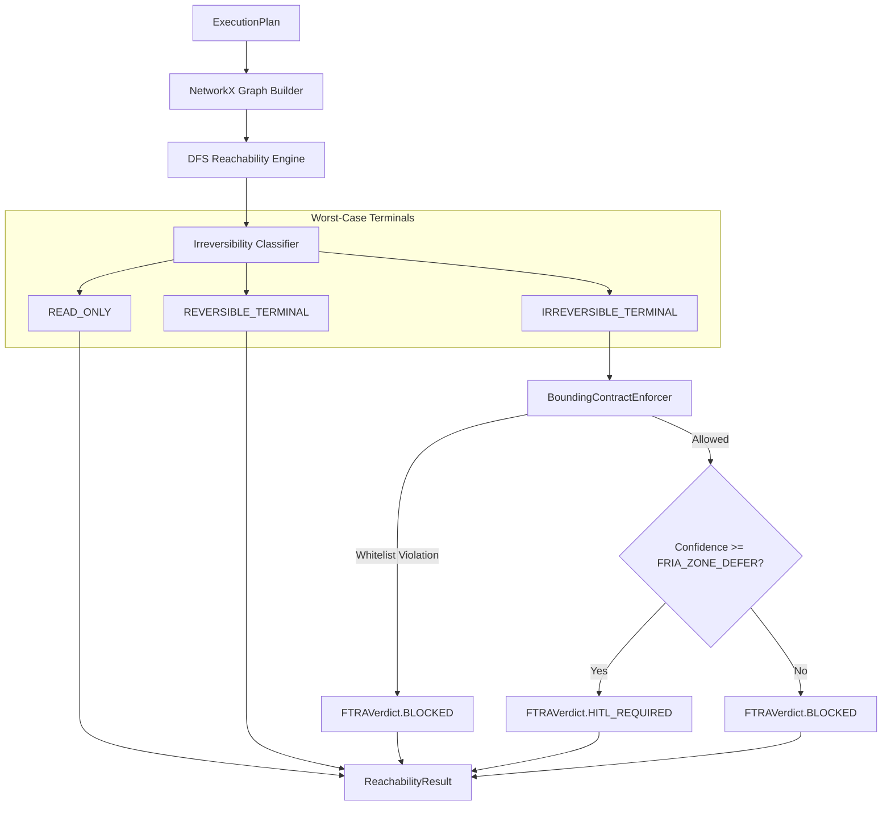

# FTRA Reachability Analyzer

**Last Updated:** 2026-09-22

## 1. Architectural Role & Domain Boundary

The Forward-Looking Trajectory Reachability Analyzer (FTRA) operates as an advanced lookahead safety tier within the `SymbolicGovernor`. Rather than evaluating static rules on single actions, FTRA analyzes the proposed multi-step `ExecutionPlan` as a directed graph to detect if any unsafe or irreversible terminal states are structurally reachable.

**Trust Boundaries**:
- **Upstream (Planner)**: FTRA treats all generated execution plans as untrusted graphs.
- **Downstream (Symbolic Governor)**: Emits a `ReachabilityResult` that influences the final ALLOW/DEFER/REQUIRE_APPROVAL/DENY state machine.

## 2. Data & Execution Flow

FTRA parses the step sequence, builds a NetworkX graph, and executes Depth-First Search (DFS) from the initial node to classify the worst-case reachable outcome.

## 3. State Machine & Lifecycle

- **Graph Construction**: The steps of the `ExecutionPlan` are mapped as nodes. In Phase 1, steps are chained linearly (`step[i] -> step[i+1]`). In Phase 2, `depends_on` explicit edges are utilized.
- **Classification**: Each reachable node is categorized via the `IrreversibilityClassifier`:
  - `READ_ONLY`: Safe, purely informational.
  - `REVERSIBLE_TERMINAL`: Creates side-effects that can be natively compensated via Saga LIFO rollbacks.
  - `IRREVERSIBLE_TERMINAL`: Causes permanent side-effects (e.g., executing a wire transfer) that cannot be undone.
- **Verdict Emission**:
  - Reaching an `IRREVERSIBLE_TERMINAL` escalates the verdict to `HITL_REQUIRED` (if confidence `> 0.70`), meaning human sign-off is needed. If confidence is starved, it hard fails to `BLOCKED`.

## 4. Operational Guarantees & Edge Cases

- **Graph Parsing Fail-Closed**: Any exception raised during the NetworkX graph construction, DFS traversal, or JSON parsing is caught and immediately defaults the classification to `IRREVERSIBLE_TERMINAL` and `BLOCKED` (or `HITL_REQUIRED`). It never fails open.
- **Bounding Contract Fail-Safe**: The `BoundingContractEnforcer` requires at least one explicit whitelist (instruments, venues, counterparties) to be populated. An empty configuration raises a `ValueError` on initialization to prevent unrestricted, boundless operation.
- **Empty Plan Handling**: An empty execution plan trivially resolves to `READ_ONLY` and `CLEAR` since no irreversible actions can be reached.

## 5. Configuration Contracts & Runtime Matrix

- **NetworkX Dependency**: The analyzer dynamically imports `networkx`. If the package is absent, the fallback fail-closed mechanism activates immediately.
- **FRIA Thresholds**: The routing logic between `HITL_REQUIRED` and `BLOCKED` dynamically references `get_fria_zone_defer()` from `config/governance_thresholds.json`.
- **Bounding Configurations**: Controlled via the `BoundingContractConfig` dataclass injected at module startup.

