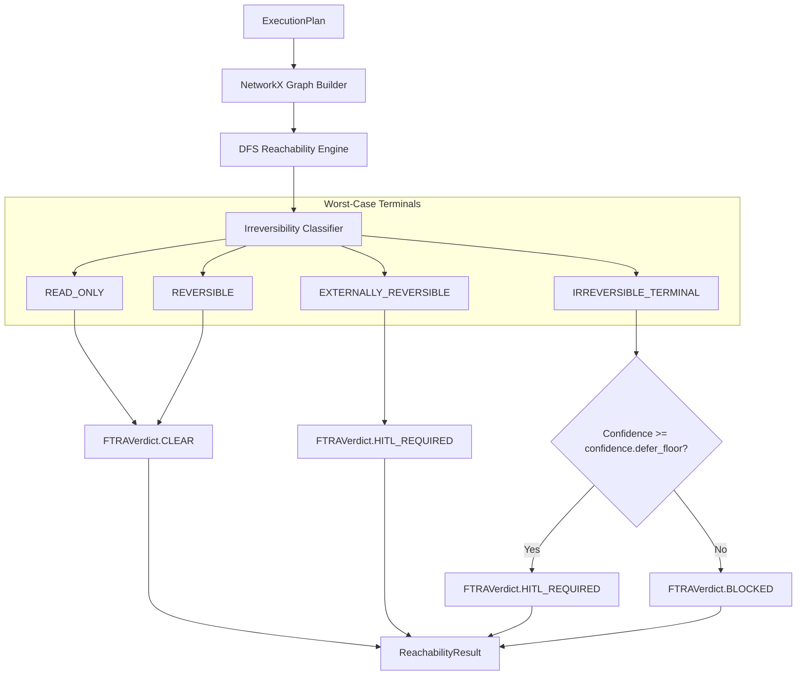

# FTRA Reachability Analyzer

**Last Updated:** 2026-09-29

## 1. Architectural Role & Domain Boundary

The Forward-Looking Trajectory Reachability Analyzer (FTRA, `CTRL_FTRA_001`) guards against irreversible terminal actions at two points:

- **Plan level (in-graph)**: [`PlanGraphAnalyzer`](../../src/gateway/governance/ftra/graph_analyzer.py) analyzes a proposed multi-step `ExecutionPlan` as a directed graph and detects whether any unsafe or irreversible terminal state is structurally reachable. Reference graphs wire it in through the `ftra_node` built by [`create_ftra_node()`](../../src/gateway/governance/ftra/node_factory.py) (e.g. the governed advisor graph).
- **Action level (kernel boundary)**: [`FtraStage`](../../src/gateway/governance/governor/stages/ftra.py) is the first stage of every `SymbolicGovernor` pipeline run (FULL and DRY_RUN profiles). It classifies the single requested action, so direct HTTP calls that bypass the in-graph `ftra_node` are still caught.

Both use [`IrreversibilityClassifier`](../../src/gateway/governance/ftra/classifier.py) over the **active domain's** terminal registry (`DomainConfig.ftra_registry_path`, e.g. finance's `config/ftra/terminal_registry.json`), resolved from the single `CAGE_DOMAIN` plugin. At startup, `assemble_governor()` refuses to build a governor if any `IRREVERSIBLE_TERMINAL` registry entry is claimed by no domain tier (an ungoverned irreversible action).

**Trust Boundaries**:
- **Upstream (Planner)**: FTRA treats all generated execution plans as untrusted graphs.
- **Downstream (Symbolic Governor)**: The plan-level analyzer emits a `ReachabilityResult` (`CLEAR` / `HITL_REQUIRED` / `BLOCKED`) that routes the graph; the boundary stage emits an `FtraBoundaryResult` whose `HITL` violations drive the governor to `REQUIRE_APPROVAL`.

## 2. Data & Execution Flow

The plan-level analyzer parses the step sequence, builds a NetworkX graph, and runs Depth-First Search (DFS) from the initial node to classify the worst-case reachable outcome.

```mermaid
flowchart TD
    Plan[ExecutionPlan] --> Builder[NetworkX Graph Builder]
    Builder --> DFS[DFS Reachability Engine]
    
    DFS --> Classifier[Irreversibility Classifier]
    
    subgraph Worst-Case Terminals
        Classifier --> RO[READ_ONLY]
        Classifier --> RV[REVERSIBLE]
        Classifier --> ER[EXTERNALLY_REVERSIBLE]
        Classifier --> IT[IRREVERSIBLE_TERMINAL]
    end
    
    RO --> Clear[FTRAVerdict.CLEAR]
    RV --> Clear
    ER --> HITL2[FTRAVerdict.HITL_REQUIRED]
    IT --> ConfidenceCheck{Confidence >= confidence.defer_floor?}
    
    ConfidenceCheck -->|Yes| HITL[FTRAVerdict.HITL_REQUIRED]
    ConfidenceCheck -->|No| Blocked[FTRAVerdict.BLOCKED]
    
    Clear --> Result[ReachabilityResult]
    HITL --> Result
    HITL2 --> Result
    Blocked --> Result
```

## 3. State Machine & Lifecycle

- **Graph Construction**: The steps of the `ExecutionPlan` are mapped as nodes. Without `depends_on`, steps are chained linearly (`step[i] -> step[i+1]`); when any step carries `depends_on`, those explicit edges are used instead (unknown step IDs are logged and skipped).
- **Classification**: Each reachable node is categorized via the `IrreversibilityClassifier`:
  - `READ_ONLY`: Safe, purely informational.
  - `REVERSIBLE`: Creates side-effects that can be natively compensated via Saga LIFO rollbacks.
  - `EXTERNALLY_REVERSIBLE`: Reversible only through an external process (e.g. a settlement window).
  - `IRREVERSIBLE_TERMINAL`: Causes permanent side-effects (e.g., executing a wire transfer) that cannot be undone. Actions absent from the registry classify here (fail closed).
- **Verdict Emission**:
  - Reaching an `IRREVERSIBLE_TERMINAL` escalates the verdict to `HITL_REQUIRED` if confidence `>= FRIA_ZONE_DEFER` (default 0.70); below that it hard fails to `BLOCKED`.
  - Reaching an `EXTERNALLY_REVERSIBLE` step always yields `HITL_REQUIRED`, independent of confidence.
  - Otherwise the verdict is `CLEAR`.
- **Boundary stage**: `FtraStage` emits a `HITL` violation (`FTRA_IRREVERSIBLE`) for `IRREVERSIBLE_TERMINAL` or `EXTERNALLY_REVERSIBLE` actions; an action that fails semantic input validation gets `HARD` violations and is denied. The `POST_HITL` profile does not re-run FTRA.

## 4. Operational Guarantees & Edge Cases

- **Graph Parsing Fail-Closed**: Any exception raised during NetworkX graph construction or DFS traversal is caught and defaults the classification to `IRREVERSIBLE_TERMINAL` with verdict `HITL_REQUIRED` (confidence `>= FRIA_ZONE_DEFER`) or `BLOCKED`. It never fails open.
- **Boundary Stage Fail-Closed**: Any exception inside `FtraStage` returns an `IRREVERSIBLE_TERMINAL` result with a `HARD` `FTRA_ERROR` violation, so the governor denies.
- **Empty Plan Handling**: An empty execution plan trivially resolves to `READ_ONLY` and `CLEAR` since no irreversible actions can be reached.
- **Bounding contracts are not part of FTRA**: instrument/venue/counterparty allowlists are enforced by the finance plugin's bounding tier (`BoundingContractEnforcer` in `src/cage_finance/`, phase 1, order 2), not by the kernel analyzer.

## 5. Configuration Contracts & Runtime Matrix

- **NetworkX Dependency**: The analyzer imports `networkx` lazily inside the guarded analysis path. If the package is absent, the fail-closed fallback above applies.
- **Confidence Thresholds**: The routing logic between `HITL_REQUIRED` and `BLOCKED` reads `get_confidence_defer_floor()` (`confidence.defer_floor` in `config/governance_thresholds.json`, default 0.70) — the same jurisdiction-neutral floor `ConfidenceStage` uses in every region.
- **Registry**: The active domain's `DomainConfig.ftra_registry_path`; `FtraNodeConfig.registry_path` defaults to `None` (active domain registry). The registry is cached and can be reloaded with `FTRA_REGISTRY_RELOAD=true` or `SIGUSR1`.
- **Metrics**: Boundary-check outcomes (`passed`, `hitl_required`, `error`) are counted by `cage_ftra_boundary_checks_total` in [`governor/metrics.py`](../../src/gateway/governance/governor/metrics.py). `GovernorMetrics` is created once per Prometheus registry (never at import) and is a no-op without `prometheus_client`.
