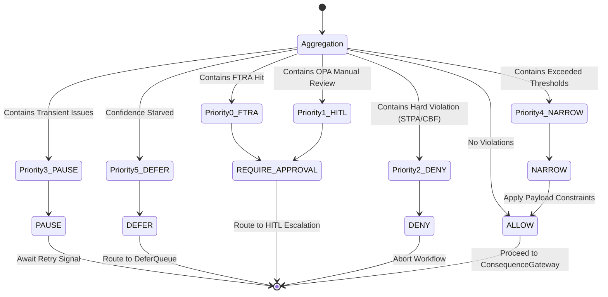
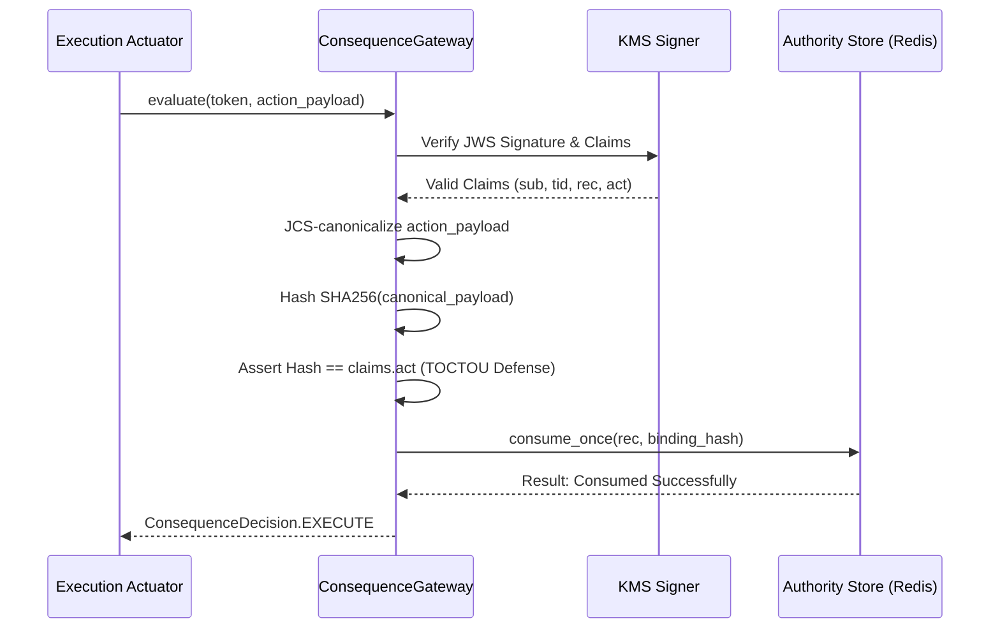

# Gateway Architecture — Kernel v3.0.1

> **Layer 1 Substrate Boundary**: The Gateway Kernel (`src/gateway/`) is strictly domain-agnostic Layer 1 substrate. It implements the core STERA (Socio-Technical Enforcement & Reachability Assessment) admissibility engine, consensus coordination, Consequence Gateway atomic verification, evidence chaining, and inference routing. Under the project's strict three-layer architecture enforced by Gate G3, the Gateway Kernel must **NEVER** import from or depend on:
> - **Layer 2 (Domain Plugins)**: `src/cage_*` (e.g., `src/cage_finance/`, `src/cage_healthcare/`)
> - **Layer 3 (Integrations & Compliance Bridge)**: `src/integrations/`, `src/compliance_bridge/`
> - **Layer 4 (Reference Applications)**: Reference applications and domain agent workflows.
>
> For Layer 4 reference application architecture, see `docs/examples/governed-financial-advisor/ARCHITECTURE.md`.

**Version:** v3.0.1  
**Universal Compliance Baseline:** ISO/IEC 42001:2023 · CSA AARM v1.0 *(all deployment regions)*  
**Jurisdiction-Specific Addenda:** SR 26-2 / NIST AI 600-1 / NIST SP 800-53 *(US_FED only)* · EU AI Act / GDPR / DORA *(EU_ECB only)* · MAS FEAT / MAS Notice 655 *(APAC_MAS only)*  

> **Jurisdiction separation principle:** ISO/IEC 42001:2023 is the **sole universal governance baseline** — every control, pipeline step, and audit artifact applies to all deployment regions. All other regulatory frameworks are **additive, jurisdiction-specific layers** activated exclusively by the `CAGE_DEPLOYMENT_REGION` environment variable. No US_FED, EU_ECB, or APAC_MAS obligation is imposed on deployments in other regions.

---

## 1. Architectural Role & Domain Boundary

The Hybrid Gateway Service operates as the central orchestrator and compliance enforcement point for the Cybernetic Governance Engine (CAGE). It exposes unified HTTP/FastMCP interfaces and Envoy `ext_authz` gRPC interfaces, decoupling client-facing agent abstractions from the underlying "Split-Brain" inference topology:

- **Reasoning Model Pool**: Handles deep planning, multi-step analysis, complex reasoning, and chain-of-thought generation.
- **Governance Model Pool**: Handles rapid policy checks, safety filtering, content moderation, and multi-model consensus evaluation.

Both model pools are deployed on cost-optimized Spot/preemptible GPU nodes (e.g., NVIDIA L4). Specific model weights, container images, and serving parameters are configured declaratively via Kubernetes manifests (`deployment/k8s/`).

### Trust Boundaries

- **Upstream (Untrusted Ingress)**: The Gateway is the primary ingress point and treats all incoming client and agent traffic as untrusted. Trace context (`traceparent`) is extracted to stitch distributed Langfuse spans, scanner noise is dropped, and payloads must undergo cryptographic and policy verification.
- **Downstream (Kernel & Actuators)**: Bridges external requests to the Layer 1 Kernel (`SymbolicGovernor`, `ConsequenceGateway`) and execution actuators via `ActuatorRegistry`. No action or side-effect occurs without traversing the complete governance pipeline and receiving a cryptographically signed routing seal or `ConsequenceToken`.

### Three-Layer Architecture Boundary

| Layer | Path | Role & Invariants |
|---|---|---|
| **Layer 1: Kernel** | `src/gateway/` | **STERA Admissibility Engine**, core governance dispatch loop, standing assembly, consensus engine, CBF engine, evidence accumulator, routing, audit rails. **Strictly domain-agnostic and vendor-neutral.** Must NEVER import from Layer 2, Layer 3, or Layer 4. |
| **Layer 2: Domain Plugins** | `src/cage_{domain}/` | Domain-specific tiers (`GovernanceTierPlugin`), domain action registries, ontologies, policies, and causal graphs. Injected into the kernel at runtime via `SymbolicGovernor(domain_tiers=...)`. |
| **Layer 3: Integrations & Rails** | `src/integrations/`, `src/compliance_bridge/` | External vendor normative/attestation adapters, durable sinks (ClickHouse, GCS, S3), NeMo Guardrails, Langfuse telemetry. Communicates via canonical dataclasses. |
| **Layer 4: Reference Applications** | Application layer | End-user applications, domain agent graphs, and client interfaces. Consumes the Gateway over standard HTTP/FastMCP or gRPC protocols. |

---

## 2. Core Kernel Subsystems

### 2.1 Symbolic Governor Dispatch Loop

The `SymbolicGovernor` ([`src/gateway/governance/symbolic_governor.py`](../../src/gateway/governance/symbolic_governor.py)) is the primary neuro-symbolic governance engine in the CAGE kernel, implementing the Governance/Reasoning Plane from Tallam's Five-Plane Reference Architecture. It evaluates requested actions against multiple domain-agnostic invariant tiers.



- **Priority Precedence**:
  1. `FTRA Hit` → `REQUIRE_APPROVAL`
  2. `OPA Manual Review` → `REQUIRE_APPROVAL`
  3. `Hard Violation (STPA / CBF)` → `DENY`
  4. `Transient Issues (Rate limits, circuit breakers)` → `PAUSE`
  5. `Exceeded Parameter Thresholds` → `NARROW`
  6. `Confidence-Starved (< FRIA_ZONE_DEFER)` → `DEFER`
  7. `Zero Violations` → `ALLOW`
- **Canonical Decision Vocabulary**: The Gateway strictly enforces a six-state decision vocabulary ([`src/gateway/governance/decisions.py`](../../src/gateway/governance/decisions.py)): `ALLOW`, `DENY`, `DEFER`, `PAUSE`, `NARROW`, and `REQUIRE_APPROVAL`.
- **Structural Subtyping**: Decoupled from concrete implementations via `Protocol` interfaces in [`src/gateway/governance/contracts.py`](../../src/gateway/governance/contracts.py) (`SafetyFilter`, `ConsensusProvider`, `PolicyClient`, `CausalGatekeeper`, `FiscalGuard`).
- **Fail-Closed Startup Invariants**: Module-level assertions in [`src/gateway/governance/singletons.py`](../../src/gateway/governance/singletons.py) assert that required cryptographic signers, Redis state stores, and causal models are healthy before traffic is served.

### 2.2 8-Tier STERA Admissibility Pipeline

The 8-tier symbolic governance pipeline (FTRA pre-pipeline boundary gate plus 7 in-pipeline tiers) is executed for every governed action by `SymbolicGovernor._run_checks()`. Tiers execute in strict sequential order, with Tiers 2 and 4 executing concurrently:

| Tier | Subsystem | Invariant / Verification Mechanism |
|---|---|---|
| **Boundary Gate** | **FTRA Commencement Gate** (`CTRL_FTRA_001`) | Pre-pipeline reachability check ([`src/gateway/governance/ftra/`](../../src/gateway/governance/ftra/)). Analyzes multi-step execution plans before any step executes; halts or escalates plans reaching irreversible terminal actions. |
| **Tier 0** | **STPA/STAMP UCA Validation** | `GeneratedSTPAValidator.validate()` checks Unsafe Control Actions (UCA-1 through UCA-6) against `governance_thresholds.json`. |
| **Tier 1** | **Agent Confidence Pre-Check** | Fast-fail local threshold check against `AGENT_CONFIDENCE_THRESHOLD` (default 0.95), short-circuiting unneeded downstream round-trips. |
| **Tier 2** | **Control Barrier Function (CBF)** | Mathematical safety bounds check via state/balance verification (decay coefficient $\gamma = 0.5$, $h(x) \ge 0$). Runs **concurrently** with Tier 4 via `asyncio.gather`. External ledger reconciliation via `ExternalLedgerReconciler` (`src/gateway/governance/reconciliation/daemon.py`, POAM-023). |
| **Tier 3** | **Fiscal Limit Pre-Reservation** | `FiscalLimitGuard.reserve()` atomically reserves capacity against the daily fiscal cap in Redis (`WATCH/MULTI/EXEC`) before consensus, closing TOCTOU races. Released immediately if subsequent tiers fail. |
| **Tier 4** | **OPA Rego Policy Evaluation** | Declarative rule enforcement against active regional compliance profile (`CAGE_DEPLOYMENT_REGION`). Circuit breaker: 5 failures $\to$ OPEN, 30s recovery. Redis decision cache: 10s TTL, SHA-256 keyed. Runs **concurrently** with Tier 2. |
| **Tier 4b** | **Token Quota Proxy (TQP)** | Per-session step-count ($\le 12$) and token ($\le 100\text{k}$) quota enforcement via atomic Redis Lua scripts (`token_quota_proxy.py`). Two-phase commit (reserve $\to$ reconcile) with fail-closed HTTP 429 semantics. |
| **Tier 5** | **Multi-Model Consensus Engine** | `ConsensusModelRegistry` (`src/gateway/governance/consensus/engine.py`). Heterogeneous critic models from the Reasoning and Governance Model Pools evaluate high-impact actions. Unanimous `APPROVE` passes; unanimous `REJECT` blocks; split vote escalates to human review. |
| **Tier 6** | **DoWhy Causal Gatekeeper** | Causal backdoor linear regression plus 50-simulation placebo refutation against live telemetry. Redis-cached by `(action_type, regime)` with 60s TTL. Fails closed if telemetry is stale or causal packages are absent. |
| **Tier 6b** | **Adaptive FRIA Enforcement** | Confidence-gated Fundamental Rights Impact Assessment: $\ge 0.95 \to$ async attestation; $0.70\text{--}0.95 \to$ synchronous blocking DEFER gate; $< 0.70 \to$ hard DENY. In `EU_ECB`, stamps FRIA attestation onto every OTel span (EU AI Act Art. 29a). |

### 2.3 ConsequenceGateway & Token Authority

The `ConsequenceGateway` ([`src/gateway/governance/consequence_gateway.py`](../../src/gateway/governance/consequence_gateway.py)) enforces a fail-closed post-governance execution boundary. It ensures that downstream `ExecutionActuator`s cannot execute side-effects without a valid, unexpired, mathematically bound, and cryptographically signed `ConsequenceToken` (JWS).



- **TOCTOU Elimination**: JCS-canonicalizes (RFC 8785) the runtime payload and verifies `SHA256(payload) == claims.act`.
- **Atomic Single-Use Consumption**: Atomically consumes the authority record in Redis (`SETNX` / Lua) to prevent replay and substitution attacks.
- **Fail-Closed Guarantees**: Cryptographic failures, parameter mismatches, or store connectivity errors collapse to `BLOCK`.

### 2.4 EvidenceStreamSink & Cold Storage Chain

The Evidence Chain ([`src/gateway/governance/evidence/stream.py`](../../src/gateway/governance/evidence/stream.py), [`cold_store.py`](../../src/gateway/governance/evidence/cold_store.py)) maintains an immutable, tamper-evident audit ledger complying with ISO 42001 and CSA AARM mandates.

```mermaid
flowchart TD
    EventBus[GovernanceEventBus.publish()] --> Ingest[EvidenceStreamSink.ingest()]
    
    subgraph Hot Path (Sub-millisecond)
        Ingest --> JCS[JCS Normalization]
        JCS --> Hash[SHA-256 Hash Chaining]
        Hash --> KMS[Optional KMS Signing]
        KMS --> Redis[(Redis Streams\ndb=1, noeviction)]
    end
    
    subgraph Cold Path (Async 60s Interval)
        Redis --> Flush[Cold Store Flush Daemon]
        Flush --> Protocol[EvidenceColdStore Protocol]
    end
    
    Protocol --> Integrations[Layer 3 Integrations\n(GCS / S3)]
```

- **Hot Path (Sub-millisecond)**: Ingests normalized JCS events, computes SHA-256 hash chains linking each record to its predecessor (`prev_hash`), optionally signs via Cloud KMS HSM, and appends to Redis Streams (`cage:evidence:stream`, `db=1`, `noeviction`).
- **Cold Path (Background Daemon)**: Wakes every 60 seconds, reads unacknowledged stream entries, persists them in bulk via the vendor-neutral `EvidenceColdStore` protocol to durable object storage (Layer 3 GCS/S3), verifies the `ColdStoreReceipt`, and truncates acknowledged stream entries.

### 2.5 OTLP Telemetry & Distributed Observability

The Gateway implements an end-to-end telemetry architecture:

- **Direct Langfuse OTLP Export**: Emits GenAI spans directly to Langfuse via OTLP (`http://langfuse-web:3000/api/public/otel/v1/traces`) using OpenTelemetry GenAI Semantic Conventions (v1.36.0+). The legacy OTel Collector sidecar was deprecated 2026-05-31.
- **Distributed W3C MCP Tracing**: Bridges the Server-Sent Events (SSE) transport gap by propagating W3C `traceparent` context in MCP tool call metadata (`_otel_carrier`), producing unified distributed trace trees.
- **Scanner-Noise Filtering**: The `server_request_hook` drops non-GET/POST probe methods and vulnerability scanner paths before trace allocation.
- **AgentSight Kernel Observability**: Backed by an eBPF DaemonSet intercepting OpenSSL network boundaries and kernel syscalls (`execve`, `openat`, `connect`), linked to application traces via the `X-Trace-Id` header.

---

## 3. Data & Execution Flow

```mermaid
flowchart TD
    Client[Client / Agent Request] --> Filter[Noise Filtering Hook]
    Filter --> Policy[Pre-Execution OPA Check]
    Policy --> Router[Inference Router]
    
    subgraph Split-Brain Model Pools
        Router --> Reasoning[Reasoning Model Pool\n(High-Capacity Planning)]
        Router --> Governance[Governance Model Pool\n(Fast Policy / Moderation)]
    end
    
    Reasoning --> MCP[MCP Tool Request]
    Governance --> MCP
    
    MCP --> SymGov[[Symbolic Governor\n(8-Tier STERA Pipeline)]]
    
    SymGov -->|ALLOW| ConsGate[[Consequence Gateway\n(Atomic Verification)]]
    SymGov -->|DEFER| Defer[[Defer Queue\n(Redis db=1, 4h TTL)]]
    SymGov -->|PAUSE| Pause[[Pause Manager\n(Transient Hold)]]
    SymGov -->|DENY| Deny[[Terminal Block\n(Saga LIFO Rollback)]]
    
    ConsGate --> Actuator[Execution Actuator\n(Registered Action)]
    Actuator --> Evidence[[Evidence Stream Sink\n(Redis Streams -> Cold Store)]]
```

### Request Lifecycle Phases

1. **Ingress & Noise Filter**: Incoming HTTP/FastMCP/gRPC request arrives; scanner probes are filtered.
2. **Pre-Execution Validation**: Intent is pre-evaluated against declarative policies before inference tokens are consumed.
3. **Model Pool Routing**: The request routes to the Reasoning Model Pool or Governance Model Pool.
4. **Tool Call Interception**: When a model initiates an action via MCP, the execution request is intercepted by the Gateway.
5. **Symbolic Governor Evaluation**: The action traverses the full 8-Tier STERA pipeline.
6. **Consequence Gateway Clearance**: Approved actions receive a cryptographically signed routing seal or `ConsequenceToken`. The token and payload hash are atomically verified before execution.
7. **Actuator Execution**: The registered `ExecutionActuator` fires the side-effect.
8. **Evidence & Telemetry**: Records are chained into the `EvidenceStreamSink` and traces are exported over OTLP.

### Component Interaction & Post-HITL Feedback Loop

The runtime lifecycle consists of a primary check path and an execution-time revalidation feedback loop:
1. **Pre-Execution FTRA Gate**: Before any LLM inference, the FTRA Commencement Reachability Gate (`src/gateway/governance/ftra/`) verifies that the compiled LangGraph graph contains a reachable path to a `HUMAN_APPROVED` terminal node. Graphs that fail this structural check are rejected before any agent runs. Direct HTTP hits are caught by the kernel's mandatory `_ftra_boundary_check()`.
2. **Pre-Trade Checking**: The user's request traverses the multi-agent planning layers, culminating in the `SymbolicGovernor` executing its two-phase pipeline: kernel boundary gates (FTRA 0.5, STPA 1, Confidence 2) → Phase 1 read-only domain tiers (Bounding order 2, Consensus order 5, Causal order 6) → OPA policy (3b) → Phase 2 mutating domain tiers (CBF order 3, Fiscal order 4) with LIFO rollback on failure → adaptive Tier 7 FRIA gate.
3. **HITL Interruption**: If the trade passes the pre-trade check but requires human verification, execution is suspended and state is persisted in Redis (`AsyncRedisSaver`).
4. **Execution-Time Feedback Loop**: Once the human reviewer submits approval via `/resume`, the `governed_trader` subgraph re-hydration node retrieves a fresh pricing sample and loops back to the `SymbolicGovernor` to re-run only the deterministic, continuous tiers (CBF and OPA Policy Engine).
5. **Final Actuation**: If both revalidation checks pass successfully, the transaction is committed via the trade execution actuator; otherwise, it is blocked, and a compensator rollback is initiated.

---

## 4. Kernel Service Primitives & HTTP API

The Gateway Kernel exposes core governance and execution primitives:

### 4.1 `POST /governance/validate-action`

The single choke point for tool-level governance validation. Mounted under `/governance` and `/v1/governance/*` by [`src/gateway/server/governance_middleware.py`](../../src/gateway/server/governance_middleware.py).

**Request Body (`ValidateActionRequest`):**
```json
{
  "action": "system_action_name",
  "params": {
    "resource_id": "res-9482",
    "quantity": 100.0,
    "confidence": 0.98,
    "actor_role": "operator"
  },
  "context": {
    "session_id": "sess-0182",
    "execution_step": 3
  }
}
```

**Response — `ALLOW` (HTTP 200):**
```json
{
  "verdict": "ALLOW",
  "violations": [],
  "seal": "1773763200.system_action_name.4f9a8b...",
  "consequence_token": "eyJhbGciOiJSUzI1NiIs...",
  "latency_ms": 11.2
}
```

**Response — `DENY` (HTTP 403):**
```json
{
  "verdict": "DENY",
  "violations": ["CBF: barrier condition violated for action 'system_action_name'"],
  "seal": "",
  "latency_ms": 4.1
}
```

**Response — `REQUIRE_APPROVAL` (HTTP 202):**
```json
{
  "verdict": "REQUIRE_APPROVAL",
  "thread_id": "hitl-thread-a83f9b20",
  "reason": "Consensus escalation: heterogeneous critics disagreed"
}
```

**Response — `DEFER` (HTTP 202):**
```json
{
  "decision": "DEFER",
  "defer_token": "def-tok-c91823ab",
  "classification_reason": "Confidence-starved context (score: 0.81, required: 0.95)"
}
```

**Response — `PAUSE` (HTTP 202):**
```json
{
  "verdict": "PAUSE",
  "pause_token": "pause-tok-71e982b1",
  "reason": "Circuit breaker OPEN: downstream upstream throttled"
}
```

### 4.2 Supporting Governance Primitives

- `POST /governance/check`: Contextual pre-execution check evaluating intent before inference.
- `GET /governance/policy-version`: Returns active policy SHA-256 and compliance revision metadata.
- `GET /governance/jwks` & `GET /.well-known/jwks.json`: Public JSON Web Key Set for verifying KMS/asymmetric governance tokens.
- `GET /v1/pause/{pause_token}`: Inspect state of a paused execution.
- `POST /v1/pause/{pause_token}/resume`: Resume a paused execution with optional parameter overrides.
- `GET /v1/defer/pending`: List pending deferred evaluation tokens.
- `POST /v1/defer/{id}/inject`: Inject supplemental context into a parked evaluation.
- `POST /v1/defer/{id}/escalate`: Escalate a parked evaluation to manual human review.
- `POST /tools/execute`: Protected actuator execution requiring a valid `X-CAGE-Routing-Seal` or `ConsequenceToken`.
- `POST /inference/v1/chat/completions`: Streaming and non-streaming proxy to the backend Model Pools with GenAI span instrumentation.
- `GET /healthz`: Liveness and readiness probe verifying Cloud KMS HSM connectivity and Redis availability.

---

## 5. Security Architecture & Threat Model

### 5.1 Network & Egress Security

- **Linkerd mTLS**: All service-to-service communication is encrypted via mutual TLS (POAM-007).
- **Cilium L7 Egress Lockdown**: Approved FQDN egress allowlist enforced at the kernel level:
  - Inference & model APIs: approved model serving and provider endpoints
  - Telemetry & logging: `us.i.posthog.com`, `cloud.langfuse.com`
  - Cloud metadata: `metadata.google.internal`

### 5.2 CSA AARM v1.0 — 11-Vector Threat Coverage

| Vector | Threat | Mitigation Subsystem |
|---|---|---|
| **AARM-V1** | Memory Poisoning | SHA-256 hash-chained context accumulator (`context_accumulator.py`) |
| **AARM-V2** | Goal Hijacking | NeMo Guardrails input rail + OPA semantic score threshold |
| **AARM-V3** | Confused Deputy | Cloud KMS HSM asymmetric signing + HMAC-SHA256 routing seal; cryptographic actuator verification |
| **AARM-V4** | Cross-Agent Propagation | Automated SBOM generation (`scripts/generate_sbom.py`); strict package dependency auditing |
| **AARM-V5** | Prompt Injection | Aho-Corasick Tier-1 keyword scan (`text_filter.py`) + structural injection patterns (`prompt_injection_detector.py`) |
| **AARM-V6** | Reward Hacking | OPA declarative RBAC policy (Tier 4) + Linkerd mTLS workload identity |
| **AARM-V7** | Context Window Overflow | DEFER queue (`src/gateway/governance/defer_queue.py`, Redis `db=1`, noeviction, 4h TTL); three-zone confidence gating |
| **AARM-V8** | Temporal Deception | LangGraph Saga WAL + LIFO rollback; idempotency keys and TTL staleness checks |
| **AARM-V9** | Privilege Escalation | `ConsensusModelRegistry` heterogeneous multi-model consensus across independent model pools |
| **AARM-V10** | Data Exfiltration | NeMo output rail + pre-ledger PII regex sanitizer (`pii_sanitizer.py`, 8 compiled patterns) |
| **AARM-V11** | Model Substitution | Fail-closed model routing; Cloud KMS HSM signing; machine-readable OSCAL artifact persistence |

### 5.3 Cryptographic Signer Engine & Routing Seal

Every governance clearance is attested by an unforgeable routing seal verified by actuators before execution. Implementation: [`src/gateway/governance/routing_seal.py`](../../src/gateway/governance/routing_seal.py) and [`kms_signer.py`](../../src/gateway/governance/kms_signer.py).

- **Wire Format**: `<expire_ts_hex>.<action_slug>.<signature_hex>`
- **Security Invariants**:
  - **30-second TTL**: Seals expire 30 seconds after issuance, preventing replay.
  - **Constant-Time Comparison**: Verification uses `hmac.compare_digest()` to eliminate timing oracles.
  - **Primary Signer**: Google Cloud KMS HSM asymmetric signing (private key never leaves HSM). HMAC-SHA256 is strictly dev/CI fallback.
  - **Fail-Closed Enforcement**: Requests reaching `/tools/execute` without a valid, unexpired seal are rejected by `GovernanceMiddleware` with HTTP 403.

---

## 6. NIST AI 600-1 Governance Modules

The following governance modules ([`src/gateway/governance/`](../../src/gateway/governance/)) implement NIST AI 600-1 controls:

| Module | AI 600-1 Control | Architectural Role | Status |
|---|---|---|---|
| [`confabulation_scorer.py`](../../src/gateway/governance/confabulation_scorer.py) | §2.1 Confabulation | Emits Langfuse confabulation-risk scores (`risk = 1.0 - confidence`); blocks when confidence falls below minimum. | Active |
| [`hitl_escalator.py`](../../src/gateway/governance/hitl_escalator.py) | §2.5 Human-AI Configuration | Generates structured `EscalationRecord` entries written to the DeferQueue (Redis `db=1`) with 4-hour SLA resolution window. | Active |
| [`prompt_injection_detector.py`](../../src/gateway/governance/prompt_injection_detector.py) | §2.3 Prompt Injection | 14 structural regex patterns detecting ChatML injection, jailbreaks, and persona overrides; fails fast on first match. | Active |
| [`provenance_chain.py`](../../src/gateway/governance/provenance_chain.py) | §2.7 Information Integrity | Cryptographic SHA-256 hash chain with RFC 8785 JCS canonicalization tracking every governance decision to immutable storage. | Active |
| [`text_filter.py`](../../src/gateway/governance/text_filter.py) | §2.6 CBRN Content | Stateless $O(n)$ Aho-Corasick keyword scanner for hazardous concepts and prompt abuse strings. | Active |
| [`pii_sanitizer.py`](../../src/gateway/governance/pii_sanitizer.py) | §2.2 Data Privacy | Pre-ledger PII redaction applying 8 compiled regex patterns (SSN, credit cards, IBAN, API keys, JWS/JWT tokens) before ledgering. | Active |

### Architectural Module Placement

```
Incoming Request
      │
      ▼
[text_filter.py]          ← Tier-1 Aho-Corasick keyword scan (all regions)
[prompt_injection_detector.py] ← Structural injection pattern check (all regions)
      │
      ▼
SymbolicGovernor._run_checks()
  Tier 0: STPA/STAMP UCA validation
  Tier 1: Agent confidence pre-check
  Tier 2/4: CBF + OPA concurrent
  Tier 3: Fiscal Limit Pre-Reservation
  Tier 4b: Token Quota Proxy
  Tier 5: Consensus gate (heterogeneous model pool critics)
  Tier 6: Causal gatekeeper (DoWhy refutation)
  Tier 6b: Adaptive FRIA enforcement
      │
      ▼ (parallel / adjacent utilities — not sequential pipeline tiers)
[confabulation_scorer.py] ← Langfuse confabulation-risk score payload builder
[hitl_escalator.py]       ← DEFER-queue / human-escalation helper functions
[pii_sanitizer.py]        ← Pre-ledger PII redaction inside uca_logger.py before WORM write
[provenance_chain.py]     ← SHA-256 hash chain record per governance node
      │
      ▼
UCA Logger → Immutable WORM Storage
```

---

## 7. Ingress Adapters & Protocol Absorption

### 7.1 Ingress Adapters (`src/gateway/governance/ingress/`)

The ingress adapter layer normalizes external governance signals from heterogeneous formats into internal CAGE policy representations:

| Adapter | File | Purpose |
|---|---|---|
| **AAIF Adapter** | [`aaif_adapter.py`](../../src/gateway/governance/ingress/aaif_adapter.py) | Ingests AAIF (Agent Attestation Interchange Format) governance signals |
| **ACS Adapter** | [`acs_adapter.py`](../../src/gateway/governance/ingress/acs_adapter.py) | Ingests ACS (Agent Capability Statement) declarations |
| **OSCAL Adapter** | [`oscal_adapter.py`](../../src/gateway/governance/ingress/oscal_adapter.py) | Parses OSCAL component definitions and assessment results into internal policy objects |
| **Lula Adapter** | [`lula_adapter.py`](../../src/gateway/governance/ingress/lula_adapter.py) | Ingests Lula validation results and maps them to CAGE control verdicts |
| **AGP Policy Uploader** | [`agp_policy_uploader.py`](../../src/gateway/governance/ingress/agp_policy_uploader.py) | Uploads translated policies to the Agent Gateway Protocol policy store |
| **Policy Translator** | [`policy_translator.py`](../../src/gateway/governance/ingress/policy_translator.py) | Translates between OSCAL/Lula/AAIF representations and OPA Rego |
| **Agent Registry Adapter** | [`agent_registry_adapter.py`](../../src/gateway/governance/ingress/agent_registry_adapter.py) | SPIFFE trust-domain agent catalog integration |

### 7.2 Agent Gateway Adapter (Envoy `ext_authz`)

[`src/gateway/server/agent_gateway_adapter.py`](../../src/gateway/server/agent_gateway_adapter.py) implements the Envoy `ext_authz` gRPC servicer (`envoy.service.auth.v3.Authorization.Check`), enabling the Gateway to serve as an external authorization engine for Istio, Contour, Emissary, or GCP Agent Gateway (AGW) proxies without code modification.

### 7.3 FTRA Commencement Reachability Gate (`src/gateway/governance/ftra/`)

The **Forward-Looking Trajectory Reachability Analyzer (FTRA, `CTRL_FTRA_001`)** is a **Pre-Pipeline Boundary Gate** that analyzes an entire multi-step `ExecutionPlan` before execution begins.

- **`classifier.py`**: Classifies plan steps against the terminal action registry (`IRREVERSIBLE_TERMINAL`, `REVERSIBLE`, `READ_ONLY`). Fails closed to `IRREVERSIBLE_TERMINAL` on unknown actions.
- **`graph_analyzer.py`**: Constructs a NetworkX directed graph from plan steps and runs reachability analysis from step 0. Emits verdicts: `CLEAR` (no terminal reachable), `HITL_REQUIRED` (terminal reachable with confidence $\ge 0.70$), or `BLOCKED` (terminal reachable with confidence $< 0.70$).
- **`node_factory.py`**: Composable factory nodes for workflow graphs.

---

## 8. Compliance Framework Matrix

### Universal Baseline (All Deployment Regions)

| Framework | Scope | Status |
|---|---|---|
| **ISO/IEC 42001:2023** | Primary AI governance baseline — all controls, pipeline steps, and audit artifacts | Active |
| **CSA AARM v1.0** | 11-vector AI agent threat model — all mitigations active in all regions | Active |
| **OSCAL v1.0.4** | Machine-readable system security plan and component definition persistence | Active |
| **Lula** | Automated policy validation manifests | Active |

### Jurisdiction Addenda (Activated via `CAGE_DEPLOYMENT_REGION`)

- **US_FED** (`CAGE_DEPLOYMENT_REGION=US_FED`):
  - **SR 26-2**: Agentic AI model risk management; 4-hour HITL SLA; MRM scope for CBF and DoWhy.
  - **NIST AI 600-1**: Confabulation scoring, HITL escalation, prompt injection defense, provenance chaining, CBRN filtering.
  - **NIST SP 800-53 Rev 5 HIGH**: FedRAMP readiness controls.
  - **NIST AI RMF (SP 800-37)**: Continuous world-model validation.
- **EU_ECB** (`CAGE_DEPLOYMENT_REGION=EU_ECB`):
  - **EU AI Act (Reg. 2024/1689)**: Art. 29a Fundamental Rights Impact Assessment (FRIA); OTel attestation stamp on every span.
  - **GDPR**: Art. 22 automated decision-making controls; 24-hour PII retention limit.
  - **DORA (Reg. 2022/2554)**: Art. 10 audit logging obligations.
- **APAC_MAS** (`CAGE_DEPLOYMENT_REGION=APAC_MAS`):
  - **MAS FEAT Principles**: Fairness, Ethics, Accountability, and Transparency controls.
  - **MAS Notice 655 / MAS TRM §4.2**: Audit logging and data residency controls.

---

## 9. Kernel Source Layout & Module Map

The Gateway Kernel lives strictly under `src/gateway/`:

```text
src/gateway/
├── governance/             # STERA Admissibility Engine & symbolic governance tiers
│   ├── causal/             # Causal gatekeeper (DoWhy linear regression refutation)
│   ├── consensus/          # Multi-model consensus engine & critic registry
│   ├── evidence/           # Tamper-evident evidence stream sink & cold store
│   ├── ftra/               # Forward-Looking Trajectory Reachability Analyzer
│   ├── ingress/            # Normalization adapters (AAIF, ACS, OSCAL, Lula, AGP)
│   ├── langgraph_harness/  # Reusable OPA and NeMo graph node factories
│   ├── nemo/               # NeMo Guardrails lifecycle manager
│   ├── reconciliation/     # External ledger reconciliation daemon
│   ├── safety/             # Control Barrier Function (CBF) engine
│   ├── consequence_gateway.py # Atomic execution authorization & token consumption
│   ├── contracts.py        # Protocol interfaces (structural subtyping)
│   ├── decisions.py        # Canonical six-state decision vocabulary
│   ├── defer_queue.py      # Redis db=1 confidence-starvation deferral queue
│   ├── execution_actuator.py # ExecutionActuator protocol & ActuatorRegistry
│   ├── kms_signer.py       # Cloud KMS HSM asymmetric governance signer
│   ├── routing_seal.py     # Cryptographic routing seal generator & validator
│   ├── singletons.py       # Module-level singletons & fail-closed assertions
│   └── symbolic_governor.py # Neuro-symbolic governance dispatch loop
├── infrastructure/         # Telemetry setup & OTel client configuration
├── observability/          # Distributed W3C MCP tracing context propagation
└── server/                 # Composition root & protocol servicers
    ├── agent_gateway_adapter.py # Envoy ext_authz gRPC servicer & AGW bridge
    ├── governance_middleware.py # Core governance endpoints & seal verification
    ├── hybrid_server.py    # FastAPI composition root & lifespan manager
    ├── inference_proxy.py  # vLLM proxy for Reasoning/Governance Model Pools
    └── mcp_tool_server.py  # FastMCP server & actuator invocation
```

### Key Source Files Reference

| File | Subsystem | Responsibility |
|---|---|---|
| `src/gateway/server/hybrid_server.py` | Composition Root | FastAPI composition root assembling MCP tool server, inference proxy, and governance sub-applications. |
| `src/gateway/server/governance_middleware.py` | Governance API | Mounts `/governance/validate-action`, verifies routing seals, coordinates pipeline checks. |
| `src/gateway/server/agent_gateway_adapter.py` | AGW / ext_authz | Envoy `ext_authz` gRPC servicer bridging proxy traffic into `SymbolicGovernor.validate_action()`. |
| `src/gateway/server/inference_proxy.py` | Inference Proxy | Reverse proxy routing chat completions to backend Reasoning and Governance Model Pools. |
| `src/gateway/server/mcp_tool_server.py` | Tool Server | FastMCP server exposing tool endpoints and executing verified actuators via `ActuatorRegistry`. |
| `src/gateway/governance/symbolic_governor.py` | Governor Loop | Neuro-symbolic governance dispatch loop coordinating the 8-tier admissibility checks. |
| `src/gateway/governance/consequence_gateway.py` | Execution Gate | Atomic single-use `ConsequenceToken` verification and TOCTOU defense before execution. |
| `src/gateway/governance/execution_actuator.py` | Actuator Registry | Registration and invocation boundary for concrete domain execution actuators. |
| `src/gateway/governance/evidence/stream.py` | Evidence Stream | Hot-path Redis Stream append with SHA-256 hash chaining and optional KMS signing. |
| `src/gateway/governance/evidence/cold_store.py` | Cold Storage | Background flush daemon persisting evidence records to immutable object stores. |
| `src/gateway/governance/kms_signer.py` | Cryptographic Signer | Cloud KMS HSM asymmetric JWS signing and verification with HMAC dev/CI fallback. |
| `src/gateway/governance/routing_seal.py` | Routing Seal | Constant-time HMAC-SHA256 and KMS routing seal generation and verification. |
| `src/gateway/governance/contracts.py` | Subsystem Protocols | Structural subtyping contracts (`SafetyFilter`, `ConsensusProvider`, `PolicyClient`, etc.). |
| `src/gateway/observability/mcp_tracing.py` | Distributed Tracing | W3C `traceparent` context extraction and child span creation across SSE transports. |
