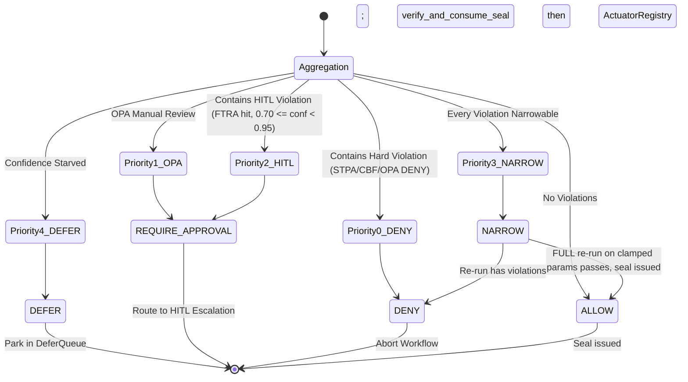
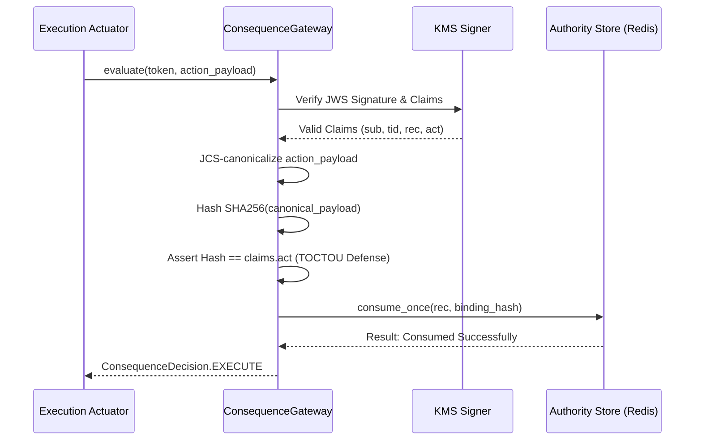

# Gateway Architecture — Kernel v3.0.1

> **Layer 1 Substrate Boundary**: The Gateway Kernel (`src/gateway/`) is strictly domain-agnostic Layer 1 substrate. It implements the core STERA (Socio-Technical Enforcement & Reachability Assessment) admissibility engine, consensus coordination, Consequence Gateway atomic verification, evidence chaining, and inference routing. Under the project's strict three-layer architecture enforced by Gate G3, the Gateway Kernel must **NEVER** import from or depend on:
> - **Layer 2 (Domain Plugins)**: `src/cage_*` (e.g., `src/cage_finance/`, `src/cage_healthcare/`)
> - **Layer 3 (Integrations & Compliance Bridge)**: `src/integrations/`, `src/compliance_bridge/`
> - **Layer 4 (Reference Applications)**: Reference applications and domain agent workflows.
>
> For Layer 4 reference application architecture, see `docs/examples/governed-financial-advisor/ARCHITECTURE.md`.

**Version:** v3.0.1  
**Universal Compliance Baseline:** ISO/IEC 42001:2023 · CSA AARM v1.0 *(all deployment regions)*  
**Jurisdiction-Specific Addenda:** SR 26-2 / NIST AI 600-1 / NIST SP 800-53 *(US_FED only)* · EU AI Act / GDPR / DORA *(EU_ECB only)* · MAS FEAT / MAS Notice 655 *(APAC_MAS only)*  
**Last Updated:** 2026-09-29  

> **Jurisdiction separation principle:** ISO/IEC 42001:2023 is the **sole universal governance baseline** — every control, pipeline step, and audit artifact applies to all deployment regions. All other regulatory frameworks are **additive, jurisdiction-specific layers** activated exclusively by the `CAGE_DEPLOYMENT_REGION` environment variable. No US_FED, EU_ECB, or APAC_MAS obligation is imposed on deployments in other regions.

---

## 1. Architectural Role & Domain Boundary

The Hybrid Gateway Service operates as the central orchestrator and compliance enforcement point for the Cybernetic Governance Engine (CAGE). It exposes unified HTTP/FastMCP interfaces, decoupling client-facing agent abstractions from the underlying "Split-Brain" inference topology:

- **Reasoning Model Pool**: Handles deep planning, multi-step analysis, complex reasoning, and chain-of-thought generation.
- **Governance Model Pool**: Handles rapid policy checks, safety filtering, content moderation, and multi-model consensus evaluation.

Both model pools are deployed on a dedicated GPU node pool (NVIDIA L4, `gpu-l4` in the `gcp-gke` target). Specific model weights, container images, and serving parameters are configured declaratively via Kubernetes manifests (`deployment/k8s/`).

### Trust Boundaries

- **Upstream (Untrusted Ingress)**: The Gateway is the primary ingress point and treats all incoming client and agent traffic as untrusted. Trace context (`traceparent`) is extracted to stitch distributed Langfuse spans, scanner noise is dropped, and payloads must undergo cryptographic and policy verification. **Caller identity is taken from the mTLS transport only** — the Linkerd-verified `l5d-client-id` workload identity — never from caller-asserted request headers or the request body (see [§5.4](#54-transport-layer-agent-identity-linkerd-mtls-workload-identity)). The governed financial advisor is a client behind this boundary: it hosts no `SymbolicGovernor`, `DeferQueue` or signing key and reaches governance only through gateway endpoints.
- **Downstream (Kernel & Actuators)**: Bridges external requests to the Layer 1 Kernel (`SymbolicGovernor`) and execution actuators via `ActuatorRegistry`. No action or side-effect occurs without traversing the complete governance pipeline and presenting a cryptographically signed routing seal, which [`verify_and_consume_seal()`](../../src/gateway/governance/routing_seal.py) verifies and then consumes exactly once. `ConsequenceGateway` is the single-use boundary for normative-provider `ConsequenceToken`s and is not on the governor ALLOW path (§2.3).

### Three-Layer Architecture Boundary

| Layer | Path | Role & Invariants |
|---|---|---|
| **Layer 1: Kernel** | `src/gateway/` | **STERA Admissibility Engine**, core governance dispatch loop, composition root (`governor/assembly.py`, `governor/bootstrap.py`), consensus engine, CBF engine, evidence accumulator, routing, audit rails. **Strictly domain-agnostic and vendor-neutral.** Must NEVER import from Layer 2, Layer 3, or Layer 4. |
| **Layer 2: Domain Plugins** | `src/cage_{domain}/` | Domain-specific tiers (`ReadOnlyTier` / `MutatingTier`, ADR-009), domain action registries, ontologies, policies, and causal graphs. Handed to the kernel as data via `CagePlugin.contribute() -> PluginContribution` and fixed at startup by `assemble_governor()`. |
| **Layer 3: Integrations & Rails** | `src/integrations/`, `src/compliance_bridge/` | External vendor normative/attestation adapters, cloud KMS providers (`src/integrations/{gcp,aws,azure}/kms_provider.py`), durable sinks (ClickHouse, GCS, S3), NeMo Guardrails, Langfuse telemetry. Communicates via canonical dataclasses. |
| **Layer 4: Reference Applications** | Application layer | End-user applications, domain agent graphs, and client interfaces. Consumes the Gateway over standard HTTP/FastMCP or gRPC protocols. |

---

## 2. Core Kernel Subsystems

### 2.1 Symbolic Governor Dispatch Loop

The `SymbolicGovernor` ([`src/gateway/governance/governor/governor.py`](../../src/gateway/governance/governor/governor.py)) is the primary neuro-symbolic governance engine in the CAGE kernel, implementing the Governance/Reasoning Plane from Tallam's Five-Plane Reference Architecture. It evaluates requested actions against multiple domain-agnostic invariant tiers.


```mermaid
stateDiagram-v2
    [*] --> Aggregation
    Aggregation --> Priority0_DENY: Contains Hard Violation (STPA/CBF/OPA DENY)
    Aggregation --> Priority1_OPA: OPA Manual Review
    Aggregation --> Priority2_HITL: Contains HITL Violation (FTRA hit, 0.70 <= conf < 0.95)
    Aggregation --> Priority3_NARROW: Every Violation Narrowable
    Aggregation --> Priority4_DEFER: Confidence Starved
    Aggregation --> ALLOW: No Violations

    Priority0_DENY --> DENY
    Priority1_OPA --> REQUIRE_APPROVAL
    Priority2_HITL --> REQUIRE_APPROVAL
    Priority3_NARROW --> NARROW
    Priority4_DEFER --> DEFER

    DEFER --> [*]: Park in DeferQueue
    REQUIRE_APPROVAL --> [*]: Route to HITL Escalation
    DENY --> [*]: Abort Workflow
    NARROW --> ALLOW: FULL re-run on clamped params passes, seal issued
    NARROW --> DENY: Re-run has violations
    ALLOW --> [*]: Seal issued; verify_and_consume_seal then ActuatorRegistry
```

- **Priority Precedence** ([`ClassificationEngine.classify()`](../../src/gateway/governance/classification_engine.py)):
  1. `Hard Violation (STPA / CBF / OPA DENY)` → `DENY`
  2. `OPA Manual Review` → `REQUIRE_APPROVAL`
  3. `HITL Violation (FTRA hit, confidence in [confidence.defer_floor, AGENT_CONFIDENCE_THRESHOLD))` → `REQUIRE_APPROVAL`
  4. `Every violation NARROWABLE + narrower proposal` → `NARROW` (after re-verification)
  5. `Confidence-Starved (< confidence.defer_floor)` → `DEFER`
  6. Anything else with violations → `DENY`; `Zero Violations` → `ALLOW`
- **Canonical Decision Vocabulary**: The Gateway strictly enforces a five-state decision vocabulary ([`src/gateway/governance/decisions.py`](../../src/gateway/governance/decisions.py)): `ALLOW`, `DENY`, `DEFER`, `NARROW`, and `REQUIRE_APPROVAL`. Transient operational failures (rate limits, circuit breakers, Redis timeouts) are `HARD` violations and resolve to `DENY`; there is no separate "pause" verdict (the former one was removed on 2026-10-01 because no tier ever produced a `TRANSIENT` violation).
- **Structural Subtyping**: Decoupled from concrete implementations via `Protocol` interfaces in [`src/gateway/governance/contracts.py`](../../src/gateway/governance/contracts.py) (`SafetyFilter`, `ConsensusProvider`, `PolicyClient`, `CausalGatekeeper`, `GovernanceTierPlugin`, `InvariantModel`). Consensus critics (`CriticSpec` / `ConsensusContribution`), causal specs (`CausalSpec`) and narrowing results (`NarrowingResult`) are domain-injected; the kernel carries no finance defaults.
- **Fail-Closed Startup Invariants**: The composition root ([`governor/bootstrap.py`](../../src/gateway/governance/governor/bootstrap.py)) loads the single `CAGE_DOMAIN` plugin, assembles an immutable governor from its contribution ([`governor/assembly.py`](../../src/gateway/governance/governor/assembly.py) rejects slot collisions, duplicate domains/threshold sections, ungoverned irreversible actions and invariants failing V1–V4), refuses unfilled engine slots, registers compliance overlays, then [`governor/posture.py`](../../src/gateway/governance/governor/posture.py) checks that each tier's runtime requirements, the KMS signing mode and key, Redis, the reconciliation provider, the reconciler trust anchor and the governance salt are healthy before traffic is served. Nothing runs at import time. The governor lives on `app.state.governor` and is passed explicitly to middleware, tool providers and node factories.

### 2.2 8-Tier STERA Admissibility Pipeline

The symbolic governance pipeline is executed for every governed action by [`run_pipeline()`](../../src/gateway/governance/governor/pipeline.py). Stages run sequentially: read-only stages first (FTRA, STPA, OPA, confidence, then the domain's read-only tiers by `(phase, order)`), stopping at the first `HARD` violation; the mutating (phase-2) tiers commit only if the read-only stages produced no violations. Actions no domain tier claims run only FTRA, STPA and OPA. Whether an action is claimed is decided by [`resolve_claims()`](../../src/gateway/governance/governor/pipeline.py) over the full stage set, before profile filtering, so governedness never depends on the profile: an action claimed only by read-only tiers still re-runs OPA and the warrant gate under `POST_HITL`, and `revalidate_post_hitl` asks the same function. Domain tier labels below follow the finance plugin; canonical tier numbering lives in [`proof/model.py`](../../proof/model.py) `TIER_LABELS`. Every domain tier hook runs inside one OTel span `cage.tier.<tier_name>` ([`governor/stages/domain_tiers.py`](../../src/gateway/governance/governor/stages/domain_tiers.py)).

| Tier | Subsystem | Invariant / Verification Mechanism |
|---|---|---|
| **Boundary Gate** | **FTRA Commencement Gate** (`CTRL_FTRA_001`) | First pipeline stage (`FtraStage`, [`governor/stages/ftra.py`](../../src/gateway/governance/governor/stages/ftra.py)) classifies the action against the active domain's FTRA registry and emits a `HITL` violation for irreversible or unregistered actions. Plan-level reachability over multi-step plans runs in the in-graph `ftra_node` ([`src/gateway/governance/ftra/`](../../src/gateway/governance/ftra/)). |
| **Tier 1** | **STPA/STAMP UCA Validation** | `StpaStage` runs the kernel [`STPAValidator`](../../src/gateway/governance/stpa_validator.py) over the domain-contributed `PluginContribution.uca_rules` (finance: `src/cage_finance/stpa/`). |
| **Tier 2** | **Agent Confidence Check** | `ConfidenceStage` checks the self-reported score against `AGENT_CONFIDENCE_THRESHOLD` (default 0.95): missing/invalid → `HARD`; below threshold but ≥ `confidence.defer_floor` → `HITL`; below `confidence.defer_floor` → `DEFERRABLE`. |
| **Tier 3a** | **Control Barrier Function (CBF)** | Phase-2 invariant-parametric barrier ([`cbf_engine.py`](../../src/gateway/governance/safety/cbf_engine.py)) driven by the domain's `InvariantModel` and `cost_resolver` ($h(x) \ge 0$, per-invariant $\gamma$). Debits commit atomically in one Lua script with fence-epoch CAS against a shared high-water mark (`safety:fence_epoch_hwm`). Ground truth comes from `GroundTruthReconciler` snapshots ([`reconciliation/daemon.py`](../../src/gateway/governance/reconciliation/daemon.py), POAM-023) verified against the reconciler's `kid` ([`reconciliation/trust.py`](../../src/gateway/governance/reconciliation/trust.py)). |
| **Tier 4** | **Fiscal Limit Pre-Reservation** | Finance phase-2 tier: `FiscalLimitGuard` (`src/cage_finance/safety/fiscal_limit_guard.py`) atomically reserves capacity against the daily fiscal cap in Redis and returns the `ReservationToken` in its `CommitReceipt`; the reservation is released if a later commit or the seal fails. Emits `NARROWABLE` violations. |
| **Tier 3b** | **OPA Rego Policy Evaluation** | `OpaStage` queries `/v1/data/<DomainConfig.opa_package>`; startup aborts unless OPA serves that package and its required rules. Circuit breaker: 5 failures $\to$ OPEN, 30s recovery. Redis decision cache: 10s TTL, SHA-256 keyed. |
| *(inference path)* | **Token Quota Proxy (TQP)** | Not a governor stage: enforced on the inference proxy path ([`inference_proxy.py`](../../src/gateway/server/inference_proxy.py)). Per-session step-count ($\le 12$) and token ($\le 100\text{k}$) quota enforcement via atomic Redis Lua scripts (`token_quota_proxy.py`). Two-phase commit (reserve $\to$ reconcile) with fail-closed HTTP 429 semantics. |
| **Tier 5** | **Multi-Model Consensus Engine** | `ConsensusGate.from_contribution()` over domain-contributed `CriticSpec`s, with `ConsensusModelRegistry` (`src/gateway/governance/consensus/engine.py`) resolving critic models; each critic call is bounded by `CONSENSUS_CRITIC_TIMEOUT_S` (10 s). Heterogeneous critic models from the Reasoning and Governance Model Pools evaluate high-impact actions. Unanimous `APPROVE` passes; unanimous `REJECT` blocks; split vote escalates to human review. |
| **Tier 6** | **DoWhy Causal Gatekeeper** | Domain-injected `CausalSpec` over the domain's causal graph (`DomainConfig.causal_graph_path`); causal backdoor linear regression plus placebo refutation against live telemetry. Redis-cached by `(action_type, regime)` with 60s TTL. Fails closed if telemetry is stale or causal packages are absent. |
| **`fria`** (`EU_ECB` only) | **EU AI Act Art. 27 FRIA** (`CTRL_FRIA_006`) | Phase-1 jurisdiction tier ([`FriaTier`](../../src/gateway/governance/jurisdiction/eu_ai_act/fria_tier.py)) added by `assemble_governor()` from the `JURISDICTIONS` registry only under `CAGE_DEPLOYMENT_REGION=EU_ECB`; runs right after `causal`. HARD-denies a missing/stale FRIA artefact or an unavailable `NormativeProvider`; a `needs_human_review` refusal is HITL. |

#### Violation Classification & Precedence

After all tiers execute, violations are aggregated and classified by [`ClassificationEngine.classify()`](../../src/gateway/governance/governor/verdicts.py) to determine the final governance decision. Classification operates on structured [`Violation`](../../src/gateway/governance/contracts.py) dataclasses, each carrying an explicit [`ViolationKind`](../../src/gateway/governance/contracts.py) field:

**ViolationKind Precedence Hierarchy** (highest to lowest):
1. **`HARD`** → `DENY` — Non-negotiable safety gates (STPA violations, CBF barrier breaches, explicit OPA DENY). Cannot be narrowed or deferred.
2. **`RELIANCE_INELIGIBLE`** → `DEFER` (reason `WARRANT_INELIGIBLE`) — A norm the region marks `requires_warrant` has no eligible warrant ([`WarrantStage`](../../src/gateway/governance/governor/stages/warrant.py)). Deferred regardless of confidence and ranked above `HITL` because a human approver cannot repair a warrant; the DEFER token is quorum-3 and never injectable. With DEFER disabled the classifier denies, but [`assemble_governor()`](../../src/gateway/governance/governor/assembly.py) refuses to build such a governor in the first place. The DEFER token and its `GOVERNANCE_DEFERRAL` evidence event carry the norm's `INELIGIBLE_*` reliance record (§5.3).
   - **60 s freshness window (Warrant Contract v0.1 Q2).** `WarrantStage` reads every warrant through the kernel [`WarrantCache`](../../src/gateway/governance/warrant/cache.py), which [`assemble_governor()`](../../src/gateway/governance/governor/assembly.py) wraps around the configured `WarrantSource` (one cache per governor, no module singleton). The cache stamps each warrant with CAGE's receipt time (`observed_at`; monotonic clock for age, UTC wall clock for evidence), serves it only while `age <= warrant.max_age_seconds` (default and maximum 60 s, [`governance_thresholds.json`](../../config/governance_thresholds.json), validated `0 < max_age <= 60` and `fetch_timeout_seconds < max_age` in [`WarrantThresholds`](../../src/gateway/governance/schemas/thresholds.py), env overrides `WARRANT_MAX_AGE_SECONDS` / `WARRANT_FETCH_TIMEOUT_SECONDS`), and re-fetches past that. A re-fetched revocation is refused on that request. A re-fetch that raises or exceeds `warrant.fetch_timeout_seconds` (default 2 s) never extends the old state: the norm is `INELIGIBLE_STALE` → `RELIANCE_INELIGIBLE` → `DEFER`; a failure with no earlier observation is `INELIGIBLE_UNRESOLVED`. `MISSING` is never cached. Concurrent requests for one norm share one in-flight fetch. The same rule governs `POST_HITL` revalidation: a warrant still inside the window is relied on, an older one is re-fetched before the approved action may seal. Freshness is measured from receipt because the v0.1 schema has no issuer `state_as_of`.
3. **`HITL`** → `REQUIRE_APPROVAL` — Requires explicit human sign-off (OPA `MANUAL_REVIEW`, FTRA boundary hits).
4. **`NARROWABLE`** → `NARROW` — Threshold violations that can be clamped to allowed values (e.g., `amount: 15000 → 10000`). Requires every violation to be `NARROWABLE`, a registered [`Narrower`](../../src/gateway/governance/narrower.py) proposal, and a clean FULL re-run on the clamped params (see *NARROW re-run requirement* below). Otherwise falls back to `DENY`.
5. **`DEFERRABLE`** → `DEFER` — Soft violations indicating data starvation or ambiguity (low confidence `< confidence.defer_floor`). The gateway parks the context in its `DeferQueue` (see [`DEFERRAL_QUEUE.md`](DEFERRAL_QUEUE.md)). Feature flag: `CAGE_DEFER_ENABLED` (default: `true`).

**Classification Invariants:**
- **Fail-closed by construction**: Every `Violation` requires an explicit `kind` field (no default). Construction without `kind` raises `TypeError`.
- **Precedence enforcement**: When multiple violation kinds are present, the highest-precedence kind wins. Example: `HARD` + `NARROWABLE` → `DENY`, not `NARROW`.
- **No free-text inspection**: Classification operates exclusively on the `kind` field, never on message string patterns. A `HARD` violation with message `"amount exceeds max"` returns `DENY`, not `NARROW`.
- **NARROW re-run requirement** ([`proof/model.py`](../../proof/model.py) NARROW definition): a request returns `NARROW` only if:
  1. **Every** violation is `NARROWABLE` (a mix such as `NARROWABLE` + `DEFERRABLE` is never `NARROW`), AND
  2. A registered `Narrower` proposes clamped parameters (consulted at most once per request), AND
  3. Re-running the FULL profile on the clamped params yields zero violations.

  `ClassificationEngine` checks (1) and (2) and returns only a *candidate*. `SymbolicGovernor.validate_action` checks (3): it re-runs the FULL profile on a snapshot of the clamped params inside a new `ReservationScope` via `run_sealed` ([`governor/sealing.py`](../../src/gateway/governance/governor/sealing.py)), so the re-run's phase-2 commits (e.g. the fiscal reservation for the clamped amount) back the seal. The seal covers exactly the re-verified params. Any re-run violation → `DENY` with the re-run's violations; a failing seal rolls the re-run's commits back. The re-run is never classified, so it can never narrow again. `handle_narrow` issues no seal; it only builds the response. NARROW is opt-in: `CAGE_NARROW_ENABLED` unset means disabled.

**Deprecated Legacy Fields** (removed as of v3.0.1):
- `recoverable: bool` — Replaced by `ViolationKind.DEFERRABLE` and `ViolationKind.TRANSIENT`.
- `needs_human_review: bool` — Replaced by `ViolationKind.HITL`.
- `detail: str` — Merged into `Violation.message` (never parsed by classifier).

See [`tests/test_violation_kinds.py`](../../tests/test_violation_kinds.py) for classification precedence tests and adversarial cases.

### 2.3 ConsequenceGateway & Token Authority

The `ConsequenceGateway` ([`src/gateway/governance/consequence_gateway.py`](../../src/gateway/governance/consequence_gateway.py)) is the fail-closed, single-use verification boundary for `ConsequenceToken`s (JWS) minted by normative providers. It is a library primitive: the governor ALLOW path does not construct it, and `FriaTier` drops admission findings (including any token), so tokens do not travel on the routing seal. On the ALLOW path the boundary is the routing seal: [`verify_and_consume_seal()`](../../src/gateway/governance/routing_seal.py) verifies it (signature, `kid` trust anchor, expiry, `action_hash`, evidence binding) and only then atomically consumes its nonce, before `ActuatorRegistry` dispatch. See [CONSEQUENCE_GATEWAY.md](CONSEQUENCE_GATEWAY.md) for current wiring.


```mermaid
sequenceDiagram
    participant Actuator as Execution Actuator
    participant Gateway as ConsequenceGateway
    participant KMS as KMS Signer
    participant Store as Authority Store (Redis)
    
    Actuator->>Gateway: evaluate(token, action_payload)
    Gateway->>KMS: Verify JWS Signature & Claims
    KMS-->>Gateway: Valid Claims (sub, tid, rec, act)
    Gateway->>Gateway: JCS-canonicalize action_payload
    Gateway->>Gateway: Hash SHA256(canonical_payload)
    Gateway->>Gateway: Assert Hash == claims.act (TOCTOU Defense)
    Gateway->>Store: consume_once(rec, binding_hash)
    Store-->>Gateway: Result: Consumed Successfully
    Gateway-->>Actuator: ConsequenceDecision.EXECUTE
```

- **TOCTOU Elimination**: JCS-canonicalizes (RFC 8785) the runtime payload and verifies `SHA256(payload) == claims.act`.
- **Atomic Single-Use Consumption**: Atomically consumes the authority record in Redis (`SETNX` / Lua) to prevent replay and substitution attacks.
- **Fail-Closed Guarantees**: Cryptographic failures, parameter mismatches, or store connectivity errors collapse to `BLOCK`.

### 2.4 EvidenceStreamSink, Evidence Custody & Read-Back Verification

The Evidence Chain ([`src/gateway/governance/evidence/stream.py`](../../src/gateway/governance/evidence/stream.py), with custody in [`evidence_custodian.py`](../../src/compliance_bridge/evidence_custodian.py) and read-back verification in [`evidence_verifier.py`](../../src/compliance_bridge/evidence_verifier.py)) maintains an immutable, tamper-evident audit ledger complying with ISO 42001 and CSA AARM mandates.

```mermaid
flowchart TD
    EventBus["GovernanceEventBus / ConsequenceGateway /\ningest_actuation_receipt()"] --> Ingest[EvidenceStreamSink.ingest()]
    
    subgraph Hot Path (Sub-millisecond)
        Ingest --> JCS[JCS Normalization]
        JCS --> Hash[SHA-256 Hash Chaining]
        Hash --> CAS[Lua Compare-and-Append]
        CAS --> Redis[(Redis Streams\ndb=1, noeviction)]
    end
    
    subgraph Custody & Verification (Compliance Bridge)
        Redis --> Custodian[EvidenceCustodian\nre-verify chain, 60s]
        Custodian --> Attest[KMS Batch Attestation\nEVIDENCE_KMS_KEY]
        Attest --> Protocol[EvidenceColdStore.put_if_absent]
        Verifier[CustodyVerifier\nread-back & kid verify, 300s] --> OSCAL[OSCAL Citation Gate\nassert_citable]
    end
    
    Protocol --> Integrations[Layer 3 Integrations\n(GCS WORM / S3)]
    Integrations --> Verifier
```

- **Hot Path (Sub-millisecond)**: Ingests normalized JCS events (governance decisions, `ConsequenceGateway` evaluations, and actuator receipts/refusals via [`ingest_actuation_receipt()`](../../src/gateway/governance/execution_actuator.py)), computes SHA-256 hash chains linking each record to its predecessor (`prev_hash`), and appends to Redis Streams (`cage:evidence:stream`, `db=1`, `noeviction`) through a Lua compare-and-append script that rejects a stale chain head. The gateway holds no evidence-signing key; it is started by the server lifespan via `start_evidence_sink()` and fails closed if the stream is unavailable under an enforcing posture.
- **Custody (Compliance Bridge)**: The `EvidenceCustodian` reads new entries from a durable cursor, re-verifies the hash chain, signs a `cage-evidence-batch/1` attestation over the batch with `EVIDENCE_KMS_KEY`, and writes batch and attestation via `EvidenceColdStore.put_if_absent` to WORM object storage. It never trims the stream. Without a KMS key (dev/test/ci only) attestations are written as `.attestation.unsigned.json`, marked non-evidentiary, and rejected by `assert_citable()`.
- **Read-Back Verification & Citation Gating (Compliance Bridge)**: `CustodyVerifier` runs on `EVIDENCE_VERIFY_INTERVAL_S` (default 300s) and via `GET /v1/evidence/verify`, verifying every signed batch against `kid`-resolved trust anchors (`EVIDENCE_KMS_KEY` + optional `EVIDENCE_TRUST_ANCHORS_FILE`), re-checking object SHA-256 digests, record hashes, and cross-batch sequence continuity, and gating `GET /v1/oscal/assessment-results` when `verify_custody=true` or `OSCAL_REQUIRE_VERIFIED_CUSTODY=true`.

### 2.5 OTLP Telemetry & Distributed Observability

The Gateway implements an end-to-end telemetry architecture:

- **Direct Langfuse OTLP Export**: Emits GenAI spans directly to Langfuse via OTLP (`http://langfuse-web:3000/api/public/otel/v1/traces`) using OpenTelemetry GenAI Semantic Conventions (v1.36.0+). The legacy OTel Collector sidecar was deprecated 2026-05-31.
- **Distributed W3C MCP Tracing**: Bridges the Server-Sent Events (SSE) transport gap by propagating W3C `traceparent` context in MCP tool call metadata (`_otel_carrier`), producing unified distributed trace trees.
- **Scanner-Noise Filtering**: The `server_request_hook` drops non-GET/POST probe methods and vulnerability scanner paths before trace allocation.
- **AgentSight Kernel Observability**: Backed by an eBPF DaemonSet intercepting OpenSSL network boundaries and kernel syscalls (`execve`, `openat`, `connect`), linked to application traces via the `X-Trace-Id` header.

---

## 3. Data & Execution Flow

```mermaid
flowchart TD
    Client[Client / Agent Request] --> Filter[Noise Filtering Hook]
    Filter --> Policy[Pre-Execution OPA Check]
    Policy --> Router[Inference Router]
    
    subgraph Split-Brain Model Pools
        Router --> Reasoning[Reasoning Model Pool\n(High-Capacity Planning)]
        Router --> Governance[Governance Model Pool\n(Fast Policy / Moderation)]
    end
    
    Reasoning --> MCP[MCP Tool Request]
    Governance --> MCP
    
    MCP --> SymGov[[Symbolic Governor\n(8-Tier STERA Pipeline)]]
    
    SymGov -->|ALLOW| ConsGate[[Consequence Gateway\n(Atomic Verification)]]
    SymGov -->|DEFER| Defer[[Defer Queue\n(Redis db=1, 4h TTL)]]
    SymGov -->|DENY| Deny[[Terminal Block\n(Saga LIFO Rollback)]]
    
    ConsGate --> Actuator[Execution Actuator\n(Registered Action)]
    Actuator --> Evidence[[Evidence Stream Sink\n(Redis Streams -> Bridge Custody)]]
```

### Request Lifecycle Phases

1. **Ingress, Noise Filter & Identity Extraction**: Incoming HTTP/FastMCP request arrives; scanner probes are filtered. `WorkloadIdentityMiddleware` admits only a single trusted Linkerd `l5d-client-id` and rejects everything else with HTTP 403 (see [§5.4](#54-transport-layer-agent-identity-linkerd-mtls-workload-identity)).
2. **Pre-Execution Validation**: Intent is pre-evaluated against declarative policies before inference tokens are consumed.
3. **Model Pool Routing**: The request routes to the Reasoning Model Pool or Governance Model Pool.
4. **Tool Call Interception**: When a model initiates an action via MCP, the execution request is intercepted by the Gateway.
5. **Symbolic Governor Evaluation**: The action traverses the full 8-Tier STERA pipeline.
6. **Seal Clearance**: Approved actions receive a KMS-signed routing seal issued inside the request's `ReservationScope`. (A normative provider may also mint a `ConsequenceToken`; it is not carried on the seal, and `ConsequenceGateway` verifies it only for callers that present one.)
7. **Actuator Execution**: The tool verifies the seal and then consumes its nonce exactly once (`verify_and_consume_seal()`); only the winner dispatches through `ActuatorRegistry`, and the registered `ExecutionActuator` fires the side-effect.
8. **Evidence & Telemetry**: Records are chained into the `EvidenceStreamSink` and traces are exported over OTLP.

### Component Interaction & Post-HITL Feedback Loop

The runtime lifecycle consists of a primary check path and an execution-time revalidation feedback loop:
1. **Pre-Execution FTRA Gate**: In the reference advisor graph, the in-graph `ftra_node` ([`ftra/node_factory.py`](../../src/gateway/governance/ftra/node_factory.py)) analyzes the planned steps before execution. Direct HTTP hits are caught by the kernel's `FtraStage`, the first stage of every governor pipeline run.
2. **Pre-Trade Checking**: The user's request traverses the multi-agent planning layers, culminating in the gateway's `SymbolicGovernor` executing the `FULL` profile: kernel read-only stages (FTRA 0.5, STPA 1, OPA 3b, Confidence 2) → Phase 1 read-only domain tiers (Bounding order 2, Consensus order 5, Causal order 6) → Phase 2 mutating domain tiers (CBF order 3, Fiscal order 4), sealed inside a `ReservationScope` with receipt-based LIFO rollback on failure. There is no FRIA stage.
3. **HITL Interruption**: If the trade passes the pre-trade check but requires human verification, execution is suspended and state is persisted in Redis (`AsyncRedisSaver`).
4. **Execution-Time Feedback Loop**: Once the human reviewer submits approval via `/resume`, the advisor retrieves a fresh pricing sample and calls the gateway's `POST /governance/revalidate-post-hitl`, which re-runs the `POST_HITL` profile (OPA, the warrant gate when a region marks a norm `requires_warrant`, plus the claimed CBF and Fiscal tiers). The gateway refuses post-HITL revalidation for actions no domain tier claims.
5. **Final Actuation**: Trade execution is forwarded to the gateway's `/tools/execute`, where finance's `execute_trade_action` runs the governor and dispatches through `ActuatorRegistry`; any refusal rolls back the request's phase-2 commits.

---

## 4. Kernel Service Primitives & HTTP API

The Gateway Kernel exposes core governance and execution primitives:

### 4.1 `POST /governance/validate-action`

The single choke point for tool-level governance validation. Mounted under `/governance` and `/v1/governance/*` by [`src/gateway/server/governance_middleware.py`](../../src/gateway/server/governance_middleware.py).

**Request Body (`ValidateActionRequest`):**
```json
{
  "action": "system_action_name",
  "params": {
    "resource_id": "res-9482",
    "quantity": 100.0,
    "confidence": 0.98,
    "actor_role": "operator"
  },
  "context": {
    "session_id": "sess-0182",
    "execution_step": 3
  }
}
```

**Response — `ALLOW` (HTTP 200):**
```json
{
  "verdict": "ALLOW",
  "violations": [],
  "seal": "1773763200.system_action_name.4f9a8b...",
  "consequence_token": "eyJhbGciOiJSUzI1NiIs...",
  "latency_ms": 11.2
}
```

**Response — `DENY` (HTTP 403):**
```json
{
  "verdict": "DENY",
  "violations": ["CBF: barrier condition violated for action 'system_action_name'"],
  "seal": "",
  "latency_ms": 4.1
}
```

**Response — `REQUIRE_APPROVAL` (HTTP 202):**
```json
{
  "verdict": "REQUIRE_APPROVAL",
  "thread_id": "hitl-thread-a83f9b20",
  "reason": "Consensus escalation: heterogeneous critics disagreed"
}
```

**Response — `DEFER` (HTTP 202):**
```json
{
  "decision": "DEFER",
  "defer_token": "def-tok-c91823ab",
  "classification_reason": "Confidence-starved context (score: 0.81, required: 0.95)"
}
```

### 4.2 Supporting Governance Primitives

- `POST /governance/validate-action`: Non-committing governance decision (`ALLOW` / `NARROW` / `REQUIRE_APPROVAL` / `DEFER` / `DENY`); the former `POST /governance/check` route was removed (use this route, or the MCP tool `simulate_governance_check` for a DRY_RUN preview).
- `POST /governance/revalidate-post-hitl`: Re-runs the `POST_HITL` profile after human approval (used by the advisor; refused for actions no domain tier claims).
- `GET /governance/policy-version`: Returns active policy SHA-256 and compliance revision metadata.
- `GET /governance/jwks` & `GET /.well-known/jwks.json`: Public JSON Web Key Set for verifying KMS/asymmetric governance tokens.
- `POST /tools/execute`: Protected tool execution; the caller must present a trusted Linkerd workload identity ([`workload_identity.py`](../../src/gateway/server/workload_identity.py)). Governed tools (e.g. finance's `execute_trade_action`) run the governor themselves and dispatch through `ActuatorRegistry`.
- `POST /v1/nemo/propose-refinement`, `POST /v1/nemo/approve-refinement/{proposal_id}`, `GET /v1/nemo/proposals/pending`, `POST /v1/nemo/apply-refinement`: NeMo guardrail refinement workflow ([`hybrid_server.py`](../../src/gateway/server/hybrid_server.py)).
- The DEFER resolution API (`GET /v1/defer/pending`, `GET /v1/defer/{id}`, `POST /v1/defer/{id}/inject`, `POST /v1/defer/{id}/escalate`) is served by the compliance bridge ([`src/compliance_bridge/main.py`](../../src/compliance_bridge/main.py)), not the gateway.
- `POST /inference/v1/chat/completions`: Streaming and non-streaming proxy to the backend Model Pools with GenAI span instrumentation.
- `GET /healthz`: Liveness and readiness probe verifying Cloud KMS HSM connectivity and Redis availability.

---

## 5. Security Architecture & Threat Model

### 5.1 Network & Egress Security

- **Linkerd mTLS**: All service-to-service communication is encrypted via mutual TLS (POAM-007); Linkerd `Server` / `MeshTLSAuthentication` / `AuthorizationPolicy` resources ([`deployment/k8s/linkerd-mtls-policy.yaml`](../../deployment/k8s/linkerd-mtls-policy.yaml)) admit only the expected workload identities, and the control plane and Google CAS trust anchor are provisioned by [`infra/modules/service_mesh`](../../infra/modules/service_mesh/).
- **FQDN Egress Lockdown**: Kubernetes `NetworkPolicy` plus GKE `FQDNNetworkPolicy` on Dataplane V2 enforce an approved egress allowlist; DNS egress is restricted to kube-dns and Cloud DNS:
  - Inference & model APIs: approved model serving and provider endpoints
  - Telemetry & logging: `us.i.posthog.com`, `cloud.langfuse.com`
  - Cloud metadata: `metadata.google.internal`

### 5.2 CSA AARM v1.0 — 11-Vector Threat Coverage

| Vector | Threat | Mitigation Subsystem |
|---|---|---|
| **AARM-V1** | Memory Poisoning | SHA-256 hash-chained context accumulator (`context_accumulator.py`) |
| **AARM-V2** | Goal Hijacking | NeMo Guardrails input rail + OPA semantic score threshold |
| **AARM-V3** | Confused Deputy | Cloud KMS asymmetric routing seal (HMAC only in dev/test/CI); cryptographic actuator verification |
| **AARM-V4** | Cross-Agent Propagation | Automated SBOM generation (`scripts/generate_sbom.py`); strict package dependency auditing |
| **AARM-V5** | Prompt Injection | Aho-Corasick Tier-1 keyword scan (`text_filter.py`) + structural injection patterns (`prompt_injection_detector.py`) |
| **AARM-V6** | Reward Hacking | OPA declarative RBAC policy (Tier 4) + Linkerd mTLS workload identity |
| **AARM-V7** | Context Window Overflow | DEFER queue ([`defer_queue.py`](../../src/gateway/governance/defer_queue.py), Redis `db=1`, noeviction, 4h TTL); confidence band (`ConfidenceStage`: below `confidence.defer_floor` → DEFER) |
| **AARM-V8** | Temporal Deception | LangGraph Saga WAL + LIFO rollback; idempotency keys and TTL staleness checks |
| **AARM-V9** | Privilege Escalation | `ConsensusModelRegistry` heterogeneous multi-model consensus across independent model pools |
| **AARM-V10** | Data Exfiltration | NeMo output rail + pre-ledger PII regex sanitizer (`pii_sanitizer.py`, 8 compiled patterns) |
| **AARM-V11** | Model Substitution | Fail-closed model routing; Cloud KMS HSM signing; machine-readable OSCAL artifact persistence |

### 5.3 Cryptographic Signer Engine & Routing Seal

Every governance clearance is attested by an unforgeable routing seal verified by actuators before execution. Implementation: [`src/gateway/governance/routing_seal.py`](../../src/gateway/governance/routing_seal.py) and [`kms_signer.py`](../../src/gateway/governance/kms_signer.py).

- **Wire Format**: v3 is a JWT signed by the gateway KMS signer and bound to an evidence `record_hash`; the v2 HMAC form `<expire_ts_hex>.<action_slug>.<record_hash_hex>.<hmac_hex>` exists only for dev/test/CI.
- **Security Invariants**:
  - **30-second TTL**: Seals expire after `GOVERNANCE_SEAL_TTL_S` (default 30 s), preventing replay.
  - **Evidence Binding**: `generate_seal_with_evidence()` blocks on a durable evidence-chain commit and fails closed if the sink is unavailable.
  - **Warrant Reliance in the Evidence Record**: when a warranted norm governs the action, [`run_sealed()`](../../src/gateway/governance/governor/sealing.py) passes the clean run's `PipelineResult.reliance` to `generate_seal_with_evidence(..., reliance=)`, which writes it into the `GOVERNANCE_DECISION` evidence record as `reliance` (one [`RelianceRecord.to_dict()`](../../src/gateway/governance/warrant/reliance.py) per norm: `norm_id`, `warrant_id`, `warrant_digest`, `warrant_status`, `reliance_status`, `reason`, `required_governing_version` (what the binding requires), `warrant_governing_version` (what the warrant declares), `issuing_authority`, `authority_basis`, `revocation_ref`, `residual_risk_ref` (opaque), `attested_at` (when CAGE evaluated standing), `observed_at`, `age_seconds`, `max_age_seconds`, `provider_name`, `verification_status`; this covers every Warrant Contract v0.1 evidence field, mapped by `WARRANT_CONTRACT_EVIDENCE_FIELDS`. Warrant-declared fields are `""` when no warrant was received; `observed_at` is CAGE's receipt time of the warrant state and `age_seconds` its age when relied on, both `""` when nothing was received). The record is inside `record_hash`, so the seal commits to which warrant grounded the decision; [`verify_seal_against_evidence()`](../../src/gateway/governance/routing_seal.py) lets an auditor check that correspondence from the record alone. `verification_status` is always `UNVERIFIED` until issuer signatures (Warrant Contract v0.2). With no warranted norm (`US_FED`, `APAC_MAS`) the record is unchanged.
  - **Refusals carry the same reliance record**: a DEFER or REQUIRE_APPROVAL stores it in the `DeferToken` snapshot (`opa_input_snapshot["reliance"]`), and every parked token is hash-chained as a `GOVERNANCE_DEFERRAL` evidence event ([`publish_deferral()`](../../src/gateway/governance/governor/verdicts.py), best effort like `GOVERNANCE_REFUSAL`); a DENY stores it in `RefusalReceipt.reliance`, inside `proof_hash`. `validate_action` ALLOW / NARROW responses also return the matching `WARRANT` `external_attestations` (always `UNVERIFIED`; built by `RelianceRecord.attestation()`, whose metadata is the record's evidence form, so the envelope cannot drift from the chain), which the gateway signs into the `GovernanceEnvelope`.
  - **Primary Signer**: Cloud KMS asymmetric signing (private key never leaves KMS). HMAC seals are rejected in strict mode; the `kms_signing_mode` posture check refuses to start an enforcing posture on the HMAC fallback, and an unknown `kid` fails closed.
  - **Not Ingress Authentication**: The seal is internal to governed tool execution and the `ConsequenceGateway`; caller authentication is Linkerd mTLS (§5.4).

### 5.4 Transport-Layer Agent Identity (Linkerd mTLS Workload Identity)

Agent identity is a **transport-layer fact**, not an application-layer claim. The canonical specification is [`AGENT_IDENTITY_BINDING_SPEC.md`](AGENT_IDENTITY_BINDING_SPEC.md); this section records how the kernel implements it.

**Enforcement & extraction module** — [`src/gateway/server/workload_identity.py`](../../src/gateway/server/workload_identity.py):

| Symbol | Transport | Behaviour |
|---|---|---|
| `WorkloadIdentityMiddleware` | HTTP / ASGI (FastAPI, Uvicorn) | Outermost deny-by-default middleware; admits a non-open request only if it carries a single Linkerd `l5d-client-id` listed in `CAGE_TRUSTED_CLIENT_IDENTITIES` (enforced in every environment). |
| `extract_client_identity(scope)` | HTTP / ASGI (FastAPI, Uvicorn) | Reads the verified `l5d-client-id` header (`<sa>.<ns>.serviceaccount.identity.linkerd.<trust-domain>`) from the ASGI scope. |
| `load_identity_policy()` | Startup | Parses and validates `CAGE_TRUSTED_CLIENT_IDENTITIES`; raises `RuntimeError` if unset or malformed in any environment. |
| `WorkloadIdentityError` | Shared | Raised by `extract_client_identity()` when no single valid Linkerd identity header is present; callers translate it into a fail-closed rejection. |

**Removed in v3.1.0 (breaking change — `feat(gateway)!: replace X-Agent-ID header with native SPIFFE extraction`):**

- The `X-Agent-ID` request header is **no longer read anywhere** in the kernel and confers no identity.
- No `X-SPIFFE-ID` (or equivalent) client-supplied header is trusted — only `l5d-client-id` set by the Linkerd inbound proxy after mTLS is accepted.
- No `agent_id` is derived from the JSON request body.
- The anonymous / unauthenticated caller fallback has been deleted from both ingress paths and from [`config/opa/agent_catalog.rego`](../../config/opa/agent_catalog.rego).

**Fail-closed ingress behaviour:**

| Ingress | Implementation | Failure response |
|---|---|---|
| Gateway ASGI ingress & HTTP chat-completions proxy | [`src/gateway/server/workload_identity.py`](../../src/gateway/server/workload_identity.py), [`src/gateway/server/inference_proxy.py`](../../src/gateway/server/inference_proxy.py) | `WorkloadIdentityMiddleware` rejects untrusted or missing `l5d-client-id` with HTTP **403**; `inference_proxy.py` extracts the caller via `extract_client_identity(request.scope)` and returns HTTP **401** (`authentication_required`) with SC-8 stamped `BLOCK` on failure. Quota accounting downstream keys on the extracted workload identity. |

**Authorization (distinct from authentication):** the extracted identity becomes the OPA principal. Agent-to-agent delegation is authorized declaratively in [`config/opa/agent_catalog.rego`](../../config/opa/agent_catalog.rego) by `startswith()` prefix matching against each subagent's `authorized_parent_prefixes`, so ephemeral pod suffixes never enter policy bodies.

**Proof-of-possession (available, not yet on the hot path):** [`src/gateway/server/dpop_validator.py`](../../src/gateway/server/dpop_validator.py) provides the vendor-neutral `ProofOfPossessionValidator` protocol and an RFC 9449 `DPoPValidator` that binds a DPoP proof to the mTLS client certificate, raising `TokenBindingError` on failure. It is unit-tested in [`tests/test_dpop_validator.py`](../../tests/test_dpop_validator.py) but is not yet invoked by gateway middleware; see §5 of the identity spec for the remaining rollout items.

### 5.5 Content Rails and Streaming Egress

**NeMo Guardrails is a content layer, not part of the admissibility decision.** The STERA pipeline (§2.2) decides whether an *action* may bind; NeMo rails ([`src/integrations/nemo/manager.py`](../../src/integrations/nemo/manager.py)) decide what *text* may pass. `verify_input()` screens prompts, `verify_and_mask_output()` screens and PII-masks model output and tool-call arguments, and the STPA compiler emits Colang flows for UCAs that target `nemo` ([`docs/security/STPA_ANALYSIS.md`](../security/STPA_ANALYSIS.md) §3). The rails are LLM-backed and fail closed, but a rail verdict never authorizes an action: a tool call that passes NeMo still needs a routing seal from the governor (§5.3). In the advisor graph the input and output rails also run as defense-in-depth LangGraph nodes through the kernel `langgraph_harness`.

**Streaming responses are fully buffered (decision D5).** Emitted tokens cannot be recalled, so output filtering has to see the whole response before the client sees any of it. For `stream=True`, [`inference_proxy.py`](../../src/gateway/server/inference_proxy.py) collects every upstream SSE chunk from `_stream_vllm()`, reassembles the `delta.content` text and runs `verify_and_mask_output()` on it (this closed GHSA-hfqj-24cj-693g, where streamed output bypassed the output rail). Then:

- **Unchanged by the rail:** the collected chunks are replayed as `text/event-stream`. The client receives a valid SSE stream, but only after generation has finished.
- **Changed by the rail:** the proxy returns a single non-streaming `chat.completion` JSON body with the masked content and zeroed `usage`. A client that requested SSE must accept a JSON response.

The cost is latency: client-perceived time to first token equals full generation time. A windowed sanitizer that releases text once a sliding window has cleared the rail (WS-I) is parked; until it lands, the buffer is the honest statement of the trade-off.

---

## 6. NIST AI 600-1 Governance Modules

The following governance modules ([`src/gateway/governance/`](../../src/gateway/governance/)) implement NIST AI 600-1 controls:

| Module | AI 600-1 Control | Architectural Role | Status |
|---|---|---|---|
| [`confabulation_scorer.py`](../../src/gateway/governance/confabulation_scorer.py) | §2.1 Confabulation | Emits Langfuse confabulation-risk scores (`risk = 1.0 - confidence`); blocks when confidence falls below minimum. | Active |
| [`hitl_escalator.py`](../../src/gateway/governance/hitl_escalator.py) | §2.5 Human-AI Configuration | Generates structured `EscalationRecord` entries for the DeferQueue (Redis `db=1`) with 4-hour SLA resolution window. | Active |
| [`prompt_injection_detector.py`](../../src/gateway/governance/prompt_injection_detector.py) | §2.3 Prompt Injection | 14 structural regex patterns detecting ChatML injection, jailbreaks, and persona overrides; fails fast on first match. | Active |
| [`provenance_chain.py`](../../src/gateway/governance/provenance_chain.py) | §2.7 Information Integrity | Cryptographic SHA-256 hash chain with RFC 8785 JCS canonicalization tracking every governance decision to immutable storage. | Active |
| [`text_filter.py`](../../src/gateway/governance/text_filter.py) | §2.6 CBRN Content | Stateless $O(n)$ Aho-Corasick keyword scanner for hazardous concepts and prompt abuse strings. | Active |
| [`pii_sanitizer.py`](../../src/gateway/governance/pii_sanitizer.py) | §2.2 Data Privacy | Pre-ledger PII redaction applying 8 compiled regex patterns (SSN, credit cards, IBAN, API keys, JWS/JWT tokens) before ledgering. | Active |

### Architectural Module Placement

```
Incoming Request
      │
      ▼
[text_filter.py]          ← Tier-1 Aho-Corasick keyword scan (all regions)
[prompt_injection_detector.py] ← Structural injection pattern check (all regions)
      │
      ▼
run_pipeline()  (sequential)
  Phase 1 (read-only):
    Tier 0.5: FTRA boundary check
    Tier 1:   STPA/STAMP UCA validation
    Tier 3b:  OPA policy evaluation
    Tier 2:   Agent confidence check (FRIA zones)
    Domain read-only tiers by (phase, order):
      bounding (2), consensus (5), causal (6)
  Phase 2 (mutating, only if phase 1 is clean):
    Tier 3a:  CBF atomic debit (order 3)
    Tier 4:   Fiscal reservation (order 4)
  Seal issued inside ReservationScope, else LIFO rollback
      │
      ▼ (parallel / adjacent utilities — not sequential pipeline tiers)
[confabulation_scorer.py] ← Langfuse confabulation-risk score payload builder
[hitl_escalator.py]       ← DEFER-queue / human-escalation helper functions
[pii_sanitizer.py]        ← Pre-ledger PII redaction inside uca_logger.py before WORM write
[provenance_chain.py]     ← SHA-256 hash chain record per governance node
      │
      ▼
UCA Logger → Immutable WORM Storage
```

---

## 7. Ingress Adapters & Protocol Absorption

### 7.1 Ingress Adapters (`src/gateway/governance/ingress/`)

The ingress adapter layer normalizes external governance signals from heterogeneous formats into internal CAGE policy representations:

| Adapter | File | Purpose |
|---|---|---|
| **AAIF Adapter** | [`aaif_adapter.py`](../../src/gateway/governance/ingress/aaif_adapter.py) | Ingests AAIF (Agent Attestation Interchange Format) governance signals |
| **ACS Adapter** | [`acs_adapter.py`](../../src/gateway/governance/ingress/acs_adapter.py) | Ingests ACS (Agent Capability Statement) declarations |
| **OSCAL Adapter** | [`oscal_adapter.py`](../../src/gateway/governance/ingress/oscal_adapter.py) | Parses OSCAL component definitions and assessment results into internal policy objects |
| **Lula Adapter** | [`lula_adapter.py`](../../src/gateway/governance/ingress/lula_adapter.py) | Ingests Lula validation results and maps them to CAGE control verdicts |
| **AGP Policy Uploader** | [`agp_policy_uploader.py`](../../src/gateway/governance/ingress/agp_policy_uploader.py) | Uploads translated policies to the Agent Gateway Protocol policy store |
| **Policy Translator** | [`policy_translator.py`](../../src/gateway/governance/ingress/policy_translator.py) | Translates between OSCAL/Lula/AAIF representations and OPA Rego |
| **Agent Registry Adapter** | [`agent_registry_adapter.py`](../../src/gateway/governance/ingress/agent_registry_adapter.py) | SPIFFE trust-domain agent catalog integration |

### 7.2 FTRA Commencement Reachability Gate (`src/gateway/governance/ftra/`)

The **Forward-Looking Trajectory Reachability Analyzer (FTRA, `CTRL_FTRA_001`)** is a **Pre-Pipeline Boundary Gate** that analyzes an entire multi-step `ExecutionPlan` before execution begins.

- **`classifier.py`**: Classifies actions against the active domain's terminal registry (`DomainConfig.ftra_registry_path`; `IRREVERSIBLE_TERMINAL`, `EXTERNALLY_REVERSIBLE`, `REVERSIBLE`, `READ_ONLY`). Fails closed to `IRREVERSIBLE_TERMINAL` on unknown actions.
- **`graph_analyzer.py`**: Constructs a NetworkX directed graph from plan steps and runs reachability analysis from step 0. Emits verdicts: `CLEAR` (no terminal reachable), `HITL_REQUIRED` (terminal reachable with confidence $\ge 0.70$), or `BLOCKED` (terminal reachable with confidence $< 0.70$).
- **`node_factory.py`**: Composable factory nodes for workflow graphs.
- Boundary-check outcomes are counted by `cage_ftra_boundary_checks_total` in [`governor/metrics.py`](../../src/gateway/governance/governor/metrics.py) (`GovernorMetrics`, created per Prometheus registry, never at import).

### 7.3 Prometheus Operational & Safety Metrics

While **Langfuse** serves as the sovereign LLM trace and control-outcome store, **Prometheus** (scraped on GKE by Google Cloud Managed Service for Prometheus via [`deployment/k8s/gateway-servicemonitor.yaml`](../../deployment/k8s/gateway-servicemonitor.yaml) and verified by [`compliance/lula/lula-validation-metrics.yaml`](../../compliance/lula/lula-validation-metrics.yaml)) collects operational, safety-gate, and evidence-pipeline telemetry. `/metrics` is listed as an open scrape path in [`workload_identity.py`](../../src/gateway/server/workload_identity.py). All collectors in `src/gateway/` treat `prometheus_client` as optional and degrade to no-ops when it is not installed:

| Subsystem & Source | Metric Name(s) | Purpose |
|---|---|---|
| **CBF Safety Engine & Reconciliation** ([`cbf_engine.py`](../../src/gateway/governance/safety/cbf_engine.py)) | `cage_reconciliation_replay_rejected_total{source}`, `cage_cbf_epoch_regression_detected_total`, `cage_cbf_current_fence_epoch`, `cage_cbf_wait_latency_seconds`, `cage_cbf_wait_timeout_total`, `cage_cbf_strict_replication_rollback_total` | R-04 replay rejections, R-05 fence-epoch double-spend defense, and Redis `WAIT` synchronous replication latency/timeout/rollback tracking |
| **Evidence Stream Producer** ([`evidence/stream.py`](../../src/gateway/governance/evidence/stream.py)) | `cage_evidence_commit_total{status}`, `cage_evidence_commit_duration_seconds`, `cage_evidence_append_conflicts_total`, `cage_evidence_blocking_disabled{env}`, `cage_evidence_stream_disabled{env}` | Redis Stream commit throughput/latency, Lua compare-and-append contention, and fail-closed posture gauges |
| **FTRA Boundary Gate** ([`governor/metrics.py`](../../src/gateway/governance/governor/metrics.py), [`ftra/node_factory.py`](../../src/gateway/governance/ftra/node_factory.py)) | `cage_ftra_boundary_checks_total{result}`, `ftra_llm_parse_failures_total` | Pre-pipeline reachability outcomes (`passed`, `conditional_clear`, `hitl_required`, `error`) and LLM structured-output parse failures |
| **MCP Tool Server Rate Limiter** ([`mcp_tool_server.py`](../../src/gateway/server/mcp_tool_server.py)) | `mcp_rate_limit_hits_total{client_ip}`, `mcp_rate_limit_active_buckets` | Per-client sliding-window tool-call rate-limit rejections and active bucket gauge |

Downstream evidence custody, cold-store verification, and ClickHouse analytical sink metrics are documented in [`EVIDENCE_CHAIN.md`](EVIDENCE_CHAIN.md) (§3–§4.2) and [`CLICKHOUSE_EVIDENCE_SINK.md`](CLICKHOUSE_EVIDENCE_SINK.md) (§6.3).

---

## 8. Compliance Framework Matrix

### Universal Baseline (All Deployment Regions)

| Framework | Scope | Status |
|---|---|---|
| **ISO/IEC 42001:2023** | Primary AI governance baseline — all controls, pipeline steps, and audit artifacts | Active |
| **CSA AARM v1.0** | 11-vector AI agent threat model — all mitigations active in all regions | Active |
| **OSCAL v1.0.4** | Machine-readable system security plan and component definition persistence | Active |
| **Lula** | Automated policy validation manifests | Active |

### Jurisdiction Addenda (Activated via `CAGE_DEPLOYMENT_REGION`)

- **US_FED** (`CAGE_DEPLOYMENT_REGION=US_FED`):
  - **SR 26-2**: Agentic AI model risk management; 4-hour HITL SLA; MRM scope for CBF and DoWhy.
  - **NIST AI 600-1**: Confabulation scoring, HITL escalation, prompt injection defense, provenance chaining, CBRN filtering.
  - **NIST SP 800-53 Rev 5 HIGH**: FedRAMP readiness controls.
  - **NIST AI RMF (SP 800-37)**: Continuous world-model validation.
- **EU_ECB** (`CAGE_DEPLOYMENT_REGION=EU_ECB`):
  - **EU AI Act (Reg. 2024/1689)**: Art. 27 Fundamental Rights Impact Assessment (FRIA), enforced by the phase-1 `fria` tier (`src/gateway/governance/jurisdiction/eu_ai_act/fria_tier.py`) — current FRIA artefact plus `NormativeProvider.validate_fria()` admission, fail-closed.
  - **GDPR**: Art. 22 automated decision-making controls; 24-hour PII retention limit.
  - **DORA (Reg. 2022/2554)**: Art. 10 audit logging obligations.
- **APAC_MAS** (`CAGE_DEPLOYMENT_REGION=APAC_MAS`):
  - **MAS FEAT Principles**: Fairness, Ethics, Accountability, and Transparency controls.
  - **MAS Notice 655 / MAS TRM §4.2**: Audit logging and data residency controls.

---

## 9. Kernel Source Layout & Module Map

The Gateway Kernel lives strictly under `src/gateway/`:

```text
src/gateway/
├── governance/             # STERA Admissibility Engine & symbolic governance tiers
│   ├── causal/             # Causal gatekeeper (DoWhy linear regression refutation)
│   ├── consensus/          # Multi-model consensus engine & critic registry
│   ├── evidence/           # Tamper-evident evidence stream producer & cold-store protocol
│   ├── ftra/               # Forward-Looking Trajectory Reachability Analyzer
│   ├── ingress/            # Normalization adapters (AAIF, ACS, OSCAL, Lula, AGP)
│   ├── langgraph_harness/  # Reusable OPA and NeMo graph node factories
│   ├── nemo/               # NeMo Guardrails lifecycle manager
│   ├── reconciliation/     # GroundTruthReconciler daemon & reconciler trust anchors
│   ├── safety/             # Control Barrier Function (CBF) engine
│   ├── seams/              # Vendor-neutral seam contracts (zero kernel imports)
│   │   ├── actuation.py        # ExecutionActuator protocol & clearance/receipt records
│   │   ├── attestation.py      # AttestationProvider base class & attestation records
│   │   ├── credential_broker.py # CredentialBrokerAdapter protocol & error taxonomy
│   │   ├── graph_topology.py   # Domain-agnostic GraphTopology structure
│   │   └── normative.py        # NormativeProvider protocol, baselines & evidence seals
│   ├── consequence_gateway.py # Atomic execution authorization & token consumption
│   ├── contracts.py        # Protocol interfaces (structural subtyping)
│   ├── decisions.py        # Canonical five-state decision vocabulary
│   ├── defer_queue.py      # Redis db=1 confidence-starvation deferral queue
│   ├── execution_actuator.py # ExecutionActuator protocol & ActuatorRegistry
│   ├── kms_signer.py       # Governance signer (cloud providers live in src/integrations/)
│   ├── null_components.py  # Deny-by-default NullSafetyFilter / NullConsensusProvider
│   ├── routing_seal.py     # Cryptographic routing seal generator & validator
│   └── governor/           # Composition root (assembly.py, bootstrap.py, posture.py), governor.py, pipeline.py, reservation.py, sealing.py, stages/
├── infrastructure/         # Telemetry setup & OTel client configuration
├── observability/          # Distributed W3C MCP tracing context propagation
└── server/                 # FastAPI apps & protocol servicers
    ├── dpop_validator.py   # RFC 9449 proof-of-possession validator & protocol
    ├── app_state.py        # governor_of(): fail-closed app.state.governor lookup
    ├── governance_middleware.py # Core governance endpoints
    ├── hybrid_server.py    # FastAPI composition root & lifespan manager
    ├── inference_proxy.py  # vLLM proxy for Reasoning/Governance Model Pools
    ├── mcp_tool_server.py  # FastMCP server & actuator invocation
    └── workload_identity.py # Linkerd mTLS workload identity enforcement & extraction
```

### Key Source Files Reference

| File | Subsystem | Responsibility |
|---|---|---|
| `src/gateway/server/hybrid_server.py` | App Assembly | FastAPI root app mounting the MCP tool server, inference proxy, and governance sub-applications. |
| `src/gateway/governance/governor/assembly.py` | Composition Root | `assemble_governor()` validates plugin contributions and builds the immutable `SymbolicGovernor`. |
| `src/gateway/governance/governor/bootstrap.py` | Startup Sequence | `bootstrap_governor()`: load `CAGE_DOMAIN` → assemble → refuse unfilled slots → register overlays → posture check. |
| `src/gateway/server/governance_middleware.py` | Governance API | Serves `/governance/validate-action`, `/governance/revalidate-post-hitl` and supporting governance endpoints. |
| `src/gateway/server/inference_proxy.py` | Inference Proxy | Reverse proxy routing chat completions to backend Reasoning and Governance Model Pools. |
| `src/gateway/server/mcp_tool_server.py` | Tool Server | FastMCP server exposing tool endpoints; `_activate_domain()` calls `bootstrap_governor()` and registers the domain's tools with the governor. |
| `src/gateway/governance/governor/governor.py` | Governor Loop | Immutable `SymbolicGovernor` exposing `validate_action`, `govern`, `revalidate_post_hitl` and `verify` over one staged pipeline. |
| `src/gateway/governance/consequence_gateway.py` | Execution Gate | Atomic single-use `ConsequenceToken` verification and TOCTOU defense before execution. |
| `src/gateway/governance/execution_actuator.py` | Actuator Registry | Registration and invocation boundary for concrete domain execution actuators. |
| `src/gateway/governance/evidence/stream.py` | Evidence Stream | Hot-path Redis Stream append with SHA-256 hash chaining via Lua compare-and-append; posture-based startup preconditions. No signing. |
| `src/gateway/governance/evidence/cold_store.py` | Cold Storage | Vendor-neutral `EvidenceColdStore` protocol (`put_if_absent`, plus `get` / `list_keys` for read-back verification). The custody loop lives in `src/compliance_bridge/evidence_custodian.py`. |
| `src/gateway/governance/kms_signer.py` | Cryptographic Signer | Governance JWS signing and kid-resolved verification; cloud KMS providers are loaded from `src/integrations/` by `signer_factory.py`, with software fallbacks only in dev/test/CI. |
| `src/gateway/governance/routing_seal.py` | Routing Seal | KMS-signed JWT routing seal generation and verification (HMAC form for dev/test/CI only). |
| `src/gateway/governance/contracts.py` | Subsystem Protocols | Structural subtyping contracts (`SafetyFilter`, `ConsensusProvider`, `PolicyClient`, etc.). |
| `src/gateway/observability/mcp_tracing.py` | Distributed Tracing | W3C `traceparent` context extraction and child span creation across SSE transports. |
| `src/gateway/server/workload_identity.py` | Agent Identity | Linkerd mTLS workload identity ingress gate (`WorkloadIdentityMiddleware`) and caller identity extraction (`extract_client_identity(scope)`), enforcing `CAGE_TRUSTED_CLIENT_IDENTITIES` in every environment. |
| `src/gateway/server/dpop_validator.py` | Token Binding | `ProofOfPossessionValidator` protocol and RFC 9449 `DPoPValidator` binding DPoP proofs to the client certificate (not yet wired into middleware). |
| `src/gateway/governance/seams/` | Seam Contracts | Vendor-neutral protocol and dataclass contracts (`actuation.py`, `attestation.py`, `credential_broker.py`, `graph_topology.py`, `normative.py`) with zero kernel imports. |
