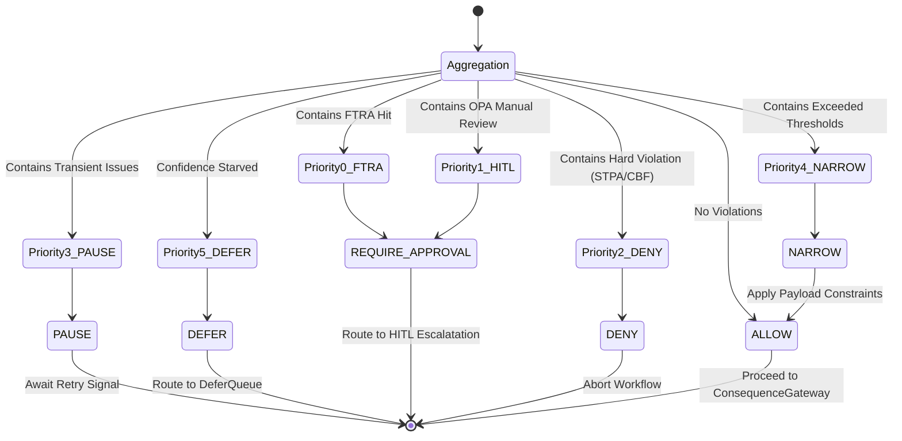

# Symbolic Governor Runtime Architecture

**Last Updated:** 2026-09-22

## 1. Architectural Role & Domain Boundary

The `SymbolicGovernor` is the primary neuro-symbolic governance layer in the CAGE architecture, implementing the Governance/Reasoning Plane from Tallam's Five-Plane Reference Architecture. It sits below the request ingress and above the execution actuators.

Its role is to evaluate requested actions against multiple domain-agnostic invariant tiers (e.g., STPA safety bounds, Control Barrier Functions, OPA policies, Causal models). Crucially, the Governor does not directly execute actions; it classifies aggregate validation results into discrete, actionable execution states (ALLOW, DENY, DEFER, PAUSE, NARROW, REQUIRE_APPROVAL) that the downstream `ConsequenceGateway` and `ExecutionActuator` enforce.

**Trust Boundaries**:
- **Upstream (Client/Agents)**: Provides actions and self-assessed confidence scores. The Governor treats these inputs as untrusted and requires cryptographic or systemic verification.
- **Downstream (Execution Actuators)**: Relies on the Governor to output cryptographically signed governance receipts and bounded action scopes.

## 2. Data & Execution Flow

When an agent requests an action, the pipeline aggregates responses from safety filters and plugins. The execution flow evaluates these results in a strict, priority-based classification engine.

## 3. State Machine & Lifecycle

The classification sequence maps violations into explicit states, satisfying CSA AARM specifications:

- **REQUIRE_APPROVAL**: Triggered by Tier 2 structural overrides, OPA manual review flags, or FTRA boundary hits. Escalates to human-in-the-loop (HITL) workflows.
- **DENY**: Hard safety constraints (STPA unsafe control actions, CBF barrier violations, explicit OPA denials). Causes immediate workflow termination (Saga LIFO rollback).
- **PAUSE**: Transient conditions (rate limits, circuit breakers). Pauses execution awaiting an explicit resume signal without discarding context. (Opt-in via `CAGE_PAUSE_ENABLED`).
- **NARROW**: Clamps threshold violations (e.g., amount, date range) to strictly allowed values while permitting the workflow to continue. (Opt-in via `CAGE_NARROW_ENABLED`).
- **DEFER**: Resolves confidence starvation (confidence `< FRIA_ZONE_DEFER`) or ambiguous policy interpretations by routing to the Redis `db=1` DeferQueue for automated hydration (AARM-V7 Context Window Overflow mitigation).

## 4. Operational Guarantees & Edge Cases

- **Fail-Closed on Missing Dependencies**: Module-level assertions run at import time to ensure critical components (KMS, Redis, DoWhy) are present and reachable. If a dependency is missing in production, the service crashes at startup rather than failing open during a request (No-Direct-Bind gap prevention).
- **Idempotency & Replay Protection**: Classifications are deterministic based on the provided payload and contextual state. Governance receipts emitted are cryptographically verifiable downstream to prevent tampering.
- **Priority Precedence**: A single hard violation (e.g., CBF violation) will short-circuit any attempt to `NARROW` or `DEFER`, resulting in a strict `DENY` regardless of other soft violation signals.

## 5. Configuration Contracts & Runtime Matrix

The Governor's execution paths are manipulated via the following environment and configuration contracts:

- **Threshold Configuration**: Limits (`FRIA_ZONE_ALLOW`, `FRIA_ZONE_DEFER`) are loaded from `config/governance_thresholds.json` and dictate the boundary between autonomous allowance, deferral, and hard denial.
- **Feature Flags (Environment Variables)**:
  - `CAGE_DEFER_ENABLED` (default: `true`): If `false`, confidence starvation falls back directly to `DENY`.
  - `CAGE_PAUSE_ENABLED` (default: `false`): If `false`, transient violations fall back to `DENY`.
  - `CAGE_NARROW_ENABLED` (default: `false`): If `false`, clampable threshold limits fall back to `DENY` or `DEFER`.
- **Production Guardrails**: Setting `CBF_FAIL_OPEN=true` or omitting `dowhy` in production environments triggers an immediate `RuntimeError` at startup to prevent direct-bind shortcutting.

