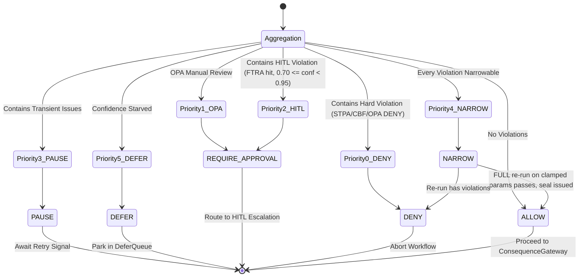

# Symbolic Governor Runtime Architecture

**Last Updated:** 2026-09-29

## 1. Architectural Role & Domain Boundary

The [`SymbolicGovernor`](../../src/gateway/governance/governor/governor.py) is the primary neuro-symbolic governance layer in the CAGE architecture, implementing the Governance/Reasoning Plane from Tallam's Five-Plane Reference Architecture. It sits below the request ingress and above the execution actuators.

Its role is to evaluate requested actions against multiple domain-agnostic invariant tiers (e.g., STPA safety bounds, Control Barrier Functions, OPA policies, Causal models). Crucially, the Governor does not directly execute actions; it classifies aggregate validation results into discrete, actionable execution states (ALLOW, DENY, DEFER, PAUSE, NARROW, REQUIRE_APPROVAL) that the downstream `ConsequenceGateway` and `ExecutionActuator` enforce.

**Trust Boundaries**:
- **Upstream (Client/Agents)**: Provides actions and self-assessed confidence scores. The Governor treats these inputs as untrusted and requires cryptographic or systemic verification. The governor runs only in the gateway process; the governed advisor reaches it through gateway endpoints (`/governance/validate-action`, `/governance/revalidate-post-hitl`, `/tools/execute`) and hosts no governor of its own.
- **Downstream (Execution Actuators)**: Relies on the Governor to output cryptographically signed governance receipts and bounded action scopes.

### 1.1 Composition Root & Immutability

A governor is built once at startup and never changed:

- [`bootstrap_governor()`](../../src/gateway/governance/governor/bootstrap.py) is the single entry sequence (used by the gateway's `mcp_tool_server._activate_domain()` and by scripts). It loads the one plugin named by `CAGE_DOMAIN`, assembles, refuses any engine slot still holding a null object, registers the domain's compliance overlays, and runs the posture checks.
- [`assemble_governor(plugins, *, posture, ...)`](../../src/gateway/governance/governor/assembly.py) collects each plugin's frozen `PluginContribution` from `CagePlugin.contribute()` and validates them together. It refuses to build on a slot collision (two tiers claiming one action at the same `(phase, order)`), a duplicate domain or threshold section, a domain name that differs from the plugin name, an IRREVERSIBLE_TERMINAL FTRA registry entry that no tier claims, two contributions filling the same engine slot, or an invariant failing V1–V4 ([`invariants.py`](../../src/gateway/governance/governor/invariants.py)). Unfilled slots get the deny-by-default `NullSafetyFilter` / `NullConsensusProvider` ([`null_components.py`](../../src/gateway/governance/null_components.py)).
- `SymbolicGovernor(GovernorComponents)` uses `__slots__` and raises on `setattr` / `delattr`; nothing installs tiers, invariants or engines after construction. The gateway stores it on `app.state.governor` (read via `server/app_state.py::governor_of()`, which fails closed when it is missing) and passes it explicitly to middleware, tool providers and node factories.

## 2. Data & Execution Flow

When an agent requests an action, [`run_pipeline()`](../../src/gateway/governance/governor/pipeline.py) runs the stages sequentially. The read-only stages go first: FTRA, STPA, OPA, confidence, then the domain's read-only tiers by `(phase, order)`. The run stops at the first `HARD` violation. The phase-2 (mutating) tiers commit only if the read-only stages produced no violations. Each commit returns a `CommitReceipt` owned by the request's `ReservationScope` ([`reservation.py`](../../src/gateway/governance/governor/reservation.py)). A clean run is sealed inside that scope by `run_sealed()` ([`sealing.py`](../../src/gateway/governance/governor/sealing.py)). Otherwise the violations go to a strict, priority-based [`ClassificationEngine`](../../src/gateway/governance/classification_engine.py). Every domain tier hook is traced as one span `cage.tier.<tier_name>` ([`governor/stages/domain_tiers.py`](../../src/gateway/governance/governor/stages/domain_tiers.py)).

```mermaid
stateDiagram-v2
    [*] --> Aggregation
    Aggregation --> Priority0_DENY: Contains Hard Violation (STPA/CBF/OPA DENY)
    Aggregation --> Priority1_OPA: OPA Manual Review
    Aggregation --> Priority2_HITL: Contains HITL Violation (FTRA hit, 0.70 <= conf < 0.95)
    Aggregation --> Priority3_PAUSE: Contains Transient Issues
    Aggregation --> Priority4_NARROW: Every Violation Narrowable
    Aggregation --> Priority5_DEFER: Confidence Starved
    Aggregation --> ALLOW: No Violations

    Priority0_DENY --> DENY
    Priority1_OPA --> REQUIRE_APPROVAL
    Priority2_HITL --> REQUIRE_APPROVAL
    Priority3_PAUSE --> PAUSE
    Priority4_NARROW --> NARROW
    Priority5_DEFER --> DEFER

    PAUSE --> [*]: Await Retry Signal
    DEFER --> [*]: Park in DeferQueue
    REQUIRE_APPROVAL --> [*]: Route to HITL Escalation
    DENY --> [*]: Abort Workflow
    NARROW --> ALLOW: FULL re-run on clamped params passes, seal issued
    NARROW --> DENY: Re-run has violations
    ALLOW --> [*]: Proceed to ConsequenceGateway
```

## 3. State Machine & Lifecycle

The classification sequence maps violations into explicit states, satisfying CSA AARM specifications:

- **REQUIRE_APPROVAL**: Triggered by `HITL` violations (FTRA boundary hits, confidence between `FRIA_ZONE_DEFER` and `AGENT_CONFIDENCE_THRESHOLD`) or an OPA `MANUAL_REVIEW`. Escalates to human-in-the-loop (HITL) workflows; after approval, `revalidate_post_hitl()` re-runs the `POST_HITL` profile (OPA plus the claimed CBF and fiscal tiers) and refuses actions no domain tier claims.
- **DENY**: Hard safety constraints (STPA unsafe control actions, CBF barrier violations, explicit OPA denials). Any phase-2 commits are rolled back LIFO from their receipts, and a `RefusalReceipt` is published to the evidence chain.
- **PAUSE**: Transient conditions (rate limits, circuit breakers). Pauses execution awaiting an explicit resume signal without discarding context. (Opt-in via `CAGE_PAUSE_ENABLED`).
- **NARROW**: Clamps threshold violations (e.g., amount) to allowed values. Returned only if every violation is `NARROWABLE`, a registered narrower proposes clamped params, and a FULL re-run on those params (in a new `ReservationScope`) has zero violations; the seal covers exactly the re-verified params, otherwise `DENY`. (Opt-in via `CAGE_NARROW_ENABLED`).
- **DEFER**: Resolves confidence starvation (confidence `< FRIA_ZONE_DEFER`) by parking the context in the gateway's Redis `db=1` [DeferQueue](DEFERRAL_QUEUE.md) for automated hydration or dual-control escalation (AARM-V7 Context Window Overflow mitigation).

## 4. Operational Guarantees & Edge Cases

- **Fail-Closed on Missing Dependencies**: Nothing runs at import time. After assembly, [`assert_production_posture()`](../../src/gateway/governance/governor/posture.py) runs a table of startup checks once: `tier_runtime_requirements` (e.g. `dowhy` for the causal tier), `kms_signing_mode`, `kms_ready`, `redis_ready`, `reconciliation_provider`, `reconciler_trust_anchor` and `governance_salt`. Under an enforcing posture (anything but dev/test/CI) all failures are raised together and the service refuses to start; otherwise each is logged as a CRITICAL JSON line.
- **Atomic Phase-2 Commits**: Rollback undoes exactly what each `CommitReceipt` records, never re-deriving it from request params. A failing or cancelled seal rolls back every commit in a shielded task; a failed rollback raises `[ROLLBACK_FAILED]`, and a refused run that still holds commits raises `[UNROLLED_COMMIT]`.
- **Idempotency & Replay Protection**: Classifications are deterministic based on the provided payload and contextual state. Governance receipts emitted are cryptographically verifiable downstream to prevent tampering.
- **Priority Precedence**: A single hard violation (e.g., CBF violation) will short-circuit any attempt to `NARROW`, `DEFER` or `REQUIRE_APPROVAL`, resulting in a strict `DENY` regardless of other soft violation signals.
- **Empty Governor Denies**: A governor assembled with no plugins has only null engines and no domain tiers; `govern`, `validate_action`, `verify` and `revalidate_post_hitl` all deny.

## 5. Configuration Contracts & Runtime Matrix

The Governor's execution paths are manipulated via the following environment and configuration contracts:

- **Domain Selection**: `CAGE_DOMAIN` (required, single value) names the one `cage.plugins` entry point the process runs; unset, multi-valued or `DomainConfig`-less domains abort startup.
- **Threshold Configuration**: `AGENT_CONFIDENCE_THRESHOLD` (default 0.95) and `FRIA_ZONE_DEFER` (default 0.70) are loaded from `config/governance_thresholds.json` and set the boundaries between autonomous allowance, human approval and deferral. Domain thresholds live under `domains.<domain>` and are validated at assembly.
- **Feature Flags (Environment Variables)**, read once at assembly via [`env_posture.py`](../../src/gateway/governance/env_posture.py):
  - `CAGE_DEFER_ENABLED` (default: `true`): If `false`, confidence starvation falls back directly to `DENY`.
  - `CAGE_PAUSE_ENABLED` (default: `true`): If `false`, transient violations fall back to `DENY`.
  - `CAGE_NARROW_ENABLED` (default: `false`): If `false`, clampable threshold limits fall back to `DENY`.
- **Production Guardrails**: The CBF tier has no fail-open flag. Under an enforcing posture, a tier whose runtime requirement (e.g. `dowhy`) fails to import, `RECONCILIATION_PROVIDER=stub`, an invariant with no registered `GroundTruthProvider`, or a missing or invalid `RECONCILER_KMS_KEY` trust anchor raises `PostureViolation` at startup.

