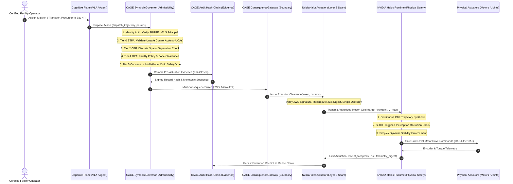

# Governing the Machine: Bridging NVIDIA Halos and CAGE for Runtime Physical-AI Governance

**By Antigravity Engineering & The CAGE Open Source Project**  
*September 2026*

---

## Abstract

As autonomous systems transition from deterministic, hardcoded robotics to embodied foundation models—Vision-Language-Action (VLA) architectures and generative agent planners—the engineering community faces a critical architectural juncture. 

NVIDIA’s recent announcement of **NVIDIA Halos** establishes a comprehensive, full-stack safety system for physical AI, treating safety as a continuous assurance problem spanning hardware, software, AI behavior, operational context, simulation, and deployment. 

Yet, as physical machines assume increasing autonomy in shared human environments, an essential question emerges: **Where does AI governance enter the execution path, and how does it interface with physical safety?**

This article explores the technical and architectural integration between **NVIDIA Halos** and the open-source **Cybernetic Agent Governance Engine (CAGE)**. We demonstrate that physical safety (*"Can the system act safely without physical damage?"*) and runtime governance (*"Is the system authorized to act at all, on whose mandate, and with what non-repudiable audit trail?"*) are not competing frameworks—they are the two complementary halves of a unified cybernetic control loop. 

By modeling physical AI as *just another regulated consequence domain* within CAGE (`cage_physical_ai`), we illustrate how NVIDIA Halos acts as a downstream **Execution Actuator** and upstream **Telemetry Provider**, guaranteeing that autonomous machines remain physically safe in the world and legally accountable to the enterprise.

---

## 1. The Physical-AI Safety Frontier

Safety has always been the bridge between technological innovation and societal adoption. In conventional automation, safety was largely a **pre-deployment certification event**: an industrial robot operated behind physical interlocks, light curtains, and hardwired emergency stops governed by standards like ISO 10218 and IEC 61508.

Embodied AI completely overturns this model. Autonomous Mobile Robots (AMRs), humanoid manipulators, and automated vehicles operate in dynamic, unstructured, and human-occupied spaces. Their planning is powered by probabilistic neural networks that cannot be exhaustively verified via traditional static analysis.

As Dr. Riccardo Mariani (VP of Safety at NVIDIA) emphasized in introducing NVIDIA Halos, physical AI requires **four fundamental shifts**:
1. **Dynamic environments** that require context-aware safety;
2. **AI behavior** that requires dedicated runtime assurance mechanisms;
3. **Deployment as an ongoing process**, where continuous software, model, and policy updates make pre-deployment validation insufficient; and
4. **Massive simulation and digital twins** (NVIDIA Omniverse / Isaac Sim) to reconstruct scenarios and validate edge cases at scale.

NVIDIA Halos addresses these challenges by embedding safety into the physical stack: real-time sensor fusion, SOTIF (Safety of the Intended Functionality, ISO 21448) trigger detection, runtime assurance (RTA), continuous Control Barrier Functions (CBFs), and hardware fail-safes.

However, once a robot is equipped with Halos, a new operational challenge arises.

---

## 2. The Semantic Blindspot of Pure Functional Safety

Consider an autonomous mobile robot deployed in a high-containment pharmaceutical cleanroom or an advanced semiconductor fabrication facility:

```
┌────────────────────────────────────────────────────────────────────────┐
│                        THE TWO SIDES OF SAFETY                         │
│                                                                        │
│   ┌────────────────────────────────┐  ┌─────────────────────────────┐  │
│   │         AI GOVERNANCE          │  │     FUNCTIONAL SAFETY       │  │
│   │    (The Socio-Technical Norm)  │  │   (The Physical Substrate)  │  │
│   ├────────────────────────────────┤  ├─────────────────────────────┤  │
│   │ • Mandate & Legal Authority    │  │ • Kinematic Feasibility     │  │
│   │ • Principal Identity (mTLS)    │  │ • Collision Avoidance       │  │
│   │ • Jurisdictional Policy (OPA)  │  │ • Dynamic Stability (ZMP)   │  │
│   │ • Multi-Party Consensus        │  │ • Actuator Torque Limits    │  │
│   │ • Tamper-Evident Audit Chains  │  │ • Fail-Safe Hardware E-Stop │  │
│   │ • Post-Incident Liability      │  │ • SOTIF Trigger Management  │  │
│   └───────────────┬────────────────┘  └──────────────┬──────────────┘  │
│                   │                                  │                 │
│                   ▼                                  ▼                 │
│         "SHOULD IT ACT?"                       "CAN IT ACT?"           │
└───────────────────┴──────────────────────────────────┴─────────────────┘
```

The robot's high-level VLA planner proposes a motion plan to navigate to a storage bay and open a pressurized chemical valve. 

NVIDIA Halos evaluates the trajectory:
* The path is 100% obstacle-free.
* Accelerations and velocities are well within dynamic rollover and tipping limits.
* Thermal margins on joint actuators are nominal.
* SOTIF perception filters report high confidence with zero sensor blinding.

From a functional safety standpoint, **the trajectory is flawlessly safe to execute.**

Yet, from an enterprise and governance standpoint, the action may be catastrophic:
* The robot's work-order ticket expired 10 minutes ago.
* The cleanroom is currently under a maintenance lockout requiring **dual-operator human-in-the-loop (HITL) authorization**.
* The valve modification alters an industrial OT process line subject to strict FDA 21 CFR Part 11 or EU Annex 11 regulatory controls.
* No pre-actuation record has been committed to a non-repudiable audit chain, exposing the facility to uninsurable liability in the event of contamination.

**Functional safety understands physics, kinematics, and sensor faults. It does not understand authority, mandates, jurisdictional policy, delegation, or liability.**

Safety determines whether the robot *can* act safely.  
Governance determines whether it *should* act at all.

---

## 3. CAGE’s Generality: Physical AI as a Regulated Consequence Domain

The **Cybernetic Agent Governance Engine (CAGE)** is an open-source reference architecture designed to solve runtime governance for autonomous AI agents. 

A central architectural discovery of CAGE is that **all regulated domains share the exact same mathematical invariant structure**. Whether an agent operates in financial capital markets, clinical medicine, or physical robotics, the governance challenge is to constrain state transitions within an admissible set-invariant manifold:

$$h(S(t+1)) \ge (1 - \gamma) \cdot h(S(t)) \ge 0, \quad \gamma \in (0, 1)$$

In CAGE's strictly decoupled **Three-Layer Architecture**:
1. **Layer 1 (Kernel):** Implements domain-agnostic invariant solvers, cryptographic signers, OPA policy engines, consensus coordinators, and tamper-evident audit hash-chains.
2. **Layer 2 (Domain Plugins):** Declares domain-specific vocabularies, barriers, and compliance citations without touching kernel code.
3. **Layer 3 (Integrations & Actuators):** Implements physical adapters, bridges, and hardware interfaces.

```
┌────────────────────────────────────────────────────────────────────────┐
│             LAYER 1: DOMAIN-AGNOSTIC GOVERNANCE KERNEL                 │
│    STPA Validator · Control Barrier Function Engine · Consensus Gate   │
│    DoWhy Causal Gatekeeper · Consequence Gateway · Evidence Ledger     │
└──────────────▲────────────────────────▲───────────────────────▲────────┘
               │                        │                       │
      ┌────────┴────────┐      ┌────────┴────────┐     ┌────────┴────────┐
      │     Layer 2     │      │     Layer 2     │     │     Layer 2     │
      │  cage_finance   │      │ cage_healthcare │     │cage_physical_ai │
      └─────────────────┘      └─────────────────┘     └─────────────────┘
      Cash Reserve Barrier     Serum Toxicity Barrier  Spatial/Torque Barrier
      h(x) = cash - min >= 0   h(x) = max - dose >= 0  h(x) = dist - min >= 0
```

### The Three Domain Realizations:
* **In Finance (`cage_finance`):** The state variable $x$ is cash balance; the barrier prevents capital insolvency: $h(x) = \text{cash} - \text{reserve}_{\text{min}} \ge 0$. The action is `execute_trade`.
* **In Healthcare (`cage_healthcare`):** The state variable $x$ is serum drug concentration; the barrier prevents clinical toxicity: $h(x) = \text{concentration}_{\text{max}} - \text{serum} \ge 0$. The action is `administer_medication`.
* **In Physical AI (`cage_physical_ai`):** The state variable $x$ is physical separation distance and joint torque; the barrier prevents human crushing and collaborative workspace intrusion: $h(x) = \|\mathbf{p}_{\text{agent}} - \mathbf{p}_{\text{human}}\| - d_{\text{min\_safe}} \ge 0$. The actions are `dispatch_trajectory` and `actuate_joint`.

By abstracting physical AI as a Layer 2 plugin, CAGE applies its formally verified **No-Direct-Bind Theorem** (`proof/model.py`):

$$\text{NoDirectBind}_{\text{physical}} \equiv (\text{State}_{\text{motor}} = \text{ENERGIZED}) \implies (\text{Token}_{\text{governance}} = \text{VALID} \land \text{EvidenceChain}_{\text{committed}} = \text{TRUE})$$

An unverified neural model or VLA planner must **never directly bind** to low-level motor drivers or industrial CAN/DDS buses. Actuation can only occur downstream of an explicit, cryptographically verifiable governance clearance.

---

## 4. The Integration Architecture: Where CAGE Meets NVIDIA Halos

How do CAGE and NVIDIA Halos connect in production? 

Under the **Five-Plane Reference Architecture** ([Tallam, 2026, arXiv:2606.12320](https://arxiv.org/abs/2606.12320)), CAGE acts as the **Governance / Admissibility Plane**, while NVIDIA Halos operates as the **Physical Safety Plane**, linked by an `ExecutionActuator` seam at the **Consequence Boundary**.



### The 4-Stage Execution Loop

#### Stage 1: Intent & Admissibility (CAGE)
The high-level VLA model proposes a physical action. The request is intercepted by CAGE's `SymbolicGovernor`. Before physical motors are energized:
* **Caller Identity:** Verified via transport-layer mTLS SPIFFE credentials, never unverified JSON payloads.
* **STPA / Hazard Analysis:** Checked against System-Theoretic Process Analysis rules (Leveson STAMP model) to prevent Unsafe Control Actions (UCAs).
* **Declarative Policy (OPA):** Rego policies enforce facility rules, restricted-zone access privileges, and environmental airlock preconditions.
* **Dual-Control Consensus:** For high-consequence operations (e.g., handling bio-hazards or moving near human workers), CAGE triggers a multi-critic consensus check or halts for human-in-the-loop signoff (`REQUIRE_APPROVAL`).

#### Stage 2: The Evidence Sufficiency Hand-Off (The Consequence Seam)
CAGE enforces the **Evidence Sufficiency Invariant**: no clearance can be released until the intent, policy decisions, and approvals are written synchronously to a tamper-evident audit hash-chain (`EVIDENCE_CHAIN_BLOCKING=true`). 

Once committed, CAGE's `ConsequenceGateway` mints a short-lived, cryptographically signed `ConsequenceToken` (JWS with a 30-second Micro-TTL).

#### Stage 3: Physical Safety & Control (NVIDIA Halos)
The `NvidiaHalosActuator` receives the `ExecutionClearance`. It validates the cryptographic signature, burns the token in a Redis authority store to prevent replay attacks, and translates the clearance into Halos-native motion goals.

At this point, **NVIDIA Halos takes full control of physical safety**:
* **Continuous Control Barrier Functions:** Generates dynamic, microsecond-level collision-avoidance vectors around moving obstacles.
* **SOTIF Runtime Supervisor:** Continuously evaluates sensor fidelity. If dust or steam blinds a LiDAR sensor, Halos immediately down-regulates velocity or triggers a safe halt.
* **Simplex Architecture:** If the advanced trajectory planner enters an unstable state, Halos instantaneously fails over to a deterministic baseline safety controller (Lui Sha Simplex model).

#### Stage 4: Upstream Telemetry Feedback & Dynamic Re-Attestation
Halos continuously streams physical telemetry back to CAGE’s `TelemetryProvider` and `ReconciliationDaemon`. If Halos detects an operational context shift (e.g., humans unexpectedly entering a collaborative zone), CAGE transitions the agent's governance state from `ALLOW` to `NARROW` (speed clamping) or `PAUSE` (hold position).

---

## 5. Mapping the Regulatory Landscape

As physical AI enters commercial deployment, regulatory bodies are codifying these exact requirements. The CAGE + NVIDIA Halos architecture provides direct compliance mapping across international standards:

| Regulatory Standard | Domain Requirement | Enforced By | Technical Mechanism |
| :--- | :--- | :--- | :--- |
| **ISO 10218-1/2:2025** | Industrial Robots — Collaborative Safety & Speed Bounding | **NVIDIA Halos** (continuous) & **CAGE** (admissibility) | Halos enforces real-time speed/separation; CAGE clamps maximum allowable velocity envelope (`KinematicVelocityBarrier`). |
| **ISO 3691-4:2023** | Driverless Industrial Trucks (AMRs) — Zone Clearance | **CAGE** | OPA Rego policies verify zone access permissions, airlock sequencing, and personnel presence before issuing mission clearances. |
| **ISO 21448 (SOTIF)** | Safety of the Intended Functionality — Unknown Hazards | **NVIDIA Halos** | Runtime monitoring of perception degradation, distribution shifts, and sensor blinding triggers safe state transitions. |
| **IEC 61508 / ISO 26262** | Functional Safety — Deterministic Fail-Safe Execution | **NVIDIA Halos** | Hardware E-Stop, certified RTOS kernels, Simplex failover to baseline safety controllers. |
| **IEC 62443-4-2** | Industrial OT Cybersecurity — Command Integrity | **CAGE** | SPIFFE mTLS authentication, single-use `ConsequenceToken` consumption, JCS RFC 8785 canonicalization. |
| **EU AI Act (Annex III) & Machinery Reg 2023/1230** | High-Risk AI — Human Oversight & Non-Repudiable Logging | **CAGE** | Automated OSCAL SSP export, tamper-evident hash-chain audit logging, and automated HITL escalation for irreversible actions. |

---

## 6. Real-World Scenario: Autonomous Fleet Operations in Biomanufacturing

To see the power of this integration, imagine an AMR transport fleet in a commercial pharmaceutical facility:

1. **Mission Generation:** The facility scheduling AI dispatches AMR-07 to collect an active pharmaceutical ingredient (API) from Suite A and transfer it to Formulation Line 2.
2. **Governance Interception:** CAGE intercepts the command. It verifies that Suite A is currently marked `OPEN_FOR_BATCH` and that AMR-07's sensor calibration certificate is valid. Finding all invariants satisfied, CAGE commits the event to the audit ledger and issues an `ExecutionClearance`.
3. **Halos Trajectory Execution:** AMR-07 navigates through the corridor using Halos for real-time obstacle avoidance. As a worker steps out of a doorway, Halos’s continuous CBF smoothly slows the robot down, keeping a 1.5-meter dynamic safety buffer.
4. **The Governance Tripwire:** As AMR-07 reaches Formulation Line 2, the mission requires coupling with a pressurized tank. CAGE’s `PhysicalSafetyConsensusTier` identifies this as a high-consequence irreversible action (`CTRL_PHYS_003`). CAGE halts the workflow (`REQUIRE_APPROVAL`), sounding a local beacon and requesting dual-operator badge authorization.
5. **Clearance & Completion:** Once both operators scan their credentials, CAGE issues a cryptographic `ConsequenceToken`. The Halos actuator engages the coupling mechanism, completes the transfer, and emits an `ActuationReceipt` signed with the post-operation state.

Had the system relied **only on Halos**, the robot would have coupled with the tank as soon as it physically aligned—bypassing mandatory dual-custody verification. Had it relied **only on CAGE**, the robot would have possessed the legal authority to couple, but lacked the microsecond sensor-fusion safety to avoid hitting the operator standing near the port.

---

## 7. Conclusion: Two Halves of the Same Cybernetic Loop

Autonomous physical AI cannot scale on raw model intelligence alone, nor can it scale on functional safety in isolation.

**NVIDIA Halos** provides the indispensable physical safety substrate: ensuring that whether a robot walks, drives, or manipulates objects, it remains stable, collision-free, and fault-tolerant in real time.

**CAGE** provides the overarching cybernetic governance substrate: ensuring that every physical action is authorized by verified credentials, bounded by corporate and legal policies, evaluated against formal hazard models, and bound to an immutable audit trail before execution begins.

Together, Halos and CAGE bridge the gap between physical feasibility and operational legitimacy:

> **Halos ensures the robot survives the physical environment.**  
> **CAGE ensures the enterprise survives the robot’s decisions.**

As physical AI moves into hospitals, factories, city streets, and critical infrastructure, this dual-control architecture will define the standard for trusted, autonomous deployment.

---

### Resources & Open Source References
* **CAGE Repository & Physical AI Framework:** [`docs/architecture/PHYSICAL_AI_GOVERNANCE_FRAMEWORK.md`](file:///home/admin_laah_altostrat_com/cybernetic-governance-engine/docs/architecture/PHYSICAL_AI_GOVERNANCE_FRAMEWORK.md)
* **Physical AI Domain Plugin:** [`src/cage_physical_ai/`](file:///home/admin_laah_altostrat_com/cybernetic-governance-engine/src/cage_physical_ai/)
* **Foundational Architecture:** Krti Tallam (2026), *A Five-Plane Reference Architecture for Runtime Governance of Production AI Agents*, arXiv:2606.12320.
* **Control Barrier Functions:** Ames, A. D., et al. (2019), *Control Barrier Functions: Theory and Applications*, European Control Conference.
* **Simplex Architecture:** Sha, L. (2001), *Using Simplex to Build Dependable Systems Using Unreliable Components*, IEEE Software.
