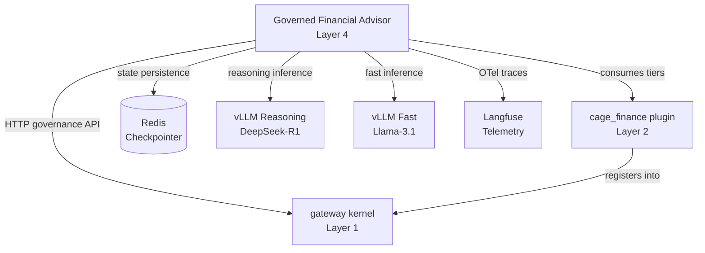

# Governed Financial Advisor — Reference Application Architecture

> **Classification**: Layer 4 Reference Application (Optional)  
> **Location**: `src/governed_financial_advisor/`  
> **Purpose**: Demonstrates the CAGE governance kernel applied to an autonomous multi-agent wealth advisory workflow  
> **Status**: Example reference implementation — strictly decoupled from Layer 1 core operations

**Version:** v3.0.1  
**Domain Plugin Dependency:** [`src/cage_finance/`](../../../src/cage_finance/) (Layer 2)  
**Kernel Dependency:** [`src/gateway/`](../../../src/gateway/) (Layer 1)

---

## Table of Contents

1. [Overview & Separation of Concerns](#1-overview--separation-of-concerns)
2. [Multi-Agent Architecture](#2-multi-agent-architecture)
3. [LangGraph Governance Harness Integration](#3-langgraph-governance-harness-integration)
4. [Application Endpoints & API Surface](#4-application-endpoints--api-surface)
5. [Deployment & Operational Topology](#5-deployment--operational-topology)

---

## 1. Overview & Separation of Concerns

### 1.1 Architectural Role

The Governed Financial Advisor (GFA) is a **Layer 4 reference application** that demonstrates how domain-specific agentic workflows integrate with the CAGE Layer 1 governance kernel. It is **not** a required component of the CAGE platform — the kernel is domain-agnostic and can govern healthcare, manufacturing, logistics, or any other vertical with equal fidelity.

### 1.2 Domain Isolation & Replaceable Plugin Architecture

The GFA implements a **multi-agent wealth advisory workflow** using:
- **LangGraph StateGraph**: 12-node orchestration graph with typed state transitions
- **Specialist Sub-Agents**: Market data analyst, risk analyst, execution analyst, evaluator, explainer, and governed trader
- **Split-Brain Model Routing**: Strategic reasoning (DeepSeek-R1) + rapid execution (Llama-3.1)
- **Domain Plugin Injection**: Consumes [`src/cage_finance/`](../../../src/cage_finance/) tiers (CBF fiscal bounds, bounding contracts, trade ontology) via `SymbolicGovernor(domain_tiers=[...])`

### 1.3 Non-Dependence of Layer 1 on Layer 4

The Layer 1 kernel ([`src/gateway/`](../../../src/gateway/)) has **zero awareness** of the GFA application. The governance substrate provides:
- Universal dispatch loop ([`symbolic_governor.py`](../../../src/gateway/governance/symbolic_governor.py))
- FTRA reachability analysis ([`src/gateway/governance/ftra/`](../../../src/gateway/governance/ftra/))
- Consequence Gateway atomic verification ([`consequence_gateway.py`](../../../src/gateway/governance/consequence_gateway.py))
- Evidence accumulation ([`provenance_chain.py`](../../../src/gateway/governance/provenance_chain.py))

The GFA **consumes** these primitives via HTTP endpoints and LangGraph node factories, but the kernel does not import from, call into, or depend on the GFA codebase. This strict boundary is enforced by Gate G3 ([`scripts/check_import_boundaries.py`](../../../scripts/check_import_boundaries.py)).

---

## 2. Multi-Agent Architecture

### 2.1 Agent Roles & Interaction Topology

The GFA orchestrates **9 specialist agents** in a LangGraph `StateGraph` ([`src/governed_financial_advisor/graph/graph.py`](../../../src/governed_financial_advisor/graph/graph.py)):

| Agent | Role | Model | Output |
|---|---|---|---|
| **Thinker Node** | Strategic reasoning | `DeepSeek-R1-Distill-Llama-8B` | `reasoning_output` |
| **Doer Node** | Instruction decomposition | `MODEL_FAST` (Llama-3.1) | Decomposed instructions |
| **Data Analyst** | Market data fetch | yfinance (no LLM) | `data_analyst_ticker`, price history, top 3 news |
| **Execution Analyst** | Structured plan synthesis | `MODEL_REASONING` + guided JSON | `ExecutionPlan` (list of `PlanStep`) |
| **Evaluator** | Audit verification | `Qwen/Qwen2.5-1.5B-Instruct` | `evaluation_result`, `opa_results`, `governance_signature` |
| **Risk Analyst** | STPA/UCA hazard analysis | STAMP hazards from GCS | `ProposedUCA` structs |
| **Governed Trader** | Final trade execution | `MODEL_FAST` | `execution_result` |
| **Explainer** | Compliance narrative | `MODEL_FAST` | Human-readable audit summary |
| **Financial Advisor** | Framing prompt | `MODEL_REASONING` | Advisory context |

### 2.2 Split-Brain Model Routing

The GFA leverages a **dual-pool inference topology**:
- **Reasoning Pool** (`vllm-reasoning`): Deep planning, multi-step analysis, chain-of-thought (DeepSeek-R1)
- **Governance Pool** (`vllm-inference`): Rapid policy checks, tool-calling execution, content moderation (Llama-3.1, Qwen-2.5)

Routing is transparent to agents — the `ConfigManager` ([`src/governed_financial_advisor/infrastructure/llm/config.py`](../../../src/governed_financial_advisor/infrastructure/llm/config.py)) resolves `MODEL_REASONING` and `MODEL_FAST` endpoints from environment variables.

### 2.3 Shared State Contract

All graph nodes share a single `AgentState` TypedDict ([`src/governed_financial_advisor/graph/state.py`](../../../src/governed_financial_advisor/graph/state.py)) with **33 fields**:

| Field Category | Example Fields |
|---|---|
| **User Input** | `user_query`, `user_id`, `thread_id` |
| **Agent Outputs** | `reasoning_output`, `doer_output`, `execution_plan_output`, `evaluation_result`, `execution_result` |
| **Governance Signals** | `guardrail_blocked`, `opa_results`, `governance_signature`, `safety_status` |
| **FTRA & DEFER** | `ftra_status`, `ftra_result`, `ftra_defer_id`, `defer_resume_token` |
| **HITL Approval** | `approval_required`, `approval_granted`, `approval_decision` |
| **Audit Trail** | `completed_transactions`, `uca_violations` |

This contract is enforced by JSON Schema validation ([`compliance/schemas/agent_state_schema.json`](../../../compliance/schemas/agent_state_schema.json)) with CI drift detection ([`tests/test_agent_state_schema.py`](../../../tests/test_agent_state_schema.py)). **Note:** Schema enforcement is specified in [`AGENT_STATE_SCHEMA_ENFORCEMENT.md`](../../architecture/AGENT_STATE_SCHEMA_ENFORCEMENT.md) (GAP-3 design specification, pending implementation).

---

## 3. LangGraph Governance Harness Integration

### 3.1 Pre-Action Interception via Node Factories

The GFA injects governance checks as **first-class LangGraph nodes** using the LangGraph Harness ([`src/gateway/governance/langgraph_harness/`](../../../src/gateway/governance/langgraph_harness/)):

| Governance Node | Factory Function | Integration Point |
|---|---|---|
| **NeMo Input Rail** | `create_nemo_input_node()` | `guardrail_node.py` — pre-thinker mandatory rail |
| **NeMo Output Rail** | `create_nemo_output_node()` | `guardrail_node.py` — post-explainer mandatory rail |
| **OPA Safety Check** | `create_opa_safety_node()` | `safety_node.py` — pre-trader policy gate |
| **FTRA Reachability** | `create_ftra_node()` | `graph.py` — post-evaluator irreversibility check |

### 3.2 Consequence Token Validation

The `safety_node.py` ([`src/governed_financial_advisor/graph/nodes/safety_node.py`](../../../src/governed_financial_advisor/graph/nodes/safety_node.py)) validates the evaluator's cryptographic signature before allowing trade execution:

```python
def check_safety_signature(state: AgentState) -> dict:
    """Validate governance_signature against execution_plan_output."""
    plan_content = state.get("execution_plan_output", "")
    signature = state.get("governance_signature", "")
    
    # Verify KMS signature or HMAC-SHA256 seal
    is_valid = verify_governance_signature(plan_content, signature)
    
    if not is_valid:
        return {"safety_status": "SIGNATURE_INVALID"}
    
    return {"safety_status": "SIGNATURE_VALID"}
```

This prevents **state tampering** between the evaluator and trader nodes — a critical TOCTOU mitigation (see [`docs/security/HITL_TOCTOU_REMEDIATION.md`](../../../docs/security/HITL_TOCTOU_REMEDIATION.md)).

### 3.3 LangGraph HITL Interrupt Point

The graph compiles with `interrupt_before=["governed_trader"]` ([`graph.py:create_graph()`](../../../src/governed_financial_advisor/graph/graph.py)), pausing execution when `approval_required=True`:

```python
graph = create_graph(redis_url)
compiled = graph.compile(
    checkpointer=get_checkpointer(redis_url), interrupt_before=["governed_trader"]
)
```

Human approval is handled via REST API ([`server.py`](../../../src/governed_financial_advisor/server.py)):
- **`POST /v1/approvals/{thread_id}/resume`**: Resume execution with `ApprovalResumeRequest` (rationale, reviewer identity, max slippage)
- **`GET /v1/approvals/pending`**: List all threads awaiting approval

---

## 4. Application Endpoints & API Surface

The GFA exposes a FastAPI server ([`src/governed_financial_advisor/server.py`](../../../src/governed_financial_advisor/server.py)) with the following domain API:

### 4.1 Core Workflow Endpoints

| Endpoint | Method | Purpose | Request Body |
|---|---|---|---|
| **`/agent/query`** | POST | Submit natural-language advisory prompt | `QueryRequest` (query, user_id, thread_id) |
| **`/agent/stream`** | POST | SSE-streamed agent execution | Same as `/agent/query` |
| **`/health`** | GET | Liveness probe | None |

### 4.2 Human-in-the-Loop Endpoints

| Endpoint | Method | Purpose |
|---|---|---|
| **`/v1/approvals/pending`** | GET | List threads awaiting human approval |
| **`/v1/approvals/{thread_id}/resume`** | POST | Resume execution with approval decision |
| **`/v1/approvals/{thread_id}/cancel`** | POST | Cancel pending trade |

### 4.3 Tools & Utilities

| Endpoint | Method | Purpose |
|---|---|---|
| **`/tools/get_market_data`** | GET | yfinance ticker lookup |
| **`/tools/get_portfolio`** | GET | Mock portfolio positions |
| **`/demo/pipeline/trigger`** | POST | KFP green-stack pipeline trigger |

### 4.4 Authentication & Authorization

All endpoints require:
- **`X-API-Key` header**: Validated against `CAGE_API_KEY` environment variable
- **Routing Seal** (internal calls): HMAC-SHA256 seal from the gateway (`X-CAGE-Routing-Seal`)

---

## 5. Deployment & Operational Topology

### 5.1 Local Split-Brain Setup

For local development, the GFA runs alongside two vLLM instances:

```bash
# Terminal 1: Reasoning model
python -m vllm.entrypoints.openai.api_server \
  --model deepseek-ai/DeepSeek-R1-Distill-Llama-8B \
  --port 8001

# Terminal 2: Fast execution model
python -m vllm.entrypoints.openai.api_server \
  --model meta-llama/Llama-3.1-8B-Instruct \
  --port 8002

# Terminal 3: GFA server
export VLLM_REASONING_API_BASE=http://localhost:8001/v1
export VLLM_FAST_API_BASE=http://localhost:8002/v1
export GATEWAY_API_BASE=http://localhost:8080
uvicorn src.governed_financial_advisor.server:app --port 8081
```

### 5.2 vLLM Pod Routing (GKE)

In production, the GFA routes to dual vLLM Kubernetes Services:

| Service | Selector | Port | Model |
|---|---|---|---|
| `vllm-reasoning` | `app=vllm-reasoning` | 8000 | `DeepSeek-R1-Distill-Llama-8B` |
| `vllm-inference` | `app=vllm-inference` | 8000 | `Meta-Llama-3.1-8B-Instruct` |

The GFA Deployment manifest ([`deployment/k8s/financial-advisor.yaml`](../../../deployment/k8s/financial-advisor.yaml)) configures:

```yaml
env:
  - name: VLLM_REASONING_API_BASE
    value: "http://vllm-reasoning:8000/v1"
  - name: VLLM_FAST_API_BASE
    value: "http://vllm-inference:8000/v1"
  - name: GATEWAY_API_BASE
    value: "http://cage-gateway:8080"
```

### 5.3 Sample Kubernetes Overlay

The GFA requires the following Kubernetes resources:

| Resource | Manifest | Purpose |
|---|---|---|
| **Deployment** | `deployment/k8s/financial-advisor.yaml` | GFA FastAPI pods (1 replica) |
| **Service** | Same file | ClusterIP on port 80 |
| **Secrets** | `advisor-secrets` | `CAGE_API_KEY`, `LANGFUSE_PUBLIC_KEY`, `LANGFUSE_SECRET_KEY` |
| **ConfigMap** | `governance-thresholds` | Mounted at `config/governance_thresholds.json` |
| **NetworkPolicy** | `deployment/k8s/network-policy.yaml` | Ingress from `ingress-nginx` only |

### 5.4 Dependency Graph



### 5.5 Observability & Tracing

The GFA emits OpenTelemetry spans to Langfuse via LangGraph callback handlers and NeMo Guardrails integration (implementation varies by deployment configuration).

All spans are tagged with:
- `service.name=governed-financial-advisor`
- `deployment.environment=$CAGE_ENV`
- `cage.region=$CAGE_DEPLOYMENT_REGION`

---

## Related Documentation

| Document | Purpose |
|---|---|
| [`docs/architecture/GATEWAY_ARCHITECTURE.md`](../../architecture/GATEWAY_ARCHITECTURE.md) | Layer 1 kernel architecture |
| [`docs/architecture/EXTENSIBILITY_ARCHITECTURE.md`](../../architecture/EXTENSIBILITY_ARCHITECTURE.md) | Domain plugin contracts |
| [`docs/architecture/AGENT_SYSTEM_ARCHITECTURE.md`](../../architecture/AGENT_SYSTEM_ARCHITECTURE.md) | Full agent system deep-dive |
| [`docs/API_MAP_EXTERNAL.md`](../../API_MAP_EXTERNAL.md) | Complete REST API reference |
| [`docs/security/HITL_TOCTOU_REMEDIATION.md`](../../security/HITL_TOCTOU_REMEDIATION.md) | TOCTOU mitigation strategy |
