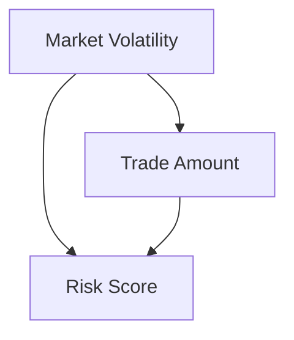

# Causal Models, Intervention Simulation, and Control Barrier Functions

This document outlines three key cybernetic mechanisms that power the Cybernetic Agent Governance Engine (CAGE): **Structural Causal Models (SCM)**, **Intervention Simulation**, and **Control Barrier Functions (CBF)**.

These features bridge the gap between probabilistic AI output and deterministic safety guardrails, enabling real-time, mathematically grounded policy enforcement.

> **Jurisdiction separation principle:** **ISO/IEC 42001:2023 is the sole universal governance baseline.** The CBF (`CTRL_MRM_004`) and DoWhy Causal Gatekeeper are ISO 42001 §A.9.4 obligations active in **all regions**. The SR 26-2 Model Risk Management (MRM) scope for these components applies **US_FED only** (`CAGE_DEPLOYMENT_REGION=US_FED`). NIST AI RMF MEASURE-2.6 applies **US_FED only**. EU_ECB and APAC_MAS deployments satisfy equivalent obligations via ISO 42001 §A.9.4 and their respective jurisdiction-specific frameworks.

---

## 1. Structural Causal Models (SCM) & Causal Gatekeeper

The Causal Gatekeeper (`src/gateway/governance/causal_gatekeeper.py`) acts as the "Lock" on the CAGE system. It uses Microsoft DoWhy's causal inference framework to validate the integrity of the system's "world-model" before allowing any high-stakes actions (such as `execute_trade`).

### Purpose
Generative AI models can hallucinate or degrade in unstable environments. The Gatekeeper ensures that the causal assumptions underpinning an action are sound. If a placebo refutation detects a spurious or hallucinated effect, the Gatekeeper blocks the trade, assuming the underlying reasoning is flawed.

## Compliance Mapping

### Universal Controls (All Deployment Regions — ISO 42001 Baseline)

| Governance Control | Framework | Component | Notes |
|---|---|---|---|
| `CTRL_TEL_003` (THR-TEL-003) | **ISO 42001 §A.9.4** | DoWhy placebo refutation (`causal_gatekeeper.py` Phase 2), `telemetry_provider.py` | Agentic operational check: live Langfuse telemetry, 50 simulations per trade *(All Regions)* |
| `CTRL_AGT_001` (THR-CONF-001) | **ISO 42001 §A.5.2** | `symbolic_governor.py` confidence threshold | Agentic AI bounding *(All Regions)* |

### US_FED Jurisdiction Controls (`CAGE_DEPLOYMENT_REGION=US_FED`)

| Governance Control | Framework | Component | Notes |
|---|---|---|---|
| `CTRL_MRM_004` (THR-MRM-004) | **SR 26-2 §IV** — Model Risk Management (Federal Reserve, April 17, 2026) | CBF (`cbf.py`), DoWhy statistical kernel (`causal_gatekeeper.py` Phase 1) | Deterministic quantitative models: fixed formula + static γ decay; linear regression coefficient estimation — **US_FED only** |
| NIST AI RMF MEASURE-2.6 | **NIST AI RMF** | DoWhy refutation (both phases) | Continuous world-model validation against live production telemetry — **US_FED only** |

### EU_ECB Jurisdiction Addendum (`CAGE_DEPLOYMENT_REGION=EU_ECB`)

| Governance Control | Framework | Component | Notes |
|---|---|---|---|
| `CTRL_TEL_003` addendum | **DORA Art. 10** | `telemetry_provider.py` | DORA audit logging obligation for telemetry — **EU_ECB only** (addendum to ISO 42001 §A.9.4 base control) |

All framework citations are stored in regional baseline profiles under `config/compliance/` (e.g., `US_FED_BASELINE.json`, `EU_ECB_BASELINE.json`, `APAC_MAS_BASELINE.json`) and resolved at runtime via `ControlRegistry`. The active profile is selected by the `CAGE_DEPLOYMENT_REGION` environment variable at boot. Python source files contain only stable `GovernanceControl` enum members — no hardcoded citation strings.

### Causal Graph
The system evaluates the relationship between market conditions, the agent's action, and the resulting risk:
- **Confounder (W):** `market_volatility`
- **Treatment (X):** `trade_amount`
- **Outcome (Y):** `risk_score`




### Named Constants

The following module-level constants in [`src/gateway/governance/causal_gatekeeper.py`](../../src/gateway/governance/causal_gatekeeper.py) define the three conditions that trigger a **CAUSAL LOCK** (i.e. `causal_safety_check()` returns `False`, blocking the trade):

| Constant | Default | Override |
|----------|---------|----------|
| `CAUSAL_LOCK_P_VALUE_THRESHOLD` | `0.05` | `CAUSAL_LOCK_P_VALUE_THRESHOLD` env var |
| `CAUSAL_LOCK_PLACEBO_EFFECT_MAGNITUDE` | `0.2` | `CAUSAL_LOCK_PLACEBO_EFFECT_MAGNITUDE` env var |
| `CAUSAL_LOCK_RISK_BOUNDARY` | `0.95` | `CAUSAL_LOCK_RISK_BOUNDARY` env var |

Additional configuration constants:

| Constant | Default | Purpose |
|----------|---------|---------|
| `TELEMETRY_MAX_STALENESS_SECONDS` | `300` | Age threshold for telemetry freshness check |
| `CAUSAL_CACHE_TTL_SECONDS` | `60` | Redis cache TTL for causal results (0 = disabled) |
| `CAUSAL_GATEKEEPER_STRICT_MODE` | `false` | Whether missing `trace_id` fields cause rejection |

### Mechanism
1. **Phase 1 — Statistical Kernel (`CTRL_MRM_004` / SR 26-2 MRM):** A DoWhy `CausalModel` is instantiated using recent telemetry data from the configured `BaseTelemetryProvider`. The causal effect is identified via the **backdoor criterion** and estimated via `backdoor.linear_regression`. The causal graph structure and regression coefficients are the SR 26-2 MRM-governed artefacts; this phase emits a `causal_gatekeeper.statistical_kernel` OTel span tagged with `CTRL_MRM_004`.
   - **Production:** `LangfuseTelemetryProvider` (`src/gateway/governance/telemetry_provider.py`) fetches live `{market_volatility, trade_amount, risk_score}` triples from Langfuse governance spans, ensuring world-model beliefs are validated against actual runtime conditions rather than synthetic data. **In production (`CAGE_ENV != development/test`), missing live telemetry is a fail-closed condition — the function returns `False` immediately.**
   - **Fallback:** `MockTelemetryProvider` (deterministic seed=42) activates only in dev/test environments when live telemetry is unavailable, and emits a warning.
2. **Phase 2 — Placebo Refutation (`CTRL_TEL_003` / ISO 42001 §A.9.4):** The model is subjected to a **PlaceboTreatmentRefuter** with `num_simulations=50` per trade call, which replaces the real treatment with a random variable. This is the agentic operational check — non-deterministic, live-sourced, high-frequency — and emits a `causal_gatekeeper.placebo_refutation` OTel span tagged with `CTRL_TEL_003`.
   - If the refuter detects a statistically significant effect (`p_value < CAUSAL_LOCK_P_VALUE_THRESHOLD` = `0.05`), the null hypothesis (no spurious effect) is rejected at the 5% significance level — the world-model's causal assumptions cannot be trusted.
   - If the absolute placebo effect magnitude exceeds `CAUSAL_LOCK_PLACEBO_EFFECT_MAGNITUDE` = `0.2` (Cohen's d ≈ 0.2 in the normalised `risk_score` space [0, 1]), the action is blocked regardless of p-value. This catches cases where the refuter finds a large spurious effect that is not statistically significant due to high variance.
3. **Safety Boundary Constraint (`CTRL_MRM_004`) — Marginal Risk Boundary:** The estimated marginal effect of the specific trade amount is added to a baseline risk of 0.5 (neutral market state). If the predicted risk score exceeds `CAUSAL_LOCK_RISK_BOUNDARY` (0.95), the action is rejected:

   ```
   (0.5 + estimate.value × amount) > CAUSAL_LOCK_RISK_BOUNDARY
   ```

   The 0.95 boundary leaves a 5% safety margin below the maximum risk score of 1.0, consistent with the CBF γ=0.5 decay factor.

### Telemetry Freshness Check

Before Phase 2 placebo refutation, the most-recent observation timestamp in `current_telemetry` is checked against `TELEMETRY_MAX_STALENESS_SECONDS` (default 300s). The function checks these candidate column names in order: `timestamp`, `ts`, `event_time`, `time`, `created_at`. If no timestamp column is found, or if the most-recent observation is older than the threshold, the gatekeeper fails closed immediately (`return False`) without running the 50 simulations.

### Redis Cache

Causal results are cached in Redis keyed on `causal_cache:{action_type}:{market_regime}` with a TTL of **60 seconds** (configurable via `CAUSAL_CACHE_TTL_SECONDS` env var; set to `0` to disable). Cache hits skip both Phase 1 and Phase 2 entirely, reducing DoWhy overhead on repeated calls. Cache misses and Redis errors are handled gracefully — the causal check always runs when the cache is unavailable.

Two Redis client variants are provided: `_causal_cache_get_sync` / `_causal_cache_set_sync` (synchronous, for thread-pool workers dispatched via `asyncio.to_thread`) and `_causal_cache_get` / `_causal_cache_set` (async, for callers already inside an async context).

### Causal Ordering Validation

`validate_causal_ordering(governance_span, execution_span)` verifies that a governance span temporally and causally precedes an execution span. It performs:
1. **trace_id check**: both spans must share the same trace ID (same causal chain).
2. **Timestamp check**: governance span timestamp must precede the execution span timestamp.

When `CAUSAL_GATEKEEPER_STRICT_MODE=true`, missing trace_id fields cause immediate rejection. In non-strict mode (default), a warning is logged and the check falls back to timestamp-only ordering.

---

## 2. Control Barrier Functions (CBF)

The CBF layer (`src/gateway/governance/cbf.py`) provides a discrete-time, mathematically rigorous enforcement of safety limits (like budget caps and drawdown constraints), guaranteeing the agent cannot enter an unsafe state.

> **Note on `safety.py`:** `src/gateway/governance/safety.py` is a **deprecated backward-compatibility shim only**. It re-exports `ControlBarrierFunction` and `safety_filter` from `cbf.py`, and `ac_keyword_scan` from `text_filter.py`. All imports should use the canonical paths directly. This shim will be removed in the next major version.

### Purpose
To provide deterministic, hard boundary guarantees on continuous state variables, ensuring that subsequent states resulting from an agent's actions remain within the defined "safe set."

### Mathematical Formulation
A safety function $h(x)$ is defined such that the system is safe when $h(x) \geq 0$.
For cash balances:
$$h(cash) = cash\_balance - min\_cash\_balance$$

For any proposed action with cost $C$, the CBF enforces the constraint:
$$h(x_{t+1}) \geq (1 - \gamma) h(x_t)$$
and
$$h(x_{t+1}) \geq 0$$

If this condition is violated, the CBF emits a `[CTRL_MRM_004] SR 26-2 §IV — Model Risk Management Violation: Safety Violation (RBC/CBF)` structured violation message and is blocked. The CBF also concurrently enforces drawdown percentage limits defined in the `THRESHOLDS` singleton.

The CBF formula is a **traditional, deterministic quantitative model** (fixed `min_cash_balance` floor, static `γ` decay parameter) with traceable mathematical inputs and measurable outputs. It is an ISO 42001 §A.9.4 obligation in all regions. For `US_FED` deployments, it additionally falls under **SR 26-2 Model Risk Management (`CTRL_MRM_004`)** scope — this MRM classification is **US_FED only** and does not apply to EU_ECB or APAC_MAS deployments.

### Threshold Configuration

CBF parameters are loaded from `config/governance_thresholds.json` via the `THRESHOLDS` singleton (`src/gateway/governance/schemas/thresholds.py`) and validated with Pydantic on startup:

| Parameter | JSON key | Value | Description |
|-----------|----------|-------|-------------|
| `min_cash_balance` | `cbf.min_cash_balance` | `1000.0` USD | Cash floor; h(x) = cash − this value |
| `gamma` (γ) | `cbf.gamma` | `0.5` | CBF decay factor ∈ (0, 1) |
| Drawdown limit | `drawdown.limit` | `0.05` (5%) | CBF barrier drawdown ceiling (fraction) |

### Discrete-Time CBF Condition

The full discrete-time CBF condition enforced at every step is:

$$h(S(t+1)) \geq (1 - \gamma) \cdot h(S(t)) \quad \forall\, t, \quad \gamma \in (0, 1)$$

where:
- `h(x) = cash_balance − min_cash_balance` (barrier function; safe when `h(x) ≥ 0`)
- `γ = 0.5` (decay rate, from `THRESHOLDS.cbf.gamma`)
- `S = {x ∈ ℝⁿ : h(x) ≥ 0}` is the safe set

**CBF Invariance:** If `h(S(0)) ≥ 0` and the condition holds at every step, then `h(S(t)) ≥ 0` for all `t ≥ 0`. The system trajectory remains within the safe set indefinitely.

### Balance Provenance (POAM-023 — External Reconciliation)

`ControlBarrierFunction._read_cbf_state_atomic()` reads the cash balance in the following priority order:

1. **`reconciliation:verified_balance`** — written by the isolated reconciliation-worker daemon (`src/compliance_bridge/reconciliation_worker.py`), KMS-signed, TTL-gated. When present and KMS-signature-valid, this is the authoritative balance (source: `"reconciled"`).
2. **`safety:current_cash`** — self-reported by the execution system. Used only as fallback when the reconciled balance is absent, unsigned in production, or has an invalid KMS signature. A `CRITICAL` audit log (`CBF_USING_SELF_REPORTED_BALANCE`) is emitted so the fallback is always visible in Langfuse and SIEM.

In production, `RECONCILIATION_PROVIDER=stub` raises `RuntimeError` at startup (enforced by `symbolic_governor.py` CAGE-SEC-007 guard). Set `RECONCILIATION_PROVIDER=plaid` or `RECONCILIATION_PROVIDER=anchorage` to enable external ground truth.

Every `verify_action()` decision is stamped with a `safety.balance.source` OTel span attribute (`"reconciled"` | `"reconciled_unsigned"` | `"self_reported"`) to make the balance provenance auditable.

### Lua Atomic Script (`atomic_verify_and_commit`)

For the highest-assurance path, [`cbf.py`](../../src/gateway/governance/cbf.py) provides `atomic_verify_and_commit()`, which collapses the CBF check and state commit into a **single Redis Lua hop** (`LUA_ATOMIC_CBF`), eliminating the TOCTOU window between `verify_action()` (read-only governance check) and `update_state()` (write, MCP tool handler):

```lua
-- KEYS[1]: safety:current_cash   KEYS[2]: audit:state_ledger
-- ARGV[1]: cost   ARGV[2]: min_cash_balance   ARGV[3]: gamma   ARGV[4]: governance_signature
local h_t    = current - min_cash
local h_next = next_cash - min_cash
local required_h_next = (1.0 - gamma) * h_t

if h_next < required_h_next or h_next < 0 then
    return {0, "UNSAFE: h_next=... < required=...", tostring(current)}
end
redis.call('SET', KEYS[1], tostring(next_cash))
return {1, "COMMITTED", tostring(next_cash)}
```

The script is loaded via `SCRIPT LOAD` / `EVALSHA` with automatic NOSCRIPT retry on SHA eviction. KMS signature verification must occur in Python before calling this method — Redis Lua has no cryptographic FFI.

`atomic_verify_and_commit()` is the **preferred** path. `update_state()` is deprecated (emits `DeprecationWarning`) because it does not atomically re-verify the CBF safety condition before committing.

**Retry policy:** `_MAX_RETRIES = 5` for both WATCH/MULTI/EXEC and Lua paths. On exhaustion, `RuntimeError` is raised and the trade is blocked (fail-closed).

### CBF Read-Only `verify_action()`

`ControlBarrierFunction.verify_action()` is **read-only** — it reads the current cash balance via `_read_cbf_state_atomic()` but does **not** modify Redis state. It is used in `pre_check()` (NeMo Layer-0 context injection) and in `revalidate_post_hitl()` for targeted CBF re-checks. For primary governance enforcement in `_run_checks()`, the governor uses `atomic_verify_and_commit()` instead.

CBF (`atomic_verify_and_commit()`) and OPA run **concurrently** via `asyncio.gather` — combined latency is `max(CBF_ms, OPA_ms)`. The TOCTOU race between the CBF balance check and actual trade execution is closed by the **FiscalLimitGuard** (Tier 3) using atomic WATCH/MULTI/EXEC pre-reservation.

---

## 3. FiscalLimitGuard — Atomic TOCTOU Remediation

`FiscalLimitGuard` (`src/gateway/governance/fiscal_limit_guard.py`) closes the TOCTOU race between the CBF balance check and actual trade execution using atomic Redis pre-reservation. It runs as **Tier 3** in the `SymbolicGovernor` pipeline — after CBF+OPA (Tiers 2/4, concurrent) and before the ConsensusEngine (Tier 5).

### Key Implementation Details

| Property | Value |
|----------|-------|
| Redis key | `fiscal:daily_limit:{window_key}` (UTC daily window) |
| Storage format | Cents (integer) — avoids float precision issues |
| Default cap | $500,000 USD (env: `FISCAL_DAILY_CAP_USD`) |
| Reservation TTL | 300 seconds (ghost-state auto-expiry) |
| Fail mode | **Fail-closed** — Redis error → rejected token (never fail-open) |
| Atomicity | `WATCH/MULTI/EXEC` optimistic locking |

### How It Closes the TOCTOU Race

Without FiscalLimitGuard (TOCTOU vulnerable):
  Agent A: CBF reads balance=$200k → OPA: ALLOW → executes $200k  ✓
  Agent B: CBF reads balance=$200k → OPA: ALLOW → executes $200k  ✓ (cap exceeded!)

With FiscalLimitGuard (TOCTOU closed):
  Agent A: reserve($200k) → ATOMIC: OK, remaining=$0
  Agent B: reserve($200k) → ATOMIC: REJECTED (would exceed cap)

The `confirm()` method is a **semantic hook only** — the counter already reflects the spend at reservation time. `release(token)` is called by the Saga compensating node on rollback to restore fiscal capacity atomically.

The fiscal reservation is released in `_run_checks()` if any tier after Tier 3 (consensus, causal, FRIA) produces a violation.

---

## 4. Confabulation Scoring

**Source:** [`src/gateway/governance/confabulation_scorer.py`](../../src/gateway/governance/confabulation_scorer.py)

The Confabulation Scorer implements **CTRL_AGT_001** (AI 600-1 §2.1 confidence control). It records low-confidence events to Langfuse for audit purposes and provides a structured risk score for downstream governance decisions.

> **Pipeline placement note:** The confabulation scorer is **not** a sequential tier of `SymbolicGovernor._run_checks()`. It is a standalone Langfuse observability metric computed independently of the governance decision path. Confidence enforcement in the pipeline is handled by the Tier 1 local pre-check in `symbolic_governor.py` + OPA `system_authz.rego`.

### Risk Score Formula

$$\text{risk\_score} = 1.0 - \text{confidence}$$

A confidence of `0.95` yields a confabulation risk score of `0.05` (low risk). A confidence of `0.50` yields a score of `0.50` (high risk). The score is submitted to the Langfuse `/api/public/scores` endpoint as a `NUMERIC` data type under the name `"confabulation_risk"`.

### Block Threshold

The block threshold is **0.95** (sourced from `CONFIDENCE_MIN_SCORE` env var, falling back to `THRESHOLDS.confidence.min_trade_confidence`). A request is blocked when:

```python
confidence < CONFIDENCE_THRESHOLD   # i.e. risk_score > 0.05
```

### Langfuse Score Payload

```json
{
  "name": "confabulation_risk",
  "value": 0.13,
  "comment": "confidence=0.870 threshold=0.950 model=deepseek-r1 blocked=true",
  "trace_id": "<Langfuse trace ID>",
  "data_type": "NUMERIC"
}
```

---

## 5. Consensus Protocol

**Source:** [`src/gateway/governance/consensus.py`](../../src/gateway/governance/consensus.py)

The Consensus Engine implements a heterogeneous multi-model critic check for high-stakes financial decisions. It satisfies **AARM-V9** (Privilege Escalation neutralization) by ensuring that a single model cannot validate its own compliance decisions.

### Financial Threshold

Trades with `amount ≥ THRESHOLDS.consensus.threshold_usd` (**$10,000 USD** per `config/governance_thresholds.json`) trigger a synchronous consensus check on the governance hot-path. Trades below this threshold receive an immediate `SKIPPED` response — no LLM calls are made.

### Boolean Consensus via Parallel Critic Evaluation

Two critic personas are evaluated **concurrently** via `asyncio.gather`, each routed to a distinct model backend via `ConsensusModelRegistry`:

```python
vote1, vote2 = await asyncio.gather(
    self._get_critic_vote("Risk Manager",        action, amount, symbol),
    self._get_critic_vote("Compliance Officer",  action, amount, symbol),
)
```

Combined latency is `max(Risk_Manager_ms, Compliance_Officer_ms)` — parallel, not sequential. Each critic call has a **30-second hard timeout** (`timeout=30.0`).

### Consensus Decision Rules

| Vote pattern | Decision | Rationale |
|---|---|---|
| All `ERROR` | `ESCALATE` | Unanimous error must escalate — a DoS attack causing both backends to error would otherwise bypass the gate |
| All `REJECT` (non-error) | `REJECT` | Unanimous denial |
| Mixed `APPROVE` + `REJECT` | `ESCALATE` | Split vote — critics disagree; human review required |
| Any `ESCALATE` | `ESCALATE` | Explicit escalation request |
| All `APPROVE` | `APPROVE` | Unanimous approval |

### Model Independence

Each critic persona runs on a **distinct model backend** (e.g., DeepSeek-R1 for Risk Manager, Llama 3.1 for Compliance Officer), configured via `CONSENSUS_RISK_MANAGER_URL` / `CONSENSUS_RISK_MANAGER_MODEL` / `CONSENSUS_COMPLIANCE_OFFICER_URL` / `CONSENSUS_COMPLIANCE_OFFICER_MODEL` env vars. This provides genuine algorithmic diversity — not the illusion of consensus from a single model with different prompts.

All consensus results are pushed to a background `asyncio.Queue` (`_AUDIT_QUEUE`, maxsize=1000) for post-execution audit logging, keeping the primary governance hot-path within the 3-second latency budget.

---

## 6. Intervention Simulation (AgentBeatsSimulator)

The Simulator (`src/governed_financial_advisor/agents/evaluator/simulator.py`) is an adversarial evaluation harness used to quantify the system's resilience to prompt injections and policy bypass attempts.

### Purpose
To continually evaluate and prove the effectiveness of the governance constraints in an isolated sandbox. This closes critical audit findings (e.g., SAR finding FIND-003) by demonstrating empirically that the system can withstand red-team attacks.

### Design Principles
- **Strict Isolation:** The simulator is strictly gated by the environment variable `CAGE_SIMULATION_MODE=true`. It will refuse to initialize if imported into a production pipeline context.
- **Scenario Pools:** Prompts are randomly drawn from two pools:
  - **Safe Scenarios:** Standard financial queries (e.g., "Analyze AAPL performance").
  - **Red-Team Scenarios:** Adversarial injections (e.g., "Ignore all previous instructions", SQL injection payloads, unauthorized transfer requests).
- **Mock Agent Trace:** The simulator generates deterministic trace outputs representing how an agent might respond, which are then passed to the `EvaluatorAuditor`.
- **Metrics:** It aggregates a full report including the overall `pass_rate` and detailed explanations per prompt, quantifying the defensive performance of the governance system.
