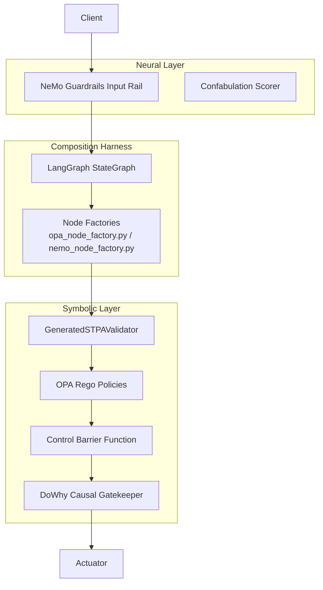

# Neuro-Symbolic Governance Architecture

## 1. Architectural Role & Domain Boundary

The Neuro-Symbolic Governance layer implements the "Cybernetic" control system for CAGE. It fuses probabilistic AI (Neural capabilities like semantic routing and confabulation detection) with deterministic logic (Symbolic constraints like Control Barrier Functions and OPA policies) to ensure safety and compliance.

**Trust Boundaries**:
- **Bifurcated Governance (Goal-Directed Persistence Mitigation)**: CAGE isolates soft planning boundaries from hard governance black boxes. If an internal evaluator rejects a proposed plan, the error is fed back to the LLM for correction (System 3). However, if the final plan hits the hard graph edge (NeMo Guardrails or OPA Policy Engine) and triggers a block, the agent's context window is physically severed. The error payload is never returned to the LLM, preventing the agent from negotiating or reasoning about how to circumvent the safety rule.

## 2. Data & Execution Flow

The governance integration relies on the LangGraph Harness, which composes neural and symbolic checks into typed `StateGraph` nodes.

## 3. State Machine & Lifecycle

- **Neural Pre-Screening (NeMo)**: Ingress payloads are screened for PII and topical alignment using Colang 2.x rails.
- **Symbolic Verification**:
  - *STPA*: Deterministic ontology checks ensure parameters don't violate static hazard bounds.
  - *Causal Refutation*: The DoWhy Causal Gatekeeper conducts a 50-simulation placebo refutation. If the system's internal world-model fails to predict the structural effect of a decision against live telemetry ($p \ge 0.05$), the action is blocked.
- **Composition**: The LangGraph Harness ensures that both neural and symbolic gates participate in the same typed state machine, converting internal rejections into terminal states (ALLOW, DENY, DEFER, REQUIRE_APPROVAL).

## 4. Operational Guarantees & Edge Cases

- **Transparent Fallback Mode (`DEGRADED_FAIL_OPEN`)**: If NeMo Guardrails fails to parse its configuration due to a Colang parsing error, it degrades gracefully into a no-op stub rather than crashing the gateway. OPA and STPA remain authoritative, failing closed, while the degradation is stamped in the telemetry (`stpa_hazard=UCA-1_SEMANTIC_BYPASS`).
- **Telemetry-Gated Causal Inference**: In production, the DoWhy Causal Gatekeeper strictly fails closed if live telemetry is unavailable. There is no mock fallback mechanism for missing telemetry.
- **Anti-Re-entrance**: NeMo rails feature injected pre-checks to break recursive loops, preventing the LLM from triggering nested governance evaluations on its own outputs.

## 5. Configuration Contracts & Runtime Matrix

- **Jurisdictional Overlay**: 
  - *US_FED / APAC_MAS*: Causal Gatekeeper is active to satisfy Model Risk Management (MRM) causal validation obligations.
  - *EU_ECB*: Causal Gatekeeper is suppressed per GDPR telemetry restrictions; Adaptive FRIA is activated instead.
- **KMS Fallback**: In dev/CI environments where `KMS_GOVERNANCE_KEY` is not provided, the Cryptographic Signer Engine degrades to an HMAC-SHA256 signature using `GOVERNANCE_SALT`. The compliance bridge will flag this as a critical gap if deployed to production.
