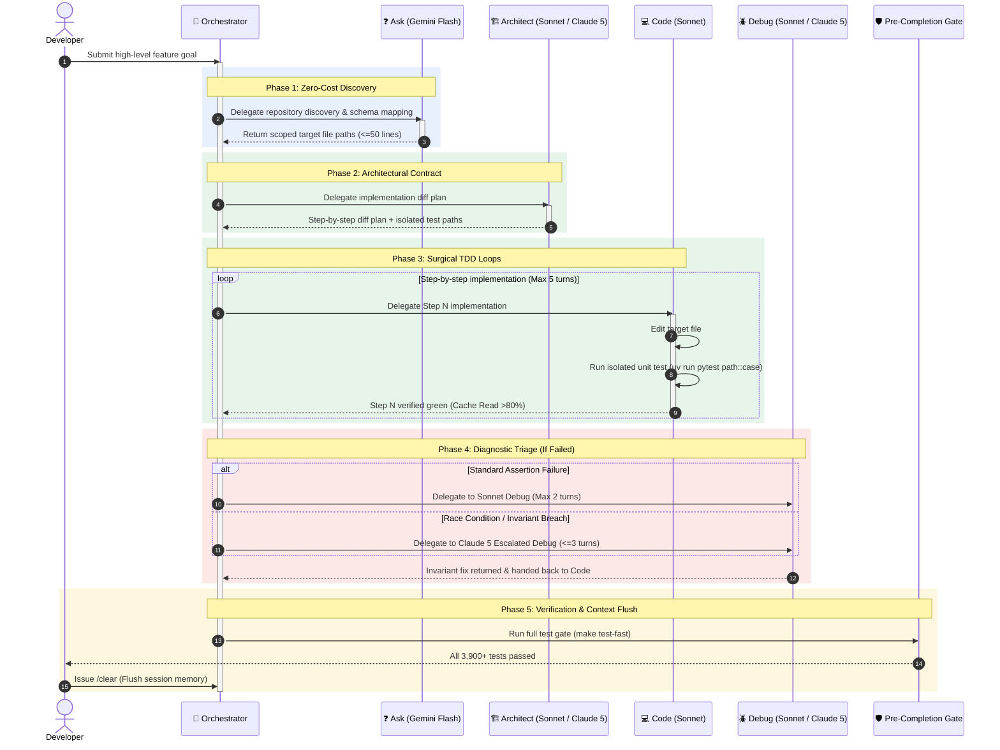

# Agent Cost Guardrails & Dual-Engine Workflow Guide

> **Operational Standard — Dual-Engine Governance, Model Tier Routing, and Cache Economics.**
> This guide defines the operational configuration, tool separation, and cost-control guardrails
> implemented to eliminate runaway frontier model billing, cache-write penalty traps, and 200k+
> token context escalation boundaries.

---

## Table of Contents

1. [Economic Root-Cause Analysis](#1-economic-root-cause-analysis)
2. [Step 1: Repository Governance & In-Repo Configuration](#step-1-repository-governance--in-repo-configuration)
3. [Step 2: Google Antigravity Setup (Zero-Cost Ambient Tier)](#step-2-google-antigravity-setup-zero-cost-ambient-tier)
4. [Step 3: Zoo Code / Roo Code Setup (Targeted Execution Tier)](#step-3-zoo-code--roo-code-setup-targeted-execution-tier)
5. [Step 4: Keyboard Shortcuts & Tool Separation](#step-4-keyboard-shortcuts--tool-separation)
6. [Step 5: Day-to-Day Cost-Governed Workflow Lifecycle](#step-5-day-to-day-cost-governed-workflow-lifecycle)
7. [Step 6: Billing Safeguards & Metrics Auditing](#step-6-billing-safeguards--metrics-auditing)
8. [Step 7: Engine Architecture Comparison: Dual-Engine vs. Unified Sidebar](#step-7-engine-architecture-comparison-dual-engine-vs-unified-sidebar)

---

## 1. Economic Root-Cause Analysis

Analysis of frontier AI coding agent billing indicates three primary drivers of runaway expense:

### 1.1 The Opus / Frontier Over-Utilization Trap
- **Empirical Billing Impact**: In our recent billing breakdown, Claude 5 (Opus 5) alone accounted for **over \$462 in 12 days**, driven by unconstrained context windows (200k–1M tokens) and cache-write penalties.
- **Frontier Pricing vs. Mid-Tier Pricing**: Claude 3.5/3.7 Opus costs \$15.00/M input tokens and \$75.00/M output tokens. Claude 3.7 Sonnet costs \$3.00/M input and \$15.00/M output (5x cheaper). Gemini 2.5 Flash costs \$0.075–\$0.15/M input (100x–200x cheaper).
- **Runaway Defect**: When an agent session defaults to Opus for general AST indexing, grep sweeps, boilerplate generation, or simple unit tests, massive context windows (100k–180k tokens) are repeatedly processed at frontier rates.
- **The Surgical Remedy**: Dropping Claude 5 completely compromises the quality of complex architectural design and tricky concurrency debugging. Instead, govern **when and how** it is invoked, treating it as an escalated, surgical consulting tool to keep its monthly share under **\$20–\$40/month**.

### 1.2 The Cache-Write Penalty Trap
- **Cache Read Discount**: Prompt caching offers a **90% price reduction** (\$0.30/M input tokens on Sonnet vs. \$3.00/M standard input).
- **Cache Write Surcharge**: Cache writes carry a **25% surcharge** (\$3.75/M input tokens on Sonnet).
- **Prefix Invalidation Defect**: Anthropic prompt caching relies on exact byte-for-byte prefix invariance. If dynamic timestamps (`YYYY-MM-DD HH:MM:SS`), randomized UUIDs, fluctuating git commit hashes, or changing file paths are inserted at the beginning of system prompts or headers, the entire cache is invalidated on every turn. The agent pays the 25% cache-write penalty on every turn instead of enjoying the 90% cache-read discount.
- **TTL Eviction**: The prompt cache has a 5-minute TTL. Pauses longer than 5 minutes between agent turns result in cache eviction, triggering another full cache write.
- **Remedy**: Prefix stability (zero dynamic headers in system prompts), compact turn times (< 5 minutes), and monitoring for an 80%+ Cache Read ratio.

### 1.3 The 200k+ Token Escalation Boundary
- **Empirical Billing Impact**: The billing audit revealed severe concentration in the **200,001 to 1,000,000 Token tier** (**\$165.45 in cache writes** and **\$152.07 in cache reads**).
- **Tier Escalation**: Model providers apply steep price escalations once context windows cross 200,000 tokens (often doubling the base per-million token rate).
- **Buffer Accumulation**: Large test execution outputs (e.g. running the entire enterprise test suite on every minor edit), unpruned diffs, and multiple open tabs push context beyond 200k tokens within 5–8 turns.
- **Remedy**: Strict sub-200k context ceiling, 1–2 open tabs maximum, two-phase testing lifecycle, and immediate context reset (`/clear`) upon task completion.

---

## Step 1: Repository Governance & In-Repo Configuration

Operational constraints are codified directly into the repository root:

1. **[`AGENTS.md`](../../AGENTS.md) Section 12**:
   - Codifies operational roles, tier enforcement, the 5-step tool cap, sub-200k ceiling, fail-fast rule, and cache invariance into the universal agent instructions ingested by Antigravity, Roo Code, Cline, Cursor, and Windsurf.
2. **[`.roomodes`](../../.roomodes)**:
   - Configures Roo Code / Zoo Code mode profiles (`code`, `architect`, `debug`, `ask`) directly in version control, ensuring all contributors inherit the strict Sonnet/Flash model routing and safety instructions.
3. **Two-Phase Testing Lifecycle**:
   - **Inner Loop (Active Turn)**: Target only the isolated test module:
     ```bash
     uv run pytest tests/unit/...::test_case -v
     ```
     This keeps terminal stdout buffers small (< 2k tokens) and avoids cache eviction.
   - **Gate Phase (Pre-Completion)**: Run the canonical fast suite once before handoff or PR creation:
     ```bash
     make test-fast
     ```

---

## Step 2: Google Antigravity Setup (Zero-Cost Ambient Tier)

Google Antigravity serves as the zero-cost ambient discovery and drafting tier.

### 2.1 Installation & Authentication
1. Install the **Google Antigravity** extension in VS Code.
2. Sign in with your Google account to enable standard quota tiers.

### 2.2 Model Backend Configuration
1. Open Antigravity Settings (`Cmd+,` or `Ctrl+,` $\rightarrow$ search `Antigravity`).
2. Set the default chat and agent model backend to **Gemini Flash** (e.g., `gemini-2.5-flash` or `gemini-3-flash`).
3. Enable **Inline Autocomplete / Ghost Text** in Antigravity settings to provide free, sub-second typing suggestions.

### 2.3 Subagent Workspace Isolation
To prevent concurrent file edit collisions and file lock contention:
- Configure Antigravity subagents to execute in an isolated Git Worktree or dedicated branch (`Workspace: branch` or `Workspace: share`).
- When executing concurrent research tasks, invoke the `research` subagent to isolate wide repository reads from the primary conversation context.

---

## Step 3: Zoo Code / Roo Code Setup (Targeted Execution Tier)

Zoo Code / Roo Code acts as the precision implementation engine.

### 3.1 Authentication & Provider Configuration

#### Primary: Google Cloud Vertex AI (Recommended)
Prioritizing Vertex AI consolidates billing within your Google Cloud project, maintains centralized budget alerts, and logs unified IAM audit trails:
1. Authenticate locally via Application Default Credentials (ADC):
   ```bash
   gcloud auth application-default login
   ```
2. In Zoo Code / Roo Code Settings $\rightarrow$ **API Provider**, select **Google Vertex AI**.
3. Set **Project ID** to your active GCP project (e.g., `laah-cybernetics`).
4. Set **Location** to your target region (e.g., `us-central1` or `us-east5`).

#### Fallback: Direct Anthropic API
If direct Anthropic routing is required:
1. In Zoo Code / Roo Code Settings $\rightarrow$ **API Provider**, select **Anthropic**.
2. Supply `ANTHROPIC_API_KEY` (stored securely in secret storage, never committed).

### 3.2 Mode-to-Model Assignment Matrix

The committed [`.roomodes`](../../.roomodes) file configures dedicated mode profiles separating daily Sonnet execution from surgical Claude 5 escalation:

| Mode | Assigned Model | Operational Scope & Guardrails |
|---|---|---|
| **Orchestrator (Governor)** | `claude-3-7-sonnet` | Master task coordinator. Decomposes complex user requests and programmatically delegates sub-tasks across specialized modes (`ask`, `architect`, `code`, `debug`, `escalated-*`). Never executes edits or bash directly. |
| **Code** | `claude-3-7-sonnet` | **Mandatory daily driver.** Multi-file diffs, TDD loops, targeted refactoring. Max 5 tool calls per turn. |
| **Architect (Default)** | `claude-3-7-sonnet` | API route definitions, database migrations, component scaffolding, single-service interfaces. Delivers 95% of designs at ~1/5th cost. |
| **Escalated Architect** | `claude-opus-5` / `claude-fable-5.1` | **Surgical escalation only.** Multi-system boundaries, safety-critical state machines, distributed consensus, formal verification proofs. Max 1–3 turns. |
| **Debug (Default)** | `claude-3-7-sonnet` | Syntax errors, failed assertions, standard unit test failures, missing imports, single-function logic. Fail-fast after 2 turns. |
| **Escalated Debug** | `claude-opus-5` / `claude-fable-5.1` | **Surgical deep diagnosis only.** Elusive race conditions, distributed tracing anomalies, memory leaks, subtle deadlocks, or after Sonnet fails 2 turns. Max 1–3 turns. |
| **Ask** | `gemini-2.5-flash` / `claude-haiku` | General codebase Q&A. **Never** point Ask mode to Opus or Fable. |

### 3.3 The Three Affordability Rules for Claude 5 (Opus 5 / Fable 5.1)

To retain Claude 5's frontier reasoning while capping its billing share at **\$20–\$40/month**, every invocation of `escalated-architect` or `escalated-debug` must satisfy:

1. **Pre-Filter Context in the Free Tier (Antigravity + Gemini Flash)**:
   - Never let Claude 5 crawl directories or run wide greps to locate relevant files.
   - Use Gemini Flash in Google Antigravity to index the repo, locate the target modules, and produce a concise $\le$50-line briefing.
   - Paste only that briefing and the 1–2 target source files into Claude 5.
2. **Keep the Context Strictly Under 200k Tokens**:
   - The billing audit revealed severe cost escalation in the **200,001–1,000,000 token tier** (\$165.45 in cache writes and \$152.07 in cache reads).
   - Keeping sessions focused and below 200k tokens keeps prompt caching in the lower, non-penalized pricing bracket.
3. **Execute 1–3 Turns, Then Switch Back to Sonnet**:
   - Treat Claude 5 like a high-end external consulting architect: let it generate the spec or identify the root cause in Architect or Debug mode within 1–3 turns.
   - Once the design plan or bug diagnosis is written, switch Zoo Code back to **Code Mode (Sonnet)** to write the actual code and run tests.

### 3.4 Context & Cache Preservation Settings

Inside Roo Code / Zoo Code Extension Settings:
- **Prompt Caching**: Toggle **ON** (mandatory).
- **Max Consecutive Auto-Turns**: Set to **6–8** in the UI (enforcing the 5-step cap in `AGENTS.md`).
- **Open Tabs Context Limit**: Set to **1 or 2 tabs maximum**. Excess open tabs inject massive file contents into turn contexts.
- **Ghost Text / Inline Autocomplete**: Toggle **OFF** inside Zoo Code / Roo Code. This prevents extension UI collisions with Google Antigravity's free inline completions.

---

## Step 4: Keyboard Shortcuts & Tool Separation

To prevent accidental invocation of paid execution agents for simple questions, map distinct keyboard shortcuts in VS Code (`keybindings.json`):

| Action | Recommended Keybinding (macOS) | Recommended Keybinding (Linux/Win) | Target Engine & Purpose |
|---|---|---|---|
| **Antigravity Focus** | `Cmd+Alt+A` | `Ctrl+Alt+A` | Free repo discovery, AST lookup, general Q&A |
| **Antigravity Inline Explain / Docstring** | `Cmd+Alt+K` | `Ctrl+Alt+K` | Free docstring generation & inline code explanation |
| **Zoo Code / Roo Code Terminal Agent** | `Cmd+Shift+Z` | `Ctrl+Shift+Z` | Budgeted code execution, TDD edits, terminal commands |

---

## Step 5: Day-to-Day Cost-Governed Workflow Lifecycle

> For the visual lifecycle and mode architecture charts with color-coded badges, see [`UNIFIED_AGENTIC_ENGINEERING.md`](UNIFIED_AGENTIC_ENGINEERING.md).



---

### 5.1 Architectural Discovery & Scoping ($0 Cost Tier)

*Tool: Google Antigravity (`Cmd+Alt+A`) | Model: Gemini Flash*

Never start architectural exploration or file discovery in paid reasoning models. Use the 1M–2M+ token native context of Gemini Flash to index and map the codebase at zero marginal cost.

1. **Broad Discovery Query:**
   ```text
   Map all modules that interact with the agent governance state machine and STERA admissibility engine. 
   List all incoming/outgoing data contracts, active middleware, and identify any breaking changes 
   if we modify the transition validation hooks.
   ```

2. **Synthesize the Scoped Contract:**
   - Allow Gemini Flash to parse the directory tree and identify the exact files involved.
   - Synthesize the findings into a concise, focused $\le$50-line briefing.
   - Copy only the identified file paths, type definitions, and relevant API signatures.

---

### 5.2 System Designing & Contract Definition

*Tool: Zoo Code / Roo Code (`Cmd+Shift+Z`) | Mode: `architect` (Sonnet) or `escalated-architect` (Claude 5 / Opus)*

Use Sonnet for standard feature contracts (API route definitions, database migrations, component scaffolding). Escalate to Claude 5 (`escalated-architect`) **only** if designing safety-critical state machines, distributed consensus, or formal verification proofs.

1. **Initiate the Plan:**
   - Open Zoo Code in **Architect Mode** (`architect`). If the task involves multi-system safety boundaries, switch to **Escalated Architect Mode** (`escalated-architect`).
   - Paste the targeted contract briefing from Step 5.1:
     ```text
     Review this extracted interface contract for the state machine hooks:
     <paste 50-line briefing>
     
     Draft a multi-file implementation plan for adding runtime verification.
     Specify exact file diff targets and edge-case failure modes. Do not write full code.
     ```

2. **Review Plan Invariants:**
   - Ensure the generated plan specifies discrete, decoupled phases and references targeted unit test paths (`uv run pytest tests/...::test_case -v`).
   - If in `escalated-architect` mode, limit the turn interaction to 1–3 turns, finalize the spec, and prepare to hand off to Sonnet.

---

### 5.3 Coding & Continuous Inner-Loop Testing

*Tool: Zoo Code / Roo Code (`Cmd+Shift+Z`) | Mode: `code` | Model: Claude 3.7 Sonnet*

Execute the implementation phase using Claude 3.7 Sonnet as the mandatory daily driver, strictly adhering to the **Two-Phase Testing Strategy**.

1. **Invoke Implementation:**
   - Switch Zoo Code to **Code Mode** (`code`).
   - Instruct the agent with a scoped, static prompt prefix:
     ```text
     Execute Step 1 of the implementation plan on src/gateway/governance/safety/cbf_engine.py. 
     Adhere strictly to AGENTS.md: do not scan unrelated folders or inject dynamic timestamps. 
     Verify using only: uv run pytest tests/test_cbf_formal_properties.py::test_cbf_strict_invariance -v
     ```

2. **Inner-Loop Test Execution (Turn-by-Turn):**
   - The agent modifies the designated target file and runs **only the isolated unit test case**.
   - Keeping the terminal output buffer to $\sim$10 lines prevents context bloat, preserving the sub-200k token boundary.
   - Because instructions and headers remain static, every turn hits the **prompt cache at a 90% discount**.

3. **Turn Cap Enforcement:**
   - The `.roomodes` and `AGENTS.md` guardrail halts the agent after **5 consecutive tool actions**, requiring explicit human review before continuing.

---

### 5.4 Interactive vs. Deep Safety Debugging

#### A. Interactive Debugging (Standard Bugs)
*Tool: Zoo Code | Mode: `debug` | Model: Claude 3.7 Sonnet*

- **Trigger**: Lint failures, assertion errors, missing mock fixtures, missing imports, or syntax errors.
- **Process**:
  - Feed the specific failure output directly to Sonnet in `debug` mode.
  - **Fail-Fast Rule**: If Sonnet fails to fix the issue in **2 turns**, halt the session immediately. Do not allow speculative trial-and-error patching.

#### B. Deep Safety & Root-Cause Analysis (Escalated Tier)
*Tool: Zoo Code | Mode: `escalated-debug` | Model: Claude 5 (Opus 5 / Fable 5.1)*

- **Trigger**: Subtle race conditions, distributed tracing anomalies, state-space violations, Control Barrier Function (CBF) failures, memory leaks, or complex deadlocks (or after Sonnet fails 2 turns).
- **Surgical Context Preparation**:
  1. Open Antigravity (`Cmd+Alt+A`) and isolate the exact failure window:
     ```text
     Extract the minimal execution path from this trace log leading to the deadlocked mutex or CBF violation.
     ```
  2. Switch Zoo Code to **Escalated Debug Mode** (`escalated-debug`).
  3. Provide *only* the minimal trace, the root-cause hypothesis from Sonnet's failed turn, and the 1–2 target source files:
     ```text
     Analyze this concurrent state-transition failure. 
     Perform a formal root-cause analysis on the synchronization barrier.
     Propose the corrected invariant before emitting any diffs.
     ```
  4. Once the invariant is identified and the patch strategy proposed within 1–3 turns, **switch back to Code Mode (Sonnet) immediately** to write the code diffs and run tests. Never burn Claude 5 tokens on test re-runs.

---

### 5.5 Full-Suite Gate, Documentation, and Context Reset

1. **The Pre-Completion Gate (Phase B Testing):**
   - Run the full suite locally once implementation passes all inner-loop unit tests:
     ```bash
     make test-fast
     ```
   - Running the broad suite once at the conclusion ensures full-suite verification without compounding context tokens across iterative turns.

2. **Zero-Cost Polish & Documentation:**
   - In your editor, highlight the new implementation functions or classes.
   - Trigger Antigravity (`Cmd+Alt+K`):
     ```text
     Generate complete, production-grade docstrings and typing annotations for these functions.
     ```
   - Antigravity / Gemini Flash generates all documentation artifacts at zero token expense.

3. **Mandatory Context Reset:**
   - In Zoo Code / Roo Code, issue:
     ```text
     /clear
     ```
   - Wiping session memory ensures stale diffs, terminal traces, and tool outputs are not carried over, permanently keeping future tasks below the 200k-token pricing escalation threshold.

---

## Step 6: Billing Safeguards & Metrics Auditing

### 6.1 GCP Cloud Console Budget Alerts
Configure organizational cost controls in Google Cloud Console:
1. Navigate to **Billing** $\rightarrow$ **Budgets & alerts**.
2. Create a budget scoped to your active project (e.g., `laah-cybernetics`) or billing account.
3. Configure alert thresholds at:
   - **\$500.00** (50% target ceiling — warning notification)
   - **\$1,000.00** (90% target ceiling — urgent operational review)
   - **\$1,500.00** (100% hard ceiling — stop paid agent execution)
4. Link alert channels to your primary developer email and Slack/notification webhook.

### 6.2 Session Token Metric Auditing
Inspect session metrics at the conclusion of each Zoo Code / Roo Code task:
- **Cache Read Ratio**: Should account for **80%+** of total input volume.
- **Cache Write Ratio**: Should remain **under 20%**.
- **Context Size**: Must remain **below 200,000 tokens** at all times.
- If Cache Write exceeds 25% or Cache Read drops below 70%, verify that system prompt prefixes do not contain dynamic timestamps, git hashes, or randomized session IDs.

---

## 7. Engine Architecture Comparison: Dual-Engine vs. Unified Sidebar

When standardizing your development environment, choose the operational model that best balances cognitive friction against monthly token budgets.

### 7.1 Operational Complexity & Ergonomics

* **Unified Zoo Code (All Models in One Panel — Recommended):**
  - **Zero Context Switching**: Eliminates the "two-inbox problem." You don't have to decide which chat window to open, manage conflicting hotkeys (`Cmd+Alt+A` vs. `Cmd+Shift+Z`), or copy-paste 50-line summaries between extensions.
  - **Unified Tooling & Governance**: Zoo Code executes terminal commands, edits local files, and adheres directly to your repo’s `AGENTS.md` and `.roomodes`. Antigravity’s chat operates in its own separate runtime, creating a bifurcation of tool policies and logs.
  - **Unified Billing & Telemetry**: All model usage (Gemini Flash, Sonnet, Claude 5) flows through a single Google Cloud project invoice via Vertex AI ADC (`gcloud auth application-default login`), making budget alerts and cost tracking centralized.

* **Separating Conversational Gemini into Antigravity Chat:**
  - **High Mental Drag**: Using Antigravity for conversational discovery and Zoo Code for execution introduces continuous friction. A developer’s time lost to clipboard handoffs and context juggling quickly negates small token savings.
  - **Extension Footprint**: Running two active agent runtimes in VS Code increases memory usage, file-watcher overhead, and the risk of concurrent edit conflicts.

---

### 7.2 Quota Mechanics vs. Pay-As-You-Go Metering

* **The Antigravity Pro Quota Trap (\$20/mo):**
  - Antigravity measures consumption on **"work done"** rather than raw queries. Deep repository indexing or complex multi-file searches drain the 1x baseline quota quickly.
  - If you hit the ceiling during an active work sprint, you face a 5-hour lockout (or multi-day lockouts if weekly thresholds are breached), unless you purchase separate AI Credits.

* **Zoo Code via Vertex AI Pay-As-You-Go:**
  - Gemini Flash on Vertex AI is inexpensive: **~\$0.10 per 1M input tokens** (\$0.0001 per 1,000 tokens).
  - Ingesting 500k tokens of codebase AST via Zoo Code's `/ask` mode costs roughly **\$0.05**.
  - Running 20–30 deep repo scans a day on Vertex Gemini Flash costs **less than \$2.00 to \$3.00 for the entire month**—far below the \$20/mo Pro subscription—with zero risk of rolling lockouts or 5-hour quota freezes.

---

### 7.3 The Technical Divide: Turn-Based Agent vs. Keystroke Daemon

* **Turn-Based vs. Keystroke Daemon**: Zoo Code is an interactive, turn-based agent. It responds to prompts with tool executions and diffs; it **cannot** provide sub-second, character-by-character ghost text autocomplete as you type inside a function body.
* **Where Antigravity Wins**: Google Antigravity provides **unlimited, unmetered inline tab completions (ghost text)** via low-latency Fill-In-The-Middle (FIM) streaming models directly in the editor buffer.

---

### 7.4 Decision Matrix

| Evaluation Criteria | Option B: Unified Zoo Code (All Chat/Agent) | Option A: Split Conversational (Antigravity Chat + Zoo Code) | Option C: Pure Zoo Code (Sonnet Only) |
|---|---|---|---|
| **Expected Monthly Spend** | **\$60 – \$120 / mo** | **\$30 – \$80 / mo** | **\$80 – \$220+ / mo** |
| **Cognitive Friction** | **Minimal** (1 chat panel, 1 shortcut, unified context) | **High** (2 chat panels, manual copy-paste handoffs) | **Minimal** (1 chat panel) |
| **Repo Discovery Cost** | **Negligible** (~$2–$5/mo on Vertex Gemini Flash) | Included in $20/mo Pro (or Free quota) | Moderate (~$0.10–$0.25/query on Sonnet) |
| **Rate Limit Resilience** | **Infinite** (Direct cloud quota, never locks out) | **Vulnerable** (5-hour rolling windows & weekly ceilings) | **Infinite** (Direct cloud quota) |
| **Governance Enforcement** | **Strict** (`AGENTS.md` and `.roomodes` apply to all modes) | **Fragmented** (Antigravity ignores `.roomodes`) | **Strict** (`AGENTS.md` and `.roomodes`) |
| **Inline Ghost Autocomplete** | **Yes** (Passive background Antigravity daemon) | **Yes** (Antigravity active in editor) | **None** (Turn-based agent interactions only) |

---

### 7.5 Canonical Setup (Unified Sidebar + Passive Keystroke Daemon)

**Do not split conversational tasks between two tools.** Route all active reasoning, exploration, and coding through **Zoo Code**, and restrict Antigravity (if kept) to a headless completion role:

1. **Conduct 100% of Chat & Agent Interactions in Zoo Code:**
   - Switch to `/ask` (Gemini Flash via Vertex AI) for all repo sweeps, interface mapping, and syntax questions at fractions of a cent per query.
   - Switch to `/code` (Claude Sonnet) for implementation and TDD.
   - Switch to `/escalated-architect` or `/escalated-debug` (Claude 5) only when safety invariants or complex race conditions require it.

2. **Use Antigravity Solely for Ambient Autocomplete (Free Tier or Pro):**
   - Keep the Antigravity extension installed for **unmetered inline tab completions** while you write code.
   - Keep the Antigravity chat panel permanently closed. This eliminates the cognitive complexity of deciding where to ask questions and ensures all agent actions are strictly governed by your repository’s `.roomodes` and `AGENTS.md`.


