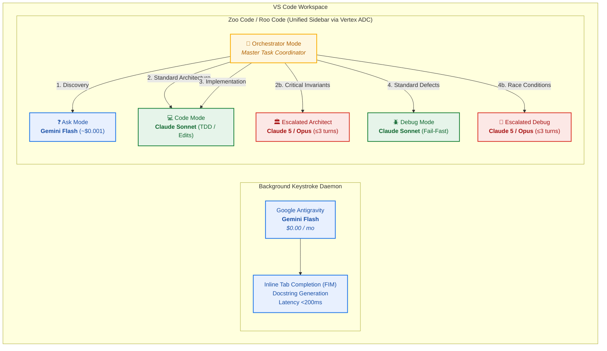
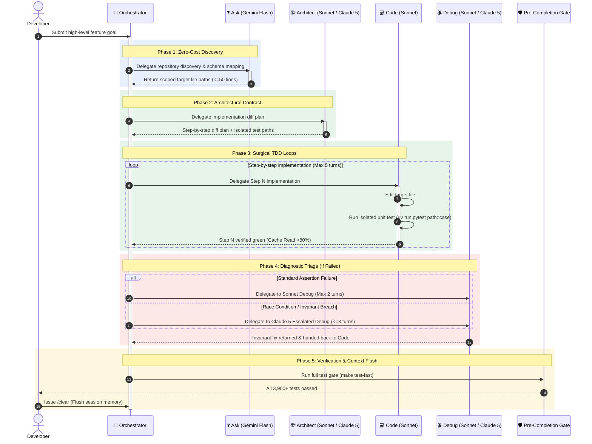

# Unified Agentic Engineering: Complete Operational Guide

`TIER: AMBIENT FREE ($0)` `TIER: DAILY WORKHORSE (SONNET)` `TIER: SURGICAL ESCALATION (CLAUDE 5)`

---

### 1. Architectural Model & Engine Roles



---

### 2. In-Repo Configuration

#### Mode Definitions (`.roomodes`)

Committed to repository root to enforce programmatic search gates and mode routing:

```json
{
  "customModes": [
    {
      "slug": "orchestrator",
      "name": "🎯 Orchestrator (Governor)",
      "roleDefinition": "You are a master task coordinator and cost-governed dispatcher. You break complex user requests into discrete, phased sub-tasks and delegate execution to the appropriate specialized mode.",
      "groups": ["read"],
      "customInstructions": "COST-GOVERNED DISPATCHING PROTOCOL:\nWhen breaking down a task, you must strictly route sub-tasks to the correct specialized mode:\n\n1. DISCOVERY & MAPPING -> Delegate to `ask` (Gemini Flash via Vertex AI):\n   - Any task involving 'where is X', finding usages, inspecting schemas, or mapping call graphs.\n\n2. ARCHITECTURE & SPECIFICATION -> Delegate to `architect` (Sonnet) or `escalated-architect` (Claude 5):\n   - Use `architect` (Sonnet) for standard interface contracts and step-by-step implementation plans.\n   - Escalate to `escalated-architect` (Claude 5) ONLY for safety-critical state machines, formal invariant proofs, or high-risk cross-service contracts (briefing <= 50 lines).\n\n3. IMPLEMENTATION & TDD -> Delegate to `code` (Claude Sonnet):\n   - All concrete multi-file code diffs and isolated unit test executions (`uv run pytest path::test_case`).\n   - Enforce 1 task step per delegation; never assign open-ended sweeps.\n\n4. DEBUGGING & ROOT CAUSE -> Delegate to `debug` (Sonnet) or `escalated-debug` (Claude 5):\n   - Use `debug` (Sonnet) for syntax issues, assertion failures, and standard unit-test breaks (max 2 turns).\n   - Escalate to `escalated-debug` (Claude 5) ONLY for subtle race conditions, deadlocks, or Control Barrier Function violations.\n\nGOVERNANCE GATES:\n- Never dispatch code edits or bash commands directly from Orchestrator mode.\n- Keep delegations scoped to single files or isolated tests to keep active contexts sub-200k tokens."
    },
    {
      "slug": "code",
      "name": "💻 Code (Sonnet)",
      "roleDefinition": "You are a surgical implementation engine governed by strict cost boundaries. You do not perform repository mapping, broad codebase exploration, or unstructured search.",
      "groups": ["read", "edit", "command"],
      "customInstructions": "COST & SEARCH GATE:\n1. Before calling tools, check if the prompt asks exploratory questions (e.g., 'where is X defined', 'find usages of Y', 'how does Z work') without specifying target files.\n2. If the prompt requires searching more than 2 directories or lacks specific target paths, DO NOT call search_files, list_dir, or grep. Output this warning:\n   '⚠️ Cost Guardrail Alert: This appears to be an exploratory search. Switch to Ask Mode (Gemini Flash) inside Zoo Code to run repo discovery at negligible cost. Once target paths are identified, provide them here to proceed.'\n3. Only read files explicitly named in the prompt or directly imported by target modules.\n4. Never exceed 5 tool turns without human confirmation.\n5. Keep isolated test runs targeted (e.g., `uv run pytest path/to/test.py::test_name`)."
    },
    {
      "slug": "debug",
      "name": "🪲 Debug (Sonnet Standard)",
      "roleDefinition": "You are a targeted debugging specialist. You diagnose and fix root causes within isolated modules.",
      "groups": ["read", "edit", "command"],
      "customInstructions": "COST & SEARCH GATE:\n1. If a reproducing test or stack trace is not provided, prompt the user to provide it before searching files.\n2. Do NOT run project-wide greps or full directory listings. Only inspect files visible in the stack trace.\n3. Stop after 2 failed fix attempts and output a root-cause hypothesis instead of trying speculative variations."
    },
    {
      "slug": "architect",
      "name": "🏗️ Architect (Sonnet Standard)",
      "roleDefinition": "You design architectural specifications, system contracts, and multi-file implementation plans.",
      "groups": ["read"],
      "customInstructions": "COST & SEARCH GATE:\n1. Only inspect high-level interfaces, schemas, and designated modules.\n2. If a complete repository audit or broad search is required, instruct the user to run the discovery query in Ask Mode (Gemini Flash) first."
    },
    {
      "slug": "escalated-architect",
      "name": "🏛️ Escalated Architect (Claude 5 / Opus)",
      "roleDefinition": "You are an elite systems architect reserved for safety-critical state machines, formal verification boundaries, and high-stakes cross-service contracts.",
      "groups": ["read"],
      "customInstructions": "STRICT USAGE GATE:\n1. Verify that the task input contains a pre-filtered context briefing (<=50 lines).\n2. Refuse broad repository sweeps. Design invariants directly from the provided specification.\n3. Keep total turn count <=3."
    },
    {
      "slug": "escalated-debug",
      "name": "🔬 Escalated Debug (Claude 5 / Opus)",
      "roleDefinition": "You are an advanced diagnostic engineer reserved strictly for complex race conditions, deadlocks, and Control Barrier Function failures.",
      "groups": ["read", "command"],
      "customInstructions": "STRICT USAGE GATE:\n1. Only operate on a minimal trace or isolated reproduction test provided in the prompt.\n2. Diagnose synchronization and formal invariant bugs. Do not emit massive diffs—return the verified invariant and hand off to Code mode."
    },
    {
      "slug": "ask",
      "name": "❓ Ask (Gemini Flash / Vertex AI)",
      "roleDefinition": "You are a repository discovery and syntax exploration specialist powered by Gemini Flash via Vertex AI.",
      "groups": ["read"],
      "customInstructions": "Perform high-speed, cost-effective repository sweeps, interface mapping, docstring drafting, and code explanations. You do not execute terminal shell commands or write code diffs."
    }
  ]
}
```

---

#### Cost Guardrails Section (`AGENTS.md`)

Codified in `AGENTS.md` (kept strictly under the 24KB cap):

```markdown
## 12. Agent Governance & Cost Guardrails

### 12.1 Operational Roles & Tier Enforcement
- High-level repository scanning, dependency mapping, and documentation are handled by `ask` mode (Gemini Flash via Vertex AI) or ambient autocomplete.
- Zoo Code acts strictly as an execution engine. Vague, open-ended search queries must be rejected with a redirection to `ask` mode.
- Daily implementation and standard debugging run on Claude Sonnet. Claude 5 (Opus 5 / Fable 5.1) is reserved strictly for `escalated-architect` and `escalated-debug`.

### 12.2 Hard Anti-Loop & Cost Rules
- **5-Step Execution Cap:** Agents must pause and request human verification after 5 consecutive tool actions.
- **Context Ceiling (Sub-200k):** Sessions must remain strictly under 200,000 tokens. Never load raw build outputs or multiple unpruned source directories into context.
- **Fail-Fast Policy:** If a test fails twice with a related error, STOP immediately. Produce a root-cause hypothesis instead of speculative trial-and-error edits.
- **Two-Phase Testing:**
  - *Inner Loop (During turns):* Run only targeted unit tests (`uv run pytest tests/unit/...::test_case -v`) to keep shell logs under ~10 lines.
  - *Pre-Completion Gate (Before task close):* Run `make test-fast` once across the full suite.

### 12.3 Cache Invariance & Reset Standards
- Do NOT generate or inject dynamic timestamps, randomized UUIDs, or changing absolute paths into prompts, headers, or state variables. Static prefixes guarantee 90% prompt cache discounts.
- Run `/clear` immediately upon task completion to prevent historical diffs from inflating the next task into higher pricing tiers.
```

---

### 3. Editor Shortcuts (`keybindings.json`)

Configure non-conflicting keybindings for low friction:

```json
[
  {
    "key": "cmd+shift+z",
    "command": "claude-dev.focusSidebar"
  },
  {
    "key": "cmd+shift+enter",
    "command": "claude-dev.openInNewTab"
  },
  {
    "key": "cmd+alt+k",
    "command": "antigravity.generateDocstring",
    "when": "editorTextFocus"
  }
]
```

---

### 4. Step-by-Step Execution Lifecycle with Orchestrator



---

### 5. Automated Verification Commands

Run these terminal checks to confirm size limits, STPA freshness, and boundary integrity before submitting pull requests:

```bash
# 1. Enforce AGENTS.md stays strictly under the 24KB limit
uv run python scripts/check_agents_size.py

# 2. Verify STPA freshness and import boundaries
uv run python scripts/check_stpa_freshness.py
uv run python scripts/check_import_boundaries.py --verbose

# 3. Execute Phase B regression test gate
make test-fast
```
