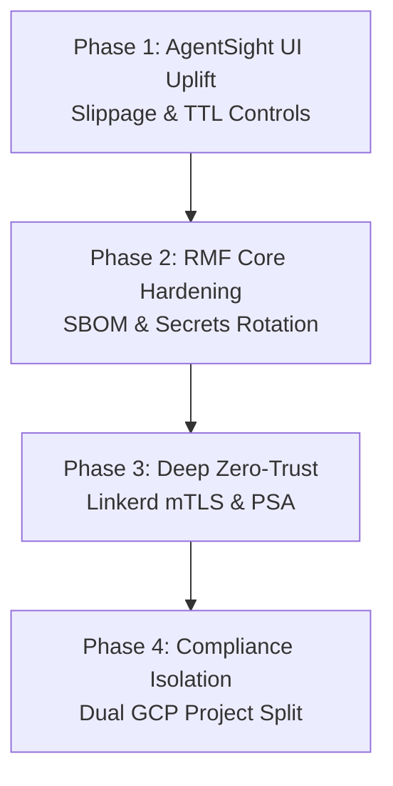

# CAGE v2.0 & NIST RMF Step 7 Security Roadmap

| Field | Value |
|---|---|
| **Document Series** | CAGE Architecture Series |
| **Version** | v0.1.0-Roadmap |
| **Classification** | INTERNAL / FOUO |
| **Status** | TAGGED — v0.1.0 Git tag applied and merged to main; stability not declared (as of 2026-07-01) |

---

## Executive Summary

With the core **Human-in-the-Loop (HITL) TOCTOU remediation** completely secured, unit-tested (41/41 passing), and technical reports synchronized, the CAGE v2.0 architecture must proceed to integrate its user-facing surfaces. 

To bridge the gap between deterministic backend enforcement and human-centric operations, **Phase 1 focuses immediately on the AgentSight UI Uplift**. This ensures human reviewers can dynamically adjust slippage bounds (`max_slippage_pct`) and monitor the Time-To-Live (TTL) countdown directly in the web dashboard, avoiding operational frustration.

Subsequent phases address core security hardening and NIST RMF continuous monitoring controls to maintain CAGE's fail-closed, highly resilient posture.

---

## v2.0 Phase Progression

### **Phase 1: AgentSight UI Uplift** ✅ COMPLETED (v0.1.0-rc.1)
**Goal:** Expose the bounded execution envelopes to compliance operators and human reviewers to complete the HITL closed loop.

*   **Reviewer Input Panel**: ✅ COMPLETED — `KernelDashboard.tsx` displays an interactive, adjustable control allowing the reviewer to adjust `max_slippage_pct` (defaulting to 2.0%) before clicking "Approve".
*   **Live Price Drift Indicator**: ✅ COMPLETED — Computed price drift delta ($\Delta P = |P_{\text{fresh}} - P_{\text{stale}}| / P_{\text{stale}}$) displayed in real time next to transaction details.
*   **TTL Countdown Visualizer**: ✅ COMPLETED — Visual countdown timer for `hitl_expires_at`; automatically greys out approval action on expiry and prompts operator to request fresh trade evaluation.
*   **Audit Evidence Display**: ✅ COMPLETED — `rehydration_result` (with $P_{\text{stale}}$, $P_{\text{fresh}}$, and `drift_pct`) rendered in transaction history panel.
*   **eBPF Kernel Observability**: ✅ COMPLETED — AgentSight eBPF DaemonSet deployed (`deployment/k8s/agentsight-daemon.yaml`); remote exporter active (`exporter.type: "remote"`).

---

### **Phase 2: RMF Core Hardening** ✅ COMPLETED (v0.1.0, 2026-06-08)
**Goal:** Address immediate security debt and software supply chain tracking.

*   **HMAC Routing Seal Hardening**: ✅ COMPLETED — `routing_seal.py` now fails fast at import time if `GOVERNANCE_SALT` is absent; hardcoded `"REDACTED_SALT"` fallback removed (BLOCKER-02). `CAGE_SEAL_ENFORCEMENT=log` bypass guard added to `hybrid_server.py` (BLOCKER-03). Seal enforcement verified end-to-end (unsigned → 403, signed → 200).
*   **Software Bill of Materials (SBOM)**: ✅ COMPLETED (partial) — `pip-audit`, Trivy, and Grype active in `.github/workflows/security-scan.yml` (POAM-010 closed). SBOM CronJob (`deployment/k8s/sbom-cronjob.yaml`) deployed. Full per-build SBOM CI integration deferred to post-v0.1.0 (POAM-006 open, target 2026-05-01).
*   **Immutable Image Pins**: 🟡 In Progress — `openpolicyagent/opa:latest-static` still uses mutable tag (LOW-14). Pinning to digest deferred to post-v0.1.0 sprint.
*   **Jira/GitHub Issues Compliance Loop**: 🟡 Deferred — `notifier.py` auto-issue creation for `GOVERNANCE_VIOLATION` events deferred to post-v0.1.0 roadmap.

---

### **Phase 3: Zero-Trust Cluster Architecture (Weeks 6–16)**
**Goal:** Transition cluster networks and runtime privileges to a strict default-deny, zero-trust state.

*   **Pod Security Admission (PSA)**: Apply the Kubernetes `pod-security.kubernetes.io/enforce: restricted` label to the `governance-stack` namespace, auditing and enforcing non-root container lifecycles.
*   **Linkerd mTLS Lock-Down**: ✅ COMPLETED (2026-05-17, FIND-011 resolved) Finalize Linkerd `MeshTLSAuthentication` policies across the cluster to guarantee SPIFFE-identified, encrypted channels for all gateway-to-agent and gateway-to-policy-engine communications.
*   **Cilium Egress Restricting**: ✅ COMPLETED (2026-05-17, FIND-011 resolved) Enforce Cilium L7 egress controls to block unauthorized external API calls, limiting traffic solely to approved market providers (e.g., yfinance) and secure telemetry endpoints.
*   **Network Policy Hardening**: ✅ COMPLETED (2026-05-17, FIND-011 resolved) Default-deny Kubernetes NetworkPolicy and Cilium CiliumNetworkPolicy applied across the `governance-stack` namespace.
*   **HA OTel Collection**: ✅ DEPRECATED (2026-05-31) The standalone OpenTelemetry Collector has been deprecated and decommissioned in favor of Langfuse's built-in, native OTLP ingestion endpoint, simplifying the pipeline and ensuring direct trace delivery.

---

### **Phase 4: Compliance Telemetry Isolation (Weeks 16–52)**
**Goal:** Isolate the tamper-evident audit trail from execution workloads.

*   **Dual GCP Project Separation**: Formally split CAGE into two projects:
    1.  `cage-prod`: Dedicated solely to execution workloads (agent graph, inference gateway, vLLM nodes).
    2.  `cage-compliance`: An isolated project containing only the Langfuse compliance databases, GCS audit buckets, and the compliance-bridge server.
*   **VPC Private Service Connect**: Establish private, VPC-peered links between the execution and compliance networks to allow secure aggregation without exposing policy servers to public routing.
*   **KMS CMEK Key Rotation**: Secure all stored secrets using GCP Cloud KMS Customer-Managed Encryption Keys with 90-day automatic HSM rotation.

---

### **v0.1.0 Release — Completed Items** ⚠️ TAGGED / STABILITY NOT DECLARED (as of 2026-07-01)

The following capabilities were delivered and verified as part of the CAGE v0.1.0 tagged commit. The v0.1.0 Git tag has been applied and `rc-v0.1.0` merged to `main`, but v0.1.0 has **not** been declared a stable release:

*   **Token Quota Proxy** (`token_quota_proxy.py`): ✅ COMPLETED — Per-session step and token budget enforcement with Redis-backed counters; fail-CLOSED on Redis unavailability.
*   **PII Sanitizer** (`pii_sanitizer.py`): ✅ COMPLETED — 15 NeMo/Presidio entity types scrubbed from governance verdicts before external logging; integrated into the governance pipeline.
*   **UCA Logger** (`uca_logger.py`): ✅ COMPLETED — Structured logging of Unsafe Control Action (UCA) violations with ISO 42001 evidence stamps; feeds the STPA audit trail.
*   **Cloud KMS RSA Signing** (`kms_signer.py`): ✅ COMPLETED — Cloud KMS RSA-PKCS1-4096-SHA256 asymmetric signing is the primary governance verdict signing mechanism; HMAC-SHA256 retained as dev/CI fallback only.
*   **SLM Sidecar Deprecation**: ✅ COMPLETED — `slm_available=False` permanent sentinel injected; SLM sidecar removed from production; OPA applies elevated confidence threshold (0.97) unconditionally.
*   **vLLM Reasoning Model**: ✅ COMPLETED — `deepseek-ai/DeepSeek-R1-Distill-Llama-8B` deployed as the reasoning model on `vllm-reasoning` StatefulSet.
*   **`outlines` Library Removal**: ✅ COMPLETED — Removed due to CVE-2025-69872; replaced by vLLM native JSON-mode API.

### **Future State — Post-v0.1.0 Roadmap Items**

The following items are deferred from v0.1.0 and tracked in the POAM. They are candidates for the v2.1.0 release cycle.

*   **AnchorageGrpcLedgerProvider** (POAM-023, target 2026-09-08): 🔴 NOT YET IMPLEMENTED — The `AnchorageGrpcLedgerProvider` for external CBF ledger reconciliation is a future-state capability. The `ControlBarrierFunction` currently uses Redis-only state. External ledger integration via gRPC is tracked as POAM-023 with a target completion date of 2026-09-08.
*   **Immutable Image Pins** (LOW-14): 🟡 DEFERRED — Replace mutable `:latest` OPA image tag with pinned `@sha256:<digest>` across all Kubernetes manifests. Target: v2.1.0.
*   **GitHub Issues Compliance Loop** (Phase 2 deferred): 🟡 DEFERRED — Extend `notifier.py` to auto-create GitHub Issues with regulatory severity tags on `GOVERNANCE_VIOLATION` events. Target: v2.1.0.
*   **Redis TLS Enforcement** (POAM-011, target 2026-05-15): 🟡 DEFERRED — Enable TLS (`ssl=True`) on all Redis connections; migrate to GCP Memorystore with in-transit encryption. Target: v2.1.0.
*   **Dependency Pinning** (POAM-013, target 2026-04-15): 🟡 DEFERRED — Replace `>=` version specifiers with exact pinned versions; adopt Dependabot for automated security scanning. Target: v2.1.0.
*   **OPA JWT Authorization** (HIGH-10): 🟡 DEFERRED — Replace string identity comparison in `system_authz.rego` with JWT validation using `io.jwt.verify_rs256()`. Target: v2.1.0.
*   **Staging Environment** (POAM-024, target 2026-12-31): 🟡 DEFERRED — Provision the `staging` pre-production environment to enable the full `dev → staging → prod` promotion path. Currently `dev → prod` with AO acknowledgement.
*   **TrustLayers External Normative Provider** (POAM-022, target 2026-08-31): 🟡 IN PROGRESS — Provision `CAGE_NORMATIVE_ENDPOINT` and `CAGE_NORMATIVE_API_KEY_SECRET` to activate full EU AI Act FRIA gating. Currently operating in stub mode.

---

## ATO Readiness Milestones

> **⚠️ US_FED ONLY — Regional Scoping Notice:** The ATO readiness milestones below apply exclusively to **`US_FED` deployments** under the NIST SP 800-53 authorization framework. `EU_ECB` and `APAC_MAS` deployments have separate compliance milestones governed by their respective regional frameworks — they are **not** subject to NIST ATO requirements.

By progressing through this roadmap, CAGE's NIST SP 800-53 Moderate baseline compliance posture advances systematically:

### US_FED — NIST SP 800-53 ATO Milestones

| Metric | Current State | After Phase 1 (UI) | After Phase 2 (Hardening) | After Phase 3 (Zero-Trust) | After Phase 4 (Isolation) |
|---|---|---|---|---|---|
| **Control Assessment Coverage** | 24% | **28%** | **45%** | **59%** | **77%** |
| **Audit Integrity (AU family)**| Partial | **Partial** | **Implemented** | **Implemented** | **Implemented** |
| **Access Control (AC family)** | Partial | **Partial** | **Partial** | **Implemented** | **Implemented** |
| **System Protection (SC/SI)**  | Partial | **Partial** | **Partial** | **Implemented** | **Implemented** |

*Note: 100% compliance requires formal AO signature on the final Authorization Decision Package. 77% represents the maximum technical and engineering readiness achievable prior to sign-off.*

### EU_ECB — EU AI Act Compliance Milestones

EU_ECB deployments are gated on EU AI Act (Reg. 2024/1689) compliance, not NIST SP 800-53. Key milestones for EU_ECB:

| Milestone | Status | Notes |
|---|---|---|
| High-Risk AI classification (Art. 6 + Annex III §5(b)) | ✅ Mapped | 6 controls in `EU_ECB_BASELINE.json` |
| Fundamental Rights Impact Assessment — Step 8 FRIA (Art. 29a) | 🟡 Partial | Attestation logging active; EU AI Office registration pending |
| DORA ICT resilience controls (Arts. 10, 11, 12) | 🟡 Partial | Architecture mapped; full compliance testing pending |
| GDPR Art. 22 automated decision-making constraints | 🟡 Partial | DPIA integration pending |
| EBA Guidelines (2023/02) internal governance | 🟡 Partial | ECB SSM TRIM validation pending |

### APAC_MAS — MAS FEAT Compliance Milestones

APAC_MAS deployments are gated on MAS FEAT compliance, not NIST SP 800-53. Key milestones for APAC_MAS:

| Milestone | Status | Notes |
|---|---|---|
| MAS FEAT Principles (F, E, A, T) | 🟡 Partial | 5 controls in `APAC_MAS_BASELINE.json` |
| Fairness Impact Assessment — quantitative metrics (F2) | 🟡 Partial | DoWhy causal gatekeeper mapped; quantitative metrics pending |
| MAS Notice 655 audit certification | 🟡 Partial | Certification pending |
| MAS TRM Guidelines §6.3/6.4 AI controls | 🟡 Partial | Architecture mapped; MAS ENRM validation pending |
