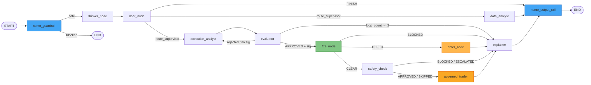
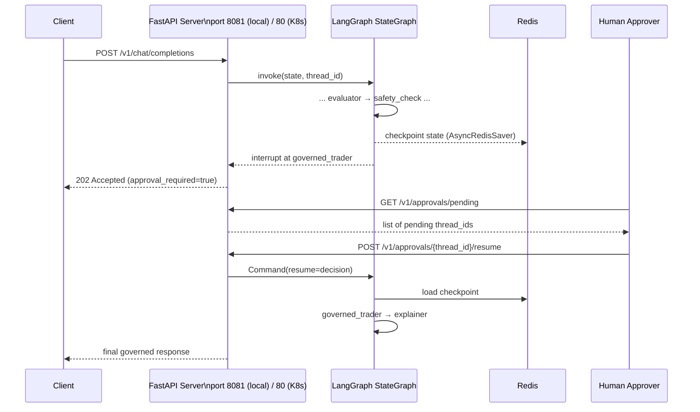
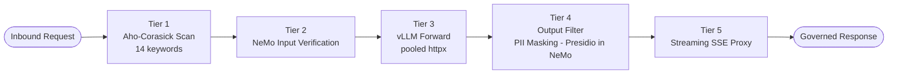
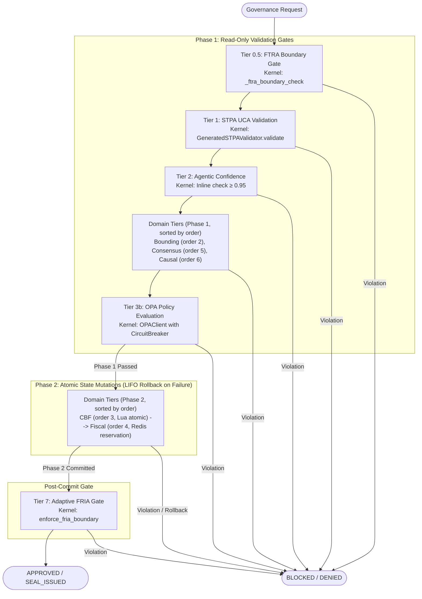

# 02 — System Architecture

| Field                | Value                                                                                                         |
| -------------------- | ------------------------------------------------------------------------------------------------------------- |
| **Document Version** | 3.0                                                                                                           |
| **Date**             | 2026-08-22                                                                                                    |
| **Classification**   | INTERNAL                                                                                                      |
| **Document Series**  | CAGE Technical Report                                                                                         |
| **Status**           | ACTIVE — v3.0.0 stable (GKE deployment verified; 3,925 tests collected / 3,446 passed, 0 failed, 96 skipped; 75.40% statement coverage) |
| **Reference**        | `docs/GATEWAY_ARCHITECTURE.md`, `docs/INFERENCE_GATEWAY_ARCHITECTURE.md`, `docs/NEURO_SYMBOLIC_GOVERNANCE.md` |

---

## 1. Architectural Overview

> **v3.0.0 additions**: 6 Governance Decision Primitives (`ALLOW`, `DENY`, `REQUIRE_APPROVAL`, `DEFER`, `NARROW`, `PAUSE`), Routing Seal v3 (JWT format with `record_hash` Binding and KMS HSM signing; dev/test fallback HMAC), Lua-Atomic CBF Check & Commit, Synchronous Replica Barrier with Monotonic Fence Epoch, Provider 05 3-Axiom External Evidence Attestation (`src/integrations/provider_05/`), FTRA Commencement Reachability Gate (`src/gateway/governance/ftra/`), Phase A Ingress Adapters (`src/gateway/governance/ingress/`), Phase B AGW Absorption (`agw_adapter.py`), CAGE-003 Agent Registry (`agent_registry_adapter.py`), LangGraph Harness (`src/gateway/governance/langgraph_harness/`), AgentSight UI (`src/agentsight-ui/`), and Langfuse Native OTLP.


The **Cybernetic Governance Engine (CAGE)** is a distributed, multi-runtime system composed of five major subsystems that operate cooperatively to enforce real-time AI governance over a LangGraph-based financial advisory pipeline. Each subsystem has a discrete runtime boundary, a defined communication protocol, and a specific governance responsibility.

| #   | Subsystem                      | Root Path                         | Runtime                   | Port            |
| --- | ------------------------------ | --------------------------------- | ------------------------- | --------------- |
| 1   | **Governed Financial Advisor** | `src/governed_financial_advisor/` | Python / FastAPI          | 80 (K8s) / 8081 (local port-forward) |
| 2   | **Hybrid Inference Gateway**   | `src/gateway/`                    | Python / FastAPI + gRPC   | 8080            |
| 3   | **Compliance Bridge**          | `src/compliance_bridge/`          | Python / FastAPI SSE      | 3001 (internal) / 3002 (local port-forward) |
| 4   | **AgentSight UI**              | `src/agentsight-ui/`              | React / TypeScript / Vite | 5173            |
| 5   | **AgentSight eBPF DaemonSet**  | `deployment/agentsight/`          | Kernel / BPF              | N/A (DaemonSet) |
| 6   | **Vendor & Partner Integrations** | `src/integrations/`            | Python (lazy-loaded)      | N/A (adapters: `provider_01`–`provider_06`) |

All six subsystems are co-deployed within the `governance-stack` Kubernetes namespace on GKE and communicate over cluster-internal DNS. No subsystem exposes a public endpoint without traversing the Kubernetes `NetworkPolicy` boundary (9 objects, default-deny).

> **Vendor Isolation (v3.0.0):** Third-party compliance provider adapters (Provider 01–Provider 06) are architecturally isolated in `src/integrations/{provider_id}/` to prevent vendor SDK code from leaking into the governance kernel. Infrastructure invariants (Cloud KMS, Redis) remain in `src/gateway/governance/`.

---

## 2. Top-Level Component Interaction Diagram

The diagram below captures the primary runtime request path from a user API call through the full governed inference and compliance pipeline.

```mermaid
flowchart TD
    User([User / Client]) -->|POST /v1/chat/completions| FastAPI[FastAPI Agent Server\nport 8081 (local) / 80 (K8s)]

    FastAPI -->|invoke graph| LangGraph[LangGraph StateGraph\n12 nodes]

    LangGraph -->|MCP tool calls| HybridGW[Hybrid Inference Gateway]
    LangGraph -->|AsyncRedisSaver checkpoint| Redis[(Redis\nCheckpoint + HITL State)]
    LangGraph -->|OSCAL audit events| CompBridge[Compliance Bridge\nport 3001 (internal) / 3002 (local)]

    HybridGW -->|mount /| MCPApp[FastMCP Tool Server\nDomain-registered tools]
    HybridGW -->|mount /inference| InfProxy[Inference Proxy\n5-tier pipeline]
    HybridGW -->|mount /governance| GovApp[Governance App]
    HybridGW -->|X-CAGE-Routing-Seal JWT/HMAC| GovMiddleware[Governance Middleware]

    InfProxy -->|deepseek model route| vLLM_R[vLLM Reasoning\nDeepSeek-R1-Distill-Llama-8B]
    InfProxy -->|default model route| vLLM_F[vLLM Fast\nMeta-Llama-3.1-8B-Instruct]

    GovApp --> SymGov[SymbolicGovernor\nKernel Gates + Plugin Tiers]
    GovApp --> OPA[OPA Rego Engine\nKernel & Domain Policies]
    GovApp --> NeMo[NeMo Guardrails\nColang Rails]
    SymGov --> PluginTiers[GovernanceTierPlugin Registry\nBounding, CBF, Fiscal, Consensus, Causal]

    CompBridge -->|OTLP export| Langfuse[Langfuse (self-hosted v3)\nClickHouse + MinIO]
    CompBridge -->|SSE fan-out| AgentSightUI[AgentSight UI\nport 5173]
    CompBridge -->|CronJob 6h| OSCAL[OSCAL Lula CronJob]

    eBPF[AgentSight eBPF DaemonSet\nKernel-level] -->|process events| AgentSightUI
```

### Component Interaction & Post-HITL Feedback Loop

The runtime lifecycle consists of a primary check path and an execution-time revalidation feedback loop:
1. **Pre-Execution FTRA Gate**: Before any LLM inference, the FTRA Commencement Reachability Gate (`src/gateway/governance/ftra/`) verifies that the compiled LangGraph graph contains a reachable path to a `HUMAN_APPROVED` terminal node. Graphs that fail this structural check are rejected before any agent runs. Direct HTTP hits are caught by the kernel's mandatory `_ftra_boundary_check()`.
2. **Pre-Trade Checking**: The user's request traverses the multi-agent planning layers, culminating in the `SymbolicGovernor` executing its two-phase pipeline: kernel boundary gates (FTRA 0.5, STPA 1, Confidence 2) → Phase 1 read-only domain tiers (Bounding order 2, Consensus order 5, Causal order 6) → OPA policy (3b) → Phase 2 mutating domain tiers (CBF order 3, Fiscal order 4) with LIFO rollback on failure → adaptive Tier 7 FRIA gate.
3. **HITL Interruption**: If the trade passes the pre-trade check but requires human verification, execution is suspended and state is persisted in Redis.
4. **Execution-Time Feedback Loop**: Once the human reviewer submits approval via `/resume`, the `governed_trader` subgraph re-hydration node retrieves a fresh pricing sample and loops back to the `SymbolicGovernor` to re-run only the deterministic, continuous tiers (CBF and OPA Policy Engine).
5. **Final Actuation**: If both revalidation checks pass successfully, the transaction is committed via the trade execution actuator; otherwise, it is blocked, and a compensator rollback is initiated.

### v2.1.0 Ingress Adapter Layer

The ingress adapter layer (`src/gateway/governance/ingress/`) provides a uniform integration surface for external governance frameworks, translating foreign schemas into the CAGE `ControlRegistry` format:

| Adapter | External Framework | Phase |
|---|---|---|
| [`aaif_adapter.py`](../../src/gateway/governance/ingress/aaif_adapter.py) | AAIF (AI Assurance & Inspection Framework) | Phase A |
| [`acs_adapter.py`](../../src/gateway/governance/ingress/acs_adapter.py) | ACS (AI Compliance Schema) | Phase A |
| [`oscal_adapter.py`](../../src/gateway/governance/ingress/oscal_adapter.py) | OSCAL v1.1.2 component definitions | Phase A |
| [`lula_adapter.py`](../../src/gateway/governance/ingress/lula_adapter.py) | Lula validation manifests | Phase A |
| [`agp_policy_uploader.py`](../../src/gateway/governance/ingress/agp_policy_uploader.py) | AGP compiled policy bundles | Phase A |
| [`policy_translator.py`](../../src/gateway/governance/ingress/policy_translator.py) | Multi-format policy detection | Phase A |
| [`agw_adapter.py`](../../src/gateway/governance/ingress/agw_adapter.py) | Agent Gateway (Envoy ext_authz bridge) | Phase B |
| [`agent_registry_adapter.py`](../../src/gateway/governance/ingress/agent_registry_adapter.py) | CAGE-003 Agent Registry (SPIFFE trust-domain) | Phase B |

The Phase B AGW adapter pairs with `src/gateway/server/agent_gateway_adapter.py` to expose an Envoy `ext_authz` gRPC endpoint, enabling any Envoy-proxied service to delegate authorization decisions to the CAGE governance kernel without code changes.

---

## 3. LangGraph StateGraph Design

### 3.1 Graph Assembly

The stateful agent graph is assembled by `create_graph(redis_url)` in `src/governed_financial_advisor/graph/graph.py`. The function constructs a `StateGraph` over the `AgentState` TypedDict, registers **twelve named nodes**, and wires conditional routing edges. The graph compiles with `interrupt_before=["governed_trader"]` to enable the HITL approval workflow described in Section 4.

### 3.2 Node Inventory

| Node                | Agent Module                        | Responsibility                                                                                    |
| ------------------- | ----------------------------------- | ------------------------------------------------------------------------------------------------- |
| `nemo_guardrail`    | `src/governed_financial_advisor/graph/nodes/guardrail_node.py`    | **Mandatory input rail (ADR 2026-03-09)**; NeMo + bypass-phrase detection; fail-closed; sets `guardrail_blocked` |
| `thinker_node`      | `src/governed_financial_advisor/graph/nodes/supervisor_node.py`   | Strategic reasoning via DeepSeek-R1; produces `reasoning_output`                                  |
| `doer_node`         | `src/governed_financial_advisor/graph/nodes/supervisor_node.py`   | Instruction decomposition; routes to specialist sub-agents                                        |
| `data_analyst`      | `src/governed_financial_advisor/agents/data_analyst/agent.py`      | Live market data fetch via `yfinance`; writes `data_analyst_ticker`                               |
| `execution_analyst` | `src/governed_financial_advisor/agents/execution_analyst/agent.py` | Structured `ExecutionPlan` synthesis; writes `execution_plan_output` (list of `PlanStep`)         |
| `evaluator`         | `src/governed_financial_advisor/agents/evaluator/agent.py`         | Audit verification; OPA policy check; NeMo output scan; writes `evaluation_result`, `opa_results` |
| `ftra_node`         | `src/gateway/governance/ftra/node_factory.py`                      | **Mandatory FTRA reachability analysis**; classifies irreversibility (R-03); routes to `safety_check`, `defer_node`, or blocks |
| `defer_node`        | `src/gateway/governance/defer_queue.py`                            | **DEFER queue parking**; parks mid-confidence requests (`FRIA_ZONE_DEFER`) with signed tokens    |
| `safety_check`      | `src/governed_financial_advisor/graph/nodes/safety_node.py`        | HMAC-SHA256 governance signature validation; writes `safety_status`. Passes STPA-required fields (`drawdown`, `order_size`, `daily_vol`) to the trade payload. |
| `governed_trader`   | `src/governed_financial_advisor/agents/governed_trader/agent.py`   | Final trade execution; HITL interrupt point; writes `execution_result`                            |
| `explainer`         | `src/governed_financial_advisor/agents/explainer/agent.py`         | Compliance narrative generation; produces human-readable audit summary                            |
| `nemo_output_rail`  | `src/governed_financial_advisor/graph/nodes/guardrail_node.py`    | **Mandatory output rail (ADR 2026-03-09b)**; NeMo PII masking + content safety; fail-closed; sets `output_rail_applied` |

**LangGraph Subgraph Nodes** — the `data_analyst` and `governed_trader` top-level nodes each delegate to a compiled LangGraph subgraph defined in `src/governed_financial_advisor/graph/subgraphs/`:

*Data Analyst Subgraph* ([`data_analyst_graph.py`](../../src/governed_financial_advisor/graph/subgraphs/data_analyst_graph.py)):

| Subgraph Node  | Responsibility |
| -------------- | -------------- |
| `thinker`      | DeepSeek-R1 reasoning — identifies the target ticker from conversation context |
| `doer`         | Llama 3.1 + dynamic MCP tool binding — translates reasoning into tool calls (`get_market_data`, `check_market_status`, `get_market_sentiment`) |
| `execute_tool` | Manual MCP tool executor — invokes the tool calls returned by `doer` |
| `reporter`     | Llama 3.1 — synthesizes raw market data into a structured verbal analysis report |

*Governed Trader Subgraph* ([`governed_trader_graph.py`](../../src/governed_financial_advisor/graph/subgraphs/governed_trader_graph.py)):

| Subgraph Node          | Responsibility |
| ---------------------- | -------------- |
| `approval`             | HITL approval gate — pauses execution pending human reviewer decision |
| `rejection`            | Terminal node for human-rejected trades |
| `post_hitl_rehydrate`  | **TOCTOU Remediation** — samples live market price via `yfinance` immediately after HITL resumption; computes drift vs. stale plan price |
| `post_hitl_revalidate` | **TOCTOU Remediation** — re-runs Tier 2 (CBF) and Tier 4 (OPA) against fresh market data; blocks if slippage exceeds reviewer's approved tolerance |
| `drift_blocked`        | Fail-closed terminal node — surfaces human-readable explanation when post-HITL re-validation blocks the trade |
| `executor`             | Llama 3.1 + `execute_trade_action` MCP tool — executes the approved trade plan |
| `tools`                | Manual MCP tool executor for the executor node's tool calls |

### 3.3 Routing Logic

Routing decisions are implemented as inline closures inside `create_graph()` in `src/governed_financial_advisor/graph/graph.py`:

- **`route_after_guardrail(state)`** — (line 63) Reads `state["guardrail_blocked"]`. If True, routes to `END` immediately (blocked input never reaches any agent). Otherwise proceeds to `thinker_node`.
- **`route_supervisor(state)`** — (line 86) Reads `state["next_step"]` (a `Literal` enum) and dispatches to the appropriate specialist node. If `next_step` is `"FINISH"` or `None`, routes through `nemo_output_rail` to `END`.
- **`check_safety_signature(state)`** — (line 98) Validates the HMAC-SHA256 governance signature stored in `state["governance_signature"]`. Routes `APPROVED` plans to `ftra_node`, re-routes to `execution_analyst` if rejected, and enforces a hard loop cap (`loop_count >= 3` → `explainer`).
- **`route_after_ftra(state)`** — Evaluates the `ftra_status` classification. `CLEAR` proceeds to `safety_check`; `DEFER` routes to `defer_node`; `BLOCKED` routes to `explainer`.
- **`route_after_safety(state)`** — Terminal routing decision after the OPA pre-trade safety gate:
  - `APPROVED` or `SKIPPED` → routes to `governed_trader` subgraph (subject to HITL interrupt). On human approval, the execution path first enters `post_hitl_revalidate_node` for continuous state revalidation against Tier 2 and Tier 4 of the Symbolic Governor, before routing to the final executor node.
  - `BLOCKED` or `ESCALATED` → routes to `explainer` (trade is rejected; audit narrative is generated)

> **Note:** The file `src/governed_financial_advisor/graph/router.py` exists but contains only a legacy `risk_router()` function that is not used in the current graph assembly.



> **Mandatory Rails:** `nemo_guardrail` (blue, ADR 2026-03-09) is the mandatory first node — blocked input routes directly to `END` without any agent processing. `nemo_output_rail` (blue, ADR 2026-03-09b) is the mandatory final node — every non-blocked path routes through it before `END` for PII masking and content safety.
>
> **HITL Interrupt:** `governed_trader` (amber) is the graph interrupt point. Execution pauses here pending human approval before the trade is executed.

### 3.4 AgentState Schema

All inter-node communication is carried by a single `AgentState` TypedDict defined in `src/governed_financial_advisor/graph/state.py`. The full field inventory (33 fields):

| Field                      | Type                             | Description                                |
| -------------------------- | -------------------------------- | ------------------------------------------ |
| `messages`                 | `Annotated[list, add_messages]`  | LangChain message history (reducer-merged) |
| `next_step`                | `Literal[...]`                   | Routing enum; set by supervisor            |
| `risk_status`              | `Literal[...]`                   | UNKNOWN / APPROVED / REJECTED_REVISE       |
| `risk_feedback`            | `str \| None`                    | Risk loop feedback from evaluator          |
| `loop_count`               | `int \| None`                    | Recursion depth for safety breaker (cap 3) |
| `safety_status`            | `Literal[...]`                   | APPROVED / BLOCKED / ESCALATED / SKIPPED   |
| `governance_signature`     | `str \| None`                    | HMAC-SHA256 over execution plan            |
| `risk_attitude`            | `str \| None`                    | User-specified risk preference             |
| `investment_period`        | `str \| None`                    | Investment horizon                         |
| `reasoning_output`         | `str \| None`                    | DeepSeek-R1 chain-of-thought trace         |
| `execution_plan_output`    | `str \| dict \| None`            | Structured trade plan                      |
| `data_analyst_ticker`      | `str \| None`                    | Ticker symbol resolved by market agent     |
| `evaluation_result`        | `dict \| None`                   | Composite evaluator verdict                |
| `opa_results`              | `dict \| None`                   | OPA Rego policy evaluation result          |
| `execution_result`         | `dict \| None`                   | Trade execution receipt                    |
| `governance_summary`       | `str \| None`                    | Final auditor report for the UI            |
| `user_id`                  | `str`                            | Authenticated user identity                |
| `latency_stats`            | `dict \| None`                   | Per-node latency telemetry                 |
| `completed_transactions`   | `Annotated[list[LedgerEntry], add]` | Saga WAL — append-only transaction ledger |
| `approval_required`        | `bool`                           | HITL flag set by evaluator                 |
| `approval_decision`        | `Optional[dict]`                 | Human approval decision (structured dict)  |
| `hitl_expires_at`          | `Optional[str]`                  | TTL expiration timestamp for pending HITL state |
| `guardrail_blocked`        | `bool`                           | NeMo input rail gate (ADR 2026-03-09)      |
| `guardrail_reason`         | `str`                            | Reason for guardrail block                 |
| `output_rail_applied`      | `bool`                           | NeMo output rail tracking (ADR 2026-03-09b)|
| `ftra_status`              | `Literal[...]`                   | FTRA verdict: CLEAR / HITL_REQUIRED / BLOCKED |
| `ftra_result`              | `dict \| None`                   | Serialized `FtraBoundaryResult` structure  |
| `ftra_defer_id`            | `str \| None`                    | Correlation UUID for parked DEFER requests |
| `narrow_status`            | `Literal[...]`                   | Clamping status: NONE / APPLIED / REJECTED |
| `narrowed_params`          | `dict \| None`                   | Clamped parameters from NARROW primitive   |
| `pause_resume_token`       | `str \| None`                    | Cryptographic token for PAUSE resumption   |
| `pause_reason`             | `str \| None`                    | Reason code for transient PAUSE delay      |
| `confidence`               | `float`                          | Calibrated model confidence score (0.0–1.0)|

### 3.5 Checkpointing Strategy

Graph state is persisted by `src/governed_financial_advisor/graph/checkpointer.py`:

- **Primary:** `AsyncRedisSaver` — asynchronous persistence to Redis; required for the HITL pause-and-resume pattern across HTTP request boundaries.
- **Fallback:** `MemorySaver` — in-process fallback activated when Redis is unavailable. When `MemorySaver` is active, an OpenTelemetry alert span is emitted to signal degraded durability to operators.

---

## 4. HITL Workflow

Human-in-the-Loop (HITL) trade approval is a first-class architectural feature, not an optional add-on. The workflow is implemented across the graph interrupt mechanism and the REST approval API exposed by `src/governed_financial_advisor/server.py`.



- **Interrupt point:** `interrupt_before=["governed_trader"]` — configured at graph compile time.
- **State persistence:** `AsyncRedisSaver` persists full `AgentState` keyed by `thread_id`.
- **Resume:** `POST /v1/approvals/{thread_id}/resume` injects `approval_decision` via LangGraph's `Command(resume=decision)` pattern, reloading state from Redis.
- **Pending list:** `GET /v1/approvals/pending` enumerates all thread IDs whose graphs are paused at the `governed_trader` interrupt node.

---

## 5. Hybrid Gateway Architecture

The Hybrid Inference Gateway is CAGE's central enforcement plane. It is structured as a single composition root (`src/gateway/server/hybrid_server.py`) that mounts three independent ASGI sub-applications under distinct path prefixes.

### 5.1 Mount Topology

| Mount Path    | Sub-Application  | Primary Role                                       |
| ------------- | ---------------- | -------------------------------------------------- |
| `/`           | `mcp_app`        | FastMCP tool server; domain-registered tools       |
| `/inference`  | `inference_app`  | OpenAI-compatible inference proxy; 5-tier pipeline |
| `/governance` | `governance_app` | SymbolicGovernor endpoint                          |

### 5.2 Governance Middleware

`src/gateway/server/governance_middleware.py` wraps every `/tools/execute` call. It enforces the **X-CAGE-Routing-Seal** HMAC/JWT header: any tool invocation whose request does not carry a valid routing seal — signed with the KMS HSM key (or shared secret fallback) — is rejected before reaching the tool handler. This prevents tool calls from bypassing the governance pipeline by direct HTTP access.

The middleware exposes two governance endpoints under the `/governance` mount path:

| Endpoint | Method | Description |
| -------- | ------ | ----------- |
| `POST /governance/check` | POST | Internal dry-run governance check against a proposed tool call. Requires a valid routing seal. Body: `{"tool_name": str, "params": dict}`. Returns `APPROVED` or `REJECTED` with violations list. |
| `POST /governance/validate-action` | POST | **Unified governance validation for structured tool execution payloads.** Called by the GFA service instead of invoking OPA directly — the Single Choke Point for all tool-level governance decisions. Executes kernel boundary gates (FTRA), domain tiers (CBF, Bounding, Fiscal), and OPA policy. Returns `verdict` (ALLOW\|DENY\|PAUSE\|NARROW\|REQUIRE_APPROVAL\|DEFER), `violations`, `seal`, and `latency_ms`. |

### 5.3 MCP Tool Server

`src/gateway/server/mcp_tool_server.py` exposes core kernel tools via FastMCP, while domain plugins register domain-specific execution tools dynamically at startup:

**Kernel Tools (`src/gateway/server/mcp_tool_server.py`):**
| Tool                          | Function                                              |
| ----------------------------- | ----------------------------------------------------- |
| `simulate_governance_check`   | Dry-run SymbolicGovernor verify (sim_mode only)       |
| `trigger_safety_intervention` | Lock system via Redis safety_violation flag           |
| `verify_content_safety`       | NeMo Guardrails text safety check                     |

**Finance Domain Plugin Tools (`src/cage_finance/tools/tool_provider.py`):**
| Tool                          | Function                                              |
| ----------------------------- | ----------------------------------------------------- |
| `execute_trade_action`        | Execute financial trade under full governance         |
| `check_market_status`         | Check market symbol status                            |
| `get_market_sentiment`        | Retrieve market sentiment                             |

**Healthcare Domain Plugin Tools (`src/cage_healthcare/tools/tool_provider.py`):**
| Tool                          | Function                                              |
| ----------------------------- | ----------------------------------------------------- |
| `dose_order`                  | Clinical dose order under serum barrier governance    |

### 5.4 Inference Proxy Pipeline

`src/gateway/server/inference_proxy.py` intercepts every `POST /v1/chat/completions` request and applies a strict 5-tier sequential pipeline before forwarding to vLLM:



- **Tier 1** — Aho-Corasick automaton scanning for 14 prohibited keywords; O(n) scan regardless of keyword count.
- **Tier 2** — NeMo Guardrails input verification via the `NeMoGuardrails` gRPC service.
- **Tier 3** — vLLM forward using a pooled `httpx` client (`max_connections=50`, `max_keepalive=20`).
- **Tier 4** — Response output filtering and PII masking via Microsoft Presidio (10 entity types configured in `config/rails/config.yml`).
- **Tier 5** — Server-Sent Events (SSE) streaming proxy for token-by-token client delivery.

**Model routing:** The proxy inspects the `model` field of the request body. Requests specifying a `deepseek` model variant are routed to `VLLM_REASONING_API_BASE`; all other requests are routed to `VLLM_FAST_API_BASE`.

| Model Variant | Backend                                                  | Use Case                                      |
| ------------- | -------------------------------------------------------- | --------------------------------------------- |
| `deepseek-*`  | `VLLM_REASONING_API_BASE` — DeepSeek-R1-Distill-Llama-8B | Chain-of-thought reasoning (thinker node)     |
| Default       | `VLLM_FAST_API_BASE` — Meta-Llama-3.1-8B-Instruct        | Instruction following (doer, explainer nodes) |

---

## 6. Symbolic Governor — Plugin-Registered Tier Architecture

The `SymbolicGovernor` class in `src/gateway/governance/symbolic_governor.py` is the neuro-symbolic enforcement core of CAGE. In v3.0.0, the governor executes **kernel-owned gates** combined with **plugin-registered domain tiers** via [`_run_domain_tiers()`](../../src/gateway/governance/symbolic_governor.py:944). The canonical tier sequence is defined by [`proof/model.py:128`](../../proof/model.py#L128) `TIERS = ("ftra", "stpa", "confidence", "cbf", "opa", "fiscal", "consensus", "causal", "fria")`.

The pipeline executes in two decoupled phases:
- **Phase 1 (Read-Only Validation)**: Executes kernel boundary checks and read-only domain tiers. If any check fails, the pipeline halts immediately without state mutation.
- **Phase 2 (Atomic Mutation & LIFO Rollback)**: Executes mutating domain tiers (e.g. CBF cash deductions, fiscal limits). If any Phase 2 tier fails, all previously committed Phase 2 tiers are rolled back in strict LIFO order via [`rollback()`](../../src/gateway/governance/contracts.py:271).



### 6.1 Tier Specifications

| Tier | Category | Phase | Order | Name | Implementation | Key Threshold |
| ---- | -------- | ----- | ----- | ---- | -------------- | ------------- |
| **0.5** | Kernel Gate | 1 | 0 | FTRA Boundary Check | `_ftra_boundary_check()` in `symbolic_governor.py` | 4 irreversibility classes; bypass detection (R-03) |
| **1** | Kernel Gate | 1 | 1 | STPA UCA Validation | `GeneratedSTPAValidator.validate()` in `generated_stpa_validator.py` | Thresholds from `config/safety_params.json` (UCA-1..9) |
| **2** | Kernel Gate | 1 | 2 | Agentic Confidence | Inline fast-fail check in `_run_checks()` | `confidence ≥ AGENT_CONFIDENCE_THRESHOLD` (0.95 US / 0.97 EU) |
| **—** | Domain Tier | 1 | 2 | Bounding Contracts (Finance) | `BoundingContractTierPlugin` in `cage_finance/tiers/bounding_tier.py` | Hard-block allowlist (instruments, venues, accounts) |
| **3a** | Domain Tier | 2 | 3 | Control Barrier Function | `CBFTierPlugin` wrapping `cbf_engine.py` | `min_cash_balance=1000.0`, `gamma=0.5` (US) / `0.6` (EU) |
| **3b** | Kernel Gate | 1 | 4 | OPA Policy Evaluation | `OPAClient` in `core/policy.py` + `CircuitBreaker` | Package `trade.governance`; 5 failures → open circuit |
| **4** | Domain Tier | 2 | 4 | Fiscal Limit Pre-Reservation | `FiscalTierPlugin` wrapping `safety/resource_guard.py` | `FISCAL_DAILY_CAP_USD` ($500,000); 300s TTL |
| **5** | Domain Tier | 1 | 5 | Multi-Agent Consensus | `ConsensusTierPlugin` wrapping `consensus/engine.py` | Threshold $10,000; fail-closed `ESCALATE` on error |
| **6** | Domain Tier | 1 | 6 | Causal Gatekeeper | `CausalTierPlugin` wrapping `causal/gatekeeper.py` | $\beta \le 0 \implies \text{BLOCK}$; Placebo p < 0.05 or \|eff\| > 0.2 |
| **7** | Kernel Gate | 1 | 7 | Adaptive FRIA Gate | `enforce_fria_boundary()` in `normative_provider.py` | `ALLOW ≥ 0.95`, `DEFER ≥ 0.70`, `DENY < 0.70` |

> **Two-Phase Decoupling & Zero Budget Leakage:** All Phase 1 validation checks execute before any state mutation occurs. If any validation tier emits a violation, the pipeline terminates in Phase 1 without modifying Redis balances or reserving daily limits, structurally eliminating downstream budget leakage. If Phase 2 fails downstream, committed Phase 2 tiers are rolled back in LIFO order.

**Tier 3a (Control Barrier Function):** CBF's `atomic_verify_and_commit()` executes a single Redis Lua script (`LUA_ATOMIC_CBF`) that checks $h(S(t+1)) \ge (1-\gamma)h(S(t))$ and commits the cash balance deduction in a single atomic hop, eliminating TOCTOU race conditions.

**Tier 3b (OPA Circuit Breaker):** The `CircuitBreaker` wrapping the `OPAClient` protects the governance pipeline from OPA service degradation. After 5 consecutive failures, the breaker opens for 30 seconds. During open-circuit state, all governance requests are rejected with `BLOCKED` — the system does not fall back to permissive defaults.

**Tier 6 (Causal Gatekeeper):** Microsoft DoWhy causal inference model validates world-model integrity. The gatekeeper checks if the estimated causal relations match empirical treatment effects via a Placebo Treatment Refuter. If a placebo treatment produces a statistically significant effect (p < 0.05 or placebo effect > 0.2), the model assumptions are deemed poisoned and the trade is blocked.

**Latency Mitigations (per-tier):** Each governance tier incorporates specific latency controls to keep the pipeline within the 200 ms operational latency requirement imposed by real-time interbank rails (FedNow / SEPA Instant) to support synchronous, inline AML and fraud-screening pipelines:
- **Tier 0** (STPA): Pure Python dict checks (<1ms)
- **Tier 1** (Confidence): Float comparison (<1ms)
- **Tier 2** (CBF): Redis `WATCH`/`MULTI`/`EXEC` atomic single-roundtrip (~5ms); concurrent with Tier 4
- **Tier 3** (Fiscal Limit Pre-Reservation): Redis `WATCH`/`MULTI`/`EXEC` atomic single-roundtrip (~5ms)
- **Tier 4** (OPA): `CircuitBreaker` with 1.0s hard timeout per request, 2000ms soft ceiling warning, 3000ms bankruptcy protocol → immediate DENY; concurrent with Tier 2
- **Tier 5** (Consensus): `asyncio.gather()` parallel critic calls (Phase 4.4); background audit queue (`maxsize=1000`) for non-blocking post-execution logging
- **Tier 6** (Causal): 50 simulations; fail-closed in production when `telemetry=None` (CAGE_ENV not in dev/test)

For the full 14-mechanism latency mitigation analysis and latency budget breakdown, see [`08-DEPLOYMENT-INFRASTRUCTURE.md` §10](./08-DEPLOYMENT-INFRASTRUCTURE.md#latency-strategy).

### 6.2 Concurrency & Transaction Control (v2.0.0 Add-ons)

#### FiscalLimitGuard
To prevent concurrent multi-agent "race to the rail" limit depletion where multiple agents check the same remaining daily cap simultaneously, CAGE v2.0.0 enforces atomic limit pre-reservation via the `FiscalLimitGuard` class (`src/gateway/governance/safety/resource_guard.py`).
1. **Pre-Reservation (Tier 3):** After concurrent CBF+OPA (Tiers 2+4), the agent atomically reserves the trade amount in Redis using a `WATCH`/`MULTI`/`EXEC` optimistic lock transaction. This is the tier that closes the saga-atomicity gap (distributed-transaction atomicity failure, not a concurrency race). Default daily cap: **$500,000 USD** (`FISCAL_DAILY_CAP_USD` env var). Cap is stored in **cents** for integer precision.
2. **TTL Safety:** Returns a `ReservationToken` with a **300s TTL**. If the agent node crashes before execution, the cap is automatically reclaimed. Fail-closed: if Redis is unavailable, the trade is blocked.
3. **Commit & Rollback:** On success, the spend is confirmed. On failure, the Saga compensating node releases the token back to Redis headroom. `FiscalLimitGuard.rollback_state(amount, audit_id)` is a Saga compensation stub that reverses the Redis debit when a downstream tier fails after Tier 3a commitment; it logs `[SAGA-ROLLBACK]` and re-raises on Redis failure.

#### LangGraph Saga Engine
To guarantee atomic transactional consistency across distributed, non-deterministic agent steps (e.g. trade execution vs cash debiting), CAGE implements a **LangGraph Saga Engine** (`src/gateway/governance/generated_saga_nodes.py`). 
*   **Write-Ahead Log (WAL):** Transitions are recorded inside state ledger entries.
*   **LIFO Rollback:** On tool failure, a series of idempotent compensating nodes are triggered in Last-In-First-Out order to reverse all completed actions.
*   **Ghost-State Recovery:** If a crash or OOM occurs mid-transaction, the engine reloads the graph checkpoint from Redis and escalates to `human_review` while emitting OTel rollback spans to comply with ISO 42001.

### 6.3 Multi-Jurisdiction Regional Compliance Profiles

The Symbolic Governor pipeline is region-aware. The `CAGE_DEPLOYMENT_REGION` environment variable (`US_FED`, `EU_ECB`, or `APAC_MAS`) controls three runtime behaviors:

1. **Compliance Control Mappings:** The `ControlRegistry` (in `src/gateway/governance/constants.py`) loads `config/compliance/{REGION}_BASELINE.json` at startup, providing region-specific primary framework citations, co-framework references, and legacy citation metadata for all governance controls. Example: `CTRL_MRM_004` cites SR 26-2 §IV in `US_FED` but `EBA/GL/2023/02` in `EU_ECB`.

2. **Governance Threshold Calibration:** Region-specific threshold files (`config/thresholds/{REGION}_BASELINE.json`) override default governance parameters. The EU profile is consistently stricter — confidence minimum 0.97 (vs US 0.95), drawdown limit 4% (vs US 5%), latency SLA 150ms (vs US 200ms), and consensus threshold $7,500 (vs US $10,000).

3. **EU-Only Tier 6b (FRIA Attestation):** When `CAGE_DEPLOYMENT_REGION=EU_ECB`, the governor's adaptive FRIA tier (Tier 6b, after Tier 6 Causal Gatekeeper) additionally stamps a Fundamental Rights Impact Assessment attestation (`CTRL_FRIA_006`, EU AI Act Art. 29a) into the OTel span attributes. This attestation is absent in `US_FED` and `APAC_MAS` deployments. The `ControlRegistry.get_mapping_safe()` method handles this gracefully — returning `None` for controls not present in the active region.

| Region Code | Target Jurisdiction | Compliance Profile | Active Frameworks | Key Threshold Differences |
| ----------- | ------------------- | --------------------------------------------------- | ----- | ---------- |
| `US_FED`    | United States       | `config/compliance/US_FED_BASELINE.json` (5 ctrls)  | SR 26-2, NIST SP 800-53, ISO 42001 | Baseline thresholds |
| `EU_ECB`    | European Union      | `config/compliance/EU_ECB_BASELINE.json` (6 ctrls)  | EU AI Act, DORA, GDPR, EBA/GL/2023/02, ISO 42001 | Stricter across all tiers + FRIA |
| `APAC_MAS`  | Singapore / APAC    | `config/compliance/APAC_MAS_BASELINE.json` (5 ctrls) | MAS FEAT, MAS TRM Guidelines, ISO 42001 | $5k consensus threshold |

---

## 7. gRPC Interface

CAGE exposes two gRPC service definitions for inter-service communication within the cluster.

### 7.1 Gateway Service

**Proto:** [`src/gateway/protos/gateway.proto`](../../src/gateway/protos/gateway.proto)

```
service Gateway {
  rpc Chat(ChatRequest) returns (stream ChatResponse);
  rpc ExecuteTool(ToolRequest) returns (ToolResponse);
}
```

- `Chat` — bidirectional streaming RPC; streams `ChatResponse` tokens from the inference pipeline back to the caller.
- `ExecuteTool` — unary RPC; executes a named MCP tool with provided arguments and returns the tool result.

### 7.2 NeMo Guardrails Service

**Proto:** `src/gateway/protos/nemo.proto`

```
service NeMoGuardrails {
  rpc Verify(VerifyRequest) returns (VerifyResponse);
}
```

- `Verify` — unary RPC; submits a prompt or completion for NeMo Guardrails verification. Used by both the Inference Proxy (Tier 2 input scan) and the evaluator node for output verification.

---

## 8. Authorization Boundary

CAGE's authorization boundary is defined by the `governance-stack` Kubernetes namespace deployed on GKE.

### 8.1 Network Isolation

Nine `NetworkPolicy` objects implement a default-deny posture within the namespace. All intra-cluster traffic is explicitly allowlisted by policy. Intra-cluster mTLS between governance pipeline services is enforced via Linkerd + Cilium L7 (POAM-007 — **RESOLVED** 2026-05-17).

### 8.2 External Interconnections

| External System        | Protocol                            | Data Classification              | ISA Status              |
| ---------------------- | ----------------------------------- | -------------------------------- | ----------------------- |
| GCS Artifact Bucket    | GCP API (HTTPS)                     | OSCAL / Audit Evidence           | Inherited (GCP FedRAMP) |
| MinIO (model weights)  | HTTPS/REST                          | Model Binaries                   | Under evaluation        |
| Langfuse (self-hosted v3) | HTTPS/OTLP                          | Inference Traces (potential PII) | Self-hosted on GKE (ISA N/A) |
| yfinance / Market Data | HTTPS/REST                          | Financial Market Data            | **ISA Required**        |

> **Note:** GCP Secret Manager has been **removed** as an external dependency (ADR). Secrets are now delivered exclusively via Kubernetes `Secret` objects provisioned by Terraform; no runtime GCP Secret Manager dependency exists.

---

## 9. Observability Architecture

### 9.1 OpenTelemetry

> **⚠️ Deprecation (2026-05-31):** The standalone OpenTelemetry Collector (`opentelemetry-collector-contrib`) has been deprecated and removed from the deployment. Services now export OTLP traces directly to **Langfuse's integrated OTLP ingestion endpoint**, eliminating the standalone collector as an intermediary hop.

All services emit traces via OTLP/HTTP to Langfuse's native OTLP endpoint (Langfuse v3 exposes `/api/public/otel/v1/traces`). The `opentelemetry-sdk`, `opentelemetry-exporter-otlp-proto-grpc`, and instrumentation libraries remain in use — only the standalone collector sidecar has been removed.

**Sampling configuration:**

- Default: **1% sampling rate** (cost control for high-volume inference spans)
- Governance spans: **100% sampling rate** (all governance decisions are fully traced for audit purposes)

**Cross-service trace propagation:** W3C `traceparent` headers are injected across the MCP SSE transport boundary by `patch_mcp_tools()` in `src/gateway/observability/mcp_tracing.py`. This ensures a single distributed trace spans from the initial HTTP request through the LangGraph node execution, MCP tool calls, and vLLM inference.

### 9.2 Langfuse Dual-Project Setup

CAGE uses two separate Langfuse projects for observability separation:

| Project                 | Purpose                                            |
| ----------------------- | -------------------------------------------------- |
| **Application Metrics** | Inference latency, token counts, model performance |
| **Compliance**          | Governance verdicts, OPA results, audit evidence   |

Both projects receive OTLP exports via Langfuse's integrated OTLP ingestion endpoint. PII-bearing trace payloads represent a risk before a Data Processing Agreement and ISA are in place (see Section 8.2).

The application project credentials (`LANGFUSE_PUBLIC_KEY` / `LANGFUSE_SECRET_KEY`) are mounted in the governed-financial-advisor and compliance-bridge pods. The compliance project credentials (`LANGFUSE_COMPLIANCE_PUBLIC_KEY` / `LANGFUSE_COMPLIANCE_SECRET_KEY`) are mounted **only** in the compliance-bridge pod. This ensures no workload pod can write to or tamper with the compliance audit evidence trail.

For the full design rationale, threat model, implementation map, and verification procedures, see [`docs/architecture/DUAL_PROJECT_ARCHITECTURE.md`](../architecture/DUAL_PROJECT_ARCHITECTURE.md).

### 9.3 GovernanceEventBus

`src/compliance_bridge/sse_events.py` implements `GovernanceEventBus` — an `asyncio.Queue(maxsize=128)` fan-out bus that distributes governance events to all connected SSE subscribers.

**Event types published to the bus:**

| Event Type             | Trigger                                                          |
| ---------------------- | ---------------------------------------------------------------- |
| `AUDIT_FINDING`        | Compliance Bridge detects a control finding during OSCAL audit   |
| `GOVERNANCE_VIOLATION` | SymbolicGovernor or evaluator node raises a governance rejection |

### 9.4 AgentSight UI (Phase 1 — v2.0.0-rc.1)

`src/agentsight-ui/src/KernelDashboard.tsx` is the primary compliance operator interface. It connects to `{BACKEND_URL}/v1/events/stream` as an SSE consumer and renders real-time governance signals.

**Dashboard configuration:**

| Parameter             | Value                             |
| --------------------- | --------------------------------- |
| Alert threshold       | `ALERT_THRESHOLD=0.8`             |
| Monitored control IDs | `A.5.2`, `A.5.3`, `A.9.2`, `SC-4` |

**Phase 1 operator controls (v2.0.0-rc.1):**

| Feature | Implementation | Details |
|---------|---------------|---------|
| **Max Slippage % Slider** | `maxSlippagePct` state (default 2.0); range input 0–10%, step 0.1 | Persisted via `POST /api/governance/thresholds` on `mouseup`/`touchend`; `slippageSaving` spinner shown during save |
| **ΔP Price Drift Badge** | `priceDrift(fresh, stale)` helper; `.drift-badge` CSS class | Green < 1%, Yellow 1–3%, Red > 3% with `drift-pulse` keyframe animation |
| **HITL TTL Countdown** | `formatCountdown(totalSeconds)` helper; 1-second `setInterval` tick via `now` state | Displays `MM:SS` remaining; `.hitl-ttl-expired` class + `.telemetry-item.hitl-expired` (opacity 0.45, grayscale 0.6) when expired |

New `TelemetryItem` / `GovernanceEvent` interface fields propagated from SSE stream: `hitl_expires_at?: string | null`, `price_fresh?: number | null`, `price_stale?: number | null`.

### 9.5 AgentSight eBPF DaemonSet

The `deployment/agentsight/` DaemonSet deploys a kernel-level BPF program targeting `python3` processes within the `governance-stack` namespace.

**Instrumentation points:**

- OpenSSL `uprobes` — intercepts TLS handshake events at the user-space library boundary
- System call hooks — captures `execve`, `open`, `connect` syscalls from governed processes

**Current status:** The DaemonSet outputs events to console only. Integration with the AgentSight UI event bus is a roadmap item. Kernel-level telemetry feeds `src/agentsight-ui/src/KernelDashboard.tsx` for anomaly display.

---

## 10. Langfuse Webhook Cybernetic Loop

The system that gives CAGE its name — a **cybernetic** (self-correcting) governance engine — is the closed-loop feedback path from Langfuse telemetry scores through Kubeflow Pipelines back to live NeMo Guardrails hot-reload.

> **v3.0.0 Note (CR-2):** The NeMo refinement step in this loop strictly requires human approval before executing remediation actions. The propose-refinement → human approval (`POST /v1/nemo/approve-refinement/{proposal_id}`) → apply-refinement sequence is enforced for all refinement operations, completely eliminating the unattended auto-apply code branch to neutralize AARM-V8 recursive self-authentication.

> **Naming note:** The KFP pipeline is registered as `green-stack-governance-loop` and the pipeline file is `green_stack_pipeline.py`. "Green-Stack Pipeline" is the original implementation name; "Cybernetic Governance Loop" is the architectural concept it implements. They refer to the same system — the same code, the same endpoints, the same trigger flow. This document uses the canonical term **Cybernetic Governance Loop**.

### 10.1 Architecture Overview

```
Langfuse score event (score-created)
        │
        ▼
POST /v1/webhooks/langfuse   ← governed-financial-advisor (FastAPI)
        │
        ├─ Anti-flapping guards (R-LOOP-6 / R-LOOP-7)
        │
        ▼
_submit_kfp_run()            ← Kubeflow Pipelines SDK
        │
        ├─ Step 1: evaluate_governance_metrics (Compliance Bridge)
        ├─ Step 2: verdict check (PASS / FAIL)
        ├─ Step 3: propose_refinement (POST /v1/nemo/propose-refinement)
        ├─ Step 4: human approval (POST /v1/nemo/approve-refinement/{proposal_id})
        └─ Step 5: trigger_nemo_refinement (POST /v1/nemo/apply-refinement)
                        │
                        ▼
               NeMo rails hot-reload (in-process singleton swap)
```

The full cybernetic loop is: **Langfuse score event → webhook → KFP pipeline → evaluate metrics → propose refinement → human approval → apply hot-reload** — eliminating unattended auto-application to prevent recursive self-authentication (AARM-V8).

### 10.2 Langfuse Webhook Configuration

To activate the webhook in Langfuse:

**Settings → Webhooks → Add:**

| Field        | Value |
| ------------ | ----- |
| URL          | `https://<governed-financial-advisor>/v1/webhooks/langfuse` |
| Event filter | `score-created` |

Two env vars (with defaults) control the watched score:

| Var | Default | Purpose |
| --- | ------- | ------- |
| `LANGFUSE_WATCH_SCORE_NAME` | `iso_42001_safety_rate` | Score name to watch for threshold breaches |
| `NEMO_SAFETY_THRESHOLD` | `0.95` | Value below which the refinement loop fires |

Source: [`src/governed_financial_advisor/server.py`](../../src/governed_financial_advisor/server.py) (line 772)

### 10.3 Anti-Flapping Design

Two guards run in sequence before `_submit_kfp_run()` is ever called:

```
score-created event
  │
  ├─ type != "score-created"?  → status: ignored   (no retry)
  ├─ name != watched score?    → status: ignored
  ├─ value >= threshold?       → status: threshold_ok
  │
  ├─ sample_size present AND < 10?  → status: deferred   (R-LOOP-7)
  │
  ├─ monotonic_now - last_triggered < 300s?  → status: cooldown   (R-LOOP-6)
  │                                            + seconds_remaining in response
  │
  └─ ARM CLOCK → _submit_kfp_run()  → status: triggered
```

#### R-LOOP-6: Cooldown Gate

After a KFP run is accepted, all subsequent webhook triggers are rejected for `REFINEMENT_COOLDOWN_SECONDS` (default: 300s). This prevents rapid-fire hot-reloads during noisy score bursts (policy flapping / thundering-herd into the inference pod).

#### R-LOOP-7: Minimum-Sample Guard

The score event payload may carry a `sample_size` field in `data`. If present and below `REFINEMENT_MIN_SAMPLES` (default: 10), the trigger is deferred — a single low-scoring trace during a quiet window is not statistically significant. When the field is absent, the guard is skipped.

#### Clock-Arming Pattern

`_last_refinement_triggered_at = now` is set **before** `_submit_kfp_run()` awaits the KFP HTTP call. In asyncio's cooperative model this is effectively atomic — any concurrent webhook event that becomes runnable while the KFP HTTP call is in-flight will see the updated timestamp and be gated by the cooldown check.

### 10.4 Tuning Environment Variables

| Var | Default | Notes |
| --- | ------- | ----- |
| `REFINEMENT_COOLDOWN_SECONDS` | `300` | 5 min — tune based on how long a KFP run + hot-reload takes |
| `REFINEMENT_MIN_SAMPLES` | `10` | Langfuse must include `data.sample_size`; guard skipped if absent |
| `NEMO_SAFETY_THRESHOLD` | `0.95` | ISO 42001 safety rate below which the loop fires |
| `LANGFUSE_WATCH_SCORE_NAME` | `iso_42001_safety_rate` | Score name filter for incoming webhooks |
| `KFP_ENDPOINT` | (empty) | Kubeflow Pipelines API server; if unset, degrades to `dry_run` |

All values are read at module load time; set env vars before pod startup.

### 10.5 KFP Governance Pipeline

The three-stage KFP pipeline is defined in [`src/governed_financial_advisor/pipelines/green_stack_pipeline.py`](../../src/governed_financial_advisor/pipelines/green_stack_pipeline.py):

| Stage | KFP Component | Action |
| ----- | ------------- | ------ |
| 1 | `evaluate_governance_metrics` | Queries Compliance Bridge for windowed safety scores per ISO 42001 control |
| 2 | Verdict gate | Checks PASS/FAIL from the evaluation |
| 3 | `trigger_nemo_refinement` | On FAIL, calls `POST /v1/nemo/apply-refinement` on the governed-financial-advisor pod |

### 10.6 NeMo Hot-Reload Endpoint

`POST /v1/nemo/apply-refinement` ([server.py line 668](../../src/governed_financial_advisor/server.py)) rebuilds the global `rails` singleton from the current `config/rails/` directory on disk. If the reload fails (e.g. malformed Colang), the existing singleton is preserved and the error is surfaced. The change takes effect immediately without restarting the pod.

### 10.7 OTel Span Attributes

The `seconds_remaining` field in cooldown responses is also emitted as an OTel span attribute, so operators can monitor the gate state in Langfuse without additional instrumentation:

| Span Attribute | Value |
| -------------- | ----- |
| `ai.webhook.langfuse.cooldown_active` | `true` / `false` |
| `ai.webhook.langfuse.cooldown_seconds_remaining` | Remaining seconds in cooldown window |
| `ai.webhook.langfuse.score_name` | Watched score name |
| `ai.webhook.langfuse.score_value` | Numeric score value that triggered the loop |

On threshold breach, a `langfuse.webhook.threshold_breach` OTel event is emitted with full context (score name, value, threshold, cooldown seconds, sample size).

---

## 11. Governance Kernel Mathematical Foundations

This section documents the mathematical formalism underlying each component of the CAGE governance kernel. All formulas are implemented in [`src/gateway/governance/`](../../src/gateway/governance/).

### 11.1 Control Barrier Function (CBF)

**Source:** [`src/gateway/governance/safety/cbf_engine.py`](../../src/gateway/governance/safety/cbf_engine.py)

The CBF layer provides a formal cash-balance safety guarantee. The **safe set** is:

```
S = {x ∈ ℝⁿ : h(x) ≥ 0}
```

The **barrier function** maps system state to a scalar safety margin:

```
h(x) = cash_balance − min_cash_balance
```

where `min_cash_balance = $1,000 USD` (configurable). The **discrete-time CBF condition** that must hold at every governance check:

```
h(S(t+1)) ≥ (1 − γ) · h(S(t))     γ ∈ (0, 1), default γ = 0.5
```

This condition guarantees `h(S(t)) ≥ 0` for all `t` — the cash balance never falls below `min_cash_balance`. The Redis atomic implementation uses `WATCH/MULTI/EXEC` optimistic locking with `_MAX_RETRIES = 5`. `verify_action()` is **read-only** at check time; the actual debit is performed by `FiscalLimitGuard`.

### 11.2 Causal Gatekeeper — SCM with Backdoor Adjustment

**Source:** [`src/gateway/governance/causal/gatekeeper.py`](../../src/gateway/governance/causal/gatekeeper.py)

The causal gatekeeper uses a **Structural Causal Model (SCM)** with `backdoor.linear_regression` to estimate the causal effect of a proposed trade on portfolio risk. The gatekeeper enforces three safety checks:

1. **Non-Positive Causal Slope Guard:** If estimated causal slope $\beta \le 0$, the gatekeeper fails closed (`causal.lock_reason = "negative_or_zero_causal_slope"`), blocking trades with invalid or confounding causal assumptions.
2. **Placebo Refutation:** 50 placebo simulations are run against live telemetry.
   - p-value < 0.05 → model assumptions violated → BLOCK
   - |placebo effect| > 0.2 → effect size too large → BLOCK
3. **Monotonic Bounded Risk Boundary:**
```python
risk_score = min(1.0, max(0.0, 0.5 + estimate.value * amount))
```
If `risk_score > 0.95`, the trade is blocked regardless of prior tier approvals.

Results are cached in Redis by `(action_type, market_regime)` with a **60-second TTL** (`CAUSAL_CACHE_TTL_SECONDS`). Cache hits skip both SCM phases entirely. Fails closed if telemetry is stale (> `TELEMETRY_MAX_STALENESS_SECONDS`, default 300s).

### 11.3 Confabulation Risk Formula

**Source:** [`src/gateway/governance/confabulation_scorer.py`](../../src/gateway/governance/confabulation_scorer.py)

The confabulation risk score is computed as:

```
risk_score = 1.0 − confidence
```

A confidence of 0.95 yields `risk_score = 0.05` — the maximum tolerated confabulation risk. Requests where `confidence < CONFIDENCE_MIN_SCORE` (default 0.95) are blocked. The score is emitted as a structured Langfuse score payload (`confabulation_risk`) for every governed request. Implements `CTRL_AGT_001` (NIST AI 600-1 §2.1).

### 11.4 Consensus Boolean Logic

**Source:** [`src/gateway/governance/consensus/engine.py`](../../src/gateway/governance/consensus/engine.py)

Multi-model consensus is required for trades ≥ **$10,000 USD** (`consensus.threshold_usd` in `governance_thresholds.json`). Two heterogeneous critic personas are queried concurrently via `asyncio.gather()` with a **10-second timeout** per critic (`_CRITIC_TIMEOUT_S=10.0`):

| Critic | Model | Role |
|--------|-------|------|
| Risk Manager | `deepseek-ai/DeepSeek-R1-Distill-Llama-8B` | Financial risk assessment |
| Compliance Officer | `meta-llama/Llama-3.1-8B-Instruct` | Regulatory compliance check |

**Decision logic:**

| Outcome | Condition | Result |
|---------|-----------|--------|
| PASS | Unanimous `APPROVE` | Trade proceeds |
| BLOCK | Unanimous `REJECT` | Trade blocked |
| ESCALATE | Split vote or any `ESCALATE` | Human review required |
| ESCALATE | Unanimous `ERROR` | Fail-closed (DoS bypass prevention) |
| ESCALATE | `ERROR + APPROVE` (degraded quorum) | Degraded-quorum case — routed to `ESCALATE` (HITL) before catch-all |

Trades below $10,000 receive an immediate `SKIPPED` result with zero LLM calls.

### 11.5 Fiscal Limit Guard — $500k Daily Cap

**Source:** [`src/gateway/governance/safety/resource_guard.py`](../../src/gateway/governance/safety/resource_guard.py)

The `ResourceGuard` (`FiscalLimitGuard`) enforces a **$500,000 USD daily cap** (`FISCAL_DAILY_CAP_USD` env var) stored in **integer cents** for precision. The cap resets on an **86,400-second rolling window**.

Atomic pre-reservation uses `WATCH/MULTI/EXEC` optimistic locking. On Redis contention, the guard retries with **exponential backoff**:

```
wait_ms = _RETRY_BASE_MS × 2^attempt
```

Fail-closed: if Redis is unavailable, the trade is blocked. A `ReservationToken` with a **300-second TTL** is returned on success; if the agent crashes before execution, the cap is automatically reclaimed.

### 11.6 Provenance SHA-256 Hash Chain

**Source:** [`src/gateway/governance/provenance_chain.py`](../../src/gateway/governance/provenance_chain.py)

Each `ProvenanceRecord` is linked to its predecessor via SHA-256:

```
record_hash_n = SHA-256(parent_hash_{n-1} || jcs_canonicalize(record_n))
```

**Deterministic RFC 8785 JCS canonicalization** ensures reproducibility across Python versions and runtimes, and byte-identical digests across Python, Go, and JavaScript. `compute_hash()` uses `jcs_canonicalize_plan()`, replacing the earlier `json.dumps(…, separators=(',', ':'), sort_keys=True)` form; digests are not comparable across that change (see [`docs/BREAKING_CHANGES_v3.md`](../BREAKING_CHANGES_v3.md)). Chain construction is **O(n)** in the number of governance nodes. `verify_chain_integrity()` validates the full chain on demand. In production, records are KMS-signed and written to the GCS WORM bucket under `provenance/<date>/<trace_id>.json`.

### 11.7 HMAC-SHA256 Routing Seal v2 (with Evidence Binding)

**Source:** [`src/gateway/governance/routing_seal.py`](../../src/gateway/governance/routing_seal.py)

On governance approval, a short-lived cryptographic routing seal is issued in the 4-tuple format:

```
<expire_ts_hex>.<action_slug>.<record_hash_hex>.<hmac_hex>
```

| Field | Description |
|-------|-------------|
| `expire_ts_hex` | Unix timestamp (hex) at which the seal expires |
| `action_slug` | Normalized action identifier (e.g., `execute_trade`) |
| `record_hash_hex` | SHA-256 hash (hex) of the persisted compliance evidence record |
| `hmac_hex` | HMAC-SHA256 over `expire_ts_hex + "." + action_slug + "." + record_hash_hex` using `CAGE_ROUTING_SEAL_SECRET` |

**Security properties:** 30-second TTL; constant-time `hmac.compare_digest()` prevents timing-oracle attacks; in production (`CAGE_REQUIRE_EVIDENCE_BINDING=true`), actuators reject un-bound or tampered seals. Cloud KMS HSM asymmetric signing is the production primary; HMAC-SHA256 is the dev/CI fallback.

---

## 12. STPA Safety Analysis

**Source:** [`src/gateway/governance/ontology.py`](../../src/gateway/governance/ontology.py)

CAGE implements System-Theoretic Process Analysis (STPA) to identify and enforce constraints against Unsafe Control Actions (UCAs). The UCA definitions are codified in the ontology module and validated at Tier 0 of the symbolic governor pipeline by `STPAValidator.validate()`.

### 12.1 Financial UCAs (FIN series)

These UCAs define hard financial safety boundaries:

| UCA ID | Condition | Description |
|--------|-----------|-------------|
| **FIN-1** | `trade_value > position_limit` | Trade value exceeds the per-position limit; blocks over-concentration in a single instrument |
| **FIN-2** | `portfolio_concentration > 0.25` | Portfolio concentration exceeds 25%; enforces diversification constraint |

### 12.2 Order Sizing UCAs (UCA series)

These UCAs constrain order size relative to market liquidity:

| UCA ID | Condition | Description |
|--------|-----------|-------------|
| **UCA-5** | `order_size > 0.1 × daily_volume` | Order exceeds 10% of daily trading volume; prevents market impact |
| **UCA-6** | `order_size > fraction × daily_vol` | Generalized fraction-based order size limit; `fraction` is configurable per asset class |

### 12.3 STPA Integration in the Pipeline

UCA validation runs at **Tier 0** — before any other governance check — ensuring that structurally unsafe actions are rejected immediately without consuming CBF, OPA, or consensus resources. Thresholds are sourced from [`config/safety_params.json`](../../config/safety_params.json) and [`config/governance_thresholds.json`](../../config/governance_thresholds.json).

The `_extract_trade_payload()` function in `src/governed_financial_advisor/graph/nodes/safety_node.py` passes the optional STPA-required fields (`drawdown`, `order_size`, `daily_vol`) through to the trade payload, enabling UCA-5 and UCA-6 checks to operate on live market data.

UCA violations are logged to the WORM audit trail via `UCALogger` and surfaced as structured OTel span attributes for operator visibility in Langfuse.

---

## 13. Null Object Components (Bare-Kernel Mode)

**Source:** [`src/gateway/governance/null_components.py`](../../src/gateway/governance/null_components.py)

**New in v3.0.0** — CAGE's kernel can operate with zero domain plugins loaded, a capability essential for testing, graceful degradation, and validating the layer-separation architecture. When `CAGE_ACTIVE_PLUGINS=""`, the kernel uses fail-closed null implementations for all domain-supplied components rather than raising `AttributeError` exceptions or silently failing open.

### 13.1 Fail-Closed Null Semantics

The null components follow a strict fail-closed contract: every method returns an explicit **denial verdict** (`DENY`, `REJECT`, `UNSAFE`), never a no-op or silent success. This ensures that a missing plugin produces structured governance failures that traverse the normal verdict path, rather than exceptions that might be caught by broad error handlers and misinterpreted as transient failures.

| Null Component | Protocol | Fail-Closed Behavior |
|---|---|---|
| [`NullSafetyFilter`](../../src/gateway/governance/null_components.py:47) | `SafetyFilter` | `verify_action()` → denial string; `atomic_verify_and_commit()` → `(False, "UNSAFE: no domain safety filter registered")` |
| [`NullConsensusProvider`](../../src/gateway/governance/null_components.py:81) | `ConsensusProvider` | `check_consensus()` → `{"status": "REJECT", "agreement_level": 0.0}` |
| [`NullColdStore`](../../src/gateway/governance/evidence/null_cold_store.py) | [`EvidenceColdStore`](../../src/gateway/governance/evidence/cold_store.py:88) | Dev/test: accepts flushes, returns well-formed receipts without durable persistence. Prod (`CAGE_ENV=prod`): raises `RuntimeError` at startup. |
| [`NullTelemetryProvider`](../../src/gateway/governance/telemetry_provider.py) | `TelemetryProvider` | Returns empty, correctly-typed `DataFrame` (float64 columns) without synthetic data, allowing `CausalGatekeeper` to take its documented insufficient-samples fail-closed path. |

### 13.2 Critical Invariant: Never Fail Open

`NullSafetyFilter.atomic_verify_and_commit()` returns `(False, reason)` rather than raising an exception. If it raised, the exception would be caught by broad exception handlers in the CBF tier, and with `CBF_FAIL_OPEN=true` that could produce a silent fail-open. Returning `False` ensures the denial travels the normal verdict path through [`_run_domain_tiers()`](../../src/gateway/governance/symbolic_governor.py:944) and is logged, metered, and blocked correctly.

### 13.3 Architectural Purpose

Bare-kernel mode proves the [**Layer 1 / Layer 2 separation invariant**](../../AGENTS.md) enforced by Gate G3 ([`scripts/check_import_boundaries.py`](../../scripts/check_import_boundaries.py)): the kernel owns mechanism (dispatch, consensus voting, seal issuance), domains own nomenclature (tickers, dosages, trade actions). A kernel that can boot, serve requests, and deny them structurally without any domain loaded is a kernel that has no hardcoded domain coupling.

Test coverage: [`tests/test_null_components.py`](../../tests/test_null_components.py) validates that `SymbolicGovernor` with `CAGE_ACTIVE_PLUGINS=""` produces structured `GovernanceError` refusals rather than crashes. This is the primary regression test for the plugin architecture.

---

## 14. Plugin Architecture and Layer Separation (v3.0.0)

**New in v3.0.0** — CAGE enforces strict architectural separation between the universal governance kernel (Layer 1), domain-specific plugins (Layer 2), and external integrations & rails (Layer 3). This clean architecture principle prioritizes **structural clarity over operational continuity**: the optimization target is a legible, modular codebase, not backward compatibility or operational safety.

### 14.1 The Three-Layer Architecture

CAGE enforces strict separation between the universal governance kernel, domain-specific plugins, and external rails:

| Layer | Path | Role & Responsibilities | Invariants & Boundary Rules |
|---|---|---|---|
| **Layer 1: Kernel** | [`src/gateway/`](../../src/gateway/) | Core governance dispatch loop, standing assembly, consensus engine, CBF engine, evidence accumulator, routing, and audit rails. | **Strictly domain-agnostic and vendor-neutral.** Must NEVER import from `src/cage_*` (Layer 2), `src/compliance_bridge/` (Layer 3), or `src/governed_financial_advisor/` (Layer 4). Must NOT import vendor SDKs (`google.cloud`, `boto3`, `azure`, `langfuse`). Enforced in CI by Gate G3 ([`scripts/check_import_boundaries.py`](../../scripts/check_import_boundaries.py)). Must not hardcode domain verbs (e.g. `execute_trade`) or domain data structures. |
| **Layer 2: Domain Plugins** | `src/cage_{domain}/` (e.g. [`src/cage_finance/`](../../src/cage_finance/), [`src/cage_healthcare/`](../../src/cage_healthcare/)) | Domain-specific tiers ([`GovernanceTierPlugin`](../../src/gateway/governance/contracts.py:218)), domain action registries, ontologies, policies, and causal graphs. | Registers tiers into the kernel via [`SymbolicGovernor.register_tier()`](../../src/gateway/governance/symbolic_governor.py:829). Encapsulates domain vocabulary and semantics without polluting the kernel. |
| **Layer 3: Integrations & Rails** | [`src/integrations/`](../../src/integrations/), `src/cage_finance/rails/`, [`src/compliance_bridge/`](../../src/compliance_bridge/) | External vendor normative/attestation adapters, durable sinks (ClickHouse, GCS, S3), NeMo Guardrails, Langfuse telemetry. | Adheres to the Secure Plugin & Adapter Architecture Specification ([`local/analysis/Secure Plugin & Adapter Architecture Specification.md`](../../local/analysis/Secure%20Plugin%20%26%20Adapter%20Architecture%20Specification.md)). Communicates via canonical dataclasses. |

**The Three-Layer Split Rule:**
- **Layer 1 (Kernel)**: Code that can fail closed unsafely lives in the kernel. Code covered by TLA+ proofs, formal CBF math, or core NIST control assertions. Code that holds Redis Lua scripts, KMS envelope signing, or fence epoch tracking.
- **Layer 2 (Domain Plugin)**: Code that merely names domain concepts (actions, symbols, tickers, dosages), Rego domain packages, domain Pydantic models, or ledger providers.
- **Config**: Numbers, thresholds, citations, and STPA hazard declarations ([`config/`](../../config/)).

**Decision test for ambiguous code:** *"If two domains had different copies of this, would a security fix have to be applied twice?"* If yes → Layer 1 (Kernel).

### 14.2 Clean Architecture Principle

As stated in [`AGENTS.md`](../../AGENTS.md):

> **Reference Architecture — Clean Architecture Over Operational Continuity.** CAGE demonstrates governance patterns for AI systems. Because CAGE is a reference architecture and not a deployed production service, **breaking changes and operational considerations are far less important than a clean, legible architecture.** The optimization target is clean code structure, modularity, and architectural clarity — not operational safety, uptime, or backward compatibility.

This principle drives three critical design decisions:

1. **Breaking Changes Are Acceptable**: Changes that eliminate legacy coupling or simplify the mental model are preferred over backward-compatible shims.
2. **No Deprecation Windows**: There is no live production instance to protect. Deprecated patterns are removed immediately when the replacement is available.
3. **Structural Clarity Over Operational Completeness**: Where a choice exists between operational convenience and architectural legibility, always choose legibility.

### 14.3 Gate G3: Import Boundary Enforcement

[`scripts/check_import_boundaries.py`](../../scripts/check_import_boundaries.py) enforces the **Layer 1 NEVER imports from Layer 2** invariant in CI. The script runs as part of the `lint` job in [`.github/workflows/ci.yml`](../../.github/workflows/ci.yml) and fails the build on any illegal upward import.

**Illegal import patterns** (Layer 1 → Layer 2/3/4):
- `src/gateway/` importing from `src/cage_finance/`
- `src/gateway/` importing from `src/cage_healthcare/`
- `src/gateway/` importing from `src/compliance_bridge/`
- `src/gateway/` importing from `src/governed_financial_advisor/`

**Legal import patterns**:
- `src/cage_finance/` importing from `src/gateway/` (Layer 2 → Layer 1)
- `src/integrations/provider_01/` importing from `src/gateway/governance/contracts.py` (Layer 3 → Layer 1 protocol)
- `src/governed_financial_advisor/` importing from `src/gateway/` (Layer 4 → Layer 1)

**Running the check locally:**
```bash
uv run python scripts/check_import_boundaries.py --verbose
```

This check is the primary regression gate for the plugin architecture. A kernel that boots without any domain plugins ([§13 Null Object Components](#13-null-object-components-bare-kernel-mode)) proves Layer 1/2 separation.

### 14.4 Domain Plugin Registration Mechanism

Domain plugins register their governance tiers at startup via the [`GovernanceTierPlugin`](../../src/gateway/governance/contracts.py:218) protocol. The kernel discovers plugins through [`pyproject.toml`](../../pyproject.toml) entry points and loads them via [`plugin_loader.py`](../../src/gateway/governance/plugin_loader.py).

**Entry point registration** ([`pyproject.toml:284`](../../pyproject.toml:284)):
```toml
[project.entry-points."cage.domain_plugins"]
finance = "src.cage_finance.plugin:FinanceCagePlugin"
healthcare = "src.cage_healthcare.plugin:CageHealthcarePlugin"
```

**Plugin discovery and tier registration:**

1. **Discovery**: [`load_domain_plugins()`](../../src/gateway/governance/plugin_loader.py) enumerates all entry points in the `cage.domain_plugins` group.
2. **Initialization**: Each plugin class is instantiated and its [`register_tiers(governor)`](../../src/cage_finance/plugin.py:107) method is called with the `SymbolicGovernor` instance.
3. **Tier registration**: The plugin calls [`governor.register_domain_tier(phase, order, tier_func)`](../../src/gateway/governance/symbolic_governor.py:829) for each tier it provides.
4. **Execution**: The kernel executes registered tiers in `(phase, order, tier_name)` sorted order via [`_run_domain_tiers()`](../../src/gateway/governance/symbolic_governor.py:944).

**Example: Finance Plugin Registration** ([`src/cage_finance/plugin.py`](../../src/cage_finance/plugin.py)):

```python
class FinanceCagePlugin:
    def register_tiers(self, governor: SymbolicGovernor) -> None:
        governor.register_domain_tier(
            phase=1, order=2, tier_func=BoundingContractTierPlugin()
        )
        governor.register_domain_tier(phase=2, order=3, tier_func=CBFTierPlugin())
        governor.register_domain_tier(phase=2, order=4, tier_func=FiscalTierPlugin())
        governor.register_domain_tier(phase=1, order=5, tier_func=ConsensusTierPlugin())
        governor.register_domain_tier(phase=1, order=6, tier_func=CausalTierPlugin())
```

**Phase semantics:**
- **Phase 1** (`phase == 1`): Read-only validation. No state mutation. If Phase 1 fails, Phase 2 never runs.
- **Phase 2** (`phase == 2`): Atomic state mutation (Redis balance debits, fiscal reservations). On failure, all committed Phase 2 tiers are rolled back in LIFO order via [`rollback()`](../../src/gateway/governance/contracts.py:271).

The kernel provides no domain-specific tier implementations — all domain logic (CBF cash barriers, fiscal limits, consensus critics) lives in domain plugins. The kernel provides only the dispatch loop, the tier protocol, and the rollback mechanism.

### 14.5 Bare-Kernel Mode: Zero-Plugin Operation

Setting `CAGE_ACTIVE_PLUGINS=""` boots the kernel with **zero domain plugins loaded**. All domain-supplied components ([`SafetyFilter`](../../src/gateway/governance/null_components.py:47), [`ConsensusProvider`](../../src/gateway/governance/null_components.py:81)) are replaced with fail-closed null implementations that return explicit denial verdicts (`DENY`, `REJECT`, `UNSAFE`) rather than exceptions.

This capability proves the Layer 1/Layer 2 separation invariant: a kernel that can boot, serve requests, and deny them structurally without any domain loaded is a kernel with zero hardcoded domain coupling.

**Null component fail-closed contract** ([`src/gateway/governance/null_components.py`](../../src/gateway/governance/null_components.py)):
- [`NullSafetyFilter.atomic_verify_and_commit()`](../../src/gateway/governance/null_components.py:47) → `(False, "UNSAFE: no domain safety filter registered")`
- [`NullConsensusProvider.check_consensus()`](../../src/gateway/governance/null_components.py:81) → `{"status": "REJECT", "agreement_level": 0.0}`

Test coverage: [`tests/test_null_components.py`](../../tests/test_null_components.py) validates that `SymbolicGovernor` with `CAGE_ACTIVE_PLUGINS=""` produces structured `GovernanceError` refusals rather than crashes.

