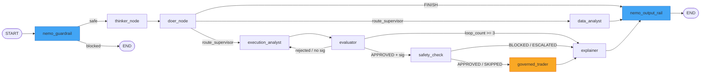
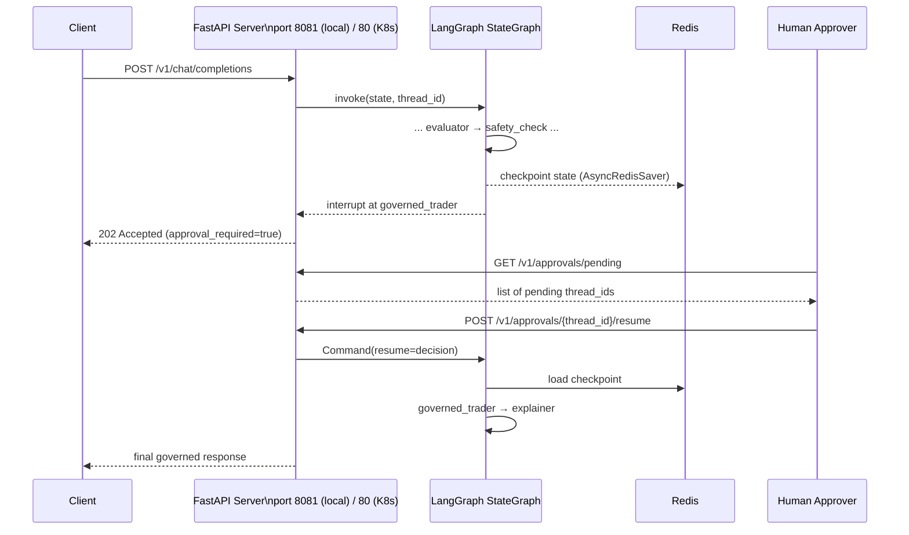

# 02 — System Architecture

| Field                | Value                                                                                                         |
| -------------------- | ------------------------------------------------------------------------------------------------------------- |
| **Document Version** | 2.0                                                                                                           |
| **Date**             | 2026-06-03                                                                                                    |
| **Classification**   | INTERNAL                                                                                                      |
| **Document Series**  | CAGE Technical Report                                                                                         |
| **Status**           | ACTIVE — v0.1.0 stable (GO — 2026-06-08; GKE deployment verified 2026-06-03)                                |
| **Reference**        | `docs/GATEWAY_ARCHITECTURE.md`, `docs/INFERENCE_GATEWAY_ARCHITECTURE.md`, `docs/NEURO_SYMBOLIC_GOVERNANCE.md` |

---

## 1. Architectural Overview

The **Cybernetic Governance Engine (CAGE)** is a distributed, multi-runtime system composed of five major subsystems that operate cooperatively to enforce real-time AI governance over a LangGraph-based financial advisory pipeline. Each subsystem has a discrete runtime boundary, a defined communication protocol, and a specific governance responsibility.

| #   | Subsystem                      | Root Path                         | Runtime                   | Port            |
| --- | ------------------------------ | --------------------------------- | ------------------------- | --------------- |
| 1   | **Governed Financial Advisor** | `src/governed_financial_advisor/` | Python / FastAPI          | 80 (K8s) / 8081 (local port-forward) |
| 2   | **Hybrid Inference Gateway**   | `src/gateway/`                    | Python / FastAPI + gRPC   | 8080            |
| 3   | **Compliance Bridge**          | `src/compliance_bridge/`          | Python / FastAPI SSE      | 3001 (internal) / 3002 (local port-forward) |
| 4   | **AgentSight UI**              | `src/agentsight-ui/`              | React / TypeScript / Vite | 5173            |
| 5   | **AgentSight eBPF DaemonSet**  | `deployment/agentsight/`          | Kernel / BPF              | N/A (DaemonSet) |
| 6   | **Vendor Integrations**        | `src/integrations/`               | Python (lazy-loaded)      | N/A (adapters)  |

All six subsystems are co-deployed within the `governance-stack` Kubernetes namespace on GKE and communicate over cluster-internal DNS. No subsystem exposes a public endpoint without traversing the Kubernetes `NetworkPolicy` boundary (9 objects, default-deny).

> **Vendor Isolation (v2.1.0):** Third-party compliance provider adapters (NexArt, TrustLayers) are architecturally isolated in `src/integrations/{vendor}/` to prevent vendor SDK code from leaking into the governance kernel. Infrastructure invariants (Cloud KMS, Redis) remain in `src/gateway/governance/`.

---

## 2. Top-Level Component Interaction Diagram

The diagram below captures the primary runtime request path from a user API call through the full governed inference and compliance pipeline.

```mermaid
flowchart TD
    User([User / Client]) -->|POST /v1/chat/completions| FastAPI[FastAPI Agent Server\nport 8081 (local) / 80 (K8s)]

    FastAPI -->|invoke graph| LangGraph[LangGraph StateGraph\n10 nodes]

    LangGraph -->|MCP tool calls| HybridGW[Hybrid Inference Gateway]
    LangGraph -->|AsyncRedisSaver checkpoint| Redis[(Redis\nCheckpoint + HITL State)]
    LangGraph -->|OSCAL audit events| CompBridge[Compliance Bridge\nport 3001 (internal) / 3002 (local)]

    HybridGW -->|mount /| MCPApp[FastMCP Tool Server\n7 tools]
    HybridGW -->|mount /inference| InfProxy[Inference Proxy\n5-tier pipeline]
    HybridGW -->|mount /governance| GovApp[Governance App]
    HybridGW -->|X-CAGE-Routing-Seal HMAC| GovMiddleware[Governance Middleware]

    InfProxy -->|deepseek model route| vLLM_R[vLLM Reasoning\nDeepSeek-R1-Distill-Llama-8B]
    InfProxy -->|default model route| vLLM_F[vLLM Fast\nQwen/Qwen2.5-1.5B-Instruct]

    GovApp --> SymGov[SymbolicGovernor\n7-tier pipeline]
    SymGov --> OPA[OPA Rego Engine\ntrade.governance]
    SymGov --> NeMo[NeMo Guardrails\nColang Rails]
    SymGov --> CBF[ControlBarrierFunction\nRedis WATCH/MULTI/EXEC]
    SymGov --> Consensus[ConsensusEngine\nasyncio critics]

    CompBridge -->|OTLP export| Langfuse[Langfuse SaaS\nDual-project OTLP]
    CompBridge -->|SSE fan-out| AgentSightUI[AgentSight UI\nport 5173]
    CompBridge -->|CronJob 6h| OSCAL[OSCAL Lula CronJob]

    eBPF[AgentSight eBPF DaemonSet\nKernel-level] -->|process events| AgentSightUI
```

### Component Interaction & Post-HITL Feedback Loop

The runtime lifecycle consists of a primary check path and an execution-time revalidation feedback loop:
1. **Pre-Trade Checking**: The user's request traverses the multi-agent planning layers, culminating in the `SymbolicGovernor` executing 6 active tiers (STPA, confidence, CBF, OPA, Consensus, and Causal Gatekeeper; Tier 3 SLM is deprecated).
2. **HITL Interruption**: If the trade passes the pre-trade check but requires human verification, execution is suspended and state is persisted in Redis.
3. **Execution-Time Feedback Loop**: Once the human reviewer submits approval via `/resume`, the `governed_trader` subgraph re-hydration node retrieves a fresh pricing sample and loops back to the `SymbolicGovernor` to re-run only the deterministic, continuous tiers (Tier 2 Control Barrier Function, and Tier 4 OPA Policy Engine).
4. **Final Actuation**: If both revalidation checks pass successfully, the transaction is committed via the trade execution actuator; otherwise, it is blocked, and a compensator rollback is initiated.

---

## 3. LangGraph StateGraph Design

### 3.1 Graph Assembly

The stateful agent graph is assembled by `create_graph(redis_url)` in `src/governed_financial_advisor/graph/graph.py`. The function constructs a `StateGraph` over the `AgentState` TypedDict, registers ten nodes, and wires conditional routing edges. The graph compiles with `interrupt_before=["governed_trader"]` to enable the HITL approval workflow described in Section 4.

### 3.2 Node Inventory

| Node                | Agent Module                        | Responsibility                                                                                    |
| ------------------- | ----------------------------------- | ------------------------------------------------------------------------------------------------- |
| `nemo_guardrail`    | `src/governed_financial_advisor/graph/nodes/guardrail_node.py`    | **Mandatory input rail (ADR 2026-03-09)**; NeMo + bypass-phrase detection; fail-closed; sets `guardrail_blocked` |
| `thinker_node`      | `src/governed_financial_advisor/graph/nodes/supervisor_node.py`   | Strategic reasoning via DeepSeek-R1; produces `reasoning_output`                                  |
| `doer_node`         | `src/governed_financial_advisor/graph/nodes/supervisor_node.py`   | Instruction decomposition; routes to specialist sub-agents                                        |
| `data_analyst`      | `src/governed_financial_advisor/agents/data_analyst/agent.py`      | Live market data fetch via `yfinance`; writes `data_analyst_ticker`                               |
| `execution_analyst` | `src/governed_financial_advisor/agents/execution_analyst/agent.py` | Structured `ExecutionPlan` synthesis; writes `execution_plan_output` (list of `PlanStep`)         |
| `evaluator`         | `src/governed_financial_advisor/agents/evaluator/agent.py`         | Audit verification; OPA policy check; NeMo output scan; writes `evaluation_result`, `opa_results` |
| `safety_check`      | `src/governed_financial_advisor/graph/nodes/safety_node.py`        | HMAC-SHA256 governance signature validation; writes `safety_status`. **Fix (2026-06-03):** `_extract_trade_payload()` now passes optional STPA-required fields (`drawdown`, `order_size`, `daily_vol`) through to the trade payload — required for UCA-5 check. |
| `governed_trader`   | `src/governed_financial_advisor/agents/governed_trader/agent.py`   | Final trade execution; HITL interrupt point; writes `execution_result`                            |
| `explainer`         | `src/governed_financial_advisor/agents/explainer/agent.py`         | Compliance narrative generation; produces human-readable audit summary                            |
| `nemo_output_rail`  | `src/governed_financial_advisor/graph/nodes/guardrail_node.py`    | **Mandatory output rail (ADR 2026-03-09b)**; NeMo PII masking + content safety; fail-closed; sets `output_rail_applied` |

**LangGraph Subgraph Nodes** — the `data_analyst` and `governed_trader` top-level nodes each delegate to a compiled LangGraph subgraph defined in `src/governed_financial_advisor/graph/subgraphs/`:

*Data Analyst Subgraph* ([`data_analyst_graph.py`](../../src/governed_financial_advisor/graph/subgraphs/data_analyst_graph.py)):

| Subgraph Node  | Responsibility |
| -------------- | -------------- |
| `thinker`      | DeepSeek-R1 reasoning — identifies the target ticker from conversation context |
| `doer`         | Llama 3.1 + dynamic MCP tool binding — translates reasoning into tool calls (`get_market_data`, `check_market_status`, `get_market_sentiment`) |
| `execute_tool` | Manual MCP tool executor — invokes the tool calls returned by `doer` |
| `reporter`     | Llama 3.1 — synthesizes raw market data into a structured verbal analysis report |

*Governed Trader Subgraph* ([`governed_trader_graph.py`](../../src/governed_financial_advisor/graph/subgraphs/governed_trader_graph.py)):

| Subgraph Node          | Responsibility |
| ---------------------- | -------------- |
| `approval`             | HITL approval gate — pauses execution pending human reviewer decision |
| `rejection`            | Terminal node for human-rejected trades |
| `post_hitl_rehydrate`  | **TOCTOU Remediation** — samples live market price via `yfinance` immediately after HITL resumption; computes drift vs. stale plan price |
| `post_hitl_revalidate` | **TOCTOU Remediation** — re-runs Tier 2 (CBF) and Tier 4 (OPA) against fresh market data; blocks if slippage exceeds reviewer's approved tolerance |
| `drift_blocked`        | Fail-closed terminal node — surfaces human-readable explanation when post-HITL re-validation blocks the trade |
| `executor`             | Llama 3.1 + `execute_trade_action` MCP tool — executes the approved trade plan |
| `tools`                | Manual MCP tool executor for the executor node's tool calls |

### 3.3 Routing Logic

Routing decisions are implemented as inline closures inside `create_graph()` in `src/governed_financial_advisor/graph/graph.py`:

- **`route_after_guardrail(state)`** — (line 63) Reads `state["guardrail_blocked"]`. If True, routes to `END` immediately (blocked input never reaches any agent). Otherwise proceeds to `thinker_node`.
- **`route_supervisor(state)`** — (line 86) Reads `state["next_step"]` (a `Literal` enum) and dispatches to the appropriate specialist node. If `next_step` is `"FINISH"` or `None`, routes through `nemo_output_rail` to `END`.
- **`check_safety_signature(state)`** — (line 98) Validates the HMAC-SHA256 governance signature stored in `state["governance_signature"]`. Routes `APPROVED` plans to `safety_check`, re-routes to `execution_analyst` if rejected, and enforces a hard loop cap (`loop_count >= 3` → `explainer`).
- **`route_after_safety(state)`** — (line 125) Terminal routing decision after the OPA pre-trade safety gate:
  - `APPROVED` or `SKIPPED` → routes to `governed_trader` subgraph (subject to HITL interrupt). On human approval, the execution path first enters `post_hitl_revalidate_node` for continuous state revalidation against Tier 2 and Tier 4 of the Symbolic Governor, before routing to the final executor node.
  - `BLOCKED` or `ESCALATED` → routes to `explainer` (trade is rejected; audit narrative is generated)

> **Note:** The file `src/governed_financial_advisor/graph/router.py` exists but contains only a legacy `risk_router()` function that is not used in the current graph assembly.



> **Mandatory Rails:** `nemo_guardrail` (blue, ADR 2026-03-09) is the mandatory first node — blocked input routes directly to `END` without any agent processing. `nemo_output_rail` (blue, ADR 2026-03-09b) is the mandatory final node — every non-blocked path routes through it before `END` for PII masking and content safety.
>
> **HITL Interrupt:** `governed_trader` (amber) is the graph interrupt point. Execution pauses here pending human approval before the trade is executed.

### 3.4 AgentState Schema

All inter-node communication is carried by a single `AgentState` TypedDict defined in `src/governed_financial_advisor/graph/state.py`. The full field inventory (25 fields):

| Field                      | Type                             | Description                                |
| -------------------------- | -------------------------------- | ------------------------------------------ |
| `messages`                 | `Annotated[list, add_messages]`  | LangChain message history (reducer-merged) |
| `next_step`                | `Literal[...]`                   | Routing enum; set by supervisor            |
| `risk_status`              | `Literal[...]`                   | UNKNOWN / APPROVED / REJECTED_REVISE       |
| `risk_feedback`            | `str \| None`                    | Risk loop feedback from evaluator          |
| `loop_count`               | `int \| None`                    | Recursion depth for safety breaker (cap 3) |
| `safety_status`            | `Literal[...]`                   | APPROVED / BLOCKED / ESCALATED / SKIPPED   |
| `governance_signature`     | `str \| None`                    | HMAC-SHA256 over execution plan            |
| `risk_attitude`            | `str \| None`                    | User-specified risk preference             |
| `investment_period`        | `str \| None`                    | Investment horizon                         |
| `reasoning_output`         | `str \| None`                    | DeepSeek-R1 chain-of-thought trace         |
| `execution_plan_output`    | `str \| dict \| None`            | Structured trade plan                      |
| `data_analyst_ticker`      | `str \| None`                    | Ticker symbol resolved by market agent     |
| `evaluation_result`        | `dict \| None`                   | Composite evaluator verdict                |
| `opa_results`              | `dict \| None`                   | OPA Rego policy evaluation result          |
| `execution_result`         | `dict \| None`                   | Trade execution receipt                    |
| `governance_summary`       | `str \| None`                    | Final auditor report for the UI            |
| `user_id`                  | `str`                            | Authenticated user identity                |
| `latency_stats`            | `dict \| None`                   | Per-node latency telemetry                 |
| `completed_transactions`   | `Annotated[list[LedgerEntry], add]` | Saga WAL — append-only transaction ledger |
| `approval_required`        | `bool`                           | HITL flag set by evaluator                 |
| `approval_decision`        | `Optional[dict]`                 | Human approval decision (structured dict)  |
| `hitl_expires_at`          | `Optional[str]`                  | TTL expiration timestamp for pending HITL state |
| `guardrail_blocked`        | `bool`                           | NeMo input rail gate (ADR 2026-03-09)      |
| `guardrail_reason`         | `str`                            | Reason for guardrail block                 |
| `output_rail_applied`      | `bool`                           | NeMo output rail tracking (ADR 2026-03-09b)|

### 3.5 Checkpointing Strategy

Graph state is persisted by `src/governed_financial_advisor/graph/checkpointer.py`:

- **Primary:** `AsyncRedisSaver` — asynchronous persistence to Redis; required for the HITL pause-and-resume pattern across HTTP request boundaries.
- **Fallback:** `MemorySaver` — in-process fallback activated when Redis is unavailable. When `MemorySaver` is active, an OpenTelemetry alert span is emitted to signal degraded durability to operators.

---

## 4. HITL Workflow

Human-in-the-Loop (HITL) trade approval is a first-class architectural feature, not an optional add-on. The workflow is implemented across the graph interrupt mechanism and the REST approval API exposed by `src/governed_financial_advisor/server.py`.



- **Interrupt point:** `interrupt_before=["governed_trader"]` — configured at graph compile time.
- **State persistence:** `AsyncRedisSaver` persists full `AgentState` keyed by `thread_id`.
- **Resume:** `POST /v1/approvals/{thread_id}/resume` injects `approval_decision` via LangGraph's `Command(resume=decision)` pattern, reloading state from Redis.
- **Pending list:** `GET /v1/approvals/pending` enumerates all thread IDs whose graphs are paused at the `governed_trader` interrupt node.

---

## 5. Hybrid Gateway Architecture

The Hybrid Inference Gateway is CAGE's central enforcement plane. It is structured as a single composition root (`src/gateway/server/hybrid_server.py`) that mounts three independent ASGI sub-applications under distinct path prefixes.

### 5.1 Mount Topology

| Mount Path    | Sub-Application  | Primary Role                                       |
| ------------- | ---------------- | -------------------------------------------------- |
| `/`           | `mcp_app`        | FastMCP tool server; 7 governance-aware tools      |
| `/inference`  | `inference_app`  | OpenAI-compatible inference proxy; 5-tier pipeline |
| `/governance` | `governance_app` | SymbolicGovernor endpoint                          |

### 5.2 Governance Middleware

`src/gateway/server/governance_middleware.py` wraps every `/tools/execute` call. It enforces the **X-CAGE-Routing-Seal** HMAC header: any tool invocation whose request does not carry a valid HMAC-SHA256 seal — signed with the shared governance key — is rejected before reaching the tool handler. This prevents tool calls from bypassing the governance pipeline by direct HTTP access.

The middleware exposes two governance endpoints under the `/governance` mount path:

| Endpoint | Method | Description |
| -------- | ------ | ----------- |
| `POST /governance/check` | POST | Internal dry-run governance check against a proposed tool call. Requires a valid `X-CAGE-Routing-Seal`. Body: `{"tool_name": str, "params": dict}`. Returns `APPROVED` or `REJECTED` with violations list. |
| `POST /governance/validate-action` | POST | **Unified governance validation for structured tool execution payloads.** Called by the GFA service instead of invoking OPA directly — the Single Choke Point for all tool-level governance decisions. Executes Tier 2 (CBF) and Tier 4 (OPA) re-validation. Propagates W3C `traceparent` context to link GFA spans to gateway child spans in Langfuse. Returns `verdict` (APPROVED\|DENIED), `violations`, `seal`, and `latency_ms`. |

### 5.3 MCP Tool Server

`src/gateway/server/mcp_tool_server.py` exposes six tools via the FastMCP protocol:

| Tool                          | Function                                              |
| ----------------------------- | ----------------------------------------------------- |
| `simulate_governance_check`   | Dry-run SymbolicGovernor verify (sim_mode only)       |
| `execute_trade_action`        | Execute financial trade under full governance         |
| `trigger_safety_intervention` | Lock system via Redis safety_violation flag           |
| `check_market_status`         | Check market symbol status                            |
| `get_market_sentiment`        | Retrieve market sentiment                             |
| `verify_content_safety`       | NeMo Guardrails text safety check                     |

### 5.4 Inference Proxy Pipeline

`src/gateway/server/inference_proxy.py` intercepts every `POST /v1/chat/completions` request and applies a strict 5-tier sequential pipeline before forwarding to vLLM:


- **Tier 1** — Aho-Corasick automaton scanning for 14 prohibited keywords; O(n) scan regardless of keyword count.
- **Tier 2** — NeMo Guardrails input verification via the `NeMoGuardrails` gRPC service.
- **Tier 3** — vLLM forward using a pooled `httpx` client (`max_connections=50`, `max_keepalive=20`).
- **Tier 4** — Response output filtering and PII masking via Microsoft Presidio (executed in-process as a custom action within NeMo Guardrails output rails).
- **Tier 5** — Server-Sent Events (SSE) streaming proxy for token-by-token client delivery.

**Model routing:** The proxy inspects the `model` field of the request body. Requests specifying a `deepseek` model variant are routed to `VLLM_REASONING_API_BASE`; all other requests are routed to `VLLM_FAST_API_BASE`.

| Model Variant | Backend                                                  | Use Case                                      |
| ------------- | -------------------------------------------------------- | --------------------------------------------- |
| `deepseek-*`  | `VLLM_REASONING_API_BASE` — DeepSeek-R1-Distill-Llama-8B | Chain-of-thought reasoning (thinker node)     |
| Default       | `VLLM_FAST_API_BASE` — Qwen/Qwen2.5-1.5B-Instruct        | Instruction following (doer, explainer nodes) |

---

## 6. Symbolic Governor 7-Tier Pipeline

The `SymbolicGovernor` class in `src/gateway/governance/symbolic_governor.py` is the neuro-symbolic enforcement core of CAGE. Its `_run_checks()` method executes the governance tiers in **strict sequential order**, with the exception of Steps 2 and 4 (CBF and OPA) which are fired **concurrently** via `asyncio.gather`. The pipeline is **fail-closed**: any active tier raising a validation error produces a `GovernanceError` and halts the pipeline. No partial approval is possible. Tier 3 (SLM Sidecar) is deprecated to optimize the latency budget.

```mermaid
flowchart TD
    Input([Governance Request]) --> T0[Tier 0\nSTPA UCA Validation\nSTPAValidator.validate]
    T0 --> T1["Tier 1\nSR 26-2 §IV.B Agentic Confidence\nconfidence_sufficient ≥ 0.95"]
    T1 --> T2[Tier 2\nControl Barrier Function\nRedis WATCH/MULTI/EXEC]
    T2 --> T3[Tier 3\nSLM (Deprecated / Bypassed)]
    T3 --> T4[Tier 4\nOPA Policy Evaluation\nCircuitBreaker - 5 failures/30s]
    T4 --> T5[Tier 5\nMulti-Agent Consensus\nasyncio critics]
    T5 --> Approved([APPROVED])

    T0 -->|GovernanceError| Blocked([BLOCKED])
    T1 -->|GovernanceError| Blocked
    T2 -->|GovernanceError| Blocked
    T3 -->|slm_available=false| T4
    T4 -->|GovernanceError| Blocked
    T5 -->|GovernanceError| Blocked
```

### 6.1 Tier Specifications

| Tier | Name                     | Implementation                                                           | Key Threshold                                                                      |
| ---- | ------------------------ | ------------------------------------------------------------------------ | ---------------------------------------------------------------------------------- |
| 0    | STPA UCA Validation      | `STPAValidator.validate()` in `src/gateway/governance/stpa_validator.py` | Thresholds from `src/gateway/governance/safety_params.json`                        |
| 1    | SR 26-2 §IV.B Agentic Confidence | Inline check in `_run_checks()`                                          | `confidence_sufficient ≥ 0.95`                                                     |
| 2    | Control Barrier Function | `ControlBarrierFunction` — Redis read-only `verify_action()` (concurrent with Tier 4) | `min_cash_balance=1000.0`, `gamma=0.5`                                             |
| 3    | SLM Sidecar (Deprecated) | Bypassed to optimize latency budget (runs permanently offline)             | N/A (0ms)                                                                          |
| 4    | OPA Policy               | `OPAClient` with `CircuitBreaker` (concurrent with Tier 2 via `asyncio.gather`) | 5 consecutive failures → 30s open-circuit recovery; 3000ms hard latency budget; `trade.governance` Rego bundle |
| 5    | Multi-Agent Consensus    | `ConsensusEngine` — parallel `asyncio` critic tasks                      | `consensus.threshold_usd=10000.0`                                                  |
| 6    | Causal Gatekeeper        | `causal_safety_check()` in `src/gateway/governance/causal_gatekeeper.py` | placebo p-value < 0.05 or placebo effect > 0.2                                      |

**Tier 2 (Control Barrier Function):** CBF's `verify_action()` is **read-only** — it does NOT modify Redis state at this stage. It verifies that executing the proposed trade will not violate the cash balance floor (`min_cash_balance=1000.0`). The `gamma=0.5` parameter controls the CBF decay coefficient. Steps 2 and 4 (CBF and OPA) are fired **simultaneously** via `asyncio.gather`. The TOCTOU race is closed by Step 3 (FiscalLimitGuard), NOT by making these sequential — this is intentional, correct design.

**Tier 4 (OPA Circuit Breaker):** The `CircuitBreaker` wrapping the `OPAClient` protects the governance pipeline from OPA service degradation. After 5 consecutive failures, the breaker opens for 30 seconds. During open-circuit state, all governance requests are rejected with `BLOCKED` — the system does not fall back to permissive defaults.

**Tier 6 (Causal Gatekeeper):** Microsoft DoWhy causal inference model validates world-model integrity. The gatekeeper checks if the estimated causal relations match empirical treatment effects via a Placebo Treatment Refuter. If a placebo treatment produces a statistically significant effect (p < 0.05 or placebo effect > 0.2), the model assumptions are deemed poisoned and the trade is blocked.

**Latency Mitigations (per-tier):** Each governance tier incorporates specific latency controls to keep the pipeline within the 200ms ISO-20022 SLA:
- **Tier 0** (STPA): Pure Python dict checks (<1ms)
- **Tier 1** (Confidence): Float comparison (<1ms)
- **Tier 2** (CBF): Redis `WATCH`/`MULTI`/`EXEC` atomic single-roundtrip (~5ms)
- **Tier 3** (SLM): Deprecated to optimize latency budget — permanently runs with `slm_available=false` sentinel injected into OPA payload (0ms overhead)
- **Tier 4** (OPA): `CircuitBreaker` with 1.0s hard timeout per request, 2000ms soft ceiling warning, 3000ms bankruptcy protocol → immediate DENY
- **Tier 5** (Consensus): `asyncio.gather()` parallel critic calls (Phase 4.4); background audit queue (`maxsize=1000`) for non-blocking post-execution logging
- **Tier 6** (Causal): 50 simulations; fail-open on `ImportError` (DoWhy optional)

For the full 14-mechanism latency mitigation analysis and latency budget breakdown, see [`08-DEPLOYMENT-INFRASTRUCTURE.md` §10](./08-DEPLOYMENT-INFRASTRUCTURE.md#latency-strategy).

### 6.2 Concurrency & Transaction Control (v0.1.0 Add-ons)

#### FiscalLimitGuard
To prevent concurrent multi-agent "race to the rail" limit depletion where multiple agents check the same remaining daily cap simultaneously, CAGE v0.1.0 enforces atomic limit pre-reservation via the `FiscalLimitGuard` class (`src/gateway/governance/fiscal_limit_guard.py`).
1. **Pre-Reservation (Step 3):** After concurrent CBF+OPA (Steps 2+4), the agent atomically reserves the trade amount in Redis using a `WATCH`/`MULTI`/`EXEC` optimistic lock transaction. This is the step that closes the TOCTOU race. Default daily cap: **$500,000 USD** (`FISCAL_DAILY_CAP_USD` env var). Cap is stored in **cents** for integer precision.
2. **TTL Safety:** Returns a `ReservationToken` with a **300s TTL**. If the agent node crashes before execution, the cap is automatically reclaimed. Fail-closed: if Redis is unavailable, the trade is blocked.
3. **Commit & Rollback:** On success, the spend is confirmed. On failure, the Saga compensating node releases the token back to Redis headroom.

#### LangGraph Saga Engine
To guarantee atomic transactional consistency across distributed, non-deterministic agent steps (e.g. trade execution vs cash debiting), CAGE implements a **LangGraph Saga Engine** (`src/gateway/governance/generated_saga_nodes.py`). 
*   **Write-Ahead Log (WAL):** Transitions are recorded inside state ledger entries.
*   **LIFO Rollback:** On tool failure, a series of idempotent compensating nodes are triggered in Last-In-First-Out order to reverse all completed actions.
*   **Ghost-State Recovery:** If a crash or OOM occurs mid-transaction, the engine reloads the graph checkpoint from Redis and escalates to `human_review` while emitting OTel rollback spans to comply with ISO 42001.

### 6.3 Multi-Jurisdiction Regional Compliance Profiles

The Symbolic Governor pipeline is region-aware. The `CAGE_DEPLOYMENT_REGION` environment variable (`US_FED`, `EU_ECB`, or `APAC_MAS`) controls three runtime behaviors:

1. **Compliance Control Mappings:** The `ControlRegistry` (in `src/gateway/governance/constants.py`) loads `config/compliance/{REGION}_BASELINE.json` at startup, providing region-specific primary framework citations, co-framework references, and legacy citation metadata for all governance controls. Example: `CTRL_MRM_004` cites SR 26-2 §IV in `US_FED` but `EBA/GL/2023/02` in `EU_ECB`.

2. **Governance Threshold Calibration:** Region-specific threshold files (`config/thresholds/{REGION}_BASELINE.json`) override default governance parameters. The EU profile is consistently stricter — confidence minimum 0.97 (vs US 0.95), drawdown limit 4% (vs US 5%), latency SLA 150ms (vs US 200ms), and consensus threshold $7,500 (vs US $10,000).

3. **EU-Only Step 8 (FRIA Attestation):** When `CAGE_DEPLOYMENT_REGION=EU_ECB`, the governor executes an additional non-blocking Step 8 after Tier 6, stamping a Fundamental Rights Impact Assessment attestation (`CTRL_FRIA_006`, EU AI Act Art. 29a) into the OTel span attributes. This step is absent in `US_FED` and `APAC_MAS` deployments. The `ControlRegistry.get_mapping_safe()` method handles this gracefully — returning `None` for controls not present in the active region.

| Region Code | Target Jurisdiction | Compliance Profile | Active Frameworks | Key Threshold Differences |
| ----------- | ------------------- | --------------------------------------------------- | ----- | ---------- |
| `US_FED`    | United States       | `config/compliance/US_FED_BASELINE.json` (5 ctrls)  | SR 26-2, NIST SP 800-53, ISO 42001 | Baseline thresholds |
| `EU_ECB`    | European Union      | `config/compliance/EU_ECB_BASELINE.json` (6 ctrls)  | EU AI Act, DORA, GDPR, EBA/GL/2023/02, ISO 42001 | Stricter across all tiers + FRIA |
| `APAC_MAS`  | Singapore / APAC    | `config/compliance/APAC_MAS_BASELINE.json` (5 ctrls) | MAS FEAT, MAS TRM Guidelines, ISO 42001 | $5k consensus threshold |

---

## 7. gRPC Interface

CAGE exposes two gRPC service definitions for inter-service communication within the cluster.

### 7.1 Gateway Service

**Proto:** `src/gateway/protos/gateway.proto`

```
service Gateway {
  rpc Chat(ChatRequest) returns (stream ChatResponse);
  rpc ExecuteTool(ToolRequest) returns (ToolResponse);
}
```

- `Chat` — bidirectional streaming RPC; streams `ChatResponse` tokens from the inference pipeline back to the caller.
- `ExecuteTool` — unary RPC; executes a named MCP tool with provided arguments and returns the tool result.

### 7.2 NeMo Guardrails Service

**Proto:** `src/gateway/protos/nemo.proto`

```
service NeMoGuardrails {
  rpc Verify(VerifyRequest) returns (VerifyResponse);
}
```

- `Verify` — unary RPC; submits a prompt or completion for NeMo Guardrails verification. Used by both the Inference Proxy (Tier 2 input scan) and the evaluator node for output verification.

---

## 8. Authorization Boundary

CAGE's authorization boundary is defined by the `governance-stack` Kubernetes namespace deployed on GKE.

### 8.1 Network Isolation

Nine `NetworkPolicy` objects implement a default-deny posture within the namespace. All intra-cluster traffic is explicitly allowlisted by policy. Intra-cluster mTLS between governance pipeline services is enforced via Linkerd + Cilium L7 (POAM-007 — **RESOLVED** 2026-05-17).

### 8.2 External Interconnections

| External System        | Protocol                            | Data Classification              | ISA Status              |
| ---------------------- | ----------------------------------- | -------------------------------- | ----------------------- |
| GCS Artifact Bucket    | GCP API (HTTPS)                     | OSCAL / Audit Evidence           | Inherited (GCP FedRAMP) |
| MinIO (model weights)  | HTTPS/REST                          | Model Binaries                   | Under evaluation        |
| Langfuse SaaS          | HTTPS/OTLP                          | Inference Traces (potential PII) | **ISA Required**        |
| yfinance / Market Data | HTTPS/REST                          | Financial Market Data            | **ISA Required**        |

> **Note:** GCP Secret Manager has been **removed** as an external dependency (ADR). Secrets are now delivered exclusively via Kubernetes `Secret` objects provisioned by Terraform; no runtime GCP Secret Manager dependency exists.

---

## 9. Observability Architecture

### 9.1 OpenTelemetry

> **⚠️ Deprecation (2026-05-31):** The standalone OpenTelemetry Collector (`opentelemetry-collector-contrib`) has been deprecated and removed from the deployment. Services now export OTLP traces directly to **Langfuse's integrated OTLP ingestion endpoint**, eliminating the standalone collector as an intermediary hop.

All services emit traces via OTLP/HTTP to Langfuse's native OTLP endpoint (Langfuse v3 exposes `/api/public/otel/v1/traces`). The `opentelemetry-sdk`, `opentelemetry-exporter-otlp-proto-grpc`, and instrumentation libraries remain in use — only the standalone collector sidecar has been removed.

**Sampling configuration:**

- Default: **1% sampling rate** (cost control for high-volume inference spans)
- Governance spans: **100% sampling rate** (all governance decisions are fully traced for audit purposes)

**Cross-service trace propagation:** W3C `traceparent` headers are injected across the MCP SSE transport boundary by `patch_mcp_tools()` in `src/gateway/observability/mcp_tracing.py`. This ensures a single distributed trace spans from the initial HTTP request through the LangGraph node execution, MCP tool calls, and vLLM inference.

### 9.2 Langfuse Dual-Project Setup

CAGE uses two separate Langfuse projects for observability separation:

| Project                 | Purpose                                            |
| ----------------------- | -------------------------------------------------- |
| **Application Metrics** | Inference latency, token counts, model performance |
| **Compliance**          | Governance verdicts, OPA results, audit evidence   |

Both projects receive OTLP exports via Langfuse's integrated OTLP ingestion endpoint. PII-bearing trace payloads represent a risk before a Data Processing Agreement and ISA are in place (see Section 8.2).

The application project credentials (`LANGFUSE_PUBLIC_KEY` / `LANGFUSE_SECRET_KEY`) are mounted in the governed-financial-advisor and compliance-bridge pods. The compliance project credentials (`LANGFUSE_COMPLIANCE_PUBLIC_KEY` / `LANGFUSE_COMPLIANCE_SECRET_KEY`) are mounted **only** in the compliance-bridge pod. This ensures no workload pod can write to or tamper with the compliance audit evidence trail.

For the full design rationale, threat model, implementation map, and verification procedures, see [`docs/architecture/DUAL_PROJECT_ARCHITECTURE.md`](../architecture/DUAL_PROJECT_ARCHITECTURE.md).

### 9.3 GovernanceEventBus

`src/compliance_bridge/sse_events.py` implements `GovernanceEventBus` — an `asyncio.Queue(maxsize=128)` fan-out bus that distributes governance events to all connected SSE subscribers.

**Event types published to the bus:**

| Event Type             | Trigger                                                          |
| ---------------------- | ---------------------------------------------------------------- |
| `AUDIT_FINDING`        | Compliance Bridge detects a control finding during OSCAL audit   |
| `GOVERNANCE_VIOLATION` | SymbolicGovernor or evaluator node raises a governance rejection |

### 9.4 AgentSight UI (Phase 1 — v0.1.0-rc.1)

`src/agentsight-ui/src/KernelDashboard.tsx` is the primary compliance operator interface. It connects to `{BACKEND_URL}/v1/events/stream` as an SSE consumer and renders real-time governance signals.

**Dashboard configuration:**

| Parameter             | Value                             |
| --------------------- | --------------------------------- |
| Alert threshold       | `ALERT_THRESHOLD=0.8`             |
| Monitored control IDs | `A.5.2`, `A.5.3`, `A.9.2`, `SC-4` |

**Phase 1 operator controls (v0.1.0-rc.1):**

| Feature | Implementation | Details |
|---------|---------------|---------|
| **Max Slippage % Slider** | `maxSlippagePct` state (default 2.0); range input 0–10%, step 0.1 | Persisted via `POST /api/governance/thresholds` on `mouseup`/`touchend`; `slippageSaving` spinner shown during save |
| **ΔP Price Drift Badge** | `priceDrift(fresh, stale)` helper; `.drift-badge` CSS class | Green < 1%, Yellow 1–3%, Red > 3% with `drift-pulse` keyframe animation |
| **HITL TTL Countdown** | `formatCountdown(totalSeconds)` helper; 1-second `setInterval` tick via `now` state | Displays `MM:SS` remaining; `.hitl-ttl-expired` class + `.telemetry-item.hitl-expired` (opacity 0.45, grayscale 0.6) when expired |

New `TelemetryItem` / `GovernanceEvent` interface fields propagated from SSE stream: `hitl_expires_at?: string | null`, `price_fresh?: number | null`, `price_stale?: number | null`.

### 9.5 AgentSight eBPF DaemonSet

The `deployment/agentsight/` DaemonSet deploys a kernel-level BPF program targeting `python3` processes within the `governance-stack` namespace.

**Instrumentation points:**

- OpenSSL `uprobes` — intercepts TLS handshake events at the user-space library boundary
- System call hooks — captures `execve`, `open`, `connect` syscalls from governed processes

**Current status:** The DaemonSet outputs events to console only. Integration with the AgentSight UI event bus is a roadmap item. Kernel-level telemetry feeds `src/agentsight-ui/src/KernelDashboard.tsx` for anomaly display.

---

## 10. Langfuse Webhook Cybernetic Loop

The system that gives CAGE its name — a **cybernetic** (self-correcting) governance engine — is the closed-loop feedback path from Langfuse telemetry scores through Kubeflow Pipelines back to live NeMo Guardrails hot-reload.

> **v0.1.0 Note:** The NeMo refinement step in this loop requires human approval before executing remediation actions. Specifically, the KFP pipeline's Step 3 calls `POST /v1/nemo/apply-refinement`, which applies a hot-reload of the NeMo rails configuration — but the *propose-refinement* → *human approval* → *apply-refinement* sequence is enforced for any model-initiated refinement (AARM-V8 neutralization). Fully autonomous correction without human approval in the low-latency path is planned for v2.1.0 (POAM-031).

> **Naming note:** The KFP pipeline is registered as `green-stack-governance-loop` and the pipeline file is `green_stack_pipeline.py`. "Green-Stack Pipeline" is the original implementation name; "Cybernetic Governance Loop" is the architectural concept it implements. They refer to the same system — the same code, the same endpoints, the same trigger flow. This document uses the canonical term **Cybernetic Governance Loop**.

### 10.1 Architecture Overview

```
Langfuse score event (score-created)
        │
        ▼
POST /v1/webhooks/langfuse   ← governed-financial-advisor (FastAPI)
        │
        ├─ Anti-flapping guards (R-LOOP-6 / R-LOOP-7)
        │
        ▼
_submit_kfp_run()            ← Kubeflow Pipelines SDK
        │
        ├─ Step 1: evaluate_governance_metrics (Compliance Bridge)
        ├─ Step 2: verdict check (PASS / FAIL)
        └─ Step 3: trigger_nemo_refinement (POST /v1/nemo/apply-refinement)
                        │
                        ▼
               NeMo rails hot-reload (in-process singleton swap)
```

The full cybernetic loop is: **Langfuse score event → webhook → KFP pipeline → evaluate metrics → apply hot-reload** — no human in the low-latency path.

### 10.2 Langfuse Webhook Configuration

To activate the webhook in Langfuse:

**Settings → Webhooks → Add:**

| Field        | Value |
| ------------ | ----- |
| URL          | `https://<governed-financial-advisor>/v1/webhooks/langfuse` |
| Event filter | `score-created` |

Two env vars (with defaults) control the watched score:

| Var | Default | Purpose |
| --- | ------- | ------- |
| `LANGFUSE_WATCH_SCORE_NAME` | `iso_42001_safety_rate` | Score name to watch for threshold breaches |
| `NEMO_SAFETY_THRESHOLD` | `0.95` | Value below which the refinement loop fires |

Source: [`src/governed_financial_advisor/server.py`](../../src/governed_financial_advisor/server.py) (line 772)

### 10.3 Anti-Flapping Design

Two guards run in sequence before `_submit_kfp_run()` is ever called:

```
score-created event
  │
  ├─ type != "score-created"?  → status: ignored   (no retry)
  ├─ name != watched score?    → status: ignored
  ├─ value >= threshold?       → status: threshold_ok
  │
  ├─ sample_size present AND < 10?  → status: deferred   (R-LOOP-7)
  │
  ├─ monotonic_now - last_triggered < 300s?  → status: cooldown   (R-LOOP-6)
  │                                            + seconds_remaining in response
  │
  └─ ARM CLOCK → _submit_kfp_run()  → status: triggered
```

#### R-LOOP-6: Cooldown Gate

After a KFP run is accepted, all subsequent webhook triggers are rejected for `REFINEMENT_COOLDOWN_SECONDS` (default: 300s). This prevents rapid-fire hot-reloads during noisy score bursts (policy flapping / thundering-herd into the inference pod).

#### R-LOOP-7: Minimum-Sample Guard

The score event payload may carry a `sample_size` field in `data`. If present and below `REFINEMENT_MIN_SAMPLES` (default: 10), the trigger is deferred — a single low-scoring trace during a quiet window is not statistically significant. When the field is absent, the guard is skipped.

#### Clock-Arming Pattern

`_last_refinement_triggered_at = now` is set **before** `_submit_kfp_run()` awaits the KFP HTTP call. In asyncio's cooperative model this is effectively atomic — any concurrent webhook event that becomes runnable while the KFP HTTP call is in-flight will see the updated timestamp and be gated by the cooldown check.

### 10.4 Tuning Environment Variables

| Var | Default | Notes |
| --- | ------- | ----- |
| `REFINEMENT_COOLDOWN_SECONDS` | `300` | 5 min — tune based on how long a KFP run + hot-reload takes |
| `REFINEMENT_MIN_SAMPLES` | `10` | Langfuse must include `data.sample_size`; guard skipped if absent |
| `NEMO_SAFETY_THRESHOLD` | `0.95` | ISO 42001 safety rate below which the loop fires |
| `LANGFUSE_WATCH_SCORE_NAME` | `iso_42001_safety_rate` | Score name filter for incoming webhooks |
| `KFP_ENDPOINT` | (empty) | Kubeflow Pipelines API server; if unset, degrades to `dry_run` |

All values are read at module load time; set env vars before pod startup.

### 10.5 KFP Governance Pipeline

The three-stage KFP pipeline is defined in [`src/governed_financial_advisor/pipelines/green_stack_pipeline.py`](../../src/governed_financial_advisor/pipelines/green_stack_pipeline.py):

| Stage | KFP Component | Action |
| ----- | ------------- | ------ |
| 1 | `evaluate_governance_metrics` | Queries Compliance Bridge for windowed safety scores per ISO 42001 control |
| 2 | Verdict gate | Checks PASS/FAIL from the evaluation |
| 3 | `trigger_nemo_refinement` | On FAIL, calls `POST /v1/nemo/apply-refinement` on the governed-financial-advisor pod |

### 10.6 NeMo Hot-Reload Endpoint

`POST /v1/nemo/apply-refinement` ([server.py line 668](../../src/governed_financial_advisor/server.py)) rebuilds the global `rails` singleton from the current `config/rails/` directory on disk. If the reload fails (e.g. malformed Colang), the existing singleton is preserved and the error is surfaced. The change takes effect immediately without restarting the pod.

### 10.7 OTel Span Attributes

The `seconds_remaining` field in cooldown responses is also emitted as an OTel span attribute, so operators can monitor the gate state in Langfuse without additional instrumentation:

| Span Attribute | Value |
| -------------- | ----- |
| `ai.webhook.langfuse.cooldown_active` | `true` / `false` |
| `ai.webhook.langfuse.cooldown_seconds_remaining` | Remaining seconds in cooldown window |
| `ai.webhook.langfuse.score_name` | Watched score name |
| `ai.webhook.langfuse.score_value` | Numeric score value that triggered the loop |

On threshold breach, a `langfuse.webhook.threshold_breach` OTel event is emitted with full context (score name, value, threshold, cooldown seconds, sample size).

---

