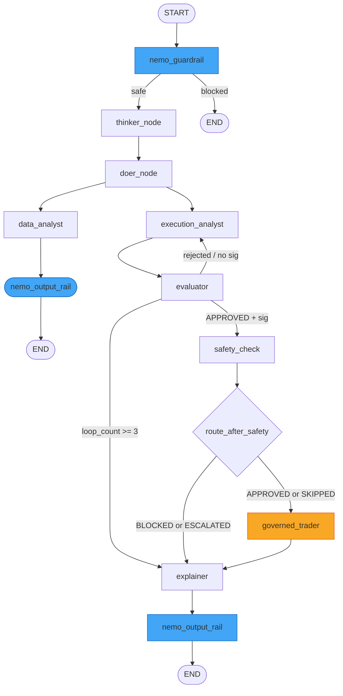

# 04 — Multi-Agent System Design

| Field                | Value                                                                             |
| -------------------- | --------------------------------------------------------------------------------- |
| **Document Version** | 3.0                                                                               |
| **Date**             | 2026-08-16                                                                        |
| **Classification**   | INTERNAL                                                                          |
| **Document Series**  | CAGE Technical Report                                                             |
| **Status**           | ACTIVE — v3.0.0 stable (GKE deployment verified; 2,741 passed, 0 failed, 182 skipped; 75.12% coverage) |
| **Reference**        | `src/governed_financial_advisor/graph/`, `src/governed_financial_advisor/agents/` |

---

## 1. Agent Orchestration Philosophy

> **v2.1.0**: The Governed Financial Advisor (`src/governed_financial_advisor/`) is the primary multi-agent reference implementation. It demonstrates the full CAGE governance stack applied to a realistic financial advisory workflow. The LangGraph harness (`src/gateway/governance/langgraph_harness/`) provides the node-factory pattern used to compose governance checks into the graph. NeMo Guardrails (`src/gateway/governance/nemo/`) enforces CBRN and PII rails as typed LangGraph nodes. OPA policy evaluation (`src/governed_financial_advisor/governance/policy/trade_governance.rego`) enforces role-based trade authorization at Tier 4.


CAGE composes its multi-agent pipeline using LangGraph's `StateGraph`, producing a deterministic, fully auditable execution sequence. Every agent carries a single, well-defined responsibility; no agent performs work outside its declared scope. All inter-agent communication occurs through a shared, strongly typed `AgentState` TypedDict defined in `src/governed_financial_advisor/graph/state.py` — agents read fields they need and write only the fields they own.

Governance checks are not advisory: they gate every state transition before execution can reach `governed_trader`. The pipeline is structured so that thinker/doer reasoning, data acquisition, plan generation, evaluation, and safety validation must all complete successfully before a trade instruction is issued, with human approval required as the final gate. This architecture ensures no path exists from user instruction to trade execution that bypasses policy enforcement.

### 1.1 Primary Regulatory Framework: SR 26-2 (Federal Reserve, April 17, 2026)

The agent system is governed under **SR 26-2** — the Federal Reserve's supervisory guidance on Agentic AI Risk Management (issued April 17, 2026) — as the primary agentic AI governance framework for `US_FED` deployments. SR 26-2 establishes model risk management requirements specifically for autonomous AI agents operating in financial services, including:

- **§IV.B Agentic Confidence Requirement**: Minimum confidence threshold of 0.95 before autonomous execution (enforced at Tier 1 of the SymbolicGovernor)
- **§IV MRM Compliance**: Model risk management controls mapped to `CTRL_MRM_004` in the US_FED compliance baseline
- **Agentic Scope**: SR 26-2 Footnote 3 explicitly excludes agentic AI from traditional SR 11-7 MRM scope; CAGE is governed under ISO 42001 + SR 26-2 jointly

### 1.2 Agent Scope (governed_financial_advisor_v1)

| Attribute | Value |
| --------- | ----- |
| **Agent ID** | `governed_financial_advisor_v1` |
| **Version** | v1.2.0 |
| **Tier** | Tier-1 High Exposure |
| **Max Single Trade** | $10,000 USD |
| **Max Daily Cap** | $500,000 USD |
| **HITL Triggers** | Trade > $10,000 USD or `risk_score` > 0.7 |
| **Prohibited Actions** | BTC, `direct_account_withdrawal`, `parameter_override`, `guardrail_bypass` |
| **Allowed Asset Classes** | Equities, fixed income, ETF, bonds |

---

## 2. Agent Inventory

| Agent                   | File                                 | Model                                        | Framework                                      | Primary Output                                   |
| ----------------------- | ------------------------------------ | -------------------------------------------- | ---------------------------------------------- | ------------------------------------------------ |
| `thinker_node`          | `src/governed_financial_advisor/graph/nodes/supervisor_node.py`  | `DeepSeek-R1-Distill-Llama-8B`               | LangGraph node                                 | `reasoning_output`                               |
| `doer_node`             | `src/governed_financial_advisor/graph/nodes/supervisor_node.py`  | `MODEL_FAST`                                 | LangGraph node                                 | Decomposed instructions                          |
| `DataAnalystAgent`      | `src/governed_financial_advisor/agents/data_analyst/agent.py`       | yfinance (no LLM)                            | yfinance direct                                | `data_analyst_ticker`; price history; top 3 news |
| `ExecutionAnalystAgent` | `src/governed_financial_advisor/agents/execution_analyst/agent.py`  | `MODEL_REASONING`; guided JSON               | `ChatOpenAI` on `GATEWAY_API_BASE`             | `ExecutionPlan` (PlanStep list)                  |
| `EvaluatorAgent`        | `src/governed_financial_advisor/agents/evaluator/agent.py`          | `Qwen/Qwen2.5-1.5B-Instruct` via `VLLM_FAST`  | `create_tool_calling_agent`; 5 async MCP tools | `evaluation_result`, `opa_results`               |
| `ExplainerAgent`        | `src/governed_financial_advisor/agents/explainer/agent.py`          | `MODEL_FAST`                                 | LangGraph node                                 | Compliance narrative                             |
| `GovernedTrader`        | `src/governed_financial_advisor/agents/governed_trader/agent.py`    | `MODEL_FAST` (execution)                     | LangGraph node; HITL interrupt point           | `execution_result`                               |
| `RiskAnalystAgent`      | `src/governed_financial_advisor/agents/risk_analyst/agent.py`       | STAMP hazards from GCS; fallback H-1/H-2/H-3 | LangGraph node                                 | `ProposedUCA` structs                            |
| `FinancialAdvisor`      | `src/governed_financial_advisor/agents/financial_advisor/prompt.py` | `MODEL_REASONING`                            | Prompt template only                           | Advisor framing prompt                           |

> **Note (2026-03-15 refactoring — ✅ COMPLETED):** The legacy `src/agents/` shim directory (and all other shim/deprecated directories — `src/evaluator_agent/`, `src/graph/`, `src/governance/`, `src/pipelines/`, `src/demo/`) have been removed. All agents now have a single canonical location in `src/governed_financial_advisor/agents/`. The evaluator tooling (`EvaluatorAuditor`, `AgentBeatsSimulator`) moved to `src/governed_financial_advisor/agents/evaluator/`. Import paths follow the pattern `from src.governed_financial_advisor.agents.<agent_name>.agent import <AgentClass>`.

---

## 3. AgentState TypedDict

All graph nodes share a single state object defined in `src/governed_financial_advisor/graph/state.py`. The TypedDict has **25 fields**:

| Field                   | Type / Notes                                       | Owner(s)                      |
| ----------------------- | -------------------------------------------------- | ----------------------------- |
| `messages`              | `Annotated[list, add_messages]` — conversation history | All nodes                     |
| `next_step`             | `Literal` enum — routing signal                    | `doer_node`, router functions |
| `risk_status`           | Risk assessment outcome (UNKNOWN / APPROVED / REJECTED_REVISE) | `EvaluatorAgent`              |
| `risk_feedback`         | Risk loop feedback text from evaluator             | `EvaluatorAgent`              |
| `loop_count`            | Recursion depth counter (safety breaker cap: 3)    | `execution_analyst_node`      |
| `safety_status`         | NeMo Guardrails / OPA combined status              | `EvaluatorAgent`              |
| `governance_signature`  | HMAC-SHA256 signature over `execution_plan_output` | `EvaluatorAgent`              |
| `risk_attitude`         | User-declared risk tolerance                       | Input                         |
| `investment_period`     | User-declared investment horizon                   | Input                         |
| `reasoning_output`      | DeepSeek chain-of-thought text                     | `thinker_node`                |
| `execution_plan_output` | Serialized `ExecutionPlan` (JSON)                  | `ExecutionAnalystAgent`       |
| `data_analyst_ticker`   | Resolved ticker symbol + market data               | `DataAnalystAgent`            |
| `evaluation_result`     | Structured evaluation verdict                      | `EvaluatorAgent`              |
| `opa_results`           | OPA policy evaluation results                      | `EvaluatorAgent`              |
| `execution_result`      | Trade execution outcome                            | `GovernedTrader`              |
| `governance_summary`    | Final auditor report for the UI                    | `ExplainerAgent`              |
| `user_id`               | Authenticated user identifier                      | Input                         |
| `latency_stats`         | Per-node timing dictionary                         | All nodes (append)            |
| `completed_transactions`| `Annotated[list[LedgerEntry], add]` — Saga WAL     | `GovernedTrader`              |
| `approval_required`     | Boolean — whether HITL gate was triggered          | `approval_node`               |
| `approval_decision`     | `Optional[dict]` — structured human decision       | HITL resume endpoint          |
| `hitl_expires_at`       | `str \| None` — TTL expiration timestamp for pending state | `approval_node`          |
| `guardrail_blocked`     | Boolean — NeMo input rail gate (ADR 2026-03-09)    | `nemo_guardrail`              |
| `guardrail_reason`      | Reason for NeMo input rail block                   | `nemo_guardrail`              |
| `output_rail_applied`   | Boolean — NeMo output rail tracking (ADR 2026-03-09b) | `nemo_output_rail`         |

### ExecutionPlan Pydantic Schema

To mitigate Time-Of-Check to Time-Of-Use (TOCTOU) vulnerabilities, the `ExecutionPlan` Pydantic model (defined in `src/governed_financial_advisor/agents/execution_analyst/agent.py`) has been expanded to support slippage bounds and execution limits:

- **`max_slippage_pct` (float)**: The maximum allowable percentage price drift between the check-time and execution-time quotes (default: `2.0`).
- **`limit_price` (Optional[float])**: The maximum or minimum boundary price at which the trade is permitted to execute.

While the `ExecutionAnalystAgent` designs the structural steps of the trade, the **`EvaluatorAgent` is responsible for populating and refining these fields** based on asset volatility and current market regimes, ensuring that safety envelopes are dynamically sized before graph suspension.

---

## 4. Graph Topology & Routing

The `StateGraph` is assembled in `src/governed_financial_advisor/graph/graph.py` via the `create_graph(redis_url)` factory function. Ten named nodes are registered; conditional edges route execution based on runtime state values.



> **Mandatory NeMo Rails (ADR 2026-03-09, 2026-03-09b):** `nemo_guardrail` (blue) is the mandatory first node — all user input is validated before any agent processing. `nemo_output_rail` (blue) is the mandatory final node on every non-blocked path — all agent output is scanned for PII and content safety before reaching the user. Both are fail-closed.

### Routing Functions

All routing functions are **inline closures** inside `create_graph()` in `src/governed_financial_advisor/graph/graph.py`:

**`route_after_guardrail(state)`** (line 63) reads `state["guardrail_blocked"]`. If True, routes immediately to `END` — no agent processes blocked input. Otherwise proceeds to `thinker_node`.

**`route_supervisor(state)`** (line 86) reads `state["next_step"]` — a `Literal` enum value — to determine early-exit paths. This allows `doer_node` to short-circuit the pipeline if the user intent cannot be decomposed into a valid investment instruction. `FINISH` or `None` routes through `nemo_output_rail` to `END`.

**`check_safety_signature(state)`** (line 98) is invoked at the `evaluator` node output. It validates the HMAC-SHA256 governance signature stored in `state["governance_signature"]` against `state["execution_plan_output"]`. A signature mismatch re-routes to `execution_analyst` for re-planning. A hard loop cap of `loop_count >= 3` routes to `explainer` to prevent infinite re-planning cycles.

**`route_after_safety(state)`** (line 125) reads `state["safety_status"]` and dispatches:

- `APPROVED` or `SKIPPED` → `governed_trader` (subject to HITL interrupt)
- `BLOCKED` or `ESCALATED` → `explainer` (compliance narrative generated; no trade executed)

> **Note:** The file `src/governed_financial_advisor/graph/router.py` exists but contains only a legacy `risk_router()` function that is not used in the current graph assembly.

---

## 5. Subgraph Designs

### Data Analyst Subgraph

Defined in `src/governed_financial_advisor/graph/subgraphs/data_analyst_graph.py`, this subgraph implements a market data micro-pipeline:

1. **Ticker Extraction** — parses the user intent from `messages` to resolve the ticker symbol
2. **yfinance Fetch** — retrieves 1-month OHLCV price history via the `yfinance` library (no LLM call)
3. **Latest Close** — extracts the most recent closing price for downstream plan generation
4. **Top 3 News** — retrieves the three most recent news items associated with the ticker

All results are written to `state["data_analyst_ticker"]` as a structured dict consumed by `ExecutionAnalystAgent`.

### Governed Trader Subgraph

Defined in `src/governed_financial_advisor/graph/subgraphs/governed_trader_graph.py`, this subgraph executes only after HITL approval:

1. **Continuous State Revalidation (`post_hitl_revalidate_node`)**: Fetches fresh, real-time market data to re-evaluate environmental variables. It computes the active price drift from the check-time quoted price, and verifies that the drift is $\le$ `max_slippage_pct`. To completely close the TOCTOU gap, this node selectively re-runs the trade proposal through Tier 2 (Control Barrier Function) and Tier 4 (OPA Policy Engine) of the `SymbolicGovernor` utilizing the fresh price before proceeding.
2. **Signature Re-validation** — re-checks `governance_signature` against `execution_plan_output` immediately before execution
3. **Trade Dispatch** — calls `src/governed_financial_advisor/tools/trades.py` to issue the governed trade instruction
4. **Result Recording** — writes `execution_result` to state for downstream `ExplainerAgent` consumption

The subgraph is structured so that no trade call can be made without successfully passing the continuous revalidation checks and verifying a valid governance signature in state at execution time.

---

## 5a. DEFER Queue and Context Accumulator (v2.0.0)

### DEFER State Machine (AARM-V7)

The agent system extends the governance tri-state decision (`ALLOW | DENY | MANUAL_REVIEW`) to **four states** by introducing `DEFER`. The three-zone confidence model routes requests based on confidence score:

| Confidence Score | Decision | Routing |
| ---------------- | -------- | ------- |
| ≥ 0.95 | `ALLOW` / `DENY` | Autonomous clearance |
| 0.70 – 0.95 | **`DEFER`** | Automated data-hydration loop — context parked in Redis db=1 with 4-hour TTL; resolved via `POST /v1/defer/{id}/inject` (automated) or `POST /v1/defer/{id}/escalate` (HITL) |
| < 0.70 | `DENY` | Confidence-Starvation Boundary — request blocked |

DEFER tokens are stored in **Redis `db=1`** with `noeviction` policy — the system blocks on OOM rather than silently dropping execution contexts. Default TTL: 4 hours before stale escalation. Source: [`src/gateway/governance/defer_queue.py`](../../src/gateway/governance/defer_queue.py).

### Context Accumulator (AARM-V1)

The **SHA-256 hash-chained Context Accumulator** (`src/compliance_bridge/context_accumulator.py`) seals audit evidence against retroactive tampering or Memory Poisoning attacks. Every emitted `OscalFinding` is chained cryptographically to its predecessor:

```
record_hash_n = SHA-256(prev_hash_{n-1} || content_json_n)
```

Each audit execution is capped by a `CHAIN_SEALED` sentinel. The compliance API validates `chain_root`, `chain_length`, and `chain_integrity_valid` on all reads, satisfying **ISO 42001 Annex A.5.3** evidence logging controls and neutralizing **AARM-V1 Memory Poisoning**.

### External Normative Provider with Adaptive FRIA Gating

The **External Normative Provider** (`src/gateway/governance/normative_provider.py`) implements Tier 6b of the SymbolicGovernor — an adaptive FRIA gate that invokes external normative providers based on confidence score. The three-zone model maps to the FRIA/Normative Provider as follows:

| Confidence Range | Behavior |
| ---------------- | -------- |
| ≥ 0.95 | `ALLOW` — async gate, non-blocking external validation |
| [0.70, 0.95) | `DEFER` — synchronous blocking gate; awaits external FRIA response |
| < 0.70 | `DENY` — confidence-starvation boundary |

Activated when `CAGE_NORMATIVE_PROVIDER != "static"`. The daemon polls the external provider every 6 hours to refresh the normative baseline.

### ConsensusModelRegistry (AARM-V9)

The **ConsensusModelRegistry** enables heterogeneous multi-model consensus for high-value trades (≥ `THRESHOLDS.consensus.threshold_usd`). Two independent LLM-backed critic personas — a **DeepSeek-R1 Risk Manager** (`deepseek-ai/DeepSeek-R1-Distill-Llama-8B`) and a **Llama 3.1 Compliance Officer** (`meta-llama/Llama-3.1-8B-Instruct`) — are queried concurrently via `asyncio.gather()`. This heterogeneous design neutralizes **AARM-V9 Semantic Blind Spot** — a single model cannot detect its own compliance violations.

### FTRA Commencement Reachability Gate (v2.1.0)

Before any step of a proposed `ExecutionPlan` runs, the FTRA gate (`src/gateway/governance/ftra/`, `CTRL_FTRA_001`) — inserted between the `evaluator` and `safety_check` LangGraph nodes — performs a per-plan reachability analysis:

1. **`classifier.py`** — `IrreversibilityClassifier` classifies each plan-step action name (via the compiled `config/ftra/terminal_registry.json`) as `IRREVERSIBLE_TERMINAL`, `REVERSIBLE`, or `READ_ONLY`. Fail-closed: any action absent from the registry defaults to `IRREVERSIBLE_TERMINAL`.
2. **`graph_analyzer.py`** — `PlanGraphAnalyzer` builds a NetworkX `DiGraph` over `ExecutionPlan.steps` and runs DFS from step 0, returning a `ReachabilityResult` (worst-case classification, reachable terminals, critical path, verdict).
3. **`node_factory.py`** — `create_ftra_node()` wraps the analysis as a LangGraph node; `route_after_ftra()` is the conditional-edge function reading `ftra_status` from `AgentState`.

The FTRA gate runs **per plan, before any step executes** — not once per graph compilation. `FTRAVerdict.CLEAR` (no irreversible terminal reachable) proceeds to the OPA `safety_check` node. `HITL_REQUIRED` (irreversible terminal reachable, Evaluator confidence ≥ 0.70) parks the thread in DeferQueue `db=1` pending human clearance. `BLOCKED` (confidence < 0.70) halts the plan and routes to `explainer`.

> **Removed scaffold:** `src/gateway/governance/ftra_reachability.py` was a separate, unwired `FtraReachabilityGate` scaffold committed in the same commit as this package. It was never called by `SymbolicGovernor` or any production code path — the FTRA gate actually wired into `src/governed_financial_advisor/graph/graph.py` has always been exclusively `ftra/node_factory.py`. The scaffold and its dedicated test module were removed.

### NeMo Guardrails Phase 4.2 Changes

Phase 4.2 introduced the following changes to `src/gateway/governance/nemo/manager.py`:

| Change | Description |
| ------ | ----------- |
| **Removed substring heuristics** | The "I cannot answer" phrase-list bypass detection has been removed |
| **Transparent fallback mode** | When `RailsConfig` parse fails (Colang 2.x `lark.UnexpectedToken`), the system enters `DEGRADED_FAIL_OPEN` mode rather than crashing |
| **Pre-check injection** | Pre-checks are injected to break re-entrant loops |
| **Response deduplication** | Duplicate responses are deduplicated before returning |
| **Degraded mode stamping** | When degraded: all requests stamped `DEGRADED_FAIL_OPEN` in Langfuse with `stpa_hazard=UCA-1_SEMANTIC_BYPASS` and `iso_control=A.5.2`; OPA + STPA remain authoritative |

---

## 5b. LangGraph Harness — Governance Node Composition (v2.1.0)

The LangGraph harness (`src/gateway/governance/langgraph_harness/`) provides typed node factories for composing governance checks into any `StateGraph`:

| Module | Wraps | Output injected into `AgentState` |
|---|---|---|
| [`nemo_node_factory.py`](../../src/gateway/governance/langgraph_harness/nemo_node_factory.py) | NeMo Guardrails manager | `nemo_result: NeMoRailsResult` |
| [`opa_node_factory.py`](../../src/gateway/governance/langgraph_harness/opa_node_factory.py) | OPA policy evaluation | `opa_decision: OPADecision` (raises `GovernanceError` on DENY) |
| [`types.py`](../../src/gateway/governance/langgraph_harness/types.py) | — | `GovernanceNodeInput`, `GovernanceNodeOutput` TypedDicts |

The Governed Financial Advisor graph (`src/governed_financial_advisor/graph/graph.py`) uses both factories. The `guardrail_node.py` (`src/governed_financial_advisor/graph/nodes/guardrail_node.py`) invokes the NeMo node factory; the `safety_node.py` invokes the OPA node factory. This pattern ensures governance checks are first-class graph nodes with typed state transitions — not ad-hoc middleware calls.

## 6. HITL Human-in-the-Loop Approval Workflow

CAGE enforces mandatory human oversight on all trade execution via LangGraph's interrupt mechanism.

### Interrupt Configuration

The graph is compiled with `interrupt_before=["governed_trader"]`. When execution reaches this node, the graph suspends and persists its current state to Redis via `AsyncRedisSaver` before returning control to the API layer. The `approval_node` prepares a `trade_payload` containing the `expires_at` TTL timestamp and the structural `ExecutionPlan`. Importantly, the `approval_node` exposes `max_slippage_pct` to the UI, allowing the human reviewer to inspect and, if necessary, tighten the slippage tolerance before submitting their approval.

The AgentSight KernelDashboard (Phase 1, v2.0.0-rc.1) surfaces `hitl_expires_at` as a live countdown timer per pending telemetry item, and `price_fresh` / `price_stale` as a ΔP drift badge — giving operators real-time visibility into HITL expiry and price movement without leaving the dashboard.

### State Preparation

`src/governed_financial_advisor/graph/nodes/approval_node.py` handles pre-interrupt state preparation: it sets `state["approval_required"] = True` and structures the pending approval payload for the API to surface to a human reviewer.

### API Endpoints (defined in `src/governed_financial_advisor/server.py`)

| Endpoint                           | Method | Purpose                                                                               |
| ---------------------------------- | ------ | ------------------------------------------------------------------------------------- |
| `/v1/approvals/{thread_id}/resume` | `POST` | Resumes a suspended thread; body carries decision; invokes `Command(resume=decision)` |
| `/v1/approvals/pending`            | `GET`  | Lists all thread IDs with a suspended `governed_trader` checkpoint from Redis         |

### Decision Values

- **`APPROVED`** — human reviewer authorizes the trade. The `/resume` payload supports an overridable `max_slippage_pct` parameter (flowing into `approval_decision`). The graph resumes into the `governed_trader` subgraph, executing the continuous state re-validation step first.
- **`REJECTED`** — human reviewer denies the trade; graph routes to `explainer` with a rejection narrative

### Audit Guarantee

Because state is persisted to Redis before any trade execution occurs, the system survives server restarts without losing pending approvals. Every HITL decision is recorded in the LangGraph checkpoint log, providing a complete audit trail from initial instruction through human decision to final execution outcome.

---

## 7. Checkpointing Architecture

Checkpointing is managed by `src/governed_financial_advisor/graph/checkpointer.py` via the `get_checkpointer()` factory:

| Mode         | Implementation    | Activation Condition                                   |
| ------------ | ----------------- | ------------------------------------------------------ |
| **Primary**  | `AsyncRedisSaver` | Redis reachable at `redis_url`                         |
| **Fallback** | `MemorySaver`     | Redis unavailable; emits OTel alert span on activation |

`AsyncRedisSaver` stores the full LangGraph state snapshot at every node transition. This enables:

- **HITL persistence**: pending approval threads survive server restarts
- **Audit trail**: every state transition is recorded with its node name, timestamp, and state diff
- **Replay**: any checkpoint can be resumed from any prior state for debugging or re-evaluation
- **TTL Enforced Expiry**: Prior to suspension, the system stamps a `hitl_expires_at` TTL timestamp into the `AgentState` / interrupt payload. If the human operator does not approve the transaction before this TTL window closes (default: `300s`), the `/resume` endpoint will fail-closed and return an `HTTP 410 Gone` error, requiring the user to re-request the trade.

The fallback `MemorySaver` is strictly for development and degraded-mode operation; its activation triggers an OpenTelemetry alert span to notify operators that durable persistence is unavailable.

---

## 8. EvaluatorAgent Detail

`src/governed_financial_advisor/agents/evaluator/agent.py` is the most architecturally complex agent in the pipeline. It uses LangChain's `create_tool_calling_agent` bound to `Qwen/Qwen2.5-1.5B-Instruct` (via `VLLM_FAST_API_BASE`) and dispatches five async MCP tools:

| MCP Tool                     | Purpose                                                             |
| ---------------------------- | ------------------------------------------------------------------- |
| `simulate_governance_check`  | Validates execution plan against NeMo Guardrails safety constraints |
| `evaluate_policy`            | Evaluates plan against OPA Rego `trade.governance` policy           |
| `check_market_status`      | Confirms market is open and ticker is tradeable                     |
| `get_market_sentiment`     | Retrieves sentiment signal for the target ticker                    |
| `verify_content_safety`    | PII and content moderation scan on plan text                        |

After all tool calls resolve, `EvaluatorAgent` computes an HMAC-SHA256 signature over `execution_plan_output` and writes it to `state["governance_signature"]`. Results are written to `state["evaluation_result"]` and `state["opa_results"]`.

### EvaluatorAuditor

`EvaluatorAuditor.audit_trace()` in `src/governed_financial_advisor/agents/evaluator/auditor.py` provides post-hoc trace scoring:

| Scoring Rule                       | Effect                                           |
| ---------------------------------- | ------------------------------------------------ |
| SC-1 constraint violation detected | **−30** safety score points                      |
| Governance action present per step | **+0.15** per step (capped at 1.0 quality score) |

Return payload: `verdict`, `safety_score` (0–100 integer), `quality_score` (0.0–1.0 float), `violations` (list of violation identifiers).

---

## 9. RiskAnalystAgent & STPA Integration

`src/governed_financial_advisor/agents/risk_analyst/agent.py` implements System-Theoretic Process Analysis (STPA) within the agent pipeline.

### Hazard Loading

On initialization, `RiskAnalystAgent` attempts to load STAMP hazard definitions from Google Cloud Storage (`STAMP_HAZARDS_BUCKET`). If GCS is unavailable, it falls back to three built-in hazards:

| ID  | Hazard              |
| --- | ------------------- |
| H-1 | Unauthorized Trade  |
| H-2 | Information Leakage |
| H-3 | Market Manipulation |

### Output: ProposedUCA

The agent outputs `ProposedUCA` structs — Pydantic `ConstraintLogic` models — representing Unsafe Control Actions identified against the loaded hazard set. Each `ProposedUCA` carries a hazard reference, action description, and constraint logic.

### Policy Propagation

`ProposedUCA` outputs feed directly into `PolicyTranspiler` (see §11), which converts them into executable NeMo action stubs and OPA Rego fragments. This closes the loop from risk analysis to enforceable policy without manual transcription.

---

## 10. Red Team Adversarial Harness

CAGE includes a structured adversarial evaluation harness to validate pipeline resilience against adversarial inputs.

### Components

| Component                  | Location                                  | Purpose                                                    |
| -------------------------- | ----------------------------------------- | ---------------------------------------------------------- |
| `src/governed_financial_advisor/agents/evaluator/red_agent.py`             | `src/governed_financial_advisor/agents/evaluator/red_agent.py`           | Adversarial test harness targeting the full agent pipeline |
| `tests/red_team/adversarial_dataset.json` | `tests/red_team/adversarial_dataset.json` | 290+ adversarial payloads across attack categories         |
| `tests/red_teaming/test_adversarial.py`      | `tests/red_teaming/test_adversarial.py`   | Automated adversarial test suite                           |
| `scripts/run_agent_benchmark.py`   | `scripts/run_agent_benchmark.py`          | Benchmark runner for batch adversarial evaluation          |

### Attack Coverage

| Attack Category   | Description                                                     |
| ----------------- | --------------------------------------------------------------- |
| Prompt Injection  | Embedded instructions designed to override agent behavior       |
| Policy Bypass     | Inputs crafted to produce APPROVED outcomes for invalid trades  |
| PII Extraction    | Attempts to surface user PII through model responses            |
| Semantic Override | Paraphrased instructions intended to circumvent content filters |

The harness runs the full `StateGraph` pipeline against each adversarial payload and asserts that `safety_status` is `BLOCKED` or `ESCALATED` and that no `execution_result` is produced.

---

## 11. Policy Transpiler (Agent-Adjacent Component)

`src/governed_financial_advisor/governance/transpiler.py` bridges risk analysis outputs to enforceable policy artifacts.

### PolicyTranspiler

`PolicyTranspiler` accepts `ProposedUCA` structs from `RiskAnalystAgent` and generates two output artifacts:

1. **NeMo action stubs** — Colang 2.x action definitions that can be loaded into NeMo Guardrails at runtime
2. **OPA Rego fragments** — policy rule additions to the `trade.governance` package

### Validation via JudgeAgent

Before emitting any artifact, `PolicyTranspiler` calls `JudgeAgent.verify()` on the generated content. The judge checks for three required markers:

- `def ` — confirms a valid function definition is present (NeMo stub)
- `decision` — confirms the Rego rule emits a decision variable
- `package` — confirms the Rego fragment declares a package

If `JudgeAgent.verify()` fails, `PolicyTranspiler` falls back to a deterministic template for both artifact types, ensuring that a policy artifact is always produced even if LLM-generated output is malformed.

### Propagation Guarantee

This component ensures that every risk finding from `RiskAnalystAgent` automatically propagates to enforceable policy without requiring a human to manually author Rego rules or Colang dialogs.

---

## 12. Tool Implementations

| File                        | Purpose                                                                                                                                                      |
| --------------------------- | ------------------------------------------------------------------------------------------------------------------------------------------------------------ |
| `src/governed_financial_advisor/tools/api.py`              | External API integration tools; wraps third-party data and execution APIs for use as LangChain tools                                                         |
| `src/governed_financial_advisor/tools/market_data_tool.py` | yfinance wrapper exposed as a LangChain `Tool`; provides a consistent interface for market data fetches within agent tool-calling contexts                   |
| `src/governed_financial_advisor/tools/trades.py`           | Trade execution tool; wraps governed trade calls with pre-execution validation; invoked exclusively within the `GovernedTrader` subgraph after HITL approval |

All tools are implemented as LangChain-compatible callables and are registered either with specific agents (e.g., `EvaluatorAgent` MCP tools) or with the subgraph nodes that require them.

---

## 13. Agent Governance Integration

This section documents how agents interact with the 8-tier symbolic governor pipeline (FTRA pre-pipeline boundary gate plus 7 in-pipeline tiers). All agent tool calls are mediated by [`src/gateway/governance/symbolic_governor.py`](../../src/gateway/governance/symbolic_governor.py).

### 13.1 NoDirectBind Invariant

The **NoDirectBind invariant** is the foundational structural guarantee of the agent governance model. It is enforced via the `validate_action()` / `verify_seal()` choke point (there is no `@governed_tool` decorator in the codebase):

- Every tool call an agent may issue must pass through `POST /governance/validate-action`, which invokes `SymbolicGovernor._run_checks()`.
- **No code path exists** from agent intent to trade execution that bypasses this choke point. Direct binding from an agent to an actuator (e.g., calling `execute_trade` without a valid routing seal) is structurally prohibited — the `GovernanceMiddleware` rejects any request that does not carry a valid `X-CAGE-Routing-Seal` header, verified via `verify_seal()`.

This invariant ensures that even if an agent is compromised or produces a malformed output, it cannot actuate a trade without traversing the full 8-tier pipeline (FTRA + 7 in-pipeline tiers).

### 13.2 How Agents Traverse the 8-Tier Pipeline

When an agent calls a governed tool (e.g., `execute_trade_action`), the following sequence executes:

```
Agent tool call
        │
        ▼
POST /governance/validate-action
        │
        ▼
SymbolicGovernor._run_checks()
  Tier 0: STPA/STAMP UCA validation — GeneratedSTPAValidator.validate()
  Tier 1: Agent confidence pre-check — fast-fail against AGENT_CONFIDENCE_THRESHOLD
  Tiers 2/4: asyncio.gather(cbf_check, opa_check)
           ├─ CBF (Tier 2): h(S(t+1)) ≥ (1−γ)·h(S(t)) verified against Redis balance
           └─ OPA (Tier 4): trade.governance Rego policy evaluated
  Tier 3: Fiscal Limit Pre-Reservation — FiscalLimitGuard.reserve() (Redis WATCH/MULTI/EXEC)
  Tier 5: Consensus — required if amount ≥ $10,000 USD (_CRITIC_TIMEOUT_S=10.0 per critic)
  Tier 6: Causal gatekeeper — SCM + PlaceboTreatmentRefuter (60s Redis cache)
  Tier 6b: FRIA zone classification — ALLOW / DEFER / DENY
        │
        ▼
Routing seal issued: <expire_ts_hex>.<action_slug>.<hmac_hex>
        │
        ▼
Actuator verifies seal via hmac.compare_digest() before firing
```

> PII sanitization (`pii_sanitizer.py`) and confabulation scoring (`confabulation_scorer.py`) are standalone modules, not sequential tiers of `_run_checks()`. PII sanitization runs inside `uca_logger.py` immediately before a UCA audit record is written to the WORM ledger; confabulation scoring is a standalone Langfuse observability metric.

### 13.3 Consensus Requirement for High-Value Trades

For trades at or above the **$10,000 USD consensus threshold** (`consensus.threshold_usd` in `governance_thresholds.json`), the `ConsensusEngine` (Tier 5) requires unanimous approval from two heterogeneous LLM-backed critic personas before the trade can proceed:

| Critic | Model | Governance Role |
|--------|-------|----------------|
| Risk Manager | `deepseek-ai/DeepSeek-R1-Distill-Llama-8B` | Financial risk assessment |
| Compliance Officer | `meta-llama/Llama-3.1-8B-Instruct` | Regulatory compliance check |

Both critics are queried **concurrently** via `asyncio.gather()` with `_CRITIC_TIMEOUT_S=10.0` per critic. The heterogeneous model design (different architectures and training data) neutralizes **AARM-V9 Semantic Blind Spot** — a single model cannot detect its own compliance violations.

**Decision outcomes:**

| Critic Votes | Result |
|-------------|--------|
| Unanimous `APPROVE` | Trade proceeds to FRIA zone check |
| Unanimous `REJECT` | Trade blocked; `GovernanceError` raised |
| Split vote or any `ESCALATE` | Routed to `hitl_escalator.py` for human review |
| Unanimous `ERROR` | Escalated (fail-closed; prevents DoS bypass) |

Trades below $10,000 receive an immediate `SKIPPED` result with zero LLM calls, preserving the 200 ms latency budget required by real-time interbank rails (FedNow / SEPA Instant) to support synchronous, inline AML and fraud-screening pipelines.

### 13.4 FRIA Zone Classification for Agent Outputs

Every agent output that reaches the governance pipeline is classified into one of three FRIA zones based on the agent's reported confidence score:

| Zone | Threshold | Agent Behavior |
|------|-----------|---------------|
| `ALLOW` | confidence ≥ 0.95 (`FRIA_ZONE_ALLOW`) | Async attestation; execution proceeds immediately |
| `DEFER` | 0.70 ≤ confidence < 0.95 (`FRIA_ZONE_DEFER`) | Synchronous blocking gate; agent output parked in Redis `db=1` (4-hour TTL); resolved via `POST /v1/defer/{id}/inject` or `POST /v1/defer/{id}/escalate` |
| `DENY` | confidence < 0.70 | Hard denial; agent output rejected at confidence-starvation boundary |

The FRIA zone thresholds are sourced from `governance_thresholds.json` and enforced in the `normative_provider.py` Tier 6b step. For `EU_ECB` deployments, every FRIA classification additionally stamps an attestation on the OTel span (EU AI Act Art. 29a / DORA Art. 10). This step is a no-op for `US_FED` and `APAC_MAS`.

### 13.5 Agent-Level Confabulation Scoring

The `ConfabulationScorer` (a standalone Langfuse observability metric, not a numbered pipeline tier) computes a risk score for every agent output:

```
risk_score = 1.0 − confidence
```

This score is emitted as a structured Langfuse score payload (`confabulation_risk`) for every governed request, enabling operators to monitor agent reliability trends in the compliance Langfuse project. The `EvaluatorAgent` is responsible for computing and writing the `confidence` field to `AgentState` before the `safety_check` node invokes the governance pipeline.

---

_End of Document — CAGE Technical Report 04_
