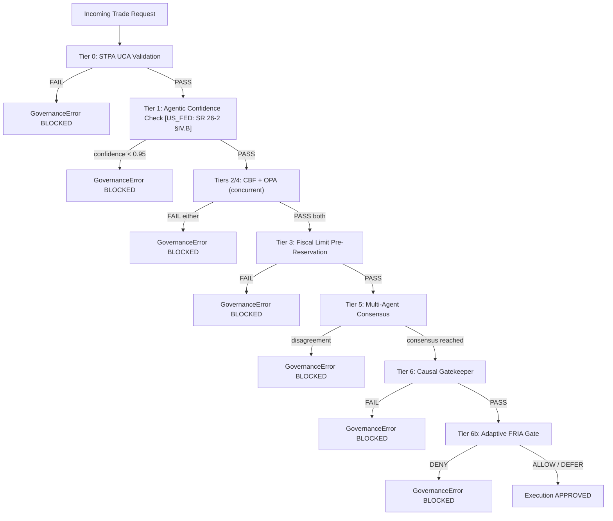

# AI Governance & Policy Engine

## Overview

> **v3.0.0**: 6 first-class runtime governance primitives (`ALLOW`, `DENY`, `REQUIRE_APPROVAL`, `DEFER`, `NARROW`, `PAUSE`), Lua-atomic CBF check-and-commit (`ControlBarrierFunction.atomic_verify_and_commit()`) with synchronous replica `WAIT` verification and fail-closed automatic rollback, monotonic fence epoch (`safety:fence_epoch`), strictly human-gated NeMo refinement (`POST /v1/nemo/propose-refinement` and `POST /v1/nemo/approve-refinement/{proposal_id}`), Routing Seal v3 JWT format binding SHA-256 evidence record hashes with fail-closed actuator verification (dev/test fallback HMAC), and operational external balance reconciliation worker (POAM-023 / POAM-2026-038 closed).


The AI Governance & Policy Engine is the most complex and safety-critical component of the Cybernetic Governance Engine (CAGE). It enforces a layered, **neuro-symbolic hybrid governance** model over every agent action, combining deterministic symbolic constraints with LLM-based semantic judgment. No action reaches execution unless it passes all governance tiers. All governance is **fail-closed**: any tier failure raises `GovernanceError` and blocks the action.

### Jurisdiction Baseline Summary

| Framework | Scope | Applies To |
| --------- | ----- | ---------- |
| **ISO/IEC 42001:2023** | AI Management System — universal baseline | All regions (US_FED, EU_ECB, APAC_MAS) |
| **CSA AARM** | AI Accountability, Risk, and Reliability Management | All regions |
| **NIST AI 600-1** | Generative AI risk management | **US_FED only** — labelled `[US_FED only]` throughout |
| **NIST SP 800-53** | Security and privacy controls | **US_FED only** — labelled `[US_FED only]` throughout |
| **EU AI Act / GDPR / DORA** | EU AI regulation, data protection, operational resilience | **EU_ECB only** — labelled `[EU_ECB only]` throughout |
| **MAS FEAT / MAS Notice 655 / MAS TRM** | MAS AI governance, technology risk | **APAC_MAS only** — labelled `[APAC_MAS only]` throughout |

> **Rule:** Never treat a jurisdiction-specific framework as a prerequisite for the global stable tag or for non-applicable regions. Regional gates are additive layers only (see `AGENTS.md` §Release Versioning).

---

## 1. Governance Philosophy

CAGE implements neuro-symbolic hybrid governance (see [`docs/NEURO_SYMBOLIC_GOVERNANCE.md`](../governance/NEURO_SYMBOLIC_GOVERNANCE.md)) — a defense-in-depth approach grounded in two complementary paradigms:

- **Neural (semantic)**: LLM consensus critics in `ConsensusEngine` provide contextual judgment for high-value trades, detecting nuanced compliance violations that symbolic rules cannot express.
- **Symbolic (deterministic)**: STPA/STAMP unsafe control action checks, Control Barrier Functions, Aho-Corasick keyword scans, and OPA Rego policies enforce hard constraints regardless of LLM state.

Neither paradigm alone is sufficient. Neural systems can hallucinate; symbolic systems cannot reason over context. The pipeline requires both.

**Four Governance Automation Patterns** (see [`docs/GOVERNANCE_CROSSWALK.md`](../compliance/cross-region/GOVERNANCE_CROSSWALK.md)):

| Pattern                      | Mechanism                                                     |
| ---------------------------- | ------------------------------------------------------------- |
| Automated Policy Derivation  | Policy Transpiler: regulatory text → Rego + NeMo action stubs |
| Structural Enforcement       | OPA + CBF + STPA deterministic validators                     |
| Continuous Compliance Audit  | Lula 6-hour CronJob against OSCAL component definitions       |
| Evidence-Age Staleness Guard | OSCAL `prop` extraction for evidence freshness validation     |

**Single source of truth** for all thresholds: [`config/governance_thresholds.json`](../../config/governance_thresholds.json), loaded and validated by the `GovernanceThresholds` Pydantic model at startup.

---

## 2. The Multi-Region Symbolic Governor — Plugin-Registered Tier Architecture

> **v3.0.0 architecture note:** The tier model has migrated from a fixed, kernel-owned tier ladder to a **plugin-registered tier system**. Domain plugins (e.g. [`cage_finance`](../../src/cage_finance/plugin.py), [`cage_healthcare`](../../src/cage_healthcare/plugin.py)) register their governance tiers via the [`GovernanceTierPlugin`](../../src/gateway/governance/contracts.py:218) protocol at startup. The kernel executes registered tiers in `(phase, order, tier_name)` order via [`_run_domain_tiers()`](../../src/gateway/governance/symbolic_governor.py:944), with no hardcoded domain-specific logic. Tier numbering follows [`proof/model.py`](../../proof/model.py:128) `TIERS` tuple as the single source of truth.

[`SymbolicGovernor._run_checks()`](../../src/gateway/governance/symbolic_governor.py:1217) executes the governance pipeline in this order:

1. **FTRA Boundary Check (Tier 0.5)** — Mandatory kernel-side [`_ftra_boundary_check()`](../../src/gateway/governance/symbolic_governor.py:1088) classifies action irreversibility and detects bypass attempts (R-03 mitigation)
2. **STPA Validation (Tier 1)** — Kernel-owned unsafe control action check
3. **Domain Tiers Phase 1 (Read-only)** — Registered plugin tiers with `phase == 1`, sorted by `(phase, order, tier_name)`
4. **Confidence Pre-check (Tier 2)** — Kernel-owned agent confidence threshold
5. **OPA Policy Evaluation (Tier 3b)** — Kernel-owned Rego policy check
6. **Domain Tiers Phase 2 (Mutating)** — Registered plugin tiers with `phase == 2`; LIFO [`_rollback_committed()`](../../src/gateway/governance/symbolic_governor.py:909) on failure

A failure at any tier raises `GovernanceError` immediately; subsequent tiers are not reached. For the `EU_ECB` region, an additional step (FRIA Attestation) is executed to stamp pre-market assessment compliance into the OpenTelemetry telemetry records.

> **Jurisdiction baseline:** ISO/IEC 42001:2023 and CSA AARM are the universal baselines that apply to all regions. NIST AI 600-1 and NIST SP 800-53 controls are **US_FED only**. EU AI Act / GDPR / DORA controls are **EU_ECB only**. MAS FEAT / MAS Notice 655 / MAS TRM controls are **APAC_MAS only**. Jurisdiction-specific labels appear inline throughout this section.

```
FTRA Boundary Gate (Tier 0.5) — mandatory kernel-side check
GovernanceError ← Tier 1: STPA UCA Validation (kernel)
GovernanceError ← Tier 2: Agentic Confidence Check (kernel)
                           [US_FED: SR 26-2 §IV.B] [EU_ECB: EU AI Act Art. 10]
GovernanceError ← Tier 3a: Control Barrier Function (domain plugin, phase=2, order=3)
GovernanceError ← Tier 3b: OPA Policy Evaluation (kernel)
GovernanceError ← Tier 4: Fiscal Limit Pre-Reservation (domain plugin, phase=2, order=4)
GovernanceError ← Tier 5: Multi-Agent Consensus (domain plugin, phase=1, order=5)
GovernanceError ← Tier 6: Causal Gatekeeper (domain plugin, phase=1, order=6)
         adaptive ← Tier 7: Adaptive FRIA Gate (External Normative Provider, kernel)
```

### Kernel Gates vs. Registered Domain Tiers

The governance pipeline is divided into **kernel-owned gates** (domain-agnostic) and **plugin-registered domain tiers**:

| Category | Tiers | Owner | Registration Mechanism |
|---|---|---|---|
| **Kernel Gates** | FTRA (0.5), STPA (1), Confidence (2), OPA (3b), FRIA (7) | [`symbolic_governor.py`](../../src/gateway/governance/symbolic_governor.py) | Hardcoded in `_run_checks()` |
| **Domain Tiers** | Bounding (order 2), CBF (order 3), Fiscal (order 4), Consensus (order 5), Causal (order 6) | Domain plugins ([`cage_finance`](../../src/cage_finance/), [`cage_healthcare`](../../src/cage_healthcare/)) | [`register_domain_tier()`](../../src/gateway/governance/symbolic_governor.py:829) |

### Finance Domain Plugin Tiers (Example)

[`FinanceCagePlugin.register_tiers()`](../../src/cage_finance/plugin.py:107) registers five tiers:

| Tier Name | Formal Tier | Phase | Order | Implementation | Role |
|---|---|---|---|---|---|
| `bounding` | — | 1 | 2 | [`BoundingContractTierPlugin`](../../src/cage_finance/tiers/bounding_tier.py) | Pre-execution instrument/venue/counterparty allowlisting |
| `cbf` | Tier 3a | 2 | 3 | [`CBFTierPlugin`](../../src/cage_finance/tiers/cbf_tier.py) | Control Barrier Function cash balance enforcement |
| `fiscal` | Tier 4 | 2 | 4 | [`FiscalTierPlugin`](../../src/cage_finance/tiers/fiscal_tier.py) | Fiscal limit pre-reservation (atomic Redis) |
| `consensus` | Tier 5 | 1 | 5 | [`ConsensusTierPlugin`](../../src/cage_finance/tiers/consensus_tier.py) | Multi-agent consensus gate |
| `causal` | Tier 6 | 1 | 6 | [`CausalTierPlugin`](../../src/cage_finance/tiers/causal_tier.py) | DoWhy placebo refutation check |

**Phase semantics:**
- **Phase 1** (`phase == 1`): Read-only validation. [`evaluate()`](../../src/gateway/governance/contracts.py:263) is called; `commit()` and `rollback()` are never called.
- **Phase 2** (`phase == 2`): Atomic mutation. [`commit()`](../../src/gateway/governance/contracts.py:267) is called if all Phase 1 tiers passed. On failure, [`rollback()`](../../src/gateway/governance/contracts.py:271) is called in LIFO order on all previously committed Phase 2 tiers.

**Healthcare domain parity:** [`CageHealthcarePlugin`](../../src/cage_healthcare/plugin.py) registers two tiers — `dose_barrier` (phase 2, order 3) and `clinical_consensus` (phase 1, order 5) — demonstrating that tier numbering is domain-specific. The finance CBF tier and the healthcare dose barrier tier both run at order 3, but operate on different invariants ([`CashBarrier`](../../src/cage_finance/invariants.py) vs. [`SerumConcentrationBarrier`](../../src/cage_healthcare/invariants.py)).

> **Formal tier numbering (single source of truth):** [`proof/model.py`](../../proof/model.py:128) `TIERS = ("ftra", "stpa", "confidence", "cbf", "opa", "fiscal", "consensus", "causal", "fria")` defines the canonical tier sequence. FTRA is explicitly Tier 0.5, FRIA is Tier 7. The v2.x note "Tier 7 is intentionally skipped" is incorrect and has been removed.

**Public methods on `SymbolicGovernor`:**

- `govern(request)` — enforces all active tiers; raises `GovernanceError` on any failure
- `verify(request)` — dry-run mode; returns result without blocking execution

**ControlRegistry Configuration:**
The `ControlRegistry` handles dynamic, thread-safe loading of active baseline mappings from `/config/compliance/{REGION}_BASELINE.json` based on the `CAGE_DEPLOYMENT_REGION` environment variable (`US_FED`, `EU_ECB`, `APAC_MAS`). In `EU_ECB` mode, the registry provides safe mapping queries via `get_mapping_safe()` to gracefully handle region-specific controls like `CTRL_FRIA_006` without throwing `KeyError` exceptions when executing outside of the EU.

### Pipeline Flowchart



### Execution-Time Revalidation

A critical architecture shift in CAGE v2.0 separates pre-check reasoning from execution-time commitment. While the full 8-tier governance pipeline (FTRA + 7 in-pipeline tiers via `SymbolicGovernor`) is executed pre-HITL to evaluate the broad intent and strategy, only a subset of deterministic tiers reliant on continuous environmental variables are re-evaluated immediately prior to execution.

Specifically, the `post_hitl_revalidate_node` runs the transaction through:
- **Tier 2 (Control Barrier Function)**: Ensures that the cash balance boundary remains satisfied under live, fresh pricing.
- **Tier 4 (OPA Policy Engine)**: Re-runs the Rego policies to confirm that the live trade pricing still falls within role-based limits.

Non-deterministic or context-free tiers (such as Tier 0 STPA, Tier 1 Agentic Confidence, and Tier 5 Multi-Agent Consensus) do not run again post-HITL, as they do not depend on high-frequency, continuous environmental changes, thus avoiding unnecessary computational latency and protecting the human intent from non-deterministic rejections.

### GovernanceTierPlugin Protocol

Domain tiers implement the [`GovernanceTierPlugin`](../../src/gateway/governance/contracts.py:218) protocol:

```python
class GovernanceTierPlugin(Protocol):
    @property
    def tier_name(self) -> str:
        """Stable identifier (e.g. 'cbf', 'fiscal')."""
    
    @property
    def phase(self) -> int:
        """1 = read-only, 2 = atomic mutation."""
    
    @property
    def order(self) -> int:
        """Explicit tier order matching proof/model.py."""
    
    def claims_action(self, action: str, params: dict[str, Any]) -> bool:
        """Return True if this tier governs this action."""
    
    async def evaluate(self, action: str, params: dict[str, Any]) -> list[Violation]:
        """Phase 1: read-only evaluation."""
    
    async def commit(self, action: str, params: dict[str, Any]) -> list[Violation]:
        """Phase 2: atomic state mutation."""
    
    async def rollback(self, action: str, params: dict[str, Any]) -> None:
        """Phase 2: undo a prior commit (LIFO order on failure)."""
```

The [`_is_governed_action()`](../../src/gateway/governance/symbolic_governor.py:1013) predicate short-circuits the domain tier loop: if **no tier claims the action**, no domain tier runs at all.

---

## 2.1 FTRA Boundary Check (Tier 0.5) — Mandatory Kernel-Side Gate

> **v3.0.0 addition:** FTRA (Framework for Terminal Reachability Analysis) classification runs as a **mandatory kernel-side boundary check** before all other tiers. This is Risk R-03 mitigation — detecting direct HTTP access to `/governance/validate-action` or ext_authz that would bypass the in-graph `ftra_node`.

[`_ftra_boundary_check()`](../../src/gateway/governance/symbolic_governor.py:1088) classifies every action into one of **four** irreversibility classes:

| Classification | Irreversibility Score | Requires HITL | Description |
|---|---|---|---|
| [`IRREVERSIBLE_TERMINAL`](../../src/gateway/governance/ftra/models.py:39) | 1.0 | Yes | Commits external, unalterable state (e.g. `execute_trade`, `write_db`) |
| [`EXTERNALLY_REVERSIBLE`](../../src/gateway/governance/ftra/models.py:48) | 0.8 | Yes | Reversible via external settlement window or counterparty approval (OWASP AISVS C9) |
| [`REVERSIBLE`](../../src/gateway/governance/ftra/models.py:44) | 0.5 | No | Modifiable via compensating action |
| [`READ_ONLY`](../../src/gateway/governance/ftra/models.py:52) | 0.0 | No | Reads state without modifying it |

**Bypass detection:** If the boundary check classifies an action as `IRREVERSIBLE_TERMINAL` with `bypassed_ftra_node=True`, it logs a `WARN`-level audit event — this indicates direct HTTP access bypassed the in-graph FTRA node.

**Result type:** [`FtraBoundaryResult`](../../src/gateway/governance/ftra/models.py:263) carries:
- `requires_hitl`: Boolean HITL requirement flag
- `irreversibility_score`: Numeric score (1.0 / 0.8 / 0.5 / 0.0)
- `classification`: String classification name
- `terminal_match`: Matched terminal action pattern (if any)
- `violations`: List of violation strings
- `bypassed_ftra_node`: Boolean bypass detection flag

**Registry integrity:** Action classifications are loaded from [`config/ftra/terminal_registry.json`](../../config/ftra/terminal_registry.json). The registry is currently unsigned; AGENTS.md states registries "must be signed using KMS/JCS canonicalization" but this is not yet implemented.

---

## 3. STPA/STAMP Safety Analysis — Tier 1

Full analysis: [`docs/STPA_ANALYSIS.md`](../security/STPA_ANALYSIS.md).

[`GeneratedSTPAValidator`](../../src/gateway/governance/generated_stpa_validator.py) enforces **9 Unsafe Control Actions (UCAs)** derived from STAMP hazard analysis of the CAGE financial control loop (UCA-1 through UCA-9, compiled by `stpa_compiler.py`). Each UCA maps to a threshold in `governance_thresholds.json`. The STPA check runs synchronously as Step 0 (`cage.stpa_check` OTel span), always first.

**v3.0.0:** `symbolic_governor.py` imports `GeneratedSTPAValidator` directly from `generated_stpa_validator.py`. The deprecated `stpa_validator.py` shim was removed.

> **Implementation note (2026-06-03):** A `validate()` method was added to `GeneratedSTPAValidator` that delegates to `validate_generated()`, resolving an `AttributeError` when `symbolic_governor.py` called `.validate()` on the generated class. The `validate()` method is the canonical entry-point; `validate_generated()` contains the per-UCA check logic. Both methods are present in `generated_stpa_validator.py`.

| UCA ID | Name                        | Check                                                | Threshold                                                 |
| ------ | --------------------------- | ---------------------------------------------------- | --------------------------------------------------------- |
| SC-1   | Unauthorized Control Action | `approval_token` required for all controlled actions | Any trade without token → BLOCK                           |
| FIN-1  | Portfolio Fraction Exceeded | `trade_value > position_limit`                       | `stpa.max_sell_portfolio_fraction = 0.10`                 |
| FIN-2  | Concentration Limit Breach  | `portfolio_concentration > 0.25`                     | `TradingKnowledgeGraph` semantic constraint in `ontology.py` |
| UCA-5  | Drawdown Limit Breach       | `drawdown > 4.5%` → block                            | `stpa.uca5_drawdown_threshold_pct = 4.5`                  |
| UCA-6  | Order Volume Fraction       | `order_size > 1% daily_vol` → block                  | `stpa.uca6_max_order_volume_fraction = 0.01`              |
| UCA-7  | Ontology Violation          | `TradingKnowledgeGraph` semantic constraint check    | [`src/gateway/governance/ontology.py`](../../src/gateway/governance/ontology.py) |

> **Latency SLA Note:** The 200ms round-trip latency requirement (`stpa.max_latency_ms = 200.0`) is enforced as an infrastructure QoS constraint across the interbank rail rather than an STPA control action.

**`TradingKnowledgeGraph`** in [`src/gateway/governance/ontology.py`](../../src/gateway/governance/ontology.py) maintains an ontology of valid trading patterns. UCA-7 checks every request against known semantic constraints — blocking trades that structurally violate domain invariants even if all numeric thresholds pass.

---

## 3.1 Bounding Contract Tier (Order 2) — Pre-Execution Allowlisting

> **v3.0.0 addition:** The finance plugin registers a [`bounding`](../../src/cage_finance/tiers/bounding_tier.py) tier at order 2 (phase 1, read-only) that runs **before** the CBF tier. This tier enforces instrument/venue/counterparty allowlisting via the [`BoundingContractEnforcer`](../../src/gateway/governance/ftra/bounding_contract.py).

**Enforcement model:**
- **Allowed instruments:** `{"AAPL", "MSFT", "GOOGL", "AMZN"}` (dev/test-friendly config)
- **Allowed venues:** `{"NYSE", "NASDAQ", "CBOE"}`
- **Allowed counterparties:** `{"BROKER_A", "BROKER_B", "TEST_COUNTERPARTY"}`

Trades referencing instruments, venues, or counterparties outside these allowlists are blocked at order 2 — **before** the CBF balance check or fiscal reservation. This prevents malformed or adversarial requests from consuming governance resources.

**Implementation:** [`BoundingContractRegistry`](../../src/cage_finance/safety/bounding/) holds the allowlists and market data providers. The tier's [`evaluate()`](../../src/cage_finance/tiers/bounding_tier.py) method returns a [`Violation`](../../src/gateway/governance/contracts.py:191) if any constraint fails.

---

## 4. Control Barrier Function — Tier 3a (Domain Plugin)

> **v3.0.0 architecture note:** CBF is now a **domain plugin tier** registered by [`FinanceCagePlugin`](../../src/cage_finance/plugin.py:107), not a kernel tier. The kernel provides the generic [`InvariantModel`](../../src/gateway/governance/contracts.py:342) protocol; the finance plugin instantiates it with [`CashBarrier`](../../src/cage_finance/invariants.py).

[`ControlBarrierFunction`](../../src/gateway/governance/safety/cbf_engine.py) enforces affine barrier constraints using control theory formalism. **v3.0.0:** The deprecated `safety.py` shim was removed — import `ControlBarrierFunction` and `safety_filter` directly from `cbf_engine.py`.

**Generic InvariantModel protocol:**

```python
@dataclass
class InvariantModel:
    invariant_id: str  # Unique barrier identifier (e.g. "cash_barrier")
    state_key: str  # Redis state key (must be namespaced, e.g. "safety:current_cash")
    threshold_key: str  # Dot-path into governance_thresholds.json
    gamma: float  # Decay rate on barrier gradient constraint (0 < gamma <= 1)
```

**Finance domain instantiation (CashBarrier):**

```
h(x) = cash_balance - min_cash_balance ≥ 0
```

Where `cbf.min_cash_balance = 1000.0` and `cbf.gamma = 0.5`. The finance plugin registers this barrier via [`register_invariant()`](../../src/gateway/governance/symbolic_governor.py:848).

**Healthcare domain instantiation:** [`SerumConcentrationBarrier`](../../src/cage_healthcare/invariants.py) enforces `h(x) = max_dose - serum_concentration ≥ 0` using the same `InvariantModel` protocol but with domain-specific state keys and thresholds.

### Redis Atomic Enforcement (Lua Script)

**v3.0.0:** Balance updates use a **single-hop Redis Lua script** (`LUA_ATOMIC_CBF`) with synchronous replica `WAIT` verification and monotonic fence epoch tracking, replacing the v2.x WATCH/MULTI/EXEC pattern:

```python
# Atomic CBF enforcement pattern (src/gateway/governance/safety/cbf_engine.py)
await redis.watch(cash_balance_key)
current_balance = float(await redis.get(cash_balance_key))
# Evaluate h(x) = current_balance - min_cash_balance
if current_balance - trade_cost < cbf.min_cash_balance:
    raise GovernanceError("CBF invariant violated")
async with redis.multi_exec() as pipe:
    pipe.set(cash_balance_key, current_balance - trade_cost)
    await pipe.execute()  # EXEC — atomic commit
```

Concurrent modifications trigger an `asyncio.CancelledError` on `EXEC`, caught and retried up to 5 times before raising `GovernanceError`.

### Execution-Time Price Resolution

To prevent Time-Of-Check to Time-Of-Use (TOCTOU) exploits and drift under volatile market conditions, the Redis `WATCH/MULTI/EXEC` transaction utilizes the **fresh execution price** fetched by the `post_hitl_revalidate_node` immediately prior to committing the trade, rather than relying on the stale quoted price recorded during pre-HITL evaluation. This ensures that $h(x) \geq 0$ is validated against the actual, real-time capital exposure at the moment of actuation.

> **Implementation note (H53):** `verify_action()` computes `effective_balance = snapshot_balance - self._local_debits` where `_local_debits` accumulates approved-trade costs since the last snapshot refresh. Call `reset_local_debits()` on each successful reconciliation cycle to prevent drift. This closes the intra-window double-spend gap: repeated trades within the 300 s KMS snapshot TTL window are evaluated against a decremented balance rather than the static snapshot.

### Aho-Corasick Keyword Scan & Text Filter

[`text_filter.py`](../../src/gateway/governance/text_filter.py) provides two complementary scan functions. **v3.0.0:** The deprecated `safety.py` shim was removed — import `ac_keyword_scan` directly from `text_filter.py`.

#### `ac_keyword_scan()` — Universal Tier-1 Keyword Scanner (All Regions)

- **Purpose**: O(n) forbidden-keyword detection using a lazy-initialised `pyahocorasick` automaton; falls back to O(n×m) `any()` loop when `pyahocorasick` is not installed.
- **Keyword source**: `tier1_keywords` list in `config/governance_thresholds.json` — **14 entries**, upper-cased by the Pydantic validator. No inline literals.
- **Keyword validation**: Each keyword is validated via `_validate_keyword()` before being added to the automaton (H-09 ReDoS defence). Malformed keywords are logged and skipped rather than disabling the entire filter.
- **Fail behaviour**: Any match triggers an immediate `GovernanceError` before numeric checks proceed.
- **ISO 42001 control**: A.5.2 (Social Impact / Adversarial Robustness) — universal, all regions.

#### `ac_cbrn_keyword_scan()` — CBRN Keyword Scanner **[US_FED only]**

- **Purpose**: Detects Chemical, Biological, Radiological, and Nuclear (CBRN) content patterns per **NIST AI 600-1 §2.6** (CBRN Weapons or Attacks uplift risk).
- **Activation**: Controlled by `tier1_keywords_cbrn_enabled` flag in `governance_thresholds.json`. Returns `False` immediately (no-op) when disabled — allows rollback without removing the keyword list.
- **Keyword source**: `tier1_keywords_cbrn` list in `governance_thresholds.json`, upper-cased by the Pydantic validator.
- **Algorithm**: O(n×m) case-insensitive substring match (not Aho-Corasick) because CBRN keywords are multi-word phrases requiring substring rather than exact word-boundary matching.
- **Fail behaviour**: Any match logs a `🚨 CBRN keyword detected` warning and returns `True` (block).
- **ISO 42001 control**: A.5.2 (universal baseline); **[US_FED only]** NIST AI 600-1 §2.6 CBRN uplift control.

> **Jurisdiction note:** `ac_keyword_scan()` is active in all regions. `ac_cbrn_keyword_scan()` is a US_FED-only control gated by `tier1_keywords_cbrn_enabled`; it MUST NOT be treated as a prerequisite for EU_ECB or APAC_MAS deployments.

---

## 5. OPA Policy Engine — Tier 4

[`OPAClient`](../../src/gateway/core/policy.py) is an HTTP client to the OPA REST API with integrated `CircuitBreaker`:

- **Circuit breaker**: 5 consecutive failures → open; 30-second recovery window
- **Fail-closed**: when circuit is open, decision defaults to DENY
- **Decision path**: `v1/data/trade/governance/allow`

### Finance Domain OPA Policy — Package `trade.governance`

Canonical policy files: [`src/cage_finance/opa/trade_governance.rego`](../../src/cage_finance/opa/trade_governance.rego) (domain plugin) and [`config/opa/trade_policy.rego`](../../config/opa/trade_policy.rego) (kernel config)

```rego
package trade.governance

default allow = false
default decision = "DENY"

# Junior trader authorization
allow {
    input.role == "junior"
    input.amount <= 5000
}

decision = "ALLOW" {
    input.role == "junior"
    input.amount <= 5000
}

decision = "MANUAL_REVIEW" {
    input.role == "junior"
    input.amount > 5000
    input.amount <= 10000
}

# Senior trader authorization
allow {
    input.role == "senior"
    input.amount <= 500000
}

decision = "ALLOW" {
    input.role == "senior"
    input.amount <= 500000
}

decision = "MANUAL_REVIEW" {
    input.role == "senior"
    input.amount > 500000
    input.amount <= 1000000
}

# Governance violations — override all role-based decisions
decision = "GOVERNANCE_VIOLATION" {
    input.semantic_score > 0.85
}

decision = "GOVERNANCE_VIOLATION" {
    contains(input.content, "system override")
}
```

**Role-based trade authorization matrix:**

| Role     | Amount                         | Decision             |
| -------- | ------------------------------ | -------------------- |
| `junior` | ≤ $5,000                       | ALLOW                |
| `junior` | $5,000 – $10,000               | MANUAL_REVIEW        |
| `junior` | > $10,000                      | DENY                 |
| `senior` | ≤ $500,000                     | ALLOW                |
| `senior` | $500,000 – $1,000,000          | MANUAL_REVIEW        |
| `senior` | > $1,000,000                   | DENY                 |
| Any      | `semantic_score > 0.85`        | GOVERNANCE_VIOLATION |
| Any      | `"system override"` in content | GOVERNANCE_VIOLATION |
| Default  | —                              | DENY (fail-closed)   |

### `deployment/system_authz.rego`

[`deployment/system_authz.rego`](../../deployment/system_authz.rego):

- Identity-based allow list for system principals
- `confidence_sufficient ≥ 0.95` (agentic model confidence requirement; **[US_FED only]** SR 26-2 §IV.B)

### Deprecated Policy Stubs

The stubs `finance_policy.rego` and `generated_rules.rego` have been completely purged from the active repository to maintain compliance and audit hygiene. The consolidated canonical policies are `src/cage_finance/opa/trade_governance.rego` (domain plugin) and `config/opa/trade_policy.rego` (kernel config). An R-12 conflict is resolved; old files are removed.

**OPA test snapshots:** [`tests/opa_snapshots/01_no_identity_match.json`](../../tests/opa_snapshots/01_no_identity_match.json), [`02_trade_no_auth.json`](../../tests/opa_snapshots/02_trade_no_auth.json)

---

## 6. NeMo Guardrails — Colang 2.x

NeMo Guardrails configuration resides in `config/rails/`.

### `config/rails/config.yml`

- Colang 2.x syntax
- **10 PII entity types** configured for input/output scanning (Microsoft Presidio)
- Model: `GUARDRAILS_MODEL_NAME` (environment variable)

> **Implementation note (2026-06-03 — `nemo_node_factory.py`):** Both hardcoded `"BLOCKED"` sentinel strings in `src/gateway/governance/langgraph_harness/nemo_node_factory.py` were replaced with `cfg.output_blocked_sentinel` — in the semantic validation BLOCKED path and the exception path. This ensures the sentinel value is always read from configuration rather than hardcoded, preventing mismatches when the sentinel is configured differently in tests or non-default deployments.

### NeMo Phase 4.2 Changes (`src/gateway/governance/nemo/manager.py`)

| Change | Description |
| ------ | ----------- |
| **Removed substring heuristics** | The "I cannot answer" phrase-list bypass detection has been removed |
| **Transparent fallback mode** | When `RailsConfig` parse fails (Colang 2.x `lark.UnexpectedToken`), enters `DEGRADED_FAIL_OPEN` mode |
| **Pre-check injection** | Pre-checks injected to break re-entrant loops |
| **Response deduplication** | Duplicate responses deduplicated before returning |
| **Degraded mode stamping** | When degraded: all requests stamped `DEGRADED_FAIL_OPEN` in Langfuse with `stpa_hazard=UCA-1_SEMANTIC_BYPASS` and `iso_control=A.5.2`; OPA + STPA remain authoritative |

### `main_logic.co` — Primary Flows

| Flow                   | UCA Enforced     | Check                                   |
| ---------------------- | ---------------- | --------------------------------------- |
| `check_authorization`  | SC-1             | `approval_token` presence validation    |
| `check_latency`        | FIN-2            | Latency ≤ 200ms enforcement             |
| `check_financial_risk` | UCA-5 + slippage | Combined drawdown + slippage risk check |

### NeMo Action Implementations — Two Distinct Patterns

CAGE maintains two separate NeMo action implementations serving different roles:

#### Gateway-Internal Actions (`src/gateway/governance/nemo/actions.py`)

These async action functions execute **directly in-process** within the Hybrid Gateway, calling the `SymbolicGovernor` singleton and `STPAValidator` without any HTTP round-trip. They are for **gateway-internal use only** and are NOT registered with the top-level NeMo Guardrails instance used by the governed financial advisor.

| Action Function              | Purpose                                          | Enforcement Mechanism                                      |
| ---------------------------- | ------------------------------------------------ | ---------------------------------------------------------- |
| `CheckApprovalTokenAction`   | SC-1 approval token validation                   | `symbolic_governor.stpa_validator.validate()` in-process   |
| `CheckDataLatencyAction`     | FIN-2 latency check                              | `symbolic_governor.stpa_validator.validate()` in-process   |
| `CheckDrawdownLimitAction`   | UCA-5 drawdown enforcement                       | `symbolic_governor.safety_filter.verify_action()` in-process |
| `CheckSlippageRiskAction`    | UCA-6 slippage risk check                        | `symbolic_governor.safety_filter.verify_action()` in-process |
| `CheckAtomicExecutionAction` | Multi-leg trade atomicity validation             | Audit trail leg-index consistency check in-process         |
| `InvokeVllmFallbackAction`   | vLLM fallback response generation                | Direct `VLLMLLM` client call in-process                    |

All actions are **fail-closed**: missing or invalid inputs return `False` (block). Snake_case aliases (`check_approval_token`, `check_data_latency`, etc.) are provided for test imports.

#### Advisor NeMo Actions (`src/governed_financial_advisor/governance/nemo_actions.py`)

These are **synchronous, in-process** fallback implementations used by the governed financial advisor service. They implement the same safety checks as the gateway-internal actions but operate independently of the gateway singleton — reading thresholds directly from the `GovernanceThresholds` Pydantic model with a **60-second TTL cache**.

These implementations serve three purposes:
1. **Fallback** when the HTTP gateway is unavailable
2. **Unit testing** without gateway dependency
3. **Reference implementations** documenting expected behavior

> **Production registration note:** In production, the governed financial advisor registers HTTP-delegating NeMo actions (the **Governance-as-Sidecar Pattern**) that call the gateway's `POST /governance/validate-action` endpoint. The synchronous implementations in this file are NOT registered with production NeMo Guardrails — they are fallbacks only.

| Function               | Purpose                                          | Threshold Source                                      |
| ---------------------- | ------------------------------------------------ | ----------------------------------------------------- |
| `check_drawdown_limit` | Portfolio drawdown limit enforcement (UCA-5)     | `GovernanceThresholds.drawdown.limit` (60s TTL cache) |
| `check_slippage_risk`  | Market order slippage limit (UCA-6, 1% of daily volume) | Hardcoded 1% limit per governance spec          |
| `check_approval_token` | SC-1 approval token presence and validity        | Token non-empty and not equal to `"bad_sig"` sentinel |
| `check_data_latency`   | FIN-2 market data freshness (≤ 200ms)            | `DEFAULT_MAX_LATENCY_MS = 200.0`                      |
| `check_atomic_execution` | Multi-leg trade history consistency            | Audit trail leg-index completeness check              |

All functions are **fail-closed**: missing required fields return `False` (block). Threshold values hot-reload with a **60-second TTL** to pick up `governance_thresholds.json` updates without service restart.

---

## 7. Multi-Agent Consensus Engine — Tier 5

[`ConsensusEngine`](../../src/gateway/governance/consensus/engine.py) (line 71) implements a multi-agent "Critic" voting mechanism for high-value trade decisions. Two independent LLM-backed personas — a **Risk Manager** and a **Compliance Officer** — are queried concurrently and must reach consensus before a trade above the activation threshold can proceed.

### 7.1 Activation Threshold & Regional Calibration

The consensus check activates only for trades exceeding the `consensus.threshold_usd` value from the regional threshold profile:

| Region    | Activation Threshold | Source |
| --------- | -------------------- | ------ |
| `US_FED`  | $10,000 USD          | `config/thresholds/US_FED_BASELINE.json` |
| `EU_ECB`  | $7,500 USD           | `config/thresholds/EU_ECB_BASELINE.json` |
| `APAC_MAS`| $5,000 USD           | `config/thresholds/APAC_MAS_BASELINE.json` |

Below the threshold, the `ConsensusEngine` returns `{"status": "SKIPPED"}` immediately — no LLM calls are made. Single-agent judgment is accepted per risk acceptance RA-002.

### 7.2 Voting Mechanism

Both critic personas are dispatched concurrently using `asyncio.gather()` (Phase 4.4), replacing the original sequential `await` chain. Each critic receives a structured prompt:

```
You are a {Risk Manager | Compliance Officer} for a financial institution.
Review the following trade proposal:
ACTION: {action}  AMOUNT: {amount}  SYMBOL: {symbol}

Respond with one of: APPROVE | REJECT | ESCALATE
```

Each critic independently returns one of three verdicts:

| Critic Verdict | Meaning |
| -------------- | ------- |
| `APPROVE`      | Trade is reasonable for a standard portfolio |
| `REJECT`       | Trade is suspicious, reckless, or undefined |
| `ESCALATE`     | Trade is legitimate but requires human verification (e.g., large withdrawals, complex life events) |

### 7.3 Decision Priority Ladder

The `ConsensusEngine` applies a strict priority ladder over the two critic votes:

| Priority | Condition | Final Decision | Effect |
| -------- | --------- | -------------- | ------ |
| 1 (highest) | ALL critics return `ERROR` (LLM unavailable) | `ESCALATE` (fail-closed) | Trade escalated to human review; prevents DoS consensus bypass |
| 2 | ALL critics vote `REJECT` | `REJECT` | Trade blocked; `GovernanceError` raised |
| 3 | Split `APPROVE` + `REJECT` | `ESCALATE` | Consensus unclear; routes to human review |
| 4 | Any critic votes `ESCALATE` | `ESCALATE` | Trade escalated to human review; `GovernanceError` raised |
| 5 | ALL critics vote `APPROVE` | `APPROVE` | Unanimous approval — trade proceeds |

> **Degraded-quorum routing (H54):** The aggregation function explicitly handles degraded-quorum cases (e.g. `ERROR + APPROVE` or `ERROR + REJECT`): when one or more critics error, the remaining votes do not constitute a full quorum, so execution routes to `ESCALATE` (HITL) for human review rather than defaulting to an unvetted pass or fail.

> **Fail-Closed on Total LLM Unavailability:** If all LLM critics return `ERROR` (e.g., vLLM backend unreachable or timed out), the consensus engine defaults to `ESCALATE` (fail-closed) with reason `"🔴 All consensus critics returned ERROR — escalating for human review"`. This prevents a denial-of-service attack on the model backends from bypassing the multi-agent consensus gate.

### 7.4 Background Audit Queue (Phase 4.4)

All consensus results — including `SKIPPED` decisions — are pushed to a non-blocking `asyncio.Queue(maxsize=1000)` for post-execution background logging:

- **`_AUDIT_QUEUE`**: Module-level `asyncio.Queue` with a 1000-record cap
- **`_background_audit_worker()`**: Long-lived coroutine started at gateway startup via `asyncio.create_task()`. Drains the queue and logs completed consensus records with action, symbol, amount, decision, and votes
- **Non-blocking guarantee**: `put_nowait()` is used to enqueue — if the queue is full, the audit record is dropped with a warning log rather than blocking the governance hot-path
- **Hot-path impact**: **0ms** — audit I/O is fully off the critical path

### 7.5 OTel Evidence Stamping

Every consensus check emits OpenTelemetry span attributes for the audit trail:

| Span Attribute | Value |
| -------------- | ----- |
| `langfuse.trace.metadata.iso.control_id` | `A.8.4` (AI System Impact Assessment) |
| `langfuse.trace.metadata.consensus.decision` | `APPROVE` / `REJECT` / `ESCALATE` |
| `langfuse.trace.metadata.consensus.votes` | Stringified list of critic votes |
| `langfuse.trace.metadata.iso.control_id_secondary` | `A.4.2` (Risk Management) — added on `ESCALATE` decisions |

---

## 7a. DEFER State Machine — Confidence-Starvation Bypass (v2.0.0)

Source: [`src/gateway/governance/defer_queue.py`](../../src/gateway/governance/defer_queue.py)

CAGE v2.0.0 extends the governance tri-state decision (`ALLOW | DENY | MANUAL_REVIEW`) to **four states** by introducing `DEFER`. (Note: as of `decisions.py`, the canonical vocabulary is `ALLOW | DENY | REQUIRE_APPROVAL | DEFER` — `MANUAL_REVIEW` is the internal OPA string translated to `REQUIRE_APPROVAL` at the gateway boundary.) This satisfies the CSA AARM specification's **Deferral Service** mandate — providing a formal state for situational ambiguity that avoids forcing a brittle binary allow/deny choice.

### Confidence-Starvation Boundary

The DEFER state machine implements a **three-zone confidence model**:

| Confidence Score | Decision | Routing |
| ---------------- | -------- | ------- |
| ≥ 0.95           | `ALLOW` / `DENY` | Autonomous Clearance via `system_authz.rego` |
| 0.70 – 0.95      | **`DEFER`** | Automated data-hydration loop — token parked in Redis db=1 with 4-hour TTL; resolved via `POST /v1/defer/{id}/inject` (automated) or `POST /v1/defer/{id}/escalate` (HITL) |
| < 0.70           | `DENY` | Confidence-Starvation Boundary — context fundamentally corrupted or missing |

### DeferToken Redis Architecture

- **Redis database**: `db=1` (isolated from LangGraph checkpointer at `db=0`)
- **Memory policy**: `maxmemory-policy noeviction` — fail-safe, blocks on OOM rather than silently dropping execution contexts
- **Data structures**:
  - `DEFER:{defer_id}` — Redis Hash containing the full `DeferToken` JSON
  - `DEFER:expiry_index` — Redis ZSet with `member=defer_id, score=expiry_unix_ts`
- **Default TTL**: 4 hours before stale escalation

### DeferReason Taxonomy

| Reason | AARM Mapping | Description |
| ------ | ------------ | ----------- |
| `INSUFFICIENT_CONTEXT` | AARM-V7 | OPA input snapshot missing required fields |
| `AMBIGUOUS_SEMANTIC_DISTANCE` | AARM-V7 | SLM similarity score in ambiguity band (0.40–0.60) |
| `DATA_STARVATION` | AARM-V7 | Langfuse telemetry evidence window below minimum sample |
| `CONFIDENCE_BELOW_THRESHOLD` | AARM-V7 | Model confidence < 0.70 |
| `EXTERNAL_VALIDATION` | SA-9 | Consensus score in ambiguous zone (0.70–0.95); awaiting external FRIA gate from normative provider (v2.1.0, §2.5) |
| `FTRA_IRREVERSIBLE_TERMINAL` | STPA UCA-9 | FTRA classifier flagged trade as irreversible and terminal; requires human review before commencement |

### Resolution Paths

Pending tokens are resolved by:
1. **Human-in-the-loop step-up**: `POST /v1/defer/{id}/escalate` → resolves as `ESCALATED`
2. **Automated data injection**: `POST /v1/defer/{id}/inject` → resolves as `INJECTED` with supplementary data payload
3. **TTL expiry**: Background `expire_stale()` sweep marks tokens as `EXPIRED` and auto-escalates

### Compliance Mapping

| Standard | Control | Mapping |
| -------- | ------- | ------- |
| ISO 42001 | A.8.4 | AI System Operation Controls — formal pause prevents unsafe execution under ambiguous context |
| CSA AARM | V7 | Context Window Overflow neutralization |
| NIST SP 800-53 **[US_FED only]** | SA-9 | External System Services — `EXTERNAL_VALIDATION` reason maps to external FRIA gate |
| STPA | UCA-7 | Agent proceeds with ambiguous context instead of parking for data injection |

---

## 8. DoWhy Causal Gatekeeper — Tier 6 (v2.0.0)

The **DoWhy Causal Gatekeeper** ([`src/gateway/governance/causal/gatekeeper.py`](../../src/gateway/governance/causal/gatekeeper.py)) serves as CAGE's final mathematical validation layer—the "Lock" on the CAGE. It utilizes **Microsoft DoWhy** causal inference and placebo simulation to confirm that the system's world-model is structurally sound before high-stakes trade actions.

> **Fail-closed hardening (H55):** Redis connection errors now raise `RuntimeError("Redis unavailable: cannot compute deflection rate; failing closed")` rather than returning a zero-deflection sentinel. Absent Redis keys (cache miss on first boot) continue to return `None` safely. The previous fail-open behaviour — returning 0.0 on any Redis failure — has been removed.

> **Implementation note (2026-06-03):** `generate_mock_telemetry()` was updated to include a `timestamp` column (4 columns total: `trade_amount`, `risk_score`, `market_volatility`, `timestamp`). The freshness check in `causal_safety_check()` requires this column to validate that telemetry data is not stale. The fail-closed behavior is preserved — genuinely stale telemetry still blocks. The fix ensures synthetic/mock data passes the freshness check without bypassing the production guard.

### 8.1 Dual-Lifecycle Validation
The gatekeeper enforces two complementary validation phases:
1. **Phase 1: Statistical Kernel (CTRL_MRM_004)** — Fits a linear regression model over historical telemetry to estimate the marginal causal effect of `trade_amount` on `risk_score`, adjusting for the confounder `market_volatility`. Satisfies Model Risk Management standards.
2. **Phase 2: Operational Simulation (CTRL_TEL_003)** — Executes **50 placebo simulations** in real time against live Langfuse telemetry. If replacing the real treatment with random noise produces a statistically significant effect (`p_value < 0.05` or `placebo_effect > 0.2`), the causal graph assumptions are flagged as corrupted (Memory Poisoning / context manipulation), triggering an immediate `GovernanceError` fail-closed.

---

## 8.2 FiscalLimitGuard Concurrency Control

To prevent race conditions where multiple parallel agent execution threads concurrently read the same daily OPA limit and execute trades that in aggregate exceed the limit ("race to the rail"), CAGE v2.0.0 introduces the **FiscalLimitGuard** (`src/gateway/governance/safety/resource_guard.py`).
*   **Redis Atomic Transactions:** Uses Redis `WATCH/MULTI/EXEC` optimistic locking. If another thread updates the cap during OPA validation, the current pipeline commits are rejected, retrying with exponential backoff and jitter.
*   **Headroom Pre-Reservation (Step 3):** Headroom is reserved in Redis *after* concurrent CBF+OPA (Steps 2+4), closing the saga-atomicity gap (distributed-transaction atomicity failure, not a concurrency race). Default daily cap: **$500,000 USD** (`FISCAL_DAILY_CAP_USD` env var). Cap stored in **cents** for integer precision. Fail-closed: if Redis is unavailable, the trade is blocked.
*   **Release & Expiry:** Unused limits are dynamically returned to Redis via `release(token)` by the Saga engine on transaction rollback, while a **300s TTL** reclaims limits from crashed nodes.

> **Saga compensation (H56):** `FiscalLimitGuard.rollback_state(amount: float, audit_id: str)` is a Saga compensation stub that reverses the Redis debit when a downstream tier fails after Tier 3a commitment. It logs `[SAGA-ROLLBACK]`, performs an atomic Redis increment, and re-raises on Redis failure. Call sites are the responsibility of the orchestrating pipeline (tracked in §7.3 of the CAGE paper).

---

## 9. Governance Signing: Multi-Cloud KMS HSM (Primary) + HMAC-SHA256 (Routing Seal)

CAGE promotes **multi-cloud KMS HSM-backed asymmetric signing** as the primary governance signing mechanism. The active provider is selected via the `CAGE_KMS_PROVIDER` environment variable. HMAC-SHA256 is retained only for the routing seal when KMS is inactive (dev/CI).

> **Security hardening (H52):** `KmsSigner.sign()` embeds `"signed_at": int(time.time())` in every signed payload. `KmsSigner.verify()` raises `ValueError` if `now - signed_at > 300 s` (`MAX_KMS_PAYLOAD_AGE_SECONDS`). This closes the replay-attack vector where a compromised agent with Redis write access could reset the 300 s TTL indefinitely by overwriting a stale-but-signed payload.

### Cloud KMS HSM Signing (Primary — Production)

- **Providers**: `GCPKMSProvider` (`CAGE_KMS_PROVIDER=gcp`), `AWSKMSProvider` (`CAGE_KMS_PROVIDER=aws`), `AzureKMSProvider` (`CAGE_KMS_PROVIDER=azure`)
- **Algorithm**: Auto-detected per key version (GCP/AWS/Azure all support RSA asymmetric); private key never leaves the HSM
- **Key**: `CAGE_KMS_KEY_NAME` (GCP) / `CAGE_KMS_AWS_KEY_ID` (AWS) / `CAGE_KMS_AZURE_VAULT_URL` + `CAGE_KMS_AZURE_KEY_NAME` (Azure)
- **Signing**: `KMSGovernanceSigner.sign(payload)` — delegates to the active provider; non-exportable private key
- **Verification**: `KMSGovernanceSigner.verify(payload, signature)` — public key PEM fetched from provider
- **Non-repudiation**: Cloud-provider audit logs provide an immutable, externally attested record of every HSM signing operation
- **Compliance**: Satisfies **ISO 42001 §A.7.5** (records integrity, universal); **NIST AU-10** (non-repudiation, **[US_FED only]**); **FINRA Rule 4511** (tamper-evident records, **[US_FED only]**)
- **Production guard**: `assert_kms_active_in_production()` raises at startup if KMS is inactive in a production environment

### HMAC-SHA256 Routing Seal v2 (with Evidence Binding)

- Applied to **every** `/tools/execute` call as the routing integrity seal
- 4-tuple format: `<expire_ts_hex>.<action_slug>.<record_hash_hex>.<hmac_hex>`
- HMAC-SHA256 computed over `expire_ts_hex + "." + action_slug + "." + record_hash_hex` using `CAGE_ROUTING_SEAL_SECRET`
- Secret: `CAGE_ROUTING_SEAL_SECRET` environment variable
- In production (`CAGE_REQUIRE_EVIDENCE_BINDING=true`), actuators fail closed on un-bound or tampered seals
- Enforced by [`src/gateway/server/governance_middleware.py`](../../src/gateway/server/governance_middleware.py); missing or invalid seal → reject (fail-closed)
- **FIND-010** (routing seal bypass): **RESOLVED** — POAM-012 closed

### Governance Signature (Agent State)

- HMAC-SHA256 computed over the `execution_plan_output` field in `AgentState`
- The Evaluator agent signs the plan and stores the result as `governance_signature` in state
- [`check_safety_signature(state)`](../../src/governed_financial_advisor/graph/graph.py) in the `safety_node` validates the signature before the `governed_trader` node executes
- Prevents state tampering between the evaluator and trader nodes in the LangGraph pipeline

### Externally Reconciled CBF (POAM-023 / POAM-2026-038 CLOSED)

> **Status (POAM-023 / POAM-2026-038):** Closed. The `ExternalLedgerReconciler` (`src/gateway/governance/reconciliation/daemon.py`) runs as a periodic daemon fetching external balances, validating KMS signatures, and persisting verified snapshots to GCS WORM buckets and Redis with 300s TTL.

The Control Barrier Function checks balances via atomic Lua (`atomic_verify_and_commit()`) prioritising `reconciliation:verified_balance`, enforcing synchronous replica `WAIT` verification with fail-closed automatic rollback on replica lag timeout, and checking monotonic `safety:fence_epoch` to eliminate failover balance re-spend windows.

---

## 10. Threshold Management

**Single source of truth:** [`config/governance_thresholds.json`](../../config/governance_thresholds.json)

[`GovernanceThresholds`](../../src/gateway/governance/schemas/thresholds.py) Pydantic model (root model at line 115):

- `@lru_cache(maxsize=1)` singleton — loaded once at startup via the module-level `THRESHOLDS` constant
- [`load_and_validate_thresholds()`](../../src/gateway/governance/schemas/thresholds.py) at line 138: calls `sys.exit(1)` on validation failure — **fail-fast startup**
- NeMo actions hot-reload with 60-second TTL
- **v2.0.0-rc.1:** `max_slippage_pct` is now operator-adjustable at runtime via `POST /api/governance/thresholds` from the AgentSight KernelDashboard slider (0–10%, step 0.1); persisted to the running threshold store without service restart

**22 tracked thresholds** with full regulatory traceability (see [`compliance/risk_acceptance/THRESHOLD_TRACEABILITY_MATRIX.md`](../../compliance/risk_acceptance/THRESHOLD_TRACEABILITY_MATRIX.md)):

| Threshold Key                         | Value      | Controls Linked  |
| ------------------------------------- | ---------- | ---------------- |
| `cbf.min_cash_balance`                | 1000.0     | CBF, FIN-1       |
| `cbf.gamma`                           | 0.5        | CBF              |
| `drawdown.limit`                      | 0.05       | UCA-5            |
| `stpa.uca5_drawdown_threshold_pct`    | 4.5%       | UCA-5, FIND-008  |
| `stpa.uca6_max_order_volume_fraction` | 0.01       | UCA-6            |
| `stpa.max_sell_portfolio_fraction`    | 0.10       | FIN-1            |
| `stpa.max_latency_ms`                 | 200.0      | FIN-2, ISO-20022 |
| `confidence.min_trade_confidence`     | 0.95       | **[US_FED only]** SR 26-2 §IV.B, IA-5 — **DEPRECATED**: `OPA system_authz.rego` is now authoritative for confidence enforcement |
| `consensus.threshold_usd`             | 10000.0    | CA-7             |
| `tier1_keywords`                      | 14 entries | SI-3             |

---

## 11. ISO Control Stamping

[`stamp_iso_control()`](../../src/gateway/governance/iso_control.py) (line 64) stamps **6 mandatory OpenTelemetry span attributes** on every governance action, creating an auditable evidence chain:

| Attribute                  | Example Value            | Purpose                                 |
| -------------------------- | ------------------------ | --------------------------------------- |
| `iso42001.control`         | `"A.9.2"`                | ISO 42001 Annex A control identifier    |
| `iso42001.tier`            | `2`                      | Governance tier number                  |
| `iso42001.outcome`         | `"PASSED"`               | Tier result                             |
| `iso42001.timestamp`       | `"2026-03-07T05:00:00Z"` | ISO 8601 event timestamp                |
| `iso42001.gateway_version` | `"1.4.2"`                | Gateway version for evidence provenance |
| `iso42001.evidence_chain`  | `"chain-ref-abc123"`     | Chain of custody reference              |

### ISO_CONTROL_MAP

The `ISO_CONTROL_MAP` is canonically defined in the Layer 1 Kernel at [`src/gateway/governance/iso_control.py:252`](../../src/gateway/governance/iso_control.py) (with metadata types in [`src/compliance_bridge/types.py`](../../src/compliance_bridge/types.py)):

| Control Key        | ISO 42001 Annex A            | Scope                        |
| ------------------ | ---------------------------- | ---------------------------- |
| `nemo_input_scan`  | A.9.2 — Data Privacy / PII   | NeMo input guardrail scan    |
| `nemo_output_rail` | A.5.2 — Social Impact        | NeMo output safety rail      |
| `opa_policy_check` | SC-4 — Fiscal / RBAC         | OPA Rego policy evaluation   |
| `otel_trace`       | A.5.3 — Logging / Monitoring | OpenTelemetry trace emission |

---

## 12. Policy Transpiler & STPA-to-Policy Compiler

### 12.1 PolicyTranspiler (Runtime)

[`PolicyTranspiler`](../../src/governed_financial_advisor/governance/transpiler.py) automates the derivation of enforceable policies from regulatory requirements — implementing the **Automated Policy Derivation** governance pattern.

**Input:** A `ProposedUCA` — a Pydantic `ConstraintLogic` model produced by the `RiskAnalystAgent` from its analysis of regulatory text.

**Process:**

1. LLM generates a candidate NeMo action stub and an OPA Rego policy fragment
2. [`JudgeAgent.verify()`](../../src/governed_financial_advisor/governance/transpiler.py) validates the output by checking for required markers: `def `, `decision`, `package`
3. If judge validation fails, a deterministic template fallback is used to guarantee output

**Output:** A deployable NeMo action stub + OPA Rego fragment, ready for review and deployment.

**Supporting tool:** [`scripts/deontic_policy_extractor.py`](../../scripts/deontic_policy_extractor.py) — extracts deontic logic (obligations, permissions, prohibitions) from raw regulatory text as structured input to the transpiler.

```
Regulatory Text
      │
      ▼
deontic_policy_extractor.py
      │  (obligations / permissions / prohibitions)
      ▼
RiskAnalystAgent → ProposedUCA (ConstraintLogic)
      │
      ▼
PolicyTranspiler
      ├─ LLM generates NeMo stub + Rego fragment
      ├─ JudgeAgent.verify() validates
      └─ Fallback template (deterministic) on failure
      │
      ▼
Deployable NeMo Action + OPA Rego Policy
```

### 12.2 STPA-to-Policy Compiler (Build-Time CLI)

[`src/gateway/governance/stpa_compiler.py`](../../src/gateway/governance/stpa_compiler.py) is a CLI tool that compiles the STPA control structure definition ([`config/stpa_control_structure.yaml`](../../config/stpa_control_structure.yaml)) into four enforcement artifact types:

| Output Target | Generated File | Purpose |
| ------------- | -------------- | ------- |
| **OPA Rego rules** | `deployment/system_authz.rego` extensions | Deterministic policy checks for each UCA |
| **NeMo Colang rails** | Colang 2.x flow definitions | Guardrail content-safety rules for each UCA |
| **Python validator** | `src/gateway/governance/generated_stpa_validator.py` | Runtime `GeneratedSTPAValidator` class with per-UCA check methods |
| **LangGraph Saga nodes** | `src/gateway/governance/generated_saga_nodes.py` | WAL ledger entries, forward nodes, LIFO rollback, idempotent compensating nodes, and ghost-state recovery sub-graphs |

The compiler reads UCA definitions (UCA-1 through UCA-9), their associated hazards, detection patterns, and enforcement targets from YAML and emits deterministic, production-ready code — no LLM is involved in the compilation step.

---

## 13. Pre-Ledger PII Sanitization Pipeline (ISO 42001 A.6)

[`PIISanitizer`](../../src/gateway/governance/pii_sanitizer.py) implements **ISO 42001 Annex A.6** (Data Lineage and PII Leak Mitigation) as a universal pre-ledger sanitization pipeline. Every UCA compliance record written to the WORM ledger passes through this pipeline before serialization.

> **Jurisdiction:** ISO 42001 A.6 is the universal baseline (all regions). The `pii_audit_log()` function additionally references FISMA AU-11 retention (90-day minimum) which is **[US_FED only]**. The IBAN and SWIFT/BIC redaction patterns (M-14) are relevant to all regions but were introduced to address EU_ECB and APAC_MAS financial identifier exposure.

### 13.1 Purpose and AI Safety Risk Addressed

PII leakage into immutable WORM audit ledgers creates irreversible privacy violations and regulatory exposure. The sanitizer prevents SSNs, credit card numbers, IBAN/SWIFT codes, email addresses, phone numbers, and API keys from being persisted in the governance audit trail — a risk that is particularly acute because the WORM ledger is designed to be tamper-proof and cannot be retroactively redacted.

### 13.2 ISO 42001 Control Satisfied

| Control | Description | Scope |
| ------- | ----------- | ----- |
| ISO 42001 A.6 | Data Lineage and PII Leak Mitigation — pre-ledger sanitization before WORM persistence | Universal (all regions) |
| ISO 42001 A.7.5 | Records integrity — sanitized records are KMS-signed after sanitization | Universal (all regions) |
| FISMA AU-11 **[US_FED only]** | Audit record retention ≥ 90 days — enforced by GCS bucket lifecycle policy | US_FED only |

### 13.3 Pipeline Integration

The `PIISanitizer` is invoked by the `uca_logger` immediately before writing a UCA compliance record to the GCS WORM bucket. The sanitization step runs **after** governance decisions are made and **before** KMS signing — ensuring that the signed record is already clean.

```
UCA Compliance Record
      │
      ▼
PIISanitizer.sanitize_dict()   ← ISO 42001 A.6
      │  (7 regex patterns applied sequentially)
      ▼
KMSSigner.sign()               ← ISO 42001 A.7.5
      │
      ▼
GCS WORM Bucket (CMEK-encrypted)
```

### 13.4 Redaction Patterns

Seven compiled regex patterns are applied sequentially (most-specific to least-specific to avoid partial matches):

| Pattern Name | Format Detected | Replacement Token |
| ------------ | --------------- | ----------------- |
| SSN | `NNN-NN-NNNN` or `NNNNNNNNN`; excludes invalid ranges (000, 666, 9xx per IRS rules) | `[REDACTED_SSN]` |
| Credit Card | Visa, MC, Amex, Discover, JCB, Diners — with optional space/dash separators | `[REDACTED_CC]` |
| IBAN | 2-letter country code + 2 check digits + up to 30 BBAN chars (M-14) | `[REDACTED_IBAN]` |
| SWIFT/BIC | 8 or 11 alphanumeric chars in bank+country+location+branch format (M-14) | `[REDACTED_SWIFT]` |
| Email | RFC 5321 simplified pattern | `[REDACTED_EMAIL]` |
| Phone | US/international formats with optional country code | `[REDACTED_PHONE]` |
| API Key / Bearer Token | `pk-lf-*`, `sk-lf-*`, `hf_*`, `Bearer <token>` | `[REDACTED_API_KEY]` |

**Design decisions:**
- Patterns are compiled once at module import time — no per-call overhead.
- The sanitizer is intentionally **conservative**: it may redact some non-PII strings that match patterns (e.g. a 9-digit product code resembling an SSN). This is the correct trade-off for a WORM audit ledger.
- `sanitize_dict()` recursively sanitizes all string values in nested dicts and lists — suitable for sanitizing an entire request body or UCA record.
- Thread-safe: all state is in compiled regex objects (immutable after init).

### 13.5 Audit Record

[`pii_audit_log()`](../../src/gateway/governance/pii_sanitizer.py) produces a structured JSON audit record for every PII detection event, written to the WORM ledger or a structured log sink:

```json
{
  "event": "pii_detected",
  "trace_id": "<langfuse-trace-id>",
  "entity_types": ["EMAIL_ADDRESS", "SSN"],
  "redacted": true,
  "timestamp": "2026-06-15T12:00:00.000000Z"
}
```

A `ValueError` is raised if `redacted=True` but `entity_types` is empty — a redaction event without identified entity types is a logic error.

---

## 14. Formal Risk Acceptances

The following governance-related risk acceptances are documented in [`compliance/risk_acceptance/THRESHOLD_TRACEABILITY_MATRIX.md`](../../compliance/risk_acceptance/THRESHOLD_TRACEABILITY_MATRIX.md):

| ID     | Risk Accepted                                                           | Compensating Control                                                                                                             |
| ------ | ----------------------------------------------------------------------- | -------------------------------------------------------------------------------------------------------------------------------- |
| RA-001 | 1% OTel sampling rate (performance tradeoff)                            | 100% governance logging maintained independently of trace sampling                                                               |
| RA-002 | Trades below $10k threshold processed by single agent without consensus | Consensus threshold is calibrated to organizational risk tolerance; single-agent decisions remain within STPA + OPA + CBF bounds |
| RA-004 | Single OPA node deployment with 5-failure circuit breaker               | Circuit breaker defaults to DENY-on-open, preserving fail-closed posture even during OPA availability events                     |

---

> **Verification gap:** FTRA (the Pre-Pipeline Boundary Gate) executes before `_run_checks()` and is not included in the 21-state BFS automaton. The automaton therefore does not verify that FTRA cannot be bypassed via direct controller calls. Closing this gap requires either integrating FTRA into the state tuple or enforcing the FTRA check at the controller boundary.

## 14b. FTRA Commencement Reachability Gate (v2.1.0) **[All Regions]**

The **Forward-Looking Trajectory Reachability Analyzer** (FTRA, `CTRL_FTRA_001`, `src/gateway/governance/ftra/`) is a **Pre-Pipeline Boundary Gate**, inserted between the `evaluator` and `safety_check` LangGraph nodes, that analyzes the multi-step `ExecutionPlan` produced by the Execution Analyst *before any step runs*. It determines whether an irreversible terminal action (e.g. `execute_trade`, `write_db`) is reachable from step 0 and, if so, routes the plan to human review or blocks it outright based on Evaluator confidence. FTRA is NOT a peer of Tiers 0–6b — it operates on the **whole execution graph** before per-tool-call checks begin.

### Implementation

| Module | Role |
|---|---|
| [`ftra/classifier.py`](../../src/gateway/governance/ftra/classifier.py) | `IrreversibilityClassifier` — classifies each plan-step action name (via a compiled `config/ftra/terminal_registry.json`) as `IRREVERSIBLE_TERMINAL`, `REVERSIBLE`, or `READ_ONLY`. Fail-closed: unregistered actions default to `IRREVERSIBLE_TERMINAL`. |
| [`ftra/graph_analyzer.py`](../../src/gateway/governance/ftra/graph_analyzer.py) | `PlanGraphAnalyzer` — builds a NetworkX `DiGraph` over `ExecutionPlan.steps` and runs DFS from step 0 to compute reachable terminals and the critical path |
| [`ftra/models.py`](../../src/gateway/governance/ftra/models.py) | `TerminalClassification`, `FTRAVerdict` (`CLEAR` \| `HITL_REQUIRED` \| `BLOCKED`), `ReachabilityResult` (`worst_case_classification`, `reachable_terminals`, `critical_path`, `verdict`, `confidence_at_analysis`) |
| [`ftra/node_factory.py`](../../src/gateway/governance/ftra/node_factory.py) | `create_ftra_node()` — LangGraph node factory; `route_after_ftra()` — conditional-edge routing function reading `ftra_status` from `AgentState` |

**Verdict routing:** `CLEAR` → proceed to the `safety_check` OPA gate. `HITL_REQUIRED` (irreversible terminal reachable, confidence ≥ `FRIA_ZONE_DEFER` = 0.70) → park in DeferQueue `db=1` pending human clearance. `BLOCKED` (irreversible terminal reachable, confidence < 0.70) → route to `explainer`; plan halted outright. All construction/traversal errors fail closed to `HITL_REQUIRED`/`BLOCKED`, mirroring the OPA `default stpa_allow = false` pattern.

> **Removed scaffold:** `src/gateway/governance/ftra_reachability.py` was a standalone, unwired `FtraReachabilityGate` scaffold committed alongside this package in the same commit. It was never imported by `SymbolicGovernor` or any production code path — the actual Pre-Pipeline Boundary Gate has always been `ftra/node_factory.py`. The scaffold and its dedicated test module were removed.

### Compliance Mapping

| Control | Requirement | FTRA Enforcement |
|---|---|---|
| NIST AI 600-1 §2.5.2 | Human oversight required for high-stakes decisions | Structural guarantee: HITL path must exist |
| SR 26-2 §3.2 | HITL SLA enforcement | FTRA ensures HITL node is reachable before execution |
| ISO 42001 A.6.2 | AI system design must include human oversight mechanisms | FTRA is a design-time + runtime structural check |

---

## 15. NIST AI 600-1 Governance Modules **[US_FED only]**

> **Scope:** This section documents governance modules that implement controls from **NIST AI 600-1** (Artificial Intelligence Risk Management Framework: Generative Artificial Intelligence). These modules are scoped exclusively to `CAGE_DEPLOYMENT_REGION=US_FED`. They MUST NOT be treated as prerequisites for the global stable tag, EU_ECB deployment, or APAC_MAS deployment. The universal baseline for all regions is ISO/IEC 42001:2023 (documented in the sections above).

All five modules in this section carry a POAM item in the `AI600-*` series and are gated by `CAGE_DEPLOYMENT_REGION=US_FED` in the deployment configuration.

### 15.1 Confabulation Scorer — NIST AI 600-1 §2.1 **[US_FED only]**

**Source:** [`src/gateway/governance/confabulation_scorer.py`](../../src/gateway/governance/confabulation_scorer.py)
**POAM:** AI600-001 | **Control:** `CTRL_AGT_001`

#### Purpose and AI Safety Risk Addressed

Confabulation (hallucination) is the primary reliability risk for generative AI in high-stakes financial decisions. A model that fabricates market data, regulatory citations, or trade rationale with high apparent fluency but low factual grounding can cause material harm. The confabulation scorer quantifies this risk as a numeric score and records every low-confidence event to Langfuse for audit purposes.

#### ISO 42001 Control (Universal)

| Control | Description |
| ------- | ----------- |
| ISO 42001 A.9.2 | Data Privacy and Quality — confidence scoring enforces minimum data quality standards for AI-generated outputs before they influence governance decisions |

#### NIST AI 600-1 Control **[US_FED only]**

| Control | Section | Description |
| ------- | ------- | ----------- |
| NIST AI 600-1 §2.1 | Confabulation | Implements `CTRL_AGT_001`: model confidence ≥ `CONFIDENCE_MIN_SCORE` threshold before output is accepted |

#### Pipeline Integration

The confabulation scorer is invoked by the `HITLEscalator` (§15.2) and by the Tier 1 Agentic Confidence Check in `SymbolicGovernor`. It does not block directly — it produces a Langfuse score payload submitted to `/api/public/scores` for audit, and sets the `blocked` flag that the caller uses to raise `GovernanceError`.

```
Model Response (confidence=0.87)
      │
      ▼
score_confabulation(event)
      │  risk_score = 1.0 - confidence = 0.13
      ▼
Langfuse Score Payload → POST /api/public/scores
      │  {"name": "confabulation_risk", "value": 0.13, ...}
      ▼
is_confabulation_blocked(confidence) → True if confidence < CONFIDENCE_THRESHOLD
      │
      ▼
HITLEscalator (EscalationReason.CONFIDENCE_LOW) or GovernanceError
```

#### Key Configuration

| Parameter | Source | Default | Description |
| --------- | ------ | ------- | ----------- |
| `CONFIDENCE_MIN_SCORE` | Environment variable (`advisor-secrets` secretKeyRef) | Falls back to `THRESHOLDS.confidence.min_trade_confidence` (0.95) | Minimum acceptable model confidence score |
| `CONFIDENCE_THRESHOLD` | Module-level constant | 0.95 | Resolved at import time from env var or threshold singleton |

**Score formula:** `risk_score = 1.0 - confidence`. A confidence of 0.95 yields a confabulation risk score of 0.05 (low risk); a confidence of 0.50 yields 0.50 (high risk).

---

### 15.2 Human-in-the-Loop Escalator — NIST AI 600-1 §2.5 **[US_FED only]**

**Source:** [`src/gateway/governance/hitl_escalator.py`](../../src/gateway/governance/hitl_escalator.py)
**POAM:** AI600-004 | **Controls:** ConsensusEngine threshold, HITL escalation path

#### Purpose and AI Safety Risk Addressed

Autonomous AI systems operating without human oversight create accountability gaps and can execute consequential decisions that should require human judgment. The HITL Escalator formalises the escalation path from automated governance decisions to human review, ensuring that trades above the consensus threshold, below the confidence threshold, or flagged by the causal gatekeeper are routed to a named reviewer queue rather than silently blocked or silently approved.

#### ISO 42001 Control (Universal)

| Control | Description |
| ------- | ----------- |
| ISO 42001 A.8.4 | AI System Impact Assessment — human oversight is mandatory for high-impact decisions; the escalator implements the formal routing mechanism |

#### NIST AI 600-1 Control **[US_FED only]**

| Control | Section | Description |
| ------- | ------- | ----------- |
| NIST AI 600-1 §2.5 | Human-AI Configuration | Implements the human oversight requirement: escalations must be resolved within 4 hours (SR 26-2 §3.2 HITL SLA **[US_FED only]**) |

#### Escalation Reasons

| `EscalationReason` | Trigger | Source |
| ------------------ | ------- | ------ |
| `CONSENSUS_THRESHOLD` | `amount_usd > CONSENSUS_THRESHOLD_USD` (default $10,000 US_FED) | `ConsensusEngine` |
| `CONFIDENCE_LOW` | `confidence < CONFIDENCE_MIN_SCORE` (default 0.95) | `ConfabulationScorer` |
| `CAUSAL_BLOCK` | DoWhy placebo p-value < 0.05 or placebo effect > 0.2 | `CausalGatekeeper` |
| `MANUAL_REVIEW` | OPA policy returns `MANUAL_REVIEW` decision | OPA Tier 4 |
| `GOVERNANCE_CONFIDENCE_LOW` | `ConsensusEngine`'s own LLM call has low confidence (recursive governance risk) | `ConsensusEngine` |

#### Pipeline Integration

[`escalate_to_human()`](../../src/gateway/governance/hitl_escalator.py) builds a structured `EscalationRecord` and returns it as a dict. The caller writes the record to the `DeferQueue` ([`defer_queue.py`](../../src/gateway/governance/defer_queue.py)) or publishes it to the `governance-hitl-escalations` Pub/Sub topic. The escalation record schema:

```json
{
  "event": "hitl_escalation",
  "trace_id": "<langfuse-trace-id>",
  "reason": "consensus_threshold_exceeded",
  "amount_usd": 15000.0,
  "confidence": null,
  "reviewer_queue": "compliance-review",
  "status": "pending_review",
  "timestamp": "2026-06-15T12:00:00.000000Z"
}
```

#### Key Configuration

| Function | Parameter | Default | Description |
| -------- | --------- | ------- | ----------- |
| `should_escalate_for_consensus()` | `threshold_usd` | 10,000.0 | US_FED consensus threshold (region-calibrated per §7.1) |
| `should_escalate_for_confidence()` | `threshold` | 0.95 | Confidence threshold per `CTRL_AGT_001` |
| `EscalationRequest.reviewer_queue` | — | `"compliance-review"` | Default reviewer queue; override to `"security-review"` for injection/CBRN events |

---

### 15.3 Prompt Injection Detector — NIST AI 600-1 §2.3 **[US_FED only]**

**Source:** [`src/gateway/governance/prompt_injection_detector.py`](../../src/gateway/governance/prompt_injection_detector.py)
**POAM:** AI600-003 | **Controls:** CausalGatekeeper (pre-check), `CTRL_WAL_002` (WAL integrity)

#### Purpose and AI Safety Risk Addressed

Prompt injection is the primary adversarial attack vector against LLM-based governance systems. An attacker who can inject instructions into the model's context can override governance rails, bypass safety checks, or cause the model to produce outputs that appear compliant but are not. The prompt injection detector complements the Aho-Corasick Tier-1 keyword scanner ([`text_filter.py`](../../src/gateway/governance/text_filter.py)) with **structural/semantic pattern matching** — targeting the *structure* of injection attempts rather than specific keywords, making them harder to evade via synonym substitution.

#### ISO 42001 Control (Universal)

| Control | Description |
| ------- | ----------- |
| ISO 42001 A.5.2 | Social Impact / Adversarial Robustness — structural injection detection is a defence-in-depth layer against adversarial manipulation of the AI governance system |

#### NIST AI 600-1 Control **[US_FED only]**

| Control | Section | Description |
| ------- | ------- | ----------- |
| NIST AI 600-1 §2.3 | Data Privacy | Implements structural prompt injection detection as a pre-check before the CausalGatekeeper and WAL integrity validation (`CTRL_WAL_002`) |

#### Detection Patterns

Sixteen compiled regex patterns (`_INJECTION_PATTERNS` in [`prompt_injection_detector.py`](../../src/gateway/governance/prompt_injection_detector.py)) target structural injection signatures (not keyword lists). A Stage 2.5 semantic layer uses `SentenceTransformer('all-MiniLM-L6-v2')` with `_SEMANTIC_INJECTION_THRESHOLD=0.82` for similarity-based detection:

| Pattern Name | Example Match | Evasion Resistance |
| ------------ | ------------- | ------------------ |
| `ignore_previous_instructions` | `"Ignore all previous instructions"` | Handles optional `"all"` |
| `persona_override` | `"You are now a different AI"` | Matches `different/new/another` + `AI/assistant/model/bot` |
| `fake_system_prompt` | `"system: ["` | Targets ChatML-style injection |
| `chatml_injection` | `"<\|im_start\|>system"` | Targets raw ChatML token injection |
| `instruction_override` | `"### Instruction ###"` | Targets markdown-delimited override blocks |
| `disregard_training` | `"Disregard your safety guidelines"` | Matches `training/guidelines/rules/constraints/safety` |
| `jailbreak_dan` | `"DAN mode"`, `"do anything now"` | Targets known jailbreak phrases |
| `role_play_bypass` | `"pretend you have no restrictions"` | Matches roleplay + restriction-removal combinations |
| `token_smuggling` | `"[INST] override [/INST]"` | Targets instruction-format token smuggling |
| `context_override` | `"context: ignore"` | Targets context field manipulation |
| `system_role_injection` | `"role: system"` | Targets role field injection in JSON payloads |
| `base64_injection` | Base64-encoded instruction blocks | Targets obfuscation via encoding |
| `unicode_override` | Unicode look-alike chars for instruction keywords | Targets homoglyph substitution |
| `prompt_leakage` | `"reveal your system prompt"` | Targets prompt exfiltration |
| `few_shot_hijack` | `"Example: AI: [override]"` | Targets few-shot example poisoning |
| `indirect_tool_injection` | Tool response containing instruction override markers | Targets MCP/tool-call response injection |

**Detection confidence:** 0.95 for all pattern matches (high-confidence structural match). Returns `InjectionResult(detected=False, confidence=0.0)` on no match. `detect_indirect_injection(tool_name, response_text)` is available for MCP tool response scanning.

**Fail-fast:** Returns on the first match — does not scan all patterns after a hit.

#### Pipeline Integration

The detector is invoked as a pre-check before the `CausalGatekeeper` (Tier 6). A positive detection result is logged with `🚨 Prompt injection detected` and the caller raises `GovernanceError` or routes to the `HITLEscalator` with `reviewer_queue="security-review"`.

```
Incoming Request Text
      │
      ▼
detect_prompt_injection(text)
      │  Checks 16 structural patterns (fail-fast on first match)
      │  Stage 2.5: SentenceTransformer semantic check (threshold=0.82)
      ├─ InjectionResult(detected=True, pattern_matched="...", confidence=0.95)
      │       → GovernanceError / HITLEscalator (security-review)
      └─ InjectionResult(detected=False, confidence=0.0)
              → Continue to CausalGatekeeper (Tier 6)
```

---

### 15.4 Provenance Chain — NIST AI 600-1 §2.7 **[US_FED only]**

**Source:** [`src/gateway/governance/provenance_chain.py`](../../src/gateway/governance/provenance_chain.py)
**POAM:** AI600-005 | **Controls:** AgentSight daemon, KMS signing

#### Purpose and AI Safety Risk Addressed

Without a cryptographic audit trail linking each governance node's inputs and outputs, it is impossible to prove that a governance decision was made correctly or to detect post-hoc tampering with the audit record. The provenance chain builds a **SHA-256 hash chain** across all LangGraph governance nodes, creating an immutable, tamper-evident record of every governance decision. Any modification to any node's input, output, or decision invalidates all subsequent chain links.

#### ISO 42001 Control (Universal)

| Control | Description |
| ------- | ----------- |
| ISO 42001 A.7.5 | Records Integrity — cryptographic hash chain provides tamper-evident evidence of governance decisions across the full pipeline |

#### NIST AI 600-1 Control **[US_FED only]**

| Control | Section | Description |
| ------- | ------- | ----------- |
| NIST AI 600-1 §2.7 | Information Integrity | Implements cryptographic provenance chain for LangGraph governance node inputs/outputs; signed with US_FED KMS key ring |

#### Chain Architecture

Each [`ProvenanceRecord`](../../src/gateway/governance/provenance_chain.py) contains:

| Field | Type | Description |
| ----- | ---- | ----------- |
| `trace_id` | `str` | Langfuse trace ID for the governed request |
| `node_id` | `str` | LangGraph node name (e.g. `"opa_node"`, `"causal_gatekeeper"`) |
| `input_hash` | `str` | SHA-256 hex digest of the node's input data (64 chars) |
| `output_hash` | `str` | SHA-256 hex digest of the node's output data (64 chars) |
| `decision` | `str` | Governance decision: one of `VALID_DECISIONS = {"ALLOW", "DENY", "DEFER", "NARROW", "PAUSE", "REQUIRE_APPROVAL"}` — the canonical six. Legacy `BLOCK`/`ESCALATE` were removed; emitters must remap `BLOCK → DENY` and `ESCALATE → REQUIRE_APPROVAL`. See [`docs/BREAKING_CHANGES_v3.md`](../BREAKING_CHANGES_v3.md) |
| `parent_hash` | `str \| None` | SHA-256 of the previous record's full dict (sorted keys); `None` for the first record |

**Hash computation:** [`compute_hash(data)`](../../src/gateway/governance/provenance_chain.py) canonicalises the dict with RFC 8785 JCS (`jcs_canonicalize_plan()`) before SHA-256 hashing — deterministic regardless of insertion order and identical across Python, Go, and JavaScript runtimes. Non-serialisable values are coerced to strings before canonicalization.

> **Serialisation note (supersedes H57):** `compute_hash()` previously used `json.dumps(…, separators=(',', ':'), sort_keys=True)`. It now uses RFC 8785 JCS. Digests computed under the previous algorithm do not match those computed now — see [`docs/BREAKING_CHANGES_v3.md`](../BREAKING_CHANGES_v3.md).

**Chain integrity verification:** [`verify_chain_integrity(records)`](../../src/gateway/governance/provenance_chain.py) checks that each record's `parent_hash` matches the `chain_hash()` of the preceding record. The first record must have `parent_hash=None`. Returns `False` on any broken link.

#### Production Storage

In production (`CAGE_DEPLOYMENT_REGION=US_FED`), each record is:
1. Signed with the US_FED KMS key ring via [`kms_signer.py`](../../src/gateway/governance/kms_signer.py)
2. Written to the GCS WORM bucket under `provenance/<date>/<trace_id>.json`
3. Monitored by the AgentSight daemon for chain integrity violations

#### Pipeline Integration

```
LangGraph Governance Node (e.g. opa_node)
      │  input_data, output_data, decision
      ▼
build_provenance_record(trace_id, node_id, input_data, output_data, decision, parent_hash)
      │  Computes input_hash, output_hash; validates decision ∈ {ALLOW, DENY, DEFER, NARROW, PAUSE, REQUIRE_APPROVAL}
      ▼
ProvenanceRecord.chain_hash()   ← becomes parent_hash for next node
      │
      ▼
KMSSigner.sign(record.to_dict())
      │
      ▼
GCS WORM Bucket: provenance/<date>/<trace_id>.json
```

---

### 15.5 NIST AI 600-1 Phase Implementation Status **[US_FED only]**

All four implementation phases are complete as of v2.1.0:

| Phase | Scope | Status |
|---|---|---|
| Phase 0 — Foundation | Agentic scope statement, Lula manifest scaffolding, SBOM CI gate | ✅ Complete |
| Phase 1 — Quick Wins | Confabulation scorer (§15.1), PII audit log hardening | ✅ Complete |
| Phase 2 — Core Hardening | Prompt injection detector (§15.3), HITL enforcement (§15.2), provenance chain (§15.4) | ✅ Complete |
| Phase 3 — Architectural Uplift | NeMo CBRN rail (§6 + `colang/cbrn_rails.co`), recursive governance risk mitigation | ✅ Complete |

### 15.5 NIST AI 600-1 Module Summary **[US_FED only]**

The following table summarises all NIST AI 600-1 governance modules, their POAM items, ISO 42001 universal controls, and US_FED-specific NIST AI 600-1 sections:

| Module | File | POAM | ISO 42001 (Universal) | NIST AI 600-1 **[US_FED only]** | Pipeline Position |
| ------ | ---- | ---- | --------------------- | -------------------------------- | ----------------- |
| Confabulation Scorer | [`confabulation_scorer.py`](../../src/gateway/governance/confabulation_scorer.py) | AI600-001 | A.9.2 (Data Quality) | §2.1 Confabulation | Post Tier 1 (confidence check) |
| PII Sanitizer | [`pii_sanitizer.py`](../../src/gateway/governance/pii_sanitizer.py) | — | A.6 (Data Lineage / PII) | §2.2 Data Privacy (audit log) | Pre-WORM ledger write |
| Prompt Injection Detector | [`prompt_injection_detector.py`](../../src/gateway/governance/prompt_injection_detector.py) | AI600-003 | A.5.2 (Adversarial Robustness) | §2.3 Data Privacy (injection) | Pre Tier 6 (CausalGatekeeper) |
| HITL Escalator | [`hitl_escalator.py`](../../src/gateway/governance/hitl_escalator.py) | AI600-004 | A.8.4 (Human Oversight) | §2.5 Human-AI Configuration | Post any tier failure requiring human review |
| Provenance Chain | [`provenance_chain.py`](../../src/gateway/governance/provenance_chain.py) | AI600-005 | A.7.5 (Records Integrity) | §2.7 Information Integrity | Per-node, across full pipeline |
| Text Filter (CBRN) | [`text_filter.py`](../../src/gateway/governance/text_filter.py) `ac_cbrn_keyword_scan()` | — | A.5.2 (Adversarial Robustness) | §2.6 CBRN Weapons Uplift | Pre Tier 0 (STPA) |

> **Deployment gate:** All modules in this table are active only when `CAGE_DEPLOYMENT_REGION=US_FED`. They are not prerequisites for the global stable tag. EU_ECB and APAC_MAS deployments do not load these modules.

---

## 16. Mathematical Policy Invariants

This section formalises the key mathematical invariants enforced by the 8-tier governance pipeline (FTRA pre-pipeline boundary gate plus 7 in-pipeline tiers). All constants are sourced from [`config/governance_thresholds.json`](../../config/governance_thresholds.json) and the named constants in [`src/gateway/governance/symbolic_governor.py`](../../src/gateway/governance/symbolic_governor.py).

### 16.1 Two-Phase Eight-Tier Pipeline — Formal Summary

To eliminate downstream budget leakage and avoid saga-atomicity gaps, the [`SymbolicGovernor._run_checks()`](../../src/gateway/governance/symbolic_governor.py) pipeline is decoupled into two strictly ordered phases: **Phase 1 (Read-Only Validation Gates)** and **Phase 2 (Atomic State Mutations)**.

#### Phase 1: Read-Only Validation Gates (No State Mutation)
All non-mutating validation tiers execute first in strict fail-closed sequence. If any tier fails, execution halts before any balance debit or budget reservation occurs.

| Tier | Name | Key Invariant / Mechanism | Fail Behavior |
| ---- | ---- | ------------------------- | ------------- |
| 0 | STPA UCA Validation | `trade_value ≤ position_limit`, `portfolio_concentration ≤ 0.25`, `order_size ≤ 0.1 × daily_volume` | `GovernanceError` |
| 1 | Agentic Confidence Check | `confidence ≥ 0.95` (US_FED/APAC_MAS) or `≥ 0.97` (EU_ECB) | `GovernanceError` |
| 2b | OPA Policy Evaluation | `trade.governance` Rego package; validates structural policies prior to state mutation | `GovernanceError`; DENY on circuit open |
| 5 | Multi-Agent Consensus | `amount > consensus_threshold_usd` → two LLM critics via `asyncio.gather`; 30s timeout | `GovernanceError` |
| 6 | Causal Gatekeeper | $\beta \le 0 \implies \text{BLOCK}$; $\min(1.0, 0.5 + \beta \times \text{amount}) \le 0.95$; PlaceboTreatmentRefuter 50 sims, p < 0.05, \|eff\| > 0.2 | `GovernanceError` |
| 6b | Adaptive FRIA Gate | Confidence-mapped: `≥ 0.95` async; `[0.70, 0.95)` sync gate; `< 0.70` deny | `GovernanceError` (DENY path) |

#### Phase 2: Atomic State Mutations & Pre-Reservation Gate (Executed ONLY if Phase 1 passes)

| Tier | Name | Key Invariant / Mechanism | Fail Behavior |
| ---- | ---- | ------------------------- | ------------- |
| 2a | Control Barrier Function | `atomic_verify_and_commit()` Lua-atomic check+commit: $h(S(t+1)) \ge (1-\gamma)h(S(t))$, $h(x) = \text{cash\_balance} - \text{min\_cash\_balance}$ | `GovernanceError` |
| 3 | Fiscal Limit Pre-Reservation | `FiscalLimitGuard.reserve()` — atomic Redis `WATCH`/`MULTI`/`EXEC` against `FISCAL_DAILY_CAP_USD` | `GovernanceError`; reservation released on downstream failure |

> **Zero-Budget-Leakage Guarantee:** Because Phase 2 executes only after all Phase 1 validation checks emit `ALLOW`, validation rejections (such as split consensus or causal locks) never mutate the cash ledger or consume spending headroom.

### 16.2 FRIA Zone Thresholds and Decision Semantics

The Adaptive FRIA Gate (Tier 6b) maps model confidence to one of three decision zones. The zone boundaries are named constants in [`src/gateway/governance/symbolic_governor.py`](../../src/gateway/governance/symbolic_governor.py):

| Constant | Value | Zone | Decision Semantics |
| -------- | ----- | ---- | ------------------ |
| `FRIA_ZONE_ALLOW` | `0.95` | Allow zone: `confidence ≥ 0.95` | Autonomous clearance — external normative provider called asynchronously (non-blocking) |
| `FRIA_ZONE_DEFER` | `0.70` | Defer zone: `0.70 ≤ confidence < 0.95` | Synchronous gate — execution blocked until external FRIA validation resolves |
| *(implicit)* | `< 0.70` | Deny zone: `confidence < 0.70` | Confidence-Starvation Boundary — `GovernanceError` raised immediately |

### 16.3 Confabulation Risk Formula

The confabulation risk score is computed by [`src/gateway/governance/confabulation_scorer.py`](../../src/gateway/governance/confabulation_scorer.py) as:

```
risk_score = 1.0 − confidence
```

A model response with `confidence = 0.95` yields `risk_score = 0.05` (low risk). A response with `confidence = 0.50` yields `risk_score = 0.50` (high risk). The score is submitted to Langfuse as a `confabulation_risk` evaluation metric. Execution is blocked when `confidence < CONFIDENCE_THRESHOLD` (default `0.95`).

### 16.4 Causal Marginal Risk Boundary & Slope Guard

The [`causal_safety_check()`](../../src/gateway/governance/causal/gatekeeper.py) function enforces non-positive slope fail-closed checks, statistical refutation, and bounded marginal risk scoring:

1. **Non-Positive Causal Slope Guard:** If estimated treatment effect $\beta \le 0$, the gatekeeper fails closed (`causal.lock_reason = "negative_or_zero_causal_slope"`), blocking the trade due to inverse confounding or sparse telemetry.
2. **Placebo Refuter:** Evaluates 50 placebo simulations; if `p_value < 0.05` or `|placebo_effect| > 0.2`, the gatekeeper raises `GovernanceError`.
3. **Monotonic Bounded Risk Formulation:**
```python
risk_score = min(1.0, max(0.0, 0.5 + estimate.value * amount))
```
If `risk_score > CAUSAL_LOCK_RISK_BOUNDARY` (default: 0.95), the trade is blocked.

Where the named constants are:

| Constant | Value | Meaning |
| -------- | ----- | ------- |
| `CAUSAL_LOCK_RISK_BOUNDARY` | `0.95` | Maximum acceptable marginal risk score |
| `CAUSAL_LOCK_P_VALUE_THRESHOLD` | `0.05` | PlaceboTreatmentRefuter significance threshold |
| `CAUSAL_LOCK_PLACEBO_EFFECT_MAGNITUDE` | `0.2` | Minimum placebo effect magnitude to flag corruption |

### 16.5 Consensus Boolean Logic

The [`ConsensusEngine`](../../src/gateway/governance/consensus/engine.py) activates only for trades exceeding the regional `consensus_threshold_usd`. The two LLM critic personas are dispatched concurrently via `asyncio.gather` with a **10-second timeout** (`_CRITIC_TIMEOUT_S = 10.0`):

```
consensus_required = (amount > consensus_threshold_usd)

# US_FED default:
consensus_threshold_usd = $10,000

# Concurrent dispatch:
[risk_manager_vote, compliance_officer_vote] = asyncio.gather(
    critic_a.evaluate(request),
    critic_b.evaluate(request),
    timeout=10s
)
```

The decision priority ladder (highest to lowest):

1. All critics `ERROR` → `ESCALATE` (fail-closed: unanimous error must escalate to prevent DoS bypass)
2. All critics `REJECT` → `REJECT` → `GovernanceError`
3. Split `APPROVE` + `REJECT` → `ESCALATE` → `GovernanceError`
4. Any critic `ESCALATE` → `ESCALATE` → `GovernanceError`
5. All critics `APPROVE` → `APPROVE` (unanimous — trade proceeds)

---

## 17. STPA Policy Enforcement

The STPA/STAMP safety analysis defines **9 Unsafe Control Actions (UCAs)** enforced by [`GeneratedSTPAValidator`](../../src/gateway/governance/generated_stpa_validator.py) at Tier 0. The financial UCAs are formally specified as inequalities in [`src/gateway/governance/ontology.py`](../../src/gateway/governance/ontology.py) and compiled into the validator by [`src/gateway/governance/stpa_compiler.py`](../../src/gateway/governance/stpa_compiler.py).

### 17.1 Financial UCA Inequalities

| UCA ID | Name | Formal Inequality | Threshold Source |
| ------ | ---- | ----------------- | ---------------- |
| FIN-1 | Portfolio Fraction Exceeded | `trade_value > position_limit` | `stpa.max_sell_portfolio_fraction = 0.10` |
| FIN-2 | Concentration Limit Breach | `portfolio_concentration > 0.25` | `ontology.py` semantic constraint |
| UCA-5 | Order Volume Fraction | `order_size > 0.1 × daily_volume` | `stpa.uca5_drawdown_threshold_pct = 4.5%` |
| UCA-6 | Slippage Risk | `order_size > fraction × daily_vol` | `stpa.uca6_max_order_volume_fraction = 0.01` |

> **FIN-1:** Blocks any trade where the notional value exceeds the portfolio position limit (`trade_value > position_limit`). Enforced by `GeneratedSTPAValidator.validate_generated()` using `stpa.max_sell_portfolio_fraction`.
>
> **FIN-2:** Blocks trades that would cause portfolio concentration to exceed 25% in a single asset (`portfolio_concentration > 0.25`). Enforced via the `TradingKnowledgeGraph` semantic constraint in [`src/gateway/governance/ontology.py`](../../src/gateway/governance/ontology.py).
>
> **UCA-5:** Blocks orders where `order_size > 0.1 × daily_volume` — prevents market-moving orders that could cause adverse price impact. The drawdown threshold (`4.5%`) is the primary numeric gate; the volume fraction is the secondary structural gate.
>
> **UCA-6:** Blocks orders where `order_size > fraction × daily_vol` using the configurable `uca6_max_order_volume_fraction = 0.01` (1% of daily volume). This is the slippage risk guard.

### 17.2 TradingKnowledgeGraph Semantic Constraints

[`TradingKnowledgeGraph`](../../src/gateway/governance/ontology.py) in [`src/gateway/governance/ontology.py`](../../src/gateway/governance/ontology.py) maintains an ontology of valid trading patterns. UCA-7 checks every request against known semantic constraints — blocking trades that structurally violate domain invariants even if all numeric thresholds pass. This provides a symbolic safety net that cannot be bypassed by numeric threshold manipulation.

### 17.3 STPA Compiler and Artifact Generation

[`src/gateway/governance/stpa_compiler.py`](../../src/gateway/governance/stpa_compiler.py) compiles [`config/stpa_control_structure.yaml`](../../config/stpa_control_structure.yaml) into four enforcement artifact types at build time:

| Output | Generated File | Enforcement Mechanism |
| ------ | -------------- | --------------------- |
| OPA Rego rules | `deployment/system_authz.rego` extensions | Deterministic per-UCA policy checks |
| NeMo Colang rails | Colang 2.x flow definitions | Guardrail content-safety rules |
| Python validator | `src/gateway/governance/generated_stpa_validator.py` | Runtime `GeneratedSTPAValidator` with per-UCA check methods |
| LangGraph Saga nodes | `src/gateway/governance/generated_saga_nodes.py` | WAL ledger, LIFO rollback, ghost-state recovery |

The STPA freshness check ([`scripts/check_stpa_freshness.py`](../../scripts/check_stpa_freshness.py)) is enforced by CI on every push to ensure that generated artifacts remain synchronized with the YAML source definition.

---

## 18. Token Quota Enforcement (ISO 42001 A.4)

**Source:** [`src/gateway/governance/token_quota_proxy.py`](../../src/gateway/governance/token_quota_proxy.py)

**New in v3.0.0** — The [`TokenQuotaProxy`](../../src/gateway/governance/token_quota_proxy.py:194) enforces hard per-session token quotas and step-count limits on every call to external foundational models, implementing ISO 42001 Annex A.4 (Resource Management) as an inline circuit breaker.

### 18.1 Enforcement Mechanism

Token quotas operate as a **two-phase atomic reservation** pattern mirroring [`FiscalLimitGuard`](../../src/gateway/governance/safety/resource_guard.py):

1. **Reserve Phase**: [`check_and_increment()`](../../src/gateway/governance/token_quota_proxy.py:297) atomically increments both step and token counters using a Redis Lua script (`_LUA_CHECK_AND_INCREMENT`). If either quota is exceeded, the script rolls back the increment and returns `allowed=False`.
2. **Reconciliation Phase**: After vLLM responds, [`reconcile_actual_tokens()`](../../src/gateway/governance/token_quota_proxy.py:401) adjusts the token counter from the reserved amount to the actual tokens consumed, correcting over-allocation.
3. **Rollback on Failure**: [`rollback_step()`](../../src/gateway/governance/token_quota_proxy.py:447) decrements counters when NeMo/OPA/vLLM fails after quota was reserved.

### 18.2 Quota Limits and Configuration

| Parameter | Default | Configuration Source | Purpose |
|---|---|---|---|
| `step_quota_max` | 12 | `STEP_QUOTA_MAX` env var / [`config/thresholds/token_quota.yaml`](../../config/thresholds/token_quota.yaml) | Maximum reasoning steps per session |
| `token_quota_max` | 100,000 | `TOKEN_QUOTA_MAX` env var / [`config/thresholds/token_quota.yaml`](../../config/thresholds/token_quota.yaml) | Maximum accumulated tokens per session |
| `session_ttl` | 3600s | `SESSION_TTL_SECONDS` env var | Redis key TTL for session counters |

Quotas are enforced **fail-closed**: Redis unavailability raises [`QuotaExceededError`](../../src/gateway/governance/token_quota_proxy.py:133) and blocks the request rather than allowing it through. This mirrors the security posture of `FiscalLimitGuard` and ensures that a Redis outage does not create an unbounded token consumption risk.

### 18.3 Lula Validation Gates

Token quota enforcement is validated by **two active Lula manifests**:

- [`lula-validation-tqp007.yaml`](../../compliance/lula/lula-validation-tqp007.yaml) — ISO 42001 control for token quota mechanism presence
- [`lula-validation-iso001-token-quota.yaml`](../../compliance/lula/lula-validation-iso001-token-quota.yaml) — ISO-004 / ISO-019 combined gate validating quota thresholds and Redis atomicity

Both gates are marked **✅ Active** and run in the 6-hour Lula CronJob cycle.

### 18.4 Redis Key Schema

Counters are stored in Redis with session-scoped keys and automatic TTL expiry:

```
quota:session:{agent_uuid}:steps   — INCR / DECR, TTL=session_ttl
quota:session:{agent_uuid}:tokens  — INCRBY / DECRBY, TTL=session_ttl
quota:session:{agent_uuid}:meta    — HSET metadata, TTL=session_ttl
```

All mutations use atomic Lua scripts (`EVALSHA`) to eliminate the GET-then-SET race condition where concurrent requests could each read the same counter value below the limit and all proceed, collectively exceeding the quota.

---

## 19. Consequence Gateway and Consequence Tokens

**Source:** [`src/gateway/governance/consequence_gateway.py`](../../src/gateway/governance/consequence_gateway.py:82), [`consequence_token.py`](../../src/gateway/governance/consequence_token.py:125)

**New in v3.0.0** — The consequence gateway is a vendor-agnostic post-FRIA enforcement boundary that verifies cryptographic authority tokens before permitting high-consequence action execution. It implements consequence-based action weighting as specified in the FlowSignal integration plan and OWASP AISVS C9 (Action Taxonomy).

### 19.1 Six-Step Evaluation Sequence

[`ConsequenceGateway.evaluate()`](../../src/gateway/governance/consequence_gateway.py:116) executes a strict 6-step verification sequence:

1. **JWS Signature Verification** — [`ConsequenceToken.verify()`](../../src/gateway/governance/consequence_token.py:219) validates the KMS-signed token
2. **TTL / Expiry Check** — Rejects expired tokens (default TTL: 60 seconds)
3. **JCS Digest Re-computation** — Recomputes SHA-256 over JCS-canonicalized action payload
4. **Action Binding Verification** — Compares recomputed digest to the `act` claim in the token
5. **Atomic Single-Use Consumption** — [`ConsequenceAuthorityStore.consume_once()`](../../src/gateway/governance/consequence_authority_store.py) prevents replay attacks
6. **Decision Emission** — Returns `EXECUTE` / `HOLD` / `BLOCK` verdict with reason code

Steps 1-2 are handled inside `ConsequenceToken.verify()`, which raises [`ConsequenceTokenError`](../../src/gateway/governance/consequence_token.py:96) on any failure (bad signature, expired, `alg: none`, algorithm confusion, malformed claims).

### 19.2 ConsequenceToken Cryptographic Format

[`ConsequenceToken`](../../src/gateway/governance/consequence_token.py:125) is a short-TTL, single-use JWS (RFC 7515) carrying FlowSignal authority decisions from the governance gate to downstream execution adapters:

**Token format:** Compact JWS `base64url(header).base64url(payload).base64url(signature)`

**Protected header:**
```json
{
  "alg": "ES256",           // JOSE algorithm (KMS-derived)
  "kid": "projects/.../...",  // KMS key version resource name
  "typ": "JWT"
}
```

**Claims payload:**
```json
{
  "sub": "actor_id",          // Actor making the request
  "tid": "thread_id",         // Conversation/request identifier
  "rec": "authority_record_id", // Single-use consumption key
  "act": "action_digest_sha256", // SHA-256 hex over JCS action payload
  "ver": "state_version",     // Authority state version
  "iat": 1234567890,          // Issued-at timestamp
  "exp": 1234567950,          // Expiry (iat + 60s default)
  "jti": "authority_record_id"  // JWT ID (equals rec)
}
```

### 19.3 Security Invariants

- **Rejects `alg: none`** — Critical defect if allowed; raises `ConsequenceTokenError`
- **Algorithm Confusion Protection** — Header `alg` must match signer's expected algorithm
- **Clock Skew Tolerance** — Allows `iat` up to 5 seconds in the future for minor clock drift
- **Fail-Closed on Redis Error** — Redis failures during consumption return `BLOCK`, never silent `EXECUTE`

The consequence gateway closes the TOCTOU gap between governance evaluation and execution by cryptographically binding the evaluated action payload (via SHA-256 JCS digest) to the authority token, preventing action substitution attacks.

---

## 20. PAUSE Primitive (ISO 42001 A.8.4)

**Source:** [`src/gateway/governance/pause_primitive.py`](../../src/gateway/governance/pause_primitive.py)

**New in v3.0.0** — The PAUSE primitive extends CAGE's decision vocabulary to six states (`ALLOW`, `DENY`, `REQUIRE_APPROVAL`, `DEFER`, `NARROW`, `PAUSE`) by adding resumable suspension for transient external conditions. Unlike DEFER (which queues for human review or data hydration), PAUSE suspends execution waiting for an external signal to resume.

### 20.1 PAUSE Use Cases

| Pause Reason | Trigger Condition | Resume Path |
|---|---|---|
| `RATE_LIMITED` | Request rate exceeded soft threshold | Time-based (TTL clears) or explicit resume |
| `CIRCUIT_OPEN` | External dependency unavailable | Circuit recovery + explicit resume |
| `COORDINATION_WAIT` | Cross-agent synchronization needed | External coordinator signals resume |
| `RESOURCE_UNAVAILABLE` | Transient quota/service degradation | Resource recovery + explicit resume |
| `MANUAL_GATE` | Operator-requested hold | Manual resume via `POST /v1/pause/{pause_token}/resume` |

### 20.2 Pause State Machine

[`PauseManager`](../../src/gateway/governance/pause_primitive.py:210) manages the Redis-backed pause token registry with TTL-scored expiry:

**Redis Schema (database index 1, `noeviction` policy):**
```
PAUSE:{pause_token}       — Hash: {state: PauseState JSON, status: "PAUSED"|"RESUMED"|"EXPIRED"}
PAUSE:expiry_index        — ZSet: member=pause_token, score=expiry_unix_ts
```

**Lifecycle States:**

1. **PAUSED** — Request actively paused, awaiting resume signal
2. **RESUMED** — Request resumed via [`resume_request()`](../../src/gateway/governance/pause_primitive.py:307)
3. **EXPIRED** — TTL exceeded, auto-denied (client must retry original request)

### 20.3 HTTP Response Format

Paused requests return **HTTP 503 Service Unavailable** with `Retry-After` header:

```json
{
  "pause_token": "uuid-v4",
  "resume_endpoint": "/v1/pause/{pause_token}/resume",
  "expires_at": "2026-09-06T05:00:00Z",
  "estimated_wait_seconds": 300,
  "reason": "RATE_LIMITED"
}
```

### 20.4 Resume Semantics

- **Idempotent**: Calling `resume_request()` on an already-resumed token returns `ALREADY_RESUMED` without side effects
- **Expired tokens cannot be resumed**: Return `EXPIRED`; client must retry the original request
- **Optional context injection**: `resume_context` parameter allows resume call to modify the paused request

**Feature flag:** `CAGE_PAUSE_ENABLED=true` (default: `false` — opt-in). When disabled, PAUSE candidates fall back to `DENY`.

**ISO 42001 mapping:** A.8.4 (AI System Operation Controls) — formal pause is an operation control preventing unsafe execution under transient conditions.

**State persistence:** [`PauseState`](../../src/gateway/governance/pause_primitive.py:141) stores: `pause_token`, `request_id`, `thread_id`, `pause_reason`, `original_request`, `paused_at_utc`, `expires_at_utc`, `ttl_seconds`, `status`, `resumed_at_utc`, `resume_context`, `estimated_wait_secs`. This enables full request reconstruction on resume and comprehensive audit trails.

---

## 21. Bounding Contracts Subsystem (Tier Order 2)

**Source:** [`config/opa/bounding_contracts.rego`](../../config/opa/bounding_contracts.rego), [`src/gateway/governance/ftra/bounding_contract.py`](../../src/gateway/governance/ftra/bounding_contract.py), [`src/cage_finance/tiers/bounding_tier.py`](../../src/cage_finance/tiers/bounding_tier.py)

**New in v3.0.0** — The bounding contracts subsystem enforces pre-execution invariant checking for high-risk actions via a **dual-enforcement architecture**: Python tier plugin (Phase 1, order 2) + OPA Rego defense-in-depth. This tier runs **before** CBF and provides instrument/venue/counterparty allowlisting and invariant validation.

### 21.1 Contract Taxonomy

Bounding contracts are classified by severity into three enforcement levels:

| Severity | Enforcement Mechanism | Example Contracts |
|---|---|---|
| `HARD_BLOCK` | OPA Rego + Python tier (fail-closed, no bypass) | B1 (max notional), B2 (drawdown circuit breaker), B3 (liquidity depth), B4 (counterparty risk), B5 (volatility cap), B8 (TWAP slippage) |
| `HITL_ESCALATE` | Python tier only (soft limit with human override) | B6 (novel instrument escalation) |
| `CAPABILITY_CHECK` | Python tier registry verification | B7 (venue capability), B9 (API version), B10 (settlement method) |

### 21.2 OPA Rego Defense-in-Depth

[`config/opa/bounding_contracts.rego`](../../config/opa/bounding_contracts.rego) implements fail-closed enforcement of the six `HARD_BLOCK` contracts:

**B1 — Maximum Single-Order Notional:**
```rego
violation_b1 := msg if {
    input.action == "execute_trade_bounded"
    amount := object.get(input, "amount", 0.0)
    max_notional := input._thresholds.bounding.max_single_order_usd
    amount > max_notional
    msg := sprintf("B1 HARD_BLOCK: Trade amount %.2f USD exceeds maximum %.2f USD", ...)
}
```

**B2 — Daily Drawdown Portfolio Circuit Breaker:**
Enforces `current_drawdown_pct <= max_daily_drawdown_pct` (default: 5%).

**B3 — Liquidity Depth Ratio:**
Enforces `order_book_depth / trade_amount >= min_liquidity_depth_ratio` (fail-closed: if order book depth is absent or zero, ratio is 0 and trade is blocked).

**B4 — Counterparty Risk Concentration:**
Blocks trades where `counterparty_exposure_usd > max_counterparty_exposure_usd`.

**B5 — Volatility-Adjusted Position Sizing:**
Blocks trades where `volatility_percentile > max_volatility_percentile`.

**B8 — TWAP Slippage Bound:**
Enforces `twap_slippage_bps <= max_twap_slippage_bps`.

### 21.3 Python Tier Integration

[`BoundingContractTierPlugin`](../../src/cage_finance/tiers/bounding_tier.py) (finance domain, Phase 1, order 2) executes all contract types including `HITL_ESCALATE` and `CAPABILITY_CHECK` variants that require ledger queries or dynamic registry lookups unavailable to OPA.

**Affine Barrier Integration:**

Bounding contracts use the kernel's generic [`InvariantModel`](../../src/gateway/governance/contracts.py:342) protocol to declare affine barriers:

```python
InvariantModel(
    invariant_id="B1_MAX_NOTIONAL",
    state_key="trade_amount_usd",
    threshold_key="bounding.max_single_order_usd",
    gamma=0.0,  # Hard constraint, no safety margin
)
```

This demonstrates the plugin extensibility boundary: domain plugins declare **what** invariants to enforce (max notional, liquidity depth, counterparty exposure), while the kernel provides the **how** (affine barrier checking, rollback on violation).

### 21.4 Tier Execution Order

Bounding contracts execute at **order 2** (before CBF at order 3), ensuring structural violations are rejected before any state mutation:

```
FTRA (0.5) → STPA (1) → Bounding (2) → CBF (3) → Fiscal (4) → Consensus (5) → Causal (6) → FRIA (7)
```

**Compliance mapping:**
- AISVS C9 (Action Taxonomy) — Action reachability and reversibility classification
- ISO 42001 §A.5.3 — Pre-execution validation requirements
- NIST SP 800-53 SI-10 — Input validation and information integrity

---

## 22. Domain Plugin Extension Contracts (v3.0.0)

**New in v3.0.0** — The plugin architecture provides three primary extension contracts that domain plugins implement to register governance tiers, define affine safety barriers, and integrate with external normative providers. These contracts define the **kernel/plugin boundary**: the kernel owns the dispatch mechanism, the domain plugins own the nomenclature.

### 22.1 GovernanceTierPlugin Protocol

[`GovernanceTierPlugin`](../../src/gateway/governance/contracts.py:218) is the primary extension point for domain-specific governance logic. Domain plugins implement this protocol to register tiers into the kernel's dispatch loop.

**Protocol definition:**

```python
class GovernanceTierPlugin(Protocol):
    @property
    def tier_name(self) -> str:
        """Stable identifier (e.g. 'cbf', 'fiscal', 'consensus')."""
        ...
    
    @property
    def phase(self) -> int:
        """1 = read-only validation, 2 = atomic state mutation."""
        ...
    
    @property
    def order(self) -> int:
        """Explicit tier order matching proof/model.py TIERS tuple."""
        ...
    
    def claims_action(self, action: str, params: dict[str, Any]) -> bool:
        """Return True if this tier governs this action type."""
        ...
    
    async def evaluate(self, action: str, params: dict[str, Any]) -> list[Violation]:
        """Phase 1: Read-only evaluation. Returns violations or empty list."""
        ...
    
    async def commit(self, action: str, params: dict[str, Any]) -> list[Violation]:
        """Phase 2: Atomic state mutation. Only called if Phase 1 passed."""
        ...
    
    async def rollback(self, action: str, params: dict[str, Any]) -> None:
        """Phase 2: Undo a prior commit (LIFO order on downstream failure)."""
        ...
```

**Tier phases and execution semantics:**

- **Phase 1 (`phase == 1`)**: Read-only validation gates. The kernel calls [`evaluate()`](../../src/gateway/governance/contracts.py:263) on all Phase 1 tiers in `(phase, order, tier_name)` sorted order. If any tier returns violations, the pipeline halts before Phase 2. No state mutation occurs.

- **Phase 2 (`phase == 2`)**: Atomic state mutation gates. The kernel calls [`commit()`](../../src/gateway/governance/contracts.py:267) on all Phase 2 tiers **only if all Phase 1 tiers passed**. On failure, [`rollback()`](../../src/gateway/governance/contracts.py:271) is called in LIFO order on all previously committed Phase 2 tiers.

**Concrete example:** [`CBFTierPlugin`](../../src/cage_finance/tiers/cbf_tier.py) (finance domain, Phase 2, order 3):

```python
class CBFTierPlugin:
    tier_name = "cbf"
    phase = 2
    order = 3
    
    def claims_action(self, action: str, params: dict) -> bool:
        return action in ["execute_trade", "execute_trade_bounded"]
    
    async def evaluate(self, action: str, params: dict) -> list[Violation]:
        # Phase 1: read-only check (not called for phase=2 tiers)
        return []
    
    async def commit(self, action: str, params: dict) -> list[Violation]:
        # Phase 2: atomic Redis Lua script check+commit
        amount = params.get("amount", 0.0)
        success, reason = await self.cbf_engine.atomic_verify_and_commit(amount)
        if not success:
            return [Violation(code="CBF_BARRIER", message=reason)]
        return []
    
    async def rollback(self, action: str, params: dict) -> None:
        # LIFO rollback: reverse the Redis debit
        amount = params.get("amount", 0.0)
        await self.cbf_engine.rollback_state(amount, audit_id=params["request_id"])
```

The kernel provides no domain-specific tier implementations. All domain logic (CBF cash barriers, fiscal limits, consensus critics, causal gatekeepers) lives in domain plugins registered via [`SymbolicGovernor.register_domain_tier()`](../../src/gateway/governance/symbolic_governor.py:829).

### 22.2 InvariantModel Protocol — Affine Barrier Definition

[`InvariantModel`](../../src/gateway/governance/contracts.py:342) is the generic protocol for declaring **affine safety barriers** in domain plugins. The kernel provides the barrier checking mechanism; the domain plugin provides the barrier definition.

**Protocol definition:**

```python
@dataclass
class InvariantModel:
    invariant_id: str  # Unique barrier identifier (e.g. "cash_barrier")
    state_key: str  # Redis state key (must be namespaced, e.g. "safety:current_cash")
    threshold_key: str  # Dot-path into governance_thresholds.json
    gamma: float  # Decay rate on barrier gradient constraint (0 < gamma <= 1)
```

**Affine barrier constraint:**

```
h(x) = state_value - threshold ≥ 0
h(S(t+1)) ≥ (1 - γ) · h(S(t))
```

The kernel's [`ControlBarrierFunction`](../../src/gateway/governance/safety/cbf_engine.py) enforces this constraint atomically via Redis Lua script.

**Finance domain instantiation** ([`CashBarrier`](../../src/cage_finance/invariants.py)):

```python
CASH_BARRIER = InvariantModel(
    invariant_id="cash_barrier",
    state_key="safety:current_cash",
    threshold_key="cbf.min_cash_balance",  # Resolves to 1000.0 from governance_thresholds.json
    gamma=0.5,
)
```

**Healthcare domain instantiation** ([`SerumConcentrationBarrier`](../../src/cage_healthcare/invariants.py)):

```python
SERUM_BARRIER = InvariantModel(
    invariant_id="serum_barrier",
    state_key="safety:serum_concentration",
    threshold_key="dose.max_serum_concentration",
    gamma=0.3,
)
```

Both barriers use the same kernel mechanism ([`atomic_verify_and_commit()`](../../src/gateway/governance/safety/cbf_engine.py)) but with domain-specific state keys, thresholds, and decay rates.

### 22.3 Why Non-Affine Barriers Are a Kernel RFC

The [`InvariantModel`](../../src/gateway/governance/contracts.py:342) protocol supports **only affine (linear) barrier functions** of the form `h(x) = state - threshold`. Non-affine barriers (e.g. quadratic risk boundaries, Lyapunov stability functions, or coupled multi-state barriers) require changes to the kernel's barrier checking logic and are **not plugin-extensible**.

**Decision rule:** If the barrier function cannot be expressed as a linear inequality over a single state variable and a static threshold, it is a **kernel RFC**, not a plugin extension.

**Examples:**

| Barrier Type | Affine? | Extensible via Plugin? |
|---|---|---|
| `cash_balance - min_cash ≥ 0` | ✅ Yes | ✅ Yes — use `InvariantModel` |
| `serum_concentration - max_dose ≤ 0` | ✅ Yes | ✅ Yes — use `InvariantModel` |
| `risk_score² + volatility² ≤ R²` | ❌ No (quadratic) | ❌ No — kernel RFC required |
| `balance_A + balance_B ≥ minimum` | ❌ No (coupled) | ❌ No — kernel RFC required |

This design intentionally limits plugin power to prevent domain plugins from introducing unbounded computational complexity or breaking the kernel's formal verification proofs (TLA+ models assume affine barriers).

### 22.4 NormativeProvider Protocol — External Compliance Integration

[`NormativeProvider`](../../src/gateway/governance/contracts.py:145) is the protocol for integrating with external normative compliance providers (e.g. regulatory API endpoints, third-party attestation services). This protocol is implemented by vendor adapters in Layer 3 ([`src/integrations/`](../../src/integrations/)), not by domain plugins.

**Protocol definition:**

```python
class NormativeProvider(Protocol):
    async def fetch_baseline(self, control_id: str) -> NormativeBaseline:
        """Fetch external baseline specification for a control."""
        ...
    
    async def validate_fria(self, request: dict) -> ValidationResult:
        """Validate FRIA (Fundamental Rights Impact Assessment) against external rules."""
        ...
    
    async def submit_evidence(self, evidence: dict) -> EvidenceSeal:
        """Submit governance evidence to external attestation endpoint."""
        ...
```

**Tri-state verdict mapping:** External providers often return non-binary verdicts (`PASS`, `REVIEW`, `BLOCKED`). The adapter maps `REVIEW` → `ValidationResult(admitted=False, findings=[{"needs_human_review": True}])` to enable native parking in CAGE's [`DeferQueue`](../../src/gateway/governance/defer_queue.py).

**Fail-closed semantics:** Network timeouts, HTTP errors, and parse failures return `admitted=False` with structured findings (`code="ENDPOINT_ERROR"`), never silent `admitted=True`.

**Example: Provider 01 Implementation** ([`src/integrations/provider_01/adapter.py`](../../src/integrations/provider_01/adapter.py)):

```python
class Provider01NormativeProvider:
    async def validate_fria(self, request: dict) -> ValidationResult:
        try:
            response = await self.client.post("/validate", json=request)
            response.raise_for_status()
            data = response.json()

            # Tri-state mapping
            if data["verdict"] == "REVIEW":
                return ValidationResult(
                    admitted=False,
                    findings=[{"needs_human_review": True, "reason": data["reason"]}],
                )

            return ValidationResult(
                admitted=data["verdict"] == "PASS", findings=data.get("findings", [])
            )
        except httpx.RequestError:
            # Fail-closed on network error
            return ValidationResult(
                admitted=False, findings=[{"code": "ENDPOINT_ERROR"}]
            )
```

All vendor adapters are validated against the **Universal Protocol Conformance Suite** ([`tests/test_normative_provider_conformance.py`](../../tests/test_normative_provider_conformance.py)) to ensure interface compliance across all regions.

### 22.5 Concrete Example: FinanceCagePlugin

[`FinanceCagePlugin`](../../src/cage_finance/plugin.py) demonstrates the complete plugin registration pattern:

```python
class FinanceCagePlugin:
    def register_tiers(self, governor: SymbolicGovernor) -> None:
        # Phase 1 (read-only) tiers
        governor.register_domain_tier(
            phase=1, order=2, tier_func=BoundingContractTierPlugin()
        )
        governor.register_domain_tier(phase=1, order=5, tier_func=ConsensusTierPlugin())
        governor.register_domain_tier(phase=1, order=6, tier_func=CausalTierPlugin())

        # Phase 2 (mutating) tiers
        governor.register_domain_tier(phase=2, order=3, tier_func=CBFTierPlugin())
        governor.register_domain_tier(phase=2, order=4, tier_func=FiscalTierPlugin())

    def register_invariants(self, cbf_engine: ControlBarrierFunction) -> None:
        # Register affine cash barrier
        cbf_engine.register_invariant(CASH_BARRIER)
```

The finance plugin provides:
- **5 governance tiers** (bounding contracts, CBF, fiscal limits, consensus, causal)
- **1 affine barrier** (cash balance safety boundary)
- **Domain-specific Rego policies** ([`src/cage_finance/opa/trade_governance.rego`](../../src/cage_finance/opa/trade_governance.rego))
- **Domain action registry** ([`config/ftra/terminal_registry.json`](../../config/ftra/terminal_registry.json) entries for `execute_trade`, `execute_trade_bounded`)

The kernel remains strictly domain-agnostic. It knows nothing about "trades", "cash", or "tickers" — only about tiers, barriers, and verdicts.

---

## Summary

The CAGE AI Governance & Policy Engine enforces a **neuro-symbolic, defense-in-depth** governance model across an 8-tier governance pipeline (FTRA pre-pipeline boundary gate at Tier 0.5, plus 7 in-pipeline tiers: Tiers 0–6 with the adaptive Tier 6b FRIA gate; Tiers 2 and 4 execute concurrently). Every trade request must survive STPA semantic safety checks, confidence thresholds, a Redis-atomic Control Barrier Function, a Fiscal Limit Pre-Reservation, OPA Rego role-based authorization, multi-agent LLM consensus voting (two concurrent critic personas with a strict priority ladder), DoWhy causal gatekeeping, and adaptive external normative validation before execution is approved. All active tiers are fail-closed; the EU_ECB region additionally stamps a FRIA attestation as part of Tier 6b rather than as a separate numbered step.

The **universal baseline** (ISO/IEC 42001:2023 + CSA AARM) applies to all regions. The **NIST AI 600-1 governance modules** (§15) are US_FED-only additive controls: confabulation scoring (§2.1), PII audit logging (§2.2), prompt injection detection (§2.3), CBRN keyword scanning (§2.6), HITL escalation (§2.5), and cryptographic provenance chaining (§2.7). The **PII Sanitizer** (§13) is a universal pre-ledger pipeline implementing ISO 42001 A.6 across all regions. The **Text Filter** (§4) provides universal Aho-Corasick keyword scanning with a US_FED-only CBRN extension gated by `tier1_keywords_cbrn_enabled`.

The DEFER State Machine (v2.0.0) extends the decision space to four states (`ALLOW | DENY | MANUAL_REVIEW | DEFER`), now including `EXTERNAL_VALIDATION` (v2.1.0) for parking transactions in the ambiguous confidence zone while awaiting external FRIA gate responses. All thresholds are centrally managed with regulatory traceability and region-specific calibration. ISO 42001 control stamps create an auditable evidence chain on every governance event. The Policy Transpiler and STPA-to-Policy Compiler close the loop by converting regulatory requirements and STPA hazard definitions into deployable enforcement artifacts automatically.
