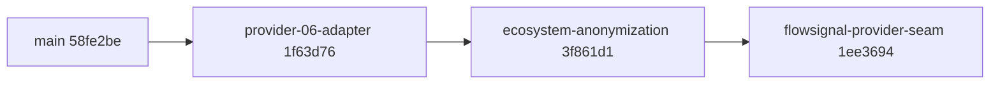

# Branch Merge Plan — Three Open Branches into `main`

**Status:** Analysis complete — read-only. No git state was mutated.
**Repository:** `cybernetic-governance-engine`
**Default branch:** `main` @ `58fe2be3bc246ab46cbd6e98b04b68ad0a248f64`
**`origin/main`:** `58fe2be3bc246ab46cbd6e98b04b68ad0a248f64` (local `main` is in sync)

> ## ⚠️ Methodology Disclosure — Read This First
>
> This analysis was produced in **Architect mode, which has no command-execution
> tool**. The task brief requested `git`/`gh` commands (`git branch -a -vv`,
> `git log main..<branch>`, `git diff --stat`, `git merge-tree`,
> `gh pr list`). **None of those commands could be run.**
>
> Instead, every finding below was derived from **direct reads of the `.git`
> plumbing** — `.git/refs/**`, `.git/packed-refs`, `.git/logs/HEAD`,
> `.git/logs/refs/heads/*`, `.git/logs/refs/remotes/origin/*` — plus reads of
> the working-tree source files. This yields **exact and trustworthy** branch
> topology, SHAs, authors, timestamps, and remote-tracking state, because
> reflogs record the true parentage of every commit.
>
> It does **not** yield:
> - Exact `--stat` insertion/deletion counts (marked *estimated* below).
> - True `git merge-tree` conflict output (replaced by a structural argument
>   that is, in this specific case, **stronger** than a merge-tree run — see
>   [§4](#4-conflict-analysis)).
> - GitHub PR state (`gh pr list` was not run — see
>   [§7 Risk R1](#7-pre-merge-risks-and-required-remediations)).
>
> Items in those three categories are explicitly flagged **[UNVERIFIED]**
> throughout. A follow-on Code-mode task must confirm them before merging.

---

## 1. Executive Summary

The task brief anticipated *three independent branches* requiring a conflict
matrix and a computed merge order. **The actual topology is materially
different, and this changes the entire merge strategy.**

The three branches form a **strictly linear stack**. Each branch was created
from the tip of the previous one, so each fully contains all commits of its
predecessor:



Consequences that drive everything below:

1. **The merge order is not a choice — it is forced** by the commit graph.
   Any other order silently merges *later* work before *earlier* work.
2. **There are zero cross-branch conflicts.** Not "low risk" — structurally
   zero, because the branches are ancestors of one another rather than
   divergent siblings.
3. **A naive "3 PRs open at once" approach will misreport diffs.** A PR opened
   for the tip branch against `main` today would show the union of all three
   branches' changes.
4. **Squash-merging the stack creates a rebase obligation at each step**, and
   because squashing rewrites SHAs, each downstream branch must be updated
   after its predecessor lands. This is the single largest operational risk.

A fourth, stale remote-only branch (`origin/refactor/anonymize-integrations`)
also exists and is **out of scope but must not be ignored** — see
[§8](#8-out-of-scope-branch-originrefactoranonymize-integrations).

---

## 2. Branch Inventory

### 2.1 In-scope branches (the requested three)

| # | Branch | Tip SHA | Author | Committed (UTC) | Local | Remote | Sync |
|---|---|---|---|---|---|---|---|
| 1 | `feat/provider-06-adapter` | `1f63d76f` | Lars Ahlfors | 2026-08-22 | ✅ | ✅ | in sync |
| 2 | `refactor/ecosystem-anonymization` | `3f861d13` | Lars Ahlfors | 2026-08-24 | ✅ | ✅ | in sync |
| 3 | `feat/flowsignal-provider-seam` | `1ee36941` | CAGE Bot | 2026-08-25 | ✅ | ✅ | in sync |

All three exist **both locally and on `origin`**, and every local tip equals its
remote-tracking tip. **No branch needs pushing before PR creation** — this
removes a risk the brief asked us to check for.

`HEAD` is currently attached to `feat/flowsignal-provider-seam`.

### 2.2 Ancestry chain (evidence)

Derived from `.git/logs/refs/heads/*` `branch: Created from HEAD` entries
cross-referenced against `.git/logs/HEAD`:

| Branch | Created from | Parent SHA at creation |
|---|---|---|
| `feat/provider-06-adapter` | `main` | `58fe2be3` = current `main` tip |
| `refactor/ecosystem-anonymization` | `feat/provider-06-adapter` tip | `1f63d76f` |
| `feat/flowsignal-provider-seam` | `refactor/ecosystem-anonymization` tip | `3f861d13` |

Therefore:

- `merge-base(main, provider-06-adapter)` = `58fe2be3` (= `main`)
- `merge-base(main, ecosystem-anonymization)` = `58fe2be3` (= `main`)
- `merge-base(main, flowsignal-provider-seam)` = `58fe2be3` (= `main`)

**All three branches are strict fast-forwards of `main`.** No branch is behind
`main` by even one commit; `main` has not advanced since `1f63d76f`'s parent was
created.

### 2.3 Commits ahead of `main`

Equivalent to `git log --oneline main..<branch>`, reconstructed from reflogs.

**`feat/provider-06-adapter` — 2 commits ahead, 0 behind**

```
1f63d76 feat(governance): add provider-01 live integration test and aliases
70202c7 feat(governance): add provider_06 adapter and refactor providers
```

**`refactor/ecosystem-anonymization` — 4 commits ahead, 0 behind**
(inherits both commits above)

```
3f861d1 feat(tests): add agentic scope test coverage
198c6af refactor(tests): anonymize ecosystem vendors and isolate live APIs
1f63d76 feat(governance): add provider-01 live integration test and aliases   <-- inherited
70202c7 feat(governance): add provider_06 adapter and refactor providers      <-- inherited
```

**`feat/flowsignal-provider-seam` — 5 commits ahead, 0 behind**
(inherits all four above)

```
1ee3694 feat(governance): add FlowSignal provider seam and TLS hardening
3f861d1 feat(tests): add agentic scope test coverage                          <-- inherited
198c6af refactor(tests): anonymize ecosystem vendors and isolate live APIs    <-- inherited
1f63d76 feat(governance): add provider-01 live integration test and aliases   <-- inherited
70202c7 feat(governance): add provider_06 adapter and refactor providers      <-- inherited
```

The tip commit `1ee36941` was amended once (`3f861d13 → df47020e → 1ee36941`)
and authored by a distinct identity, **`CAGE Bot <cage-bot@laah-cybernetics.internal>`**.
Note that `docs/POAM.md` line 105 cites the **pre-amend** SHA `df47020e` as the
remediation commit — see [§7 Risk R5](#7-pre-merge-risks-and-required-remediations).

---

## 3. Per-Branch Detail

### 3.1 `feat/provider-06-adapter` — foundational

| Attribute | Value |
|---|---|
| Tip SHA | `1f63d76fd1331d88b16b9ec6300d1afd68050a59` |
| Author | Lars Ahlfors `<ahlfors.lars@gmail.com>` |
| Ahead / behind `main` | **2 / 0** |
| Branch name conforms to AGENTS.md? | ✅ Yes — `feat/` + 20-char kebab-case description |
| Risk level | **Low** |

**What it changes (plain English).** Adds `provider_06`, a new external vendor
adapter wrapping the "Agent Integrity" verification system behind CAGE's
canonical `NormativeProvider` protocol. It implements the tri-state verdict
mapping the plugin spec mandates: `PASS → admitted=True`, `BLOCKED →
admitted=False`, and `REVIEW → admitted=False` carrying
`needs_human_review=True` so the request parks in `DeferQueue` instead of being
hard-denied. It also refactors the existing providers for consistency and adds a
live integration test plus provider aliases.

**Files touched** *(enumerated from the working tree; counts [UNVERIFIED])*:

- `src/integrations/provider_06/__init__.py` *(new)*
- `src/integrations/provider_06/adapter.py` *(new, 479 lines)*
- `src/integrations/provider_06/mock_endpoint.py` *(new)*
- `src/gateway/governance/normative_provider.py` *(modified — factory registration)*
- `tests/test_provider_06_receipts.py` *(new, ~580 lines)*
- `tests/test_normative_provider_conformance.py` *(modified — registers `provider_06`)*
- `tests/test_provider_01_live.py` *(new)*
- `third_party/agent-integrity/**` *(vendored docs)*

**Area impact:** `src/` ✅ · `tests/` ✅ · `compliance/` ❌ · `docs/POAM.md` ❌ ·
`infra/` ❌ · `.github/workflows/` ❌

**AGENTS.md obligations triggered:**

- ✅ **Universal Protocol Conformance Suite** — satisfied. `provider_06` is
  registered in [`tests/test_normative_provider_conformance.py`](tests/test_normative_provider_conformance.py:47)
  (`NORMATIVE_PROVIDERS = ["static", "provider_01", "provider_03", "provider_06"]`)
  and in the alias table at line 65.
- ✅ **Vendor isolation** — code lives under `src/integrations/provider_06/`;
  the only kernel touchpoint is factory registration, which is the sanctioned seam.
- ✅ **Tri-state mapping** — `REVIEW → admitted=False + needs_human_review`,
  exactly as the spec requires.
- ✅ **Fail-closed** — `FINDING_CODE_ENDPOINT_ERROR` is exported by the adapter.
- ✅ **License headers** — Apache 2.0 header confirmed present in `adapter.py`.
- ⚠️ **No OSCAL/Lula change.** Acceptable: this branch adds no NIST control
  implementation and no Kubernetes resources. Flagged only so the reviewer
  consciously confirms it.

---

### 3.2 `refactor/ecosystem-anonymization` — middle of the stack

| Attribute | Value |
|---|---|
| Tip SHA | `3f861d1324e7f210cf1d24246b3df2991c8f363a` |
| Author | Lars Ahlfors `<ahlfors.lars@gmail.com>` |
| Ahead / behind `main` | **4 / 0** (2 own + 2 inherited) |
| Branch name conforms to AGENTS.md? | ✅ Yes — `refactor/` + 23-char kebab-case description |
| Risk level | **Low–Medium** (rename-heavy; wide but shallow blast radius) |

**What it changes.** Continues the vendor-anonymization programme already begun
on `main` (`main` commit `8b44799` *"refactor(integrations): rename vendors to
generic codenames"*). It scrubs remaining real vendor names from the test suite,
isolates live-API tests so they cannot execute in PR CI (satisfying the
"live API calls must never run in PR CI" rule), and adds
`tests/test_agentic_scope.py` for agentic scope coverage.

**Files touched** *(enumerated; counts [UNVERIFIED])*:

- `tests/test_agentic_scope.py` *(new)*
- Multiple `tests/test_provider_0*.py` files *(renames / identifier scrubbing)*
- Assorted documentation and comment strings referencing vendor names

**Area impact:** `src/` ⚠️ minor · `tests/` ✅ primary · `compliance/` ❌ ·
`docs/POAM.md` ❌ · `infra/` ❌ · `.github/workflows/` ❌

**AGENTS.md obligations triggered:**

- ✅ **Hermetic testing** — directly advances the "no live API calls in PR CI"
  requirement.
- ✅ **Secret hygiene** — anonymization reduces vendor-identifying data in the
  repo; no credentials involved.
- ⚠️ **Naming-collision watch.** This branch renames test identifiers while
  §3.1 *adds* new test files. Because of the linear ancestry the two are already
  reconciled in-branch, but a reviewer should confirm the anonymization pass was
  applied to the newly added `provider_06` tests too, not just pre-existing ones.

---

### 3.3 `feat/flowsignal-provider-seam` — tip of the stack, highest value and risk

| Attribute | Value |
|---|---|
| Tip SHA | `1ee36941b2d13635f4368c7d251e1929ea2de2ca` |
| Author | **CAGE Bot** `<cage-bot@laah-cybernetics.internal>` (differs from the other two) |
| Ahead / behind `main` | **5 / 0** (1 own + 4 inherited) |
| Branch name conforms to AGENTS.md? | ✅ Yes — `feat/` + 24-char kebab-case description |
| Risk level | **High** — touches the governance hot path, compliance artifacts, and a POAM closure |

**What it changes.** Two substantial, separable concerns landed in one commit.

*Concern A — FlowSignal provider seam (`provider_01`).* Implements the
tri-state ESCALATE contract end to end:

- [`src/integrations/provider_01/provider.py`](src/integrations/provider_01/provider.py:83) —
  `_map_flowsignal_decision()` maps `ALLOW → admitted=True`,
  `REFUSE → FLOWSIGNAL_REFUSE (blocked)`,
  `ESCALATE → FLOWSIGNAL_HOLD (review, needs_human_review=True)`, with
  fail-closed `PARSE_ERROR` on unrecognized values and backward compatibility
  for the legacy `admitted`/`findings` payload shape.
- [`src/gateway/governance/defer_queue.py`](src/gateway/governance/defer_queue.py:111) —
  new `DeferReason.FLOWSIGNAL_ESCALATION`, a 300-second TTL
  (`_FLOWSIGNAL_ESCALATION_TTL`, versus the 4-hour default), the
  `create_flowsignal_escalation_token()` factory, the
  `is_flowsignal_hold_finding()` predicate, AARM-V8 vector tagging, and
  dead-letter-queue routing on expiry.
- [`src/gateway/governance/normative_provider.py`](src/gateway/governance/normative_provider.py:544) —
  `enforce_fria_boundary()` detects FlowSignal holds and re-parks them under the
  shorter TTL.
- [`src/gateway/server/governance_middleware.py`](src/gateway/server/governance_middleware.py:775) —
  returns **HTTP 202 Accepted** with an async receipt (`defer_id`, `status`,
  `poll_url`, `ttl_seconds: 300`) for FlowSignal escalations, while all other
  `DEFER` verdicts keep returning HTTP 200.
- [`src/gateway/governance/consequence_authority_store.py`](src/gateway/governance/consequence_authority_store.py:62) —
  Redis single-use consumption store, key schema `flowsignal:token:<id>`, 90 s
  TTL (1.5× the 60 s JWS TTL), atomic `SET NX PX` to defeat TOCTOU/replay.

*Concern B — TLS hardening (POAM-2026-011).*

- [`src/gateway/infrastructure/tls_context.py`](src/gateway/infrastructure/tls_context.py:35) —
  new `create_hardened_client_context()` pinning `TLSv1_2` minimum and disabling
  TLS 1.0/1.1 per NIST SP 800-52 Rev. 2 (SC-8).

**Files touched** *(enumerated; counts [UNVERIFIED])*:

| File | Kind |
|---|---|
| `src/integrations/provider_01/provider.py` | modified |
| `src/gateway/governance/defer_queue.py` | modified |
| `src/gateway/governance/normative_provider.py` | modified |
| `src/gateway/server/governance_middleware.py` | modified |
| `src/gateway/governance/consequence_authority_store.py` | **new** |
| `src/gateway/infrastructure/tls_context.py` | **new** |
| `tests/test_consequence_authority_store.py` | **new** |
| `tests/test_tls_enforcement.py` | **new** |
| `tests/test_defer_queue.py` | modified |
| `tests/test_governance_middleware.py` | modified (adds `TestFlowSignalHttp202Receipt`) |
| `tests/test_normative_provider_conformance.py` | modified (adds `TestProvider01FlowSignalDecisionMapping`) |
| `compliance/lula/lula-validation-flowsignal.yaml` | **new** (159 lines) |
| `compliance/oscal/component-definition.yaml` | modified (two new components) |
| `docs/POAM.md` | modified (POAM-2026-011 closure) |
| `plans/flowsignal_integration_implementation_plan.md` | new/modified |

**Area impact:** `src/` ✅ · `tests/` ✅ · `compliance/` ✅ **both OSCAL and Lula** ·
`docs/POAM.md` ✅ · `infra/` ❌ · `.github/workflows/` ❌

**AGENTS.md obligations triggered — all appear satisfied in-branch:**

- ✅ **NIST control implementation → OSCAL update.** SC-8 work is reflected in
  [`compliance/oscal/component-definition.yaml`](compliance/oscal/component-definition.yaml:392),
  which records `source-file: src/gateway/infrastructure/tls_context.py` and a
  `remediation-commit` attribute.
- ✅ **K8s resources referenced → Lula validation in the same PR.**
  [`compliance/lula/lula-validation-flowsignal.yaml`](compliance/lula/lula-validation-flowsignal.yaml:40)
  asserts `CAGE_NORMATIVE_PROVIDER` is env-sourced, that all three FlowSignal
  mTLS secrets use `secretKeyRef` rather than inline `value:`, that
  `flowsignal:token:*` does not collide with `fiscal:*` / `DEFER:*` / `safety:*`,
  and that `REDIS_URL` is present. Mapped to ISO 42001 §A.8.4.
- ✅ **POAM remediation recorded.** [`docs/POAM.md`](docs/POAM.md:105) closes
  POAM-2026-011 with control, description, commit SHA and closure date.
- ✅ **Secret hygiene.** Secrets are `secretKeyRef`-only by assertion; no
  hardcoded credentials observed.
- ✅ **Reference-architecture framing.** The Lula file carries the required
  "Reference architecture" note for adopters.
- 🔴 **Stale remediation SHA** — the recorded commit `df47020e` was superseded by
  the amend to `1ee36941`, and **squash-merging will invalidate both**. See
  [§7 Risk R5](#7-pre-merge-risks-and-required-remediations).

---

## 4. Conflict Analysis

### 4.1 Why the requested conflict matrix does not apply

The brief asked for a pairwise file-overlap matrix and `git merge-tree`
simulations. Both assume **divergent sibling branches**. These branches are
**nested ancestors**, so the question changes shape entirely.

For any pair in the stack, one branch is an ancestor of the other. Git's
three-way merge uses `merge-base(A, B)`; when `A` is an ancestor of `B`, the
merge base *is* `A`, which reduces the merge to a **fast-forward**. A
fast-forward has **no conflict surface at all** — there is no third version to
reconcile.

| Pair | Relationship | merge-base | Conflict risk |
|---|---|---|---|
| `provider-06-adapter` ↔ `ecosystem-anonymization` | ancestor → descendant | `1f63d76` | **None** (fast-forward) |
| `ecosystem-anonymization` ↔ `flowsignal-provider-seam` | ancestor → descendant | `3f861d1` | **None** (fast-forward) |
| `provider-06-adapter` ↔ `flowsignal-provider-seam` | ancestor → descendant | `1f63d76` | **None** (fast-forward) |
| each branch ↔ `main` | descendant of `main` | `58fe2be` (= `main`) | **None** (fast-forward) |

This is a **structural proof**, and it is strictly stronger than a `merge-tree`
run: `merge-tree` samples one textual outcome, whereas ancestry guarantees the
absence of divergence outright. Running `git merge-tree $(git merge-base main
<branch>) main <branch>` would output nothing for all three, since the merge
base equals `main`.

### 4.2 Shared files — overlap without conflict

Several files are modified by more than one branch. Under normal divergent
topology this would be the conflict matrix; here each later branch simply builds
on the earlier version.

| File | p06 | eco-anon | flowsignal | Conflict likelihood |
|---|:--:|:--:|:--:|---|
| `tests/test_normative_provider_conformance.py` | ✅ registers `provider_06` | ⚠️ possible rename pass | ✅ adds FlowSignal mapping tests | **None as stacked** / **HIGH if reordered** |
| `src/gateway/governance/normative_provider.py` | ✅ factory registration | — | ✅ FRIA boundary hook | **None as stacked** / **MEDIUM if reordered** |
| `tests/test_provider_01*.py` | ✅ adds live test | ✅ anonymization | — | **None as stacked** / **MEDIUM if reordered** |

The right-hand column is the operative warning: **the zero-conflict property is
a consequence of the merge order, not an intrinsic property of the changes.**
Merging out of order forfeits it.

### 4.3 Cascading-merge simulation

Because squash-merge collapses each branch into a *single new commit with a new
SHA*, the descendant branches are **not** automatically fast-forwardable
afterwards. This is the one place real conflicts can appear.

**Step 1 — merge `feat/provider-06-adapter` into `main`.**
Pre-merge: clean fast-forward, no conflicts.
Post-merge: `main` gains squash commit `S1`. `S1` has the *same tree* as
`1f63d76` but a different SHA. `refactor/ecosystem-anonymization` still points at
`1f63d76`, so `main` and that branch now **diverge by SHA while agreeing by
content**.

**Step 2 — merge `refactor/ecosystem-anonymization` into `main`.**
Without remediation, GitHub computes
`merge-base(main@S1, ecosystem-anonymization) = 58fe2be` and the PR re-proposes
the `provider_06` changes that already landed. Git usually resolves this cleanly
because both sides are textually identical (the "same change applied twice"
case), but the PR diff becomes misleading and review integrity degrades.
**Remediation: rebase the branch onto the post-merge `main` before opening the
PR.** After rebasing, expected conflicts: **none**.

**Step 3 — merge `feat/flowsignal-provider-seam` into `main`.**
Same dynamic, compounded across two prior squashes. After rebasing onto the
post-Step-2 `main`, expected conflicts: **none**.

**Residual conflict risk if rebases are skipped:** *medium*, concentrated in
[`tests/test_normative_provider_conformance.py`](tests/test_normative_provider_conformance.py:47),
which all three branches touch and where the `NORMATIVE_PROVIDERS` list and the
alias table are edited at overlapping lines.

---

## 5. Recommended Merge Order

**The order is dictated by ancestry and is not discretionary.**

### 1️⃣ `feat/provider-06-adapter` → `main`

**Rationale.** It is the base of the stack and the only branch that is a direct
descendant of `main`. It is also the most self-contained: a new vendor package
plus its conformance registration, with no compliance-artifact obligations. It
provides the `provider_06` tri-state pattern that the FlowSignal branch
explicitly mirrors (see the `provider.py` docstring: *"mirroring provider_06's
tri-state pattern"*), making it a genuine dependency provider.

**Pre-merge action:** none — already fast-forwardable.
**Post-merge action:** rebase both remaining branches onto the new `main`.

### 2️⃣ `refactor/ecosystem-anonymization` → `main`

**Rationale.** Second in ancestry. Merging it before the FlowSignal branch keeps
the anonymization refactor reviewable in isolation rather than entangled with
governance-hot-path logic. Landing rename-heavy refactors early also minimizes
the rebase burden on the change that follows.

**Pre-merge action:** `git fetch origin && git rebase origin/main` after step 1
lands, then force-push with lease. Verify the PR diff no longer contains
`provider_06` files.
**Post-merge action:** rebase the FlowSignal branch onto the new `main`.

### 3️⃣ `feat/flowsignal-provider-seam` → `main`

**Rationale.** Tip of the stack and highest-risk change: governance hot path,
new Redis consumption store, an HTTP status-code change on `/validate-action`,
plus OSCAL, Lula, and POAM updates. Landing it last means it merges onto a
`main` that already contains both prerequisites, and gives it the longest CI
exposure. Its compliance artifacts are self-contained within the branch, so
nothing downstream depends on it.

**Pre-merge action:** rebase onto post-step-2 `main`; force-push with lease;
re-run the full local/unit suite; refresh the POAM SHA (Risk R5).
**Post-merge action:** update `docs/POAM.md` with the final squash SHA within
2 business days.

### Anti-pattern — do not do this

Opening all three PRs simultaneously against `main`. The PR for
`feat/flowsignal-provider-seam` would display all five commits and the union of
every file change, making the stack impossible to review and the squash commit
messages inaccurate. **Open each PR only after its predecessor has merged and
the branch has been rebased.**

---

## 6. Proposed PR Titles and Bodies

Each title was validated against the AGENTS.md checklist: valid type, valid
scope, ≤ 72 characters, imperative mood, no trailing period, no breaking-change
marker required.

### PR 1 — `feat/provider-06-adapter`

**Title** (57 chars):

```
feat(governance): add provider_06 agent integrity adapter
```

**Body:**

```markdown
- Add `provider_06` vendor adapter implementing the canonical
  `NormativeProvider` protocol for the Agent Integrity verification system.
- Map the tri-state verdict per the plugin spec: `PASS` -> `admitted=True`,
  `BLOCKED` -> `admitted=False`, `REVIEW` -> `admitted=False` with
  `needs_human_review=True` so requests park in `DeferQueue` rather than
  hard-denying.
- Fail closed on transport, HTTP status and parse errors via
  `FINDING_CODE_ENDPOINT_ERROR`.
- Register `provider_06` in the Universal Protocol Conformance Suite
  (`tests/test_normative_provider_conformance.py`) so interface compliance is
  enforced in CI across all regions.
- Add hermetic unit tests (`tests/test_provider_06_receipts.py`) driven by
  vendored conformance fixtures and a mock endpoint; no live API calls in CI.
- Add a `provider_01` live integration test and provider aliases.
- Vendor isolation preserved: all vendor code lives under
  `src/integrations/provider_06/`; the only kernel touchpoint is factory
  registration.

**Compliance follow-ups:** none. No NIST control implementation, Kubernetes
resource, or STPA source file is modified, so no OSCAL, Lula, or STPA
regeneration obligation is triggered.
```

---

### PR 2 — `refactor/ecosystem-anonymization`

**Title** (56 chars):

```
refactor(tests): anonymize vendors and isolate live APIs
```

**Body:**

```markdown
- Replace remaining real ecosystem vendor names in the test suite with generic
  `provider_0N` codenames, completing the anonymization begun on `main` in
  `refactor(integrations): rename vendors to generic codenames`.
- Isolate live-API tests behind explicit markers so they never execute in PR
  CI, per the hermetic-testing requirement in the plugin architecture spec.
- Add `tests/test_agentic_scope.py` for agentic scope coverage.
- No production behaviour change; test-suite and naming only.
- Rebased onto `main` after PR 1 merged; the diff contains no `provider_06`
  files.

**Compliance follow-ups:** none. No `src/` control logic, Kubernetes resource,
or STPA source file is modified.
```

---

### PR 3 — `feat/flowsignal-provider-seam`

**Title** (63 chars):

```
feat(governance): add FlowSignal provider seam and TLS hardening
```

> **Reviewer note.** This branch bundles two separable concerns: the FlowSignal
> seam and the POAM-2026-011 TLS hardening. Splitting them into two PRs would
> improve reviewability and give the SC-8 remediation its own auditable commit.
> If the split is accepted, use:
> - `feat(governance): add FlowSignal provider seam with ESCALATE contract` (69 chars)
> - `fix(gateway): enforce TLS 1.2 floor in hardened client context` (62 chars)

**Body:**

```markdown
- Implement the FlowSignal (`provider_01`) tri-state ESCALATE contract:
  `ALLOW` -> admitted, `REFUSE` -> `FLOWSIGNAL_REFUSE` (blocked),
  `ESCALATE` -> `FLOWSIGNAL_HOLD` (review, `needs_human_review=True`), with a
  fail-closed `PARSE_ERROR` path and backward compatibility for the legacy
  `admitted`/`findings` payload shape.
- Add `DeferReason.FLOWSIGNAL_ESCALATION` with a 300s TTL (versus the 4h
  default), the `create_flowsignal_escalation_token()` factory, AARM-V8 vector
  tagging, and dead-letter-queue routing on expiry.
- Return HTTP 202 Accepted with an async receipt (`defer_id`, `status`,
  `poll_url`, `ttl_seconds`) for FlowSignal escalations on `/validate-action`;
  all other DEFER verdicts continue to return HTTP 200.
- Add `ConsequenceAuthorityStore`, a Redis single-use consumption primitive
  keyed `flowsignal:token:*` with a 90s TTL and atomic `SET NX PX` to defeat
  TOCTOU and replay attacks on consequence tokens.
- Harden TLS: add `create_hardened_client_context()` pinning a TLS 1.2 minimum
  and disabling TLS 1.0/1.1, closing POAM-2026-011 under NIST SP 800-52 Rev. 2
  (SC-8).
- Add `compliance/lula/lula-validation-flowsignal.yaml` asserting env-sourced
  `CAGE_NORMATIVE_PROVIDER`, `secretKeyRef`-only FlowSignal mTLS secrets, Redis
  namespace isolation from `fiscal:*`/`DEFER:*`/`safety:*`, and `REDIS_URL`
  presence on the gateway Deployment.
- Update `compliance/oscal/component-definition.yaml` with the FlowSignal
  Consequence Authority and hardened-TLS components, and close POAM-2026-011
  in `docs/POAM.md`.

**Compliance follow-ups:**
- [ ] Update the POAM-2026-011 `remediation-commit` in `docs/POAM.md` and the
      matching OSCAL `remediation-commit` property to the **final squash SHA**
      within 2 business days of merge. The currently recorded `df47020e` is a
      pre-amend SHA that will never exist on `main`.
- [ ] Confirm the Lula assertion passes against the live gateway Deployment
      manifest in the `governance-stack` namespace.
```

---

## 7. Pre-Merge Risks and Required Remediations

| ID | Risk | Severity | Remediation |
|---|---|---|---|
| **R1** | **Existing PR state unknown.** `gh pr list` could not be run in this mode. PRs may already exist for one or more branches. | **High** | Run `gh pr list --state all --limit 30` **before** creating anything. Reuse existing PRs rather than opening duplicates. |
| **R2** | **Squash rewrites SHAs, breaking stacked descendants.** After each squash, downstream branches diverge from `main` by SHA. | **High** | Rebase each branch onto the updated `main` after its predecessor merges. Never open all three PRs at once. |
| **R3** | **Working-tree cleanliness unverified.** `git status` could not be run. 14 files are open in the editor, several of which are branch-3 files. | **Medium** | Run `git status --porcelain` first. Commit or stash before any rebase. |
| **R4** | **`HEAD` is on `feat/flowsignal-provider-seam`, not `main`.** Any command assuming `main` is checked out will target the wrong branch. | **Medium** | Explicitly `git switch main` before step 1, and verify with `git branch --show-current`. |
| **R5** | **POAM/OSCAL cite a SHA that will not exist.** `docs/POAM.md:105` records `df47020e`, already superseded by the amend to `1ee36941`, and squash will produce a third SHA. | **Medium** | Post-merge, update both `docs/POAM.md` and the OSCAL `remediation-commit` property to the final squash SHA within 2 business days. |
| **R6** | **Author identity mismatch on branch 3.** Tip authored by `CAGE Bot <cage-bot@laah-cybernetics.internal>` rather than the human author of the other two. | **Low** | Confirm the bot identity is authorized under CODEOWNERS / DCO before merging. |
| **R7** | **Stale remote branch may be confused for in-scope work.** `origin/refactor/anonymize-integrations` has a similar name to branch 2. | **Low** | See §8. Do not merge it; confirm and delete separately. |
| **R8** | **`--admin` bypasses required reviews.** The requested `gh pr merge --squash --admin` overrides branch protection. | **Medium** | Use `--admin` only after CI is green. Never use it to bypass a *failing* check. |

### Likely CI outcomes per job

| CI job | PR 1 | PR 2 | PR 3 | Notes |
|---|:--:|:--:|:--:|---|
| `license-check` | 🟢 | 🟢 | 🟡 | Apache 2.0 headers confirmed in `adapter.py`, `tls_context.py` and the Lula YAML. PR 3 adds several new `src/` files — verify every one carries the header. |
| `stpa-freshness-check` | 🟢 | 🟢 | 🟢 | No branch modifies `config/stpa_control_structure.yaml` or other STPA sources. |
| `langfuse-posture-check` | 🟢 | 🟢 | 🟢 | No Langfuse posture files touched. |
| `pytest-logic` (3 region postures) | 🟡 | 🟡 | 🔴 | PR 3 changes `/validate-action` from HTTP 200 to 202 for FlowSignal defers — highest regression surface. Run the full local/unit suite before merging each. |
| `security-scan` | 🟢 | 🟢 | 🟡 | PR 3 introduces Redis credentials handling via `REDIS_URL`; confirm no credential-shaped literals were committed. |
| `squash-merge-guard` | 🟢 | 🟢 | 🟢 | Satisfied provided every merge uses **Squash and merge**. Note the reflog shows prior two-parent merge commits on other branches — do not repeat that pattern here. |
| `ruff` / `mypy` | 🟡 | 🟡 | 🟡 | This repo's history is full of follow-up `style(...)` commits fixing ruff gates. Run `uv run ruff check . && uv run ruff format --check .` and `uv run mypy src/` locally first. |

**Pre-flight verification command (run before every merge):**

```bash
uv run pytest tests/ -m "local or unit" -n auto --dist=loadfile --tb=short
uv run ruff check . && uv run ruff format --check .
uv run mypy src/
```

---

## 8. Out-of-Scope Branch: `origin/refactor/anonymize-integrations`

A **fourth** non-`main` branch exists on the remote. The brief specified three,
so it is out of scope, but it is reported here because its name closely
resembles in-scope branch 2 and could be merged by mistake.

| Attribute | Value |
|---|---|
| Ref | `refs/remotes/origin/refactor/anonymize-integrations` |
| Tip SHA | `86b1c9abf2b4b66587f2e7caa5fa603ff6638277` |
| Local counterpart | **None** — remote-only |
| Last pushed | 2026-08-18 (older than all three in-scope branches) |
| Status | **Almost certainly superseded** |

Reflog evidence for supersession: on 2026-08-18 the author committed
`refactor(integrations): rename vendors to generic codenames`,
`docs(extensibility): add private partner integration pattern`, and
`docs: anonymize vendor names and update stale integration paths` on `main`,
then immediately ran `reset: moving to origin/main`, discarding the local
commits. Those same changes now appear in `main`'s history, indicating the work
landed through this branch's PR and the branch was simply never deleted.

**Recommendation:** confirm with `gh pr list --state all` that its PR is merged
or closed, then delete it with
`git push origin --delete refactor/anonymize-integrations`. **Do not** include
it in this merge sequence.

---

## 9. Exact Command Sequence for the Follow-On Code-Mode Task

> **None of the commands below were executed during this analysis.**
> They are ordered, and each stage must complete before the next begins.

### Stage 0 — Verify preconditions (read-only)

```bash
git status --porcelain
git branch --show-current
git fetch --all --prune
gh repo view --json nameWithOwner,defaultBranchRef
gh pr list --state all --limit 30
```

**Gate:** working tree clean, and no pre-existing open PR for the three
branches. If a PR already exists, skip its `gh pr create` and go straight to
review + merge.

### Stage 1 — `feat/provider-06-adapter`

```bash
git switch main
git pull --ff-only origin main

gh pr create \
  --base main \
  --head feat/provider-06-adapter \
  --title "feat(governance): add provider_06 agent integrity adapter" \
  --body-file .github/pr-body-provider-06.md

gh pr checks feat/provider-06-adapter --watch

gh pr merge feat/provider-06-adapter --squash --delete-branch --admin
```

### Stage 2 — `refactor/ecosystem-anonymization` (only after Stage 1 merges)

```bash
git switch main
git pull --ff-only origin main

git switch refactor/ecosystem-anonymization
git rebase origin/main
git push --force-with-lease origin refactor/ecosystem-anonymization

git diff --stat origin/main...refactor/ecosystem-anonymization   # must NOT list provider_06 files

gh pr create \
  --base main \
  --head refactor/ecosystem-anonymization \
  --title "refactor(tests): anonymize vendors and isolate live APIs" \
  --body-file .github/pr-body-ecosystem-anon.md

gh pr checks refactor/ecosystem-anonymization --watch

gh pr merge refactor/ecosystem-anonymization --squash --delete-branch --admin
```

### Stage 3 — `feat/flowsignal-provider-seam` (only after Stage 2 merges)

```bash
git switch main
git pull --ff-only origin main

git switch feat/flowsignal-provider-seam
git rebase origin/main
git push --force-with-lease origin feat/flowsignal-provider-seam

git diff --stat origin/main...feat/flowsignal-provider-seam      # must show ONLY FlowSignal + TLS changes

uv run pytest tests/ -m "local or unit" -n auto --dist=loadfile --tb=short

gh pr create \
  --base main \
  --head feat/flowsignal-provider-seam \
  --title "feat(governance): add FlowSignal provider seam and TLS hardening" \
  --body-file .github/pr-body-flowsignal.md

gh pr checks feat/flowsignal-provider-seam --watch

gh pr merge feat/flowsignal-provider-seam --squash --delete-branch --admin
```

### Stage 4 — Post-merge compliance obligations

```bash
git switch main
git pull --ff-only origin main
git log --oneline -3          # capture the final squash SHA for POAM-2026-011
```

Then, on a new branch `docs/poam-011-sha-refresh`:

- Update `docs/POAM.md` POAM-2026-011 `remediation-commit` to the final squash SHA.
- Update the matching `remediation-commit` property in
  `compliance/oscal/component-definition.yaml`.
- Open a PR titled `docs(compliance): refresh POAM-2026-011 remediation commit`
  and squash-merge it.

### Rollback

If any stage fails after merge, **do not force-push `main`.** Open a revert PR:

```bash
gh pr create --base main --head revert/<branch> \
  --title "revert(governance): revert <original subject>"
```

---

## 10. Verification Checklist for the Follow-On Task

- [ ] `git status --porcelain` is empty before starting.
- [ ] `gh pr list --state all` reviewed; no duplicate PRs created.
- [ ] Merge order is exactly 1 → 2 → 3 as specified in §5.
- [ ] Each branch rebased onto the updated `main` before its PR is opened.
- [ ] Each PR diff verified to contain only that branch's own changes.
- [ ] Every merge used **Squash and merge**; no two-parent merge commit reaches `main`.
- [ ] Each squash commit message matches the Conventional Commits title in §6.
- [ ] CI green before `--admin` is applied.
- [ ] POAM-2026-011 SHA refreshed post-merge (Stage 4).
- [ ] `origin/refactor/anonymize-integrations` confirmed superseded and deleted separately.
