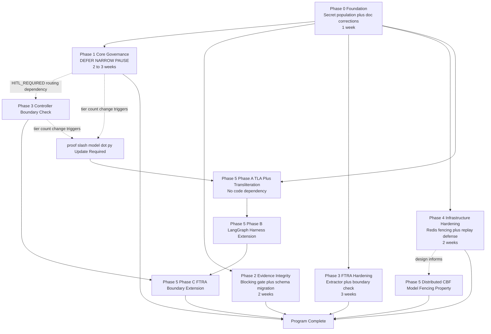

# CAGE Implementation Plan

| Field | Value |
|---|---|
| Status | DRAFT — master implementation plan, no code changes |
| Scope | Synthesizes [`plans/CAGE_IMPLEMENTATION_SPECS.md`](CAGE_IMPLEMENTATION_SPECS.md), [`plans/CAGE_RISK_MATRIX.md`](CAGE_RISK_MATRIX.md), and [`plans/CAGE_TESTING_FRAMEWORK.md`](CAGE_TESTING_FRAMEWORK.md) into a phased, actionable project plan |
| Audience | Engineering leadership, project/program management, release managers, compliance owners |

## Table of Contents

1. [Executive Summary](#1-executive-summary)
2. [Project Phases with Milestones](#2-project-phases-with-milestones)
3. [Critical Path Analysis](#3-critical-path-analysis)
4. [Deliverables Matrix](#4-deliverables-matrix)
5. [Success Metrics and KPIs](#5-success-metrics-and-kpis)
6. [Resource Requirements](#6-resource-requirements)
7. [Communication and Governance](#7-communication-and-governance)
8. [Risk-Adjusted Timeline](#8-risk-adjusted-timeline)
9. [Rollback and Contingency Summary](#9-rollback-and-contingency-summary)
10. [Appendices](#10-appendices)

---

## 1. Executive Summary

### 1.1 Project Scope and Objectives

This plan operationalizes the CAGE remediation backlog identified by the
CAGE analysis and detailed across three companion planning documents:
technical design ([`CAGE_IMPLEMENTATION_SPECS.md`](CAGE_IMPLEMENTATION_SPECS.md)),
risk posture ([`CAGE_RISK_MATRIX.md`](CAGE_RISK_MATRIX.md)), and validation
strategy ([`CAGE_TESTING_FRAMEWORK.md`](CAGE_TESTING_FRAMEWORK.md)). The
program closes six categories of gap in the CAGE governance pipeline
(FTRA Tier 0.5 → NeMo → STPA/UCA → CBF/OPA → Fiscal Limit → Consensus →
Causal Gatekeeper → Adaptive FRIA):

1. **Runtime wiring defects** — `GovernanceDecision.DEFER` is enum-defined
   and adapter-rendered but never returned by `validate_action()`, collapsing
   DEFER-eligible cases into hard DENY.
2. **Operational activation gaps** — the reconciliation worker is
   code/manifest-complete but blocked on secret population
   (POAM-2026-038).
3. **Documentation drift** — `CAGE_ARXIV.md` §5.4 makes stale claims about
   the reconciliation worker that no longer match the codebase.
4. **Trust-boundary bypass surfaces** — FTRA's `ftra_node` runs inside the
   untrusted host agent process; a direct-HTTP caller to the Controller
   bypasses it entirely.
5. **Evidence/integrity gaps** — evidence-chain ingestion is fire-and-forget
   and fail-open; the hash schema has a canonicalization defect (1.0→1.1
   migration).
6. **Unbuilt formal-verification and infrastructure-hardening subsystems** —
   no distributed multi-agent CBF model, no Redis replication fencing.

**Objectives:**

- Restore the full governance decision spectrum (ALLOW / DENY /
  REQUIRE_APPROVAL / DEFER / NARROW / PAUSE) with DEFER actually reachable
  end-to-end, and NARROW/PAUSE introduced as new opt-in primitives.
- Close the Controller-boundary FTRA bypass so "FTRA cannot be bypassed"
  becomes an accurate claim rather than an aspirational one.
- Make evidence-of-execution guarantees match their documented scope, with
  an opt-in blocking mode for environments requiring durability guarantees.
- Harden FTRA against schema drift and generalize it via a pluggable
  extractor abstraction, achieving "true minimum-impact, any-agent" status.
- Prepare Redis infrastructure for safe multi-node operation.
- Extend formal verification to cover concurrent multi-agent contention and
  a larger slice of the runtime state machine.
- Close POAM-2026-038 and correct stale documentation claims.

### 1.2 High-Level Timeline

**Total duration estimate: approximately 14–19 weeks (~3.5–4.5 months)**
end-to-end across six phases, with Phase 5 (Formal Verification) able to
run substantially in parallel with Phases 1–4 once Phase 0 completes (see
[§3 Critical Path Analysis](#3-critical-path-analysis) for the parallelizable
structure). The sequential critical path — excluding parallelizable formal
verification work — is approximately **10–13 weeks**.

| Phase | Estimated Duration | Can Run in Parallel With |
|---|---|---|
| Phase 0: Foundation | 1 week | — (must complete first; gates all else) |
| Phase 1: Core Governance Enhancements | 2–3 weeks | Phase 5 (Formal Verification, Stage 3/Phase A only) |
| Phase 2: Evidence and Integrity | 2 weeks | Phase 4 (independent subsystem) |
| Phase 3: FTRA Harness Hardening | 3 weeks | Phase 4 (independent subsystem) |
| Phase 4: Infrastructure Hardening | 2 weeks | Phase 2, Phase 3 |
| Phase 5: Formal Verification | 4–6 weeks | Phases 1–4 (Phase A/B can start at Phase 0 exit; Phase C depends on Phase 1/3 completion) |

### 1.3 Key Success Metrics Summary

- **POAM-2026-038 closed** with KMS-signature verification timestamp
  evidence and ≥ 3 consecutive successful CronJob runs.
- **FTRA "true minimum-impact, any-agent" status** achieved across all 5
  conditions: pluggable extractor abstraction, documented/enforced
  plan-and-execute precondition, Controller-boundary bypass closure,
  formal verification of reachability analysis, hardened `_parse_plan()`.
- **200ms SLA validated** against a live (non-mocked) GKE cluster with
  provenance-recorded gates E1–E6 passing.
- **4 reviewer invariants closed**: Composed Authority, Mediation Coverage,
  Bounded Composite Authority, Evidence Sufficiency.
- **Zero regressions** in the existing 2553-passed/51-skipped live-GKE
  integration baseline.
- **Documentation accuracy restored**: `CAGE_ARXIV.md` §5.4 stale claims
  corrected with commit-SHA evidence trail.

### 1.4 Resource Requirements Overview

The program spans Gateway governance engineering, Compliance Bridge
engineering, Platform/SRE, Infrastructure/platform engineering, Formal
verification/proof engineering, Security, and Compliance/OSCAL
documentation. Peak concurrent engineering effort is reached during Phases
2–4 (evidence integrity, FTRA hardening, and Redis hardening running in
parallel). See [§6 Resource Requirements](#6-resource-requirements) for a
phase-by-phase breakdown in person-weeks and required skills.

---

## 2. Project Phases with Milestones

Phase numbering and scope follow the priority ordering from the analysis
(P0 → P1 → P2) and the Stage 0–3 rollout sequence already defined in
[`CAGE_IMPLEMENTATION_SPECS.md` §6.3](CAGE_IMPLEMENTATION_SPECS.md#63-feature-flag-rollout-sequence).
Each phase lists entry criteria, work items, exit criteria (milestone), and
the risk/test cross-references that gate completion.

### Phase 0: Foundation

**Estimated duration: 1 week**
**Priority: P0 — highest-leverage, lowest-cost**
**Corresponds to: Specs §2.7, §2.8, §6.3 Stage 0 (operational items) | Risk R-13, R-04 (partial) | Testing §2.E, §5.3**

**Entry criteria:** None — this phase has no dependency on other program
work and should start immediately.

**Work items:**

1. **Secret population and operational fixes (POAM-2026-038).** Execute the
   activation checklist in
   [`CAGE_IMPLEMENTATION_SPECS.md` §2.7](CAGE_IMPLEMENTATION_SPECS.md#27-reconciliation-worker--activation-requirements):
   populate `gcs-reconciliation-bucket` (and `gcs-reconciliation-object` if
   non-default) in the `reconciliation-worker-secrets` Secret, confirm
   `kms-governance-key` is populated, verify `RECONCILIATION_PROVIDER=gcs`,
   re-apply the manifest, and verify ≥ 3 consecutive scheduled CronJob runs
   complete without `CreateContainerConfigError`.
2. **Documentation corrections (CAGE_ARXIV.md stale claims).** Correct the
   four stale §5.4 claims identified in
   [`CAGE_IMPLEMENTATION_SPECS.md` §2.8](CAGE_IMPLEMENTATION_SPECS.md#28-cage_arxivmd-stale-claims-correction-documentation-spec)
   using the `scripts/_patch_paper.py`-style replacement-block pattern, and
   record the change in `docs/paper/REVISION_TRACKER.md`.
3. **(Recommended addition, flagged by Risk Matrix as a specs gap)**
   Author a new §2.10 "Reconciliation Payload Replay Defense" section in
   `CAGE_IMPLEMENTATION_SPECS.md` scoping the R-04 monotonic sequence-number
   fix, since the Risk Matrix identifies this as the highest-priority
   specs gap (§5, "Gaps identified during traceability review"). This is a
   design task, not an implementation task, and should land before Phase 1
   begins coding against `cbf.py`.

**Exit criteria / Milestone: Reconciliation worker operational.**

- `kubectl get cronjob reconciliation-worker` shows ≥ 3 consecutive
  successful runs (15-minute observation window minimum, per Testing
  Framework §2.E closure checklist).
- `redis-cli GET reconciliation:verified_balance` returns a non-empty,
  KMS-signed payload.
- POAM-2026-038 closed in `docs/POAM.md` with commit SHA and KMS-signature
  verification timestamp.
- `CAGE_ARXIV.md` §5.4 no longer contains any of the four identified stale
  claims; `docs/paper/REVISION_TRACKER.md` records the correction.

### Phase 1: Core Governance Enhancements

**Estimated duration: 2–3 weeks**
**Priority: P0 (DEFER wiring) / P1 (NARROW/PAUSE, HTTP routing)**
**Corresponds to: Specs §2.1, §3.2, §6.3 Stage 0–2 | Risk R-01, R-02 (partial) | Testing §2.A**

**Entry criteria:** Phase 0 complete (reconciliation worker operational;
no hard code dependency, but sequencing avoids concurrent high-risk changes
during the secret-population validation window).

**Work items:**

1. **DEFER wiring in `validate_action()`** (no feature flag — direct
   correctness fix). Implement `_classify_violation()` per
   [`CAGE_IMPLEMENTATION_SPECS.md` §2.1](CAGE_IMPLEMENTATION_SPECS.md#21-governance-layer--defernarrowpause-primitives)
   and wire the `DEFER` branch into `validate_action()` ahead of the
   existing DENY branch, reusing the already-implemented `DeferQueue`.
2. **NARROW primitive implementation.** Add `NARROW` to
   `GovernanceDecision`, implement the CBF-branch clamping logic gated
   behind `CAGE_NARROW_ENABLED` (default `"false"`).
3. **PAUSE primitive implementation.** Add `PAUSE` to
   `GovernanceDecision`, build the shared `pause_primitive.py` helper
   generalizing FTRA's `_raise_node_interrupt()` pattern, and the new
   `POST /v1/pause/{resume_token}/resume` endpoint.
4. **HTTP routing changes (202 response handling).** Add `NARROW`
   (200)/`PAUSE` (202) branches to `agent_gateway_adapter.py`'s
   `handle_check_request()` mirroring the existing DEFER branch; confirm
   `governance_middleware.py`'s `/validate-action` endpoint requires no
   change (verdict passthrough already generic).
5. **Provenance chain extension.** Extend `VALID_DECISIONS` frozenset in
   `provenance_chain.py` with `NARROW`, `PAUSE`.
6. **AgentState field additions.** Add `narrow_status`, `narrowed_params`,
   `pause_resume_token`, `pause_reason` to `AgentState` per
   [`CAGE_IMPLEMENTATION_SPECS.md` §4.3](CAGE_IMPLEMENTATION_SPECS.md#43-agentstate-field-additions).

**Exit criteria / Milestone: Full governance decision spectrum operational.**

- All rows of the `_classify_violation()` classification table have
  explicit test coverage (100% branch coverage per Testing Framework §1.3).
- `test_validate_action_returns_defer_verdict_not_governance_error` and the
  full `tests/test_classify_violation.py` suite pass.
- `test_narrow_verdict_returns_200_with_narrowed_params` and
  `test_pause_verdict_returns_202_with_resume_token` pass with flags
  enabled; `test_narrow_disabled_falls_back_to_deny` confirms default-off
  backward compatibility.
- Regression guard `test_deny_rate_unchanged_for_non_defer_eligible_traffic`
  passes (protects against the documented DENY→202 behavior-change risk
  called out in Specs §6.1).
- **Note:** this phase's tier-count/outcome-domain change is a **blast-radius
  trigger** for `proof/model.py` per Specs §6.4 — coordinate with Phase 5
  Phase A/B work before merging if the outcome domain changes.

### Phase 2: Evidence and Integrity

**Estimated duration: 2 weeks**
**Priority: P1**
**Corresponds to: Specs §2.3, §4.1, §6.2 | Risk R-06, R-10 | Testing §2.B, §4.3**

**Entry criteria:** Phase 0 complete. Independent of Phase 1's governance
primitives (no shared code path), so may start concurrently with Phase 1
if staffing allows — see [§3 Critical Path Analysis](#3-critical-path-analysis).

**Work items:**

1. **Evidence chain blocking gate implementation.** Add
   `EVIDENCE_CHAIN_BLOCKING` env var (default `"false"`), implement
   `EvidenceStreamSink.ingest_sync()` per
   [`CAGE_IMPLEMENTATION_SPECS.md` §2.3](CAGE_IMPLEMENTATION_SPECS.md#23-evidence-chain--blocking-gate),
   and integrate the fail-closed call site immediately before seal issuance
   in `validate_action()`.
2. **Startup precondition validation.** Fail fast at startup if
   `EVIDENCE_CHAIN_BLOCKING=true` but `EVIDENCE_STREAM_ENABLED=false`.
3. **Schema migration (1.0→1.1).** Fix the canonical hash separator defect
   (`separators=(",", ":")` on the payload JSON), bump `_SCHEMA` to
   `"cage-evidence-stream/1.1"`, and implement the dual-schema
   `verify_record()` utility per
   [`CAGE_IMPLEMENTATION_SPECS.md` §6.2](CAGE_IMPLEMENTATION_SPECS.md#62-evidence-chain-hash-migration-strategy).
4. **Cutover procedure execution.** Deploy during a dedicated low-traffic
   maintenance window (**not** bundled with any other Stage 1/2 rollout
   item, per Specs §6.3/Risk Matrix R-10 temporal dependency #4); verify
   `_prev_hash` seeds from the last persisted record via
   `XREVRANGE ... COUNT 1`, not the genesis sentinel; record the cutover
   `sequence` boundary in `docs/POAM.md` and `compliance/oscal/`.
5. **OSCAL AU-12 correction.** Update the `compliance/oscal/` component
   definition to distinguish the decision-time NoDirectBind invariant from
   the opt-in, fail-open-unless-blocking evidence-of-execution guarantee
   (closes R-06).

**Exit criteria / Milestone: Evidence-chain blocking mode validated.**

- `test_blocking_true_gates_seal_issuance_on_commit` and
  `test_blocking_true_denies_on_sink_unavailable` pass.
- `test_blocking_false_preserves_fire_and_forget` confirms byte-for-byte
  backward compatibility when the flag is off.
- `test_heterogeneous_schema_chain_verifies_end_to_end` and
  `test_cutover_boundary_prev_hash_seeded_from_last_record_not_genesis`
  pass — no audit-chain discontinuity.
- `docs/POAM.md` and `compliance/oscal/` record the cutover boundary
  (sequence number, both chain-boundary hashes).
- `test_lula_au12_reflects_evidence_chain_blocking_state` passes.

### Phase 3: FTRA Harness Hardening

**Estimated duration: 3 weeks**
**Priority: P1**
**Corresponds to: Specs §2.2, §2.4, §2.5 | Risk R-01, R-02, R-03, R-07 | Testing §2.C, §4.1**

**Entry criteria:** Phase 0 complete. Independent of Phase 2 (different
subsystem — FTRA vs. evidence chain); may run concurrently with Phase 2.
The Controller-boundary check work item depends on Phase 1's
`_classify_violation()` landing first (HITL_REQUIRED routes through it).

**Work items:**

1. **Pluggable extractor abstraction.** Implement `FtraNodeConfig` dataclass
   in `langgraph_harness/types.py` per
   [`CAGE_IMPLEMENTATION_SPECS.md` §2.4](CAGE_IMPLEMENTATION_SPECS.md#24-ftra-harness--pluggable-extractor-abstraction),
   with `plan_extractor`/`confidence_extractor` defaults reproducing
   today's GFA-specific behavior exactly.
2. **Schema-drift hardening (BUG-FTRA-SCHEMA-001, BUG-FTRA-JSON-001).**
   Implement structured `ParseResult(plan, failure_class)` return type
   distinguishing `SCHEMA_VALIDATION_ERROR` / `JSON_DECODE_ERROR` /
   `EMPTY_STEPS`; add pre-parse tokenizer-artifact sanitization gated by
   `FTRA_SANITIZE_TOKENIZER_ARTIFACTS` (default `"true"`); add the
   `cage.ftra.parse_failure_class` OTel span attribute.
3. **Controller-boundary bypass closure.** Implement
   `_ftra_boundary_check()` inside `SymbolicGovernor._run_checks()` per
   [`CAGE_IMPLEMENTATION_SPECS.md` §2.2](CAGE_IMPLEMENTATION_SPECS.md#22-controller-boundary-ftra-enforcement-bypass-closure),
   gated behind `CAGE_FTRA_BOUNDARY_ENABLED` (default `"false"`), sharing
   `IrreversibilityClassifier`/`terminal_registry.json` with the in-graph
   node.
4. **Compatibility contract documentation.** Publish the plan-and-execute
   precondition as a first-class FTRA compatibility requirement (R-01
   mitigation); add startup-time compatibility self-check telemetry for
   N-consecutive `EMPTY_STEPS`/absent-plan results.
5. **Interim NetworkPolicy compensating control (if boundary check rollout
   is staged).** Restrict network access to `/validate-action`/ext_authz
   endpoints to the trusted host agent process while
   `CAGE_FTRA_BOUNDARY_ENABLED` is still `"false"` in a given region.
6. **Staged per-region rollout.** Enable `CAGE_FTRA_BOUNDARY_ENABLED` per
   region (dev → staging → US_FED prod → EU_ECB/APAC_MAS prod), monitoring
   DENY/DEFER rate delta against the KRI thresholds (warning > 1.5x,
   critical > 2x baseline).

**Exit criteria / Milestone: FTRA "true minimum-impact" status achieved.**

All 5 conditions from the analysis's success criteria must be demonstrated:

1. Pluggable extractor abstraction — `test_create_ftra_node_default_config_matches_legacy_behavior`
   and custom-extractor tests pass.
2. Documented/enforced plan-and-execute precondition —
   `test_reactive_agent_without_plan_fails_closed_with_clear_diagnostic`
   passes; compatibility contract published.
3. Controller-boundary bypass closure —
   `test_boundary_check_classifies_direct_http_bypass` and
   `test_boundary_check_shares_classification_with_in_graph_node` pass.
4. Formal verification of reachability analysis — coordinated with Phase 5
   (`proof/distributed_cbf_model.py` BFS enumeration).
5. Hardened `_parse_plan()` — BUG-FTRA-SCHEMA-001/BUG-FTRA-JSON-001
   regression tests green.

Additional gate: DENY/DEFER rate delta after `CAGE_FTRA_BOUNDARY_ENABLED`
flip stays within the ≤ 1.5x warning threshold in every region before
promoting to the next region.

### Phase 4: Infrastructure Hardening

**Estimated duration: 2 weeks**
**Priority: P2**
**Corresponds to: Specs §2.6, §4.2 | Risk R-04, R-05 | Testing §2.D, §4.2**

**Entry criteria:** Phase 0 complete. Independent subsystem (Redis
infrastructure) — may run concurrently with Phase 2 and Phase 3.

**Work items:**

1. **Reconciliation payload replay defense (R-04, P0-adjacent).** Embed a
   monotonic sequence number in the KMS-signed balance payload; reject any
   payload whose sequence number does not strictly advance. This is
   independent of Redis replication topology and should ship ahead of or
   alongside the rest of Phase 4's work given its active-exploit nature
   per the Risk Matrix.
2. **Fence epoch implementation.** Add `CAGE_REDIS_SYNCHRONOUS_REPLICATION`
   env var (default `"false"`); implement the monotonic `safety:fence_epoch`
   Lua-script counter co-located with the existing debit script.
3. **WAIT/Sentinel-aware fencing.** Implement `WAIT <replica_count>
   <timeout_ms>` acknowledgment or Sentinel-aware epoch verification on
   every CBF-mutating write, reusing the existing Sentinel-probe pattern in
   `checkpointer.py`.
4. **Fencing read-path check.** Reject any balance record whose
   `safety:fence_epoch` regresses relative to the highest previously
   observed epoch.
5. **Chaos/failover test suite.** Build `tests/test_redis_failover_chaos.py`
   including the negative control
   (`test_failover_without_fencing_reproduces_known_vulnerability`) that
   demonstrates the vulnerability is real absent the fix.

**Exit criteria / Milestone: Multi-node Redis deployment safe.**

- `test_fence_epoch_increments_on_every_cbf_mutating_write` and
  `test_read_path_rejects_regressed_epoch` pass.
- `test_failover_stale_replica_read_rejected` and
  `test_failover_no_double_spend_under_concurrent_trades` pass against a
  simulated failover topology.
- `test_monotonic_sequence_number_rejects_non_advancing_replay` passes
  (R-04 closure, independent of replication adoption).
- Both flags (`CAGE_REDIS_SYNCHRONOUS_REPLICATION`,
  reconciliation-sequence-check flag) remain `"false"`/no-op by default in
  the reference single-node deployment — this milestone documents
  readiness for replication adoption, not a change to the reference
  deployment's default topology.

### Phase 5: Formal Verification

**Estimated duration: 4–6 weeks**
**Priority: P2**
**Corresponds to: Specs §2.9, §6.4 | Risk R-15 | Testing §2.F**

**Entry criteria:** Phase A (TLA+ transliteration) has **no code
dependency** and may start immediately at Phase 0 exit, in parallel with
Phases 1–4. Phase C (FTRA boundary extension) depends on Phase 3
(Controller-boundary check) landing. The distributed CBF model (§2.9.1)
has no dependency on Phases 1–4 and may also start early, though its
"fencing interaction" property (assertion 3) is most meaningful once
Phase 4's fence-epoch design is finalized (design, not implementation,
dependency).

**Work items:**

1. **Distributed formal model creation** (`proof/distributed_cbf_model.py`,
   new). Implement the N-concurrent-agent BFS model per
   [`CAGE_IMPLEMENTATION_SPECS.md` §2.9.1](CAGE_IMPLEMENTATION_SPECS.md#291-distributed-formal-model-proofdistributed_cbf_modelpy-new):
   safety property (N ∈ {2,3,4}), negative control (ungated TOCTOU
   variant), fencing-interaction property. Add the `distributed-cbf-proof`
   CI job.
2. **NoDirectBind proof extension — Phase A.** TLA+ transliteration of the
   existing `proof/model.py` 21-state automaton; cross-validate reachable
   state counts against the Python BFS enumeration via TLC.
3. **NoDirectBind proof extension — Phase B.** Extend the TLA+ model to
   include the LangGraph harness state machine (NodeInterrupt/GraphInterrupt
   suspension, `hitl_expires_at` TTL, Redis checkpoint persistence).
4. **NoDirectBind proof extension — Phase C.** Extend to include the FTRA
   boundary (both in-graph node and Phase 3's Controller-boundary check).
5. **Runtime conformance testing.** Build
   `tests/test_formal_model_conformance.py` intercepting live
   `_run_checks()` traces and asserting every observed tier-outcome tuple
   corresponds to a BFS-reachable state.
6. **Blast-radius consistency updates.** Any Phase 1/3 change that alters
   `_run_checks()`'s tier list or outcome domain (DEFER/NARROW/PAUSE,
   Controller-boundary FTRA check) **must** trigger updates to
   `proof/model.py`'s `TIERS`, `tests/test_no_direct_bind_proof.py`'s
   `EXPECTED_*` constants, and `docs/paper/REVISION_TRACKER.md`'s
   consistency blast-radius section before those Phase 1/3 changes merge.
7. **(Stretch) Phase D — Alloy bounded model-checking** of the distributed
   multi-agent case as a complementary technique to the exhaustive Python
   BFS.

**Exit criteria / Milestone: Formal verification artifacts complete.**

- `proof/distributed_cbf_model.py` passes `test_safety_holds_for_2_3_4_concurrent_agents`
  and `test_ungated_variant_produces_reachable_violation` (negative control
  confirms the model is load-bearing).
- `test_stale_epoch_commit_rejected_in_all_reachable_states` analytically
  validates the Phase 4 fencing design.
- TLA+ Phase A cross-validation confirms the 21/24/19/20 reachable-state
  counts match the Python BFS enumeration exactly.
- `tests/test_no_direct_bind_proof.py`'s `EXPECTED_*` constants are
  up to date with any Phase 1/3 tier-count changes; CI's
  `no-direct-bind-proof` and `distributed-cbf-proof` jobs both green on
  `main`.
- Every formal-verification claim in the paper/technical report is
  explicitly scoped to what has actually been proven (no
  multi-agent-concurrency overclaim per R-15 contingency plan) at any
  point where a sub-phase remains incomplete.

---

## 3. Critical Path Analysis

### 3.1 Dependency Diagram

### 3.2 Sequential vs. Parallel Task Identification

| Track | Phases | Relationship |
|---|---|---|
| **Sequential (hard gate)** | Phase 0 → everything else | Phase 0 has zero dependencies and must complete first; it is the single point all other phases branch from |
| **Sequential (soft gate, within Track A)** | Phase 1 → Phase 3's Controller-boundary check work item | Phase 3's `_ftra_boundary_check()` routes `HITL_REQUIRED` through Phase 1's `_classify_violation()`; the extractor-abstraction and schema-drift-hardening work items of Phase 3 do **not** depend on Phase 1 and may start immediately after Phase 0 |
| **Parallel Track B** | Phase 2 (Evidence and Integrity) | No shared code path with Phase 1, Phase 3, or Phase 4 — independent subsystem, can run fully concurrently with Tracks A/C once Phase 0 exits |
| **Parallel Track C** | Phase 4 (Infrastructure Hardening) | Independent Redis-focused subsystem; the R-04 replay-defense work item has zero dependency on anything else in the program and can ship earliest within this track |
| **Parallel Track D** | Phase 5 Phase A/B/Distributed-model | No code dependency on Phases 1–4; can start at Phase 0 exit. Only Phase 5 Phase C has a hard dependency (on Phase 3's boundary check) |
| **Convergence point** | Phase 5 Phase C + blast-radius updates | Requires Phase 1 and Phase 3 tier-count/outcome-domain changes to be finalized before `proof/model.py`'s `EXPECTED_*` constants can be updated a final time |

### 3.3 Blocking Dependencies (Highlighted)

1. **Phase 0 blocks all other phases** — no phase should begin implementation
   work until the reconciliation worker is confirmed operational and the
   recommended R-04 specs addendum is authored, since Phase 4 depends on
   that design.
2. **Phase 1 blocks Phase 3's Controller-boundary check** (not the rest of
   Phase 3) — `_ftra_boundary_check()`'s `HITL_REQUIRED` routing depends on
   `_classify_violation()` existing.
3. **Phase 3's Controller-boundary check blocks Phase 5 Phase C** — the
   TLA+ FTRA-boundary extension cannot model a check that does not yet
   exist in the runtime.
4. **Any Phase 1 or Phase 3 tier-count/outcome-domain change blocks final
   sign-off of Phase 5** — per Specs §6.4, `proof/model.py`'s `EXPECTED_*`
   constants and `docs/paper/REVISION_TRACKER.md`'s consistency
   blast-radius section must be updated before those changes merge, which
   in turn gates Phase 5's final CI-green state.
5. **Phase 2's schema-migration cutover (R-10) must be an isolated
   deployment window** — it must not be scheduled concurrently with any
   other Stage 1/2 flag flip in Phases 1/3/4, since a failed cutover is not
   reversible via a simple flag flip (unlike every other item in this
   program).

### 3.4 Slack Time Analysis

| Phase | Duration | Slack Available | Rationale |
|---|---|---|---|
| Phase 0 | 1 week | **None** — zero slack | Gates every other phase; any delay here delays the entire program start |
| Phase 1 | 2–3 weeks | Low — the 1-week range itself is the slack; DEFER wiring (P0 item) should not slip, NARROW/PAUSE (P1 items) have more flexibility | DEFER wiring is a correctness fix with no architectural risk; NARROW/PAUSE are net-new and carry more schedule uncertainty |
| Phase 2 | 2 weeks | Moderate — can shift its cutover window independently of Phases 1/3/4 as long as it remains isolated | Independent subsystem; its main schedule risk is coordinating a dedicated low-traffic maintenance window, not engineering effort |
| Phase 3 | 3 weeks | Low on the Controller-boundary check sub-item (depends on Phase 1); moderate on extractor/schema-drift sub-items (start anytime after Phase 0) | Longest single-phase estimate in the program; the per-region staged rollout (dev → staging → US_FED → EU_ECB/APAC_MAS) is the primary source of calendar slack risk |
| Phase 4 | 2 weeks | High — R-05 fencing work has no calendar deadline (gated on replication adoption, not a fixed date per Risk Matrix R-05 Timeline); only the R-04 replay-defense item is time-sensitive | Explicitly a no-op in the single-node reference deployment until an operator adopts replication |
| Phase 5 | 4–6 weeks | High for Phase A/B/Distributed-model (no code dependency, can absorb schedule slippage from Phases 1–4 by starting early); low for Phase C (hard-gated on Phase 3) | The widest estimate range in the program reflects genuine uncertainty in formal-methods effort; starting Phase A immediately at Phase 0 exit is the primary lever for absorbing this uncertainty without extending the overall program end date |

**Total program slack:** because Phase 5's Phase A/B/Distributed-model work
can run fully in parallel with Phases 1–4 starting at Phase 0 exit, the
formal-verification track has approximately **10–13 weeks of slack**
relative to the sequential critical path before it becomes the
program's limiting factor (i.e., Phase 5 only becomes critical-path if it
takes longer than Phases 1–4 combined to reach the point where only
Phase C + blast-radius reconciliation remains).

---

## 4. Deliverables Matrix

### Phase 0: Foundation

| Deliverable | Type | Owner | Acceptance Criteria | Risk Ref |
|---|---|---|---|---|
| `reconciliation-worker-secrets` Secret populated (`gcs-reconciliation-bucket`, `kms-governance-key`) | Operational | Platform/SRE team | ≥ 3 consecutive successful CronJob runs; no `CreateContainerConfigError` | R-13 |
| POAM-2026-038 closure entry | Compliance artifact | Compliance Bridge engineering | `docs/POAM.md` updated with commit SHA, KMS-signature verification timestamp, closure date | R-13 |
| `CAGE_ARXIV.md` §5.4 corrections (4 stale claims) | Documentation | Developer Relations / Docs team + Gateway governance engineering (technical review) | All 4 stale claims corrected per Specs §2.8 table; `docs/paper/REVISION_TRACKER.md` entry recorded | R-13 (documentation-adjacent) |
| New Specs §2.10 "Reconciliation Payload Replay Defense" section | Design document | Compliance Bridge engineering + Gateway governance engineering | Section added to `CAGE_IMPLEMENTATION_SPECS.md` scoping the R-04 monotonic sequence-number design | R-04 |

### Phase 1: Core Governance Enhancements

| Deliverable | Type | Owner | Acceptance Criteria | Risk Ref |
|---|---|---|---|---|
| `_classify_violation()` helper in `symbolic_governor.py` | Code | Gateway governance engineering | 100% branch coverage on classification table; `tests/test_classify_violation.py` green | R-01, R-02 (partial) |
| DEFER wiring in `validate_action()` | Code | Gateway governance engineering | `test_validate_action_returns_defer_verdict_not_governance_error` green; regression guard `test_deny_rate_unchanged_for_non_defer_eligible_traffic` green | — |
| `NARROW`/`PAUSE` enum members + `pause_primitive.py` | Code | Gateway governance engineering | `CAGE_NARROW_ENABLED`/PAUSE code paths default off; backward-compat tests green | — |
| HTTP routing updates (`agent_gateway_adapter.py`, `POST /v1/pause/{token}/resume`) | Code | Gateway governance engineering | `test_narrow_verdict_returns_200_with_narrowed_params`, `test_pause_resume_endpoint_resumes_thread` green | — |
| `provenance_chain.py` `VALID_DECISIONS` extension | Code | Gateway governance engineering | `tests/test_provenance_chain.py` extended and green for `NARROW`/`PAUSE` | — |
| `AgentState` field additions | Code | Gateway governance engineering | New fields present in `state.py`; no regression in existing `AgentState` consumers | — |

### Phase 2: Evidence and Integrity

| Deliverable | Type | Owner | Acceptance Criteria | Risk Ref |
|---|---|---|---|---|
| `EvidenceStreamSink.ingest_sync()` + `EVIDENCE_CHAIN_BLOCKING` gate | Code | Compliance Bridge engineering | `tests/test_evidence_chain_blocking_gate.py` fully green; fail-closed DENY confirmed on sink unavailability | R-06 |
| Evidence chain schema 1.1 (canonical payload separators) | Code | Compliance Bridge engineering | `test_schema_1_1_records_use_canonical_separators` green; `_SCHEMA` bumped | R-10 |
| Dual-schema `verify_record()` utility | Code | Compliance Bridge engineering | `test_dual_schema_verify_record_handles_1_0_and_1_1` green | R-10 |
| Schema cutover execution (dedicated maintenance window) | Operational | Compliance Bridge engineering, sign-off from Compliance/OSCAL documentation owner | Cutover `sequence` boundary + both chain-boundary hashes recorded in `docs/POAM.md` and `compliance/oscal/` | R-10 |
| OSCAL AU-12 component update (decision-time vs. evidence-of-execution) | Compliance artifact | Compliance/OSCAL documentation owner | `test_oscal_au12_distinguishes_decision_time_from_evidence_of_execution` green | R-06 |

### Phase 3: FTRA Harness Hardening

| Deliverable | Type | Owner | Acceptance Criteria | Risk Ref |
|---|---|---|---|---|
| `FtraNodeConfig` dataclass + extractor abstraction | Code | Gateway governance engineering | `test_create_ftra_node_default_config_matches_legacy_behavior` and custom-extractor tests green | R-07 |
| `ParseResult`/schema-drift hardening + tokenizer sanitization | Code | Gateway governance engineering | BUG-FTRA-SCHEMA-001/BUG-FTRA-JSON-001 regression tests green | R-07 |
| `_ftra_boundary_check()` Controller-boundary enforcement | Code | Gateway governance engineering | `test_boundary_check_classifies_direct_http_bypass` green; DENY/DEFER rate delta ≤ 1.5x baseline per region before promotion | R-02, R-03 |
| FTRA compatibility contract documentation | Documentation | Developer Relations / Docs team | Plan-and-execute precondition published; integration checklist available | R-01 |
| Interim NetworkPolicy compensating control | Infrastructure | Platform security | Direct network access to `/validate-action`/ext_authz restricted to trusted host agent process pending full rollout | R-03 |

### Phase 4: Infrastructure Hardening

| Deliverable | Type | Owner | Acceptance Criteria | Risk Ref |
|---|---|---|---|---|
| Monotonic sequence-number replay defense | Code | Compliance Bridge engineering + Gateway governance engineering | `test_monotonic_sequence_number_rejects_non_advancing_replay` green | R-04 |
| `safety:fence_epoch` Lua-script counter | Code | Gateway infrastructure engineering | `test_fence_epoch_increments_on_every_cbf_mutating_write` green | R-05 |
| `WAIT`/Sentinel-aware fencing read-path check | Code | Gateway infrastructure engineering | `test_read_path_rejects_regressed_epoch`, `test_sentinel_detected_skips_wait_uses_epoch_verification` green | R-05 |
| Chaos/failover test suite | Test code | Gateway infrastructure engineering | `test_failover_no_double_spend_under_concurrent_trades` and negative control both green | R-05 |

### Phase 5: Formal Verification

| Deliverable | Type | Owner | Acceptance Criteria | Risk Ref |
|---|---|---|---|---|
| `proof/distributed_cbf_model.py` + `distributed-cbf-proof` CI job | Code / formal artifact | Formal verification/proof engineering | `test_safety_holds_for_2_3_4_concurrent_agents`, negative control, and fencing-interaction property all green | R-15 |
| TLA+ `NoDirectBind.tla` Phase A transliteration | Formal artifact | Formal verification/proof engineering | TLC-validated reachable-state counts match Python BFS enumeration exactly | R-15 |
| TLA+ Phase B (LangGraph harness extension) | Formal artifact | Formal verification/proof engineering | Model includes NodeInterrupt/GraphInterrupt/HITL TTL semantics | R-15 |
| TLA+ Phase C (FTRA boundary extension) | Formal artifact | Formal verification/proof engineering | Model includes both in-graph and Controller-boundary FTRA checks | R-15, R-03 |
| `tests/test_formal_model_conformance.py` | Test code | Formal verification/proof engineering | Every live-trace tier-outcome tuple maps to a BFS-reachable state | R-15 |
| `proof/model.py`/`EXPECTED_*`/`REVISION_TRACKER.md` blast-radius updates | Documentation + code | Formal verification/proof engineering + paper/documentation owner | Updated in the same PR as any Phase 1/3 tier-count change | R-15 |

---

## 5. Success Metrics and KPIs

### 5.1 Per-Phase Metrics

**Phase completion criteria** (all phases): the phase's Milestone from
§2 is achieved, its Deliverables Matrix row from §4 has an accepted PR/
evidence artifact, and no P0/P1 regression is introduced in the existing
2553-passed/51-skipped live-GKE integration baseline (per `AGENTS.md` Test
Execution).

| Phase | Quality Gate | Test Coverage Requirement |
|---|---|---|
| Phase 0 | POAM-2026-038 closed; CAGE_ARXIV.md corrected | N/A (operational/documentation phase — no new code coverage target) |
| Phase 1 | Zero unplanned DENY-rate change for non-DEFER-eligible traffic | 100% branch coverage on `_classify_violation()` (Testing Framework §1.3) |
| Phase 2 | Zero audit-chain discontinuity at cutover | 100% branch coverage on `ingest_sync()` timeout/error/success paths |
| Phase 3 | DENY/DEFER rate delta ≤ 1.5x baseline per region at each rollout stage | ≥ 90% coverage on `FtraNodeConfig`/`_parse_plan()` including all `ParseResult.failure_class` branches |
| Phase 4 | No double-spend observed under any simulated failover scenario | ≥ 85% coverage on fencing branch, with mandatory chaos-test coverage (unit coverage alone insufficient) |
| Phase 5 | CI `no-direct-bind-proof` and `distributed-cbf-proof` jobs both green on `main` | 100% of `assert` statements exercised (BFS exhaustive by construction) |

### 5.2 Overall Project Metrics

| Metric | Target | Source |
|---|---|---|
| POAM closure rate | POAM-2026-038 closed within Phase 0; zero net-new POAM items opened by this program that remain unaddressed by program close | `docs/POAM.md`, `scripts/check_poam_lula_divergence.py` |
| Test pass rate by category | 100% pass rate on all new/extended unit and integration suites listed in `CAGE_TESTING_FRAMEWORK.md` §2 before each phase's milestone sign-off | `uv run pytest` output per Testing Framework §7 CI mapping |
| SLA compliance percentage | Live-GKE P50 end-to-end latency < 200ms on 100% of `LATENCY_RUNS=200` benchmark runs post-Phase-3 (new tier added) | `scripts/measure_paper_metrics.py --unmocked`, Testing Framework §3.2 |
| Security vulnerability count | Zero medium+ severity Bandit SAST findings on any new governance module (`_classify_violation()`, `pause_primitive.py`, `_ftra_boundary_check()`, `ingest_sync()`) | `uv run bandit -r src/ -c pyproject.toml -ll`, Testing Framework §4.4 |
| Documentation accuracy score | 100% of the 4 identified `CAGE_ARXIV.md` §5.4 stale claims corrected; zero new overclaim findings (R-01, R-02, R-06 categories) in the next paper-review cycle | `docs/paper/REVISION_TRACKER.md`, Risk Matrix R-01/R-02/R-06 detection indicators |
| Coverage regression | No repository-wide coverage regression below `--cov-fail-under=80` (`.coveragerc`) / 75% (CI PR-gate) | `.coveragerc`, `ci.yml:132` |
| Regional posture parity | All three regions (US_FED, EU_ECB, APAC_MAS) pass `pytest-logic` matrix for every phase's merged code | `ci.yml:93-103`, Testing Framework §5.4 |
| Reviewer invariant closure | All 4 invariants (Composed Authority, Mediation Coverage, Bounded Composite Authority, Evidence Sufficiency) demonstrated via the specific test cases in Testing Framework §8 | Testing Framework §8 Acceptance Criteria Matrix |

---

## 6. Resource Requirements

### 6.1 Engineering Effort Estimates (Person-Weeks)

Estimates assume the phase durations in §2 map to 1 primary engineer per
work-stream unless noted; parallel tracks (§3.2) allow multiple work-streams
to run concurrently without extending calendar time, at the cost of
additional person-weeks.

| Phase | Work-stream | Person-Weeks | Notes |
|---|---|---|---|
| Phase 0 | Secret population + operational verification | 0.5 | Platform/SRE, mostly execution of an existing checklist |
| Phase 0 | Documentation corrections + specs addendum | 0.5 | Docs/Dev Relations + Gateway governance review |
| Phase 1 | DEFER wiring + classification helper | 1 | Gateway governance engineering |
| Phase 1 | NARROW/PAUSE primitives + HTTP routing | 1.5–2 | Gateway governance engineering |
| Phase 2 | Evidence chain blocking gate | 1 | Compliance Bridge engineering |
| Phase 2 | Schema migration + cutover | 1 | Compliance Bridge engineering + Compliance/OSCAL sign-off |
| Phase 3 | Extractor abstraction + schema-drift hardening | 1.5 | Gateway governance engineering |
| Phase 3 | Controller-boundary check + staged rollout | 1.5 | Gateway governance engineering + platform security (interim NetworkPolicy) |
| Phase 4 | Replay defense (R-04) | 0.5 | Compliance Bridge + Gateway governance |
| Phase 4 | Fencing/WAIT/chaos testing | 1.5 | Gateway infrastructure engineering |
| Phase 5 | Distributed CBF model | 1.5–2 | Formal verification/proof engineering |
| Phase 5 | TLA+ Phase A/B/C | 2.5–4 | Formal verification/proof engineering |
| **Total** | | **~13–17.5 person-weeks** | Excludes review/QA overhead and compliance-artifact turnaround time (2-business-day OSCAL SLA per `AGENTS.md`) |

### 6.2 Infrastructure Requirements

| Requirement | Purpose | Phase(s) |
|---|---|---|
| Access to `reconciliation-worker-secrets` Secret / GCS bucket provisioning | POAM-2026-038 closure | Phase 0 |
| Dev GKE cluster (`governance-cluster-2`, us-central1-a) + `scripts/port_forward_dev.sh` | Live-trace conformance testing, SLA benchmarking, chaos/failover drills, reconciliation activation checklist | Phase 0, 3, 4, 5 |
| Redis replicated topology (`architecture=replication`) test environment | Chaos/failover test suite (`test_live_sentinel_failover_drill`) | Phase 4 |
| TLA+ toolchain (TLC model checker) | NoDirectBind proof Phase A/B/C | Phase 5 |
| CI runner capacity for new `distributed-cbf-proof` job | Automated regression detection | Phase 5 |
| Staging environment per region (US_FED, EU_ECB, APAC_MAS) | Staged flag rollout (`CAGE_FTRA_BOUNDARY_ENABLED`, `EVIDENCE_CHAIN_BLOCKING`) | Phase 2, Phase 3 |
| Prod GKE cluster smoke-test access (restricted) | Post-deploy verification | All phases (post-merge) |

### 6.3 External Dependencies

| Dependency | Relevance to This Program | Notes |
|---|---|---|
| Anchorage Digital gRPC API (enterprise onboarding) | **Not required** for this program's scope — `AnchorageGrpcLedgerProvider` remains `NotImplementedError` throughout; Phase 0's reconciliation activation uses `GcsLedgerProvider` exclusively | Tracked separately as R-11; explicitly out of scope for POAM-2026-038 closure |
| Google Cloud KMS (HSM-backed signing) | Required for reconciliation worker (Phase 0), evidence chain signing (Phase 2), replay-defense signature scheme (Phase 4) | Cross-cutting dependency; already provisioned per existing `kms-governance-key` secret |
| Plaid Production API | Not directly touched by this program; remains the production-ready fallback path unaffected by these changes | Informational only |
| Live GKE dev cluster availability | Required for Phase 3 staged rollout validation, Phase 4 chaos drills, Phase 5 live-trace conformance, and §3.2 SLA benchmarking | Scheduling constraint — coordinate with Platform/SRE for exclusive-access windows (load testing, chaos drills) |
| TLA+/TLC tooling licensing/setup | Required for Phase 5 | Open-source, no licensing cost, but requires toolchain setup time not captured elsewhere |

### 6.4 Skill Requirements by Phase

| Phase | Required Skills |
|---|---|
| Phase 0 | Kubernetes secret management, GCS bucket administration, technical documentation editing |
| Phase 1 | Python async/await, LangGraph state machines, Redis data structures, OTel instrumentation |
| Phase 2 | Cryptographic hash chaining, Redis Streams, OSCAL/compliance documentation authoring |
| Phase 3 | LangGraph node factory patterns, Pydantic schema validation, LLM output parsing robustness, adversarial/red-team test design |
| Phase 4 | Redis replication/Sentinel administration, Lua scripting, distributed-systems failure-mode analysis, chaos engineering |
| Phase 5 | Formal methods (TLA+/TLC, Alloy optional), BFS/state-space enumeration, Python proof-of-concept modeling, OTel trace analysis |
| Cross-phase | Bandit/SAST review, `uv`-based Python tooling, pytest marker taxonomy, region-posture (US_FED/EU_ECB/APAC_MAS) awareness |

---

## 7. Communication and Governance

### 7.1 Status Reporting Cadence

| Cadence | Audience | Content |
|---|---|---|
| Weekly | Engineering leads (Gateway governance, Compliance Bridge, Infrastructure, Formal verification) | Phase progress against §2 milestones, blocker identification, updated §3 critical-path status |
| At each phase milestone completion | Engineering leadership, Compliance/OSCAL documentation owner | Milestone acceptance evidence (test results, POAM/OSCAL updates), go/no-go decision for next phase per §8 |
| Per-region rollout stage (Phase 2, Phase 3 staged flags) | Regional compliance owners (US_FED, EU_ECB, APAC_MAS) | DENY/DEFER rate delta, KRI status against Risk Matrix §7.1 thresholds, promotion/hold decision |
| Quarterly (ongoing, extends beyond program close) | Risk Matrix review stakeholders | Re-assessment of Risk Matrix §2 Likelihood/Impact scores; corpus growth (R-08), Anchorage onboarding (R-11) status updates |

### 7.2 Escalation Procedures

Reuses the escalation framework already established in
[`CAGE_RISK_MATRIX.md` §7.3](CAGE_RISK_MATRIX.md#73-escalation-thresholds-and-procedures)
and §6.4 (Communication Plan for Failures), applied to this program's phase
structure:

| Trigger | Escalation Path | Response SLA |
|---|---|---|
| Active exploit indicator during any phase (e.g. Redis replay signature reuse during Phase 4, evidence-chain discontinuity during Phase 2 cutover) | Page on-call via existing incident response process; treat as security incident (R-04/R-05) or compliance incident (R-06/R-10) | Immediate (< 1 hour acknowledgment) |
| KRI crosses critical threshold without confirmed exploit (e.g. DENY-rate spike > 2x during Phase 3 rollout, reconciliation CronJob 2+ consecutive failures during Phase 0) | Notify the risk's designated Owner (Risk Matrix §3) and relevant on-call rotation; open a tracked issue referencing the Risk ID | Same business day |
| Phase milestone slips beyond the risk-adjusted pessimistic estimate (§8) | Notify program stakeholders; convene a go/no-go review per §8's decision points | Within 2 business days of the slip being identified |
| Formal-model consistency blast-radius trigger missed (a Phase 1/3 PR merges without the required `proof/model.py`/`EXPECTED_*`/`REVISION_TRACKER.md` update) | Formal verification owner escalates to Gateway governance engineering; block the next release tag until reconciled | Before next release tag |

### 7.3 Stakeholder Notification Requirements

| Stakeholder | Notify When | Channel |
|---|---|---|
| Compliance/OSCAL documentation owner | Any change to `src/gateway/governance/` or `src/compliance_bridge/` (shared cross-region modules) — required within 2 business days of merge per `AGENTS.md` Compliance Artifact Obligations | OSCAL component update PR + direct notification |
| Regional compliance owners (US_FED, EU_ECB, APAC_MAS) | Before promoting any staged flag (`EVIDENCE_CHAIN_BLOCKING`, `CAGE_FTRA_BOUNDARY_ENABLED`) into that region's production posture | Pre-promotion review meeting/async sign-off |
| Security leadership | Any Critical-severity escalation per §7.2, or upon completion of Phase 4's chaos/failover test suite (informational close-out) | Direct notification + incident channel |
| Platform/SRE on-call | Any infrastructure change (Phase 0 secret rotation, Phase 4 Redis topology change) | Existing on-call paging system |
| Developer Relations / Docs team | Phase 0 documentation corrections; Phase 3 FTRA compatibility contract publication | Docs review PR |
| Release managers | Every phase milestone completion; any decision to delay a phase per §8 go/no-go | Release-planning sync |

### 7.4 Decision-Making Authority Matrix

| Decision | Authority | Consulted |
|---|---|---|
| Approve Phase 0 → Phase 1–5 kickoff | Engineering leadership (Gateway governance lead) | Platform/SRE (confirms Phase 0 exit criteria met) |
| Approve promotion of a staged flag to the next region | Regional compliance owner for the target region | Gateway governance engineering, Security |
| Approve Phase 2 schema-migration cutover window | Compliance Bridge engineering lead | Compliance/OSCAL documentation owner (sign-off required per Specs §6.2) |
| Approve rollback of any Stage 1/2 flag (§9) | On-call engineer for the affected subsystem (immediate); ratified by the subsystem owner within 1 business day | Risk Matrix-designated Owner for the associated Risk ID |
| Approve go/no-go at each risk-adjusted timeline decision point (§8) | Engineering leadership + release manager jointly | All phase work-stream owners |
| Approve exception to the "no bundling" rule for Phase 2's schema cutover | Compliance Bridge engineering lead + Compliance/OSCAL documentation owner jointly (exceptions require explicit written justification given R-10's non-reversibility) | Security, Release manager |

---

## 8. Risk-Adjusted Timeline

### 8.1 Optimistic / Realistic / Pessimistic Estimates

Buffer allocation reflects each phase's risk profile from
[`CAGE_RISK_MATRIX.md` §2](CAGE_RISK_MATRIX.md#2-risk-assessment-matrix) —
phases touching High-risk-score items (R-03, R-04, R-06, R-07, R-10, R-13)
carry proportionally larger pessimistic buffers.

| Phase | Optimistic | Realistic | Pessimistic | Buffer Driver |
|---|---|---|---|---|
| Phase 0 | 3 days | 1 week | 2 weeks | R-13 is already past its original target date once (reopened 2026-08-09); external GCS/KMS provisioning delays possible |
| Phase 1 | 2 weeks | 2.5 weeks | 4 weeks | NARROW/PAUSE are net-new primitives with no existing partial implementation to build from; DEFER wiring itself is low-risk |
| Phase 2 | 1.5 weeks | 2 weeks | 3.5 weeks | R-10's non-reversibility drives a conservative pessimistic case — a mishandled cutover requiring a dedicated remediation cycle |
| Phase 3 | 2.5 weeks | 3 weeks | 5 weeks | Longest realistic estimate; per-region staged rollout (R-02/R-03) can stall if any region's DENY-rate delta exceeds threshold, requiring root-cause analysis before promotion |
| Phase 4 | 1.5 weeks | 2 weeks | 3 weeks | Chaos/failover testing can surface unexpected Redis edge cases; R-05 has no fixed deadline so pessimistic case is schedule-absorbable |
| Phase 5 | 3 weeks | 5 weeks | 8 weeks | Formal-methods effort (TLA+ Phase B/C) is the least predictable work in the program; widest range reflects genuine uncertainty, not poor planning |
| **Program total (sequential critical path only)** | **~8.5 weeks** | **~10.5–11 weeks** | **~17.5 weeks** | Excludes Phase 5's Phase A/B/Distributed-model work that runs in parallel starting at Phase 0 exit |

### 8.2 Buffer Allocation per Phase

| Phase | Recommended Buffer | Rationale |
|---|---|---|
| Phase 0 | +2 business days beyond realistic estimate | Absorbs a single CronJob-run observation-window retry if the first population attempt has a configuration error |
| Phase 1 | +3 business days | Absorbs one round of PAUSE/NARROW design iteration if the initial `pause_primitive.py` generalization needs rework for a LangGraph version edge case |
| Phase 2 | +1 week, reserved specifically for the cutover window | The cutover itself should be scheduled with a full week of monitoring before declaring Phase 2 complete, per R-10's contingency plan |
| Phase 3 | +1 week per region requiring a rollback-and-retry of the boundary-check rollout | Only consumed if a region's DENY-rate delta exceeds the critical threshold (> 2x baseline) |
| Phase 4 | No fixed buffer — R-05 fencing has no calendar deadline; only the R-04 replay-defense sub-item needs to stay on the realistic estimate | Consistent with Risk Matrix's R-05 Timeline framing ("no fixed calendar deadline, gated on replication adoption") |
| Phase 5 | +2 weeks distributed across Phase B/C | Formal-methods work is the primary source of schedule uncertainty in the entire program |

### 8.3 Go/No-Go Decision Points

| Decision Point | Timing | Go Criteria | No-Go Action |
|---|---|---|---|
| **DP1 — Phase 0 Exit** | End of Phase 0 | Reconciliation worker confirmed operational (≥ 3 consecutive successful runs); POAM-2026-038 closed | Extend Phase 0; do not begin Phase 1–5 implementation work until resolved (Phase 0 is a hard gate per §3.3) |
| **DP2 — Phase 1 Mid-Point** | After DEFER wiring lands, before NARROW/PAUSE begin | DEFER regression guard (`test_deny_rate_unchanged_for_non_defer_eligible_traffic`) green; no unplanned DENY-rate change observed | Pause NARROW/PAUSE work until DEFER wiring is confirmed stable in at least one region's staging environment |
| **DP3 — Phase 2 Cutover Readiness** | Immediately before the schema-migration deployment window | Dual-schema `verify_record()` utility tested against both synthetic 1.0 and 1.1 records; low-traffic window confirmed available; Compliance/OSCAL sign-off obtained | Delay cutover to the next available low-traffic window; do not proceed under time pressure given R-10's non-reversibility |
| **DP4 — Phase 3 Per-Region Promotion** | Before each region promotion (dev→staging→US_FED→EU_ECB/APAC_MAS) | DENY/DEFER rate delta ≤ 1.5x baseline in the current region for the full observation period | Hold at current region; root-cause the delta before promoting; do not proceed to the next region |
| **DP5 — Phase 4 Replication Adoption Gate** | Only if/when an operator adopts Redis replication (not a fixed calendar point) | Chaos/failover test suite green, including the negative control | Do not enable `CAGE_REDIS_SYNCHRONOUS_REPLICATION=true` in any production posture until this gate passes |
| **DP6 — Phase 5 Blast-Radius Reconciliation** | Before any release tag that includes a Phase 1/3 tier-count change | `proof/model.py`/`EXPECTED_*`/`REVISION_TRACKER.md` all updated and CI green | Block the release tag until reconciled, per §7.2 escalation procedure |
| **DP7 — Program Close** | After all 6 phases reach their milestone | All §5.2 Overall Project Metrics targets met; all 4 reviewer invariants closed | Extend the program with a remediation sprint targeting the specific unmet metric(s) |

---

## 9. Rollback and Contingency Summary

Full procedures live in
[`CAGE_RISK_MATRIX.md` §6](CAGE_RISK_MATRIX.md#6-rollback-and-contingency-procedures).
This section is a quick-reference index for use during active incident
response.

### 9.1 Feature Flag States by Phase

| Phase | Flag | Default | Rollback Action | Data Migration? |
|---|---|---|---|---|
| Phase 1 | `CAGE_NARROW_ENABLED` | `"false"` | Set to `"false"`; CBF amount violations revert to hard DENY | No |
| Phase 1 | PAUSE primitive (no dedicated flag — gated by node-factory wiring) | Not wired by default | Do not wire any node factory to emit `PAUSE` until a concrete consumer requires it | No |
| Phase 2 | `EVIDENCE_CHAIN_BLOCKING` | `"false"` | Set to `"false"`; evidence ingestion reverts to fire-and-forget fail-open behavior | No |
| Phase 2 | Evidence chain schema 1.0→1.1 | N/A (code-level, not flag-gated) | Revert code change (`separators=(",", ":")` removal, `_SCHEMA` revert); dual-schema `verify_record()` continues to verify both eras permanently | **No** for future records; **the one non-trivial rollback in the program** — see Risk Matrix §6.2 for full procedure |
| Phase 3 | `CAGE_FTRA_BOUNDARY_ENABLED` | `"false"` | Set to `"false"`; Controller-boundary FTRA check stops enforcing, in-graph `ftra_node` continues unaffected | No |
| Phase 3 | `FTRA_SANITIZE_TOKENIZER_ARTIFACTS` | `"true"` | Set to `"false"`; reverts to pre-sanitization `_parse_plan()` behavior | No |
| Phase 4 | `CAGE_REDIS_SYNCHRONOUS_REPLICATION` | `"false"` | Set to `"false"`; fencing/WAIT checks stop running (no-op on single-node reference deployment) | No |
| Phase 4 | `CAGE_RECONCILIATION_REPLAY_DEFENSE` (§2.10 of Implementation Specs) | `"false"` | Set to `"false"`; CBF read path reverts to TTL+signature-only staleness check (sequence writing continues harmlessly on the worker side) | No |

**Rollback verification step (all flags):** after flipping any flag back to
its default, re-run the affected test subset (per Testing Framework §2)
and confirm behavior matches the pre-remediation baseline before
considering rollback complete.

### 9.2 Quick-Reference Rollback Procedures

| Scenario | Immediate Action | Reference |
|---|---|---|
| Reconciliation CronJob fails post-secret-population (Phase 0) | Suspend CronJob (`kubectl patch cronjob reconciliation-worker ... suspend:true`); inspect logs; revert secret if confirmed incorrect; `FiscalLimitGuard` auto-falls-back to un-reconciled Redis counters | Risk Matrix §6.3 |
| Evidence chain schema cutover produces a chain discontinuity (Phase 2) | Revert code change immediately; do NOT retroactively rehash schema-1.1 records; record the rollback as a second `sequence` boundary in `docs/POAM.md`/`compliance/oscal/`; notify Compliance/OSCAL owner immediately | Risk Matrix §6.2 |
| Controller-boundary FTRA check causes unexpected DENY-rate spike (Phase 3) | Set `CAGE_FTRA_BOUNDARY_ENABLED="false"` for the affected region; escalate to product/compliance stakeholders if DENY rate exceeded 2x baseline before rollback | Risk Matrix §6.4 |
| Redis replay/fencing incident detected in production (Phase 4) | Treat as an active security event; fail closed on all fiscal-limit-gated actions; force manual reconciliation daemon re-run before resuming | Risk Matrix R-04 Contingency Plan |
| Any PAUSE-suspended thread exists when disabling the PAUSE primitive | Check `PAUSE:expiry_index` for non-expired members; allow them to resolve (resume or expire) before flipping the flag off | Risk Matrix §6.2 |

### 9.3 Emergency Contacts and Procedures

| Role | Scope | Escalation Trigger |
|---|---|---|
| Security on-call | R-02/R-03 (trust-boundary bypass regression), R-04/R-05 (Redis replay/fencing incidents) | Immediate — treat as an active security incident, not a routine bug (per Risk Matrix §7.3 Critical severity) |
| Compliance Bridge on-call | R-06 (evidence-of-execution overclaim), R-10 (schema-cutover discontinuity), R-13 (reconciliation daemon failures) | Within 1 hour of detection for schema discontinuity; same-day for reconciliation CronJob failures |
| Gateway governance on-call | DENY/DEFER rate anomalies post-`CAGE_FTRA_BOUNDARY_ENABLED` flip, `_classify_violation()` regressions | Monitor `cage.verdict` distribution for the first 24 hours post-enable per region |
| Platform/SRE on-call | Reconciliation CronJob infrastructure failures, Redis topology issues | Auto-page if 2 consecutive scheduled runs fail |
| Formal verification owner | CI `no-direct-bind-proof`/`distributed-cbf-proof` job failures on `main` | Same-day; escalate to Gateway governance engineering if traced to a missed blast-radius update |

All communications regarding compliance-relevant rollbacks (Phase 2's
schema migration, Phase 0's POAM-2026-038, Phase 3's evidence/FTRA
boundary claims) must follow the repository-wide POAM update discipline:
update `docs/POAM.md` with commit SHA, Lula validation result, and
closure/reopening date, per the Compliance Artifact Obligations in
`AGENTS.md`.

---

## 10. Appendices

### 10.1 Cross-Reference to CAGE_IMPLEMENTATION_SPECS.md Sections

| Plan Phase | Specs Section(s) |
|---|---|
| Phase 0 | [§2.7 Reconciliation Worker — Activation Requirements](CAGE_IMPLEMENTATION_SPECS.md#27-reconciliation-worker--activation-requirements), [§2.8 CAGE_ARXIV.md Stale Claims Correction](CAGE_IMPLEMENTATION_SPECS.md#28-cage_arxivmd-stale-claims-correction-documentation-spec) |
| Phase 1 | [§2.1 Governance Layer — DEFER/NARROW/PAUSE Primitives](CAGE_IMPLEMENTATION_SPECS.md#21-governance-layer--defernarrowpause-primitives), [§3.2 Modified/New HTTP Response Codes](CAGE_IMPLEMENTATION_SPECS.md#32-modifiednew-http-response-codes), [§4.3 AgentState Field Additions](CAGE_IMPLEMENTATION_SPECS.md#43-agentstate-field-additions) |
| Phase 2 | [§2.3 Evidence Chain — Blocking Gate](CAGE_IMPLEMENTATION_SPECS.md#23-evidence-chain--blocking-gate), [§4.1 Evidence Chain Schema 1.1 Specification](CAGE_IMPLEMENTATION_SPECS.md#41-evidence-chain-schema-11-specification), [§6.2 Evidence Chain Hash Migration Strategy](CAGE_IMPLEMENTATION_SPECS.md#62-evidence-chain-hash-migration-strategy) |
| Phase 3 | [§2.2 Controller-Boundary FTRA Enforcement](CAGE_IMPLEMENTATION_SPECS.md#22-controller-boundary-ftra-enforcement-bypass-closure), [§2.4 FTRA Harness — Pluggable Extractor Abstraction](CAGE_IMPLEMENTATION_SPECS.md#24-ftra-harness--pluggable-extractor-abstraction), [§2.5 FTRA Schema Drift Hardening](CAGE_IMPLEMENTATION_SPECS.md#25-ftra-schema-drift-hardening) |
| Phase 4 | [§2.6 Redis Infrastructure — Failover Hardening](CAGE_IMPLEMENTATION_SPECS.md#26-redis-infrastructure--failover-hardening), [§4.2 Redis Key Schema Updates](CAGE_IMPLEMENTATION_SPECS.md#42-redis-key-schema-updates) |
| Phase 5 | [§2.9 Formal Verification — Distributed Model & NoDirectBind Extension](CAGE_IMPLEMENTATION_SPECS.md#29-formal-verification--distributed-model--nodirectbind-extension), [§6.4 Formal Model Consistency Note](CAGE_IMPLEMENTATION_SPECS.md#64-formal-model-consistency-note) |
| All phases | [§6.1 Backward Compatibility Constraints](CAGE_IMPLEMENTATION_SPECS.md#61-backward-compatibility-constraints), [§6.3 Feature Flag Rollout Sequence](CAGE_IMPLEMENTATION_SPECS.md#63-feature-flag-rollout-sequence) |

### 10.2 Cross-Reference to CAGE_RISK_MATRIX.md Risks

| Plan Phase | Risk ID(s) |
|---|---|
| Phase 0 | R-13 (Reconciliation Daemon Secret Gap) |
| Phase 1 | R-01 (False Portability Claims, documentation-adjacent), R-02 (False Sense of Security, partial — full closure requires Phase 3) |
| Phase 2 | R-06 (Evidence-of-Execution Overclaim), R-10 (Backward-Incompatibility Risk) |
| Phase 3 | R-01 (False Portability Claims), R-02 (False Sense of Security), R-03 (Trust-Boundary Bypass), R-07 (Schema/Version Coupling) |
| Phase 4 | R-04 (Redis Replay Vulnerability), R-05 (Double-Spend Across Failover) |
| Phase 5 | R-15 (Formal Verification Dependency Gap) |
| Not directly addressed by this program (tracked separately) | R-08 (Statistical/Generalizability — ongoing program), R-09 (Causal Model Miscalibration — P2 model-quality item), R-11 (Anchorage Digital Dependency — external), R-12 (Zero-Trust Mesh Automation Gap — infrastructure automation), R-14 (FTRA Domain-Portability — per-adoption), R-16 (Live Latency Benchmarking Dependency — tied to Phase 3/5 tier-count changes per §8.4 of Risk Matrix) |

### 10.3 Cross-Reference to CAGE_TESTING_FRAMEWORK.md Test Suites

| Plan Phase | Testing Framework Section(s) |
|---|---|
| Phase 0 | [§2.E Reconciliation Worker Testing](CAGE_TESTING_FRAMEWORK.md#2e-reconciliation-worker-testing), [§5.3 POAM Closure Validation Procedures](CAGE_TESTING_FRAMEWORK.md#53-poam-closure-validation-procedures) |
| Phase 1 | [§2.A DEFER/NARROW/PAUSE Primitives Testing](CAGE_TESTING_FRAMEWORK.md#2a-defernarrowpause-primitives-testing) |
| Phase 2 | [§2.B Evidence Chain Blocking Gate Testing](CAGE_TESTING_FRAMEWORK.md#2b-evidence-chain-blocking-gate-testing), [§4.3 Schema Migration Security Validation](CAGE_TESTING_FRAMEWORK.md#43-schema-migration-security-validation) |
| Phase 3 | [§2.C FTRA Harness Testing](CAGE_TESTING_FRAMEWORK.md#2c-ftra-harness-testing), [§4.1 Trust-Boundary Bypass Attempt Tests](CAGE_TESTING_FRAMEWORK.md#41-trust-boundary-bypass-attempt-tests) |
| Phase 4 | [§2.D Redis Failover Hardening Testing](CAGE_TESTING_FRAMEWORK.md#2d-redis-failover-hardening-testing), [§4.2 Redis Replay Attack Simulation Tests](CAGE_TESTING_FRAMEWORK.md#42-redis-replay-attack-simulation-tests) |
| Phase 5 | [§2.F Formal Model Conformance Testing](CAGE_TESTING_FRAMEWORK.md#2f-formal-model-conformance-testing) |
| All phases | [§3 Performance and SLA Testing](CAGE_TESTING_FRAMEWORK.md#3-performance-and-sla-testing), [§5 Compliance Validation Framework](CAGE_TESTING_FRAMEWORK.md#5-compliance-validation-framework), [§8 Acceptance Criteria Matrix](CAGE_TESTING_FRAMEWORK.md#8-acceptance-criteria-matrix) |

### 10.4 Glossary of Terms

| Term | Definition |
|---|---|
| **CAGE** | Cybernetic Agentic Governance Engine — the governance pipeline under remediation (FTRA → NeMo → STPA/UCA → CBF/OPA → Fiscal Limit → Consensus → Causal Gatekeeper → Adaptive FRIA) |
| **CBF** | Control Barrier Function — the safety-invariant mechanism enforcing `h(S) = cash_balance - min_cash_balance >= 0` |
| **DEFER** | A `GovernanceDecision` verdict routing an action to `DeferQueue` for automated context hydration, rendered as HTTP 202 |
| **NARROW** | A new `GovernanceDecision` verdict granting partial-authority execution at a reduced/clamped scope rather than full DENY |
| **PAUSE** | A new `GovernanceDecision` verdict suspending execution with an explicit resumable token, distinct from DEFER and REQUIRE_APPROVAL |
| **FTRA** | Financial Terminal Reachability Analysis — Tier 0.5 irreversibility classifier that inspects a materialized `ExecutionPlan` before tool execution |
| **Controller-boundary FTRA check** | The new `_ftra_boundary_check()` enforcement point inside `SymbolicGovernor._run_checks()`, closing the bypass where a direct-HTTP caller skips the in-graph `ftra_node` |
| **NoDirectBind** | The formal safety invariant `(phase = EXECUTED) => (resolvedAllow = TRUE)`, proven via a 21-state hand-abstracted BFS automaton over `SymbolicGovernor._run_checks()`'s tier list |
| **Evidence Chain / EvidenceStreamSink** | The hash-chained, KMS-signed Redis Stream (`cage:evidence:stream`) providing tamper-evidence for governance events; distinct from the decision-time NoDirectBind safety invariant |
| **EVIDENCE_CHAIN_BLOCKING** | New env var (default `"false"`) that, when `"true"`, synchronously gates seal issuance on durable evidence-chain commit (fail-closed) |
| **Fence epoch (`safety:fence_epoch`)** | A monotonic Redis counter preventing a Redis primary-to-replica failover from silently rewinding acknowledged CBF-mutating writes |
| **Reconciliation Worker** | The CronJob-based daemon that fetches an externally-verified balance (via `GcsLedgerProvider`/`PlaidLedgerProvider`/`AnchorageGrpcLedgerProvider`) and writes a KMS-signed `reconciliation:verified_balance` to Redis |
| **POAM** | Plan of Action and Milestones — the compliance finding tracker in `docs/POAM.md`; POAM-2026-038 tracks the reconciliation-worker secret-population gap |
| **OSCAL** | Open Security Controls Assessment Language — the machine-readable compliance artifact format used in `compliance/oscal/` |
| **Lula** | Compliance-as-code validation tool; `compliance/lula/lula-validation-*.yaml` manifests assert control implementation state |
| **BFS (Breadth-First Search) model** | The exhaustive state-space enumeration technique used by `proof/model.py` and the new `proof/distributed_cbf_model.py` to verify safety invariants over all reachable states |
| **TLA+/TLC** | A formal specification language and its model checker, used to cross-validate and extend the Python BFS proof beyond its current single-agent scope |
| **Reviewer Invariants** | The four closure criteria from the analysis's success criteria: Composed Authority, Mediation Coverage, Bounded Composite Authority, Evidence Sufficiency |
| **Region posture (US_FED / EU_ECB / APAC_MAS)** | The three regional compliance postures CAGE's shared modules (`src/gateway/governance/`, `src/compliance_bridge/`) deploy to simultaneously; regional gates block regional deployment only, never the global stable tag |
