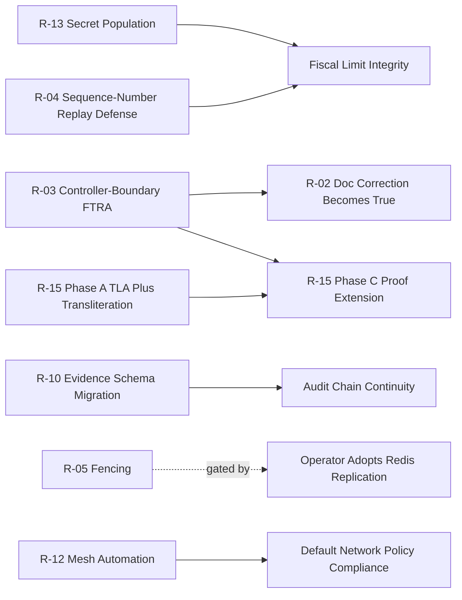

# CAGE Risk Assessment Matrix & Mitigation Strategies

| Field | Value |
|---|---|
| Status | DRAFT — planning document, no code changes |
| Scope | Risks identified in the CAGE analysis findings, cross-referenced against `plans/CAGE_IMPLEMENTATION_SPECS.md` |
| Audience | Engineering leads, compliance owners, release managers |

## Table of Contents

1. [Executive Summary](#1-executive-summary)
2. [Risk Assessment Matrix](#2-risk-assessment-matrix)
3. [Detailed Risk Analysis](#3-detailed-risk-analysis)
4. [Dependency Risk Map](#4-dependency-risk-map)
5. [Risk-to-Requirement Traceability](#5-risk-to-requirement-traceability)
6. [Rollback and Contingency Procedures](#6-rollback-and-contingency-procedures)
7. [Risk Monitoring Framework](#7-risk-monitoring-framework)

---

## 1. Executive Summary

### 1.1 Overall Risk Posture

CAGE's governance pipeline (FTRA Tier 0.5 → NeMo → STPA/UCA → CBF/OPA →
Fiscal Limit → Consensus → Causal Gatekeeper → Adaptive FRIA) is
architecturally fail-closed at every enforced tier, but the analysis
identifies a consistent pattern across the 10 high-priority risks: **the
enforcement is real where it is wired in, but coverage gaps exist at
process boundaries, documentation claims, and unbuilt subsystems**. None of
the 10 risks represents a currently-exploited production incident; all are
either (a) mismatches between marketing/paper claims and actual scope, (b)
architectural bypass surfaces with a known closure design already scoped in
[`CAGE_IMPLEMENTATION_SPECS.md`](CAGE_IMPLEMENTATION_SPECS.md), or (c)
operational/dependency gaps blocking a control that is otherwise
code-complete.

Overall posture: **MODERATE risk, HIGH reputational/compliance exposure**.
The technical remediations are well-scoped (§2 of the Implementation Specs),
but several risks (False Portability, False Sense of Security, Evidence-of-
Execution Overclaim) are primarily **documentation/communication risks**
that can cause real operational harm (integrators disabling a working
control because they believe it is broken, or auditors over-crediting
evidentiary guarantees CAGE does not make) even though no code defect
exists. These must be remediated with the same urgency as code fixes.

### 1.2 Critical Path Risks

The following risks sit on the critical path because they either (a) block
other remediation items, (b) compound with other open risks, or (c) carry
regulatory/compliance exposure if left unaddressed past a single reporting
cycle:

1. **R-03 Trust-Boundary Bypass** — blocks safe rollout of R-01/R-02
   messaging fixes, since the Controller-boundary FTRA check (§2.2 of the
   Implementation Specs) must land before any "FTRA cannot be bypassed"
   claim is accurate.
2. **R-04 Redis Replay Vulnerability** — active security gap with a
   concrete exploit path (compromised agent + Redis write access) that is
   independent of the single-node/replicated-Redis distinction that gates
   R-05.
3. **R-08 Statistical/Generalizability Risk** — undermines every published
   robustness claim (Priority 2 future work) until the adversarial corpus
   is expanded; compounds R-06/R-02 by feeding false confidence into paper
   claims.
4. **R-10 Backward-Incompatibility Risk** — must be sequenced correctly
   relative to any evidence-chain schema change; a mishandled cutover
   breaks audit continuity, which is a compliance-blocking event, not just
   a technical one.

### 1.3 Recommended Priority Order

| Priority | Risk IDs | Rationale |
|---|---|---|
| P0 — Immediate | R-01, R-02, R-06 | Documentation/claims corrections; zero code risk, highest reputational exposure, can ship within a single doc-review cycle |
| P0 — Immediate | R-04 | Active security gap with a known, scoped fix (monotonic sequence number) and no architectural dependency |
| P1 — Near-term | R-03, R-07 | Architectural closure work already specced (§2.2, §2.4 of Implementation Specs); P1 in the existing rollout staging |
| P1 — Near-term | R-10 | Must be sequenced before any evidence-chain schema work ships (§4.1/§6.2 of Implementation Specs) |
| P2 — Planned | R-05, R-09 | Currently inapplicable/low-likelihood in the reference deployment; fix before enabling the dependent feature (Redis replication / causal gate expansion), not before |
| P2 — Planned | R-08 | Requires sustained corpus-expansion investment; track as an ongoing program, not a single fix |

```mermaid
flowchart TD
    A[R-01 False Portability Claims] --> D[Integrator Trust Erosion]
    B[R-02 False Sense of Security] --> D
    C[R-06 Evidence-of-Execution Overclaim] --> E[Compliance/Audit Overcredit]
    F[R-03 Trust-Boundary Bypass] --> D
    F --> G[Controller-Boundary FTRA Check]
    H[R-07 Schema Version Coupling] --> I[Recurring BUG-FTRA-SCHEMA-001 Class Defects]
    J[R-04 Redis Replay] --> K[Fiscal Limit Integrity Loss]
    L[R-05 Double-Spend Failover] --> M[CAGE_REDIS_SYNCHRONOUS_REPLICATION Gate]
    L -.blocked by.-> N[Single-node Redis in reference deployment]
    O[R-08 Statistical Generalizability] --> P[Overstated Robustness Claims]
    Q[R-09 Causal Miscalibration] --> R[Systematic Trade Approval Bias]
    S[R-10 Backward Incompatibility] --> T[Evidence Chain Schema 1.0 to 1.1 Migration]
```



---

## 2. Risk Assessment Matrix

Likelihood and Impact are rated Low / Medium / High. Risk Score =
Likelihood × Impact mapped onto a 3×3 scale (Low=1, Medium=2, High=3);
score bands: 1-2 = Low, 3-4 = Medium, 6-9 = High.

| Risk ID | Risk Description | Likelihood | Impact | Risk Score | Category |
|---|---|---|---|---|---|
| R-01 | False Portability Claims — marketing FTRA as "plug into any agent" without the plan-and-execute caveat | High | Medium | 6 (High) | Integration |
| R-02 | False Sense of Security — FTRA mistaken for having Tiers 1-6's bypass-resistance/NoDirectBind coverage | Medium | High | 6 (High) | Security |
| R-03 | Trust-Boundary Bypass — `ftra_node` runs inside untrusted host process; direct HTTP access to Controller bypasses it | Medium | High | 6 (High) | Security |
| R-04 | Redis Replay Vulnerability — compromised agent with Redis write access can reset 300s TTL indefinitely | Medium | High | 6 (High) | Security |
| R-05 | Double-Spend Across Failover — Redis replication without WAIT/Sentinel fencing (currently inapplicable, single-node) | Low | High | 3 (Medium) | Technical Debt |
| R-06 | Evidence-of-Execution Overclaim — NoDirectBind framing misread as proving evidence-of-execution vs. tamper-evidence only | Medium | High | 6 (High) | Compliance |
| R-07 | Schema/Version Coupling — no extractor abstraction; every new FTRA-adopting agent re-risks BUG-FTRA-SCHEMA-001 class defects | High | Medium | 6 (High) | Technical Debt |
| R-08 | Statistical/Generalizability — 26-payload adversarial corpus serves as both dev and eval set, overfitting risk | High | Medium | 6 (High) | Compliance |
| R-09 | Causal Model Miscalibration — fixed baseline intercept (0.5) not fitted from historical data | Medium | Medium | 4 (Medium) | Technical Debt |
| R-10 | Backward-Incompatibility — evidence-chain hash schema migration 1.0→1.1 breaks re-verification of old artifacts | High | High | 9 (High) | Technical Debt |
| R-11 | Anchorage Digital Dependency — CBF custody reconciliation depends on external enterprise API onboarding | Medium | Medium | 4 (Medium) | Integration |
| R-12 | Zero-Trust Mesh Automation Gap — Linkerd/Cilium require manual `install` prerequisites, not automated in deploy pipeline | Medium | Medium | 4 (Medium) | Operational |
| R-13 | Reconciliation Daemon Secret Gap — activation depends on `gcs-reconciliation-bucket` secret population (POAM-2026-038) | High | Medium | 6 (High) | Operational |
| R-14 | FTRA Domain-Portability Gap — new-domain FTRA value depends on domain-specific STPA control structure authoring | Medium | Low | 2 (Low) | Integration |
| R-15 | Formal Verification Dependency Gap — depends on unbuilt `fence_epoch` / `proof/distributed_cbf_model.py` subsystems | Medium | Medium | 4 (Medium) | Technical Debt |
| R-16 | Live Latency Benchmarking Dependency — end-to-end measurement depends on live GKE cluster access | Low | Low | 1 (Low) | Operational |

---

## 3. Detailed Risk Analysis

### R-01: False Portability Claims Risk

- **Root Cause Analysis.** FTRA (Tier 0.5) requires the host agent to
  materialize a complete multi-step `ExecutionPlan` before any tool
  execution ([`node_factory.py:15-24`](../src/gateway/governance/ftra/node_factory.py:15)).
  Marketing/documentation copy describing FTRA as "plug into any agent"
  omits this plan-and-execute precondition, creating an expectation gap for
  reactive/ReAct-style agents that never materialize an upfront plan.
- **Impact Analysis.** Integrators wire `create_ftra_node()` into a
  ReAct-style host agent, every invocation fails `_parse_plan()` (no plan
  ever exists to parse), and the node fails closed 100% of the time. The
  integrator reasonably concludes FTRA is broken/buggy rather than
  incompatible-by-design, files bug reports, and may disable governance
  checks entirely to unblock their integration — the worst possible
  outcome from a safety perspective.
- **Detection Indicators.** Spike in `ftra_node` `BLOCKED` verdicts
  correlated with 100% `EMPTY_STEPS`/`JSON_DECODE_ERROR` `parse_failure_class`
  values (per §2.5 of the Implementation Specs) for a given integrator's
  traffic; support/GitHub issues describing "FTRA always blocks."
- **Mitigation Strategy.** (1) Update all public-facing FTRA documentation
  and README/marketing copy to state the plan-and-execute precondition as a
  first-class compatibility requirement, per the compatibility contract
  already drafted in §2.2 of the Implementation Specs. (2) Add a startup-time
  compatibility self-check: if `create_ftra_node()` observes N consecutive
  `EMPTY_STEPS`/absent-plan results, emit a loud structured warning
  distinguishing "host agent architecture incompatible with FTRA" from
  "genuine BLOCKED verdict." (3) Publish an integration checklist gating any
  FTRA adoption announcement.
- **Contingency Plan.** If an integrator has already publicly reported FTRA
  as "broken," respond with the compatibility contract documentation,
  provide the `FtraNodeConfig` extractor guidance (§2.4), and offer a
  reference ReAct-compatible wrapper pattern if one can be constructed.
- **Owner.** Developer Relations / Docs team, with Gateway governance
  engineering as technical reviewer.
- **Timeline.** Documentation correction: next doc-review cycle (P0, no
  code dependency). Self-check telemetry: bundle with §2.5 schema-drift
  hardening (Stage 1 per §6.3 of the Implementation Specs).

### R-02: False Sense of Security Risk

- **Root Cause Analysis.** FTRA's node-factory pattern
  (`create_X_node(config) -> node_fn`) is structurally identical to
  `create_opa_safety_node()`/`create_nemo_guardrail_node()`
  ([`opa_node_factory.py:79`](../src/gateway/governance/langgraph_harness/opa_node_factory.py:79),
  [`nemo_node_factory.py:320`](../src/gateway/governance/langgraph_harness/nemo_node_factory.py:320)),
  but FTRA runs one layer up in the host agent's LangGraph process, not
  inside `SymbolicGovernor._run_checks()`'s Single Choke Point
  ([`validate_action():1325`](../src/gateway/governance/symbolic_governor.py:1325)).
  Engineers pattern-matching on code shape reasonably but incorrectly infer
  equivalent bypass-resistance.
- **Impact Analysis.** An engineer designs a downstream system assuming FTRA
  provides the same guarantee as Tiers 1-6 (i.e., that it cannot be bypassed
  without going through `validate_action()`). A caller that reaches
  `/validate-action` or the ext_authz `/check` endpoint directly — bypassing
  the host's LangGraph process — silently skips FTRA's irreversibility
  check with no compensating control, undermining any downstream compliance
  claim built on that assumption.
- **Detection Indicators.** Code review checklist gap: no automated test
  currently asserts that a direct `validate_action()` call (bypassing
  `ftra_node`) is still classified against `terminal_registry.json`.
  Absence of such a test is itself the leading indicator.
- **Mitigation Strategy.** (1) Implement the Controller-boundary FTRA check
  (`_ftra_boundary_check()`, §2.2 of the Implementation Specs) inside
  `SymbolicGovernor._run_checks()` so the guarantee becomes true rather than
  merely documented as false. (2) Until that ships, add explicit
  documentation (docstring + architecture doc) stating FTRA does NOT share
  Tiers 1-6's bypass-resistance, adjacent to every FTRA code entry point.
  (3) Add a regression test asserting the specific claim: a plan-shaped
  payload sent directly to `validate_action()` without going through
  `ftra_node` is (pre-fix) NOT classified, and (post-fix) IS classified.
- **Contingency Plan.** If a downstream compliance claim has already been
  made based on the false equivalence, issue a correction to the affected
  OSCAL component/SSP documentation and re-run the applicable Lula
  validation once the boundary check ships.
- **Owner.** Gateway governance engineering (symbolic_governor.py owner).
- **Timeline.** Documentation caveat: immediate (P0). Code fix
  (`CAGE_FTRA_BOUNDARY_ENABLED`): Stage 1, per §6.3 rollout sequence in the
  Implementation Specs.

### R-03: Trust-Boundary Bypass Risk

- **Root Cause Analysis.** `ftra_node` executes inside the untrusted host
  agent process; it is only invoked if the host's own LangGraph wires it in
  ([`graph.py:127`](../src/governed_financial_advisor/graph/graph.py:127)).
  This is a harness-wide architectural property, not a bug in FTRA itself —
  any process-boundary check is inherently bypassable by a caller with
  direct network access to the trusted Controller process.
- **Impact Analysis.** An adversary (or a misconfigured/compromised host
  agent) with direct HTTP access to `/validate-action` or the ext_authz
  `/check` endpoint can submit an irreversible-terminal action without ever
  triggering FTRA classification, executing an action that should have been
  BLOCKED or routed to HITL.
- **Detection Indicators.** Absence of `ftra_status`/`ftra_result` fields on
  an otherwise plan-shaped `validate_action()` payload; audit log entries
  showing an irreversible action executed with no corresponding
  `cage.ftra_analysis` OTel span in the trace.
- **Mitigation Strategy.** Implement `_ftra_boundary_check()` as a Tier
  0.5-equivalent step inside `SymbolicGovernor._run_checks()` (§2.2),
  sharing the same `IrreversibilityClassifier`/`terminal_registry.json` so
  classification is identical regardless of enforcement point. Gate rollout
  behind `CAGE_FTRA_BOUNDARY_ENABLED` (default `"false"`) and stage
  per-region since this changes DENY/DEFER rates (§6.3, Stage 1).
- **Contingency Plan.** Until the boundary check ships, treat this as a
  documented residual risk in the authorization boundary
  (`compliance/boundary/AUTHORIZATION_BOUNDARY.md`) and restrict network
  access to `/validate-action`/ext_authz endpoints to only the trusted host
  agent process (NetworkPolicy-level compensating control) as an interim
  measure.
- **Owner.** Gateway governance engineering + platform security (for the
  interim NetworkPolicy compensating control).
- **Timeline.** Interim NetworkPolicy compensating control: immediate (P0).
  Full code fix: Stage 1 per §6.3 of the Implementation Specs.

### R-04: Redis Replay Vulnerability

- **Root Cause Analysis.** The reconciled balance TTL window (300s) is
  enforced purely by wall-clock comparison against a KMS-signed payload's
  timestamp; there is no monotonic sequence number embedded in the signed
  payload. A compromised agent with Redis write access can re-write
  (re-sign is not even required if the existing signature covers a replayable
  payload) a stale-but-validly-signed balance record to reset the TTL clock
  indefinitely, per the analysis's cited gap (confirmed via search — zero
  `sequence_id`/`fence_epoch`/monotonic references in `cbf.py` or
  `reconciliation_worker.py`).
- **Impact Analysis.** `FiscalLimitGuard`/CBF continues trusting a stale
  balance indefinitely instead of failing closed at the 300s boundary,
  allowing trades to execute against out-of-date fiscal headroom —
  compounds with R-13 (reconciliation daemon secret gap), since a
  never-reconciled Redis counter is itself already a stale-trust condition.
- **Detection Indicators.** `reconciliation:verified_balance` timestamp
  delta from wall-clock time exceeding 300s without a corresponding
  `CreateContainerConfigError`/CronJob failure alert; repeated identical
  `kms_signature` values across multiple TTL windows (a legitimate
  reconciliation run always produces a new signature).
- **Mitigation Strategy.** Embed a monotonic sequence number inside the
  KMS-signed balance payload itself (not just the Redis key TTL) and reject
  any payload whose sequence number does not strictly advance relative to
  the last-accepted value, per the analysis's own recommended remediation.
  Fully specced in **§2.10 (Reconciliation Payload Replay Defense) of the
  Implementation Specs**: `ReconciliationResult` gains a signed `sequence`
  field, the reconciliation worker increments a new
  `reconciliation:sequence:latest` Redis counter every cycle, and
  `cbf.py`'s `_read_cbf_state_atomic()` rejects any payload whose sequence
  does not exceed `reconciliation:sequence:last_accepted`, falling back to
  the self-reported balance exactly as it already does for an invalid KMS
  signature. Gated behind `CAGE_RECONCILIATION_REPLAY_DEFENSE` (default
  `"false"`) with a two-phase rollout (write-side stamping first, then
  read-side enforcement). This is a narrower, additive complement to the
  broader `safety:fence_epoch` fencing design in §2.6 of the Implementation
  Specs — the sequence-number check applies even on a single-node Redis
  deployment, unlike the replication-specific fencing.
- **Contingency Plan.** If replay is detected in production (duplicate
  signature or non-advancing sequence number observed), fail closed
  immediately (DENY all fiscal-limit-gated actions) and force a manual
  reconciliation daemon re-run before resuming.
- **Owner.** Compliance Bridge engineering (`reconciliation_worker.py`
  owner) + Gateway governance engineering (`cbf.py` owner).
- **Timeline.** P0 — no architectural dependency; should ship ahead of or
  alongside Stage 0 items in §6.3 of the Implementation Specs given its
  active-exploit nature.

### R-05: Double-Spend Across Failover

- **Root Cause Analysis.** `WATCH`/`MULTI`/`EXEC` optimistic locking
  ([`redis_client.py:42-51`](../src/gateway/infrastructure/redis_client.py:42))
  protects against concurrent-client races on a single Redis node but has no
  mechanism to detect a primary-to-replica failover that silently rewinds
  acknowledged writes. This is currently a theoretical risk because the
  reference deployment uses single-node Redis.
- **Impact Analysis.** If an operator enables Redis replication without
  `WAIT`/Sentinel fencing, a failover event could serve stale
  `cash_balance`/`safety:current_cash` reads, permitting two trades to be
  approved against the same funds (double-spend) across the failover
  boundary.
- **Detection Indicators.** Redis `INFO replication` showing an unplanned
  `role:master` transition; any `safety:fence_epoch` read that regresses
  relative to the highest previously observed epoch (once §2.6 fencing is
  implemented); Sentinel failover event logs.
- **Mitigation Strategy.** Implement `CAGE_REDIS_SYNCHRONOUS_REPLICATION`
  (§2.6 of the Implementation Specs): monotonic `safety:fence_epoch` counter
  incremented via Lua script on every CBF-mutating write, plus `WAIT
  <replica_count> <timeout_ms>` or Sentinel-aware epoch verification before
  trusting any read. Validate analytically via
  `proof/distributed_cbf_model.py` (§2.9.1) before/alongside runtime
  rollout (Stage 3, formal verification track).
- **Contingency Plan.** Do not enable Redis replication in any production
  posture until the fencing flag has completed its Stage 2 soak (§6.3). If
  replication is already enabled elsewhere without fencing, disable
  replication (revert to single-node) until the flag ships.
- **Owner.** Gateway infrastructure engineering (`redis_client.py`,
  `cbf.py` owners).
- **Timeline.** No-op in the current reference deployment; must complete
  before any operator adopts Redis replication (Stage 2, §6.3 of the
  Implementation Specs — no fixed calendar deadline, gated on replication
  adoption).

### R-06: Evidence-of-Execution Overclaim Risk

- **Root Cause Analysis.** The paper's NoDirectBind/"no action can bypass
  governance" framing describes a decision-time safety invariant (the
  21-state hand-abstracted automaton over `_run_checks()`'s tier list,
  [`model.py:22-23`](../proof/model.py:22)). The evidence chain
  (`EvidenceStreamSink`) is a separate mechanism that provides
  tamper-evidence for records that were actually persisted — and ingestion
  is currently opt-in (`EVIDENCE_STREAM_ENABLED` defaults to `"false"`,
  [`evidence_stream.py:106`](../src/compliance_bridge/evidence_stream.py:106))
  and fail-open (`ingest()` logs failures and returns `None` rather than
  raising, [`evidence_stream.py:261-331`](../src/compliance_bridge/evidence_stream.py:261)).
  Conflating these two distinct guarantees is the root cause.
- **Impact Analysis.** An auditor or compliance reviewer could read
  "NoDirectBind" as implying that every governance decision is *provably*
  evidenced (evidence-of-execution), when in fact a decision could occur
  with evidence ingestion silently skipped (backend unavailable, feature
  disabled). This risks an OSCAL/SSP control-implementation claim that
  overstates the actual guarantee, which is an audit finding risk under any
  of the three regional postures.
- **Detection Indicators.** Any OSCAL component (`compliance/oscal/`)
  citing NoDirectBind as evidence for an audit-logging control (e.g. AU-12)
  without a corresponding citation to the evidence chain's actual
  enablement/blocking status; Lula validation gaps where `au12.yaml`
  doesn't check `EVIDENCE_STREAM_ENABLED`/`EVIDENCE_CHAIN_BLOCKING` state.
- **Mitigation Strategy.** (1) Implement `EVIDENCE_CHAIN_BLOCKING` (§2.3 of
  the Implementation Specs) so that, when enabled, seal issuance is
  synchronously gated on durable evidence-chain commit — closing the
  fail-open gap for environments that opt in. (2) Regardless of code
  changes, correct all paper/documentation language to explicitly
  distinguish "decision-time safety invariant" (NoDirectBind, always
  enforced) from "evidence-of-execution" (opt-in, and fail-open unless
  `EVIDENCE_CHAIN_BLOCKING=true`). (3) Update `compliance/oscal/` component
  definitions to cite the correct guarantee per control.
- **Contingency Plan.** If an OSCAL/SSP claim has already overstated this
  guarantee, issue an SSP correction and notify the relevant compliance
  owner (US_FED/EU_ECB/APAC_MAS) before the next ATO/audit review cycle.
- **Owner.** Compliance Bridge engineering + Compliance/OSCAL documentation
  owner.
- **Timeline.** Documentation correction: immediate (P0). Code fix
  (`EVIDENCE_CHAIN_BLOCKING`): Stage 1, per-environment staged rollout (dev
  → staging → US_FED prod → EU_ECB/APAC_MAS prod) per §6.3.

### R-07: Schema/Version Coupling Risk

- **Root Cause Analysis.** `create_ftra_node()` hard-codes the state keys
  `execution_plan_output`/`evaluation_result`, coupling FTRA to GFA's
  specific `AgentState` schema
  ([`node_factory.py:180-230`](../src/gateway/governance/ftra/node_factory.py:180),
  [`state.py:86-96`](../src/governed_financial_advisor/graph/state.py:86)).
  There is no pluggable extractor abstraction analogous to
  `OpaNodeConfig.payload_extractor`/`NemoNodeConfig.message_extractor`
  ([`types.py:53-123`](../src/gateway/governance/langgraph_harness/types.py:53)).
  Two confirmed production defects (BUG-FTRA-SCHEMA-001,
  BUG-FTRA-JSON-001) already trace to this coupling.
- **Impact Analysis.** Every new FTRA-adopting agent with a different state
  schema must either hand-fork `create_ftra_node()` or accept the
  GFA-specific key names, re-risking the same class of schema-mismatch
  defect independently rather than benefiting from a shared, hardened
  extraction layer.
- **Detection Indicators.** New agent integrations reporting FTRA
  `BLOCKED`/parse-failure verdicts that trace to key-name mismatches rather
  than genuine irreversibility findings; repeated ad hoc patches to
  `_parse_plan()` across different consuming codebases.
- **Mitigation Strategy.** Implement `FtraNodeConfig` (§2.4 of the
  Implementation Specs) following the existing `OpaNodeConfig`/
  `NemoNodeConfig` convention — `plan_extractor`/`confidence_extractor`
  callables with defaults reproducing today's GFA-specific behavior for
  100% backward compatibility. Pair with the structured parse-failure
  telemetry (`ParseResult`, §2.5) so future schema drift surfaces as a
  distinguishable `SCHEMA_VALIDATION_ERROR`/`JSON_DECODE_ERROR` rather than
  an opaque BLOCKED verdict.
- **Contingency Plan.** For any FTRA integration shipped before
  `FtraNodeConfig` lands, document the hard-coded key requirement explicitly
  and provide a manual adapter-shim pattern in the interim.
- **Owner.** Gateway governance engineering (`ftra/node_factory.py`,
  `langgraph_harness/types.py` owners).
- **Timeline.** Stage 1 per §6.3 of the Implementation Specs — no feature
  flag needed, ships as backward-compatible by construction alongside
  schema-drift hardening.

### R-08: Statistical/Generalizability Risk

- **Root Cause Analysis.** `tests/red_team/adversarial_dataset.json`
  contains 26 hand-authored adversarial payloads that serve simultaneously
  as the development corpus (used to build/tune detectors like
  `prompt_injection_detector.py`, `confidence_claim_detector.py`) and the
  evaluation corpus (used to report robustness metrics). This is a
  textbook train/test leakage pattern.
- **Impact Analysis.** Reported robustness/detection-rate metrics are
  likely optimistic relative to true generalization performance against
  novel adversarial inputs; any published "N% detection rate" claim built
  on this corpus has limited statistical power and cannot support strong
  generalizability claims. A downstream reader or regulator could
  reasonably challenge the validity of the reported figures.
- **Detection Indicators.** Any new adversarial payload category
  (submitted via red-teaming, garak/PyRIT fuzzing, or real incident
  reports) that the existing detectors fail to catch — this is the
  clearest sign the 26-payload corpus was insufficiently representative.
- **Mitigation Strategy.** (1) Expand `adversarial_dataset.json` beyond 26
  payloads using automated red-teaming/fuzzing tools (garak, PyRIT), per
  the analysis's own recommendation. (2) Split the expanded corpus into
  disjoint dev/eval partitions so no payload used to tune a detector is
  also used to report its performance. (3) Correct any downstream
  documentation still citing an unsubstantiated "290+" figure to match the
  actual corpus size at time of publication. (4) Track corpus growth as an
  ongoing program metric, not a one-time fix.
- **Contingency Plan.** Until the corpus is expanded and split, qualify
  every published detection-rate figure with an explicit train/test-overlap
  caveat in the paper and technical report.
- **Owner.** Red-team/adversarial testing owner (`tests/red_team/`) +
  paper/documentation owner for the caveat language.
- **Timeline.** Documentation caveat: immediate (P0). Corpus
  expansion/split: ongoing program, tracked as Priority 2 future work per
  the existing analysis framing — no single completion date; review corpus
  size quarterly.

### R-09: Causal Model Miscalibration Risk

- **Root Cause Analysis.** `causal_gatekeeper.py`'s risk-boundary check uses
  a fixed baseline intercept of `0.5` (neutral market state,
  [`causal_gatekeeper.py:102-106`](../src/gateway/governance/causal_gatekeeper.py:102))
  rather than an intercept fitted from historical telemetry. The
  `0.5 + estimated_marginal_effect` formula
  ([`causal_gatekeeper.py:779`](../src/gateway/governance/causal_gatekeeper.py:779))
  assumes the baseline is always representative, which is an unverified
  assumption.
- **Impact Analysis.** If the true baseline risk deviates systematically
  from 0.5 in live market conditions, the causal gatekeeper could
  systematically over-approve (baseline too high, headroom overstated) or
  under-approve (baseline too low, headroom understated) trades relative to
  the intended `CAUSAL_LOCK_RISK_BOUNDARY` (default 0.95) safety margin —
  "systematic miscalibration is possible," per the analysis. Note this
  operates alongside the existing minimum-sample guard
  (`CAUSAL_MIN_SAMPLES`, POAM-2026-040) which addresses sparse-telemetry
  cold-start but not baseline-value miscalibration.
- **Detection Indicators.** Persistent directional bias in causal-gate
  ALLOW/DENY outcomes relative to realized post-trade risk outcomes over a
  rolling window; drift between the fixed 0.5 baseline and an empirically
  fitted baseline computed offline from the same telemetry
  `causal_gatekeeper.py` consumes.
- **Mitigation Strategy.** Introduce an offline calibration job that
  periodically fits the baseline intercept from historical telemetry (the
  same `n_samples` observational data already modeled in
  [`causal_gatekeeper.py:154-165`](../src/gateway/governance/causal_gatekeeper.py:154))
  and compares it against the fixed 0.5 constant; alert when drift exceeds
  a configurable threshold. Do not silently auto-update the live constant
  without human review, given the safety-criticality of the gate.
- **Contingency Plan.** If miscalibration is detected, tighten
  `CAUSAL_LOCK_RISK_BOUNDARY` conservatively (lower the threshold) as an
  interim compensating control while the baseline-fitting job is developed
  and validated.
- **Owner.** Gateway governance engineering (`causal_gatekeeper.py` owner)
  + data science/telemetry analytics owner for the offline calibration job.
- **Timeline.** P2 — tracked as a model-quality improvement item; target
  design review within the next two remediation planning cycles, no fixed
  regulatory deadline since this is a robustness improvement rather than a
  known active defect.

### R-10: Backward-Incompatibility Risk (Evidence Chain Schema Migration)

- **Root Cause Analysis.** `_link_hash()` already uses canonical
  `separators=(",", ":")` JSON serialization for the header
  ([`evidence_stream.py:151`](../src/compliance_bridge/evidence_stream.py:151)),
  but the payload JSON passed into `ingest()`
  ([`evidence_stream.py:277`](../src/compliance_bridge/evidence_stream.py:277))
  uses default `json.dumps` whitespace, making `record_hash` non-reproducible
  across encoders. Fixing this (schema 1.0 → 1.1, §4.1 of the Implementation
  Specs) necessarily changes how `record_hash` is computed, which is a
  breaking change for any verifier that recomputes hashes rather than
  trusting the stored value.
- **Impact Analysis.** Any auditor or automated verifier that recomputes
  `record_hash` from `payload_json` using the pre-migration routine will
  fail to re-verify post-migration (schema 1.1) records, and vice versa. If
  the migration cutover is mishandled (e.g. the hash chain's `prev_hash`
  seed is reset from the `EVIDENCE_STREAM_GENESIS` sentinel instead of the
  last persisted record's hash), the entire audit chain's continuity breaks
  silently — a severe compliance/audit-integrity event.
- **Detection Indicators.** `verify_record()` (or equivalent) reporting a
  hash mismatch for records schema-tagged `1.0` when using the 1.1 routine
  or vice versa without dispatching by `entry["schema"]`; any gap or
  duplicate in the `sequence` field across the 1.0→1.1 boundary; GCS Flush
  Daemon errors when archiving mixed-schema NDJSON batches.
- **Mitigation Strategy.** Follow the phased migration strategy in §6.2 of
  the Implementation Specs precisely: (1) ship a dual-schema
  `verify_record()` utility that dispatches by `entry["schema"]` to the
  correct historical hashing routine — never retroactively rehash 1.0
  records. (2) Ensure `EvidenceStreamSink.__init__()`'s `_prev_hash` seed is
  read from the last persisted record via `XREVRANGE ... COUNT 1`, not the
  genesis sentinel, at cutover time. (3) Record the cutover `sequence`
  number and both chain-boundary hashes in `docs/POAM.md` and
  `compliance/oscal/` for audit continuity. (4) Deploy during a low-traffic
  window and validate the first post-cutover record's `prev_hash` matches
  the last pre-cutover record's `record_hash` before considering the
  migration complete.
- **Contingency Plan.** If a validation failure is detected immediately
  post-cutover (chain discontinuity), roll back the code change immediately
  (new records resume schema-1.0 serialization) — the dual-schema
  `verify_record()` utility handles both eras permanently, so rollback
  requires no data migration. If the discontinuity is only discovered
  later (post-flush to GCS), document the break explicitly in the audit
  trail and treat pre-/post-break segments as two independently-verifiable
  chains rather than attempting retroactive repair.
- **Owner.** Compliance Bridge engineering (`evidence_stream.py` owner),
  with sign-off required from the Compliance/OSCAL documentation owner
  before cutover.
- **Timeline.** Design/implementation: Stage 1-adjacent (no explicit flag,
  but must be sequenced deliberately per §6.2/§6.3). Recommend scheduling
  the cutover in a dedicated low-traffic maintenance window, not bundled
  with other Stage 1 rollout items, precisely because of its
  non-reversibility characteristics.

### R-11: Anchorage Digital Integration Dependency

- **Root Cause Analysis.** `AnchorageGrpcLedgerProvider.fetch_balance()`
  raises `NotImplementedError`
  ([`reconciliation_worker.py:391-433`](../src/compliance_bridge/reconciliation_worker.py:391))
  pending Anchorage enterprise API onboarding (mTLS client certificate
  issuance, gRPC stub generation from Anchorage's protobuf definitions) —
  an external vendor dependency outside CAGE's direct control.
- **Impact Analysis.** Custody accounts at OCC-chartered custodians (e.g.
  Anchorage) cannot be reconciled via the CBF's external-ledger path;
  coverage is currently limited to bank/brokerage accounts via
  `PlaidLedgerProvider` (production-ready). This is a functional scope
  limit, not a safety defect — the `StubLedgerProvider`/`PlaidLedgerProvider`
  fallback path remains safe, just narrower in coverage.
- **Detection Indicators.** `RECONCILIATION_PROVIDER=anchorage` configured
  in any environment (would immediately raise `NotImplementedError` at
  provider construction, per
  [`reconciliation_worker.py:344-351`](../src/compliance_bridge/reconciliation_worker.py:344)).
- **Mitigation Strategy.** Track as an explicit "TBD"-style external
  dependency, not an internal engineering task. Prioritize enterprise
  onboarding (API access request) as a business-development action item in
  parallel with continuing to rely on `PlaidLedgerProvider`/`GcsLedgerProvider`
  for the accounts they cover. Do not set `RECONCILIATION_PROVIDER=anchorage`
  in any deployment manifest until the gRPC stubs are generated and the
  mTLS certificate is provisioned.
- **Contingency Plan.** If custody-account coverage is a hard product
  requirement before Anchorage onboarding completes, evaluate whether
  Anchorage exposes a REST fallback or whether a different qualified
  custodian with an existing Python SDK could serve as an interim
  `LedgerProvider` implementation.
- **Owner.** Business development / partnerships (for onboarding) +
  Compliance Bridge engineering (for stub generation and integration once
  credentials are available).
- **Timeline.** External dependency — no internal completion date until
  Anchorage enterprise onboarding is complete. Re-evaluate quarterly.

### R-12: Zero-Trust Mesh Automation Gap

- **Root Cause Analysis.**
  [`deployment/k8s/linkerd-mtls-policy.yaml`](../deployment/k8s/linkerd-mtls-policy.yaml)
  and
  [`deployment/k8s/cilium-egress-lockdown.yaml`](../deployment/k8s/cilium-egress-lockdown.yaml)
  are committed, correct manifests, but they require the Linkerd control
  plane (`linkerd install`) and Cilium CNI (`cilium install
  --set l7Proxy=true --set kubeProxyReplacement=strict`) to be installed on
  the target cluster as an undocumented-in-automation manual prerequisite —
  neither `deploy_all.sh` nor the `infra/` Terraform modules currently
  install or verify these components.
- **Impact Analysis.** A freshly provisioned cluster that skips the manual
  `linkerd install`/`cilium install` steps will silently fail to enforce
  mTLS/L7 egress lockdown — the manifests apply without error but have no
  effect without the underlying control plane/CNI, producing a false sense
  of network-level zero-trust enforcement.
- **Detection Indicators.** `kubectl get pods -n governance-stack` showing
  no Linkerd proxy sidecar injected; `linkerd check` / `cilium status --wait`
  reporting missing or unhealthy control-plane components on a cluster
  where the policy manifests have already been applied.
- **Mitigation Strategy.** Add `linkerd install`/`cilium install` steps (or
  equivalent Terraform `helm_release` resources) to `deploy_all.sh` or the
  `infra/` Terraform modules, per the analysis's own recommendation, so
  that both manifests apply cleanly to a freshly provisioned cluster
  without a manual, undocumented step. Add a post-install verification
  check (`linkerd check`, `cilium status --wait`) to the deployment
  pipeline that fails the deploy if either control plane is unhealthy
  before applying the policy manifests.
- **Contingency Plan.** Until automated, maintain an explicit pre-deployment
  checklist item in `infra/QUICK_START.md`/deployment runbooks requiring
  manual verification of `linkerd check`/`cilium status` output before
  considering a cluster's network posture compliant.
- **Owner.** Infrastructure/platform engineering (`infra/` Terraform
  modules, `deploy_all.sh` owner).
- **Timeline.** P1 — target next infrastructure automation sprint; treat
  as a deployment-pipeline hardening item rather than an emergency fix
  given the existing manual-checklist compensating control.

### R-13: Reconciliation Daemon Secret Population Dependency

- **Root Cause Analysis.** Both the `reconciliation-worker` CronJob
  manifest and the `GcsLedgerProvider` registration in
  `reconciliation_worker.py` are code/manifest-complete
  ([`reconciliation-worker.yaml:130-148`](../deployment/k8s/reconciliation-worker.yaml:130),
  [`reconciliation_worker.py:1147-1157`](../src/compliance_bridge/reconciliation_worker.py:1147)),
  but the `gcs-reconciliation-bucket` key in the
  `reconciliation-worker-secrets` Secret was never populated post-deploy —
  a purely operational gap, tracked as POAM-2026-038 (reopened 2026-08-09).
- **Impact Analysis.** The CronJob fails with `CreateContainerConfigError`
  on every scheduled run (`*/5 * * * *`); `FiscalLimitGuard` falls back to
  un-reconciled Redis counters, and `fiscal:daily_limit:{day}` over-counts
  for up to the full daily window — directly compounds R-04 (Redis Replay)
  since an un-reconciled counter is already a stale-trust condition even
  before considering replay.
- **Detection Indicators.** `kubectl get cronjob reconciliation-worker -n
  <namespace>` showing consecutive failed runs;
  `CreateContainerConfigError` in pod events; `redis-cli GET
  reconciliation:verified_balance` returning stale or absent data.
- **Mitigation Strategy.** Execute the activation checklist already
  specified in §2.7 of the Implementation Specs: populate the
  `gcs-reconciliation-bucket` (and `gcs-reconciliation-object` if
  non-default) secret keys via `deployment/scripts/setup_reconciliation_secret.sh`
  or the `kubectl create secret` template
  ([`reconciliation-worker.yaml:268-273`](../deployment/k8s/reconciliation-worker.yaml:268)),
  confirm `kms-governance-key` is populated, verify
  `RECONCILIATION_PROVIDER=gcs` matches intent, re-apply the manifest, and
  verify the next scheduled run succeeds before closing POAM-2026-038.
- **Contingency Plan.** While the secret remains unpopulated, treat all
  fiscal-limit enforcement as operating on un-reconciled (Redis-only)
  counters — communicate this explicitly to any compliance stakeholder
  relying on the externally-reconciled CBF guarantee, and consider
  tightening the Redis-only fiscal limit threshold conservatively as an
  interim compensating control.
- **Owner.** Platform/SRE team (secret population, deploy execution) +
  Compliance Bridge engineering (verification and POAM closure).
- **Timeline.** P0 — target date already set at 2026-08-16 per
  `docs/POAM.md:76`; this is the single most time-sensitive item in this
  matrix since it is already past its original close date once (reopened
  2026-08-09).

### R-14: FTRA Domain-Portability Dependency

- **Root Cause Analysis.** FTRA's `IrreversibilityClassifier` derives its
  terminal-action classification from `config/ftra/terminal_registry.json`,
  compiled from `config/stpa_control_structure.yaml` via
  `generate_terminal_registry()`
  ([`stpa_compiler.py:1213-1224`](../src/gateway/governance/stpa_compiler.py:1213)).
  FTRA's value for a new domain (e.g. healthcare, logistics) depends
  entirely on a domain expert authoring an accurate STPA control structure
  for that domain — this is not automatable from existing artifacts.
- **Impact Analysis.** Adopting FTRA in a new vertical without first
  authoring a domain-appropriate STPA control structure yields either an
  empty/generic terminal registry (FTRA effectively inert — nothing
  classifies as irreversible) or a misclassified one (false BLOCKED/false
  CLEAR verdicts), in both cases undermining the governance value the new
  adopter expects.
- **Detection Indicators.** A new domain's `terminal_registry.json`
  containing zero or near-zero terminal-action entries after compilation;
  FTRA verdicts on that domain's traffic showing implausibly low BLOCKED
  rates relative to the domain's actual irreversible-action surface.
- **Mitigation Strategy.** Treat STPA control-structure authoring as a
  mandatory onboarding step for any new FTRA-adopting domain, documented
  explicitly in onboarding materials alongside the plan-and-execute
  compatibility contract (R-01). Provide a domain-authoring checklist/
  template derived from the existing financial-advisory
  `stpa_control_structure.yaml` as a starting reference.
- **Contingency Plan.** If a new domain adopts FTRA without a complete STPA
  control structure, flag this explicitly in that domain's deployment
  documentation as "FTRA coverage: not yet validated for this domain" until
  the control structure is authored and reviewed.
- **Owner.** STPA/governance domain modeling owner + the adopting team's
  domain expert.
- **Timeline.** Per-adoption — gate any new-domain FTRA rollout
  announcement on STPA control-structure completion; no fixed calendar
  date since this scales with adoption pace.

### R-15: Formal Verification Dependency Gap

- **Root Cause Analysis.** `proof/model.py` is a dependency-free,
  single-agent hand-abstraction with zero imports from `src/` (confirmed
  via grep) and does not model concurrent agents contending for a shared
  bounded resource. The distributed model
  (`proof/distributed_cbf_model.py`) and the runtime fencing mechanism
  (`safety:fence_epoch`) it would validate are both currently unbuilt —
  confirmed via search (zero `fence_epoch`/`WAIT` references anywhere in
  `src/`).
- **Impact Analysis.** Any claim of formally-verified safety under
  concurrent multi-agent contention against a shared balance is currently
  unsubstantiated — the CBF Invariance Theorem is explicitly scoped to a
  "single-trade-per-window execution model"
  ([`tmp/CAGE_ARXIV.md:188`](../tmp/CAGE_ARXIV.md:188)). Similarly, the
  NoDirectBind proof's 21-state automaton covers only
  `SymbolicGovernor._run_checks()`'s tier list, not the LangGraph harness,
  Redis state, or the FTRA boundary — a Priority 2 future-work gap.
- **Detection Indicators.** Any published or paper claim of "formally
  verified" safety under concurrency without a corresponding citation to
  `proof/distributed_cbf_model.py`'s existence and passing CI status;
  `tests/test_no_direct_bind_proof.py` `EXPECTED_*` constants left
  unchanged despite `_run_checks()`'s tier list having grown (e.g. via the
  Controller-boundary FTRA check, R-03).
- **Mitigation Strategy.** Build `proof/distributed_cbf_model.py` per the
  design in §2.9.1 of the Implementation Specs (N-concurrent-agent BFS
  model, safety/negative-control/fencing-interaction properties), and
  extend the NoDirectBind proof per the phased plan in §2.9.2 (TLA+
  transliteration → LangGraph harness extension → FTRA boundary extension
  → optional Alloy bounded model-checking). Treat any change to
  `_run_checks()`'s outcome domain (e.g. adding the Controller-boundary
  FTRA check, NARROW/PAUSE) as a mandatory trigger to re-evaluate
  `proof/model.py`'s scope per §6.4.
- **Contingency Plan.** Until the distributed model exists, explicitly
  scope every formal-verification claim in the paper/technical report to
  "single-agent, single-trade-per-window" and do not imply multi-agent
  concurrent-safety guarantees.
- **Owner.** Formal verification/proof engineering owner (`proof/` module)
  + paper/documentation owner for scope-accuracy review.
- **Timeline.** Stage 3 per §6.3 of the Implementation Specs — independent
  of runtime rollout; recommend starting Phase A (TLA+ transliteration,
  cross-validation only) in parallel with Stage 0/1 runtime work since it
  has no code dependency on those changes.

### R-16: Live GKE Latency Benchmarking Dependency

- **Root Cause Analysis.** End-to-end live latency measurements require
  access to a running GKE dev cluster (per the canonical integration test
  procedure documented in `AGENTS.md`'s Test Execution section, using
  `scripts/port_forward_dev.sh` and the full `governance-cluster-2`
  topology) — this is an infrastructure-availability dependency, not a code
  gap.
- **Impact Analysis.** Any published latency figures not re-measured
  against the live cluster risk becoming stale relative to code changes
  (e.g. the Controller-boundary FTRA check adds a new tier to the
  request-serving path) — low likelihood of immediate harm, but compounds
  over time if benchmarking cadence lapses.
- **Detection Indicators.** Latency figures in `docs/paper/measurements/`
  older than the most recent tier-count-changing code change (e.g. R-03's
  boundary check, R-01's DEFER wiring) without a corresponding
  re-measurement entry.
- **Mitigation Strategy.** Schedule live-GKE latency re-benchmarking as a
  standard step whenever `SymbolicGovernor._run_checks()`'s tier count or
  ordering changes (the same trigger condition already defined for formal
  model consistency, §6.4 of the Implementation Specs), using the existing
  `port_forward_dev.sh` + measurement runbook procedure
  (`docs/paper/MEASUREMENT_RUNBOOK.md`).
- **Contingency Plan.** If live GKE access is temporarily unavailable,
  explicitly flag any latency claim in interim documentation as "pending
  re-measurement" rather than presenting stale figures as current.
- **Owner.** Performance/measurement owner (`docs/paper/measurements/`) +
  Platform/SRE for GKE cluster access provisioning.
- **Timeline.** P2 — tie to the same trigger condition as §6.4 (tier-count
  changes); otherwise re-benchmark on a standard quarterly cadence.

---

## 4. Dependency Risk Map

### 4.1 External Dependencies (Third-Party APIs, Services)

| Dependency | Consumer | Risk if Unavailable/Delayed | Related Risk ID |
|---|---|---|---|
| Anchorage Digital gRPC API (enterprise onboarding, mTLS cert, protobuf stubs) | `AnchorageGrpcLedgerProvider` | Custody-account reconciliation coverage gap persists indefinitely | R-11 |
| Plaid Production API (OAuth 2.0) | `PlaidLedgerProvider` | Bank/brokerage reconciliation coverage degrades to `StubLedgerProvider` fallback | Mitigating control for R-11, R-13 |
| Google Cloud KMS (HSM-backed signing) | `kms_signer.py`, evidence chain, reconciliation worker | All signature-dependent controls fail closed | Cross-cutting — affects R-04, R-06, R-10, R-13 |
| Live GKE dev cluster (`governance-cluster-2`) | Integration test suite, latency benchmarking | Cannot validate live-cluster-only test paths (51 skips per `AGENTS.md`); stale latency figures | R-16 |
| TrustLayers (External Normative Provider) | `normative_provider.py` | Falls back to stub mode; adaptive FRIA gate confidence degrades (POAM-022) | Shares dependency-risk pattern with R-11 |

### 4.2 Internal Dependencies (Code Components, Infrastructure)

| Dependency | Depends On | Risk if Missing | Related Risk ID |
|---|---|---|---|
| Controller-boundary FTRA check (`_ftra_boundary_check()`) | `IrreversibilityClassifier`, `config/ftra/terminal_registry.json` | Bypass surface remains open | R-02, R-03 |
| `EVIDENCE_CHAIN_BLOCKING` gate | `EvidenceStreamSink.ingest_sync()` (new), `EVIDENCE_STREAM_ENABLED=true` precondition | Evidence-of-execution overclaim persists | R-06 |
| `safety:fence_epoch` monotonic fencing | `CAGE_REDIS_SYNCHRONOUS_REPLICATION`, Lua debit script, Sentinel-probe pattern (`checkpointer.py:110-151`) | Failover double-spend window remains open once replication is adopted | R-05 |
| Monotonic sequence-number replay defense (`CAGE_RECONCILIATION_REPLAY_DEFENSE`, §2.10 of Implementation Specs) | KMS-signed balance payload schema extension (`ReconciliationResult.sequence`), `reconciliation:sequence:latest`/`reconciliation:sequence:last_accepted` Redis keys | Redis replay window remains open | R-04 |
| `FtraNodeConfig` extractor abstraction | `langgraph_harness/types.py` `OpaNodeConfig`/`NemoNodeConfig` precedent pattern | Schema coupling / recurring defect class persists | R-07 |
| `proof/distributed_cbf_model.py` | `proof/model.py`'s BFS style, `tests/test_symbolic_governor_cbf_atomicity.py` atomicity assumption | Multi-agent concurrent-safety claim remains unverified | R-15 |
| Dual-schema `verify_record()` utility | `evidence_stream.py` `_link_hash()`, `_SCHEMA` constant | Audit continuity breaks across 1.0→1.1 cutover | R-10 |
| Reconciliation worker CronJob | `reconciliation-worker-secrets` Secret (`gcs-reconciliation-bucket`), `kms-governance-key` | Fiscal limit enforcement runs un-reconciled | R-13, compounds R-04 |
| Zero-trust mesh manifests | Linkerd control plane install, Cilium CNI install | mTLS/L7 egress policy silently inert | R-12 |

### 4.3 Temporal Dependencies (Sequencing Requirements)

The following sequencing constraints are load-bearing — violating the order
creates either an unsafe intermediate state or a broken audit/proof
artifact:

1. **R-13 (secret population) must complete before** any claim that
   `fiscal:daily_limit:{day}` reflects externally-reconciled state is made
   — and before R-04's replay-defense value is fully realized (an
   un-reconciled counter is stale regardless of replay protection).
2. **R-04 (sequence-number replay defense) should ship independently of and
   not wait for** R-05 (fencing) — R-04 applies to single-node Redis today;
   R-05 only matters once replication is adopted.
3. **R-03 (Controller-boundary FTRA check) must ship before** R-02's "FTRA
   shares Tiers 1-6 bypass-resistance" documentation claim can become true
   rather than aspirational.
4. **R-10 (evidence chain schema migration) must be sequenced as a
   dedicated, isolated deployment window** — it must not be bundled with
   any other Stage 1/2 rollout item (per §6.3 of the Implementation Specs),
   because a failed cutover is not reversible via a simple flag flip like
   every other item in this matrix.
5. **R-15 Phase A (TLA+ transliteration) should run in parallel with, not
   after, Stage 0/1 runtime changes** — but any Stage 0/1 change that alters
   `_run_checks()`'s tier count (notably R-03's boundary check) **must
   trigger** an update to `tests/test_no_direct_bind_proof.py`'s
   `EXPECTED_*` constants and the Implementation Specs' §6.4 consistency
   note before that change merges.
6. **R-12 (mesh automation) should complete before** any new cluster
   provisioning is treated as network-policy-compliant by default — until
   then, the manual checklist compensating control is mandatory for every
   new cluster.

### 4.4 Critical Path Identification



The single highest-leverage critical-path item is **R-13** (secret
population): it is a one-line operational fix already past its original
target date, it unblocks accurate fiscal-limit compliance claims, and it
has zero code risk. **R-10** is the highest-*risk* critical-path item
because, unlike every other item in this matrix, a mishandled execution is
not cleanly reversible.

---

## 5. Risk-to-Requirement Traceability

| Risk ID | Requirement / Gap | Implementation Specs Section |
|---|---|---|
| R-01 | Documentation gap — FTRA compatibility contract not surfaced to integrators | §2.2 (Compatibility contract), §5.1 (LangGraph harness compatibility) |
| R-02 | Missing Controller-boundary enforcement equivalence | §2.2 (Controller-Boundary FTRA Enforcement), §5.2 (Both enforcement layers table) |
| R-03 | Same as R-02 — architectural bypass surface | §1.3 (Component Interaction — FTRA Dual-Gate), §2.2, §5.2 |
| R-04 | Missing monotonic sequence-number replay defense | §2.10 (Reconciliation Payload Replay Defense — Monotonic Sequence Number); related design pattern exists in §2.6 (fencing) |
| R-05 | Missing `WAIT`/Sentinel fencing for Redis replication | §2.6 (Redis Infrastructure — Failover Hardening), §4.2 (Redis Key Schema — `safety:fence_epoch`) |
| R-06 | Evidence chain opt-in/fail-open semantics vs. NoDirectBind framing | §2.3 (Evidence Chain — Blocking Gate), §6.1 (Backward Compatibility — region-guard impact) |
| R-07 | Missing pluggable extractor abstraction for FTRA | §2.4 (FTRA Harness — Pluggable Extractor Abstraction) |
| R-08 | Insufficient adversarial corpus size/dev-eval separation | Not specced in Implementation Specs — out of scope for that document (test-data/measurement concern, not architecture); tracked here and in `docs/paper/REVISION_TRACKER.md` |
| R-09 | Fixed causal baseline intercept, no historical fitting | Not specced in Implementation Specs — related to POAM-2026-040 (`CAUSAL_MIN_SAMPLES` guard) but distinct concern (calibration, not sample-size) |
| R-10 | Evidence chain schema hash non-reproducibility (1.0→1.1) | §4.1 (Evidence Chain Schema 1.1 Specification), §6.2 (Evidence Chain Hash Migration Strategy) |
| R-11 | `AnchorageGrpcLedgerProvider` not implemented | Not specced in Implementation Specs (external dependency, no internal design needed); tracked in `docs/POAM.md` POAM-023 (closed for Plaid path) |
| R-12 | Zero-trust mesh/CNI not automated in deploy pipeline | Not specced in Implementation Specs — infrastructure automation gap; tracked in `deployment/k8s/linkerd-mtls-policy.yaml` / `cilium-egress-lockdown.yaml` prerequisites comments |
| R-13 | Reconciliation daemon secret population gap | §2.7 (Reconciliation Worker — Activation Requirements), §2.8 (CAGE_ARXIV.md Stale Claims Correction) |
| R-14 | FTRA domain-portability requires STPA authoring | Related to §4.4 (FTRA Terminal Registry — No Schema Change); domain-authoring process itself is out of Implementation Specs' scope |
| R-15 | Distributed formal model and NoDirectBind proof extension unbuilt | §2.9 (Formal Verification — Distributed Model & NoDirectBind Extension), §6.4 (Formal Model Consistency Note) |
| R-16 | Live latency benchmarking requires live GKE access | Not specced in Implementation Specs — operational/measurement concern; procedure defined in `AGENTS.md` Test Execution section |

**Gaps identified during traceability review (resolved for R-04):** R-04's
replay-defense gap has been closed — see §2.10 (Reconciliation Payload
Replay Defense) of the Implementation Specs, authored as a P0 follow-up to
this matrix's original recommendation. The remaining gaps — R-08 (corpus
expansion), R-09 (causal calibration), R-11 (Anchorage), R-12 (mesh
automation), R-14 (domain portability), and R-16 (latency benchmarking) —
still have no corresponding design section in
`CAGE_IMPLEMENTATION_SPECS.md`; none of these carries R-04's active-exploit
urgency, so no further immediate specs-authoring action is recommended for
this matrix revision.

---

## 6. Rollback and Contingency Procedures

All feature-flagged changes in this remediation program follow the
rollback discipline already established in
[`infra/ROLLBACK_PROCEDURES.md`](../infra/ROLLBACK_PROCEDURES.md) and the
staged rollout plan in §6.3 of the Implementation Specs. This section
enumerates component-specific procedures for the risks in this matrix.

### 6.1 Feature Flag Rollback Procedures

Every new environment variable introduced by the remediation backlog
defaults to `"false"` / current behavior. Rollback is a single flag flip
with **no data migration required**, except where noted:

| Flag | Rollback Action | Data Migration Needed? | Related Risk |
|---|---|---|---|
| `CAGE_FTRA_BOUNDARY_ENABLED` | Set to `"false"`; Controller-boundary FTRA check stops enforcing, in-graph `ftra_node` continues to function unchanged | No | R-02, R-03 |
| `EVIDENCE_CHAIN_BLOCKING` | Set to `"false"`; evidence ingestion reverts to fire-and-forget fail-open behavior | No | R-06 |
| `CAGE_REDIS_SYNCHRONOUS_REPLICATION` | Set to `"false"`; fencing/WAIT checks stop running (no-op on single-node reference deployment) | No | R-05 |
| `CAGE_NARROW_ENABLED` | Set to `"false"`; CBF amount violations revert to hard DENY | No | Adjacent to R-07 (harness hardening) |
| `CAGE_RECONCILIATION_REPLAY_DEFENSE` (§2.10 of Implementation Specs) | Set to `"false"`; CBF read path reverts to TTL+signature-only staleness check (sequence writing continues harmlessly on the worker side) | No | R-04 |
| `FTRA_SANITIZE_TOKENIZER_ARTIFACTS` | Set to `"false"`; reverts to pre-sanitization `_parse_plan()` behavior | No | R-07 |

**Rollback verification step (all flags):** After flipping any flag back
to its default, re-run the affected test suite subset
(`uv run pytest tests/test_ftra_package.py tests/test_causal_gatekeeper.py
tests/test_evidence_stream.py tests/test_cbf_reconciliation.py -v`, adjusted
per the specific flag) and confirm behavior matches pre-remediation
baseline before considering rollback complete.

### 6.2 Database / Schema Rollback Procedures

**Evidence chain schema 1.0 → 1.1 (R-10) — the one non-trivial rollback in
this program:**

1. Revert the code change to `evidence_stream.py` (remove
   `separators=(",", ":")` from the payload `json.dumps()` call and revert
   `_SCHEMA` to `"cage-evidence-stream/1.0"`).
2. **Do not** attempt to retroactively rehash any schema-1.1 records
   already written — the dual-schema `verify_record()` utility (§6.2 of
   the Implementation Specs) continues to correctly verify both eras
   permanently, so no data deletion or rehashing is required.
3. New records after rollback resume schema-1.0 serialization; the chain
   remains verifiable end-to-end (heterogeneous-schema chain) because
   `prev_hash` linkage was preserved at the original cutover boundary.
4. Record the rollback event itself (a second `sequence` boundary) in
   `docs/POAM.md` and `compliance/oscal/` for audit continuity, exactly as
   the original cutover was recorded.
5. Notify the Compliance/OSCAL documentation owner immediately — a
   rollback after external audit evidence has already cited the 1.1 schema
   requires a correction notice to that audit trail.

**Redis key schema additions (`safety:fence_epoch`, `PAUSE:{resume_token}`,
`PAUSE:expiry_index`) — R-05 and NARROW/PAUSE primitives:**

1. These are purely additive keys; rollback requires no schema
   down-migration — simply stop writing to them (flag flip) and optionally
   `redis-cli DEL` the keys if reclaiming memory is desired (not required
   for correctness).
2. Confirm no in-flight `PAUSE`-suspended LangGraph thread exists before
   disabling the PAUSE primitive in production — check
   `PAUSE:expiry_index` for any non-expired members and allow them to
   resolve (resume or expire) before flipping the flag off.

### 6.3 Infrastructure Rollback Procedures

For infrastructure-level changes (R-12 zero-trust mesh automation, R-13
reconciliation worker activation), follow the general procedures in
[`infra/ROLLBACK_PROCEDURES.md`](../infra/ROLLBACK_PROCEDURES.md):

**Reconciliation worker CronJob rollback (R-13):**

```bash
# If the newly-populated secret causes unexpected reconciliation failures:
# 1. Suspend the CronJob to stop further scheduled runs
kubectl patch cronjob reconciliation-worker -n <namespace> \
  -p '{"spec":{"suspend":true}}'

# 2. Inspect the last failed run's logs
kubectl logs -n <namespace> -l job-name=<last-job-name> --tail=200

# 3. Revert to the previous (pre-population) secret state if the new
#    value is confirmed incorrect
kubectl delete secret reconciliation-worker-secrets -n <namespace>
kubectl create secret generic reconciliation-worker-secrets \
  -n <namespace> \
  --from-literal=gcs-reconciliation-bucket=<previous-or-empty-value>

# 4. FiscalLimitGuard automatically falls back to un-reconciled Redis
#    counters on CronJob failure — no code rollback needed, this is the
#    existing fail-open-to-Redis-only behavior already in production.

# 5. Resume once corrected
kubectl patch cronjob reconciliation-worker -n <namespace> \
  -p '{"spec":{"suspend":false}}'
```

**Zero-trust mesh automation rollback (R-12), once implemented:**

```bash
# If automated linkerd/cilium install steps break a deployment:
# 1. Roll back the deploy_all.sh / Terraform helm_release change
git revert <commit-hash-of-mesh-automation-change>

# 2. Manually verify cluster mesh state is unaffected
linkerd check
cilium status --wait

# 3. Fall back to the documented manual-install procedure (interim
#    compensating control) until the automation fix is re-validated
```

**Controller-boundary FTRA check infrastructure impact (R-02/R-03):** No
infrastructure rollback is needed — this is a pure application-code flag
(`CAGE_FTRA_BOUNDARY_ENABLED`); see §6.1.

### 6.4 Communication Plan for Failures

| Failure Scenario | Immediate Notification | Escalation Path | Related Risk |
|---|---|---|---|
| Evidence chain schema cutover produces a chain discontinuity | Compliance Bridge on-call + Compliance/OSCAL documentation owner within 1 hour of detection | Escalate to Security/Compliance leadership if discontinuity is discovered after any external audit has already cited post-cutover records | R-10 |
| Reconciliation CronJob fails post-secret-population | Platform/SRE on-call; auto-page if 2 consecutive scheduled runs fail | Escalate to Compliance Bridge engineering if failure persists past 30 minutes (blocks POAM-2026-038 closure) | R-13 |
| Controller-boundary FTRA check causes unexpected DENY-rate spike after enabling `CAGE_FTRA_BOUNDARY_ENABLED` | Gateway governance on-call; monitor `cage.verdict` distribution for the first 24 hours post-enable per region | Escalate to product/compliance stakeholders if DENY rate exceeds a pre-agreed threshold (e.g. 2x baseline) in any region | R-02, R-03 |
| Redis replay/fencing incident detected in production | Security incident response process — treat as an active security event, not a routine bug | Immediate escalation to Security leadership; fail closed on all fiscal-limit-gated actions per the R-04 contingency plan | R-04, R-05 |
| Integrator reports FTRA "always blocks" (R-01 materializing) | Developer Relations triage within 1 business day | Escalate to Gateway governance engineering if the compatibility-contract documentation does not resolve the integrator's confusion | R-01 |

All communications regarding compliance-relevant rollbacks (R-06, R-10,
R-13) must additionally follow the repository-wide POAM update discipline:
update `docs/POAM.md` with commit SHA, Lula validation result, and closure/
reopening date, per the Compliance Artifact Obligations in `AGENTS.md`.

---

## 7. Risk Monitoring Framework

### 7.1 Key Risk Indicators (KRIs)

| KRI | Metric Source | Warning Threshold | Critical Threshold | Related Risk |
|---|---|---|---|---|
| FTRA BLOCKED-verdict parse-failure ratio | OTel span `cage.ftra_analysis` attribute `cage.ftra.parse_failure_class` (once §2.5 ships) | > 10% of BLOCKED verdicts are `SCHEMA_VALIDATION_ERROR`/`JSON_DECODE_ERROR` | > 30% | R-01, R-07 |
| Reconciliation CronJob success rate | `kubectl get cronjob reconciliation-worker` run history | 1 consecutive failure | 2+ consecutive failures (`CreateContainerConfigError` or otherwise) | R-13, compounds R-04 |
| `reconciliation:verified_balance` staleness | Redis key TTL / last-write timestamp delta from wall clock | > 300s (TTL boundary) | > 600s or non-advancing signature detected | R-04 |
| Evidence chain ingestion failure rate | `EvidenceStreamSink.ingest()`/`ingest_sync()` error/timeout counters | > 1% of governance decisions | > 5%, or any failure while `EVIDENCE_CHAIN_BLOCKING=true` | R-06 |
| DENY/DEFER rate delta after `CAGE_FTRA_BOUNDARY_ENABLED` flip | `cage.verdict` distribution, per-region, pre/post enable | > 1.5x baseline in any region | > 2x baseline in any region | R-02, R-03 |
| Redis replication failover events (once replication adopted) | Redis `INFO replication` / Sentinel event log | Any unplanned `role:master` transition | Any transition without a corresponding `safety:fence_epoch` advance | R-05 |
| Adversarial corpus dev/eval overlap | `tests/red_team/adversarial_dataset.json` payload count and partition metadata | Corpus size unchanged for > 1 quarter | No dev/eval partition exists at all (current state) | R-08 |
| Causal gate baseline drift | Offline calibration job comparing fitted baseline vs. fixed 0.5 constant (once built, §R-09 mitigation) | Drift > 0.05 | Drift > 0.10 | R-09 |
| Evidence chain schema-mismatch verification errors | `verify_record()` dispatch failures (once §6.2 utility ships) | Any single mismatch | Any mismatch on a record cited in an active audit | R-10 |
| Zero-trust mesh health | `linkerd check` / `cilium status --wait` exit code in deployment pipeline | Non-zero exit on any pre-production cluster | Non-zero exit on any production cluster with policy manifests already applied | R-12 |

### 7.2 Monitoring Dashboards / Tools

| Tool | Purpose | Relevant KRIs |
|---|---|---|
| Langfuse (self-hosted) | Trace-level visibility into `cage.ftra_analysis`, `cage.verdict`, and per-tier governance spans | FTRA parse-failure ratio, DENY/DEFER rate delta |
| OpenTelemetry Collector → existing observability backend | Span attributes for evidence-chain ingestion latency/failure, causal gatekeeper estimates | Evidence ingestion failure rate, causal baseline drift |
| `redis-cli` / Redis `INFO` + Sentinel event logs | Direct inspection of `reconciliation:verified_balance`, `safety:fence_epoch`, replication role transitions | Reconciliation staleness, fencing/failover events |
| `kubectl get cronjob` / `kubectl get pods -n governance-stack` | CronJob run history, pod health for reconciliation worker | Reconciliation CronJob success rate |
| Lula validation suite (`compliance/lula/`) | Automated compliance-as-code checks; extend with new assertions for `EVIDENCE_CHAIN_BLOCKING` state, Redis key namespace enumeration | Evidence ingestion state, schema-mismatch errors |
| `docs/POAM.md` | Canonical operational/compliance finding tracker — every KRI breach that becomes a sustained finding should generate or update a POAM entry | All KRIs with compliance implications |
| CI `distributed-cbf-proof` / `no-direct-bind-proof` jobs (once R-15 ships) | Automated regression detection for formal-model consistency | Formal verification drift (tier-count changes without proof updates) |

### 7.3 Escalation Thresholds and Procedures

| Severity | Trigger | Escalation Procedure | Response SLA |
|---|---|---|---|
| **Critical** | Active exploit indicator (e.g. Redis replay signature reuse, evidence chain discontinuity post-audit-citation, reconciliation failure past POAM target date) | Page on-call via existing incident response process; treat as a security incident (R-04/R-05) or compliance incident (R-06/R-10/R-13) per the applicable playbook | Immediate (< 1 hour acknowledgment) |
| **High** | KRI crosses critical threshold without an active exploit confirmed (e.g. DENY-rate spike > 2x, CronJob 2+ consecutive failures) | Notify the risk's designated Owner (§3 of this document) and the relevant on-call rotation; open a tracked issue referencing the Risk ID | Same business day |
| **Medium** | KRI crosses warning threshold (e.g. parse-failure ratio > 10%, corpus stagnant for a quarter) | Add to the next sprint/planning cycle for the designated Owner; no immediate paging required | Within 1 sprint cycle |
| **Low** | Dependency-risk status change (e.g. Anchorage onboarding milestone reached, live GKE access restored) | Update this document's Dependency Risk Map (§4) and the Risk-to-Requirement Traceability (§5) at the next quarterly review | Next quarterly review |

**Review cadence.** This risk matrix should be reviewed and updated:
(1) at every remediation-program milestone completion (Stage 0/1/2/3 per
§6.3 of the Implementation Specs), (2) whenever a new POAM item is opened
that maps to an existing or new Risk ID, and (3) quarterly at minimum, even
absent a triggering event, to re-assess Likelihood/Impact scores as the
codebase and threat landscape evolve.
