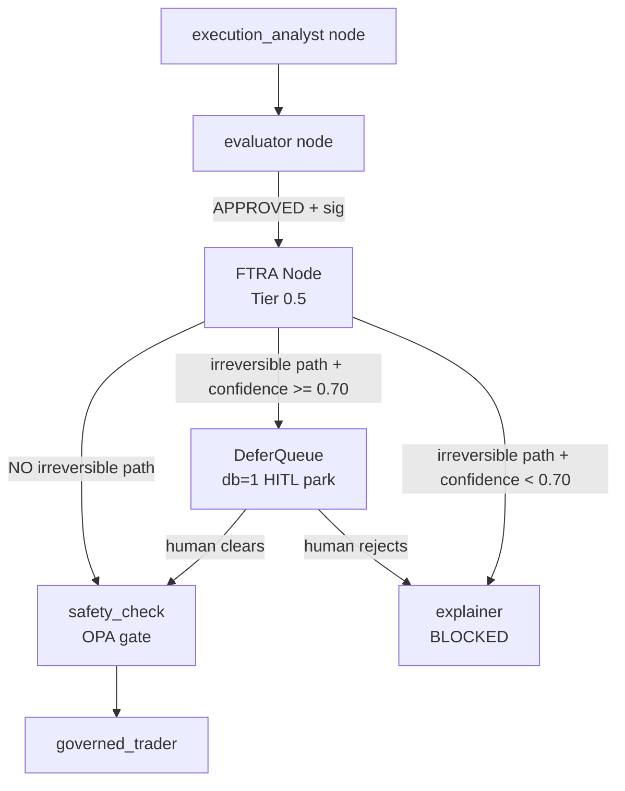
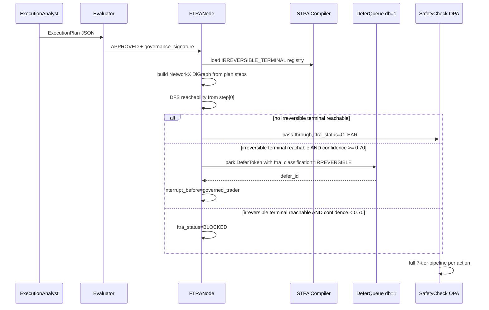

# Commencement-Time Worst-Case Reachability Analyzer
## CAGE Implementation Plan

**Document status:** Approved for implementation
**Change category:** Cat-N (Normal) — standard feature addition to existing governance pipeline; no new GCP services, no new K8s namespaces, no new external APIs. CAB review window: 5 business days.  
**ADR reference:** Propose `ADR-007-commencement-time-reachability-analyzer.md`  
**Shared-module impact:** Changes touch `src/gateway/governance/` (shared across US_FED, EU_ECB, APAC_MAS). Impact statements are included in §8.

---

## 1. Problem Statement

CAGE's current governance model is **reactive and per-action**: [`SymbolicGovernor._run_checks()`](src/gateway/governance/symbolic_governor.py:171) evaluates a single `(tool_name, params)` pair at the moment each node fires. This means:

- A sequence of five individually-approved, locally-reversible steps can **compose into an irreversible external commitment** (e.g. a wire release, a broadcast trade) without any tier ever seeing the full chain.
- The STPA compiler tags UCAs with `DENY/GOVERNANCE_VIOLATION/MANUAL_REVIEW/ALLOW` but has **no concept of terminal irreversibility** — it cannot distinguish a read-only market-data call from a final settlement action.
- The [`ExecutionPlan`](src/governed_financial_advisor/agents/execution_analyst/agent.py:34) produced by the Execution Analyst is validated by the Evaluator for risk, but **no component performs a graph-level reachability check** to determine whether any path through the plan's DAG reaches an irreversible terminal before the first node fires.

The result is a gap between CAGE's per-step governance strength and the compositional irreversibility risk identified in the OWASP AISVS C9 / AARM profile.

---

## 2. Proposed Solution: Forward-Looking Trajectory Reachability Analyzer (FTRA)

The FTRA is a **plan-time** (commencement-time) analysis layer that intercepts the [`ExecutionPlan`](src/governed_financial_advisor/agents/execution_analyst/agent.py:34) **after** the Evaluator approves it and **before** the `safety_check` node fires. It:

1. Traverses the plan's step DAG using NetworkX DFS/BFS.
2. Classifies each step's `action` against a compiled `IRREVERSIBLE_TERMINAL` registry derived from the STPA control structure.
3. If any reachable path leads to an `IRREVERSIBLE_TERMINAL` node, the entire plan inherits worst-case classification from `T₀` onward.
4. Worst-case plans are either:
   - Routed to synchronous HITL clearance via the existing [`DeferQueue`](src/gateway/governance/defer_queue.py) (`db=1`), or
   - Blocked outright if the plan's confidence score is below the `FRIA_ZONE_DEFER` threshold.

This is **additive** — it does not replace any existing tier. It inserts a new Tier 0.5 between the Evaluator approval and the `safety_check` OPA gate.

---

## 3. Architecture Overview



### 3.1 Data Flow



---

## 4. New Modules

### 4.1 `src/gateway/governance/ftra/` — new package

| File | Purpose |
|---|---|
| [`__init__.py`](src/gateway/governance/ftra/__init__.py) | Package exports |
| [`classifier.py`](src/gateway/governance/ftra/classifier.py) | `IrreversibilityClassifier` — loads the compiled terminal registry and classifies action names |
| [`graph_analyzer.py`](src/gateway/governance/ftra/graph_analyzer.py) | `PlanGraphAnalyzer` — builds a NetworkX `DiGraph` from `ExecutionPlan.steps`, runs DFS reachability, returns `ReachabilityResult` |
| [`models.py`](src/gateway/governance/ftra/models.py) | Pydantic models: `TerminalClassification`, `ReachabilityResult`, `FTRAVerdict` |
| [`node_factory.py`](src/gateway/governance/ftra/node_factory.py) | `create_ftra_node()` — LangGraph node factory, mirrors the pattern in [`langgraph_harness/opa_node_factory.py`](src/gateway/governance/langgraph_harness/opa_node_factory.py) |

### 4.2 STPA Compiler Extension

Extend [`stpa_compiler.py`](src/gateway/governance/stpa_compiler.py) with:

- New field on [`UCAModel`](src/gateway/governance/stpa_compiler.py:191): `terminal_classification: Literal["IRREVERSIBLE_TERMINAL", "REVERSIBLE", "READ_ONLY"] | None = None`
- New generator function `generate_terminal_registry(cs)` → emits `config/ftra/terminal_registry.json`
- New CLI target `--targets ftra` added to [`_build_parser()`](src/gateway/governance/stpa_compiler.py:1290)

### 4.3 `config/ftra/terminal_registry.json` — new artifact

Generated by the STPA compiler. Schema:

```json
{
  "version": "1.0",
  "generated_at": "<ISO8601>",
  "terminals": {
    "execute_trade": "IRREVERSIBLE_TERMINAL",
    "check_market_status": "READ_ONLY",
    "check_balance": "READ_ONLY"
  }
}
```

### 4.4 `config/stpa_control_structure.yaml` — extension

Add `terminal_classification` field to each UCA's action entry. Example:

```yaml
unsafe_control_actions:
  - id: UCA-1
    action: execute_trade
    terminal_classification: IRREVERSIBLE_TERMINAL
    ...
  - id: UCA-3
    action: check_market_status
    terminal_classification: READ_ONLY
    ...
```

---

## 5. Detailed Component Design

### 5.1 `IrreversibilityClassifier` (`classifier.py`)

```python
class IrreversibilityClassifier:
    """Loads terminal_registry.json and classifies action names.
    
    Fail-closed: any action not in the registry is classified as
    IRREVERSIBLE_TERMINAL to prevent unknown actions from bypassing
    the reachability gate.
    """
    
    def classify(self, action_name: str) -> TerminalClassification:
        ...
    
    def is_irreversible(self, action_name: str) -> bool:
        return self.classify(action_name) == TerminalClassification.IRREVERSIBLE_TERMINAL
```

**Fail-closed contract:** Unknown actions → `IRREVERSIBLE_TERMINAL`. This mirrors the OPA `default stpa_allow = false` pattern in [`generate_opa()`](src/gateway/governance/stpa_compiler.py:323).

### 5.2 `PlanGraphAnalyzer` (`graph_analyzer.py`)

```python
class PlanGraphAnalyzer:
    """Builds a NetworkX DiGraph from ExecutionPlan.steps and runs
    worst-case reachability analysis.
    
    Steps are connected in declared order (step[i] → step[i+1]).
    If a step declares explicit `depends_on` IDs, those edges are used
    instead (future extension for true DAG plans).
    
    Returns ReachabilityResult with:
      - reachable_terminals: list of IRREVERSIBLE_TERMINAL step IDs
      - worst_case_classification: IRREVERSIBLE_TERMINAL | REVERSIBLE | READ_ONLY
      - critical_path: list of step IDs on the shortest path to first terminal
    """
    
    def analyze(self, plan: ExecutionPlan) -> ReachabilityResult:
        ...
```

**Algorithm:**
1. Build `nx.DiGraph` with one node per `PlanStep`, edges from step order / `depends_on`.
2. For each node, call `IrreversibilityClassifier.classify(step.action)`.
3. Run `nx.dfs_preorder_nodes(G, source=steps[0].id)` to enumerate all reachable nodes from the start.
4. Collect all reachable nodes where classification is `IRREVERSIBLE_TERMINAL`.
5. If any exist, compute shortest path to first terminal via `nx.shortest_path`.
6. Return `ReachabilityResult`.

### 5.3 `FTRAVerdict` model (`models.py`)

```python
class FTRAVerdict(str, Enum):
    CLEAR = "CLEAR"                    # No irreversible terminal reachable
    HITL_REQUIRED = "HITL_REQUIRED"    # Irreversible terminal reachable, confidence >= 0.70
    BLOCKED = "BLOCKED"                # Irreversible terminal reachable, confidence < 0.70

class ReachabilityResult(BaseModel):
    worst_case_classification: TerminalClassification
    reachable_terminals: list[str]     # step IDs
    critical_path: list[str]           # step IDs on shortest path to first terminal
    verdict: FTRAVerdict
    confidence_at_analysis: float
    plan_id: str
```

### 5.4 `create_ftra_node()` (`node_factory.py`)

LangGraph node factory. Returns a node function that:

1. Reads `execution_plan_output` and `confidence` from state.
2. Instantiates `PlanGraphAnalyzer` + `IrreversibilityClassifier`.
3. Calls `analyzer.analyze(plan)` → `ReachabilityResult`.
4. Writes `ftra_result` and `ftra_status` to state.
5. On `HITL_REQUIRED`: calls `DeferQueue.park()` with `DeferReason.FTRA_IRREVERSIBLE_TERMINAL` (new enum value), writes `defer_id` to state.
6. On `BLOCKED`: writes `safety_status = "BLOCKED"` and `governance_summary` explaining the reachability finding.
7. Emits OTel span `cage.ftra_analysis` with attributes: `ftra.verdict`, `ftra.reachable_terminals`, `ftra.critical_path`, `ftra.plan_id`.

**State keys written:**

| Key | Type | Description |
|---|---|---|
| `ftra_status` | `str` | `CLEAR / HITL_REQUIRED / BLOCKED` |
| `ftra_result` | `dict` | Serialized `ReachabilityResult` |
| `ftra_defer_id` | `str \| None` | DeferQueue token ID if parked |

---

## 6. Integration Points

### 6.1 Graph Topology Change (`graph.py`)

Insert `ftra_node` between `evaluator` and `safety_check`:

```
evaluator → ftra_node → safety_check   (CLEAR path)
                      → DeferQueue park (HITL_REQUIRED path)
                      → explainer       (BLOCKED path)
```

Modify [`check_safety_signature()`](src/governed_financial_advisor/graph/graph.py:162) to route `APPROVED + sig` → `ftra_node` instead of `safety_check`.

Add new routing function `route_after_ftra(state)`:
- `ftra_status == "CLEAR"` → `"safety_check"`
- `ftra_status == "HITL_REQUIRED"` → `END` (thread parked in DeferQueue; resumed via `/v1/defer/{id}/escalate`)
- `ftra_status == "BLOCKED"` → `"explainer"`

### 6.2 `DeferQueue` Extension (`defer_queue.py`)

Add new `DeferReason` enum value:

```python
class DeferReason(str, Enum):
    ...
    FTRA_IRREVERSIBLE_TERMINAL = "ftra_irreversible_terminal"
```

No other changes to `DeferQueue` — the existing `park()` / `escalate()` / `inject()` API is sufficient.

### 6.3 `AgentState` Extension (`state.py`)

Add three new optional fields:

```python
ftra_status: str | None          # CLEAR / HITL_REQUIRED / BLOCKED
ftra_result: dict | None         # serialized ReachabilityResult
ftra_defer_id: str | None        # DeferQueue token ID
```

### 6.4 STPA Compiler CLI Extension (`stpa_compiler.py`)

- Add `"ftra"` to `EnforcementTarget` literal.
- Add `terminal_classification` field to `UCAModel`.
- Add `generate_terminal_registry(cs: ControlStructureModel) -> str` function.
- Add `"ftra"` to `--targets` choices in `_build_parser()`.
- Add `ftra_content` field to `CompileResult`.
- Wire into `compile_control_structure()` and `write_artifacts()`.

### 6.5 `SymbolicGovernor` — No Changes Required

The FTRA operates at the **plan level** (before `safety_check`), not inside `_run_checks()`. The existing per-action 7-tier pipeline in `SymbolicGovernor` remains unchanged and continues to fire for each individual action during `governed_trader` execution. The FTRA is a **pre-gate**, not a replacement.

---

## 7. Phased Delivery

### Phase 1 — STPA Compiler Extension + Terminal Registry

- Extend [`UCAModel`](src/gateway/governance/stpa_compiler.py:191) with `terminal_classification`.
- Implement `generate_terminal_registry()` in [`stpa_compiler.py`](src/gateway/governance/stpa_compiler.py).
- Update `config/stpa_control_structure.yaml` with `terminal_classification` annotations for all existing UCAs.
- Generate `config/ftra/terminal_registry.json`.
- Add `--targets ftra` CLI option.
- **Tests:** Unit tests for `generate_terminal_registry()`, schema validation, fail-closed behavior for unknown actions.
- **Compliance:** STPA artifact regeneration required before commit (per architect rules).

### Phase 2 — Core FTRA Engine

- Implement `src/gateway/governance/ftra/` package:
  - `models.py` — `TerminalClassification`, `ReachabilityResult`, `FTRAVerdict`
  - `classifier.py` — `IrreversibilityClassifier` with fail-closed default
  - `graph_analyzer.py` — `PlanGraphAnalyzer` using NetworkX
- **Tests:** Unit tests for graph construction, DFS reachability, worst-case classification, fail-closed on unknown actions, single-step plans, cyclic edge detection.
- **Dependency:** `networkx` is already present (used in [`causal_gatekeeper.py`](src/gateway/governance/causal_gatekeeper.py:37)).

### Phase 3 — LangGraph Node + State Integration

- Implement `node_factory.py` — `create_ftra_node()`.
- Extend [`AgentState`](src/governed_financial_advisor/graph/state.py) with `ftra_status`, `ftra_result`, `ftra_defer_id`.
- Add `DeferReason.FTRA_IRREVERSIBLE_TERMINAL` to [`defer_queue.py`](src/gateway/governance/defer_queue.py).
- Wire `ftra_node` into [`graph.py`](src/governed_financial_advisor/graph/graph.py) between `evaluator` and `safety_check`.
- Add `route_after_ftra()` conditional edge.
- **Tests:** Integration tests for each routing path (CLEAR, HITL_REQUIRED, BLOCKED), DeferQueue park/resume flow, OTel span attribute assertions.

### Phase 4 — Observability + Compliance Artifacts

- Add `cage.ftra_analysis` OTel span with full attribute set.
- Add Langfuse observation name `ftra_reachability_check`.
- Update OSCAL SSP in `compliance/oscal/` to reference the new FTRA control.
- Update Lula validation in `compliance/lula/` for the new `ftra_node` Kubernetes resource.
- Update `docs/POAM.md` if FTRA closes any open finding.
- Add `CTRL_FTRA_001` to [`constants.py`](src/gateway/governance/constants.py) `GovernanceControl` enum.

---

## 8. Shared-Module Impact Assessment

Changes to `src/gateway/governance/` deploy simultaneously to all three regions.

### US_FED (NIST SP 800-53)
- **Impact:** FTRA adds a new pre-gate that strengthens AC-3 (Access Enforcement) and SI-7 (Software and Information Integrity) by preventing compositionally irreversible action chains from proceeding without explicit human authorization.
- **OSCAL update required:** Yes — new control `CTRL_FTRA_001` must be added to `compliance/oscal/` within 2 business days of merge.
- **No new data paths** — FTRA reads from `config/ftra/terminal_registry.json` (local file) and writes to existing Redis `db=1` DeferQueue. No new GCS writes.

### EU_ECB (GDPR / EU AI Act / DORA)
- **Impact:** FTRA strengthens EU AI Act Art. 9 (Risk Management) by adding a formal worst-case analysis step before irreversible actions. No new personal data processing. No new data residency paths.
- **SR 26-2 sentinel:** Not applicable — FTRA does not add telemetry sinks. The existing `_NO_LEGAL_FORCE_MARKER` sentinel in [`causal_gatekeeper.py`](src/gateway/governance/causal_gatekeeper.py:133) is unaffected.
- **`CAGE_DEPLOYMENT_REGION` guard:** Not required — no new storage paths or GCS writes introduced.

### APAC_MAS (MAS FEAT / MAS Notice 655 / MAS TRM)
- **Impact:** FTRA strengthens MAS TRM §6.3 (Model Risk) by ensuring that multi-step agent plans with irreversible terminals are subject to human review before execution. No new data paths outside `asia-southeast1`.
- **`CAGE_DEPLOYMENT_REGION` guard:** Not required — same reasoning as EU_ECB.

---

## 9. New Files Summary

| Path | Type | Description |
|---|---|---|
| `src/gateway/governance/ftra/__init__.py` | Python | Package init |
| `src/gateway/governance/ftra/models.py` | Python | Pydantic models |
| `src/gateway/governance/ftra/classifier.py` | Python | `IrreversibilityClassifier` |
| `src/gateway/governance/ftra/graph_analyzer.py` | Python | `PlanGraphAnalyzer` |
| `src/gateway/governance/ftra/node_factory.py` | Python | `create_ftra_node()` |
| `config/ftra/terminal_registry.json` | JSON | Compiled terminal registry |
| `docs/adr/ADR-007-commencement-time-reachability-analyzer.md` | Markdown | ADR |
| `tests/gateway/governance/ftra/test_classifier.py` | Python | Unit tests |
| `tests/gateway/governance/ftra/test_graph_analyzer.py` | Python | Unit tests |
| `tests/gateway/governance/ftra/test_node_factory.py` | Python | Integration tests |

---

## 10. Modified Files Summary

| Path | Change |
|---|---|
| [`src/gateway/governance/stpa_compiler.py`](src/gateway/governance/stpa_compiler.py) | Add `terminal_classification` to `UCAModel`; add `generate_terminal_registry()`; add `ftra` target |
| [`src/gateway/governance/defer_queue.py`](src/gateway/governance/defer_queue.py) | Add `DeferReason.FTRA_IRREVERSIBLE_TERMINAL` |
| [`src/gateway/governance/constants.py`](src/gateway/governance/constants.py) | Add `CTRL_FTRA_001` to `GovernanceControl` enum |
| [`src/governed_financial_advisor/graph/state.py`](src/governed_financial_advisor/graph/state.py) | Add `ftra_status`, `ftra_result`, `ftra_defer_id` fields |
| [`src/governed_financial_advisor/graph/graph.py`](src/governed_financial_advisor/graph/graph.py) | Insert `ftra_node`; add `route_after_ftra()`; update `check_safety_signature()` routing |
| `config/stpa_control_structure.yaml` | Add `terminal_classification` to each UCA |
| `compliance/oscal/` | Add `CTRL_FTRA_001` control entry |
| `compliance/lula/` | Add Lula validation for `ftra_node` |

---

## 11. Invariants and Fail-Closed Contracts

| Invariant | Enforcement |
|---|---|
| Unknown action → `IRREVERSIBLE_TERMINAL` | `IrreversibilityClassifier` default |
| `terminal_registry.json` missing → BLOCKED | `create_ftra_node()` fails closed on `FileNotFoundError` |
| NetworkX import failure → BLOCKED | `create_ftra_node()` fails closed |
| DeferQueue unavailable on `HITL_REQUIRED` → BLOCKED | `create_ftra_node()` falls back to BLOCKED if `DeferQueue.park()` raises |
| FTRA does not replace per-action `_run_checks()` | `SymbolicGovernor` unchanged; FTRA is additive Tier 0.5 |
| `CAGE_DEPLOYMENT_REGION` guard | Not required — no new storage paths |

---

## 12. Commit Strategy

Following the ≤20 files / ≤500 lines per commit rule:

1. `feat(governance): add terminal_classification field to STPA UCAModel and compiler`
2. `feat(governance): add generate_terminal_registry and ftra compiler target`
3. `chore(governance): annotate stpa_control_structure.yaml with terminal_classification`
4. `feat(governance): implement ftra models and IrreversibilityClassifier`
5. `feat(governance): implement PlanGraphAnalyzer with NetworkX DFS reachability`
6. `feat(governance): implement create_ftra_node LangGraph factory`
7. `feat(governance): wire ftra_node into governed_financial_advisor graph`
8. `feat(governance): add FTRA OTel spans and Langfuse observation names`
9. `feat(compliance): add CTRL_FTRA_001 OSCAL and Lula artifacts`
10. `docs(governance): add ADR-007 commencement-time reachability analyzer`

Branch: `feat/FTRA-001-commencement-time-reachability-analyzer`

---

## 13. Confirmed Architectural Decisions

All four open questions have been reviewed and resolved:

1. **DAG vs. linear plans — RESOLVED: Linear chain for Phase 1, optional `depends_on` for Phase 2.**
   Phase 1 treats `ExecutionPlan.steps` as a strict sequential chain (step[i] → step[i+1]). The `PlanStep` schema will accept an optional `depends_on: list[str]` field (ignored in Phase 1, consumed by `PlanGraphAnalyzer` in Phase 2) so the schema is forward-compatible without a breaking change.

2. **Confidence source — RESOLVED: Evaluator confidence score.**
   FTRA reads `evaluation_result.confidence` from `AgentState` — the score already established by the Evaluator/Consensus pipeline. No new FTRA-specific score is introduced. The HITL threshold remains `FRIA_ZONE_DEFER = 0.70` (existing constant in [`symbolic_governor.py`](src/gateway/governance/symbolic_governor.py:142)).

3. **HITL resume path — RESOLVED: Explicit LangGraph wiring required.**
   The existing `POST /v1/defer/{id}/escalate` endpoint parks and retrieves tokens but does **not** currently trigger LangGraph thread resumption. Phase 3 must add a state-rehydration handler in the compliance bridge that injects the HITL approval token back into the suspended LangGraph thread via `graph.update_state()` + `graph.invoke(None, config)`. This is a new integration point between [`compliance_bridge/main.py`](src/compliance_bridge/main.py) and the GFA graph, and must be added to the Phase 3 scope.

4. **Registry caching — RESOLVED: Module-load cache with signal-based hot-reload.**
   `IrreversibilityClassifier` loads `terminal_registry.json` once at module import time. A `SIGUSR1` handler (or `FTRA_REGISTRY_RELOAD=true` env flag checked on each request) triggers a cache bust without pod restart. This matches the pattern used by `ControlRegistry` in [`constants.py`](src/gateway/governance/constants.py) for the control mappings JSON.
