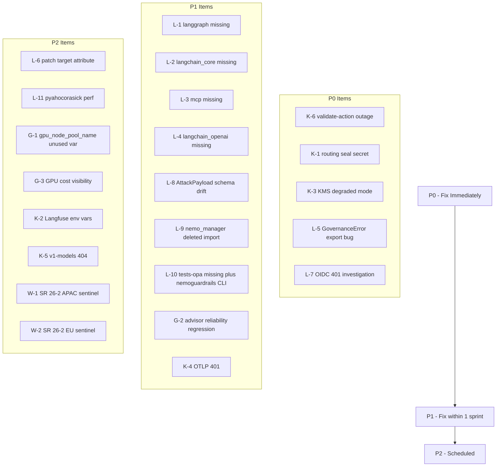

# CAGE Correction Plan — 2026-08-04

**Date:** 2026-08-04
**Commit:** `6edb597`
**Scope:** All 23 issues identified in [`docs/issues/ISSUE_REGISTER_2026-08-04.md`](../docs/issues/ISSUE_REGISTER_2026-08-04.md), spanning local test suite failures (Phase 1), GKE deployment configuration drift (Phase 2), and live GKE endpoint/pod defects (Phase 3).
**Reference Architecture Note:** Per [`AGENTS.md`](../AGENTS.md), CAGE is a reference architecture; the CAB review windows, OSCAL update timelines, and region-guard obligations below follow the same **illustrative pattern** convention used in [`plans/SECURITY_REMEDIATION_PLAN.md`](SECURITY_REMEDIATION_PLAN.md) — they demonstrate how a production adopter would sequence and govern these fixes, not enforced operational obligations for this repository.

---

## Executive Summary

The local test suite fails outright (exit 1, 85 failed, 28 collection errors) primarily because four optional dependency groups (`langgraph`, `langchain_core`, `mcp`, `langchain_openai`) declared under `pyproject.toml` extras are not installed in the default dev `.venv`, cascading into a critical governance-API export bug (L-5) where `GovernanceError`/`SymbolicGovernor` silently disappear from `src.gateway.governance` whenever `langgraph` is absent. Separately, the live GKE deployment (image `6edb597`) — while reporting a clean Terraform apply — has a completely broken `POST /governance/validate-action` endpoint (100% load-test failure) most likely caused by a routing-seal secret mismatch, and the `compliance-bridge` pod is running without KMS signing, violating the CTRL_KMS_001 evidentiary-independence control. Three additional defects (a red-team dataclass/schema drift, a deleted-module import, and a missing `tests/opa/` fixture directory) break the `scripts/verify_all.py` and `scripts/verify_colang_locally.py` release-gate scripts entirely. This plan sequences 23 findings into three priority tiers, starting with the two live-security-relevant CRITICAL findings (K-3 KMS degradation, K-6 endpoint outage) and the L-5 governance-API export bug, followed by dependency-installation and script-repair work that unblocks the majority of the remaining test failures, and closing with cosmetic/advisory cleanup.

---

## Priority Tier Overview



---

## P0 — Fix Immediately

These issues represent a live service outage, a live compliance-control failure, and a code-structure bug that silently breaks the core governance exception contract.

### K-6 — `POST /governance/validate-action` 100% failure rate on live GKE deployment

- **Title:** Deployed image `6edb597` rejects all `/governance/validate-action` traffic
- **Root cause (1 sentence):** The endpoint's first-line `enforce_routing_seal()` check, or the newly added trusted-proxy/rate-limit logic, is rejecting every load-test request — most likely because `CAGE_ROUTING_SEAL_SECRET` is mismatched or unset between the load-test client and the gateway pod (correlates directly with K-1).
- **Fix action:** Reproduce against the live pod with verbose request/response logging enabled on [`src/gateway/server/governance_middleware.py:611-717`](../src/gateway/server/governance_middleware.py:611) (`validate_action_endpoint`); temporarily add a debug log immediately after `enforce_routing_seal(request, body_bytes)` and inside the rate-limit branch (`_check_validate_action_rate_limit`) to isolate which of the two checks is rejecting traffic; once isolated, either (a) correct the `CAGE_ROUTING_SEAL_SECRET` Kubernetes secret to match the value the load-test harness signs with, or (b) add the load-test/ingress source IP range to `_TRUSTED_PROXY_CIDRS` (env var `CAGE_TRUSTED_PROXY_CIDRS`) in the gateway Deployment manifest.
- **Effort:** M
- **Owner suggestion:** gateway / infra (joint — requires both application-log inspection and Kubernetes secret/env verification)
- **Branch:** `fix/gateway-validate-action-outage`

### K-1 — `CAGE_ROUTING_SEAL_SECRET` absent during remote verification

- **Title:** Routing-seal enforcement (U-15/U-16) unverified against live deployment
- **Root cause (1 sentence):** `CAGE_ROUTING_SEAL_SECRET` is not set in the environment running [`scripts/verify_remote.py`](../scripts/verify_remote.py), so seal-enforcement checks silently skip instead of failing hard.
- **Fix action:** Set `CAGE_ROUTING_SEAL_SECRET` in the CI/operator environment that runs `verify_remote.py` (sourced from the same Kubernetes Secret the gateway pod uses — do not hardcode in `.tf` files per [`AGENTS.md`](../AGENTS.md) secret-hygiene rules); additionally change [`scripts/verify_remote.py:243-246`](../scripts/verify_remote.py:243) to exit non-zero (instead of warn-and-skip) when the secret is absent AND `--strict` is passed, so CI cannot silently pass with seal checks disabled.
- **Effort:** S
- **Owner suggestion:** infra
- **Branch:** `fix/verify-remote-seal-secret-enforcement`

### K-3 — `compliance-bridge` running without KMS signing (CTRL_KMS_001 violation)

- **Title:** `KMS_GOVERNANCE_KEY` unset on live `compliance-bridge` pod
- **Root cause (1 sentence):** The `compliance-bridge` Kubernetes Deployment does not have `KMS_GOVERNANCE_KEY` wired to a real Cloud KMS key version resource name, so [`src/compliance_bridge/kms_batch_signer.py`](../src/compliance_bridge/kms_batch_signer.py:360) falls back to unsigned/degraded mode at startup.
- **Fix action:** Add/verify the `KMS_GOVERNANCE_KEY` env var on the `compliance-bridge` Deployment spec (likely `infra/modules/compliance_bridge/main.tf` or equivalent — locate via `grep -r KMS_GOVERNANCE_KEY infra/`), pointing to the correct Cloud KMS key version resource name for the target environment/region; confirm the compliance-bridge service account has `roles/cloudkms.signerVerifier` IAM binding on that key; redeploy via Cloud Build per [`AGENTS.md`](../AGENTS.md) deployment rules (never `kubectl apply` without a preceding Cloud Build step).
- **Effort:** M
- **Owner suggestion:** compliance / infra
- **Branch:** `fix/compliance-bridge-kms-signing`
- **Compliance impact:** Directly touches CTRL_KMS_001 (evidentiary-independence control) and NIST SP 800-53 SC-12/IA-5 (cryptographic key management, per [`docs/POAM.md`](../docs/POAM.md) POAM-2026-012). An OSCAL component update in `compliance/oscal/` is required within 2 business days of the fix PR merging, per [`AGENTS.md`](../AGENTS.md) compliance artefact obligations.

### L-5 — `GovernanceError`/`SymbolicGovernor` silently dropped from package export when `langgraph` absent

- **Title:** Shared `try/except ImportError` in `governance/__init__.py` couples unrelated imports
- **Root cause (1 sentence):** [`src/gateway/governance/__init__.py:15-19`](../src/gateway/governance/__init__.py:15) wraps the `langgraph_harness` import and the `symbolic_governor` import in a single `try/except ImportError: pass` block, so a missing `langgraph` package (L-1) silently prevents `GovernanceError`/`SymbolicGovernor` from being exported even though `symbolic_governor.py` has no `langgraph` dependency itself.
- **Fix action:** Split the two imports into independent `try/except` blocks in [`src/gateway/governance/__init__.py`](../src/gateway/governance/__init__.py):
  ```python
  try:
      from .symbolic_governor import GovernanceError, SymbolicGovernor
  except ImportError:
      pass

  try:
      from . import langgraph_harness
  except ImportError:
      pass
  ```
  This ensures the core governance exception/class are always exported regardless of whether the optional `langgraph_harness` submodule's dependencies are installed.
- **Effort:** S
- **Owner suggestion:** gateway
- **Branch:** `fix/governance-init-import-isolation`
- **Compliance impact:** This is a shared module under `src/gateway/governance/` (see [`AGENTS.md`](../AGENTS.md) Architecture & Design Standards — shared-module cross-region impact). Impact statement: US_FED — no NIST control regression, closes a silent-failure code defect; EU_ECB — no GDPR/EU AI Act/DORA posture change; APAC_MAS — no MAS FEAT/Notice 655/TRM posture change. No `CAGE_DEPLOYMENT_REGION` guard implications (no new data path introduced).

### L-7 — OIDC middleware 401-raising behavior — investigation required

- **Title:** `test_malformed_jwt_raises_401` / `test_jwks_fetch_failure_raises_401` / `test_no_matching_key_raises_401` failing despite code appearing to raise `HTTPException(401)`
- **Root cause (1 sentence):** Unconfirmed — code inspection of [`src/gateway/server/governance_middleware.py:843-973`](../src/gateway/server/governance_middleware.py:843) shows `HTTPException(401)` is raised on all three failure paths, so the test failures likely stem from either an intervening exception handler swallowing the `HTTPException`, a stale/cached `.pyc`, or a test/fixture drift — this must be re-run with full tracebacks captured before a fix can be written.
- **Fix action:** Re-run `pytest tests/test_oidc_middleware.py -v --tb=long` in a clean `.venv` with `PyJWT[crypto]` installed (this test file requires `jwt` to be importable — confirm it is not itself blocked by a missing dependency masking as a different failure mode); capture the exact assertion failure or exception type; if an outer handler is swallowing the exception, locate and fix it; if the tests are stale, update them to match current behavior. **Do not close this item until the actual failure mode is captured** — it is flagged CRITICAL provisionally because a confirmed silent-swallow of a 401 would be an authentication-bypass regression.
- **Effort:** S (investigation) + S–M (fix, pending findings)
- **Owner suggestion:** gateway / tests
- **Branch:** `fix/oidc-middleware-401-investigation`

---

## P1 — Fix Within 1 Sprint

### L-1, L-2, L-3, L-4 — Missing optional dependencies in dev `.venv`

- **Title:** `langgraph`, `langchain_core`, `mcp`, `langchain_openai` not installed in local dev environment
- **Root cause (1 sentence):** The default `.venv` setup (`uv sync` with no `--extra` flags) does not install the `advisor` and `gateway` optional-dependency groups declared in [`pyproject.toml`](../pyproject.toml:60-105), so any test file importing `langgraph`, `langchain_core`, `langchain_openai`, or `mcp` fails at collection time.
- **Fix action:** Update [`scripts/setup_dev.sh`](../scripts/setup_dev.sh) (and/or the documented dev-setup command in `README.md`/`CONTRIBUTING.md`) to run `uv sync --extra gateway --extra advisor --extra compliance --extra langfuse --dev` instead of a bare `uv sync`, so all test-required optional groups are installed by default in local dev environments; verify with `uv pip list | grep -E "langgraph|langchain-core|mcp|langchain-openai"` after re-running setup.
- **Effort:** S
- **Owner suggestion:** infra / tests
- **Branch:** `fix/dev-setup-install-all-extras`
- **Dependency note:** Installing `langgraph` unblocks L-1 test files directly, AND indirectly resolves the collection-error side of L-5 (though L-5's code-structure fix should still be applied independently — see P0). Installing `langchain_core` unblocks 11 test files (L-2). Installing `mcp` unblocks 2 files (L-3). Installing `langchain_openai` unblocks 1 file (L-4). All four should be fixed together in a single dependency-installation PR since they share the same root cause and fix location.

### L-8 — `AttackPayload` dataclass missing `expected_verdict` field

- **Title:** Red-team dataset schema has drifted ahead of the `AttackPayload` dataclass
- **Root cause (1 sentence):** [`tests/red_team/adversarial_dataset.json`](../tests/red_team/adversarial_dataset.json:298) payload entries include an `expected_verdict` key that the `AttackPayload` dataclass in [`tests/red_team/adversarial_red_team.py:84-94`](../tests/red_team/adversarial_red_team.py:84) does not declare, causing `AttackPayload(**p)` to raise `TypeError`.
- **Fix action:** Add `expected_verdict: str = ""` as a field to the `AttackPayload` dataclass in [`tests/red_team/adversarial_red_team.py:84-94`](../tests/red_team/adversarial_red_team.py:84); audit `adversarial_dataset.json` for any other keys present in payload entries but absent from the dataclass (grep both files for field-name parity) to prevent recurrence; consider adding a schema-validation unit test that loads the dataset and asserts every JSON key maps to a declared dataclass field.
- **Effort:** S
- **Owner suggestion:** tests
- **Branch:** `fix/attackpayload-expected-verdict-field`

### L-9 — `scripts/verify_colang_locally.py` imports deleted `src.utils.nemo_manager`

- **Title:** Stale import of a removed module breaks the Colang verification script
- **Root cause (1 sentence):** [`scripts/verify_colang_locally.py:21`](../scripts/verify_colang_locally.py:21) imports `from src.utils.nemo_manager import load_rails`, but `src/utils/` no longer exists in the repository.
- **Fix action:** Locate the current equivalent of `load_rails` (likely relocated under `src/gateway/governance/` or `src/governed_financial_advisor/governance/nemo_config/` based on the NeMo rail configuration paths referenced elsewhere in `scripts/verify_all.py`); update the import in [`scripts/verify_colang_locally.py:21`](../scripts/verify_colang_locally.py:21) to the correct current module path; if no equivalent function exists, rewrite the loader logic against the actual current NeMo Guardrails config loading API (`nemoguardrails.RailsConfig.from_path()`).
- **Effort:** S–M (depends on how much of `nemo_manager`'s functionality needs to be reconstructed)
- **Owner suggestion:** gateway
- **Branch:** `fix/verify-colang-stale-import`

### L-10 — `scripts/verify_all.py` fails on missing `tests/opa/` directory and missing `nemoguardrails` CLI

- **Title:** Release-gate script `verify_all.py` fails at two separate steps
- **Root cause (1 sentence):** `tests/opa/` does not exist in the repository (the actual OPA policy tests live under `compliance/postures/us_fed/opa/` per the workspace file listing), and the `nemoguardrails` CLI is not installed because the `gateway` extra ([`pyproject.toml`](../pyproject.toml:66)) is absent from the local `.venv` (same root cause as L-1..L-4).
- **Fix action:** (1) Update [`scripts/verify_all.py:66-68`](../scripts/verify_all.py:66) to point at the actual OPA test location — `opa test compliance/postures/us_fed/opa/ compliance/postures/eu_ecb/ config/opa/ -v` (verify exact path against `compliance/postures/us_fed/opa/constraints_test.rego` which does exist) instead of the non-existent `tests/opa/`; (2) resolve the `nemoguardrails` CLI absence via the same `uv sync --extra gateway` fix as L-1..L-4 (this item depends on that fix landing first).
- **Effort:** S
- **Owner suggestion:** tests / gateway
- **Branch:** `fix/verify-all-opa-path-correction`
- **Dependency:** Depends on the P1 dependency-installation fix (L-1..L-4) for the `nemoguardrails` CLI half of this issue.

### G-2 — `governed-financial-advisor` Terraform reliability regression

- **Title:** Container renamed, CPU limit cut 75%, health probes removed without review
- **Root cause (1 sentence):** [`infra/modules/governed_advisor/main.tf`](../infra/modules/governed_advisor/main.tf) was refactored to rename the container to `ingress-agent` (line 58), reduce the CPU limit from `2` to `500m` (line 334), and remove `liveness_probe`/`readiness_probe` blocks entirely, with no corresponding load-test validation of the new resource ceiling.
- **Fix action:** (1) Re-add `liveness_probe` and `readiness_probe` blocks to the `container` spec in [`infra/modules/governed_advisor/main.tf`](../infra/modules/governed_advisor/main.tf) targeting the advisor's existing health endpoint (check `src/governed_financial_advisor/server.py` for the health route path — likely `/health` per the pattern used by the gateway); (2) run a load test at the new `500m` CPU limit under realistic traffic to confirm it is sufficient before keeping the reduced value, or revert to `cpu = "2"` if the load test shows throttling; (3) document the container rename (`governed-financial-advisor` → `ingress-agent`) in the module's README/comments so future readers understand the name no longer matches the Terraform resource/service names.
- **Effort:** M
- **Owner suggestion:** infra
- **Branch:** `fix/governed-advisor-health-probes-and-cpu`

### K-4 — OTLP trace export 401 Unauthorized (`gateway`, `governed-financial-advisor`)

- **Title:** Langfuse OTLP ingestion credentials missing/incorrect in pod env
- **Root cause (1 sentence):** `OTEL_EXPORTER_OTLP_HEADERS` (set via `var.otel_exporter_otlp_headers` in [`infra/modules/governed_advisor/main.tf:201`](../infra/modules/governed_advisor/main.tf:201)) does not contain a valid Langfuse public/secret key pair for the live environment.
- **Fix action:** Verify the `otel_exporter_otlp_headers` Terraform variable value in the relevant `*.tfvars` file references a valid, current Langfuse API key pair (format: `Authorization=Basic <base64(public_key:secret_key)>`); rotate/regenerate the Langfuse API key pair if the current one has been revoked; ensure the value is sourced from `terraform.auto.tfvars` (gitignored) per [`AGENTS.md`](../AGENTS.md) secret-hygiene rules, never committed in a `.tf` file.
- **Effort:** S
- **Owner suggestion:** infra
- **Branch:** `fix/otlp-langfuse-credentials`

---

## P2 — Scheduled

### L-6 — Test patch target `causal_gatekeeper` not resolvable as package attribute

- **Title:** `unittest.mock.patch` target order-dependent flakiness
- **Root cause (1 sentence):** [`src/gateway/governance/__init__.py:21-24`](../src/gateway/governance/__init__.py:21) imports only the `causal_safety_check`/`generate_mock_telemetry` *names* from `causal_gatekeeper`, never the submodule itself, so `patch("src.gateway.governance.causal_gatekeeper.causal_safety_check", ...)` fails unless another import elsewhere has already loaded the submodule into `sys.modules` first.
- **Fix action:** Change the test in [`tests/test_symbolic_governor_security.py:438-441`](../tests/test_symbolic_governor_security.py:438) to patch the fully-qualified submodule path `src.gateway.governance.causal_gatekeeper.causal_safety_check` directly via `import src.gateway.governance.causal_gatekeeper` at the top of the test file first (forcing the submodule into `sys.modules` before `patch()` is called), rather than relying on package-level re-export ordering; alternatively, patch `src.gateway.governance.causal_safety_check` (the re-exported name) if the call site in `symbolic_governor.py` resolves the function via the package-level import rather than the submodule import — confirm which pattern `symbolic_governor.py:726-737` actually uses before deciding.
- **Effort:** S
- **Owner suggestion:** tests
- **Branch:** `fix/causal-gatekeeper-patch-target`

### L-11 — `pyahocorasick` absent — Tier-1 keyword scan performance degradation

- **Title:** Aho-Corasick automaton unavailable, falls back to brute-force
- **Root cause (1 sentence):** `pyahocorasick` is an optional performance dependency under the `gateway` extra ([`pyproject.toml`](../pyproject.toml:67-72)) absent from `.venv`.
- **Fix action:** Resolved automatically by the same `uv sync --extra gateway` fix applied for L-1/L-3/L-10; no separate code change needed. Verify post-fix via `python -c "import ahocorasick"` succeeding and the startup warning in `text_filter.py` no longer appearing in logs.
- **Effort:** S (zero additional work — piggybacks on P1 dependency fix)
- **Owner suggestion:** infra
- **Branch:** N/A (covered by `fix/dev-setup-install-all-extras`)

### G-1 — `gpu_node_pool_name` declared in `.tfvars` but not a Terraform variable

- **Title:** Silently-ignored Terraform variable across 5 `.tfvars` files
- **Root cause (1 sentence):** `gpu_node_pool_name` is set in `dev.tfvars`, `eu-dev.tfvars`, `eu-prod.tfvars`, `apac-dev.tfvars`, and `apac-prod.tfvars`, but `infra/targets/gcp-gke/variables.tf` never declares a matching `variable "gpu_node_pool_name" {}` block, so Terraform silently ignores the value (it is only consumed as an *output* of the `gcp_gke_cluster` module, not wired as an input).
- **Fix action:** Add `variable "gpu_node_pool_name" { type = string, default = "" }` to [`infra/targets/gcp-gke/variables.tf`](../infra/targets/gcp-gke/variables.tf); if the intent was for this value to override the node pool's name at creation time, wire it through to the `gcp_gke_cluster` module's input variables in `infra/targets/gcp-gke/main.tf`; if the intent was only ever to reference the module's *output* value (e.g., for a nodeSelector in a different module), remove the now-redundant `.tfvars` entries from all 5 files and document that the node pool name is derived, not configured.
- **Effort:** S
- **Owner suggestion:** infra
- **Branch:** `fix/gpu-node-pool-name-variable-wiring`

### G-3 — 3 new GPU nodes provisioned (cost visibility)

- **Title:** No fix required — cost-tracking visibility item
- **Root cause (1 sentence):** Expected behavior per `gpu_node_pool_initial_count` in `dev.tfvars`; not a defect.
- **Fix action:** No code fix. Add the GPU node pool cost to the team's GCP budget-alert dashboard if not already tracked, and confirm `gpu_node_pool_spot = true` is set where appropriate in dev environments (already correctly set to `false` in `dev.tfvars` per the P0-fix comment at line 57 referencing prior spot-VM preemption issues — no further action needed there).
- **Effort:** S (dashboard config only, not code)
- **Owner suggestion:** infra
- **Branch:** N/A (no code change)

### K-2 — Langfuse posture verification env vars absent locally

- **Title:** `verify_langfuse_posture.py` cannot verify remote posture without local credentials
- **Root cause (1 sentence):** `BASE_REQUIRED_VARS` (`GOOGLE_CLOUD_PROJECT`, `LANGFUSE_HOST`, `LANGFUSE_PUBLIC_KEY`, etc., per [`scripts/verify_langfuse_posture.py:46-50`](../scripts/verify_langfuse_posture.py:46)) are not exported in the shell environment used to run posture verification against the live deployment.
- **Fix action:** Document the required env vars in a `.env.verify-remote.example` template (do not commit real values); wire the CI job that runs remote verification (if one exists in `.github/workflows/`) to source these from GitHub Actions secrets rather than requiring local export; for manual/local runs, add a `scripts/get_env.py`-based helper (an existing script of this name is present — confirm it can pull these values from GCP Secret Manager) to populate the shell before running `verify_langfuse_posture.py --posture production`.
- **Effort:** S
- **Owner suggestion:** infra / compliance
- **Branch:** `fix/langfuse-posture-env-documentation`

### K-5 — `GET /v1/models → 404`

- **Title:** Unregistered route, non-blocking
- **Root cause (1 sentence):** No `/v1/models` route exists anywhere under `src/gateway/server/`; the request is either an OpenAI-SDK-client auto-probe or an external health-check hitting an endpoint the gateway never implemented.
- **Fix action:** If OpenAI-SDK-compatible client discovery is a desired feature, add a minimal `GET /v1/models` handler to [`src/gateway/server/inference_proxy.py`](../src/gateway/server/inference_proxy.py) returning the configured model list (`MODEL_FAST`, `MODEL_REASONING`, `MODEL_CONSENSUS` from environment); if not needed, no action required beyond confirming no production client depends on it.
- **Effort:** S (if implementing) / None (if deferring)
- **Owner suggestion:** gateway
- **Branch:** `feat/gateway-v1-models-endpoint` (only if implementing)

### W-1, W-2 — SR 26-2 sentinel warnings in APAC/EU threshold files

- **Title:** Advisory documentation sentinel missing in regional threshold files
- **Root cause (1 sentence):** [`scripts/check_apac_mas_posture.py:103-123`](../scripts/check_apac_mas_posture.py:103) and [`scripts/check_eu_ecb_posture.py:101-118`](../scripts/check_eu_ecb_posture.py:101) check APAC/EU threshold files for either the literal string `"SR 26-2"` or the phrase `"no legal force"` to document that the US-specific SR 26-2 citation carries no legal force in non-US_FED jurisdictions; this sentinel is present in `config/thresholds/US_FED_BASELINE.json` but not confirmed in `config/thresholds/APAC_MAS_BASELINE.json` / `config/thresholds/EU_ECB_BASELINE.json`.
- **Fix action:** Add a `_comment` field to `config/thresholds/APAC_MAS_BASELINE.json` and `config/thresholds/EU_ECB_BASELINE.json` stating e.g. `"SR 26-2 (US Federal Reserve) has no legal force in this jurisdiction; regional citation is MAS Notice 655 §4.3 / GDPR Art. 5(1)(e) respectively"` — this mirrors the jurisdictional-citation pattern already established for `pii_audit_retention_authority` in [`docs/POAM.md`](../docs/POAM.md) POAM-2026-034/POAM-2026-035.
- **Effort:** S
- **Owner suggestion:** compliance
- **Branch:** `fix/sr262-sentinel-regional-thresholds`

---

## Quick Wins (< 30 minutes, no risk)

| ID | Fix | File(s) |
|---|---|---|
| L-5 | Split the shared `try/except ImportError` block into two independent blocks | [`src/gateway/governance/__init__.py`](../src/gateway/governance/__init__.py:15-19) |
| L-8 | Add `expected_verdict: str = ""` field to `AttackPayload` dataclass | [`tests/red_team/adversarial_red_team.py:84-94`](../tests/red_team/adversarial_red_team.py:84) |
| G-1 | Add missing `variable "gpu_node_pool_name" {}` declaration | [`infra/targets/gcp-gke/variables.tf`](../infra/targets/gcp-gke/variables.tf) |
| W-1, W-2 | Add SR 26-2 jurisdictional sentinel comment to two JSON files | [`config/thresholds/APAC_MAS_BASELINE.json`](../config/thresholds/APAC_MAS_BASELINE.json), [`config/thresholds/EU_ECB_BASELINE.json`](../config/thresholds/EU_ECB_BASELINE.json) |
| L-10 (partial) | Correct the `opa test` path in `verify_all.py` from `tests/opa/` to the actual `compliance/postures/` location | [`scripts/verify_all.py:66-68`](../scripts/verify_all.py:66) |

---

## Dependencies Between Fixes

- **`uv sync --extra gateway --extra advisor` (L-1/L-2/L-3/L-4 fix)** unblocks: L-1's 3 test files, L-2's 11 test files, L-3's 2 test files, L-4's 1 test file, the `nemoguardrails` CLI half of L-10, and L-11 (Aho-Corasick performance warning disappears as a side effect). This is the single highest-leverage fix in the entire plan — one dev-environment change resolves the majority of the 85 local test failures.
- **L-5's code fix** is independent of the L-1 dependency-installation fix — both should be applied, because even after `langgraph` is installed in dev, production/CI environments that intentionally omit the `advisor` extra (e.g., a gateway-only deployment) would still hit the same silent-export bug.
- **K-1's secret fix** should land before or alongside **K-6's investigation** — K-6's root-cause isolation step explicitly checks whether the seal-secret mismatch (K-1) is the cause, so fixing K-1 first may resolve K-6 as a side effect, or definitively rule it out.
- **L-10's `tests/opa/` path correction** depends on confirming the correct current OPA test location; do this before attempting to re-enable `verify_all.py` in CI.
- **G-2's health-probe re-addition** should land before any further load testing against the `governed-financial-advisor` service, since the missing probes currently mask pod-health signal that would otherwise help diagnose K-6.

---

## Compliance Impact Section

The following issues touch NIST SP 800-53 controls or OSCAL/POAM obligations per [`AGENTS.md`](../AGENTS.md):

| Issue | Control(s) Touched | Obligation |
|---|---|---|
| K-3 | CTRL_KMS_001, NIST SC-12 / IA-5 (per [`docs/POAM.md`](../docs/POAM.md) POAM-2026-012) | OSCAL component update in `compliance/oscal/` required within 2 business days of fix PR merge. Update `docs/POAM.md` with commit SHA, Lula validation result, and closure date once `compliance-bridge` KMS signing is confirmed restored on the live deployment. |
| L-5 | Shared module (`src/gateway/governance/`) — cross-region impact per [`AGENTS.md`](../AGENTS.md) Architecture & Design Standards | PR description must include the three-region impact statement (US_FED / EU_ECB / APAC_MAS) even though this fix has no actual posture impact — required by policy for any change to this path. |
| K-1 | GHSA-v3h4-8458-5ww3 mitigation (routing seal enforcement) | No new OSCAL obligation, but `verify_remote.py`'s seal-enforcement checks (U-15/U-16) must be confirmed passing before this can be considered verified in the live environment; document in `docs/POAM.md` if this becomes a tracked open finding. |
| W-1, W-2 | Jurisdictional citation accuracy (parallels POAM-2026-034/POAM-2026-035 pattern) | No formal OSCAL update required — these are advisory documentation sentinels, not control implementations. |
| G-2 | Reliability regression — no direct control mapping, but affects AU-12 observability (health-check signal loss) | Recommend a POAM entry if the CPU-limit reduction is found to cause throttling under production-representative load. |

No issues in this register require an update to `compliance/lula/` validation manifests, since none involve adding or removing Kubernetes resources referenced by existing Lula assertions.

---

## Branch Naming Summary for P0 Fixes

Per [`AGENTS.md`](../AGENTS.md) branch naming conventions (lowercase kebab-case, `fix/<short-description>`, ≤ 30 characters after the prefix):

| Issue | Branch |
|---|---|
| K-6 | `fix/gateway-validate-action-outage` |
| K-1 | `fix/verify-remote-seal-secret-enforcement` |
| K-3 | `fix/compliance-bridge-kms-signing` |
| L-5 | `fix/governance-init-import-isolation` |
| L-7 | `fix/oidc-middleware-401-investigation` |

All five P0 branches should be opened from the latest `main` independently — they touch disjoint files (`governance_middleware.py` request path vs. `governance/__init__.py` vs. Terraform/Kubernetes manifests for `compliance-bridge`) and can be developed and squash-merged in parallel. Each PR title must follow Conventional Commits v1.0.0 format (e.g., `fix(governance): isolate langgraph_harness import from symbolic_governor export`) and use **Squash and merge** on GitHub per [`AGENTS.md`](../AGENTS.md) merge-strategy rules.
