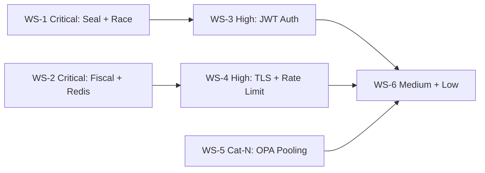

# CAGE Security Remediation Plan

> **⚠️ REFERENCE ARCHITECTURE ONLY — NOT FOR PRODUCTION USE**
> CAGE is a reference architecture demonstrating governance patterns for AI
> systems. It is **not** intended for, and will **not** be deployed to, any
> production environment. The change classifications, CAB review windows, OSCAL
> obligations, and region-guard notes below are **illustrative patterns** showing
> how a production team adopting this reference architecture would handle these
> fixes. They carry no operational obligation in this repository.

> **Change Classification (illustrative):** Mixed Cat-S (Standard) and Cat-N (Normal)
>
> Work streams 1–4 are **Cat-S** (pre-approved bug-fix patterns — no new GCP
> services, no new external APIs, no new K8s namespaces).
> Work stream 5 (OPA client pooling) is **Cat-N** (architectural change to
> shared gateway infrastructure — illustrative 5-business-day CAB review window).
>
> **Shared-module impact (illustrative):** Work streams 1, 3, and 5 touch
> `src/gateway/governance/` and `src/gateway/infrastructure/` which are designed
> to illustrate simultaneous multi-region deployment to US_FED, EU_ECB, and
> APAC_MAS. Impact statements are included as reference patterns.

---

## Overview

28 findings from the static code analysis are grouped into 5 work streams
ordered by risk. Each work stream maps to a single PR with a squash-merge
commit message following Conventional Commits v1.0.

```
Total findings: 28
  Critical : 5
  High     : 8
  Medium   : 8
  Low      : 7
```

---

## Work Stream 1 — Critical Security Fixes (Cat-S)

**Branch:** `fix/sec-critical-governance-seal-and-race`
**Squash commit:** `fix(governance): close seal bypass and singleton race condition`
**Findings addressed:** CRIT-1, CRIT-5

### CRIT-1 — `verify_seal()` swallows `SymbolicGovernorViolation`

**File:** `src/gateway/governance/routing_seal.py:274`

**Problem:** The `except SymbolicGovernorViolation` block catches the exception
and returns `False` instead of propagating it. Any caller that ignores the
`False` return value bypasses the seal entirely.

**Fix:**
```python
# BEFORE (lines 274-275):
    except SymbolicGovernorViolation:
        return False

# AFTER — remove the except block entirely so the exception propagates:
# (delete those two lines; the outer except Exception at line 276 remains)
```

The `require_cleared_seal` decorator already raises `SymbolicGovernorViolation`
when `verify_seal()` returns `False`, so removing the inner catch does not
break the decorator path. Direct callers of `verify_seal()` will now receive
the exception rather than a silently ignorable `False`.

**Tests to add:** `tests/test_routing_seal.py` — assert that `verify_seal()`
raises `SymbolicGovernorViolation` on HMAC mismatch, expiry, and action
mismatch (not just returns `False`).

---

### CRIT-5 — `_pending_payload` race condition on singleton

**File:** `src/gateway/governance/symbolic_governor.py:243`

**Problem:** `_pending_payload` is stored on `self` (a module-level singleton)
during `_run_checks()` and read in `govern()`. Concurrent requests interleave
and read each other's payloads.

**Fix:** Return `_pending_payload` from `_run_checks()` as part of the result
dict instead of storing it on `self`.

```python
# In _run_checks() — replace self._pending_payload = {...} with:
_conf_payload = {
    "control_id": GovernanceControl.AGENT_CONFIDENCE_THRESHOLD.value,
    ...
}
violations.append(_conf_msg)
# Store in local variable, not on self

# Return it in the result dict:
return {
    "violations": violations,
    "opa_results": policy_resp,
    "pending_payload": _conf_payload if violations else None,
}

# In govern() — read from result dict:
result = await self._run_checks(tool_name, params, sim_mode=False)
violations = result["violations"]
if violations:
    payload = result.get("pending_payload")
    raise GovernanceError(violations[0], payload=payload)
```

Also remove the `if hasattr(self, "_pending_payload"): del self._pending_payload`
cleanup in `govern()` — it is no longer needed.

**Shared-module impact (illustrative pattern):**
- US_FED: Closes a concurrency gap in the governance hot-path. No NIST control
  change.
- EU_ECB: No GDPR/EU AI Act/DORA posture change.
- APAC_MAS: No MAS FEAT/Notice 655/TRM posture change.

---

## Work Stream 2 — Critical Infrastructure Fixes (Cat-S)

**Branch:** `fix/sec-critical-fiscal-guard-and-redis`
**Squash commit:** `fix(governance): fix fiscal guard infinity bypass and deprecated event loop API`
**Findings addressed:** CRIT-2, CRIT-3, CRIT-4

### CRIT-2 — `float('inf')` bypasses fiscal guards

**File:** `src/gateway/governance/fiscal_limit_guard.py:371`

**Fix:** Add `math.isfinite()` check before the existing guards:

```python
import math  # add to top-of-file imports

async def reserve(self, agent_id: str, amount_usd: float) -> ReservationToken:
    if not isinstance(amount_usd, (int, float)) or not math.isfinite(amount_usd):
        raise ValueError(
            f"reserve: amount_usd must be a finite positive number, got {amount_usd!r}"
        )
    if amount_usd <= 0:
        raise ValueError(f"reserve: amount_usd must be > 0, got {amount_usd}")
    # Remove the duplicate isinstance/NaN check at line 379 — now redundant
```

---

### CRIT-3 — `asyncio.get_event_loop()` deprecated in async context

**File:** `src/gateway/governance/fiscal_limit_guard.py:273`, `:317`

**Fix:**
```python
# BEFORE:
loop = asyncio.get_event_loop()
return await loop.run_in_executor(...)

# AFTER:
loop = asyncio.get_running_loop()
return await loop.run_in_executor(...)
```

Apply to both `_atomic_increment()` (line 273) and `_atomic_decrement()` (line 317).

---

### CRIT-4 — `redis_client._get()` called directly from `cbf.py`

**File:** `src/gateway/governance/cbf.py:314`, `:608`

**Fix:** Use the public `pipeline()` method instead of the private `_get()`:

```python
# BEFORE (line 314):
client = redis_client._get()
async with client.pipeline(transaction=False) as pipe:

# AFTER:
async with redis_client.pipeline() as pipe:
    pipe.get(self.redis_key)
    results = await pipe.execute()
```

For `atomic_verify_and_commit()` (line 608), the Lua `evalsha` call requires
the raw `aioredis.Redis` client. Expose a `get_raw_client()` public method on
`_AsyncRedisClient` instead of calling `_get()` directly:

```python
# In redis_client.py — add to _AsyncRedisClient:
def get_raw_client(self) -> aioredis.Redis:
    """Return the underlying aioredis.Redis client for Lua script execution."""
    return self._get()

# In cbf.py:
client = redis_client.get_raw_client()
```

**Shared-module impact:**
- US_FED: Closes a NIST SC-28 (protection of information at rest) gap — the
  Redis client encapsulation ensures TLS/auth settings cannot be bypassed.
- EU_ECB: No GDPR posture change.
- APAC_MAS: No MAS TRM posture change.

---

## Work Stream 3 — High: Authentication & JWT Security (Cat-S)

**Branch:** `fix/sec-high-oidc-jwt-auth`
**Squash commit:** `fix(gateway): harden OIDC JWT validation against algorithm confusion and missing deps`
**Findings addressed:** HIGH-2, HIGH-3, HIGH-4

### HIGH-2 — PyJWT missing → silent authentication bypass

**File:** `src/gateway/server/governance_middleware.py:793`

**Fix:**
```python
# BEFORE:
except ImportError:
    logger.warning("⚠️ PyJWT not installed — OIDC token validation skipped.")
    return {}

# AFTER:
except ImportError as exc:
    if _OIDC_JWKS_URI:
        raise HTTPException(
            status_code=503,
            detail={
                "error": "oidc_unavailable",
                "message": "OIDC validation is configured but PyJWT is not installed. "
                           "Install with: pip install PyJWT[crypto]",
            },
        ) from exc
    return {}
```

---

### HIGH-3 — JWT `alg` header trusted from token — algorithm confusion attack

**File:** `src/gateway/server/governance_middleware.py:813`

**Fix:** Hardcode the allowed algorithms list; never read `alg` from the token:

```python
# BEFORE:
alg = header.get("alg", "RS256")
...
decode_kwargs: dict[str, Any] = {
    "algorithms": [alg],
    ...
}

# AFTER — remove alg extraction from header entirely:
_ALLOWED_ALGORITHMS = ["RS256", "ES256", "RS384", "ES384"]

decode_kwargs: dict[str, Any] = {
    "algorithms": _ALLOWED_ALGORITHMS,
    "options": {"verify_exp": True},
}
```

Also remove the `_decode_jwt_header()` call that reads `alg` — it is only
needed for `kid` lookup, which can be extracted without reading `alg`:

```python
header = _decode_jwt_header(token)
kid = header.get("kid", "default")
# Do NOT read alg from header
```

---

### HIGH-4 — JWKS fetched via `urllib` without explicit SSL verification

**File:** `src/gateway/server/governance_middleware.py:727`

**Fix:** Replace `urllib.request.urlopen` with `httpx.AsyncClient`:

```python
async def _fetch_jwks() -> dict[str, Any]:
    ...
    try:
        async with httpx.AsyncClient(verify=True, timeout=5.0) as client:
            resp = await client.get(_OIDC_JWKS_URI)
            resp.raise_for_status()
            jwks_doc = resp.json()
    except Exception as exc:
        raise RuntimeError(
            f"Failed to fetch JWKS from {_OIDC_JWKS_URI}: {exc}"
        ) from exc
```

`httpx` is already a declared dependency. Remove the `import urllib.request`
block from this function.

**Shared-module impact:**
- US_FED: Closes NIST IA-8 (identification and authentication — non-org users)
  gap. No OSCAL update required (no HIGH-impact control change).
- EU_ECB: Strengthens GDPR Art. 32 (security of processing) posture.
- APAC_MAS: Aligns with MAS TRM §9.1 (access control).

---

## Work Stream 4 — High: Redis TLS and Rate Limiting (Cat-S)

**Branch:** `fix/sec-high-redis-tls-and-rate-limit`
**Squash commit:** `fix(infra): enforce Redis TLS cert verification and harden rate limiter`
**Findings addressed:** HIGH-1, HIGH-5, MED-3, MED-8

### HIGH-1 — `ssl.CERT_NONE` in production gateway Redis clients

**File:** `src/gateway/infrastructure/redis_client.py:109`, `:251`

**Fix:** Apply the same environment-conditional cert verification used in
`src/governed_financial_advisor/infrastructure/redis_client.py:185`:

```python
# In _AsyncRedisClient._get() and _SyncRedisClient._get():
cage_env = os.environ.get("CAGE_ENV", "prod").lower()
if _REDIS_TLS:
    if cage_env in ("dev", "development", "test", "ci"):
        ssl_cert_reqs = ssl.CERT_NONE
        logger.warning("⚠️ Redis TLS: ssl_cert_reqs=NONE in dev mode.")
    else:
        ssl_cert_reqs = ssl.CERT_REQUIRED
        ca_cert_path = os.environ.get(
            "REDIS_CA_CERT_PATH", "/etc/ssl/certs/ca-certificates.crt"
        )
        logger.info("🔒 Redis TLS: ssl_cert_reqs=REQUIRED, ca_certs=%s", ca_cert_path)
else:
    ssl_cert_reqs = None
    ca_cert_path = None

self._client = aioredis.Redis(
    ...
    ssl=_REDIS_TLS,
    ssl_cert_reqs=ssl_cert_reqs,
    ssl_ca_certs=ca_cert_path if ssl_cert_reqs == ssl.CERT_REQUIRED else None,
)
```

**Shared-module impact (illustrative pattern):**
- US_FED: Closes NIST SC-8 (transmission confidentiality and integrity) gap.
  In a production adoption, an OSCAL update would be required within 2 business
  days of merge.
- EU_ECB: Strengthens GDPR Art. 32 / DORA Art. 9 posture.
- APAC_MAS: Aligns with MAS TRM §9.3 (encryption in transit).

---

### HIGH-5 — `X-Forwarded-For` trusted for rate limiting — IP spoofing

**File:** `src/gateway/server/governance_middleware.py:612`

**Fix:** Add a configurable trusted-proxy CIDR list. Only trust
`X-Forwarded-For` when the direct connection comes from a trusted proxy:

```python
import ipaddress

_TRUSTED_PROXY_CIDRS: list[str] = [
    cidr.strip()
    for cidr in os.environ.get(
        "CAGE_TRUSTED_PROXY_CIDRS", "10.0.0.0/8,172.16.0.0/12,192.168.0.0/16"
    ).split(",")
    if cidr.strip()
]

def _is_trusted_proxy(ip: str) -> bool:
    try:
        addr = ipaddress.ip_address(ip)
        return any(addr in ipaddress.ip_network(cidr) for cidr in _TRUSTED_PROXY_CIDRS)
    except ValueError:
        return False

# In validate_action_endpoint:
direct_ip = request.client.host if request.client else "unknown"
if _is_trusted_proxy(direct_ip):
    client_ip = request.headers.get("X-Forwarded-For", "").split(",")[0].strip() or direct_ip
else:
    client_ip = direct_ip
```

---

### MED-3 — In-memory rate limiter ineffective in multi-pod Kubernetes

**File:** `src/gateway/server/governance_middleware.py:322`

**Fix:** Add a Redis-backed rate limiter that falls back to the in-memory
implementation when Redis is unavailable:

```python
async def _check_validate_action_rate_limit_redis(client_ip: str) -> bool:
    """Redis sliding-window rate limiter — effective across all pods."""
    try:
        from src.gateway.infrastructure.redis_client import redis_client
        if redis_client is None:
            return _check_validate_action_rate_limit(client_ip)  # fallback

        key = f"cage:ratelimit:validate-action:{client_ip}"
        now_ms = int(time.monotonic() * 1000)
        window_start_ms = now_ms - (_RATE_LIMIT_WINDOW * 1000)

        # Use a Lua script for atomic check-and-increment
        # (implementation detail: ZREMRANGEBYSCORE + ZADD + ZCARD in one script)
        ...
    except Exception:
        return _check_validate_action_rate_limit(client_ip)  # fallback
```

For the initial fix, document the limitation prominently and add a startup
warning when running in Kubernetes without Redis rate limiting configured.

---

### MED-8 — Salt enforcement only triggers for `CAGE_ENV=prod`

**File:** `src/gateway/governance/routing_seal.py:349`

**Fix:** Remove the `== "prod"` guard at the module level:

```python
# BEFORE:
if (
    _os.environ.get("CAGE_ENV", "prod").lower() == "prod"
):
    assert_custom_salt_in_production()

# AFTER — let assert_custom_salt_in_production() handle all env checks:
assert_custom_salt_in_production()
```

`assert_custom_salt_in_production()` already checks for
`env not in ("development", "dev", "test", "ci")`, so staging/UAT/preprod
deployments with the default salt will now correctly fail at startup.

---

## Work Stream 5 — High: Connection Pool Architecture (Cat-N)

> **Cat-N change — 5-business-day CAB review window applies.**
> This work stream changes connection management architecture in
> `src/gateway/core/policy.py` (shared module). It does not add new GCP
> services or external APIs, but it changes how the OPA HTTP client is
> lifecycle-managed.

**Branch:** `fix/infra-opa-client-connection-pooling`
**Squash commit:** `fix(gateway): replace per-request OPA httpx client with pooled singleton`
**Findings addressed:** HIGH-7, HIGH-8

### HIGH-7 — New `httpx.AsyncClient` per OPA request

**File:** `src/gateway/core/policy.py:322`

**Fix:** Replace `_make_client()` with a module-level singleton managed by the
FastAPI lifespan:

```python
# In policy.py — add module-level client:
_opa_http_client: httpx.AsyncClient | None = None

def get_opa_http_client() -> httpx.AsyncClient:
    global _opa_http_client
    if _opa_http_client is None or _opa_http_client.is_closed:
        if _uds_socket_path:
            transport = httpx.AsyncHTTPTransport(uds=_uds_socket_path)
        else:
            transport = httpx.AsyncHTTPTransport(retries=0)
        _opa_http_client = httpx.AsyncClient(
            transport=transport,
            limits=httpx.Limits(
                max_connections=20,
                max_keepalive_connections=10,
                keepalive_expiry=30,
            ),
            timeout=httpx.Timeout(connect=2.0, read=5.0, write=5.0, pool=2.0),
        )
    return _opa_http_client

async def close_opa_http_client() -> None:
    global _opa_http_client
    if _opa_http_client and not _opa_http_client.is_closed:
        await _opa_http_client.aclose()
        _opa_http_client = None
```

Register `close_opa_http_client()` in the FastAPI lifespan shutdown handler in
`src/gateway/server/hybrid_server.py`.

In `OPAClient.evaluate_policy()`, replace `async with self._make_client() as client:`
with `client = get_opa_http_client()` (no context manager — the singleton is
long-lived).

---

### HIGH-8 — Blocking `urllib` call inside async webhook delivery

**File:** `src/compliance_bridge/governance_webhook.py:348`

**Fix:**
1. Remove the `except ImportError` / `urllib` fallback entirely — `httpx` is a
   declared dependency and must be present.
2. Use a module-level shared `httpx.AsyncClient` for webhook delivery:

```python
# Module-level singleton:
_webhook_http_client: httpx.AsyncClient | None = None

def _get_webhook_client() -> httpx.AsyncClient:
    global _webhook_http_client
    if _webhook_http_client is None or _webhook_http_client.is_closed:
        _webhook_http_client = httpx.AsyncClient(
            limits=httpx.Limits(max_connections=50, max_keepalive_connections=20),
            timeout=httpx.Timeout(_REQUEST_TIMEOUT),
        )
    return _webhook_http_client

# In _deliver():
async def _deliver(self, registration, payload):
    ...
    client = _get_webhook_client()
    for attempt in range(_MAX_RETRIES):
        try:
            response = await client.post(
                registration.endpoint_url,
                content=payload_bytes,
                headers=headers,
            )
            ...
```

**Shared-module impact (Work Stream 5):**
- US_FED: No NIST control change. Connection pooling is an operational
  improvement.
- EU_ECB: No GDPR/DORA posture change.
- APAC_MAS: No MAS TRM posture change.

---

## Work Stream 6 — Medium & Low Fixes (Cat-S)

**Branch:** `fix/sec-medium-low-misc`
**Squash commit:** `fix(governance): fix quota rollback gap, log levels, and dead code`
**Findings addressed:** MED-1, MED-2, MED-4, MED-5, MED-6, MED-7, LOW-1 through LOW-7

### MED-6 — Quota rollback missing for vLLM failure path

**File:** `src/gateway/server/inference_proxy.py:491`

**Fix:** Wrap the vLLM call in the same try/except that performs rollback:

```python
# Extend the existing try block to cover the vLLM call:
try:
    # ... NeMo input verification (existing) ...

    # Step 4: vLLM call (move inside the try block)
    resp = await client.post(target_url, json=body, ...)
    if resp.status_code >= 400:
        raise HTTPException(...)
    vllm_response = resp.json()

except Exception:
    await _get_token_quota_proxy().rollback_step(
        agent_id, reserved_tokens=token_delta
    )
    raise
```

---

### MED-7 — Successful refusal receipt emission logged at `ERROR` level

**File:** `src/gateway/server/governance_middleware.py:539`

**Fix:**
```python
# BEFORE:
logger.error("🔴 [P6] Signed OSCAL refusal receipt emitted: ...")

# AFTER:
logger.info("🔴 [P6] Signed OSCAL refusal receipt emitted: ...")
```

---

### MED-5 — `update_state()` does not re-check CBF safety condition

**File:** `src/gateway/governance/cbf.py:429`

**Fix:** Add a deprecation warning to `update_state()` directing callers to
`atomic_verify_and_commit()`, and add a safety re-check inside `update_state()`:

```python
async def update_state(self, cost: float, governance_signature: str | None = None) -> None:
    import warnings
    warnings.warn(
        "update_state() does not atomically re-verify the CBF safety condition. "
        "Use atomic_verify_and_commit() to eliminate the TOCTOU window.",
        DeprecationWarning,
        stacklevel=2,
    )
    ...
```

---

### LOW-2 — Unreachable `return False` dead code in `kms_signer.py`

**File:** `src/gateway/governance/kms_signer.py:477`

**Fix:** Remove the unreachable `return False` at line 477.

---

### LOW-3 — Dropped audit records logged at `WARNING`

**File:** `src/gateway/governance/consensus.py:472`

**Fix:**
```python
# BEFORE:
except asyncio.QueueFull:
    logger.warning("Consensus audit queue full — dropping audit record for %s.", action)

# AFTER:
except asyncio.QueueFull:
    logger.critical(
        json.dumps({
            "event": "CONSENSUS_AUDIT_RECORD_DROPPED",
            "severity": "CRITICAL",
            "action": action,
            "audit_note": "Consensus audit queue full — record lost. "
                          "Start _background_audit_worker() at application startup.",
        })
    )
```

Also add `asyncio.create_task(_background_audit_worker())` to the gateway
startup sequence in `src/gateway/server/hybrid_server.py`.

---

### LOW-4, LOW-5, LOW-6 — `import` statements inside loops/methods

**Files:**
- `src/gateway/governance/fiscal_limit_guard.py:212` — `import time as _time`
- `src/gateway/server/inference_proxy.py:433` — `import time as _time`
- `src/gateway/governance/cbf.py:186` — `import asyncio as _asyncio`

**Fix:** Move all three imports to the top of their respective files. `time`
and `asyncio` are already imported at the module level in each file — the
local imports are redundant.

---

### LOW-7 — Private IP bypass in EU_ECB/APAC_MAS region guard

**File:** `src/compliance_bridge/governance_webhook.py:185`

**Fix:** Restrict the private IP bypass to loopback only in non-US_FED regions:

```python
def _check_region_guard(self, endpoint_url: str) -> None:
    if self._region not in ("EU_ECB", "APAC_MAS"):
        return

    parsed = urlparse(endpoint_url)
    hostname = parsed.hostname or ""

    # Only allow loopback for EU/APAC — not RFC-1918 private ranges
    # (10.x/192.168.x can span cross-region VPC peering in GCP)
    if hostname in ("localhost", "127.0.0.1", "::1"):
        return

    for suffix in _REGION_ALLOWED_SUFFIXES.get(self._region, []):
        if suffix in hostname:
            return

    raise ValueError(...)
```

---

## Execution Order



Work streams 1 and 2 are independent and can be developed in parallel.
Work streams 3 and 4 depend on WS-1/WS-2 being merged first (they touch
overlapping files in `governance_middleware.py`).
Work stream 5 (illustrative Cat-N) runs in parallel with WS-3/WS-4.
Work stream 6 is last — it cleans up after all structural fixes are in place.

---

## Branch and PR Checklist

> The approval gates below are **illustrative patterns** for teams adopting
> this reference architecture in a real production context. No formal CAB/AO
> approval is enforced in this repository.

For each PR:

- [ ] Branch from latest `main`: `git checkout main && git pull origin main`
- [ ] PR title matches the squash commit message exactly (Conventional Commits)
- [ ] Use **Squash and merge** on GitHub
- [ ] For WS-1/WS-2/WS-4 (shared modules): include region impact statement in
      PR description (illustrative pattern)
- [ ] For WS-4 (Redis TLS): note OSCAL update pattern in `compliance/oscal/`
      (illustrative — NIST SC-8 control change pattern)
- [ ] For WS-5 (illustrative Cat-N): note in PR description that a production
      adoption would require a 5-business-day CAB review window

---

## Test Coverage Requirements

Each work stream must include or update tests:

| Work Stream | Test file | New assertions |
|---|---|---|
| WS-1 CRIT-1 | `tests/test_routing_seal.py` | `verify_seal()` raises `SymbolicGovernorViolation` on all failure modes |
| WS-1 CRIT-5 | `tests/test_symbolic_governor.py` | Concurrent `govern()` calls do not cross-contaminate payloads |
| WS-2 CRIT-2 | `tests/test_fiscal_limit_guard.py` | `reserve(float('inf'))` raises `ValueError` |
| WS-2 CRIT-3 | `tests/test_fiscal_limit_guard.py` | No `DeprecationWarning` from `get_event_loop()` |
| WS-3 HIGH-2 | `tests/test_governance_middleware.py` | Missing PyJWT raises HTTP 503 when OIDC configured |
| WS-3 HIGH-3 | `tests/test_governance_middleware.py` | JWT with `alg: none` is rejected |
| WS-4 HIGH-1 | `tests/test_redis_client.py` | `ssl_cert_reqs=CERT_REQUIRED` in production env |
| WS-4 HIGH-5 | `tests/test_governance_middleware.py` | Spoofed `X-Forwarded-For` from untrusted proxy uses direct IP |
| WS-6 MED-6 | `tests/test_inference_proxy.py` | vLLM failure triggers quota rollback |
