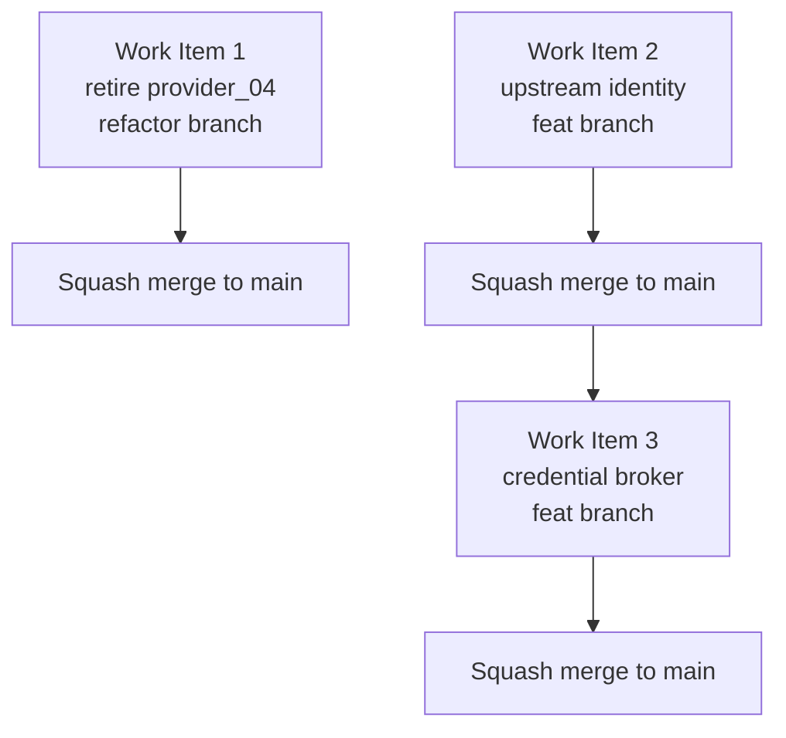

# CAGE Internal Blockers — Implementation Plan

> **Reference Architecture Note (per [`AGENTS.md`](../AGENTS.md)).**
> CAGE is a reference architecture, not a deployed production service. This plan
> optimizes for **clean architecture and structural clarity over operational
> continuity and backward compatibility**. Breaking changes are acceptable and
> desirable. No deprecation window is owed.

**Status:** Ready for implementation. The plan has been re-baselined against the verified HEAD state of the repository.

**Scope:** The three CAGE-internal blocking items:

1. **`provider_04` directory retirement** — remove the orphaned artifact directory
2. **Upstream Agent Identity Binding & Containment** — replace vulnerable header parsing with native SPIFFE SVID extraction
3. **Egress Credential Broker Seam** — vendor-neutral outbound tool authentication vault

---

## 0. Executive Summary — Verified Baseline

A verification pass over the codebase revealed that previous assumptions about the repository's state were stale. The dual-control quorum mechanism (Stream B) and the import boundary CI guardrails are **already fully implemented and secure**.

### 0.1 Fully Implemented & Secure (Removed from Plan)

*   **Dual Control Authentication:** `defer_escalate()` and `defer_inject()` are properly secured by `require_operator_identity` and `require_internal_token`. The operator identity is securely derived from the verified SVID/OIDC token (`auth.py:109-208`), not from self-asserted body parameters.
*   **Quorum Enforcement:** The quorum table is actively wired in via `model_post_init` (`defer_queue.py:302`), and injection security gates are present.
*   **Import Boundary CI:** The script `scripts/check_import_boundaries.py` already correctly defines the `LAYER_3_INTEGRATIONS_PATTERN` and the `INTEGRATIONS_FACTORY_ALLOWLIST`, successfully preventing kernel leakage.

### 0.2 Valid Residuals (The Active Work Items)

1.  **Orphaned `provider_04` Directory:** While all aliases and test references to `provider_04` have already been cleaned up, the directory `src/integrations/provider_04/` still exists and needs to be deleted.
2.  **`X-Agent-ID` Header Vulnerability:** Codebase inspection (`inference_proxy.py:290`) shows that the gateway still parses the `X-Agent-ID` header. Relying on an HTTP header for agent identity is an anti-pattern. This must be replaced with native SPIFFE extraction from the mTLS substrate.
3.  **Outbound Brokering (New):** A core requirement derived from modern Agent Identity architectures (e.g., Google's Auth Manager) is that agents must not hold raw outbound API credentials. CAGE currently lacks a symmetric outbound credential brokering seam.

---

## 1. Work Item 1 — Retire `provider_04` Directory

**Branch:** `refactor/retire-provider-04`
**Depends on:** nothing
**Rationale:** The `provider_04` package is an orphaned artifact. The `normative_provider.py` alias map and tests have already been cleaned up, but the directory itself remains. This item removes the physical directory and any remaining references in `__init__.py`.

### 1.1 Actions

*   **Delete Directory:** Run `rm -rf src/integrations/provider_04/`.
*   **Update `__init__.py`:** Remove the `provider_04/ — Attestation provider + envelope mapper` line from `src/integrations/__init__.py`.
*   **Hygiene Check:** Run `rg -n 'provider_04|Provider04' src/ tests/ scripts/ docs/ compliance/` to guarantee absolute zero residue. Delete the gitignored `scratch/archytan_test.py` if present on disk.

### 1.2 Acceptance criteria

*   Directory `src/integrations/provider_04/` no longer exists.
*   Zero search hits across the repository for the provider name.
*   `make test-fast` is green.

---

## 2. Work Item 2 — Upstream Agent Identity Binding & Containment

**Branch:** `feat/upstream-agent-identity`
**Depends on:** nothing

This item establishes a vendor-neutral, standards-based identity architecture for upstream agents. Taking inspiration from advanced cloud patterns (like Context-Aware Access) but strictly adhering to CAGE's Layer 1 (Kernel) boundaries, this plan models agent identity using the open SPIFFE standard. It establishes a secure separation between edge authentication and substrate-level consequence containment without tying the kernel to any specific cloud provider's managed runtime or proprietary IAM.

### 2.1 Architectural Considerations

*   **Native SPIFFE Extraction (Eliminate `X-Agent-ID`):** Identity must be extracted directly from the verified TLS client certificate's Subject Alternative Name (SAN) presented by the service mesh (e.g., Linkerd/Istio). Relying on upstream proxies to inject `X-Agent-ID` or `X-SPIFFE-ID` headers is an anti-pattern. CAGE natively trusts the transport layer, neutralizing header spoofing vectors without complex Envoy sanitization rules.
*   **Handling Agent Ephemerality:** Modern agent orchestrators issue a new UUID/resource ID on every deployment (e.g., `spiffe://trust-domain/agents/uuid`). OPA Rego policies and `ControlRegistry` maps must not be hardcoded to exact ephemeral URIs. Instead, they must implement standard SPIFFE trust domain and namespace prefix matching (e.g., `spiffe://trust-domain/agents/project-a/*`) to prevent 403 `POLICY_DRIFT_VIOLATION` errors on agent updates.
*   **Agent-to-Agent (A2A) Discovery:** CAGE's `agent_registry_adapter.py` must model a vendor-agnostic A2A authorization flow. Rather than relying on cloud-specific IAM roles, the parent agent presents its own SPIFFE SVID. The OPA policy governing the subagent will evaluate the parent's SPIFFE ID against an authorized caller policy, keeping governance declarative and local.
*   **Vendor-Neutral Double Binding (mTLS + DPoP):** To prevent token theft and replay, the architecture requires binding access tokens to the underlying mTLS channel. Instead of relying on a proprietary cloud service, CAGE will define a `ProofOfPossessionValidator` seam in Layer 1 and provide a reference implementation that validates standard DPoP (Demonstrating Proof of Possession) headers against the presented mTLS client certificate.

### 2.2 Phase 1: Native SPIFFE Binding & Envelope Population

**User Review Required:** Safe to merge immediately. Shifts from header parsing to native SAN extraction.

*   **[NEW] `docs/architecture/AGENT_IDENTITY_BINDING_SPEC.md`**: Document the native SPIFFE extraction mechanism, the vendor-neutral DPoP/mTLS double-binding contract, OPA policy input schema using prefix matching, and declarative A2A authorization.
*   **[MODIFY] `src/gateway/server/inference_proxy.py` & `src/gateway/server/agent_gateway_adapter.py`**: Remove all `X-Agent-ID` parsing (`body.get("agent_id") or request.headers.get("X-Agent-ID", "")`). Extract the `agent_id` exclusively from the verified mTLS client certificate SAN provided by the mesh substrate.
*   **[MODIFY] `src/gateway/governance/governance_envelope.py`**: Populate `SubjectMetadata.agent_id` (v3.0 schema) with the verified SPIFFE URI. Preserves RFC 8785 JCS canonical digests.
*   **[MODIFY] `src/gateway/governance/ingress/agent_registry_adapter.py` & `src/gateway/governance/symbolic_governor.py`**: Project the native SPIFFE URI into the OPA Rego evaluation input (`input.agent_id`). Ensure mapping logic supports prefix-based matching to survive agent redeployments without perturbing `ControlRegistry.active_hash`.

### 2.3 Phase 1.5: Reference Double Binding (mTLS + DPoP)

**User Review Required:** Introduces the vendor-neutral double-binding seam.

*   **[NEW] `src/gateway/server/dpop_validator.py`**: Implement a mock/reference `ProofOfPossessionValidator` that validates a DPoP header's public key against the connection's mTLS client certificate. This demonstrates the token-binding pattern in pure Python, independent of any cloud vendor SDK.

### 2.4 Phase 2: Mesh Hardening & Enforcement

**User Review Required:** Transition to strict fail-closed enforcement of native SPIFFE identities.

*   **[MODIFY] Ingress Enforcement**: `inference_proxy.py` and `agent_gateway_adapter.py` execute 401/403 aborts if the connection lacks a verified SPIFFE client certificate.
*   **[MODIFY] A2A Integration**: Update deployment documentation to provide reference OPA Rego rules for authorizing parent agents to invoke subagents based on SPIFFE URI namespaces.

### 2.5 Acceptance Criteria

*   All references to `X-Agent-ID` and `X-SPIFFE-ID` header parsing are removed from the ingress path.
*   Identity is provably extracted from the verified mTLS client certificate SAN.
*   OPA policies evaluate successfully against SPIFFE URI prefixes, surviving agent redeployment ephemerality.
*   A vendor-neutral `dpop_validator.py` reference implementation exists and demonstrates token binding.
*   Layer 1 remains strictly vendor-neutral (`scripts/check_import_boundaries.py` is green).

---

## 3. Work Item 3 — Egress Credential Broker Seam

**Branch:** `feat/egress-credential-broker`
**Depends on:** Work Item 2 (requires SVID extraction)

This builds on Work Item 2's inbound identity binding to establish a symmetric outbound brokering pattern. Agents should never hold raw API credentials; instead, CAGE intercepts outbound tool calls and securely injects scoped credentials on the agent's behalf, mirroring the security posture of an Auth Manager.

### 3.1 Phase 1: Layer 1 Seam Definition

*   **[NEW] `src/gateway/governance/seams/credential_broker.py`**: Define the vendor-neutral `CredentialBrokerAdapter` protocol.
    *   Method `fetch_credential(agent_svid: str, tool_name: str, scope: str | None) -> dict[str, str]` returns a dictionary of headers to inject into the outbound request (e.g., `{"Authorization": "Bearer <token>"}`).
    *   Define `PermissionDenied` and `CredentialNotFound` exceptions.

### 3.2 Phase 2: Reference Implementation

*   **[NEW] `src/integrations/vault_local/adapter.py`**: Implement a local file-based broker for development.
    *   Reads `config/credential_mappings.json` mapping SPIFFE SVIDs to tool credentials.
    *   Evaluates an OPA Rego policy to authorize the SVID's access to the tool.
    *   Extracts the token from the environment and returns wrapped headers.

### 3.3 Phase 3: Wire into ExecutionActuator

*   **[MODIFY] `src/gateway/governance/execution_actuator.py`**: Intercept outbound calls.
    *   Extract `agent_svid` from `clearance.subject_metadata.agent_id`.
    *   Invoke `broker.fetch_credential()`.
    *   Inject the returned credential headers into the outbound HTTP request payload, ensuring the agent never sees the credential.

### 3.4 Acceptance Criteria

*   `CredentialBrokerAdapter` protocol defined in Layer 1 seams.
*   Local file-based reference implementation exists in `src/integrations/`.
*   OPA policy evaluates SVID-to-tool access grants.
*   `ExecutionActuator` wires credential injection before outbound calls.
*   Credentials never appear in agent-visible logs or responses.
*   Import boundary enforcement passes (broker adapters in `src/integrations/`).

---

## 4. Sequencing

Work Item 1 is trivial and independent. Work Item 3 logically follows Work Item 2 as it relies on the extracted SVID.



Recommended order:

1.  **Work Item 1** — trivial, mechanical, merge first.
2.  **Work Item 2** — establishes agent identity substrate.
3.  **Work Item 3** — builds on Work Item 2's SVID extraction.

Three separate PRs. Per [`AGENTS.md`](../AGENTS.md), **squash merge only** — never `git merge` into `main`, and never a direct commit to `main`.

---

## 5. Compliance Obligations
 
Triggered by [`AGENTS.md`](../AGENTS.md) Compliance Artifact Obligations:
 
 | Trigger | Obligation |
 |---|---|
 | Work Item 2 changes access-control extraction | OSCAL component update in [`compliance/oscal/`](../compliance/oscal/) for **AC-3** (access enforcement) and **IA-2** (identification and authentication) within 2 business days of merge |
 | Work Item 2 binds agent identity to the SVID substrate | Extend the **IA-3** (device identification and authentication) narrative already asserted by [`linkerd-mtls-policy.yaml`](../deployment/k8s/linkerd-mtls-policy.yaml:31) to cover the ingress agent path. |
 | Work Item 3 implements broker pattern | Update **AC-2** (account management) and **SC-17** (public key infrastructure certificates) in OSCAL to describe zero-trust egress brokering |
 | Breaking change to identity parsing | Commit must carry `!` **and** a `BREAKING CHANGE:` footer — both together, never one alone |
 
 ---
 
 ## 6. Commit and Branch Compliance
 
 | Item | Branch | Example commit subject |
 |---|---|---|
 | 1 | `refactor/retire-provider-04` | `refactor(imports): retire orphaned provider_04 directory` |
 | 2 | `feat/upstream-agent-identity` | `feat(gateway)!: replace X-Agent-ID header parsing with native SPIFFE extraction` |
 | 3 | `feat/egress-credential-broker` | `feat(gateway): implement vendor-neutral egress credential broker seam` |
 
 All subjects ≤ 72 characters, imperative mood, no trailing period. Work Item 2 is breaking and requires the `BREAKING CHANGE:` footer.
 
 ---
 
 ## 7. Verification Command Set
 
 Run before opening each PR:
 
 ```bash
 # Fast local regression
 make test-fast
 
 # Gate G3
 uv run python scripts/check_import_boundaries.py --verbose
 
 # Static analysis
 uv run ruff check . && uv run ruff format --check .
 uv run mypy src/
 uv run bandit -r src/ -c pyproject.toml -ll
 
 # Residue check for Work Item 1
 rg -n 'provider_04|Provider04' src/ tests/ scripts/ docs/ compliance/
 ```
 
 Ensure no `kubectl port-forward` tunnels are active before running local tests.
