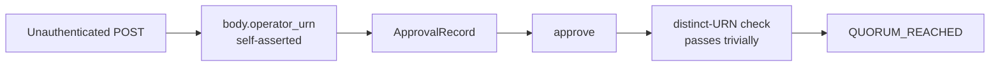
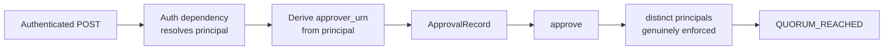
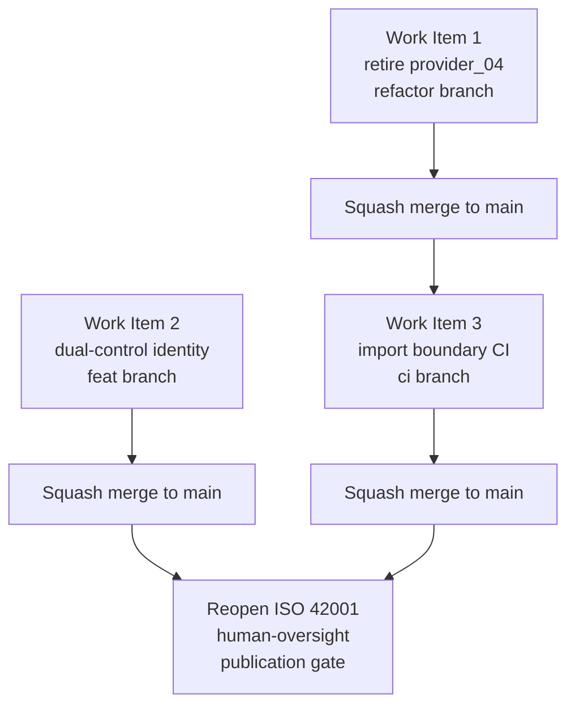

# CAGE Internal Blockers — Implementation Plan

> **Reference Architecture Note (per [`AGENTS.md`](../AGENTS.md)).**
> CAGE is a reference architecture, not a deployed production service. This plan
> optimizes for **clean architecture and structural clarity over operational
> continuity and backward compatibility**. Breaking changes are acceptable and
> desirable. No deprecation window is owed. The partner is referred to
> throughout by the anonymized slot name `actuator_01`; the raw vendor name
> appears only in gitignored `local/` material.

**Status:** Ready for implementation — all three work items are unblocked and have
**zero partner dependency**.

**Scope:** The three CAGE-internal blocking items:

1. **Stream B** — dual-control mechanism (B-1 + B-2)
2. **`provider_04` retirement** — remove the architecturally-wrong legacy artifact
3. **Import boundary CI** — add the `src/gateway` → `src.integrations` rule

**Governing sources:**
[`IMPLEMENTATION_PLAN_v2.md`](../local/integrations/archytan/IMPLEMENTATION_PLAN_v2.md) §4, §5.3, §6,
[`Secure Plugin & Adapter Architecture Specification.md`](../local/analysis/Secure%20Plugin%20%26%20Adapter%20Architecture%20Specification.md)

---

## 0. Critical Finding — The Plan v2 Baseline Is Stale

Codebase inspection shows that **the bulk of Stream B has already been
implemented**, and `src/integrations/provider_04/` **has already been deleted**.
Plan v2's premise — "CAGE has no multi-approver quorum mechanism" — is no longer
accurate. Implementing it again would be wasted work.

However, inspection surfaced a **different and more dangerous problem**: the
dual-control mechanism that exists is **forgeable by an unauthenticated caller**,
and the quorum escalation table is **dead code**. The residual work is therefore
smaller in volume but higher in severity than plan v2 anticipated.

### 0.1 What has already landed

| Plan v2 deliverable | Status | Evidence |
|---|---|---|
| `ApprovalRecord` model | ✅ Landed | [`defer_queue.py:124`](../src/gateway/governance/defer_queue.py:124) |
| `DeferToken.approvals` list | ✅ Landed | [`defer_queue.py:212`](../src/gateway/governance/defer_queue.py:212) |
| `DeferToken.required_quorum` field | ✅ Landed | [`defer_queue.py:213`](../src/gateway/governance/defer_queue.py:213) |
| `schema_version = 2` | ✅ Landed | [`defer_queue.py:211`](../src/gateway/governance/defer_queue.py:211) |
| **B-2** `correlation_id` + uuid5 legacy derivation | ✅ Landed | [`defer_queue.py:216`](../src/gateway/governance/defer_queue.py:216) |
| `ApprovalStatus` enum | ✅ Landed | [`defer_queue.py:229`](../src/gateway/governance/defer_queue.py:229) |
| `DeferReason` → quorum table, total over 7 values | ✅ Landed | [`defer_queue.py:251`](../src/gateway/governance/defer_queue.py:251) |
| `DeferQueue.approve()` under WATCH/MULTI/EXEC | ✅ Landed | [`defer_queue.py:436`](../src/gateway/governance/defer_queue.py:436) |
| `PARTIALLY_APPROVED` state | ✅ Landed | [`defer_queue.py:520`](../src/gateway/governance/defer_queue.py:520) |
| `defer_escalate()` takes an operator-bearing body | ✅ Landed | [`main.py:1480`](../src/compliance_bridge/main.py:1480) |
| `src/integrations/provider_04/` package deleted | ✅ Landed | Directory does not exist |
| `actuator_01` package — 8 modules | ✅ Landed | [`src/integrations/actuator_01/`](../src/integrations/actuator_01/) |
| WebAuthn optional fields on `ApprovalRecord` | ✅ Landed | [`defer_queue.py:149`](../src/gateway/governance/defer_queue.py:149) |

### 0.2 What actually remains — the real residual

| ID | Residual gap | Severity |
|---|---|---|
| **R-B1a** | [`defer_escalate()`](../src/compliance_bridge/main.py:1480) has **no authentication dependency**. Compare [`main.py:672`](../src/compliance_bridge/main.py:672) and [`main.py:1003`](../src/compliance_bridge/main.py:1003), which both carry `Depends(require_internal_token)`. | **P0** |
| **R-B1b** | `operator_urn` is **self-asserted in the request body**. Two POSTs with two invented URNs satisfy quorum. Dual control is forgeable by one actor. | **P0** |
| **R-B1c** | `auth_principal_hash` is `sha256(body.session_id)` — a hash of **attacker-supplied input**, not of an authenticated principal. See [`main.py:1526`](../src/compliance_bridge/main.py:1526). | **P0** |
| **R-B1d** | [`get_required_quorum()`](../src/gateway/governance/defer_queue.py:262) is **dead code** — zero call sites in `src/`. `required_quorum` always defaults to `2`, so `FTRA_IRREVERSIBLE_TERMINAL`, `EXTERNAL_VALIDATION`, and `FLOWSIGNAL_ESCALATION` silently get **2 instead of the mandated 3**. | **P1** |
| **R-B1e** | [`defer_inject()`](../src/compliance_bridge/main.py:1323) resolves tokens on the data-hydration path with **no quorum check**, providing a bypass around dual control. | **P1** |
| **R-P04a** | Dangling `"p04"` and `"p05"` entries remain in the `alias_map` at [`normative_provider.py:921`](../src/gateway/governance/normative_provider.py:921) — they resolve to names with no factory branch, falling through to `ValueError`. | P2 |
| **R-P04b** | `provider_04` referenced in three docstrings and three test modules. | P2 |
| **R-P04c** | [`scratch/archytan_test.py`](../scratch/archytan_test.py) leaks the raw vendor name and the `urn:archytan:op:` namespace. | P2 |
| **R-IB** | No `src/gateway` → `src.integrations` import boundary rule exists in [`check_import_boundaries.py`](../scripts/check_import_boundaries.py). | P1 |

### 0.3 The honest restatement of B-1

Plan v2 §1.2 said CAGE's dual control was *"one unauthenticated POST."* After the
schema work, it is now **two unauthenticated POSTs with caller-chosen operator
names**. The state machine is correct; the **identity binding underneath it is
absent**. Until R-B1a/b/c close, the `≥2 distinct operators` property CAGE would
assert to the partner — and any ISO 42001 human-oversight control mapping built on
it — remains an **inaccurate control assertion**. The publication gate from plan
v2 §6.4 stays shut.

---

## 1. Work Item 1 — Retire `provider_04`

**Branch:** `refactor/retire-provider-04`
**Depends on:** nothing
**Rationale:** `provider_04` was an `EnvelopeMapper`/`AttestationProvider` framing
of what is architecturally a **downstream execution actuator**. That framing is
wrong: CAGE is the *issuer*, not the consumer. The package is already gone; this
item removes the residue so no future contributor rebuilds against it.

### 1.1 Kernel changes

| Target | Change |
|---|---|
| [`normative_provider.py:921`](../src/gateway/governance/normative_provider.py:921) | Delete the `"p04": "provider_04"` alias. It resolves to a name with no factory branch. |
| [`normative_provider.py:922`](../src/gateway/governance/normative_provider.py:922) | Evaluate `"p05": "provider_05"` in the same pass — `provider_05` also has no branch in `get_normative_provider`. Either remove the alias or add the missing branch. **Recommendation: remove**, since `provider_05` implements `EnvelopeMapper`, not `NormativeProvider`. |
| [`normative_provider.py:902`](../src/gateway/governance/normative_provider.py:902) | Rewrite the docstring note. Replace the `provider_04 and provider_05` sentence with an `actuator_01` pointer describing the `ExecutionActuator` seam. |
| [`src/integrations/__init__.py:27`](../src/integrations/__init__.py:27) | Replace the `provider_04/ — Attestation provider + envelope mapper` line with an `actuator_01/ — Downstream execution actuator` entry. |

### 1.2 Test changes

| Target | Change |
|---|---|
| [`test_normative_provider_conformance.py:49`](../tests/test_normative_provider_conformance.py:49) | Remove `"provider_04"` from `ATTESTATION_PROVIDERS`. Confirm whether the list is referenced at all — `test_attestation_providers_exist` imports `provider_02` and `provider_05` directly and never reads it. If unused, delete the constant. |
| [`test_jcs_canonicalizer.py:77`](../tests/test_jcs_canonicalizer.py:77), [`:117`](../tests/test_jcs_canonicalizer.py:117) | Rename `test_jcs_provider_04_reference_vector_1/2` to `..._actuator_01_...`. Update the `envelope_version` literal from `provider_04.envelope/v1` to `actuator_01.envelope/v1` and the `operator_urn` from `urn:provider_04:op:` to `urn:actuator01:op:`. **Recompute the expected canonical bytes and SHA-256** — these are byte-exact assertions and the literals change. |
| [`test_actuator_01_envelope.py:382`](../tests/test_actuator_01_envelope.py:382) | Update the comment pointing at the old vector test name. |
| [`test_provider_05_warrant_contract.py:99`](../tests/test_provider_05_warrant_contract.py:99) | Change the `urn:provider_04:op:test_operator` actor literal to `urn:actuator01:op:test_operator`. |

> **Note on the byte-exact vectors.** These two vectors are the partner's published
> reference vectors and are the strongest evidence that CAGE's JCS canonicalizer
> is wire-correct. Do **not** weaken the assertions. Recompute the digests from the
> renamed inputs and keep the byte-exact comparison intact. Preserve a comment
> recording that the vector *structure* is the partner's, with only the anonymized
> slot names substituted.

### 1.3 Hygiene

- Delete [`scratch/archytan_test.py`](../scratch/archytan_test.py). It is gitignored,
  so it is not a committed leak, but it contains the raw vendor name and the
  `urn:archytan:op:` namespace and should not persist in a working tree.
- Grep for any remaining `provider_04` / `Provider04` occurrence in committed
  paths and confirm zero results before opening the PR.

### 1.4 Acceptance criteria

- `rg -n 'provider_04|Provider04' src/ tests/ scripts/ docs/ compliance/` returns **zero** results.
- `get_normative_provider("p04")` raises `ValueError` with a message listing only live providers.
- Both JCS reference vectors still pass byte-exact under the new naming.
- `make test-fast` is green.

---

## 2. Work Item 2 — Stream B Residual: Bind Dual Control to Real Identity

**Branch:** `feat/defer-dual-control-auth`
**Depends on:** nothing
**This is the true critical path.** It is a **breaking change** to the escalate
endpoint contract, which per [`AGENTS.md`](../AGENTS.md) is acceptable and desirable.

### 2.1 The design problem

The current flow trusts the caller for the one thing that must not be caller-controlled:



`DeferQueue.approve()` correctly enforces *distinctness of `approver_urn`*, but
`approver_urn` is a **string the caller chose**. Distinctness of attacker-chosen
strings is not dual control.

The fix inverts the trust direction: the approver identity must be **derived from
the authenticated principal**, and the request body's claim must be either
dropped entirely or validated as a cross-check that cannot widen authority.



### 2.2 Task B-2.1 — Authenticate the escalate endpoint

Add the existing dependency to [`defer_escalate()`](../src/compliance_bridge/main.py:1480),
matching the pattern already used at [`main.py:1003`](../src/compliance_bridge/main.py:1003):

- Add `_auth: str = Depends(require_internal_token)` to the signature.
- Apply the same treatment to [`defer_inject()`](../src/compliance_bridge/main.py:1323),
  which is likewise unauthenticated today.

**Caveat to record in the PR description.** [`require_internal_token`](../src/compliance_bridge/auth.py:40)
is a **shared service token**, not a per-operator identity. It authenticates *the
caller is an internal service*, not *which human approved*. It is a necessary
first step and it closes the anonymous-access hole, but on its own it does **not**
deliver dual control — a single holder of the service token can still mint two
approvals. Task B-2.2 is what actually closes B-1.

### 2.3 Task B-2.2 — The Operator Identity Seam (expanded design)

This is the substantive piece and the one that actually closes B-1. It is
specified in depth below because `defer_escalate()` is the **highest-consequence
override path in the engine**: it is the mechanism by which a human overrides a
governance decision the machine already declined to make autonomously.

#### 2.3.1 The governing invariant

> **CAGE's core architectural invariant: execution and authorization integrity
> must never rely on self-attestation from the domain being governed.**

Every other authorization surface in CAGE already honours this. The
[`AgentGatewayAdapter`](../src/gateway/server/agent_gateway_adapter.py:1133)
derives `caller_principal` from `request.attributes.source.principal` — the SPIFFE
ID the service mesh extracted from the verified client certificate SAN — and
explicitly **fails closed** when extraction fails
([`:1134`](../src/gateway/server/agent_gateway_adapter.py:1134)). The agent
catalog at [`config/agent_catalog.json`](../config/agent_catalog.json) keys
authorization on the **full `spiffe://` identity**, and
[`agent_registry_adapter.py`](../src/gateway/governance/ingress/agent_registry_adapter.py:314)
takes pains to preserve the whole identity string rather than a suffix,
specifically to prevent authorization grant substitution.

The DEFER escalation path is the **one place that does not follow this pattern**.
It accepts the principal as a JSON string field. That is a split-brain trust
model: the same deployment verifies agent identity cryptographically at the
transport layer while accepting operator identity as a self-declared parameter on
the path that can override the verifier. Closing this is not about adding an auth
check — it is about restoring architectural symmetry.

#### 2.3.2 Identity provenance — SPIFFE/SVID as the substrate

> **ADR — Operator Identity Provenance**
> **Status:** Accepted · **Supersedes:** the self-asserted `operator_urn` in
> [`DeferEscalateRequest`](../src/compliance_bridge/main.py:1460)
> **Decision:** Operator identity for dual-control approval is derived from the
> **SPIFFE/SVID mTLS substrate**, with a configuration-gated OIDC JWT fallback for
> TLS-terminating topologies. Identity is never accepted from the request body.
> **Consequence:** Dual control rests on the same verified transport identity as
> the rest of the engine. Deployments that cannot surface a client certificate
> must explicitly opt into the weaker channel rather than silently degrading.

**Decision (accepted): mTLS/SPIFFE SVID is the identity substrate; OIDC JWT is a
constrained fallback.**

CAGE already runs a SPIFFE trust domain. [`linkerd-mtls-policy.yaml`](../deployment/k8s/linkerd-mtls-policy.yaml:154)
establishes that identity strings are *"derived deterministically from the
ServiceAccount"*, defines `cage-compliance-bridge-sa`
([`:83`](../deployment/k8s/linkerd-mtls-policy.yaml:83)), and enforces
`MeshTLSAuthentication` + `AuthorizationPolicy` such that a pod without a valid
SPIFFE certificate is rejected **at the proxy sidecar before any byte reaches the
application port** ([`:205`](../deployment/k8s/linkerd-mtls-policy.yaml:205)).
The OSCAL SSP already asserts SVID-derived workload identity with in-memory-only
private keys ([`oscal_ssp_exporter.py:319`](../src/gateway/governance/oscal_ssp_exporter.py:319)).

Binding operator identity to this substrate means the dual-control property rests
on the same cryptographic foundation as the rest of the engine, verified per call,
with no new trust root introduced.

| Source | Precedence | `auth_method` | Provenance |
|---|---|---|---|
| SPIFFE SVID / mTLS client certificate | **Primary** | `"MTLS"` | Transport-layer, verified by the mesh proxy before the request reaches the app |
| OIDC bearer JWT | Fallback | `"OIDC"` | Application-layer, verified against [`jwks.py`](../src/gateway/governance/jwks.py) |
| WebAuthn assertion | Phase 5 | `"WEBAUTHN"` | Gated on partner Q1/Q6; `ApprovalRecord` fields already exist and stay `None` |

**Precedence is evaluated, not negotiated.** If a verified SVID is present it wins
unconditionally. A caller must not be able to suppress the certificate channel in
favour of a JWT channel it finds easier to control.

**Disagreement fails closed.** If both an SVID and an OIDC `sub` resolve, and they
map to **different** operator URNs, return `403`. A conflict between two identity
channels is a signal, never a tiebreak.

**The OIDC fallback is deliberately constrained.** It exists only for deployments
that terminate TLS at an ingress proxy and therefore cannot surface a client
certificate to the application. Two rules govern it:

- It must be **explicitly enabled** by configuration (e.g.
  `CAGE_OPERATOR_IDENTITY_ALLOW_OIDC`). It must not be reachable by default, so a
  misconfigured mesh silently degrades to the weaker channel.
- Where a proxy forwards the verified subject in a header (XFCC-style), that
  header is trustworthy **only** when the proxy→app connection is itself
  authenticated and the app strips any inbound copy of that header from
  untrusted sources. An unstripped forwarded-subject header is caller-controlled
  input and reintroduces R-B1b verbatim. State this explicitly in the deployment
  notes; it is the most likely way this design gets silently defeated in practice.

**Never fall back to the service token as an identity.**
[`require_internal_token`](../src/compliance_bridge/auth.py:40) authenticates
*a service*, not *an operator*. Using it as a principal would let one token holder
mint both approvals — the exact defect being closed.

#### 2.3.3 Human operator vs. workload identity

A genuine wrinkle deserves stating plainly. A SPIFFE SVID in a Kubernetes mesh
identifies a **workload** (a ServiceAccount), not a **human**. If two human
operators both approve through the same web console pod, they present the *same*
SVID. The distinctness check in
[`DeferQueue.approve()`](../src/gateway/governance/defer_queue.py:436) would then
reject the second approval as `ALREADY_APPROVED` — correct behaviour, but it means
**SVID alone cannot express two-human quorum through a shared front end**.

This yields a two-tier model that must be documented rather than glossed:

| Caller shape | Identity binding | Dual control genuinely satisfied? |
|---|---|---|
| Operator with an individually-issued client certificate | SVID/DN maps 1:1 to a human operator URN | **Yes** |
| Operator via a shared console workload, with OIDC user token | Workload SVID authenticates the *channel*; OIDC `sub` identifies the *human* | **Yes**, provided both are verified and the `sub` supplies `operator_urn` |
| Operator via a shared console workload, no user token | Only a workload identity is available | **No** — must fail closed |

In the second row the two channels are **complementary, not redundant**: the SVID
proves the request came from the sanctioned console, and the OIDC `sub` proves
which human sat behind it. The conflict rule in §2.3.2 applies to the *operator
URN* dimension only; a workload SVID and a human `sub` are not "in conflict"
because they answer different questions. Implement this as an explicit resolution
order rather than an implicit one:

1. If an individually-issued operator certificate is present → `operator_urn` from
   its subject, `auth_method="MTLS"`.
2. Else if a workload SVID is present **and** OIDC is enabled **and** a verified
   `sub` is present → `operator_urn` from the `sub`, `auth_method="OIDC"`, and
   record the workload SVID alongside as channel provenance.
3. Else → fail closed.

The distinction between an individual operator certificate and a workload SVID
must itself be explicit — for example a dedicated trust-domain path prefix — and
not inferred by string heuristics on the DN.

#### 2.3.4 The `OperatorPrincipal` contract

A new `require_operator_identity` dependency in
[`src/compliance_bridge/auth.py`](../src/compliance_bridge/auth.py), returning:

| Field | Source | Notes |
|---|---|---|
| `operator_urn` | Verified credential subject per §2.3.3 | **Never** read from the request body |
| `auth_method` | `"MTLS"` \| `"OIDC"` \| `"WEBAUTHN"` \| `"DEV_SYNTHETIC"` | Set by the dependency, not the caller |
| `principal_hash` | `sha256` of the verified subject | Replaces `sha256(session_id)` at [`main.py:1526`](../src/compliance_bridge/main.py:1526) |
| `channel_provenance` | Workload SVID when distinct from `operator_urn` | Audit-only; never participates in the distinctness check |

`ApprovalRecord` already carries `approver_urn`, `auth_method`, and
`auth_principal_hash` ([`defer_queue.py:136`](../src/gateway/governance/defer_queue.py:136)),
so this maps onto the existing schema with **no model change** — the fields simply
start being populated from a verified source. `channel_provenance` is the only
candidate addition, and it can live in the audit event rather than the token if a
schema change is undesirable.

#### 2.3.5 Body contract change (breaking)

Remove `operator_urn`, `session_id`, and `auth_method` from
[`DeferEscalateRequest`](../src/compliance_bridge/main.py:1460). All three become
server-derived. Any retained body field (e.g. justification text) must be
non-authoritative and must never reach `ApprovalRecord.approver_urn`.

Reject rather than ignore: if the body asserts an `operator_urn` at all, return
`400`. Silently ignoring a field a caller believes is load-bearing is how this
class of defect returns. Per [`AGENTS.md`](../AGENTS.md), this breaking change is
desirable and owed no deprecation shim.

#### 2.3.6 Dev-mode boundary — the leak risk

[`require_internal_token`](../src/compliance_bridge/auth.py:59) **degrades open**
in `CAGE_ENV=dev`, returning the literal `"dev-unauthenticated"`. Note also that
it defaults `CAGE_ENV` to `"prod"` precisely to fail secure — the right instinct,
and the operator dependency must inherit it.

The operator dependency must **not** replicate the degrade-open behaviour, because
a loose dev toggle here does not merely ease local development — it produces
**approval records that are indistinguishable in the audit trail from genuine
ones**. That is the specific failure this section exists to prevent.

Required dev-mode properties:

| Property | Requirement |
|---|---|
| Enablement | Only when `CAGE_ENV` is explicitly `dev`/`development` **and** an explicit `CAGE_ALLOW_DEV_OPERATOR_IDENTITY` opt-in is set. Two independent conditions, never one. |
| Labelling | `auth_method="DEV_SYNTHETIC"` — a value that has no production meaning and is trivially greppable in evidence |
| Distinctness | Each synthetic principal is **distinct per request**, so multi-operator flows are exercisable locally |
| Honesty | Synthetic principals must be distinct **and** obviously synthetic — e.g. a reserved `urn:cage:dev:` prefix that production URN mapping can never emit |
| Evidence | Any `DeferToken` containing a `DEV_SYNTHETIC` approval is marked as non-evidentiary; the compliance narrative must state that such tokens are excluded from control assertions |
| Guard | A test asserts that with `CAGE_ENV=prod`, no configuration produces a `DEV_SYNTHETIC` principal |

The reserved-prefix rule is what makes the exclusion mechanically checkable later:
a Lula or OSCAL assertion can scan for `urn:cage:dev:` in approval records and fail
if any reaches a production evidence set.

### 2.4 Task B-2.3 — Wire the quorum table into the park path

[`get_required_quorum()`](../src/gateway/governance/defer_queue.py:262) exists,
is total over all seven `DeferReason` values, and is **never called**. Consequently
the three high-consequence reasons that the table assigns `3` are running at the
field default of `2`.

- Set `required_quorum` from `get_required_quorum(token.defer_reason)` at token
  construction. The cleanest placement is inside
  [`DeferToken.model_post_init`](../src/gateway/governance/defer_queue.py:216),
  alongside the existing `correlation_id` derivation — but **only when the caller
  did not explicitly supply a value**, so that an explicit override remains possible.
- Alternatively enforce it in [`DeferQueue.park()`](../src/gateway/governance/defer_queue.py:323).
  `model_post_init` is preferred: it makes the invariant hold for every
  `DeferToken` regardless of construction path, including tokens rehydrated in tests.
- Add a test asserting the mapping is **total** — parametrize over
  `list(DeferReason)` and assert `get_required_quorum` raises no `KeyError`, so a
  future eighth enum value fails loudly rather than defaulting.

### 2.5 Task B-2.4 — Close the `defer_inject` bypass

[`defer_inject()`](../src/compliance_bridge/main.py:1323) resolves a parked token
through the data-hydration path. It is semantically distinct from human approval —
it re-evaluates confidence via `replay_evaluate()` — but it still **transitions the
token to resolved without consulting `approvals` or `required_quorum`**.

Decide and document the intended semantics:

- **Option A — reason-gated.** `defer_inject` may resolve only tokens whose
  `defer_reason` is a data-starvation class (`INSUFFICIENT_CONTEXT`,
  `DATA_STARVATION`, `AMBIGUOUS_SEMANTIC_DISTANCE`). For
  `FTRA_IRREVERSIBLE_TERMINAL`, `EXTERNAL_VALIDATION`, and `FLOWSIGNAL_ESCALATION`
  it returns `409` and directs the caller to the approval path.
  **Recommended** — it matches the original DEFER design intent, where injection
  serves the automated hydration loop and escalation serves human oversight.
- **Option B — state-gated.** `defer_inject` refuses any token already in
  `PARTIALLY_APPROVED`, on the grounds that a human ceremony is underway.

Implement Option A, and additionally refuse when the token is
`PARTIALLY_APPROVED` (the Option B condition) since both guards are cheap and
independent. Record the chosen semantics in the endpoint docstring.

### 2.6 Task B-2.5 — T2 dual-control test suite

Extend [`tests/test_defer_queue_quorum.py`](../tests/test_defer_queue_quorum.py)
and add endpoint-level tests. The suite must include **adversarial** cases, not
just happy-path quorum accumulation:

| Test | Asserts |
|---|---|
| `test_escalate_requires_authentication` | Unauthenticated POST → `401`, and **no** `ApprovalRecord` is written |
| `test_body_asserting_operator_urn_is_rejected` | A body carrying `operator_urn` at all → `400`, never silently ignored |
| `test_svid_wins_over_oidc_when_both_present` | Precedence is evaluated, not caller-negotiated |
| `test_conflicting_svid_and_oidc_urn_fails_closed` | An individual operator cert and an OIDC `sub` mapping to different URNs → `403` |
| `test_oidc_fallback_disabled_by_default` | Without the explicit opt-in, an OIDC-only request fails closed |
| `test_forwarded_subject_header_from_untrusted_source_ignored` | An inbound XFCC-style header on an unauthenticated connection cannot supply a principal |
| `test_workload_svid_alone_cannot_approve` | A shared-console workload SVID with no human `sub` → fails closed (§2.3.3 row 3) |
| `test_workload_svid_plus_oidc_sub_yields_human_urn` | `operator_urn` comes from the `sub`; the SVID is recorded only as `channel_provenance` |
| `test_channel_provenance_excluded_from_distinctness` | Two humans behind the same console SVID can both approve |
| `test_single_principal_cannot_reach_quorum` | Two POSTs from the **same** authenticated principal → `409 ALREADY_APPROVED`, token stays `PARTIALLY_APPROVED` |
| `test_quorum_three_for_irreversible_terminal` | `FTRA_IRREVERSIBLE_TERMINAL` parks with `required_quorum == 3`; two approvals leave it `PARTIALLY_APPROVED` |
| `test_quorum_three_for_external_validation` | Same for `EXTERNAL_VALIDATION` |
| `test_quorum_three_for_flowsignal_escalation` | Same for `FLOWSIGNAL_ESCALATION` |
| `test_quorum_mapping_total_over_enum` | Parametrized over `list(DeferReason)` — no `KeyError` for any member |
| `test_inject_refuses_high_consequence_reason` | `defer_inject` on `FTRA_IRREVERSIBLE_TERMINAL` → `409` |
| `test_inject_refuses_partially_approved_token` | `defer_inject` on a `PARTIALLY_APPROVED` token → `409` |
| `test_principal_hash_is_not_caller_controlled` | `auth_principal_hash` does not equal `sha256` of any caller-supplied field |
| `test_dev_synthetic_principal_is_labelled` | Dev-mode principals carry `auth_method="DEV_SYNTHETIC"` and the reserved `urn:cage:dev:` prefix |
| `test_dev_identity_requires_both_conditions` | `CAGE_ENV=dev` alone, without `CAGE_ALLOW_DEV_OPERATOR_IDENTITY`, does **not** enable synthetic principals |
| `test_prod_never_yields_dev_synthetic` | With `CAGE_ENV=prod`, no configuration produces a `DEV_SYNTHETIC` principal |
| `test_dev_synthetic_principals_are_distinct_per_request` | Local multi-operator flows remain exercisable |
| `test_production_urn_mapping_cannot_emit_dev_prefix` | The reserved prefix is unreachable from real credential subjects |
| `test_concurrent_approvals_are_serialized` | Two concurrent approvals under WATCH/MULTI/EXEC do not double-count toward quorum |

All tests must be hermetic and carry `pytest.mark.unit` / `pytest.mark.local`, using
a fake or in-memory Redis so they run under `make test-fast`.

### 2.7 Acceptance criteria

**Identity provenance**

- No route under `/v1/defer/` is reachable without authentication.
- `approver_urn` and `auth_principal_hash` are **provably** derived from a verified
  credential; a test asserts caller input cannot influence either.
- `DeferEscalateRequest` carries no identity fields; a body asserting
  `operator_urn` is rejected with `400`, not ignored.
- SVID precedence is evaluated server-side and cannot be negotiated by the caller.
- Conflicting operator URNs across identity channels fail closed with `403`.
- The OIDC fallback is disabled unless explicitly enabled by configuration.
- A forwarded-subject header from an unauthenticated source cannot supply a principal.

**Quorum integrity**

- A single authenticated principal cannot reach quorum by any request sequence.
- A shared-console workload SVID alone cannot approve; two humans behind one
  console SVID can.
- `channel_provenance` never participates in the distinctness check.
- All three quorum-3 reasons genuinely require three distinct principals.
- `get_required_quorum` has live call sites and total-mapping coverage.
- `defer_inject` cannot resolve a token that requires human approval.

**Dev-mode boundary**

- Synthetic principals require **both** `CAGE_ENV=dev` and the explicit opt-in.
- Every synthetic principal carries `auth_method="DEV_SYNTHETIC"` and the reserved
  `urn:cage:dev:` prefix.
- With `CAGE_ENV=prod`, no configuration path yields a synthetic principal.
- Production URN mapping cannot emit the reserved dev prefix.

**Gates**

- `make test-fast` green; `uv run mypy src/` clean; `uv run bandit -r src/ -c pyproject.toml -ll` clean.

---

## 3. Work Item 3 — Import Boundary: `src/gateway` → `src.integrations`

**Branch:** `ci/import-boundary-integrations`
**Depends on:** nothing (but land after Work Item 1 so the scan sees the cleaned tree)

### 3.1 The nuance that makes this non-trivial

A naive "Layer 1 must never import `src.integrations`" rule would **fail on six
existing, architecturally-correct imports**:

| Location | Import | Verdict |
|---|---|---|
| [`normative_provider.py:935`](../src/gateway/governance/normative_provider.py:935) | `provider_01` | ✅ Legitimate — function-local lazy factory |
| [`normative_provider.py:940`](../src/gateway/governance/normative_provider.py:940) | `provider_02` | ✅ Legitimate |
| [`normative_provider.py:945`](../src/gateway/governance/normative_provider.py:945) | `provider_03` | ✅ Legitimate |
| [`normative_provider.py:950`](../src/gateway/governance/normative_provider.py:950) | `provider_06` | ✅ Legitimate |
| [`evidence/factory.py:95`](../src/gateway/governance/evidence/factory.py:95) | `storage_gcs` | ✅ Legitimate |
| [`evidence/factory.py:119`](../src/gateway/governance/evidence/factory.py:119) | `storage_s3` | ✅ Legitimate |

All six are **function-scope lazy imports inside factory functions** — the
sanctioned dependency-injection pattern. The kernel names a vendor package only at
the moment of instantiation and never holds a module-level dependency on it.

The rule must therefore distinguish **import scope**, which the current
[`ImportVisitor`](../scripts/check_import_boundaries.py:62) does not track: it
flattens every import to `(name, lineno)` with no notion of nesting.

### 3.2 Proposed rule

> **Layer 1 may not import `src.integrations` at module scope. Function-scope
> lazy imports are permitted only in explicitly allowlisted factory modules.**

Two conditions, both required for an import to pass:

1. The `ast.Import` / `ast.ImportFrom` node is **nested inside a function or
   method body**, not at module top level.
2. The containing file is in `INTEGRATIONS_FACTORY_ALLOWLIST`.

Anything else is a violation. A module-scope import in an allowlisted file is
still a violation — the allowlist grants the *lazy* pattern, not blanket access.

### 3.3 Implementation in [`check_import_boundaries.py`](../scripts/check_import_boundaries.py)

- Extend `ImportVisitor` to record scope depth. Track it by overriding
  `visit_FunctionDef`, `visit_AsyncFunctionDef`, and `visit_ClassDef` to
  increment/decrement a counter, and emit `(name, lineno, is_module_scope)` triples.
  Note that a class-body import is **not** function scope and must be treated as
  module scope for this rule.
- Add `LAYER_3_INTEGRATIONS_PATTERN = re.compile(r"^(src\.)?integrations\b")`.
- Add the allowlist as a module-level frozenset of paths:
  `src/gateway/governance/normative_provider.py` and
  `src/gateway/governance/evidence/factory.py`.
- Emit two distinct `rule_violated` strings so failures are self-explaining:
  - `Layer 1 → Layer 3 (module-scope src.integrations import forbidden; use a function-scope lazy factory import)`
  - `Layer 1 → Layer 3 (src.integrations import outside the factory allowlist)`
- Extend the closing guidance block at [`:227`](../scripts/check_import_boundaries.py:227)
  to describe the lazy-factory escape hatch and how to add to the allowlist.

### 3.4 Forward compatibility

Plan v2 §2.2 introduces an `ActuatorRegistry` in
[`execution_actuator.py`](../src/gateway/governance/execution_actuator.py) which
will need to instantiate `actuator_01`. Record in the script's docstring that
`execution_actuator.py` is the **expected next allowlist entry**, and that adding
an entry is a deliberate architectural decision requiring review — not a
routine unblock. Keep the allowlist small and annotated with a one-line
justification per entry.

### 3.5 Tests

Add `tests/test_import_boundaries.py` (or extend the existing coverage) with unit
tests that exercise `check_file_boundaries` against synthetic sources written to
`tmp_path`:

| Case | Expected |
|---|---|
| Module-scope `from src.integrations.x import Y` in a non-allowlisted gateway file | 1 violation |
| Module-scope import in an **allowlisted** file | 1 violation |
| Function-scope import in an allowlisted file | 0 violations |
| Function-scope import in a non-allowlisted file | 1 violation |
| Class-body import in an allowlisted file | 1 violation |
| Import in a file outside `src/gateway/` | 0 violations |
| The six real call sites in the live tree | 0 violations |

The last case is the regression guard: run the real scanner over the live tree and
assert zero violations, so the allowlist and reality cannot drift apart.

### 3.6 CI wiring

The [`lint`](../.github/workflows/ci.yml:209) job already invokes the script, so no
workflow change is required. Update the step name at
[`ci.yml:209`](../.github/workflows/ci.yml:209) — currently
`Import boundary check (G3 - Layer 1 → Layer 2/4)` — to reflect that Layer 3 and
the integrations rule are now covered.

### 3.7 Acceptance criteria

- `uv run python scripts/check_import_boundaries.py --verbose` exits `0` on the
  current tree and reports the six lazy imports as permitted.
- A deliberately-introduced module-scope `src.integrations` import in a kernel file
  fails the check with an actionable message.
- New unit tests pass under `make test-fast`.
- [`AGENTS.md`](../AGENTS.md) Gate G3 description is updated to include the rule.

---

## 4. Sequencing

All three items are independent. Work Item 2 is the critical path by value; Work
Item 1 is the cheapest and clears naming noise the other two touch.



Recommended order:

1. **Work Item 1** — trivial, mechanical, merge first.
2. **Work Item 2 and Work Item 3 in parallel** — no shared files. Work Item 2
   touches `compliance_bridge/main.py`, `compliance_bridge/auth.py`, and
   `defer_queue.py`; Work Item 3 touches `scripts/` and `.github/workflows/`.

Three separate PRs. Per [`AGENTS.md`](../AGENTS.md), **squash merge only** — never
`git merge` into `main`, and never a direct commit to `main`.

---

## 5. Compliance Obligations

Triggered by [`AGENTS.md`](../AGENTS.md) Compliance Artifact Obligations:

| Trigger | Obligation |
|---|---|
| Work Item 2 changes access-control enforcement on a governance endpoint | OSCAL component update in [`compliance/oscal/`](../compliance/oscal/) for **AC-3** (access enforcement) and **IA-2** (identification and authentication) within 2 business days of merge |
| Work Item 2 binds operator identity to the SVID substrate | Extend the **IA-3** (device identification and authentication) and **SC-8** narrative already asserted by [`linkerd-mtls-policy.yaml`](../deployment/k8s/linkerd-mtls-policy.yaml:31) to cover the operator-approval path. The SSP's SVID statement at [`oscal_ssp_exporter.py:319`](../src/gateway/governance/oscal_ssp_exporter.py:319) currently describes workload identity only |
| Work Item 2 introduces the `urn:cage:dev:` reserved prefix | Add a Lula or OSCAL assertion that **fails** if any approval record bearing the dev prefix or `auth_method="DEV_SYNTHETIC"` appears in a production evidence set |
| Work Item 2 makes the `≥2 distinct operators` claim genuine for the first time | Only **after** merge may the ISO 42001 Annex A human-oversight control mapping be published. Until then plan v2 §6.4's publication gate stays shut. Review [`docs/governance/HUMAN_OVERSIGHT_SCOPE.md`](../docs/governance/HUMAN_OVERSIGHT_SCOPE.md) for statements that the residual gaps contradict |
| Work Item 2 alters DEFER resolution semantics | Assess whether [`compliance/lula/lula-validation-a84.yaml`](../compliance/lula/) or the FTRA validation needs an assertion update. `FTRA_IRREVERSIBLE_TERMINAL` moving from an effective quorum of 2 to 3 is a control-strength change worth asserting |
| Work Item 3 changes Gate G3 scope | Update the Gate G3 description in [`AGENTS.md`](../AGENTS.md) and the CI-failure diagnosis table |
| Breaking change to `defer_escalate` | Commit must carry `!` **and** a `BREAKING CHANGE:` footer — both together, never one alone |

Document in the Work Item 2 PR that dev-mode synthetic principals are **not**
valid dual-control evidence, so the compliance narrative cannot be read as
claiming otherwise.

---

## 6. Commit and Branch Compliance

| Item | Branch | Example commit subject |
|---|---|---|
| 1 | `refactor/retire-provider-04` | `refactor(imports): retire provider_04 residue in favour of actuator_01` |
| 2 | `feat/defer-dual-control-auth` | `feat(governance)!: bind defer approvals to authenticated operator identity` |
| 3 | `ci/import-boundary-integrations` | `ci(governance): forbid module-scope src.integrations imports in kernel` |

All subjects ≤ 72 characters, imperative mood, no trailing period. Work Item 2 is
breaking and requires the `BREAKING CHANGE:` footer describing the
`DeferEscalateRequest` contract change.

---

## 7. Verification Command Set

Run before opening each PR:

```bash
# Fast local regression
make test-fast

# Targeted suites
uv run pytest tests/test_defer_queue_quorum.py -v
uv run pytest tests/test_normative_provider_conformance.py -v
uv run pytest tests/test_jcs_canonicalizer.py -v
uv run pytest tests/test_import_boundaries.py -v

# Gate G3
uv run python scripts/check_import_boundaries.py --verbose

# Static analysis
uv run ruff check . && uv run ruff format --check .
uv run mypy src/
uv run bandit -r src/ -c pyproject.toml -ll

# Residue check for Work Item 1
rg -n 'provider_04|Provider04' src/ tests/ scripts/ docs/ compliance/
```

Ensure no `kubectl port-forward` tunnels are active before running local tests, so
live GKE Redis state cannot contaminate DEFER queue assertions.
