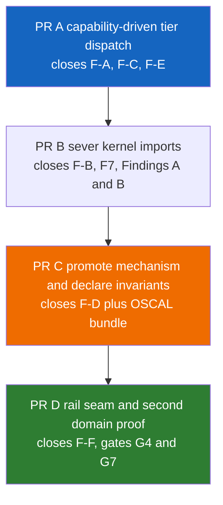
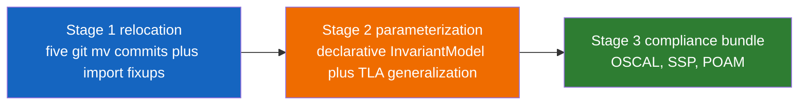

# Domain Pipeline Extraction — Implementation Plan

> **Reference Architecture Note:** This implementation plan describes governance
> pattern extraction for a reference architecture. The migration strategy
> prioritizes architectural clarity and correctness over production continuity
> concerns. Breaking changes, direct refactoring, and fix-forward approaches are
> acceptable — compatibility shims, shadow modes, and gradual migration
> strategies are unnecessary overhead for an illustrative system.

> **How to read this plan.** CAGE is fully deployable to GKE and live testing is
> supported, so every command below is executable. But there is no live customer
> traffic to protect. The plan therefore optimizes for one thing: **an adopter
> reading the finished repository should be able to see the governance seam
> clearly and copy it.** Where the older revision of this plan carried
> production-safety machinery — shadow modes, divergence counters, staged
> cutover flags, promotion matrices — that machinery has been removed. What
> remains is the technical work, the compliance obligations, and the acceptance
> gates.

**Source analysis:** [`plans/domain_pipeline_reusability_analysis.md`](domain_pipeline_reusability_analysis.md)
**Companion:** [`plans/plugin_seam_orthogonality_analysis.md`](plugin_seam_orthogonality_analysis.md)
**Governing standard:** [`docs/operations/GIT_WORKFLOW_STANDARDS.md`](../docs/operations/GIT_WORKFLOW_STANDARDS.md)

---

## Table of Contents

1. [Executive Summary](#1-executive-summary)
2. [Verified Baseline](#2-verified-baseline)
3. [The Three-Layer Split Rule](#3-the-three-layer-split-rule)
4. [PR Sequence and Dependencies](#4-pr-sequence-and-dependencies)
5. [PR A — Capability-Driven Tier Dispatch](#5-pr-a--capability-driven-tier-dispatch)
6. [PR B — Sever Kernel → Plugin Imports](#6-pr-b--sever-kernel--plugin-imports)
7. [PR C — Promote Mechanism and Declare Invariants](#7-pr-c--promote-mechanism-and-declare-invariants)
8. [PR D — Rail Seam and Second Domain Proof](#8-pr-d--rail-seam-and-second-domain-proof)
9. [Cross-Cutting Concerns](#9-cross-cutting-concerns)
10. [Keeping the Verified Core Unforked](#10-keeping-the-verified-core-unforked)
11. [Implementation Guidance](#11-implementation-guidance)
12. [Success Metrics](#12-success-metrics)

---

## 1. Executive Summary

The analysis concluded: **do not duplicate `cage_finance`, do not create
`src/governance_pipeline/`.** The reusable pipeline is
[`src/gateway/`](../src/gateway/). Finish the extraction that is ~70% complete.

This plan sequences that work as **four squash-merged PRs**, each closing named
defects and passing named acceptance gates.

| PR | Branch | Closes | Gates | Engineering effort |
|---|---|---|---|---|
| **A** | `refactor/tier-dispatch` | F-A, F-C, F-E | G1, G2, G6 | High |
| **B** | `refactor/sever-kernel-imports` | F-B, F7, Findings A & B | G3, G8 | Medium |
| **C** | `refactor/promote-mechanism` | F-D, relocation, compliance bundle | G5, G8 | High |
| **D** | `feat/domain-seam-proof` | F-F, second-domain proof | G3, G4, G7 | Medium |

**Consolidation from the previous seven-PR revision.** The old plan split work
across seven PRs, but four of those splits existed only to create safe cutover
windows in a live system:

| Old | New | Why they merged |
|---|---|---|
| PR1 activate tier loop + PR3 replace literals | **PR A** | The split existed to run the tier loop in shadow mode before trusting it. With no production traffic, activating dispatch and removing the literals that bypass it is one coherent change — splitting them would leave the repository in an incoherent intermediate state where both paths exist. |
| PR2 sever imports | **PR B** | Unchanged. This remains a discrete, valuable step: it is the PR that makes the layering machine-enforced. |
| PR4 promote mechanism + PR5 wire `InvariantModel` | **PR C** | The split existed so a parity failure could be attributed to either the move or the parameterization. That attribution is preserved *inside* PR C by ordering the commits: SHA-preserving move first, parameterization second. |
| PR6 NeMo rails + PR7 second domain | **PR D** | The rail seam is ~50 lines and exists only so the second domain can contribute rails. Shipping the seam without the thing that proves it works is ceremony. |

**Ordering constraint that remains real.** PR A must merge before PR B. Not for
deployment-safety reasons — because PR B replaces the `singletons.py`-constructed
enforcement objects with plugin-supplied ones, and the plugin supplies them
*through the tier seam that PR A activates*. Doing B first would produce a
kernel that is fail-closed everywhere and enforces nothing, which is a
meaningless intermediate state to review.

**Compliance sequencing.** OSCAL updates are bundled into **PR C**, the only PR
that moves the module paths cited by NIST SP 800-53 narratives. PR A and PR B
record verify-only compliance evidence and tag deferred narrative edits with
`TODO(PR-C-OSCAL)`.

---

## 2. Verified Baseline

The following was confirmed by direct inspection of the working tree before this
plan was written. Engineering should re-verify at branch time.

### 2.1 Confirmed defects

| ID | Evidence in tree |
|---|---|
| F-A | [`_domain_tiers`](../src/gateway/governance/symbolic_governor.py:802) is read only by [`registered_tier_names()`](../src/gateway/governance/symbolic_governor.py:824). No `tier.evaluate()` / `tier.commit()` call exists anywhere in [`symbolic_governor.py`](../src/gateway/governance/symbolic_governor.py). [`_rollback_committed()`](../src/gateway/governance/symbolic_governor.py:828) has no producer. |
| F-B | [`singletons.py:31-32`](../src/gateway/governance/singletons.py:31) imports `cage_finance.safety.cbf` and `cage_finance.consensus.consensus` at module scope. [`constants.py:302-309`](../src/gateway/governance/constants.py:302) hardcodes the `cage_finance` overlay path. [`constants.py:497`](../src/gateway/governance/constants.py:497) imports `cage_finance.constants`. [`hybrid_server.py:249`](../src/gateway/server/hybrid_server.py:249) imports the plugin's audit worker. |
| F-C | Eight `tool_name == "execute_trade"` sites at [1158](../src/gateway/governance/symbolic_governor.py:1158), [1241](../src/gateway/governance/symbolic_governor.py:1241), [1350](../src/gateway/governance/symbolic_governor.py:1350), [1430](../src/gateway/governance/symbolic_governor.py:1430), [1462](../src/gateway/governance/symbolic_governor.py:1462), [1504](../src/gateway/governance/symbolic_governor.py:1504), [1604](../src/gateway/governance/symbolic_governor.py:1604), plus defaults at [2009](../src/gateway/governance/symbolic_governor.py:2009) and [2233](../src/gateway/governance/symbolic_governor.py:2233). Five `standing_at_refusal={"symbol", "amount"}` sites at [1919](../src/gateway/governance/symbolic_governor.py:1919), [2180](../src/gateway/governance/symbolic_governor.py:2180), [2619](../src/gateway/governance/symbolic_governor.py:2619), [2677](../src/gateway/governance/symbolic_governor.py:2677), [2778](../src/gateway/governance/symbolic_governor.py:2778). |
| F-D | [`InvariantModel`](../src/gateway/governance/contracts.py:341) is still the callback shape (`barrier_value(state) -> float`). Zero implementations, zero call sites. Barrier is hardcoded at [`cbf.py:1063`](../src/cage_finance/safety/cbf.py:1063). |
| F-E | All four tiers implement `claims_action()` (e.g. [`cbf_tier.py:39`](../src/cage_finance/tiers/cbf_tier.py:39)). The kernel never calls it. |
| F-F | [`action_registry.py:26-28`](../src/gateway/governance/nemo/action_registry.py:26) statically imports finance UCA rails. |

### 2.2 Two findings that **amend** the source analysis

Engineering must account for these; they are not in the analysis document.

**Finding A — `ReservationToken` is currently unbound, not merely coupled.**
[`contracts.py:650-655`](../src/gateway/governance/contracts.py:650) does:

```python
try:
    from src.gateway.governance.fiscal_limit_guard import ReservationToken
except ImportError:
    pass
```

The path is `src.gateway.governance.fiscal_limit_guard` — a module that **does
not exist**. Confirmed: `src/gateway/governance/` contains no
`fiscal_limit_guard.py` and no `consensus.py`. The `except ImportError: pass`
therefore fires on every import, and `ReservationToken` is never bound at
runtime. The `"ReservationToken"` string annotation on
[`ResourceGuard.reserve()`](../src/gateway/governance/contracts.py:596) resolves
to nothing.

> **Impact.** The F7/F-B fix is *easier* than the analysis assumed — there is no
> live Layer 1 → Layer 2 import to break here, only a dead `try/except` to
> delete and a real kernel type to introduce. But it also means
> `get_type_hints(ResourceGuard)` currently raises `NameError`, which is a latent
> bug for any tooling that resolves annotations. Fix it in PR B.

**Finding B — the audit-worker import is duplicated with divergent paths.**
- [`hybrid_server.py:249`](../src/gateway/server/hybrid_server.py:249) imports from `src.cage_finance.consensus.consensus` (real, Layer 1 → Layer 2 violation).
- [`mcp_tool_server.py:143`](../src/gateway/server/mcp_tool_server.py:143) imports from `src.gateway.governance.consensus` (a module that does not exist — this startup path is dead or silently failing).

PR B must fix **both** sites, not just the one named in the analysis.

### 2.3 Baseline commands

Run before starting and record the output in the PR A description. The same
commands are the regression reference for every later PR.

```bash
uv run pytest tests/ -m "local or unit" -n auto --dist=loadfile --tb=short
uv run python scripts/check_import_boundaries.py --verbose
uv run python proof/model.py
uv run python -m proof.distributed_cbf_model
uv run python scripts/check_lula_stub_count.py
```

Additionally, **before branching PR A**, record two values that later PRs assert
against. These are correctness references, not rollback triggers:

```bash
# 1. ControlRegistry hash per region — PR B must not change these.
for R in US_FED EU_ECB APAC_MAS; do
  CAGE_DEPLOYMENT_REGION=$R uv run python -c \
    "from src.gateway.governance.constants import ControlRegistry; \
     ControlRegistry(); print('$R', ControlRegistry._active_hash)"
done

# 2. CBF golden vectors — PR C replays these unchanged.
uv run python tests/parity/generate_cbf_golden.py   # see §7.5
```

---

## 3. The Three-Layer Split Rule

> **Governing rule.** Code that can fail closed unsafely lives in the **kernel**.
> Code that merely names things lives in the **plugin**. Code that parameterizes
> lives in **config**.

| Question | Destination |
|---|---|
| Can a bug here cause a silent fail-open? | Layer 1 `src/gateway/governance/` |
| Is it covered by a TLA+ proof or a NIST control assertion? | Layer 1 |
| Does it hold a Redis Lua script, a KMS call, or a fence epoch? | Layer 1 |
| Does it name an action, a symbol, a ticker, a dose? | Layer 2 `src/cage_<domain>/` |
| Is it a Rego package, a Pydantic model, or a vendor ledger client? | Layer 2 |
| Is it a number, a threshold, a citation, or a hazard declaration? | Config |

**Decision test for ambiguous code:** ask *"if two domains had different copies
of this, would a security fix have to be applied twice?"* If yes → Layer 1.

---

## 4. PR Sequence and Dependencies



### 4.1 Why the order is what it is

| Edge | Reason |
|---|---|
| A → B | PR B replaces the `singletons.py`-constructed CBF and consensus objects with plugin-supplied ones. The plugin supplies them through the tier seam PR A activates. Reversing the order produces a kernel that enforces nothing — an incoherent state to review, and one where no test can distinguish "correctly fail-closed" from "accidentally inert". |
| B → C | PR C physically relocates modules. Doing that while `singletons.py` still imports them from Layer 2 turns a mechanical `git mv` into a semantic refactor, which defeats the parity harness that makes the move reviewable. |
| C → D | G7 asserts that adding a domain touches no hand-written file under `src/gateway/`. That is only achievable once the barrier-declaration seam (PR C) exists, because a second domain needs to declare a barrier without editing the CBF engine. |

### 4.2 What is *not* a dependency

The old plan's PR2/PR3 concurrency note and its "whichever merges second
rebases" guidance are gone: the sequence is linear and each PR is small enough
to land before the next begins. If two engineers are available, the second can
write PR D's healthcare STPA hazard model (`config/stpa/domains/healthcare/`)
and its OSCAL component in parallel with PR B and PR C — those artifacts touch
no kernel file and merge cleanly whenever the seams land.

---

## 5. PR A — Capability-Driven Tier Dispatch

**PR title:** `feat(governance)!: dispatch governance tiers via claims_action`

**Breaking-change footer (required, coupled with the `!`):**

```
BREAKING CHANGE: SymbolicGovernor now invokes registered GovernanceTierPlugin
objects during _run_checks(), and tier selection no longer branches on the
literal action name "execute_trade". Tiers are selected via
GovernanceTierPlugin.claims_action(). The legacy hardcoded dispatch path and
the ENABLE_LEGACY_TRADE_DISPATCH flag are removed. RefusalReceipt gains
schema_version "v3": standing_at_refusal is now tier-supplied, so proof_hash
values are not comparable across this change.
```

**Branch:** `refactor/tier-dispatch` (14 chars after prefix ✅)

> **Consolidation note.** This PR is the former PR1 (activate the tier loop) and
> PR3 (replace the domain literals) merged. In a production system those were
> separated so the loop could run in shadow mode and be observed before it
> gained authority. Here that separation would ship a repository in which two
> enforcement paths coexist — the exact confusion an adopter reading the code
> should never encounter. The tier loop is activated **and made authoritative**
> in a single change, and the legacy path is deleted rather than flagged off.

### 5.1 Scope

| Changes | Does NOT change |
|---|---|
| Adds `_run_domain_tiers()` to [`symbolic_governor.py`](../src/gateway/governance/symbolic_governor.py) and calls it from both phases | Any file under `src/cage_finance/` except the plugin registration call |
| Wires `_rollback_committed()` to a real producer | Module *locations* — nothing moves in PR A (that is PR C) |
| Replaces all 8 `execute_trade` literals with capability predicates | `singletons.py` construction (PR B) |
| Replaces 5 `standing_at_refusal={"symbol","amount"}` sites with tier-supplied `governing_state` | `InvariantModel` shape (PR C) |
| Populates `RefusalReceipt.tier_failures` from `Violation` objects | NeMo rails (PR D) |
| **Deletes** the legacy inline dispatch blocks and `ENABLE_LEGACY_TRADE_DISPATCH` | OSCAL / Lula artifacts (bundled in PR C) |
| Adds the G6 domain-literal CI gate | The generated STPA validator's literals — those are compiler output |
| Adds bare-kernel (`CAGE_ACTIVE_PLUGINS=""`) fail-closed tests | |

> **Explicitly out of scope.**
> [`generated_stpa_validator.py`](../src/gateway/governance/generated_stpa_validator.py)
> contains `execute_trade` literals at lines 97, 114, 131, 144, 156, and
> [`generated_saga_nodes.py`](../src/gateway/governance/generated_saga_nodes.py)
> at lines 87–255. These are **compiler output** from
> `config/stpa/domains/finance/trade_hazards.yaml`, not hand-written kernel
> coupling. A finance hazard rule *should* name the finance action. The G6 gate
> must exclude generated files.

### 5.2 Task breakdown

**T-A1 — Implement `_run_domain_tiers()`.**
Insert immediately after
[`_rollback_committed()`](../src/gateway/governance/symbolic_governor.py:828).

```python
async def _run_domain_tiers(
    self,
    action: str,
    params: dict[str, Any],
    phase: int,
) -> list[Violation]:
    """Execute registered domain tiers for one phase.

    Tiers are already sorted by (phase, order, tier_name) at registration
    time, so iteration order matches proof/model.py TIERS.

    Phase 1 calls evaluate(); phase 2 calls commit() and LIFO-rolls-back
    every previously committed tier on the first failure.

    Never raises.  A tier that throws is converted into a non-recoverable
    Violation — an exception inside a governance tier is a denial, not a
    pass-through.
    """
    claimed = [
        t
        for t in self._domain_tiers
        if t.phase == phase and t.claims_action(action, params)
    ]
    committed: list[GovernanceTierPlugin] = []

    for tier in claimed:
        with tracer.start_as_current_span(f"cage.tier.{tier.tier_name}") as span:
            span.set_attribute("governance.tier.name", tier.tier_name)
            span.set_attribute("governance.tier.phase", phase)
            span.set_attribute("governance.tier.order", tier.order)
            _t0 = time.perf_counter()
            try:
                violations = (
                    await tier.evaluate(action, params)
                    if phase == 1
                    else await tier.commit(action, params)
                )
            except Exception as exc:
                logger.exception("tier %s raised", tier.tier_name)
                span.record_exception(exc)
                violations = [
                    Violation(
                        tier=tier.tier_name,
                        code="TIER_EXCEPTION",
                        message=(
                            f"{tier.tier_name} raised {type(exc).__name__} — "
                            f"failing closed"
                        ),
                        recoverable=False,
                        needs_human_review=True,
                    )
                ]
            span.set_attribute(
                "governance.stage.latency_ms",
                round((time.perf_counter() - _t0) * 1000, 2),
            )
            span.set_attribute("governance.tier.violations", len(violations))

        if violations:
            if phase == 2 and committed:
                violations = violations + await self._rollback_committed(
                    committed, action, params
                )
            return violations
        if phase == 2:
            committed.append(tier)

    return []
```

> **Secret hygiene (per [`AGENTS.md`](../AGENTS.md#secret-hygiene)).** Span
> attributes carry `tier_name`, `phase`, `order`, latency, and a violation
> *count*. Never attach `params`, never attach `Violation.message` bodies that
> may embed account or patient identifiers.

**T-A2 — Call the loop from `_run_checks()` with real authority.**

Two call sites, replacing the legacy inline blocks they sit beside:

- **Phase 1:** where the FRIA block ends (around
  [line 1581](../src/gateway/governance/symbolic_governor.py:1581)), before the
  `PHASE 2` banner.
- **Phase 2:** where the inline CBF commit and fiscal reservation blocks are
  today ([1604](../src/gateway/governance/symbolic_governor.py:1604) onward).

```python
# ── domain tier loop (phase 1) ──
_tier_violations = await self._run_domain_tiers(tool_name, params, phase=1)
violations.extend(self._violations_to_strings(_tier_violations))
tier_failures.extend(self._violations_to_failures(_tier_violations))
```

The phase-2 call is identical with `phase=2`, and runs only when
`not violations` — a phase-1 denial must not reach a mutating tier.

> **Single-authority invariant.** After this PR, exactly one code path debits
> `safety:current_cash`: `CBFTierPlugin.commit()`, reached through the tier
> loop. The inline block that used to do it is deleted in T-A5, not disabled.
> `test_phase2_debits_exactly_once` asserts the invariant directly.

**T-A3 — Violation → RefusalReceipt bridging.**

Two helpers so the [`RefusalReceipt`](../src/gateway/governance/contracts.py:58)
carries a populated `tier_failures` tuple (closes F5 of the prior analysis):

```python
@staticmethod
def _violations_to_strings(violations: list[Violation]) -> list[str]:
    return [f"[{v.tier}/{v.code}] {v.message}" for v in violations]


@staticmethod
def _violations_to_failures(
    violations: list[Violation],
) -> list[GovernanceTierFailure]:
    return [
        GovernanceTierFailure(
            tier=v.tier.upper(),
            control_id=f"CAGE-TIER-{v.tier.upper()}",
            rule_description=v.message,
            governing_state={
                "code": v.code,
                "recoverable": v.recoverable,
                "needs_human_review": v.needs_human_review,
            },
            protected_consequence=(f"{v.tier} tier blocked the action: {v.code}"),
        )
        for v in violations
    ]
```

**T-A4 — Add the two capability predicates and replace the eight literals.**

| Line | Tier | Current predicate | Replacement |
|---|---|---|---|
| [1158](../src/gateway/governance/symbolic_governor.py:1158) | Confidence | `tool_name == "execute_trade"` | `self._is_governed_action(tool_name, params)` |
| [1241](../src/gateway/governance/symbolic_governor.py:1241) | OPA | `tool_name == "execute_trade" and not violations` | `self._is_governed_action(...) and not violations` |
| [1350](../src/gateway/governance/symbolic_governor.py:1350) | Structural risk | `tool_name == "execute_trade"` | `self._is_governed_action(...)` |
| [1430](../src/gateway/governance/symbolic_governor.py:1430) | Consensus | `tool_name == "execute_trade"` | **deleted** — the tier loop runs the consensus tier |
| [1462](../src/gateway/governance/symbolic_governor.py:1462) | Causal | `tool_name == "execute_trade"` | **deleted** — the tier loop runs the causal tier |
| [1504](../src/gateway/governance/symbolic_governor.py:1504) | FRIA (6b) | `tool_name == "execute_trade" and ...` | `self._is_governed_action(...) and ...` |
| [1604](../src/gateway/governance/symbolic_governor.py:1604) | CBF + fiscal (phase 2) | `tool_name == "execute_trade" and not violations` | **deleted** — phase-2 tier loop |
| [2009](../src/gateway/governance/symbolic_governor.py:2009), [2233](../src/gateway/governance/symbolic_governor.py:2233) | default assignment | `tool_name = "execute_trade"` | required parameter — see T-A6 |

```python
def _is_governed_action(self, action: str, params: dict[str, Any]) -> bool:
    """True if ANY registered domain tier claims authority over this action.

    Replaces the `tool_name == "execute_trade"` literal.  This is the
    predicate that gates the cross-cutting kernel tiers (confidence, OPA,
    structural risk, FRIA) which are not owned by a single domain tier but
    which must only run for actions some domain governs.

    Bare-kernel behaviour: with zero registered tiers this returns False for
    every action.  That is a safe posture only because the FTRA boundary
    check and the STPA validator run unconditionally *before* this point —
    an unknown action is still classified and still denied.  This invariant
    is asserted by tests/test_bare_kernel_posture.py and must not regress.
    """
    return any(t.claims_action(action, params) for t in self._domain_tiers)
```

> **The old plan also defined `_claimed_by_tier()`** so the inline consensus and
> causal blocks could be scoped to the domain that owned them during a staged
> cutover. Because PR A deletes those inline blocks outright rather than
> rescoping them, that helper is never needed. Do not add it: it would be dead
> code inviting re-coupling.

**T-A5 — Delete the legacy dispatch path.**

Remove, do not flag:

- The `enable_legacy_trade_dispatch` attribute and its `_env_flag` read at
  [`symbolic_governor.py:795`](../src/gateway/governance/symbolic_governor.py:795).
- The inline consensus block at [1430–1455](../src/gateway/governance/symbolic_governor.py:1430).
- The inline causal block at [1462–1492](../src/gateway/governance/symbolic_governor.py:1462).
- The inline CBF commit at [1604–1687](../src/gateway/governance/symbolic_governor.py:1604).
- The inline fiscal reserve at [1690–1760+](../src/gateway/governance/symbolic_governor.py:1690).
- `ENABLE_LEGACY_TRADE_DISPATCH` from [`.env.example`](../.env.example) and any
  deployment manifest that sets it.

Also delete the two shims already marked for removal in contracts:
[`_LegacyConsensusAdapter`](../src/gateway/governance/contracts.py:471) and the
[`FiscalGuard = ResourceGuard`](../src/gateway/governance/contracts.py:635)
alias — both carry "retained through PR 3" comments.

After this, `SymbolicGovernor.safety_filter`, `.consensus_engine`, and
`.fiscal_limit_guard` are **unused by `_run_checks()`**. Keep the attributes
(other callers and tests read them) and mark them
`# retained for direct-invocation callers; not part of the governance hot path`.

**T-A6 — Remove the hardcoded `tool_name` defaults.**

[`symbolic_governor.py:2009`](../src/gateway/governance/symbolic_governor.py:2009)
and [`:2233`](../src/gateway/governance/symbolic_governor.py:2233) assign
`tool_name = "execute_trade"` as a default inside methods whose callers do not
pass it. Do **not** substitute another default — promote it to a required
parameter:

```python
# BEFORE
async def <method>(self, params: dict[str, Any], ...):
    tool_name = "execute_trade"

# AFTER
async def <method>(self, action: str, params: dict[str, Any], ...):
    """...

    Args:
        action: The action name.  Required — a defaulted action name is a
            fail-open hazard (a healthcare call would be governed as a
            trade).  Callers must pass the real action.
    """
```

Update all call sites. If a caller genuinely has no action name available, that
caller is the bug — do not paper over it with a default.

**T-A7 — Replace `standing_at_refusal` with tier-supplied state.**

Five sites: [1919](../src/gateway/governance/symbolic_governor.py:1919),
[2180](../src/gateway/governance/symbolic_governor.py:2180),
[2619](../src/gateway/governance/symbolic_governor.py:2619),
[2677](../src/gateway/governance/symbolic_governor.py:2677),
[2778](../src/gateway/governance/symbolic_governor.py:2778).

```python
# BEFORE
standing_at_refusal = (
    {
        "symbol": params.get("symbol"),
        "amount": params.get("amount"),
    },
)

# AFTER
standing_at_refusal = (self._build_standing(tier_failures, params),)
```

```python
@staticmethod
def _build_standing(
    tier_failures: list[GovernanceTierFailure],
    params: dict[str, Any],
) -> dict[str, Any]:
    """Merge tier-supplied governing_state into the refusal standing.

    Replaces the hardcoded {"symbol", "amount"} pair.  A non-finance denial
    now emits a receipt with real domain context instead of two None fields
    (the F-C evidence-chain degradation).

    Precedence: later tiers override earlier ones on key collision, matching
    the "closest tier to the refusal wins" evidentiary rule.

    Fallback: when no tier supplied state (e.g. an STPA-only denial), emit
    the allowlisted params rather than finance literals.
    """
    standing: dict[str, Any] = {}
    for failure in tier_failures:
        standing.update(failure.governing_state)
    if not standing:
        standing = {
            k: v for k, v in params.items() if k in _NON_SENSITIVE_STANDING_KEYS
        }
    return standing
```

> **PII hazard.** The fallback branch copies from `params`. Define
> `_NON_SENSITIVE_STANDING_KEYS` as an **allowlist**, never a denylist, so a
> future domain adding `patient_id` or `account_number` to params cannot leak it
> into a persisted receipt. Required by
> [`AGENTS.md`](../AGENTS.md#secret-hygiene).

> **Proof-hash discontinuity — intended, and must be recorded.**
> [`RefusalReceipt.__post_init__`](../src/gateway/governance/contracts.py:88)
> hashes `standing_at_refusal` into `proof_hash`. Changing the dict contents
> changes the hash for every receipt — the same class of intended change already
> documented at [`contracts.py:96-102`](../src/gateway/governance/contracts.py:96).
> Bump `schema_version` to `"v3"` so the discontinuity is machine-detectable in
> the evidence chain, and record it in [`CHANGELOG.md`](../CHANGELOG.md) and
> [`docs/BREAKING_CHANGES_v3.md`](../docs/BREAKING_CHANGES_v3.md).

**T-A8 — Add the G6 CI gate.**

New script `scripts/check_domain_literals.py` (Apache 2.0 header required):

```python
"""G6: the kernel must carry no domain action names.

Scans src/gateway/ for domain action literals in executable code.  Excludes:
  - docstrings and comments (illustrative examples are legitimate)
  - generated_*.py (STPA compiler output legitimately names domain actions)
  - protos/ (schema examples)

Exit 1 on any executable-code occurrence.
"""

FORBIDDEN_LITERALS = ("execute_trade", "reverse_trade")
EXCLUDED_FILES = {"generated_stpa_validator.py", "generated_saga_nodes.py"}
EXCLUDED_DIRS = {"protos"}
```

Implement via `ast`: walk the tree, collect `ast.Constant` string nodes, and skip
any node returned by `ast.get_docstring()` for a module / class / function, plus
excluded files and dirs. A plain `grep` produces too many false positives from
the ~40 legitimate docstring occurrences catalogued in §2.1.

Add to the `lint` job in [`ci.yml`](../.github/workflows/ci.yml), blocking:

```yaml
      - name: Domain literal check (G6)
        run: uv run python scripts/check_domain_literals.py --verbose
```

### 5.3 Test requirements

| Test file | Test | Type | Proves |
|---|---|---|---|
| [`tests/test_symbolic_governor.py`](../tests/test_symbolic_governor.py) | `test_registered_tier_violation_denies` | unit | A tier returning a `Violation` produces a DENY verdict (G1) |
| same | `test_denial_emits_refusal_receipt_with_tier_failures` | unit | `RefusalReceipt.tier_failures` is non-empty and names the tier (G1, F5) |
| same | `test_tier_exception_fails_closed` | unit | A tier raising `RuntimeError` yields `TIER_EXCEPTION`, `recoverable=False` |
| same | *(extend)* all existing DENY tests | unit | Verdicts unchanged for `execute_trade` |
| **new** `tests/test_domain_tier_loop.py` | `test_phase2_lifo_rollback_order` | unit | 3 committed tiers roll back in reverse registration order |
| same | `test_phase2_rollback_failure_is_non_recoverable` | unit | `ROLLBACK_FAILED` sets `needs_human_review=True` |
| same | `test_phase1_denial_skips_phase2_entirely` | unit | No `commit()` call after a phase-1 violation |
| same | `test_phase2_debits_exactly_once` | unit | **Single-authority invariant** — `safety:current_cash` moves 1× per governed action (fakeredis) |
| same | `test_claims_action_false_tier_is_not_invoked` | unit | A tier claiming nothing is never evaluated |
| same | `test_tier_execution_order_matches_formal_model` | unit | Execution order == `proof/model.py` TIERS subsequence (G5) |
| **new** `tests/test_capability_dispatch.py` | `test_unclaimed_action_skips_cross_cutting_tiers` | unit | An action no tier claims does not reach confidence / OPA / structural / FRIA |
| same | `test_unclaimed_action_is_still_denied` | unit | **Critical**: skipping tiers must not equal ALLOW — FTRA + STPA still deny |
| same | `test_claimed_action_runs_all_seven_tiers` | unit | Parity with the pre-PR-A `execute_trade` path |
| same | `test_fria_triggers_on_any_claiming_tier` | unit | Closes §7.E of the seam analysis |
| same | `test_second_domain_action_does_not_run_finance_consensus` | unit | Two mock domains; a healthcare action never hits the finance critic |
| **new** `tests/test_refusal_standing.py` | `test_standing_merges_tier_governing_state` | unit | Multi-tier failure produces a merged standing dict |
| same | `test_standing_falls_back_to_allowlist_keys` | unit | STPA-only denial emits allowlisted params, not `None`s |
| same | `test_standing_never_contains_unlisted_keys` | unit | Adding `patient_id` to params does not leak into the receipt |
| same | `test_proof_hash_schema_version_bumped` | unit | `schema_version == "v3"` on new receipts |
| **new** `tests/test_bare_kernel_posture.py` | `test_no_plugins_registers_zero_tiers` | unit | `CAGE_ACTIVE_PLUGINS=""` → `registered_tier_names() == []` |
| same | `test_bare_kernel_denies_unknown_action` | unit | Bare kernel is fail-closed **by intent**, not by accident (G2) |
| same | `test_bare_kernel_denial_originates_from_ftra_or_stpa` | unit | The denial reason names FTRA/STPA — not "no tier claimed it" |
| same | `test_bare_kernel_fria_behaviour_is_explicit` | unit | FRIA path with zero tiers has an asserted, documented verdict |
| **new** `tests/test_legacy_dispatch_removed.py` | `test_no_legacy_flag_referenced` | unit | `ENABLE_LEGACY_TRADE_DISPATCH` appears nowhere in `src/` |
| same | `test_inline_dispatch_blocks_deleted` | unit | AST scan: `_run_checks()` contains no direct `safety_filter.atomic_verify_and_commit` call |
| [`tests/test_tier_registry_formal_parity.py`](../tests/test_tier_registry_formal_parity.py) | *(extend)* `test_execution_order_equals_registration_order` | unit | Parity test now asserts **execution**, not just registration |

**The two highest-value tests in PR A** are `test_phase2_debits_exactly_once`
(no double mutation now that the tier loop owns commit) and
`test_unclaimed_action_is_still_denied` (skipping tiers must never mean allow).
Both must be verdict-level or state-level assertions, never warnings.

**Formal verification:** no TLA+ change in PR A. Re-run both models unchanged to
prove no regression:

```bash
uv run python proof/model.py && uv run pytest tests/test_no_direct_bind_proof.py -v
uv run python -m proof.distributed_cbf_model
```

**Live GKE verification (optional but recommended).** The debit-once invariant is
asserted hermetically with fakeredis; confirming it against real Redis is cheap:

```bash
bash scripts/port_forward_dev.sh          # terminal 1
source .env && export CAGE_ENV=dev        # terminal 2
uv run pytest tests/ --run-integration -v --tb=short
```

### 5.4 Acceptance criteria

- [ ] **F-A closed:** `_domain_tiers` is iterated inside `_run_checks()`; `tier.evaluate()` and `tier.commit()` have real call sites; `_rollback_committed()` has a producer.
- [ ] **F-C closed:** zero `execute_trade` literals in executable kernel code; `uv run python scripts/check_domain_literals.py` exits 0.
- [ ] **F-E closed:** `claims_action()` has a real kernel call site in `_is_governed_action()`.
- [ ] **G1 passes:** `uv run pytest tests/test_symbolic_governor.py -v` — a registered tier's `Violation` denies and emits a `RefusalReceipt` with a populated `tier_failures` tuple.
- [ ] **G2 passes:** `CAGE_ACTIVE_PLUGINS="" uv run pytest tests/ -m "local or unit" -n auto --dist=loadfile` — bare-kernel mode is fail-closed by intent, and the test asserts the denial originates from FTRA/STPA rather than from an unclaimed-action fallthrough.
- [ ] **G5 unchanged:** `uv run python -m proof.distributed_cbf_model && uv run pytest tests/test_tier_registry_formal_parity.py -v`.
- [ ] **G6 passes and is blocking** in [`ci.yml`](../.github/workflows/ci.yml).
- [ ] Exactly one code path debits `safety:current_cash`, asserted by `test_phase2_debits_exactly_once`.
- [ ] The legacy inline blocks and `ENABLE_LEGACY_TRADE_DISPATCH` are **deleted**, not disabled.
- [ ] [`CHANGELOG.md`](../CHANGELOG.md) and [`docs/BREAKING_CHANGES_v3.md`](../docs/BREAKING_CHANGES_v3.md) record the `proof_hash` / schema v3 discontinuity.
- [ ] Full suite: `uv run pytest tests/ -m "local or unit" -n auto --dist=loadfile --tb=short` — no new failures vs. the §2.3 baseline.
- [ ] `uv run ruff check . && uv run ruff format --check . && uv run mypy src/`.

**The adopter question for PR A:** *does a reader of
[`symbolic_governor.py`](../src/gateway/governance/symbolic_governor.py) now see
one dispatch mechanism, driven by a published protocol, with no domain name
anywhere in it?* If the answer requires explaining a flag, the PR is not done.

### 5.5 Compliance artifact obligations

**Verify-only.** No OSCAL or Lula changes in PR A.

- No NIST SP 800-53 control implementation path changes → no OSCAL update.
- No Kubernetes resources added or removed → no Lula change. Verify with
  `uv run python scripts/check_lula_stub_count.py` (count must be unchanged).
- No STPA source changes → `uv run python scripts/check_stpa_freshness.py --verbose` must pass unchanged.
- No formally modelled property changes → both proofs re-run green, unchanged.

Record all four verifications in the PR description.

> **Deferred narrative edit.** The `RefusalReceipt` schema v3 bump affects the
> AU-12 (audit record content) narrative. Tag it `TODO(PR-C-OSCAL)` at the
> `schema_version` constant so the PR C author finds it.

### 5.6 Engineering effort and correctness risk

| Dimension | Rating | Rationale |
|---|---|---|
| Engineering effort | **High** | 13 edit sites in the hot path plus a new execution phase, plus deletion of ~250 lines of inline dispatch. |
| Risk of incorrect architecture | **Medium** | The one design judgement is which tiers are cross-cutting kernel tiers (gated on `_is_governed_action`) versus which are domain tiers (run by the loop). Getting it wrong runs a finance critic against a healthcare action — caught by `test_second_domain_action_does_not_run_finance_consensus`. |
| Risk of breaking formal proofs | **Low** | No TLA+ change. `proof/model.py` tier order is asserted against *execution* for the first time, which strengthens rather than weakens the parity claim. |
| Reviewers | 2, at least one governance owner | |

### 5.7 Rollback

Standard git revert. If the PR introduces a defect, fix forward or revert the
commit. The `proof_hash`/schema-v3 discontinuity is the one thing a revert does
not undo — receipts already issued under v3 keep their v3 hashes, which is
exactly why the version field is bumped.

---

## 6. PR B — Sever Kernel → Plugin Imports

**PR title:** `refactor(governance): remove Layer 1 imports of cage_finance`

**Branch:** `refactor/sever-kernel-imports` (21 chars after prefix ✅)

> **This PR is the step that makes the layering real.** After it merges, adding a
> Layer 1 → Layer 2 import fails CI. For an adopter, this is the single most
> copyable artifact in the whole plan: a machine-enforced architectural boundary.

### 6.1 Scope

| Changes | Does NOT change |
|---|---|
| Deletes the four live Layer 1 → Layer 2 imports | Module *locations* — nothing moves in PR B (that is PR C) |
| Introduces `gateway/governance/types.py` with a real `ReservationToken` | Any tier evaluation logic |
| Converts `singletons.py` to plugin-supplied component injection with fail-closed null objects | The `InvariantModel` shape (PR C) |
| Generalizes the compliance-overlay path to a plugin-populated registry | Region gate semantics — resolved values must be identical |
| Moves `HITL_CITATIONS` / `HITL_SLA_HOURS` / `PII_RETENTION_AUTHORITY` into regional baseline JSON | NeMo rails (PR D) |
| Moves both audit-worker startups behind the plugin seam | OSCAL / Lula artifacts (bundled in PR C) |
| Flips [`ci.yml:162`](../.github/workflows/ci.yml:162) `continue-on-error` to `false` | |
| Generalizes [`check_import_boundaries.py`](../scripts/check_import_boundaries.py) to a `src/cage_*` glob | |

### 6.2 Task breakdown

**T-B1 — Create the kernel types module (fixes Finding A).**

New file: `src/gateway/governance/types.py` (Apache 2.0 header required).

```python
"""Kernel-owned value types shared across the governance seam.

These types are part of the Layer 1 public contract.  They must never
import from Layer 2 (src/cage_*) or Layer 4.
"""

from __future__ import annotations

from dataclasses import dataclass, field


@dataclass(frozen=True)
class ReservationToken:
    """Result of a ResourceGuard.reserve() call.

    Promoted from src/cage_finance/safety/fiscal_limit_guard.py — a kernel
    protocol cannot annotate against a plugin-owned type.

    Domain-agnostic field names per the ResourceGuard protocol:
      principal_id  (was agent_id)
      magnitude     (was amount_usd)
    """

    reservation_id: str
    principal_id: str
    magnitude: float
    running_total: float
    rejected: bool = False
    reason: str = ""
    context: dict[str, object] = field(default_factory=dict)
```

Then in [`contracts.py`](../src/gateway/governance/contracts.py):

```python
# BEFORE (lines 646-655) — dead code; the module does not exist,
# so ReservationToken is never bound and get_type_hints() raises NameError.
try:
    from src.gateway.governance.fiscal_limit_guard import ReservationToken
except ImportError:
    pass

# AFTER — move to the top-level import block with the other imports.
from src.gateway.governance.types import ReservationToken
```

> **No re-export shim.** The previous revision of this plan kept
> `from src.gateway.governance.types import ReservationToken  # noqa: F401` in
> [`fiscal_limit_guard.py`](../src/cage_finance/safety/fiscal_limit_guard.py) so
> existing imports of the old path kept working. Delete the old path instead and
> update the importers in the same PR. A reference architecture should show one
> canonical location for a kernel type, not two.

**T-B2 — Convert `singletons.py` to plugin-supplied components.**

Current [`singletons.py:31-42`](../src/gateway/governance/singletons.py:31) is the
hardest boot-time coupling: the kernel literally cannot import without
`cage_finance` installed.

```python
# BEFORE — src/gateway/governance/singletons.py
from src.cage_finance.safety.cbf import ControlBarrierFunction
from src.cage_finance.consensus.consensus import ConsensusGate

safety_filter = ControlBarrierFunction()
consensus_engine = ConsensusGate()

symbolic_governor = SymbolicGovernor(
    opa_client=opa_client,
    safety_filter=safety_filter,
    consensus_engine=consensus_engine,
    stpa_validator=stpa_validator,
)
```

```python
# AFTER — no Layer 2 import; components are optional and plugin-supplied.
from src.gateway.governance.null_components import (
    NullConsensusProvider,
    NullSafetyFilter,
)

# Fail-closed null objects.  These are NOT no-ops: NullSafetyFilter.
# atomic_verify_and_commit() returns (False, "UNSAFE: no safety filter
# registered").  A kernel with no plugin denies; it does not allow.
safety_filter: SafetyFilter = NullSafetyFilter()
consensus_engine: ConsensusProvider = NullConsensusProvider()

symbolic_governor = SymbolicGovernor(
    opa_client=opa_client,
    safety_filter=safety_filter,
    consensus_engine=consensus_engine,
    stpa_validator=stpa_validator,
)


def install_domain_components(
    *,
    safety_filter: SafetyFilter | None = None,
    consensus_engine: ConsensusProvider | None = None,
    resource_guard: object | None = None,
) -> None:
    """Called by CagePlugin.register() to supply domain implementations.

    Idempotent per component: a second plugin attempting to replace an
    already-installed component raises, because two domains contending for
    one component slot is a configuration error, not a merge.
    """
    global safety_filter, consensus_engine  # noqa: PLW0603
    if safety_filter is not None:
        if not isinstance(symbolic_governor.safety_filter, NullSafetyFilter):
            raise RuntimeError("safety_filter already installed by another plugin")
        symbolic_governor.safety_filter = safety_filter
    # ... same pattern for consensus_engine and resource_guard
```

New file: `src/gateway/governance/null_components.py` (Apache 2.0 header).

```python
class NullSafetyFilter:
    """Fail-closed SafetyFilter used when no domain plugin is loaded."""

    def verify_action(self, action_name: str, payload: dict) -> str:
        return "UNSAFE: no domain safety filter registered (bare-kernel mode)"

    async def atomic_verify_and_commit(
        self, action_name: str, payload: dict, governance_signature: str = ""
    ) -> tuple[bool, str]:
        return (
            False,
            "UNSAFE: no domain safety filter registered (bare-kernel mode)",
        )

    async def rollback_state(
        self, magnitude: float, governance_signature: str | None = None
    ) -> None:
        return None
```

`NullConsensusProvider.check_consensus()` returns
`{"status": "REJECT", "reason": "no consensus provider registered"}`.

> **Never allow `None`, and here is the concrete reason.** If `safety_filter`
> were `None`, the CBF call site would raise `AttributeError`, which is caught by
> a broad `except Exception` and — with `CBF_FAIL_OPEN=true` — **allows the
> action**. With a `NullSafetyFilter` the call *succeeds* and returns
> `(False, "UNSAFE: ...")`, so the denial travels the normal path and never
> touches the fail-open branch. Assert this directly:
>
> ```python
> def test_null_filter_denial_does_not_traverse_fail_open_branch(monkeypatch):
>     """CBF_FAIL_OPEN=true must NOT rescue a missing safety filter."""
>     monkeypatch.setenv("CBF_FAIL_OPEN", "true")
>     ...
>     assert verdict == "DENY"
> ```

Update [`cage_finance/plugin.py`](../src/cage_finance/plugin.py) `register()` to
call `install_domain_components(...)` with the objects it already constructs at
[lines 44-46](../src/cage_finance/plugin.py:44). No new object construction —
just hand the existing three to the kernel.

**T-B3 — Add a startup readiness assertion.**

The kernel must not serve a request between "singletons constructed with null
objects" and "plugin installed real components". Both server lifespans already
load plugins during startup
([`mcp_tool_server.py:148-152`](../src/gateway/server/mcp_tool_server.py:148));
add an explicit assertion at the end of lifespan startup:

```python
if os.getenv("CAGE_ACTIVE_PLUGINS") != "" and _has_null_components():
    raise RuntimeError(
        "startup ordering error: plugins were expected but no domain "
        "components were installed — refusing to serve traffic"
    )
```

This converts a silent fail-open into a startup crash. A process that will not
start is strictly better than one that admits ungoverned actions.

**T-B4 — Generalize the compliance-overlay path.**

[`constants.py:302-309`](../src/gateway/governance/constants.py:302) hardcodes
`src/cage_finance/config/compliance/{REGION}_OVERLAY.json`.

```python
# BEFORE
overlay_path = (
    self._REPO_ROOT
    / "src"
    / "cage_finance"
    / "config"
    / "compliance"
    / f"{region}_OVERLAY.json"
)
...
if overlay_path.exists():
    with open(overlay_path) as fh:
        raw.update(json.load(fh))
```

```python
# AFTER — plugin-populated overlay registry.
# Module scope:
_OVERLAY_DIRS: list[Path] = []


def register_overlay_dir(path: Path) -> None:
    """Register a plugin's compliance-overlay directory.

    Called from CagePlugin.register().  Directories are applied in
    registration order, which is deterministic because plugin discovery
    iterates entry points in a stable order.  A later plugin overriding an
    earlier plugin's control mapping is logged at WARNING.
    """
    resolved = path.resolve()
    if resolved not in _OVERLAY_DIRS:
        _OVERLAY_DIRS.append(resolved)


# In the loader:
for overlay_dir in _OVERLAY_DIRS:
    overlay_path = overlay_dir / f"{region}_OVERLAY.json"
    if overlay_path.exists():
        with open(overlay_path) as fh:
            overlay_raw = json.load(fh)
        _warn_on_control_collision(raw, overlay_raw, overlay_path)
        raw.update(overlay_raw)
```

> **Hash-stability requirement — the quietest correctness risk in PR B.**
> `ControlRegistry` computes an `_active_hash` over the merged mapping at
> [`constants.py:336-338`](../src/gateway/governance/constants.py:336). A wrong
> merge order produces a *valid but different* control mapping, and every
> behavioural test still passes because tests assert behaviour, not
> configuration identity. Commit the three §2.3 baseline hashes as constants in
> `tests/test_overlay_registry.py` and assert equality. This is the single
> highest-value test in PR B.

**T-B5 — Move regulatory constants to regional baselines.**

`HITL_CITATIONS`, `HITL_SLA_HOURS`, and `PII_RETENTION_AUTHORITY` are
*regulatory*, not financial. They belong in
`config/thresholds/{REGION}_BASELINE.json`, not in
[`cage_finance/constants.py`](../src/cage_finance/constants.py).

1. Add to each of `US_FED_BASELINE.json`, `EU_ECB_BASELINE.json`,
   `APAC_MAS_BASELINE.json`:

```json
{
  "_hitl": {
    "citation": "SR 26-2 §3.2 (Federal Reserve HITL SLA — 4 hours)",
    "sla_hours": 4.0,
    "pii_retention_authority": "..."
  }
}
```

2. Delete the `from src.cage_finance.constants import ...` block at
   [`constants.py:497-505`](../src/gateway/governance/constants.py:497);
   populate `HITL_CITATIONS` / `HITL_SLA_HOURS` from the loaded baseline.
3. Delete the three symbols from
   [`cage_finance/constants.py`](../src/cage_finance/constants.py).

> **Verification obligation.**
> [`hitl_escalator.py:101-105`](../src/gateway/governance/hitl_escalator.py:101)
> reads `HITL_CITATIONS.get(region, HITL_CITATION_DEFAULT)`. Assert the resolved
> citation string per region is **byte-identical** before and after the move. Any
> change is a region-posture regression (G8).

**T-B6 — Move both audit-worker startups (fixes Finding B).**

Two sites, one real violation and one dead path:

```python
# src/gateway/server/hybrid_server.py:249 — DELETE (Layer 1 → Layer 2)
from src.cage_finance.consensus.consensus import _background_audit_worker

asyncio.create_task(_background_audit_worker())
```

```python
# src/gateway/server/mcp_tool_server.py:143 — DELETE (imports a module
# that does not exist; this create_task has been silently failing)
from src.gateway.governance.consensus import _background_audit_worker

audit_task = asyncio.create_task(_background_audit_worker())
```

Replace both with a kernel-owned background-task registry:

```python
# src/gateway/governance/background_tasks.py  (new)
_STARTUP_TASKS: list[tuple[str, Callable[[], Awaitable[None]]]] = []


def register_background_task(
    name: str, coro_factory: Callable[[], Awaitable[None]]
) -> None:
    """Register a coroutine factory to be started at application lifespan."""
    _STARTUP_TASKS.append((name, coro_factory))


def start_all(app_state: object) -> list[asyncio.Task]:
    tasks = []
    for name, factory in _STARTUP_TASKS:
        task = asyncio.create_task(factory(), name=f"cage.bg.{name}")
        task.add_done_callback(_log_task_death)  # never die silently
        tasks.append(task)
    return tasks
```

`FinanceCagePlugin.register()` then calls
`register_background_task("consensus_audit", _background_audit_worker)`, and both
server lifespans call `start_all(app.state)`. The `_log_task_death` callback logs
at CRITICAL if a background task exits — closing the silent-death gap that
[`mcp_tool_server.py`](../src/gateway/server/mcp_tool_server.py) has today.

**T-B7 — Make the CI boundary gate blocking and domain-generic.**

[`scripts/check_import_boundaries.py`](../scripts/check_import_boundaries.py):

```python
# BEFORE (lines 38-48)
LAYER_2_CAGE_FINANCE = "src/cage_finance"
FORBIDDEN_PATTERNS = [
    ("src/gateway", "src.cage_finance"),
    ("src/gateway", "cage_finance"),
    ...,
]
```

```python
# AFTER — glob-based so new domains are covered automatically.
LAYER_2_GLOB = "src/cage_*"
_LAYER_2_PREFIXES = tuple(f"{p.name}" for p in Path("src").glob("cage_*") if p.is_dir())


def _is_layer_2(module: str) -> bool:
    for pkg in _LAYER_2_PREFIXES:
        if module == pkg or module.startswith(f"{pkg}."):
            return True
        if module == f"src.{pkg}" or module.startswith(f"src.{pkg}."):
            return True
    return False
```

Add the cross-family rules from
[`plugin_seam_orthogonality_analysis.md §7.G`](plugin_seam_orthogonality_analysis.md)
to prepare for G4:

- `src/integrations/**` must not import `src/cage_*`.
- `src/cage_*/**` must not import `src/integrations/*` internals (only the
  kernel-owned provider protocols).
- No module under `src/integrations/` may declare a `cage.plugins` entry point.

[`.github/workflows/ci.yml`](../.github/workflows/ci.yml):

```yaml
# BEFORE (lines 158-165)
      - name: Import boundary check (Layer 1 → Layer 2/4)
        # NOTE: This check will fail until PR 3 (Domain Package Extraction) completes.
        # It is informational only — violations are tracked in F1-F4 defect remediation.
        continue-on-error: true
        run: |
          uv run python scripts/check_import_boundaries.py --verbose
          echo "::notice::Import boundary violations detected."
```

```yaml
# AFTER — blocking gate (G3).
      - name: Import boundary check (Layer 1 → Layer 2/4)
        # BLOCKING as of PR B (F-B closure).  Layer 1 (src/gateway) must never
        # import Layer 2 (src/cage_*) or Layer 4 (src/governed_financial_advisor).
        # See plans/domain_extraction_implementation_plan.md §6.
        run: uv run python scripts/check_import_boundaries.py --verbose
```

### 6.3 Test requirements

| Test file | Test | Type | Proves |
|---|---|---|---|
| **new** `tests/test_kernel_layer_isolation.py` | `test_gateway_imports_without_cage_finance` | unit | Kernel boots with `cage_finance` blocked from `sys.meta_path` |
| same | `test_reservation_token_is_kernel_owned` | unit | `ReservationToken.__module__ == "src.gateway.governance.types"` |
| same | `test_resource_guard_type_hints_resolve` | unit | `get_type_hints(ResourceGuard.reserve)` no longer raises `NameError` (Finding A) |
| same | `test_no_gateway_module_imports_cage_star` | unit | Programmatic mirror of the CI gate so it fails in `pytest` too |
| **new** `tests/test_null_components.py` | `test_null_safety_filter_denies` | unit | `atomic_verify_and_commit()` returns `(False, "UNSAFE: ...")` |
| same | `test_null_consensus_rejects` | unit | Returns `status == "REJECT"` |
| same | `test_null_filter_denial_does_not_traverse_fail_open_branch` | unit | `CBF_FAIL_OPEN=true` does not rescue a missing filter |
| same | `test_bare_kernel_end_to_end_denies` | unit | Full `govern()` call with zero plugins produces DENY (G2) |
| same | `test_startup_raises_when_plugins_expected_but_absent` | unit | The T-B3 readiness assertion fires |
| **new** `tests/test_overlay_registry.py` | `test_control_registry_hash_unchanged_with_finance_plugin` | unit | `_active_hash` byte-identical to the §2.3 recorded value for all 3 regions |
| same | `test_overlay_collision_logs_warning` | unit | Two overlays touching one control emit a WARNING |
| same | `test_no_overlay_dirs_loads_baseline_only` | unit | Bare kernel resolves baseline controls cleanly |
| **new** `tests/test_hitl_citation_parity.py` | `test_citations_identical_per_region` | unit, region | Resolved citation + SLA hours unchanged for US_FED / EU_ECB / APAC_MAS (G8) |
| **new** `tests/test_background_tasks.py` | `test_registered_task_starts` | unit | `start_all()` starts a registered factory |
| same | `test_task_death_logs_critical` | unit | A task that raises produces a CRITICAL log (closes the Finding B silent-death gap) |
| [`tests/test_plugin_loader.py`](../tests/test_plugin_loader.py) | *(extend)* `test_plugin_installs_components` | unit | `register()` populates `symbolic_governor.safety_filter` |
| same | *(extend)* `test_second_plugin_component_collision_raises` | unit | Two plugins contending for one slot raises |

The import-blocker fixture:

```python
class _BlockCageFinance:
    def find_module(self, fullname, path=None):
        if fullname.startswith(("cage_finance", "src.cage_finance")):
            return self

    def load_module(self, fullname):
        raise ImportError(f"blocked for boundary test: {fullname}")


def test_gateway_imports_without_cage_finance():
    sys.meta_path.insert(0, _BlockCageFinance())
    try:
        for mod in list(sys.modules):
            if mod.startswith("src.gateway"):
                del sys.modules[mod]
        import src.gateway.governance.singletons  # must not raise
    finally:
        sys.meta_path.pop(0)
```

**Region posture (G8):**

```bash
CAGE_DEPLOYMENT_REGION=US_FED   uv run pytest tests/ -m us_fed   -v
CAGE_DEPLOYMENT_REGION=EU_ECB   uv run pytest tests/ -m eu_ecb   -v
CAGE_DEPLOYMENT_REGION=APAC_MAS uv run pytest tests/ -m apac_mas -v
```

**Formal verification:** no change. Re-run both models to prove no regression.

### 6.4 Acceptance criteria

- [ ] **F-B closed:** zero `cage_finance` imports under `src/gateway/`. Verify: `grep -rn "cage_finance" src/gateway/ --include="*.py"` returns nothing outside docstrings.
- [ ] **F7 closed:** the `try/except ImportError` at [`contracts.py:650`](../src/gateway/governance/contracts.py:650) is deleted; `ReservationToken` lives in `gateway/governance/types.py` with no re-export shim.
- [ ] **Finding A closed:** `get_type_hints()` on `ResourceGuard` resolves.
- [ ] **Finding B closed:** both audit-worker startup sites are removed; the kernel task registry logs CRITICAL on task death.
- [ ] **G3 passes and is blocking:** `uv run python scripts/check_import_boundaries.py --verbose` exits 0, and [`ci.yml`](../.github/workflows/ci.yml) no longer carries `continue-on-error: true` on that step.
- [ ] **G8 passes:** region posture tests green in all three regions; `ControlRegistry._active_hash` byte-identical to the §2.3 baseline per region.
- [ ] **G1, G2, G5, G6 still pass** — PR A's gates do not regress.
- [ ] `uv run python scripts/check_lula_stub_count.py` — count unchanged.
- [ ] The kernel imports cleanly with `cage_finance` blocked from `sys.meta_path`.

**The adopter question for PR B:** *can someone clone this repository, delete
`src/cage_finance/` entirely, and still have a kernel that imports, starts, and
denies everything?* If yes, the seam is real.

### 6.5 Compliance artifact obligations

**Verify-only.** PR B changes *import direction*, not control implementations or
module paths under NIST assertion — the modules stay where they are.

Explicitly record in the PR description:

- No module relocation → OSCAL `implemented-requirements` paths unchanged.
- No Kubernetes resource change → `check_lula_stub_count.py` unchanged.
- No STPA source change → `check_stpa_freshness.py` unchanged.
- No formally modelled property change → both proofs green.

> **Deferred narrative edit.** The regulatory-constant relocation (T-B5) touches
> text cited by CM-6 narratives. Tag `TODO(PR-C-OSCAL)` at the new baseline JSON
> keys so the PR C author finds them.

### 6.6 Engineering effort and correctness risk

| Dimension | Rating | Rationale |
|---|---|---|
| Engineering effort | **Medium** | Many small edits across boot-time code; no algorithmic change. |
| Risk of incorrect architecture | **Medium** | `singletons.py` is import-time global state. Getting the null-object default wrong turns bare-kernel from fail-closed to fail-open — the reason T-B2 forbids `None` and T-B3 adds the readiness assertion. |
| Risk of silent config drift | **Medium** | The overlay-registry merge order can produce a valid-but-different control mapping that no behavioural test catches. Mitigated entirely by the recorded `_active_hash` assertion. |
| Risk of breaking formal proofs | **None** | No proof artifact is touched. |
| Reviewers | 2, at least one compliance owner for T-B5 | |

### 6.7 Rollback

Standard git revert. If the PR introduces a defect, fix forward or revert the
commit.

---

## 7. PR C — Promote Mechanism and Declare Invariants

**PR title:** `feat(governance)!: promote safety mechanism and declare barriers`

**Breaking-change footer:**

```
BREAKING CHANGE: Five safety mechanism modules move from src/cage_finance/ to
src/gateway/governance/. InvariantModel is reshaped from a callback protocol
(barrier_value(state) -> float) to a declarative one (invariant_id, state_key,
threshold_key, gamma) because the callback form cannot participate in the
atomic Redis Lua hop. Public signatures adopt domain-neutral parameter names:
agent_id -> principal_id, amount_usd -> magnitude, cash_balance -> state_value.
```

**Branch:** `refactor/promote-mechanism` (18 chars after prefix ✅)

> **Consolidation note.** This PR is the former PR4 (promote mechanism) and PR5
> (declarative `InvariantModel`) merged. The old split existed so that a golden-
> vector failure could be attributed to either the relocation or the
> parameterization. That attribution is preserved **inside** this PR by commit
> ordering: the relocation commits land first and must leave
> `sha256(LUA_ATOMIC_CBF)` byte-identical; the parameterization commits land
> second and may change the script's comment text but not its semantics. A
> bisect across the PR's own commits gives the same diagnostic the two-PR split
> gave, without an intermediate merge to `main`.

> **This PR carries the entire compliance-artifact bundle for PR A–PR C.** It is
> the only PR in the sequence that changes module paths cited by NIST SP 800-53
> narratives, and the only one that modifies a TLA+ model.

### 7.1 Scope

| Changes | Does NOT change |
|---|---|
| Moves five modules from `cage_finance/` to `gateway/governance/` | The barrier *algebra* — still affine `h(x) = x − threshold` |
| Extracts plugin-owned configuration (critic prompts, causal graph) to YAML | Fence-epoch, KMS, or double-spend logic |
| Renames residual finance vocabulary at module boundaries | The Redis key `safety:current_cash` or the threshold key `cbf.min_cash_balance` — those are data |
| Reshapes [`InvariantModel`](../src/gateway/governance/contracts.py:341) to declarative | The 31 Lula gates |
| Adds `TierRegistry.register_invariant()` with fail-closed validation | NeMo rails (PR D) |
| Makes `cbf_engine.py` compile `(state_key, threshold_key, gamma)` into the Lua call | |
| Generalizes [`proof/DistributedCBF.tla`](../proof/DistributedCBF.tla) to an abstract barrier | |
| Bundles the OSCAL updates for PR A–PR C and fixes the pre-existing path drift | |

### 7.2 Commit ordering inside the PR

The PR has two internally ordered stages. Reviewers read them separately.



| Stage | Invariant that must hold at the end of the stage |
|---|---|
| 1 | `sha256(LUA_ATOMIC_CBF)` **byte-identical** to the pre-PR value; all golden vectors replay identically. A move that changes the SHA was not a move. |
| 2 | Golden vectors still replay identically. The Lua SHA **may** change (comment generalization) but the compiled `(keys, argv)` tuple for the finance parameters must equal Stage 1's hardcoded tuple. |
| 3 | No source change at all — artifacts only. |

### 7.3 Stage 1 — the five module moves

| From | To | Stays in the plugin |
|---|---|---|
| [`cage_finance/safety/cbf.py`](../src/cage_finance/safety/cbf.py) (~1770 lines) | `gateway/governance/safety/cbf_engine.py` | Nothing — the whole engine moves; the *parameters* become declarative in Stage 2 |
| [`cage_finance/safety/fiscal_limit_guard.py`](../src/cage_finance/safety/fiscal_limit_guard.py) | `gateway/governance/safety/resource_guard.py` | Nothing |
| [`cage_finance/consensus/consensus.py`](../src/cage_finance/consensus/consensus.py) | `gateway/governance/consensus/engine.py` | Critic prompt templates → `cage_finance/config/critics.yaml` |
| [`cage_finance/causal/causal_gatekeeper.py`](../src/cage_finance/causal/causal_gatekeeper.py) | `gateway/governance/causal/gatekeeper.py` | Causal graph column names → `cage_finance/config/causal_graph.yaml` |
| [`cage_finance/compliance/reconciliation_worker.py`](../src/cage_finance/compliance/reconciliation_worker.py) | `gateway/governance/reconciliation/daemon.py` | `LedgerProvider` **implementations** (Plaid, Anchorage) → `cage_finance/ledger/` |

**T-C1 — Move each module as a separate commit.**

Use `git mv` so the rename is recorded and `git log --follow` still works:

```bash
mkdir -p src/gateway/governance/safety
git mv src/cage_finance/safety/cbf.py \
       src/gateway/governance/safety/cbf_engine.py
git commit -m "refactor(governance): move cbf engine to kernel safety package"
```

> **Do not combine a move with an edit in the same commit.** Move first, then a
> follow-up commit for import fixups and renames. A combined diff is unreviewable
> at 1770 lines and hides behaviour changes.

**T-C2 — Extract the plugin-owned configuration.**

*Consensus critic prompts* —
[`consensus.py:244`](../src/cage_finance/consensus/consensus.py:244) reads
`context["amount"]` in a prompt template and carries a TODO to move it.

```yaml
# src/cage_finance/config/critics.yaml  (new — Layer 2)
critics:
  - id: risk_critic
    prompt_template: |
      Evaluate this trade for excessive risk exposure.
      Notional magnitude: {magnitude}
      Instrument: {symbol}
    context_keys: [magnitude, symbol]
  - id: compliance_critic
    prompt_template: |
      ...
```

```python
# src/gateway/governance/consensus/engine.py  (Layer 1)
class ConsensusEngine:
    def __init__(self, critics: list[CriticSpec]) -> None:
        """Critics are supplied by the domain plugin.

        The engine owns the agreement algorithm, the audit queue, the
        timeout budget, and the ISO 42001 A.9.2 evidence emission.  It owns
        no prompt text and no domain vocabulary.
        """
        self._critics = critics
```

`CriticSpec` is a kernel dataclass in `gateway/governance/consensus/types.py`
with `(id, prompt_template, context_keys)`. Rendering substitutes only the
declared `context_keys` — a template referencing an undeclared key raises,
preventing accidental PII interpolation.

*Causal graph* — the domain content of
[`causal_safety_check()`](../src/cage_finance/causal/causal_gatekeeper.py:498) is
the DataFrame column names in the DoWhy graph.

```yaml
# src/cage_finance/config/causal_graph.yaml  (new — Layer 2)
treatment: amount
outcome: realized_risk
common_causes: [market_volatility, confidence, latency_ms]
graph: |
  digraph { amount -> realized_risk; market_volatility -> realized_risk; ... }
```

**T-C3 — Rename residual finance vocabulary at the boundary only.**

Per the analysis §8 Step 4 and the existing
[`ResourceGuard`](../src/gateway/governance/contracts.py:578) protocol:

| Old | New | Scope |
|---|---|---|
| `amount_usd` | `magnitude` | `resource_guard.py` public signature |
| `daily_cap_usd` | `cap` | `resource_guard.py` config field |
| `cash_balance` | `state_value` | `cbf_engine.py` internal + `get_h()` signature |
| `agent_id` | `principal_id` | `resource_guard.py` public signature |

> **Boundary-only.** Do **not** rename the Redis key `safety:current_cash`, the
> threshold key `THRESHOLDS.cbf.min_cash_balance`, or the Lua `ARGV` comments in
> Stage 1. Those are *data*, not code; renaming them would require a Redis
> migration for no architectural gain. They become declarative in Stage 2.

> **No deprecated keyword aliases.** The previous revision kept
> `agent_id=` / `amount_usd=` as deprecated aliases with a `DeprecationWarning`
> for one release. Delete the old names and update every call site in the same
> PR instead. A reference architecture that ships two spellings of the same
> parameter teaches the wrong lesson; the call sites are all in this repository
> and `mypy` finds them exhaustively. The governor's calls at
> [`symbolic_governor.py:1716-1724`](../src/gateway/governance/symbolic_governor.py:1716)
> are removed by PR A anyway, so the remaining call sites are inside the tier
> adapters.

**T-C4 — Fix the pre-existing OSCAL path drift.**

The analysis flags this at §9.2:
[`sp800-53-component-definition.yaml:316`](../compliance/oscal/sp800-53-component-definition.yaml:316)
cites `src/governed_financial_advisor/governance/policy/finance_policy.rego`,
which does not exist. The live policy is
[`trade_governance.rego`](../src/cage_finance/opa/trade_governance.rego). Fix as
part of this PR, not as separate work.

### 7.4 Stage 2 — the declarative `InvariantModel`

```python
# BEFORE — src/gateway/governance/contracts.py:341
class InvariantModel(Protocol):
    """Abstract safety invariant: h(x) >= 0 must hold."""

    def state_keys(self) -> list[str]: ...
    def barrier_value(self, state: dict[str, float]) -> float: ...
    @property
    def gamma(self) -> float: ...
```

```python
# AFTER — declarative; the kernel compiles it into the Lua call.
class InvariantModel(Protocol):
    """Declarative affine barrier: h(x) = state[state_key] - thresholds[threshold_key].

    Declarative, not callable, by necessity: a Python callback cannot execute
    inside the atomic Redis Lua hop, and moving the barrier evaluation outside
    that hop reopens the TOCTOU window that proof/DistributedCBF.tla exists to
    close.

    Non-affine barriers are a KERNEL change requiring a DistributedCBF.tla
    update and a new proof obligation — never a plugin extension.  A plugin
    that needs h(x) = f(x) for non-affine f must open a kernel RFC.
    """

    @property
    def invariant_id(self) -> str:
        """Stable identifier, e.g. 'finance.cash_balance'."""
        ...

    @property
    def state_key(self) -> str:
        """Redis key holding the scalar state variable x."""
        ...

    @property
    def threshold_key(self) -> str:
        """THRESHOLDS lookup path for the floor, e.g. 'cbf.min_cash_balance'."""
        ...

    @property
    def gamma(self) -> float:
        """CBF class-K gain, 0 < gamma <= 1."""
        ...
```

```python
# src/cage_finance/invariants.py  (new — Layer 2, no executable barrier logic)
class CashBarrier:
    """Finance domain barrier: h(x) = cash_balance - min_cash_balance."""

    invariant_id = "finance.cash_balance"
    state_key = "safety:current_cash"
    threshold_key = "cbf.min_cash_balance"
    gamma = 0.5  # must equal THRESHOLDS.cbf.gamma — asserted at registration
```

**T-C5 — Add `register_invariant()` to the registry.**

```python
def register_invariant(self, invariant: InvariantModel) -> None:
    """Register a domain safety barrier.

    Fail-closed validation at registration time — a malformed barrier must
    never reach the Lua compiler:
      * invariant_id unique across all plugins
      * state_key non-empty and namespaced (contains ':')
      * threshold_key resolves in the active THRESHOLDS tree
      * 0 < gamma <= 1
    """
    if not 0.0 < invariant.gamma <= 1.0:
        raise ValueError(
            f"{invariant.invariant_id}: gamma must satisfy 0 < gamma <= 1, "
            f"got {invariant.gamma}"
        )
    if ":" not in invariant.state_key:
        raise ValueError(
            f"{invariant.invariant_id}: state_key must be namespaced "
            f"(e.g. 'safety:current_cash'), got {invariant.state_key!r}"
        )
    if not _threshold_key_resolves(invariant.threshold_key):
        raise ValueError(
            f"{invariant.invariant_id}: threshold_key "
            f"{invariant.threshold_key!r} does not resolve in the active "
            f"regional profile"
        )
    if any(i.invariant_id == invariant.invariant_id for i in self._invariants):
        raise ValueError(f"duplicate invariant: {invariant.invariant_id}")
    self._invariants.append(invariant)
```

> **Registration-time validation is the whole point.** A barrier whose
> `threshold_key` does not resolve would compile to a Lua comparison against
> `nil`, and in Lua every comparison against `nil` is false — a silent
> fail-open. Reject at startup, loudly.

**T-C6 — Compile the barrier into the Lua call.**

The current script hardcodes `KEYS[1] = safety:current_cash` and receives
`ARGV[2] = min_cash_balance`, `ARGV[3] = gamma` — see
[`cbf.py:253-259`](../src/cage_finance/safety/cbf.py:253) and the call site at
[`cbf.py:1548-1553`](../src/cage_finance/safety/cbf.py:1548).

**Key insight: the script is already parameterized.** `min_cash_balance` and
`gamma` already arrive as `ARGV`; only `KEYS[1]` and the *source* of those ARGV
values are hardcoded in Python. The change is almost entirely Python-side:

```python
# BEFORE — cbf_engine.py (post-Stage-1), around line 1548
keys = ["safety:current_cash", "audit:state_ledger", _REDIS_KEY_FENCE_EPOCH]
argv = [str(cost), str(self.min_cash_balance), str(self.gamma), ...]

# AFTER — driven by the registered InvariantModel.
keys = [self._invariant.state_key, "audit:state_ledger", _REDIS_KEY_FENCE_EPOCH]
argv = [
    str(magnitude),
    str(resolve_threshold(self._invariant.threshold_key)),
    str(self._invariant.gamma),
    ...,
]
```

The Lua **source text** is unchanged except its leading comments, which should be
generalized:

```lua
-- BEFORE
-- KEYS[1]: safety:current_cash
-- ARGV[2]: min_cash_balance (float string)

-- AFTER
-- KEYS[1]: <InvariantModel.state_key> — the barrier state variable x
-- ARGV[2]: <InvariantModel.threshold_key> resolved floor
```

> **Comment-only changes still alter `sha256(LUA_ATOMIC_CBF)`** and therefore the
> `script_load` SHA. That is acceptable in Stage 2 (unlike Stage 1) — but it must
> be deliberate. Replace the Stage 1 test `test_lua_script_sha_unchanged` with
> `test_lua_script_sha_matches_recorded_value` pinned to a newly recorded
> constant, so future accidental edits are still caught. Semantic parity is
> proved by the golden vectors, not by the SHA.

**T-C7 — One invariant per CBF engine instance.**

```python
class ControlBarrierFunction:
    def __init__(self, invariant: InvariantModel) -> None:
        """One engine instance enforces exactly one affine barrier.

        Multi-barrier domains construct multiple engines and register
        multiple CBF tiers.  A single engine multiplexing barriers would
        require a multi-key Lua script, which is a distinct proof obligation
        (cross-key atomicity) not covered by DistributedCBF.tla.
        """
        self._invariant = invariant
```

`FinanceCagePlugin.register()` becomes:

```python
registry.register_invariant(CashBarrier())
cbf = ControlBarrierFunction(CashBarrier())
registry.register_domain_tier(CBFTierPlugin(cbf))
```

**T-C8 — Generalize the TLA+ model.**

[`proof/DistributedCBF.tla`](../proof/DistributedCBF.tla) currently models the
barrier over a variable named `cash`. Generalize to an abstract state variable
with the barrier as a model constant.

```tla
\* BEFORE (illustrative shape)
VARIABLES cash
Safe == cash >= MinCash

\* AFTER — quantify over an abstract barrier.
CONSTANTS Threshold, Gamma
VARIABLES stateValue          \* the abstract x; was `cash`
H(x) == x - Threshold         \* affine barrier, the only supported family
Safe == H(stateValue) >= 0
CBFEnvelope(x, xNext) == H(xNext) >= (1 - Gamma) * H(x)
```

> **The generalization must be a strict weakening of assumptions, not a change of
> theorem.** The safety property is still `H(stateValue) >= 0` and the envelope
> is still `H(x') >= (1-γ)H(x)`. Renaming `cash → stateValue` and lifting
> `MinCash → Threshold` to a constant does not alter what is proved; it alters
> only what the proof is *about*. Instantiating
> `Threshold = MinCash, stateValue = cash` must reproduce the pre-PR model
> exactly — add that instantiation as a model-check configuration so the old
> result stays reproducible.

Then re-run and record verbatim in the PR description, per
[`AGENTS.md`](../AGENTS.md#compliance-artifact-obligations):

```bash
uv run python proof/model.py
uv run pytest tests/test_no_direct_bind_proof.py -v
uv run python -m proof.distributed_cbf_model
uv run pytest proof/distributed_cbf_model.py -v
```

### 7.5 The parity harness

A 1770-line move plus a parameterization cannot be reviewed line-by-line for
behaviour preservation. Prove it mechanically instead.

**T-C9 — Golden-vector generation, before branching.**

```python
# tests/parity/generate_cbf_golden.py  (run once on main, committed as JSON)
# For a deterministic grid of (balance, cost, gamma, min_balance, fence_epoch):
#   record (verdict, reason, resulting_balance, ledger_entry)
# Use fakeredis so the vectors are hermetic and reproducible in CI.
```

The **same JSON file, unmodified**, must pass at the end of Stage 1 and again at
the end of Stage 2. If Stage 2 needs the file edited, Stage 2 changed behaviour.

| Test file | Test | Stage | Proves |
|---|---|---|---|
| **new** `tests/parity/test_cbf_move_parity.py` | `test_cbf_golden_vectors_unchanged` | 1 & 2 | All ~200 golden vectors produce identical verdicts and balances |
| same | `test_lua_script_sha_unchanged` | 1 | `sha256(LUA_ATOMIC_CBF)` byte-identical pre/post move |
| same | `test_lua_script_sha_matches_recorded_value` | 2 | Replaces the above; pins the post-generalization SHA |
| same | `test_fence_epoch_replay_defence_intact` | 1 & 2 | A replayed epoch is still rejected |
| same | `test_kms_ground_truth_path_intact` | 1 & 2 | Reconciled balance still wins over self-reported |
| same | `test_local_debit_double_spend_guard_intact` | 1 & 2 | Concurrent debits still serialize |
| same | `test_strict_mode_fail_closed_intact` | 1 & 2 | Strict mode still denies on Redis unavailability |
| **new** `tests/parity/test_resource_guard_move_parity.py` | `test_reserve_golden_vectors_unchanged` | 1 | WATCH/MULTI/EXEC quota behaviour identical |
| **new** `tests/parity/test_consensus_move_parity.py` | `test_critic_yaml_reproduces_inline_prompts` | 1 | Rendered prompts byte-identical to the pre-move inline templates |
| same | `test_undeclared_context_key_raises` | 1 | PII-interpolation guard |
| **new** `tests/parity/test_causal_move_parity.py` | `test_causal_graph_yaml_matches_inline_graph` | 1 | DoWhy graph string identical |
| **new** `tests/parity/test_reconciliation_move_parity.py` | `test_sequence_and_kms_logic_unchanged` | 1 | Daemon sequence numbers and KMS calls identical |
| same | `test_ledger_provider_impls_stay_in_plugin` | 1 | Plaid/Anchorage classes are **not** importable from `src.gateway.*` |
| **new** `tests/test_invariant_model.py` | `test_finance_compiled_argv_matches_stage1` | 2 | The `(keys, argv)` tuple built from `CashBarrier` equals Stage 1's hardcoded tuple |
| same | `test_gamma_out_of_range_rejected` | 2 | `gamma = 0` and `gamma = 1.5` raise at registration |
| same | `test_unnamespaced_state_key_rejected` | 2 | `state_key="cash"` raises |
| same | `test_unresolvable_threshold_key_rejected` | 2 | A bogus `threshold_key` raises at registration, not at first action |
| same | `test_duplicate_invariant_id_rejected` | 2 | Two plugins declaring the same id raise |
| same | `test_barrier_declaration_carries_no_executable_logic` | 2 | `CashBarrier` has no callable attributes beyond properties — plugins cannot smuggle logic into the hot path |
| **new** `tests/test_multi_barrier.py` | `test_two_domains_two_barriers_independent` | 2 | A finance debit does not move a second domain's state key |
| same | `test_second_barrier_uses_its_own_threshold` | 2 | Each engine resolves its own `threshold_key` |
| `proof/distributed_cbf_model.py` | *(extend)* `test_finance_instantiation_reproduces_pre_pr` | 2 | `Threshold=MinCash, stateValue=cash` reproduces the old model |
| same | *(extend)* `test_abstract_barrier_safety_holds` | 2 | `H(stateValue) >= 0` holds for the generalized model |
| [`tests/test_plugin_loader.py`](../tests/test_plugin_loader.py) | *(extend)* `test_plugin_registers_invariant` | 2 | `register()` populates `_invariants` |

**`test_lua_script_sha_unchanged` is the single highest-value test in Stage 1.**
The Lua script is the formally verified TOCTOU-closed hop. If its SHA changes
during a move, the move was not a move.

**Live GKE verification.** Stage 2 is the one place where local tests alone are
insufficient evidence — the Lua script only runs for real inside Redis:

```bash
bash scripts/port_forward_dev.sh          # terminal 1
source .env && export CAGE_ENV=dev        # terminal 2
uv run pytest tests/ --run-integration -v --tb=short
```

Confirm the barrier still admits and denies at the same boundary values as the
golden vectors predict, against real Redis.

**T-C10 — Bundle the OSCAL updates for PR A–PR C.**

| Control | Narrative change | Cause |
|---|---|---|
| **SC-4** (information in shared resources) | CBF engine path → `src/gateway/governance/safety/cbf_engine.py`; barrier is now declared by the domain plugin and compiled by the kernel, which remains the sole evaluator | PR C |
| **AU-12** (audit generation) | `RefusalReceipt` schema v3; tier-supplied `standing_at_refusal` | PR A deferral |
| **AU-12** | Reconciliation daemon path → `gateway/governance/reconciliation/daemon.py` | PR C |
| **IA-5** (authenticator management) | KMS ground-truth verification path | PR C |
| **CM-6** (configuration settings) | HITL citations / SLA hours now in `config/thresholds/{REGION}_BASELINE.json` | PR B deferral |
| **CM-6** | Removal of `ENABLE_LEGACY_TRADE_DISPATCH` | PR A |
| **AC-4** / layering narrative | Layer 1 → Layer 2 import gate is now blocking | PR B |
| *(path drift)* | `finance_policy.rego` → `src/cage_finance/opa/trade_governance.rego` | pre-existing |

Regenerate the SSP after editing the component definition:

```bash
uv run python src/gateway/governance/oscal_ssp_exporter.py
```

Per [`AGENTS.md`](../AGENTS.md#compliance-artifact-obligations) the OSCAL update
is required within 2 business days of merge; bundling it **into** the PR
discharges the obligation at merge time, which is stronger.

**T-C11 — Verify Lula is untouched.**

No Kubernetes resources are added or removed by PR A–PR C.

```bash
uv run python scripts/check_lula_stub_count.py     # count must be identical
uv run python scripts/check_poam_lula_divergence.py
```

If the count changes, a resource was added inadvertently — stop and investigate.

### 7.6 Acceptance criteria

- [ ] All five modules live under `src/gateway/governance/`; `git log --follow` traces each.
- [ ] **Stage 1 behaviour is unchanged:** every golden vector replays identically and `sha256(LUA_ATOMIC_CBF)` is byte-identical at the end of Stage 1.
- [ ] **Stage 2 behaviour is unchanged:** the same unmodified golden-vector JSON replays identically after parameterization, and the compiled `(keys, argv)` for finance equals Stage 1's hardcoded values.
- [ ] **F-D closed:** `InvariantModel` is declarative, has ≥ 1 implementation (`CashBarrier`), and is consumed by `cbf_engine.py`.
- [ ] Registration-time validation rejects all four malformed-barrier cases.
- [ ] **G3 still passes:** the moved modules must not import back into `cage_finance`.
- [ ] **G5 passes:** `uv run python -m proof.distributed_cbf_model && uv run pytest tests/test_tier_registry_formal_parity.py -v`; the generalized model instantiated at the finance parameters reproduces the pre-PR result.
- [ ] **G8 passes:** region postures green; `check_lula_stub_count.py` count unchanged.
- [ ] **G1, G2, G6 still pass.**
- [ ] OSCAL component definition updated for SC-4, AU-12, IA-5, CM-6, AC-4; SSP regenerated; the `finance_policy.rego` path drift fixed.
- [ ] `src/cage_finance/` line count reduced by ≥ 80% — record the before/after `cloc` output in the PR.
- [ ] Proof outputs recorded verbatim in the PR description.

**The adopter question for PR C:** *is there exactly one copy of every formally
verified safety mechanism, in Layer 1, parameterized by data a plugin declares?*

### 7.7 Compliance artifact obligations

**This is the compliance PR.**

- **OSCAL — required, in-PR.** [`compliance/oscal/sp800-53-component-definition.yaml`](../compliance/oscal/sp800-53-component-definition.yaml) updated per T-C10; SSP regenerated via [`oscal_ssp_exporter.py`](../src/gateway/governance/oscal_ssp_exporter.py).
- **TLA+ — required, in-PR.** [`proof/DistributedCBF.tla`](../proof/DistributedCBF.tla) is modified. Both models re-run; outputs verbatim in the PR description.
- **Lula — verify-only.** No K8s resource change. Run `check_lula_stub_count.py` and `check_poam_lula_divergence.py`; attach both outputs.
- **STPA — verify-only.** `uv run python scripts/check_stpa_freshness.py --verbose`.
- **POAM.** If any open POAM finding cites a moved module path (POAM-023 cites the CBF ground-truth path), update [`docs/POAM.md`](../docs/POAM.md) with the new path, the commit SHA, and the Lula result.

### 7.8 Engineering effort and correctness risk

| Dimension | Rating | Rationale |
|---|---|---|
| Engineering effort | **High** | ~2500 lines relocated across five modules, plus config extraction, a protocol reshape, a TLA+ edit, and the OSCAL bundle. |
| Risk of incorrect architecture | **Low–Medium** | Stage 1 is a pure move whose correctness is machine-checked. The judgement calls are in T-C2 (what counts as domain config) and T-C7 (one barrier per engine). |
| Risk of breaking formal proofs | **High** | This is the only PR that edits a formally verified artifact. A subtle change to the compiled Lua for the finance parameters would silently weaken the TOCTOU guarantee the whole architecture rests on. Mitigated by the SHA pin, the golden vectors, and the instantiation-preserving TLA+ generalization. |
| Reviewers | 3: governance owner, compliance owner, and one reviewer who reads only the parity-test diff and the compiled Lua text | |

### 7.9 Rollback

Standard git revert. If the PR introduces a defect, fix forward or revert the
commit. Reverting restores the original module paths and the `cash`-named TLA+
model together, so code and proof stay consistent either way.

---

## 8. PR D — Rail Seam and Second Domain Proof

**PR title:** `feat(governance): prove domain independence with a second plugin`

**Branch:** `feat/domain-seam-proof` (16 chars after prefix ✅)

> **PR D is the acceptance test for PR A–PR C, delivered as code.** Its success
> criterion is negative: **no hand-written file under `src/gateway/` is
> modified** in order to add a domain.

> **Consolidation note.** This PR is the former PR6 (plugin-contributed NeMo
> rails) and PR7 (second domain proof) merged. The rail seam is ~50 lines whose
> only consumer is a second domain; shipping it separately would mean merging a
> seam nothing exercises. Merging them means the seam and its proof arrive
> together — which is also how an adopter will read it.

### 8.1 Scope

| Changes | Does NOT change |
|---|---|
| Adds a `RailProvider` protocol to [`contracts.py`](../src/gateway/governance/contracts.py) | **Any hand-written file under `src/gateway/`** beyond the ~15-line rail seam — that is the gate |
| Removes the three finance rail imports from [`action_registry.py`](../src/gateway/governance/nemo/action_registry.py) | Rail *logic* — the three finance actions move unchanged |
| Moves the finance UCA actions into `cage_finance/rails/actions.py` | The generic rails (self-check, PII masking, knowledge retrieval) — those are kernel |
| Adds `src/cage_healthcare/` (~250 lines total) | The finance plugin |
| Adds `config/stpa/domains/healthcare/dosing_hazards.yaml` | The 31 Lula gates |
| Adds `healthcare.*` threshold keys to the three regional baselines | The TLA+ model text (PR C already generalized it) |
| Adds `administer_dose` to [`config/ftra/terminal_registry.json`](../config/ftra/terminal_registry.json) | |
| Adds one `pyproject.toml` entry-point line, a healthcare OSCAL component, and domain-gated tests | |

> **Sequencing inside the PR.** Land the rail seam commits first, then the
> healthcare plugin. That way the G7 diff at the end of the PR measures exactly
> what it should: everything after the seam commit must be plugin and config only.

### 8.2 The rail split

[`action_registry.py:19-43`](../src/gateway/governance/nemo/action_registry.py:19)
imports nine actions from `config/rails/actions.py` in one `try` block. Three are
finance-specific; six are generic.

| Action | Verdict |
|---|---|
| `custom_self_check_input` / `custom_self_check_output` | **Kernel** — generic guardrail |
| `mask_pii_action` (and its 3 aliases) | **Kernel** — PII masking is regulatory, not financial |
| `retrieve_knowledge` | **Kernel** — generic RAG hook |
| `check_approval_token_action` | **Kernel** — HITL approval is generic |
| `check_atomic_execution_action` | **Kernel** — saga atomicity is generic |
| `check_drawdown_limit_action` | **Plugin** — finance UCA |
| `check_slippage_risk_action` | **Plugin** — finance UCA |
| `check_data_latency_action` | **Plugin** — finance UCA (market data staleness) |

**T-D1 — Add the `RailProvider` protocol.**

```python
# src/gateway/governance/contracts.py
class RailProvider(Protocol):
    """Contributes NeMo Guardrails actions from a domain plugin.

    Symmetric with DomainToolProvider: the plugin supplies domain UCA
    checks; the kernel owns the registry, the invocation path, and the
    telemetry.
    """

    def provide_rail_actions(self) -> list[tuple[str, Callable[..., Any]]]:
        """Return (action_name, callable) pairs to register with NeMo."""
        ...
```

**T-D2 — Move the three finance rails.**

Create `src/cage_finance/rails/actions.py` (Apache 2.0 header) holding
`check_drawdown_limit_action`, `check_slippage_risk_action`, and
`check_data_latency_action`, moved unchanged from
[`config/rails/actions.py`](../config/rails/actions.py).

```python
# src/cage_finance/rails/provider.py
class FinanceRailProvider:
    def provide_rail_actions(self):
        return [
            ("CheckDrawdownLimitAction", check_drawdown_limit_action),
            ("CheckSlippageRiskAction", check_slippage_risk_action),
            ("CheckDataLatencyAction", check_data_latency_action),
        ]
```

`FinanceCagePlugin.register()` calls
`registry.register_rail_provider(FinanceRailProvider())`.

**T-D3 — Clean up the registry.**

```python
# BEFORE — action_registry.py:44-45
    except ImportError:
        pass

# AFTER — a missing generic rail module is a configuration error, not a
# silent degradation.  Guardrails that fail to load must fail loudly.
    except ImportError as exc:
        raise RuntimeError(
            f"NeMo rails could not be imported: {exc}"
        ) from exc
```

> **No tolerance flag.** The previous revision introduced `CAGE_RAILS_OPTIONAL`
> so a production environment with a missing rail module could keep serving.
> There is no such environment to protect here: a rail that fails to import is a
> broken checkout, and the correct response is a loud failure. Test environments
> that legitimately run without NeMo should skip via a pytest marker, not via a
> runtime flag that also exists in the shipped kernel.

Then extend `get_all_actions()` to append `provide_rail_actions()` from every
registered `RailProvider`.

**T-D4 — Add an Apache 2.0 header.**
[`action_registry.py`](../src/gateway/governance/nemo/action_registry.py)
currently has **no license header** (the file starts at
[line 1](../src/gateway/governance/nemo/action_registry.py:1) with an import).
Since PR D edits it, add the header — the CI `license-check` job requires it for
files under `src/`.

### 8.3 The second domain — complete file manifest

```
src/cage_healthcare/
├── __init__.py
├── plugin.py                      # ~40 lines — HealthcareCagePlugin
├── invariants.py                  # ~10 lines — SerumConcentrationBarrier
├── constants.py                   # ~15 lines — action names only
├── tiers/
│   ├── __init__.py
│   ├── dose_barrier_tier.py       # ~55 lines — phase 2, order 3
│   └── clinical_consensus_tier.py # ~55 lines — phase 1, order 5
├── tools/
│   ├── __init__.py
│   ├── dose_order.py              # DoseOrder Pydantic model
│   └── tool_provider.py           # ClinicalToolProvider
├── opa/
│   └── dosing_governance.rego     # package dosing.governance
├── rails/
│   ├── actions.py                 # check_contraindication_action
│   └── provider.py                # HealthcareRailProvider
└── config/
    ├── compliance/US_FED_OVERLAY.json
    ├── critics.yaml
    └── causal_graph.yaml

config/stpa/domains/healthcare/dosing_hazards.yaml
config/ftra/terminal_registry.json                          # + administer_dose
config/thresholds/{US_FED,EU_ECB,APAC_MAS}_BASELINE.json    # + healthcare.*
compliance/oscal/                                           # + healthcare component
pyproject.toml                                              # + 1 entry-point line
```

**T-D5 — The complete plugin.**

```python
# src/cage_healthcare/plugin.py
from pathlib import Path

from src.cage_healthcare.invariants import SerumConcentrationBarrier
from src.cage_healthcare.rails.provider import HealthcareRailProvider
from src.cage_healthcare.tiers.clinical_consensus_tier import ClinicalConsensusTier
from src.cage_healthcare.tiers.dose_barrier_tier import DoseBarrierTier
from src.cage_healthcare.tools.tool_provider import ClinicalToolProvider
from src.gateway.governance.consensus.engine import ConsensusEngine
from src.gateway.governance.contracts import CagePlugin, TierRegistry
from src.gateway.governance.safety.cbf_engine import ControlBarrierFunction


class HealthcareCagePlugin(CagePlugin):
    """Healthcare domain capability plugin.

    Note what is absent: no Lua script, no fence-epoch logic, no KMS
    verification, no quota reserver, no consensus algorithm, no causal
    refutation engine.  Every one of those is a single kernel copy shared
    with finance.  This plugin only names things.
    """

    name = "healthcare"
    api_version = "1.0"

    def register(self, registry: TierRegistry, tool_server=None) -> None:
        barrier = SerumConcentrationBarrier()
        registry.register_invariant(barrier)

        registry.register_domain_tier(DoseBarrierTier(ControlBarrierFunction(barrier)))
        registry.register_domain_tier(
            ClinicalConsensusTier(
                ConsensusEngine.from_yaml("src/cage_healthcare/config/critics.yaml")
            )
        )
        registry.register_rail_provider(HealthcareRailProvider())
        registry.register_overlay_dir(Path("src/cage_healthcare/config/compliance"))
        if tool_server:
            ClinicalToolProvider().register_tools(tool_server)
```

```python
# src/cage_healthcare/invariants.py
class SerumConcentrationBarrier:
    invariant_id = "healthcare.serum_concentration"
    state_key = "safety:serum_concentration"
    threshold_key = "healthcare.min_therapeutic_concentration"
    gamma = 0.4
```

```python
# src/cage_healthcare/tiers/dose_barrier_tier.py  (the whole tier)
class DoseBarrierTier(GovernanceTierPlugin):
    """Serum-concentration barrier tier (phase 2, order 3)."""

    def __init__(self, cbf: ControlBarrierFunction) -> None:
        self.cbf = cbf

    @property
    def tier_name(self) -> str:
        return "dose_barrier"

    @property
    def phase(self) -> int:
        return 2

    @property
    def order(self) -> int:
        return 3

    def claims_action(self, action: str, params: dict[str, Any]) -> bool:
        return action in HEALTHCARE_GOVERNED_ACTIONS

    async def evaluate(self, action, params) -> list[Violation]:
        return []

    async def commit(self, action, params) -> list[Violation]:
        ok, reason = await self.cbf.atomic_verify_and_commit(action, params)
        if not ok:
            return [
                Violation(
                    tier=self.tier_name,
                    code="DOSE_BARRIER_VIOLATED",
                    message=reason,
                    recoverable=True,
                )
            ]
        return []

    async def rollback(self, action, params) -> None:
        await self.cbf.rollback_state(magnitude=float(params.get("dose_mg", 0.0)))
```

```toml
# pyproject.toml
[project.entry-points."cage.plugins"]
finance = "cage_finance.plugin:FinanceCagePlugin"
healthcare = "cage_healthcare.plugin:HealthcareCagePlugin"
```

### 8.4 Config-only declarations

**STPA hazards.**
[`load_control_structures()`](../src/gateway/governance/stpa_compiler.py:1703)
already merges `sorted(input_dir.rglob("*.yaml"))`, so
`config/stpa/domains/healthcare/dosing_hazards.yaml` requires zero code. After
adding it:

```bash
uv run python scripts/check_stpa_freshness.py --verbose
# then regenerate the compiler outputs and commit them
```

> **Expect the generated artifacts to change.** The STPA compiler emits
> [`generated_stpa_validator.py`](../src/gateway/governance/generated_stpa_validator.py),
> [`generated_saga_nodes.py`](../src/gateway/governance/generated_saga_nodes.py),
> `config/opa/generated_stpa_policy.rego`, and
> `config/rails/generated_stpa_rails.co` — and the first two live **under
> `src/gateway/`**.

> ### The G7 nuance, settled
>
> G7 as originally written says *"assert `git diff --stat src/gateway/` is
> empty."* But adding a healthcare STPA hazard file legitimately regenerates two
> files under `src/gateway/`. That is **compiler output**, not kernel
> modification.
>
> **Resolution — narrow G7 to exclude generated artifacts:**
>
> ```bash
> git diff --stat src/gateway/ -- ':!src/gateway/**/generated_*.py'
> # must be empty (measured from the rail-seam commit forward)
> ```
>
> Encode this in the G7 test so the distinction is enforced rather than argued. A
> change to any *hand-written* kernel file while adding the domain is a failure
> of PR A–PR C and must be fixed in the responsible seam rather than absorbed
> here.

**FTRA classification.** Add to
[`config/ftra/terminal_registry.json`](../config/ftra/terminal_registry.json):

```json
{ "administer_dose": "IRREVERSIBLE_TERMINAL" }
```

**Thresholds.** Add to each regional baseline:

```json
{
  "healthcare": {
    "min_therapeutic_concentration": 5.0,
    "max_safe_concentration": 20.0,
    "gamma": 0.4
  }
}
```

### 8.5 Test requirements

| Test file | Test | Type | Proves |
|---|---|---|---|
| **new** `tests/test_rail_provider.py` | `test_kernel_registry_has_no_finance_rails` | unit | `get_all_actions()` with zero plugins contains none of the three finance actions (F-F) |
| same | `test_plugin_contributes_three_rails` | unit | With the finance plugin, all three appear |
| same | `test_generic_rails_always_present` | unit | Self-check, PII masking, knowledge retrieval load without any plugin |
| same | `test_duplicate_action_name_rejected` | unit | Two plugins contributing the same rail name raise |
| same | `test_missing_rails_raises` | unit | Silent `ImportError` swallowing is gone |
| **new** `tests/test_domain_independence.py` | `test_adding_healthcare_modifies_no_kernel_file` | unit | **G7.** Runs the narrowed `git diff --stat` and asserts empty |
| same | `test_healthcare_action_is_governed_end_to_end` | unit | `administer_dose` reaches confidence, OPA, consensus, FRIA, and the dose barrier |
| same | `test_healthcare_denial_emits_populated_receipt` | unit | `standing_at_refusal` contains dose context, no `None`s |
| same | `test_finance_and_healthcare_load_together` | unit | Both register; 6 tiers total; no id collision |
| same | `test_cross_domain_isolation_of_state_keys` | unit | A trade does not move `safety:serum_concentration` and vice versa |
| same | `test_finance_tiers_do_not_claim_healthcare_actions` | unit | `claims_action("administer_dose")` is False for every finance tier |
| same | `test_healthcare_tiers_do_not_claim_trades` | unit | Symmetric |
| same | `test_tier_order_still_matches_formal_model_with_two_domains` | unit | **G5** under multi-domain registration |
| same | `test_healthcare_only_mode` | unit | `CAGE_ACTIVE_PLUGINS="healthcare"` governs doses and denies trades |
| same | `test_finance_only_mode_unchanged` | unit | `CAGE_ACTIVE_PLUGINS="finance"` behaves exactly as pre-PR-D |
| **new** `tests/test_seam_separation.py` | `test_no_integration_module_implements_domain_protocol` | unit | **G4** per §7.I of the seam analysis |
| same | `test_no_integration_module_declares_cage_plugin_entrypoint` | unit | **G4** |
| **new** `tests/test_healthcare_plugin.py` | domain-gated suite, marker `healthcare` | unit | Plugin-local behaviour |
| [`tests/test_symbolic_governor.py`](../tests/test_symbolic_governor.py) | *(existing)* NeMo tests | unit | Rail behaviour unchanged for finance |

**Marker registration.** Add a `healthcare` marker to
[`pytest.ini`](../pytest.ini), mirroring the region markers. Domain gates follow
the region-gate rule from the analysis §9.3: **a healthcare gate failure must not
block a finance release.** Wire it as a separate, additive CI job:

```yaml
  healthcare-domain-tests:
    name: "Healthcare Domain Posture (additive)"
    runs-on: ubuntu-latest
    continue-on-error: true    # additive domain gate — analysis §9.3
    steps:
      # ... standard uv setup ...
      - run: uv run pytest tests/ -m healthcare -v
```

> This is the **only** legitimate `continue-on-error` in the CI file after PR B —
> legitimate for exactly the reason regional gates are: domain coverage is
> additive and must not gate the global stable tag.

**G3 regression:** `uv run python scripts/check_import_boundaries.py --verbose`
must still exit 0 — PR D removes a Layer-1-to-config-to-Layer-2 path and adds a
second `src/cage_*` package that the glob now covers automatically.

**Live GKE verification.** Cross-domain state isolation is the one property worth
confirming against real Redis rather than fakeredis:

```bash
bash scripts/port_forward_dev.sh
source .env && export CAGE_ENV=dev
uv run pytest tests/ --run-integration -v --tb=short
```

### 8.6 Acceptance criteria

- [ ] **F-F closed:** [`action_registry.py`](../src/gateway/governance/nemo/action_registry.py) names no finance action; the Apache 2.0 header is present and `license-check` passes.
- [ ] **G7 passes:** `git diff --stat src/gateway/ -- ':!src/gateway/**/generated_*.py'`, measured from the rail-seam commit forward, is empty.
- [ ] **G4 passes:** no `src/integrations/` module implements a domain protocol or declares a `cage.plugins` entry point.
- [ ] **G1, G2, G3, G5, G6, G8 all still pass** with both plugins loaded.
- [ ] `src/cage_healthcare/` is under ~300 lines and contains **zero** Lua, zero KMS calls, zero fence-epoch logic, zero quota arithmetic.
- [ ] Both single-domain modes (`CAGE_ACTIVE_PLUGINS="finance"` / `"healthcare"`) work.
- [ ] Cross-domain state isolation verified against real Redis on live GKE dev.
- [ ] STPA regenerated and committed; freshness check green.
- [ ] Healthcare OSCAL component added; the **kernel component is unchanged** — if it changed, mechanism leaked into the plugin.

**The adopter question for PR D:** *does the healthcare plugin read as a list of
declarations — a barrier, two tiers, a rail set, an overlay directory — with no
safety algorithm in it at all?* If a reader has to ask "where does the atomicity
come from?", the answer should be visibly "the kernel, once, for both domains."

### 8.7 Compliance artifact obligations

- **STPA — required, in-PR.** New domain hazard file; regenerate artifacts; `check_stpa_freshness.py --verbose` green.
- **OSCAL — required, in-PR.** Add a `cage_healthcare` component definition. The kernel component must not change.
- **Lula — verify-only.** No K8s resources added; count unchanged.
- **TLA+ — verify-only.** PR C generalized the model; instantiating it at the healthcare parameters is a *model configuration*, not a model change. Add that configuration and record the check result.

### 8.8 Engineering effort and correctness risk

| Dimension | Rating | Rationale |
|---|---|---|
| Engineering effort | **Medium** | ~50 lines of rail seam plus many small new files, every one boilerplate against an established seam. The only real thinking is the STPA hazard model. |
| Risk of incorrect architecture | **Low** | Purely additive. The failure mode is not a defect but a *finding*: if the plugin cannot be written without editing the kernel, a previous PR is incomplete — see §12.4 for where each deviation routes. |
| Risk of breaking formal proofs | **None** | No proof artifact is edited; the healthcare instantiation is a model configuration. |
| Reviewers | 2: one governance owner, one reviewer for the hazard model | |

### 8.9 Rollback

Standard git revert. If the PR introduces a defect, fix forward or revert the
commit. Regenerate the STPA artifacts after a revert, since the hazard file
disappears with it.

---

## 9. Cross-Cutting Concerns

### 9.1 Configuration surface after the migration

The migration **removes** more configuration than it adds. That is deliberate:
every flag that selects between two implementations of the same thing is a flag
an adopter has to reason about.

| Flag | Status after the migration | Purpose |
|---|---|---|
| `ENABLE_LEGACY_TRADE_DISPATCH` | **Deleted in PR A** | Selected between the inline dispatch path and nothing. With one dispatch mechanism, it has no meaning. |
| `CAGE_ACTIVE_PLUGINS` | Retained | Plugin allowlist. Genuinely useful: it is how a deployment chooses which domains it governs, and how the bare-kernel posture (G2) is exercised. |
| `CBF_FAIL_OPEN` | Retained, untouched | Pre-existing. Its behaviour must be identical before and after the migration; PR B adds `test_null_filter_denial_does_not_traverse_fail_open_branch` to prove a missing plugin is not rescued by it. |

Flags the previous revision introduced and this one does not:
`CAGE_TIER_LOOP_MODE` (three-state shadow/enforce control) and
`CAGE_RAILS_OPTIONAL` (tolerate missing rails). Both existed to make a cutover
survivable in production. Neither is needed here, and both would leave a reader
of the finished kernel wondering which configuration the architecture actually
intends.

### 9.2 CI gate evolution

| Gate | Job | PR A | PR B | PR C | PR D |
|---|---|---|---|---|---|
| `license-check` | existing | ✅ | ✅ **new files** | ✅ **new files** | ✅ **new files** |
| `pytest-logic` (×3 regions) | existing | ✅ | ✅ | ✅ | ✅ |
| `lint` (ruff / mypy) | existing | ✅ | ✅ | ✅ | ✅ |
| **G6** domain literal | `lint` | **→ added, blocking** | blocking | blocking | blocking |
| **G3** import boundary | `lint` | informational | **→ blocking** | blocking | blocking |
| Parity harness | `pytest-logic` | — | — | **→ added** | retained |
| `stpa-freshness-check` | existing | ✅ | ✅ | ✅ | ✅ **regenerated** |
| `squash-merge-guard` | existing | ✅ | ✅ | ✅ | ✅ |
| `security-scan` / bandit | existing | ✅ | ✅ | ✅ | ✅ |
| Formal proofs | manual + PR body | verify | verify | **modify** | verify + instantiate |
| Healthcare domain gate | new job | — | — | — | **→ added, additive** |

**Two CI changes are structural and belong in their PR descriptions:**

1. **PR B removes a `continue-on-error`.** After PR B the boundary gate blocks,
   so any in-flight branch that adds a Layer 1 → Layer 2 import starts failing.
2. **PR D adds the only permitted `continue-on-error`.** Justified because domain
   gates are additive, exactly as regional gates are (analysis §9.3).

### 9.3 Documentation updates required

| Document | PR | Change |
|---|---|---|
| [`docs/architecture/EXTENSIBILITY_ARCHITECTURE.md`](../docs/architecture/EXTENSIBILITY_ARCHITECTURE.md) | A | §1.4 tier table: replace "registered but not executed" with the real dispatch semantics; document `claims_action()` as the capability-routing contract |
| same | C | Rewrite the `InvariantModel` section for the declarative shape; document that non-affine barriers are a kernel RFC |
| same | D | Add the healthcare worked example as the canonical onboarding path |
| [`CHANGELOG.md`](../CHANGELOG.md) | every PR | Conventional-Commit-derived entry; PR A must record the `proof_hash` / schema v3 discontinuity |
| [`docs/BREAKING_CHANGES_v3.md`](../docs/BREAKING_CHANGES_v3.md) | A, C | Receipt schema v3; module relocations and the parameter renames |
| [`README.md`](../README.md) | D | Update the "supported domains" statement |
| [`COMPLIANCE.md`](../COMPLIANCE.md) | C | Reflect the moved module paths in the control narrative summary |
| [`docs/POAM.md`](../docs/POAM.md) | C | Update POAM-023 module paths; record commit SHA, Lula result, closure date if closed |
| [`config/registry/README.md`](../config/registry/README.md) | B | Document the overlay-directory registry |
| [`config/stpa/README.md`](../config/stpa/README.md) | D | Add healthcare to the multi-domain example |
| `docs/architecture/PLUGIN_AUTHORING_GUIDE.md` **(new)** | D | The §11 templates, extracted into a maintained guide |
| [`.env.example`](../.env.example) | A | Remove `ENABLE_LEGACY_TRADE_DISPATCH` |

> Per [`AGENTS.md`](../AGENTS.md#documentation-standards): write long docs in
> **many small chunks**, prefer `apply_diff` with multiple small blocks over one
> monolithic write, and include a Reference Architecture Note on any document
> that describes an operational procedure.

### 9.4 Deploying and testing against live GKE

CAGE is deployable and live testing is expected. All GKE deployments use Cloud
Build only, per
[`docs/operations/DEPLOYMENT_RULES.md`](../docs/operations/DEPLOYMENT_RULES.md).
**Never** `docker build` for a GKE target.

```bash
# dev cluster
./deploy_all.sh --target gcp-gke --env dev

# local / target-agnostic
./deploy_all.sh --target agnostic --env dev

# ephemeral full-posture validation, ~$2-4 per cycle
./scripts/staging_lifecycle.sh
```

| PR | Live verification worth running | What it establishes |
|---|---|---|
| A | Integration suite on dev | The single-authority debit invariant holds against real Redis, not just fakeredis |
| B | `./scripts/staging_lifecycle.sh` | All 31 Lula gates still pass with plugin-supplied components; region postures intact at full security posture |
| C | Integration suite on dev | The Lua script behaves identically inside real Redis after the move and the parameterization — the one place hermetic tests are insufficient evidence |
| D | Integration suite on dev | Cross-domain state-key isolation with two plugins loaded |

This table is guidance about **where evidence is strongest**, not a promotion
gate. There is no production tier to promote to.

### 9.5 What this migration deliberately does not include

Recorded so a reader does not go looking for it:

- **No shadow mode, divergence counters, or soak criteria.** The tier loop is
  authoritative from the moment it exists.
- **No compatibility shims.** No re-export of `ReservationToken` from its old
  path, no deprecated `agent_id=` / `amount_usd=` aliases, no dual dispatch.
- **No rollback matrix or rollback triggers.** Every PR reverts with
  `git revert <squash-sha>`; the one irreversible artifact is the receipt
  `proof_hash` discontinuity, which is why `schema_version` is bumped to `"v3"`.
- **No canary, blue/green, or staged promotion.** `./scripts/staging_lifecycle.sh`
  is available as a validation convenience, not as a required stage.

---

## 10. Keeping the Verified Core Unforked

This is the one risk area that survives the reference-architecture simplification
intact, because it is not about deployment safety — it is about whether the
architecture is correct at all.

**The problem.** The analysis is emphatic: *"forking formally verified safety
code per domain is the single worst available outcome."* PR C moves that code and
parameterizes it. Both are opportunities to accidentally create a second copy or
a domain-conditional branch inside the verified path. PR D is where such a
mistake would first pay off badly, because the second domain is the first
temptation to copy.

**Rule 1 — the Lua script exists exactly once, and CI proves it.**

Add to `scripts/check_domain_literals.py` (or a sibling script) run in the `lint`
job:

```python
def check_single_lua_definition() -> int:
    """Exactly one LUA_ATOMIC_CBF definition may exist in the repository.

    A second definition — in a plugin, a test fixture that shadows the real
    one, or a copy under another domain — is a fork of formally verified
    code and fails the build.
    """
    hits = [
        p
        for p in Path("src").rglob("*.py")
        if "LUA_ATOMIC_CBF" in p.read_text() and _is_assignment(p)
    ]
    if len(hits) != 1:
        print(f"❌ expected exactly 1 LUA_ATOMIC_CBF definition, found {len(hits)}")
        return 1
    if "src/gateway/" not in str(hits[0]):
        print(f"❌ LUA_ATOMIC_CBF must live in Layer 1, found at {hits[0]}")
        return 1
    return 0
```

**Rule 2 — no domain conditionals inside the verified path.** The barrier engine
must contain zero branches on domain identity. Prove it with an AST test:

```python
def test_cbf_engine_has_no_domain_branch():
    """cbf_engine.py must not branch on invariant_id, plugin name, or
    action name.  Domain variation enters ONLY as (state_key,
    threshold_key, gamma) data — never as control flow.  A conditional here
    is a fork in disguise.
    """
```

Scan for `Compare` nodes whose operands reference `invariant_id`, `plugin`,
`domain`, or any string in `FORBIDDEN_LITERALS`.

**Rule 3 — the golden-vector harness spans both stages of PR C.** Generate the
vectors once, on `main`, before branching. Replay them at the end of Stage 1
(post-move) and again at the end of Stage 2 (post-parameterization). The same
JSON file, unmodified, must pass in all three states. If Stage 2 needs the file
edited, Stage 2 changed behaviour.

**Rule 4 — the TLA+ generalization must be an instantiation-preserving
weakening.** PR C's model change is only safe if the old model is recoverable as
an instance of the new one. Encode this as a model configuration
(`Threshold ← MinCash`, `stateValue ← cash`) whose check result is compared
against the recorded pre-PR output. If the generalized model at the finance
instantiation explores a different state count or reports a different result, the
generalization changed the theorem.

**Rule 5 — one barrier per engine instance.** T-C7 makes multi-barrier support a
matter of constructing multiple engines rather than adding multiplexing logic to
one. Multiplexing would require a multi-key Lua script, which is **cross-key
atomicity** — a genuinely new proof obligation that
[`DistributedCBF.tla`](../proof/DistributedCBF.tla) does not discharge. One
barrier per engine keeps the existing proof valid verbatim for each domain.

**Rule 6 — non-affine barriers are a kernel RFC, not a plugin feature.** Write
this into the `InvariantModel` docstring (done in §7.4) so the constraint travels
with the code. A plugin author who needs `h(x) = x₁·x₂ − c` cannot express it,
will notice immediately, and will be routed to the correct process instead of
inventing a callback escape hatch that reopens the TOCTOU window.

**The compliance argument this preserves.** One Lua script → one
[`proof/DistributedCBF.tla`](../proof/DistributedCBF.tla) obligation → one SC-4
narrative → one set of golden vectors, for N domains. That is exactly the "domain
becomes a profile dimension, not a fork" outcome the analysis §9.3 requires, and
it is the single most valuable thing an adopter can copy from this repository.

---

## 11. Implementation Guidance

### 11.1 Layer 1 template — kernel mechanism

```python
# Copyright 2026 Google LLC
#
# Licensed under the Apache License, Version 2.0 (the "License");
# ... (full Apache 2.0 header — required by the CI license-check job)

"""<Mechanism name> — domain-agnostic governance mechanism.

Layer 1 rules (machine-enforced):
  * MUST NOT import src.cage_* or src.governed_financial_advisor
    (scripts/check_import_boundaries.py).
  * MUST NOT contain a domain action name, ticker, instrument, or drug in
    executable code (scripts/check_domain_literals.py).
  * MUST accept domain variation ONLY as declarative data — protocol
    objects, config keys, thresholds — never as a branch on identity.
  * MUST fail closed: every error path denies.
"""

from src.gateway.governance.contracts import InvariantModel, Violation
from src.gateway.governance.types import ReservationToken


class <Mechanism>:
    def __init__(self, declaration: InvariantModel) -> None:
        """Configured by a plugin-supplied declaration, not a domain import."""
        self._declaration = declaration

    async def evaluate(self, magnitude: float, context: dict) -> Violation | None:
        """Return None when safe, a Violation when not.  Never raises."""
        ...
```

### 11.2 Layer 2 template — domain plugin

```python
# Copyright 2026 Google LLC
# ... (full Apache 2.0 header)

"""<Domain> capability plugin.

Layer 2 rules:
  * MAY import src.gateway.governance.contracts and the kernel's public
    engine classes.  MUST NOT import kernel internals.
  * MUST NOT contain a Lua script, a KMS call, a fence epoch, quota
    arithmetic, a consensus algorithm, or a rollback ordering rule.
    If you are writing one of those, it belongs in Layer 1.
  * MUST NOT import src/integrations/ internals — vendor access goes
    through the kernel's provider protocols.
  * Registration MUST be all-or-nothing: raise rather than half-register.
"""

class <Domain>CagePlugin(CagePlugin):
    name = "<domain>"
    api_version = "1.0"

    def register(self, registry: TierRegistry, tool_server=None) -> None:
        registry.register_invariant(<Domain>Barrier())
        registry.register_domain_tier(<Domain>BarrierTier(...))
        registry.register_rail_provider(<Domain>RailProvider())
        registry.register_overlay_dir(Path("src/cage_<domain>/config/compliance"))
        if tool_server:
            <Domain>ToolProvider().register_tools(tool_server)
```

**Tier template** — every tier is the same six members:

```python
class <Name>Tier(GovernanceTierPlugin):
    @property
    def tier_name(self) -> str: return "<name>"    # unique across ALL plugins
    @property
    def phase(self) -> int: return 1                # 1 read-only, 2 mutating
    @property
    def order(self) -> int: return <n>              # must match proof/model.py
    def claims_action(self, action, params) -> bool:
        return action in <DOMAIN>_GOVERNED_ACTIONS  # never a bare literal
    async def evaluate(self, action, params) -> list[Violation]: ...
    async def commit(self, action, params) -> list[Violation]: ...
    async def rollback(self, action, params) -> None: ...
```

**Barrier declaration template** — data only, no methods:

```python
class <Name>Barrier:
    invariant_id = "<domain>.<quantity>"
    state_key = "safety:<quantity>"              # must be namespaced
    threshold_key = "<domain>.min_<quantity>"    # must resolve in THRESHOLDS
    gamma = 0.4                                  # 0 < gamma <= 1
```

### 11.3 Config template — declarations

```yaml
# config/stpa/domains/<domain>/<domain>_hazards.yaml
# Merged automatically by load_control_structures(); no code required.
hazards:
  - id: H-<domain>-1
    description: ...
unsafe_control_actions:
  - id: UCA-<domain>-1
    hazard_link: H-<domain>-1
    detection_pattern: "action='<action>' AND <condition>"
```

```json
// config/thresholds/{REGION}_BASELINE.json — a domain-namespaced block
{ "<domain>": { "min_<quantity>": 0.0, "gamma": 0.4 } }
```

```json
// config/ftra/terminal_registry.json — classify every new action
{ "<action>": "IRREVERSIBLE_TERMINAL" }
```

### 11.4 Migration checklist — finance-specific → generic

Apply to each module during PR C. Work top to bottom; stop at the first match.

- [ ] **Holds a Redis Lua script, a KMS call, a fence epoch, or a distributed lock?** → Layer 1. Not negotiable.
- [ ] **Named in `proof/*.tla` or in an OSCAL `implemented-requirement`?** → Layer 1.
- [ ] **Would two domains need identical copies, such that a security fix must be applied twice?** → Layer 1.
- [ ] **Is it a string a regulator would recognise (citation, SLA, retention period)?** → Config, keyed by **region**. Not the plugin — regulatory ≠ domain.
- [ ] **Is it a number a domain expert would tune?** → Config, keyed by **domain**.
- [ ] **Is it a noun from the domain (ticker, dose, torque, `TradeOrder`)?** → Layer 2.
- [ ] **Is it a prompt, a Rego package, or a vendor client?** → Layer 2.

Then, for code that lands in Layer 1:

- [ ] Rename domain vocabulary at the **public boundary** (`amount_usd` → `magnitude`, `agent_id` → `principal_id`, `cash_balance` → `state_value`) and update every call site in the same PR — no aliases.
- [ ] Leave **data** names alone — Redis keys, threshold keys, and Lua ARGV comments are data, not code.
- [ ] Replace every domain conditional with a declarative parameter.
- [ ] Replace every domain import with a protocol.
- [ ] Write the golden-vector parity test **before** touching the module.
- [ ] Confirm `scripts/check_domain_literals.py` passes on the moved file.

### 11.5 Test pyramid per PR

```
                    ┌───────────────────────┐
                    │    TLA+ / formal      │  A verify · B verify
                    │    (2 models)         │  C MODIFY · D instantiate
                    ├───────────────────────┤
                    │    Integration        │  A debit-once · B staging
                    │    (live GKE dev)     │  C mandatory · D isolation
                    ├───────────────────────┤
                    │    Parity / golden    │  C generate + replay ×2
                    │    (hermetic)         │  B control-hash equality
                  ┌─┴───────────────────────┴─┐
                  │          Unit             │  every PR — the bulk
                  │     (local or unit)       │
                  └───────────────────────────┘
```

| PR | Unit | Parity | Integration | Formal |
|---|---|---|---|---|
| A | ~28 new | — | recommended — Redis delta 1× | verify both models unchanged |
| B | ~16 new | control-hash equality ×3 regions | staging lifecycle | verify |
| C | ~11 new + move-parity suite | **generate + replay ~200 vectors, twice** | **strongest evidence** — real Redis | **modify** `DistributedCBF.tla` |
| D | ~18 new | — | cross-domain isolation | instantiate at healthcare params |

**Canonical commands** (per [`AGENTS.md`](../AGENTS.md#test-execution) — always
`uv run`, always `--dist=loadfile` with `-n auto`):

```bash
# every PR, before requesting review
uv run pytest tests/ -m "local or unit" -n auto --dist=loadfile --tb=short
uv run ruff check . && uv run ruff format --check . && uv run mypy src/
uv run bandit -r src/ -c pyproject.toml -ll

# gates
uv run python scripts/check_import_boundaries.py --verbose        # G3
uv run python scripts/check_domain_literals.py --verbose          # G6 (PR A+)
CAGE_ACTIVE_PLUGINS="" uv run pytest tests/ -m "local or unit" \
  -n auto --dist=loadfile                                         # G2
uv run pytest tests/test_symbolic_governor.py -v                  # G1
uv run pytest tests/test_tier_registry_formal_parity.py -v        # G5
uv run pytest tests/test_seam_separation.py -v                    # G4 (PR D)

# regions (G8)
CAGE_DEPLOYMENT_REGION=US_FED   uv run pytest tests/ -m us_fed   -v
CAGE_DEPLOYMENT_REGION=EU_ECB   uv run pytest tests/ -m eu_ecb   -v
CAGE_DEPLOYMENT_REGION=APAC_MAS uv run pytest tests/ -m apac_mas -v

# formal
uv run python proof/model.py && uv run pytest tests/test_no_direct_bind_proof.py -v
uv run python -m proof.distributed_cbf_model && uv run pytest proof/distributed_cbf_model.py -v

# compliance verification
uv run python scripts/check_lula_stub_count.py
uv run python scripts/check_stpa_freshness.py --verbose
```

### 11.6 Branch naming and merge strategy

Per [`docs/operations/GIT_WORKFLOW_STANDARDS.md`](../docs/operations/GIT_WORKFLOW_STANDARDS.md)
and [`AGENTS.md`](../AGENTS.md#branch-naming--merge-strategy):

| PR | Branch | Chars after prefix | Commit type/scope |
|---|---|---|---|
| A | `refactor/tier-dispatch` | 14 ✅ | `feat(governance)!` |
| B | `refactor/sever-kernel-imports` | 21 ✅ | `refactor(governance)` |
| C | `refactor/promote-mechanism` | 18 ✅ | `feat(governance)!` |
| D | `feat/domain-seam-proof` | 16 ✅ | `feat(governance)` |

**Rules applying to every PR in this sequence:**

- Lowercase kebab-case; ≤ 30 characters after the prefix.
- **Squash merge only.** Never `git merge` into `main`, never "Create a merge
  commit", never "Rebase and merge". The `squash-merge-guard` job fails the build
  on any two-parent commit reaching `main`.
- The PR title becomes the squash commit message and must satisfy Conventional
  Commits: valid type, at most one valid scope, subject ≤ 72 chars, imperative
  mood, no trailing period.
- Two PRs are breaking (A and C): each needs **both** the `!` marker and a
  `BREAKING CHANGE:` footer — never one without the other.
- Never work directly on `main`. Delete branches after merge.
- On GitHub use **"Squash and merge"** and confirm the pre-filled message matches
  the PR title.

**Self-check before finalizing each PR title:**

- [ ] Type is one of the ten allowed (`feat` `fix` `docs` `style` `refactor` `perf` `test` `chore` `ci` `revert`).
- [ ] Scope is one of the allowed (`gateway` `compliance` `infra` `governance` `tests` `docs` `ci` `agentsight` `advisor` `nemo` `opa`).
- [ ] Subject ≤ 72 characters, imperative mood, no trailing period.
- [ ] Breaking marker and footer are coupled.

### 11.7 PR description template

Use alongside
[`.github/pull_request_template.md`](../.github/pull_request_template.md):

```markdown
## Defects closed
F-<X> — <one line>

## Gates
| Gate | Command | Result |
|---|---|---|
| G<n> | `<command>` | ✅ / ❌ |

## Compliance
- OSCAL: <updated in-PR | verify-only — no control path change>
- Lula:  `check_lula_stub_count.py` → <n> (unchanged from <n>)
- TLA+:  <verified unchanged | modified — output below>
- STPA:  `check_stpa_freshness.py` → <result>

## Formal proof output
<verbatim output of proof/model.py and proof.distributed_cbf_model>

## Live verification
Target: gcp-gke dev via Cloud Build (`./deploy_all.sh --target gcp-gke --env dev`)
Evidence: <what the live run established, or "hermetic tests sufficient">
```

---

## 12. Success Metrics

### 12.1 Per-PR objective signal

Each PR is "done" when its own acceptance criteria pass **and** the objective
signal below is observed. Each signal is deliberately something a passing unit
test alone cannot satisfy.

| PR | Objective signal | Measurement |
|---|---|---|
| A | One dispatch mechanism, no domain names, no double mutation | `check_domain_literals.py` exits 0; `safety:current_cash` moves exactly 1 × magnitude per governed action; `ENABLE_LEGACY_TRADE_DISPATCH` appears nowhere in `src/` |
| B | The kernel does not need the plugin to exist | `import src.gateway.governance.singletons` succeeds with `cage_finance` blocked from `sys.meta_path`; all three `ControlRegistry._active_hash` values byte-identical to the §2.3 baseline |
| C | The verified core moved and generalized without changing | 100% of the ~200 golden vectors replay identically at both stages; `sha256(LUA_ATOMIC_CBF)` unchanged at end of Stage 1; compiled `(keys, argv)` identical to the hardcoded values; generalized TLA+ at the finance instantiation reproduces the pre-PR check result; `cloc src/cage_finance/` reduced ≥ 80% |
| D | A domain costs zero kernel change | `git diff --stat src/gateway/ -- ':!src/gateway/**/generated_*.py'` from the rail-seam commit forward is empty; `get_all_actions()` with zero plugins names no finance rail |

### 12.2 Gate traceability matrix

Every gate below asserts **correctness of the architecture**, not operational
safety. A gate failure means the seam is wrong, not that a deployment is at risk.

| Gate | Asserts | Command | Enforced from |
|---|---|---|---|
| **G1** Tier execution | Registered tiers actually decide | `uv run pytest tests/test_symbolic_governor.py -v` | PR A |
| **G2** Bare kernel | A kernel with no domain denies by intent, via FTRA/STPA | `CAGE_ACTIVE_PLUGINS="" uv run pytest tests/ -m "local or unit" -n auto --dist=loadfile` | PR A |
| **G3** Layer isolation | Layer 1 never imports Layer 2 or Layer 4 | `uv run python scripts/check_import_boundaries.py --verbose` | **PR B (blocking)** |
| **G4** Seam separation | Vendor adapters and domain plugins are orthogonal families | `uv run pytest tests/test_seam_separation.py -v` | PR D |
| **G5** Formal parity | Runtime tier order matches the formal model | `uv run python -m proof.distributed_cbf_model && uv run pytest tests/test_tier_registry_formal_parity.py -v` | every PR |
| **G6** No literals | The kernel names no domain action | `uv run python scripts/check_domain_literals.py --verbose` | **PR A (blocking)** |
| **G7** Second domain | Adding a domain edits no hand-written kernel file | `git diff --stat src/gateway/ -- ':!src/gateway/**/generated_*.py'` | PR D |
| **G8** Compliance posture | Region gates and Lula coverage are unchanged by the refactor | `uv run pytest tests/ -m "us_fed or eu_ecb or apac_mas"` + `scripts/check_lula_stub_count.py` | every PR |

### 12.3 The domain-independence suite

`tests/test_domain_independence.py` (introduced in PR D) is the standing proof
that the refactor achieved its purpose. It must run in CI on every push
thereafter, with both plugins loaded.

**The seven properties it asserts:**

1. **Zero kernel modification.** Adding a domain touches no hand-written file under `src/gateway/`.
2. **Full governance coverage.** A second-domain action traverses every tier a first-domain action traverses — none silently skipped.
3. **Mutual non-claiming.** No finance tier claims a healthcare action and vice versa.
4. **State isolation.** Domain state keys are disjoint; a mutation in one moves nothing in the other.
5. **Formal order preservation.** Tier execution order still matches `proof/model.py` with two domains registered.
6. **Independent activation.** Each domain works alone under `CAGE_ACTIVE_PLUGINS`.
7. **Evidence completeness.** A second-domain denial emits a `RefusalReceipt` with populated `tier_failures` and a `standing_at_refusal` containing real domain context — no `None` fields.

> **Property 2 is the one that catches regressions.** It is the direct inverse of
> F-C: if someone reintroduces a domain literal in the kernel, the healthcare
> action stops reaching that tier and this test fails. It is the permanent guard
> against the defect class this whole migration exists to remove.

### 12.4 Final acceptance — the pharma domain, cold

The migration is complete when an engineer **who did not work on PR A–PR D** can
onboard a third domain from the documentation alone, producing:

| Artifact | Expected |
|---|---|
| `src/cage_pharma/` | ≤ ~300 lines, zero Lua, zero KMS, zero quota arithmetic |
| `config/stpa/domains/pharma/*.yaml` | 1 file |
| `config/thresholds/*_BASELINE.json` | 1 namespaced block × 3 regions |
| `config/ftra/terminal_registry.json` | 1 entry per irreversible action |
| `pyproject.toml` | 1 entry-point line |
| `compliance/oscal/` | 1 small domain component |
| **Files changed under `src/gateway/`** | **0** (excluding regenerated `generated_*.py`) |
| **Lines changed in `proof/*.tla`** | **0** |
| **Lula validation files changed** | **0** |
| Kernel OSCAL component | unchanged |

**Any deviation is a finding against a specific PR, not against the new domain:**

| Deviation | Root cause | Send back to |
|---|---|---|
| Needed to edit `symbolic_governor.py` | A domain literal survived, or dispatch is not capability-driven | **PR A** |
| Needed to edit `constants.py` | The overlay registry or the regional-baseline extraction is incomplete | **PR B** |
| Needed to edit `cbf_engine.py` | The barrier is not fully declarative | **PR C** |
| Needed to edit `DistributedCBF.tla` | Either the barrier is non-affine (legitimate kernel RFC) or the PR C generalization was insufficient | **PR C** |
| Needed to copy a Lua script | Mechanism was left in Layer 2 | **PR C** |
| Needed to edit `action_registry.py` | The rail seam is incomplete | **PR D** |

### 12.5 Aggregate outcome

| Dimension | Before | After |
|---|---|---|
| Executed governance tiers for a registered plugin | **0** (F-A) | all claimed tiers |
| Dispatch mechanisms in the kernel | 2 (inline legacy + inert tier registry) | **1** |
| Layer 1 → Layer 2 imports | 4 live + 1 dead | **0**, CI-blocking |
| `execute_trade` literals gating kernel tiers | 8 | **0** |
| `InvariantModel` implementations | 0 | 1 per domain |
| Copies of `LUA_ATOMIC_CBF` | 1, in Layer 2 | 1, in Layer 1, CI-asserted |
| TLA+ proof obligations for N domains | would be N | **1** |
| Lula gates for N domains | would be 31 × N | **31** |
| OSCAL components for N domains | would be N full sets | 1 kernel + N small |
| Cost of a new domain | fork ~2500 lines of verified safety code | ~300 lines of declarations |

---

## Verdict

> Four PRs. Six defects closed. Eight gates enforced. One copy of every formally
> verified safety mechanism.
>
> Because CAGE is a reference architecture, the plan optimizes for a reader
> rather than an operator: no shadow modes, no compatibility shims, no staged
> cutover. Each PR leaves the repository in a state that is coherent to read, and
> a defect is fixed forward or reverted.
>
> The finish line is negative evidence: adding a domain changes **nothing** under
> `src/gateway/`, **nothing** in `proof/`, and **nothing** in `compliance/lula/`.
