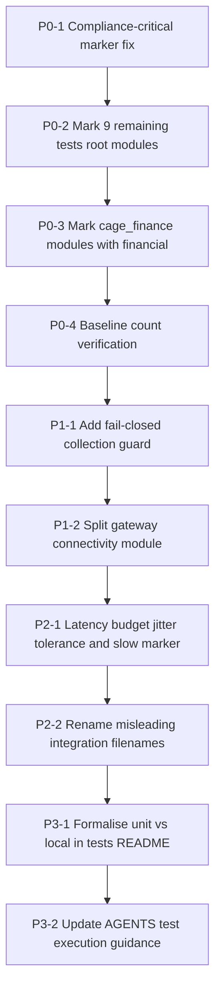

# Pytest Marker Remediation Implementation Plan

> **Status:** Ready for implementation
> **Audience:** Code mode (executable step-by-step)
> **Scope:** `tests/`, `tests/cage_finance/`, `tests/conftest.py`, `pytest.ini`, `tests/README.md`, CI workflow selectors
> **Reference Architecture Note:** CAGE is an illustrative reference architecture.
> Breaking changes to test-selection semantics are acceptable and desirable where they
> improve legibility. No deprecation window is owed to any external consumer of these
> markers. Where a choice exists between preserving an existing marker habit and
> structural clarity, choose structural clarity (AGENTS.md § Architecture & Design Standards).

---

## 1. Problem Statement

The test suite audit identified a **silent coverage gap**: pytest marker selection in CI
is expressed as an *allowlist* (`-m "local or unit"`), but nothing enforces that every
collected test carries one of the selection markers. The result is a fail-**open**
posture at the test-selection layer: a module authored without `pytestmark` is collected
by `pytest tests/` locally (giving the author false confidence) yet is **silently
excluded from every CI gate**.

This is a governance defect, not merely a hygiene defect. CAGE's own architectural
principle is fail-closed: an unclassified action must be rejected, not admitted
(AGENTS.md § FTRA). The same principle must apply to test classification — an
**unclassified test must fail collection**, not vanish from the gate.

### 1.1 Confirmed Current State

| Fact | Evidence |
|---|---|
| CI unit gate selector is an allowlist | [`ci.yml:182`](.github/workflows/ci.yml:182) — `-m "local or unit"` |
| Region gates are additive allowlists | [`ci-integration.yml:96`](.github/workflows/ci-integration.yml:96), [`regional-posture.yml:86`](.github/workflows/regional-posture.yml:86) |
| Integration gate is an allowlist | [`ci.yml:514`](.github/workflows/ci.yml:514) — `-m integration` |
| `--strict-markers` is on (unknown markers error) | [`pytest.ini:7`](pytest.ini:7) |
| No guard exists for *missing* markers | [`tests/conftest.py:392`](tests/conftest.py:392) — `pytest_collection_modifyitems` only adds skips |
| `financial` and `healthcare` markers are registered | [`pytest.ini:22`](pytest.ini:22) |
| `financial` marker has **zero** usages in the suite | `grep 'mark.financial' tests/` → 0 results |
| `test_gateway_connectivity.py` mixes module `unit` with per-test `integration` | [`tests/test_gateway_connectivity.py:27`](tests/test_gateway_connectivity.py:27) vs [`:41`](tests/test_gateway_connectivity.py:41) |

`--strict-markers` protects against *typo'd* markers but is structurally incapable of
detecting *absent* markers. That is the hole this plan closes.

---

## 2. Design Decisions (resolve before coding)

### D1 — Keep both `unit` and `local`, with a defined distinction

The audit offers two options: collapse to one marker, or define the distinction.
**Decision: define the distinction, and make `local` the mandatory selection marker
for offline tests.**

Rationale: collapsing to one marker would require touching ~40 modules and every CI
selector simultaneously, producing a large, low-signal diff that obscures the P0 safety
fix. Defining the distinction is a documentation change plus a mechanical guard, and it
preserves the existing `-m "local or unit"` selector unchanged.

Canonical semantics (to be written into [`tests/README.md`](tests/README.md) in P3 and
[`pytest.ini`](pytest.ini) marker help text in P0):

| Marker | Meaning | Selection role |
|---|---|---|
| `local` | **Runnable with no network and no live service.** In-process only; any I/O is faked (`fakeredis`, `respx`, `TestClient`, `monkeypatch`). This is the *execution-environment* marker. | **Required** on every offline test |
| `unit` | **Scope narrower than one subsystem** — exercises a single module/class in isolation. This is the *test-scope* marker, orthogonal to `local`. | Optional, additive |
| `integration` | Requires a live external service (GKE, OPA, Langfuse, Redis, vLLM). Skipped unless `--run-integration`. | Required for live tests |
| `live_external` | Hits a third-party partner API. Skipped unless `--run-live-external`. | Additive to `integration` |
| `chaos` | Failover/fault-injection. Skipped unless `--run-chaos`. | Selection-eligible |
| `load` | Locust load tests, run on dedicated infra. | Selection-eligible |

**Rule of thumb for authors:** `local` answers *"can this run on a plane?"*;
`unit` answers *"how much of the system does this touch?"*. A module-level
`pytestmark = [pytest.mark.unit, pytest.mark.local]` is the default for offline tests
and is what the majority of already-marked modules use
(e.g. [`tests/test_provider_01_integration.py:25`](tests/test_provider_01_integration.py:25)).

### D2 — Guard is fail-closed and enforced at collection time

The guard lives in `pytest_collection_modifyitems` in
[`tests/conftest.py`](tests/conftest.py) and **raises `pytest.UsageError`** (which aborts
the entire run with a non-zero exit) rather than failing individual tests. Aborting is
correct because an unmarked test is a *configuration* defect, not a behavioural one, and
a `UsageError` cannot be accidentally silenced by `-x`, `--continue-on-collection-errors`,
or a per-test `xfail`.

The guard checks membership in the **selection-marker set**:

```
{"unit", "local", "integration", "load", "chaos", "live_external"}
```

Region markers (`us_fed`, `eu_ecb`, `apac_mas`), domain markers (`financial`,
`healthcare`), and quality markers (`slow`, `regression`, `red_team`,
`layer_isolation`) are **not** members of this set — they are additive facets and must
never by themselves satisfy the guard. A test marked only `financial` would still be
invisible to the primary CI gate, so the guard must reject it.

### D3 — Domain markers are additive, never a substitute

Every test under `tests/cage_finance/` gets `financial` **in addition to**
`unit`/`local`. `financial` exists so a domain-plugin gate can be run in isolation
(`-m financial`); it must never be the only marker. Same rule for `healthcare`.

### D4 — Escape hatch is explicit and narrow

A tiny allowlist of module basenames may be exempted from the guard only when the module
is a non-test helper that pytest nonetheless collects. Prefer fixing collection
(`--ignore`, `collect_ignore`, or renaming) over growing the allowlist. The allowlist
must ship **empty**; if implementation discovers a genuine exemption, it is added with an
inline comment naming the reason.

### D5 — Phase ordering is mandatory

P0 (add markers) **must** land and be verified before P1 (enable the guard). Enabling
the guard first would turn every currently-unmarked module into a hard collection abort,
red-lighting `main` for the duration of the remediation. The phases are separate commits
on the same branch, or separate PRs — but never reordered.

---

## 3. Phase Overview



| Phase | Theme | Risk | Gate impact |
|---|---|---|---|
| **P0** | Restore visibility — mark all unmarked modules | Low (additive only) | Unit gate test count **increases** |
| **P1** | Make the fail-open hole structurally impossible | Medium (guard can abort CI) | New hard failure mode, intentional |
| **P2** | Remove flakiness and naming lies | Low | Unit gate becomes more stable |
| **P3** | Codify semantics so the defect cannot recur | None | Docs only |

---

## 4. Phase P0 — Restore Test Visibility (Critical)

**Branch:** `fix/pytest-marker-visibility`
**Commit type:** `fix(tests)` for P0-1..P0-3

### P0-0 — Preconditions

Before editing anything, capture the baseline so the increase can be proved.

```bash
# Ensure no port-forwards are polluting local state (AGENTS.md § Hermetic Local Test Execution)
ps aux | grep -c "[k]ubectl port-forward"   # expect 0; else: pkill -f "kubectl port-forward"

# Baseline: how many tests the primary CI gate currently sees
uv run pytest tests/ -m "local or unit" --collect-only -q -p no:langsmith -p no:langsmith_plugin \
  --no-cov -o addopts="" | tail -3 | tee /tmp/cage_marker_baseline.txt

# Baseline: total collectable tests (all markers)
uv run pytest tests/ --collect-only -q -p no:langsmith -p no:langsmith_plugin \
  --no-cov -o addopts="" | tail -3 | tee -a /tmp/cage_marker_baseline.txt
```

Record both numbers in the PR description. The delta between them is the current
invisible surface.

To enumerate the unmarked modules mechanically rather than trusting the audit list,
create the throwaway probe below (it is **not** committed):

```bash
cat > /tmp/marker_probe.py <<'EOF'
"""Throwaway collection probe — lists collected tests lacking a selection marker."""
SELECTION = {"unit", "local", "integration", "load", "chaos", "live_external"}

def pytest_collection_modifyitems(session, config, items):
    offenders = sorted({
        str(item.nodeid).split("::")[0]
        for item in items
        if not (SELECTION & set(item.keywords))
    })
    print("\n=== MODULES MISSING A SELECTION MARKER ===")
    for path in offenders:
        print(path)
    print(f"=== {len(offenders)} module(s) ===")
EOF

uv run pytest tests/ --collect-only -q -p no:langsmith -p no:langsmith_plugin \
  --no-cov -o addopts="" -p no:cacheprovider \
  -p "marker_probe" --rootdir . 2>/dev/null || \
uv run pytest tests/ --collect-only -q --no-cov -o addopts="" \
  --config-file pytest.ini -p no:langsmith -p no:langsmith_plugin
```

> If plugin loading by path is awkward, an equivalent and simpler approach is to
> temporarily paste the `pytest_collection_modifyitems` body from the probe into
> [`tests/conftest.py`](tests/conftest.py) in *report-only* mode (print, do not raise),
> run collection, then revert. This is the recommended route because P1 adds that same
> function permanently — the probe becomes the guard.

**The mechanically-produced list is authoritative.** If it disagrees with the audit list
in § P0-2 / § P0-3, fix the superset and note the discrepancy in the PR.

### P0-1 — `test_compliance_bridge_infra_events.py` (highest priority)

This module covers Bearer-token authentication, secret scrubbing in summary text,
cross-jurisdiction rejection, and `evidence_class='INFRA'` persistence
([`tests/test_compliance_bridge_infra_events.py:15-24`](tests/test_compliance_bridge_infra_events.py:15)).
It is currently invisible to every CI gate — an auth-bypass regression would merge green.

It is fully hermetic: it uses `fastapi.testclient.TestClient`, `unittest.mock.AsyncMock`,
and `monkeypatch.setenv`. Therefore `unit` + `local` are both correct.

**Edit:** insert the module-level marker immediately after the import block, before the
first fixture.

```python
# tests/test_compliance_bridge_infra_events.py
from __future__ import annotations

import json
from unittest.mock import AsyncMock, patch

import pytest
from fastapi.testclient import TestClient

from src.compliance_bridge.main import app

# Hermetic: FastAPI TestClient + AsyncMock ClickHouseSink, no live services.
# Covers auth (Bearer), secret scrubbing, 422 rejection, INFRA persistence.
pytestmark = [pytest.mark.unit, pytest.mark.local]

AUTH_TOKEN = "test-internal-token-secret"
```

**Verify immediately — this single file justifies the whole plan:**

```bash
uv run pytest tests/test_compliance_bridge_infra_events.py -m "local or unit" -v \
  --no-cov -p no:langsmith -p no:langsmith_plugin -o addopts=""
```

Expected: all tests in the module run (previously: `no tests ran`).

### P0-2 — Remaining unmarked modules in `tests/`

All nine modules below are hermetic (no live service). Apply the identical pattern:
insert `pytestmark = [pytest.mark.unit, pytest.mark.local]` after the final import
statement and before the first fixture, class, or test.

| File | Insert after line (approx.) | Marker |
|---|---|---|
| [`tests/test_bare_kernel_portability.py`](tests/test_bare_kernel_portability.py) | import block ending ~L30 | `[unit, local]` |
| [`tests/test_null_components.py`](tests/test_null_components.py) | import block ending ~L29 | `[unit, local]` |
| [`tests/test_http_timeout_enforcement.py`](tests/test_http_timeout_enforcement.py) | import block ending ~L26 (`respx`) | `[unit, local]` |
| [`tests/test_rollback_exception_handling.py`](tests/test_rollback_exception_handling.py) | import block ending ~L28 | `[unit, local]` |
| [`tests/test_low_severity_fixes.py`](tests/test_low_severity_fixes.py) | import block ending ~L33 | `[unit, local]` |
| [`tests/test_evidence_layer_placement.py`](tests/test_evidence_layer_placement.py) | import block ending ~L27 | `[unit, local, layer_isolation]` |
| [`tests/test_telemetry_attributes.py`](tests/test_telemetry_attributes.py) | before `class TestTelemetryAttributesGoldenTable` ~L34 | `[unit, local]` |
| [`tests/test_actuator_01_assertion.py`](tests/test_actuator_01_assertion.py) | import block ending ~L26 | `[unit, local]` |
| [`tests/test_actuator_01_response_classifier.py`](tests/test_actuator_01_response_classifier.py) | import block ending ~L25 | `[unit, local]` |

Notes for specific files:

- **`test_evidence_layer_placement.py`** asserts Layer-3 evidence modules live at their
  canonical kernel paths (`src.gateway.governance.evidence.*`). It is a structural
  isolation assertion, so add `layer_isolation` as a third, additive marker to align it
  with [`tests/test_pr_b_layer_isolation.py`](tests/test_pr_b_layer_isolation.py) and make
  it selectable by a future Gate-G3-adjacent job.
- **`test_telemetry_attributes.py`** has no module-level `import pytest` visible in the
  header scan. Confirm `import pytest` exists; if it does not, add it to the import
  block before adding `pytestmark`.
- **`test_http_timeout_enforcement.py`** uses `respx`, i.e. mocked transport — it is
  `local`, not `integration`, despite exercising HTTP client code paths.
- **`test_null_components.py`** imports `pandas`; that is a library import, not a service
  dependency, so `local` still holds.

**Insertion template (apply verbatim, adjusting only the comment):**

```python
import pytest

# <one-line justification: what makes this hermetic>
pytestmark = [pytest.mark.unit, pytest.mark.local]
```

Place `pytestmark` **after all `from src...` imports** so that a module-level import
error surfaces as an import error rather than being masked by marker evaluation order.
Do not insert it between `from __future__ import annotations` and the rest of the
imports — that is a syntax-legal but confusing position.

### P0-3 — `tests/cage_finance/` modules (add `financial`)

Per D3, every finance-domain test gets `financial` **in addition to** the selection
markers. This activates the currently-unused `financial` marker declared at
[`pytest.ini:23`](pytest.ini:23) and makes a per-domain gate possible.

> **Count reconciliation.** The audit reports *6* unmarked finance modules; a direct
> `grep -L pytestmark tests/cage_finance/*.py` sweep during planning found **9** with no
> module marker at all (the four `test_bounding_contracts_*` files are a family, which is
> likely where the audit collapsed the count), plus **4** more carrying only per-test or
> per-class `@pytest.mark.local` decorators. The table below therefore covers **13**
> files — a superset of the audit list. Per P0-0, the mechanical probe output is
> authoritative; remediate whatever it reports and note any further divergence in the PR.
> The same caution applies to the headline "16 unmarked modules": the true figure is
> whatever the probe prints, and it is likely higher.

**P0-3a — Unmarked modules (add full marker set):**

| File | Marker |
|---|---|
| [`tests/cage_finance/test_bounding_tier.py`](tests/cage_finance/test_bounding_tier.py) | `[unit, local, financial]` |
| [`tests/cage_finance/test_bounding_models.py`](tests/cage_finance/test_bounding_models.py) | `[unit, local, financial]` |
| [`tests/cage_finance/test_bounding_registry.py`](tests/cage_finance/test_bounding_registry.py) | `[unit, local, financial]` |
| [`tests/cage_finance/test_bounding_providers.py`](tests/cage_finance/test_bounding_providers.py) | `[unit, local, financial]` |
| [`tests/cage_finance/test_bounding_contracts_b1_b2_b6.py`](tests/cage_finance/test_bounding_contracts_b1_b2_b6.py) | `[unit, local, financial]` |
| [`tests/cage_finance/test_bounding_contracts_b3_b5_b8.py`](tests/cage_finance/test_bounding_contracts_b3_b5_b8.py) | `[unit, local, financial]` |
| [`tests/cage_finance/test_bounding_contracts_b4_b9.py`](tests/cage_finance/test_bounding_contracts_b4_b9.py) | `[unit, local, financial]` |
| [`tests/cage_finance/test_bounding_contracts_b7_b10.py`](tests/cage_finance/test_bounding_contracts_b7_b10.py) | `[unit, local, financial]` |
| [`tests/cage_finance/test_invariants.py`](tests/cage_finance/test_invariants.py) | `[unit, local, financial]` |
| [`tests/cage_finance/test_execute_trade_bounded_classification.py`](tests/cage_finance/test_execute_trade_bounded_classification.py) | `[unit, local, financial]` — has per-class `@pytest.mark.local` only |
| [`tests/cage_finance/test_cbf_reconciliation.py`](tests/cage_finance/test_cbf_reconciliation.py) | `[unit, local, financial]` — has per-test `@pytest.mark.local` only |
| [`tests/cage_finance/test_cbf_amount_validation.py`](tests/cage_finance/test_cbf_amount_validation.py) | `[unit, local, financial]` — has per-test `@pytest.mark.local` only |
| [`tests/cage_finance/test_market.py`](tests/cage_finance/test_market.py) | `[unit, local, financial]` — has per-class `@pytest.mark.local` only |

The last four already satisfy the P1 guard via per-test markers, but adding the module
marker is still correct: it normalises the file to the house pattern, adds `financial`,
and removes the risk that a newly-added test in those files is written without a
decorator. Per-test `@pytest.mark.local` decorators may be left in place (harmless
duplication) or removed for cleanliness — **prefer removing them** in line with the
clean-architecture principle, but only if the removal diff stays mechanical.

**P0-3b — Already-marked modules (add `financial` only):**

| File | Current | Change to |
|---|---|---|
| [`tests/cage_finance/test_consensus_config_failclosed.py:28`](tests/cage_finance/test_consensus_config_failclosed.py:28) | `[local, unit]` | `[unit, local, financial]` |
| [`tests/cage_finance/test_reconciliation_worker.py:33`](tests/cage_finance/test_reconciliation_worker.py:33) | `local` | `[unit, local, financial]` |
| [`tests/cage_finance/test_consensus_gate.py:28`](tests/cage_finance/test_consensus_gate.py:28) | `unit` | `[unit, local, financial]` |
| [`tests/cage_finance/test_fiscal_limit_guard.py:43`](tests/cage_finance/test_fiscal_limit_guard.py:43) | `[unit, local]` | `[unit, local, financial]` |

> `test_consensus_gate.py` currently places `pytestmark` *before* a subsequent
> `from unittest.mock import ...` line ([`:29`](tests/cage_finance/test_consensus_gate.py:29)).
> While editing, move the stray import up into the import block so the file follows the
> house layout: imports, then `pytestmark`, then code.

**P0-3c — Optional consolidation (preferred, evaluate during implementation):**

Rather than editing 17 finance files individually for the `financial` facet, add a
package-level conftest that stamps the domain marker onto everything beneath it:

```python
# tests/cage_finance/conftest.py  (new file — Apache 2.0 header required is NOT needed:
# license header policy in AGENTS.md applies to src/, but adding it is harmless and
# consistent with tests/conftest.py, which carries one — so include it.)
"""Package-scoped configuration for the finance domain-plugin test suite."""

import pytest


def pytest_collection_modifyitems(
    config: pytest.Config, items: list[pytest.Item]
) -> None:
    """Stamp every test in this package with the `financial` domain marker.

    Domain membership is a property of location, not of the individual test, so it is
    applied structurally here rather than repeated in 17 modules.  This marker is
    *additive*: it never satisfies the selection guard in tests/conftest.py, so each
    module must still declare `unit`/`local` explicitly.
    """
    for item in items:
        item.add_marker(pytest.mark.financial)
```

If this route is taken, P0-3a still applies for `unit`/`local` (those must remain
explicit per D3), and P0-3b becomes a no-op. **Decide once and apply consistently** —
do not mix per-file `financial` markers with the conftest stamp.

> **Guard-ordering caveat:** hooks in a nested `conftest.py` run *after* the rootdir
> `tests/conftest.py` hook of the same name by default. Because the `financial` stamp is
> additive and never satisfies the guard, this ordering is harmless. Do not rely on
> nested-conftest stamping to satisfy the P1 guard for any marker.

### P0-4 — Verification for P0

```bash
# 1. The gate now sees strictly more tests than baseline
uv run pytest tests/ -m "local or unit" --collect-only -q --no-cov \
  -p no:langsmith -p no:langsmith_plugin -o addopts="" | tail -3

# 2. The financial marker is now populated (expect >0, previously 0)
uv run pytest tests/ -m financial --collect-only -q --no-cov \
  -p no:langsmith -p no:langsmith_plugin -o addopts="" | tail -3

# 3. The finance suite still passes
uv run pytest tests/cage_finance/ -v --no-cov -p no:langsmith -p no:langsmith_plugin

# 4. The newly-visible modules pass under the gate selector
uv run pytest tests/ -m "local or unit" -n auto --dist loadscope --no-cov \
  -p no:langsmith -p no:langsmith_plugin --tb=short
```

**Acceptance for P0:**
- Collected count under `-m "local or unit"` is **greater** than the recorded baseline.
- `-m financial` collects a non-zero count.
- The full fast suite is green. If a newly-visible module *fails*, that is a genuine
  latent regression the marker gap was hiding — **fix the test or the source, never
  re-hide it by removing the marker.**

**Commit:**
```
fix(tests): add selection markers to 16 unmarked test modules

Sixteen modules carried no pytest marker and were therefore collected
locally but silently excluded from every CI gate, including
test_compliance_bridge_infra_events.py which covers Bearer auth and
secret scrubbing on POST /v1/infra/events.

Adds `unit`/`local` selection markers to all affected modules and the
additive `financial` domain marker across tests/cage_finance/, which
activates a previously unused marker declared in pytest.ini.
```

---

## 5. Phase P1 — Make the Gap Structurally Impossible

**Branch:** same branch, separate commit — or `feat/pytest-marker-guard` if split.
**Commit type:** `feat(tests)` for P1-1, `refactor(tests)` for P1-2.
**Precondition:** P0 merged/verified green (D5).

### P1-1 — Fail-closed collection guard in `tests/conftest.py`

The guard extends the existing `pytest_collection_modifyitems` at
[`tests/conftest.py:392`](tests/conftest.py:392). Keep the existing skip logic intact and
run the guard **first**, before the skip loop, so an unmarked item cannot be masked by a
subsequently-applied skip.

**Replace** the current function with the following:

```python
# ── Selection-marker contract ─────────────────────────────────────────────────
# Every collected test MUST carry at least one of these markers.  CI selects tests
# by marker expression (`-m "local or unit"`, `-m integration`, ...), so a test
# without one of these is collected locally but silently excluded from every gate.
#
# This mirrors CAGE's fail-closed posture (AGENTS.md § FTRA): an unclassified
# *action* is rejected rather than admitted, and likewise an unclassified *test*
# aborts collection rather than disappearing from the gate.
#
# Additive facet markers (`slow`, `regression`, `red_team`, `layer_isolation`,
# `financial`, `healthcare`, `us_fed`, `eu_ecb`, `apac_mas`) deliberately do NOT
# appear here: they qualify a test, they do not make it selectable by a CI gate.
SELECTION_MARKERS: frozenset[str] = frozenset(
    {"unit", "local", "integration", "load", "chaos", "live_external"}
)

# Modules exempted from the selection-marker contract.  Ships EMPTY by design.
# Prefer excluding a non-test helper from collection over adding it here; every
# entry must carry an inline comment naming the reason it cannot be marked.
MARKER_GUARD_EXEMPT_MODULES: frozenset[str] = frozenset()


def _assert_selection_markers(items: list[pytest.Item]) -> None:
    """Abort the run if any collected test lacks a selection marker (fail-closed)."""
    offenders: dict[str, list[str]] = {}
    for item in items:
        module_path = str(item.nodeid).split("::", 1)[0]
        if module_path in MARKER_GUARD_EXEMPT_MODULES:
            continue
        if SELECTION_MARKERS & set(item.keywords):
            continue
        offenders.setdefault(module_path, []).append(item.name)

    if not offenders:
        return

    total = sum(len(names) for names in offenders.values())
    lines = [
        "",
        "=" * 78,
        "PYTEST MARKER CONTRACT VIOLATION (fail-closed)",
        "=" * 78,
        f"{total} test(s) across {len(offenders)} module(s) carry no selection marker.",
        "",
        "CI selects tests by marker expression, so these tests would be collected",
        "locally but silently EXCLUDED from every CI gate.",
        "",
        "Offending modules:",
    ]
    for module_path in sorted(offenders):
        names = offenders[module_path]
        preview = ", ".join(names[:3]) + (" ..." if len(names) > 3 else "")
        lines.append(f"  - {module_path}  ({len(names)} test(s): {preview})")
    lines += [
        "",
        "Fix: add a module-level marker after the import block, e.g.",
        "",
        "    pytestmark = [pytest.mark.unit, pytest.mark.local]",
        "",
        f"Valid selection markers: {', '.join(sorted(SELECTION_MARKERS))}",
        "See tests/README.md § Pytest Markers for the unit-vs-local distinction.",
        "=" * 78,
    ]
    raise pytest.UsageError("\n".join(lines))


def pytest_collection_modifyitems(
    config: pytest.Config, items: list[pytest.Item]
) -> None:
    """Enforce the selection-marker contract, then auto-skip opt-in test classes."""
    # Fail-closed guard runs FIRST: an unmarked item must not be maskable by a
    # skip marker applied later in this same hook.
    _assert_selection_markers(items)

    run_integration = config.getoption("--run-integration")
    run_live_external = config.getoption("--run-live-external")
    run_chaos = config.getoption("--run-chaos")

    skip_integration = pytest.mark.skip(
        reason=(
            "Integration test — requires live external services. "
            "Pass --run-integration to enable."
        )
    )
    skip_live_external = pytest.mark.skip(
        reason=(
            "Live external test — hits partner APIs. "
            "Pass --run-live-external to enable."
        )
    )
    skip_chaos = pytest.mark.skip(
        reason=("Chaos test — Redis failover scenarios. Pass --run-chaos to enable.")
    )

    for item in items:
        if "integration" in item.keywords and not run_integration:
            item.add_marker(skip_integration)
        if "live_external" in item.keywords and not run_live_external:
            item.add_marker(skip_live_external)
        if "chaos" in item.keywords and not run_chaos:
            item.add_marker(skip_chaos)
```

**Critical implementation notes:**

1. **`items` is already marker-filtered.** When pytest is invoked with `-m "local or
   unit"`, deselection happens *before* this hook in most pytest versions, so the guard
   only ever sees the selected subset — which by construction all carry a selection
   marker. The guard therefore does its real work on **unfiltered runs**
   (`uv run pytest tests/`, `--collect-only` with no `-m`). This is acceptable and is in
   fact the desired ergonomics: the developer running the whole suite locally gets the
   error, and CI gets it from the dedicated job added below. **Do not** attempt to defeat
   deselection by hooking `pytest_collection_finish` on `session.items` — it has the same
   property. Instead, add the explicit unfiltered CI job in P1-1c.

2. **`pytest.UsageError` vs `pytest.exit`.** `UsageError` produces exit code 4
   (usage error) and prints the message once. Do not use `sys.exit` or `assert`.

3. **xdist compatibility.** Under `-n auto`, this hook runs in each worker *and* the
   controller. The message may therefore print more than once. That is cosmetic and
   acceptable; do not add cross-process deduplication complexity to suppress it.

4. **Do not add `regression` to `SELECTION_MARKERS`.** No CI job selects `-m regression`
   today; adding it would let a test satisfy the guard while remaining ungated. The one
   `regression`-only test discovered during this work is handled in P1-2.

### P1-1b — Sync the marker help text in `pytest.ini`

Make the contract discoverable at the point of marker declaration.

```ini
markers =
    # ── Selection markers — every test MUST carry at least one ────────────────
    local: runs with no network and no live service (in-process/faked I/O only)
    unit: narrow scope — a single module/class in isolation (additive to `local`)
    integration: requires live services (skipped unless --run-integration)
    live_external: hits external partner APIs (use --run-live-external to enable)
    chaos: chaos/failover scenarios (use --run-chaos to enable)
    load: load tests (use locust)
    # ── Facet markers — additive only, never satisfy the selection contract ───
    regression: regression tests
    slow: slow tests (>10s)
    red_team: adversarial/red-team tests
    eu_ecb: EU_ECB region-specific tests
    us_fed: US_FED region-specific tests
    apac_mas: APAC_MAS region-specific tests
    layer_isolation: layer isolation tests (PR B, gate G3)
    healthcare: healthcare domain plugin tests
    financial: financial domain plugin tests
```

Preserve every existing marker name exactly — `--strict-markers` is enabled at
[`pytest.ini:7`](pytest.ini:7), so dropping or renaming a marker breaks collection
immediately.

### P1-1c — CI job that actually exercises the guard

Because the guard is a no-op under a filtered `-m` run (note 1 above), add a fast,
unfiltered **collection-only** job to [`.github/workflows/ci.yml`](.github/workflows/ci.yml).
It costs seconds and is the job that turns the guard into a real gate.

```yaml
  marker-contract-check:
    name: "Pytest Marker Contract"
    runs-on: ubuntu-latest
    steps:
      - uses: actions/checkout@3d3c42e5aac5ba805825da76410c181273ba90b1 # v7.0.1
        with:
          persist-credentials: false
      - name: Install uv
        uses: astral-sh/setup-uv@20cfd1bf945f4377ade1205e4dbc17946fc9a30d # v10.0.1
        with:
          enable-cache: true
      - name: Set up Python
        uses: actions/setup-python@5fda3b95a4ea91299a34e894583c3862153e4b97 # v7.0.0
        with:
          python-version-file: "pyproject.toml"
      - name: Install Dependencies
        run: uv sync --all-groups --all-extras
      - name: Verify every collected test carries a selection marker
        env:
          CAGE_DEPLOYMENT_REGION: "US_FED"
          CAGE_ENV: "test"
          OPENAI_API_KEY: "sk-dummy"
          REDIS_URL: "redis://localhost:6379/0"
          LANGFUSE_HOST: "http://localhost:3000"
          LANGFUSE_PUBLIC_KEY: "pk-dummy"
          LANGFUSE_SECRET_KEY: "sk-dummy"
        # No -m filter: the guard must see EVERY collected item.
        # -p no:xdist / -n0 keeps the failure message single-copy and readable.
        run: |
          uv run pytest tests/ --collect-only -q --no-cov -n0 \
            -p no:langsmith -p no:langsmith_plugin
```

Pin the action SHAs to whatever the neighbouring jobs in `ci.yml` currently use — copy
them from the `pytest-logic` job rather than from this document, in case they have been
bumped.

> **Failure-mode note (fail-closed by design):** this job fails the build when a new
> unmarked test is added. That is the entire point. Per AGENTS.md § Debugging Standards,
> *never* suggest disabling or `continue-on-error`-ing this check as a fix.

### P1-2 — Resolve the `test_gateway_connectivity.py` marker conflict

**The defect:** [`tests/test_gateway_connectivity.py:27`](tests/test_gateway_connectivity.py:27)
sets `pytestmark = pytest.mark.unit` at module scope, while four tests carry
`@pytest.mark.integration` ([`:41`](tests/test_gateway_connectivity.py:41),
[`:59`](tests/test_gateway_connectivity.py:59),
[`:154`](tests/test_gateway_connectivity.py:154),
[`:194`](tests/test_gateway_connectivity.py:194)). Module markers apply to *all* tests in
the module, so those four are `unit` **and** `integration` simultaneously. They are
therefore **selected** by the primary CI gate `-m "local or unit"` — and only avoid
running because the conftest skip logic catches `integration` in `item.keywords`. The
unit gate is thus reporting live-service tests as "skipped" rather than not selecting
them at all, which is semantically wrong and fragile: any change to the skip logic would
attempt real network calls inside the offline gate.

There is a second, subtler problem: `test_factual_regression`
([`:81`](tests/test_gateway_connectivity.py:81)) carries only `@pytest.mark.regression`
plus the inherited module `unit`. It is fully mocked (`patch("requests.post")`) and is
the *only* genuinely offline test in the file.

**Chosen fix — split the module (Option A, preferred).** This is cleaner than
per-test markers because it makes the offline/live boundary a file boundary, which is
legible at `ls` time and immune to future module-marker drift.

**Step 1 — create `tests/test_gateway_connectivity_live.py`** containing the four
live tests, moved verbatim:

- `test_mcp_connection` (async MCP SSE connect)
- `test_chat_proxy` (HTTP POST to `/inference/v1/chat/completions`)
- `test_tls_plaintext_rejected` (POAM-011 / SC-8)
- `test_tls_minimum_version` (POAM-011 / SC-8)

Header for the new file:

```python
# Copyright 2026 Google LLC
# ... (full Apache 2.0 header — copy verbatim from the source module)

"""Live gateway connectivity checks (POAM-011 / SC-8).

Requires a reachable gateway; skipped unless --run-integration is passed.
TLS assertions additionally require GATEWAY_TLS_BASE_URL or a non-localhost
GATEWAY_HTTPS_URL — localhost port-forwards terminate TLS at the GKE Ingress
and expose plain HTTP only.
"""

import asyncio
import logging
import os
import socket
import ssl
from urllib.parse import urlparse

import pytest
import requests

from src.gateway.infrastructure.mcp_client import GatewayMCPClient

pytestmark = pytest.mark.integration
```

With the module marker set to `integration`, **remove the now-redundant per-test
`@pytest.mark.integration` decorators** in the new file. Keep the two
`@pytest.mark.skipif(not _TLS_TESTS_RUNNABLE, ...)` guards and the
`_GATEWAY_URL_SET` / `_GATEWAY_HTTPS_URL` / `_TLS_TESTS_RUNNABLE` computation block —
move that block across verbatim ([`:120-143`](tests/test_gateway_connectivity.py:120)).

**Step 2 — reduce `tests/test_gateway_connectivity.py`** to the mocked regression test
only:

```python
import logging
import os
from unittest.mock import MagicMock, patch

import pytest
import requests

# Fully mocked — no gateway required.  Live connectivity and TLS checks live in
# test_gateway_connectivity_live.py (marked `integration`).
pytestmark = [pytest.mark.unit, pytest.mark.local, pytest.mark.regression]

logger = logging.getLogger("TestGateway")

GATEWAY_URL = os.getenv("GATEWAY_URL", "http://localhost:8080")
```

Delete from the reduced module: the `sys.path.append(os.getcwd())` hack
([`:29-30`](tests/test_gateway_connectivity.py:29) — `pythonpath = .` in
[`pytest.ini:3`](pytest.ini:3) already handles this), the now-unused
`GatewayMCPClient` import, the `MCP_SSE_URL` constant, the `asyncio` import, and the
`if __name__ == "__main__":` block at [`:242-244`](tests/test_gateway_connectivity.py:242)
(it invokes live tests directly and has no place in a mocked module).

**Step 3 — update the file inventory** in
[`tests/README.md:211`](tests/README.md:211), which currently lists
`test_gateway_connectivity.py` as `integration`:

| File | Markers | Description |
|---|---|---|
| `test_gateway_connectivity.py` | `unit` / `local` / `regression` | Mocked golden-question regression check — no gateway required |
| `test_gateway_connectivity_live.py` | `integration` | Live gateway MCP/chat-proxy reachability and TLS 1.2+ enforcement (POAM-011 / SC-8) |

**Step 4 — verify the split:**

```bash
# The offline module must collect exactly 1 test and pass with no network
uv run pytest tests/test_gateway_connectivity.py -m "local or unit" -v \
  --no-cov -p no:langsmith -p no:langsmith_plugin -o addopts=""

# The live module must collect 0 tests under the offline gate (NOT "skipped" — deselected)
uv run pytest tests/test_gateway_connectivity_live.py -m "local or unit" \
  --collect-only -q --no-cov -o addopts=""

# The live module must collect 4 tests under the integration gate
uv run pytest tests/test_gateway_connectivity_live.py -m integration \
  --collect-only -q --no-cov -o addopts=""
```

The second command must report **no tests collected** (deselected), not "4 skipped".
That difference is the whole point of the split.

**Acceptance for P1:**
- Guard aborts with the formatted message when a marker is deliberately removed
  (see § 8 negative test).
- `marker-contract-check` job passes on the current tree.
- Live gateway tests are deselected — not merely skipped — by `-m "local or unit"`.
- POAM-011 / SC-8 TLS coverage is preserved intact under `-m integration`.

---

## 6. Phase P2 — Stability and Naming Truthfulness

**Branch:** `fix/pytest-latency-jitter` and `refactor/test-adapter-naming`, or the same
branch with separate commits.

### P2-1 — `test_governance_pipeline_latency.py`: `slow` marker + jitter tolerance

**The defect:** this module asserts hard wall-clock budgets
([`:57-62`](tests/test_governance_pipeline_latency.py:57)) while running inside the
primary CI gate under `-n auto`, where N worker processes contend for the same cores.
A 30 ms OPA budget on a shared GitHub-hosted runner is a flake generator, and a flaky
gate erodes trust in the very gates P0/P1 just repaired.

**Step 1 — add the `slow` facet marker** at
[`:51`](tests/test_governance_pipeline_latency.py:51):

```python
# Wall-clock budget assertions.  Marked `slow` so it can be excluded with
# `-m "not slow"` during fast local iteration; still runs in the default CI gate.
pytestmark = [pytest.mark.unit, pytest.mark.local, pytest.mark.slow]
```

`slow` is a facet, not a selection marker (D2), so the module remains selected by
`-m "local or unit"` — coverage is not reduced. It merely becomes excludable.

**Step 2 — make budgets tolerant of parallel-execution jitter.** Introduce a single
multiplier applied to every budget, defaulting to 1.0 and raised automatically when
xdist is active or when running in CI:

```python
import os


# ---------------------------------------------------------------------------
# Jitter tolerance
#
# Under `-n auto` (pytest-xdist) N worker processes contend for the same cores,
# and GitHub-hosted runners are noisy neighbours.  Wall-clock budgets measured
# on an idle machine are not meaningful in either environment, so scale them.
# Override explicitly with CAGE_LATENCY_BUDGET_MULTIPLIER for bare-metal runs.
# ---------------------------------------------------------------------------
def _budget_multiplier() -> float:
    explicit = os.environ.get("CAGE_LATENCY_BUDGET_MULTIPLIER")
    if explicit:
        return float(explicit)
    multiplier = 1.0
    if os.environ.get("PYTEST_XDIST_WORKER"):  # set by xdist in each worker
        multiplier *= 3.0
    if os.environ.get("CI"):  # GitHub Actions sets CI=true
        multiplier *= 2.0
    return multiplier


_M: float = _budget_multiplier()

TIER1_NEMO_INPUT_BUDGET_MS: float = 50.0 * _M
TIER2_OPA_BUDGET_MS: float = 30.0 * _M
TIER3_SAFETY_BUDGET_MS: float = 20.0 * _M
TIER4_AGENT_BUDGET_MS: float = 2000.0 * _M
TIER5_NEMO_OUTPUT_BUDGET_MS: float = 50.0 * _M
PIPELINE_TOTAL_BUDGET_MS: float = 2200.0 * _M
```

Because every assertion already reads these module constants
([`:57-62`](tests/test_governance_pipeline_latency.py:57)), **no test body needs to
change** — this is a single-block edit.

**Step 3 — prefer median over max.** If any assertion compares a single sample or a
`max()` against a budget, switch it to `statistics.median(samples)` — `statistics` is
already imported at [`:36`](tests/test_governance_pipeline_latency.py:36). A median over
≥5 samples is robust to the single-sample stalls that dominate xdist noise. Retain the
raw sample list in the assertion message for diagnosability. Do **not** lower the
underlying budget numbers themselves; the multiplier is the only tuning knob.

**Verify:**

```bash
# Serial, no CI env: multiplier == 1.0, strictest budgets
uv run pytest tests/test_governance_pipeline_latency.py -v -n0 --no-cov \
  -p no:langsmith -p no:langsmith_plugin -o addopts=""

# Parallel: multiplier == 3.0, must be stable across repeats
for i in 1 2 3; do
  uv run pytest tests/test_governance_pipeline_latency.py -n auto --dist loadscope \
    --no-cov -q -p no:langsmith -p no:langsmith_plugin
done

# `-m "not slow"` now excludes it during fast iteration
uv run pytest tests/ -m "(local or unit) and not slow" --collect-only -q --no-cov -o addopts=""

# It is still selected by the CI gate expression
uv run pytest tests/test_governance_pipeline_latency.py -m "local or unit" \
  --collect-only -q --no-cov -o addopts=""   # must be non-zero
```

> **CI-impact note:** [`ci-integration.yml:73`](.github/workflows/ci-integration.yml:73)
> selects `-m "integration or slow"`. Adding `slow` to this module means it will now
> **also** be collected by the integration workflow. It is hermetic, so it will pass —
> but confirm this during implementation and, if the duplication is unwanted, tighten
> that selector to `-m "integration or (slow and not local)"`. Flag the choice in the PR.

### P2-2 — Rename misleading `*_integration.py` adapter tests

**The defect:** three files named `*_integration.py` are fully hermetic `respx`-mocked
adapter tests marked `[unit, local]`. The filename implies live-service coverage that
does not exist, which is exactly the kind of ambiguity that lets a real integration gap
hide behind a reassuring name.

| Current | Rename to | Evidence |
|---|---|---|
| [`tests/test_provider_03_integration.py`](tests/test_provider_03_integration.py) | `tests/test_provider_03_adapter.py` | `respx` at [`:23`](tests/test_provider_03_integration.py:23); `[unit, local]` at [`:92`](tests/test_provider_03_integration.py:92) |
| [`tests/test_provider_01_integration.py`](tests/test_provider_01_integration.py) | `tests/test_provider_01_adapter.py` | `respx` at [`:21`](tests/test_provider_01_integration.py:21); `[unit, local]` at [`:25`](tests/test_provider_01_integration.py:25) |
| [`tests/test_provider_02_integration.py`](tests/test_provider_02_integration.py) | `tests/test_provider_02_adapter.py` | `[unit, local]` at [`:41`](tests/test_provider_02_integration.py:41) |

Genuinely-live provider tests keep their honest names —
[`tests/test_provider_01_live.py`](tests/test_provider_01_live.py) is correctly marked
`[eu_ecb, integration, live_external]` at [`:36`](tests/test_provider_01_live.py:36) and
must **not** be renamed.

**Procedure:**

```bash
git mv tests/test_provider_01_integration.py tests/test_provider_01_adapter.py
git mv tests/test_provider_02_integration.py tests/test_provider_02_adapter.py
git mv tests/test_provider_03_integration.py tests/test_provider_03_adapter.py
```

Then, in `test_provider_03_adapter.py` only, move the trailing `pytestmark` at
[`:92`](tests/test_provider_03_integration.py:92) up to directly beneath the import
block. A `pytestmark` at the bottom of a file still applies (it is evaluated at module
import, before collection), but it is easy to miss when reviewing and invites the exact
"I didn't see a marker" error this plan exists to prevent.

**Check for stale references before and after:**

```bash
grep -rn "provider_0[123]_integration" \
  --include='*.py' --include='*.yml' --include='*.yaml' --include='*.md' --include='*.toml' \
  --include='*.cfg' --include='*.ini' --include='Makefile' . | grep -v '\.git/'
```

Update every hit — likely candidates are [`tests/README.md`](tests/README.md),
[`Makefile`](Makefile), `.github/workflows/*.yml`, and `.coveragerc` exclusion lists.
Re-run the grep afterwards and expect zero results.

**Verify:**

```bash
uv run pytest tests/test_provider_01_adapter.py tests/test_provider_02_adapter.py \
  tests/test_provider_03_adapter.py -v --no-cov -p no:langsmith -p no:langsmith_plugin

# Conformance suite must still discover all registered providers
uv run pytest tests/test_normative_provider_conformance.py -v --no-cov \
  -p no:langsmith -p no:langsmith_plugin
```

The parameterized Universal Protocol Conformance Suite
([`tests/test_normative_provider_conformance.py`](tests/test_normative_provider_conformance.py))
registers adapters by import path, not by test-file name, so the rename is inert for it —
but AGENTS.md § External Vendor Adapter Standards makes it a required check.

**Acceptance for P2:**
- Latency module passes three consecutive `-n auto` runs.
- Latency module is excluded by `-m "not slow"` and included by `-m "local or unit"`.
- Zero grep hits for `provider_0[123]_integration` outside `.git/`.
- Conformance suite green.

---

## 7. Phase P3 — Codify the Semantics

**Branch:** `docs/pytest-marker-semantics`
**Commit type:** `docs(tests)`

### P3-1 — Rewrite the marker section of `tests/README.md`

The current table at [`tests/README.md:70-82`](tests/README.md:70) is actively
misleading and is a root cause of the drift:

- It states `unit` is *"Alias for `local`"* and `local` is *"Same as `unit`. Legacy name
  kept for backwards compatibility."* — this told authors the two markers were
  interchangeable, which is why ~40 modules pick one arbitrarily.
- It documents a `causal` marker that is **not** declared in
  [`pytest.ini`](pytest.ini). With `--strict-markers` enabled, any author following this
  documentation gets a collection error.
- It omits `live_external`, `chaos`, `layer_isolation`, `financial`, `healthcare`, and
  the three region markers entirely.

**Replace that section with:**

~~~markdown
## Pytest Markers

Markers fall into two classes. **Every test must carry at least one _selection_
marker** — this is enforced at collection time by a fail-closed guard in
`tests/conftest.py`, which aborts the run if any collected test is unmarked.

### Selection markers (mandatory — pick at least one)

| Marker | Meaning | Enabled by |
|---|---|---|
| `local` | Runs with **no network and no live service**. All I/O is faked (`fakeredis`, `respx`, `TestClient`, `monkeypatch`). | Default |
| `unit` | Scope is a single module/class in isolation. Additive to `local`. | Default |
| `integration` | Requires a live service (GKE, OPA, Langfuse, Redis, vLLM). | `--run-integration` |
| `live_external` | Hits a third-party partner API. Always combined with `integration`. | `--run-live-external` |
| `chaos` | Fault injection / failover (e.g. Redis primary loss). | `--run-chaos` |
| `load` | Locust load tests on dedicated infrastructure. | Dedicated CI job |

**`local` vs `unit` — the distinction:**

- `local` answers **"can this run on a plane?"** — it describes the *execution
  environment*. It is the marker CI uses to build the offline gate.
- `unit` answers **"how much of the system does this touch?"** — it describes *test
  scope*. A test can be `local` but not `unit` (e.g. an in-process multi-subsystem
  wiring test with everything faked).
- The two are **orthogonal, not synonyms.** The default for a new hermetic test is
  both: `pytestmark = [pytest.mark.unit, pytest.mark.local]`
- A test may never be both `local` and `integration`. If a module contains both kinds,
  split it into two modules (see `test_gateway_connectivity.py` /
  `test_gateway_connectivity_live.py` for the reference pattern).

### Facet markers (additive — never sufficient on their own)

| Marker | Meaning |
|---|---|
| `slow` | Takes >10 s, or asserts wall-clock budgets. Exclude with `-m "not slow"`. |
| `regression` | Golden-question behavioural check after a model or policy update. |
| `red_team` | Adversarial / prompt-injection test. |
| `layer_isolation` | Asserts the three-layer import boundary (Gate G3). |
| `financial` | Finance domain plugin (`tests/cage_finance/`). |
| `healthcare` | Healthcare domain plugin (`tests/cage_healthcare/`). |
| `us_fed`, `eu_ecb`, `apac_mas` | Regional compliance posture. |

A facet marker **does not** make a test selectable by any CI gate. A test marked only
`financial` or only `regression` will be rejected by the collection guard.

### Adding a new test module

Place the module marker immediately after the import block:

    import pytest

    from src.gateway.governance.something import Something

    # Hermetic: fakeredis + monkeypatch, no live services.
    pytestmark = [pytest.mark.unit, pytest.mark.local]

If the guard rejects your module, it will print the offending node IDs and the list of
valid selection markers. Do not work around it by excluding the file from collection.
~~~

Also fix the stale row for `test_gateway_connectivity.py` in the file inventory at
[`tests/README.md:211`](tests/README.md:211) per P1-2 Step 3, and add a row for the
compliance-critical module remediated in P0-1:

| File | Markers | Description |
|---|---|---|
| `test_compliance_bridge_infra_events.py` | `unit` / `local` | `POST /v1/infra/events` — Bearer auth, secret scrubbing, 422 on unregistered event type or cross-jurisdiction mismatch, `evidence_class='INFRA'` persistence |

### P3-2 — Cross-reference from `AGENTS.md`

Add a short subsection under **Test Execution** in [`AGENTS.md`](AGENTS.md) so agents
learn the contract without reading `tests/README.md`:

~~~markdown
### Pytest Marker Contract (fail-closed)

Every collected test must carry at least one **selection marker**:
`local`, `unit`, `integration`, `live_external`, `chaos`, or `load`.
A collection-time guard in `tests/conftest.py` raises `pytest.UsageError` and
aborts the run if any test is unmarked — an unmarked test is collected locally
but silently excluded from every CI gate, which is a fail-open posture the
project does not accept.

Facet markers (`slow`, `regression`, `red_team`, `layer_isolation`, `financial`,
`healthcare`, `us_fed`, `eu_ecb`, `apac_mas`) are **additive** and never satisfy
the contract on their own.

Default for a new hermetic test module:

    pytestmark = [pytest.mark.unit, pytest.mark.local]

`local` = runs with no network or live service. `unit` = narrow scope.
They are orthogonal, not synonyms. See `tests/README.md § Pytest Markers`.
Never disable the `marker-contract-check` CI job to make a build pass.
~~~

Add these rows to the **Targeted Test Commands Reference** table in
[`AGENTS.md`](AGENTS.md):

| Scope / Purpose | Canonical Command |
|---|---|
| **Marker contract check (all tests marked)** | `uv run pytest tests/ --collect-only -q --no-cov -n0 -p no:langsmith -p no:langsmith_plugin` |
| **Finance domain plugin tests (by marker)** | `uv run pytest tests/ -m financial -v` |

Also add `marker-contract-check` to the CI-failure triage list in
**AGENTS.md § Diagnosing CI Failures**, between the existing `license-check` and
`import-boundary-check` entries:

> **marker-contract-check** — a collected test carries no selection marker and would be
> invisible to every CI gate. Fix: add `pytestmark = [pytest.mark.unit,
> pytest.mark.local]` (or the appropriate selection marker) after the module's import
> block. Never exclude the file from collection to silence this.

**Acceptance for P3:**
- No reference to a `causal` marker remains in `tests/README.md`.
- Every marker in [`pytest.ini`](pytest.ini) appears in the README table, and vice versa.
- `AGENTS.md` documents the contract and the guard's non-negotiability.

---

## 8. Validation

### 8.1 Per-phase validation matrix

| # | Check | Command | Pass criterion |
|---|---|---|---|
| V1 | Gate visibility increased | `uv run pytest tests/ -m "local or unit" --collect-only -q --no-cov -o addopts=""` | Count **>** P0-0 baseline |
| V2 | Compliance-critical module gated | `uv run pytest tests/test_compliance_bridge_infra_events.py -m "local or unit" -v --no-cov -o addopts=""` | Tests run and pass (was: 0 collected) |
| V3 | `financial` marker populated | `uv run pytest tests/ -m financial --collect-only -q --no-cov -o addopts=""` | Count > 0 (was: 0) |
| V4 | No unmarked tests remain | `uv run pytest tests/ --collect-only -q --no-cov -n0 -p no:langsmith -p no:langsmith_plugin` | Exit 0, no `UsageError` |
| V5 | Guard actually fires (negative test) | See § 8.2 | `UsageError` + exit ≠ 0 |
| V6 | Live gateway tests deselected offline | `uv run pytest tests/test_gateway_connectivity_live.py -m "local or unit" --collect-only -q --no-cov -o addopts=""` | **0 collected** (deselected, not skipped) |
| V7 | TLS/POAM-011 coverage intact | `uv run pytest tests/test_gateway_connectivity_live.py -m integration --collect-only -q --no-cov -o addopts=""` | 4 collected |
| V8 | Latency module stable in parallel | 3× `uv run pytest tests/test_governance_pipeline_latency.py -n auto --dist loadscope --no-cov -q` | 3/3 green |
| V9 | No stale renamed-file references | `grep -rn "provider_0[123]_integration" --include='*.py' --include='*.yml' --include='*.md' . \| grep -v '\.git/'` | 0 hits |
| V10 | Fast suite green (mirrors CI gate) | `make test-fast` | 0 failures |
| V11 | Coverage gate still met | `make test-coverage` | `--cov-fail-under=70` satisfied |
| V12 | Region postures unaffected | `CAGE_DEPLOYMENT_REGION=EU_ECB uv run pytest tests/ -m eu_ecb --no-cov -q` (repeat for `US_FED`, `APAC_MAS`) | Same result as pre-change |
| V13 | Lint/format clean | `uv run ruff check . && uv run ruff format --check .` | Clean |
| V14 | Import boundaries unaffected (Gate G3) | `uv run python scripts/check_import_boundaries.py --verbose` | Pass |

Run V1–V3 after P0, V4–V7 after P1, V8–V9 after P2, and V10–V14 before opening the PR.

### 8.2 Negative test for the guard (V5 — mandatory)

A fail-closed control that has never been observed failing is not a verified control.
Prove the guard fires, then revert:

```bash
# 1. Pick any marked module and temporarily strip its marker
cp tests/test_null_components.py /tmp/tnc.bak
sed -i 's/^pytestmark = .*/# pytestmark removed for guard verification/' tests/test_null_components.py

# 2. Collection must ABORT with the contract-violation banner
uv run pytest tests/ --collect-only -q --no-cov -n0 \
  -p no:langsmith -p no:langsmith_plugin; echo "exit=$?"
#    Expect: "PYTEST MARKER CONTRACT VIOLATION (fail-closed)" and exit=4

# 3. Restore
cp /tmp/tnc.bak tests/test_null_components.py && rm /tmp/tnc.bak
git diff --exit-code tests/test_null_components.py   # must be clean
```

Paste the captured banner into the PR description as evidence.

### 8.3 Full-suite validation against live GKE (optional, pre-merge)

Only needed if P1-2's gateway split is suspected of disturbing live coverage:

```bash
bash scripts/port_forward_staging.sh          # terminal 1
# terminal 2:
source .env
export CAGE_ENV=staging
export CAGE_DEPLOYMENT_REGION="${CAGE_DEPLOYMENT_REGION:-US_FED}"
export LANGFUSE_POSTURE_DRY_RUN=true
uv run pytest tests/ --run-integration -v --tb=short
```

Compare against the AGENTS.md-recorded reference of **2553 passed, 51 skipped, 1 failed**.
The passed count should **increase** (newly-visible modules); the skipped count should
remain approximately stable. Terminate port-forwards before returning to offline runs
(`pkill -f "kubectl port-forward"`), per AGENTS.md § Hermetic Local Test Execution.

---

## 9. CI Impact and Compatibility Analysis

### 9.1 Effect on each existing gate

| Workflow / job | Selector | Effect | Risk |
|---|---|---|---|
| [`ci.yml` `pytest-logic`](.github/workflows/ci.yml:182) ×3 regions | `-m "local or unit"` | **More tests selected.** Runtime rises modestly; a latent failure in a newly-visible module surfaces here first. | Medium — this is the intended, desirable exposure |
| `ci.yml` coverage gate | `--cov-fail-under=70` | Newly-visible tests execute more source lines → coverage should **rise**. | Low |
| [`ci.yml` integration-smoke](.github/workflows/ci.yml:514) | `-m integration` | +4 tests from the gateway split; they were previously selected-then-skipped under the unit gate and are now correctly homed. | Low |
| [`ci-integration.yml`](.github/workflows/ci-integration.yml:73) | `-m "integration or slow"` | Picks up `test_governance_pipeline_latency.py` via its new `slow` marker. Hermetic, so it passes. See P2-1 note. | Low |
| [`ci.yml` no-direct-bind proof](.github/workflows/ci.yml:378) | `-m local -o addopts=""` | Unaffected — `test_no_direct_bind_proof.py` already carries `local`. | None |
| [`regional-posture.yml`](.github/workflows/regional-posture.yml:86) | `-m "${{ matrix.marker }}"` | Unaffected — no region markers are added or removed. | None |
| [`ci.yml` red-team](.github/workflows/ci.yml:552) | `-m "red_team and not integration"` | Unaffected. | None |
| **New** `marker-contract-check` | *(none — unfiltered collect-only)* | New hard gate. Fails only on unmarked tests. | Intended |

### 9.2 Backward compatibility

Per AGENTS.md § Architecture & Design Standards, CAGE is a reference architecture and
breaking changes are acceptable. Nevertheless, this plan is **almost entirely additive**:

- **No marker is removed or renamed** — every existing `-m` expression in every workflow,
  Makefile target, and developer muscle-memory command continues to select at least what
  it selected before.
- **No CI selector must change** for P0/P1/P3. The only optional selector change is the
  `ci-integration.yml` tightening discussed in P2-1.
- **Three test files are renamed** (P2-2) — this is a genuine breaking change for anyone
  invoking those paths directly. Acceptable and desirable: the old names were untruthful.
  The grep in P2-2 catches all in-repo references.
- **One test file is split** (P1-2) — `tests/test_gateway_connectivity_live.py` is new.
  Direct path invocations of the old file still work but now run only the mocked test.
- **The guard is a new failure mode.** It cannot fail on a correctly-marked tree, and the
  negative test in § 8.2 proves it fires only on the intended condition.

### 9.3 Architectural alignment

| Principle (AGENTS.md) | How this plan honours it |
|---|---|
| **Fail-closed posture** (§ FTRA) | An unclassified test aborts collection rather than being silently admitted-then-ignored — the same rule FTRA applies to unclassified actions. |
| **Clean architecture over operational continuity** | The gateway split and the file renames are chosen for legibility, accepting the breakage. |
| **Three-layer separation** | `financial` markers reinforce the Layer-2 boundary by making the domain-plugin suite independently selectable. No kernel/plugin import relationships are touched. |
| **Compliance artifact obligations** | P0-1 restores CI enforcement of auth and secret-scrubbing tests. No OSCAL/Lula artifact changes are required — no NIST control *implementation* changes, only test *visibility*. Note the restored coverage in the PR body. |
| **Documentation standards** | P3 changes are illustrative/maintainer-independent and contain no internal project identifiers. |

### 9.4 Rollback

Every phase is independently revertible with `git revert` of its squash commit. The
highest-blast-radius item is the P1-1 guard: if it proves too disruptive, comment out the
single `_assert_selection_markers(items)` call rather than deleting the machinery — but
per AGENTS.md § Debugging Standards, *disabling a CI check is never an acceptable fix for
a check that is correctly reporting a real defect.*

---

## 10. Execution Checklist for Code Mode

Work top to bottom. Do not reorder P0 before P1 (D5).

```
[ ] 0.  git symbolic-ref --short HEAD  → if `main` or `rc-v*`, create a branch first
[ ] 1.  git checkout -b fix/pytest-marker-visibility
[ ] 2.  P0-0: capture baseline counts; run the report-only probe to enumerate offenders
[ ] 3.  P0-1: mark tests/test_compliance_bridge_infra_events.py; verify it now runs
[ ] 4.  P0-2: mark the 9 remaining tests/ modules per the table
[ ] 5.  P0-3: decide per-file vs conftest for `financial` (D3/P0-3c); apply consistently
[ ] 6.  P0-4: run V1, V2, V3; fix any newly-exposed real failures (never re-hide)
[ ] 7.  commit: fix(tests): add selection markers to 16 unmarked test modules
[ ] 8.  P1-1: add SELECTION_MARKERS + _assert_selection_markers to tests/conftest.py
[ ] 9.  P1-1b: update pytest.ini marker help text (add no new marker names)
[ ] 10. P1-1c: add marker-contract-check job to .github/workflows/ci.yml
[ ] 11. run V4; run the V5 negative test and capture the banner
[ ] 12. commit: feat(tests): enforce pytest selection-marker contract at collection
[ ] 13. P1-2: create tests/test_gateway_connectivity_live.py (4 live tests, `integration`)
[ ] 14. P1-2: reduce tests/test_gateway_connectivity.py to the mocked regression test
[ ] 15. run V6, V7
[ ] 16. commit: refactor(tests): split live gateway checks out of the unit-marked module
[ ] 17. P2-1: add `slow` + budget multiplier to test_governance_pipeline_latency.py
[ ] 18. run V8 (3 consecutive parallel runs)
[ ] 19. commit: fix(tests): tolerate xdist jitter in governance latency budgets
[ ] 20. P2-2: git mv the three provider adapter files; fix stale refs; run V9
[ ] 21. commit: refactor(tests): rename respx-mocked provider files to *_adapter
[ ] 22. P3-1: rewrite tests/README.md marker section + inventory rows
[ ] 23. P3-2: add the marker contract to AGENTS.md (Test Execution + CI triage + commands)
[ ] 24. commit: docs(tests): define the unit-vs-local marker contract
[ ] 25. run V10–V14
[ ] 26. git push origin fix/pytest-marker-visibility  (never `main`)
[ ] 27. open PR; title must follow Conventional Commits; merge with "Squash and merge"
```

### Commit message reference (Conventional Commits, ≤72-char subject)

| Step | Subject |
|---|---|
| 7 | `fix(tests): add selection markers to 16 unmarked test modules` |
| 12 | `feat(tests): enforce pytest selection-marker contract at collection` |
| 16 | `refactor(tests): split live gateway checks into separate module` |
| 19 | `fix(tests): tolerate xdist jitter in governance latency budgets` |
| 21 | `refactor(tests): rename respx-mocked provider files to adapter` |
| 24 | `docs(tests): define the unit-vs-local pytest marker contract` |

If the work is delivered as a single squashed PR, use:

```
feat(tests): enforce fail-closed pytest selection-marker contract

BREAKING CHANGE: collection now aborts when any test lacks a selection
marker (local, unit, integration, live_external, chaos, load).  Three
respx-mocked provider test files are renamed from *_integration.py to
*_adapter.py, and live gateway checks move to
tests/test_gateway_connectivity_live.py.
```

Scope must be one of the AGENTS.md-permitted scopes — `tests` is valid.

---

## 11. Definition of Done

- [ ] All 16 audit-identified modules carry a selection marker; the mechanical probe
      reports zero offenders.
- [ ] `tests/test_compliance_bridge_infra_events.py` executes in the `pytest-logic` gate
      in all three region legs.
- [ ] `tests/conftest.py` aborts collection on any unmarked test, and the negative test
      banner is captured in the PR.
- [ ] `marker-contract-check` is a required CI job and is green.
- [ ] `-m financial` selects the full `tests/cage_finance/` suite.
- [ ] No test is simultaneously `local`/`unit` and `integration`.
- [ ] `test_governance_pipeline_latency.py` is `slow`-marked and green across three
      consecutive `-n auto` runs.
- [ ] No file named `*_integration.py` is marked `[unit, local]`.
- [ ] `tests/README.md` and `AGENTS.md` define the selection-vs-facet distinction, and
      the `causal` phantom marker is gone.
- [ ] `make test-fast`, `make test-coverage`, ruff, mypy, and Gate G3 all pass.
- [ ] PR title and all commits satisfy Conventional Commits; merged via squash.

---

## 12. Open Questions for the Implementer

These do not block starting P0, but should be resolved before P1 lands:

1. **`financial` via conftest or per-file?** (P0-3c) — conftest is a smaller diff and
   structurally correct; per-file is more explicit at the point of use. Pick one.
2. **Keep or remove redundant per-test `@pytest.mark.local` decorators** in the four
   `cage_finance` modules that gain a module-level marker (P0-3a)? Removal is cleaner but
   enlarges the diff.
3. **Should `regression` become a selection marker?** Currently no CI job selects it. If
   a `regression` gate is ever added, revisit `SELECTION_MARKERS`. Until then it stays a
   facet, which is why P1-2 gives the mocked gateway test `unit`/`local` as well.
4. **Tighten `ci-integration.yml`'s `-m "integration or slow"`?** (P2-1 note) — decide
   whether hermetic `slow` tests belong in the integration workflow.
